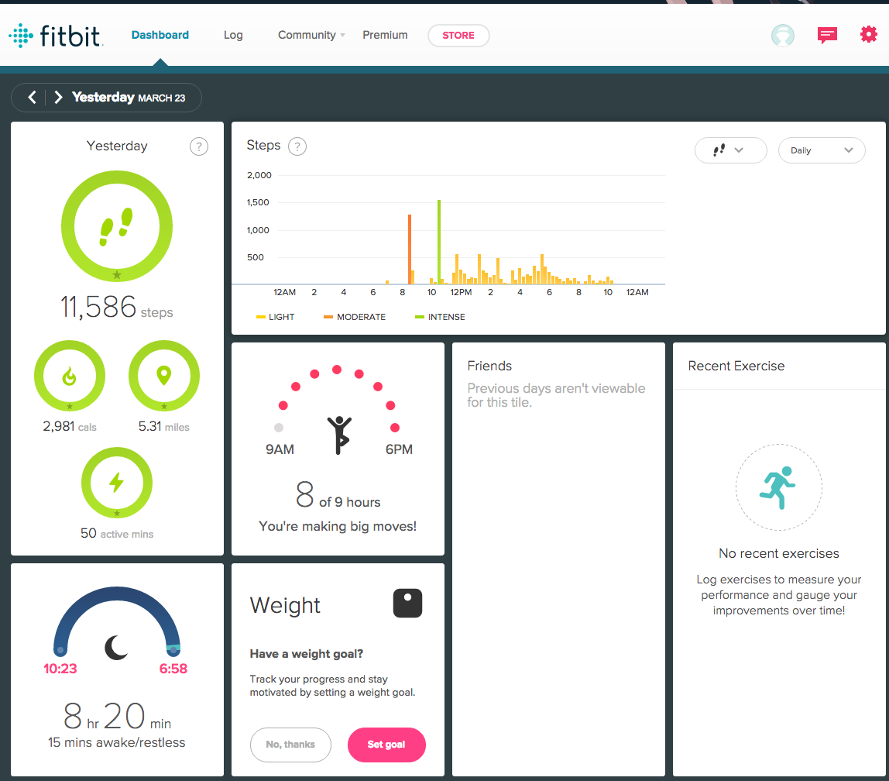

Day 1 - Basic principles of data visualization
================
March 27, 2017

-   [Objectives](#objectives)
-   [Introduction to the course](#introduction-to-the-course)
    -   [Me (Dr. Benjamin Soltoff)](#me-dr.-benjamin-soltoff)
    -   [Course website](#course-website)
    -   [Enrollment in the course](#enrollment-in-the-course)
    -   [Course objectives](#course-objectives)
-   [Purpose of visualizations](#purpose-of-visualizations)
    -   [Information visualization](#information-visualization)
        -   [Examples](#examples)
    -   [Statistical graphics](#statistical-graphics)
        -   [Examples](#examples-1)
    -   [Other types of visualizations](#other-types-of-visualizations)
        -   [Information dashboards](#information-dashboards)
        -   [Infographics](#infographics)
        -   [Informative art](#informative-art)
-   [What makes a good visualization](#what-makes-a-good-visualization)
    -   [Dr. John Snow and cholera outbreak in London](#dr.-john-snow-and-cholera-outbreak-in-london)
    -   [Minard's map of Napoleon's march on Russia](#minards-map-of-napoleons-march-on-russia)
    -   [NYTimes weather summaries](#nytimes-weather-summaries)
-   [Basic data structures](#basic-data-structures)
    -   [Data types](#data-types)
    -   [Dataset types](#dataset-types)
        -   [Tables](#tables)
        -   [Networks](#networks)
        -   [Fields](#fields)
        -   [Geometry](#geometry)
    -   [Attribute types](#attribute-types)
    -   [Semantics](#semantics)

Objectives
==========

-   Introduce myself
-   Identify major course objectives
-   Identify course logistics
-   Review the purpose of data visualizations
-   Examine several historic visualizations for their strengths and weaknesses
-   Define data structures

Introduction to the course
==========================

Me (Dr. Benjamin Soltoff)
-------------------------

-   [My website](https://www.bensoltoff.com)
-   My background
-   My research interests

Course website
--------------

Go to <https://github.com/uc-cfss/dataviz> for the course site. This contains the course objectives, required readings, schedules, slides, etc.

Enrollment in the course
------------------------

Enrollment in the course is relatively small (10ish students at last count). The nice thing about having a small class is that I can tailor it to better meet your interests. The first six weeks or so of the course are pretty much set, however in the second half of the course we can customize it more to fit your interests and needs. For that reason, I'd like each of you to [go to this issue on the course repo](https://github.com/uc-cfss/dataviz/issues/3) and share your thoughts on what you'd like to learn more about in the second half of the term. I have a tentative schedule to which we certainly can stick, but I am open to modifications if there are topics of interest to a substantial portion of the class.

Course objectives
-----------------

-   Understand how the human mind perceives and interprets visual data
-   Distinguish different types of visualizations and identify appropriate use cases
-   Evaluate visualizations' interpretability based on experimental design
-   Apply data visualization methods using a reproducible workflow

Purpose of visualizations
=========================

A **visualization** is "any kind of visual representation of information designed to enable communication, analysis, discovery, exploration, etc."[1] However what you seek to communicate can vary widely depending on your goals, and therefore effects the type of visualization you should design.

Information visualization
-------------------------

With **information visualization**, the goal is to visually depict abstract data that has no inherent physical form, as opposed to **scientific visualization** whereby the data itself are objects (in 1D, 2D, or 3D space). This data can be numerical (continuous or discrete), categorical, temporal, geospatial, text, etc. The purpose is to convey abstract data accurately, reveal the underlying structure in the data, and (potentially) encourage exploration of the data via an interactive element. Importantly, the visualization should also be aesthetically pleasing.

##### Examples

-   [Baby Names Popularity - NameVoyager](http://www.babynamewizard.com/voyager#prefix=&sw=both&exact=false)
-   [The Ebb and Flow of Movies: Box Office Receipts 1986 — 2008](http://www.nytimes.com/interactive/2008/02/23/movies/20080223_REVENUE_GRAPHIC.html?_r=0)
-   [Check your US tax rate for 2012—and every year since 1913](https://qz.com/37639/check-your-us-tax-rate-for-2012-and-every-year-since-1913/)

Statistical graphics
--------------------

Alternatively, **statistical graphics** seek to visualize abstract data typically of the quantitative form. The goal is to convey data accurately and reveal the underlying structure, but are generally not explorative and interactive and may not always yield an aesthetically pleasing form.

### Examples

#### Scatterplot matricies

#### Double-time bar charts

](http://dougmccune.com/blog/wp-content/uploads/2011/04/burglary1.png)

-   Each set of 24 bars show the same data. The top bars run from midnight to 11pm. The bottom bars run from noon to 11am.
-   Highlighted regions represent 6-5 (6am-5pm; 6pm-5am)
-   Colors represent (roughly) day and night (yellow for day, blue for night)
-   Enables representing trends over a 24 hour period without breaking arbitrarily at midnight

](http://dougmccune.com/blog/wp-content/uploads/2011/04/small_multiples_small.png)

-   Compare different categories of crimes using **small multiples** (aka **facets** in `ggplot2` language)

Other types of visualizations
-----------------------------

### Information dashboards

**Information dashboards** are popular in business and industry. They visualize abstract data, frequently (though not always) over time. The goal is to convey large amounts of information quickly and identify outliers and trends. The downside is that they can become extremely dense.

#### Examples

##### Student performance

](http://www.perceptualedge.com/blog/wp-content/uploads/2012/10/dashboard-competition-winner.png)

##### Fitbit

### Infographics

**Infographics** depict abstract data in an effort to be eye-catching and capture attention, and convey information quickly. Unfortunately they are frequently not accurate, do not use space efficiently, and may not encourage exploration of the data.

#### Examples

##### Sun strokes

](https://klientboost.com/wp-content/uploads/2013/05/1.jpg)

##### Changing face of America

](https://i.kinja-img.com/gawker-media/image/upload/b5icpqdsnzsdaezvnrm1.jpg)

##### Mapping paid paternity leave

](http://68.media.tumblr.com/fd2be427c6794cc8e25bc23c42da73aa/tumblr_omvcm7m9va1sgh0voo1_1280.jpg)

### Informative art

**Informative art** visualizes abstract data in an effort to make visualization ambient or a part of everyday life. The goal is to aesthetically please the audience, not to be informative.

#### Examples

-   [Debussy, Clair de lune (piano music)](https://youtu.be/LlvUepMa31o?t=8s)

What makes a good visualization
===============================

Dr. John Snow and cholera outbreak in London
--------------------------------------------

At this point in time the theory of bacteria was not widely accepted by the medical community or the public.[2] A mother washed her baby's diaper in a well in 1854 in London, sparking an outbreak of **cholera**, an intestinal disease that causes vomiting, diarrhea, and eventually death. This disease had presented itself previously in London but its cause was still unknown. Dr. John Snow lived in Soho, the suburb of London where the disease manifested in 1854, and wanted to understand how cholera spreads through a population (an early day epidemiologist). Snow recorded the location of individuals who contracted cholera, including their places of residence and employment. He used this information to draw a map of the region, recording the location of individuals who contracted the disease. They seemed to be clustered around the well pump along Broad Street. Snow used this map to deduce the source of the outbreak was the well, along the way ruling out other causes by noting individuals who lived in the area and did not contract cholera, identifying that these individuals did not drink from the well. Based on this information, the government removed the handle from the well pump so the public could not draw water from it. As a result, the cholera epidemic ended.

-   What makes this a good visualization?
-   One of the earliest examples of statistical visualizations

Minard's map of Napoleon's march on Russia
------------------------------------------

This illustration is identifed in Edward Tufte's **The Visual Display of Quantitative Information** as one of "the best statistical drawings ever created". It also demonstrates a very important rule of warfare: [never invade Russia in the winter](https://en.wikipedia.org/wiki/Russian_Winter). In 1812, Napoleon ruled most of Europe. He wanted to seize control of the British islands, but could not overcome the UK defenses. He decides to impose an embargo to weaken the nation in preparation for invasion, but Russia refused to participate. Angered at this decision, Napoleon launched an invasion of Russia with over 400,000 troops in the summer of 1812. Russia is unable to defeat Napoleon in battle, but instead waged a war of attrition. The Russian army was in near constant retreat, burning or destroying anything of value along the way to deny France usable resources. While Napoleon's army maintained the military advantage, his lack of food and the emerging European winter decimated his forces. He left France with an army of approximately 422,000 soldiers; he returned to France with just 10,000.

Charles Minard's map is a stunning achievement for his era. It incorporates data across six dimensions to tell the story of Napoleon's failure. The graph depicts:

-   Size of the army
-   Location in two-dimensions (latitude and longitude)
-   Direction of the army's movement
-   Temperature on dates during Napoleon's retreat

What makes this such an effective visualization?[3]

-   Forces visual comparisons (colored bands for advancing and retreating)
-   Shows causality (temperature chart)
-   Captures multivariate complexity
-   Integrates text and graphic into a coherent whole (perhaps the first infographic, and done well!)
-   Illustrates high quality content (based on reliable data)
-   Places comparisons adjacent to each other (all on the same page, no jumping back and forth between pages)
-   Mimimalistic in nature (avoids what we will later term "chart junk")

> Data maps were one of the first data visualizations, though it took thousands of years after the first cartographic maps before data maps came together.

NYTimes weather summaries
-------------------------

> [How Much Warmer Was Your City in 2015?](https://www.nytimes.com/interactive/2016/02/19/us/2015-year-in-weather-temperature-precipitation.html#chicago_il)

Split into pairs and assess this graphic.

-   What data is related in the visualization? What are the dimensions/variables?
-   Approximately how many data points are recorded in the visualization?
-   What makes this a good/bad visualization?
-   What story is it conveying?

Basic data structures
=====================

Before determining the type of visualization to draw, one must first consider the type of data and information to visualize.[4] First we identify major types of **data**, then identify how they can be combined to generate a **dataset**.

Data types
----------

There are five major types of data:

1.  **Attribute** - some specific property that can be measured, observed, or logged
    -   Also known as a **variable** or **dimension**

2.  **Item** - an individual entity that is discrete, such as a row in a table or a node in a network
    -   Can think of this as the **unit of analysis** - what is being measured?

3.  **Link** - a relationship between items, typically within a network
4.  **Grid** - specifies the strategy for sampling continuous data in terms of both geometric and topological relationships between cells
5.  **Position** - spatial data identifying location in two-dimensional (2D) or three-dimensional (3D) space

Dataset types
-------------

Different types of **datasets** will contain different types of **data**.

### Tables

**Tables** are the standard dataset type in social science. They resemble spreadsheets, and store data in either a **flat** or **multidimensional** table.

A **flat table** stores data in rows and columns.

-   Each row is an item
-   Each column is an attribute
-   Each cell is a value fully specified by the combination of row and column

A **multidimensional table** uses multiple keys to uniquely identify each item. For example, longitudinal data (repeated observations of items) may still be stored in a flat table but use two columns (attributes) to uniquely identify each item. Alternatively, data can be stored in a multidimensional array that preserves the multidimensional structure.

### Networks

**Networks** are used to specify relationships between two or more items.

](images/small_network.png)

-   **Item** ≡ **Node**
    -   Also known as a **vertex**
-   **Link** - relationship between nodes
    -   Also known as an **edge**
-   Nodes can have associated attributes
-   Links can also (independently) have attributes

#### Trees

](images/crt.gif)

A **tree** is a network with a hierarchical structure - each child node has only one parent node pointing to it.

### Fields

**Fields** contain attribute values associated with cells. **Cells** contain measurements or calculations from a **continuous** domain: theoretically there are an infinite number of values you could measure, so you select a discrete interval from which to sample.

](images/us_stations_urban_map.gif)

For instance, measuring climate change is serious stuff. In order to accurately measure climate change, where do you place your measurement stations?

-   Pavement artificially increases the measured temperature on the surface of the Earth, so you cannot place the station too close to paved surfaces
-   Urban regions generate more man-made heat, so stations located near urban regions should report warmer temperatures than rural regions
-   Data collection methods in developing countries could be unreliable, so should we trust those measurements?

### Geometry

**Geometry** datasets specify information about the shape of items with explicit spatial positions. These could be maps, but also include any item like points, one-dimensional lines and curves, two-dimensional surfaces or regions, or three-dimensional volumes. Aside from maps, these types of datasets frequently appear in the physical sciences, but less so in the social sciences.

Attribute types
---------------

**Attribute types** (or **variable types**) define the different types of data encoded in attributes, and will generally be important to determining how to visually depict these attributes.

Semantics
---------

**Semantics** define the real-world meaning of data. Data **type** defines its structural or mathematical interpretation. For instance, numbers are stored in R as **integer** or **doubles**. That is the data's type. However these numbers can have any number of semantic meanings. Are they days of the month? A person's age? A zip code?

A **key** attribute acts as an index that is used to look up the **value** attributes, so the key must uniquely identify each item. Sometimes a single attribute acts as the key, whereas in higher-dimensional data multiple attributes in combination form the key attributes. In the most basic table, the row number acts as the key attribute.

> Munzner defines key attributes as **independent variables**, while value attributes are **dependent variables**. I don't particularly like this definition because depending on the research question, an attribute may serve as a dependent variable or as an independent variable (in statistical terms).

[1] TA Ch 1

[2] Drawn from [John Snow and the Broad Street Pump](http://www.ph.ucla.edu/epi/snow/snowcricketarticle.html)

[3] Source: [Dataviz History: Charles Minard's Flow Map of Napoleon's Russian Campaign of 1812](https://datavizblog.com/2013/05/26/dataviz-history-charles-minards-flow-map-of-napoleons-russian-campaign-of-1812-part-5/)

[4] Munzner Ch 2
