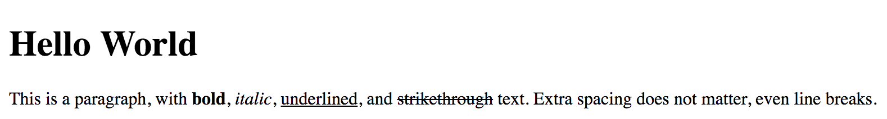

```{r setup, include = FALSE}
knitr::opts_chunk$set(cache = TRUE, warning = FALSE, message = FALSE)
```

# Objectives

* Define the major technology components of D3 graphics
* Discuss when to use D3 vs. R-based graphics
* Present examples of complex visualizations using D3
* Review code for examples of basic D3 graphs
* Identify how to integrate D3 graphics in R Markdown documents

```{r packages, cache = FALSE, message = FALSE}
library(tidyverse)
library(knitr)
library(broom)
library(stringr)
library(modelr)
library(forcats)
library(ggmap)
library(plotly)

options(digits = 3)
set.seed(1234)
theme_set(theme_minimal())
```

# Major technology components of D3 graphics

## HyperText Markup Language

HTML is used to structure content in web browsers. Every single web site you visit relies on HTML to structure the page and present content. HTML documents are stored in plain-text files ending in `.html`, and as such can be edited in a basic text editor (or conveniently, RStudio). HTML is a language for structuring and rendering web content. As such, it is a way to **annotate** information, not **generate** information. It is not a replacement for a statistical programming language like R or a general programming language like Python or Java.^[BTW, Java $\neq$ JavaScript.]

### Markup language

```html
<!DOCTYPE html>

<html>
<head>

  <meta charset="utf-8">
  <title>Hello World</title>
</head>

<body>

<h1>Hello World</h1>

<p>This is a paragraph, with <b>bold</b>, <i>italic</i>, <u>underlined</u>, and <strike>strikethrough</strike> text. Extra spacing does not matter, even

line

breaks.</p>

</body>
</html>
```



* Elements - structured items of content in an HTML page
* Tags - HTML commands used to generate elements
    * Typically used in pairs

#### Attributes

HTML elements can be assigned **attributes** by including property/value pairs in the opening tag:

```html
<tagname property="value"></tagname>
```

This is similar to R functions and assigning values to arguments.

#### Classes and IDs

These are special types of attributes that are referenced to identify specific pieces of content. These are used in conjunction with CSS and JavaScript to alter how certain elements are visualized or presented on-screen.

```html
<p>Brilliant paragraph</p>
<p>Insightful paragraph</p>
<p class="awesome">Awe-inspiring paragraph</p>
```

When rendered in a web browser, the third paragraph is distinguished from the first two and can have special formatting applied to it.

IDs are similar except elements can only be assigned one ID per element, and each ID value can be used only one on the page.

```html
<div id="content">
    <div id="visualization"></div>
    <div id="button"></div>
</div>
```

#### DOM

* **Document Object Module**
* HTML documents are hierarchically structured with elements nested inside of other elements (e.g. nested list in R)

```html
<html>
    <body>
        <h1>Breaking News</h1>
        <p></p>
    </body>
</html>
```

`body` is the parent element to both of its children, `h1` and `p` (which are siblings to each other). All elements on the page are descendants of `html`. We will use the hierarchy frequently when constructing visualizations to ensure only the proper elements receive specific styles.

### Resources

* [HTML 4 Reference](http://htmlhelp.com/reference/html40/)
* [HTML tutorials]](https://www.w3schools.com/html/default.asp)

> Note that [Markdown](https://daringfireball.net/projects/markdown/syntax) is simply a (very) stripped down version of HTML. When you render an `.Rmd` file using the `html_document` output format, the Markdown syntax is converted to HTML elements.

## Cascading Style Sheets

**Cascading style sheets** (CSS) style the visual presentation of DOM elements.

```css
body {
    background-color: white;
    color: black;
}
```

CSS styles consist of **selectors** and **properties**.

```css
selector {
    property: value;
    property: value;
    property: value;
}
```

Selectors determine on which elements to operate. This is why using classes and IDs is important in your HTML code; they will determine how to apply the CSS.

### Practice CSS selectors

[Let's play a game together!](http://flukeout.github.io)

### Properties and values

See the book to identify the different types of property/value pairs you can generate.

### Referencing styles

Either you can embed the CSS rules in the head of your HTML document:

```html
<html>
    <head>
        <style type="text/css">

            p {
                font-size: 24px;
                font-weight: bold;
                background-color: red;
                color: white;
            }

        </style>
    </head>
    <body>
        <p>If I were to ask you, as a mere paragraph, would you say that I
        have style?</p>
    </body>
</html>
```

Or store it in an external `.css` file:

```html
<html>
    <head>
        <link rel="stylesheet" href="style.css">
    </head>
    <body>
        <p>If I were to ask you, as a mere paragraph, would you say that
        I have style?</p>
    </body>
</html>
```

### Inheritance

Many style properties are **inherited** by an element's descendants unless otherwise specified.

```html
<html>
    <head>
        <title></title>
        <style type="text/css">

            div {
                background-color: red;
                font-size: 24px;
                font-weight: bold;
                color: white;
            }

        </style>
    </head>
    <body>
        <p>I am a sibling to the div.</p>
        <div>
            <p>I am a descendant and child of the div.</p>
        </div>
    </body>
</html>
```


### Resources

* [CSS reference](http://htmlhelp.com/reference/css/)
* [CSS tutorials](https://www.w3schools.com/css/default.asp)

## JavaScript

**JavaScript** is an interpreted-scripting language that manipulates the DOM after a page is loaded into the browser. This enables dynamic content and interactivity, however all the work is done on the client-side (i.e. an individual's computer). Recall when I introduced Shiny that I said it was a server-side application. What I mean is that most of the heavy-lifting is done on the web server. JavaScript is used to update the content of the page in the web browser with updated graphs/tables/text/etc. However all of the computational work was performed on the server. In pure JavaScript web pages, all of the dynamic rendering is performed within the web browser. If your JavaScript code is inefficient or requires a lot of computing to render, it may slow down or crash the reader's web browser.

### Data types

#### Variables

Variables store data. This could be a single number:

```javascript
var number = 5;
```

Or a string:

```javascript
defaultColor = "hot pink";
```

Or Boolean values:

```javascript
var thisIsALogicalValue = true;
```

### Arrays

An **array** is similar to a vector in R. It stores multiple values and is defined by square brackets `[]`:

```javascript
var numbers = [ 5, 10, 15, 20, 25 ];
```

You retrieve individual elements using bracket notation:

```javascript
numbers[2] // returns 15
```

> Unlike R (and like Python), the first position in an array starts with zero, not 1.

Arrays can contain any type of data. You can also mix data types in an array:

```javascript
var mishmash = [ 1, 2, 3, 4.5, 5.6, "oh boy", "say it isn't", true ];
```

### Objects

Objects are a custom data structure in JavaScript and are used to store complex data. JavaScript does not make use of tabular data or spreadsheets, so you will see when importing these data files to generate visualizations you end up converting them into arrays. Data items are stored in objects using **properties** and **values**:

```javascript
var fruit = {
    kind: "grape",
    color: "red",
    quantity: 12,
    tasty: true
};
```

To obtain individual elements from the object, we use **dot notation**:

```javascript
fruit.kind      //Returns "grape"
fruit.color     //Returns "red"
fruit.quantity  //Returns 12
fruit.tasty     //Returns true
```

### Objects and arrays

Objects and arrays can be combined to form any data structure you wish:

```javascript
var fruits = [
    {
        kind: "grape",
        color: "red",
        quantity: 12,
        tasty: true
    },
    {
        kind: "kiwi",
        color: "brown",
        quantity: 98,
        tasty: true
    },
    {
        kind: "banana",
        color: "yellow",
        quantity: 0,
        tasty: true
    }
];
```

```javascript
fruits[0].kind      ==  "grape"
fruits[0].color     ==  "red"
fruits[0].quantity  ==  12
fruits[0].tasty     ==  true

fruits[1].kind      ==  "kiwi"
fruits[1].color     ==  "brown"
fruits[1].quantity  ==  98
fruits[1].tasty     ==  true

fruits[2].kind      ==  "banana"
fruits[2].color     ==  "yellow"
fruits[2].quantity  ==  0
fruits[2].tasty     ==  true
```

### Operators and control structures

You can perform math:

```javascript
+   //Add
-   //Subtract
*   //Multiply
/   //Divide
```

Make comparisons:

```javascript
==  //Equal to
!=  //Not equal to
<   //Less than
>   //Greater than
<=  //Less than or equal to
>=  //Greater than or equal to
```

And use control structures like `if` statements and `for` loops:

```javascript
if (test) {
    //Code to run if true
}

for (initialization; test; update) {
    //Code to run each time through the loop
}
```

### Functions

Yes, you can write functions in JavaScript.

```javascript
var calculateGratuity = function(bill) {
    return bill * 0.2;
};
```

This declares a new variable named `calculateGratuity`. Then, instead of assigning a simple number or string, we store an entire function in the variable. In the parentheses, we name `bill`, another variable to be used only by the function itself. `bill` is the expected input. When called, the function will take that input, multiply it by 0.2, and return the result as its output.

### Resources

* [JavaScript tutorials](https://www.w3schools.com/js/default.asp)
* [Code Academy](https://www.codecademy.com/learn/javascript)

## Scalable Vector Graphics

D3 uses SVG to generate and manipulate visualizations.

<svg width="50" height="50">
<circle cx="25" cy="25" r="22" fill="blue" stroke="gray" stroke-width="2"/>
</svg>

```svg
<svg width="50" height="50">
    <circle cx="25" cy="25" r="22" fill="blue" stroke="gray" stroke-width="2"/>
</svg>
```

SVG is a text-based format for drawing images. The SVG image is generated using markup code and rendered within any HTML document.

<svg width="220" height="220">
<rect x="10" y="10" width="200" height="200" stroke="black" stroke-width="2" fill="#A9DC3A" opacity="0.5"/>
<circle cx="110" cy="110" r="100" stroke="black" stroke-width="2" fill="#2FCAD8" opacity="0.5"/>
</svg>

```svg
<svg width="220" height="220">
<rect x="10" y="10" width="200" height="200" stroke="black" stroke-width="2" fill="#A9DC3A" opacity="0.5"/>
<circle cx="110" cy="110" r="100" stroke="black" stroke-width="2" fill="#2FCAD8" opacity="0.5"/>
</svg>
```

## D3

D3 (Data-Driven Documents) is a JavaScript library for creating data visualizations. You provide the data, and the documents are HTML or web-based documents built on HTML, CSS, and SVG. The basic process is:

* Load data into the browser's memory
* Bind data to elements within the document, creating new elements as needed
* Transforming those elements by interpreting each element's bound datum and setting its visual properties accordingly
* Transitioning elements between states in response to user input

### When not to use D3

D3 is a powerful visualization library.


But D3 doesn't do **exploratory** graphics well. It is not a quick and simple tool for generating lots of visualizations of data in rapid succession. `ggplot2` and R are still the best way to go at first (and frequently are sufficient for your graphing needs). 

# Basic chart types

## Bar chart

### First iteration

```javascript
<script type="text/javascript">
	//Width and height
	var w = 500;
	var h = 100;
			
	var dataset = [ 5, 10, 13, 19, 21, 25, 22, 18, 15, 13,
							11, 12, 15, 20, 18, 17, 16, 18, 23, 25 ];
			
	//Create SVG element
	var svg = d3.select("body")
				.append("svg")
				.attr("width", w)
				.attr("height", h);
				
	svg.selectAll("rect")
			.data(dataset)
			.enter()
			.append("rect")
			.attr("x", 0)
			.attr("y", 0)
			.attr("width", 20)
			.attr("height", 100);
			
</script>
```

* [Result](https://htmlpreview.github.io/?https://github.com/alignedleft/d3-book/blob/master/chapter_06/13_making_a_bar_chart_rects.html)

Major elements:

* `w` and `h` - define the width and height of the bar chart
* `dataset` - defines the data to be plotted. Here it is defined as the height of each bar
* `svg` - creates an empty SVG element and adds it to the DOM
* `svg.selectAll("rect")` - selects all the `rect`s in `svg` (which are not there yet, but we will put there)
    * `.data(dataset)` - retrieves the values from `dataset`
    * `.enter()` - creates placeholders for each of the values in `dataset`
    * `.append("rect")` - creates a rectangle for each value in `dataset`
    * `.attr()` - defines the attributes for each rectangle. In D3, rectangles are defined by four attributes: `x`, `y`, `width`, and `height`
    
The problem as you can see above is that each rectangle is drawn on top of one another. Instead, we need to spread them out across the (invisible) x-axis and rescale their widths so that they expand or contract to take up the appropriate amount of space on the axis depending on the number of bars.

### Shift the bars on the x-axis

```javascript
var barPadding = 1;  // <-- New!

.attr("x", function(d, i) {
    return i * (w / dataset.length);
})

.attr("width", w / dataset.length - barPadding)
```

* [Result](https://htmlpreview.github.io/?https://github.com/alignedleft/d3-book/blob/master/chapter_06/15_making_a_bar_chart_even.html)

Okay, but now we also need to fix the height of each bar to the appropriate values:

### Fix the height of each bar

```javascript
<script type="text/javascript">
	//Width and height
	var w = 500;
	var h = 100;
	var barPadding = 1;
			
	var dataset = [ 5, 10, 13, 19, 21, 25, 22, 18, 15, 13,
					11, 12, 15, 20, 18, 17, 16, 18, 23, 25 ];
			
	//Create SVG element
	var svg = d3.select("body")
				.append("svg")
				.attr("width", w)
				.attr("height", h);
				
	svg.selectAll("rect")
	   .data(dataset)
			.enter()
			.append("rect")
			.attr("x", function(d, i) {
					return i * (w / dataset.length);
			})
			.attr("y", function(d) {
					return h - (d * 4);
			})
			.attr("width", w / dataset.length - barPadding)
			.attr("height", function(d) {
					return d * 4;
			});
			
</script>
```

* [Result](https://htmlpreview.github.io/?https://github.com/alignedleft/d3-book/blob/master/chapter_06/17_making_a_bar_chart_heights.html)

The differences here are:

* SVG draws rectangles starting from the top-left corner. So if we want the bar chart to look normal and draw bars extending from the bottom (origin), we need to start the `y` attribute from `h - (d * 4)` - that is, start drawing it `(d * 4)` pixels down from the height `h` of the graph. Then the `height` of the bar is just the data value itself
* Here the data value is scaled times 4 to draw a bigger graph (it draws the data values in absolute pixels, not relative percentage of the graph height)

### Add color

To change the color of the graph, add a `fill` attribute (like a `fill` aesthetic in `ggplot2`):

```javascript
.attr("fill", "teal");
```

* [Result](https://htmlpreview.github.io/?https://github.com/alignedleft/d3-book/blob/master/chapter_06/18_making_a_bar_chart_teal.html)

To change the color of the bars based on the data values, write another function based on the data values that adjusts the `fill` attribute for each value in `dataset`:

```javascript
.attr("fill", function(d) {
    return "rgb(0, 0, " + (d * 10) + ")";
});
```

* [Result](https://htmlpreview.github.io/?https://github.com/alignedleft/d3-book/blob/master/chapter_06/19_making_a_bar_chart_blues.html)

### Adding text

Say you want to label the height of each bar with the data value. We can add a `text` element to the existing SVG element:

```javascript
	svg.selectAll("text")
			.data(dataset)
			.enter()
			.append("text")
			.text(function(d) {   \\print the text value
				 return d;
			})
			.attr("x", function(d, i) {     \\ center the label in the middle of each bar
			   return i * (w / dataset.length) + 5;
			})
			.attr("y", function(d) {    \\ draw the text inside the top of the bar
			   return h - (d * 4) + 15;
			})
			.attr("font-family", "sans-serif")
			.attr("font-size", "11px")
			.attr("fill", "white");
```

* [Result](https://htmlpreview.github.io/?https://github.com/alignedleft/d3-book/blob/master/chapter_06/20_making_a_bar_chart_labels.html)

* `svg.selectAll("text")` - add a text element to the existing `svg` element
* All other attributes are customized to this graph to make the text legible

The same basic graph drawn in `ggplot2`:

```{r bar-chart}
dataset <- data_frame(y = c(5, 10, 13, 19, 21, 25, 22, 18, 15, 13,
							11, 12, 15, 20, 18, 17, 16, 18, 23, 25)) %>%
  mutate(x = row_number())

# quick and dirty
ggplot(dataset, aes(x, y, fill = y)) +
  geom_col() +
  geom_text(aes(label = y), color = "white", nudge_y = -1)

# more exact
ggplot(dataset, aes(x, y, fill = y)) +
  geom_col() +
  geom_text(aes(label = y), color = "white", nudge_y = -1) +
  theme_void() +
  theme(legend.position = "none")
```

Notice it is much faster to build this graph and requires far fewer lines of code compared to D3. Again, this exemplifies why D3 is best for the final presentation of data, rather than initial exploration. Especially for something as simple as a basic bar chart, I'd rather go with `ggplot2`. That said, understanding these basics allows you to build more complex visualizations using D3.

## Scatterplot

```javascript
<script type="text/javascript">
	//Width and height
	var w = 500;
	var h = 100;
			
	var dataset = [
					[5, 20], [480, 90], [250, 50], [100, 33], [330, 95],
					[410, 12], [475, 44], [25, 67], [85, 21], [220, 88]
					];
	
	//Create SVG element
	var svg = d3.select("body")
				.append("svg")
				.attr("width", w)
				.attr("height", h);
				
	svg.selectAll("circle")
	   .data(dataset)
	   .enter()
			.append("circle")
			.attr("cx", function(d) {
					return d[0];
			})
			.attr("cy", function(d) {
					return d[1];
			})
			.attr("r", 5);
			
</script>
```

* [Result](https://htmlpreview.github.io/?https://github.com/alignedleft/d3-book/blob/master/chapter_06/22_scatterplot.html)
* `w` and `h` - set the width and height of the graph
* `dataset` - set the data points. Because the data is now two-dimensional, it is stored in a nested array. Each observation is an array of length-two
* `var svg` - initialize the svg element
* `svg.selectAll("circle")` - select all the `circle` elements (which we are about to create)
    * `.append("circle")` - create circles instead of rectangles
    * `.attr("cx")` and `.attr("cy")` - identify x and y coordinates of the data points
        * `d[0]` contains the `x` coordinate
        * `d[1]` contains the `y` coordinate
    * `.attr("r", 5);` - defines the radius of the circle to be drawn

> Note that when drawing a bubble plot, you want to scale the points by area. However you have to define them in D3 by the radius. Make sure to perform the proper conversion before drawing the graph.

# Acknowledgments {.toc-ignore}

* [Murray, Scott. *Interactive data visualization for the Web*. O'Reilly Media, Inc., 2013.](http://alignedleft.com/work/d3-book)

# Session Info {.toc-ignore}

```{r cache = FALSE}
devtools::session_info()
```


