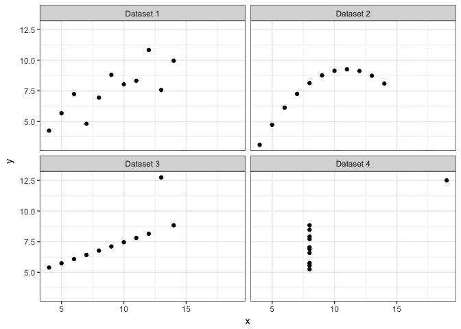

Day 2 - Principles of data visualization
================
March 29, 2017

-   [Objectives](#objectives)
-   [Basic data structures](#basic-data-structures)
    -   [Data types](#data-types)
    -   [Dataset types](#dataset-types)
        -   [Tables](#tables)
        -   [Networks](#networks)
        -   [Fields](#fields)
        -   [Geometry](#geometry)
    -   [Attribute types](#attribute-types)
    -   [Semantics](#semantics)
-   [Why visualize your data](#why-visualize-your-data)
-   [Session Info](#session-info)

``` r
library(tidyverse)
library(knitr)
library(stringr)
library(broom)

set.seed(1234)

theme_set(theme_minimal())
```

Objectives
==========

-   Define data structures
-   Identify why you should visualize your data using Anscombe's Quartet
-   Define marks and channels
-   Discuss how to identify appropriate chart types given the communication goal
-   Demonstrate different types of basic charts and identify their use case

Basic data structures
=====================

Before determining the type of visualization to draw, one must first consider the type of data and information to visualize.[1] First we identify major types of **data**, then identify how they can be combined to generate a **dataset**.

Data types
----------


There are five major types of data:

1.  **Attribute** - some specific property that can be measured, observed, or logged
    -   Also known as a **variable** or **dimension**

2.  **Item** - an individual entity that is discrete, such as a row in a table or a node in a network
    -   Can think of this as the **unit of analysis** - what is being measured?

3.  **Link** - a relationship between items, typically within a network
4.  **Grid** - specifies the strategy for sampling continuous data in terms of both geometric and topological relationships between cells
5.  **Position** - spatial data identifying location in two-dimensional (2D) or three-dimensional (3D) space

Dataset types
-------------

Different types of **datasets** will contain different types of **data**.


### Tables

**Tables** are the standard dataset type in social science. They resemble spreadsheets, and store data in either a **flat** or **multidimensional** table.

A **flat table** stores data in rows and columns.

-   Each row is an item
-   Each column is an attribute
-   Each cell is a value fully specified by the combination of row and column

A **multidimensional table** uses multiple keys to uniquely identify each item. For example, longitudinal data (repeated observations of items) may still be stored in a flat table but use two columns (attributes) to uniquely identify each item. Alternatively, data can be stored in a multidimensional array that preserves the multidimensional structure.

### Networks

**Networks** are used to specify relationships between two or more items.

](images/small_network.png)

-   **Item** ≡ **Node**
    -   Also known as a **vertex**
-   **Link** - relationship between nodes
    -   Also known as an **edge**
-   Nodes can have associated attributes
-   Links can also (independently) have attributes

#### Trees

](images/crt.gif)

A **tree** is a network with a hierarchical structure - each child node has only one parent node pointing to it.

### Fields

**Fields** contain attribute values associated with cells. **Cells** contain measurements or calculations from a **continuous** domain: theoretically there are an infinite number of values you could measure, so you select a discrete interval from which to sample.

](images/us_stations_urban_map.gif)

For instance, measuring climate change is serious stuff. In order to accurately measure climate change, where do you place your measurement stations?

-   Pavement artificially increases the measured temperature on the surface of the Earth, so you cannot place the station too close to paved surfaces
-   Urban regions generate more man-made heat, so stations located near urban regions should report warmer temperatures than rural regions
-   Data collection methods in developing countries could be unreliable, so should we trust those measurements?

### Geometry

**Geometry** datasets specify information about the shape of items with explicit spatial positions. These could be maps, but also include any item like points, one-dimensional lines and curves, two-dimensional surfaces or regions, or three-dimensional volumes. Aside from maps, these types of datasets frequently appear in the physical sciences, but less so in the social sciences.

Attribute types
---------------


**Attribute types** (or **variable types**) define the different types of data encoded in attributes, and will generally be important to determining how to visually depict these attributes.

Semantics
---------

**Semantics** define the real-world meaning of data. Data **type** defines its structural or mathematical interpretation. For instance, numbers are stored in R as **integer** or **doubles**. That is the data's type. However these numbers can have any number of semantic meanings. Are they days of the month? A person's age? A zip code?

A **key** attribute acts as an index that is used to look up the **value** attributes, so the key must uniquely identify each item. Sometimes a single attribute acts as the key, whereas in higher-dimensional data multiple attributes in combination form the key attributes. In the most basic table, the row number acts as the key attribute.

> Munzner defines key attributes as **independent variables**, while value attributes are **dependent variables**. I don't particularly like this definition because depending on the research question, an attribute may serve as a dependent variable or as an independent variable (in statistical terms).

Why visualize your data
=======================

Research methods classes in graduate school generally teach important skills such as probability and statistical theory, regression, analysis of variance (ANOVA), maximum likelihood estimation (MLE), etc. While these are important methods for analyzing data and assessing research questions, sometimes drawing a picture (aka **visualization**) can be more precise than conventional statistical computations.[2]

Consider the following data sets:

|    x|      y|
|----:|------:|
|   10|   8.04|
|    8|   6.95|
|   13|   7.58|
|    9|   8.81|
|   11|   8.33|
|   14|   9.96|
|    6|   7.24|
|    4|   4.26|
|   12|  10.84|
|    7|   4.82|
|    5|   5.68|

|    x|     y|
|----:|-----:|
|   10|  9.14|
|    8|  8.14|
|   13|  8.74|
|    9|  8.77|
|   11|  9.26|
|   14|  8.10|
|    6|  6.13|
|    4|  3.10|
|   12|  9.13|
|    7|  7.26|
|    5|  4.74|

|    x|      y|
|----:|------:|
|   10|   7.46|
|    8|   6.77|
|   13|  12.74|
|    9|   7.11|
|   11|   7.81|
|   14|   8.84|
|    6|   6.08|
|    4|   5.39|
|   12|   8.15|
|    7|   6.42|
|    5|   5.73|

|    x|      y|
|----:|------:|
|    8|   6.58|
|    8|   5.76|
|    8|   7.71|
|    8|   8.84|
|    8|   8.47|
|    8|   7.04|
|    8|   5.25|
|   19|  12.50|
|    8|   5.56|
|    8|   7.91|
|    8|   6.89|

What are the corresponding relationships between *X* and *Y*? Using traditional metrics, the relationships appear identical across the samples:

|  *N*|  $\\bar{X}$|  $\\bar{Y}$|  *R*<sup>2</sup>|
|----:|-----------:|-----------:|----------------:|
|   11|           9|    7.500909|        0.8164205|

|  *N*|  $\\bar{X}$|  $\\bar{Y}$|  *R*<sup>2</sup>|
|----:|-----------:|-----------:|----------------:|
|   11|           9|    7.500909|        0.8162365|

|  *N*|  $\\bar{X}$|  $\\bar{Y}$|  *R*<sup>2</sup>|
|----:|-----------:|-----------:|----------------:|
|   11|           9|         7.5|        0.8162867|

|  *N*|  $\\bar{X}$|  $\\bar{Y}$|  *R*<sup>2</sup>|
|----:|-----------:|-----------:|----------------:|
|   11|           9|    7.500909|        0.8165214|

If we estimated linear regression models for each dataset, we would obtain virtually identical coefficients (again suggesting the relationships are identical):

<table class="kable_wrapper">
<caption>
Dataset 1
</caption>
<tbody>
<tr>
<td>
| Term        |   Estimate|  Standard Error|  *T*-statistic|    p-value|
|:------------|----------:|---------------:|--------------:|----------:|
| (Intercept) |  3.0000909|       1.1247468|       2.667348|  0.0257341|
| x           |  0.5000909|       0.1179055|       4.241455|  0.0021696|

</td>
</tr>
</tbody>
</table>
<table class="kable_wrapper">
<caption>
Dataset 2
</caption>
<tbody>
<tr>
<td>
| Term        |  Estimate|  Standard Error|  *T*-statistic|    p-value|
|:------------|---------:|---------------:|--------------:|----------:|
| (Intercept) |  3.000909|       1.1253024|       2.666758|  0.0257589|
| x           |  0.500000|       0.1179637|       4.238590|  0.0021788|

</td>
</tr>
</tbody>
</table>
<table class="kable_wrapper">
<caption>
Dataset 3
</caption>
<tbody>
<tr>
<td>
| Term        |   Estimate|  Standard Error|  *T*-statistic|    p-value|
|:------------|----------:|---------------:|--------------:|----------:|
| (Intercept) |  3.0024545|       1.1244812|       2.670080|  0.0256191|
| x           |  0.4997273|       0.1178777|       4.239372|  0.0021763|

</td>
</tr>
</tbody>
</table>
<table class="kable_wrapper">
<caption>
Dataset 4
</caption>
<tbody>
<tr>
<td>
| Term        |   Estimate|  Standard Error|  *T*-statistic|    p-value|
|:------------|----------:|---------------:|--------------:|----------:|
| (Intercept) |  3.0017273|       1.1239211|       2.670763|  0.0255904|
| x           |  0.4999091|       0.1178189|       4.243028|  0.0021646|

</td>
</tr>
</tbody>
</table>
But what happens if we draw a picture?



A good picture tells the reader much more than any table or text can provide.

Session Info
============

``` r
devtools::session_info()
```

    ## Session info --------------------------------------------------------------

    ##  setting  value                       
    ##  version  R version 3.3.3 (2017-03-06)
    ##  system   x86_64, darwin13.4.0        
    ##  ui       X11                         
    ##  language (EN)                        
    ##  collate  en_US.UTF-8                 
    ##  tz       America/Chicago             
    ##  date     2017-03-28

    ## Packages ------------------------------------------------------------------

    ##  package    * version date       source        
    ##  assertthat   0.1     2013-12-06 CRAN (R 3.3.0)
    ##  backports    1.0.5   2017-01-18 CRAN (R 3.3.2)
    ##  broom      * 0.4.2   2017-02-13 CRAN (R 3.3.2)
    ##  codetools    0.2-15  2016-10-05 CRAN (R 3.3.3)
    ##  colorspace   1.3-2   2016-12-14 CRAN (R 3.3.2)
    ##  DBI          0.6     2017-03-09 CRAN (R 3.3.3)
    ##  devtools     1.12.0  2016-06-24 CRAN (R 3.3.0)
    ##  digest       0.6.12  2017-01-27 CRAN (R 3.3.2)
    ##  dplyr      * 0.5.0   2016-06-24 CRAN (R 3.3.0)
    ##  evaluate     0.10    2016-10-11 CRAN (R 3.3.0)
    ##  forcats      0.2.0   2017-01-23 CRAN (R 3.3.2)
    ##  foreign      0.8-67  2016-09-13 CRAN (R 3.3.3)
    ##  ggplot2    * 2.2.1   2016-12-30 CRAN (R 3.3.2)
    ##  gtable       0.2.0   2016-02-26 CRAN (R 3.3.0)
    ##  haven        1.0.0   2016-09-23 cran (@1.0.0) 
    ##  highr        0.6     2016-05-09 CRAN (R 3.3.0)
    ##  hms          0.3     2016-11-22 CRAN (R 3.3.2)
    ##  htmltools    0.3.5   2016-03-21 CRAN (R 3.3.0)
    ##  httr         1.2.1   2016-07-03 CRAN (R 3.3.0)
    ##  jsonlite     1.3     2017-02-28 CRAN (R 3.3.2)
    ##  knitr      * 1.15.1  2016-11-22 cran (@1.15.1)
    ##  lattice      0.20-34 2016-09-06 CRAN (R 3.3.3)
    ##  lazyeval     0.2.0   2016-06-12 CRAN (R 3.3.0)
    ##  lubridate    1.6.0   2016-09-13 CRAN (R 3.3.0)
    ##  magrittr     1.5     2014-11-22 CRAN (R 3.3.0)
    ##  memoise      1.0.0   2016-01-29 CRAN (R 3.3.0)
    ##  mnormt       1.5-5   2016-10-15 CRAN (R 3.3.0)
    ##  modelr       0.1.0   2016-08-31 CRAN (R 3.3.0)
    ##  munsell      0.4.3   2016-02-13 CRAN (R 3.3.0)
    ##  nlme         3.1-131 2017-02-06 CRAN (R 3.3.3)
    ##  plyr         1.8.4   2016-06-08 CRAN (R 3.3.0)
    ##  psych        1.6.12  2017-01-08 CRAN (R 3.3.2)
    ##  purrr      * 0.2.2   2016-06-18 CRAN (R 3.3.0)
    ##  R6           2.2.0   2016-10-05 CRAN (R 3.3.0)
    ##  Rcpp         0.12.9  2017-01-14 CRAN (R 3.3.2)
    ##  readr      * 1.0.0   2016-08-03 CRAN (R 3.3.0)
    ##  readxl       0.1.1   2016-03-28 CRAN (R 3.3.0)
    ##  reshape2     1.4.2   2016-10-22 CRAN (R 3.3.0)
    ##  rmarkdown    1.3     2016-12-21 CRAN (R 3.3.2)
    ##  rprojroot    1.2     2017-01-16 CRAN (R 3.3.2)
    ##  rvest        0.3.2   2016-06-17 CRAN (R 3.3.0)
    ##  scales       0.4.1   2016-11-09 CRAN (R 3.3.1)
    ##  stringi      1.1.2   2016-10-01 CRAN (R 3.3.0)
    ##  stringr    * 1.2.0   2017-02-18 CRAN (R 3.3.2)
    ##  tibble     * 1.2     2016-08-26 cran (@1.2)   
    ##  tidyr      * 0.6.1   2017-01-10 CRAN (R 3.3.2)
    ##  tidyverse  * 1.1.1   2017-01-27 CRAN (R 3.3.2)
    ##  withr        1.0.2   2016-06-20 CRAN (R 3.3.0)
    ##  xml2         1.1.1   2017-01-24 CRAN (R 3.3.2)
    ##  yaml         2.1.14  2016-11-12 cran (@2.1.14)

[1] Munzner Ch 2

[2] Example drawn from [*The Visual Display of Quantitative Information* by Edward Tufte](https://www.edwardtufte.com/tufte/books_vdqi)
