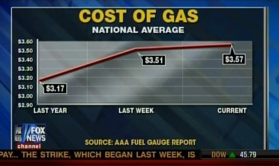
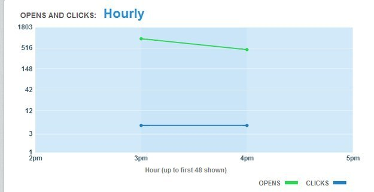
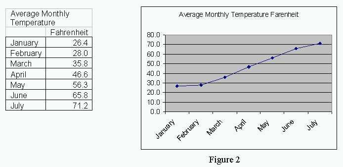
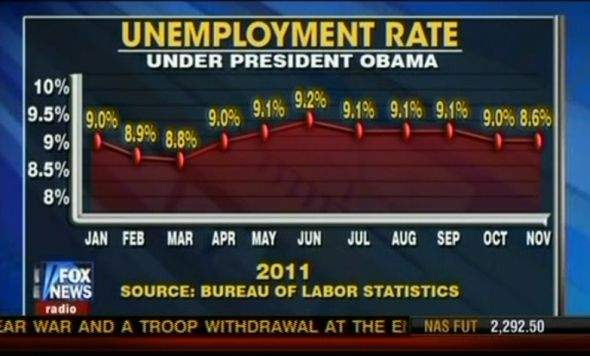
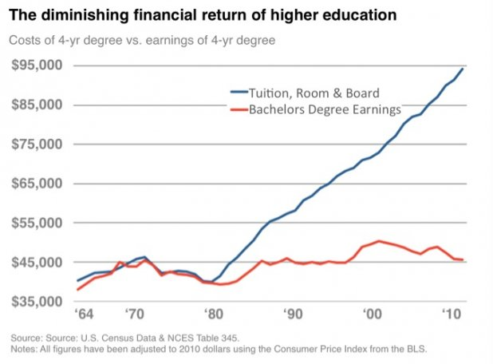
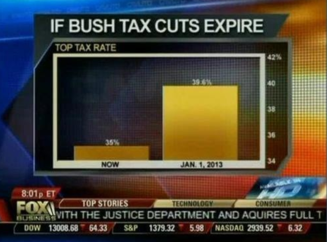
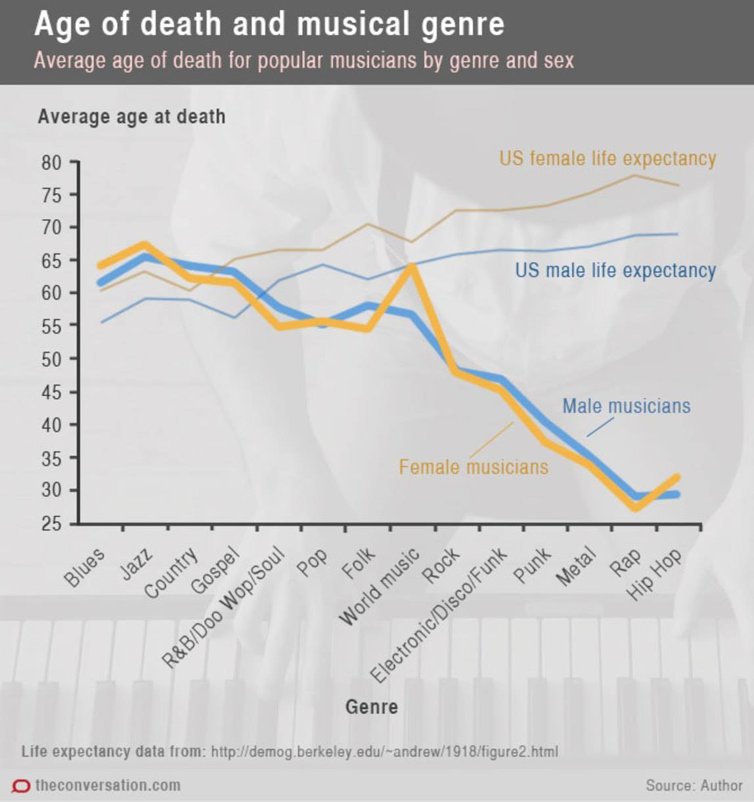
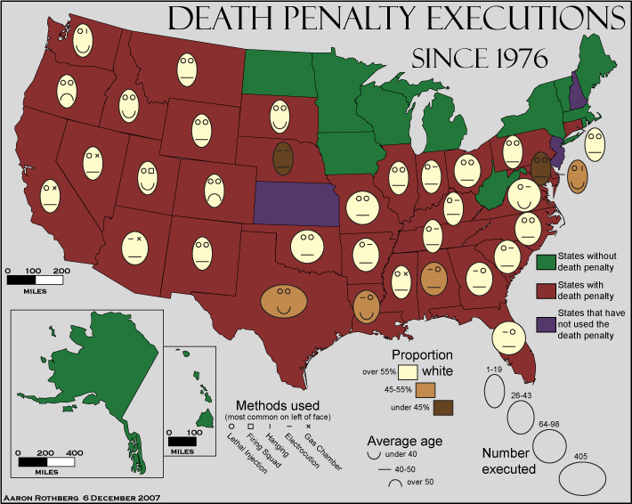
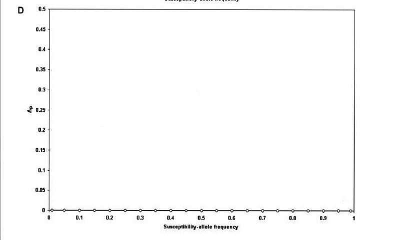

```{r setup, include = FALSE}
knitr::opts_chunk$set(echo = TRUE, cache = TRUE)
```

# Objectives

* Review Cairo's definitions of great visualizations
* Discuss the importance of truth in visualizing data
* Identify examples of untruth in visualizations
* Critique visualizations using these definitions

# What makes a great visualization

## Truthful

Probably the most important element of a great visualization, especially in academia. We are supposed to be unbiased pursuers of knowledge and/or "the truth", so how we present our research and findings should be guided by thorough and honest research. Of course this is also true in many other fields.

But as Cairo points out, truth is not absolute: it is a continuum, a spectrum. We should therefore aim as much as possible to communicate the absolute truth, even if we do not get there. Some of this will come into play as you design our visualizations, but a lot of this is determined before you ever build a graph in R or D3. This is determined by your research design, how you ask the research question, what data you obtain to test your theory/hypothesis, what methods you use to analyze the data, assessing the viability of assumptions inherent in that method as applied to the data, accurately interpreting the results, not overfitting the model, not [p-hacking](https://fivethirtyeight.com/features/science-isnt-broken/#part1) the data to find statistically significant results, etc. And perhaps now you will start to consider how you will design a visualization to communicate these findings.

### Not truthful

#### Bad axes






#### Missing/incorrect data





#### The truth, the whole truth, and nothing but the truth

<iframe width="853" height="480" src="https://www.youtube.com/embed/9FnO3igOkOk?rel=0" frameborder="0" allowfullscreen></iframe>

](images/drowning_cage.jpeg)




## Functional

* What is the purpose of your graph? This goes back to what is the story?
* Don't make it difficult for the audience to interpret, but make sure you are still being truthful.
* Depending on the audience, you may be able to use more advanced/intricate visualizations. For instance, you wouldn't use the same visualization for both an academic journal publication and a mass media article about the article.
    * This doesn't mean "dumbing it down", but instead recognizing the background and existing knowledge of the audience and communicating at their level.

### Not functional







## Beautiful

* People like aesthetically pleasing visualizations. This helps to explain the popularity of infographics, even if many of them are junk. 
* **Chart junk** - visual elements in charts and graphs that are not necessary to comprehend information represented on the graph, or distract distract the viewer from this information^[Tufte, Edward R. *The Visual Display of Quantitative Information*. (2001). Graphics Press.] We'll discuss this in far greater detail next week, but chart junk can serve as a crucial distractor in graphs and be used to mislead audiences, or at minimum confuse them.

### Beauty is in the eye of the beholder

](images/Largest-Fast-Food-Chain.jpg)




## Insightful

* Two types
    * **Spontaneous** - sudden, surprising, and unexpected
    * **Knowledge-building** - gradual and deliberate process of exploration that generates knowledge, but not necessarily any "wow" moments
* The story and audience will drive how you incorporate this
    * Academic audience - knowledge-building
    * Mass audience - spontaneous/knowledge-building
    * Incorporating interaction - more exploration, less spontaneity

### Not insightful

](images/xkcd_self_description.png)



### Insightful

* [How Nations Fare in PhDs by Sex [Interactive]](https://www.scientificamerican.com/article/how-nations-fare-in-phds-by-sex-interactive1/)
* [The Complete History Of MLB](https://projects.fivethirtyeight.com/complete-history-of-mlb/)
    * Combines elements of both insights
    * Static elements generate spontaneous insight
    * Interactive elements build knowledge

## Enlightening

* Choice of topic - is this important?
* Somewhat relative, but also somewhat absolute
* We won't always generate world-impacting visualizations, but it's a nice goal
* "Do good with data"

### Enlightenment is in the eye of the beholder

](images/xkcd_movie_narrative_charts.png)

](images/daughter_sleep.jpeg)


## Sources

* [Misleading Graphs: Real Life Examples](http://www.statisticshowto.com/misleading-graphs/)
* [13 Graphs That Are Clearly Lying](https://www.buzzfeed.com/katienotopoulos/graphs-that-lied-to-us)
* [r/dataisugly](http://www.reddit.com/r/dataisugly/)

# Visualizations to critique

* What is the story?
* Is it truthful?
* Is it functional?
* Is it beautiful?
* Is it insightful?
* Is it enlightening?

## Presidential popularity

> [Trump popularity](https://projects.fivethirtyeight.com/trump-approval-ratings/)

* Updated calculation of presidential approval rating
* Adjusts polls for quality, recency, sample size, and partisan lean (+1 truthful)
* Accounts for uncertainty
* Lists all the data
* Some interactivity to compare measures, but mostly static
* Static stories for spontaneous discovery - comparisons to other modern presidents
* Net approval vs. approve/disapprove - better to project just the difference?

## Climate change

> [Earth Temperature Timeline](https://xkcd.com/1732/)

* Tells the story of climate change - mainly to show that global warming is occurring now
* Somewhat comical influence - duh
* Uncompressed y-axis - not normally great but for this storytelling probably nice
* Includes discussion of uncertainty/limits of data (16000 BCE)
* Hockey stick inverted
* Important story to tell

## Gun violence

> [Gun Deaths in America](https://fivethirtyeight.com/features/gun-deaths/)

* Impact of gun violence in America
* Focuses exclusively internally - no comparisons to other countries (e.g. abnormality of gun violence in most other first-world countries)
* Interactive element to tell the story, but not really explorative (except at the end)
* Relatively simple graph type to communicate the information

## Citation counts in science

> [The Paper Mountain](http://www.nature.com/news/the-top-100-papers-1.16224)

* More chart junk, but still an important story - but what is it?
    * Modal number of citations is 0
    * A very few papers produce the vast majority of citations
* A few different graphs combined here
* Not very explorative - more explanation
* Do the geographic comparisons help or hinder interpretation?


## Attitudes towards same-sex marriage

> [Marriage](https://xkcd.com/1431/)

* Attempts to relate approval over time of interracial marriage to same-sex marriage - but is this a fair comparison?
* Graph makes one think so quite clearly, but could it be misleading?
* Oversimplification of the story
    * Subgroup comparisons - what segments of the population drive these attitudinal changes?
    * Are/should these types of marriages be equivalent? Is it the fair comparison?

## Making cookies

> [Cookie ingredient variants](http://flowingdata.com/2014/12/24/cookie-ingredient-variants/)


# Session Info {.toc-ignore}

```{r cache = FALSE}
devtools::session_info()
```
