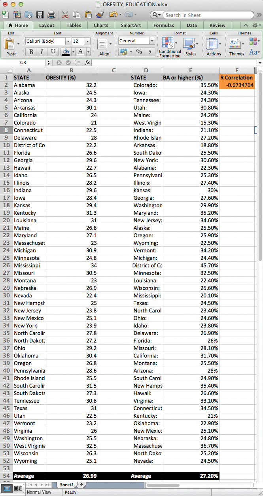
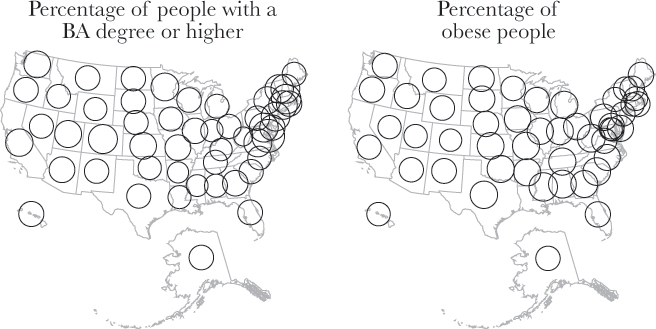
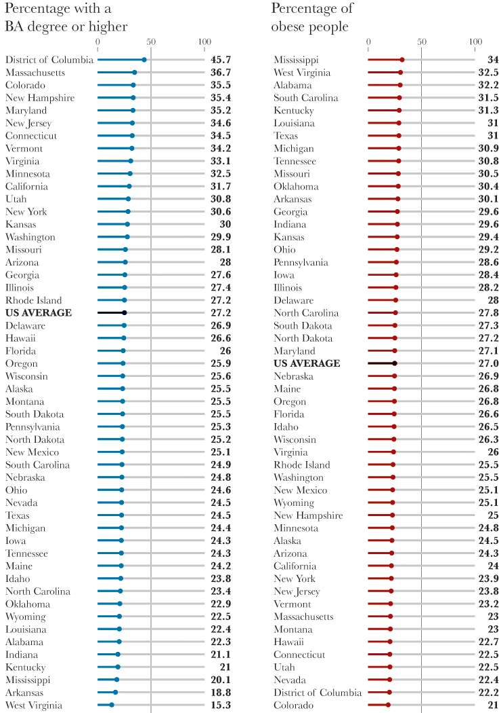
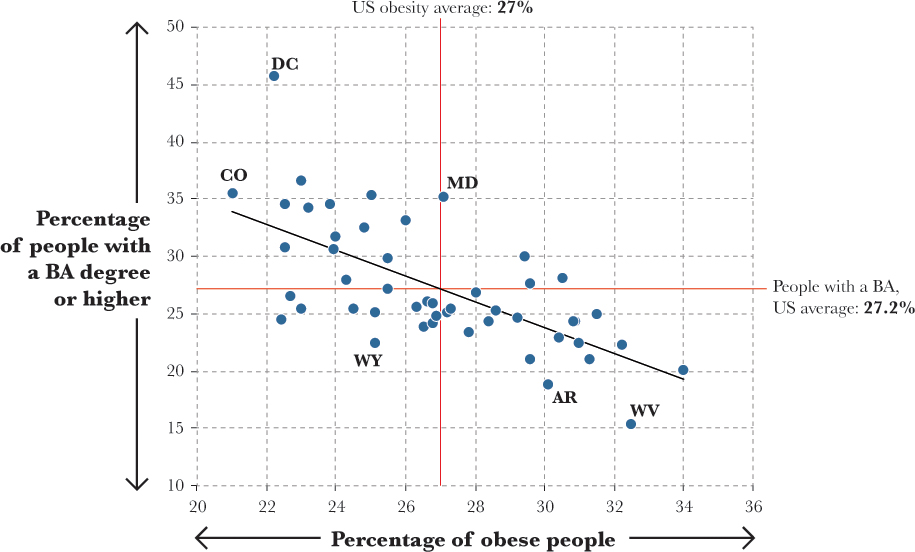

```{r setup, include = FALSE}
knitr::opts_chunk$set(cache = TRUE, echo = FALSE, message = FALSE, warning = FALSE)
```

```{r packages, cache = FALSE, message = FALSE}
library(tidyverse)
library(knitr)
library(broom)
library(stringr)
library(ggthemes)
library(lubridate)

options(digits = 3)
set.seed(1234)

base_size <- 22

theme_set(theme_minimal(base_size = base_size))
```

```{r theme_void2}
theme_void2 <- function (base_size = 11, base_family = "", base_line_size = base_size/22, 
                         base_rect_size = base_size/22) {
  half_line <- base_size/2
  theme(line = element_blank(),
        rect = element_blank(),
        text = element_text(family = base_family, 
                            face = "plain",
                            colour = "black",
                            size = base_size,
                            lineheight = 0.9,
                            hjust = 0.5,
                            vjust = 0.5,
                            angle = 0,
                            margin = margin(), debug = FALSE),
        axis.text.y = element_blank(),
        axis.title = element_blank(), 
        axis.ticks.length = unit(0, "pt"),
        legend.key.size = unit(1.2, "lines"),
        legend.position = "right",
        legend.text = element_text(size = rel(0.8)), 
        legend.title = element_text(hjust = 0),
        strip.text = element_text(size = rel(0.8)), 
        strip.switch.pad.grid = unit(0.1, "cm"),
        strip.switch.pad.wrap = unit(0.1, "cm"),
        panel.ontop = FALSE,
        panel.spacing = unit(half_line, "pt"),
        plot.margin = unit(c(0, 0, 0, 0), "lines"), 
        plot.title = element_text(size = rel(1.2), hjust = 0, 
                                  vjust = 1, margin = margin(t = half_line * 1.2)), 
        plot.subtitle = element_text(size = rel(0.9), hjust = 0, 
                                     vjust = 1, margin = margin(t = half_line * 0.9)), 
        plot.caption = element_text(size = rel(0.9), hjust = 1, 
                                    vjust = 1, margin = margin(t = half_line * 0.9)), 
        complete = TRUE)
}
```

## What makes a graph more accurate?

> A graphical form that involves elementary perceptual tasks that lead to more accurate judgments than another graphical form (with the same quantitiative information) will result in better organization and increase the chances of a correct perception of patterns and behavior.

* Alternative metrics

## {.scrollable}

[](images/fa.6.12.jpeg)

## Bar chart

```{r bar}
diamonds_sum <- diamonds %>%
  group_by(cut) %>%
  summarize(n = n()) %>%
  ungroup %>%
  mutate(pct = n / sum(n))

ggplot(diamonds_sum, aes(cut, pct)) +
  geom_col() +
  scale_y_continuous(labels = scales::percent) +
  labs(title = "Diamonds data",
       x = "Cut of diamond",
       y = "Percentage of sample")
```

## Pie chart

```{r pie}
ggplot(diamonds_sum, aes(x = factor(1), y = pct, fill = cut)) +
  geom_col(width = 1) +
  coord_polar(theta = "y", direction = -1) +
  theme_void(base_size = base_size)
```

## Statistical maps with color

```{r maps}
library(fiftystater)

data("fifty_states") # this line is optional due to lazy data loading

crimes <- data.frame(state = tolower(rownames(USArrests)), USArrests)

# map_id creates the aesthetic mapping to the state name column in your data
p <- ggplot(crimes, aes(map_id = state)) + 
  # map points to the fifty_states shape data
  geom_map(aes(fill = Assault), map = fifty_states) + 
  expand_limits(x = fifty_states$long, y = fifty_states$lat) +
  coord_map() +
  scale_x_continuous(breaks = NULL) + 
  scale_y_continuous(breaks = NULL) +
  labs(title = "Assaults per 100,000 residents in 1973",
       x = NULL,
       y = NULL) +
  theme(legend.position = "bottom", 
        panel.background = element_blank()) +
  fifty_states_inset_boxes()

# default colors
p
```

## Statistical maps with color

```{r map-bin}
library(statebins)

USArrests %>%
  rownames_to_column("State") %>%
  statebins(state_col = "State",
            value_col = "Assault") +
  labs(title = "Assaults per 100,000 residents in 1973",
       x = NULL,
       y = NULL) +
  theme_statebins()
```

## Scatterplot {.scrollable}

```{r scatter}
# generate correlated data
xy <- ecodist::corgen(len = 20, r = .95) %>%
  bind_cols
```

```{r scatter-bar}
ggplot(xy, aes(x, y)) +
  geom_point()

xy %>%
  arrange(x) %>%
  mutate(id = row_number()) %>%
  gather(var, value, -id) %>%
  ggplot(aes(id, value, fill = var)) +
  geom_col(position = "dodge")
```

## Curvature

```{r curve-diff}
polls <- read_csv("https://projects.fivethirtyeight.com/trump-approval-data/approval_polllist.csv")

polls_data <- polls %>%
  filter(subgroup == "All polls") %>%
  select(enddate, adjusted_approve, adjusted_disapprove) %>%
  mutate(date = mdy(enddate))

polls_data %>%
  gather(var, value, starts_with("adjusted")) %>%
  mutate(var = factor(var, levels = c("adjusted_approve", "adjusted_disapprove"),
                      labels = c("Approve", "Disapprove")),
         value = value / 100) %>%
  ggplot(aes(date, value, color = var)) +
  geom_smooth() +
  scale_y_continuous(label = scales::percent) +
  labs(title = "How popular/unpopular is Donald Trump?",
       x = NULL,
       y = NULL,
       color = NULL,
       caption = "Source: FiveThirtyEight") +
  theme(legend.position = "bottom")
```

## Curvature

```{r curve-single-diff}
polls_data %>%
  mutate(diff = (adjusted_approve - adjusted_disapprove) / 100) %>%
  ggplot(aes(date, diff)) +
  geom_hline(yintercept = 0) +
  geom_smooth() +
  scale_y_continuous(label = scales::percent) +
  labs(title = "How popular/unpopular is Donald Trump?",
       x = NULL,
       y = "Net approval rating",
       caption = "Source: FiveThirtyEight")
```

## Experimental design

* $N = 55$
* Experiment 1 - asked to make assessments of length and position along a common scale
* Experiment 2 - asked to make judgments of position and angle (pie vs bar chart)
* Make visual assessments of what percentage one value was of a larger value

## Picking a task {.scrollable}






[](images/fa.6.18.jpeg)



[](images/fa.6.20.jpeg)

## What we learn

* Use theory and experiments to develop rules for data visualization
* Different perceptual tasks are easier or harder to decode
* Pick the highest-level encoding task possible given the data structure/purpose of the visualization

## Amazon Mechanical Turk

[](https://www.mturk.com/mturk/welcome)

## Transparency of gridlines {.scrollable}

```{r test-alpha}
ggplot(mpg, aes(cty, hwy)) +
  geom_point()

ggplot(mpg, aes(cty, hwy)) +
  geom_point() +
  theme(panel.grid.major = element_line("grey70"),
        panel.grid.minor = element_line("grey70"))

ggplot(mpg, aes(cty, hwy)) +
  geom_point() +
  theme(panel.grid.major = element_line("grey50"),
        panel.grid.minor = element_line("grey50"))

ggplot(mpg, aes(cty, hwy)) +
  geom_point() +
  theme(panel.grid.major = element_line("grey20"),
        panel.grid.minor = element_line("grey20"))
```

## In defense of pie charts

* Which is easier to distinguish: line length or area, angle, and arc length?
* Psychophysical theory of perception:

    $$\text{Subjective area} = \text{Area}^.86$$
    
* Focus more on the subarea
* What is the point of the chart?

## In defense of pie charts {.scrollable}

```{r pie-data}
pie <- data_frame(label = c("A", "B", "C", "D"),
                  value = c(10, 20, 40, 30))

# bar chart
ggplot(pie, aes(label, value)) +
  geom_col(color = "black", fill = "white") +
  theme_void2(base_size = base_size)

# proportional area chart
pie_prop <- pie %>%
  mutate(ymin = 0,
         ymax = 1,
         xmax = cumsum(value),
         xmin = xmax - value,
         x = (xmax - xmin) / 2 + xmin)

ggplot(pie_prop, aes(xmin = xmin, xmax = xmax,
             ymin = ymin, ymax = ymax)) +
  geom_rect(fill = "white", color = "black") +
  scale_x_continuous(breaks = pie_prop$x, labels = pie_prop$label) +
  theme_void2(base_size = base_size)

# pie chart
ggplot(pie, aes(x = factor(1), y = value)) +
  geom_col(width = 1, color = "black", fill = "white") +
  geom_text(aes(label = label), position = position_stack(vjust = .5), size = 6) +
  coord_polar(theta = "y", direction = 1) +
  theme_void(base_size = base_size) +
  theme(legend.position = "none")

# table
pie %>%
  select(value) %>%
  t %>%
  knitr::kable(col.names = pie$label,
               row.names = FALSE)
```

## Takeaways

* For pure magnitude identification, bar charts are superior
* For comparing percentages, either chart is acceptable
* To compare combinations of groupings, pie charts are slightly superior
* Tables are only useful if you want to report exact percentages

# Design a data visualization experiment

* Work with someone next to you (or a group of three)
* Develop a research question applicable to visual design that can be answered experimentally
    * Replicate something from Cleveland and McGill
    * Extend to additional question
    * Tufte minimalism
* How will you design two (or more) graphs to obtain an accurate and unbiased estimate?

