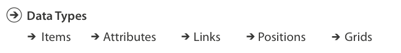
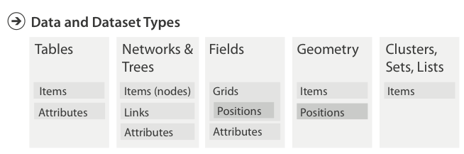
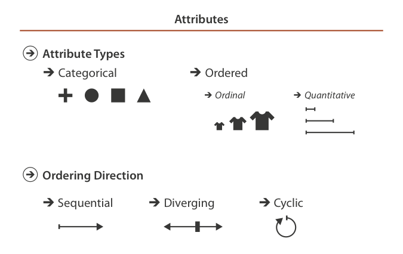

```{r setup, include = FALSE}
knitr::opts_chunk$set(echo = TRUE, cache = TRUE)
```

```{r packages, cache = FALSE, message = FALSE}
library(tidyverse)
library(knitr)
library(stringr)
library(broom)
library(forcats)
library(plotly)
library(readxl)
library(gapminder)
library(network)
library(sna)
library(GGally)
library(geomnet)
library(ggnetwork)
library(igraph)
library(lubridate)

set.seed(1234)
theme_set(theme_minimal())
```

# Objectives

* Define data structures
* Identify why you should visualize your data using Anscombe's Quartet
* Define marks and channels
* Discuss how to identify appropriate graphical forms given the communication goal
* Demonstrate different types of basic charts and identify their use case

# Basic data structures

Before determining the type of visualization to draw, one must first consider the type of data and information to visualize.^[Munzner Ch 2] First we identify major types of **data**, then identify how they can be combined to generate a **dataset**.

## Data types



There are five major types of data:

1. **Attribute** - some specific property that can be measured, observed, or logged
    * Also known as a **variable** or **dimension**
1. **Item** - an individual entity that is discrete, such as a row in a table or a node in a network
    * Can think of this as the **unit of analysis** - what is being measured?
1. **Link** - a relationship between items, typically within a network
1. **Grid** - specifies the strategy for sampling continuous data in terms of both geometric and topological relationships between cells
1. **Position** - spatial data identifying location in two-dimensional (2D) or three-dimensional (3D) space

## Dataset types

Different types of **datasets** will contain different types of **data**.




### Tables

**Tables** are the standard dataset type in social science. They resemble spreadsheets, and store data in either a **flat** or **multidimensional** table.

A **flat table** stores data in rows and columns.

* Each row is an item
* Each column is an attribute
* Each cell is a value fully specified by the combination of row and column

A **multidimensional table** uses multiple keys to uniquely identify each item. For example, longitudinal data (repeated observations of items) may still be stored in a flat table but use two columns (attributes) to uniquely identify each item. Alternatively, data can be stored in a multidimensional array that preserves the multidimensional structure.

### Networks

**Networks** are used to specify relationships between two or more items.

](images/small_network.png)

* **Item** $\equiv$ **Node**
    * Also known as a **vertex**
* **Link** - relationship between nodes
    * Also known as an **edge**
* Nodes can have associated attributes
* Links can also (independently) have attributes

#### Trees

](images/crt.gif)

A **tree** is a network with a hierarchical structure - each child node has only one parent node pointing to it.

### Fields

**Fields** contain attribute values associated with cells. **Cells** contain measurements or calculations from a **continuous** domain: theoretically there are an infinite number of values you could measure, so you select a discrete interval from which to sample.

](images/us_stations_urban_map.gif)

For instance, measuring climate change is serious stuff. In order to accurately measure climate change, where do you place your measurement stations?

* Pavement artificially increases the measured temperature on the surface of the Earth, so you cannot place the station too close to paved surfaces
* Urban regions generate more man-made heat, so stations located near urban regions should report warmer temperatures than rural regions
* Data collection methods in developing countries could be unreliable, so should we trust those measurements?

### Geometry

**Geometry** datasets specify information about the shape of items with explicit spatial positions. These could be maps, but also include any item like points, one-dimensional lines and curves, two-dimensional surfaces or regions, or three-dimensional volumes. Aside from maps, these types of datasets frequently appear in the physical sciences, but less so in the social sciences.

## Attribute types



**Attribute types** (or **variable types**) define the different types of data encoded in attributes, and will generally be important to determining how to visually depict these attributes.

## Semantics

**Semantics** define the real-world meaning of data. Data **type** defines its structural or mathematical interpretation. For instance, numbers are stored in R as **integer** or **doubles**. That is the data's type. However these numbers can have any number of semantic meanings. Are they days of the month? A person's age? A zip code?

A **key** attribute acts as an index that is used to look up the **value** attributes, so the key must uniquely identify each item. Sometimes a single attribute acts as the key, whereas in higher-dimensional data multiple attributes in combination form the key attributes. In the most basic table, the row number acts as the key attribute.

> Munzner defines key attributes as **independent variables**, while value attributes are **dependent variables**. I don't particularly like this definition because depending on the research question, an attribute may serve as a dependent variable or as an independent variable (in statistical terms).

# Why visualize your data

Research methods classes in graduate school generally teach important skills such as probability and statistical theory, regression, analysis of variance (ANOVA), maximum likelihood estimation (MLE), etc. While these are important methods for analyzing data and assessing research questions, sometimes drawing a picture (aka **visualization**) can be more precise than conventional statistical computations.^[Example drawn from [*The Visual Display of Quantitative Information* by Edward Tufte](https://www.edwardtufte.com/tufte/books_vdqi)]

Consider the following data sets:

```{r misleading, echo = FALSE}
# input data
dat1 <- tibble(x = c(10, 8, 13, 9, 11, 14, 6, 4, 12, 7, 5),
               y = c(8.04, 6.95, 7.58, 8.81, 8.33, 9.96, 7.24, 4.26, 10.84, 4.82, 5.68))
dat2 <- tibble(x = c(10, 8, 13, 9, 11, 14, 6, 4, 12, 7, 5),
               y = c(9.14, 8.14, 8.74, 8.77, 9.26, 8.10, 6.13, 3.1, 9.13, 7.26, 4.74))
dat3 <- tibble(x = c(10, 8, 13, 9, 11, 14, 6, 4, 12, 7, 5),
               y = c(7.46, 6.77, 12.74, 7.11, 7.81, 8.84, 6.08, 5.39, 8.15, 6.42, 5.73))
dat4 <- tibble(x = c(8, 8, 8, 8, 8, 8, 8, 19, 8, 8, 8),
               y = c(6.58, 5.76, 7.71, 8.84, 8.47, 7.04, 5.25, 12.5, 5.56, 7.91, 6.89))

# combine data
dat <- bind_rows(dat1, dat2, dat3, dat4, .id = "id")
```

```{r misleading_print, dependson = 'misleading', echo = FALSE, results='asis'}
dat_print <- dat %>%
  group_by(id) %>%
  nest(x, y)

for(i in seq_len(nrow(dat_print))){
  dat_print$data[[i]] %>%
    kable(caption = str_c("Dataset", i, sep = " ")) %>%
    print
}
```

What are the corresponding relationships between $X$ and $Y$? Using traditional metrics, the relationships appear identical across the samples:

```{r mislead_stats, dependson = 'misleading', echo = FALSE, results='asis'}
for(i in seq_len(nrow(dat_print))){
  dat_print$data[[i]] %>%
    summarize(n = n(),
           mean_x = mean(x),
           mean_y = mean(y),
           cor = cor(x, y)) %>%
  kable(col.names = c("$N$", "$\\bar{X}$", "$\\bar{Y}$", "$R^2$"),
        caption = str_c("Dataset", i, sep = " ")) %>%
  print
}
```

If we estimated linear regression models for each dataset, we would obtain virtually identical coefficients (again suggesting the relationships are identical):

```{r mislead_model, dependson = 'misleading', results = 'asis', echo = FALSE}
# estimate linear model
dat_model <- dat %>%
  split(.$id) %>%
  map(~ lm(y ~ x, data = .x)) %>%
  map(tidy)

for(i in seq_along(dat_model)){
  print(kable(dat_model[i],
              caption = str_c("Dataset", i, sep = " "),
              col.names = c("Term", "Estimate", "Standard Error", "$T$-statistic", "p-value")))
}
```

But what happens if we draw a picture?

```{r mislead_plot, dependson = 'misleading', echo = FALSE}
# now draw a graph
dat %>%
  mutate(id = str_c("Dataset", id, sep = " ")) %>%
  ggplot(aes(x, y)) +
  facet_wrap(~id) +
  geom_point() +
  geom_smooth(method = "lm", se = FALSE, fullrange = TRUE)
```

A good picture tells the reader much more than any table or text can provide.

# Encoding data in visualizations

Visualizations are the process of visually encoding data. There are several different models that define this process, one of which is based on **marks** and **channels**. A mark is a basic graphical element in an image, and is quite primitive.


* A zero-dimensional mark is a **point**
* A one-dimensional mark is a **line**
* A two-dimensional mark is an **area**
* A three-dimensional mark is a **volume**

Visual **channels** control the appearance of marks, independent of the dimensionality of the mark itself. However the dimensionality of the mark can in part determine the types of channels that can be used.


Channels can be added or combined to encode additional attributes (or variables) inside the graphic. In this first graph, we encode engine displacement size using data from the `mpg` dataset. There is a single continuous attribute to encode, so a histogram is an appropriate chart. In truth, we actually encode two attributes. Histograms bin data into a set number of intervals of equal size and count the frequency of items (or observations) occuring in each interval, so the graph uses a line mark with vertical spatial position channel for the quantitative variable (frequency) and a horizontal spatial position channel for the categorical attribute.

```{r mpg-1}
ggplot(mpg, aes(x = displ)) +
  geom_histogram() +
  labs(title = "mpg")
```

Now we encode a second attribute, highway mileage. Because we have two quantitative attributes to encode, a histogram is no longer an appropriate choice; instead, we encode these two attributes using a scatterplot with spatial position to distinguish items from one another. Here, we use point marks with horizontal and vertical spatial position channels.

```{r mpg-2}
ggplot(mpg, aes(x = displ, y = hwy)) +
  geom_point() +
  labs(title = "mpg")
```

We can encode a third categorical attribute (type of car, or `class`) by using a color channel to distinguish each type of car.

```{r mpg-3a}
ggplot(mpg, aes(x = displ, y = hwy, color = class)) +
  geom_point() +
  labs(title = "mpg")
```

> Alternatively, we could have used a shape channel to distinguish each category. However notice that the graph generates a warning message. What does this mean?

```{r mpg-3b}
ggplot(mpg, aes(x = displ, y = hwy, shape = class)) +
  geom_point() +
  labs(title = "mpg")
```

Finally, we can encode a fourth attribute (number of cylinders) by making use of a size channel.

```{r mpg-4}
ggplot(mpg, aes(x = displ, y = hwy, color = class, size = cyl)) +
  geom_point() +
  labs(title = "mpg")
```

The important thing to remember is that once a channel has been used to encode information, it cannot be used again in the same visualization. We can combine multiple channels together to encode additional information, but not reuse the same channel. For instance, what if I wanted to encode both car type and number of cylinders using the color channel? This would not work.

Likewise, different marks have inherent constraints on how attributes can be encoded. For instance, a line mark encodes a quantitative attribute using length in a single (usually vertical) direction. We could encode additional information by adjusting the width of the line (the horizontal direction), but not adjusting the height of the line. If we did this, then the original information would be lost.

Different channel types convey information with varying levels of accuracy and perceptivity. Later in the term we will consider in much greater detail why this occurs and how to determine optimal channels for conveying attributes in your own visualizations.

# Identifying appropriate graphical forms

Once we learn more about elementary perceptual tasks and why some channels are better than others, choosing appropriate graphical forms will become more complex as we more carefully consider the specific marks and channels used to communicate our data. Here, we will identify at a high-level some suggestions to follow when determining an appropriate graphical form and consider several basic types of charts and their appropriate use cases.

## Cairo's *Truthful Art* suggested approach

1. Think about the task or tasks you want to enable
1. Try different graphic forms
1. Arrange the components of the graphic
1. Test the outcomes

These suggestions are a bit vague, but I really like the last one: **test the outcomes**.^[TA Ch 5] Something that appears intuitive to you may not appear the same way to a different audience. Especially in the context of statistical graphics and presenting academic results, you become steeped in the data so much that you assume everyone else has lots of background knowledge about your dataset. However they do not possess this knowledge: that's why they're reading your visualization.

## What is the story?

Another of Cairo's suggestions is really useful: what is the story you want to tell?


Consider the bottom two graphs: which is the better graph? Well, it depends. If our goal is the same as Piketty's, then we want to compare Europe to the rest of the continents. The stacked area chart accomplishes this goal just fine by placing Europe on the bottom, sitting at the baseline. However if the goal is to compare all continents with one another, then this graph does not do a good job. Making comparisons with Africa and America are difficult because their baselines are dependent on Europe's GDP percentage. Instead, we'd rather all continents start at the same baseline to enable easy comparisons, which is what the non-stacked grouped line chart accomplishes. Depending on your story, you want to choose a graph/chart type that best tells that story.

# Basic charts

Your graphical form should be selected based on the purpose of your visual communication. Severino Ribecca's [Data Visualization Catalogue](http://www.datavizcatalogue.com/) groups different types of charts based on what you want to show. This could include things like:

* Comparisons
* Proportions
* Relationships
* Location
* Distribution
* Patterns

Many charts can be used to show more than one story, so there is substantial overlap. Let's examine a few of the most common graphical forms and the types of stories they communicate.

## Distribution

**Distribution** graphs visualize frequency, how data is spread out over an interval, or how data is grouped.

### Histogram

```{r infant-data}
infant <- read_csv("data/infant.csv") %>%
  # remove non-countries
  filter(is.na(`Value Footnotes`) | `Value Footnotes` != 1) %>%
  select(`Country or Area`, Year, Value) %>%
  rename(country = `Country or Area`,
         year = Year,
         mortal = Value)
```

```{r infant-hist}
ggplot(infant, aes(mortal)) +
  geom_histogram(bins = 10, boundary = 0) +
  labs(title = "Histogram of infant mortality rate for 195 nations",
       subtitle = "10 bins, origin = 0",
       x = "Infant mortality rate (per 1,000)",
       y = "Frequency")

ggplot(infant, aes(mortal)) +
  geom_histogram(bins = 10, boundary = -5) +
  labs(title = "Histogram of infant mortality rate for 195 nations",
       subtitle = "10 bins, origin = -5",
       x = "Infant mortality rate (per 1,000)",
       y = "Frequency")

ggplot(infant, aes(mortal)) +
  geom_histogram(bins = 20, boundary = -5) +
  labs(title = "Histogram of infant mortality rate for 195 nations",
       subtitle = "20 bins, origin = -5",
       x = "Infant mortality rate (per 1,000)",
       y = "Frequency")
```

A **histogram** visualizes the distribution of a continuous quantitative attribute by binning the observations into equal-width intervals and using line marks to denote the frequency of observations appearing in each bin. The sum of the height of all the bars is equal to the number of observations/items in the dataset. The shape of a histogram is determined by the **origin** (the starting point of the graph) and the **binwidth** (the width of each interval). Selecting optimal origins and binwidth is somewhat trial-and-error, though there are more complex options to try and optimize these values.

Histograms help estimate where values are concentrated, whether there are usual values (outliers), and establish the general distribution of the variable (attribute).

### Density plot

```{r infant-density}
ggplot(infant, aes(mortal)) +
  geom_density(kernel = "rectangular") +
  labs(title = "Naive density estimator of infant mortality rate for 195 nations",
       x = "Infant mortality rate (per 1,000)",
       y = "Density")

ggplot(infant, aes(mortal)) +
  geom_density(kernel = "gaussian") +
  labs(title = "Gaussian density estimator of infant mortality rate for 195 nations",
       x = "Infant mortality rate (per 1,000)",
       y = "Density")

ggplot(infant, aes(mortal)) +
  geom_density(aes(color = "Gaussian"), kernel = "gaussian") +
  geom_density(aes(color = "Epanechnikov"), kernel = "epanechnikov") +
  geom_density(aes(color = "Rectangular"), kernel = "rectangular") +
  geom_density(aes(color = "Triangular"), kernel = "triangular") +
  geom_density(aes(color = "Biweight"), kernel = "biweight") +
  labs(title = "Density estimators of infant mortality rate for 195 nations",
       x = "Infant mortality rate (per 1,000)",
       y = "Density",
       color = "Kernel") +
  theme(legend.position = c(0.96, 1),
        legend.justification = c(1, 1),
        legend.background = element_rect(fill = "white"))
```

Alternatively, **density plots** visualize the distribution of data over a continuous interval by using [kernel smoothing](http://cfss.uchicago.edu/persp010_nonparametric.html#density_estimation) to plot values. This method's advantage over histograms is that density plots are not effected by the number of bins used to draw the plot, as it is a continuous function.

### Box-and-whisker plot

```{r boxplot}
ggplot(diamonds, aes(1, carat)) +
  geom_boxplot() +
  labs(title = "Diamonds data",
       x = NULL,
       y = "Carat size") +
  theme(axis.text.x = element_blank())

ggplot(diamonds, aes(carat)) +
  geom_histogram() +
  labs(title = "Diamonds data",
       x = NULL,
       y = "Carat size")
```

A **box-and-whisker plot** (or simply a **box plot**) visualizes the distribution of a variable through its **quartiles**. The middle bar identifies the median value of the variable, and the box extends to the 25th and 75th percentiles (or lower and upper quartiles). The lower and upper extremes are defined by the interquartile range (IQR), whereby the whiskers (or lines) extend up to 1.5 x IQR. Outliers are defined as values outside of the range defined by the whiskers and are plotted using point marks.

As a standalone graph depicting the distribution of a single variable, it generally provides less information than a comparable histogram or density plot. It does provide some useful information, such as:

* The key values (median, 25th percentile, 75th percentile, etc.)
* If any outliers are present
* Is the data symmetrical
* Is the data skewed

The main benefit to a box plot is that it is much more compact than a histogram, so if we want to compare the distribution of a variable between groups, then a box plot will take up much less space.

## Comparisons

### Bar chart

```{r bar}
ggplot(diamonds, aes(cut)) +
  geom_bar() +
  labs(title = "Diamonds data",
       x = "Cut of diamond",
       y = "Frequency count")

ggplot(diamonds, aes(fct_rev(cut))) +
  geom_bar() +
  coord_flip() +
  labs(title = "Diamonds data",
       x = "Cut of diamond",
       y = "Frequency count")
```

A **bar chart** uses either vertical or horizontal bars (line marks) to show discrete, quantitative comparisons across categories. The height of the line indicates the number of items, and separate lines are drawn for each category. Bar charts are distinguished from histograms because they do not display continuous attributes over an interval, but instead visualize discrete categories.

#### Grouped bar chart

```{r bar-group}
ggplot(diamonds, aes(cut, fill = color)) +
  geom_bar(position = "dodge") +
  labs(title = "Diamonds data",
       x = "Cut of diamond",
       y = "Frequency count",
       color = "Color")
```

**Grouped** or **clustered bar charts** are a variation of a bar chart that encode information on an additional channel by drawing separate bars for categories defined by a second attribute. Color is typically used as the channel to distinguish the new categories. This chart allows comparisons between or across the newly defined groups, or to compare the mini histogram-like distributions to each other, so each bar in the group would repreent the significant intervals of the variable. The downside to this graphical form is that as the number of groups increases, the harder the bars become to read and compare.

### Box plot

```{r boxplot-group}
ggplot(diamonds, aes(cut, carat)) +
  geom_boxplot() +
  labs(title = "Diamonds data",
       x = "Cut",
       y = "Carat size")

ggplot(diamonds, aes(carat, fill = cut)) +
  geom_histogram(alpha = .5, position = "identity") +
  labs(title = "Diamonds data",
       x = "Carat size",
       y = "Frequency count",
       color = "Cut")

ggplot(diamonds, aes(carat, color = cut)) +
  geom_density() +
  labs(title = "Diamonds data",
       x = "Carat size",
       y = "Frequency count",
       color = "Cut")
```

Now the advantages of the box plot come into view. Try comparing the distribution of diamonds' carat size between the different cuts. Which is the easiest to discern any differences?

#### Violin plot

```{r violin}
ggplot(diamonds, aes(cut, carat)) +
  geom_violin() +
  labs(title = "Diamonds data",
       x = "Cut",
       y = "Carat size")

ggplot(diamonds, aes(cut, carat)) +
  geom_violin() +
  geom_boxplot(width = .1, outlier.shape = NA) +
  labs(title = "Diamonds data",
       subtitle = "With overlayed box plot",
       x = "Cut",
       y = "Carat size")
```

**Violin plots** visualize the distribution of the data and its probability density. They are essentially a cross between a box plot and a density plot. The density plot is rotated 90 degrees and mirrored to show the distributional shape of the variable. Violin plots can provide more information about the shape of the distribution of the data, but are also more noisy than a box plot. This is why you might combine the two by overlaying a boxplot on top of the violin plot (omitting the outliers).

## Relationships

### Scatterplot

```{r scatter}
ggplot(diamonds, aes(carat, price)) +
  geom_point(alpha = .2) +
  scale_y_continuous(labels = scales::dollar) +
  labs(title = "Diamonds data",
       x = "Carat size",
       y = "Price")
```

**Scatterplots** use a collection of points on the Cartesian coordinate plane to display two quantitative variables. These are good for detecting correlations and relationships between two variables.^[But remember, [correlation is not causation!](https://xkcd.com/552/)] Especially with a large number of items (observations), overlaying the plot with a best-fit or trend line is a common method to aid in analysis.

```{r scatter-best-fit}
ggplot(diamonds, aes(carat, price)) +
  geom_point(alpha = .2) +
  geom_smooth(se = FALSE) +
  scale_y_continuous(labels = scales::dollar) +
  labs(title = "Diamonds data",
       x = "Carat size",
       y = "Price")
```

### Line graph

```{r state-data}
state <- read_excel("data/state_ideo.xlsx")
```

```{r line}
state %>%
  group_by(year) %>%
  summarize(ideo = mean(citi6013, na.rm = TRUE)) %>%
  ggplot(aes(year, ideo, group = 1)) +
  geom_line() +
  labs(title = "US state-level ideology",
       x = "Year",
       y = "Citizen ideology\n(Conservative - Liberal)")
```

**Line graphs** are used to display quantitative attributes over a continuous interval or time span. First the attributes are plotted on a Cartesian coordinate plane using points, then each point is connected using a line between the points. Line charts are preferable in this context because they visually "connect the dots" and encourage the reading of trends and patterns over time. Compare this to a scatterplot or bar chart approach:

```{r line-alt}
state %>%
  group_by(year) %>%
  summarize(ideo = mean(citi6013, na.rm = TRUE)) %>%
  ggplot(aes(year, ideo, group = 1)) +
  geom_point() +
  labs(title = "US state-level ideology",
       x = "Year",
       y = "Citizen ideology\n(Conservative - Liberal)")

state %>%
  group_by(year) %>%
  summarize(ideo = mean(citi6013, na.rm = TRUE)) %>%
  ggplot(aes(year, ideo, group = 1)) +
  geom_col() +
  labs(title = "US state-level ideology",
       x = "Year",
       y = "Citizen ideology\n(Conservative - Liberal)")
```

Neither of these does as good of a job as indicating a change over time.

#### Grouped line charts

We can also make comparisons between groups by drawing separate lines on the same graph:

```{r line-group}
gapminder %>%
  group_by(year) %>%
  summarize(lifeExp = mean(lifeExp, na.rm = TRUE)) %>%
  ggplot(aes(year, lifeExp, group = 1)) +
  geom_line() +
  labs(title = "Gapminder quality of life measures",
       subtitle = "Global average",
       x = "Year",
       y = "Life expectancy (in years)")

gapminder %>%
  group_by(continent, year) %>%
  summarize(lifeExp = mean(lifeExp, na.rm = TRUE)) %>%
  ggplot(aes(year, lifeExp, color = continent)) +
  geom_line() +
  labs(title = "Gapminder quality of life measures",
       subtitle = "By continent",
       x = "Year",
       y = "Life expectancy (in years)",
       color = "Continent")

gapminder %>%
  group_by(continent, year) %>%
  summarize(lifeExp = mean(lifeExp, na.rm = TRUE)) %>%
  ggplot(aes(year, lifeExp, linetype = continent)) +
  geom_line() +
  labs(title = "Gapminder quality of life measures",
       subtitle = "By continent",
       x = "Year",
       y = "Life expectancy (in years)",
       linetype = "Continent")
```

### Network diagram

```{r network}
# make data accessible
data(blood, package = "geomnet")

# plot with ggnet2 (Figure 2a)
set.seed(12252016)
ggnet2(network::network(blood$edges[, 1:2], directed=TRUE), 
       mode = "circle", size = 15, label = TRUE, 
       arrow.size = 10, arrow.gap = 0.05, vjust = 0.5,
       node.color = "darkred", label.color = "grey80") +
  labs(title = "Blood type donation")

#make data accessible
data(football, package = 'geomnet')
rownames(football$vertices) <-
  football$vertices$label
# create network 
fb.net <- network::network(football$edges[, 1:2],
                  directed = TRUE)
# create node attribute (what conference is team in?)
fb.net %v% "conf" <-
  football$vertices[
    network.vertex.names(fb.net), "value"
    ]
# create edge attribute (between teams in same conference?)
network::set.edge.attribute(
  fb.net, "same.conf",
  football$edges$same.conf)
set.seed(5232011)
ggnet2(fb.net, mode = "fruchtermanreingold",
       color = "conf",  palette = "Paired",
       color.legend = "Conference",
       edge.color = c("color", "grey75")) +
  labs(title = "Network of Division I college football teams",
       subtitle = "2000 season")
```

**Network diagrams** (also known as **network graphs**) show how items (nodes) are connected through links.^[Above examples from [Network Visualization Examples with the `ggplot2` Package](https://cran.r-project.org/web/packages/ggCompNet/vignettes/examples-from-paper.html).] Nodes are represented as dots and links connect the nodes based on their relationships to one another. Networks can be **directed** (like the blood type example) or **undirected** (the football example). Directed graphs contain directionality between the nodes, whereas undirected graphs only show relationships. Additional information can be incorportated through different channels, such as color, node size, and link width. Network graphs are good for interpreting the structure of a network, though as the nodes and network complexity increases they become more difficult to interpret.

### Heatmap

```{r heatmap-prep}
flights <- read_csv("data/flights-departed.csv") %>%
  mutate(year = year(date),
         month = month(date, label = TRUE),
         day = day(date),
         weekday = wday(date, label = TRUE),
         week = week(date),
         yday = yday(date)) %>%
  group_by(year) %>%
  mutate(yday = yday + wday(date)[1] - 2,
         week = floor(yday / 7)) %>%
  group_by(year, month) %>%
  mutate(week_month = week - min(week) + 1)

ggplot(flights, aes(date, value)) +
  geom_line() +
  labs(title = "Domestic commercial flight activity",
       x = "Date",
       y = "Number of departing flights in the United States")
```

```{r heatmap, fig.asp = 2}
ggplot(flights, aes(weekday, week_month, fill = value)) +
  facet_grid(year ~ month) +
  geom_tile(color = "black") +
  scale_fill_continuous(low = "red", high = "green") +
  scale_x_discrete(labels = NULL) +
  scale_y_reverse(labels = NULL) +
  labs(title = "Domestic commercial flight activity",
       x = NULL,
       y = NULL,
       fill = "Number of departing flights") +
  theme_void() +
  theme(legend.position = "bottom")
```

**Heatmaps** visualize data through variations in color.^[Source for data from chart above: [U.S. Commercial Flights, 1995-2008](http://mbostock.github.io/d3/talk/20111018/calendar.html).] They can be useful for detecting patterns and variance across multiple variables. Depending on the story you wish to communicate, alternative chart types can be useful (compare the line graph to the heatmap above). Heatmaps are good at providing a general overview of the data, as opposed to identifying attributes for specific items.

## Proportions

Proportional graphs use size or area to show differences and similarities between values.

### Stacked bar chart

```{r stack-bar}
ggplot(diamonds, aes(cut, fill = color)) +
  geom_bar() +
  labs(title = "Diamonds data",
       subtitle = "Stacked bar chart",
       x = "Cut of diamond",
       y = "Frequency count",
       color = "Color")

ggplot(diamonds, aes(cut, fill = color)) +
  geom_bar(position = "fill") +
  scale_y_continuous(labels = scales::percent) +
  labs(title = "Diamonds data",
       subtitle = "Proportional bar chart",
       x = "Cut of diamond",
       y = "Frequency count",
       color = "Color")
```

**Stacked bar charts** display bars stacked on top of one another, as opposed to side by side. A plain stacked bar chart still reports the raw frequency count, whereas a proportional stacked bar chart converts the frequencies into percentages of the whole group. Comparison across groups as identified on the $X$-axis are easier under the proportional method because each set of bars sums to the same total (1 or 100%).

### Bubble chart

> [The Wealth & Health of Nations](https://bost.ocks.org/mike/nations/)

**Bubble charts** are similar to scatterplots, and add a third channel based on size to communicate another attribute.

### Proportional area chart

```{r prop-area-chart}
ggplot(diamonds, aes(cut, color)) +
  geom_count() +
  scale_size_continuous(range = c(1, 10)) +
  labs(title = "Diamonds dataset",
       x = "Cut",
       y = "Color",
       size = "Count")

ggplot(diamonds, aes(cut, color)) +
  geom_count(shape = 15) +
  scale_size_continuous(range = c(1, 10)) +
  labs(title = "Diamonds dataset",
       x = "Cut",
       y = "Color",
       size = "Count")
```

**Proportional area charts** compare values and proportions to give a quick overview of the relative sizes of the data. These charts are typically drawn with squares or circles. Comparisons are made relative to the **area** of the shape, not the width or radius.

## Part-to-a-whole

### Pie chart

```{r get-pie-data}
pie <- read_csv("age,population
<5,2704659
5-13,4499890
14-17,2159981
18-24,3853788
25-44,14106543
45-64,8819342
≥65,612463") %>%
  mutate(age = factor(age))
```

```{r pie}
plot_ly(pie, labels = ~age, values = ~population, type = 'pie', sort = FALSE) %>%
  layout(xaxis = list(showgrid = FALSE, zeroline = FALSE, showticklabels = FALSE),
         yaxis = list(showgrid = FALSE, zeroline = FALSE, showticklabels = FALSE))
```

Ahh, the lovely **pie chart**. Pie charts appear extensively in corporate and government communication, much less so in academic work. They help to show proportions and percentages between categories. Each segment of the circle is proportional to the size of the attribute, and all segments' arc lengths should sum to 100%. There are specific instances where pie charts may be useful and we will examine those use cases later in the term, but typically pie charts are avoided in academic visualizations.

### Donut chart

```{r donut}
plot_ly(pie, labels = ~age, values = ~population, sort = FALSE) %>%
  add_pie(hole = .6) %>%
  layout(xaxis = list(showgrid = FALSE, zeroline = FALSE, showticklabels = FALSE),
         yaxis = list(showgrid = FALSE, zeroline = FALSE, showticklabels = FALSE))
```

A **donut chart** is a variant on the pie chart which removes the central portion of the pie. This deemphasizes attention to the area of each segment, instead focusing on the length of the arcs.

# Session Info {.toc-ignore}

```{r cache = FALSE}
devtools::session_info()
```
