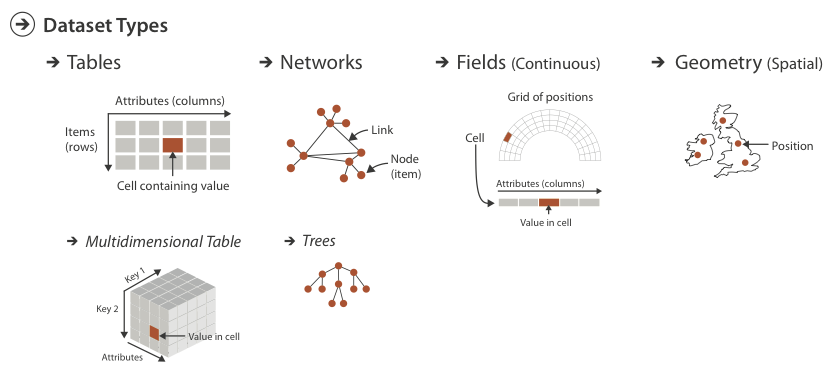
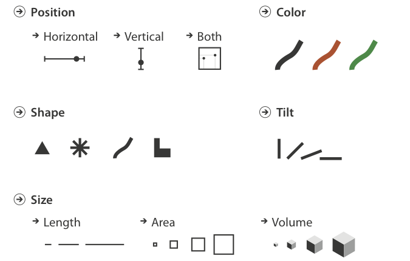
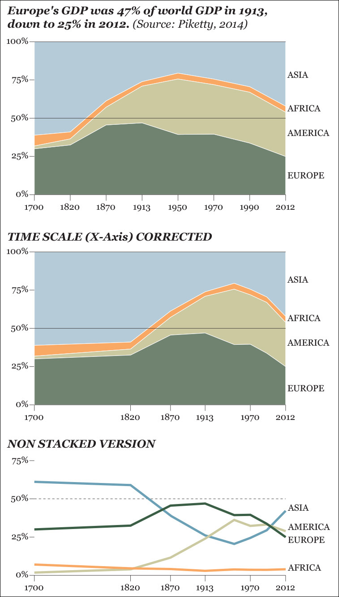

```{r setup, include = FALSE}
knitr::opts_chunk$set(cache = TRUE, echo = FALSE, message = FALSE, warning = FALSE)
```

```{r packages, cache = FALSE, message = FALSE}
library(tidyverse)
library(knitr)
library(stringr)
library(broom)
library(forcats)
library(plotly)
library(readxl)
library(gapminder)
library(network)
library(sna)
library(GGally)
library(geomnet)
library(ggnetwork)
library(igraph)
library(lubridate)

set.seed(1234)
theme_set(theme_minimal(base_size = 18))
```

## Basic data structures

* Data type
* Dataset type

## Data types


## Dataset types {.scrollable}




## Tables

* Flat table
    * Each row is an item
    * Each column is an attribute
    * Each cell is a value fully specified by the combination of row and column
* Multidimensional table

## Networks

](images/small_network.png)

## Trees

](images/crt.gif)

## Fields

](images/us_stations_urban_map.gif)

## Geometry

* Shape of items with explicit spatial positions
* 0D
* 1D
* 2D
* 3D
* Maps

## Attribute types


## Semantics

* Type vs. semantic
* Key vs. value

## Anscombe's quartet

```{r, results = 'asis'}
# input data
dat1 <- tibble(x = c(10, 8, 13, 9, 11, 14, 6, 4, 12, 7, 5),
               y = c(8.04, 6.95, 7.58, 8.81, 8.33, 9.96, 7.24, 4.26, 10.84, 4.82, 5.68))
dat2 <- tibble(x = c(10, 8, 13, 9, 11, 14, 6, 4, 12, 7, 5),
               y = c(9.14, 8.14, 8.74, 8.77, 9.26, 8.10, 6.13, 3.1, 9.13, 7.26, 4.74))
dat3 <- tibble(x = c(10, 8, 13, 9, 11, 14, 6, 4, 12, 7, 5),
               y = c(7.46, 6.77, 12.74, 7.11, 7.81, 8.84, 6.08, 5.39, 8.15, 6.42, 5.73))
dat4 <- tibble(x = c(8, 8, 8, 8, 8, 8, 8, 19, 8, 8, 8),
               y = c(6.58, 5.76, 7.71, 8.84, 8.47, 7.04, 5.25, 12.5, 5.56, 7.91, 6.89))

# combine data
dat <- bind_rows(dat1, dat2, dat3, dat4, .id = "id")

# format for printing
dat_print <- dat %>%
  group_by(id) %>%
  nest(x, y)

# get stats
for(i in seq_len(nrow(dat_print))){
  dat_print$data[[i]] %>%
    summarize(n = n(),
           mean_x = mean(x),
           mean_y = mean(y),
           cor = cor(x, y)) %>%
  kable(col.names = c("$N$", "$\\bar{X}$", "$\\bar{Y}$", "$R^2$"),
        caption = str_c("Dataset", i, sep = " ")) %>%
  print
}
```

## Anscombe's quartet

```{r, results = 'asis'}
# estimate linear model
dat_model <- dat %>%
  split(.$id) %>%
  map(~ lm(y ~ x, data = .x)) %>%
  map(tidy)

for(i in seq_along(dat_model)){
  print(kable(dat_model[i],
              caption = str_c("Dataset", i, sep = " "),
              col.names = c("Term", "Estimate", "Standard Error", "$T$-statistic", "p-value")))
}
```

## Anscombe's quartet

```{r}
dat %>%
  mutate(id = str_c("Dataset", id, sep = " ")) %>%
  ggplot(aes(x, y)) +
  facet_wrap(~id) +
  geom_point() +
  geom_smooth(method = "lm", se = FALSE, fullrange = TRUE)
```

## Marks


## Channels



----

```{r mpg-1}
ggplot(mpg, aes(x = displ)) +
  geom_histogram() +
  labs(title = "mpg")
```

----

```{r mpg-2}
ggplot(mpg, aes(x = displ, y = hwy)) +
  geom_point() +
  labs(title = "mpg")
```

----

```{r mpg-3a}
ggplot(mpg, aes(x = displ, y = hwy, color = class)) +
  geom_point() +
  labs(title = "mpg")
```

----

```{r mpg-3b}
ggplot(mpg, aes(x = displ, y = hwy, shape = class)) +
  geom_point() +
  labs(title = "mpg")
```

----

```{r mpg-4}
ggplot(mpg, aes(x = displ, y = hwy, color = class, size = cyl)) +
  geom_point() +
  labs(title = "mpg")
```

## How to pick an appropriate graph

1. Think about the task or tasks you want to enable
1. Try different graphic forms
1. Arrange the components of the graphic
1. Test the outcomes

## What is the story? {.scrollable}



## Basic charts

* What is the purpose?
* Comparisons
* Proportions
* Relationships
* Location
* Distribution
* Patterns

## Histogram {.scrollable}

```{r infant-data}
infant <- read_csv("data/infant.csv") %>%
  # remove non-countries
  filter(is.na(`Value Footnotes`) | `Value Footnotes` != 1) %>%
  select(`Country or Area`, Year, Value) %>%
  rename(country = `Country or Area`,
         year = Year,
         mortal = Value)
```

```{r infant-hist}
ggplot(infant, aes(mortal)) +
  geom_histogram(bins = 10, boundary = 0) +
  labs(title = "Histogram of infant mortality rate for 195 nations",
       subtitle = "10 bins, origin = 0",
       x = "Infant mortality rate (per 1,000)",
       y = "Frequency")

ggplot(infant, aes(mortal)) +
  geom_histogram(bins = 10, boundary = -5) +
  labs(title = "Histogram of infant mortality rate for 195 nations",
       subtitle = "10 bins, origin = -5",
       x = "Infant mortality rate (per 1,000)",
       y = "Frequency")

ggplot(infant, aes(mortal)) +
  geom_histogram(bins = 20, boundary = -5) +
  labs(title = "Histogram of infant mortality rate for 195 nations",
       subtitle = "20 bins, origin = -5",
       x = "Infant mortality rate (per 1,000)",
       y = "Frequency")
```

## Density plot {.scrollable}

```{r infant-density}
ggplot(infant, aes(mortal)) +
  geom_density(kernel = "rectangular") +
  labs(title = "Naive density estimator of infant mortality rate for 195 nations",
       x = "Infant mortality rate (per 1,000)",
       y = "Density")

ggplot(infant, aes(mortal)) +
  geom_density(kernel = "gaussian") +
  labs(title = "Gaussian density estimator of infant mortality rate for 195 nations",
       x = "Infant mortality rate (per 1,000)",
       y = "Density")

ggplot(infant, aes(mortal)) +
  geom_density(aes(color = "Gaussian"), kernel = "gaussian") +
  geom_density(aes(color = "Epanechnikov"), kernel = "epanechnikov") +
  geom_density(aes(color = "Rectangular"), kernel = "rectangular") +
  geom_density(aes(color = "Triangular"), kernel = "triangular") +
  geom_density(aes(color = "Biweight"), kernel = "biweight") +
  labs(title = "Density estimators of infant mortality rate for 195 nations",
       x = "Infant mortality rate (per 1,000)",
       y = "Density",
       color = "Kernel") +
  theme(legend.position = c(0.96, 1),
        legend.justification = c(1, 1),
        legend.background = element_rect(fill = "white"))
```

## Box-and-whisker plot

```{r boxplot}
p1 <- ggplot(diamonds, aes(1, carat)) +
  geom_boxplot() +
  labs(title = "Diamonds data",
       x = NULL,
       y = "Carat size") +
  theme(axis.text.x = element_blank())
p1
```

## Box-and-whisker plot

```{r boxplot2}
p2 <- ggplot(diamonds, aes(carat)) +
  geom_histogram() +
  labs(title = "Diamonds data",
       x = NULL,
       y = "Carat size")

gridExtra::grid.arrange(p1, p2, ncol = 2)
```

## Bar chart {.scrollable}

```{r bar}
ggplot(diamonds, aes(cut)) +
  geom_bar() +
  labs(title = "Diamonds data",
       x = "Cut of diamond",
       y = "Frequency count")

ggplot(diamonds, aes(fct_rev(cut))) +
  geom_bar() +
  coord_flip() +
  labs(title = "Diamonds data",
       x = "Cut of diamond",
       y = "Frequency count")
```

## Grouped bar chart

```{r bar-group}
ggplot(diamonds, aes(cut, fill = color)) +
  geom_bar(position = "dodge") +
  labs(title = "Diamonds data",
       x = "Cut of diamond",
       y = "Frequency count",
       color = "Color")
```

## Box plot {.scrollable}

```{r boxplot-group}
ggplot(diamonds, aes(cut, carat)) +
  geom_boxplot() +
  labs(title = "Diamonds data",
       x = "Cut",
       y = "Carat size")

ggplot(diamonds, aes(carat, fill = cut)) +
  geom_histogram(alpha = .5, position = "identity") +
  labs(title = "Diamonds data",
       x = "Carat size",
       y = "Frequency count",
       color = "Cut")

ggplot(diamonds, aes(carat, color = cut)) +
  geom_density() +
  labs(title = "Diamonds data",
       x = "Carat size",
       y = "Frequency count",
       color = "Cut")
```

## Violin plot {.scrollable}

```{r violin}
ggplot(diamonds, aes(cut, carat)) +
  geom_violin() +
  labs(title = "Diamonds data",
       x = "Cut",
       y = "Carat size")

ggplot(diamonds, aes(cut, carat)) +
  geom_violin() +
  geom_boxplot(width = .1, outlier.shape = NA) +
  labs(title = "Diamonds data",
       subtitle = "With overlayed box plot",
       x = "Cut",
       y = "Carat size")
```

## Scatterplot

```{r scatter}
ggplot(diamonds, aes(carat, price)) +
  geom_point(alpha = .2) +
  scale_y_continuous(labels = scales::dollar) +
  labs(title = "Diamonds data",
       x = "Carat size",
       y = "Price")
```

## Scatterplot

```{r scatter-best-fit}
ggplot(diamonds, aes(carat, price)) +
  geom_point(alpha = .2) +
  geom_smooth(se = FALSE) +
  scale_y_continuous(labels = scales::dollar) +
  labs(title = "Diamonds data",
       x = "Carat size",
       y = "Price")
```

## Line graph

```{r state-data}
state <- read_excel("data/state_ideo.xlsx")
```

```{r line}
state %>%
  group_by(year) %>%
  summarize(ideo = mean(citi6013, na.rm = TRUE)) %>%
  ggplot(aes(year, ideo, group = 1)) +
  geom_line() +
  labs(title = "US state-level ideology",
       x = "Year",
       y = "Citizen ideology\n(Conservative - Liberal)")
```

## Line graph {.scrollable}

```{r line-alt}
state %>%
  group_by(year) %>%
  summarize(ideo = mean(citi6013, na.rm = TRUE)) %>%
  ggplot(aes(year, ideo, group = 1)) +
  geom_point() +
  labs(title = "US state-level ideology",
       x = "Year",
       y = "Citizen ideology\n(Conservative - Liberal)")

state %>%
  group_by(year) %>%
  summarize(ideo = mean(citi6013, na.rm = TRUE)) %>%
  ggplot(aes(year, ideo, group = 1)) +
  geom_col() +
  labs(title = "US state-level ideology",
       x = "Year",
       y = "Citizen ideology\n(Conservative - Liberal)")
```

## Grouped line charts {.scrollable}

```{r line-group}
gapminder %>%
  group_by(year) %>%
  summarize(lifeExp = mean(lifeExp, na.rm = TRUE)) %>%
  ggplot(aes(year, lifeExp, group = 1)) +
  geom_line() +
  labs(title = "Gapminder quality of life measures",
       subtitle = "Global average",
       x = "Year",
       y = "Life expectancy (in years)")

gapminder %>%
  group_by(continent, year) %>%
  summarize(lifeExp = mean(lifeExp, na.rm = TRUE)) %>%
  ggplot(aes(year, lifeExp, color = continent)) +
  geom_line() +
  labs(title = "Gapminder quality of life measures",
       subtitle = "By continent",
       x = "Year",
       y = "Life expectancy (in years)",
       color = "Continent")

gapminder %>%
  group_by(continent, year) %>%
  summarize(lifeExp = mean(lifeExp, na.rm = TRUE)) %>%
  ggplot(aes(year, lifeExp, linetype = continent)) +
  geom_line() +
  labs(title = "Gapminder quality of life measures",
       subtitle = "By continent",
       x = "Year",
       y = "Life expectancy (in years)",
       linetype = "Continent")
```

## Network diagram

```{r network}
# make data accessible
data(blood, package = "geomnet")

# plot with ggnet2 (Figure 2a)
set.seed(12252016)
ggnet2(network::network(blood$edges[, 1:2], directed=TRUE), 
       mode = "circle", size = 15, label = TRUE, 
       arrow.size = 10, arrow.gap = 0.05, vjust = 0.5,
       node.color = "darkred", label.color = "grey80") +
  labs(title = "Blood type donation")
```

## Network diagram

```{r network2}
#make data accessible
data(football, package = 'geomnet')
rownames(football$vertices) <-
  football$vertices$label
# create network 
fb.net <- network::network(football$edges[, 1:2],
                  directed = TRUE)
# create node attribute (what conference is team in?)
fb.net %v% "conf" <-
  football$vertices[
    network.vertex.names(fb.net), "value"
    ]
# create edge attribute (between teams in same conference?)
network::set.edge.attribute(
  fb.net, "same.conf",
  football$edges$same.conf)
set.seed(5232011)
ggnet2(fb.net, mode = "fruchtermanreingold",
       color = "conf",  palette = "Paired",
       color.legend = "Conference",
       edge.color = c("color", "grey75")) +
  labs(title = "Network of Division I college football teams",
       subtitle = "2000 season")
```

## Heatmap

```{r heatmap-prep}
flights <- read_csv("data/flights-departed.csv") %>%
  mutate(year = year(date),
         month = month(date, label = TRUE),
         day = day(date),
         weekday = wday(date, label = TRUE),
         week = week(date),
         yday = yday(date)) %>%
  group_by(year) %>%
  mutate(yday = yday + wday(date)[1] - 2,
         week = floor(yday / 7)) %>%
  group_by(year, month) %>%
  mutate(week_month = week - min(week) + 1)

ggplot(flights, aes(date, value)) +
  geom_line() +
  labs(title = "Domestic commercial flight activity",
       x = "Date",
       y = "Number of departing flights in the United States")
```

## Heatmap {.scrollable}

```{r heatmap, fig.asp = 2}
ggplot(flights, aes(weekday, week_month, fill = value)) +
  facet_grid(year ~ month) +
  geom_tile(color = "black") +
  scale_fill_continuous(low = "red", high = "green") +
  scale_x_discrete(labels = NULL) +
  scale_y_reverse(labels = NULL) +
  labs(title = "Domestic commercial flight activity",
       x = NULL,
       y = NULL,
       fill = "Number of departing flights") +
  theme_void() +
  theme(legend.position = "bottom")
```

## Stacked bar chart {.scrollable}

```{r stack-bar}
ggplot(diamonds, aes(cut, fill = color)) +
  geom_bar() +
  labs(title = "Diamonds data",
       subtitle = "Stacked bar chart",
       x = "Cut of diamond",
       y = "Frequency count",
       color = "Color")

ggplot(diamonds, aes(cut, fill = color)) +
  geom_bar(position = "fill") +
  scale_y_continuous(labels = scales::percent) +
  labs(title = "Diamonds data",
       subtitle = "Proportional bar chart",
       x = "Cut of diamond",
       y = "Frequency count",
       color = "Color")
```

## Bubble chart

> [The Wealth & Health of Nations](https://bost.ocks.org/mike/nations/)

## Proportional area chart {.scrollable}

```{r prop-area-chart}
ggplot(diamonds, aes(cut, color)) +
  geom_count() +
  scale_size_continuous(range = c(1, 10)) +
  labs(title = "Diamonds dataset",
       x = "Cut",
       y = "Color",
       size = "Count")

ggplot(diamonds, aes(cut, color)) +
  geom_count(shape = 15) +
  scale_size_continuous(range = c(1, 10)) +
  labs(title = "Diamonds dataset",
       x = "Cut",
       y = "Color",
       size = "Count")
```

## Pie chart

```{r get-pie-data}
pie <- read_csv("age,population
<5,2704659
5-13,4499890
14-17,2159981
18-24,3853788
25-44,14106543
45-64,8819342
≥65,612463") %>%
  mutate(age = factor(age))
```

```{r pie}
plot_ly(pie, labels = ~age, values = ~population, type = 'pie', sort = FALSE) %>%
  layout(xaxis = list(showgrid = FALSE, zeroline = FALSE, showticklabels = FALSE),
         yaxis = list(showgrid = FALSE, zeroline = FALSE, showticklabels = FALSE))
```

## Donut chart

```{r donut}
plot_ly(pie, labels = ~age, values = ~population, sort = FALSE) %>%
  add_pie(hole = .6) %>%
  layout(xaxis = list(showgrid = FALSE, zeroline = FALSE, showticklabels = FALSE),
         yaxis = list(showgrid = FALSE, zeroline = FALSE, showticklabels = FALSE))
```
