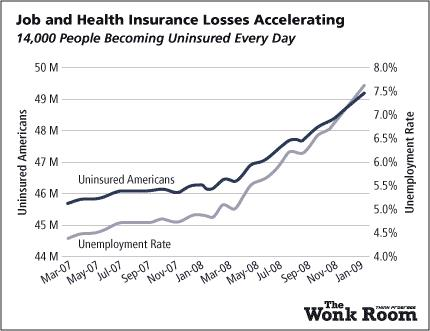

```{r setup, include = FALSE}
knitr::opts_chunk$set(cache = TRUE, echo = FALSE, message = FALSE, warning = FALSE)
```

```{r packages, cache = FALSE, message = FALSE}
library(tidyverse)
library(knitr)

set.seed(1234)
theme_set(theme_minimal(base_size = 18))
```

## Truthful

* Importance of truth
* Truth continuum
* Where is truth constructed

----


----


----



----


----


----

](images/drowning_cage.jpeg)

----


## Functional

* What is the purpose? What's the story?
* Balance between detail and readability
* Targeting different audiences/formats

----


----


----


## Beautiful

* Value of aesthetics
* Chart junk

----

](images/Largest-Fast-Food-Chain.jpg)

----


## Insightful

* Spontaneous
* Knowledge-building
* Know your audience
* Know your medium

----

](images/xkcd_self_description.png)

----


## Insightful visualizations

* [How Nations Fare in PhDs by Sex [Interactive]](https://www.scientificamerican.com/article/how-nations-fare-in-phds-by-sex-interactive1/)
* [The Complete History Of MLB](https://projects.fivethirtyeight.com/complete-history-of-mlb/)

## Enlightening

* Is this topic important?
* Somewhat relative, but also somewhat absolute
* "Do good with data"

----

](images/xkcd_movie_narrative_charts.png)

----

](images/daughter_sleep.jpeg)


## Visualization critiques

* [Trump popularity](https://projects.fivethirtyeight.com/trump-approval-ratings/)
* [Earth Temperature Timeline](https://xkcd.com/1732/)
* [Gun Deaths in America](https://fivethirtyeight.com/features/gun-deaths/)
* [The Paper Mountain](http://www.nature.com/news/the-top-100-papers-1.16224)
* [Marriage](https://xkcd.com/1431/)
* [Cookie ingredient variants](http://flowingdata.com/2014/12/24/cookie-ingredient-variants/)

