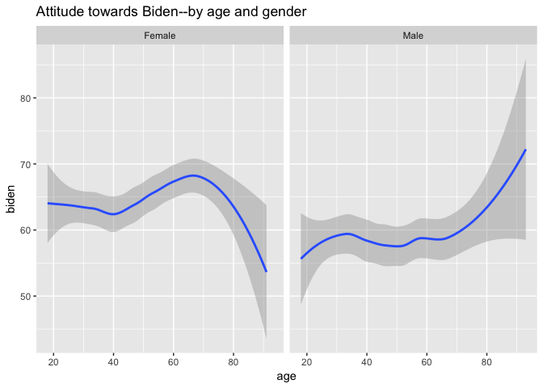

Biden
================

``` r
library(tidyverse)
```

    ## Loading tidyverse: ggplot2
    ## Loading tidyverse: tibble
    ## Loading tidyverse: tidyr
    ## Loading tidyverse: readr
    ## Loading tidyverse: purrr
    ## Loading tidyverse: dplyr

    ## Conflicts with tidy packages ----------------------------------------------

    ## filter(): dplyr, stats
    ## lag():    dplyr, stats

``` r
biden <- read_csv("~/cfss hw02/dataviz/assignments/data/biden.csv")
```

    ## Parsed with column specification:
    ## cols(
    ##   biden = col_integer(),
    ##   female = col_integer(),
    ##   age = col_integer(),
    ##   educ = col_integer(),
    ##   dem = col_integer(),
    ##   rep = col_integer()
    ## )

``` r
biden$female[biden$female == 0]<-"Male" 
biden$female[biden$female == 1]<-"Female"

ggplot(data=biden)+
  geom_smooth(mapping=aes(x=age, y=biden))+
  ggtitle("Attitude towards Biden--by age and gender")+
   facet_wrap(~ female, nrow = 1)
```

    ## `geom_smooth()` using method = 'loess'



What I want to describe in this plot is the relation between the age and gender of people with their attitude toward Joe Biden.

I think the plot is quite clear that the x-axis is the age and the y-axis is the attitude toward Biden, with two facets for male and female.

The story: for male, the older they are, the more likely they hold a more positive attitude towards Biden. Though the attitude remains basically unchanged from 40 to 70. We can sum up that older men are more likely to like Biden. However, for women, the situation differs in different intervals. For women age 20 to 40, they change through age is slight. For women age 40 to 65, the older they are, the more positive attitude they hold. But for age above 65, they dislike Biden more with the age increase. In short, older men like Biden more. The attitude towards Biden of women differs by age.

In the dataset we have, attitude towards Biden and age are continuous variables. So it is more reasonable to use smooth line to describe the relation between these two variables. However, gender is a factor with two levels. We cannot label gender in smooth lines. Therefore, I put male and female in two facets. It shows the difference among gender more clearly in this way.

I made two facets to show the difference among gender. I transformed female=0 to male and female=1 to male. This is to make the plot clearer as the gender can be told by “male” and “female” rather than “0” and “1”.

Comparing the two facets, we can see the difference among genders. Looking at each individual facet, we can see the change of attitude towards Biden through the increasing of age.
