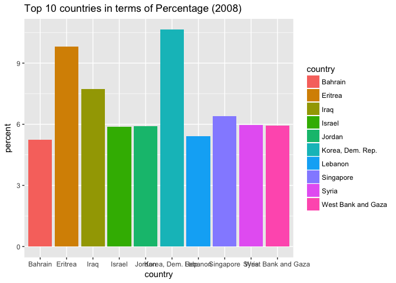
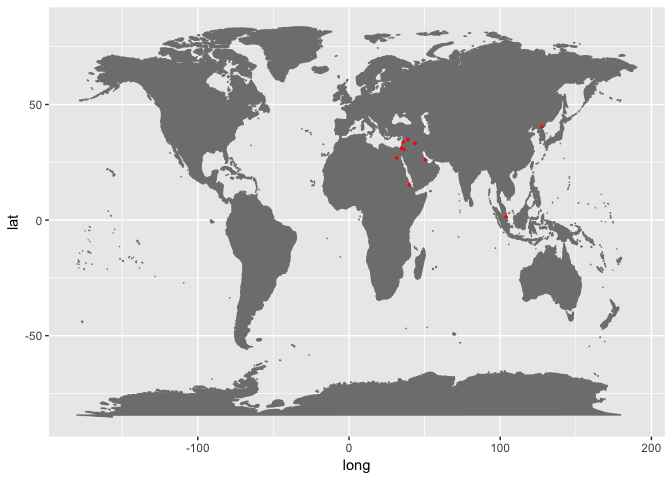
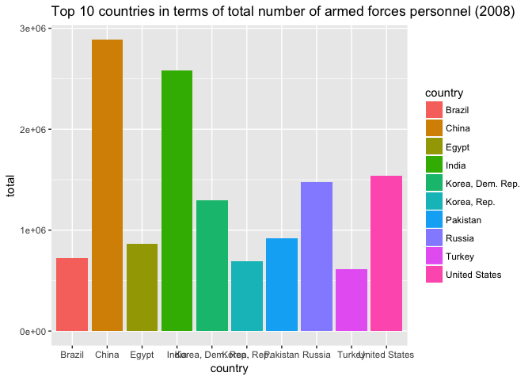
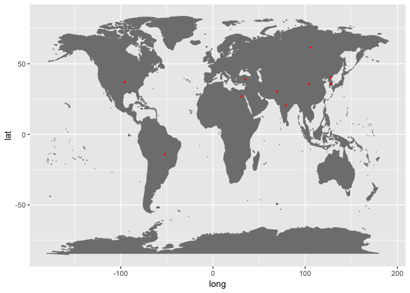
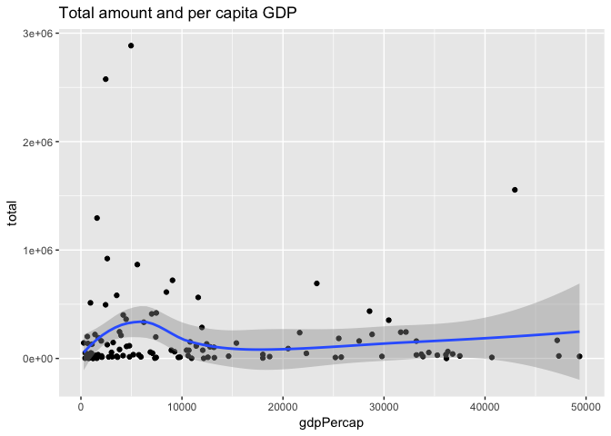
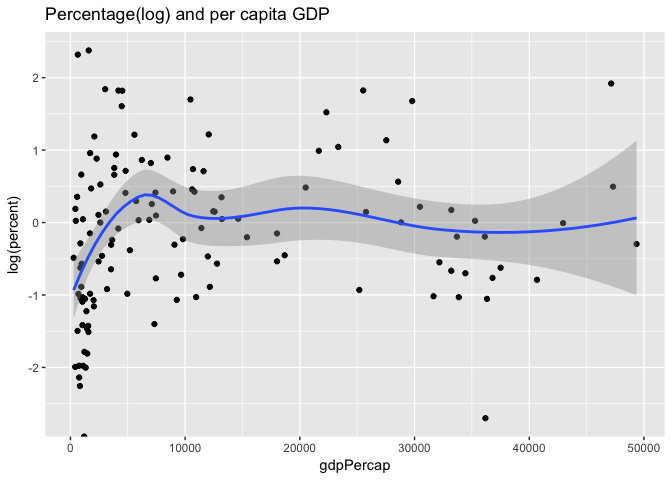

Assignment 3
================

Armed Forces Personnel
======================

This report focueses on the number of armed forces personnel all over the world.

Armed forces personnel are active duty military personnel, including paramilitary forces if the training, organization, equipment, and control suggest they may be used to support or replace regular military forces. Labor force comprises all people who meet the International Labour Organization's definition of the economically active population. Note: Data for some countries are based on partial or uncertain data or rough estimates.

Import the data
===============

I used two datasets from the website of "gapminder". The first one includes the percentage of armed forces personel of total labour force. The second one inclueds the total number of armed forces personnel.

``` r
library(rworldmap)
library(tidyverse)
library("ggmap")
library(maptools)
library(maps)
library(graphics)
library(readxl)
library(readr)
library(gapminder)

  # import file
  percent <- read_excel("indicator army_percent.xlsx")

  # rename first column to country, store indicator name for later
  inc_fullname <- names(percent)[[1]]
  names(percent)[[1]] <- "country"
  
  inc_name=NA
  # tidy data frame and add indicator name as variable
  percent <- percent %>%
    gather(year, value, -1, convert = TRUE) %>%
    mutate(value = as.numeric(value),
           variable = ifelse(!is.na(inc_name), inc_name, inc_fullname)) %>%
    select(country, year, variable, value)


  # import file
  total <- read_excel("indicator army_total.xlsx")

  # rename first column to country, store indicator name for later
  inc_fullname <- names(total)[[1]]
  names(total)[[1]] <- "country"
  
  inc_name=NA
  # tidy data frame and add indicator name as variable
  total <- total %>%
    gather(year, value, -1, convert = TRUE) %>%
    mutate(value = as.numeric(value),
           variable = ifelse(!is.na(inc_name), inc_name, inc_fullname)) %>%
    select(country, year, variable, value)


percent <- mutate(percent, percent=value) %>%
  select(-3,-4)

total <- mutate(total, total=value) %>%
  select(-3,-4)

all <- left_join(percent, total) 
all <- left_join(all, gapminder)
```

The Status quo
==============

The latest data I can get is the data of year 2008. I draw two tables below. The first one is the Top 10 in terms of Percent of labour force (2008). The second one is Top 10 in terms of Total Amount (2008).

Armed forces personnel over labour force
----------------------------------------

``` r
data2008_percent <- filter(all, year==2008) %>%
arrange(desc(percent)) %>%
  select(1:3) %>%
  as.data.frame() %>%
  head(n=10) 

knitr::kable(data2008_percent, caption="'Top 10 in terms of Percent (2008)'")
```

| country            |  year|    percent|
|:-------------------|-----:|----------:|
| Korea, Dem. Rep.   |  2008|  10.638521|
| Eritrea            |  2008|   9.820127|
| Iraq               |  2008|   7.737913|
| Singapore          |  2008|   6.394936|
| Syria              |  2008|   5.955847|
| West Bank and Gaza |  2008|   5.936085|
| Jordan             |  2008|   5.909699|
| Israel             |  2008|   5.873143|
| Lebanon            |  2008|   5.406536|
| Bahrain            |  2008|   5.231143|

``` r
ggplot(data=data2008_percent)+
  geom_bar(mapping = aes(x=country, y=percent, fill=country), stat = "identity") +
  ggtitle("Top 10 countries in terms of Percent (2008)")
```



In order to better show the top 10 countries, I draw them on a world map.

``` r
visited <- data2008_percent$country
ll.visited <- geocode(visited)
visit.x <- ll.visited$lon
visit.y <- ll.visited$lat

mp <- NULL
mapWorld <- borders("world", colour="gray50", fill="gray50") # create a layer of borders
mp <- ggplot() +   mapWorld

#Now Layer the cities on top
mp <- mp+ geom_point(aes(x=visit.x, y=visit.y) ,color="red", size=0.5) 
mp
```



Obviously, Mid-Eastern is quite an unstable area. The Arabian countries and Israel are always in tensions. So they tend to keep a largy armed force. The case is same for North Korea. North Korea is prepared a war with the South and it is developing nuclear weapons.

The outlier is Singapore. It also has a large armed force in terms of the percentage.

The total number of armed forces personnel
------------------------------------------

``` r
data2008_total <- filter(all, year==2008) %>%
arrange(desc(total)) %>%
  select(-3) %>%
  select(1:3) %>%
  as.data.frame() %>%
  head(n=10)

knitr::kable(data2008_total, caption='Top 10 in terms of Total Amount (2008)')
```

| country          |  year|    total|
|:-----------------|-----:|--------:|
| China            |  2008|  2885000|
| India            |  2008|  2582000|
| United States    |  2008|  1540000|
| Russia           |  2008|  1476000|
| Korea, Dem. Rep. |  2008|  1295000|
| Pakistan         |  2008|   921000|
| Egypt            |  2008|   866000|
| Brazil           |  2008|   721000|
| Korea, Rep.      |  2008|   692000|
| Turkey           |  2008|   613000|

``` r
data2008_pop <- filter(all, year==2008) %>%
arrange(desc(total)) %>%
  select(-3) %>%
  select(1:3) %>%
  as.data.frame() %>%
  head(n=10)

knitr::kable(data2008_pop, caption='Top 10 in terms of Total Amount (2008)')
```

| country          |  year|    total|
|:-----------------|-----:|--------:|
| China            |  2008|  2885000|
| India            |  2008|  2582000|
| United States    |  2008|  1540000|
| Russia           |  2008|  1476000|
| Korea, Dem. Rep. |  2008|  1295000|
| Pakistan         |  2008|   921000|
| Egypt            |  2008|   866000|
| Brazil           |  2008|   721000|
| Korea, Rep.      |  2008|   692000|
| Turkey           |  2008|   613000|

``` r
ggplot(data=data2008_total)+
  geom_bar(mapping = aes(x=country, y=total, fill=country), stat = "identity") +
  ggtitle("Top 10 countries in terms of total number of armed forces personnel (2008)")
```



Based on general knowledge, I doubt if there is a correlation between population and total number of armed forces. So I draw a table of top 10 countries in terms of polulation in 2007.

``` r
data2007_pop <- filter(all, year==2007) %>%
arrange(desc(pop)) %>%
  select(c(1,2,7)) %>%
  as.data.frame() %>%
  head(n=10)

knitr::kable(data2007_pop, caption='Top 10 countries in terms of Popluation (2007)')
```

| country       |  year|         pop|
|:--------------|-----:|-----------:|
| China         |  2007|  1318683096|
| India         |  2007|  1110396331|
| United States |  2007|   301139947|
| Indonesia     |  2007|   223547000|
| Brazil        |  2007|   190010647|
| Pakistan      |  2007|   169270617|
| Bangladesh    |  2007|   150448339|
| Nigeria       |  2007|   135031164|
| Japan         |  2007|   127467972|
| Mexico        |  2007|   108700891|

There are five countries listed in both the tables. So I conclude that the countries with larger population have more military personnels.

Again, I draw them on a world map.

``` r
visited <- data2008_total$country
ll.visited <- geocode(visited)
visit.x <- ll.visited$lon
visit.y <- ll.visited$lat

mp <- NULL
mapWorld <- borders("world", colour="gray50", fill="gray50") # create a layer of borders
mp <- ggplot() +   mapWorld

#Now Layer the cities on top
mp <- mp+ geom_point(aes(x=visit.x, y=visit.y) ,color="red", size=0.5) 
mp
```



In terms of total amount of armed forces personnel, the top 10 countries are scattered distributed across the world.

Correlations
============

Now, I'm trying to depict the correlations between different variables.

GDP and the Armed Force
-----------------------

Firstly, I draw the smooth lines indicating the relations between per capita GDP, the percentage of armed forces personnel and the total amount of armed forces personnel. This is to show the rough relations between those variables.

``` r
data_gdp_2007 <- filter(all, is.na(gdpPercap)==F) %>%
  filter(year==2007)

ggplot(data = data_gdp_2007)+
  geom_point(mapping = aes(x=gdpPercap, y=percent), na.rm = T)+
  geom_smooth(mapping = aes(x=gdpPercap, y=percent), na.rm = T)+
  ggtitle("Percentage and per capita GDP")
```


``` r
ggplot(data = data_gdp_2007)+
  geom_point(mapping = aes(x=gdpPercap, y=total), na.rm = T)+
  geom_smooth(mapping = aes(x=gdpPercap, y=total), na.rm = T)+
  ggtitle("Total amount and per capita GDP")
```



To make it more significant in the graph, I adopt log to draw the lines again.

``` r
ggplot(data = data_gdp_2007)+
  geom_point(mapping = aes(x=gdpPercap, y=log(percent)), na.rm = T)+
  geom_smooth(mapping = aes(x=gdpPercap, y=log(percent)), na.rm = T)+
  ggtitle("Percentage(log) and per capita GDP")
```

    ## `geom_smooth()` using method = 'loess'



``` r
ggplot(data = data_gdp_2007)+
  geom_point(mapping = aes(x=gdpPercap, y=log(total)), na.rm = T)+
  geom_smooth(mapping = aes(x=gdpPercap, y=log(total)),, na.rm = T)+
  ggtitle("Total amount(log) and per capita GDP")
```

    ## `geom_smooth()` using method = 'loess'


For most countries both the percentage and total amount of armed forces have are positive correlated with per capita GDP.

However, when per capita GDP is high enough, the percentage and total amount of armed forces are tend to maintain at a fixed level.

To better illustrate the data, I use OLS method to analyze it.

``` r
percentage_gdp_lm <- lm(percent ~ gdpPercap, data = data_gdp_2007)
summary(percentage_gdp_lm)
```

    ## 
    ## Call:
    ## lm(formula = percent ~ gdpPercap, data = data_gdp_2007)
    ## 
    ## Residuals:
    ##     Min      1Q  Median      3Q     Max 
    ## -1.5012 -1.0728 -0.5998  0.1074  9.3113 
    ## 
    ## Coefficients:
    ##              Estimate Std. Error t value Pr(>|t|)    
    ## (Intercept) 1.441e+00  2.191e-01   6.576 1.14e-09 ***
    ## gdpPercap   3.521e-06  1.259e-05   0.280     0.78    
    ## ---
    ## Signif. codes:  0 '***' 0.001 '**' 0.01 '*' 0.05 '.' 0.1 ' ' 1
    ## 
    ## Residual standard error: 1.846 on 127 degrees of freedom
    ##   (3 observations deleted due to missingness)
    ## Multiple R-squared:  0.0006156,  Adjusted R-squared:  -0.007254 
    ## F-statistic: 0.07823 on 1 and 127 DF,  p-value: 0.7802

``` r
total_gdp_lm <- lm(total ~ gdpPercap, data = data_gdp_2007)
summary(total_gdp_lm)
```

    ## 
    ## Call:
    ## lm(formula = total ~ gdpPercap, data = data_gdp_2007)
    ## 
    ## Residuals:
    ##     Min      1Q  Median      3Q     Max 
    ## -197187 -176930 -136664   -3233 2690964 
    ## 
    ## Coefficients:
    ##               Estimate Std. Error t value Pr(>|t|)    
    ## (Intercept)  1.982e+05  4.844e+04   4.092 7.59e-05 ***
    ## gdpPercap   -8.386e-01  2.772e+00  -0.303    0.763    
    ## ---
    ## Signif. codes:  0 '***' 0.001 '**' 0.01 '*' 0.05 '.' 0.1 ' ' 1
    ## 
    ## Residual standard error: 405600 on 126 degrees of freedom
    ##   (4 observations deleted due to missingness)
    ## Multiple R-squared:  0.0007259,  Adjusted R-squared:  -0.007205 
    ## F-statistic: 0.09153 on 1 and 126 DF,  p-value: 0.7627

``` r
data2007 <- filter(all, year==2005)
ggplot(data=data2007)+
geom_point(mapping = aes(x=gdpPercap, y=percent), na.rm = T)+
  geom_smooth(mapping = aes(x=pop, y=percent), na.rm = T)
```


GDP, Population and the Armed Forces Personnel
----------------------------------------------

``` r
percentage_gdp_pop_lm <- lm(percent ~ pop * gdpPercap, data = data_gdp_2007)
summary(percentage_gdp_pop_lm)
```

    ## 
    ## Call:
    ## lm(formula = percent ~ pop * gdpPercap, data = data_gdp_2007)
    ## 
    ## Residuals:
    ##     Min      1Q  Median      3Q     Max 
    ## -1.6279 -1.0731 -0.5820  0.2884  9.2822 
    ## 
    ## Coefficients:
    ##                 Estimate Std. Error t value Pr(>|t|)    
    ## (Intercept)    1.487e+00  2.306e-01   6.448 2.24e-09 ***
    ## pop           -7.292e-10  1.342e-09  -0.543    0.588    
    ## gdpPercap      5.792e-06  1.390e-05   0.417    0.678    
    ## pop:gdpPercap -8.495e-14  1.586e-13  -0.536    0.593    
    ## ---
    ## Signif. codes:  0 '***' 0.001 '**' 0.01 '*' 0.05 '.' 0.1 ' ' 1
    ## 
    ## Residual standard error: 1.849 on 125 degrees of freedom
    ##   (3 observations deleted due to missingness)
    ## Multiple R-squared:  0.01249,    Adjusted R-squared:  -0.01121 
    ## F-statistic: 0.5271 on 3 and 125 DF,  p-value: 0.6645

``` r
total_gdp_pop_lm <- lm(total ~ pop * gdpPercap, data = data_gdp_2007)
summary(total_gdp_pop_lm)
```

    ## 
    ## Call:
    ## lm(formula = total ~ pop * gdpPercap, data = data_gdp_2007)
    ## 
    ## Residuals:
    ##     Min      1Q  Median      3Q     Max 
    ## -312021  -82132  -50378    6642 1166535 
    ## 
    ## Coefficients:
    ##                 Estimate Std. Error t value Pr(>|t|)    
    ## (Intercept)    8.240e+04  2.161e+04   3.814 0.000215 ***
    ## pop            1.979e-03  1.251e-04  15.824  < 2e-16 ***
    ## gdpPercap     -1.589e+00  1.298e+00  -1.224 0.223102    
    ## pop:gdpPercap  6.683e-08  1.478e-08   4.523 1.41e-05 ***
    ## ---
    ## Signif. codes:  0 '***' 0.001 '**' 0.01 '*' 0.05 '.' 0.1 ' ' 1
    ## 
    ## Residual standard error: 172300 on 124 degrees of freedom
    ##   (4 observations deleted due to missingness)
    ## Multiple R-squared:  0.8226, Adjusted R-squared:  0.8183 
    ## F-statistic: 191.6 on 3 and 124 DF,  p-value: < 2.2e-16
