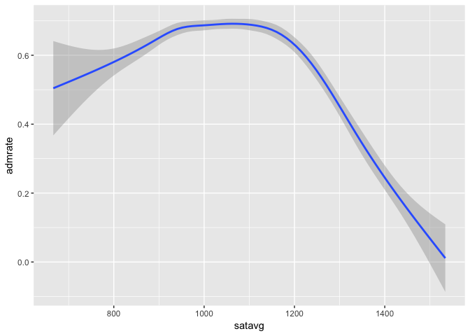
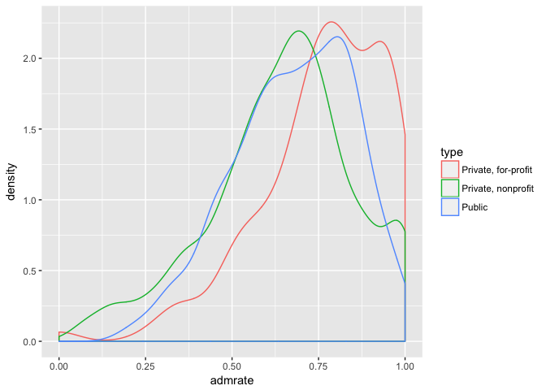
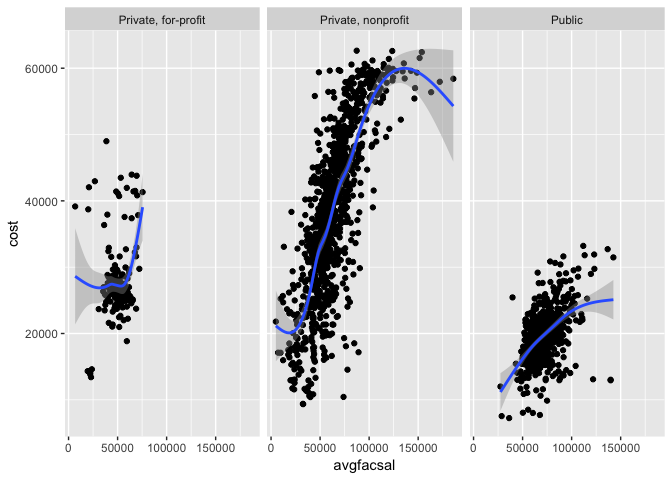

Scorecard
================

``` r
ggplot(data = scorecard)+
  geom_bar(mapping = aes(x=type))
```


In thie dataset, most schools are Private, Nonprofit. Then it follows the Public and Private, for-profit schools.

``` r
ggplot(data = scorecard)+
  geom_smooth(mapping=aes(x=satavg, y=admrate))
```

    ## `geom_smooth()` using method = 'gam'

    ## Warning: Removed 471 rows containing non-finite values (stat_smooth).



From the plot above, the higher average SAT scroe comes with the lower admission rate.

``` r
admrate_satavg <- lm(data=scorecard, admrate~satavg)
admrate_satavg
```

    ## 
    ## Call:
    ## lm(formula = admrate ~ satavg, data = scorecard)
    ## 
    ## Coefficients:
    ## (Intercept)       satavg  
    ##   1.2028314   -0.0005267

Using Linear model, we have the rusults above. It proves the previous conclusion

``` r
ggplot(data = scorecard)+
  geom_density(aes(admrate, color=type ))
```



The admission rate of Private, for-profit schools is the highest. Private, nonprofit schools have the lowest admission rate.

``` r
ggplot(data=scorecard)+
  geom_point(mapping = aes(x=avgfacsal, y=cost))+
  geom_smooth(mapping = aes(x=avgfacsal, y=cost))+
  facet_wrap(~type)
```

    ## `geom_smooth()` using method = 'gam'

    ## Warning: Removed 42 rows containing non-finite values (stat_smooth).

    ## Warning: Removed 42 rows containing missing values (geom_point).



The faculties in private nonprofit schools get the highest pay. Also, those schools have the highest costs. There is a positive-relation between this two variables.
