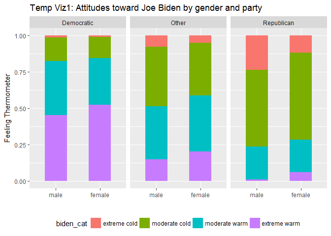
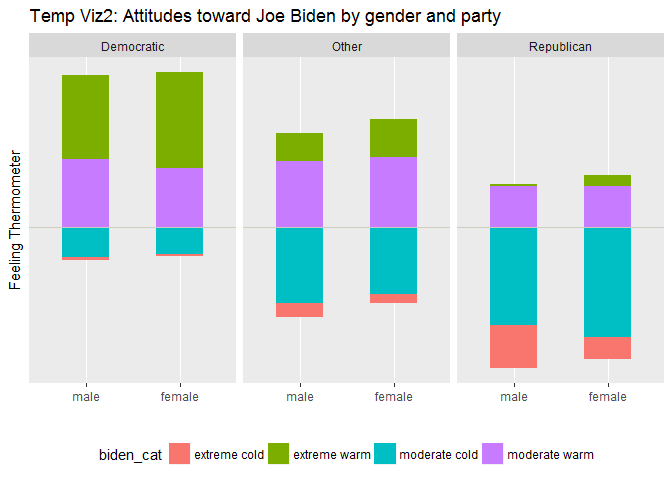
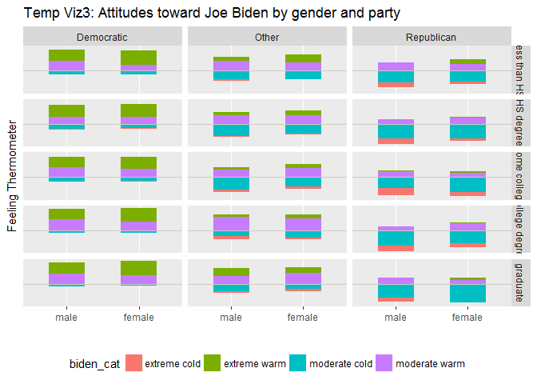
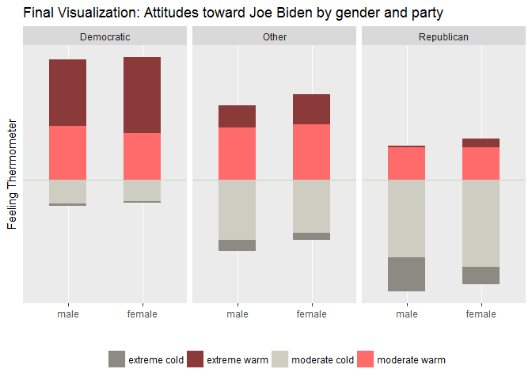

MACS 40700 Assignment 1
================
Guangyu Liu
Due April 10, 2017

Part 1: Visualization Critique
------------------------------

Part 2: ggplot2 and the grammar of graphics
-------------------------------------------

### Design

The dataset `biden.csv` includes six variables. To explore the relationship between characteristics of the respondents and their attitudes toward Joe Biden, `biden`, the feeling thermometer is regarded as the dependent variable, while the other five variables, `female`, `age`, `dem`, `rep`, and `educ` are regarded as independent variables.

**The first question is how different groups of people vary in their attitudes toward Biden.** A simple regression shows that `biden` is statistically significantly associated with `female`, `dem`, and `rep`. Female and democratic respondents like Biden more than others. The associations between `biden` and `age` and `educ` are not statistically significant.

|             |  Coefficient|  Std. Error|           t|          p|
|:------------|------------:|-----------:|-----------:|----------:|
| (Intercept) |   58.8112590|   3.1244366|   18.822996|  0.0000000|
| female      |    4.1032301|   0.9482286|    4.327258|  0.0000159|
| age         |    0.0482589|   0.0282474|    1.708438|  0.0877274|
| educ        |   -0.3453348|   0.1947796|   -1.772952|  0.0764057|
| dem         |   15.4242556|   1.0680327|   14.441745|  0.0000000|
| rep         |  -15.8495061|   1.3113624|  -12.086290|  0.0000000|

Thus, the designed visualization aims at showing the differences between gender and political beliefs. `dem` and `rep` are transformed into a single variable, `party`, with three categories: Democratic, Other, and Republican.

**The second question is how to visualize `biden`, the dependent variable.** In `biden.csv`, the feeling thermometer is encoded as an ordinal variable, ranging from 0 to 100, with an interval equals 10. One option is viewing `biden` as a continuous variable. Using dotplot or violin chart, it is easy to see the distribution within each category. But what I am interested here is not the distribution, but which group likes Biden and which group dislikes Biden. For this reason, I transformed `biden` into a categorical variable, `biden_cat`, with four categories: extreme cold (0 ~ 25), moderate cold (26 ~ 50), moderate warm (51 ~ 75), and extreme warm (76 ~ 100).

One problem of this transformation is that the `moderate warm` category contains two values (60, 70), while other three categories all contain three values. As mentioned above, since the aim of this visualization is not to compare the distribution of feeling thermometer WITHIN each group, but ACROSS groups (i.e., I am not going to say that in the democratic female category, there are more respondents having extreme warm attitude toward Biden than having moderate warm attitude, but to say that democratic female respondents are more likely to be extreme warm toward Biden than democratic male respondents), this problem will not bias the visualization.

To display the relationship between three categorical variables -- `biden`, `female`, and `party` -- bar chart is a good choice. I mapped `female` to the x-axis, stacked four attitude categories of `biden_cat` in each bar, with each political party in a different facet. Since different gender and political party groups have different number of respondents, I calculated the percentage of each category of `biden_cat` within each respondent group, so that each bar has the same length. An initial graph is as below:



The problem of the above barchart is that although it is easy to compare the extreme warm and extreme cold categories, which lie above the bottom line and below the upper line respectively, it is difficult to compare the middle part of the bars across groups. For instance, it might take some effort to tell democratic females and other females, which group has a larger proportion of moderate warm attitude toward Biden. On the contrary, it is more reasonable to show which group likes Biden more (i.e., has a larger proportion of moderate warm and extreme warm) and which group dislikes Biden more (i.e., has a larger proportion of moderate cold and extreme cold). Therefore, I adjusted the positions of the bars, making them align at the neutral line (the line separates warm and cold) rather than the bottom line.



**The third question is whether the insignificant variables should be included.** I recoded `educ` into five categories: less than high school, high school degree, some college, college degree, and graduate, and plotted each education category in a different facet, as showed in `Temp Viz3`. Since the difference between different education categories is minor, and more information might distract the audience from the main point of the story, it is more appropriate to exclude insignificant variables from the visualization.



Finally, to more clearly emphasize the comparison between like and dislike, I changed the filled color. Now, the cold categories are from the same color set, while the warm categories are from another color set. It is easy to tell that for each political party group, female respondents like Biden more than male respondents do. Democratic respondents like Biden most, Republican respondents dislike Biden most, while respondents of other political beliefs are in between. The final visualization and the complete code is as below.

### Code and visualization

``` r
# Read data
Biden <- read.csv(file = "biden.csv")

# Recode categorical variables
attach(Biden)

## Recode female
Biden$female <- factor(Biden$female, levels = c(0, 1), labels = c("male", "female"))

## Recode party
Biden$party[dem == 1] <- "Democratic"
Biden$party[rep == 1] <- "Republican"
Biden$party[dem == 0 & rep == 0] <- "Other"
Biden$party <- factor(Biden$party, levels = c("Democratic", "Other", "Republican"))

## Recode educ
Biden$educ_cat <- cut(educ, 
                      breaks = c(0, 12, 13, 16, 17, Inf),
                      labels = c("less than HS", "HS degree", "some college", "college degree", "graduate"),
                      right = FALSE)

## Recode biden
Biden$biden_cat <- cut(biden,
                       breaks = c(-Inf, 26, 51, 76, Inf),
                       labels = c("extreme cold", "moderate cold", "moderate warm", "extreme warm"),
                       right = FALSE)

## Recode age
Biden$age_cat <- cut(age, 
                     breaks = c(-Inf, 33, 48, 63, 78, Inf), 
                     labels = c("18-32", "33-47", "48-62", "63-77", "78+"),
                     right = FALSE)
detach(Biden)

# Percentage of attitude within each category
biden_perc <- Biden %>%
  group_by(female, party, biden_cat) %>% 
  summarize(freq = n()) %>% 
  mutate(perc = round(freq/sum(freq)*100, 2))

# Split biden_perc into two groups: cold and warm
cold <- filter(biden_perc, biden_cat == "extreme cold" | biden_cat == "moderate cold")
warm <- filter(biden_perc, biden_cat == "moderate warm" | biden_cat == "extreme warm")

# Negate the percentage of cold attitude, reverse order
cold$perc = -cold$perc
warm$biden_cat <- ordered(warm$biden_cat, levels = rev(levels(warm$biden_cat)))

# Visualization
bar_thermo <- ggplot() +
  aes(x = female, y = perc, fill = biden_cat) +
  geom_bar(data = warm, stat = "identity", width = 0.5) +
  geom_bar(data = cold, stat = "identity", width = 0.5) +
  geom_hline(yintercept = 0, color = "ivory3") +
  scale_fill_manual(name = "", values = c("extreme warm" = "indianred4", "moderate warm" = "indianred1", "moderate cold" = "ivory3", "extreme cold" = "ivory4")) +
  scale_y_continuous(breaks = NULL) +
  labs(x = "", y = "Feeling Thermometer", 
       title = "Final Visualization: Attitudes toward Joe Biden by gender and party") +
  theme(legend.position = "bottom", legend.direction = "horizontal") +
  facet_grid(~ party)
bar_thermo
```


