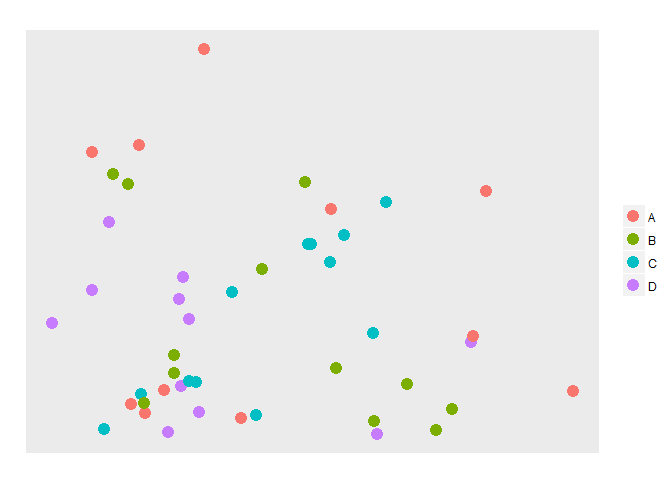
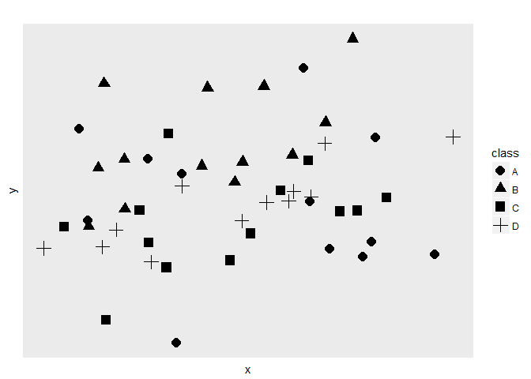
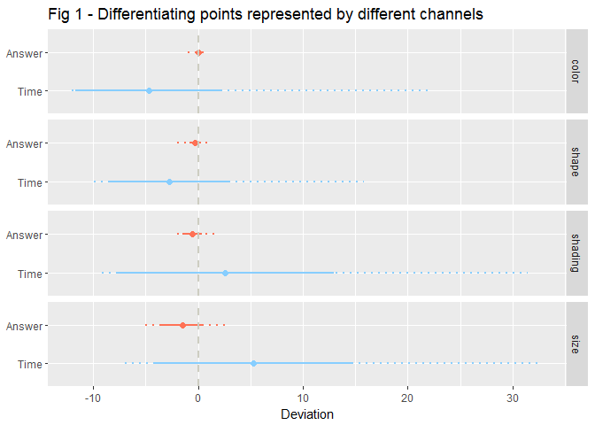
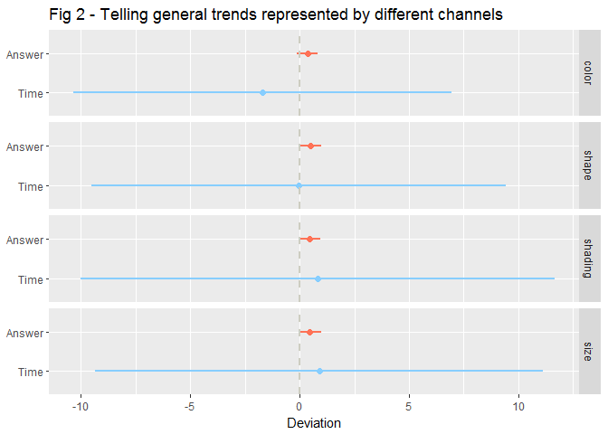

Assignment2: experimenting with visual design
================
Guangyu Liu
Due: April 28, 2017

### Introduction

According to Cairo (2012), the brain loves differences, and it is able to detect size, orientation, and shade preattentively. All these features, plus color, which is common in denoting different groups, however, are at the bottom of Cleveland and McGill's (1984) accuracy list. Cleveland and McGill designed 10 elementary perceptual tasks to rank several common ways of representing data. Heer and Bostock (2010) replicated their research using crowdsourced experiments and got similiar results to the originals. Both studies focused on continuous variables. Cleveland and McGill's list had position and length, which allow more accurate judgments, on the top, while area and color, which allow more generic judgments (Cairo, 2012), at the bottom. However, color saturation, shading, shape, and size (area) are common channels used to represent categorical variables. Different from continuous variables, which require the audience to tell what percentage one value is of the other, what crucial to categorical variables is to easily differentiate one from the others.

In this assignment, I plan to test how the brain is good at differentiating colors, shapes, shadings, and sizes using mTurk and Qualtrics. By good, I mean quickly and accurately detect the difference. The hypothesises are below:

-   The brain detects color, shading, shape, and size with different speeds.
-   The brain detects color, shading, shape, and size with different accuracies.

### Methods

#### Research design

This experiment includes two parts. First, I tested how good the brain can find items represented by a certain feature. Second, I tested how good the brain can tell a general trend represented by a certain feature. Both tasks are frequently used in exploratory analysis when one wants to compare characteristics between groups.

For the first task, I generated two data frames, each has 46 and 50 items respectively. `x` and `y` are random numbers, following standard normal distribution. `class` is a categorical variable with four categories. In each data frame, four categories have similiar number of points. All together, two dataframes have eight categories with number of points range from 11 to 13. I intentionly chose similiar but not identical number of items in each category, in order to reduce the probability of respondents guessing answer while also allow the time spent on different questions comparable.

I mapped `x` to x-axis, `y` to y-axis, and `class` to one of the channels -- color, shading, size, and shape. For each channel, I rerandomized `x` and `y` in the two data frames and generated two scatter plots. The respondents are required to count the number of points within a category. An example of plotting a color channeled graph is as below. For this graphs, The respondents are asked to count how many points are 'A'.

For the second task, I generated three scatter plots for each channel using a data frame of 50 items. In each plot, there is a category in which `y` is possitively associated with `x` (`y = 0.6x + 0.3y'`), or negatively associated with `x` (`y = -0.6x + 0.3y'`), or a constant (`y = 0.3y'`), where `x` and `y'` are both normally distributed random numbers. So the plot shows a general trend between `x` and `y` with variations, rather than a perfectly fitted line. `x` and `y` in other categories are unrelated random numbers. `x`, `y`, and `class` are defined as above. The respondents are required to tell when `x` increases, how will `y` change. An example of plotting a shape channeled, `x` and `y` positively associated graph is as below. For this graph, the respondents are asked to tell for class D, how will `y` change when `x` increases.

#### Data collection

Eight questions for task 1, two for each channel, and twelve questions for task 2, three for each channel are created. I designed a [survey](http://ssd.az1.qualtrics.com/jfe/form/SV_eKCcpICSV9YLjIF) using Qualtrics and posted the link on MTurk to collect data. In a pilot study, I found respondents will answer questions more and more quickly as they get familiar with the question type. So questions appear at the beginning take longer time while questions in the end take shorter time. To minimize the order effect, I randomized all 20 questions. Both the respondents' answerand the time spent on each question are recorded. The original sample size is 21.

Because it is difficult to control the experiment environment on MTurk, some creteria are applied to remove "guessing answers". For the first task (counting points), it is difficult to read the question, understand the legend, and count points within 5 seconds. Time spent less than 5 seconds is regarded as unreasonably short and was converted as missing value (N/A). Most respondents spent less than 30 seconds on each question. Time spent more than 60 seconds is regarded as unreasonably long and was converted as missing value. For the second task (multiple choice), two respondents chose the same option for all twelve questions, and spent relatively short time on each quesion. Their answers are regarded as "guessing answer", and all their answers are removed from the dataset. After that, the valid sample size is 19.

### Results

#### Counting points

For the first task, respondents are required to count the number of points belong to a category. I recoded the answer into the deviation from the correct number. Take the first graph in "Research Design" section as an example. Respondents are asked to count how many points are "A". The correct number is 11. If one answers 13, he/she has 2 points deviation from the correct number. If one answers 10, he/she has -1 point deviation from the correct number. Then I calculated the mean, min, max, and sd of the deviation of each channel. Channels with a mean closer to zero can convey categorical information more accurately.

Similarly, I transformed the time spent on each question. Since there is no "correct time", I calculated the time deviation from the grand mean, i.e. the average time of all eight questions in task 1. Then, the mean, min, max, and sd of time deviation of each channel are calculated. If a channel has a negative time deviation, people can differentiate points represented by this channel quicker than average. If a channel has a positive time deviation, it will take longer time for the brain to differentiate points represented by this channel.

As an exploratory analysis, I graphed the answer deviation from the correct number and the time deviation from the grand mean in `Fig 1`. The points denote the means of each channel, the solid lines are mean +/- sd, and the dotted lines are the ranges of the deviation of each channel.

The graph above shows that from color to shape to shading to size, the accuracy in conveying categorical variables decreases while time used increases. To see if the differences are statistically significant, I ran t-test for every two adjacent channels.

| Test                  |     t-stat|    p-value|
|:----------------------|----------:|----------:|
| Answer: color~shape   |   2.517065|  0.0145156|
| Answer: shape~shading |  -1.813529|  0.0746889|
| Answer: shading~size  |   2.409372|  0.0195805|
| Time: color~shape     |  -1.374740|  0.1736293|
| Time: shape~shading   |   2.759175|  0.0077645|
| Time: shading~size    |  -1.156930|  0.2512352|

The statistical analysis shows that `color` has the highest accuracy, while `size` has the lowest accuracy. `shape` and `shading` are in the middle and are not statistically different from each other. Regarding speed, our brain can differentiate `color` and `shape` statistically faster than `shading` and `size`.

#### General trend

As above, I recoded answers and time spent on task 2 as deviation from the correct answer and the grand mean. Since task 2 only has multiple choice questions, and the answers are either true (0 unit deviates from the correct answer) or false (1 unit deviates from the correct answer), it is meaningless to plot the range of the answer. In the meanwhile, time spent on task 2 varies a lot. Including the min and max time deviation will shrink the difference among mean time deviations shown in the plot. Therefore, only means and standard deviations are plotted in `Fig 2`. 

`Fig 2` shows that the brain is able to tell the general trend shown by `color` faster than average, and it needs more time to tell the general trends shown by `shading` and `size`. The difference in accuracy rate, however, is difficult to tell from the graph. Again, I ran statistical test to see if there is significant difference among channels.

| Test                  |     F-stat|    p-value|
|:----------------------|----------:|----------:|
| Answer: one-way ANOVA |  0.9412335|  0.4229573|
| Time: one-way ANOVA   |  0.9401370|  0.4235271|

Statistical analysis shows that there is no difference among channels in accurately telling the trend. Although it is easier to tell a trend represented by color than shape than shading than size, the differences are not statistically significant.

### Conclusion and Discussion

According to the results above, our brain can differentiate points represented by different colors best and by different sizes worst, in terms of accuracy and speed. But when there is a trend in the plot, the difference diminishes. This suggests to use color rather than size when plotting the distribution of different categories, while these four channels work similar good in representing trends.

However, in both tasks, there is a large variation in the time spent, even within the same respondent. It is difficult to control the experiment environment using MTurk. A respondent may randomly click an answer, which results very short time spent, or he/she may rest for several seconds before really starts to answer a question, which results longer time. The measurement error may bias the experiment results.

**The full code can be found in [assignment2.R](https://github.com/guangyu-liu/dataviz/blob/master/submissions/Liu_Guangyu/assignment2/assignment2.R)**

### References

Cairo, A. (2012). The Functional Art: An introduction to information graphics and visualization. New Riders. Retrieved from <http://proquestcombo.safaribooksonline.com.proxy.uchicago.edu/book/graphic-design/9780133041187>

Cleveland, W. S., & McGill, R. (1984). Graphical Perception: Theory, Experimentation, and Application to the Development of Graphical Methods. Journal of the American Statistical Association, 79(387), 531–554. <https://doi.org/10.2307/2288400>

Heer, J., & Bostock, M. (2010). Crowdsourcing Graphical Perception: Using Mechanical Turk to Assess Visualization Design. In Proceedings of the SIGCHI Conference on Human Factors in Computing Systems (pp. 203–212). New York, NY, USA: ACM. <https://doi.org/10.1145/1753326.1753357>
