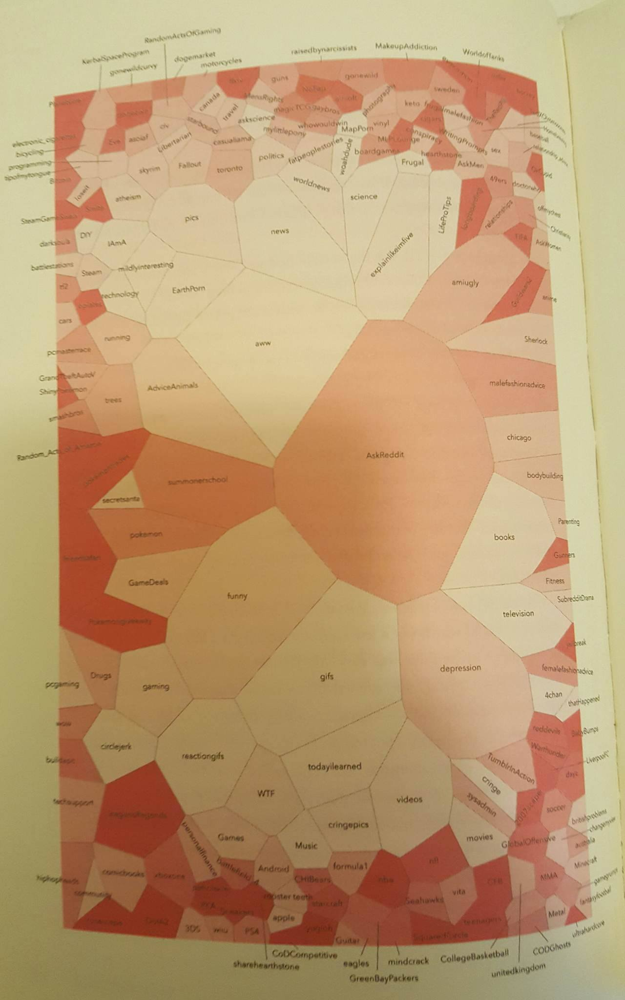
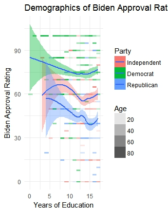

```{r, include=FALSE}
library(tidyverse)
```
```{r, include=FALSE}
library(ggthemes)
```
```{r,include=FALSE}
biden <- read.csv("biden.csv")
variable.names(biden)
View(biden)
```
```{r, include=FALSE}
biden <- biden %>%
  mutate(rep = rep *2)

biden <- biden %>%
  mutate(party = rep + dem)
```

## Part 1: Visualization Critque



The visualization that I will be dissecting is taken from Chapter 12 of Christian Rudder’s book *Dataclysm: Who We Are (When We Think No One’s Looking)*. Using data from Reddit, Rudder creates visual representation of different communities, or subreddits, while making inferences about the particular interests and features of that make up each community. Even though this visualization and the analysis Rudder provides is exploratory in nature, one of key motives for choosing this visualization is the unique aesthetic and structure of the visualization.
	Beginning with the aesthetic features, Rudder uses size, color, and spatial positioning as the key channels of communication. Each given area represents a specific subreddit while the size of that subreddit reflects the general size of the community; the more area consumed, the larger the community population. The color, or more accurately shading of each area reflects the level of activity of the community members within that subreddits relative to other subreddits. In other words, the color is representative of how “close-knit” each subreddits is. A lighter shade of red corresponds to a subreddit whose community members are highly involved within other subreddits while a darker color means that the subreddit is more isolated (possibly having less in common with other subreddits). Finally, Rudder uses spatial positioning as a means of clustering communities who share members. This means that those communities who are touching share a similar population of users who follow or comment in those given subreddits. In combining these different channels, Rudder arrives at, in my opinion, a beautiful, mosaic representation of 200 different communities.  As Cairo asserts in The Truthful Art, beauty must have meaning, and as Rudder explains in his book, the narrative of this data is about these “imagined communities”, and to a further extent, how these communities overlap. It is through this beauty that we are able to derive loose narratives or insights regarding these communities. 
	Even though this is not necessarily an interactive graphic, the image does provide a means for knowledge-building insights. The graphic tells the reader something about the structure of the Reddit community and its most popular topics, however, there is still plenty of ambiguity in the presentation that allows for interpretation and further analysis. The narrative or conclusions the reader can draw are going to depend upon where the reader decides to look. With over 200 separate communities, there is plenty of room for questions and hypotheses to be derived from this visualization, which is what makes this visualization knowledge-building rather providing spontaneous insight. One may ask why is r/depression so large or why is r/skyrim and r/Fallout in the top left hand corner while most other gaming subreddits are in the bottom left hand corner. Even though the beauty and insights are intuitive, one of the problems with this graphic may be that it is too simple or clean which dilutes some of the truths that may lie behind the numbers used to create and may ultimately lead the reader to miss out on a more nuanced understanding of the community structure.
	One of the more fascinating components of this visualization is the resemblance to network visualizations. Nodes, or subreddits, are constructed near one another, and we can begin to see the outline for shortest paths to other subreddits. However, by drawing strict boundaries around each node, we get rid of the nuance that exists between all nodes. In strict network analysis, the complex visualization gives an idea of how each node is connected to each other. This visualization just shows which subreddits are related to each other through shared commenters. This potentially obscures the truthfulness of the narrative in exchange for intuitive-ness, especially since the ambiguity as to why particular subreddits such as r/FIFA and r/soccer are so far away. The reality behind the graphic may have these two semi-related, but since they may not share overlapping subreddits they are drawn further from each other. In other words, the complexity of the visualization is scaled down, and through this reduction,  ambiguity emerges. The truthfulness of the graphic becomes much more subjective. In order to clearly outline this idea of subjective truth in the graphic, I propose that we turn to the field of geography for analogy. In geography, we make use of the physical location of a given country, and this provides one narrative about the world and its different regions. However, we could also rearrange or modify the landscape based upon other key features such as religion, age, or population density. Even though most mediums would overlay this information over the physical geography, we could reinterpret the physical geography to place similar countries together or redraw the map in order to present another narrative. In essence, we take the same channels and principles of our visualizations to create a different narrative of similarity between countries.  However, I would not say that Rudder is attempting to deceive or prorogate his own narrative from the graphic, but rather, in attempting to find a balance between function and insight some of the complexity had to be removed. 
	
By focusing on communities created by the process of self-selection and shared interests, Rudder sheds light on the inherent empathy, compassion, and collaboration found in digital communities. In terms of both function, I would say that this graphical form is a useful medium in which Rudder is able to find balance. A network analysis approach may be too complex for the layperson to interpret, while a geospatial medium may not provide the same level of depth in regards to the insights. One critique of this medium is that the reader can only make rough comparisons. Since the area of each subreddit is based upon size and the shapes are quite variable, the reader has estimate the area each subreddit takes up. It is through this estimation that the reader can seemingly only make comparisons between communities, as opposed to making any substantive claim about any particular community. 

Finally, the question of whether or not this graphic should exist, or as Cairo explains, whether or not this visualization is enlightening. Obviously, this visualization is intriguing, but the argument can be made that this graphic may not need to exist. In other words, our knowledge of how communities’ structure or the type of communities that exist is not significantly improved with this graphic.  The Reddit community is substantially large, but one could argue that the self-selection of joining Reddit makes an inferential claim hard to decipher. In other words, the true community of 49er fans is actually closer to those of the NFL community than the Doctor Who community.  However, at the same time, Rudder does explain that the Internet emerges as a form of “imagined community”, therefore, this graphic serves as an ethnographic interpretation of new forms of community building. By no longer being constrained by physical space, people can explore and establish communities of whatever similarities with the freedom to explore identity. Whether or not this graphic should exist can be argued from both sides by the reader. 

##Part 2: Grammar of Graphics

```{r, echo=FALSE}
biden %>%
  ggplot(aes(educ, biden, fill = factor(party), stat = "bin"))+
  geom_raster(aes(alpha = age)) +
  geom_smooth()+
  scale_fill_discrete(name= "Party",
                      labels = c("Independent", "Democrat", "Republican"))+
  scale_alpha_continuous(name= "Age")+
  labs(title = "Demographics of Biden Approval Rating",
       x = "Years of Education", y = "Biden Approval Rating") +
  theme_minimal()
```

For the second part of the assignment, I created a visualization of the demographics of Biden’s approval rating. Through preliminary examinations of the univariate and bivariate distributions, it had seemed that the crucial variables in understanding this relationship were age, years of education, and party affiliation. The final graphic above is able to use each of these variables and a corresponding channel in order to make some comment as to the effect of Biden’s approval ratings. Since it would seem that education had the largest relationship with Biden’s approval rating, it seemed reasonable to plot education against approval rating. We are then able to manipulate color to represent party affiliation and shading to represent age. Since we had two dummy variables for representing party affiliation, we decided to combine both in order to create a single, discrete indicator for party. For future graphics, we could modify colors to correspond with the political parties which could increase the accessibility of the graphic. The age variable corresponds with a particular shading, lighter colors indicate younger respondents while darker colors represent older respondents. 

There are many different mediums through which to view this data, and the medium of the graphic will determine the functionality and narrative for the reader. Even though this graphic is effective and provides some intuitive clarity, I believe that there may still be missing components that shape the interpretation. For example, the smoothing lines provide a general summary between education, party affiliation, and approval rating which consists of the major interpretations. It is presented in a way that is standard for most academic journals. There is nothing unique or original with the use of some linear summary. However, we can also overlay a heat map which can convey the relationship between the three continuous variables of age, education, and approval rating. When we combine these two, we are able to derive two distinct narratives. The first is that Democrats tend to favor Biden more than Independents or Republicans, and the second is that older individuals tend to favor Biden more than younger individuals. For both narratives though, there is some effect of education. In addition, when we combine these two mediums, we have a more interactive, yet still static, graphic that can provide different insights.

In regards to both narratives, I believe that this graphic provides both types of insights outlined by Ciaro. With the smoothing lines, we have the spontaneous insight where we are able to make quick and intuitive interpretations. With the use of the heat map, we are able to see and question the data a little further. In future visualizations, we might think to make the graphic more interactive such that when we hover over a given area we can see the proportional breakdown of party affiliation. This would provide a more robust argument for knowledge building insight within the visualization. 

In addition to the narratives containing insight, the truthfulness of the visualization also seems fairly accurate. On the surface level, the narrative makes rational sense since older respondents favor Biden since they are similar to them, and democrats are going to favor Biden more since they are members of the same political party. However, when presenting two narratives, there seems to be the inclination that these narratives can build upon one another even though in this visualization we have no evidence for complex interactions. In addition, we opted not to include gender since there seem to be no real differences between the other variables and gender. This could entail that we are missing some components of the narrative. In addition, truthfulness relates to clarity, and since we are overlaying two visualizations, some of the clarity may be misconstrued, yet I do not think that clarity could be misconstrued that much. Rather, the exact interpretation, such as the exact age, is unclear and requires the reader to make rough estimations and comparisons.

The beauty of the visualization resides in the minimalistic colors and shading used to express the given channels. One of the early iterations of this visualization used a scatterplot, as opposed to the heat map. This created too much overlap of each point, especially since the variables used are whole numbers. Even with the jitter function, there was simply too much going on. This final visualization simplifies and consolidates the data to be interpretable and visually appealing.  On the other hand, I could see the argument being made that there is simply too much white space and that, in simplifying, we overly reduced the complexity for easily interpretable results.

Once more, we have to examine whether or not this graphic is enlightening. First, this question and examination is not unethical, but it is visualizations like these that are used to propagate certain political agendas, and therefore, we must be careful as to the application. Are we trying to assert that certain political parties are less educated or does this in anyway hurt or help the current political divide?  We have to be conscious of how this examination will be used, and it is through these means that we must judge the ethical position of our visualizations. Second, we must determine if this visualization will better our understanding. Once more, I am skeptical that this visualization provides any novice understanding towards public opinion and especially public opinion with respect to political parties.   

