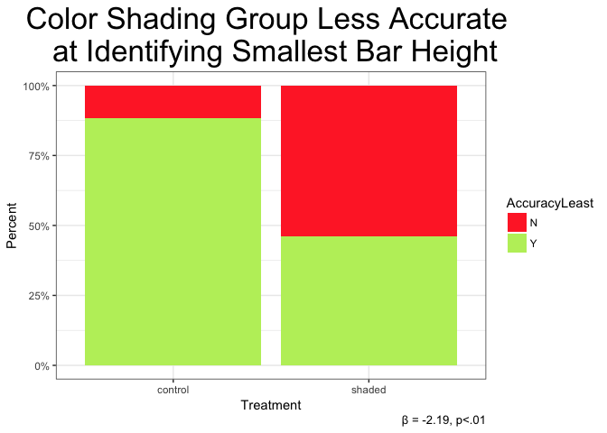

Assignment 2
================
Dana Westley
Due April 28

Intro
=====

Results
=======

``` r
density_group
```

    ## Warning: Removed 5 rows containing non-finite values (stat_density).


``` r
cor_plot
```

    ## Warning: Removed 5 rows containing non-finite values (stat_smooth).

    ## Warning: Removed 5 rows containing missing values (geom_point).


``` r
log_reg
```



Write Up
--------
