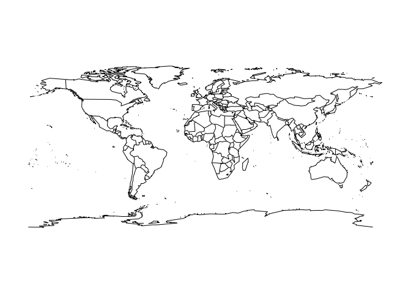
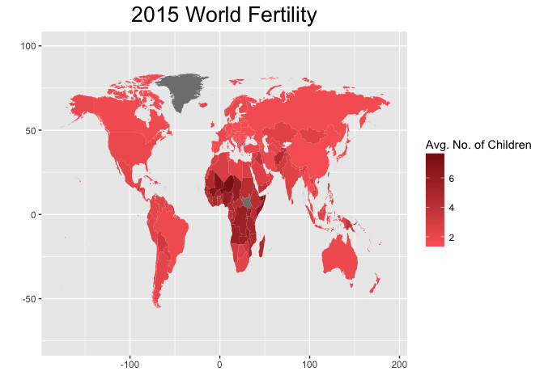
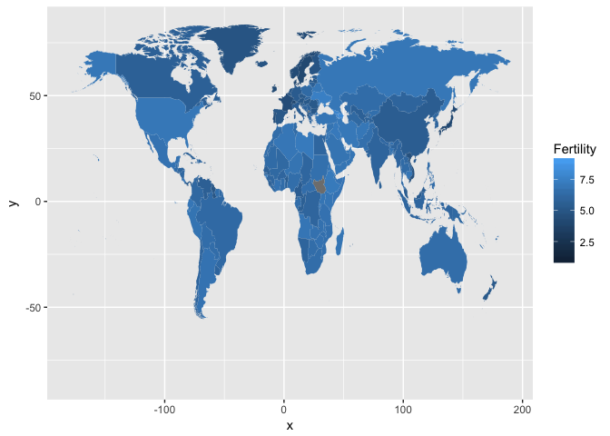

Assignment 3
================
Dana Westley
Due May 10, 2017

    ## 
    ## Attaching package: 'dplyr'

    ## The following objects are masked from 'package:stats':
    ## 
    ##     filter, lag

    ## The following objects are masked from 'package:base':
    ## 
    ##     intersect, setdiff, setequal, union

    ## $`(0.832,2.04]`
    ##                              Country Year Fertility
    ## 30092                         France 1915      1.52
    ## 30353                         France 1916      1.23
    ## 30614                         France 1917      1.34
    ## 30875                         France 1918      1.56
    ## 31039                 United Kingdom 1918      2.03
    ## 31136                         France 1919      1.59
    ## 33230                        Germany 1927      1.98
    ## 33388                 United Kingdom 1927      2.01
    ## 33491                        Germany 1928      1.99
    ## 33649                 United Kingdom 1928      2.01
    ## 33752                        Germany 1929      1.93
    ## 33889                         Sweden 1929      1.92
    ## 33910                 United Kingdom 1929      1.95
    ## 34013                        Germany 1930      1.88
    ## 34150                         Sweden 1930      1.93
    ## 34151                    Switzerland 1930      1.99
    ## 34171                 United Kingdom 1930      1.95
    ## 34249                 Czech Republic 1931      2.03
    ## 34274                        Germany 1931      1.71
    ## 34411                         Sweden 1931      1.85
    ## 34412                    Switzerland 1931      1.97
    ## 34432                 United Kingdom 1931      1.89
    ## 34510                 Czech Republic 1932      1.97
    ## 34535                        Germany 1932      1.62
    ## 34672                         Sweden 1932      1.80
    ## 34673                    Switzerland 1932      1.94
    ## 34693                 United Kingdom 1932      1.83
    ## 34728                        Austria 1933      1.97
    ## 34771                 Czech Republic 1933      1.83
    ## 34796                        Germany 1933      1.58
    ## 34883                         Norway 1933      1.86
    ## 34933                         Sweden 1933      1.69
    ## 34934                    Switzerland 1933      1.89
    ## 34954                 United Kingdom 1933      1.72
    ## 34955                            USA 1933      2.01
    ## 34989                        Austria 1934      1.87
    ## 35032                 Czech Republic 1934      1.77
    ## 35057                        Germany 1934      1.93
    ## 35105                     Luxembourg 1934      2.02
    ## 35144                         Norway 1934      1.82
    ## 35194                         Sweden 1934      1.68
    ## 35195                    Switzerland 1934      1.88
    ## 35215                 United Kingdom 1934      1.76
    ## 35250                        Austria 1935      1.81
    ## 35257                        Belgium 1935      1.94
    ## 35293                 Czech Republic 1935      1.68
    ## 35318                        Germany 1935      2.03
    ## 35366                     Luxembourg 1935      1.85
    ## 35405                         Norway 1935      1.78
    ## 35455                         Sweden 1935      1.68
    ## 35456                    Switzerland 1935      1.84
    ## 35476                 United Kingdom 1935      1.75
    ## 35511                        Austria 1936      1.80
    ## 35518                        Belgium 1936      1.95
    ## 35554                 Czech Republic 1936      1.66
    ## 35627                     Luxembourg 1936      1.82
    ## 35666                         Norway 1936      1.80
    ## 35716                         Sweden 1936      1.73
    ## 35717                    Switzerland 1936      1.80
    ## 35737                 United Kingdom 1936      1.77
    ## 35738                            USA 1936      2.01
    ## 35772                        Austria 1937      1.54
    ## 35779                        Belgium 1937      1.99
    ## 35815                 Czech Republic 1937      1.69
    ## 35888                     Luxembourg 1937      1.80
    ## 35927                         Norway 1937      1.84
    ## 35977                         Sweden 1937      1.74
    ## 35978                    Switzerland 1937      1.74
    ## 35998                 United Kingdom 1937      1.79
    ## 36033                        Austria 1938      1.92
    ## 36076                 Czech Republic 1938      1.82
    ## 36149                     Luxembourg 1938      1.77
    ## 36188                         Norway 1938      1.88
    ## 36238                         Sweden 1938      1.80
    ## 36239                    Switzerland 1938      1.78
    ## 36259                 United Kingdom 1938      1.84
    ## 36337                 Czech Republic 1939      1.94
    ## 36410                     Luxembourg 1939      1.75
    ## 36449                         Norway 1939      1.91
    ## 36499                         Sweden 1939      1.86
    ## 36500                    Switzerland 1939      1.79
    ## 36520                 United Kingdom 1939      1.84
    ## 36562                        Belgium 1940      1.84
    ## 36617                         France 1940      2.00
    ## 36671                     Luxembourg 1940      1.72
    ## 36710                         Norway 1940      1.95
    ## 36760                         Sweden 1940      1.82
    ## 36761                    Switzerland 1940      1.82
    ## 36781                 United Kingdom 1940      1.74
    ## 36823                        Belgium 1941      1.66
    ## 36878                         France 1941      1.85
    ## 36932                     Luxembourg 1941      1.73
    ## 36971                         Norway 1941      1.83
    ## 37021                         Sweden 1941      1.89
    ## 37042                 United Kingdom 1941      1.72
    ## 37084                        Belgium 1942      1.81
    ## 37138                        Finland 1942      2.00
    ## 37145                        Germany 1942      1.83
    ## 37193                     Luxembourg 1942      1.74
    ## 37303                 United Kingdom 1942      1.93
    ## 37335                        Armenia 1943      1.82
    ## 37406                        Germany 1943      2.00
    ## 37454                     Luxembourg 1943      1.74
    ## 37509                         Russia 1943      1.68
    ## 37564                 United Kingdom 1943      2.03
    ## 37596                        Armenia 1944      1.74
    ## 37667                        Germany 1944      1.89
    ## 37715                     Luxembourg 1944      1.75
    ## 37770                         Russia 1944      1.72
    ## 37860                        Austria 1945      1.88
    ## 37928                        Germany 1945      1.53
    ## 37976                     Luxembourg 1945      1.76
    ## 38031                         Russia 1945      1.92
    ## 38052                       Slovenia 1945      1.86
    ## 38121                        Austria 1946      1.88
    ## 38189                        Germany 1946      2.00
    ## 38382                        Austria 1947      1.87
    ## 38450                        Germany 1947      2.03
    ## 38643                        Austria 1948      1.87
    ## 38904                        Austria 1949      1.87
    ## 39165                        Austria 1950      1.87
    ## 39267                    North Korea 1950      1.95
    ## 39274                         Latvia 1950      2.01
    ## 39281                     Luxembourg 1950      1.87
    ## 39426                        Austria 1951      2.02
    ## 39535                         Latvia 1951      2.01
    ## 39542                     Luxembourg 1951      1.90
    ## 39796                         Latvia 1952      2.00
    ## 39803                     Luxembourg 1952      1.95
    ## 40057                         Latvia 1953      2.00
    ## 40064                     Luxembourg 1953      2.01
    ## 40318                         Latvia 1954      1.99
    ## 40526                        Estonia 1955      2.02
    ## 40579                         Latvia 1955      1.98
    ## 40787                        Estonia 1956      2.01
    ## 40840                         Latvia 1956      1.97
    ## 41048                        Estonia 1957      1.99
    ## 41101                         Latvia 1957      1.96
    ## 41309                        Estonia 1958      1.98
    ## 41362                         Latvia 1958      1.94
    ## 41570                        Estonia 1959      1.96
    ## 41623                         Latvia 1959      1.92
    ## 41831                        Estonia 1960      1.95
    ## 41871                          Japan 1960      2.00
    ## 41884                         Latvia 1960      1.90
    ## 42092                        Estonia 1961      1.95
    ## 42121                        Hungary 1961      1.97
    ## 42132                          Japan 1961      1.98
    ## 42145                         Latvia 1961      1.88
    ## 42353                        Estonia 1962      1.94
    ## 42382                        Hungary 1962      1.92
    ## 42393                          Japan 1962      1.97
    ## 42406                         Latvia 1962      1.86
    ## 42467                        Romania 1962      2.02
    ## 42614                        Estonia 1963      1.95
    ## 42643                        Hungary 1963      1.89
    ## 42654                          Japan 1963      1.97
    ## 42667                         Latvia 1963      1.84
    ## 42728                        Romania 1963      2.00
    ## 42875                        Estonia 1964      1.95
    ## 42904                        Hungary 1964      1.88
    ## 42915                          Japan 1964      1.97
    ## 42928                         Latvia 1964      1.82
    ## 42989                        Romania 1964      1.95
    ## 43136                        Estonia 1965      1.97
    ## 43165                        Hungary 1965      1.89
    ## 43176                          Japan 1965      1.98
    ## 43189                         Latvia 1965      1.81
    ## 43250                        Romania 1965      1.89
    ## 43304                        Ukraine 1965      2.03
    ## 43384                 Czech Republic 1966      2.03
    ## 43397                        Estonia 1966      1.99
    ## 43426                        Hungary 1966      1.92
    ## 43437                          Japan 1966      2.00
    ## 43450                         Latvia 1966      1.81
    ## 43511                        Romania 1966      1.89
    ## 43565                        Ukraine 1966      2.02
    ## 43645                 Czech Republic 1967      2.00
    ## 43658                        Estonia 1967      2.01
    ## 43687                        Hungary 1967      1.95
    ## 43698                          Japan 1967      2.02
    ## 43711                         Latvia 1967      1.82
    ## 43773                         Russia 1967      2.01
    ## 43826                        Ukraine 1967      2.01
    ## 43906                 Czech Republic 1968      1.99
    ## 43948                        Hungary 1968      1.98
    ## 43972                         Latvia 1968      1.85
    ## 44034                         Russia 1968      1.97
    ## 44087                        Ukraine 1968      2.02
    ## 44167                 Czech Republic 1969      2.01
    ## 44169                        Denmark 1969      2.00
    ## 44185                        Finland 1969      1.94
    ## 44209                        Hungary 1969      2.01
    ## 44233                         Latvia 1969      1.88
    ## 44248                          Malta 1969      2.02
    ## 44295                         Russia 1969      1.98
    ## 44329                         Sweden 1969      1.92
    ## 44348                        Ukraine 1969      2.03
    ## 44425                        Croatia 1970      2.01
    ## 44430                        Denmark 1970      1.95
    ## 44446                        Finland 1970      1.83
    ## 44470                        Hungary 1970      2.03
    ## 44494                         Latvia 1970      1.91
    ## 44501                     Luxembourg 1970      1.96
    ## 44509                          Malta 1970      1.98
    ## 44556                         Russia 1970      2.00
    ## 44590                         Sweden 1970      1.92
    ## 44674                Channel Islands 1971      2.02
    ## 44686                        Croatia 1971      1.99
    ## 44707                        Finland 1971      1.70
    ## 44714                        Germany 1971      1.92
    ## 44755                         Latvia 1971      1.94
    ## 44762                     Luxembourg 1971      1.87
    ## 44763                   Macao, China 1971      1.98
    ## 44770                          Malta 1971      1.96
    ## 44817                         Russia 1971      2.02
    ## 44851                         Sweden 1971      1.96
    ## 44852                    Switzerland 1971      2.02
    ## 44930                         Canada 1972      1.97
    ## 44935                Channel Islands 1972      1.92
    ## 44947                        Croatia 1972      1.98
    ## 44952                        Denmark 1972      2.03
    ## 44968                        Finland 1972      1.59
    ## 44975                        Germany 1972      1.80
    ## 45016                         Latvia 1972      1.96
    ## 45023                     Luxembourg 1972      1.78
    ## 45024                   Macao, China 1972      1.82
    ## 45031                          Malta 1972      1.98
    ## 45078                         Russia 1972      2.03
    ## 45112                         Sweden 1972      1.91
    ## 45113                    Switzerland 1972      1.92
    ## 45134                            USA 1972      2.01
    ## 45168                        Austria 1973      1.94
    ## 45175                        Belgium 1973      1.98
    ## 45191                         Canada 1973      1.88
    ## 45196                Channel Islands 1973      1.82
    ## 45208                        Croatia 1973      1.97
    ## 45213                        Denmark 1973      1.92
    ## 45229                        Finland 1973      1.50
    ## 45236                        Germany 1973      1.70
    ## 45277                         Latvia 1973      1.96
    ## 45284                     Luxembourg 1973      1.70
    ## 45285                   Macao, China 1973      1.68
    ## 45292                          Malta 1973      2.00
    ## 45311                    Netherlands 1973      1.90
    ## 45339                         Russia 1973      1.96
    ## 45373                         Sweden 1973      1.87
    ## 45374                    Switzerland 1973      1.83
    ## 45394                 United Kingdom 1973      1.98
    ## 45395                            USA 1973      1.87
    ## 45429                        Austria 1974      1.91
    ## 45436                        Belgium 1974      1.91
    ## 45452                         Canada 1974      1.83
    ## 45457                Channel Islands 1974      1.74
    ## 45469                        Croatia 1974      1.98
    ## 45474                        Denmark 1974      1.90
    ## 45490                        Finland 1974      1.62
    ## 45497                        Germany 1974      1.62
    ## 45538                         Latvia 1974      1.96
    ## 45545                     Luxembourg 1974      1.63
    ## 45546                   Macao, China 1974      1.57
    ## 45553                          Malta 1974      2.03
    ## 45572                    Netherlands 1974      1.77
    ## 45600                         Russia 1974      2.00
    ## 45634                         Sweden 1974      1.88
    ## 45635                    Switzerland 1974      1.74
    ## 45655                 United Kingdom 1974      1.89
    ## 45656                            USA 1974      1.83
    ## 45690                        Austria 1975      1.83
    ## 45697                        Belgium 1975      1.84
    ## 45713                         Canada 1975      1.83
    ## 45718                Channel Islands 1975      1.66
    ## 45730                        Croatia 1975      1.99
    ## 45735                        Denmark 1975      1.92
    ## 45751                        Finland 1975      1.69
    ## 45758                        Germany 1975      1.56
    ## 45786                          Japan 1975      2.00
    ## 45799                         Latvia 1975      1.94
    ## 45806                     Luxembourg 1975      1.57
    ## 45807                   Macao, China 1975      1.48
    ## 45833                    Netherlands 1975      1.66
    ## 45845                         Norway 1975      1.98
    ## 45861                         Russia 1975      1.97
    ## 45895                         Sweden 1975      1.77
    ## 45896                    Switzerland 1975      1.67
    ## 45914                        Ukraine 1975      2.03
    ## 45916                 United Kingdom 1975      1.83
    ## 45917                            USA 1975      1.77
    ## 45951                        Austria 1976      1.69
    ## 45958                        Belgium 1976      1.78
    ## 45974                         Canada 1976      1.78
    ## 45979                Channel Islands 1976      1.60
    ## 45991                        Croatia 1976      2.00
    ## 45996                        Denmark 1976      1.75
    ## 46012                        Finland 1976      1.72
    ## 46013                         France 1976      1.98
    ## 46019                        Germany 1976      1.53
    ## 46047                          Japan 1976      1.94
    ## 46060                         Latvia 1976      1.92
    ## 46067                     Luxembourg 1976      1.53
    ## 46068                   Macao, China 1976      1.44
    ## 46094                    Netherlands 1976      1.63
    ## 46106                         Norway 1976      1.86
    ## 46122                         Russia 1976      1.95
    ## 46156                         Sweden 1976      1.68
    ## 46157                    Switzerland 1976      1.61
    ## 46175                        Ukraine 1976      2.01
    ## 46177                 United Kingdom 1976      1.78
    ## 46178                            USA 1976      1.74
    ## 46211                      Australia 1977      2.01
    ## 46212                        Austria 1977      1.63
    ## 46219                        Belgium 1977      1.73
    ## 46235                         Canada 1977      1.75
    ## 46240                Channel Islands 1977      1.55
    ## 46252                        Croatia 1977      2.01
    ## 46257                        Denmark 1977      1.66
    ## 46273                        Finland 1977      1.69
    ## 46274                         France 1977      1.92
    ## 46280                        Germany 1977      1.50
    ## 46306                          Italy 1977      1.99
    ## 46308                          Japan 1977      1.89
    ## 46321                         Latvia 1977      1.91
    ## 46328                     Luxembourg 1977      1.50
    ## 46329                   Macao, China 1977      1.44
    ## 46355                    Netherlands 1977      1.58
    ## 46367                         Norway 1977      1.75
    ## 46383                         Russia 1977      1.92
    ## 46402                      Singapore 1977      1.95
    ## 46417                         Sweden 1977      1.65
    ## 46418                    Switzerland 1977      1.57
    ## 46436                        Ukraine 1977      2.00
    ## 46438                 United Kingdom 1977      1.74
    ## 46439                            USA 1977      1.78
    ## 46472                      Australia 1978      1.95
    ## 46473                        Austria 1978      1.60
    ## 46480                        Belgium 1978      1.69
    ## 46496                         Canada 1978      1.70
    ## 46501                Channel Islands 1978      1.51
    ## 46513                        Croatia 1978      2.01
    ## 46518                        Denmark 1978      1.67
    ## 46534                        Finland 1978      1.65
    ## 46535                         France 1978      1.87
    ## 46541                        Germany 1978      1.49
    ## 46567                          Italy 1978      1.90
    ## 46569                          Japan 1978      1.84
    ## 46582                         Latvia 1978      1.90
    ## 46589                     Luxembourg 1978      1.48
    ## 46590                   Macao, China 1978      1.49
    ## 46616                    Netherlands 1978      1.58
    ## 46628                         Norway 1978      1.77
    ## 46644                         Russia 1978      1.90
    ## 46663                      Singapore 1978      1.83
    ## 46678                         Sweden 1978      1.60
    ## 46679                    Switzerland 1978      1.54
    ## 46697                        Ukraine 1978      1.99
    ## 46699                 United Kingdom 1978      1.73
    ## 46700                            USA 1978      1.75
    ## 46733                      Australia 1979      1.91
    ## 46734                        Austria 1979      1.60
    ## 46741                        Belgium 1979      1.66
    ## 46757                         Canada 1979      1.70
    ## 46762                Channel Islands 1979      1.48
    ## 46774                        Croatia 1979      2.01
    ## 46775                           Cuba 1979      1.99
    ## 46779                        Denmark 1979      1.60
    ## 46795                        Finland 1979      1.64
    ## 46796                         France 1979      1.85
    ## 46802                        Germany 1979      1.48
    ## 46819                        Hungary 1979      2.03
    ## 46828                          Italy 1979      1.81
    ## 46830                          Japan 1979      1.80
    ## 46843                         Latvia 1979      1.91
    ## 46850                     Luxembourg 1979      1.46
    ## 46851                   Macao, China 1979      1.56
    ## 46877                    Netherlands 1979      1.56
    ## 46889                         Norway 1979      1.75
    ## 46905                         Russia 1979      1.87
    ## 46924                      Singapore 1979      1.74
    ## 46939                         Sweden 1979      1.66
    ## 46940                    Switzerland 1979      1.52
    ## 46958                        Ukraine 1979      1.98
    ## 46960                 United Kingdom 1979      1.72
    ## 46961                            USA 1979      1.80
    ## 46994                      Australia 1980      1.89
    ## 46995                        Austria 1980      1.65
    ## 47000                       Barbados 1980      2.00
    ## 47002                        Belgium 1980      1.63
    ## 47018                         Canada 1980      1.68
    ## 47023                Channel Islands 1980      1.45
    ## 47035                        Croatia 1980      2.00
    ## 47036                           Cuba 1980      1.89
    ## 47040                        Denmark 1980      1.55
    ## 47056                        Finland 1980      1.63
    ## 47057                         France 1980      1.83
    ## 47063                        Germany 1980      1.47
    ## 47079               Hong Kong, China 1980      1.97
    ## 47080                        Hungary 1980      1.98
    ## 47089                          Italy 1980      1.72
    ## 47091                          Japan 1980      1.78
    ## 47104                         Latvia 1980      1.94
    ## 47111                     Luxembourg 1980      1.46
    ## 47112                   Macao, China 1980      1.67
    ## 47138                    Netherlands 1980      1.60
    ## 47150                         Norway 1980      1.72
    ## 47166                         Russia 1980      1.86
    ## 47185                      Singapore 1980      1.82
    ## 47200                         Sweden 1980      1.68
    ## 47201                    Switzerland 1980      1.51
    ## 47219                        Ukraine 1980      1.98
    ## 47221                 United Kingdom 1980      1.73
    ## 47222                            USA 1980      1.82
    ## 47255                      Australia 1981      1.94
    ## 47256                        Austria 1981      1.67
    ## 47261                       Barbados 1981      1.96
    ## 47263                        Belgium 1981      1.61
    ## 47279                         Canada 1981      1.65
    ## 47284                Channel Islands 1981      1.44
    ## 47296                        Croatia 1981      1.99
    ## 47297                           Cuba 1981      1.84
    ## 47301                        Denmark 1981      1.44
    ## 47317                        Finland 1981      1.65
    ## 47318                         France 1981      1.84
    ## 47324                        Germany 1981      1.47
    ## 47340               Hong Kong, China 1981      1.85
    ## 47341                        Hungary 1981      1.93
    ## 47350                          Italy 1981      1.64
    ## 47352                          Japan 1981      1.76
    ## 47365                         Latvia 1981      1.97
    ## 47372                     Luxembourg 1981      1.45
    ## 47373                   Macao, China 1981      1.78
    ## 47399                    Netherlands 1981      1.56
    ## 47411                         Norway 1981      1.70
    ## 47427                         Russia 1981      1.88
    ## 47446                      Singapore 1981      1.78
    ## 47448                       Slovenia 1981      1.98
    ## 47461                         Sweden 1981      1.64
    ## 47462                    Switzerland 1981      1.51
    ## 47480                        Ukraine 1981      1.99
    ## 47482                 United Kingdom 1981      1.74
    ## 47483                            USA 1981      1.81
    ## 47516                      Australia 1982      1.93
    ## 47517                        Austria 1982      1.66
    ## 47522                       Barbados 1982      1.92
    ## 47524                        Belgium 1982      1.59
    ## 47530         Bosnia and Herzegovina 1982      2.02
    ## 47540                         Canada 1982      1.64
    ## 47545                Channel Islands 1982      1.43
    ## 47557                        Croatia 1982      1.98
    ## 47558                           Cuba 1982      1.83
    ## 47562                        Denmark 1982      1.43
    ## 47578                        Finland 1982      1.72
    ## 47579                         France 1982      1.84
    ## 47585                        Germany 1982      1.46
    ## 47588                         Greece 1982      2.01
    ## 47601               Hong Kong, China 1982      1.75
    ## 47602                        Hungary 1982      1.88
    ## 47611                          Italy 1982      1.57
    ## 47613                          Japan 1982      1.75
    ## 47626                         Latvia 1982      2.02
    ## 47633                     Luxembourg 1982      1.45
    ## 47634                   Macao, China 1982      1.88
    ## 47660                    Netherlands 1982      1.50
    ## 47672                         Norway 1982      1.71
    ## 47688                         Russia 1982      1.96
    ## 47707                      Singapore 1982      1.74
    ## 47709                       Slovenia 1982      1.92
    ## 47715                          Spain 1982      1.96
    ## 47722                         Sweden 1982      1.63
    ## 47723                    Switzerland 1982      1.52
    ## 47741                        Ukraine 1982      2.01
    ## 47743                 United Kingdom 1982      1.76
    ## 47744                            USA 1982      1.81
    ## 47777                      Australia 1983      1.92
    ## 47778                        Austria 1983      1.56
    ## 47783                       Barbados 1983      1.89
    ## 47785                        Belgium 1983      1.58
    ## 47791         Bosnia and Herzegovina 1983      1.99
    ## 47796                       Bulgaria 1983      2.03
    ## 47801                         Canada 1983      1.62
    ## 47806                Channel Islands 1983      1.43
    ## 47818                        Croatia 1983      1.96
    ## 47819                           Cuba 1983      1.83
    ## 47821                 Czech Republic 1983      2.02
    ## 47823                        Denmark 1983      1.38
    ## 47839                        Finland 1983      1.74
    ## 47840                         France 1983      1.85
    ## 47846                        Germany 1983      1.46
    ## 47849                         Greece 1983      1.91
    ## 47862               Hong Kong, China 1983      1.66
    ## 47863                        Hungary 1983      1.85
    ## 47872                          Italy 1983      1.51
    ## 47874                          Japan 1983      1.74
    ## 47894                     Luxembourg 1983      1.45
    ## 47895                   Macao, China 1983      1.97
    ## 47921                    Netherlands 1983      1.47
    ## 47933                         Norway 1983      1.66
    ## 47944                       Portugal 1983      1.96
    ## 47948                        Romania 1983      2.00
    ## 47968                      Singapore 1983      1.61
    ## 47970                       Slovenia 1983      1.85
    ## 47976                          Spain 1983      1.84
    ## 47983                         Sweden 1983      1.61
    ## 47984                    Switzerland 1983      1.53
    ## 48002                        Ukraine 1983      2.03
    ## 48004                 United Kingdom 1983      1.78
    ## 48005                            USA 1983      1.78
    ## 48038                      Australia 1984      1.84
    ## 48039                        Austria 1984      1.52
    ## 48044                       Barbados 1984      1.86
    ## 48046                        Belgium 1984      1.57
    ## 48052         Bosnia and Herzegovina 1984      1.97
    ## 48057                       Bulgaria 1984      2.02
    ## 48062                         Canada 1984      1.62
    ## 48067                Channel Islands 1984      1.43
    ## 48079                        Croatia 1984      1.94
    ## 48080                           Cuba 1984      1.83
    ## 48082                 Czech Republic 1984      1.99
    ## 48084                        Denmark 1984      1.40
    ## 48100                        Finland 1984      1.70
    ## 48101                         France 1984      1.85
    ## 48107                        Germany 1984      1.46
    ## 48110                         Greece 1984      1.82
    ## 48123               Hong Kong, China 1984      1.57
    ## 48124                        Hungary 1984      1.83
    ## 48133                          Italy 1984      1.46
    ## 48135                          Japan 1984      1.73
    ## 48142                    South Korea 1984      1.98
    ## 48155                     Luxembourg 1984      1.45
    ## 48156                   Macao, China 1984      2.02
    ## 48182                    Netherlands 1984      1.49
    ## 48194                         Norway 1984      1.66
    ## 48205                       Portugal 1984      1.87
    ## 48229                      Singapore 1984      1.62
    ## 48231                       Slovenia 1984      1.79
    ## 48237                          Spain 1984      1.73
    ## 48244                         Sweden 1984      1.66
    ## 48245                    Switzerland 1984      1.54
    ## 48265                 United Kingdom 1984      1.80
    ## 48266                            USA 1984      1.79
    ## 48299                      Australia 1985      1.92
    ## 48300                        Austria 1985      1.47
    ## 48305                       Barbados 1985      1.83
    ## 48307                        Belgium 1985      1.56
    ## 48313         Bosnia and Herzegovina 1985      1.95
    ## 48318                       Bulgaria 1985      2.00
    ## 48323                         Canada 1985      1.61
    ## 48328                Channel Islands 1985      1.44
    ## 48340                        Croatia 1985      1.92
    ## 48341                           Cuba 1985      1.84
    ## 48343                 Czech Republic 1985      1.97
    ## 48345                        Denmark 1985      1.45
    ## 48361                        Finland 1985      1.64
    ## 48362                         France 1985      1.84
    ## 48368                        Germany 1985      1.45
    ## 48371                         Greece 1985      1.73
    ## 48384               Hong Kong, China 1985      1.50
    ## 48385                        Hungary 1985      1.83
    ## 48394                          Italy 1985      1.41
    ## 48396                          Japan 1985      1.72
    ## 48403                    South Korea 1985      1.86
    ## 48416                     Luxembourg 1985      1.45
    ## 48443                    Netherlands 1985      1.51
    ## 48455                         Norway 1985      1.68
    ## 48466                       Portugal 1985      1.78
    ## 48490                      Singapore 1985      1.61
    ## 48492                       Slovenia 1985      1.74
    ## 48498                          Spain 1985      1.63
    ## 48505                         Sweden 1985      1.74
    ## 48506                    Switzerland 1985      1.54
    ## 48508                         Taiwan 1985      1.88
    ## 48526                 United Kingdom 1985      1.81
    ## 48527                            USA 1985      1.84
    ## 48560                      Australia 1986      1.87
    ## 48561                        Austria 1986      1.45
    ## 48566                       Barbados 1986      1.81
    ## 48568                        Belgium 1986      1.56
    ## 48574         Bosnia and Herzegovina 1986      1.93
    ## 48579                       Bulgaria 1986      1.98
    ## 48584                         Canada 1986      1.59
    ## 48589                Channel Islands 1986      1.44
    ## 48601                        Croatia 1986      1.89
    ## 48602                           Cuba 1986      1.84
    ## 48604                 Czech Republic 1986      1.95
    ## 48606                        Denmark 1986      1.48
    ## 48622                        Finland 1986      1.60
    ## 48623                         France 1986      1.83
    ## 48629                        Germany 1986      1.44
    ## 48632                         Greece 1986      1.65
    ## 48645               Hong Kong, China 1986      1.44
    ## 48646                        Hungary 1986      1.83
    ## 48655                          Italy 1986      1.38
    ## 48657                          Japan 1986      1.70
    ## 48664                    South Korea 1986      1.75
    ## 48677                     Luxembourg 1986      1.46
    ## 48678                   Macao, China 1986      2.02
    ## 48696                     Montenegro 1986      2.02
    ## 48704                    Netherlands 1986      1.55
    ## 48716                         Norway 1986      1.71
    ## 48727                       Portugal 1986      1.71
    ## 48751                      Singapore 1986      1.43
    ## 48753                       Slovenia 1986      1.68
    ## 48759                          Spain 1986      1.55
    ## 48766                         Sweden 1986      1.80
    ## 48767                    Switzerland 1986      1.54
    ## 48769                         Taiwan 1986      1.68
    ## 48787                 United Kingdom 1986      1.82
    ## 48788                            USA 1986      1.84
    ## 48821                      Australia 1987      1.85
    ## 48822                        Austria 1987      1.43
    ## 48827                       Barbados 1987      1.78
    ## 48829                        Belgium 1987      1.56
    ## 48835         Bosnia and Herzegovina 1987      1.89
    ## 48840                       Bulgaria 1987      1.94
    ## 48845                         Canada 1987      1.58
    ## 48850                Channel Islands 1987      1.45
    ## 48862                        Croatia 1987      1.84
    ## 48863                           Cuba 1987      1.83
    ## 48865                 Czech Republic 1987      1.93
    ## 48867                        Denmark 1987      1.50
    ## 48883                        Finland 1987      1.59
    ## 48884                         France 1987      1.81
    ## 48890                        Germany 1987      1.43
    ## 48893                         Greece 1987      1.58
    ## 48906               Hong Kong, China 1987      1.39
    ## 48907                        Hungary 1987      1.84
    ## 48916                          Italy 1987      1.35
    ## 48918                          Japan 1987      1.67
    ## 48925                    South Korea 1987      1.67
    ## 48938                     Luxembourg 1987      1.47
    ## 48939                   Macao, China 1987      1.97
    ## 48957                     Montenegro 1987      1.98
    ## 48965                    Netherlands 1987      1.56
    ## 48977                         Norway 1987      1.75
    ## 48988                       Portugal 1987      1.65
    ## 49012                      Singapore 1987      1.62
    ## 49014                       Slovenia 1987      1.63
    ## 49020                          Spain 1987      1.49
    ## 49027                         Sweden 1987      1.84
    ## 49028                    Switzerland 1987      1.55
    ## 49030                         Taiwan 1987      1.70
    ## 49046                        Ukraine 1987      2.03
    ## 49048                 United Kingdom 1987      1.83
    ## 49049                            USA 1987      1.87
    ## 49082                      Australia 1988      1.83
    ## 49083                        Austria 1988      1.45
    ## 49088                       Barbados 1988      1.77
    ## 49089                        Belarus 1988      2.01
    ## 49090                        Belgium 1988      1.57
    ## 49096         Bosnia and Herzegovina 1988      1.84
    ## 49101                       Bulgaria 1988      1.90
    ## 49106                         Canada 1988      1.60
    ## 49111                Channel Islands 1988      1.45
    ## 49123                        Croatia 1988      1.79
    ## 49124                           Cuba 1988      1.81
    ## 49126                 Czech Republic 1988      1.91
    ## 49128                        Denmark 1988      1.56
    ## 49144                        Finland 1988      1.70
    ## 49145                         France 1988      1.79
    ## 49151                        Germany 1988      1.41
    ## 49154                         Greece 1988      1.51
    ## 49167               Hong Kong, China 1988      1.35
    ## 49168                        Hungary 1988      1.85
    ## 49177                          Italy 1988      1.33
    ## 49179                          Japan 1988      1.64
    ## 49186                    South Korea 1988      1.63
    ## 49198                      Lithuania 1988      2.03
    ## 49199                     Luxembourg 1988      1.50
    ## 49200                   Macao, China 1988      1.89
    ## 49218                     Montenegro 1988      1.94
    ## 49226                    Netherlands 1988      1.55
    ## 49238                         Norway 1988      1.84
    ## 49249                       Portugal 1988      1.60
    ## 49273                      Singapore 1988      1.96
    ## 49275                       Slovenia 1988      1.58
    ## 49281                          Spain 1988      1.43
    ## 49288                         Sweden 1988      1.97
    ## 49289                    Switzerland 1988      1.55
    ## 49291                         Taiwan 1988      1.86
    ## 49307                        Ukraine 1988      1.99
    ## 49309                 United Kingdom 1988      1.83
    ## 49310                            USA 1988      1.92
    ## 49343                      Australia 1989      1.84
    ## 49344                        Austria 1989      1.45
    ## 49349                       Barbados 1989      1.75
    ## 49350                        Belarus 1989      1.95
    ## 49351                        Belgium 1989      1.57
    ## 49357         Bosnia and Herzegovina 1989      1.78
    ## 49362                       Bulgaria 1989      1.84
    ## 49367                         Canada 1989      1.66
    ## 49372                Channel Islands 1989      1.46
    ## 49384                        Croatia 1989      1.73
    ## 49385                           Cuba 1989      1.79
    ## 49387                 Czech Republic 1989      1.87
    ## 49389                        Denmark 1989      1.62
    ## 49405                        Finland 1989      1.71
    ## 49406                         France 1989      1.77
    ## 49412                        Germany 1989      1.38
    ## 49415                         Greece 1989      1.46
    ## 49428               Hong Kong, China 1989      1.32
    ## 49429                        Hungary 1989      1.84
    ## 49438                          Italy 1989      1.31
    ## 49440                          Japan 1989      1.61
    ## 49447                    South Korea 1989      1.61
    ## 49453                         Latvia 1989      2.01
    ## 49459                      Lithuania 1989      2.00
    ## 49460                     Luxembourg 1989      1.53
    ## 49461                   Macao, China 1989      1.80
    ## 49479                     Montenegro 1989      1.90
    ## 49487                    Netherlands 1989      1.55
    ## 49499                         Norway 1989      1.89
    ## 49510                       Portugal 1989      1.56
    ## 49515                         Russia 1989      2.02
    ## 49534                      Singapore 1989      1.75
    ## 49536                       Slovenia 1989      1.52
    ## 49542                          Spain 1989      1.38
    ## 49549                         Sweden 1989      2.02
    ## 49550                    Switzerland 1989      1.55
    ## 49552                         Taiwan 1989      1.68
    ## 49568                        Ukraine 1989      1.94
    ## 49570                 United Kingdom 1989      1.82
    ## 49571                            USA 1989      2.00
    ## 49604                      Australia 1990      1.90
    ## 49605                        Austria 1990      1.46
    ## 49610                       Barbados 1990      1.74
    ## 49611                        Belarus 1990      1.89
    ## 49612                        Belgium 1990      1.58
    ## 49618         Bosnia and Herzegovina 1990      1.71
    ## 49623                       Bulgaria 1990      1.77
    ## 49628                         Canada 1990      1.72
    ## 49633                Channel Islands 1990      1.46
    ## 49645                        Croatia 1990      1.67
    ## 49646                           Cuba 1990      1.75
    ## 49648                 Czech Republic 1990      1.82
    ## 49650                        Denmark 1990      1.67
    ## 49661                        Estonia 1990      1.94
    ## 49666                        Finland 1990      1.79
    ## 49667                         France 1990      1.75
    ## 49673                        Germany 1990      1.36
    ## 49676                         Greece 1990      1.42
    ## 49689               Hong Kong, China 1990      1.30
    ## 49690                        Hungary 1990      1.83
    ## 49696                        Ireland 1990      2.00
    ## 49699                          Italy 1990      1.30
    ## 49701                          Japan 1990      1.57
    ## 49708                    South Korea 1990      1.61
    ## 49714                         Latvia 1990      1.92
    ## 49720                      Lithuania 1990      1.96
    ## 49721                     Luxembourg 1990      1.56
    ## 49722                   Macao, China 1990      1.69
    ## 49740                     Montenegro 1990      1.87
    ## 49748                    Netherlands 1990      1.62
    ## 49760                         Norway 1990      1.93
    ## 49771                       Portugal 1990      1.54
    ## 49775                        Romania 1990      1.81
    ## 49776                         Russia 1990      1.89
    ## 49795                      Singapore 1990      1.83
    ## 49797                       Slovenia 1990      1.47
    ## 49803                          Spain 1990      1.34
    ## 49811                    Switzerland 1990      1.55
    ## 49813                         Taiwan 1990      1.81
    ## 49829                        Ukraine 1990      1.87
    ## 49831                 United Kingdom 1990      1.81
    ## 49865                      Australia 1991      1.85
    ## 49866                        Austria 1991      1.51
    ## 49871                       Barbados 1991      1.73
    ## 49872                        Belarus 1991      1.81
    ## 49873                        Belgium 1991      1.59
    ## 49879         Bosnia and Herzegovina 1991      1.65
    ## 49884                       Bulgaria 1991      1.69
    ## 49889                         Canada 1991      1.71
    ## 49894                Channel Islands 1991      1.46
    ## 49906                        Croatia 1991      1.62
    ## 49907                           Cuba 1991      1.72
    ## 49909                 Czech Republic 1991      1.76
    ## 49911                        Denmark 1991      1.68
    ## 49922                        Estonia 1991      1.83
    ## 49927                        Finland 1991      1.80
    ## 49928                         France 1991      1.74
    ## 49934                        Germany 1991      1.34
    ## 49937                         Greece 1991      1.39
    ## 49950               Hong Kong, China 1991      1.26
    ## 49951                        Hungary 1991      1.80
    ## 49957                        Ireland 1991      1.95
    ## 49960                          Italy 1991      1.29
    ## 49962                          Japan 1991      1.54
    ## 49969                    South Korea 1991      1.63
    ## 49975                         Latvia 1991      1.82
    ## 49981                      Lithuania 1991      1.91
    ## 49982                     Luxembourg 1991      1.60
    ## 49983                   Macao, China 1991      1.59
    ## 49992                     Martinique 1991      2.02
    ## 50001                     Montenegro 1991      1.84
    ## 50009                    Netherlands 1991      1.61
    ## 50021                         Norway 1991      1.92
    ## 50031                         Poland 1991      1.98
    ## 50032                       Portugal 1991      1.52
    ## 50036                        Romania 1991      1.56
    ## 50037                         Russia 1991      1.73
    ## 50056                      Singapore 1991      1.73
    ## 50057                       Slovakia 1991      1.97
    ## 50058                       Slovenia 1991      1.43
    ## 50064                          Spain 1991      1.31
    ## 50072                    Switzerland 1991      1.54
    ## 50074                         Taiwan 1991      1.72
    ## 50090                        Ukraine 1991      1.79
    ## 50092                 United Kingdom 1991      1.80
    ## 50126                      Australia 1992      1.89
    ## 50127                        Austria 1992      1.51
    ## 50132                       Barbados 1992      1.73
    ## 50133                        Belarus 1992      1.72
    ## 50134                        Belgium 1992      1.60
    ## 50140         Bosnia and Herzegovina 1992      1.59
    ## 50145                       Bulgaria 1992      1.60
    ## 50150                         Canada 1992      1.71
    ## 50155                Channel Islands 1992      1.46
    ## 50167                        Croatia 1992      1.57
    ## 50168                           Cuba 1992      1.68
    ## 50170                 Czech Republic 1992      1.68
    ## 50172                        Denmark 1992      1.76
    ## 50183                        Estonia 1992      1.71
    ## 50188                        Finland 1992      1.85
    ## 50189                         France 1992      1.72
    ## 50195                        Germany 1992      1.32
    ## 50198                         Greece 1992      1.37
    ## 50211               Hong Kong, China 1992      1.22
    ## 50212                        Hungary 1992      1.75
    ## 50218                        Ireland 1992      1.92
    ## 50221                          Italy 1992      1.28
    ## 50223                          Japan 1992      1.50
    ## 50230                    South Korea 1992      1.65
    ## 50236                         Latvia 1992      1.70
    ## 50242                      Lithuania 1992      1.85
    ## 50243                     Luxembourg 1992      1.64
    ## 50244                   Macao, China 1992      1.49
    ## 50251                          Malta 1992      2.02
    ## 50253                     Martinique 1992      1.99
    ## 50262                     Montenegro 1992      1.83
    ## 50270                    Netherlands 1992      1.59
    ## 50282                         Norway 1992      1.88
    ## 50292                         Poland 1992      1.91
    ## 50293                       Portugal 1992      1.50
    ## 50297                        Romania 1992      1.49
    ## 50298                         Russia 1992      1.55
    ## 50312                         Serbia 1992      2.00
    ## 50317                      Singapore 1992      1.72
    ## 50318                       Slovakia 1992      1.90
    ## 50319                       Slovenia 1992      1.38
    ## 50325                          Spain 1992      1.28
    ## 50333                    Switzerland 1992      1.54
    ## 50335                         Taiwan 1992      1.73
    ## 50338                       Thailand 1992      2.00
    ## 50351                        Ukraine 1992      1.69
    ## 50353                 United Kingdom 1992      1.79
    ## 50387                      Australia 1993      1.86
    ## 50388                        Austria 1993      1.50
    ## 50393                       Barbados 1993      1.73
    ## 50394                        Belarus 1993      1.64
    ## 50395                        Belgium 1993      1.60
    ## 50401         Bosnia and Herzegovina 1993      1.56
    ## 50406                       Bulgaria 1993      1.51
    ## 50411                         Canada 1993      1.68
    ## 50416                Channel Islands 1993      1.45
    ## 50418                          China 1993      1.95
    ## 50428                        Croatia 1993      1.54
    ## 50429                           Cuba 1993      1.65
    ## 50431                 Czech Republic 1993      1.59
    ## 50433                        Denmark 1993      1.75
    ## 50444                        Estonia 1993      1.60
    ## 50449                        Finland 1993      1.81
    ## 50450                         France 1993      1.72
    ## 50455                        Georgia 1993      2.01
    ## 50456                        Germany 1993      1.31
    ## 50459                         Greece 1993      1.35
    ## 50472               Hong Kong, China 1993      1.17
    ## 50473                        Hungary 1993      1.69
    ## 50479                        Ireland 1993      1.90
    ## 50482                          Italy 1993      1.26
    ## 50484                          Japan 1993      1.47
    ## 50491                    South Korea 1993      1.66
    ## 50497                         Latvia 1993      1.58
    ## 50503                      Lithuania 1993      1.78
    ## 50504                     Luxembourg 1993      1.67
    ## 50505                   Macao, China 1993      1.39
    ## 50512                          Malta 1993      2.00
    ## 50514                     Martinique 1993      1.96
    ## 50523                     Montenegro 1993      1.82
    ## 50531                    Netherlands 1993      1.57
    ## 50543                         Norway 1993      1.86
    ## 50553                         Poland 1993      1.84
    ## 50554                       Portugal 1993      1.49
    ## 50558                        Romania 1993      1.43
    ## 50559                         Russia 1993      1.37
    ## 50573                         Serbia 1993      1.94
    ## 50578                      Singapore 1993      1.74
    ## 50579                       Slovakia 1993      1.81
    ## 50580                       Slovenia 1993      1.34
    ## 50586                          Spain 1993      1.25
    ## 50593                         Sweden 1993      1.98
    ## 50594                    Switzerland 1993      1.53
    ## 50596                         Taiwan 1993      1.76
    ## 50599                       Thailand 1993      1.96
    ## 50612                        Ukraine 1993      1.60
    ## 50614                 United Kingdom 1993      1.78
    ## 50615                            USA 1993      2.02
    ## 50648                      Australia 1994      1.84
    ## 50649                        Austria 1994      1.47
    ## 50654                       Barbados 1994      1.72
    ## 50655                        Belarus 1994      1.55
    ## 50656                        Belgium 1994      1.61
    ## 50662         Bosnia and Herzegovina 1994      1.54
    ## 50667                       Bulgaria 1994      1.42
    ## 50672                         Canada 1994      1.69
    ## 50677                Channel Islands 1994      1.44
    ## 50679                          China 1994      1.81
    ## 50689                        Croatia 1994      1.52
    ## 50690                           Cuba 1994      1.63
    ## 50692                 Czech Republic 1994      1.49
    ## 50694                        Denmark 1994      1.81
    ## 50705                        Estonia 1994      1.51
    ## 50710                        Finland 1994      1.85
    ## 50711                         France 1994      1.72
    ## 50716                        Georgia 1994      1.95
    ## 50717                        Germany 1994      1.31
    ## 50720                         Greece 1994      1.34
    ## 50733               Hong Kong, China 1994      1.11
    ## 50734                        Hungary 1994      1.63
    ## 50740                        Ireland 1994      1.90
    ## 50743                          Italy 1994      1.25
    ## 50745                          Japan 1994      1.44
    ## 50752                    South Korea 1994      1.65
    ## 50758                         Latvia 1994      1.46
    ## 50764                      Lithuania 1994      1.71
    ## 50765                     Luxembourg 1994      1.69
    ## 50766                   Macao, China 1994      1.31
    ## 50773                          Malta 1994      1.97
    ## 50775                     Martinique 1994      1.93
    ## 50781                        Moldova 1994      1.98
    ## 50784                     Montenegro 1994      1.81
    ## 50792                    Netherlands 1994      1.57
    ## 50804                         Norway 1994      1.87
    ## 50814                         Poland 1994      1.76
    ## 50815                       Portugal 1994      1.49
    ## 50819                        Romania 1994      1.42
    ## 50820                         Russia 1994      1.40
    ## 50834                         Serbia 1994      1.89
    ## 50839                      Singapore 1994      1.71
    ## 50840                       Slovakia 1994      1.72
    ## 50841                       Slovenia 1994      1.31
    ## 50847                          Spain 1994      1.23
    ## 50854                         Sweden 1994      1.88
    ## 50855                    Switzerland 1994      1.53
    ## 50857                         Taiwan 1994      1.76
    ## 50860                       Thailand 1994      1.91
    ## 50873                        Ukraine 1994      1.50
    ## 50875                 United Kingdom 1994      1.77
    ## 50876                            USA 1994      2.00
    ## 50907                        Armenia 1995      1.80
    ## 50909                      Australia 1995      1.82
    ## 50910                        Austria 1995      1.42
    ## 50915                       Barbados 1995      1.73
    ## 50916                        Belarus 1995      1.47
    ## 50917                        Belgium 1995      1.61
    ## 50923         Bosnia and Herzegovina 1995      1.53
    ## 50928                       Bulgaria 1995      1.34
    ## 50933                         Canada 1995      1.67
    ## 50938                Channel Islands 1995      1.43
    ## 50940                          China 1995      1.68
    ## 50950                        Croatia 1995      1.52
    ## 50951                           Cuba 1995      1.61
    ## 50953                 Czech Republic 1995      1.39
    ## 50955                        Denmark 1995      1.81
    ## 50966                        Estonia 1995      1.43
    ## 50971                        Finland 1995      1.81
    ## 50972                         France 1995      1.72
    ## 50977                        Georgia 1995      1.88
    ## 50978                        Germany 1995      1.31
    ## 50981                         Greece 1995      1.32
    ## 50994               Hong Kong, China 1995      1.04
    ## 50995                        Hungary 1995      1.56
    ## 51001                        Ireland 1995      1.90
    ## 51004                          Italy 1995      1.24
    ## 51006                          Japan 1995      1.41
    ## 51013                    South Korea 1995      1.63
    ## 51019                         Latvia 1995      1.36
    ## 51025                      Lithuania 1995      1.64
    ## 51026                     Luxembourg 1995      1.71
    ## 51027                   Macao, China 1995      1.24
    ## 51028                      Macedonia 1995      1.99
    ## 51034                          Malta 1995      1.93
    ## 51036                     Martinique 1995      1.91
    ## 51042                        Moldova 1995      1.88
    ## 51045                     Montenegro 1995      1.82
    ## 51053                    Netherlands 1995      1.53
    ## 51065                         Norway 1995      1.87
    ## 51075                         Poland 1995      1.68
    ## 51076                       Portugal 1995      1.48
    ## 51080                        Romania 1995      1.35
    ## 51081                         Russia 1995      1.34
    ## 51095                         Serbia 1995      1.85
    ## 51100                      Singapore 1995      1.67
    ## 51101                       Slovakia 1995      1.63
    ## 51102                       Slovenia 1995      1.29
    ## 51108                          Spain 1995      1.21
    ## 51115                         Sweden 1995      1.73
    ## 51116                    Switzerland 1995      1.52
    ## 51118                         Taiwan 1995      1.78
    ## 51121                       Thailand 1995      1.87
    ## 51127            Trinidad and Tobago 1995      1.96
    ## 51134                        Ukraine 1995      1.41
    ## 51136                 United Kingdom 1995      1.76
    ## 51137                            USA 1995      1.98
    ## 51168                        Armenia 1996      1.80
    ## 51169                          Aruba 1996      2.02
    ## 51170                      Australia 1996      1.80
    ## 51171                        Austria 1996      1.45
    ## 51176                       Barbados 1996      1.73
    ## 51177                        Belarus 1996      1.40
    ## 51178                        Belgium 1996      1.61
    ## 51184         Bosnia and Herzegovina 1996      1.52
    ## 51189                       Bulgaria 1996      1.28
    ## 51194                         Canada 1996      1.63
    ## 51199                Channel Islands 1996      1.42
    ## 51201                          China 1996      1.59
    ## 51211                        Croatia 1996      1.51
    ## 51212                           Cuba 1996      1.61
    ## 51214                 Czech Republic 1996      1.31
    ## 51216                        Denmark 1996      1.75
    ## 51227                        Estonia 1996      1.38
    ## 51232                        Finland 1996      1.76
    ## 51233                         France 1996      1.74
    ## 51238                        Georgia 1996      1.81
    ## 51239                        Germany 1996      1.32
    ## 51242                         Greece 1996      1.31
    ## 51255               Hong Kong, China 1996      0.98
    ## 51256                        Hungary 1996      1.49
    ## 51262                        Ireland 1996      1.91
    ## 51265                          Italy 1996      1.23
    ## 51267                          Japan 1996      1.39
    ## 51274                    South Korea 1996      1.59
    ## 51280                         Latvia 1996      1.28
    ## 51286                      Lithuania 1996      1.57
    ## 51287                     Luxembourg 1996      1.72
    ## 51288                   Macao, China 1996      1.18
    ## 51289                      Macedonia 1996      1.92
    ## 51295                          Malta 1996      1.88
    ## 51297                     Martinique 1996      1.91
    ## 51303                        Moldova 1996      1.80
    ## 51306                     Montenegro 1996      1.82
    ## 51314                    Netherlands 1996      1.53
    ## 51326                         Norway 1996      1.89
    ## 51336                         Poland 1996      1.60
    ## 51337                       Portugal 1996      1.48
    ## 51341                        Romania 1996      1.32
    ## 51342                         Russia 1996      1.27
    ## 51356                         Serbia 1996      1.80
    ## 51361                      Singapore 1996      1.66
    ## 51362                       Slovakia 1996      1.54
    ## 51363                       Slovenia 1996      1.27
    ## 51369                          Spain 1996      1.20
    ## 51376                         Sweden 1996      1.60
    ## 51377                    Switzerland 1996      1.50
    ## 51379                         Taiwan 1996      1.76
    ## 51382                       Thailand 1996      1.82
    ## 51388            Trinidad and Tobago 1996      1.90
    ## 51395                        Ukraine 1996      1.33
    ## 51397                 United Kingdom 1996      1.74
    ## 51398                            USA 1996      1.98
    ## 51429                        Armenia 1997      1.70
    ## 51430                          Aruba 1997      1.98
    ## 51431                      Australia 1997      1.78
    ## 51432                        Austria 1997      1.39
    ## 51437                       Barbados 1997      1.74
    ## 51438                        Belarus 1997      1.34
    ## 51439                        Belgium 1997      1.61
    ## 51445         Bosnia and Herzegovina 1997      1.50
    ## 51450                       Bulgaria 1997      1.23
    ## 51455                         Canada 1997      1.57
    ## 51460                Channel Islands 1997      1.41
    ## 51462                          China 1997      1.52
    ## 51472                        Croatia 1997      1.51
    ## 51473                           Cuba 1997      1.61
    ## 51474                         Cyprus 1997      1.95
    ## 51475                 Czech Republic 1997      1.23
    ## 51477                        Denmark 1997      1.75
    ## 51488                        Estonia 1997      1.34
    ## 51493                        Finland 1997      1.75
    ## 51494                         France 1997      1.75
    ## 51499                        Georgia 1997      1.75
    ## 51500                        Germany 1997      1.33
    ## 51503                         Greece 1997      1.29
    ## 51516               Hong Kong, China 1997      0.92
    ## 51517                        Hungary 1997      1.43
    ## 51523                        Ireland 1997      1.92
    ## 51526                          Italy 1997      1.22
    ## 51528                          Japan 1997      1.37
    ## 51535                    South Korea 1997      1.54
    ## 51541                         Latvia 1997      1.22
    ## 51547                      Lithuania 1997      1.50
    ## 51548                     Luxembourg 1997      1.72
    ## 51549                   Macao, China 1997      1.12
    ## 51550                      Macedonia 1997      1.85
    ## 51556                          Malta 1997      1.82
    ## 51558                     Martinique 1997      1.91
    ## 51564                        Moldova 1997      1.73
    ## 51567                     Montenegro 1997      1.82
    ## 51575                    Netherlands 1997      1.56
    ## 51587                         Norway 1997      1.86
    ## 51597                         Poland 1997      1.52
    ## 51598                       Portugal 1997      1.48
    ## 51599                    Puerto Rico 1997      2.01
    ## 51602                        Romania 1997      1.30
    ## 51603                         Russia 1997      1.22
    ## 51617                         Serbia 1997      1.76
    ## 51622                      Singapore 1997      1.61
    ## 51623                       Slovakia 1997      1.46
    ## 51624                       Slovenia 1997      1.25
    ## 51630                          Spain 1997      1.20
    ## 51637                         Sweden 1997      1.53
    ## 51638                    Switzerland 1997      1.49
    ## 51640                         Taiwan 1997      1.77
    ## 51643                       Thailand 1997      1.78
    ## 51649            Trinidad and Tobago 1997      1.84
    ## 51656                        Ukraine 1997      1.26
    ## 51658                 United Kingdom 1997      1.73
    ## 51659                            USA 1997      1.97
    ## 51690                        Armenia 1998      1.50
    ## 51691                          Aruba 1998      1.94
    ## 51692                      Australia 1998      1.76
    ## 51693                        Austria 1998      1.37
    ## 51698                       Barbados 1998      1.75
    ## 51699                        Belarus 1998      1.29
    ## 51700                        Belgium 1998      1.61
    ## 51706         Bosnia and Herzegovina 1998      1.47
    ## 51711                       Bulgaria 1998      1.20
    ## 51716                         Canada 1998      1.56
    ## 51721                Channel Islands 1998      1.41
    ## 51723                          China 1998      1.48
    ## 51733                        Croatia 1998      1.49
    ## 51734                           Cuba 1998      1.62
    ## 51735                         Cyprus 1998      1.86
    ## 51736                 Czech Republic 1998      1.18
    ## 51738                        Denmark 1998      1.72
    ## 51749                        Estonia 1998      1.32
    ## 51754                        Finland 1998      1.71
    ## 51755                         France 1998      1.77
    ## 51760                        Georgia 1998      1.69
    ## 51761                        Germany 1998      1.34
    ## 51764                         Greece 1998      1.28
    ## 51777               Hong Kong, China 1998      0.89
    ## 51778                        Hungary 1998      1.37
    ## 51784                        Ireland 1998      1.93
    ## 51787                          Italy 1998      1.22
    ## 51789                          Japan 1998      1.35
    ## 51792                     Kazakhstan 1998      1.98
    ## 51795                    North Korea 1998      2.02
    ## 51796                    South Korea 1998      1.48
    ## 51802                         Latvia 1998      1.18
    ## 51808                      Lithuania 1998      1.44
    ## 51809                     Luxembourg 1998      1.72
    ## 51810                   Macao, China 1998      1.06
    ## 51811                      Macedonia 1998      1.79
    ## 51817                          Malta 1998      1.75
    ## 51819                     Martinique 1998      1.91
    ## 51825                        Moldova 1998      1.67
    ## 51828                     Montenegro 1998      1.83
    ## 51836                    Netherlands 1998      1.63
    ## 51839                    New Zealand 1998      1.96
    ## 51848                         Norway 1998      1.81
    ## 51858                         Poland 1998      1.45
    ## 51859                       Portugal 1998      1.47
    ## 51860                    Puerto Rico 1998      1.97
    ## 51863                        Romania 1998      1.29
    ## 51864                         Russia 1998      1.23
    ## 51878                         Serbia 1998      1.72
    ## 51883                      Singapore 1998      1.48
    ## 51884                       Slovakia 1998      1.38
    ## 51885                       Slovenia 1998      1.23
    ## 51891                          Spain 1998      1.20
    ## 51898                         Sweden 1998      1.52
    ## 51899                    Switzerland 1998      1.47
    ## 51901                         Taiwan 1998      1.47
    ## 51904                       Thailand 1998      1.75
    ## 51910            Trinidad and Tobago 1998      1.80
    ## 51917                        Ukraine 1998      1.20
    ## 51919                 United Kingdom 1998      1.71
    ## 51920                            USA 1998      2.00
    ## 51951                        Armenia 1999      1.40
    ## 51952                          Aruba 1999      1.91
    ## 51953                      Australia 1999      1.76
    ## 51954                        Austria 1999      1.34
    ## 51959                       Barbados 1999      1.76
    ## 51960                        Belarus 1999      1.25
    ## 51961                        Belgium 1999      1.62
    ## 51967         Bosnia and Herzegovina 1999      1.43
    ## 51972                       Bulgaria 1999      1.18
    ## 51977                         Canada 1999      1.54
    ## 51982                Channel Islands 1999      1.40
    ## 51984                          China 1999      1.45
    ## 51994                        Croatia 1999      1.47
    ## 51995                           Cuba 1999      1.62
    ## 51996                         Cyprus 1999      1.78
    ## 51997                 Czech Republic 1999      1.14
    ## 51999                        Denmark 1999      1.74
    ## 52010                        Estonia 1999      1.31
    ## 52015                        Finland 1999      1.73
    ## 52016                         France 1999      1.80
    ## 52021                        Georgia 1999      1.64
    ## 52022                        Germany 1999      1.35
    ## 52025                         Greece 1999      1.27
    ## 52038               Hong Kong, China 1999      0.88
    ## 52039                        Hungary 1999      1.33
    ## 52040                        Iceland 1999      2.02
    ## 52045                        Ireland 1999      1.94
    ## 52048                          Italy 1999      1.21
    ## 52050                          Japan 1999      1.34
    ## 52053                     Kazakhstan 1999      1.94
    ## 52056                    North Korea 1999      2.00
    ## 52057                    South Korea 1999      1.41
    ## 52063                         Latvia 1999      1.17
    ## 52069                      Lithuania 1999      1.38
    ## 52070                     Luxembourg 1999      1.71
    ## 52071                   Macao, China 1999      1.00
    ## 52072                      Macedonia 1999      1.73
    ## 52078                          Malta 1999      1.67
    ## 52080                     Martinique 1999      1.92
    ## 52082                      Mauritius 1999      2.02
    ## 52086                        Moldova 1999      1.61
    ## 52089                     Montenegro 1999      1.82
    ## 52097                    Netherlands 1999      1.65
    ## 52100                    New Zealand 1999      2.00
    ## 52109                         Norway 1999      1.85
    ## 52119                         Poland 1999      1.39
    ## 52120                       Portugal 1999      1.47
    ## 52121                    Puerto Rico 1999      1.93
    ## 52124                        Romania 1999      1.28
    ## 52125                         Russia 1999      1.16
    ## 52139                         Serbia 1999      1.68
    ## 52144                      Singapore 1999      1.47
    ## 52145                       Slovakia 1999      1.32
    ## 52146                       Slovenia 1999      1.22
    ## 52152                          Spain 1999      1.21
    ## 52159                         Sweden 1999      1.51
    ## 52160                    Switzerland 1999      1.45
    ## 52162                         Taiwan 1999      1.56
    ## 52165                       Thailand 1999      1.71
    ## 52171            Trinidad and Tobago 1999      1.77
    ## 52178                        Ukraine 1999      1.16
    ## 52180                 United Kingdom 1999      1.69
    ## 52181                            USA 1999      2.01
    ## 52212                        Armenia 2000      1.30
    ## 52213                          Aruba 2000      1.87
    ## 52214                      Australia 2000      1.76
    ## 52215                        Austria 2000      1.37
    ## 52220                       Barbados 2000      1.77
    ## 52221                        Belarus 2000      1.23
    ## 52222                        Belgium 2000      1.63
    ## 52228         Bosnia and Herzegovina 2000      1.38
    ## 52233                       Bulgaria 2000      1.18
    ## 52238                         Canada 2000      1.51
    ## 52243                Channel Islands 2000      1.40
    ## 52245                          China 2000      1.45
    ## 52255                        Croatia 2000      1.44
    ## 52256                           Cuba 2000      1.63
    ## 52257                         Cyprus 2000      1.71
    ## 52258                 Czech Republic 2000      1.13
    ## 52260                        Denmark 2000      1.77
    ## 52271                        Estonia 2000      1.32
    ## 52276                        Finland 2000      1.73
    ## 52277                         France 2000      1.82
    ## 52282                        Georgia 2000      1.61
    ## 52283                        Germany 2000      1.35
    ## 52286                         Greece 2000      1.27
    ## 52299               Hong Kong, China 2000      0.88
    ## 52300                        Hungary 2000      1.31
    ## 52301                        Iceland 2000      2.01
    ## 52306                        Ireland 2000      1.95
    ## 52309                          Italy 2000      1.22
    ## 52311                          Japan 2000      1.32
    ## 52314                     Kazakhstan 2000      1.92
    ## 52317                    North Korea 2000      1.99
    ## 52318                    South Korea 2000      1.35
    ## 52324                         Latvia 2000      1.18
    ## 52330                      Lithuania 2000      1.34
    ## 52331                     Luxembourg 2000      1.70
    ## 52332                   Macao, China 2000      0.94
    ## 52333                      Macedonia 2000      1.68
    ## 52339                          Malta 2000      1.59
    ## 52341                     Martinique 2000      1.94
    ## 52343                      Mauritius 2000      1.99
    ## 52347                        Moldova 2000      1.57
    ## 52350                     Montenegro 2000      1.82
    ## 52358                    Netherlands 2000      1.72
    ## 52361                    New Zealand 2000      1.98
    ## 52370                         Norway 2000      1.85
    ## 52380                         Poland 2000      1.34
    ## 52381                       Portugal 2000      1.47
    ## 52382                    Puerto Rico 2000      1.90
    ## 52385                        Romania 2000      1.27
    ## 52386                         Russia 2000      1.20
    ## 52400                         Serbia 2000      1.64
    ## 52405                      Singapore 2000      1.60
    ## 52406                       Slovakia 2000      1.27
    ## 52407                       Slovenia 2000      1.21
    ## 52413                          Spain 2000      1.22
    ## 52420                         Sweden 2000      1.56
    ## 52421                    Switzerland 2000      1.44
    ## 52423                         Taiwan 2000      1.68
    ## 52426                       Thailand 2000      1.68
    ## 52432            Trinidad and Tobago 2000      1.75
    ## 52439                        Ukraine 2000      1.14
    ## 52441                 United Kingdom 2000      1.68
    ## 52452                        Vietnam 2000      1.98
    ## 52473                        Armenia 2001      1.20
    ## 52474                          Aruba 2001      1.85
    ## 52475                      Australia 2001      1.73
    ## 52476                        Austria 2001      1.33
    ## 52477                     Azerbaijan 2001      2.01
    ## 52478                        Bahamas 2001      1.99
    ## 52481                       Barbados 2001      1.78
    ## 52482                        Belarus 2001      1.22
    ## 52483                        Belgium 2001      1.65
    ## 52489         Bosnia and Herzegovina 2001      1.33
    ## 52494                       Bulgaria 2001      1.20
    ## 52499                         Canada 2001      1.54
    ## 52504                Channel Islands 2001      1.40
    ## 52506                          China 2001      1.46
    ## 52516                        Croatia 2001      1.42
    ## 52517                           Cuba 2001      1.63
    ## 52518                         Cyprus 2001      1.66
    ## 52519                 Czech Republic 2001      1.14
    ## 52521                        Denmark 2001      1.75
    ## 52532                        Estonia 2001      1.34
    ## 52537                        Finland 2001      1.73
    ## 52538                         France 2001      1.84
    ## 52543                        Georgia 2001      1.59
    ## 52544                        Germany 2001      1.35
    ## 52547                         Greece 2001      1.27
    ## 52560               Hong Kong, China 2001      0.90
    ## 52561                        Hungary 2001      1.29
    ## 52562                        Iceland 2001      2.00
    ## 52567                        Ireland 2001      1.96
    ## 52570                          Italy 2001      1.23
    ## 52572                          Japan 2001      1.31
    ## 52575                     Kazakhstan 2001      1.94
    ## 52578                    North Korea 2001      1.99
    ## 52579                    South Korea 2001      1.30
    ## 52585                         Latvia 2001      1.21
    ## 52591                      Lithuania 2001      1.31
    ## 52592                     Luxembourg 2001      1.68
    ## 52593                   Macao, China 2001      0.89
    ## 52594                      Macedonia 2001      1.64
    ## 52600                          Malta 2001      1.52
    ## 52602                     Martinique 2001      1.95
    ## 52604                      Mauritius 2001      1.97
    ## 52608                        Moldova 2001      1.54
    ## 52611                     Montenegro 2001      1.80
    ## 52619                    Netherlands 2001      1.71
    ## 52622                    New Zealand 2001      1.96
    ## 52631                         Norway 2001      1.78
    ## 52641                         Poland 2001      1.30
    ## 52642                       Portugal 2001      1.46
    ## 52643                    Puerto Rico 2001      1.86
    ## 52646                        Romania 2001      1.27
    ## 52647                         Russia 2001      1.22
    ## 52661                         Serbia 2001      1.60
    ## 52666                      Singapore 2001      1.41
    ## 52667                       Slovakia 2001      1.24
    ## 52668                       Slovenia 2001      1.22
    ## 52674                          Spain 2001      1.25
    ## 52681                         Sweden 2001      1.58
    ## 52682                    Switzerland 2001      1.43
    ## 52684                         Taiwan 2001      1.40
    ## 52687                       Thailand 2001      1.64
    ## 52693            Trinidad and Tobago 2001      1.74
    ## 52700                        Ukraine 2001      1.14
    ## 52702                 United Kingdom 2001      1.67
    ## 52703                            USA 2001      2.03
    ## 52713                        Vietnam 2001      1.94
    ## 52734                        Armenia 2002      1.20
    ## 52735                          Aruba 2002      1.83
    ## 52736                      Australia 2002      1.76
    ## 52737                        Austria 2002      1.39
    ## 52738                     Azerbaijan 2002      2.00
    ## 52739                        Bahamas 2002      1.92
    ## 52742                       Barbados 2002      1.79
    ## 52743                        Belarus 2002      1.23
    ## 52744                        Belgium 2002      1.68
    ## 52750         Bosnia and Herzegovina 2002      1.28
    ## 52755                       Bulgaria 2002      1.22
    ## 52760                         Canada 2002      1.51
    ## 52765                Channel Islands 2002      1.41
    ## 52766                          Chile 2002      2.01
    ## 52767                          China 2002      1.47
    ## 52777                        Croatia 2002      1.39
    ## 52778                           Cuba 2002      1.62
    ## 52779                         Cyprus 2002      1.61
    ## 52780                 Czech Republic 2002      1.17
    ## 52782                        Denmark 2002      1.72
    ## 52793                        Estonia 2002      1.38
    ## 52798                        Finland 2002      1.72
    ## 52799                         France 2002      1.87
    ## 52804                        Georgia 2002      1.59
    ## 52805                        Germany 2002      1.35
    ## 52808                         Greece 2002      1.28
    ## 52821               Hong Kong, China 2002      0.92
    ## 52822                        Hungary 2002      1.29
    ## 52823                        Iceland 2002      2.00
    ## 52826                           Iran 2002      1.99
    ## 52828                        Ireland 2002      1.97
    ## 52831                          Italy 2002      1.25
    ## 52833                          Japan 2002      1.30
    ## 52836                     Kazakhstan 2002      2.00
    ## 52839                    North Korea 2002      2.00
    ## 52840                    South Korea 2002      1.25
    ## 52846                         Latvia 2002      1.25
    ## 52852                      Lithuania 2002      1.29
    ## 52853                     Luxembourg 2002      1.67
    ## 52854                   Macao, China 2002      0.86
    ## 52855                      Macedonia 2002      1.60
    ## 52861                          Malta 2002      1.46
    ## 52863                     Martinique 2002      1.96
    ## 52865                      Mauritius 2002      1.93
    ## 52869                        Moldova 2002      1.51
    ## 52872                     Montenegro 2002      1.79
    ## 52880                    Netherlands 2002      1.73
    ## 52883                    New Zealand 2002      1.95
    ## 52892                         Norway 2002      1.75
    ## 52902                         Poland 2002      1.28
    ## 52903                       Portugal 2002      1.45
    ## 52904                    Puerto Rico 2002      1.83
    ## 52907                        Romania 2002      1.27
    ## 52908                         Russia 2002      1.29
    ## 52922                         Serbia 2002      1.57
    ## 52927                      Singapore 2002      1.37
    ## 52928                       Slovakia 2002      1.23
    ## 52929                       Slovenia 2002      1.23
    ## 52935                          Spain 2002      1.27
    ## 52942                         Sweden 2002      1.67
    ## 52943                    Switzerland 2002      1.42
    ## 52945                         Taiwan 2002      1.34
    ## 52948                       Thailand 2002      1.62
    ## 52954            Trinidad and Tobago 2002      1.74
    ## 52961                        Ukraine 2002      1.15
    ## 52963                 United Kingdom 2002      1.67
    ## 52964                            USA 2002      2.02
    ## 52974                        Vietnam 2002      1.92
    ## 52995                        Armenia 2003      1.40
    ## 52996                          Aruba 2003      1.81
    ## 52997                      Australia 2003      1.75
    ## 52998                        Austria 2003      1.38
    ## 52999                     Azerbaijan 2003      1.99
    ## 53000                        Bahamas 2003      1.88
    ## 53003                       Barbados 2003      1.80
    ## 53004                        Belarus 2003      1.25
    ## 53005                        Belgium 2003      1.70
    ## 53011         Bosnia and Herzegovina 2003      1.24
    ## 53016                       Bulgaria 2003      1.25
    ## 53021                         Canada 2003      1.54
    ## 53026                Channel Islands 2003      1.41
    ## 53027                          Chile 2003      1.99
    ## 53028                          China 2003      1.49
    ## 53038                        Croatia 2003      1.38
    ## 53039                           Cuba 2003      1.61
    ## 53040                         Cyprus 2003      1.58
    ## 53041                 Czech Republic 2003      1.20
    ## 53043                        Denmark 2003      1.76
    ## 53054                        Estonia 2003      1.42
    ## 53059                        Finland 2003      1.76
    ## 53060                         France 2003      1.89
    ## 53065                        Georgia 2003      1.61
    ## 53066                        Germany 2003      1.35
    ## 53069                         Greece 2003      1.30
    ## 53082               Hong Kong, China 2003      0.95
    ## 53083                        Hungary 2003      1.29
    ## 53084                        Iceland 2003      2.02
    ## 53087                           Iran 2003      1.93
    ## 53089                        Ireland 2003      1.97
    ## 53092                          Italy 2003      1.27
    ## 53094                          Japan 2003      1.30
    ## 53100                    North Korea 2003      2.00
    ## 53101                    South Korea 2003      1.22
    ## 53107                         Latvia 2003      1.29
    ## 53108                        Lebanon 2003      1.95
    ## 53113                      Lithuania 2003      1.29
    ## 53114                     Luxembourg 2003      1.65
    ## 53115                   Macao, China 2003      0.84
    ## 53116                      Macedonia 2003      1.57
    ## 53122                          Malta 2003      1.42
    ## 53124                     Martinique 2003      1.97
    ## 53126                      Mauritius 2003      1.88
    ## 53130                        Moldova 2003      1.50
    ## 53133                     Montenegro 2003      1.78
    ## 53141                    Netherlands 2003      1.75
    ## 53144                    New Zealand 2003      1.98
    ## 53153                         Norway 2003      1.80
    ## 53163                         Poland 2003      1.27
    ## 53164                       Portugal 2003      1.44
    ## 53165                    Puerto Rico 2003      1.80
    ## 53168                        Romania 2003      1.28
    ## 53169                         Russia 2003      1.33
    ## 53183                         Serbia 2003      1.53
    ## 53188                      Singapore 2003      1.27
    ## 53189                       Slovakia 2003      1.22
    ## 53190                       Slovenia 2003      1.25
    ## 53196                          Spain 2003      1.30
    ## 53203                         Sweden 2003      1.73
    ## 53204                    Switzerland 2003      1.42
    ## 53206                         Taiwan 2003      1.24
    ## 53209                       Thailand 2003      1.59
    ## 53215            Trinidad and Tobago 2003      1.75
    ## 53216                        Tunisia 2003      2.03
    ## 53222                        Ukraine 2003      1.18
    ## 53224                 United Kingdom 2003      1.69
    ## 53235                        Vietnam 2003      1.91
    ## 53248                        Albania 2004      2.00
    ## 53256                        Armenia 2004      1.40
    ## 53257                          Aruba 2004      1.79
    ## 53258                      Australia 2004      1.76
    ## 53259                        Austria 2004      1.42
    ## 53260                     Azerbaijan 2004      1.99
    ## 53261                        Bahamas 2004      1.86
    ## 53264                       Barbados 2004      1.81
    ## 53265                        Belarus 2004      1.28
    ## 53266                        Belgium 2004      1.73
    ## 53272         Bosnia and Herzegovina 2004      1.21
    ## 53277                       Bulgaria 2004      1.29
    ## 53282                         Canada 2004      1.55
    ## 53287                Channel Islands 2004      1.41
    ## 53288                          Chile 2004      1.96
    ## 53289                          China 2004      1.50
    ## 53299                        Croatia 2004      1.37
    ## 53300                           Cuba 2004      1.59
    ## 53301                         Cyprus 2004      1.55
    ## 53302                 Czech Republic 2004      1.25
    ## 53304                        Denmark 2004      1.78
    ## 53315                        Estonia 2004      1.47
    ## 53320                        Finland 2004      1.80
    ## 53321                         France 2004      1.92
    ## 53326                        Georgia 2004      1.64
    ## 53327                        Germany 2004      1.35
    ## 53330                         Greece 2004      1.33
    ## 53343               Hong Kong, China 2004      0.97
    ## 53344                        Hungary 2004      1.29
    ## 53348                           Iran 2004      1.90
    ## 53350                        Ireland 2004      1.98
    ## 53353                          Italy 2004      1.29
    ## 53355                          Japan 2004      1.30
    ## 53361                    North Korea 2004      2.00
    ## 53362                    South Korea 2004      1.20
    ## 53368                         Latvia 2004      1.34
    ## 53369                        Lebanon 2004      1.85
    ## 53374                      Lithuania 2004      1.30
    ## 53375                     Luxembourg 2004      1.64
    ## 53376                   Macao, China 2004      0.84
    ## 53377                      Macedonia 2004      1.54
    ## 53383                          Malta 2004      1.39
    ## 53385                     Martinique 2004      1.96
    ## 53387                      Mauritius 2004      1.82
    ## 53391                        Moldova 2004      1.49
    ## 53394                     Montenegro 2004      1.77
    ## 53402                    Netherlands 2004      1.73
    ## 53405                    New Zealand 2004      2.02
    ## 53414                         Norway 2004      1.83
    ## 53424                         Poland 2004      1.27
    ## 53425                       Portugal 2004      1.43
    ## 53426                    Puerto Rico 2004      1.78
    ## 53429                        Romania 2004      1.29
    ## 53430                         Russia 2004      1.34
    ## 53444                         Serbia 2004      1.50
    ## 53449                      Singapore 2004      1.26
    ## 53450                       Slovakia 2004      1.23
    ## 53451                       Slovenia 2004      1.29
    ## 53457                          Spain 2004      1.33
    ## 53464                         Sweden 2004      1.77
    ## 53465                    Switzerland 2004      1.42
    ## 53467                         Taiwan 2004      1.18
    ## 53470                       Thailand 2004      1.56
    ## 53476            Trinidad and Tobago 2004      1.76
    ## 53477                        Tunisia 2004      2.02
    ## 53483                        Ukraine 2004      1.21
    ## 53485                 United Kingdom 2004      1.72
    ## 53496                        Vietnam 2004      1.90
    ## 53509                        Albania 2005      1.92
    ## 53517                        Armenia 2005      1.40
    ## 53518                          Aruba 2005      1.77
    ## 53519                      Australia 2005      1.79
    ## 53520                        Austria 2005      1.41
    ## 53521                     Azerbaijan 2005      1.99
    ## 53522                        Bahamas 2005      1.85
    ## 53525                       Barbados 2005      1.82
    ## 53526                        Belarus 2005      1.32
    ## 53527                        Belgium 2005      1.75
    ## 53533         Bosnia and Herzegovina 2005      1.20
    ## 53538                       Bulgaria 2005      1.33
    ## 53543                         Canada 2005      1.57
    ## 53548                Channel Islands 2005      1.42
    ## 53549                          Chile 2005      1.94
    ## 53550                          China 2005      1.51
    ## 53560                        Croatia 2005      1.38
    ## 53561                           Cuba 2005      1.57
    ## 53562                         Cyprus 2005      1.53
    ## 53563                 Czech Republic 2005      1.30
    ## 53565                        Denmark 2005      1.80
    ## 53576                        Estonia 2005      1.52
    ## 53581                        Finland 2005      1.80
    ## 53582                         France 2005      1.94
    ## 53587                        Georgia 2005      1.68
    ## 53588                        Germany 2005      1.35
    ## 53591                         Greece 2005      1.36
    ## 53604               Hong Kong, China 2005      0.99
    ## 53605                        Hungary 2005      1.30
    ## 53609                           Iran 2005      1.87
    ## 53611                        Ireland 2005      1.99
    ## 53614                          Italy 2005      1.32
    ## 53616                          Japan 2005      1.31
    ## 53622                    North Korea 2005      2.01
    ## 53623                    South Korea 2005      1.20
    ## 53629                         Latvia 2005      1.39
    ## 53630                        Lebanon 2005      1.77
    ## 53635                      Lithuania 2005      1.33
    ## 53636                     Luxembourg 2005      1.63
    ## 53637                   Macao, China 2005      0.85
    ## 53638                      Macedonia 2005      1.52
    ## 53644                          Malta 2005      1.38
    ## 53646                     Martinique 2005      1.96
    ## 53648                      Mauritius 2005      1.75
    ## 53652                        Moldova 2005      1.49
    ## 53655                     Montenegro 2005      1.76
    ## 53663                    Netherlands 2005      1.71
    ## 53675                         Norway 2005      1.84
    ## 53685                         Poland 2005      1.28
    ## 53686                       Portugal 2005      1.41
    ## 53687                    Puerto Rico 2005      1.75
    ## 53690                        Romania 2005      1.30
    ## 53691                         Russia 2005      1.29
    ## 53705                         Serbia 2005      1.47
    ## 53710                      Singapore 2005      1.26
    ## 53711                       Slovakia 2005      1.24
    ## 53712                       Slovenia 2005      1.32
    ## 53718                          Spain 2005      1.35
    ## 53725                         Sweden 2005      1.79
    ## 53726                    Switzerland 2005      1.43
    ## 53728                         Taiwan 2005      1.12
    ## 53731                       Thailand 2005      1.54
    ## 53737            Trinidad and Tobago 2005      1.77
    ## 53738                        Tunisia 2005      2.03
    ## 53744                        Ukraine 2005      1.26
    ## 53746                 United Kingdom 2005      1.76
    ## 53757                        Vietnam 2005      1.90
    ## 53770                        Albania 2006      1.85
    ## 53778                        Armenia 2006      1.30
    ## 53779                          Aruba 2006      1.75
    ## 53780                      Australia 2006      1.82
    ## 53781                        Austria 2006      1.41
    ## 53782                     Azerbaijan 2006      1.99
    ## 53783                        Bahamas 2006      1.86
    ## 53786                       Barbados 2006      1.82
    ## 53787                        Belarus 2006      1.35
    ## 53788                        Belgium 2006      1.78
    ## 53794         Bosnia and Herzegovina 2006      1.20
    ## 53796                         Brazil 2006      2.00
    ## 53799                       Bulgaria 2006      1.37
    ## 53804                         Canada 2006      1.61
    ## 53809                Channel Islands 2006      1.42
    ## 53810                          Chile 2006      1.92
    ## 53811                          China 2006      1.52
    ## 53819                     Costa Rica 2006      2.01
    ## 53821                        Croatia 2006      1.40
    ## 53822                           Cuba 2006      1.55
    ## 53823                         Cyprus 2006      1.51
    ## 53824                 Czech Republic 2006      1.35
    ## 53826                        Denmark 2006      1.85
    ## 53837                        Estonia 2006      1.57
    ## 53842                        Finland 2006      1.84
    ## 53843                         France 2006      1.95
    ## 53848                        Georgia 2006      1.72
    ## 53849                        Germany 2006      1.36
    ## 53852                         Greece 2006      1.40
    ## 53865               Hong Kong, China 2006      1.01
    ## 53866                        Hungary 2006      1.31
    ## 53870                           Iran 2006      1.87
    ## 53872                        Ireland 2006      1.99
    ## 53875                          Italy 2006      1.34
    ## 53877                          Japan 2006      1.32
    ## 53883                    North Korea 2006      2.01
    ## 53884                    South Korea 2006      1.20
    ## 53890                         Latvia 2006      1.43
    ## 53891                        Lebanon 2006      1.69
    ## 53896                      Lithuania 2006      1.35
    ## 53897                     Luxembourg 2006      1.62
    ## 53898                   Macao, China 2006      0.87
    ## 53899                      Macedonia 2006      1.50
    ## 53905                          Malta 2006      1.37
    ## 53907                     Martinique 2006      1.94
    ## 53909                      Mauritius 2006      1.69
    ## 53913                        Moldova 2006      1.49
    ## 53916                     Montenegro 2006      1.75
    ## 53924                    Netherlands 2006      1.72
    ## 53925           Netherlands Antilles 2006      2.02
    ## 53936                         Norway 2006      1.90
    ## 53946                         Poland 2006      1.29
    ## 53947                       Portugal 2006      1.39
    ## 53948                    Puerto Rico 2006      1.73
    ## 53951                        Romania 2006      1.31
    ## 53952                         Russia 2006      1.30
    ## 53957                      St. Lucia 2006      2.03
    ## 53966                         Serbia 2006      1.45
    ## 53971                      Singapore 2006      1.28
    ## 53972                       Slovakia 2006      1.26
    ## 53973                       Slovenia 2006      1.36
    ## 53979                          Spain 2006      1.38
    ## 53986                         Sweden 2006      1.87
    ## 53987                    Switzerland 2006      1.44
    ## 53989                         Taiwan 2006      1.12
    ## 53992                       Thailand 2006      1.52
    ## 53998            Trinidad and Tobago 2006      1.78
    ## 53999                        Tunisia 2006      2.03
    ## 54005                        Ukraine 2006      1.30
    ## 54007                 United Kingdom 2006      1.80
    ## 54018                        Vietnam 2006      1.89
    ## 54031                        Albania 2007      1.80
    ## 54039                        Armenia 2007      1.40
    ## 54040                          Aruba 2007      1.74
    ## 54041                      Australia 2007      1.92
    ## 54042                        Austria 2007      1.38
    ## 54043                     Azerbaijan 2007      1.99
    ## 54044                        Bahamas 2007      1.88
    ## 54047                       Barbados 2007      1.83
    ## 54048                        Belarus 2007      1.39
    ## 54049                        Belgium 2007      1.80
    ## 54055         Bosnia and Herzegovina 2007      1.21
    ## 54057                         Brazil 2007      1.94
    ## 54060                       Bulgaria 2007      1.40
    ## 54065                         Canada 2007      1.66
    ## 54070                Channel Islands 2007      1.42
    ## 54071                          Chile 2007      1.90
    ## 54072                          China 2007      1.53
    ## 54080                     Costa Rica 2007      1.95
    ## 54082                        Croatia 2007      1.41
    ## 54083                           Cuba 2007      1.52
    ## 54084                         Cyprus 2007      1.50
    ## 54085                 Czech Republic 2007      1.39
    ## 54087                        Denmark 2007      1.85
    ## 54098                        Estonia 2007      1.60
    ## 54103                        Finland 2007      1.83
    ## 54104                         France 2007      1.96
    ## 54109                        Georgia 2007      1.76
    ## 54110                        Germany 2007      1.36
    ## 54113                         Greece 2007      1.43
    ## 54126               Hong Kong, China 2007      1.02
    ## 54127                        Hungary 2007      1.32
    ## 54131                           Iran 2007      1.87
    ## 54133                        Ireland 2007      2.00
    ## 54136                          Italy 2007      1.37
    ## 54138                          Japan 2007      1.33
    ## 54144                    North Korea 2007      2.01
    ## 54145                    South Korea 2007      1.21
    ## 54151                         Latvia 2007      1.47
    ## 54152                        Lebanon 2007      1.62
    ## 54157                      Lithuania 2007      1.39
    ## 54158                     Luxembourg 2007      1.62
    ## 54159                   Macao, China 2007      0.91
    ## 54160                      Macedonia 2007      1.49
    ## 54166                          Malta 2007      1.38
    ## 54168                     Martinique 2007      1.92
    ## 54170                      Mauritius 2007      1.63
    ## 54174                        Moldova 2007      1.49
    ## 54177                     Montenegro 2007      1.73
    ## 54185                    Netherlands 2007      1.72
    ## 54186           Netherlands Antilles 2007      1.99
    ## 54197                         Norway 2007      1.90
    ## 54207                         Poland 2007      1.31
    ## 54208                       Portugal 2007      1.37
    ## 54209                    Puerto Rico 2007      1.71
    ## 54212                        Romania 2007      1.33
    ## 54213                         Russia 2007      1.41
    ## 54218                      St. Lucia 2007      2.02
    ## 54227                         Serbia 2007      1.42
    ## 54232                      Singapore 2007      1.29
    ## 54233                       Slovakia 2007      1.29
    ## 54234                       Slovenia 2007      1.40
    ## 54240                          Spain 2007      1.40
    ## 54247                         Sweden 2007      1.89
    ## 54248                    Switzerland 2007      1.46
    ## 54250                         Taiwan 2007      1.10
    ## 54253                       Thailand 2007      1.50
    ## 54259            Trinidad and Tobago 2007      1.79
    ## 54266                        Ukraine 2007      1.35
    ## 54267           United Arab Emirates 2007      2.00
    ## 54268                 United Kingdom 2007      1.84
    ## 54279                        Vietnam 2007      1.88
    ## 54292                        Albania 2008      1.76
    ## 54300                        Armenia 2008      1.40
    ## 54301                          Aruba 2008      1.73
    ## 54302                      Australia 2008      1.96
    ## 54303                        Austria 2008      1.41
    ## 54304                     Azerbaijan 2008      1.99
    ## 54305                        Bahamas 2008      1.89
    ## 54308                       Barbados 2008      1.83
    ## 54309                        Belarus 2008      1.42
    ## 54310                        Belgium 2008      1.82
    ## 54316         Bosnia and Herzegovina 2008      1.22
    ## 54318                         Brazil 2008      1.90
    ## 54321                       Bulgaria 2008      1.43
    ## 54326                         Canada 2008      1.68
    ## 54331                Channel Islands 2008      1.42
    ## 54332                          Chile 2008      1.89
    ## 54333                          China 2008      1.53
    ## 54341                     Costa Rica 2008      1.91
    ## 54343                        Croatia 2008      1.43
    ## 54344                           Cuba 2008      1.50
    ## 54345                         Cyprus 2008      1.49
    ## 54346                 Czech Republic 2008      1.43
    ## 54348                        Denmark 2008      1.89
    ## 54359                        Estonia 2008      1.62
    ## 54364                        Finland 2008      1.85
    ## 54365                         France 2008      1.97
    ## 54370                        Georgia 2008      1.79
    ## 54371                        Germany 2008      1.37
    ## 54374                         Greece 2008      1.46
    ## 54387               Hong Kong, China 2008      1.04
    ## 54388                        Hungary 2008      1.33
    ## 54392                           Iran 2008      1.88
    ## 54394                        Ireland 2008      2.00
    ## 54397                          Italy 2008      1.39
    ## 54399                          Japan 2008      1.34
    ## 54405                    North Korea 2008      2.01
    ## 54406                    South Korea 2008      1.23
    ## 54412                         Latvia 2008      1.50
    ## 54413                        Lebanon 2008      1.57
    ## 54418                      Lithuania 2008      1.42
    ## 54419                     Luxembourg 2008      1.63
    ## 54420                   Macao, China 2008      0.94
    ## 54421                      Macedonia 2008      1.47
    ## 54427                          Malta 2008      1.38
    ## 54429                     Martinique 2008      1.91
    ## 54431                      Mauritius 2008      1.58
    ## 54435                        Moldova 2008      1.49
    ## 54438                     Montenegro 2008      1.72
    ## 54446                    Netherlands 2008      1.77
    ## 54447           Netherlands Antilles 2008      1.97
    ## 54458                         Norway 2008      1.96
    ## 54468                         Poland 2008      1.33
    ## 54469                       Portugal 2008      1.36
    ## 54470                    Puerto Rico 2008      1.69
    ## 54473                        Romania 2008      1.34
    ## 54474                         Russia 2008      1.49
    ## 54479                      St. Lucia 2008      2.01
    ## 54488                         Serbia 2008      1.41
    ## 54493                      Singapore 2008      1.28
    ## 54494                       Slovakia 2008      1.31
    ## 54495                       Slovenia 2008      1.43
    ## 54501                          Spain 2008      1.42
    ## 54508                         Sweden 2008      1.92
    ## 54509                    Switzerland 2008      1.47
    ## 54511                         Taiwan 2008      1.05
    ## 54514                       Thailand 2008      1.48
    ## 54520            Trinidad and Tobago 2008      1.80
    ## 54527                        Ukraine 2008      1.38
    ## 54528           United Arab Emirates 2008      1.95
    ## 54529                 United Kingdom 2008      1.87
    ## 54540                        Vietnam 2008      1.86
    ## 54553                        Albania 2009      1.74
    ## 54561                        Armenia 2009      1.60
    ## 54562                          Aruba 2009      1.71
    ## 54563                      Australia 2009      1.90
    ## 54564                        Austria 2009      1.39
    ## 54565                     Azerbaijan 2009      1.98
    ## 54566                        Bahamas 2009      1.90
    ## 54569                       Barbados 2009      1.84
    ## 54570                        Belarus 2009      1.44
    ## 54571                        Belgium 2009      1.83
    ## 54577         Bosnia and Herzegovina 2009      1.23
    ## 54579                         Brazil 2009      1.86
    ## 54582                       Bulgaria 2009      1.46
    ## 54587                         Canada 2009      1.67
    ## 54592                Channel Islands 2009      1.43
    ## 54593                          Chile 2009      1.87
    ## 54594                          China 2009      1.54
    ## 54602                     Costa Rica 2009      1.87
    ## 54604                        Croatia 2009      1.45
    ## 54605                           Cuba 2009      1.48
    ## 54606                         Cyprus 2009      1.49
    ## 54607                 Czech Republic 2009      1.47
    ## 54609                        Denmark 2009      1.84
    ## 54620                        Estonia 2009      1.63
    ## 54625                        Finland 2009      1.86
    ## 54626                         France 2009      1.98
    ## 54631                        Georgia 2009      1.81
    ## 54632                        Germany 2009      1.38
    ## 54635                         Greece 2009      1.48
    ## 54648               Hong Kong, China 2009      1.06
    ## 54649                        Hungary 2009      1.35
    ## 54653                           Iran 2009      1.89
    ## 54655                        Ireland 2009      2.00
    ## 54658                          Italy 2009      1.42
    ## 54660                          Japan 2009      1.36
    ## 54666                    North Korea 2009      2.00
    ## 54667                    South Korea 2009      1.25
    ## 54673                         Latvia 2009      1.53
    ## 54674                        Lebanon 2009      1.54
    ## 54679                      Lithuania 2009      1.45
    ## 54680                     Luxembourg 2009      1.63
    ## 54681                   Macao, China 2009      0.97
    ## 54682                      Macedonia 2009      1.46
    ## 54685                       Malaysia 2009      2.02
    ## 54688                          Malta 2009      1.38
    ## 54690                     Martinique 2009      1.89
    ## 54692                      Mauritius 2009      1.54
    ## 54696                        Moldova 2009      1.48
    ## 54699                     Montenegro 2009      1.71
    ## 54703                        Myanmar 2009      2.03
    ## 54707                    Netherlands 2009      1.79
    ## 54708           Netherlands Antilles 2009      1.95
    ## 54719                         Norway 2009      1.98
    ## 54729                         Poland 2009      1.35
    ## 54730                       Portugal 2009      1.34
    ## 54731                    Puerto Rico 2009      1.68
    ## 54734                        Romania 2009      1.36
    ## 54735                         Russia 2009      1.54
    ## 54740                      St. Lucia 2009      2.00
    ## 54749                         Serbia 2009      1.39
    ## 54754                      Singapore 2009      1.26
    ## 54755                       Slovakia 2009      1.33
    ## 54756                       Slovenia 2009      1.46
    ## 54762                          Spain 2009      1.44
    ## 54769                         Sweden 2009      1.94
    ## 54770                    Switzerland 2009      1.49
    ## 54772                         Taiwan 2009      1.03
    ## 54775                       Thailand 2009      1.46
    ## 54781            Trinidad and Tobago 2009      1.80
    ## 54788                        Ukraine 2009      1.41
    ## 54789           United Arab Emirates 2009      1.90
    ## 54790                 United Kingdom 2009      1.89
    ## 54791                            USA 2009      2.00
    ## 54801                        Vietnam 2009      1.84
    ## 54814                        Albania 2010      1.74
    ## 54822                        Armenia 2010      1.55
    ## 54823                          Aruba 2010      1.70
    ## 54824                      Australia 2010      1.89
    ## 54825                        Austria 2010      1.44
    ## 54826                     Azerbaijan 2010      1.97
    ## 54827                        Bahamas 2010      1.90
    ## 54830                       Barbados 2010      1.84
    ## 54831                        Belarus 2010      1.46
    ## 54832                        Belgium 2010      1.84
    ## 54838         Bosnia and Herzegovina 2010      1.24
    ## 54840                         Brazil 2010      1.84
    ## 54843                       Bulgaria 2010      1.49
    ## 54848                         Canada 2010      1.63
    ## 54853                Channel Islands 2010      1.44
    ## 54854                          Chile 2010      1.86
    ## 54855                          China 2010      1.54
    ## 54863                     Costa Rica 2010      1.85
    ## 54865                        Croatia 2010      1.47
    ## 54866                           Cuba 2010      1.47
    ## 54867                         Cyprus 2010      1.48
    ## 54868                 Czech Republic 2010      1.50
    ## 54870                        Denmark 2010      1.88
    ## 54881                        Estonia 2010      1.63
    ## 54886                        Finland 2010      1.87
    ## 54887                         France 2010      1.98
    ## 54892                        Georgia 2010      1.82
    ## 54893                        Germany 2010      1.39
    ## 54896                         Greece 2010      1.50
    ## 54909               Hong Kong, China 2010      1.08
    ## 54910                        Hungary 2010      1.36
    ## 54914                           Iran 2010      1.90
    ## 54916                        Ireland 2010      2.00
    ## 54919                          Italy 2010      1.44
    ## 54921                          Japan 2010      1.37
    ## 54927                    North Korea 2010      2.00
    ## 54928                    South Korea 2010      1.27
    ## 54934                         Latvia 2010      1.55
    ## 54935                        Lebanon 2010      1.51
    ## 54940                      Lithuania 2010      1.47
    ## 54941                     Luxembourg 2010      1.64
    ## 54942                   Macao, China 2010      1.00
    ## 54943                      Macedonia 2010      1.45
    ## 54946                       Malaysia 2010      2.00
    ## 54949                          Malta 2010      1.37
    ## 54951                     Martinique 2010      1.87
    ## 54953                      Mauritius 2010      1.52
    ## 54957                        Moldova 2010      1.48
    ## 54960                     Montenegro 2010      1.70
    ## 54964                        Myanmar 2010      2.00
    ## 54968                    Netherlands 2010      1.80
    ## 54969           Netherlands Antilles 2010      1.94
    ## 54980                         Norway 2010      1.95
    ## 54990                         Poland 2010      1.37
    ## 54991                       Portugal 2010      1.33
    ## 54992                    Puerto Rico 2010      1.66
    ## 54995                        Romania 2010      1.37
    ## 54996                         Russia 2010      1.57
    ## 55001                      St. Lucia 2010      1.98
    ## 55010                         Serbia 2010      1.38
    ## 55015                      Singapore 2010      1.26
    ## 55016                       Slovakia 2010      1.35
    ## 55017                       Slovenia 2010      1.48
    ## 55023                          Spain 2010      1.46
    ## 55030                         Sweden 2010      1.99
    ## 55031                    Switzerland 2010      1.50
    ## 55033                         Taiwan 2010      0.90
    ## 55036                       Thailand 2010      1.44
    ## 55042            Trinidad and Tobago 2010      1.80
    ## 55049                        Ukraine 2010      1.44
    ## 55050           United Arab Emirates 2010      1.87
    ## 55051                 United Kingdom 2010      1.90
    ## 55052                            USA 2010      1.93
    ## 55062                        Vietnam 2010      1.82
    ## 55075                        Albania 2011      1.75
    ## 55083                        Armenia 2011      1.50
    ## 55084                          Aruba 2011      1.69
    ## 55085                      Australia 2011      1.88
    ## 55086                        Austria 2011      1.44
    ## 55087                     Azerbaijan 2011      1.96
    ## 55088                        Bahamas 2011      1.90
    ## 55091                       Barbados 2011      1.84
    ## 55092                        Belarus 2011      1.47
    ## 55093                        Belgium 2011      1.85
    ## 55099         Bosnia and Herzegovina 2011      1.26
    ## 55101                         Brazil 2011      1.82
    ## 55103                         Brunei 2011      2.03
    ## 55104                       Bulgaria 2011      1.51
    ## 55109                         Canada 2011      1.61
    ## 55114                Channel Islands 2011      1.44
    ## 55115                          Chile 2011      1.84
    ## 55116                          China 2011      1.54
    ## 55124                     Costa Rica 2011      1.83
    ## 55126                        Croatia 2011      1.48
    ## 55127                           Cuba 2011      1.46
    ## 55128                         Cyprus 2011      1.47
    ## 55129                 Czech Republic 2011      1.53
    ## 55131                        Denmark 2011      1.76
    ## 55142                        Estonia 2011      1.62
    ## 55147                        Finland 2011      1.83
    ## 55148                         France 2011      1.98
    ## 55153                        Georgia 2011      1.82
    ## 55154                        Germany 2011      1.40
    ## 55157                         Greece 2011      1.51
    ## 55170               Hong Kong, China 2011      1.10
    ## 55171                        Hungary 2011      1.38
    ## 55175                           Iran 2011      1.91
    ## 55177                        Ireland 2011      2.00
    ## 55180                          Italy 2011      1.45
    ## 55182                          Japan 2011      1.39
    ## 55188                    North Korea 2011      2.00
    ## 55189                    South Korea 2011      1.29
    ## 55195                         Latvia 2011      1.57
    ## 55196                        Lebanon 2011      1.50
    ## 55201                      Lithuania 2011      1.49
    ## 55202                     Luxembourg 2011      1.65
    ## 55203                   Macao, China 2011      1.03
    ## 55204                      Macedonia 2011      1.44
    ## 55207                       Malaysia 2011      1.99
    ## 55210                          Malta 2011      1.37
    ## 55212                     Martinique 2011      1.85
    ## 55214                      Mauritius 2011      1.51
    ## 55218                        Moldova 2011      1.47
    ## 55221                     Montenegro 2011      1.69
    ## 55225                        Myanmar 2011      1.98
    ## 55229                    Netherlands 2011      1.76
    ## 55230           Netherlands Antilles 2011      1.92
    ## 55241                         Norway 2011      1.88
    ## 55251                         Poland 2011      1.39
    ## 55252                       Portugal 2011      1.33
    ## 55253                    Puerto Rico 2011      1.65
    ## 55256                        Romania 2011      1.39
    ## 55257                         Russia 2011      1.58
    ## 55262                      St. Lucia 2011      1.96
    ## 55271                         Serbia 2011      1.37
    ## 55276                      Singapore 2011      1.27
    ## 55277                       Slovakia 2011      1.37
    ## 55278                       Slovenia 2011      1.49
    ## 55284                          Spain 2011      1.47
    ## 55291                         Sweden 2011      1.90
    ## 55292                    Switzerland 2011      1.51
    ## 55294                         Taiwan 2011      1.07
    ## 55297                       Thailand 2011      1.43
    ## 55303            Trinidad and Tobago 2011      1.80
    ## 55310                        Ukraine 2011      1.45
    ## 55311           United Arab Emirates 2011      1.84
    ## 55312                 United Kingdom 2011      1.90
    ## 55313                            USA 2011      1.90
    ## 55323                        Vietnam 2011      1.79
    ## 55336                        Albania 2012      1.76
    ## 55344                        Armenia 2012      1.47
    ## 55345                          Aruba 2012      1.68
    ## 55346                      Australia 2012      1.89
    ## 55347                        Austria 2012      1.46
    ## 55348                     Azerbaijan 2012      1.94
    ## 55349                        Bahamas 2012      1.89
    ## 55352                       Barbados 2012      1.85
    ## 55353                        Belarus 2012      1.48
    ## 55354                        Belgium 2012      1.85
    ## 55360         Bosnia and Herzegovina 2012      1.27
    ## 55362                         Brazil 2012      1.81
    ## 55364                         Brunei 2012      2.01
    ## 55365                       Bulgaria 2012      1.52
    ## 55370                         Canada 2012      1.66
    ## 55375                Channel Islands 2012      1.45
    ## 55376                          Chile 2012      1.83
    ## 55377                          China 2012      1.55
    ## 55385                     Costa Rica 2012      1.81
    ## 55387                        Croatia 2012      1.49
    ## 55388                           Cuba 2012      1.45
    ## 55389                         Cyprus 2012      1.47
    ## 55390                 Czech Republic 2012      1.55
    ## 55392                        Denmark 2012      1.73
    ## 55403                        Estonia 2012      1.61
    ## 55408                        Finland 2012      1.80
    ## 55409                         France 2012      1.98
    ## 55414                        Georgia 2012      1.82
    ## 55415                        Germany 2012      1.41
    ## 55418                         Greece 2012      1.52
    ## 55419                      Greenland 2012      2.02
    ## 55431               Hong Kong, China 2012      1.12
    ## 55432                        Hungary 2012      1.40
    ## 55436                           Iran 2012      1.92
    ## 55438                        Ireland 2012      2.00
    ## 55441                          Italy 2012      1.47
    ## 55443                          Japan 2012      1.41
    ## 55449                    North Korea 2012      2.00
    ## 55450                    South Korea 2012      1.30
    ## 55456                         Latvia 2012      1.59
    ## 55457                        Lebanon 2012      1.50
    ## 55462                      Lithuania 2012      1.50
    ## 55463                     Luxembourg 2012      1.66
    ## 55464                   Macao, China 2012      1.06
    ## 55465                      Macedonia 2012      1.44
    ## 55468                       Malaysia 2012      1.98
    ## 55471                          Malta 2012      1.36
    ## 55473                     Martinique 2012      1.84
    ## 55475                      Mauritius 2012      1.50
    ## 55479                        Moldova 2012      1.46
    ## 55482                     Montenegro 2012      1.68
    ## 55486                        Myanmar 2012      1.96
    ## 55490                    Netherlands 2012      1.76
    ## 55491           Netherlands Antilles 2012      1.91
    ## 55502                         Norway 2012      1.85
    ## 55512                         Poland 2012      1.40
    ## 55513                       Portugal 2012      1.32
    ## 55514                    Puerto Rico 2012      1.64
    ## 55517                        Romania 2012      1.40
    ## 55518                         Russia 2012      1.59
    ## 55523                      St. Lucia 2012      1.94
    ## 55525 St. Vincent and the Grenadines 2012      2.02
    ## 55532                         Serbia 2012      1.37
    ## 55537                      Singapore 2012      1.28
    ## 55538                       Slovakia 2012      1.38
    ## 55539                       Slovenia 2012      1.50
    ## 55545                          Spain 2012      1.49
    ## 55552                         Sweden 2012      1.91
    ## 55553                    Switzerland 2012      1.52
    ## 55555                         Taiwan 2012      1.27
    ## 55558                       Thailand 2012      1.41
    ## 55564            Trinidad and Tobago 2012      1.80
    ## 55565                        Tunisia 2012      2.02
    ## 55571                        Ukraine 2012      1.46
    ## 55572           United Arab Emirates 2012      1.82
    ## 55573                 United Kingdom 2012      1.90
    ## 55574                            USA 2012      1.90
    ## 55584                        Vietnam 2012      1.77
    ## 55597                        Albania 2013      1.77
    ## 55605                        Armenia 2013      1.44
    ## 55606                          Aruba 2013      1.67
    ## 55607                      Australia 2013      1.88
    ## 55608                        Austria 2013      1.47
    ## 55609                     Azerbaijan 2013      1.92
    ## 55610                        Bahamas 2013      1.89
    ## 55613                       Barbados 2013      1.85
    ## 55614                        Belarus 2013      1.49
    ## 55615                        Belgium 2013      1.85
    ## 55621         Bosnia and Herzegovina 2013      1.28
    ## 55623                         Brazil 2013      1.80
    ## 55625                         Brunei 2013      1.99
    ## 55626                       Bulgaria 2013      1.54
    ## 55631                         Canada 2013      1.67
    ## 55636                Channel Islands 2013      1.46
    ## 55637                          Chile 2013      1.82
    ## 55638                          China 2013      1.56
    ## 55646                     Costa Rica 2013      1.80
    ## 55648                        Croatia 2013      1.50
    ## 55649                           Cuba 2013      1.45
    ## 55650                         Cyprus 2013      1.46
    ## 55651                 Czech Republic 2013      1.57
    ## 55653                        Denmark 2013      1.88
    ## 55664                        Estonia 2013      1.60
    ## 55669                        Finland 2013      1.85
    ## 55670                         France 2013      1.98
    ## 55675                        Georgia 2013      1.82
    ## 55676                        Germany 2013      1.42
    ## 55679                         Greece 2013      1.53
    ## 55692               Hong Kong, China 2013      1.14
    ## 55693                        Hungary 2013      1.41
    ## 55697                           Iran 2013      1.92
    ## 55699                        Ireland 2013      2.00
    ## 55702                          Italy 2013      1.49
    ## 55704                          Japan 2013      1.42
    ## 55710                    North Korea 2013      1.99
    ## 55711                    South Korea 2013      1.32
    ## 55717                         Latvia 2013      1.61
    ## 55718                        Lebanon 2013      1.50
    ## 55723                      Lithuania 2013      1.52
    ## 55724                     Luxembourg 2013      1.67
    ## 55725                   Macao, China 2013      1.08
    ## 55726                      Macedonia 2013      1.43
    ## 55729                       Malaysia 2013      1.96
    ## 55732                          Malta 2013      1.36
    ## 55734                     Martinique 2013      1.83
    ## 55736                      Mauritius 2013      1.50
    ## 55740                        Moldova 2013      1.46
    ## 55743                     Montenegro 2013      1.67
    ## 55747                        Myanmar 2013      1.94
    ## 55751                    Netherlands 2013      1.77
    ## 55752           Netherlands Antilles 2013      1.89
    ## 55763                         Norway 2013      1.93
    ## 55773                         Poland 2013      1.42
    ## 55774                       Portugal 2013      1.32
    ## 55775                    Puerto Rico 2013      1.64
    ## 55776                          Qatar 2013      2.02
    ## 55778                        Romania 2013      1.42
    ## 55779                         Russia 2013      1.60
    ## 55784                      St. Lucia 2013      1.91
    ## 55786 St. Vincent and the Grenadines 2013      2.00
    ## 55793                         Serbia 2013      1.37
    ## 55798                      Singapore 2013      1.28
    ## 55799                       Slovakia 2013      1.40
    ## 55800                       Slovenia 2013      1.51
    ## 55806                          Spain 2013      1.51
    ## 55813                         Sweden 2013      1.93
    ## 55814                    Switzerland 2013      1.53
    ## 55816                         Taiwan 2013      1.07
    ## 55819                       Thailand 2013      1.40
    ## 55825            Trinidad and Tobago 2013      1.80
    ## 55826                        Tunisia 2013      2.01
    ## 55832                        Ukraine 2013      1.47
    ## 55833           United Arab Emirates 2013      1.80
    ## 55834                 United Kingdom 2013      1.89
    ## 55835                            USA 2013      1.98
    ## 55845                        Vietnam 2013      1.74
    ## 55858                        Albania 2014      1.78
    ## 55866                        Armenia 2014      1.42
    ## 55867                          Aruba 2014      1.67
    ## 55868                      Australia 2014      1.88
    ## 55869                        Austria 2014      1.48
    ## 55870                     Azerbaijan 2014      1.91
    ## 55871                        Bahamas 2014      1.88
    ## 55874                       Barbados 2014      1.85
    ## 55875                        Belarus 2014      1.50
    ## 55876                        Belgium 2014      1.86
    ## 55882         Bosnia and Herzegovina 2014      1.30
    ## 55884                         Brazil 2014      1.79
    ## 55886                         Brunei 2014      1.98
    ## 55887                       Bulgaria 2014      1.56
    ## 55892                         Canada 2014      1.68
    ## 55897                Channel Islands 2014      1.47
    ## 55898                          Chile 2014      1.81
    ## 55899                          China 2014      1.56
    ## 55907                     Costa Rica 2014      1.78
    ## 55909                        Croatia 2014      1.51
    ## 55910                           Cuba 2014      1.45
    ## 55911                         Cyprus 2014      1.46
    ## 55912                 Czech Republic 2014      1.58
    ## 55914                        Denmark 2014      1.88
    ## 55925                        Estonia 2014      1.61
    ## 55930                        Finland 2014      1.85
    ## 55931                         France 2014      1.98
    ## 55936                        Georgia 2014      1.82
    ## 55937                        Germany 2014      1.43
    ## 55940                         Greece 2014      1.54
    ## 55953               Hong Kong, China 2014      1.15
    ## 55954                        Hungary 2014      1.43
    ## 55958                           Iran 2014      1.92
    ## 55960                        Ireland 2014      2.00
    ## 55963                          Italy 2014      1.50
    ## 55965                          Japan 2014      1.43
    ## 55971                    North Korea 2014      1.98
    ## 55972                    South Korea 2014      1.34
    ## 55978                         Latvia 2014      1.62
    ## 55979                        Lebanon 2014      1.49
    ## 55984                      Lithuania 2014      1.53
    ## 55985                     Luxembourg 2014      1.68
    ## 55986                   Macao, China 2014      1.11
    ## 55987                      Macedonia 2014      1.43
    ## 55990                       Malaysia 2014      1.95
    ## 55993                          Malta 2014      1.35
    ## 55995                     Martinique 2014      1.82
    ## 55997                      Mauritius 2014      1.50
    ## 56001                        Moldova 2014      1.45
    ## 56004                     Montenegro 2014      1.66
    ## 56008                        Myanmar 2014      1.92
    ## 56012                    Netherlands 2014      1.78
    ## 56013           Netherlands Antilles 2014      1.88
    ## 56015                    New Zealand 2014      2.03
    ## 56024                         Norway 2014      1.93
    ## 56034                         Poland 2014      1.43
    ## 56035                       Portugal 2014      1.31
    ## 56036                    Puerto Rico 2014      1.63
    ## 56037                          Qatar 2014      2.00
    ## 56039                        Romania 2014      1.43
    ## 56040                         Russia 2014      1.60
    ## 56045                      St. Lucia 2014      1.89
    ## 56047 St. Vincent and the Grenadines 2014      1.97
    ## 56054                         Serbia 2014      1.36
    ## 56059                      Singapore 2014      1.29
    ## 56060                       Slovakia 2014      1.41
    ## 56061                       Slovenia 2014      1.52
    ## 56067                          Spain 2014      1.52
    ## 56074                         Sweden 2014      1.93
    ## 56075                    Switzerland 2014      1.54
    ## 56080                       Thailand 2014      1.39
    ## 56086            Trinidad and Tobago 2014      1.80
    ## 56087                        Tunisia 2014      1.99
    ## 56088                         Turkey 2014      2.02
    ## 56093                        Ukraine 2014      1.48
    ## 56094           United Arab Emirates 2014      1.78
    ## 56095                 United Kingdom 2014      1.89
    ## 56096                            USA 2014      1.97
    ## 56106                        Vietnam 2014      1.72
    ## 56119                        Albania 2015      1.78
    ## 56127                        Armenia 2015      1.41
    ## 56128                          Aruba 2015      1.66
    ## 56129                      Australia 2015      1.88
    ## 56130                        Austria 2015      1.50
    ## 56131                     Azerbaijan 2015      1.89
    ## 56132                        Bahamas 2015      1.88
    ## 56133                        Bahrain 2015      2.03
    ## 56135                       Barbados 2015      1.86
    ## 56136                        Belarus 2015      1.51
    ## 56137                        Belgium 2015      1.86
    ## 56143         Bosnia and Herzegovina 2015      1.32
    ## 56145                         Brazil 2015      1.78
    ## 56147                         Brunei 2015      1.96
    ## 56148                       Bulgaria 2015      1.57
    ## 56153                         Canada 2015      1.68
    ## 56158                Channel Islands 2015      1.47
    ## 56159                          Chile 2015      1.80
    ## 56160                          China 2015      1.57
    ## 56168                     Costa Rica 2015      1.77
    ## 56170                        Croatia 2015      1.52
    ## 56171                           Cuba 2015      1.45
    ## 56172                         Cyprus 2015      1.46
    ## 56173                 Czech Republic 2015      1.60
    ## 56175                        Denmark 2015      1.89
    ## 56186                        Estonia 2015      1.62
    ## 56191                        Finland 2015      1.86
    ## 56192                         France 2015      1.98
    ## 56194               French Polynesia 2015      2.03
    ## 56197                        Georgia 2015      1.81
    ## 56198                        Germany 2015      1.44
    ## 56201                         Greece 2015      1.55
    ## 56214               Hong Kong, China 2015      1.17
    ## 56215                        Hungary 2015      1.44
    ## 56219                           Iran 2015      1.91
    ## 56221                        Ireland 2015      1.99
    ## 56224                          Italy 2015      1.52
    ## 56226                          Japan 2015      1.45
    ## 56232                    North Korea 2015      1.97
    ## 56233                    South Korea 2015      1.36
    ## 56239                         Latvia 2015      1.64
    ## 56240                        Lebanon 2015      1.49
    ## 56245                      Lithuania 2015      1.55
    ## 56246                     Luxembourg 2015      1.69
    ## 56247                   Macao, China 2015      1.13
    ## 56248                      Macedonia 2015      1.43
    ## 56251                       Malaysia 2015      1.94
    ## 56254                          Malta 2015      1.35
    ## 56256                     Martinique 2015      1.81
    ## 56258                      Mauritius 2015      1.50
    ## 56262                        Moldova 2015      1.45
    ## 56265                     Montenegro 2015      1.65
    ## 56269                        Myanmar 2015      1.90
    ## 56273                    Netherlands 2015      1.78
    ## 56274           Netherlands Antilles 2015      1.87
    ## 56276                    New Zealand 2015      2.02
    ## 56285                         Norway 2015      1.93
    ## 56295                         Poland 2015      1.44
    ## 56296                       Portugal 2015      1.31
    ## 56297                    Puerto Rico 2015      1.62
    ## 56298                          Qatar 2015      1.98
    ## 56300                        Romania 2015      1.45
    ## 56301                         Russia 2015      1.61
    ## 56306                      St. Lucia 2015      1.87
    ## 56308 St. Vincent and the Grenadines 2015      1.95
    ## 56315                         Serbia 2015      1.37
    ## 56320                      Singapore 2015      1.30
    ## 56321                       Slovakia 2015      1.43
    ## 56322                       Slovenia 2015      1.53
    ## 56328                          Spain 2015      1.53
    ## 56335                         Sweden 2015      1.93
    ## 56336                    Switzerland 2015      1.55
    ## 56341                       Thailand 2015      1.38
    ## 56347            Trinidad and Tobago 2015      1.79
    ## 56348                        Tunisia 2015      1.97
    ## 56349                         Turkey 2015      2.00
    ## 56354                        Ukraine 2015      1.49
    ## 56355           United Arab Emirates 2015      1.77
    ## 56356                 United Kingdom 2015      1.89
    ## 56357                            USA 2015      1.97
    ## 56358                        Uruguay 2015      2.03
    ## 56367                        Vietnam 2015      1.70
    ## 
    ## $`(2.04,3.23]`
    ##                              Country Year Fertility
    ## 2519                          Norway 1809      3.21
    ## 18608                         France 1871      3.08
    ## 21508                        Ireland 1882      3.22
    ## 21769                        Ireland 1883      3.15
    ## 22030                        Ireland 1884      3.20
    ## 22291                        Ireland 1885      3.15
    ## 22552                        Ireland 1886      3.11
    ## 22784                         France 1887      3.22
    ## 22813                        Ireland 1887      3.10
    ## 23045                         France 1888      3.16
    ## 23074                        Ireland 1888      3.06
    ## 23306                         France 1889      3.12
    ## 23335                        Ireland 1889      3.04
    ## 23567                         France 1890      2.95
    ## 23596                        Ireland 1890      2.99
    ## 23828                         France 1891      3.03
    ## 23857                        Ireland 1891      3.05
    ## 24089                         France 1892      2.96
    ## 24118                        Ireland 1892      3.01
    ## 24350                         France 1893      3.02
    ## 24379                        Ireland 1893      3.09
    ## 24611                         France 1894      2.94
    ## 24640                        Ireland 1894      3.08
    ## 24872                         France 1895      2.86
    ## 24901                        Ireland 1895      3.12
    ## 25133                         France 1896      2.98
    ## 25162                        Ireland 1896      3.17
    ## 25394                         France 1897      2.92
    ## 25423                        Ireland 1897      3.16
    ## 25655                         France 1898      2.87
    ## 25684                        Ireland 1898      3.13
    ## 25916                         France 1899      2.88
    ## 25945                        Ireland 1899      3.09
    ## 26177                         France 1900      2.80
    ## 26206                        Ireland 1900      3.04
    ## 26438                         France 1901      2.90
    ## 26467                        Ireland 1901      2.92
    ## 26699                         France 1902      2.85
    ## 26728                        Ireland 1902      3.08
    ## 26960                         France 1903      2.78
    ## 26989                        Ireland 1903      3.09
    ## 27221                         France 1904      2.75
    ## 27250                        Ireland 1904      3.16
    ## 27482                         France 1905      2.71
    ## 27511                        Ireland 1905      3.13
    ## 27743                         France 1906      2.70
    ## 27772                        Ireland 1906      3.15
    ## 28004                         France 1907      2.58
    ## 28033                        Ireland 1907      3.11
    ## 28168                 United Kingdom 1907      3.19
    ## 28231                Channel Islands 1908      3.20
    ## 28265                         France 1908      2.64
    ## 28294                        Ireland 1908      3.12
    ## 28429                 United Kingdom 1908      3.14
    ## 28492                Channel Islands 1909      3.15
    ## 28526                         France 1909      2.56
    ## 28555                        Ireland 1909      3.14
    ## 28690                 United Kingdom 1909      3.07
    ## 28753                Channel Islands 1910      3.10
    ## 28787                         France 1910      2.57
    ## 28816                        Ireland 1910      3.12
    ## 28931                    Switzerland 1910      3.10
    ## 28951                 United Kingdom 1910      2.99
    ## 29014                Channel Islands 1911      3.07
    ## 29048                         France 1911      2.46
    ## 29077                        Ireland 1911      3.07
    ## 29192                    Switzerland 1911      3.07
    ## 29212                 United Kingdom 1911      2.92
    ## 29254                        Belgium 1912      3.20
    ## 29275                Channel Islands 1912      3.05
    ## 29309                         France 1912      2.49
    ## 29338                        Ireland 1912      3.10
    ## 29453                    Switzerland 1912      3.04
    ## 29473                 United Kingdom 1912      2.90
    ## 29515                        Belgium 1913      3.15
    ## 29536                Channel Islands 1913      3.02
    ## 29570                         France 1913      2.47
    ## 29599                        Ireland 1913      3.09
    ## 29617                         Latvia 1913      3.22
    ## 29714                    Switzerland 1913      3.01
    ## 29734                 United Kingdom 1913      2.93
    ## 29769                        Austria 1914      3.20
    ## 29776                        Belgium 1914      3.10
    ## 29797                Channel Islands 1914      3.00
    ## 29825                        Estonia 1914      3.15
    ## 29831                         France 1914      2.34
    ## 29860                        Ireland 1914      3.05
    ## 29878                         Latvia 1914      3.20
    ## 29885                     Luxembourg 1914      3.22
    ## 29974                         Sweden 1914      3.20
    ## 29975                    Switzerland 1914      3.00
    ## 29995                 United Kingdom 1914      2.88
    ## 30030                        Austria 1915      3.07
    ## 30037                        Belgium 1915      3.04
    ## 30058                Channel Islands 1915      2.97
    ## 30075                        Denmark 1915      3.23
    ## 30086                        Estonia 1915      3.01
    ## 30098                        Germany 1915      3.02
    ## 30121                        Ireland 1915      2.99
    ## 30139                         Latvia 1915      3.18
    ## 30146                     Luxembourg 1915      3.05
    ## 30222                       Slovenia 1915      3.12
    ## 30235                         Sweden 1915      3.01
    ## 30236                    Switzerland 1915      2.61
    ## 30256                 United Kingdom 1915      2.59
    ## 30290                      Australia 1916      3.07
    ## 30291                        Austria 1916      2.94
    ## 30298                        Belgium 1916      2.99
    ## 30319                Channel Islands 1916      2.94
    ## 30336                        Denmark 1916      3.23
    ## 30347                        Estonia 1916      2.87
    ## 30359                        Germany 1916      2.76
    ## 30382                        Ireland 1916      2.87
    ## 30400                         Latvia 1916      3.16
    ## 30407                     Luxembourg 1916      3.01
    ## 30482                       Slovakia 1916      2.85
    ## 30483                       Slovenia 1916      2.34
    ## 30496                         Sweden 1916      2.93
    ## 30497                    Switzerland 1916      2.53
    ## 30517                 United Kingdom 1916      2.60
    ## 30551                      Australia 1917      3.07
    ## 30552                        Austria 1917      2.81
    ## 30559                        Belgium 1917      2.94
    ## 30580                Channel Islands 1917      2.92
    ## 30597                        Denmark 1917      3.11
    ## 30608                        Estonia 1917      2.73
    ## 30620                        Germany 1917      2.51
    ## 30643                        Ireland 1917      2.71
    ## 30661                         Latvia 1917      3.14
    ## 30668                     Luxembourg 1917      2.96
    ## 30717                         Poland 1917      3.22
    ## 30743                       Slovakia 1917      2.43
    ## 30744                       Slovenia 1917      2.34
    ## 30757                         Sweden 1917      2.88
    ## 30758                    Switzerland 1917      2.48
    ## 30778                 United Kingdom 1917      2.10
    ## 30812                      Australia 1918      3.07
    ## 30813                        Austria 1918      2.68
    ## 30820                        Belgium 1918      2.89
    ## 30841                Channel Islands 1918      2.89
    ## 30856                 Czech Republic 1918      3.18
    ## 30858                        Denmark 1918      3.16
    ## 30869                        Estonia 1918      2.59
    ## 30881                        Germany 1918      2.26
    ## 30884                         Greece 1918      3.22
    ## 30904                        Ireland 1918      2.73
    ## 30907                          Italy 1918      3.08
    ## 30922                         Latvia 1918      3.12
    ## 30929                     Luxembourg 1918      2.92
    ## 30959                    New Zealand 1918      3.14
    ## 30978                         Poland 1918      3.22
    ## 31004                       Slovakia 1918      3.03
    ## 31005                       Slovenia 1918      2.34
    ## 31018                         Sweden 1918      2.78
    ## 31019                    Switzerland 1918      2.47
    ## 31073                      Australia 1919      3.07
    ## 31074                        Austria 1919      2.55
    ## 31081                        Belgium 1919      2.83
    ## 31102                Channel Islands 1919      2.86
    ## 31117                 Czech Republic 1919      3.07
    ## 31119                        Denmark 1919      2.96
    ## 31130                        Estonia 1919      2.58
    ## 31135                        Finland 1919      2.87
    ## 31142                        Germany 1919      2.33
    ## 31145                         Greece 1919      3.09
    ## 31165                        Ireland 1919      2.75
    ## 31183                         Latvia 1919      3.10
    ## 31190                     Luxembourg 1919      2.87
    ## 31220                    New Zealand 1919      2.87
    ## 31229                         Norway 1919      3.17
    ## 31244                        Romania 1919      3.08
    ## 31266                       Slovenia 1919      2.95
    ## 31279                         Sweden 1919      2.69
    ## 31280                    Switzerland 1919      2.49
    ## 31300                 United Kingdom 1919      2.31
    ## 31301                            USA 1919      3.07
    ## 31334                      Australia 1920      3.07
    ## 31335                        Austria 1920      3.14
    ## 31342                        Belgium 1920      2.78
    ## 31363                Channel Islands 1920      2.84
    ## 31378                 Czech Republic 1920      2.96
    ## 31391                        Estonia 1920      2.57
    ## 31397                         France 1920      2.69
    ## 31403                        Germany 1920      2.40
    ## 31406                         Greece 1920      2.97
    ## 31426                        Ireland 1920      3.20
    ## 31444                         Latvia 1920      3.08
    ## 31451                     Luxembourg 1920      2.83
    ## 31540                         Sweden 1920      3.19
    ## 31541                    Switzerland 1920      2.34
    ## 31561                 United Kingdom 1920      3.08
    ## 31595                      Australia 1921      3.12
    ## 31596                        Austria 1921      3.21
    ## 31603                        Belgium 1921      2.73
    ## 31624                Channel Islands 1921      2.81
    ## 31639                 Czech Republic 1921      3.04
    ## 31641                        Denmark 1921      3.11
    ## 31652                        Estonia 1921      2.56
    ## 31658                         France 1921      2.60
    ## 31664                        Germany 1921      2.48
    ## 31667                         Greece 1921      2.84
    ## 31687                        Ireland 1921      2.79
    ## 31705                         Latvia 1921      3.06
    ## 31712                     Luxembourg 1921      2.78
    ## 31742                    New Zealand 1921      3.13
    ## 31801                         Sweden 1921      2.90
    ## 31802                    Switzerland 1921      2.37
    ## 31822                 United Kingdom 1921      2.69
    ## 31856                      Australia 1922      3.11
    ## 31857                        Austria 1922      3.19
    ## 31864                        Belgium 1922      2.67
    ## 31885                Channel Islands 1922      2.79
    ## 31900                 Czech Republic 1922      2.88
    ## 31902                        Denmark 1922      2.87
    ## 31913                        Estonia 1922      2.55
    ## 31919                         France 1922      2.42
    ## 31925                        Germany 1922      2.55
    ## 31928                         Greece 1922      2.88
    ## 31948                        Ireland 1922      2.61
    ## 31966                         Latvia 1922      3.04
    ## 31973                     Luxembourg 1922      2.73
    ## 32003                    New Zealand 1922      3.11
    ## 32012                         Norway 1922      3.18
    ## 32062                         Sweden 1922      2.63
    ## 32063                    Switzerland 1922      2.40
    ## 32083                 United Kingdom 1922      2.44
    ## 32084                            USA 1922      3.11
    ## 32117                      Australia 1923      3.02
    ## 32118                        Austria 1923      3.10
    ## 32125                        Belgium 1923      2.62
    ## 32141                         Canada 1923      3.23
    ## 32146                Channel Islands 1923      2.76
    ## 32161                 Czech Republic 1923      2.77
    ## 32163                        Denmark 1923      2.86
    ## 32174                        Estonia 1923      2.54
    ## 32180                         France 1923      2.41
    ## 32186                        Germany 1923      2.62
    ## 32189                         Greece 1923      2.55
    ## 32209                        Ireland 1923      2.74
    ## 32227                         Latvia 1923      3.02
    ## 32234                     Luxembourg 1923      2.67
    ## 32264                    New Zealand 1923      2.94
    ## 32273                         Norway 1923      3.09
    ## 32323                         Sweden 1923      2.52
    ## 32324                    Switzerland 1923      2.43
    ## 32344                 United Kingdom 1923      2.38
    ## 32345                            USA 1923      3.10
    ## 32378                      Australia 1924      2.97
    ## 32379                        Austria 1924      2.99
    ## 32386                        Belgium 1924      2.57
    ## 32402                         Canada 1924      3.22
    ## 32407                Channel Islands 1924      2.73
    ## 32422                 Czech Republic 1924      2.59
    ## 32424                        Denmark 1924      2.78
    ## 32435                        Estonia 1924      2.53
    ## 32440                        Finland 1924      3.22
    ## 32441                         France 1924      2.36
    ## 32447                        Germany 1924      2.42
    ## 32450                         Greece 1924      2.61
    ## 32464                        Hungary 1924      3.18
    ## 32470                        Ireland 1924      2.83
    ## 32488                         Latvia 1924      3.00
    ## 32495                     Luxembourg 1924      2.62
    ## 32525                    New Zealand 1924      2.89
    ## 32534                         Norway 1924      2.85
    ## 32584                         Sweden 1924      2.40
    ## 32585                    Switzerland 1924      2.36
    ## 32605                 United Kingdom 1924      2.28
    ## 32606                            USA 1924      3.12
    ## 32639                      Australia 1925      2.95
    ## 32640                        Austria 1925      2.85
    ## 32647                        Belgium 1925      2.51
    ## 32663                         Canada 1925      3.13
    ## 32668                Channel Islands 1925      2.71
    ## 32683                 Czech Republic 1925      2.48
    ## 32685                        Denmark 1925      2.66
    ## 32696                        Estonia 1925      2.52
    ## 32701                        Finland 1925      3.17
    ## 32702                         France 1925      2.39
    ## 32708                        Germany 1925      2.21
    ## 32731                        Ireland 1925      2.79
    ## 32749                         Latvia 1925      2.97
    ## 32756                     Luxembourg 1925      2.57
    ## 32786                    New Zealand 1925      2.84
    ## 32795                         Norway 1925      2.61
    ## 32845                         Sweden 1925      2.30
    ## 32846                    Switzerland 1925      2.30
    ## 32866                 United Kingdom 1925      2.20
    ## 32867                            USA 1925      3.01
    ## 32900                      Australia 1926      2.85
    ## 32901                        Austria 1926      2.66
    ## 32908                        Belgium 1926      2.46
    ## 32929                Channel Islands 1926      2.68
    ## 32944                 Czech Republic 1926      2.39
    ## 32946                        Denmark 1926      2.58
    ## 32957                        Estonia 1926      2.51
    ## 32962                        Finland 1926      3.02
    ## 32963                         France 1926      2.37
    ## 32969                        Germany 1926      2.10
    ## 32992                        Ireland 1926      2.76
    ## 33010                         Latvia 1926      2.91
    ## 33017                     Luxembourg 1926      2.60
    ## 33044                    Netherlands 1926      3.18
    ## 33047                    New Zealand 1926      2.82
    ## 33056                         Norway 1926      2.59
    ## 33106                         Sweden 1926      2.18
    ## 33107                    Switzerland 1926      2.23
    ## 33127                 United Kingdom 1926      2.15
    ## 33128                            USA 1926      2.90
    ## 33161                      Australia 1927      2.80
    ## 33162                        Austria 1927      2.47
    ## 33169                        Belgium 1927      2.41
    ## 33190                Channel Islands 1927      2.66
    ## 33205                 Czech Republic 1927      2.24
    ## 33207                        Denmark 1927      2.44
    ## 33218                        Estonia 1927      2.47
    ## 33223                        Finland 1927      2.92
    ## 33224                         France 1927      2.29
    ## 33247                        Hungary 1927      3.05
    ## 33253                        Ireland 1927      2.72
    ## 33271                         Latvia 1927      2.85
    ## 33278                     Luxembourg 1927      2.63
    ## 33305                    Netherlands 1927      3.08
    ## 33308                    New Zealand 1927      2.72
    ## 33317                         Norway 1927      2.38
    ## 33367                         Sweden 1927      2.07
    ## 33368                    Switzerland 1927      2.17
    ## 33389                            USA 1927      2.82
    ## 33422                      Australia 1928      2.77
    ## 33423                        Austria 1928      2.43
    ## 33430                        Belgium 1928      2.36
    ## 33451                Channel Islands 1928      2.63
    ## 33466                 Czech Republic 1928      2.21
    ## 33468                        Denmark 1928      2.43
    ## 33479                        Estonia 1928      2.42
    ## 33484                        Finland 1928      2.92
    ## 33485                         France 1928      2.31
    ## 33508                        Hungary 1928      3.08
    ## 33514                        Ireland 1928      2.69
    ## 33532                         Latvia 1928      2.78
    ## 33539                     Luxembourg 1928      2.65
    ## 33566                    Netherlands 1928      3.09
    ## 33569                    New Zealand 1928      2.62
    ## 33578                         Norway 1928      2.34
    ## 33628                         Sweden 1928      2.05
    ## 33629                    Switzerland 1928      2.10
    ## 33650                            USA 1928      2.66
    ## 33683                      Australia 1929      2.64
    ## 33684                        Austria 1929      2.32
    ## 33691                        Belgium 1929      2.30
    ## 33707                         Canada 1929      3.22
    ## 33712                Channel Islands 1929      2.60
    ## 33727                 Czech Republic 1929      2.12
    ## 33729                        Denmark 1929      2.30
    ## 33740                        Estonia 1929      2.38
    ## 33745                        Finland 1929      2.83
    ## 33746                         France 1929      2.24
    ## 33769                        Hungary 1929      2.92
    ## 33775                        Ireland 1929      2.66
    ## 33793                         Latvia 1929      2.72
    ## 33800                     Luxembourg 1929      2.68
    ## 33827                    Netherlands 1929      3.00
    ## 33830                    New Zealand 1929      2.55
    ## 33839                         Norway 1929      2.23
    ## 33890                    Switzerland 1929      2.05
    ## 33911                            USA 1929      2.53
    ## 33912                        Uruguay 1929      3.20
    ## 33944                      Australia 1930      2.58
    ## 33945                        Austria 1930      2.32
    ## 33952                        Belgium 1930      2.25
    ## 33973                Channel Islands 1930      2.58
    ## 33988                 Czech Republic 1930      2.15
    ## 33990                        Denmark 1930      2.30
    ## 34001                        Estonia 1930      2.33
    ## 34006                        Finland 1930      2.75
    ## 34007                         France 1930      2.30
    ## 34030                        Hungary 1930      2.84
    ## 34036                        Ireland 1930      2.67
    ## 34054                         Latvia 1930      2.65
    ## 34061                     Luxembourg 1930      2.71
    ## 34088                    Netherlands 1930      3.03
    ## 34091                    New Zealand 1930      2.52
    ## 34100                         Norway 1930      2.19
    ## 34172                            USA 1930      2.53
    ## 34173                        Uruguay 1930      3.13
    ## 34205                      Australia 1931      2.36
    ## 34206                        Austria 1931      2.19
    ## 34213                        Belgium 1931      2.22
    ## 34229                         Canada 1931      3.19
    ## 34234                Channel Islands 1931      2.55
    ## 34251                        Denmark 1931      2.20
    ## 34262                        Estonia 1931      2.29
    ## 34267                        Finland 1931      2.59
    ## 34268                         France 1931      2.25
    ## 34291                        Hungary 1931      2.84
    ## 34297                        Ireland 1931      2.61
    ## 34300                          Italy 1931      3.21
    ## 34315                         Latvia 1931      2.59
    ## 34322                     Luxembourg 1931      2.54
    ## 34349                    Netherlands 1931      2.88
    ## 34352                    New Zealand 1931      2.56
    ## 34361                         Norway 1931      2.08
    ## 34433                            USA 1931      2.40
    ## 34434                        Uruguay 1931      3.06
    ## 34466                      Australia 1932      2.19
    ## 34467                        Austria 1932      2.10
    ## 34474                        Belgium 1932      2.19
    ## 34490                         Canada 1932      3.08
    ## 34495                Channel Islands 1932      2.52
    ## 34512                        Denmark 1932      2.19
    ## 34523                        Estonia 1932      2.25
    ## 34528                        Finland 1932      2.46
    ## 34529                         France 1932      2.23
    ## 34552                        Hungary 1932      2.78
    ## 34558                        Ireland 1932      2.56
    ## 34561                          Italy 1932      3.06
    ## 34576                         Latvia 1932      2.54
    ## 34583                     Luxembourg 1932      2.37
    ## 34610                    Netherlands 1932      2.83
    ## 34613                    New Zealand 1932      2.42
    ## 34622                         Norway 1932      2.04
    ## 34694                            USA 1932      2.32
    ## 34695                        Uruguay 1932      2.99
    ## 34727                      Australia 1933      2.17
    ## 34735                        Belgium 1933      2.08
    ## 34751                         Canada 1933      2.86
    ## 34756                Channel Islands 1933      2.50
    ## 34773                        Denmark 1933      2.10
    ## 34784                        Estonia 1933      2.21
    ## 34789                        Finland 1933      2.27
    ## 34790                         France 1933      2.11
    ## 34813                        Hungary 1933      2.72
    ## 34814                        Iceland 1933      3.09
    ## 34819                        Ireland 1933      2.60
    ## 34822                          Italy 1933      3.04
    ## 34837                         Latvia 1933      2.48
    ## 34844                     Luxembourg 1933      2.19
    ## 34871                    Netherlands 1933      2.66
    ## 34874                    New Zealand 1933      2.37
    ## 34919                       Slovakia 1933      2.96
    ## 34920                       Slovenia 1933      3.20
    ## 34956                        Uruguay 1933      2.93
    ## 34988                      Australia 1934      2.11
    ## 34996                        Belgium 1934      2.04
    ## 35012                         Canada 1934      2.80
    ## 35017                Channel Islands 1934      2.47
    ## 35034                        Denmark 1934      2.15
    ## 35045                        Estonia 1934      2.17
    ## 35050                        Finland 1934      2.33
    ## 35051                         France 1934      2.14
    ## 35074                        Hungary 1934      2.57
    ## 35075                        Iceland 1934      3.14
    ## 35080                        Ireland 1934      2.61
    ## 35083                          Italy 1934      3.00
    ## 35098                         Latvia 1934      2.42
    ## 35132                    Netherlands 1934      2.63
    ## 35135                    New Zealand 1934      2.36
    ## 35180                       Slovakia 1934      2.86
    ## 35181                       Slovenia 1934      3.06
    ## 35216                            USA 1934      2.07
    ## 35217                        Uruguay 1934      2.86
    ## 35249                      Australia 1935      2.12
    ## 35273                         Canada 1935      2.75
    ## 35278                Channel Islands 1935      2.45
    ## 35295                        Denmark 1935      2.12
    ## 35306                        Estonia 1935      2.13
    ## 35311                        Finland 1935      2.37
    ## 35312                         France 1935      2.07
    ## 35335                        Hungary 1935      2.55
    ## 35336                        Iceland 1935      3.05
    ## 35341                        Ireland 1935      2.63
    ## 35344                          Italy 1935      2.98
    ## 35359                         Latvia 1935      2.36
    ## 35365                      Lithuania 1935      3.14
    ## 35393                    Netherlands 1935      2.57
    ## 35396                    New Zealand 1935      2.33
    ## 35441                       Slovakia 1935      2.80
    ## 35442                       Slovenia 1935      2.95
    ## 35477                            USA 1935      2.04
    ## 35478                        Uruguay 1935      2.80
    ## 35510                      Australia 1936      2.18
    ## 35534                         Canada 1936      2.69
    ## 35539                Channel Islands 1936      2.42
    ## 35556                        Denmark 1936      2.14
    ## 35567                        Estonia 1936      2.14
    ## 35572                        Finland 1936      2.31
    ## 35573                         France 1936      2.09
    ## 35579                        Germany 1936      2.07
    ## 35596                        Hungary 1936      2.48
    ## 35597                        Iceland 1936      3.03
    ## 35602                        Ireland 1936      2.92
    ## 35605                          Italy 1936      2.87
    ## 35620                         Latvia 1936      2.38
    ## 35626                      Lithuania 1936      3.12
    ## 35654                    Netherlands 1936      2.51
    ## 35657                    New Zealand 1936      2.42
    ## 35702                       Slovakia 1936      2.79
    ## 35703                       Slovenia 1936      2.95
    ## 35709                          Spain 1936      3.18
    ## 35739                        Uruguay 1936      2.74
    ## 35771                      Australia 1937      2.21
    ## 35795                         Canada 1937      2.64
    ## 35800                Channel Islands 1937      2.39
    ## 35817                        Denmark 1937      2.16
    ## 35828                        Estonia 1937      2.14
    ## 35833                        Finland 1937      2.52
    ## 35834                         France 1937      2.10
    ## 35840                        Germany 1937      2.09
    ## 35857                        Hungary 1937      2.42
    ## 35858                        Iceland 1937      2.80
    ## 35863                        Ireland 1937      2.57
    ## 35866                          Italy 1937      2.93
    ## 35881                         Latvia 1937      2.41
    ## 35887                      Lithuania 1937      3.11
    ## 35915                    Netherlands 1937      2.53
    ## 35918                    New Zealand 1937      2.53
    ## 35963                       Slovakia 1937      2.77
    ## 35964                       Slovenia 1937      2.85
    ## 35970                          Spain 1937      2.89
    ## 35999                            USA 1937      2.04
    ## 36000                        Uruguay 1937      2.68
    ## 36032                      Australia 1938      2.21
    ## 36040                        Belgium 1938      2.11
    ## 36051                       Bulgaria 1938      3.20
    ## 36056                         Canada 1938      2.70
    ## 36061                Channel Islands 1938      2.37
    ## 36078                        Denmark 1938      2.18
    ## 36089                        Estonia 1938      2.15
    ## 36094                        Finland 1938      2.52
    ## 36095                         France 1938      2.13
    ## 36101                        Germany 1938      2.25
    ## 36118                        Hungary 1938      2.46
    ## 36119                        Iceland 1938      2.76
    ## 36124                        Ireland 1938      2.60
    ## 36127                          Italy 1938      3.05
    ## 36142                         Latvia 1938      2.44
    ## 36148                      Lithuania 1938      3.10
    ## 36176                    Netherlands 1938      2.63
    ## 36179                    New Zealand 1938      2.58
    ## 36224                       Slovakia 1938      2.80
    ## 36225                       Slovenia 1938      2.81
    ## 36231                          Spain 1938      2.56
    ## 36260                            USA 1938      2.09
    ## 36261                        Uruguay 1938      2.68
    ## 36293                      Australia 1939      2.22
    ## 36294                        Austria 1939      2.86
    ## 36301                        Belgium 1939      2.10
    ## 36312                       Bulgaria 1939      3.09
    ## 36317                         Canada 1939      2.65
    ## 36322                Channel Islands 1939      2.34
    ## 36339                        Denmark 1939      2.16
    ## 36350                        Estonia 1939      2.15
    ## 36355                        Finland 1939      2.56
    ## 36356                         France 1939      2.17
    ## 36362                        Germany 1939      2.39
    ## 36379                        Hungary 1939      2.50
    ## 36380                        Iceland 1939      2.68
    ## 36385                        Ireland 1939      2.56
    ## 36388                          Italy 1939      3.07
    ## 36403                         Latvia 1939      2.46
    ## 36409                      Lithuania 1939      3.09
    ## 36437                    Netherlands 1939      2.64
    ## 36440                    New Zealand 1939      2.71
    ## 36459                         Poland 1939      3.23
    ## 36485                       Slovakia 1939      2.83
    ## 36486                       Slovenia 1939      2.81
    ## 36492                          Spain 1939      2.12
    ## 36521                            USA 1939      2.05
    ## 36522                        Uruguay 1939      2.68
    ## 36554                      Australia 1940      2.26
    ## 36555                        Austria 1940      2.70
    ## 36573                       Bulgaria 1940      2.97
    ## 36578                         Canada 1940      2.76
    ## 36583                Channel Islands 1940      2.31
    ## 36598                 Czech Republic 1940      2.21
    ## 36600                        Denmark 1940      2.22
    ## 36611                        Estonia 1940      2.16
    ## 36616                        Finland 1940      2.15
    ## 36623                        Germany 1940      2.40
    ## 36640                        Hungary 1940      2.49
    ## 36641                        Iceland 1940      2.79
    ## 36646                        Ireland 1940      2.56
    ## 36648                         Israel 1940      3.15
    ## 36649                          Italy 1940      3.07
    ## 36664                         Latvia 1940      2.49
    ## 36670                      Lithuania 1940      3.08
    ## 36698                    Netherlands 1940      2.67
    ## 36701                    New Zealand 1940      3.03
    ## 36720                         Poland 1940      3.21
    ## 36721                       Portugal 1940      3.22
    ## 36746                       Slovakia 1940      2.87
    ## 36747                       Slovenia 1940      2.82
    ## 36753                          Spain 1940      3.09
    ## 36779                        Ukraine 1940      3.12
    ## 36782                            USA 1940      2.11
    ## 36783                        Uruguay 1940      2.68
    ## 36815                      Australia 1941      2.36
    ## 36816                        Austria 1941      2.53
    ## 36834                       Bulgaria 1941      3.03
    ## 36839                         Canada 1941      2.82
    ## 36844                Channel Islands 1941      2.29
    ## 36859                 Czech Republic 1941      2.26
    ## 36861                        Denmark 1941      2.24
    ## 36872                        Estonia 1941      2.15
    ## 36877                        Finland 1941      2.90
    ## 36884                        Germany 1941      2.25
    ## 36887                         Greece 1941      3.19
    ## 36901                        Hungary 1941      2.52
    ## 36902                        Iceland 1941      2.91
    ## 36907                        Ireland 1941      2.90
    ## 36910                          Italy 1941      2.74
    ## 36925                         Latvia 1941      2.44
    ## 36931                      Lithuania 1941      3.04
    ## 36959                    Netherlands 1941      2.61
    ## 36962                    New Zealand 1941      3.22
    ## 36981                         Poland 1941      3.18
    ## 36982                       Portugal 1941      3.12
    ## 36986                        Romania 1941      3.08
    ## 37007                       Slovakia 1941      2.90
    ## 37008                       Slovenia 1941      2.90
    ## 37014                          Spain 1941      2.47
    ## 37022                    Switzerland 1941      2.05
    ## 37040                        Ukraine 1941      3.08
    ## 37043                            USA 1941      2.23
    ## 37044                        Uruguay 1941      2.68
    ## 37076                      Australia 1942      2.38
    ## 37077                        Austria 1942      2.37
    ## 37095                       Bulgaria 1942      3.08
    ## 37100                         Canada 1942      2.95
    ## 37105                Channel Islands 1942      2.26
    ## 37120                 Czech Republic 1942      2.42
    ## 37122                        Denmark 1942      2.50
    ## 37133                        Estonia 1942      2.14
    ## 37139                         France 1942      2.04
    ## 37148                         Greece 1942      3.08
    ## 37162                        Hungary 1942      2.55
    ## 37168                        Ireland 1942      2.99
    ## 37171                          Italy 1942      2.69
    ## 37186                         Latvia 1942      2.39
    ## 37192                      Lithuania 1942      3.00
    ## 37220                    Netherlands 1942      2.71
    ## 37223                    New Zealand 1942      3.10
    ## 37232                         Norway 1942      2.11
    ## 37242                         Poland 1942      3.16
    ## 37243                       Portugal 1942      3.14
    ## 37247                        Romania 1942      2.87
    ## 37248                         Russia 1942      2.96
    ## 37268                       Slovakia 1942      2.93
    ## 37269                       Slovenia 1942      2.76
    ## 37275                          Spain 1942      2.53
    ## 37282                         Sweden 1942      2.16
    ## 37283                    Switzerland 1942      2.27
    ## 37301                        Ukraine 1942      3.04
    ## 37304                            USA 1942      2.47
    ## 37305                        Uruguay 1942      2.68
    ## 37337                      Australia 1943      2.57
    ## 37338                        Austria 1943      2.21
    ## 37345                        Belgium 1943      2.06
    ## 37356                       Bulgaria 1943      3.13
    ## 37361                         Canada 1943      3.03
    ## 37366                Channel Islands 1943      2.24
    ## 37378                        Croatia 1943      3.14
    ## 37381                 Czech Republic 1943      2.78
    ## 37383                        Denmark 1943      2.65
    ## 37394                        Estonia 1943      2.14
    ## 37399                        Finland 1943      2.46
    ## 37400                         France 1943      2.19
    ## 37409                         Greece 1943      2.98
    ## 37423                        Hungary 1943      2.58
    ## 37429                        Ireland 1943      2.93
    ## 37432                          Italy 1943      2.61
    ## 37447                         Latvia 1943      2.34
    ## 37453                      Lithuania 1943      2.96
    ## 37481                    Netherlands 1943      2.98
    ## 37484                    New Zealand 1943      2.85
    ## 37493                         Norway 1943      2.26
    ## 37503                         Poland 1943      3.13
    ## 37508                        Romania 1943      3.14
    ## 37529                       Slovakia 1943      2.96
    ## 37530                       Slovenia 1943      2.83
    ## 37536                          Spain 1943      2.88
    ## 37543                         Sweden 1943      2.38
    ## 37544                    Switzerland 1943      2.40
    ## 37562                        Ukraine 1943      3.00
    ## 37565                            USA 1943      2.57
    ## 37566                        Uruguay 1943      2.68
    ## 37598                      Australia 1944      2.63
    ## 37599                        Austria 1944      2.04
    ## 37605                        Belarus 1944      3.17
    ## 37606                        Belgium 1944      2.12
    ## 37617                       Bulgaria 1944      3.18
    ## 37622                         Canada 1944      3.00
    ## 37627                Channel Islands 1944      2.21
    ## 37639                        Croatia 1944      3.04
    ## 37642                 Czech Republic 1944      2.80
    ## 37644                        Denmark 1944      2.84
    ## 37655                        Estonia 1944      2.13
    ## 37660                        Finland 1944      2.56
    ## 37661                         France 1944      2.25
    ## 37670                         Greece 1944      2.88
    ## 37684                        Hungary 1944      2.61
    ## 37690                        Ireland 1944      2.98
    ## 37693                          Italy 1944      2.39
    ## 37708                         Latvia 1944      2.30
    ## 37714                      Lithuania 1944      2.92
    ## 37742                    Netherlands 1944      3.13
    ## 37745                    New Zealand 1944      3.08
    ## 37754                         Norway 1944      2.45
    ## 37764                         Poland 1944      3.11
    ## 37769                        Romania 1944      2.91
    ## 37790                       Slovakia 1944      3.00
    ## 37791                       Slovenia 1944      2.48
    ## 37797                          Spain 1944      2.84
    ## 37804                         Sweden 1944      2.56
    ## 37805                    Switzerland 1944      2.50
    ## 37823                        Ukraine 1944      2.96
    ## 37825                 United Kingdom 1944      2.25
    ## 37826                            USA 1944      2.44
    ## 37827                        Uruguay 1944      2.68
    ## 37857                        Armenia 1945      2.39
    ## 37859                      Australia 1945      2.74
    ## 37866                        Belarus 1945      3.06
    ## 37867                        Belgium 1945      2.17
    ## 37878                       Bulgaria 1945      3.23
    ## 37883                         Canada 1945      3.00
    ## 37888                Channel Islands 1945      2.18
    ## 37900                        Croatia 1945      2.94
    ## 37903                 Czech Republic 1945      2.67
    ## 37905                        Denmark 1945      2.98
    ## 37916                        Estonia 1945      2.12
    ## 37921                        Finland 1945      3.07
    ## 37922                         France 1945      2.31
    ## 37931                         Greece 1945      2.78
    ## 37945                        Hungary 1945      2.64
    ## 37951                        Ireland 1945      3.04
    ## 37954                          Italy 1945      2.37
    ## 37956                          Japan 1945      3.11
    ## 37969                         Latvia 1945      2.25
    ## 37975                      Lithuania 1945      2.88
    ## 38003                    Netherlands 1945      2.96
    ## 38015                         Norway 1945      2.43
    ## 38025                         Poland 1945      3.08
    ## 38030                        Romania 1945      2.63
    ## 38051                       Slovakia 1945      3.03
    ## 38058                          Spain 1945      2.91
    ## 38065                         Sweden 1945      2.59
    ## 38066                    Switzerland 1945      2.60
    ## 38084                        Ukraine 1945      2.92
    ## 38086                 United Kingdom 1945      2.05
    ## 38087                            USA 1945      2.38
    ## 38088                        Uruguay 1945      2.68
    ## 38120                      Australia 1946      2.99
    ## 38127                        Belarus 1946      2.96
    ## 38128                        Belgium 1946      2.53
    ## 38139                       Bulgaria 1946      3.12
    ## 38149                Channel Islands 1946      2.16
    ## 38161                        Croatia 1946      2.83
    ## 38166                        Denmark 1946      3.02
    ## 38177                        Estonia 1946      2.12
    ## 38183                         France 1946      3.00
    ## 38192                         Greece 1946      2.68
    ## 38206                        Hungary 1946      2.67
    ## 38215                          Italy 1946      3.01
    ## 38230                         Latvia 1946      2.20
    ## 38236                      Lithuania 1946      2.84
    ## 38237                     Luxembourg 1946      2.33
    ## 38276                         Norway 1946      2.77
    ## 38286                         Poland 1946      3.06
    ## 38292                         Russia 1946      2.80
    ## 38312                       Slovakia 1946      3.11
    ## 38313                       Slovenia 1946      2.63
    ## 38319                          Spain 1946      2.70
    ## 38326                         Sweden 1946      2.55
    ## 38327                    Switzerland 1946      2.62
    ## 38345                        Ukraine 1946      2.88
    ## 38347                 United Kingdom 1946      2.47
    ## 38348                            USA 1946      2.83
    ## 38349                        Uruguay 1946      2.69
    ## 38378                      Argentina 1947      3.20
    ## 38381                      Australia 1947      3.08
    ## 38388                        Belarus 1947      2.85
    ## 38389                        Belgium 1947      2.47
    ## 38400                       Bulgaria 1947      3.00
    ## 38410                Channel Islands 1947      2.13
    ## 38422                        Croatia 1947      2.73
    ## 38425                 Czech Republic 1947      3.05
    ## 38427                        Denmark 1947      2.90
    ## 38438                        Estonia 1947      2.11
    ## 38444                         France 1947      3.04
    ## 38453                         Greece 1947      2.58
    ## 38467                        Hungary 1947      2.70
    ## 38476                          Italy 1947      2.89
    ## 38491                         Latvia 1947      2.15
    ## 38497                      Lithuania 1947      2.80
    ## 38498                     Luxembourg 1947      2.89
    ## 38537                         Norway 1947      2.66
    ## 38548                       Portugal 1947      3.14
    ## 38552                        Romania 1947      3.14
    ## 38553                         Russia 1947      2.96
    ## 38573                       Slovakia 1947      3.22
    ## 38574                       Slovenia 1947      2.85
    ## 38580                          Spain 1947      2.67
    ## 38587                         Sweden 1947      2.49
    ## 38588                    Switzerland 1947      2.56
    ## 38606                        Ukraine 1947      2.84
    ## 38608                 United Kingdom 1947      2.70
    ## 38609                            USA 1947      3.16
    ## 38610                        Uruguay 1947      2.69
    ## 38639                      Argentina 1948      3.19
    ## 38642                      Australia 1948      2.99
    ## 38649                        Belarus 1948      2.74
    ## 38650                        Belgium 1948      2.45
    ## 38661                       Bulgaria 1948      2.89
    ## 38671                Channel Islands 1948      2.11
    ## 38683                        Croatia 1948      2.87
    ## 38686                 Czech Republic 1948      2.89
    ## 38688                        Denmark 1948      2.71
    ## 38699                        Estonia 1948      2.10
    ## 38705                         France 1948      3.02
    ## 38710                        Georgia 1948      3.21
    ## 38711                        Germany 1948      2.09
    ## 38714                         Greece 1948      2.48
    ## 38728                        Hungary 1948      2.73
    ## 38737                          Italy 1948      2.83
    ## 38745                    North Korea 1948      3.10
    ## 38752                         Latvia 1948      2.10
    ## 38758                      Lithuania 1948      2.76
    ## 38759                     Luxembourg 1948      2.55
    ## 38798                         Norway 1948      2.60
    ## 38813                        Romania 1948      3.20
    ## 38814                         Russia 1948      2.56
    ## 38835                       Slovenia 1948      2.85
    ## 38841                          Spain 1948      2.88
    ## 38848                         Sweden 1948      2.46
    ## 38849                    Switzerland 1948      2.54
    ## 38867                        Ukraine 1948      2.80
    ## 38869                 United Kingdom 1948      2.39
    ## 38870                            USA 1948      3.01
    ## 38871                        Uruguay 1948      2.69
    ## 38900                      Argentina 1949      3.18
    ## 38903                      Australia 1949      2.99
    ## 38910                        Belarus 1949      2.64
    ## 38911                        Belgium 1949      2.39
    ## 38922                       Bulgaria 1949      2.77
    ## 38932                Channel Islands 1949      2.08
    ## 38944                        Croatia 1949      3.10
    ## 38947                 Czech Republic 1949      2.74
    ## 38949                        Denmark 1949      2.57
    ## 38960                        Estonia 1949      2.10
    ## 38966                         France 1949      3.00
    ## 38971                        Georgia 1949      3.16
    ## 38972                        Germany 1949      2.15
    ## 38975                         Greece 1949      2.37
    ## 38989                        Hungary 1949      2.76
    ## 38998                          Italy 1949      2.62
    ## 39006                    North Korea 1949      2.53
    ## 39013                         Latvia 1949      2.06
    ## 39019                      Lithuania 1949      2.72
    ## 39020                     Luxembourg 1949      2.21
    ## 39047                    Netherlands 1949      3.22
    ## 39059                         Norway 1949      2.52
    ## 39070                       Portugal 1949      3.23
    ## 39075                         Russia 1949      3.12
    ## 39096                       Slovenia 1949      2.98
    ## 39102                          Spain 1949      2.68
    ## 39109                         Sweden 1949      2.37
    ## 39110                    Switzerland 1949      2.44
    ## 39128                        Ukraine 1949      2.76
    ## 39130                 United Kingdom 1949      2.26
    ## 39131                            USA 1949      3.02
    ## 39132                        Uruguay 1949      2.69
    ## 39161                      Argentina 1950      3.16
    ## 39164                      Australia 1950      3.07
    ## 39171                        Belarus 1950      2.53
    ## 39172                        Belgium 1950      2.30
    ## 39183                       Bulgaria 1950      2.66
    ## 39193                Channel Islands 1950      2.05
    ## 39205                        Croatia 1950      2.95
    ## 39208                 Czech Republic 1950      2.85
    ## 39210                        Denmark 1950      2.58
    ## 39221                        Estonia 1950      2.09
    ## 39226                        Finland 1950      3.16
    ## 39227                         France 1950      2.83
    ## 39232                        Georgia 1950      3.10
    ## 39233                        Germany 1950      2.07
    ## 39236                         Greece 1950      2.27
    ## 39250                        Hungary 1950      2.79
    ## 39259                          Italy 1950      2.45
    ## 39280                      Lithuania 1950      2.68
    ## 39308                    Netherlands 1950      3.10
    ## 39320                         Norway 1950      2.52
    ## 39331                       Portugal 1950      3.10
    ## 39336                         Russia 1950      2.88
    ## 39357                       Slovenia 1950      2.74
    ## 39363                          Spain 1950      2.45
    ## 39370                         Sweden 1950      2.28
    ## 39371                    Switzerland 1950      2.33
    ## 39389                        Ukraine 1950      2.72
    ## 39391                 United Kingdom 1950      2.08
    ## 39392                            USA 1950      3.02
    ## 39393                        Uruguay 1950      2.69
    ## 39422                      Argentina 1951      3.16
    ## 39425                      Australia 1951      3.06
    ## 39432                        Belarus 1951      2.55
    ## 39433                        Belgium 1951      2.31
    ## 39444                       Bulgaria 1951      2.62
    ## 39454                Channel Islands 1951      2.05
    ## 39466                        Croatia 1951      2.90
    ## 39469                 Czech Republic 1951      2.80
    ## 39471                        Denmark 1951      2.50
    ## 39482                        Estonia 1951      2.08
    ## 39487                        Finland 1951      3.01
    ## 39488                         France 1951      2.81
    ## 39493                        Georgia 1951      3.07
    ## 39494                        Germany 1951      2.08
    ## 39497                         Greece 1951      2.28
    ## 39511                        Hungary 1951      2.77
    ## 39520                          Italy 1951      2.42
    ## 39528                    North Korea 1951      2.41
    ## 39541                      Lithuania 1951      2.69
    ## 39569                    Netherlands 1951      3.05
    ## 39581                         Norway 1951      2.48
    ## 39592                       Portugal 1951      3.10
    ## 39597                         Russia 1951      2.88
    ## 39618                       Slovenia 1951      2.69
    ## 39624                          Spain 1951      2.47
    ## 39631                         Sweden 1951      2.21
    ## 39632                    Switzerland 1951      2.32
    ## 39650                        Ukraine 1951      2.75
    ## 39652                 United Kingdom 1951      2.10
    ## 39653                            USA 1951      3.20
    ## 39654                        Uruguay 1951      2.70
    ## 39683                      Argentina 1952      3.16
    ## 39686                      Australia 1952      3.18
    ## 39687                        Austria 1952      2.06
    ## 39693                        Belarus 1952      2.60
    ## 39694                        Belgium 1952      2.33
    ## 39705                       Bulgaria 1952      2.55
    ## 39715                Channel Islands 1952      2.04
    ## 39727                        Croatia 1952      2.80
    ## 39730                 Czech Republic 1952      2.71
    ## 39732                        Denmark 1952      2.54
    ## 39743                        Estonia 1952      2.07
    ## 39748                        Finland 1952      3.06
    ## 39749                         France 1952      2.76
    ## 39754                        Georgia 1952      3.01
    ## 39755                        Germany 1952      2.11
    ## 39758                         Greece 1952      2.29
    ## 39772                        Hungary 1952      2.72
    ## 39781                          Italy 1952      2.37
    ## 39783                          Japan 1952      3.10
    ## 39802                      Lithuania 1952      2.71
    ## 39830                    Netherlands 1952      3.09
    ## 39842                         Norway 1952      2.61
    ## 39853                       Portugal 1952      3.10
    ## 39858                         Russia 1952      2.88
    ## 39879                       Slovenia 1952      2.61
    ## 39885                          Spain 1952      2.51
    ## 39892                         Sweden 1952      2.24
    ## 39893                    Switzerland 1952      2.30
    ## 39911                        Ukraine 1952      2.81
    ## 39913                 United Kingdom 1952      2.15
    ## 39915                        Uruguay 1952      2.72
    ## 39944                      Argentina 1953      3.15
    ## 39947                      Australia 1953      3.19
    ## 39948                        Austria 1953      2.09
    ## 39954                        Belarus 1953      2.63
    ## 39955                        Belgium 1953      2.35
    ## 39966                       Bulgaria 1953      2.49
    ## 39976                Channel Islands 1953      2.05
    ## 39988                        Croatia 1953      2.71
    ## 39991                 Czech Republic 1953      2.63
    ## 39993                        Denmark 1953      2.60
    ## 40004                        Estonia 1953      2.05
    ## 40009                        Finland 1953      2.96
    ## 40010                         France 1953      2.72
    ## 40015                        Georgia 1953      2.97
    ## 40016                        Germany 1953      2.14
    ## 40019                         Greece 1953      2.30
    ## 40033                        Hungary 1953      2.67
    ## 40042                          Italy 1953      2.33
    ## 40044                          Japan 1953      2.86
    ## 40063                      Lithuania 1953      2.72
    ## 40091                    Netherlands 1953      3.03
    ## 40103                         Norway 1953      2.66
    ## 40114                       Portugal 1953      3.10
    ## 40118                        Romania 1953      3.22
    ## 40119                         Russia 1953      2.72
    ## 40133                         Serbia 1953      3.15
    ## 40140                       Slovenia 1953      2.54
    ## 40146                          Spain 1953      2.55
    ## 40153                         Sweden 1953      2.27
    ## 40154                    Switzerland 1953      2.30
    ## 40172                        Ukraine 1953      2.85
    ## 40174                 United Kingdom 1953      2.20
    ## 40176                        Uruguay 1953      2.74
    ## 40205                      Argentina 1954      3.15
    ## 40208                      Australia 1954      3.19
    ## 40209                        Austria 1954      2.16
    ## 40215                        Belarus 1954      2.67
    ## 40216                        Belgium 1954      2.38
    ## 40227                       Bulgaria 1954      2.43
    ## 40237                Channel Islands 1954      2.07
    ## 40249                        Croatia 1954      2.63
    ## 40252                 Czech Republic 1954      2.56
    ## 40254                        Denmark 1954      2.54
    ## 40265                        Estonia 1954      2.04
    ## 40270                        Finland 1954      2.93
    ## 40271                         France 1954      2.70
    ## 40276                        Georgia 1954      2.94
    ## 40277                        Germany 1954      2.17
    ## 40280                         Greece 1954      2.30
    ## 40294                        Hungary 1954      2.60
    ## 40303                          Italy 1954      2.30
    ## 40305                          Japan 1954      2.65
    ## 40324                      Lithuania 1954      2.72
    ## 40325                     Luxembourg 1954      2.06
    ## 40352                    Netherlands 1954      3.03
    ## 40364                         Norway 1954      2.70
    ## 40375                       Portugal 1954      3.10
    ## 40379                        Romania 1954      3.10
    ## 40380                         Russia 1954      2.96
    ## 40394                         Serbia 1954      3.04
    ## 40401                       Slovenia 1954      2.48
    ## 40407                          Spain 1954      2.59
    ## 40414                         Sweden 1954      2.20
    ## 40415                    Switzerland 1954      2.31
    ## 40433                        Ukraine 1954      2.85
    ## 40435                 United Kingdom 1954      2.26
    ## 40437                        Uruguay 1954      2.76
    ## 40466                      Argentina 1955      3.14
    ## 40470                        Austria 1955      2.29
    ## 40476                        Belarus 1955      2.69
    ## 40477                        Belgium 1955      2.42
    ## 40488                       Bulgaria 1955      2.39
    ## 40498                Channel Islands 1955      2.11
    ## 40510                        Croatia 1955      2.56
    ## 40513                 Czech Republic 1955      2.50
    ## 40515                        Denmark 1955      2.58
    ## 40531                        Finland 1955      2.93
    ## 40532                         France 1955      2.68
    ## 40537                        Georgia 1955      2.92
    ## 40538                        Germany 1955      2.21
    ## 40541                         Greece 1955      2.29
    ## 40555                        Hungary 1955      2.52
    ## 40564                          Italy 1955      2.28
    ## 40566                          Japan 1955      2.47
    ## 40585                      Lithuania 1955      2.72
    ## 40586                     Luxembourg 1955      2.12
    ## 40613                    Netherlands 1955      3.03
    ## 40625                         Norway 1955      2.79
    ## 40636                       Portugal 1955      3.10
    ## 40640                        Romania 1955      2.99
    ## 40641                         Russia 1955      2.80
    ## 40655                         Serbia 1955      2.94
    ## 40662                       Slovenia 1955      2.43
    ## 40668                          Spain 1955      2.62
    ## 40675                         Sweden 1955      2.27
    ## 40676                    Switzerland 1955      2.33
    ## 40694                        Ukraine 1955      2.83
    ## 40696                 United Kingdom 1955      2.33
    ## 40698                        Uruguay 1955      2.78
    ## 40727                      Argentina 1956      3.14
    ## 40731                        Austria 1956      2.49
    ## 40737                        Belarus 1956      2.72
    ## 40738                        Belgium 1956      2.45
    ## 40749                       Bulgaria 1956      2.35
    ## 40759                Channel Islands 1956      2.16
    ## 40771                        Croatia 1956      2.50
    ## 40774                 Czech Republic 1956      2.45
    ## 40776                        Denmark 1956      2.59
    ## 40792                        Finland 1956      2.91
    ## 40793                         France 1956      2.69
    ## 40798                        Georgia 1956      2.92
    ## 40799                        Germany 1956      2.25
    ## 40802                         Greece 1956      2.28
    ## 40816                        Hungary 1956      2.43
    ## 40825                          Italy 1956      2.28
    ## 40827                          Japan 1956      2.32
    ## 40846                      Lithuania 1956      2.70
    ## 40847                     Luxembourg 1956      2.17
    ## 40874                    Netherlands 1956      3.05
    ## 40886                         Norway 1956      2.86
    ## 40897                       Portugal 1956      3.11
    ## 40901                        Romania 1956      2.87
    ## 40902                         Russia 1956      2.72
    ## 40916                         Serbia 1956      2.85
    ## 40923                       Slovenia 1956      2.39
    ## 40929                          Spain 1956      2.66
    ## 40936                         Sweden 1956      2.31
    ## 40937                    Switzerland 1956      2.36
    ## 40955                        Ukraine 1956      2.79
    ## 40957                 United Kingdom 1956      2.40
    ## 40959                        Uruguay 1956      2.81
    ## 40988                      Argentina 1957      3.13
    ## 40992                        Austria 1957      2.57
    ## 40998                        Belarus 1957      2.73
    ## 40999                        Belgium 1957      2.49
    ## 41010                       Bulgaria 1957      2.31
    ## 41020                Channel Islands 1957      2.22
    ## 41032                        Croatia 1957      2.45
    ## 41035                 Czech Republic 1957      2.40
    ## 41037                        Denmark 1957      2.56
    ## 41053                        Finland 1957      2.86
    ## 41054                         France 1957      2.70
    ## 41059                        Georgia 1957      2.93
    ## 41060                        Germany 1957      2.29
    ## 41063                         Greece 1957      2.27
    ## 41077                        Hungary 1957      2.34
    ## 41086                          Italy 1957      2.29
    ## 41088                          Japan 1957      2.20
    ## 41107                      Lithuania 1957      2.67
    ## 41108                     Luxembourg 1957      2.22
    ## 41135                    Netherlands 1957      3.08
    ## 41147                         Norway 1957      2.86
    ## 41158                       Portugal 1957      3.12
    ## 41162                        Romania 1957      2.73
    ## 41163                         Russia 1957      2.76
    ## 41177                         Serbia 1957      2.78
    ## 41184                       Slovenia 1957      2.36
    ## 41190                          Spain 1957      2.69
    ## 41197                         Sweden 1957      2.30
    ## 41198                    Switzerland 1957      2.39
    ## 41216                        Ukraine 1957      2.72
    ## 41218                 United Kingdom 1957      2.48
    ## 41220                        Uruguay 1957      2.83
    ## 41249                      Argentina 1958      3.12
    ## 41253                        Austria 1958      2.60
    ## 41259                        Belarus 1958      2.75
    ## 41260                        Belgium 1958      2.53
    ## 41271                       Bulgaria 1958      2.29
    ## 41281                Channel Islands 1958      2.28
    ## 41293                        Croatia 1958      2.40
    ## 41296                 Czech Republic 1958      2.37
    ## 41298                        Denmark 1958      2.54
    ## 41314                        Finland 1958      2.68
    ## 41315                         France 1958      2.72
    ## 41320                        Georgia 1958      2.94
    ## 41321                        Germany 1958      2.33
    ## 41324                         Greece 1958      2.25
    ## 41338                        Hungary 1958      2.24
    ## 41347                          Italy 1958      2.31
    ## 41349                          Japan 1958      2.11
    ## 41368                      Lithuania 1958      2.64
    ## 41369                     Luxembourg 1958      2.27
    ## 41396                    Netherlands 1958      3.11
    ## 41408                         Norway 1958      2.89
    ## 41418                         Poland 1958      3.22
    ## 41419                       Portugal 1958      3.13
    ## 41423                        Romania 1958      2.58
    ## 41424                         Russia 1958      2.69
    ## 41438                         Serbia 1958      2.72
    ## 41444                       Slovakia 1958      3.21
    ## 41445                       Slovenia 1958      2.34
    ## 41451                          Spain 1958      2.72
    ## 41458                         Sweden 1958      2.28
    ## 41459                    Switzerland 1958      2.43
    ## 41477                        Ukraine 1958      2.63
    ## 41479                 United Kingdom 1958      2.55
    ## 41481                        Uruguay 1958      2.85
    ## 41510                      Argentina 1959      3.12
    ## 41514                        Austria 1959      2.69
    ## 41520                        Belarus 1959      2.75
    ## 41521                        Belgium 1959      2.57
    ## 41532                       Bulgaria 1959      2.26
    ## 41542                Channel Islands 1959      2.35
    ## 41554                        Croatia 1959      2.37
    ## 41557                 Czech Republic 1959      2.34
    ## 41559                        Denmark 1959      2.49
    ## 41575                        Finland 1959      2.75
    ## 41576                         France 1959      2.74
    ## 41581                        Georgia 1959      2.95
    ## 41582                        Germany 1959      2.37
    ## 41585                         Greece 1959      2.23
    ## 41599                        Hungary 1959      2.14
    ## 41608                          Italy 1959      2.34
    ## 41610                          Japan 1959      2.04
    ## 41629                      Lithuania 1959      2.59
    ## 41630                     Luxembourg 1959      2.31
    ## 41657                    Netherlands 1959      3.17
    ## 41669                         Norway 1959      2.91
    ## 41679                         Poland 1959      3.10
    ## 41680                       Portugal 1959      3.15
    ## 41684                        Romania 1959      2.41
    ## 41685                         Russia 1959      2.58
    ## 41699                         Serbia 1959      2.67
    ## 41705                       Slovakia 1959      3.15
    ## 41706                       Slovenia 1959      2.33
    ## 41712                          Spain 1959      2.74
    ## 41719                         Sweden 1959      2.26
    ## 41720                    Switzerland 1959      2.48
    ## 41738                        Ukraine 1959      2.53
    ## 41740                 United Kingdom 1959      2.63
    ## 41742                        Uruguay 1959      2.87
    ## 41771                      Argentina 1960      3.11
    ## 41775                        Austria 1960      2.70
    ## 41781                        Belarus 1960      2.74
    ## 41782                        Belgium 1960      2.60
    ## 41793                       Bulgaria 1960      2.25
    ## 41803                Channel Islands 1960      2.42
    ## 41815                        Croatia 1960      2.33
    ## 41818                 Czech Republic 1960      2.30
    ## 41820                        Denmark 1960      2.54
    ## 41836                        Finland 1960      2.71
    ## 41837                         France 1960      2.77
    ## 41842                        Georgia 1960      2.96
    ## 41843                        Germany 1960      2.41
    ## 41846                         Greece 1960      2.22
    ## 41860                        Hungary 1960      2.05
    ## 41869                          Italy 1960      2.37
    ## 41890                      Lithuania 1960      2.55
    ## 41891                     Luxembourg 1960      2.35
    ## 41918                    Netherlands 1960      3.12
    ## 41930                         Norway 1960      2.88
    ## 41940                         Poland 1960      2.97
    ## 41941                       Portugal 1960      3.16
    ## 41945                        Romania 1960      2.32
    ## 41946                         Russia 1960      2.56
    ## 41960                         Serbia 1960      2.63
    ## 41966                       Slovakia 1960      3.09
    ## 41967                       Slovenia 1960      2.32
    ## 41973                          Spain 1960      2.77
    ## 41980                         Sweden 1960      2.20
    ## 41981                    Switzerland 1960      2.52
    ## 41999                        Ukraine 1960      2.42
    ## 42001                 United Kingdom 1960      2.69
    ## 42003                        Uruguay 1960      2.88
    ## 42032                      Argentina 1961      3.10
    ## 42036                        Austria 1961      2.79
    ## 42042                        Belarus 1961      2.73
    ## 42043                        Belgium 1961      2.63
    ## 42054                       Bulgaria 1961      2.23
    ## 42064                Channel Islands 1961      2.48
    ## 42076                        Croatia 1961      2.30
    ## 42079                 Czech Republic 1961      2.27
    ## 42081                        Denmark 1961      2.55
    ## 42097                        Finland 1961      2.65
    ## 42098                         France 1961      2.80
    ## 42103                        Georgia 1961      2.97
    ## 42104                        Germany 1961      2.44
    ## 42107                         Greece 1961      2.22
    ## 42130                          Italy 1961      2.41
    ## 42151                      Lithuania 1961      2.50
    ## 42152                     Luxembourg 1961      2.38
    ## 42179                    Netherlands 1961      3.22
    ## 42191                         Norway 1961      2.91
    ## 42201                         Poland 1961      2.85
    ## 42202                       Portugal 1961      3.18
    ## 42206                        Romania 1961      2.16
    ## 42207                         Russia 1961      2.46
    ## 42221                         Serbia 1961      2.60
    ## 42227                       Slovakia 1961      3.01
    ## 42228                       Slovenia 1961      2.33
    ## 42234                          Spain 1961      2.79
    ## 42241                         Sweden 1961      2.23
    ## 42242                    Switzerland 1961      2.55
    ## 42260                        Ukraine 1961      2.31
    ## 42262                 United Kingdom 1961      2.75
    ## 42264                        Uruguay 1961      2.89
    ## 42293                      Argentina 1962      3.09
    ## 42297                        Austria 1962      2.80
    ## 42303                        Belarus 1962      2.70
    ## 42304                        Belgium 1962      2.63
    ## 42315                       Bulgaria 1962      2.21
    ## 42325                Channel Islands 1962      2.53
    ## 42337                        Croatia 1962      2.27
    ## 42340                 Czech Republic 1962      2.23
    ## 42342                        Denmark 1962      2.54
    ## 42358                        Finland 1962      2.66
    ## 42359                         France 1962      2.81
    ## 42364                        Georgia 1962      2.95
    ## 42365                        Germany 1962      2.47
    ## 42368                         Greece 1962      2.22
    ## 42391                          Italy 1962      2.44
    ## 42412                      Lithuania 1962      2.46
    ## 42413                     Luxembourg 1962      2.39
    ## 42421                          Malta 1962      3.20
    ## 42429                        Moldova 1962      3.18
    ## 42440                    Netherlands 1962      3.18
    ## 42452                         Norway 1962      2.89
    ## 42462                         Poland 1962      2.72
    ## 42463                       Portugal 1962      3.19
    ## 42468                         Russia 1962      2.34
    ## 42482                         Serbia 1962      2.57
    ## 42488                       Slovakia 1962      2.94
    ## 42489                       Slovenia 1962      2.33
    ## 42495                          Spain 1962      2.80
    ## 42502                         Sweden 1962      2.26
    ## 42503                    Switzerland 1962      2.58
    ## 42521                        Ukraine 1962      2.21
    ## 42523                 United Kingdom 1962      2.79
    ## 42525                        Uruguay 1962      2.89
    ## 42554                      Argentina 1963      3.08
    ## 42558                        Austria 1963      2.82
    ## 42564                        Belarus 1963      2.65
    ## 42565                        Belgium 1963      2.63
    ## 42576                       Bulgaria 1963      2.20
    ## 42586                Channel Islands 1963      2.55
    ## 42598                        Croatia 1963      2.24
    ## 42601                 Czech Republic 1963      2.18
    ## 42603                        Denmark 1963      2.64
    ## 42619                        Finland 1963      2.66
    ## 42620                         France 1963      2.81
    ## 42625                        Georgia 1963      2.92
    ## 42626                        Germany 1963      2.49
    ## 42629                         Greece 1963      2.23
    ## 42652                          Italy 1963      2.47
    ## 42673                      Lithuania 1963      2.42
    ## 42674                     Luxembourg 1963      2.39
    ## 42682                          Malta 1963      3.01
    ## 42690                        Moldova 1963      3.09
    ## 42693                     Montenegro 1963      3.20
    ## 42701                    Netherlands 1963      3.19
    ## 42713                         Norway 1963      2.91
    ## 42723                         Poland 1963      2.60
    ## 42724                       Portugal 1963      3.19
    ## 42729                         Russia 1963      2.28
    ## 42743                         Serbia 1963      2.54
    ## 42749                       Slovakia 1963      2.86
    ## 42750                       Slovenia 1963      2.34
    ## 42756                          Spain 1963      2.82
    ## 42763                         Sweden 1963      2.33
    ## 42764                    Switzerland 1963      2.58
    ## 42782                        Ukraine 1963      2.13
    ## 42784                 United Kingdom 1963      2.80
    ## 42786                        Uruguay 1963      2.87
    ## 42815                      Argentina 1964      3.07
    ## 42818                      Australia 1964      3.15
    ## 42819                        Austria 1964      2.80
    ## 42825                        Belarus 1964      2.60
    ## 42826                        Belgium 1964      2.60
    ## 42837                       Bulgaria 1964      2.18
    ## 42847                Channel Islands 1964      2.55
    ## 42859                        Croatia 1964      2.21
    ## 42862                 Czech Republic 1964      2.12
    ## 42864                        Denmark 1964      2.60
    ## 42880                        Finland 1964      2.58
    ## 42881                         France 1964      2.80
    ## 42886                        Georgia 1964      2.86
    ## 42887                        Germany 1964      2.49
    ## 42890                         Greece 1964      2.26
    ## 42913                          Italy 1964      2.50
    ## 42934                      Lithuania 1964      2.38
    ## 42935                     Luxembourg 1964      2.37
    ## 42943                          Malta 1964      2.80
    ## 42951                        Moldova 1964      2.99
    ## 42954                     Montenegro 1964      3.09
    ## 42962                    Netherlands 1964      3.17
    ## 42965                    New Zealand 1964      3.22
    ## 42974                         Norway 1964      2.96
    ## 42984                         Poland 1964      2.50
    ## 42985                       Portugal 1964      3.19
    ## 42990                         Russia 1964      2.16
    ## 43004                         Serbia 1964      2.52
    ## 43010                       Slovakia 1964      2.78
    ## 43011                       Slovenia 1964      2.34
    ## 43017                          Spain 1964      2.83
    ## 43024                         Sweden 1964      2.48
    ## 43025                    Switzerland 1964      2.56
    ## 43043                        Ukraine 1964      2.07
    ## 43045                 United Kingdom 1964      2.79
    ## 43046                            USA 1964      3.22
    ## 43047                        Uruguay 1964      2.86
    ## 43076                      Argentina 1965      3.06
    ## 43079                      Australia 1965      2.97
    ## 43080                        Austria 1965      2.70
    ## 43086                        Belarus 1965      2.54
    ## 43087                        Belgium 1965      2.56
    ## 43098                       Bulgaria 1965      2.17
    ## 43103                         Canada 1965      3.15
    ## 43108                Channel Islands 1965      2.53
    ## 43120                        Croatia 1965      2.18
    ## 43122                         Cyprus 1965      3.13
    ## 43123                 Czech Republic 1965      2.07
    ## 43125                        Denmark 1965      2.61
    ## 43141                        Finland 1965      2.46
    ## 43142                         France 1965      2.77
    ## 43147                        Georgia 1965      2.80
    ## 43148                        Germany 1965      2.48
    ## 43151                         Greece 1965      2.29
    ## 43174                          Italy 1965      2.52
    ## 43195                      Lithuania 1965      2.35
    ## 43196                     Luxembourg 1965      2.34
    ## 43204                          Malta 1965      2.59
    ## 43212                        Moldova 1965      2.89
    ## 43215                     Montenegro 1965      2.99
    ## 43223                    Netherlands 1965      3.04
    ## 43226                    New Zealand 1965      3.05
    ## 43235                         Norway 1965      2.93
    ## 43245                         Poland 1965      2.41
    ## 43246                       Portugal 1965      3.18
    ## 43251                         Russia 1965      2.09
    ## 43265                         Serbia 1965      2.49
    ## 43271                       Slovakia 1965      2.70
    ## 43272                       Slovenia 1965      2.34
    ## 43278                          Spain 1965      2.83
    ## 43285                         Sweden 1965      2.41
    ## 43286                    Switzerland 1965      2.53
    ## 43306                 United Kingdom 1965      2.76
    ## 43307                            USA 1965      2.93
    ## 43308                        Uruguay 1965      2.84
    ## 43337                      Argentina 1966      3.05
    ## 43340                      Australia 1966      2.89
    ## 43341                        Austria 1966      2.66
    ## 43347                        Belarus 1966      2.48
    ## 43348                        Belgium 1966      2.50
    ## 43359                       Bulgaria 1966      2.15
    ## 43364                         Canada 1966      2.81
    ## 43369                Channel Islands 1966      2.48
    ## 43381                        Croatia 1966      2.14
    ## 43383                         Cyprus 1966      3.01
    ## 43386                        Denmark 1966      2.62
    ## 43402                        Finland 1966      2.41
    ## 43403                         France 1966      2.73
    ## 43408                        Georgia 1966      2.74
    ## 43409                        Germany 1966      2.44
    ## 43412                         Greece 1966      2.32
    ## 43435                          Italy 1966      2.52
    ## 43456                      Lithuania 1966      2.33
    ## 43457                     Luxembourg 1966      2.29
    ## 43465                          Malta 1966      2.40
    ## 43473                        Moldova 1966      2.80
    ## 43476                     Montenegro 1966      2.91
    ## 43484                    Netherlands 1966      2.90
    ## 43487                    New Zealand 1966      3.13
    ## 43496                         Norway 1966      2.89
    ## 43506                         Poland 1966      2.35
    ## 43507                       Portugal 1966      3.16
    ## 43512                         Russia 1966      2.10
    ## 43526                         Serbia 1966      2.46
    ## 43532                       Slovakia 1966      2.64
    ## 43533                       Slovenia 1966      2.34
    ## 43539                          Spain 1966      2.84
    ## 43546                         Sweden 1966      2.36
    ## 43547                    Switzerland 1966      2.47
    ## 43567                 United Kingdom 1966      2.70
    ## 43568                            USA 1966      2.71
    ## 43569                        Uruguay 1966      2.83
    ## 43598                      Argentina 1967      3.05
    ## 43601                      Australia 1967      2.85
    ## 43602                        Austria 1967      2.62
    ## 43608                        Belarus 1967      2.43
    ## 43609                        Belgium 1967      2.43
    ## 43620                       Bulgaria 1967      2.14
    ## 43625                         Canada 1967      2.60
    ## 43630                Channel Islands 1967      2.40
    ## 43642                        Croatia 1967      2.10
    ## 43644                         Cyprus 1967      2.89
    ## 43647                        Denmark 1967      2.35
    ## 43663                        Finland 1967      2.32
    ## 43664                         France 1967      2.68
    ## 43669                        Georgia 1967      2.68
    ## 43670                        Germany 1967      2.37
    ## 43673                         Greece 1967      2.35
    ## 43696                          Italy 1967      2.52
    ## 43717                      Lithuania 1967      2.32
    ## 43718                     Luxembourg 1967      2.22
    ## 43719                   Macao, China 1967      2.94
    ## 43720                      Macedonia 1967      3.19
    ## 43726                          Malta 1967      2.24
    ## 43734                        Moldova 1967      2.72
    ## 43737                     Montenegro 1967      2.83
    ## 43745                    Netherlands 1967      2.81
    ## 43748                    New Zealand 1967      3.00
    ## 43757                         Norway 1967      2.80
    ## 43767                         Poland 1967      2.30
    ## 43768                       Portugal 1967      3.13
    ## 43787                         Serbia 1967      2.44
    ## 43793                       Slovakia 1967      2.58
    ## 43794                       Slovenia 1967      2.33
    ## 43800                          Spain 1967      2.85
    ## 43807                         Sweden 1967      2.27
    ## 43808                    Switzerland 1967      2.40
    ## 43828                 United Kingdom 1967      2.61
    ## 43829                            USA 1967      2.56
    ## 43830                        Uruguay 1967      2.83
    ## 43859                      Argentina 1968      3.05
    ## 43861                          Aruba 1968      3.23
    ## 43862                      Australia 1968      2.89
    ## 43863                        Austria 1968      2.59
    ## 43869                        Belarus 1968      2.38
    ## 43870                        Belgium 1968      2.36
    ## 43876         Bosnia and Herzegovina 1968      3.11
    ## 43881                       Bulgaria 1968      2.13
    ## 43886                         Canada 1968      2.46
    ## 43891                Channel Islands 1968      2.32
    ## 43903                        Croatia 1968      2.07
    ## 43905                         Cyprus 1968      2.78
    ## 43908                        Denmark 1968      2.12
    ## 43919                        Estonia 1968      2.04
    ## 43924                        Finland 1968      2.15
    ## 43925                         France 1968      2.62
    ## 43930                        Georgia 1968      2.64
    ## 43931                        Germany 1968      2.28
    ## 43934                         Greece 1968      2.36
    ## 43949                        Iceland 1968      3.22
    ## 43957                          Italy 1968      2.52
    ## 43959                          Japan 1968      2.05
    ## 43978                      Lithuania 1968      2.31
    ## 43979                     Luxembourg 1968      2.14
    ## 43980                   Macao, China 1968      2.65
    ## 43981                      Macedonia 1968      3.11
    ## 43987                          Malta 1968      2.11
    ## 43995                        Moldova 1968      2.66
    ## 43998                     Montenegro 1968      2.77
    ## 44006                    Netherlands 1968      2.72
    ## 44007           Netherlands Antilles 1968      3.23
    ## 44009                    New Zealand 1968      3.02
    ## 44018                         Norway 1968      2.75
    ## 44028                         Poland 1968      2.26
    ## 44029                       Portugal 1968      3.09
    ## 44048                         Serbia 1968      2.42
    ## 44054                       Slovakia 1968      2.54
    ## 44055                       Slovenia 1968      2.31
    ## 44061                          Spain 1968      2.86
    ## 44068                         Sweden 1968      2.07
    ## 44069                    Switzerland 1968      2.31
    ## 44089                 United Kingdom 1968      2.52
    ## 44090                            USA 1968      2.47
    ## 44091                        Uruguay 1968      2.84
    ## 44120                      Argentina 1969      3.06
    ## 44122                          Aruba 1969      3.05
    ## 44123                      Australia 1969      2.89
    ## 44124                        Austria 1969      2.49
    ## 44130                        Belarus 1969      2.34
    ## 44131                        Belgium 1969      2.28
    ## 44137         Bosnia and Herzegovina 1969      2.99
    ## 44142                       Bulgaria 1969      2.13
    ## 44147                         Canada 1969      2.41
    ## 44152                Channel Islands 1969      2.22
    ## 44164                        Croatia 1969      2.04
    ## 44166                         Cyprus 1969      2.69
    ## 44180                        Estonia 1969      2.07
    ## 44186                         France 1969      2.56
    ## 44191                        Georgia 1969      2.61
    ## 44192                        Germany 1969      2.17
    ## 44195                         Greece 1969      2.37
    ## 44210                        Iceland 1969      3.12
    ## 44218                          Italy 1969      2.50
    ## 44220                          Japan 1969      2.08
    ## 44239                      Lithuania 1969      2.31
    ## 44240                     Luxembourg 1969      2.05
    ## 44241                   Macao, China 1969      2.39
    ## 44242                      Macedonia 1969      3.04
    ## 44256                        Moldova 1969      2.61
    ## 44259                     Montenegro 1969      2.73
    ## 44267                    Netherlands 1969      2.75
    ## 44268           Netherlands Antilles 1969      3.05
    ## 44270                    New Zealand 1969      3.01
    ## 44279                         Norway 1969      2.69
    ## 44289                         Poland 1969      2.24
    ## 44290                       Portugal 1969      3.05
    ## 44294                        Romania 1969      3.19
    ## 44309                         Serbia 1969      2.40
    ## 44315                       Slovakia 1969      2.51
    ## 44316                       Slovenia 1969      2.29
    ## 44322                          Spain 1969      2.87
    ## 44330                    Switzerland 1969      2.22
    ## 44350                 United Kingdom 1969      2.41
    ## 44351                            USA 1969      2.46
    ## 44352                        Uruguay 1969      2.87
    ## 44381                      Argentina 1970      3.07
    ## 44382                        Armenia 1970      3.21
    ## 44383                          Aruba 1970      2.91
    ## 44384                      Australia 1970      2.86
    ## 44385                        Austria 1970      2.29
    ## 44390                       Barbados 1970      3.11
    ## 44391                        Belarus 1970      2.30
    ## 44392                        Belgium 1970      2.21
    ## 44398         Bosnia and Herzegovina 1970      2.88
    ## 44403                       Bulgaria 1970      2.14
    ## 44408                         Canada 1970      2.31
    ## 44413                Channel Islands 1970      2.12
    ## 44427                         Cyprus 1970      2.61
    ## 44428                 Czech Republic 1970      2.05
    ## 44441                        Estonia 1970      2.10
    ## 44447                         France 1970      2.49
    ## 44452                        Georgia 1970      2.60
    ## 44453                        Germany 1970      2.04
    ## 44456                         Greece 1970      2.36
    ## 44471                        Iceland 1970      3.03
    ## 44479                          Italy 1970      2.47
    ## 44481                          Japan 1970      2.10
    ## 44500                      Lithuania 1970      2.31
    ## 44502                   Macao, China 1970      2.17
    ## 44503                      Macedonia 1970      2.98
    ## 44517                        Moldova 1970      2.58
    ## 44520                     Montenegro 1970      2.69
    ## 44528                    Netherlands 1970      2.57
    ## 44529           Netherlands Antilles 1970      2.91
    ## 44531                    New Zealand 1970      2.95
    ## 44540                         Norway 1970      2.50
    ## 44550                         Poland 1970      2.23
    ## 44551                       Portugal 1970      2.99
    ## 44552                    Puerto Rico 1970      3.15
    ## 44555                        Romania 1970      2.87
    ## 44570                         Serbia 1970      2.38
    ## 44575                      Singapore 1970      3.19
    ## 44576                       Slovakia 1970      2.50
    ## 44577                       Slovenia 1970      2.27
    ## 44583                          Spain 1970      2.87
    ## 44591                    Switzerland 1970      2.12
    ## 44609                        Ukraine 1970      2.05
    ## 44611                 United Kingdom 1970      2.29
    ## 44612                            USA 1970      2.46
    ## 44613                        Uruguay 1970      2.90
    ## 44642                      Argentina 1971      3.10
    ## 44643                        Armenia 1971      3.12
    ## 44644                          Aruba 1971      2.79
    ## 44645                      Australia 1971      2.95
    ## 44646                        Austria 1971      2.20
    ## 44651                       Barbados 1971      2.95
    ## 44652                        Belarus 1971      2.28
    ## 44653                        Belgium 1971      2.13
    ## 44659         Bosnia and Herzegovina 1971      2.78
    ## 44664                       Bulgaria 1971      2.14
    ## 44669                         Canada 1971      2.14
    ## 44688                         Cyprus 1971      2.55
    ## 44689                 Czech Republic 1971      2.10
    ## 44691                        Denmark 1971      2.04
    ## 44702                        Estonia 1971      2.12
    ## 44708                         France 1971      2.41
    ## 44713                        Georgia 1971      2.59
    ## 44717                         Greece 1971      2.36
    ## 44731                        Hungary 1971      2.05
    ## 44732                        Iceland 1971      2.95
    ## 44740                          Italy 1971      2.43
    ## 44742                          Japan 1971      2.11
    ## 44761                      Lithuania 1971      2.30
    ## 44764                      Macedonia 1971      2.93
    ## 44778                        Moldova 1971      2.56
    ## 44781                     Montenegro 1971      2.66
    ## 44789                    Netherlands 1971      2.36
    ## 44790           Netherlands Antilles 1971      2.79
    ## 44792                    New Zealand 1971      3.02
    ## 44801                         Norway 1971      2.49
    ## 44811                         Poland 1971      2.23
    ## 44812                       Portugal 1971      2.94
    ## 44813                    Puerto Rico 1971      3.07
    ## 44816                        Romania 1971      2.65
    ## 44831                         Serbia 1971      2.37
    ## 44836                      Singapore 1971      3.01
    ## 44837                       Slovakia 1971      2.50
    ## 44838                       Slovenia 1971      2.26
    ## 44844                          Spain 1971      2.87
    ## 44870                        Ukraine 1971      2.06
    ## 44872                 United Kingdom 1971      2.18
    ## 44873                            USA 1971      2.27
    ## 44874                        Uruguay 1971      2.94
    ## 44903                      Argentina 1972      3.15
    ## 44904                        Armenia 1972      3.03
    ## 44905                          Aruba 1972      2.69
    ## 44906                      Australia 1972      2.74
    ## 44907                        Austria 1972      2.09
    ## 44912                       Barbados 1972      2.79
    ## 44913                        Belarus 1972      2.25
    ## 44914                        Belgium 1972      2.05
    ## 44920         Bosnia and Herzegovina 1972      2.68
    ## 44925                       Bulgaria 1972      2.16
    ## 44949                         Cyprus 1972      2.49
    ## 44950                 Czech Republic 1972      2.15
    ## 44963                        Estonia 1972      2.13
    ## 44969                         France 1972      2.33
    ## 44974                        Georgia 1972      2.58
    ## 44978                         Greece 1972      2.35
    ## 44979                      Greenland 1972      2.77
    ## 44992                        Hungary 1972      2.07
    ## 44993                        Iceland 1972      2.88
    ## 45001                          Italy 1972      2.38
    ## 45003                          Japan 1972      2.11
    ## 45022                      Lithuania 1972      2.29
    ## 45025                      Macedonia 1972      2.88
    ## 45039                        Moldova 1972      2.54
    ## 45042                     Montenegro 1972      2.63
    ## 45050                    Netherlands 1972      2.15
    ## 45051           Netherlands Antilles 1972      2.69
    ## 45053                    New Zealand 1972      2.90
    ## 45062                         Norway 1972      2.38
    ## 45072                         Poland 1972      2.23
    ## 45073                       Portugal 1972      2.88
    ## 45074                    Puerto Rico 1972      3.01
    ## 45077                        Romania 1972      2.53
    ## 45092                         Serbia 1972      2.37
    ## 45097                      Singapore 1972      2.84
    ## 45098                       Slovakia 1972      2.50
    ## 45099                       Slovenia 1972      2.24
    ## 45105                          Spain 1972      2.86
    ## 45131                        Ukraine 1972      2.06
    ## 45133                 United Kingdom 1972      2.07
    ## 45135                        Uruguay 1972      2.97
    ## 45163            Antigua and Barbuda 1973      3.12
    ## 45164                      Argentina 1973      3.20
    ## 45165                        Armenia 1973      2.94
    ## 45166                          Aruba 1973      2.61
    ## 45167                      Australia 1973      2.49
    ## 45173                       Barbados 1973      2.65
    ## 45174                        Belarus 1973      2.22
    ## 45181         Bosnia and Herzegovina 1973      2.58
    ## 45186                       Bulgaria 1973      2.17
    ## 45210                         Cyprus 1973      2.44
    ## 45211                 Czech Republic 1973      2.21
    ## 45224                        Estonia 1973      2.13
    ## 45230                         France 1973      2.24
    ## 45235                        Georgia 1973      2.56
    ## 45239                         Greece 1973      2.35
    ## 45240                      Greenland 1973      2.69
    ## 45252               Hong Kong, China 1973      3.13
    ## 45253                        Hungary 1973      2.09
    ## 45254                        Iceland 1973      2.80
    ## 45262                          Italy 1973      2.32
    ## 45264                          Japan 1973      2.09
    ## 45283                      Lithuania 1973      2.27
    ## 45286                      Macedonia 1973      2.83
    ## 45300                        Moldova 1973      2.52
    ## 45303                     Montenegro 1973      2.59
    ## 45312           Netherlands Antilles 1973      2.61
    ## 45314                    New Zealand 1973      2.73
    ## 45323                         Norway 1973      2.23
    ## 45333                         Poland 1973      2.24
    ## 45334                       Portugal 1973      2.83
    ## 45335                    Puerto Rico 1973      2.96
    ## 45338                        Romania 1973      2.42
    ## 45353                         Serbia 1973      2.36
    ## 45358                      Singapore 1973      2.65
    ## 45359                       Slovakia 1973      2.50
    ## 45360                       Slovenia 1973      2.23
    ## 45366                          Spain 1973      2.84
    ## 45392                        Ukraine 1973      2.06
    ## 45396                        Uruguay 1973      2.99
    ## 45424            Antigua and Barbuda 1974      2.91
    ## 45426                        Armenia 1974      2.85
    ## 45427                          Aruba 1974      2.55
    ## 45428                      Australia 1974      2.32
    ## 45434                       Barbados 1974      2.51
    ## 45435                        Belarus 1974      2.19
    ## 45442         Bosnia and Herzegovina 1974      2.49
    ## 45447                       Bulgaria 1974      2.18
    ## 45470                           Cuba 1974      3.13
    ## 45471                         Cyprus 1974      2.39
    ## 45472                 Czech Republic 1974      2.26
    ## 45485                        Estonia 1974      2.13
    ## 45491                         France 1974      2.14
    ## 45496                        Georgia 1974      2.54
    ## 45500                         Greece 1974      2.35
    ## 45501                      Greenland 1974      2.30
    ## 45513               Hong Kong, China 1974      2.98
    ## 45514                        Hungary 1974      2.11
    ## 45515                        Iceland 1974      2.73
    ## 45523                          Italy 1974      2.24
    ## 45525                          Japan 1974      2.05
    ## 45544                      Lithuania 1974      2.24
    ## 45547                      Macedonia 1974      2.79
    ## 45561                        Moldova 1974      2.50
    ## 45564                     Montenegro 1974      2.55
    ## 45573           Netherlands Antilles 1974      2.55
    ## 45575                    New Zealand 1974      2.61
    ## 45584                         Norway 1974      2.13
    ## 45594                         Poland 1974      2.24
    ## 45595                       Portugal 1974      2.77
    ## 45596                    Puerto Rico 1974      2.91
    ## 45599                        Romania 1974      2.71
    ## 45614                         Serbia 1974      2.36
    ## 45619                      Singapore 1974      2.46
    ## 45620                       Slovakia 1974      2.50
    ## 45621                       Slovenia 1974      2.22
    ## 45627                          Spain 1974      2.80
    ## 45653                        Ukraine 1974      2.05
    ## 45657                        Uruguay 1974      2.99
    ## 45685            Antigua and Barbuda 1975      2.70
    ## 45687                        Armenia 1975      2.75
    ## 45688                          Aruba 1975      2.51
    ## 45689                      Australia 1975      2.15
    ## 45692                        Bahamas 1975      3.23
    ## 45695                       Barbados 1975      2.39
    ## 45696                        Belarus 1975      2.16
    ## 45703         Bosnia and Herzegovina 1975      2.41
    ## 45708                       Bulgaria 1975      2.19
    ## 45719                          Chile 1975      3.16
    ## 45731                           Cuba 1975      2.84
    ## 45732                         Cyprus 1975      2.35
    ## 45733                 Czech Republic 1975      2.29
    ## 45746                        Estonia 1975      2.11
    ## 45752                         France 1975      2.06
    ## 45757                        Georgia 1975      2.50
    ## 45761                         Greece 1975      2.34
    ## 45762                      Greenland 1975      2.35
    ## 45774               Hong Kong, China 1975      2.81
    ## 45775                        Hungary 1975      2.12
    ## 45776                        Iceland 1975      2.65
    ## 45784                          Italy 1975      2.17
    ## 45805                      Lithuania 1975      2.21
    ## 45808                      Macedonia 1975      2.75
    ## 45814                          Malta 1975      2.06
    ## 45822                        Moldova 1975      2.48
    ## 45825                     Montenegro 1975      2.50
    ## 45834           Netherlands Antilles 1975      2.51
    ## 45836                    New Zealand 1975      2.46
    ## 45855                         Poland 1975      2.25
    ## 45856                       Portugal 1975      2.71
    ## 45857                    Puerto Rico 1975      2.86
    ## 45860                        Romania 1975      2.62
    ## 45875                         Serbia 1975      2.36
    ## 45880                      Singapore 1975      2.27
    ## 45881                       Slovakia 1975      2.50
    ## 45882                       Slovenia 1975      2.21
    ## 45888                          Spain 1975      2.75
    ## 45898                         Taiwan 1975      3.21
    ## 45918                        Uruguay 1975      2.98
    ## 45946            Antigua and Barbuda 1976      2.51
    ## 45948                        Armenia 1976      2.65
    ## 45949                          Aruba 1976      2.47
    ## 45950                      Australia 1976      2.06
    ## 45953                        Bahamas 1976      3.14
    ## 45956                       Barbados 1976      2.29
    ## 45957                        Belarus 1976      2.13
    ## 45964         Bosnia and Herzegovina 1976      2.34
    ## 45969                       Bulgaria 1976      2.19
    ## 45980                          Chile 1976      3.01
    ## 45992                           Cuba 1976      2.57
    ## 45993                         Cyprus 1976      2.32
    ## 45994                 Czech Republic 1976      2.31
    ## 46007                        Estonia 1976      2.10
    ## 46018                        Georgia 1976      2.46
    ## 46022                         Greece 1976      2.34
    ## 46023                      Greenland 1976      2.26
    ## 46035               Hong Kong, China 1976      2.63
    ## 46036                        Hungary 1976      2.12
    ## 46037                        Iceland 1976      2.57
    ## 46045                          Italy 1976      2.08
    ## 46050                     Kazakhstan 1976      3.18
    ## 46053                    North Korea 1976      3.08
    ## 46066                      Lithuania 1976      2.17
    ## 46069                      Macedonia 1976      2.70
    ## 46075                          Malta 1976      2.08
    ## 46077                     Martinique 1976      3.06
    ## 46079                      Mauritius 1976      3.17
    ## 46083                        Moldova 1976      2.47
    ## 46086                     Montenegro 1976      2.45
    ## 46095           Netherlands Antilles 1976      2.47
    ## 46097                    New Zealand 1976      2.37
    ## 46116                         Poland 1976      2.26
    ## 46117                       Portugal 1976      2.65
    ## 46118                    Puerto Rico 1976      2.82
    ## 46121                        Romania 1976      2.57
    ## 46136                         Serbia 1976      2.37
    ## 46141                      Singapore 1976      2.10
    ## 46142                       Slovakia 1976      2.48
    ## 46143                       Slovenia 1976      2.20
    ## 46149                          Spain 1976      2.68
    ## 46159                         Taiwan 1976      3.09
    ## 46179                        Uruguay 1976      2.95
    ## 46207            Antigua and Barbuda 1977      2.36
    ## 46209                        Armenia 1977      2.56
    ## 46210                          Aruba 1977      2.45
    ## 46214                        Bahamas 1977      3.06
    ## 46217                       Barbados 1977      2.20
    ## 46218                        Belarus 1977      2.11
    ## 46225         Bosnia and Herzegovina 1977      2.27
    ## 46230                       Bulgaria 1977      2.18
    ## 46241                          Chile 1977      2.89
    ## 46242                          China 1977      2.87
    ## 46253                           Cuba 1977      2.33
    ## 46254                         Cyprus 1977      2.31
    ## 46255                 Czech Republic 1977      2.30
    ## 46268                        Estonia 1977      2.08
    ## 46279                        Georgia 1977      2.42
    ## 46283                         Greece 1977      2.32
    ## 46284                      Greenland 1977      2.35
    ## 46286                     Guadeloupe 1977      3.23
    ## 46296               Hong Kong, China 1977      2.44
    ## 46297                        Hungary 1977      2.11
    ## 46298                        Iceland 1977      2.49
    ## 46311                     Kazakhstan 1977      3.11
    ## 46314                    North Korea 1977      2.89
    ## 46315                    South Korea 1977      3.11
    ## 46327                      Lithuania 1977      2.13
    ## 46330                      Macedonia 1977      2.67
    ## 46336                          Malta 1977      2.09
    ## 46338                     Martinique 1977      2.81
    ## 46340                      Mauritius 1977      3.07
    ## 46344                        Moldova 1977      2.46
    ## 46347                     Montenegro 1977      2.40
    ## 46356           Netherlands Antilles 1977      2.45
    ## 46358                    New Zealand 1977      2.32
    ## 46377                         Poland 1977      2.27
    ## 46378                       Portugal 1977      2.57
    ## 46379                    Puerto Rico 1977      2.77
    ## 46381                        Reunion 1977      3.13
    ## 46382                        Romania 1977      2.58
    ## 46397                         Serbia 1977      2.37
    ## 46403                       Slovakia 1977      2.47
    ## 46404                       Slovenia 1977      2.17
    ## 46410                          Spain 1977      2.59
    ## 46420                         Taiwan 1977      2.90
    ## 46440                        Uruguay 1977      2.91
    ## 46468            Antigua and Barbuda 1978      2.24
    ## 46470                        Armenia 1978      2.48
    ## 46471                          Aruba 1978      2.43
    ## 46475                        Bahamas 1978      3.01
    ## 46478                       Barbados 1978      2.12
    ## 46479                        Belarus 1978      2.09
    ## 46486         Bosnia and Herzegovina 1978      2.20
    ## 46491                       Bulgaria 1978      2.17
    ## 46502                          Chile 1978      2.79
    ## 46503                          China 1978      2.74
    ## 46514                           Cuba 1978      2.13
    ## 46515                         Cyprus 1978      2.31
    ## 46516                 Czech Republic 1978      2.28
    ## 46529                        Estonia 1978      2.07
    ## 46540                        Georgia 1978      2.38
    ## 46544                         Greece 1978      2.28
    ## 46545                      Greenland 1978      2.20
    ## 46547                     Guadeloupe 1978      3.02
    ## 46557               Hong Kong, China 1978      2.26
    ## 46558                        Hungary 1978      2.08
    ## 46559                        Iceland 1978      2.42
    ## 46564                        Ireland 1978      3.22
    ## 46572                     Kazakhstan 1978      3.05
    ## 46575                    North Korea 1978      2.76
    ## 46576                    South Korea 1978      2.88
    ## 46588                      Lithuania 1978      2.10
    ## 46591                      Macedonia 1978      2.63
    ## 46597                          Malta 1978      2.10
    ## 46599                     Martinique 1978      2.59
    ## 46601                      Mauritius 1978      2.95
    ## 46605                        Moldova 1978      2.45
    ## 46608                     Montenegro 1978      2.35
    ## 46617           Netherlands Antilles 1978      2.43
    ## 46619                    New Zealand 1978      2.19
    ## 46638                         Poland 1978      2.28
    ## 46639                       Portugal 1978      2.49
    ## 46640                    Puerto Rico 1978      2.72
    ## 46642                        Reunion 1978      3.04
    ## 46643                        Romania 1978      2.51
    ## 46658                         Serbia 1978      2.36
    ## 46664                       Slovakia 1978      2.44
    ## 46665                       Slovenia 1978      2.14
    ## 46671                          Spain 1978      2.48
    ## 46681                         Taiwan 1978      2.72
    ## 46701                        Uruguay 1978      2.85
    ## 46729            Antigua and Barbuda 1979      2.16
    ## 46731                        Armenia 1979      2.42
    ## 46732                          Aruba 1979      2.41
    ## 46736                        Bahamas 1979      2.99
    ## 46739                       Barbados 1979      2.06
    ## 46740                        Belarus 1979      2.08
    ## 46747         Bosnia and Herzegovina 1979      2.14
    ## 46752                       Bulgaria 1979      2.14
    ## 46763                          Chile 1979      2.72
    ## 46764                          China 1979      2.80
    ## 46776                         Cyprus 1979      2.33
    ## 46777                 Czech Republic 1979      2.23
    ## 46790                        Estonia 1979      2.06
    ## 46801                        Georgia 1979      2.34
    ## 46805                         Greece 1979      2.24
    ## 46806                      Greenland 1979      2.19
    ## 46808                     Guadeloupe 1979      2.84
    ## 46818               Hong Kong, China 1979      2.10
    ## 46820                        Iceland 1979      2.36
    ## 46825                        Ireland 1979      3.11
    ## 46833                     Kazakhstan 1979      3.00
    ## 46836                    North Korea 1979      2.69
    ## 46837                    South Korea 1979      2.69
    ## 46849                      Lithuania 1979      2.07
    ## 46852                      Macedonia 1979      2.60
    ## 46858                          Malta 1979      2.10
    ## 46860                     Martinique 1979      2.42
    ## 46862                      Mauritius 1979      2.82
    ## 46866                        Moldova 1979      2.46
    ## 46869                     Montenegro 1979      2.31
    ## 46878           Netherlands Antilles 1979      2.41
    ## 46880                    New Zealand 1979      2.24
    ## 46899                         Poland 1979      2.30
    ## 46900                       Portugal 1979      2.39
    ## 46901                    Puerto Rico 1979      2.66
    ## 46903                        Reunion 1979      2.96
    ## 46904                        Romania 1979      2.50
    ## 46919                         Serbia 1979      2.36
    ## 46925                       Slovakia 1979      2.41
    ## 46926                       Slovenia 1979      2.09
    ## 46932                          Spain 1979      2.36
    ## 46942                         Taiwan 1979      2.67
    ## 46962                        Uruguay 1979      2.79
    ## 46990            Antigua and Barbuda 1980      2.12
    ## 46992                        Armenia 1980      2.39
    ## 46993                          Aruba 1980      2.39
    ## 46997                        Bahamas 1980      2.99
    ## 47001                        Belarus 1980      2.08
    ## 47008         Bosnia and Herzegovina 1980      2.09
    ## 47013                       Bulgaria 1980      2.11
    ## 47024                          Chile 1980      2.68
    ## 47025                          China 1980      2.32
    ## 47037                         Cyprus 1980      2.35
    ## 47038                 Czech Republic 1980      2.18
    ## 47051                        Estonia 1980      2.06
    ## 47062                        Georgia 1980      2.32
    ## 47066                         Greece 1980      2.17
    ## 47067                      Greenland 1980      2.44
    ## 47069                     Guadeloupe 1980      2.71
    ## 47081                        Iceland 1980      2.31
    ## 47086                        Ireland 1980      3.00
    ## 47094                     Kazakhstan 1980      2.97
    ## 47097                    North Korea 1980      2.68
    ## 47098                    South Korea 1980      2.52
    ## 47110                      Lithuania 1980      2.06
    ## 47113                      Macedonia 1980      2.57
    ## 47119                          Malta 1980      2.09
    ## 47121                     Martinique 1980      2.29
    ## 47123                      Mauritius 1980      2.67
    ## 47127                        Moldova 1980      2.48
    ## 47130                     Montenegro 1980      2.27
    ## 47139           Netherlands Antilles 1980      2.39
    ## 47141                    New Zealand 1980      2.15
    ## 47160                         Poland 1980      2.31
    ## 47161                       Portugal 1980      2.29
    ## 47162                    Puerto Rico 1980      2.61
    ## 47164                        Reunion 1980      2.89
    ## 47165                        Romania 1980      2.44
    ## 47180                         Serbia 1980      2.35
    ## 47186                       Slovakia 1980      2.37
    ## 47187                       Slovenia 1980      2.04
    ## 47193                          Spain 1980      2.22
    ## 47203                         Taiwan 1980      2.52
    ## 47223                        Uruguay 1980      2.72
    ## 47233          Virgin Islands (U.S.) 1980      3.14
    ## 47251            Antigua and Barbuda 1981      2.10
    ## 47253                        Armenia 1981      2.37
    ## 47254                          Aruba 1981      2.38
    ## 47257                     Azerbaijan 1981      3.18
    ## 47258                        Bahamas 1981      2.99
    ## 47262                        Belarus 1981      2.08
    ## 47269         Bosnia and Herzegovina 1981      2.05
    ## 47274                       Bulgaria 1981      2.08
    ## 47285                          Chile 1981      2.66
    ## 47286                          China 1981      2.71
    ## 47298                         Cyprus 1981      2.39
    ## 47299                 Czech Republic 1981      2.12
    ## 47312                        Estonia 1981      2.08
    ## 47323                        Georgia 1981      2.30
    ## 47327                         Greece 1981      2.09
    ## 47328                      Greenland 1981      2.33
    ## 47330                     Guadeloupe 1981      2.62
    ## 47331                           Guam 1981      3.18
    ## 47342                        Iceland 1981      2.27
    ## 47347                        Ireland 1981      2.90
    ## 47349                         Israel 1981      3.22
    ## 47355                     Kazakhstan 1981      2.97
    ## 47358                    North Korea 1981      2.69
    ## 47359                    South Korea 1981      2.38
    ## 47371                      Lithuania 1981      2.05
    ## 47374                      Macedonia 1981      2.54
    ## 47380                          Malta 1981      2.08
    ## 47382                     Martinique 1981      2.20
    ## 47384                      Mauritius 1981      2.53
    ## 47388                        Moldova 1981      2.51
    ## 47391                     Montenegro 1981      2.23
    ## 47400           Netherlands Antilles 1981      2.38
    ## 47402                    New Zealand 1981      2.16
    ## 47421                         Poland 1981      2.32
    ## 47422                       Portugal 1981      2.18
    ## 47423                    Puerto Rico 1981      2.55
    ## 47425                        Reunion 1981      2.84
    ## 47426                        Romania 1981      2.35
    ## 47441                         Serbia 1981      2.34
    ## 47447                       Slovakia 1981      2.34
    ## 47454                          Spain 1981      2.09
    ## 47464                         Taiwan 1981      2.46
    ## 47467                       Thailand 1981      3.20
    ## 47484                        Uruguay 1981      2.67
    ## 47494          Virgin Islands (U.S.) 1981      3.05
    ## 47512            Antigua and Barbuda 1982      2.10
    ## 47513                      Argentina 1982      3.21
    ## 47514                        Armenia 1982      2.38
    ## 47515                          Aruba 1982      2.36
    ## 47518                     Azerbaijan 1982      3.09
    ## 47519                        Bahamas 1982      2.99
    ## 47523                        Belarus 1982      2.09
    ## 47535                       Bulgaria 1982      2.06
    ## 47546                          Chile 1982      2.65
    ## 47547                          China 1982      2.62
    ## 47559                         Cyprus 1982      2.42
    ## 47560                 Czech Republic 1982      2.07
    ## 47573                        Estonia 1982      2.10
    ## 47584                        Georgia 1982      2.28
    ## 47589                      Greenland 1982      2.24
    ## 47591                     Guadeloupe 1982      2.56
    ## 47592                           Guam 1982      3.13
    ## 47597                         Guyana 1982      3.10
    ## 47603                        Iceland 1982      2.23
    ## 47608                        Ireland 1982      2.79
    ## 47610                         Israel 1982      3.17
    ## 47616                     Kazakhstan 1982      2.97
    ## 47619                    North Korea 1982      2.70
    ## 47620                    South Korea 1982      2.24
    ## 47632                      Lithuania 1982      2.05
    ## 47635                      Macedonia 1982      2.51
    ## 47641                          Malta 1982      2.06
    ## 47643                     Martinique 1982      2.15
    ## 47645                      Mauritius 1982      2.41
    ## 47649                        Moldova 1982      2.55
    ## 47652                     Montenegro 1982      2.19
    ## 47661           Netherlands Antilles 1982      2.36
    ## 47663                    New Zealand 1982      2.10
    ## 47682                         Poland 1982      2.32
    ## 47683                       Portugal 1982      2.07
    ## 47684                    Puerto Rico 1982      2.49
    ## 47686                        Reunion 1982      2.80
    ## 47687                        Romania 1982      2.16
    ## 47702                         Serbia 1982      2.33
    ## 47708                       Slovakia 1982      2.30
    ## 47716                      Sri Lanka 1982      3.22
    ## 47725                         Taiwan 1982      2.32
    ## 47728                       Thailand 1982      3.02
    ## 47745                        Uruguay 1982      2.61
    ## 47755          Virgin Islands (U.S.) 1982      3.00
    ## 47773            Antigua and Barbuda 1983      2.10
    ## 47774                      Argentina 1983      3.16
    ## 47775                        Armenia 1983      2.41
    ## 47776                          Aruba 1983      2.35
    ## 47779                     Azerbaijan 1983      3.03
    ## 47780                        Bahamas 1983      2.97
    ## 47784                        Belarus 1983      2.10
    ## 47807                          Chile 1983      2.65
    ## 47808                          China 1983      2.56
    ## 47820                         Cyprus 1983      2.44
    ## 47834                        Estonia 1983      2.13
    ## 47845                        Georgia 1983      2.28
    ## 47850                      Greenland 1983      2.05
    ## 47852                     Guadeloupe 1983      2.53
    ## 47853                           Guam 1983      3.10
    ## 47858                         Guyana 1983      2.88
    ## 47864                        Iceland 1983      2.20
    ## 47869                        Ireland 1983      2.68
    ## 47871                         Israel 1983      3.13
    ## 47877                     Kazakhstan 1983      2.99
    ## 47880                    North Korea 1983      2.69
    ## 47881                    South Korea 1983      2.11
    ## 47887                         Latvia 1983      2.06
    ## 47893                      Lithuania 1983      2.05
    ## 47896                      Macedonia 1983      2.47
    ## 47902                          Malta 1983      2.06
    ## 47904                     Martinique 1983      2.12
    ## 47906                      Mauritius 1983      2.33
    ## 47910                        Moldova 1983      2.59
    ## 47913                     Montenegro 1983      2.15
    ## 47922           Netherlands Antilles 1983      2.35
    ## 47924                    New Zealand 1983      2.10
    ## 47943                         Poland 1983      2.31
    ## 47945                    Puerto Rico 1983      2.44
    ## 47947                        Reunion 1983      2.77
    ## 47949                         Russia 1983      2.09
    ## 47963                         Serbia 1983      2.32
    ## 47969                       Slovakia 1983      2.27
    ## 47977                      Sri Lanka 1983      3.12
    ## 47986                         Taiwan 1983      2.17
    ## 47989                       Thailand 1983      2.86
    ## 47995            Trinidad and Tobago 1983      3.22
    ## 48006                        Uruguay 1983      2.57
    ## 48016          Virgin Islands (U.S.) 1983      2.97
    ## 48034            Antigua and Barbuda 1984      2.10
    ## 48035                      Argentina 1984      3.12
    ## 48036                        Armenia 1984      2.44
    ## 48037                          Aruba 1984      2.34
    ## 48040                     Azerbaijan 1984      2.98
    ## 48041                        Bahamas 1984      2.92
    ## 48045                        Belarus 1984      2.10
    ## 48068                          Chile 1984      2.66
    ## 48069                          China 1984      2.60
    ## 48081                         Cyprus 1984      2.45
    ## 48095                        Estonia 1984      2.17
    ## 48106                        Georgia 1984      2.28
    ## 48111                      Greenland 1984      2.11
    ## 48113                     Guadeloupe 1984      2.50
    ## 48114                           Guam 1984      3.09
    ## 48119                         Guyana 1984      2.71
    ## 48125                        Iceland 1984      2.17
    ## 48130                        Ireland 1984      2.56
    ## 48132                         Israel 1984      3.11
    ## 48138                     Kazakhstan 1984      3.01
    ## 48141                    North Korea 1984      2.65
    ## 48148                         Latvia 1984      2.10
    ## 48154                      Lithuania 1984      2.06
    ## 48157                      Macedonia 1984      2.44
    ## 48163                          Malta 1984      2.05
    ## 48165                     Martinique 1984      2.11
    ## 48167                      Mauritius 1984      2.27
    ## 48171                        Moldova 1984      2.62
    ## 48174                     Montenegro 1984      2.10
    ## 48183           Netherlands Antilles 1984      2.34
    ## 48184                  New Caledonia 1984      3.21
    ## 48185                    New Zealand 1984      2.12
    ## 48204                         Poland 1984      2.29
    ## 48206                    Puerto Rico 1984      2.39
    ## 48208                        Reunion 1984      2.75
    ## 48209                        Romania 1984      2.18
    ## 48210                         Russia 1984      2.05
    ## 48224                         Serbia 1984      2.31
    ## 48230                       Slovakia 1984      2.25
    ## 48238                      Sri Lanka 1984      3.01
    ## 48247                         Taiwan 1984      2.06
    ## 48250                       Thailand 1984      2.71
    ## 48256            Trinidad and Tobago 1984      3.15
    ## 48263                        Ukraine 1984      2.04
    ## 48267                        Uruguay 1984      2.55
    ## 48277          Virgin Islands (U.S.) 1984      2.97
    ## 48289                        Albania 1985      3.23
    ## 48295            Antigua and Barbuda 1985      2.09
    ## 48296                      Argentina 1985      3.09
    ## 48297                        Armenia 1985      2.48
    ## 48298                          Aruba 1985      2.33
    ## 48301                     Azerbaijan 1985      2.95
    ## 48302                        Bahamas 1985      2.86
    ## 48306                        Belarus 1985      2.09
    ## 48329                          Chile 1985      2.66
    ## 48330                          China 1985      2.65
    ## 48342                         Cyprus 1985      2.46
    ## 48356                        Estonia 1985      2.19
    ## 48367                        Georgia 1985      2.27
    ## 48372                      Greenland 1985      2.24
    ## 48374                     Guadeloupe 1985      2.48
    ## 48375                           Guam 1985      3.10
    ## 48380                         Guyana 1985      2.60
    ## 48386                        Iceland 1985      2.15
    ## 48391                        Ireland 1985      2.45
    ## 48393                         Israel 1985      3.09
    ## 48399                     Kazakhstan 1985      3.02
    ## 48402                    North Korea 1985      2.59
    ## 48409                         Latvia 1985      2.13
    ## 48415                      Lithuania 1985      2.06
    ## 48417                   Macao, China 1985      2.04
    ## 48418                      Macedonia 1985      2.40
    ## 48424                          Malta 1985      2.06
    ## 48426                     Martinique 1985      2.11
    ## 48428                      Mauritius 1985      2.25
    ## 48432                        Moldova 1985      2.64
    ## 48435                     Montenegro 1985      2.06
    ## 48444           Netherlands Antilles 1985      2.32
    ## 48445                  New Caledonia 1985      3.14
    ## 48446                    New Zealand 1985      2.14
    ## 48465                         Poland 1985      2.27
    ## 48467                    Puerto Rico 1985      2.34
    ## 48469                        Reunion 1985      2.74
    ## 48470                        Romania 1985      2.27
    ## 48471                         Russia 1985      2.05
    ## 48485                         Serbia 1985      2.29
    ## 48488                     Seychelles 1985      3.19
    ## 48491                       Slovakia 1985      2.22
    ## 48499                      Sri Lanka 1985      2.90
    ## 48511                       Thailand 1985      2.57
    ## 48517            Trinidad and Tobago 1985      3.06
    ## 48524                        Ukraine 1985      2.05
    ## 48528                        Uruguay 1985      2.53
    ## 48538          Virgin Islands (U.S.) 1985      2.97
    ## 48550                        Albania 1986      3.18
    ## 48556            Antigua and Barbuda 1986      2.08
    ## 48557                      Argentina 1986      3.07
    ## 48558                        Armenia 1986      2.52
    ## 48559                          Aruba 1986      2.32
    ## 48562                     Azerbaijan 1986      2.95
    ## 48563                        Bahamas 1986      2.79
    ## 48567                        Belarus 1986      2.08
    ## 48590                          Chile 1986      2.66
    ## 48591                          China 1986      2.68
    ## 48603                         Cyprus 1986      2.46
    ## 48617                        Estonia 1986      2.19
    ## 48628                        Georgia 1986      2.27
    ## 48633                      Greenland 1986      2.04
    ## 48635                     Guadeloupe 1986      2.46
    ## 48636                           Guam 1986      3.10
    ## 48641                         Guyana 1986      2.53
    ## 48647                        Iceland 1986      2.14
    ## 48652                        Ireland 1986      2.34
    ## 48654                         Israel 1986      3.07
    ## 48656                        Jamaica 1986      3.22
    ## 48660                     Kazakhstan 1986      3.03
    ## 48663                    North Korea 1986      2.52
    ## 48670                         Latvia 1986      2.14
    ## 48676                      Lithuania 1986      2.06
    ## 48679                      Macedonia 1986      2.37
    ## 48685                          Malta 1986      2.06
    ## 48687                     Martinique 1986      2.11
    ## 48689                      Mauritius 1986      2.26
    ## 48693                        Moldova 1986      2.65
    ## 48705           Netherlands Antilles 1986      2.32
    ## 48706                  New Caledonia 1986      3.09
    ## 48707                    New Zealand 1986      2.16
    ## 48726                         Poland 1986      2.23
    ## 48728                    Puerto Rico 1986      2.31
    ## 48730                        Reunion 1986      2.72
    ## 48731                        Romania 1986      2.37
    ## 48732                         Russia 1986      2.18
    ## 48739 St. Vincent and the Grenadines 1986      3.23
    ## 48746                         Serbia 1986      2.27
    ## 48749                     Seychelles 1986      3.08
    ## 48752                       Slovakia 1986      2.20
    ## 48760                      Sri Lanka 1986      2.80
    ## 48763                       Suriname 1986      3.20
    ## 48772                       Thailand 1986      2.45
    ## 48778            Trinidad and Tobago 1986      2.95
    ## 48785                        Ukraine 1986      2.05
    ## 48789                        Uruguay 1986      2.52
    ## 48799          Virgin Islands (U.S.) 1986      2.99
    ## 48811                        Albania 1987      3.13
    ## 48817            Antigua and Barbuda 1987      2.07
    ## 48818                      Argentina 1987      3.06
    ## 48819                        Armenia 1987      2.55
    ## 48820                          Aruba 1987      2.31
    ## 48823                     Azerbaijan 1987      2.95
    ## 48824                        Bahamas 1987      2.73
    ## 48828                        Belarus 1987      2.05
    ## 48837                         Brazil 1987      3.17
    ## 48851                          Chile 1987      2.65
    ## 48852                          China 1987      2.68
    ## 48864                         Cyprus 1987      2.45
    ## 48878                        Estonia 1987      2.17
    ## 48889                        Georgia 1987      2.26
    ## 48894                      Greenland 1987      2.08
    ## 48896                     Guadeloupe 1987      2.43
    ## 48897                           Guam 1987      3.10
    ## 48902                         Guyana 1987      2.50
    ## 48908                        Iceland 1987      2.13
    ## 48913                        Ireland 1987      2.23
    ## 48915                         Israel 1987      3.06
    ## 48917                        Jamaica 1987      3.14
    ## 48921                     Kazakhstan 1987      3.02
    ## 48924                    North Korea 1987      2.44
    ## 48931                         Latvia 1987      2.12
    ## 48937                      Lithuania 1987      2.05
    ## 48940                      Macedonia 1987      2.34
    ## 48946                          Malta 1987      2.06
    ## 48948                     Martinique 1987      2.11
    ## 48950                      Mauritius 1987      2.27
    ## 48954                        Moldova 1987      2.63
    ## 48966           Netherlands Antilles 1987      2.31
    ## 48967                  New Caledonia 1987      3.05
    ## 48968                    New Zealand 1987      2.24
    ## 48987                         Poland 1987      2.19
    ## 48989                    Puerto Rico 1987      2.28
    ## 48991                        Reunion 1987      2.70
    ## 48992                        Romania 1987      2.41
    ## 48993                         Russia 1987      2.23
    ## 49000 St. Vincent and the Grenadines 1987      3.14
    ## 49007                         Serbia 1987      2.24
    ## 49010                     Seychelles 1987      2.99
    ## 49013                       Slovakia 1987      2.17
    ## 49021                      Sri Lanka 1987      2.70
    ## 49024                       Suriname 1987      3.06
    ## 49033                       Thailand 1987      2.35
    ## 49039            Trinidad and Tobago 1987      2.83
    ## 49050                        Uruguay 1987      2.52
    ## 49060          Virgin Islands (U.S.) 1987      3.00
    ## 49072                        Albania 1988      3.08
    ## 49078            Antigua and Barbuda 1988      2.06
    ## 49079                      Argentina 1988      3.04
    ## 49080                        Armenia 1988      2.57
    ## 49081                          Aruba 1988      2.29
    ## 49084                     Azerbaijan 1988      2.96
    ## 49085                        Bahamas 1988      2.68
    ## 49098                         Brazil 1988      3.04
    ## 49112                          Chile 1988      2.65
    ## 49113                          China 1988      2.63
    ## 49116                       Colombia 1988      3.21
    ## 49125                         Cyprus 1988      2.44
    ## 49139                        Estonia 1988      2.12
    ## 49150                        Georgia 1988      2.24
    ## 49155                      Greenland 1988      2.32
    ## 49157                     Guadeloupe 1988      2.38
    ## 49158                           Guam 1988      3.08
    ## 49163                         Guyana 1988      2.48
    ## 49169                        Iceland 1988      2.14
    ## 49174                        Ireland 1988      2.14
    ## 49176                         Israel 1988      3.04
    ## 49178                        Jamaica 1988      3.07
    ## 49182                     Kazakhstan 1988      2.98
    ## 49185                    North Korea 1988      2.37
    ## 49189                         Kuwait 1988      2.94
    ## 49192                         Latvia 1988      2.08
    ## 49193                        Lebanon 1988      3.18
    ## 49201                      Macedonia 1988      2.31
    ## 49207                          Malta 1988      2.07
    ## 49209                     Martinique 1988      2.10
    ## 49211                      Mauritius 1988      2.29
    ## 49215                        Moldova 1988      2.58
    ## 49227           Netherlands Antilles 1988      2.31
    ## 49228                  New Caledonia 1988      3.02
    ## 49229                    New Zealand 1988      2.32
    ## 49242                         Panama 1988      3.20
    ## 49248                         Poland 1988      2.14
    ## 49250                    Puerto Rico 1988      2.26
    ## 49252                        Reunion 1988      2.66
    ## 49253                        Romania 1988      2.30
    ## 49254                         Russia 1988      2.14
    ## 49261 St. Vincent and the Grenadines 1988      3.07
    ## 49268                         Serbia 1988      2.20
    ## 49271                     Seychelles 1988      2.90
    ## 49274                       Slovakia 1988      2.13
    ## 49282                      Sri Lanka 1988      2.62
    ## 49285                       Suriname 1988      2.94
    ## 49294                       Thailand 1988      2.26
    ## 49300            Trinidad and Tobago 1988      2.70
    ## 49311                        Uruguay 1988      2.52
    ## 49321          Virgin Islands (U.S.) 1988      3.00
    ## 49333                        Albania 1989      3.02
    ## 49339            Antigua and Barbuda 1989      2.06
    ## 49340                      Argentina 1989      3.02
    ## 49341                        Armenia 1989      2.57
    ## 49342                          Aruba 1989      2.27
    ## 49345                     Azerbaijan 1989      2.97
    ## 49346                        Bahamas 1989      2.65
    ## 49359                         Brazil 1989      2.92
    ## 49373                          Chile 1989      2.64
    ## 49374                          China 1989      2.55
    ## 49377                       Colombia 1989      3.16
    ## 49386                         Cyprus 1989      2.43
    ## 49400                        Estonia 1989      2.04
    ## 49411                        Georgia 1989      2.22
    ## 49416                      Greenland 1989      2.30
    ## 49418                     Guadeloupe 1989      2.33
    ## 49419                           Guam 1989      3.05
    ## 49424                         Guyana 1989      2.47
    ## 49430                        Iceland 1989      2.15
    ## 49432                      Indonesia 1989      3.23
    ## 49435                        Ireland 1989      2.06
    ## 49437                         Israel 1989      3.02
    ## 49439                        Jamaica 1989      3.01
    ## 49443                     Kazakhstan 1989      2.92
    ## 49446                    North Korea 1989      2.33
    ## 49450                         Kuwait 1989      2.62
    ## 49454                        Lebanon 1989      3.09
    ## 49462                      Macedonia 1989      2.28
    ## 49468                          Malta 1989      2.06
    ## 49470                     Martinique 1989      2.08
    ## 49472                      Mauritius 1989      2.30
    ## 49476                        Moldova 1989      2.51
    ## 49488           Netherlands Antilles 1989      2.30
    ## 49489                  New Caledonia 1989      3.00
    ## 49490                    New Zealand 1989      2.33
    ## 49503                         Panama 1989      3.13
    ## 49509                         Poland 1989      2.09
    ## 49511                    Puerto Rico 1989      2.24
    ## 49513                        Reunion 1989      2.61
    ## 49514                        Romania 1989      2.18
    ## 49522 St. Vincent and the Grenadines 1989      3.01
    ## 49529                         Serbia 1989      2.16
    ## 49532                     Seychelles 1989      2.82
    ## 49535                       Slovakia 1989      2.09
    ## 49543                      Sri Lanka 1989      2.54
    ## 49546                       Suriname 1989      2.82
    ## 49555                       Thailand 1989      2.18
    ## 49561            Trinidad and Tobago 1989      2.57
    ## 49563                         Turkey 1989      3.18
    ## 49572                        Uruguay 1989      2.52
    ## 49582          Virgin Islands (U.S.) 1989      2.99
    ## 49594                        Albania 1990      2.97
    ## 49600            Antigua and Barbuda 1990      2.06
    ## 49601                      Argentina 1990      2.99
    ## 49602                        Armenia 1990      2.54
    ## 49603                          Aruba 1990      2.25
    ## 49606                     Azerbaijan 1990      2.97
    ## 49607                        Bahamas 1990      2.64
    ## 49620                         Brazil 1990      2.81
    ## 49634                          Chile 1990      2.62
    ## 49635                          China 1990      2.43
    ## 49638                       Colombia 1990      3.10
    ## 49643                     Costa Rica 1990      3.18
    ## 49647                         Cyprus 1990      2.41
    ## 49672                        Georgia 1990      2.18
    ## 49677                      Greenland 1990      2.44
    ## 49679                     Guadeloupe 1990      2.26
    ## 49680                           Guam 1990      3.01
    ## 49685                         Guyana 1990      2.47
    ## 49691                        Iceland 1990      2.16
    ## 49693                      Indonesia 1990      3.12
    ## 49698                         Israel 1990      3.00
    ## 49700                        Jamaica 1990      2.95
    ## 49704                     Kazakhstan 1990      2.84
    ## 49707                    North Korea 1990      2.29
    ## 49711                         Kuwait 1990      2.36
    ## 49715                        Lebanon 1990      3.00
    ## 49723                      Macedonia 1990      2.24
    ## 49729                          Malta 1990      2.05
    ## 49731                     Martinique 1990      2.05
    ## 49733                      Mauritius 1990      2.29
    ## 49737                        Moldova 1990      2.41
    ## 49749           Netherlands Antilles 1990      2.30
    ## 49750                  New Caledonia 1990      2.98
    ## 49751                    New Zealand 1990      2.40
    ## 49764                         Panama 1990      3.08
    ## 49770                         Poland 1990      2.04
    ## 49772                    Puerto Rico 1990      2.22
    ## 49774                        Reunion 1990      2.56
    ## 49783 St. Vincent and the Grenadines 1990      2.96
    ## 49790                         Serbia 1990      2.11
    ## 49793                     Seychelles 1990      2.74
    ## 49796                       Slovakia 1990      2.04
    ## 49804                      Sri Lanka 1990      2.48
    ## 49807                       Suriname 1990      2.73
    ## 49810                         Sweden 1990      2.14
    ## 49816                       Thailand 1990      2.11
    ## 49822            Trinidad and Tobago 1990      2.45
    ## 49824                         Turkey 1990      3.08
    ## 49832                            USA 1990      2.07
    ## 49833                        Uruguay 1990      2.52
    ## 49843          Virgin Islands (U.S.) 1990      2.95
    ## 49855                        Albania 1991      2.92
    ## 49861            Antigua and Barbuda 1991      2.07
    ## 49862                      Argentina 1991      2.96
    ## 49863                        Armenia 1991      2.48
    ## 49864                          Aruba 1991      2.22
    ## 49867                     Azerbaijan 1991      2.94
    ## 49868                        Bahamas 1991      2.63
    ## 49881                         Brazil 1991      2.72
    ## 49895                          Chile 1991      2.60
    ## 49896                          China 1991      2.28
    ## 49899                       Colombia 1991      3.06
    ## 49904                     Costa Rica 1991      3.09
    ## 49908                         Cyprus 1991      2.38
    ## 49933                        Georgia 1991      2.13
    ## 49938                      Greenland 1991      2.42
    ## 49940                     Guadeloupe 1991      2.20
    ## 49941                           Guam 1991      2.97
    ## 49946                         Guyana 1991      2.47
    ## 49952                        Iceland 1991      2.17
    ## 49954                      Indonesia 1991      3.02
    ## 49959                         Israel 1991      2.97
    ## 49961                        Jamaica 1991      2.90
    ## 49965                     Kazakhstan 1991      2.73
    ## 49968                    North Korea 1991      2.26
    ## 49972                         Kuwait 1991      2.20
    ## 49976                        Lebanon 1991      2.92
    ## 49984                      Macedonia 1991      2.21
    ## 49990                          Malta 1991      2.04
    ## 49994                      Mauritius 1991      2.28
    ## 49998                        Moldova 1991      2.31
    ## 50010           Netherlands Antilles 1991      2.29
    ## 50011                  New Caledonia 1991      2.96
    ## 50012                    New Zealand 1991      2.36
    ## 50025                         Panama 1991      3.02
    ## 50033                    Puerto Rico 1991      2.20
    ## 50035                        Reunion 1991      2.50
    ## 50044 St. Vincent and the Grenadines 1991      2.91
    ## 50051                         Serbia 1991      2.05
    ## 50054                     Seychelles 1991      2.66
    ## 50065                      Sri Lanka 1991      2.43
    ## 50068                       Suriname 1991      2.67
    ## 50071                         Sweden 1991      2.11
    ## 50077                       Thailand 1991      2.06
    ## 50083            Trinidad and Tobago 1991      2.34
    ## 50085                         Turkey 1991      2.99
    ## 50093                            USA 1991      2.06
    ## 50094                        Uruguay 1991      2.51
    ## 50104          Virgin Islands (U.S.) 1991      2.90
    ## 50116                        Albania 1992      2.87
    ## 50122            Antigua and Barbuda 1992      2.10
    ## 50123                      Argentina 1992      2.92
    ## 50124                        Armenia 1992      2.40
    ## 50125                          Aruba 1992      2.19
    ## 50128                     Azerbaijan 1992      2.88
    ## 50129                        Bahamas 1992      2.62
    ## 50142                         Brazil 1992      2.64
    ## 50156                          Chile 1992      2.56
    ## 50157                          China 1992      2.11
    ## 50160                       Colombia 1992      3.01
    ## 50165                     Costa Rica 1992      3.00
    ## 50169                         Cyprus 1992      2.34
    ## 50191               French Polynesia 1992      3.18
    ## 50194                        Georgia 1992      2.08
    ## 50199                      Greenland 1992      2.61
    ## 50201                     Guadeloupe 1992      2.15
    ## 50202                           Guam 1992      2.93
    ## 50207                         Guyana 1992      2.47
    ## 50213                        Iceland 1992      2.17
    ## 50215                      Indonesia 1992      2.93
    ## 50220                         Israel 1992      2.95
    ## 50222                        Jamaica 1992      2.86
    ## 50226                     Kazakhstan 1992      2.61
    ## 50229                    North Korea 1992      2.24
    ## 50233                         Kuwait 1992      2.14
    ## 50237                        Lebanon 1992      2.84
    ## 50245                      Macedonia 1992      2.16
    ## 50255                      Mauritius 1992      2.25
    ## 50257                         Mexico 1992      3.20
    ## 50259                        Moldova 1992      2.19
    ## 50266                        Myanmar 1992      3.16
    ## 50271           Netherlands Antilles 1992      2.28
    ## 50272                  New Caledonia 1992      2.93
    ## 50273                    New Zealand 1992      2.31
    ## 50286                         Panama 1992      2.98
    ## 50294                    Puerto Rico 1992      2.18
    ## 50296                        Reunion 1992      2.44
    ## 50303                      St. Lucia 1992      3.20
    ## 50305 St. Vincent and the Grenadines 1992      2.86
    ## 50315                     Seychelles 1992      2.59
    ## 50326                      Sri Lanka 1992      2.39
    ## 50329                       Suriname 1992      2.64
    ## 50332                         Sweden 1992      2.08
    ## 50344            Trinidad and Tobago 1992      2.23
    ## 50345                        Tunisia 1992      3.19
    ## 50346                         Turkey 1992      2.91
    ## 50354                            USA 1992      2.04
    ## 50355                        Uruguay 1992      2.49
    ## 50365          Virgin Islands (U.S.) 1992      2.81
    ## 50377                        Albania 1993      2.82
    ## 50383            Antigua and Barbuda 1993      2.13
    ## 50384                      Argentina 1993      2.88
    ## 50385                        Armenia 1993      2.30
    ## 50386                          Aruba 1993      2.15
    ## 50389                     Azerbaijan 1993      2.80
    ## 50390                        Bahamas 1993      2.60
    ## 50403                         Brazil 1993      2.58
    ## 50405                         Brunei 1993      3.20
    ## 50417                          Chile 1993      2.51
    ## 50421                       Colombia 1993      2.97
    ## 50426                     Costa Rica 1993      2.92
    ## 50430                         Cyprus 1993      2.28
    ## 50452               French Polynesia 1993      3.06
    ## 50460                      Greenland 1993      2.58
    ## 50462                     Guadeloupe 1993      2.11
    ## 50463                           Guam 1993      2.90
    ## 50468                         Guyana 1993      2.47
    ## 50474                        Iceland 1993      2.17
    ## 50476                      Indonesia 1993      2.84
    ## 50481                         Israel 1993      2.94
    ## 50483                        Jamaica 1993      2.82
    ## 50487                     Kazakhstan 1993      2.48
    ## 50490                    North Korea 1993      2.20
    ## 50494                         Kuwait 1993      2.18
    ## 50498                        Lebanon 1993      2.77
    ## 50506                      Macedonia 1993      2.11
    ## 50516                      Mauritius 1993      2.22
    ## 50518                         Mexico 1993      3.12
    ## 50520                        Moldova 1993      2.08
    ## 50522                       Mongolia 1993      3.18
    ## 50527                        Myanmar 1993      3.05
    ## 50532           Netherlands Antilles 1993      2.26
    ## 50533                  New Caledonia 1993      2.89
    ## 50534                    New Zealand 1993      2.22
    ## 50547                         Panama 1993      2.95
    ## 50555                    Puerto Rico 1993      2.15
    ## 50557                        Reunion 1993      2.40
    ## 50564                      St. Lucia 1993      3.09
    ## 50566 St. Vincent and the Grenadines 1993      2.81
    ## 50576                     Seychelles 1993      2.51
    ## 50587                      Sri Lanka 1993      2.35
    ## 50590                       Suriname 1993      2.63
    ## 50605            Trinidad and Tobago 1993      2.13
    ## 50606                        Tunisia 1993      3.01
    ## 50607                         Turkey 1993      2.84
    ## 50616                        Uruguay 1993      2.46
    ## 50621                      Venezuela 1993      3.22
    ## 50625                        Vietnam 1993      3.07
    ## 50626          Virgin Islands (U.S.) 1993      2.71
    ## 50638                        Albania 1994      2.77
    ## 50644            Antigua and Barbuda 1994      2.17
    ## 50645                      Argentina 1994      2.83
    ## 50646                        Armenia 1994      2.18
    ## 50647                          Aruba 1994      2.11
    ## 50650                     Azerbaijan 1994      2.69
    ## 50651                        Bahamas 1994      2.57
    ## 50652                        Bahrain 1994      3.21
    ## 50664                         Brazil 1994      2.54
    ## 50666                         Brunei 1994      3.06
    ## 50678                          Chile 1994      2.45
    ## 50682                       Colombia 1994      2.92
    ## 50687                     Costa Rica 1994      2.84
    ## 50691                         Cyprus 1994      2.21
    ## 50697             Dominican Republic 1994      3.20
    ## 50713               French Polynesia 1994      2.95
    ## 50721                      Greenland 1994      2.53
    ## 50723                     Guadeloupe 1994      2.09
    ## 50724                           Guam 1994      2.88
    ## 50729                         Guyana 1994      2.48
    ## 50735                        Iceland 1994      2.15
    ## 50737                      Indonesia 1994      2.76
    ## 50742                         Israel 1994      2.93
    ## 50744                        Jamaica 1994      2.78
    ## 50748                     Kazakhstan 1994      2.36
    ## 50751                    North Korea 1994      2.16
    ## 50755                         Kuwait 1994      2.30
    ## 50759                        Lebanon 1994      2.69
    ## 50767                      Macedonia 1994      2.05
    ## 50777                      Mauritius 1994      2.18
    ## 50779                         Mexico 1994      3.04
    ## 50783                       Mongolia 1994      2.94
    ## 50788                        Myanmar 1994      2.95
    ## 50793           Netherlands Antilles 1994      2.23
    ## 50794                  New Caledonia 1994      2.84
    ## 50795                    New Zealand 1994      2.13
    ## 50808                         Panama 1994      2.92
    ## 50816                    Puerto Rico 1994      2.12
    ## 50818                        Reunion 1994      2.36
    ## 50825                      St. Lucia 1994      2.98
    ## 50827 St. Vincent and the Grenadines 1994      2.76
    ## 50837                     Seychelles 1994      2.42
    ## 50845                   South Africa 1994      3.20
    ## 50848                      Sri Lanka 1994      2.32
    ## 50851                       Suriname 1994      2.65
    ## 50866            Trinidad and Tobago 1994      2.04
    ## 50867                        Tunisia 1994      2.84
    ## 50868                         Turkey 1994      2.77
    ## 50877                        Uruguay 1994      2.43
    ## 50882                      Venezuela 1994      3.15
    ## 50886                        Vietnam 1994      2.88
    ## 50887          Virgin Islands (U.S.) 1994      2.60
    ## 50899                        Albania 1995      2.72
    ## 50905            Antigua and Barbuda 1995      2.21
    ## 50906                      Argentina 1995      2.77
    ## 50908                          Aruba 1995      2.06
    ## 50911                     Azerbaijan 1995      2.56
    ## 50912                        Bahamas 1995      2.51
    ## 50913                        Bahrain 1995      3.10
    ## 50925                         Brazil 1995      2.50
    ## 50927                         Brunei 1995      2.93
    ## 50939                          Chile 1995      2.39
    ## 50943                       Colombia 1995      2.87
    ## 50948                     Costa Rica 1995      2.76
    ## 50952                         Cyprus 1995      2.12
    ## 50958             Dominican Republic 1995      3.13
    ## 50974               French Polynesia 1995      2.84
    ## 50982                      Greenland 1995      2.51
    ## 50983                        Grenada 1995      3.12
    ## 50984                     Guadeloupe 1995      2.08
    ## 50985                           Guam 1995      2.87
    ## 50990                         Guyana 1995      2.49
    ## 50996                        Iceland 1995      2.13
    ## 50998                      Indonesia 1995      2.69
    ## 50999                           Iran 1995      3.20
    ## 51003                         Israel 1995      2.92
    ## 51005                        Jamaica 1995      2.74
    ## 51009                     Kazakhstan 1995      2.24
    ## 51012                    North Korea 1995      2.12
    ## 51016                         Kuwait 1995      2.47
    ## 51020                        Lebanon 1995      2.62
    ## 51038                      Mauritius 1995      2.14
    ## 51040                         Mexico 1995      2.97
    ## 51044                       Mongolia 1995      2.74
    ## 51049                        Myanmar 1995      2.85
    ## 51054           Netherlands Antilles 1995      2.20
    ## 51055                  New Caledonia 1995      2.77
    ## 51056                    New Zealand 1995      2.11
    ## 51069                         Panama 1995      2.90
    ## 51077                    Puerto Rico 1995      2.09
    ## 51079                        Reunion 1995      2.34
    ## 51086                      St. Lucia 1995      2.87
    ## 51088 St. Vincent and the Grenadines 1995      2.70
    ## 51098                     Seychelles 1995      2.35
    ## 51106                   South Africa 1995      3.11
    ## 51109                      Sri Lanka 1995      2.29
    ## 51112                       Suriname 1995      2.68
    ## 51128                        Tunisia 1995      2.68
    ## 51129                         Turkey 1995      2.72
    ## 51138                        Uruguay 1995      2.40
    ## 51143                      Venezuela 1995      3.08
    ## 51147                        Vietnam 1995      2.68
    ## 51148          Virgin Islands (U.S.) 1995      2.48
    ## 51160                        Albania 1996      2.67
    ## 51161                        Algeria 1996      3.21
    ## 51166            Antigua and Barbuda 1996      2.25
    ## 51167                      Argentina 1996      2.72
    ## 51172                     Azerbaijan 1996      2.43
    ## 51173                        Bahamas 1996      2.44
    ## 51174                        Bahrain 1996      3.01
    ## 51186                         Brazil 1996      2.47
    ## 51188                         Brunei 1996      2.80
    ## 51200                          Chile 1996      2.32
    ## 51204                       Colombia 1996      2.82
    ## 51209                     Costa Rica 1996      2.69
    ## 51213                         Cyprus 1996      2.04
    ## 51219             Dominican Republic 1996      3.07
    ## 51235               French Polynesia 1996      2.75
    ## 51243                      Greenland 1996      2.49
    ## 51244                        Grenada 1996      2.99
    ## 51245                     Guadeloupe 1996      2.07
    ## 51246                           Guam 1996      2.87
    ## 51251                         Guyana 1996      2.51
    ## 51257                        Iceland 1996      2.10
    ## 51259                      Indonesia 1996      2.63
    ## 51260                           Iran 1996      2.95
    ## 51264                         Israel 1996      2.92
    ## 51266                        Jamaica 1996      2.71
    ## 51270                     Kazakhstan 1996      2.13
    ## 51273                    North Korea 1996      2.08
    ## 51277                         Kuwait 1996      2.64
    ## 51278                     Kyrgyzstan 1996      3.17
    ## 51281                        Lebanon 1996      2.54
    ## 51299                      Mauritius 1996      2.11
    ## 51301                         Mexico 1996      2.90
    ## 51305                       Mongolia 1996      2.57
    ## 51308                        Morocco 1996      3.17
    ## 51310                        Myanmar 1996      2.76
    ## 51315           Netherlands Antilles 1996      2.17
    ## 51316                  New Caledonia 1996      2.70
    ## 51317                    New Zealand 1996      2.07
    ## 51330                         Panama 1996      2.88
    ## 51333                           Peru 1996      3.23
    ## 51338                    Puerto Rico 1996      2.05
    ## 51340                        Reunion 1996      2.33
    ## 51347                      St. Lucia 1996      2.76
    ## 51349 St. Vincent and the Grenadines 1996      2.64
    ## 51359                     Seychelles 1996      2.28
    ## 51367                   South Africa 1996      3.04
    ## 51370                      Sri Lanka 1996      2.27
    ## 51373                       Suriname 1996      2.72
    ## 51389                        Tunisia 1996      2.52
    ## 51390                         Turkey 1996      2.66
    ## 51396           United Arab Emirates 1996      3.22
    ## 51399                        Uruguay 1996      2.36
    ## 51404                      Venezuela 1996      3.02
    ## 51408                        Vietnam 1996      2.48
    ## 51409          Virgin Islands (U.S.) 1996      2.37
    ## 51421                        Albania 1997      2.61
    ## 51422                        Algeria 1997      2.99
    ## 51427            Antigua and Barbuda 1997      2.28
    ## 51428                      Argentina 1997      2.66
    ## 51433                     Azerbaijan 1997      2.30
    ## 51434                        Bahamas 1997      2.36
    ## 51435                        Bahrain 1997      2.93
    ## 51447                         Brazil 1997      2.45
    ## 51449                         Brunei 1997      2.68
    ## 51461                          Chile 1997      2.25
    ## 51465                       Colombia 1997      2.78
    ## 51470                     Costa Rica 1997      2.62
    ## 51480             Dominican Republic 1997      3.01
    ## 51482                        Ecuador 1997      3.21
    ## 51492                           Fiji 1997      3.21
    ## 51496               French Polynesia 1997      2.66
    ## 51504                      Greenland 1997      2.69
    ## 51505                        Grenada 1997      2.87
    ## 51506                     Guadeloupe 1997      2.08
    ## 51507                           Guam 1997      2.87
    ## 51512                         Guyana 1997      2.52
    ## 51518                        Iceland 1997      2.07
    ## 51520                      Indonesia 1997      2.58
    ## 51521                           Iran 1997      2.72
    ## 51525                         Israel 1997      2.93
    ## 51527                        Jamaica 1997      2.68
    ## 51531                     Kazakhstan 1997      2.05
    ## 51534                    North Korea 1997      2.04
    ## 51538                         Kuwait 1997      2.79
    ## 51539                     Kyrgyzstan 1997      3.04
    ## 51542                        Lebanon 1997      2.47
    ## 51553                       Malaysia 1997      3.19
    ## 51560                      Mauritius 1997      2.07
    ## 51562                         Mexico 1997      2.83
    ## 51566                       Mongolia 1997      2.43
    ## 51569                        Morocco 1997      3.03
    ## 51571                        Myanmar 1997      2.68
    ## 51576           Netherlands Antilles 1997      2.15
    ## 51577                  New Caledonia 1997      2.62
    ## 51578                    New Zealand 1997      2.05
    ## 51591                         Panama 1997      2.87
    ## 51594                           Peru 1997      3.14
    ## 51601                        Reunion 1997      2.33
    ## 51608                      St. Lucia 1997      2.64
    ## 51610 St. Vincent and the Grenadines 1997      2.58
    ## 51620                     Seychelles 1997      2.22
    ## 51628                   South Africa 1997      2.98
    ## 51631                      Sri Lanka 1997      2.25
    ## 51634                       Suriname 1997      2.75
    ## 51650                        Tunisia 1997      2.39
    ## 51651                         Turkey 1997      2.61
    ## 51652                   Turkmenistan 1997      3.16
    ## 51657           United Arab Emirates 1997      3.05
    ## 51660                        Uruguay 1997      2.33
    ## 51662                     Uzbekistan 1997      3.14
    ## 51665                      Venezuela 1997      2.97
    ## 51669                        Vietnam 1997      2.31
    ## 51670          Virgin Islands (U.S.) 1997      2.27
    ## 51682                        Albania 1998      2.54
    ## 51683                        Algeria 1998      2.79
    ## 51688            Antigua and Barbuda 1998      2.30
    ## 51689                      Argentina 1998      2.60
    ## 51694                     Azerbaijan 1998      2.19
    ## 51695                        Bahamas 1998      2.26
    ## 51696                        Bahrain 1998      2.86
    ## 51708                         Brazil 1998      2.43
    ## 51710                         Brunei 1998      2.57
    ## 51722                          Chile 1998      2.19
    ## 51726                       Colombia 1998      2.73
    ## 51731                     Costa Rica 1998      2.55
    ## 51741             Dominican Republic 1998      2.97
    ## 51743                        Ecuador 1998      3.16
    ## 51745                    El Salvador 1998      3.20
    ## 51753                           Fiji 1998      3.17
    ## 51757               French Polynesia 1998      2.59
    ## 51765                      Greenland 1998      2.46
    ## 51766                        Grenada 1998      2.76
    ## 51767                     Guadeloupe 1998      2.08
    ## 51768                           Guam 1998      2.86
    ## 51773                         Guyana 1998      2.54
    ## 51779                        Iceland 1998      2.05
    ## 51781                      Indonesia 1998      2.53
    ## 51782                           Iran 1998      2.51
    ## 51786                         Israel 1998      2.93
    ## 51788                        Jamaica 1998      2.66
    ## 51799                         Kuwait 1998      2.88
    ## 51800                     Kyrgyzstan 1998      2.90
    ## 51803                        Lebanon 1998      2.39
    ## 51814                       Malaysia 1998      3.09
    ## 51821                      Mauritius 1998      2.04
    ## 51823                         Mexico 1998      2.77
    ## 51827                       Mongolia 1998      2.31
    ## 51830                        Morocco 1998      2.91
    ## 51832                        Myanmar 1998      2.59
    ## 51837           Netherlands Antilles 1998      2.13
    ## 51838                  New Caledonia 1998      2.54
    ## 51852                         Panama 1998      2.86
    ## 51855                           Peru 1998      3.06
    ## 51862                        Reunion 1998      2.34
    ## 51869                      St. Lucia 1998      2.53
    ## 51871 St. Vincent and the Grenadines 1998      2.51
    ## 51881                     Seychelles 1998      2.18
    ## 51889                   South Africa 1998      2.94
    ## 51892                      Sri Lanka 1998      2.24
    ## 51895                       Suriname 1998      2.76
    ## 51911                        Tunisia 1998      2.28
    ## 51912                         Turkey 1998      2.56
    ## 51913                   Turkmenistan 1998      3.02
    ## 51918           United Arab Emirates 1998      2.90
    ## 51921                        Uruguay 1998      2.30
    ## 51923                     Uzbekistan 1998      2.99
    ## 51926                      Venezuela 1998      2.92
    ## 51929                 Western Sahara 1998      3.15
    ## 51930                        Vietnam 1998      2.17
    ## 51931          Virgin Islands (U.S.) 1998      2.18
    ## 51943                        Albania 1999      2.47
    ## 51944                        Algeria 1999      2.63
    ## 51949            Antigua and Barbuda 1999      2.32
    ## 51950                      Argentina 1999      2.54
    ## 51955                     Azerbaijan 1999      2.11
    ## 51956                        Bahamas 1999      2.17
    ## 51957                        Bahrain 1999      2.81
    ## 51958                     Bangladesh 1999      3.23
    ## 51969                         Brazil 1999      2.40
    ## 51971                         Brunei 1999      2.48
    ## 51983                          Chile 1999      2.14
    ## 51987                       Colombia 1999      2.68
    ## 51992                     Costa Rica 1999      2.48
    ## 52002             Dominican Republic 1999      2.93
    ## 52004                        Ecuador 1999      3.11
    ## 52006                    El Salvador 1999      3.07
    ## 52014                           Fiji 1999      3.13
    ## 52018               French Polynesia 1999      2.52
    ## 52026                      Greenland 1999      2.42
    ## 52027                        Grenada 1999      2.67
    ## 52028                     Guadeloupe 1999      2.08
    ## 52029                           Guam 1999      2.85
    ## 52034                         Guyana 1999      2.56
    ## 52041                          India 1999      3.21
    ## 52042                      Indonesia 1999      2.50
    ## 52043                           Iran 1999      2.34
    ## 52047                         Israel 1999      2.92
    ## 52049                        Jamaica 1999      2.63
    ## 52060                         Kuwait 1999      2.90
    ## 52061                     Kyrgyzstan 1999      2.78
    ## 52064                        Lebanon 1999      2.31
    ## 52067                          Libya 1999      3.14
    ## 52075                       Malaysia 1999      2.96
    ## 52084                         Mexico 1999      2.71
    ## 52088                       Mongolia 1999      2.22
    ## 52091                        Morocco 1999      2.80
    ## 52093                        Myanmar 1999      2.51
    ## 52098           Netherlands Antilles 1999      2.11
    ## 52099                  New Caledonia 1999      2.46
    ## 52113                         Panama 1999      2.84
    ## 52116                           Peru 1999      2.99
    ## 52123                        Reunion 1999      2.36
    ## 52130                      St. Lucia 1999      2.42
    ## 52132 St. Vincent and the Grenadines 1999      2.44
    ## 52142                     Seychelles 1999      2.16
    ## 52150                   South Africa 1999      2.90
    ## 52153                      Sri Lanka 1999      2.24
    ## 52156                       Suriname 1999      2.76
    ## 52172                        Tunisia 1999      2.18
    ## 52173                         Turkey 1999      2.51
    ## 52174                   Turkmenistan 1999      2.91
    ## 52179           United Arab Emirates 1999      2.77
    ## 52182                        Uruguay 1999      2.27
    ## 52184                     Uzbekistan 1999      2.86
    ## 52187                      Venezuela 1999      2.87
    ## 52190                 Western Sahara 1999      3.04
    ## 52191                        Vietnam 1999      2.06
    ## 52192          Virgin Islands (U.S.) 1999      2.13
    ## 52204                        Albania 2000      2.38
    ## 52205                        Algeria 2000      2.51
    ## 52210            Antigua and Barbuda 2000      2.32
    ## 52211                      Argentina 2000      2.48
    ## 52216                     Azerbaijan 2000      2.05
    ## 52217                        Bahamas 2000      2.07
    ## 52218                        Bahrain 2000      2.77
    ## 52219                     Bangladesh 2000      3.12
    ## 52230                         Brazil 2000      2.36
    ## 52232                         Brunei 2000      2.40
    ## 52244                          Chile 2000      2.09
    ## 52248                       Colombia 2000      2.64
    ## 52253                     Costa Rica 2000      2.41
    ## 52263             Dominican Republic 2000      2.89
    ## 52265                        Ecuador 2000      3.07
    ## 52267                    El Salvador 2000      2.93
    ## 52275                           Fiji 2000      3.09
    ## 52279               French Polynesia 2000      2.46
    ## 52287                      Greenland 2000      2.33
    ## 52288                        Grenada 2000      2.58
    ## 52289                     Guadeloupe 2000      2.07
    ## 52290                           Guam 2000      2.82
    ## 52295                         Guyana 2000      2.59
    ## 52302                          India 2000      3.15
    ## 52303                      Indonesia 2000      2.48
    ## 52304                           Iran 2000      2.19
    ## 52308                         Israel 2000      2.92
    ## 52310                        Jamaica 2000      2.60
    ## 52321                         Kuwait 2000      2.87
    ## 52322                     Kyrgyzstan 2000      2.67
    ## 52325                        Lebanon 2000      2.23
    ## 52328                          Libya 2000      3.05
    ## 52336                       Malaysia 2000      2.83
    ## 52345                         Mexico 2000      2.66
    ## 52349                       Mongolia 2000      2.14
    ## 52352                        Morocco 2000      2.70
    ## 52354                        Myanmar 2000      2.43
    ## 52359           Netherlands Antilles 2000      2.10
    ## 52360                  New Caledonia 2000      2.39
    ## 52374                         Panama 2000      2.82
    ## 52377                           Peru 2000      2.93
    ## 52384                        Reunion 2000      2.38
    ## 52391                      St. Lucia 2000      2.31
    ## 52393 St. Vincent and the Grenadines 2000      2.38
    ## 52403                     Seychelles 2000      2.15
    ## 52411                   South Africa 2000      2.87
    ## 52414                      Sri Lanka 2000      2.24
    ## 52417                       Suriname 2000      2.74
    ## 52433                        Tunisia 2000      2.11
    ## 52434                         Turkey 2000      2.45
    ## 52435                   Turkmenistan 2000      2.84
    ## 52440           United Arab Emirates 2000      2.64
    ## 52442                            USA 2000      2.05
    ## 52443                        Uruguay 2000      2.24
    ## 52445                     Uzbekistan 2000      2.74
    ## 52448                      Venezuela 2000      2.82
    ## 52451                 Western Sahara 2000      2.96
    ## 52453          Virgin Islands (U.S.) 2000      2.10
    ## 52465                        Albania 2001      2.29
    ## 52466                        Algeria 2001      2.44
    ## 52471            Antigua and Barbuda 2001      2.31
    ## 52472                      Argentina 2001      2.42
    ## 52479                        Bahrain 2001      2.72
    ## 52480                     Bangladesh 2001      3.01
    ## 52491                         Brazil 2001      2.32
    ## 52493                         Brunei 2001      2.34
    ## 52505                          Chile 2001      2.05
    ## 52509                       Colombia 2001      2.60
    ## 52514                     Costa Rica 2001      2.35
    ## 52524             Dominican Republic 2001      2.86
    ## 52526                        Ecuador 2001      3.03
    ## 52528                    El Salvador 2001      2.80
    ## 52536                           Fiji 2001      3.05
    ## 52540               French Polynesia 2001      2.41
    ## 52548                      Greenland 2001      2.51
    ## 52549                        Grenada 2001      2.51
    ## 52550                     Guadeloupe 2001      2.07
    ## 52551                           Guam 2001      2.79
    ## 52556                         Guyana 2001      2.61
    ## 52563                          India 2001      3.08
    ## 52564                      Indonesia 2001      2.48
    ## 52565                           Iran 2001      2.08
    ## 52569                         Israel 2001      2.92
    ## 52571                        Jamaica 2001      2.58
    ## 52582                         Kuwait 2001      2.80
    ## 52583                     Kyrgyzstan 2001      2.59
    ## 52586                        Lebanon 2001      2.14
    ## 52589                          Libya 2001      2.98
    ## 52597                       Malaysia 2001      2.68
    ## 52598                       Maldives 2001      3.06
    ## 52606                         Mexico 2001      2.61
    ## 52610                       Mongolia 2001      2.10
    ## 52613                        Morocco 2001      2.61
    ## 52615                        Myanmar 2001      2.35
    ## 52620           Netherlands Antilles 2001      2.10
    ## 52621                  New Caledonia 2001      2.34
    ## 52624                      Nicaragua 2001      3.14
    ## 52635                         Panama 2001      2.80
    ## 52638                           Peru 2001      2.87
    ## 52644                          Qatar 2001      3.13
    ## 52645                        Reunion 2001      2.41
    ## 52652                      St. Lucia 2001      2.22
    ## 52654 St. Vincent and the Grenadines 2001      2.32
    ## 52664                     Seychelles 2001      2.16
    ## 52672                   South Africa 2001      2.83
    ## 52675                      Sri Lanka 2001      2.24
    ## 52678                       Suriname 2001      2.70
    ## 52694                        Tunisia 2001      2.07
    ## 52695                         Turkey 2001      2.40
    ## 52696                   Turkmenistan 2001      2.78
    ## 52701           United Arab Emirates 2001      2.53
    ## 52704                        Uruguay 2001      2.22
    ## 52706                     Uzbekistan 2001      2.65
    ## 52709                      Venezuela 2001      2.78
    ## 52712                 Western Sahara 2001      2.89
    ## 52714          Virgin Islands (U.S.) 2001      2.10
    ## 52726                        Albania 2002      2.20
    ## 52727                        Algeria 2002      2.41
    ## 52732            Antigua and Barbuda 2002      2.29
    ## 52733                      Argentina 2002      2.38
    ## 52740                        Bahrain 2002      2.67
    ## 52741                     Bangladesh 2002      2.91
    ## 52751                       Botswana 2002      3.23
    ## 52752                         Brazil 2002      2.26
    ## 52754                         Brunei 2002      2.29
    ## 52770                       Colombia 2002      2.57
    ## 52775                     Costa Rica 2002      2.28
    ## 52785             Dominican Republic 2002      2.84
    ## 52787                        Ecuador 2002      2.98
    ## 52788                          Egypt 2002      3.18
    ## 52789                    El Salvador 2002      2.68
    ## 52797                           Fiji 2002      3.00
    ## 52801               French Polynesia 2002      2.37
    ## 52809                      Greenland 2002      2.57
    ## 52810                        Grenada 2002      2.46
    ## 52811                     Guadeloupe 2002      2.07
    ## 52812                           Guam 2002      2.76
    ## 52817                         Guyana 2002      2.65
    ## 52824                          India 2002      3.02
    ## 52825                      Indonesia 2002      2.47
    ## 52830                         Israel 2002      2.91
    ## 52832                        Jamaica 2002      2.55
    ## 52843                         Kuwait 2002      2.72
    ## 52844                     Kyrgyzstan 2002      2.54
    ## 52847                        Lebanon 2002      2.04
    ## 52850                          Libya 2002      2.93
    ## 52858                       Malaysia 2002      2.54
    ## 52859                       Maldives 2002      2.87
    ## 52867                         Mexico 2002      2.57
    ## 52871                       Mongolia 2002      2.09
    ## 52874                        Morocco 2002      2.54
    ## 52876                        Myanmar 2002      2.29
    ## 52881           Netherlands Antilles 2002      2.09
    ## 52882                  New Caledonia 2002      2.29
    ## 52885                      Nicaragua 2002      3.05
    ## 52896                         Panama 2002      2.78
    ## 52899                           Peru 2002      2.82
    ## 52905                          Qatar 2002      3.00
    ## 52906                        Reunion 2002      2.43
    ## 52913                      St. Lucia 2002      2.15
    ## 52915 St. Vincent and the Grenadines 2002      2.27
    ## 52925                     Seychelles 2002      2.18
    ## 52933                   South Africa 2002      2.80
    ## 52936                      Sri Lanka 2002      2.25
    ## 52939                       Suriname 2002      2.66
    ## 52955                        Tunisia 2002      2.04
    ## 52956                         Turkey 2002      2.36
    ## 52957                   Turkmenistan 2002      2.74
    ## 52962           United Arab Emirates 2002      2.43
    ## 52965                        Uruguay 2002      2.21
    ## 52967                     Uzbekistan 2002      2.59
    ## 52970                      Venezuela 2002      2.74
    ## 52973                 Western Sahara 2002      2.83
    ## 52975          Virgin Islands (U.S.) 2002      2.13
    ## 52987                        Albania 2003      2.10
    ## 52988                        Algeria 2003      2.41
    ## 52993            Antigua and Barbuda 2003      2.27
    ## 52994                      Argentina 2003      2.34
    ## 53001                        Bahrain 2003      2.60
    ## 53002                     Bangladesh 2003      2.80
    ## 53009                         Bhutan 2003      3.07
    ## 53012                       Botswana 2003      3.15
    ## 53013                         Brazil 2003      2.20
    ## 53015                         Brunei 2003      2.25
    ## 53022                     Cape Verde 2003      3.19
    ## 53031                       Colombia 2003      2.54
    ## 53036                     Costa Rica 2003      2.20
    ## 53046             Dominican Republic 2003      2.81
    ## 53048                        Ecuador 2003      2.94
    ## 53049                          Egypt 2003      3.13
    ## 53050                    El Salvador 2003      2.58
    ## 53058                           Fiji 2003      2.95
    ## 53062               French Polynesia 2003      2.33
    ## 53070                      Greenland 2003      2.37
    ## 53071                        Grenada 2003      2.41
    ## 53072                     Guadeloupe 2003      2.08
    ## 53073                           Guam 2003      2.72
    ## 53078                         Guyana 2003      2.68
    ## 53085                          India 2003      2.95
    ## 53086                      Indonesia 2003      2.48
    ## 53091                         Israel 2003      2.91
    ## 53093                        Jamaica 2003      2.53
    ## 53097                     Kazakhstan 2003      2.08
    ## 53104                         Kuwait 2003      2.66
    ## 53105                     Kyrgyzstan 2003      2.53
    ## 53111                          Libya 2003      2.88
    ## 53119                       Malaysia 2003      2.42
    ## 53120                       Maldives 2003      2.72
    ## 53128                         Mexico 2003      2.52
    ## 53132                       Mongolia 2003      2.10
    ## 53135                        Morocco 2003      2.47
    ## 53137                        Myanmar 2003      2.23
    ## 53142           Netherlands Antilles 2003      2.07
    ## 53143                  New Caledonia 2003      2.26
    ## 53146                      Nicaragua 2003      2.97
    ## 53154                           Oman 2003      3.14
    ## 53157                         Panama 2003      2.75
    ## 53160                           Peru 2003      2.77
    ## 53166                          Qatar 2003      2.85
    ## 53167                        Reunion 2003      2.44
    ## 53174                      St. Lucia 2003      2.10
    ## 53176 St. Vincent and the Grenadines 2003      2.23
    ## 53186                     Seychelles 2003      2.21
    ## 53194                   South Africa 2003      2.76
    ## 53197                      Sri Lanka 2003      2.26
    ## 53200                       Suriname 2003      2.61
    ## 53217                         Turkey 2003      2.31
    ## 53218                   Turkmenistan 2003      2.70
    ## 53223           United Arab Emirates 2003      2.33
    ## 53225                            USA 2003      2.05
    ## 53226                        Uruguay 2003      2.19
    ## 53228                     Uzbekistan 2003      2.54
    ## 53231                      Venezuela 2003      2.70
    ## 53234                 Western Sahara 2003      2.77
    ## 53236          Virgin Islands (U.S.) 2003      2.17
    ## 53249                        Algeria 2004      2.45
    ## 53254            Antigua and Barbuda 2004      2.25
    ## 53255                      Argentina 2004      2.31
    ## 53262                        Bahrain 2004      2.53
    ## 53263                     Bangladesh 2004      2.70
    ## 53267                         Belize 2004      3.21
    ## 53270                         Bhutan 2004      2.92
    ## 53273                       Botswana 2004      3.08
    ## 53274                         Brazil 2004      2.14
    ## 53276                         Brunei 2004      2.21
    ## 53283                     Cape Verde 2004      3.04
    ## 53292                       Colombia 2004      2.52
    ## 53297                     Costa Rica 2004      2.13
    ## 53307             Dominican Republic 2004      2.78
    ## 53309                        Ecuador 2004      2.90
    ## 53310                          Egypt 2004      3.09
    ## 53311                    El Salvador 2004      2.50
    ## 53319                           Fiji 2004      2.91
    ## 53323               French Polynesia 2004      2.29
    ## 53331                      Greenland 2004      2.42
    ## 53332                        Grenada 2004      2.37
    ## 53333                     Guadeloupe 2004      2.09
    ## 53334                           Guam 2004      2.68
    ## 53339                         Guyana 2004      2.71
    ## 53345                        Iceland 2004      2.04
    ## 53346                          India 2004      2.88
    ## 53347                      Indonesia 2004      2.49
    ## 53352                         Israel 2004      2.91
    ## 53354                        Jamaica 2004      2.50
    ## 53358                     Kazakhstan 2004      2.18
    ## 53365                         Kuwait 2004      2.63
    ## 53366                     Kyrgyzstan 2004      2.54
    ## 53372                          Libya 2004      2.84
    ## 53380                       Malaysia 2004      2.31
    ## 53381                       Maldives 2004      2.60
    ## 53389                         Mexico 2004      2.48
    ## 53393                       Mongolia 2004      2.14
    ## 53396                        Morocco 2004      2.42
    ## 53398                        Myanmar 2004      2.18
    ## 53403           Netherlands Antilles 2004      2.06
    ## 53404                  New Caledonia 2004      2.25
    ## 53407                      Nicaragua 2004      2.90
    ## 53415                           Oman 2004      3.03
    ## 53418                         Panama 2004      2.72
    ## 53421                           Peru 2004      2.73
    ## 53427                          Qatar 2004      2.70
    ## 53428                        Reunion 2004      2.44
    ## 53435                      St. Lucia 2004      2.06
    ## 53437 St. Vincent and the Grenadines 2004      2.20
    ## 53447                     Seychelles 2004      2.24
    ## 53455                   South Africa 2004      2.72
    ## 53458                      Sri Lanka 2004      2.27
    ## 53461                       Suriname 2004      2.56
    ## 53478                         Turkey 2004      2.27
    ## 53479                   Turkmenistan 2004      2.66
    ## 53484           United Arab Emirates 2004      2.24
    ## 53486                            USA 2004      2.06
    ## 53487                        Uruguay 2004      2.17
    ## 53489                     Uzbekistan 2004      2.51
    ## 53492                      Venezuela 2004      2.66
    ## 53495                 Western Sahara 2004      2.73
    ## 53497          Virgin Islands (U.S.) 2004      2.22
    ## 53510                        Algeria 2005      2.51
    ## 53515            Antigua and Barbuda 2005      2.22
    ## 53516                      Argentina 2005      2.29
    ## 53523                        Bahrain 2005      2.45
    ## 53524                     Bangladesh 2005      2.61
    ## 53528                         Belize 2005      3.12
    ## 53531                         Bhutan 2005      2.79
    ## 53534                       Botswana 2005      3.02
    ## 53535                         Brazil 2005      2.07
    ## 53537                         Brunei 2005      2.18
    ## 53541                       Cambodia 2005      3.23
    ## 53544                     Cape Verde 2005      2.90
    ## 53553                       Colombia 2005      2.50
    ## 53558                     Costa Rica 2005      2.07
    ## 53568             Dominican Republic 2005      2.75
    ## 53570                        Ecuador 2005      2.85
    ## 53571                          Egypt 2005      3.05
    ## 53572                    El Salvador 2005      2.43
    ## 53580                           Fiji 2005      2.86
    ## 53584               French Polynesia 2005      2.25
    ## 53592                      Greenland 2005      2.38
    ## 53593                        Grenada 2005      2.34
    ## 53594                     Guadeloupe 2005      2.10
    ## 53595                           Guam 2005      2.64
    ## 53600                         Guyana 2005      2.74
    ## 53606                        Iceland 2005      2.06
    ## 53607                          India 2005      2.82
    ## 53608                      Indonesia 2005      2.49
    ## 53613                         Israel 2005      2.91
    ## 53615                        Jamaica 2005      2.47
    ## 53619                     Kazakhstan 2005      2.28
    ## 53626                         Kuwait 2005      2.63
    ## 53627                     Kyrgyzstan 2005      2.58
    ## 53633                          Libya 2005      2.79
    ## 53641                       Malaysia 2005      2.22
    ## 53642                       Maldives 2005      2.51
    ## 53650                         Mexico 2005      2.45
    ## 53654                       Mongolia 2005      2.19
    ## 53657                        Morocco 2005      2.39
    ## 53659                        Myanmar 2005      2.14
    ## 53664           Netherlands Antilles 2005      2.04
    ## 53665                  New Caledonia 2005      2.24
    ## 53666                    New Zealand 2005      2.05
    ## 53668                      Nicaragua 2005      2.85
    ## 53676                           Oman 2005      2.95
    ## 53679                         Panama 2005      2.70
    ## 53682                           Peru 2005      2.69
    ## 53688                          Qatar 2005      2.56
    ## 53689                        Reunion 2005      2.44
    ## 53696                      St. Lucia 2005      2.04
    ## 53698 St. Vincent and the Grenadines 2005      2.17
    ## 53703                   Saudi Arabia 2005      3.23
    ## 53708                     Seychelles 2005      2.26
    ## 53716                   South Africa 2005      2.68
    ## 53719                      Sri Lanka 2005      2.29
    ## 53722                       Suriname 2005      2.52
    ## 53739                         Turkey 2005      2.23
    ## 53740                   Turkmenistan 2005      2.62
    ## 53745           United Arab Emirates 2005      2.15
    ## 53747                            USA 2005      2.06
    ## 53748                        Uruguay 2005      2.16
    ## 53750                     Uzbekistan 2005      2.49
    ## 53753                      Venezuela 2005      2.63
    ## 53756                 Western Sahara 2005      2.68
    ## 53758          Virgin Islands (U.S.) 2005      2.28
    ## 53771                        Algeria 2006      2.58
    ## 53776            Antigua and Barbuda 2006      2.20
    ## 53777                      Argentina 2006      2.27
    ## 53784                        Bahrain 2006      2.37
    ## 53785                     Bangladesh 2006      2.52
    ## 53789                         Belize 2006      3.04
    ## 53792                         Bhutan 2006      2.68
    ## 53795                       Botswana 2006      2.96
    ## 53798                         Brunei 2006      2.15
    ## 53802                       Cambodia 2006      3.16
    ## 53805                     Cape Verde 2006      2.77
    ## 53814                       Colombia 2006      2.48
    ## 53829             Dominican Republic 2006      2.72
    ## 53831                        Ecuador 2006      2.81
    ## 53832                          Egypt 2006      3.02
    ## 53833                    El Salvador 2006      2.39
    ## 53841                           Fiji 2006      2.82
    ## 53845               French Polynesia 2006      2.22
    ## 53853                      Greenland 2006      2.26
    ## 53854                        Grenada 2006      2.32
    ## 53855                     Guadeloupe 2006      2.12
    ## 53856                           Guam 2006      2.60
    ## 53861                         Guyana 2006      2.75
    ## 53867                        Iceland 2006      2.09
    ## 53868                          India 2006      2.75
    ## 53869                      Indonesia 2006      2.50
    ## 53874                         Israel 2006      2.91
    ## 53876                        Jamaica 2006      2.44
    ## 53880                     Kazakhstan 2006      2.38
    ## 53887                         Kuwait 2006      2.65
    ## 53888                     Kyrgyzstan 2006      2.65
    ## 53894                          Libya 2006      2.74
    ## 53902                       Malaysia 2006      2.15
    ## 53903                       Maldives 2006      2.45
    ## 53911                         Mexico 2006      2.41
    ## 53915                       Mongolia 2006      2.25
    ## 53918                        Morocco 2006      2.38
    ## 53920                        Myanmar 2006      2.10
    ## 53923                          Nepal 2006      3.19
    ## 53926                  New Caledonia 2006      2.23
    ## 53927                    New Zealand 2006      2.09
    ## 53929                      Nicaragua 2006      2.80
    ## 53937                           Oman 2006      2.91
    ## 53940                         Panama 2006      2.67
    ## 53942                       Paraguay 2006      3.19
    ## 53943                           Peru 2006      2.65
    ## 53949                          Qatar 2006      2.42
    ## 53950                        Reunion 2006      2.43
    ## 53959 St. Vincent and the Grenadines 2006      2.15
    ## 53964                   Saudi Arabia 2006      3.14
    ## 53969                     Seychelles 2006      2.28
    ## 53977                   South Africa 2006      2.63
    ## 53980                      Sri Lanka 2006      2.30
    ## 53983                       Suriname 2006      2.48
    ## 54000                         Turkey 2006      2.20
    ## 54001                   Turkmenistan 2006      2.57
    ## 54006           United Arab Emirates 2006      2.07
    ## 54008                            USA 2006      2.11
    ## 54009                        Uruguay 2006      2.14
    ## 54011                     Uzbekistan 2006      2.48
    ## 54014                      Venezuela 2006      2.60
    ## 54017                 Western Sahara 2006      2.63
    ## 54019          Virgin Islands (U.S.) 2006      2.34
    ## 54032                        Algeria 2007      2.66
    ## 54037            Antigua and Barbuda 2007      2.18
    ## 54038                      Argentina 2007      2.25
    ## 54045                        Bahrain 2007      2.29
    ## 54046                     Bangladesh 2007      2.44
    ## 54050                         Belize 2007      2.97
    ## 54053                         Bhutan 2007      2.59
    ## 54056                       Botswana 2007      2.91
    ## 54059                         Brunei 2007      2.12
    ## 54063                       Cambodia 2007      3.10
    ## 54066                     Cape Verde 2007      2.66
    ## 54075                       Colombia 2007      2.45
    ## 54090             Dominican Republic 2007      2.69
    ## 54092                        Ecuador 2007      2.77
    ## 54093                          Egypt 2007      2.99
    ## 54094                    El Salvador 2007      2.35
    ## 54102                           Fiji 2007      2.77
    ## 54106               French Polynesia 2007      2.18
    ## 54114                      Greenland 2007      2.30
    ## 54115                        Grenada 2007      2.30
    ## 54116                     Guadeloupe 2007      2.13
    ## 54117                           Guam 2007      2.56
    ## 54122                         Guyana 2007      2.75
    ## 54128                        Iceland 2007      2.11
    ## 54129                          India 2007      2.69
    ## 54130                      Indonesia 2007      2.49
    ## 54135                         Israel 2007      2.91
    ## 54137                        Jamaica 2007      2.41
    ## 54141                     Kazakhstan 2007      2.46
    ## 54143                       Kiribati 2007      3.19
    ## 54148                         Kuwait 2007      2.67
    ## 54149                     Kyrgyzstan 2007      2.73
    ## 54155                          Libya 2007      2.69
    ## 54163                       Malaysia 2007      2.09
    ## 54164                       Maldives 2007      2.41
    ## 54172                         Mexico 2007      2.38
    ## 54176                       Mongolia 2007      2.32
    ## 54179                        Morocco 2007      2.40
    ## 54181                        Myanmar 2007      2.08
    ## 54184                          Nepal 2007      3.05
    ## 54187                  New Caledonia 2007      2.23
    ## 54188                    New Zealand 2007      2.11
    ## 54190                      Nicaragua 2007      2.76
    ## 54198                           Oman 2007      2.89
    ## 54201                         Panama 2007      2.64
    ## 54203                       Paraguay 2007      3.12
    ## 54204                           Peru 2007      2.61
    ## 54210                          Qatar 2007      2.30
    ## 54211                        Reunion 2007      2.41
    ## 54220 St. Vincent and the Grenadines 2007      2.13
    ## 54225                   Saudi Arabia 2007      3.05
    ## 54230                     Seychelles 2007      2.28
    ## 54238                   South Africa 2007      2.58
    ## 54241                      Sri Lanka 2007      2.31
    ## 54244                       Suriname 2007      2.44
    ## 54260                        Tunisia 2007      2.04
    ## 54261                         Turkey 2007      2.17
    ## 54262                   Turkmenistan 2007      2.52
    ## 54269                            USA 2007      2.12
    ## 54270                        Uruguay 2007      2.12
    ## 54272                     Uzbekistan 2007      2.47
    ## 54275                      Venezuela 2007      2.56
    ## 54278                 Western Sahara 2007      2.59
    ## 54280          Virgin Islands (U.S.) 2007      2.39
    ## 54293                        Algeria 2008      2.73
    ## 54298            Antigua and Barbuda 2008      2.16
    ## 54299                      Argentina 2008      2.24
    ## 54306                        Bahrain 2008      2.23
    ## 54307                     Bangladesh 2008      2.38
    ## 54311                         Belize 2008      2.91
    ## 54314                         Bhutan 2008      2.51
    ## 54317                       Botswana 2008      2.86
    ## 54320                         Brunei 2008      2.10
    ## 54324                       Cambodia 2008      3.05
    ## 54327                     Cape Verde 2008      2.57
    ## 54336                       Colombia 2008      2.43
    ## 54351             Dominican Republic 2008      2.65
    ## 54353                        Ecuador 2008      2.73
    ## 54354                          Egypt 2008      2.95
    ## 54355                    El Salvador 2008      2.32
    ## 54363                           Fiji 2008      2.74
    ## 54367               French Polynesia 2008      2.16
    ## 54375                      Greenland 2008      2.25
    ## 54376                        Grenada 2008      2.28
    ## 54377                     Guadeloupe 2008      2.13
    ## 54378                           Guam 2008      2.53
    ## 54383                         Guyana 2008      2.74
    ## 54389                        Iceland 2008      2.12
    ## 54390                          India 2008      2.64
    ## 54391                      Indonesia 2008      2.48
    ## 54396                         Israel 2008      2.92
    ## 54398                        Jamaica 2008      2.39
    ## 54402                     Kazakhstan 2008      2.51
    ## 54404                       Kiribati 2008      3.13
    ## 54409                         Kuwait 2008      2.68
    ## 54410                     Kyrgyzstan 2008      2.82
    ## 54416                          Libya 2008      2.64
    ## 54424                       Malaysia 2008      2.05
    ## 54425                       Maldives 2008      2.38
    ## 54433                         Mexico 2008      2.35
    ## 54437                       Mongolia 2008      2.37
    ## 54440                        Morocco 2008      2.44
    ## 54442                        Myanmar 2008      2.05
    ## 54445                          Nepal 2008      2.90
    ## 54448                  New Caledonia 2008      2.22
    ## 54449                    New Zealand 2008      2.12
    ## 54451                      Nicaragua 2008      2.72
    ## 54459                           Oman 2008      2.89
    ## 54462                         Panama 2008      2.61
    ## 54464                       Paraguay 2008      3.06
    ## 54465                           Peru 2008      2.58
    ## 54471                          Qatar 2008      2.20
    ## 54472                        Reunion 2008      2.39
    ## 54481 St. Vincent and the Grenadines 2008      2.11
    ## 54486                   Saudi Arabia 2008      2.97
    ## 54491                     Seychelles 2008      2.28
    ## 54499                   South Africa 2008      2.54
    ## 54502                      Sri Lanka 2008      2.32
    ## 54505                       Suriname 2008      2.41
    ## 54510                          Syria 2008      3.17
    ## 54521                        Tunisia 2008      2.04
    ## 54522                         Turkey 2008      2.15
    ## 54523                   Turkmenistan 2008      2.48
    ## 54530                            USA 2008      2.07
    ## 54531                        Uruguay 2008      2.11
    ## 54533                     Uzbekistan 2008      2.46
    ## 54536                      Venezuela 2008      2.53
    ## 54539                 Western Sahara 2008      2.55
    ## 54541          Virgin Islands (U.S.) 2008      2.44
    ## 54554                        Algeria 2009      2.78
    ## 54559            Antigua and Barbuda 2009      2.15
    ## 54560                      Argentina 2009      2.23
    ## 54567                        Bahrain 2009      2.18
    ## 54568                     Bangladesh 2009      2.32
    ## 54572                         Belize 2009      2.85
    ## 54575                         Bhutan 2009      2.44
    ## 54578                       Botswana 2009      2.81
    ## 54581                         Brunei 2009      2.07
    ## 54585                       Cambodia 2009      3.01
    ## 54588                     Cape Verde 2009      2.49
    ## 54597                       Colombia 2009      2.41
    ## 54612             Dominican Republic 2009      2.62
    ## 54614                        Ecuador 2009      2.69
    ## 54615                          Egypt 2009      2.92
    ## 54616                    El Salvador 2009      2.29
    ## 54624                           Fiji 2009      2.70
    ## 54627                  French Guiana 2009      3.20
    ## 54628               French Polynesia 2009      2.13
    ## 54636                      Greenland 2009      2.36
    ## 54637                        Grenada 2009      2.26
    ## 54638                     Guadeloupe 2009      2.13
    ## 54639                           Guam 2009      2.50
    ## 54644                         Guyana 2009      2.72
    ## 54647                       Honduras 2009      3.21
    ## 54650                        Iceland 2009      2.12
    ## 54651                          India 2009      2.60
    ## 54652                      Indonesia 2009      2.46
    ## 54657                         Israel 2009      2.92
    ## 54659                        Jamaica 2009      2.36
    ## 54663                     Kazakhstan 2009      2.54
    ## 54665                       Kiribati 2009      3.09
    ## 54670                         Kuwait 2009      2.68
    ## 54671                     Kyrgyzstan 2009      2.90
    ## 54677                          Libya 2009      2.58
    ## 54686                       Maldives 2009      2.36
    ## 54694                         Mexico 2009      2.31
    ## 54698                       Mongolia 2009      2.41
    ## 54701                        Morocco 2009      2.51
    ## 54706                          Nepal 2009      2.76
    ## 54709                  New Caledonia 2009      2.21
    ## 54710                    New Zealand 2009      2.13
    ## 54712                      Nicaragua 2009      2.68
    ## 54720                           Oman 2009      2.89
    ## 54723                         Panama 2009      2.58
    ## 54725                       Paraguay 2009      3.01
    ## 54726                           Peru 2009      2.55
    ## 54727                    Philippines 2009      3.20
    ## 54732                          Qatar 2009      2.13
    ## 54733                        Reunion 2009      2.36
    ## 54742 St. Vincent and the Grenadines 2009      2.09
    ## 54747                   Saudi Arabia 2009      2.90
    ## 54752                     Seychelles 2009      2.27
    ## 54760                   South Africa 2009      2.50
    ## 54763                      Sri Lanka 2009      2.34
    ## 54766                       Suriname 2009      2.37
    ## 54771                          Syria 2009      3.12
    ## 54782                        Tunisia 2009      2.05
    ## 54783                         Turkey 2009      2.12
    ## 54784                   Turkmenistan 2009      2.45
    ## 54792                        Uruguay 2009      2.09
    ## 54794                     Uzbekistan 2009      2.44
    ## 54797                      Venezuela 2009      2.50
    ## 54800                 Western Sahara 2009      2.51
    ## 54802          Virgin Islands (U.S.) 2009      2.47
    ## 54815                        Algeria 2010      2.82
    ## 54820            Antigua and Barbuda 2010      2.13
    ## 54821                      Argentina 2010      2.22
    ## 54828                        Bahrain 2010      2.14
    ## 54829                     Bangladesh 2010      2.28
    ## 54833                         Belize 2010      2.80
    ## 54836                         Bhutan 2010      2.38
    ## 54839                       Botswana 2010      2.76
    ## 54842                         Brunei 2010      2.05
    ## 54846                       Cambodia 2010      2.97
    ## 54849                     Cape Verde 2010      2.43
    ## 54858                       Colombia 2010      2.38
    ## 54873             Dominican Republic 2010      2.58
    ## 54875                        Ecuador 2010      2.66
    ## 54876                          Egypt 2010      2.88
    ## 54877                    El Salvador 2010      2.26
    ## 54885                           Fiji 2010      2.67
    ## 54888                  French Guiana 2010      3.16
    ## 54889               French Polynesia 2010      2.11
    ## 54897                      Greenland 2010      2.20
    ## 54898                        Grenada 2010      2.24
    ## 54899                     Guadeloupe 2010      2.12
    ## 54900                           Guam 2010      2.47
    ## 54905                         Guyana 2010      2.68
    ## 54908                       Honduras 2010      3.15
    ## 54911                        Iceland 2010      2.12
    ## 54912                          India 2010      2.56
    ## 54913                      Indonesia 2010      2.43
    ## 54918                         Israel 2010      2.92
    ## 54920                        Jamaica 2010      2.33
    ## 54924                     Kazakhstan 2010      2.54
    ## 54926                       Kiribati 2010      3.05
    ## 54931                         Kuwait 2010      2.67
    ## 54932                     Kyrgyzstan 2010      2.97
    ## 54936                        Lesotho 2010      3.21
    ## 54938                          Libya 2010      2.53
    ## 54947                       Maldives 2010      2.34
    ## 54955                         Mexico 2010      2.28
    ## 54959                       Mongolia 2010      2.44
    ## 54962                        Morocco 2010      2.58
    ## 54965                        Namibia 2010      3.23
    ## 54967                          Nepal 2010      2.62
    ## 54970                  New Caledonia 2010      2.19
    ## 54971                    New Zealand 2010      2.12
    ## 54973                      Nicaragua 2010      2.63
    ## 54981                           Oman 2010      2.90
    ## 54984                         Panama 2010      2.55
    ## 54986                       Paraguay 2010      2.97
    ## 54987                           Peru 2010      2.51
    ## 54988                    Philippines 2010      3.15
    ## 54993                          Qatar 2010      2.09
    ## 54994                        Reunion 2010      2.33
    ## 55003 St. Vincent and the Grenadines 2010      2.07
    ## 55008                   Saudi Arabia 2010      2.83
    ## 55013                     Seychelles 2010      2.26
    ## 55021                   South Africa 2010      2.47
    ## 55024                      Sri Lanka 2010      2.34
    ## 55027                       Suriname 2010      2.35
    ## 55032                          Syria 2010      3.08
    ## 55043                        Tunisia 2010      2.04
    ## 55044                         Turkey 2010      2.10
    ## 55045                   Turkmenistan 2010      2.41
    ## 55053                        Uruguay 2010      2.08
    ## 55055                     Uzbekistan 2010      2.41
    ## 55058                      Venezuela 2010      2.47
    ## 55061                 Western Sahara 2010      2.47
    ## 55063          Virgin Islands (U.S.) 2010      2.49
    ## 55076                        Algeria 2011      2.83
    ## 55081            Antigua and Barbuda 2011      2.12
    ## 55082                      Argentina 2011      2.20
    ## 55089                        Bahrain 2011      2.12
    ## 55090                     Bangladesh 2011      2.24
    ## 55094                         Belize 2011      2.76
    ## 55097                         Bhutan 2011      2.32
    ## 55100                       Botswana 2011      2.71
    ## 55107                       Cambodia 2011      2.93
    ## 55110                     Cape Verde 2011      2.38
    ## 55119                       Colombia 2011      2.35
    ## 55134             Dominican Republic 2011      2.55
    ## 55136                        Ecuador 2011      2.62
    ## 55137                          Egypt 2011      2.85
    ## 55138                    El Salvador 2011      2.24
    ## 55146                           Fiji 2011      2.64
    ## 55149                  French Guiana 2011      3.12
    ## 55150               French Polynesia 2011      2.09
    ## 55158                      Greenland 2011      2.12
    ## 55159                        Grenada 2011      2.22
    ## 55160                     Guadeloupe 2011      2.11
    ## 55161                           Guam 2011      2.45
    ## 55166                         Guyana 2011      2.64
    ## 55169                       Honduras 2011      3.10
    ## 55172                        Iceland 2011      2.11
    ## 55173                          India 2011      2.53
    ## 55174                      Indonesia 2011      2.40
    ## 55179                         Israel 2011      2.92
    ## 55181                        Jamaica 2011      2.31
    ## 55185                     Kazakhstan 2011      2.52
    ## 55187                       Kiribati 2011      3.01
    ## 55192                         Kuwait 2011      2.65
    ## 55193                     Kyrgyzstan 2011      3.03
    ## 55194                           Laos 2011      3.20
    ## 55197                        Lesotho 2011      3.15
    ## 55199                          Libya 2011      2.47
    ## 55208                       Maldives 2011      2.31
    ## 55216                         Mexico 2011      2.25
    ## 55220                       Mongolia 2011      2.45
    ## 55223                        Morocco 2011      2.65
    ## 55226                        Namibia 2011      3.17
    ## 55228                          Nepal 2011      2.50
    ## 55231                  New Caledonia 2011      2.17
    ## 55232                    New Zealand 2011      2.10
    ## 55234                      Nicaragua 2011      2.59
    ## 55242                           Oman 2011      2.90
    ## 55245                         Panama 2011      2.52
    ## 55247                       Paraguay 2011      2.93
    ## 55248                           Peru 2011      2.48
    ## 55249                    Philippines 2011      3.11
    ## 55254                          Qatar 2011      2.06
    ## 55255                        Reunion 2011      2.30
    ## 55264 St. Vincent and the Grenadines 2011      2.05
    ## 55269                   Saudi Arabia 2011      2.76
    ## 55274                     Seychelles 2011      2.23
    ## 55282                   South Africa 2011      2.44
    ## 55285                      Sri Lanka 2011      2.35
    ## 55288                       Suriname 2011      2.32
    ## 55293                          Syria 2011      3.04
    ## 55304                        Tunisia 2011      2.04
    ## 55305                         Turkey 2011      2.08
    ## 55306                   Turkmenistan 2011      2.38
    ## 55314                        Uruguay 2011      2.07
    ## 55316                     Uzbekistan 2011      2.38
    ## 55319                      Venezuela 2011      2.44
    ## 55322                 Western Sahara 2011      2.43
    ## 55324          Virgin Islands (U.S.) 2011      2.50
    ## 55337                        Algeria 2012      2.82
    ## 55342            Antigua and Barbuda 2012      2.10
    ## 55343                      Argentina 2012      2.19
    ## 55350                        Bahrain 2012      2.09
    ## 55351                     Bangladesh 2012      2.21
    ## 55355                         Belize 2012      2.72
    ## 55358                         Bhutan 2012      2.28
    ## 55361                       Botswana 2012      2.67
    ## 55368                       Cambodia 2012      2.89
    ## 55371                     Cape Verde 2012      2.33
    ## 55380                       Colombia 2012      2.32
    ## 55395             Dominican Republic 2012      2.52
    ## 55397                        Ecuador 2012      2.59
    ## 55398                          Egypt 2012      2.81
    ## 55399                    El Salvador 2012      2.21
    ## 55407                           Fiji 2012      2.62
    ## 55410                  French Guiana 2012      3.09
    ## 55411               French Polynesia 2012      2.08
    ## 55420                        Grenada 2012      2.19
    ## 55421                     Guadeloupe 2012      2.10
    ## 55422                           Guam 2012      2.43
    ## 55427                         Guyana 2012      2.59
    ## 55428                          Haiti 2012      3.21
    ## 55430                       Honduras 2012      3.05
    ## 55433                        Iceland 2012      2.10
    ## 55434                          India 2012      2.51
    ## 55435                      Indonesia 2012      2.37
    ## 55440                         Israel 2012      2.91
    ## 55442                        Jamaica 2012      2.28
    ## 55446                     Kazakhstan 2012      2.49
    ## 55448                       Kiribati 2012      2.98
    ## 55453                         Kuwait 2012      2.63
    ## 55454                     Kyrgyzstan 2012      3.06
    ## 55455                           Laos 2012      3.11
    ## 55458                        Lesotho 2012      3.09
    ## 55460                          Libya 2012      2.41
    ## 55469                       Maldives 2012      2.29
    ## 55477                         Mexico 2012      2.22
    ## 55481                       Mongolia 2012      2.45
    ## 55484                        Morocco 2012      2.71
    ## 55487                        Namibia 2012      3.11
    ## 55489                          Nepal 2012      2.39
    ## 55492                  New Caledonia 2012      2.15
    ## 55493                    New Zealand 2012      2.07
    ## 55495                      Nicaragua 2012      2.54
    ## 55503                           Oman 2012      2.88
    ## 55506                         Panama 2012      2.49
    ## 55508                       Paraguay 2012      2.90
    ## 55509                           Peru 2012      2.45
    ## 55510                    Philippines 2012      3.08
    ## 55515                          Qatar 2012      2.04
    ## 55516                        Reunion 2012      2.26
    ## 55530                   Saudi Arabia 2012      2.70
    ## 55535                     Seychelles 2012      2.21
    ## 55543                   South Africa 2012      2.41
    ## 55546                      Sri Lanka 2012      2.35
    ## 55549                       Suriname 2012      2.29
    ## 55554                          Syria 2012      3.00
    ## 55566                         Turkey 2012      2.06
    ## 55567                   Turkmenistan 2012      2.35
    ## 55575                        Uruguay 2012      2.06
    ## 55577                     Uzbekistan 2012      2.34
    ## 55580                      Venezuela 2012      2.42
    ## 55583                 Western Sahara 2012      2.40
    ## 55585          Virgin Islands (U.S.) 2012      2.50
    ## 55598                        Algeria 2013      2.80
    ## 55603            Antigua and Barbuda 2013      2.09
    ## 55604                      Argentina 2013      2.18
    ## 55611                        Bahrain 2013      2.08
    ## 55612                     Bangladesh 2013      2.18
    ## 55616                         Belize 2013      2.68
    ## 55619                         Bhutan 2013      2.23
    ## 55620                        Bolivia 2013      3.22
    ## 55622                       Botswana 2013      2.62
    ## 55629                       Cambodia 2013      2.86
    ## 55632                     Cape Verde 2013      2.29
    ## 55641                       Colombia 2013      2.29
    ## 55656             Dominican Republic 2013      2.48
    ## 55658                        Ecuador 2013      2.56
    ## 55659                          Egypt 2013      2.77
    ## 55660                    El Salvador 2013      2.18
    ## 55668                           Fiji 2013      2.59
    ## 55671                  French Guiana 2013      3.06
    ## 55672               French Polynesia 2013      2.06
    ## 55680                      Greenland 2013      2.08
    ## 55681                        Grenada 2013      2.17
    ## 55682                     Guadeloupe 2013      2.08
    ## 55683                           Guam 2013      2.41
    ## 55688                         Guyana 2013      2.55
    ## 55689                          Haiti 2013      3.15
    ## 55691                       Honduras 2013      3.00
    ## 55694                        Iceland 2013      2.08
    ## 55695                          India 2013      2.48
    ## 55696                      Indonesia 2013      2.34
    ## 55701                         Israel 2013      2.90
    ## 55703                        Jamaica 2013      2.26
    ## 55707                     Kazakhstan 2013      2.46
    ## 55709                       Kiribati 2013      2.95
    ## 55714                         Kuwait 2013      2.60
    ## 55715                     Kyrgyzstan 2013      3.08
    ## 55716                           Laos 2013      3.02
    ## 55719                        Lesotho 2013      3.04
    ## 55721                          Libya 2013      2.36
    ## 55730                       Maldives 2013      2.26
    ## 55738                         Mexico 2013      2.19
    ## 55742                       Mongolia 2013      2.44
    ## 55745                        Morocco 2013      2.74
    ## 55748                        Namibia 2013      3.05
    ## 55750                          Nepal 2013      2.30
    ## 55753                  New Caledonia 2013      2.13
    ## 55754                    New Zealand 2013      2.05
    ## 55756                      Nicaragua 2013      2.50
    ## 55764                           Oman 2013      2.85
    ## 55765                       Pakistan 2013      3.19
    ## 55767                         Panama 2013      2.47
    ## 55769                       Paraguay 2013      2.86
    ## 55770                           Peru 2013      2.42
    ## 55771                    Philippines 2013      3.04
    ## 55777                        Reunion 2013      2.23
    ## 55791                   Saudi Arabia 2013      2.64
    ## 55796                     Seychelles 2013      2.18
    ## 55804                   South Africa 2013      2.39
    ## 55807                      Sri Lanka 2013      2.34
    ## 55810                       Suriname 2013      2.27
    ## 55815                          Syria 2013      2.96
    ## 55827                         Turkey 2013      2.04
    ## 55828                   Turkmenistan 2013      2.33
    ## 55836                        Uruguay 2013      2.05
    ## 55838                     Uzbekistan 2013      2.31
    ## 55841                      Venezuela 2013      2.39
    ## 55844                 Western Sahara 2013      2.36
    ## 55846          Virgin Islands (U.S.) 2013      2.49
    ## 55859                        Algeria 2014      2.76
    ## 55864            Antigua and Barbuda 2014      2.08
    ## 55865                      Argentina 2014      2.16
    ## 55872                        Bahrain 2014      2.05
    ## 55873                     Bangladesh 2014      2.15
    ## 55877                         Belize 2014      2.64
    ## 55880                         Bhutan 2014      2.19
    ## 55881                        Bolivia 2014      3.18
    ## 55883                       Botswana 2014      2.58
    ## 55890                       Cambodia 2014      2.83
    ## 55893                     Cape Verde 2014      2.26
    ## 55902                       Colombia 2014      2.26
    ## 55917             Dominican Republic 2014      2.45
    ## 55919                        Ecuador 2014      2.53
    ## 55920                          Egypt 2014      2.73
    ## 55921                    El Salvador 2014      2.16
    ## 55929                           Fiji 2014      2.56
    ## 55932                  French Guiana 2014      3.03
    ## 55933               French Polynesia 2014      2.04
    ## 55942                        Grenada 2014      2.15
    ## 55943                     Guadeloupe 2014      2.07
    ## 55944                           Guam 2014      2.38
    ## 55949                         Guyana 2014      2.50
    ## 55950                          Haiti 2014      3.09
    ## 55952                       Honduras 2014      2.95
    ## 55955                        Iceland 2014      2.07
    ## 55956                          India 2014      2.45
    ## 55957                      Indonesia 2014      2.31
    ## 55962                         Israel 2014      2.88
    ## 55964                        Jamaica 2014      2.24
    ## 55967                         Jordan 2014      3.18
    ## 55968                     Kazakhstan 2014      2.43
    ## 55970                       Kiribati 2014      2.92
    ## 55975                         Kuwait 2014      2.58
    ## 55976                     Kyrgyzstan 2014      3.07
    ## 55977                           Laos 2014      2.94
    ## 55980                        Lesotho 2014      2.99
    ## 55982                          Libya 2014      2.30
    ## 55991                       Maldives 2014      2.22
    ## 55999                         Mexico 2014      2.16
    ## 56003                       Mongolia 2014      2.42
    ## 56006                        Morocco 2014      2.74
    ## 56009                        Namibia 2014      3.00
    ## 56011                          Nepal 2014      2.23
    ## 56014                  New Caledonia 2014      2.11
    ## 56017                      Nicaragua 2014      2.46
    ## 56025                           Oman 2014      2.81
    ## 56026                       Pakistan 2014      3.11
    ## 56028                         Panama 2014      2.44
    ## 56030                       Paraguay 2014      2.83
    ## 56031                           Peru 2014      2.39
    ## 56032                    Philippines 2014      3.01
    ## 56038                        Reunion 2014      2.20
    ## 56052                   Saudi Arabia 2014      2.59
    ## 56057                     Seychelles 2014      2.16
    ## 56065                   South Africa 2014      2.36
    ## 56068                      Sri Lanka 2014      2.33
    ## 56071                       Suriname 2014      2.24
    ## 56076                          Syria 2014      2.92
    ## 56089                   Turkmenistan 2014      2.30
    ## 56097                        Uruguay 2014      2.04
    ## 56099                     Uzbekistan 2014      2.28
    ## 56102                      Venezuela 2014      2.36
    ## 56105                 Western Sahara 2014      2.33
    ## 56107          Virgin Islands (U.S.) 2014      2.47
    ## 56120                        Algeria 2015      2.71
    ## 56125            Antigua and Barbuda 2015      2.06
    ## 56126                      Argentina 2015      2.15
    ## 56134                     Bangladesh 2015      2.12
    ## 56138                         Belize 2015      2.60
    ## 56141                         Bhutan 2015      2.15
    ## 56142                        Bolivia 2015      3.14
    ## 56144                       Botswana 2015      2.54
    ## 56151                       Cambodia 2015      2.80
    ## 56154                     Cape Verde 2015      2.22
    ## 56163                       Colombia 2015      2.23
    ## 56178             Dominican Republic 2015      2.42
    ## 56180                        Ecuador 2015      2.50
    ## 56181                          Egypt 2015      2.70
    ## 56182                    El Salvador 2015      2.14
    ## 56190                           Fiji 2015      2.54
    ## 56193                  French Guiana 2015      3.00
    ## 56203                        Grenada 2015      2.13
    ## 56204                     Guadeloupe 2015      2.05
    ## 56205                           Guam 2015      2.36
    ## 56210                         Guyana 2015      2.47
    ## 56211                          Haiti 2015      3.03
    ## 56213                       Honduras 2015      2.91
    ## 56216                        Iceland 2015      2.06
    ## 56217                          India 2015      2.43
    ## 56218                      Indonesia 2015      2.28
    ## 56223                         Israel 2015      2.86
    ## 56225                        Jamaica 2015      2.21
    ## 56228                         Jordan 2015      3.12
    ## 56229                     Kazakhstan 2015      2.40
    ## 56231                       Kiribati 2015      2.89
    ## 56236                         Kuwait 2015      2.55
    ## 56237                     Kyrgyzstan 2015      3.04
    ## 56238                           Laos 2015      2.87
    ## 56241                        Lesotho 2015      2.94
    ## 56243                          Libya 2015      2.26
    ## 56252                       Maldives 2015      2.18
    ## 56260                         Mexico 2015      2.13
    ## 56261          Micronesia, Fed. Sts. 2015      3.19
    ## 56264                       Mongolia 2015      2.40
    ## 56267                        Morocco 2015      2.71
    ## 56270                        Namibia 2015      2.95
    ## 56272                          Nepal 2015      2.18
    ## 56275                  New Caledonia 2015      2.09
    ## 56278                      Nicaragua 2015      2.42
    ## 56286                           Oman 2015      2.75
    ## 56287                       Pakistan 2015      3.04
    ## 56289                         Panama 2015      2.42
    ## 56291                       Paraguay 2015      2.80
    ## 56292                           Peru 2015      2.36
    ## 56293                    Philippines 2015      2.98
    ## 56299                        Reunion 2015      2.17
    ## 56313                   Saudi Arabia 2015      2.54
    ## 56318                     Seychelles 2015      2.13
    ## 56326                   South Africa 2015      2.34
    ## 56329                      Sri Lanka 2015      2.31
    ## 56332                       Suriname 2015      2.22
    ## 56334                      Swaziland 2015      3.20
    ## 56337                          Syria 2015      2.88
    ## 56350                   Turkmenistan 2015      2.27
    ## 56360                     Uzbekistan 2015      2.25
    ## 56363                      Venezuela 2015      2.34
    ## 56366                 Western Sahara 2015      2.30
    ## 56368          Virgin Islands (U.S.) 2015      2.45
    ## 
    ## $`(3.23,4.43]`
    ##                              Country Year Fertility
    ## 60                           Denmark 1800      4.04
    ## 77                            France 1800      4.41
    ## 106                          Ireland 1800      4.20
    ## 111                            Japan 1800      4.08
    ## 170                           Norway 1800      4.32
    ## 220                           Sweden 1800      4.07
    ## 221                      Switzerland 1800      4.14
    ## 321                          Denmark 1801      4.04
    ## 338                           France 1801      4.36
    ## 367                          Ireland 1801      4.20
    ## 372                            Japan 1801      4.11
    ## 431                           Norway 1801      4.07
    ## 481                           Sweden 1801      4.26
    ## 482                      Switzerland 1801      4.14
    ## 582                          Denmark 1802      4.05
    ## 599                           France 1802      4.31
    ## 628                          Ireland 1802      4.20
    ## 633                            Japan 1802      4.14
    ## 692                           Norway 1802      3.91
    ## 743                      Switzerland 1802      4.14
    ## 843                          Denmark 1803      4.05
    ## 860                           France 1803      4.26
    ## 889                          Ireland 1803      4.20
    ## 894                            Japan 1803      4.17
    ## 953                           Norway 1803      4.20
    ## 1004                     Switzerland 1803      4.14
    ## 1104                         Denmark 1804      4.06
    ## 1121                          France 1804      4.21
    ## 1150                         Ireland 1804      4.20
    ## 1155                           Japan 1804      4.20
    ## 1214                          Norway 1804      3.94
    ## 1265                     Switzerland 1804      4.14
    ## 1365                         Denmark 1805      4.06
    ## 1382                          France 1805      4.16
    ## 1411                         Ireland 1805      4.20
    ## 1416                           Japan 1805      4.23
    ## 1475                          Norway 1805      4.33
    ## 1526                     Switzerland 1805      4.14
    ## 1626                         Denmark 1806      4.07
    ## 1643                          France 1806      4.10
    ## 1672                         Ireland 1806      4.20
    ## 1677                           Japan 1806      4.25
    ## 1736                          Norway 1806      4.39
    ## 1786                          Sweden 1806      4.36
    ## 1787                     Switzerland 1806      4.14
    ## 1887                         Denmark 1807      4.07
    ## 1904                          France 1807      4.05
    ## 1933                         Ireland 1807      4.20
    ## 1938                           Japan 1807      4.28
    ## 1997                          Norway 1807      4.27
    ## 2047                          Sweden 1807      4.42
    ## 2048                     Switzerland 1807      4.14
    ## 2148                         Denmark 1808      4.08
    ## 2164                         Finland 1808      4.16
    ## 2165                          France 1808      4.00
    ## 2194                         Ireland 1808      4.20
    ## 2199                           Japan 1808      4.31
    ## 2258                          Norway 1808      4.00
    ## 2308                          Sweden 1808      4.31
    ## 2309                     Switzerland 1808      4.14
    ## 2409                         Denmark 1809      4.09
    ## 2425                         Finland 1809      3.69
    ## 2426                          France 1809      3.95
    ## 2455                         Ireland 1809      4.20
    ## 2460                           Japan 1809      4.34
    ## 2569                          Sweden 1809      3.78
    ## 2570                     Switzerland 1809      4.14
    ## 2670                         Denmark 1810      4.09
    ## 2687                          France 1810      3.90
    ## 2716                         Ireland 1810      4.20
    ## 2721                           Japan 1810      4.37
    ## 2780                          Norway 1810      3.87
    ## 2831                     Switzerland 1810      4.14
    ## 2931                         Denmark 1811      4.10
    ## 2948                          France 1811      3.89
    ## 2977                         Ireland 1811      4.20
    ## 2982                           Japan 1811      4.40
    ## 3041                          Norway 1811      3.99
    ## 3092                     Switzerland 1811      4.14
    ## 3192                         Denmark 1812      4.11
    ## 3209                          France 1812      3.89
    ## 3238                         Ireland 1812      4.20
    ## 3243                           Japan 1812      4.43
    ## 3302                          Norway 1812      4.26
    ## 3353                     Switzerland 1812      4.14
    ## 3453                         Denmark 1813      4.12
    ## 3470                          France 1813      3.88
    ## 3499                         Ireland 1813      4.20
    ## 3504                           Japan 1813      4.43
    ## 3563                          Norway 1813      3.76
    ## 3613                          Sweden 1813      4.22
    ## 3614                     Switzerland 1813      4.14
    ## 3714                         Denmark 1814      4.13
    ## 3731                          France 1814      3.88
    ## 3760                         Ireland 1814      4.20
    ## 3824                          Norway 1814      3.53
    ## 3874                          Sweden 1814      4.42
    ## 3875                     Switzerland 1814      4.14
    ## 3975                         Denmark 1815      4.14
    ## 3992                          France 1815      3.87
    ## 4021                         Ireland 1815      4.20
    ## 4085                          Norway 1815      4.40
    ## 4136                     Switzerland 1815      4.14
    ## 4236                         Denmark 1816      4.14
    ## 4253                          France 1816      3.86
    ## 4282                         Ireland 1816      4.20
    ## 4397                     Switzerland 1816      4.14
    ## 4497                         Denmark 1817      4.15
    ## 4514                          France 1817      3.86
    ## 4543                         Ireland 1817      4.20
    ## 4658                     Switzerland 1817      4.14
    ## 4758                         Denmark 1818      4.16
    ## 4775                          France 1818      3.85
    ## 4804                         Ireland 1818      4.20
    ## 4868                          Norway 1818      4.43
    ## 4919                     Switzerland 1818      4.14
    ## 5019                         Denmark 1819      4.17
    ## 5036                          France 1819      3.85
    ## 5065                         Ireland 1819      4.20
    ## 5180                     Switzerland 1819      4.14
    ## 5280                         Denmark 1820      4.18
    ## 5297                          France 1820      3.84
    ## 5326                         Ireland 1820      4.20
    ## 5441                     Switzerland 1820      4.14
    ## 5541                         Denmark 1821      4.19
    ## 5558                          France 1821      3.83
    ## 5587                         Ireland 1821      4.20
    ## 5702                     Switzerland 1821      4.14
    ## 5802                         Denmark 1822      4.20
    ## 5819                          France 1822      3.82
    ## 5848                         Ireland 1822      4.20
    ## 5963                     Switzerland 1822      4.14
    ## 6063                         Denmark 1823      4.21
    ## 6080                          France 1823      3.80
    ## 6109                         Ireland 1823      4.20
    ## 6224                     Switzerland 1823      4.14
    ## 6324                         Denmark 1824      4.22
    ## 6341                          France 1824      3.79
    ## 6370                         Ireland 1824      4.20
    ## 6485                     Switzerland 1824      4.14
    ## 6585                         Denmark 1825      4.23
    ## 6602                          France 1825      3.78
    ## 6631                         Ireland 1825      4.20
    ## 6746                     Switzerland 1825      4.14
    ## 6846                         Denmark 1826      4.16
    ## 6863                          France 1826      3.77
    ## 6892                         Ireland 1826      4.20
    ## 7007                     Switzerland 1826      4.14
    ## 7107                         Denmark 1827      4.10
    ## 7124                          France 1827      3.76
    ## 7153                         Ireland 1827      4.20
    ## 7268                     Switzerland 1827      4.14
    ## 7368                         Denmark 1828      4.03
    ## 7385                          France 1828      3.74
    ## 7414                         Ireland 1828      4.20
    ## 7529                     Switzerland 1828      4.14
    ## 7629                         Denmark 1829      3.97
    ## 7646                          France 1829      3.73
    ## 7675                         Ireland 1829      4.20
    ## 7790                     Switzerland 1829      4.14
    ## 7890                         Denmark 1830      3.90
    ## 7907                          France 1830      3.72
    ## 7936                         Ireland 1830      4.20
    ## 8051                     Switzerland 1830      4.14
    ## 8151                         Denmark 1831      3.92
    ## 8168                          France 1831      3.70
    ## 8197                         Ireland 1831      4.20
    ## 8311                          Sweden 1831      4.32
    ## 8312                     Switzerland 1831      4.14
    ## 8412                         Denmark 1832      3.94
    ## 8429                          France 1832      3.69
    ## 8458                         Ireland 1832      4.20
    ## 8522                          Norway 1832      4.30
    ## 8572                          Sweden 1832      4.38
    ## 8573                     Switzerland 1832      4.14
    ## 8673                         Denmark 1833      3.96
    ## 8689                         Finland 1833      3.96
    ## 8690                          France 1833      3.67
    ## 8719                         Ireland 1833      4.20
    ## 8783                          Norway 1833      4.42
    ## 8834                     Switzerland 1833      4.14
    ## 8934                         Denmark 1834      3.98
    ## 8951                          France 1834      3.65
    ## 8980                         Ireland 1834      4.20
    ## 9095                     Switzerland 1834      4.14
    ## 9195                         Denmark 1835      4.00
    ## 9212                          France 1835      3.64
    ## 9241                         Ireland 1835      4.20
    ## 9356                     Switzerland 1835      4.14
    ## 9456                         Denmark 1836      4.02
    ## 9472                         Finland 1836      4.17
    ## 9473                          France 1836      3.62
    ## 9502                         Ireland 1836      4.20
    ## 9566                          Norway 1836      4.23
    ## 9617                     Switzerland 1836      4.14
    ## 9717                         Denmark 1837      4.04
    ## 9733                         Finland 1837      4.17
    ## 9734                          France 1837      3.60
    ## 9763                         Ireland 1837      4.20
    ## 9827                          Norway 1837      4.13
    ## 9877                          Sweden 1837      4.37
    ## 9878                     Switzerland 1837      4.14
    ## 9978                         Denmark 1838      4.06
    ## 9994                         Finland 1838      4.32
    ## 9995                          France 1838      3.59
    ## 10024                        Ireland 1838      4.20
    ## 10088                         Norway 1838      4.36
    ## 10138                         Sweden 1838      4.17
    ## 10139                    Switzerland 1838      4.14
    ## 10239                        Denmark 1839      4.08
    ## 10256                         France 1839      3.57
    ## 10285                        Ireland 1839      4.20
    ## 10349                         Norway 1839      3.84
    ## 10399                         Sweden 1839      4.18
    ## 10400                    Switzerland 1839      4.14
    ## 10500                        Denmark 1840      4.10
    ## 10517                         France 1840      3.56
    ## 10546                        Ireland 1840      4.20
    ## 10610                         Norway 1840      4.01
    ## 10661                    Switzerland 1840      4.14
    ## 10761                        Denmark 1841      4.12
    ## 10778                         France 1841      3.55
    ## 10807                        Ireland 1841      4.20
    ## 10871                         Norway 1841      4.29
    ## 10921                         Sweden 1841      4.30
    ## 10922                    Switzerland 1841      4.14
    ## 11022                        Denmark 1842      4.13
    ## 11033                        Estonia 1842      4.42
    ## 11039                         France 1842      3.54
    ## 11049                      Greenland 1842      4.43
    ## 11068                        Ireland 1842      4.20
    ## 11132                         Norway 1842      4.42
    ## 11183                    Switzerland 1842      4.14
    ## 11283                        Denmark 1843      4.15
    ## 11294                        Estonia 1843      4.40
    ## 11300                         France 1843      3.53
    ## 11310                      Greenland 1843      4.42
    ## 11329                        Ireland 1843      4.20
    ## 11393                         Norway 1843      4.34
    ## 11443                         Sweden 1843      4.36
    ## 11444                    Switzerland 1843      4.14
    ## 11544                        Denmark 1844      4.16
    ## 11555                        Estonia 1844      4.38
    ## 11561                         France 1844      3.53
    ## 11571                      Greenland 1844      4.41
    ## 11590                        Ireland 1844      4.20
    ## 11654                         Norway 1844      4.31
    ## 11705                    Switzerland 1844      4.14
    ## 11805                        Denmark 1845      4.17
    ## 11816                        Estonia 1845      4.37
    ## 11822                         France 1845      3.52
    ## 11832                      Greenland 1845      4.40
    ## 11851                        Ireland 1845      4.20
    ## 11966                    Switzerland 1845      4.14
    ## 12066                        Denmark 1846      4.19
    ## 12077                        Estonia 1846      4.36
    ## 12082                        Finland 1846      4.39
    ## 12083                         France 1846      3.51
    ## 12093                      Greenland 1846      4.39
    ## 12112                        Ireland 1846      4.20
    ## 12176                         Norway 1846      4.40
    ## 12226                         Sweden 1846      4.25
    ## 12227                    Switzerland 1846      4.14
    ## 12327                        Denmark 1847      4.20
    ## 12338                        Estonia 1847      4.34
    ## 12344                         France 1847      3.51
    ## 12354                      Greenland 1847      4.38
    ## 12373                        Ireland 1847      4.20
    ## 12437                         Norway 1847      4.43
    ## 12474                       Slovenia 1847      4.43
    ## 12487                         Sweden 1847      4.20
    ## 12488                    Switzerland 1847      4.14
    ## 12588                        Denmark 1848      4.22
    ## 12599                        Estonia 1848      4.33
    ## 12605                         France 1848      3.50
    ## 12615                      Greenland 1848      4.37
    ## 12634                        Ireland 1848      4.20
    ## 12698                         Norway 1848      4.28
    ## 12735                       Slovenia 1848      4.42
    ## 12748                         Sweden 1848      4.30
    ## 12749                    Switzerland 1848      4.14
    ## 12849                        Denmark 1849      4.23
    ## 12860                        Estonia 1849      4.39
    ## 12866                         France 1849      3.49
    ## 12876                      Greenland 1849      4.36
    ## 12895                        Ireland 1849      4.20
    ## 12996                       Slovenia 1849      4.41
    ## 13010                    Switzerland 1849      4.14
    ## 13072                        Belgium 1850      4.38
    ## 13110                        Denmark 1850      4.24
    ## 13127                         France 1850      3.49
    ## 13137                      Greenland 1850      4.34
    ## 13156                        Ireland 1850      4.20
    ## 13257                       Slovenia 1850      4.40
    ## 13271                    Switzerland 1850      4.14
    ## 13333                        Belgium 1851      4.32
    ## 13371                        Denmark 1851      4.06
    ## 13388                         France 1851      3.45
    ## 13398                      Greenland 1851      4.33
    ## 13417                        Ireland 1851      4.13
    ## 13518                       Slovenia 1851      4.39
    ## 13531                         Sweden 1851      4.36
    ## 13532                    Switzerland 1851      4.02
    ## 13594                        Belgium 1852      4.25
    ## 13649                         France 1852      3.42
    ## 13659                      Greenland 1852      4.32
    ## 13678                        Ireland 1852      4.06
    ## 13703                     Luxembourg 1852      4.34
    ## 13779                       Slovenia 1852      4.38
    ## 13792                         Sweden 1852      4.20
    ## 13793                    Switzerland 1852      3.89
    ## 13855                        Belgium 1853      4.18
    ## 13893                        Denmark 1853      4.27
    ## 13910                         France 1853      3.38
    ## 13920                      Greenland 1853      4.31
    ## 13939                        Ireland 1853      3.99
    ## 13964                     Luxembourg 1853      4.24
    ## 14014                       Portugal 1853      4.41
    ## 14040                       Slovenia 1853      4.37
    ## 14053                         Sweden 1853      4.26
    ## 14054                    Switzerland 1853      3.74
    ## 14116                        Belgium 1854      4.25
    ## 14154                        Denmark 1854      4.41
    ## 14171                         France 1854      3.31
    ## 14181                      Greenland 1854      4.30
    ## 14200                        Ireland 1854      3.93
    ## 14225                     Luxembourg 1854      4.37
    ## 14275                       Portugal 1854      4.38
    ## 14301                       Slovenia 1854      4.36
    ## 14315                    Switzerland 1854      3.65
    ## 14377                        Belgium 1855      4.31
    ## 14415                        Denmark 1855      4.31
    ## 14432                         France 1855      3.24
    ## 14438                        Germany 1855      4.33
    ## 14442                      Greenland 1855      4.29
    ## 14461                        Ireland 1855      3.86
    ## 14486                     Luxembourg 1855      4.11
    ## 14536                       Portugal 1855      4.35
    ## 14562                       Slovenia 1855      4.35
    ## 14575                         Sweden 1855      4.30
    ## 14576                    Switzerland 1855      3.44
    ## 14638                        Belgium 1856      4.38
    ## 14676                        Denmark 1856      4.37
    ## 14693                         France 1856      3.40
    ## 14703                      Greenland 1856      4.28
    ## 14722                        Ireland 1856      3.79
    ## 14747                     Luxembourg 1856      4.33
    ## 14786                         Norway 1856      4.42
    ## 14797                       Portugal 1856      4.33
    ## 14801                        Romania 1856      4.38
    ## 14823                       Slovenia 1856      4.34
    ## 14836                         Sweden 1856      4.23
    ## 14837                    Switzerland 1856      3.82
    ## 14954                         France 1857      3.36
    ## 14964                      Greenland 1857      4.27
    ## 14983                        Ireland 1857      3.72
    ## 15008                     Luxembourg 1857      4.33
    ## 15058                       Portugal 1857      4.30
    ## 15062                        Romania 1857      4.24
    ## 15084                       Slovenia 1857      4.33
    ## 15097                         Sweden 1857      4.36
    ## 15098                    Switzerland 1857      3.85
    ## 15215                         France 1858      3.46
    ## 15224                         Greece 1858      4.25
    ## 15225                      Greenland 1858      4.26
    ## 15244                        Ireland 1858      3.65
    ## 15319                       Portugal 1858      4.27
    ## 15323                        Romania 1858      4.11
    ## 15345                       Slovenia 1858      4.21
    ## 15359                    Switzerland 1858      4.05
    ## 15476                         France 1859      3.61
    ## 15485                         Greece 1859      4.03
    ## 15486                      Greenland 1859      4.24
    ## 15505                        Ireland 1859      3.58
    ## 15580                       Portugal 1859      4.24
    ## 15584                        Romania 1859      3.97
    ## 15620                    Switzerland 1859      4.27
    ## 15720                        Denmark 1860      4.40
    ## 15737                         France 1860      3.40
    ## 15746                         Greece 1860      3.81
    ## 15747                      Greenland 1860      4.23
    ## 15766                        Ireland 1860      3.51
    ## 15841                       Portugal 1860      4.21
    ## 15845                        Romania 1860      4.23
    ## 15867                       Slovenia 1860      3.93
    ## 15881                    Switzerland 1860      4.19
    ## 15981                        Denmark 1861      4.27
    ## 15998                         France 1861      3.51
    ## 16007                         Greece 1861      3.95
    ## 16008                      Greenland 1861      4.22
    ## 16027                        Ireland 1861      3.45
    ## 16091                         Norway 1861      4.30
    ## 16102                       Portugal 1861      4.18
    ## 16106                        Romania 1861      4.29
    ## 16128                       Slovenia 1861      4.25
    ## 16142                    Switzerland 1861      4.14
    ## 16242                        Denmark 1862      4.17
    ## 16259                         France 1862      3.46
    ## 16268                         Greece 1862      3.87
    ## 16269                      Greenland 1862      4.21
    ## 16288                        Ireland 1862      3.38
    ## 16313                     Luxembourg 1862      4.35
    ## 16363                       Portugal 1862      4.15
    ## 16367                        Romania 1862      4.29
    ## 16389                       Slovenia 1862      4.12
    ## 16403                    Switzerland 1862      4.18
    ## 16503                        Denmark 1863      4.17
    ## 16520                         France 1863      3.53
    ## 16529                         Greece 1863      3.78
    ## 16530                      Greenland 1863      4.20
    ## 16549                        Ireland 1863      3.31
    ## 16624                       Portugal 1863      4.12
    ## 16628                        Romania 1863      4.07
    ## 16650                       Slovenia 1863      4.32
    ## 16664                    Switzerland 1863      4.32
    ## 16764                        Denmark 1864      4.06
    ## 16781                         France 1864      3.51
    ## 16790                         Greece 1864      3.94
    ## 16791                      Greenland 1864      4.19
    ## 16810                        Ireland 1864      3.24
    ## 16828                         Latvia 1864      4.43
    ## 16835                     Luxembourg 1864      4.43
    ## 16885                       Portugal 1864      4.09
    ## 16911                       Slovenia 1864      4.25
    ## 16925                    Switzerland 1864      4.32
    ## 17025                        Denmark 1865      4.21
    ## 17042                         France 1865      3.53
    ## 17051                         Greece 1865      3.73
    ## 17052                      Greenland 1865      4.18
    ## 17071                        Ireland 1865      3.47
    ## 17089                         Latvia 1865      4.40
    ## 17096                     Luxembourg 1865      4.36
    ## 17146                       Portugal 1865      4.10
    ## 17172                       Slovenia 1865      4.23
    ## 17186                    Switzerland 1865      4.26
    ## 17286                        Denmark 1866      4.32
    ## 17303                         France 1866      3.53
    ## 17312                         Greece 1866      4.03
    ## 17313                      Greenland 1866      4.22
    ## 17332                        Ireland 1866      3.54
    ## 17337                          Japan 1866      4.41
    ## 17350                         Latvia 1866      4.38
    ## 17357                     Luxembourg 1866      4.25
    ## 17407                       Portugal 1866      4.11
    ## 17411                        Romania 1866      4.19
    ## 17433                       Slovenia 1866      4.32
    ## 17447                    Switzerland 1866      4.33
    ## 17547                        Denmark 1867      4.09
    ## 17564                         France 1867      3.55
    ## 17573                         Greece 1867      3.83
    ## 17574                      Greenland 1867      4.27
    ## 17588                        Iceland 1867      4.38
    ## 17593                        Ireland 1867      3.53
    ## 17598                          Japan 1867      4.27
    ## 17611                         Latvia 1867      4.35
    ## 17618                     Luxembourg 1867      4.32
    ## 17657                         Norway 1867      4.38
    ## 17668                       Portugal 1867      4.12
    ## 17672                        Romania 1867      4.25
    ## 17694                       Slovenia 1867      4.20
    ## 17707                         Sweden 1867      4.40
    ## 17708                    Switzerland 1867      4.16
    ## 17808                        Denmark 1868      4.18
    ## 17819                        Estonia 1868      4.26
    ## 17824                        Finland 1868      3.40
    ## 17825                         France 1868      3.49
    ## 17834                         Greece 1868      3.85
    ## 17835                      Greenland 1868      4.31
    ## 17849                        Iceland 1868      4.32
    ## 17854                        Ireland 1868      3.58
    ## 17859                          Japan 1868      4.13
    ## 17872                         Latvia 1868      4.32
    ## 17879                     Luxembourg 1868      4.25
    ## 17918                         Norway 1868      4.30
    ## 17929                       Portugal 1868      4.14
    ## 17968                         Sweden 1868      3.93
    ## 17969                    Switzerland 1868      4.04
    ## 18069                        Denmark 1869      3.96
    ## 18080                        Estonia 1869      4.31
    ## 18086                         France 1869      3.49
    ## 18095                         Greece 1869      3.86
    ## 18096                      Greenland 1869      4.36
    ## 18110                        Iceland 1869      4.26
    ## 18115                        Ireland 1869      3.58
    ## 18120                          Japan 1869      3.98
    ## 18133                         Latvia 1869      4.30
    ## 18140                     Luxembourg 1869      4.33
    ## 18179                         Norway 1869      4.22
    ## 18190                       Portugal 1869      4.15
    ## 18229                         Sweden 1869      4.03
    ## 18230                    Switzerland 1869      4.14
    ## 18330                        Denmark 1870      4.10
    ## 18341                        Estonia 1870      4.36
    ## 18347                         France 1870      3.44
    ## 18356                         Greece 1870      3.77
    ## 18357                      Greenland 1870      4.40
    ## 18371                        Iceland 1870      4.20
    ## 18376                        Ireland 1870      3.71
    ## 18381                          Japan 1870      3.84
    ## 18394                         Latvia 1870      4.27
    ## 18401                     Luxembourg 1870      4.43
    ## 18440                         Norway 1870      4.26
    ## 18451                       Portugal 1870      4.16
    ## 18490                         Sweden 1870      4.11
    ## 18491                    Switzerland 1870      3.99
    ## 18591                        Denmark 1871      4.06
    ## 18602                        Estonia 1871      4.41
    ## 18617                         Greece 1871      3.81
    ## 18632                        Iceland 1871      4.16
    ## 18637                        Ireland 1871      3.67
    ## 18642                          Japan 1871      3.70
    ## 18655                         Latvia 1871      4.24
    ## 18662                     Luxembourg 1871      4.25
    ## 18701                         Norway 1871      4.29
    ## 18712                       Portugal 1871      4.17
    ## 18738                       Slovenia 1871      4.43
    ## 18751                         Sweden 1871      4.37
    ## 18752                    Switzerland 1871      3.99
    ## 18852                        Denmark 1872      4.09
    ## 18869                         France 1872      3.59
    ## 18878                         Greece 1872      3.83
    ## 18893                        Iceland 1872      4.13
    ## 18898                        Ireland 1872      3.72
    ## 18903                          Japan 1872      3.56
    ## 18916                         Latvia 1872      4.22
    ## 18923                     Luxembourg 1872      4.27
    ## 18962                         Norway 1872      4.40
    ## 18973                       Portugal 1872      4.18
    ## 18977                        Romania 1872      4.29
    ## 18999                       Slovenia 1872      4.32
    ## 19012                         Sweden 1872      4.34
    ## 19013                    Switzerland 1872      3.99
    ## 19113                        Denmark 1873      4.16
    ## 19130                         France 1873      3.51
    ## 19139                         Greece 1873      3.70
    ## 19154                        Iceland 1873      4.09
    ## 19159                        Ireland 1873      3.63
    ## 19164                          Japan 1873      3.41
    ## 19177                         Latvia 1873      4.19
    ## 19184                     Luxembourg 1873      4.36
    ## 19223                         Norway 1873      4.41
    ## 19234                       Portugal 1873      4.19
    ## 19238                        Romania 1873      4.36
    ## 19274                    Switzerland 1873      3.98
    ## 19374                        Denmark 1874      4.17
    ## 19391                         France 1874      3.53
    ## 19400                         Greece 1874      3.91
    ## 19415                        Iceland 1874      4.05
    ## 19420                        Ireland 1874      3.57
    ## 19425                          Japan 1874      3.52
    ## 19438                         Latvia 1874      4.17
    ## 19495                       Portugal 1874      4.20
    ## 19521                       Slovenia 1874      4.42
    ## 19535                    Switzerland 1874      4.07
    ## 19635                        Denmark 1875      4.31
    ## 19646                        Estonia 1875      4.40
    ## 19652                         France 1875      3.51
    ## 19661                         Greece 1875      3.78
    ## 19676                        Iceland 1875      4.01
    ## 19681                        Ireland 1875      3.51
    ## 19686                          Japan 1875      3.74
    ## 19699                         Latvia 1875      4.14
    ## 19706                     Luxembourg 1875      4.16
    ## 19756                       Portugal 1875      4.21
    ## 19796                    Switzerland 1875      4.26
    ## 19896                        Denmark 1876      4.40
    ## 19907                        Estonia 1876      4.35
    ## 19913                         France 1876      3.57
    ## 19922                         Greece 1876      3.97
    ## 19937                        Iceland 1876      3.97
    ## 19942                        Ireland 1876      3.57
    ## 19947                          Japan 1876      3.75
    ## 19960                         Latvia 1876      4.11
    ## 20017                       Portugal 1876      4.22
    ## 20057                    Switzerland 1876      4.40
    ## 20157                        Denmark 1877      4.36
    ## 20168                        Estonia 1877      4.29
    ## 20174                         France 1877      3.49
    ## 20183                         Greece 1877      3.82
    ## 20198                        Iceland 1877      3.93
    ## 20203                        Ireland 1877      3.54
    ## 20208                          Japan 1877      3.67
    ## 20221                         Latvia 1877      4.09
    ## 20278                       Portugal 1877      4.23
    ## 20304                       Slovenia 1877      4.38
    ## 20318                    Switzerland 1877      4.29
    ## 20418                        Denmark 1878      4.27
    ## 20429                        Estonia 1878      4.23
    ## 20435                         France 1878      3.44
    ## 20444                         Greece 1878      3.64
    ## 20459                        Iceland 1878      3.89
    ## 20464                        Ireland 1878      3.40
    ## 20469                          Japan 1878      3.58
    ## 20482                         Latvia 1878      4.06
    ## 20489                     Luxembourg 1878      4.33
    ## 20539                       Portugal 1878      4.24
    ## 20543                        Romania 1878      4.22
    ## 20565                       Slovenia 1878      4.30
    ## 20579                    Switzerland 1878      4.19
    ## 20679                        Denmark 1879      4.30
    ## 20690                        Estonia 1879      4.20
    ## 20696                         France 1879      3.44
    ## 20705                         Greece 1879      3.32
    ## 20720                        Iceland 1879      3.85
    ## 20725                        Ireland 1879      3.44
    ## 20730                          Japan 1879      3.55
    ## 20743                         Latvia 1879      4.03
    ## 20800                       Portugal 1879      4.23
    ## 20826                       Slovenia 1879      4.41
    ## 20840                    Switzerland 1879      4.09
    ## 20940                        Denmark 1880      4.28
    ## 20951                        Estonia 1880      4.16
    ## 20957                         France 1880      3.36
    ## 20966                         Greece 1880      3.27
    ## 20981                        Iceland 1880      3.81
    ## 20986                        Ireland 1880      3.31
    ## 20991                          Japan 1880      3.59
    ## 21004                         Latvia 1880      4.01
    ## 21011                     Luxembourg 1880      4.26
    ## 21061                       Portugal 1880      4.22
    ## 21100                         Sweden 1880      4.36
    ## 21101                    Switzerland 1880      3.97
    ## 21201                        Denmark 1881      4.34
    ## 21212                        Estonia 1881      4.13
    ## 21218                         France 1881      3.40
    ## 21227                         Greece 1881      3.28
    ## 21242                        Iceland 1881      3.81
    ## 21247                        Ireland 1881      3.33
    ## 21252                          Japan 1881      3.77
    ## 21265                         Latvia 1881      3.98
    ## 21272                     Luxembourg 1881      4.29
    ## 21311                         Norway 1881      4.40
    ## 21322                       Portugal 1881      4.21
    ## 21361                         Sweden 1881      4.29
    ## 21362                    Switzerland 1881      3.99
    ## 21462                        Denmark 1882      4.36
    ## 21473                        Estonia 1882      4.10
    ## 21479                         France 1882      3.40
    ## 21488                         Greece 1882      3.38
    ## 21503                        Iceland 1882      3.82
    ## 21513                          Japan 1882      3.67
    ## 21526                         Latvia 1882      3.95
    ## 21533                     Luxembourg 1882      4.18
    ## 21583                       Portugal 1882      4.19
    ## 21622                         Sweden 1882      4.32
    ## 21623                    Switzerland 1882      3.87
    ## 21706                Channel Islands 1883      4.43
    ## 21723                        Denmark 1883      4.29
    ## 21734                        Estonia 1883      4.06
    ## 21740                         France 1883      3.38
    ## 21749                         Greece 1883      3.35
    ## 21764                        Iceland 1883      3.82
    ## 21774                          Japan 1883      3.96
    ## 21787                         Latvia 1883      3.93
    ## 21794                     Luxembourg 1883      4.02
    ## 21844                       Portugal 1883      4.18
    ## 21883                         Sweden 1883      4.24
    ## 21884                    Switzerland 1883      3.82
    ## 21967                Channel Islands 1884      4.38
    ## 21995                        Estonia 1884      4.04
    ## 22001                         France 1884      3.38
    ## 22010                         Greece 1884      3.83
    ## 22025                        Iceland 1884      3.83
    ## 22035                          Japan 1884      3.80
    ## 22048                         Latvia 1884      3.90
    ## 22055                     Luxembourg 1884      4.32
    ## 22105                       Portugal 1884      4.17
    ## 22144                         Sweden 1884      4.40
    ## 22145                    Switzerland 1884      3.79
    ## 22223                         Canada 1885      4.42
    ## 22228                Channel Islands 1885      4.33
    ## 22229                          Chile 1885      3.46
    ## 22245                        Denmark 1885      4.39
    ## 22256                        Estonia 1885      4.01
    ## 22262                         France 1885      3.32
    ## 22271                         Greece 1885      3.82
    ## 22286                        Iceland 1885      3.83
    ## 22296                          Japan 1885      3.98
    ## 22309                         Latvia 1885      3.87
    ## 22316                     Luxembourg 1885      4.01
    ## 22366                       Portugal 1885      4.16
    ## 22405                         Sweden 1885      4.34
    ## 22406                    Switzerland 1885      3.71
    ## 22426                 United Kingdom 1885      4.39
    ## 22468                        Belgium 1886      4.42
    ## 22479                       Bulgaria 1886      4.37
    ## 22484                         Canada 1886      4.38
    ## 22489                Channel Islands 1886      4.28
    ## 22490                          Chile 1886      4.29
    ## 22506                        Denmark 1886      4.37
    ## 22517                        Estonia 1886      3.99
    ## 22523                         France 1886      3.26
    ## 22532                         Greece 1886      4.01
    ## 22547                        Iceland 1886      3.84
    ## 22557                          Japan 1886      4.04
    ## 22570                         Latvia 1886      3.85
    ## 22577                     Luxembourg 1886      4.12
    ## 22627                       Portugal 1886      4.15
    ## 22666                         Sweden 1886      4.39
    ## 22667                    Switzerland 1886      3.73
    ## 22687                 United Kingdom 1886      4.32
    ## 22729                        Belgium 1887      4.36
    ## 22745                         Canada 1887      4.35
    ## 22750                Channel Islands 1887      4.23
    ## 22751                          Chile 1887      4.42
    ## 22767                        Denmark 1887      4.28
    ## 22778                        Estonia 1887      3.96
    ## 22793                         Greece 1887      4.19
    ## 22808                        Iceland 1887      3.84
    ## 22818                          Japan 1887      4.04
    ## 22831                         Latvia 1887      3.82
    ## 22838                     Luxembourg 1887      3.99
    ## 22868                    New Zealand 1887      4.30
    ## 22888                       Portugal 1887      4.38
    ## 22927                         Sweden 1887      4.36
    ## 22928                    Switzerland 1887      3.74
    ## 22948                 United Kingdom 1887      4.24
    ## 22949                            USA 1887      4.43
    ## 22983                        Austria 1888      4.43
    ## 22990                        Belgium 1888      4.30
    ## 23006                         Canada 1888      4.31
    ## 23011                Channel Islands 1888      4.18
    ## 23028                        Denmark 1888      4.25
    ## 23039                        Estonia 1888      3.94
    ## 23054                         Greece 1888      4.38
    ## 23063                         Guyana 1888      4.36
    ## 23069                        Iceland 1888      3.85
    ## 23079                          Japan 1888      4.43
    ## 23092                         Latvia 1888      3.80
    ## 23099                     Luxembourg 1888      3.89
    ## 23129                    New Zealand 1888      4.18
    ## 23138                         Norway 1888      4.42
    ## 23149                       Portugal 1888      4.30
    ## 23188                         Sweden 1888      4.24
    ## 23189                    Switzerland 1888      3.71
    ## 23209                 United Kingdom 1888      4.16
    ## 23210                            USA 1888      4.39
    ## 23251                        Belgium 1889      4.27
    ## 23267                         Canada 1889      4.27
    ## 23272                Channel Islands 1889      4.13
    ## 23289                        Denmark 1889      4.21
    ## 23300                        Estonia 1889      3.90
    ## 23324                         Guyana 1889      4.28
    ## 23330                        Iceland 1889      3.85
    ## 23353                         Latvia 1889      3.77
    ## 23360                     Luxembourg 1889      3.89
    ## 23390                    New Zealand 1889      4.03
    ## 23399                         Norway 1889      4.31
    ## 23410                       Portugal 1889      4.38
    ## 23449                         Sweden 1889      4.10
    ## 23450                    Switzerland 1889      3.70
    ## 23461            Trinidad and Tobago 1889      4.40
    ## 23470                 United Kingdom 1889      4.11
    ## 23471                            USA 1889      4.35
    ## 23505                        Austria 1890      4.24
    ## 23512                        Belgium 1890      4.25
    ## 23528                         Canada 1890      4.24
    ## 23533                Channel Islands 1890      4.09
    ## 23550                        Denmark 1890      4.11
    ## 23561                        Estonia 1890      3.87
    ## 23585                         Guyana 1890      4.20
    ## 23591                        Iceland 1890      3.86
    ## 23601                          Japan 1890      4.18
    ## 23614                         Latvia 1890      3.74
    ## 23621                     Luxembourg 1890      3.78
    ## 23651                    New Zealand 1890      3.94
    ## 23660                         Norway 1890      4.43
    ## 23671                       Portugal 1890      4.24
    ## 23697                       Slovenia 1890      4.26
    ## 23710                         Sweden 1890      4.15
    ## 23711                    Switzerland 1890      3.56
    ## 23722            Trinidad and Tobago 1890      4.29
    ## 23731                 United Kingdom 1890      4.06
    ## 23732                            USA 1890      4.30
    ## 23773                        Belgium 1891      4.22
    ## 23789                         Canada 1891      4.20
    ## 23794                Channel Islands 1891      4.04
    ## 23811                        Denmark 1891      4.18
    ## 23822                        Estonia 1891      3.84
    ## 23846                         Guyana 1891      4.12
    ## 23852                        Iceland 1891      3.88
    ## 23862                          Japan 1891      3.99
    ## 23875                         Latvia 1891      3.72
    ## 23882                     Luxembourg 1891      3.94
    ## 23912                    New Zealand 1891      3.89
    ## 23932                       Portugal 1891      4.16
    ## 23971                         Sweden 1891      4.14
    ## 23972                    Switzerland 1891      3.78
    ## 23983            Trinidad and Tobago 1891      4.36
    ## 23992                 United Kingdom 1891      4.00
    ## 23993                            USA 1891      4.26
    ## 24027                        Austria 1892      4.31
    ## 24034                        Belgium 1892      4.20
    ## 24050                         Canada 1892      4.19
    ## 24055                Channel Islands 1892      3.99
    ## 24072                        Denmark 1892      4.00
    ## 24083                        Estonia 1892      3.80
    ## 24107                         Guyana 1892      4.21
    ## 24113                        Iceland 1892      3.90
    ## 24123                          Japan 1892      4.40
    ## 24136                         Latvia 1892      3.69
    ## 24143                     Luxembourg 1892      3.76
    ## 24173                    New Zealand 1892      3.73
    ## 24182                         Norway 1892      4.35
    ## 24193                       Portugal 1892      4.06
    ## 24232                         Sweden 1892      3.93
    ## 24233                    Switzerland 1892      3.71
    ## 24244            Trinidad and Tobago 1892      4.43
    ## 24253                 United Kingdom 1892      3.95
    ## 24254                            USA 1892      4.21
    ## 24287                      Australia 1893      4.40
    ## 24288                        Austria 1893      4.36
    ## 24295                        Belgium 1893      4.17
    ## 24311                         Canada 1893      4.17
    ## 24316                Channel Islands 1893      3.94
    ## 24333                        Denmark 1893      4.16
    ## 24344                        Estonia 1893      3.77
    ## 24349                        Finland 1893      4.43
    ## 24368                         Guyana 1893      4.30
    ## 24374                        Iceland 1893      3.92
    ## 24384                          Japan 1893      4.26
    ## 24397                         Latvia 1893      3.66
    ## 24404                     Luxembourg 1893      3.91
    ## 24434                    New Zealand 1893      3.69
    ## 24454                       Portugal 1893      4.15
    ## 24493                         Sweden 1893      3.98
    ## 24494                    Switzerland 1893      3.74
    ## 24514                 United Kingdom 1893      3.90
    ## 24515                            USA 1893      4.17
    ## 24548                      Australia 1894      4.13
    ## 24549                        Austria 1894      4.34
    ## 24556                        Belgium 1894      4.13
    ## 24572                         Canada 1894      4.15
    ## 24577                Channel Islands 1894      3.89
    ## 24594                        Denmark 1894      4.10
    ## 24605                        Estonia 1894      3.79
    ## 24629                         Guyana 1894      4.39
    ## 24635                        Iceland 1894      3.94
    ## 24645                          Japan 1894      4.35
    ## 24658                         Latvia 1894      3.64
    ## 24665                     Luxembourg 1894      3.82
    ## 24695                    New Zealand 1894      3.66
    ## 24704                         Norway 1894      4.38
    ## 24715                       Portugal 1894      3.86
    ## 24754                         Sweden 1894      3.94
    ## 24755                    Switzerland 1894      3.66
    ## 24775                 United Kingdom 1894      3.84
    ## 24776                            USA 1894      4.12
    ## 24809                      Australia 1895      4.07
    ## 24810                        Austria 1895      4.40
    ## 24817                        Belgium 1895      4.09
    ## 24833                         Canada 1895      4.13
    ## 24838                Channel Islands 1895      3.84
    ## 24855                        Denmark 1895      4.09
    ## 24866                        Estonia 1895      3.82
    ## 24896                        Iceland 1895      3.97
    ## 24906                          Japan 1895      4.36
    ## 24919                         Latvia 1895      3.61
    ## 24926                     Luxembourg 1895      3.86
    ## 24956                    New Zealand 1895      3.59
    ## 24976                       Portugal 1895      3.90
    ## 25015                         Sweden 1895      4.01
    ## 25016                    Switzerland 1895      3.66
    ## 25036                 United Kingdom 1895      3.79
    ## 25037                            USA 1895      4.08
    ## 25070                      Australia 1896      3.81
    ## 25071                        Austria 1896      4.40
    ## 25078                        Belgium 1896      4.06
    ## 25094                         Canada 1896      4.11
    ## 25099                Channel Islands 1896      3.79
    ## 25116                        Denmark 1896      4.11
    ## 25127                        Estonia 1896      3.85
    ## 25157                        Iceland 1896      3.99
    ## 25180                         Latvia 1896      3.58
    ## 25187                     Luxembourg 1896      3.84
    ## 25217                    New Zealand 1896      3.53
    ## 25237                       Portugal 1896      3.90
    ## 25276                         Sweden 1896      3.98
    ## 25277                    Switzerland 1896      3.77
    ## 25297                 United Kingdom 1896      3.73
    ## 25298                            USA 1896      4.03
    ## 25331                      Australia 1897      3.78
    ## 25332                        Austria 1897      4.33
    ## 25339                        Belgium 1897      4.02
    ## 25355                         Canada 1897      4.10
    ## 25360                Channel Islands 1897      3.74
    ## 25373                           Cuba 1897      4.40
    ## 25374                         Cyprus 1897      4.40
    ## 25377                        Denmark 1897      4.02
    ## 25388                        Estonia 1897      3.88
    ## 25418                        Iceland 1897      4.01
    ## 25441                         Latvia 1897      3.56
    ## 25448                     Luxembourg 1897      3.97
    ## 25478                    New Zealand 1897      3.48
    ## 25498                       Portugal 1897      3.95
    ## 25537                         Sweden 1897      3.92
    ## 25538                    Switzerland 1897      3.79
    ## 25558                 United Kingdom 1897      3.68
    ## 25559                            USA 1897      3.99
    ## 25560                        Uruguay 1897      4.30
    ## 25592                      Australia 1898      3.64
    ## 25593                        Austria 1898      4.35
    ## 25600                        Belgium 1898      3.98
    ## 25616                         Canada 1898      4.08
    ## 25621                Channel Islands 1898      3.69
    ## 25634                           Cuba 1898      4.21
    ## 25635                         Cyprus 1898      4.32
    ## 25638                        Denmark 1898      4.08
    ## 25649                        Estonia 1898      3.91
    ## 25679                        Iceland 1898      4.03
    ## 25702                         Latvia 1898      3.54
    ## 25709                     Luxembourg 1898      3.89
    ## 25739                    New Zealand 1898      3.45
    ## 25759                       Portugal 1898      3.93
    ## 25791                          Spain 1898      4.41
    ## 25798                         Sweden 1898      3.99
    ## 25799                    Switzerland 1898      3.82
    ## 25819                 United Kingdom 1898      3.62
    ## 25820                            USA 1898      3.94
    ## 25853                      Australia 1899      3.66
    ## 25854                        Austria 1899      4.35
    ## 25861                        Belgium 1899      3.91
    ## 25877                         Canada 1899      4.06
    ## 25882                Channel Islands 1899      3.64
    ## 25895                           Cuba 1899      4.01
    ## 25896                         Cyprus 1899      4.25
    ## 25899                        Denmark 1899      4.01
    ## 25910                        Estonia 1899      3.89
    ## 25940                        Iceland 1899      4.06
    ## 25963                         Latvia 1899      3.52
    ## 25970                     Luxembourg 1899      4.07
    ## 26000                    New Zealand 1899      3.37
    ## 26020                       Portugal 1899      3.89
    ## 26059                         Sweden 1899      3.90
    ## 26060                    Switzerland 1899      3.89
    ## 26080                 United Kingdom 1899      3.58
    ## 26081                            USA 1899      3.90
    ## 26114                      Australia 1900      3.66
    ## 26115                        Austria 1900      4.33
    ## 26122                        Belgium 1900      3.84
    ## 26138                         Canada 1900      4.04
    ## 26143                Channel Islands 1900      3.59
    ## 26157                         Cyprus 1900      4.17
    ## 26160                        Denmark 1900      4.07
    ## 26171                        Estonia 1900      3.88
    ## 26201                        Iceland 1900      4.08
    ## 26224                         Latvia 1900      3.50
    ## 26231                     Luxembourg 1900      4.04
    ## 26261                    New Zealand 1900      3.43
    ## 26270                         Norway 1900      4.40
    ## 26281                       Portugal 1900      3.97
    ## 26320                         Sweden 1900      4.00
    ## 26321                    Switzerland 1900      3.83
    ## 26341                 United Kingdom 1900      3.53
    ## 26342                            USA 1900      3.85
    ## 26375                      Australia 1901      3.64
    ## 26376                        Austria 1901      4.34
    ## 26383                        Belgium 1901      3.79
    ## 26399                         Canada 1901      4.02
    ## 26404                Channel Islands 1901      3.54
    ## 26418                         Cyprus 1901      4.10
    ## 26421                        Denmark 1901      4.14
    ## 26432                        Estonia 1901      3.86
    ## 26462                        Iceland 1901      4.10
    ## 26485                         Latvia 1901      3.47
    ## 26492                     Luxembourg 1901      4.22
    ## 26522                    New Zealand 1901      3.53
    ## 26531                         Norway 1901      4.37
    ## 26542                       Portugal 1901      4.07
    ## 26581                         Sweden 1901      4.00
    ## 26582                    Switzerland 1901      3.89
    ## 26602                 United Kingdom 1901      3.49
    ## 26603                            USA 1901      3.85
    ## 26604                        Uruguay 1901      4.41
    ## 26636                      Australia 1902      3.58
    ## 26637                        Austria 1902      4.35
    ## 26644                        Belgium 1902      3.73
    ## 26660                         Canada 1902      4.03
    ## 26665                Channel Islands 1902      3.49
    ## 26679                         Cyprus 1902      4.07
    ## 26682                        Denmark 1902      4.05
    ## 26693                        Estonia 1902      3.84
    ## 26723                        Iceland 1902      4.09
    ## 26746                         Latvia 1902      3.45
    ## 26753                     Luxembourg 1902      4.18
    ## 26783                    New Zealand 1902      3.47
    ## 26792                         Norway 1902      4.26
    ## 26803                       Portugal 1902      4.16
    ## 26842                         Sweden 1902      3.91
    ## 26843                    Switzerland 1902      3.82
    ## 26863                 United Kingdom 1902      3.44
    ## 26864                            USA 1902      3.84
    ## 26865                        Uruguay 1902      4.31
    ## 26897                      Australia 1903      3.39
    ## 26898                        Austria 1903      4.13
    ## 26905                        Belgium 1903      3.68
    ## 26921                         Canada 1903      4.03
    ## 26926                Channel Islands 1903      3.44
    ## 26940                         Cyprus 1903      4.03
    ## 26943                        Denmark 1903      3.96
    ## 26954                        Estonia 1903      3.82
    ## 26984                        Iceland 1903      4.07
    ## 26992                          Italy 1903      4.43
    ## 27007                         Latvia 1903      3.43
    ## 27014                     Luxembourg 1903      4.14
    ## 27041                    Netherlands 1903      4.42
    ## 27044                    New Zealand 1903      3.57
    ## 27053                         Norway 1903      4.16
    ## 27064                       Portugal 1903      4.29
    ## 27090                       Slovenia 1903      4.41
    ## 27103                         Sweden 1903      3.78
    ## 27104                    Switzerland 1903      3.67
    ## 27124                 United Kingdom 1903      3.40
    ## 27125                            USA 1903      3.83
    ## 27126                        Uruguay 1903      4.34
    ## 27158                      Australia 1904      3.54
    ## 27159                        Austria 1904      4.17
    ## 27166                        Belgium 1904      3.63
    ## 27182                         Canada 1904      4.03
    ## 27187                Channel Islands 1904      3.40
    ## 27201                         Cyprus 1904      4.00
    ## 27204                        Denmark 1904      3.97
    ## 27215                        Estonia 1904      3.76
    ## 27245                        Iceland 1904      4.06
    ## 27268                         Latvia 1904      3.41
    ## 27275                     Luxembourg 1904      4.10
    ## 27302                    Netherlands 1904      4.38
    ## 27305                    New Zealand 1904      3.61
    ## 27314                         Norway 1904      4.07
    ## 27325                       Portugal 1904      4.11
    ## 27364                         Sweden 1904      3.77
    ## 27365                    Switzerland 1904      3.66
    ## 27385                 United Kingdom 1904      3.35
    ## 27386                            USA 1904      3.79
    ## 27387                        Uruguay 1904      4.37
    ## 27419                      Australia 1905      3.51
    ## 27420                        Austria 1905      3.99
    ## 27427                        Belgium 1905      3.57
    ## 27443                         Canada 1905      4.03
    ## 27448                Channel Islands 1905      3.35
    ## 27462                         Cyprus 1905      3.97
    ## 27465                        Denmark 1905      3.87
    ## 27476                        Estonia 1905      3.70
    ## 27506                        Iceland 1905      4.04
    ## 27529                         Latvia 1905      3.39
    ## 27536                     Luxembourg 1905      4.06
    ## 27563                    Netherlands 1905      4.29
    ## 27566                    New Zealand 1905      3.65
    ## 27575                         Norway 1905      3.95
    ## 27586                       Portugal 1905      4.13
    ## 27612                       Slovenia 1905      4.36
    ## 27619                      Sri Lanka 1905      4.36
    ## 27625                         Sweden 1905      3.74
    ## 27626                    Switzerland 1905      3.60
    ## 27646                 United Kingdom 1905      3.30
    ## 27647                            USA 1905      3.75
    ## 27648                        Uruguay 1905      4.40
    ## 27680                      Australia 1906      3.35
    ## 27681                        Austria 1906      4.01
    ## 27688                        Belgium 1906      3.52
    ## 27704                         Canada 1906      4.04
    ## 27709                Channel Islands 1906      3.30
    ## 27723                         Cyprus 1906      4.03
    ## 27724                 Czech Republic 1906      4.36
    ## 27726                        Denmark 1906      3.87
    ## 27737                        Estonia 1906      3.63
    ## 27767                        Iceland 1906      4.03
    ## 27777                          Japan 1906      4.38
    ## 27790                         Latvia 1906      3.37
    ## 27797                     Luxembourg 1906      4.03
    ## 27824                    Netherlands 1906      4.23
    ## 27827                    New Zealand 1906      3.63
    ## 27836                         Norway 1906      3.92
    ## 27847                       Portugal 1906      4.17
    ## 27873                       Slovenia 1906      4.39
    ## 27886                         Sweden 1906      3.73
    ## 27887                    Switzerland 1906      3.60
    ## 27907                 United Kingdom 1906      3.24
    ## 27908                            USA 1906      3.71
    ## 27909                        Uruguay 1906      4.42
    ## 27941                      Australia 1907      3.35
    ## 27942                        Austria 1907      3.89
    ## 27949                        Belgium 1907      3.47
    ## 27965                         Canada 1907      4.04
    ## 27970                Channel Islands 1907      3.25
    ## 27984                         Cyprus 1907      4.10
    ## 27985                 Czech Republic 1907      4.27
    ## 27987                        Denmark 1907      3.81
    ## 27998                        Estonia 1907      3.57
    ## 28010                        Germany 1907      4.43
    ## 28028                        Iceland 1907      4.01
    ## 28051                         Latvia 1907      3.35
    ## 28058                     Luxembourg 1907      4.00
    ## 28085                    Netherlands 1907      4.18
    ## 28088                    New Zealand 1907      3.66
    ## 28097                         Norway 1907      3.87
    ## 28108                       Portugal 1907      3.99
    ## 28134                       Slovenia 1907      4.26
    ## 28147                         Sweden 1907      3.70
    ## 28148                    Switzerland 1907      3.51
    ## 28169                            USA 1907      3.67
    ## 28179                        Vietnam 1907      4.41
    ## 28202                      Australia 1908      3.35
    ## 28203                        Austria 1908      3.83
    ## 28210                        Belgium 1908      3.42
    ## 28226                         Canada 1908      4.04
    ## 28245                         Cyprus 1908      4.17
    ## 28246                 Czech Republic 1908      4.19
    ## 28248                        Denmark 1908      3.83
    ## 28259                        Estonia 1908      3.51
    ## 28271                        Germany 1908      4.34
    ## 28289                        Iceland 1908      4.00
    ## 28312                         Latvia 1908      3.33
    ## 28319                     Luxembourg 1908      3.98
    ## 28346                    Netherlands 1908      4.13
    ## 28349                    New Zealand 1908      3.68
    ## 28358                         Norway 1908      3.87
    ## 28369                       Portugal 1908      3.94
    ## 28395                       Slovenia 1908      4.32
    ## 28408                         Sweden 1908      3.70
    ## 28409                    Switzerland 1908      3.54
    ## 28430                            USA 1908      3.63
    ## 28431                        Uruguay 1908      4.43
    ## 28440                        Vietnam 1908      4.36
    ## 28463                      Australia 1909      3.35
    ## 28464                        Austria 1909      3.80
    ## 28471                        Belgium 1909      3.36
    ## 28487                         Canada 1909      4.04
    ## 28506                         Cyprus 1909      4.23
    ## 28507                 Czech Republic 1909      4.11
    ## 28509                        Denmark 1909      3.78
    ## 28520                        Estonia 1909      3.47
    ## 28532                        Germany 1909      4.18
    ## 28535                         Greece 1909      4.35
    ## 28550                        Iceland 1909      3.85
    ## 28558                          Italy 1909      4.43
    ## 28573                         Latvia 1909      3.31
    ## 28580                     Luxembourg 1909      3.95
    ## 28607                    Netherlands 1909      4.04
    ## 28610                    New Zealand 1909      3.66
    ## 28619                         Norway 1909      3.96
    ## 28630                       Portugal 1909      3.89
    ## 28656                       Slovenia 1909      4.43
    ## 28669                         Sweden 1909      3.69
    ## 28670                    Switzerland 1909      3.42
    ## 28691                            USA 1909      3.58
    ## 28692                        Uruguay 1909      4.41
    ## 28701                        Vietnam 1909      4.32
    ## 28724                      Australia 1910      3.35
    ## 28725                        Austria 1910      3.69
    ## 28732                        Belgium 1910      3.31
    ## 28748                         Canada 1910      4.05
    ## 28767                         Cyprus 1910      4.30
    ## 28768                 Czech Republic 1910      4.03
    ## 28770                        Denmark 1910      3.67
    ## 28781                        Estonia 1910      3.43
    ## 28793                        Germany 1910      4.01
    ## 28796                         Greece 1910      4.22
    ## 28811                        Iceland 1910      3.69
    ## 28819                          Italy 1910      4.39
    ## 28834                         Latvia 1910      3.29
    ## 28841                     Luxembourg 1910      3.92
    ## 28868                    Netherlands 1910      3.94
    ## 28871                    New Zealand 1910      3.51
    ## 28880                         Norway 1910      3.82
    ## 28891                       Portugal 1910      4.12
    ## 28917                       Slovenia 1910      4.36
    ## 28923                          Spain 1910      4.43
    ## 28930                         Sweden 1910      3.55
    ## 28942            Trinidad and Tobago 1910      4.33
    ## 28952                            USA 1910      3.59
    ## 28953                        Uruguay 1910      4.38
    ## 28962                        Vietnam 1910      4.28
    ## 28985                      Australia 1911      3.51
    ## 28986                        Austria 1911      3.50
    ## 28993                        Belgium 1911      3.26
    ## 29009                         Canada 1911      4.05
    ## 29028                         Cyprus 1911      4.36
    ## 29029                 Czech Republic 1911      3.92
    ## 29031                        Denmark 1911      3.60
    ## 29042                        Estonia 1911      3.38
    ## 29054                        Germany 1911      3.85
    ## 29057                         Greece 1911      4.09
    ## 29072                        Iceland 1911      3.80
    ## 29080                          Italy 1911      4.36
    ## 29095                         Latvia 1911      3.27
    ## 29101                      Lithuania 1911      4.40
    ## 29102                     Luxembourg 1911      3.75
    ## 29129                    Netherlands 1911      3.81
    ## 29132                    New Zealand 1911      3.48
    ## 29141                         Norway 1911      3.80
    ## 29178                       Slovenia 1911      4.12
    ## 29184                          Spain 1911      4.39
    ## 29191                         Sweden 1911      3.45
    ## 29203            Trinidad and Tobago 1911      4.33
    ## 29213                            USA 1911      3.57
    ## 29214                        Uruguay 1911      4.36
    ## 29223                        Vietnam 1911      4.24
    ## 29246                      Australia 1912      3.51
    ## 29247                        Austria 1912      3.50
    ## 29270                         Canada 1912      4.00
    ## 29289                         Cyprus 1912      4.42
    ## 29290                 Czech Republic 1912      3.82
    ## 29292                        Denmark 1912      3.58
    ## 29303                        Estonia 1912      3.34
    ## 29315                        Germany 1912      3.68
    ## 29318                         Greece 1912      3.97
    ## 29333                        Iceland 1912      3.90
    ## 29341                          Italy 1912      4.32
    ## 29356                         Latvia 1912      3.25
    ## 29362                      Lithuania 1912      4.35
    ## 29363                     Luxembourg 1912      3.57
    ## 29390                    Netherlands 1912      3.84
    ## 29393                    New Zealand 1912      3.55
    ## 29402                         Norway 1912      3.72
    ## 29439                       Slovenia 1912      4.00
    ## 29445                          Spain 1912      4.35
    ## 29452                         Sweden 1912      3.39
    ## 29464            Trinidad and Tobago 1912      4.33
    ## 29474                            USA 1912      3.56
    ## 29475                        Uruguay 1912      4.34
    ## 29484                        Vietnam 1912      4.20
    ## 29507                      Australia 1913      3.51
    ## 29508                        Austria 1913      3.33
    ## 29531                         Canada 1913      3.95
    ## 29551                 Czech Republic 1913      3.71
    ## 29553                        Denmark 1913      3.43
    ## 29564                        Estonia 1913      3.30
    ## 29569                        Finland 1913      4.15
    ## 29576                        Germany 1913      3.52
    ## 29579                         Greece 1913      3.84
    ## 29593                        Hungary 1913      4.42
    ## 29594                        Iceland 1913      4.00
    ## 29602                          Italy 1913      4.28
    ## 29623                      Lithuania 1913      4.30
    ## 29624                     Luxembourg 1913      3.40
    ## 29632                          Malta 1913      4.39
    ## 29651                    Netherlands 1913      3.85
    ## 29654                    New Zealand 1913      3.50
    ## 29663                         Norway 1913      3.64
    ## 29674                       Portugal 1913      4.23
    ## 29699                       Slovakia 1913      4.13
    ## 29700                       Slovenia 1913      4.06
    ## 29706                          Spain 1913      4.30
    ## 29713                         Sweden 1913      3.27
    ## 29725            Trinidad and Tobago 1913      4.33
    ## 29735                            USA 1913      3.45
    ## 29736                        Uruguay 1913      4.22
    ## 29745                        Vietnam 1913      4.15
    ## 29768                      Australia 1914      3.51
    ## 29792                         Canada 1914      3.89
    ## 29812                 Czech Republic 1914      3.60
    ## 29814                        Denmark 1914      3.42
    ## 29830                        Finland 1914      4.13
    ## 29837                        Germany 1914      3.27
    ## 29840                         Greece 1914      3.72
    ## 29854                        Hungary 1914      4.34
    ## 29855                        Iceland 1914      3.98
    ## 29863                          Italy 1914      4.04
    ## 29884                      Lithuania 1914      4.25
    ## 29893                          Malta 1914      4.24
    ## 29912                    Netherlands 1914      3.86
    ## 29915                    New Zealand 1914      3.48
    ## 29924                         Norway 1914      3.62
    ## 29935                       Portugal 1914      4.10
    ## 29960                       Slovakia 1914      3.70
    ## 29961                       Slovenia 1914      3.90
    ## 29967                          Spain 1914      4.26
    ## 29986            Trinidad and Tobago 1914      4.34
    ## 29996                            USA 1914      3.57
    ## 29997                        Uruguay 1914      4.10
    ## 30006                        Vietnam 1914      4.15
    ## 30029                      Australia 1915      3.51
    ## 30053                         Canada 1915      3.84
    ## 30073                 Czech Republic 1915      3.50
    ## 30091                        Finland 1915      3.89
    ## 30101                         Greece 1915      3.59
    ## 30115                        Hungary 1915      4.26
    ## 30116                        Iceland 1915      3.96
    ## 30124                          Italy 1915      3.80
    ## 30145                      Lithuania 1915      4.19
    ## 30154                          Malta 1915      4.09
    ## 30173                    Netherlands 1915      3.59
    ## 30176                    New Zealand 1915      3.39
    ## 30185                         Norway 1915      3.37
    ## 30195                         Poland 1915      3.89
    ## 30196                       Portugal 1915      4.24
    ## 30201                         Russia 1915      3.36
    ## 30221                       Slovakia 1915      3.28
    ## 30228                          Spain 1915      4.22
    ## 30247            Trinidad and Tobago 1915      4.34
    ## 30257                            USA 1915      3.52
    ## 30258                        Uruguay 1915      3.98
    ## 30267                        Vietnam 1915      4.42
    ## 30314                         Canada 1916      3.79
    ## 30334                 Czech Republic 1916      3.39
    ## 30352                        Finland 1916      3.69
    ## 30362                         Greece 1916      3.47
    ## 30371                         Guyana 1916      4.37
    ## 30376                        Hungary 1916      4.17
    ## 30377                        Iceland 1916      3.94
    ## 30385                          Italy 1916      3.56
    ## 30406                      Lithuania 1916      4.14
    ## 30415                          Malta 1916      4.19
    ## 30434                    Netherlands 1916      3.64
    ## 30437                    New Zealand 1916      3.48
    ## 30446                         Norway 1916      3.43
    ## 30456                         Poland 1916      3.62
    ## 30457                       Portugal 1916      4.17
    ## 30489                          Spain 1916      4.20
    ## 30508            Trinidad and Tobago 1916      4.34
    ## 30518                            USA 1916      3.47
    ## 30519                        Uruguay 1916      3.86
    ## 30528                        Vietnam 1916      4.42
    ## 30575                         Canada 1917      3.74
    ## 30594                         Cyprus 1917      4.36
    ## 30595                 Czech Republic 1917      3.28
    ## 30613                        Finland 1917      3.71
    ## 30623                         Greece 1917      3.34
    ## 30632                         Guyana 1917      4.22
    ## 30637                        Hungary 1917      4.09
    ## 30638                        Iceland 1917      3.92
    ## 30646                          Italy 1917      3.32
    ## 30667                      Lithuania 1917      4.09
    ## 30676                          Malta 1917      4.30
    ## 30695                    Netherlands 1917      3.59
    ## 30698                    New Zealand 1917      3.44
    ## 30707                         Norway 1917      3.53
    ## 30718                       Portugal 1917      4.08
    ## 30722                        Romania 1917      4.25
    ## 30750                          Spain 1917      4.19
    ## 30769            Trinidad and Tobago 1917      4.26
    ## 30779                            USA 1917      3.33
    ## 30780                        Uruguay 1917      3.74
    ## 30836                         Canada 1918      3.68
    ## 30855                         Cyprus 1918      4.25
    ## 30874                        Finland 1918      3.60
    ## 30893                         Guyana 1918      4.36
    ## 30898                        Hungary 1918      4.01
    ## 30899                        Iceland 1918      3.90
    ## 30928                      Lithuania 1918      4.04
    ## 30937                          Malta 1918      4.41
    ## 30956                    Netherlands 1918      3.47
    ## 30968                         Norway 1918      3.44
    ## 30979                       Portugal 1918      3.86
    ## 30983                        Romania 1918      3.67
    ## 31011                          Spain 1918      4.17
    ## 31030            Trinidad and Tobago 1918      4.19
    ## 31040                            USA 1918      3.31
    ## 31041                        Uruguay 1918      3.69
    ## 31097                         Canada 1919      3.63
    ## 31116                         Cyprus 1919      4.13
    ## 31159                        Hungary 1919      3.93
    ## 31160                        Iceland 1919      3.89
    ## 31168                          Italy 1919      3.24
    ## 31189                      Lithuania 1919      3.99
    ## 31217                    Netherlands 1919      3.36
    ## 31239                         Poland 1919      4.42
    ## 31240                       Portugal 1919      3.59
    ## 31245                         Russia 1919      3.44
    ## 31265                       Slovakia 1919      3.64
    ## 31272                          Spain 1919      4.16
    ## 31291            Trinidad and Tobago 1919      4.11
    ## 31302                        Uruguay 1919      3.64
    ## 31311                        Vietnam 1919      4.29
    ## 31358                         Canada 1920      3.58
    ## 31377                         Cyprus 1920      4.01
    ## 31380                        Denmark 1920      3.29
    ## 31396                        Finland 1920      3.76
    ## 31420                        Hungary 1920      3.84
    ## 31421                        Iceland 1920      3.87
    ## 31429                          Italy 1920      3.41
    ## 31450                      Lithuania 1920      3.94
    ## 31478                    Netherlands 1920      3.89
    ## 31481                    New Zealand 1920      3.36
    ## 31490                         Norway 1920      3.61
    ## 31501                       Portugal 1920      4.37
    ## 31526                       Slovakia 1920      4.25
    ## 31527                       Slovenia 1920      3.54
    ## 31533                          Spain 1920      4.14
    ## 31552            Trinidad and Tobago 1920      4.03
    ## 31562                            USA 1920      3.26
    ## 31563                        Uruguay 1920      3.59
    ## 31572                        Vietnam 1920      4.15
    ## 31619                         Canada 1921      3.53
    ## 31638                         Cyprus 1921      3.90
    ## 31657                        Finland 1921      3.58
    ## 31681                        Hungary 1921      3.81
    ## 31682                        Iceland 1921      3.86
    ## 31689                         Israel 1921      4.43
    ## 31690                          Italy 1921      3.57
    ## 31711                      Lithuania 1921      3.89
    ## 31739                    Netherlands 1921      3.75
    ## 31751                         Norway 1921      3.31
    ## 31761                         Poland 1921      4.40
    ## 31762                       Portugal 1921      4.21
    ## 31788                       Slovenia 1921      3.95
    ## 31794                          Spain 1921      4.08
    ## 31813            Trinidad and Tobago 1921      4.11
    ## 31823                            USA 1921      3.33
    ## 31824                        Uruguay 1921      3.53
    ## 31833                        Vietnam 1921      4.29
    ## 31880                         Canada 1922      3.40
    ## 31899                         Cyprus 1922      3.78
    ## 31918                        Finland 1922      3.43
    ## 31942                        Hungary 1922      3.60
    ## 31943                        Iceland 1922      3.67
    ## 31950                         Israel 1922      4.42
    ## 31951                          Italy 1922      3.74
    ## 31972                      Lithuania 1922      3.84
    ## 32000                    Netherlands 1922      3.54
    ## 32023                       Portugal 1922      4.30
    ## 32049                       Slovenia 1922      3.90
    ## 32055                          Spain 1922      4.02
    ## 32074            Trinidad and Tobago 1922      4.19
    ## 32085                        Uruguay 1922      3.48
    ## 32160                         Cyprus 1923      3.66
    ## 32179                        Finland 1923      3.44
    ## 32203                        Hungary 1923      3.39
    ## 32204                        Iceland 1923      3.72
    ## 32211                         Israel 1923      4.41
    ## 32212                          Italy 1923      3.90
    ## 32233                      Lithuania 1923      3.79
    ## 32261                    Netherlands 1923      3.55
    ## 32284                       Portugal 1923      4.32
    ## 32310                       Slovenia 1923      4.02
    ## 32316                          Spain 1923      4.02
    ## 32335            Trinidad and Tobago 1923      4.27
    ## 32346                        Uruguay 1923      3.45
    ## 32421                         Cyprus 1924      3.55
    ## 32465                        Iceland 1924      3.60
    ## 32472                         Israel 1924      4.39
    ## 32473                          Italy 1924      3.81
    ## 32494                      Lithuania 1924      3.73
    ## 32522                    Netherlands 1924      3.39
    ## 32545                       Portugal 1924      4.26
    ## 32570                       Slovakia 1924      4.25
    ## 32571                       Slovenia 1924      3.94
    ## 32577                          Spain 1924      3.92
    ## 32596            Trinidad and Tobago 1924      4.36
    ## 32607                        Uruguay 1924      3.43
    ## 32682                         Cyprus 1925      3.43
    ## 32711                         Greece 1925      3.52
    ## 32725                        Hungary 1925      3.36
    ## 32726                        Iceland 1925      3.54
    ## 32733                         Israel 1925      4.38
    ## 32734                          Italy 1925      3.72
    ## 32755                      Lithuania 1925      3.68
    ## 32783                    Netherlands 1925      3.26
    ## 32806                       Portugal 1925      4.24
    ## 32831                       Slovakia 1925      4.01
    ## 32832                       Slovenia 1925      3.84
    ## 32838                          Spain 1925      3.82
    ## 32868                        Uruguay 1925      3.40
    ## 32890                        Albania 1926      4.42
    ## 32897                      Argentina 1926      4.43
    ## 32924                         Canada 1926      3.35
    ## 32943                         Cyprus 1926      3.60
    ## 32972                         Greece 1926      4.02
    ## 32986                        Hungary 1926      3.24
    ## 32987                        Iceland 1926      3.66
    ## 32994                         Israel 1926      4.39
    ## 32995                          Italy 1926      3.64
    ## 33016                      Lithuania 1926      3.63
    ## 33067                       Portugal 1926      4.36
    ## 33092                       Slovakia 1926      3.98
    ## 33093                       Slovenia 1926      3.69
    ## 33099                          Spain 1926      3.87
    ## 33118            Trinidad and Tobago 1926      4.36
    ## 33129                        Uruguay 1926      3.37
    ## 33151                        Albania 1927      4.25
    ## 33158                      Argentina 1927      4.36
    ## 33185                         Canada 1927      3.32
    ## 33204                         Cyprus 1927      3.78
    ## 33233                         Greece 1927      3.86
    ## 33248                        Iceland 1927      3.55
    ## 33255                         Israel 1927      4.40
    ## 33256                          Italy 1927      3.55
    ## 33277                      Lithuania 1927      3.64
    ## 33327                         Poland 1927      4.23
    ## 33328                       Portugal 1927      4.03
    ## 33353                       Slovakia 1927      3.76
    ## 33354                       Slovenia 1927      3.63
    ## 33360                          Spain 1927      3.70
    ## 33379            Trinidad and Tobago 1927      4.28
    ## 33390                        Uruguay 1927      3.34
    ## 33412                        Albania 1928      4.07
    ## 33419                      Argentina 1928      4.26
    ## 33446                         Canada 1928      3.29
    ## 33465                         Cyprus 1928      3.95
    ## 33494                         Greece 1928      4.09
    ## 33509                        Iceland 1928      3.32
    ## 33516                         Israel 1928      4.41
    ## 33517                          Italy 1928      3.46
    ## 33538                      Lithuania 1928      3.65
    ## 33588                         Poland 1928      4.29
    ## 33589                       Portugal 1928      4.15
    ## 33614                       Slovakia 1928      3.69
    ## 33615                       Slovenia 1928      3.56
    ## 33621                          Spain 1928      3.80
    ## 33640            Trinidad and Tobago 1928      4.20
    ## 33651                        Uruguay 1928      3.27
    ## 33673                        Albania 1929      3.89
    ## 33680                      Argentina 1929      4.17
    ## 33702                       Bulgaria 1929      4.36
    ## 33726                         Cyprus 1929      4.13
    ## 33755                         Greece 1929      3.87
    ## 33770                        Iceland 1929      3.38
    ## 33777                         Israel 1929      4.41
    ## 33778                          Italy 1929      3.42
    ## 33799                      Lithuania 1929      3.66
    ## 33849                         Poland 1929      4.26
    ## 33850                       Portugal 1929      3.89
    ## 33869                         Serbia 1929      4.40
    ## 33875                       Slovakia 1929      3.48
    ## 33876                       Slovenia 1929      3.34
    ## 33882                          Spain 1929      3.69
    ## 33901            Trinidad and Tobago 1929      4.12
    ## 33934                        Albania 1930      3.72
    ## 33941                      Argentina 1930      4.07
    ## 33950                       Barbados 1930      4.38
    ## 33963                       Bulgaria 1930      4.21
    ## 33968                         Canada 1930      3.28
    ## 33987                         Cyprus 1930      4.30
    ## 34016                         Greece 1930      4.19
    ## 34031                        Iceland 1930      3.49
    ## 34038                         Israel 1930      4.42
    ## 34039                          Italy 1930      3.38
    ## 34060                      Lithuania 1930      3.67
    ## 34073                      Mauritius 1930      4.23
    ## 34110                         Poland 1930      4.33
    ## 34111                       Portugal 1930      3.86
    ## 34130                         Serbia 1930      4.36
    ## 34136                       Slovakia 1930      3.49
    ## 34137                       Slovenia 1930      3.61
    ## 34143                          Spain 1930      3.68
    ## 34162            Trinidad and Tobago 1930      4.04
    ## 34195                        Albania 1931      3.54
    ## 34202                      Argentina 1931      3.98
    ## 34211                       Barbados 1931      4.35
    ## 34224                       Bulgaria 1931      4.07
    ## 34246                        Croatia 1931      4.36
    ## 34248                         Cyprus 1931      4.31
    ## 34277                         Greece 1931      3.83
    ## 34292                        Iceland 1931      3.49
    ## 34299                         Israel 1931      4.36
    ## 34321                      Lithuania 1931      3.56
    ## 34334                      Mauritius 1931      4.27
    ## 34371                         Poland 1931      4.05
    ## 34372                       Portugal 1931      3.86
    ## 34391                         Serbia 1931      4.31
    ## 34397                       Slovakia 1931      3.33
    ## 34398                       Slovenia 1931      3.45
    ## 34404                          Spain 1931      3.58
    ## 34423            Trinidad and Tobago 1931      3.96
    ## 34430                        Ukraine 1931      4.31
    ## 34456                        Albania 1932      3.36
    ## 34463                      Argentina 1932      3.89
    ## 34472                       Barbados 1932      4.32
    ## 34485                       Bulgaria 1932      3.94
    ## 34507                        Croatia 1932      4.26
    ## 34509                         Cyprus 1932      4.31
    ## 34538                         Greece 1932      3.80
    ## 34553                        Iceland 1932      3.33
    ## 34560                         Israel 1932      4.30
    ## 34582                      Lithuania 1932      3.46
    ## 34595                      Mauritius 1932      4.30
    ## 34632                         Poland 1932      3.87
    ## 34633                       Portugal 1932      3.89
    ## 34652                         Serbia 1932      4.27
    ## 34658                       Slovakia 1932      3.29
    ## 34659                       Slovenia 1932      3.43
    ## 34665                          Spain 1932      3.64
    ## 34684            Trinidad and Tobago 1932      3.89
    ## 34691                        Ukraine 1932      4.18
    ## 34717                        Albania 1933      3.57
    ## 34724                      Argentina 1933      3.80
    ## 34733                       Barbados 1933      4.29
    ## 34734                        Belarus 1933      4.38
    ## 34746                       Bulgaria 1933      3.81
    ## 34768                        Croatia 1933      4.16
    ## 34769                           Cuba 1933      4.42
    ## 34770                         Cyprus 1933      4.32
    ## 34799                         Greece 1933      3.84
    ## 34821                         Israel 1933      4.25
    ## 34843                      Lithuania 1933      3.35
    ## 34856                      Mauritius 1933      4.33
    ## 34893                         Poland 1933      3.55
    ## 34894                       Portugal 1933      3.88
    ## 34898                        Romania 1933      4.30
    ## 34899                         Russia 1933      4.00
    ## 34913                         Serbia 1933      4.22
    ## 34926                          Spain 1933      3.59
    ## 34945            Trinidad and Tobago 1933      4.06
    ## 34952                        Ukraine 1933      4.05
    ## 34978                        Albania 1934      3.77
    ## 34985                      Argentina 1934      3.71
    ## 34994                       Barbados 1934      4.26
    ## 34995                        Belarus 1934      4.26
    ## 35007                       Bulgaria 1934      3.67
    ## 35029                        Croatia 1934      4.06
    ## 35030                           Cuba 1934      4.38
    ## 35031                         Cyprus 1934      4.32
    ## 35060                         Greece 1934      4.16
    ## 35082                         Israel 1934      4.19
    ## 35085                          Japan 1934      4.39
    ## 35104                      Lithuania 1934      3.24
    ## 35117                      Mauritius 1934      4.36
    ## 35121                        Moldova 1934      4.32
    ## 35154                         Poland 1934      3.56
    ## 35155                       Portugal 1934      3.74
    ## 35159                        Romania 1934      4.34
    ## 35160                         Russia 1934      3.56
    ## 35174                         Serbia 1934      4.18
    ## 35187                          Spain 1934      3.38
    ## 35206            Trinidad and Tobago 1934      4.23
    ## 35213                        Ukraine 1934      3.92
    ## 35239                        Albania 1935      3.98
    ## 35246                      Argentina 1935      3.62
    ## 35255                       Barbados 1935      4.23
    ## 35256                        Belarus 1935      4.15
    ## 35268                       Bulgaria 1935      3.54
    ## 35290                        Croatia 1935      3.96
    ## 35291                           Cuba 1935      4.33
    ## 35292                         Cyprus 1935      4.33
    ## 35321                         Greece 1935      3.77
    ## 35343                         Israel 1935      4.13
    ## 35378                      Mauritius 1935      4.40
    ## 35382                        Moldova 1935      4.17
    ## 35415                         Poland 1935      3.50
    ## 35416                       Portugal 1935      3.59
    ## 35420                        Romania 1935      4.11
    ## 35421                         Russia 1935      4.24
    ## 35435                         Serbia 1935      4.14
    ## 35448                          Spain 1935      3.31
    ## 35467            Trinidad and Tobago 1935      4.41
    ## 35474                        Ukraine 1935      3.78
    ## 35500                        Albania 1936      4.19
    ## 35507                      Argentina 1936      3.53
    ## 35516                       Barbados 1936      4.26
    ## 35517                        Belarus 1936      4.04
    ## 35529                       Bulgaria 1936      3.43
    ## 35551                        Croatia 1936      3.85
    ## 35552                           Cuba 1936      4.29
    ## 35553                         Cyprus 1936      4.35
    ## 35578                        Georgia 1936      4.40
    ## 35582                         Greece 1936      3.68
    ## 35604                         Israel 1936      3.93
    ## 35607                          Japan 1936      4.34
    ## 35639                      Mauritius 1936      4.30
    ## 35643                        Moldova 1936      4.01
    ## 35676                         Poland 1936      3.51
    ## 35677                       Portugal 1936      3.45
    ## 35681                        Romania 1936      4.22
    ## 35696                         Serbia 1936      4.09
    ## 35728            Trinidad and Tobago 1936      4.31
    ## 35735                        Ukraine 1936      3.65
    ## 35761                        Albania 1937      4.39
    ## 35768                      Argentina 1937      3.44
    ## 35777                       Barbados 1937      4.28
    ## 35778                        Belarus 1937      3.93
    ## 35790                       Bulgaria 1937      3.31
    ## 35812                        Croatia 1937      3.75
    ## 35813                           Cuba 1937      4.25
    ## 35814                         Cyprus 1937      4.37
    ## 35839                        Georgia 1937      4.22
    ## 35843                         Greece 1937      3.51
    ## 35865                         Israel 1937      3.74
    ## 35867                        Jamaica 1937      4.39
    ## 35900                      Mauritius 1937      4.20
    ## 35904                        Moldova 1937      3.85
    ## 35937                         Poland 1937      3.34
    ## 35938                       Portugal 1937      3.39
    ## 35942                        Romania 1937      4.13
    ## 35957                         Serbia 1937      4.05
    ## 35989            Trinidad and Tobago 1937      4.21
    ## 35996                        Ukraine 1937      3.52
    ## 36029                      Argentina 1938      3.44
    ## 36038                       Barbados 1938      4.30
    ## 36039                        Belarus 1938      3.82
    ## 36073                        Croatia 1938      3.65
    ## 36074                           Cuba 1938      4.21
    ## 36075                         Cyprus 1938      4.39
    ## 36100                        Georgia 1938      4.04
    ## 36104                         Greece 1938      3.47
    ## 36126                         Israel 1938      3.54
    ## 36128                        Jamaica 1938      4.30
    ## 36129                          Japan 1938      3.88
    ## 36151                      Macedonia 1938      4.43
    ## 36161                      Mauritius 1938      4.10
    ## 36165                        Moldova 1938      3.70
    ## 36168                     Montenegro 1938      4.42
    ## 36198                         Poland 1938      3.26
    ## 36199                       Portugal 1938      3.34
    ## 36203                        Romania 1938      3.97
    ## 36218                         Serbia 1938      4.01
    ## 36250            Trinidad and Tobago 1938      4.36
    ## 36257                        Ukraine 1938      3.39
    ## 36283                        Albania 1939      3.74
    ## 36290                      Argentina 1939      3.43
    ## 36299                       Barbados 1939      4.32
    ## 36300                        Belarus 1939      3.70
    ## 36334                        Croatia 1939      3.55
    ## 36335                           Cuba 1939      4.17
    ## 36336                         Cyprus 1939      4.41
    ## 36361                        Georgia 1939      3.85
    ## 36365                         Greece 1939      3.32
    ## 36387                         Israel 1939      3.34
    ## 36389                        Jamaica 1939      4.22
    ## 36390                          Japan 1939      3.80
    ## 36412                      Macedonia 1939      4.40
    ## 36418                          Malta 1939      4.40
    ## 36422                      Mauritius 1939      4.00
    ## 36426                        Moldova 1939      3.54
    ## 36429                     Montenegro 1939      4.39
    ## 36460                       Portugal 1939      3.28
    ## 36464                        Romania 1939      3.79
    ## 36479                         Serbia 1939      3.96
    ## 36518                        Ukraine 1939      3.25
    ## 36544                        Albania 1940      4.19
    ## 36551                      Argentina 1940      3.43
    ## 36560                       Barbados 1940      4.34
    ## 36561                        Belarus 1940      3.59
    ## 36595                        Croatia 1940      3.45
    ## 36596                           Cuba 1940      4.13
    ## 36622                        Georgia 1940      3.67
    ## 36626                         Greece 1940      3.29
    ## 36650                        Jamaica 1940      4.13
    ## 36651                          Japan 1940      4.14
    ## 36662                     Kyrgyzstan 1940      4.42
    ## 36673                      Macedonia 1940      4.37
    ## 36679                          Malta 1940      4.36
    ## 36683                      Mauritius 1940      3.90
    ## 36687                        Moldova 1940      3.38
    ## 36690                     Montenegro 1940      4.36
    ## 36725                        Romania 1940      3.55
    ## 36726                         Russia 1940      4.20
    ## 36740                         Serbia 1940      3.92
    ## 36805                        Albania 1941      3.75
    ## 36812                      Argentina 1941      3.42
    ## 36821                       Barbados 1941      4.34
    ## 36822                        Belarus 1941      3.49
    ## 36856                        Croatia 1941      3.34
    ## 36857                           Cuba 1941      4.08
    ## 36858                         Cyprus 1941      4.37
    ## 36883                        Georgia 1941      3.61
    ## 36909                         Israel 1941      3.32
    ## 36911                        Jamaica 1941      4.11
    ## 36912                          Japan 1941      4.36
    ## 36923                     Kyrgyzstan 1941      4.43
    ## 36933                   Macao, China 1941      4.39
    ## 36934                      Macedonia 1941      4.35
    ## 36944                      Mauritius 1941      4.15
    ## 36948                        Moldova 1941      3.39
    ## 36951                     Montenegro 1941      4.33
    ## 37001                         Serbia 1941      3.88
    ## 37066                        Albania 1942      4.41
    ## 37073                      Argentina 1942      3.42
    ## 37074                        Armenia 1942      3.34
    ## 37082                       Barbados 1942      4.34
    ## 37083                        Belarus 1942      3.38
    ## 37117                        Croatia 1942      3.24
    ## 37118                           Cuba 1942      4.04
    ## 37119                         Cyprus 1942      4.30
    ## 37144                        Georgia 1942      3.56
    ## 37163                        Iceland 1942      3.24
    ## 37170                         Israel 1942      3.49
    ## 37172                        Jamaica 1942      4.08
    ## 37173                          Japan 1942      4.18
    ## 37184                     Kyrgyzstan 1942      4.43
    ## 37194                   Macao, China 1942      4.32
    ## 37195                      Macedonia 1942      4.32
    ## 37205                      Mauritius 1942      4.40
    ## 37209                        Moldova 1942      3.40
    ## 37212                     Montenegro 1942      4.30
    ## 37262                         Serbia 1942      3.83
    ## 37334                      Argentina 1943      3.37
    ## 37343                       Barbados 1943      4.33
    ## 37344                        Belarus 1943      3.27
    ## 37379                           Cuba 1943      4.00
    ## 37380                         Cyprus 1943      4.23
    ## 37405                        Georgia 1943      3.50
    ## 37424                        Iceland 1943      3.33
    ## 37431                         Israel 1943      3.66
    ## 37433                        Jamaica 1943      4.06
    ## 37434                          Japan 1943      4.11
    ## 37455                   Macao, China 1943      4.25
    ## 37456                      Macedonia 1943      4.29
    ## 37470                        Moldova 1943      3.41
    ## 37473                     Montenegro 1943      4.28
    ## 37504                       Portugal 1943      3.27
    ## 37523                         Serbia 1943      3.79
    ## 37595                      Argentina 1944      3.33
    ## 37604                       Barbados 1944      4.33
    ## 37640                           Cuba 1944      4.11
    ## 37641                         Cyprus 1944      4.16
    ## 37666                        Georgia 1944      3.44
    ## 37685                        Iceland 1944      3.36
    ## 37692                         Israel 1944      3.84
    ## 37694                        Jamaica 1944      4.04
    ## 37695                          Japan 1944      3.95
    ## 37716                   Macao, China 1944      4.18
    ## 37717                      Macedonia 1944      4.26
    ## 37731                        Moldova 1944      3.42
    ## 37734                     Montenegro 1944      4.25
    ## 37765                       Portugal 1944      3.28
    ## 37784                         Serbia 1944      3.75
    ## 37856                      Argentina 1945      3.29
    ## 37862                        Bahamas 1945      4.36
    ## 37865                       Barbados 1945      4.33
    ## 37901                           Cuba 1945      4.22
    ## 37902                         Cyprus 1945      4.09
    ## 37927                        Georgia 1945      3.39
    ## 37946                        Iceland 1945      3.53
    ## 37953                         Israel 1945      4.01
    ## 37955                        Jamaica 1945      4.02
    ## 37977                   Macao, China 1945      4.11
    ## 37978                      Macedonia 1945      4.23
    ## 37992                        Moldova 1945      3.43
    ## 37995                     Montenegro 1945      4.22
    ## 38006                    New Zealand 1945      3.29
    ## 38026                       Portugal 1945      3.39
    ## 38045                         Serbia 1945      3.70
    ## 38117                      Argentina 1946      3.24
    ## 38118                        Armenia 1946      3.58
    ## 38123                        Bahamas 1946      4.29
    ## 38126                       Barbados 1946      4.37
    ## 38144                         Canada 1946      3.36
    ## 38162                           Cuba 1946      4.32
    ## 38163                         Cyprus 1946      4.04
    ## 38164                 Czech Republic 1946      3.25
    ## 38182                        Finland 1946      3.41
    ## 38186                          Gabon 1946      4.36
    ## 38188                        Georgia 1946      3.33
    ## 38207                        Iceland 1946      3.46
    ## 38212                        Ireland 1946      3.33
    ## 38214                         Israel 1946      4.11
    ## 38216                        Jamaica 1946      3.98
    ## 38217                          Japan 1946      3.37
    ## 38223                    North Korea 1946      4.26
    ## 38238                   Macao, China 1946      4.04
    ## 38239                      Macedonia 1946      4.20
    ## 38253                        Moldova 1946      3.44
    ## 38256                     Montenegro 1946      4.19
    ## 38264                    Netherlands 1946      3.97
    ## 38267                    New Zealand 1946      3.63
    ## 38287                       Portugal 1946      3.29
    ## 38291                        Romania 1946      3.32
    ## 38306                         Serbia 1946      3.66
    ## 38379                        Armenia 1947      4.10
    ## 38384                        Bahamas 1947      4.21
    ## 38387                       Barbados 1947      4.40
    ## 38405                         Canada 1947      3.58
    ## 38423                           Cuba 1947      4.43
    ## 38424                         Cyprus 1947      3.99
    ## 38443                        Finland 1947      3.47
    ## 38447                          Gabon 1947      4.25
    ## 38449                        Georgia 1947      3.27
    ## 38468                        Iceland 1947      3.63
    ## 38473                        Ireland 1947      3.46
    ## 38475                         Israel 1947      4.21
    ## 38477                        Jamaica 1947      3.93
    ## 38484                    North Korea 1947      3.68
    ## 38499                   Macao, China 1947      3.97
    ## 38500                      Macedonia 1947      4.18
    ## 38514                        Moldova 1947      3.45
    ## 38517                     Montenegro 1947      4.16
    ## 38525                    Netherlands 1947      3.70
    ## 38528                    New Zealand 1947      3.71
    ## 38547                         Poland 1947      3.51
    ## 38567                         Serbia 1947      3.61
    ## 38640                        Armenia 1948      3.63
    ## 38645                        Bahamas 1948      4.13
    ## 38666                         Canada 1948      3.42
    ## 38685                         Cyprus 1948      3.95
    ## 38704                        Finland 1948      3.47
    ## 38708                          Gabon 1948      4.15
    ## 38729                        Iceland 1948      3.75
    ## 38734                        Ireland 1948      3.58
    ## 38736                         Israel 1948      4.32
    ## 38738                        Jamaica 1948      3.89
    ## 38739                          Japan 1948      4.38
    ## 38760                   Macao, China 1948      3.90
    ## 38761                      Macedonia 1948      4.15
    ## 38775                        Moldova 1948      3.46
    ## 38778                     Montenegro 1948      4.14
    ## 38786                    Netherlands 1948      3.41
    ## 38789                    New Zealand 1948      3.59
    ## 38808                         Poland 1948      3.93
    ## 38809                       Portugal 1948      3.42
    ## 38828                         Serbia 1948      3.57
    ## 38834                       Slovakia 1948      3.26
    ## 38901                        Armenia 1949      4.05
    ## 38906                        Bahamas 1949      4.05
    ## 38927                         Canada 1949      3.44
    ## 38946                         Cyprus 1949      3.90
    ## 38965                        Finland 1949      3.33
    ## 38969                          Gabon 1949      4.05
    ## 38990                        Iceland 1949      3.76
    ## 38995                        Ireland 1949      3.53
    ## 38997                         Israel 1949      4.42
    ## 38999                        Jamaica 1949      3.85
    ## 39000                          Japan 1949      4.30
    ## 39003                     Kazakhstan 1949      4.42
    ## 39021                   Macao, China 1949      3.83
    ## 39022                      Macedonia 1949      4.12
    ## 39036                        Moldova 1949      3.47
    ## 39039                     Montenegro 1949      4.11
    ## 39050                    New Zealand 1949      3.50
    ## 39069                         Poland 1949      3.94
    ## 39074                        Romania 1949      3.70
    ## 39089                         Serbia 1949      3.53
    ## 39095                       Slovakia 1949      3.26
    ## 39167                        Bahamas 1950      3.98
    ## 39188                         Canada 1950      3.43
    ## 39207                         Cyprus 1950      3.85
    ## 39230                          Gabon 1950      3.95
    ## 39251                        Iceland 1950      3.62
    ## 39256                        Ireland 1950      3.48
    ## 39260                        Jamaica 1950      3.80
    ## 39261                          Japan 1950      3.51
    ## 39264                     Kazakhstan 1950      4.30
    ## 39268                    South Korea 1950      4.02
    ## 39282                   Macao, China 1950      3.76
    ## 39283                      Macedonia 1950      4.09
    ## 39289                          Malta 1950      4.21
    ## 39297                        Moldova 1950      3.48
    ## 39300                     Montenegro 1950      4.08
    ## 39311                    New Zealand 1950      3.47
    ## 39330                         Poland 1950      3.66
    ## 39335                        Romania 1950      3.58
    ## 39350                         Serbia 1950      3.48
    ## 39356                       Slovakia 1950      3.59
    ## 39428                        Bahamas 1951      3.99
    ## 39449                         Canada 1951      3.47
    ## 39468                         Cyprus 1951      3.81
    ## 39491                          Gabon 1951      3.95
    ## 39512                        Iceland 1951      3.69
    ## 39517                        Ireland 1951      3.45
    ## 39521                        Jamaica 1951      3.91
    ## 39522                          Japan 1951      3.37
    ## 39525                     Kazakhstan 1951      4.33
    ## 39529                    South Korea 1951      4.33
    ## 39543                   Macao, China 1951      3.95
    ## 39544                      Macedonia 1951      4.07
    ## 39550                          Malta 1951      4.20
    ## 39558                        Moldova 1951      3.49
    ## 39561                     Montenegro 1951      4.07
    ## 39572                    New Zealand 1951      3.27
    ## 39591                         Poland 1951      3.66
    ## 39596                        Romania 1951      3.46
    ## 39611                         Serbia 1951      3.41
    ## 39617                       Slovakia 1951      3.57
    ## 39689                        Bahamas 1952      4.02
    ## 39692                       Barbados 1952      4.43
    ## 39710                         Canada 1952      3.62
    ## 39728                           Cuba 1952      4.22
    ## 39729                         Cyprus 1952      3.73
    ## 39752                          Gabon 1952      3.97
    ## 39771               Hong Kong, China 1952      4.41
    ## 39773                        Iceland 1952      3.82
    ## 39778                        Ireland 1952      3.41
    ## 39780                         Israel 1952      4.32
    ## 39782                        Jamaica 1952      4.13
    ## 39786                     Kazakhstan 1952      4.39
    ## 39789                    North Korea 1952      3.25
    ## 39804                   Macao, China 1952      4.29
    ## 39805                      Macedonia 1952      4.03
    ## 39811                          Malta 1952      4.16
    ## 39819                        Moldova 1952      3.50
    ## 39822                     Montenegro 1952      4.05
    ## 39833                    New Zealand 1952      3.32
    ## 39852                         Poland 1952      3.65
    ## 39857                        Romania 1952      3.34
    ## 39872                         Serbia 1952      3.27
    ## 39878                       Slovakia 1952      3.53
    ## 39914                            USA 1952      3.30
    ## 39950                        Bahamas 1953      4.06
    ## 39953                       Barbados 1953      4.39
    ## 39971                         Canada 1953      3.70
    ## 39989                           Cuba 1953      3.96
    ## 39990                         Cyprus 1953      3.66
    ## 40013                          Gabon 1953      3.99
    ## 40032               Hong Kong, China 1953      4.40
    ## 40034                        Iceland 1953      3.93
    ## 40039                        Ireland 1953      3.39
    ## 40041                         Israel 1953      4.21
    ## 40043                        Jamaica 1953      4.33
    ## 40047                     Kazakhstan 1953      4.43
    ## 40050                    North Korea 1953      3.92
    ## 40066                      Macedonia 1953      3.99
    ## 40072                          Malta 1953      4.12
    ## 40080                        Moldova 1953      3.51
    ## 40083                     Montenegro 1953      4.02
    ## 40094                    New Zealand 1953      3.39
    ## 40113                         Poland 1953      3.62
    ## 40139                       Slovakia 1953      3.48
    ## 40175                            USA 1953      3.37
    ## 40211                        Bahamas 1954      4.12
    ## 40214                       Barbados 1954      4.36
    ## 40232                         Canada 1954      3.81
    ## 40250                           Cuba 1954      3.78
    ## 40251                         Cyprus 1954      3.61
    ## 40274                          Gabon 1954      4.03
    ## 40293               Hong Kong, China 1954      4.43
    ## 40295                        Iceland 1954      4.02
    ## 40300                        Ireland 1954      3.40
    ## 40302                         Israel 1954      4.11
    ## 40327                      Macedonia 1954      3.95
    ## 40333                          Malta 1954      4.07
    ## 40341                        Moldova 1954      3.51
    ## 40344                     Montenegro 1954      3.98
    ## 40355                    New Zealand 1954      3.46
    ## 40374                         Poland 1954      3.57
    ## 40400                       Slovakia 1954      3.43
    ## 40436                            USA 1954      3.49
    ## 40469                      Australia 1955      3.28
    ## 40472                        Bahamas 1955      4.18
    ## 40475                       Barbados 1955      4.34
    ## 40493                         Canada 1955      3.81
    ## 40511                           Cuba 1955      3.68
    ## 40512                         Cyprus 1955      3.57
    ## 40535                          Gabon 1955      4.07
    ## 40556                        Iceland 1955      4.10
    ## 40561                        Ireland 1955      3.44
    ## 40563                         Israel 1955      4.03
    ## 40588                      Macedonia 1955      3.92
    ## 40594                          Malta 1955      4.01
    ## 40602                        Moldova 1955      3.50
    ## 40605                     Montenegro 1955      3.93
    ## 40616                    New Zealand 1955      3.49
    ## 40635                         Poland 1955      3.51
    ## 40661                       Slovakia 1955      3.38
    ## 40697                            USA 1955      3.54
    ## 40730                      Australia 1956      3.33
    ## 40733                        Bahamas 1956      4.25
    ## 40736                       Barbados 1956      4.33
    ## 40744         Bosnia and Herzegovina 1956      4.43
    ## 40754                         Canada 1956      3.84
    ## 40772                           Cuba 1956      3.67
    ## 40773                         Cyprus 1956      3.55
    ## 40796                          Gabon 1956      4.12
    ## 40817                        Iceland 1956      4.15
    ## 40822                        Ireland 1956      3.50
    ## 40824                         Israel 1956      3.96
    ## 40849                      Macedonia 1956      3.88
    ## 40855                          Malta 1956      3.94
    ## 40863                        Moldova 1956      3.49
    ## 40866                     Montenegro 1956      3.86
    ## 40877                    New Zealand 1956      3.47
    ## 40896                         Poland 1956      3.43
    ## 40922                       Slovakia 1956      3.33
    ## 40958                            USA 1956      3.65
    ## 40991                      Australia 1957      3.42
    ## 40994                        Bahamas 1957      4.32
    ## 40997                       Barbados 1957      4.33
    ## 41005         Bosnia and Herzegovina 1957      4.34
    ## 41015                         Canada 1957      3.93
    ## 41033                           Cuba 1957      3.72
    ## 41034                         Cyprus 1957      3.53
    ## 41057                          Gabon 1957      4.17
    ## 41078                        Iceland 1957      4.18
    ## 41083                        Ireland 1957      3.57
    ## 41085                         Israel 1957      3.92
    ## 41110                      Macedonia 1957      3.84
    ## 41116                          Malta 1957      3.86
    ## 41124                        Moldova 1957      3.46
    ## 41127                     Montenegro 1957      3.79
    ## 41138                    New Zealand 1957      3.51
    ## 41157                         Poland 1957      3.33
    ## 41183                       Slovakia 1957      3.27
    ## 41219                            USA 1957      3.74
    ## 41252                      Australia 1958      3.42
    ## 41255                        Bahamas 1958      4.40
    ## 41258                       Barbados 1958      4.33
    ## 41266         Bosnia and Herzegovina 1958      4.24
    ## 41276                         Canada 1958      3.89
    ## 41294                           Cuba 1958      3.84
    ## 41295                         Cyprus 1958      3.52
    ## 41318                          Gabon 1958      4.24
    ## 41339                        Iceland 1958      4.19
    ## 41344                        Ireland 1958      3.67
    ## 41346                         Israel 1958      3.88
    ## 41371                      Macedonia 1958      3.81
    ## 41377                          Malta 1958      3.77
    ## 41385                        Moldova 1958      3.43
    ## 41388                     Montenegro 1958      3.71
    ## 41399                    New Zealand 1958      3.56
    ## 41480                            USA 1958      3.69
    ## 41513                      Australia 1959      3.44
    ## 41519                       Barbados 1959      4.34
    ## 41527         Bosnia and Herzegovina 1959      4.15
    ## 41537                         Canada 1959      3.94
    ## 41544                          China 1959      4.27
    ## 41555                           Cuba 1959      4.00
    ## 41556                         Cyprus 1959      3.51
    ## 41579                          Gabon 1959      4.31
    ## 41600                        Iceland 1959      4.17
    ## 41605                        Ireland 1959      3.76
    ## 41607                         Israel 1959      3.86
    ## 41632                      Macedonia 1959      3.77
    ## 41638                          Malta 1959      3.66
    ## 41646                        Moldova 1959      3.38
    ## 41649                     Montenegro 1959      3.62
    ## 41660                    New Zealand 1959      3.55
    ## 41741                            USA 1959      3.69
    ## 41770            Antigua and Barbuda 1960      4.43
    ## 41774                      Australia 1960      3.45
    ## 41780                       Barbados 1960      4.33
    ## 41788         Bosnia and Herzegovina 1960      4.05
    ## 41798                         Canada 1960      3.91
    ## 41805                          China 1960      3.99
    ## 41816                           Cuba 1960      4.18
    ## 41817                         Cyprus 1960      3.50
    ## 41840                          Gabon 1960      4.38
    ## 41861                        Iceland 1960      4.13
    ## 41866                        Ireland 1960      3.86
    ## 41868                         Israel 1960      3.84
    ## 41893                      Macedonia 1960      3.72
    ## 41899                          Malta 1960      3.53
    ## 41907                        Moldova 1960      3.33
    ## 41910                     Montenegro 1960      3.52
    ## 41921                    New Zealand 1960      3.54
    ## 42002                            USA 1960      3.67
    ## 42031            Antigua and Barbuda 1961      4.39
    ## 42035                      Australia 1961      3.55
    ## 42041                       Barbados 1961      4.31
    ## 42049         Bosnia and Herzegovina 1961      3.95
    ## 42059                         Canada 1961      3.85
    ## 42066                          China 1961      3.28
    ## 42077                           Cuba 1961      4.36
    ## 42078                         Cyprus 1961      3.47
    ## 42122                        Iceland 1961      4.07
    ## 42127                        Ireland 1961      3.93
    ## 42129                         Israel 1961      3.84
    ## 42138                    North Korea 1961      4.36
    ## 42154                      Macedonia 1961      3.67
    ## 42160                          Malta 1961      3.38
    ## 42168                        Moldova 1961      3.26
    ## 42171                     Montenegro 1961      3.42
    ## 42182                    New Zealand 1961      3.61
    ## 42263                            USA 1961      3.63
    ## 42292            Antigua and Barbuda 1962      4.34
    ## 42296                      Australia 1962      3.43
    ## 42302                       Barbados 1962      4.27
    ## 42310         Bosnia and Herzegovina 1962      3.85
    ## 42320                         Canada 1962      3.77
    ## 42339                         Cyprus 1962      3.42
    ## 42383                        Iceland 1962      3.98
    ## 42388                        Ireland 1962      3.98
    ## 42390                         Israel 1962      3.83
    ## 42399                    North Korea 1962      4.17
    ## 42415                      Macedonia 1962      3.60
    ## 42432                     Montenegro 1962      3.31
    ## 42443                    New Zealand 1962      3.51
    ## 42464                    Puerto Rico 1962      4.41
    ## 42524                            USA 1962      3.48
    ## 42553            Antigua and Barbuda 1963      4.30
    ## 42555                        Armenia 1963      4.32
    ## 42556                          Aruba 1963      4.27
    ## 42557                      Australia 1963      3.34
    ## 42560                        Bahamas 1963      4.36
    ## 42563                       Barbados 1963      4.20
    ## 42571         Bosnia and Herzegovina 1963      3.74
    ## 42581                         Canada 1963      3.68
    ## 42600                         Cyprus 1963      3.35
    ## 42644                        Iceland 1963      3.86
    ## 42649                        Ireland 1963      4.00
    ## 42651                         Israel 1963      3.82
    ## 42657                     Kazakhstan 1963      4.33
    ## 42660                    North Korea 1963      4.06
    ## 42675                   Macao, China 1963      4.24
    ## 42676                      Macedonia 1963      3.53
    ## 42702           Netherlands Antilles 1963      4.27
    ## 42704                    New Zealand 1963      3.41
    ## 42725                    Puerto Rico 1963      4.25
    ## 42785                            USA 1963      3.35
    ## 42814            Antigua and Barbuda 1964      4.25
    ## 42816                        Armenia 1964      4.16
    ## 42817                          Aruba 1964      4.06
    ## 42821                        Bahamas 1964      4.22
    ## 42824                       Barbados 1964      4.09
    ## 42832         Bosnia and Herzegovina 1964      3.62
    ## 42842                         Canada 1964      3.51
    ## 42861                         Cyprus 1964      3.25
    ## 42905                        Iceland 1964      3.74
    ## 42910                        Ireland 1964      3.99
    ## 42912                         Israel 1964      3.82
    ## 42918                     Kazakhstan 1964      4.20
    ## 42921                    North Korea 1964      4.02
    ## 42936                   Macao, China 1964      3.93
    ## 42937                      Macedonia 1964      3.45
    ## 42963           Netherlands Antilles 1964      4.06
    ## 42986                    Puerto Rico 1964      4.08
    ## 43075            Antigua and Barbuda 1965      4.19
    ## 43077                        Armenia 1965      3.98
    ## 43078                          Aruba 1965      3.84
    ## 43082                        Bahamas 1965      4.06
    ## 43085                       Barbados 1965      3.96
    ## 43093         Bosnia and Herzegovina 1965      3.50
    ## 43166                        Iceland 1965      3.60
    ## 43171                        Ireland 1965      3.95
    ## 43173                         Israel 1965      3.81
    ## 43179                     Kazakhstan 1965      4.06
    ## 43182                    North Korea 1965      4.06
    ## 43197                   Macao, China 1965      3.59
    ## 43198                      Macedonia 1965      3.36
    ## 43224           Netherlands Antilles 1965      3.84
    ## 43247                    Puerto Rico 1965      3.89
    ## 43270                      Singapore 1965      4.36
    ## 43297            Trinidad and Tobago 1965      4.43
    ## 43336            Antigua and Barbuda 1966      4.13
    ## 43338                        Armenia 1966      3.79
    ## 43339                          Aruba 1966      3.63
    ## 43343                        Bahamas 1966      3.89
    ## 43346                       Barbados 1966      3.81
    ## 43354         Bosnia and Herzegovina 1966      3.37
    ## 43425               Hong Kong, China 1966      4.25
    ## 43427                        Iceland 1966      3.46
    ## 43432                        Ireland 1966      3.90
    ## 43434                         Israel 1966      3.80
    ## 43440                     Kazakhstan 1966      3.92
    ## 43443                    North Korea 1966      4.16
    ## 43458                   Macao, China 1966      3.26
    ## 43459                      Macedonia 1966      3.27
    ## 43485           Netherlands Antilles 1966      3.63
    ## 43508                    Puerto Rico 1966      3.70
    ## 43531                      Singapore 1966      4.07
    ## 43558            Trinidad and Tobago 1966      4.20
    ## 43597            Antigua and Barbuda 1967      4.04
    ## 43599                        Armenia 1967      3.61
    ## 43600                          Aruba 1967      3.42
    ## 43604                        Bahamas 1967      3.75
    ## 43607                       Barbados 1967      3.64
    ## 43615         Bosnia and Herzegovina 1967      3.24
    ## 43643                           Cuba 1967      4.43
    ## 43686               Hong Kong, China 1967      3.96
    ## 43688                        Iceland 1967      3.34
    ## 43693                        Ireland 1967      3.86
    ## 43695                         Israel 1967      3.80
    ## 43701                     Kazakhstan 1967      3.79
    ## 43704                    North Korea 1967      4.26
    ## 43746           Netherlands Antilles 1967      3.42
    ## 43769                    Puerto Rico 1967      3.53
    ## 43772                        Romania 1967      3.65
    ## 43792                      Singapore 1967      3.82
    ## 43819            Trinidad and Tobago 1967      3.99
    ## 43858            Antigua and Barbuda 1968      3.94
    ## 43860                        Armenia 1968      3.45
    ## 43865                        Bahamas 1968      3.64
    ## 43868                       Barbados 1968      3.46
    ## 43892                          Chile 1968      4.39
    ## 43904                           Cuba 1968      4.31
    ## 43947               Hong Kong, China 1968      3.72
    ## 43954                        Ireland 1968      3.83
    ## 43956                         Israel 1968      3.81
    ## 43962                     Kazakhstan 1968      3.68
    ## 43965                    North Korea 1968      4.34
    ## 44030                    Puerto Rico 1968      3.38
    ## 44033                        Romania 1968      3.61
    ## 44053                      Singapore 1968      3.58
    ## 44071                         Taiwan 1968      4.38
    ## 44080            Trinidad and Tobago 1968      3.80
    ## 44119            Antigua and Barbuda 1969      3.82
    ## 44121                        Armenia 1969      3.31
    ## 44126                        Bahamas 1969      3.57
    ## 44129                       Barbados 1969      3.28
    ## 44153                          Chile 1969      4.20
    ## 44165                           Cuba 1969      4.18
    ## 44208               Hong Kong, China 1969      3.55
    ## 44215                        Ireland 1969      3.82
    ## 44217                         Israel 1969      3.81
    ## 44223                     Kazakhstan 1969      3.60
    ## 44226                    North Korea 1969      4.36
    ## 44252                      Mauritius 1969      4.21
    ## 44291                    Puerto Rico 1969      3.25
    ## 44314                      Singapore 1969      3.38
    ## 44332                         Taiwan 1969      4.15
    ## 44341            Trinidad and Tobago 1969      3.66
    ## 44380            Antigua and Barbuda 1970      3.68
    ## 44387                        Bahamas 1970      3.53
    ## 44414                          Chile 1970      4.02
    ## 44426                           Cuba 1970      4.03
    ## 44457                      Greenland 1970      3.90
    ## 44460                           Guam 1970      4.37
    ## 44469               Hong Kong, China 1970      3.42
    ## 44476                        Ireland 1970      3.81
    ## 44478                         Israel 1970      3.82
    ## 44484                     Kazakhstan 1970      3.54
    ## 44487                    North Korea 1970      4.33
    ## 44513                      Mauritius 1970      3.95
    ## 44584                      Sri Lanka 1970      4.34
    ## 44593                         Taiwan 1970      3.93
    ## 44602            Trinidad and Tobago 1970      3.55
    ## 44641            Antigua and Barbuda 1971      3.52
    ## 44648                        Bahamas 1971      3.50
    ## 44675                          Chile 1971      3.85
    ## 44687                           Cuba 1971      3.86
    ## 44706                           Fiji 1971      4.40
    ## 44718                      Greenland 1971      3.25
    ## 44721                           Guam 1971      4.25
    ## 44730               Hong Kong, China 1971      3.33
    ## 44737                        Ireland 1971      3.81
    ## 44739                         Israel 1971      3.81
    ## 44745                     Kazakhstan 1971      3.49
    ## 44748                    North Korea 1971      4.21
    ## 44749                    South Korea 1971      4.41
    ## 44772                     Martinique 1971      4.40
    ## 44774                      Mauritius 1971      3.74
    ## 44815                        Reunion 1971      4.42
    ## 44845                      Sri Lanka 1971      4.21
    ## 44854                         Taiwan 1971      3.71
    ## 44863            Trinidad and Tobago 1971      3.48
    ## 44902            Antigua and Barbuda 1972      3.33
    ## 44908                     Azerbaijan 1972      4.35
    ## 44909                        Bahamas 1972      3.47
    ## 44936                          Chile 1972      3.68
    ## 44948                           Cuba 1972      3.65
    ## 44967                           Fiji 1972      4.28
    ## 44970                  French Guiana 1972      4.27
    ## 44982                           Guam 1972      4.14
    ## 44991               Hong Kong, China 1972      3.24
    ## 44998                        Ireland 1972      3.79
    ## 45000                         Israel 1972      3.80
    ## 45006                     Kazakhstan 1972      3.44
    ## 45009                    North Korea 1972      4.04
    ## 45010                    South Korea 1972      4.27
    ## 45033                     Martinique 1972      4.17
    ## 45035                      Mauritius 1972      3.58
    ## 45076                        Reunion 1972      4.10
    ## 45106                      Sri Lanka 1972      4.08
    ## 45115                         Taiwan 1972      3.59
    ## 45124            Trinidad and Tobago 1972      3.43
    ## 45169                     Azerbaijan 1973      4.22
    ## 45170                        Bahamas 1973      3.41
    ## 45197                          Chile 1973      3.50
    ## 45206                     Costa Rica 1973      4.28
    ## 45209                           Cuba 1973      3.40
    ## 45228                           Fiji 1973      4.18
    ## 45231                  French Guiana 1973      4.06
    ## 45242                     Guadeloupe 1973      4.31
    ## 45243                           Guam 1973      4.03
    ## 45259                        Ireland 1973      3.74
    ## 45261                         Israel 1973      3.77
    ## 45267                     Kazakhstan 1973      3.39
    ## 45270                    North Korea 1973      3.82
    ## 45271                    South Korea 1973      4.09
    ## 45294                     Martinique 1973      3.90
    ## 45296                      Mauritius 1973      3.44
    ## 45337                        Reunion 1973      3.81
    ## 45367                      Sri Lanka 1973      3.97
    ## 45376                         Taiwan 1973      3.46
    ## 45385            Trinidad and Tobago 1973      3.39
    ## 45425                      Argentina 1974      3.26
    ## 45430                     Azerbaijan 1974      4.08
    ## 45431                        Bahamas 1974      3.33
    ## 45458                          Chile 1974      3.33
    ## 45459                          China 1974      4.15
    ## 45467                     Costa Rica 1974      4.11
    ## 45489                           Fiji 1974      4.11
    ## 45492                  French Guiana 1974      3.85
    ## 45503                     Guadeloupe 1974      4.04
    ## 45504                           Guam 1974      3.92
    ## 45520                        Ireland 1974      3.67
    ## 45522                         Israel 1974      3.72
    ## 45528                     Kazakhstan 1974      3.32
    ## 45531                    North Korea 1974      3.56
    ## 45532                    South Korea 1974      3.87
    ## 45550                       Malaysia 1974      4.34
    ## 45555                     Martinique 1974      3.62
    ## 45557                      Mauritius 1974      3.34
    ## 45598                        Reunion 1974      3.58
    ## 45628                      Sri Lanka 1974      3.87
    ## 45637                         Taiwan 1974      3.34
    ## 45646            Trinidad and Tobago 1974      3.35
    ## 45667          Virgin Islands (U.S.) 1974      4.29
    ## 45679                        Albania 1975      4.39
    ## 45686                      Argentina 1975      3.32
    ## 45691                     Azerbaijan 1975      3.95
    ## 45720                          China 1975      3.58
    ## 45728                     Costa Rica 1975      3.97
    ## 45750                           Fiji 1975      4.05
    ## 45753                  French Guiana 1975      3.66
    ## 45764                     Guadeloupe 1975      3.76
    ## 45765                           Guam 1975      3.80
    ## 45781                        Ireland 1975      3.57
    ## 45783                         Israel 1975      3.66
    ## 45789                     Kazakhstan 1975      3.25
    ## 45792                    North Korea 1975      3.31
    ## 45793                    South Korea 1975      3.62
    ## 45797                     Kyrgyzstan 1975      4.37
    ## 45811                       Malaysia 1975      4.21
    ## 45816                     Martinique 1975      3.33
    ## 45818                      Mauritius 1975      3.26
    ## 45859                        Reunion 1975      3.39
    ## 45889                      Sri Lanka 1975      3.78
    ## 45907            Trinidad and Tobago 1975      3.31
    ## 45928          Virgin Islands (U.S.) 1975      4.05
    ## 45940                        Albania 1976      4.24
    ## 45947                      Argentina 1976      3.37
    ## 45952                     Azerbaijan 1976      3.81
    ## 45966                         Brazil 1976      4.42
    ## 45981                          China 1976      3.25
    ## 45989                     Costa Rica 1976      3.86
    ## 46011                           Fiji 1976      4.02
    ## 46014                  French Guiana 1976      3.51
    ## 46015               French Polynesia 1976      4.42
    ## 46024                        Grenada 1976      4.39
    ## 46025                     Guadeloupe 1976      3.48
    ## 46026                           Guam 1976      3.68
    ## 46042                        Ireland 1976      3.46
    ## 46044                         Israel 1976      3.59
    ## 46046                        Jamaica 1976      4.29
    ## 46054                    South Korea 1976      3.36
    ## 46058                     Kyrgyzstan 1976      4.25
    ## 46061                        Lebanon 1976      4.36
    ## 46072                       Malaysia 1976      4.09
    ## 46096                  New Caledonia 1976      4.35
    ## 46110                         Panama 1976      4.40
    ## 46120                        Reunion 1976      3.25
    ## 46150                      Sri Lanka 1976      3.71
    ## 46162                       Thailand 1976      4.26
    ## 46168            Trinidad and Tobago 1976      3.29
    ## 46189          Virgin Islands (U.S.) 1976      3.82
    ## 46201                        Albania 1977      4.09
    ## 46208                      Argentina 1977      3.39
    ## 46213                     Azerbaijan 1977      3.68
    ## 46227                         Brazil 1977      4.34
    ## 46245                       Colombia 1977      4.37
    ## 46250                     Costa Rica 1977      3.78
    ## 46272                           Fiji 1977      3.99
    ## 46275                  French Guiana 1977      3.40
    ## 46276               French Polynesia 1977      4.30
    ## 46285                        Grenada 1977      4.34
    ## 46287                           Guam 1977      3.56
    ## 46303                        Ireland 1977      3.34
    ## 46305                         Israel 1977      3.51
    ## 46307                        Jamaica 1977      4.12
    ## 46319                     Kyrgyzstan 1977      4.15
    ## 46322                        Lebanon 1977      4.27
    ## 46333                       Malaysia 1977      3.99
    ## 46357                  New Caledonia 1977      4.10
    ## 46371                         Panama 1977      4.26
    ## 46400                     Seychelles 1977      4.41
    ## 46411                      Sri Lanka 1977      3.63
    ## 46414                       Suriname 1977      4.34
    ## 46423                       Thailand 1977      4.03
    ## 46429            Trinidad and Tobago 1977      3.27
    ## 46450          Virgin Islands (U.S.) 1977      3.61
    ## 46462                        Albania 1978      3.95
    ## 46469                      Argentina 1978      3.39
    ## 46474                     Azerbaijan 1978      3.54
    ## 46488                         Brazil 1978      4.26
    ## 46506                       Colombia 1978      4.25
    ## 46511                     Costa Rica 1978      3.72
    ## 46533                           Fiji 1978      3.97
    ## 46536                  French Guiana 1978      3.34
    ## 46537               French Polynesia 1978      4.19
    ## 46546                        Grenada 1978      4.30
    ## 46548                           Guam 1978      3.45
    ## 46553                         Guyana 1978      4.20
    ## 46566                         Israel 1978      3.43
    ## 46568                        Jamaica 1978      3.97
    ## 46580                     Kyrgyzstan 1978      4.08
    ## 46583                        Lebanon 1978      4.18
    ## 46594                       Malaysia 1978      3.91
    ## 46618                  New Caledonia 1978      3.88
    ## 46632                         Panama 1978      4.13
    ## 46651 St. Vincent and the Grenadines 1978      4.34
    ## 46661                     Seychelles 1978      4.20
    ## 46672                      Sri Lanka 1978      3.56
    ## 46675                       Suriname 1978      4.18
    ## 46684                       Thailand 1978      3.81
    ## 46690            Trinidad and Tobago 1978      3.27
    ## 46706                      Venezuela 1978      4.39
    ## 46711          Virgin Islands (U.S.) 1978      3.42
    ## 46723                        Albania 1979      3.81
    ## 46730                      Argentina 1979      3.37
    ## 46735                     Azerbaijan 1979      3.41
    ## 46749                         Brazil 1979      4.17
    ## 46751                         Brunei 1979      4.43
    ## 46767                       Colombia 1979      4.12
    ## 46772                     Costa Rica 1979      3.67
    ## 46794                           Fiji 1979      3.94
    ## 46797                  French Guiana 1979      3.33
    ## 46798               French Polynesia 1979      4.08
    ## 46807                        Grenada 1979      4.27
    ## 46809                           Guam 1979      3.34
    ## 46814                         Guyana 1979      3.94
    ## 46827                         Israel 1979      3.35
    ## 46829                        Jamaica 1979      3.84
    ## 46841                     Kyrgyzstan 1979      4.04
    ## 46844                        Lebanon 1979      4.09
    ## 46855                       Malaysia 1979      3.84
    ## 46879                  New Caledonia 1979      3.70
    ## 46893                         Panama 1979      4.00
    ## 46912 St. Vincent and the Grenadines 1979      4.15
    ## 46922                     Seychelles 1979      4.02
    ## 46933                      Sri Lanka 1979      3.49
    ## 46936                       Suriname 1979      4.04
    ## 46945                       Thailand 1979      3.59
    ## 46951            Trinidad and Tobago 1979      3.28
    ## 46967                      Venezuela 1979      4.30
    ## 46972          Virgin Islands (U.S.) 1979      3.26
    ## 46984                        Albania 1980      3.68
    ## 46991                      Argentina 1980      3.33
    ## 46996                     Azerbaijan 1980      3.29
    ## 47010                         Brazil 1980      4.07
    ## 47012                         Brunei 1980      4.25
    ## 47028                       Colombia 1980      3.99
    ## 47033                     Costa Rica 1980      3.62
    ## 47043             Dominican Republic 1980      4.42
    ## 47055                           Fiji 1980      3.91
    ## 47058                  French Guiana 1980      3.36
    ## 47059               French Polynesia 1980      3.99
    ## 47068                        Grenada 1980      4.25
    ## 47070                           Guam 1980      3.25
    ## 47075                         Guyana 1980      3.65
    ## 47083                      Indonesia 1980      4.43
    ## 47088                         Israel 1980      3.28
    ## 47090                        Jamaica 1980      3.73
    ## 47102                     Kyrgyzstan 1980      4.04
    ## 47105                        Lebanon 1980      4.00
    ## 47116                       Malaysia 1980      3.79
    ## 47140                  New Caledonia 1980      3.55
    ## 47154                         Panama 1980      3.88
    ## 47173 St. Vincent and the Grenadines 1980      3.99
    ## 47183                     Seychelles 1980      3.85
    ## 47194                      Sri Lanka 1980      3.41
    ## 47197                       Suriname 1980      3.92
    ## 47206                       Thailand 1980      3.39
    ## 47212            Trinidad and Tobago 1980      3.28
    ## 47214                         Turkey 1980      4.36
    ## 47228                      Venezuela 1980      4.20
    ## 47245                        Albania 1981      3.56
    ## 47252                      Argentina 1981      3.27
    ## 47271                         Brazil 1981      3.97
    ## 47273                         Brunei 1981      4.10
    ## 47289                       Colombia 1981      3.87
    ## 47294                     Costa Rica 1981      3.58
    ## 47304             Dominican Republic 1981      4.30
    ## 47316                           Fiji 1981      3.86
    ## 47319                  French Guiana 1981      3.42
    ## 47320               French Polynesia 1981      3.92
    ## 47329                        Grenada 1981      4.24
    ## 47336                         Guyana 1981      3.36
    ## 47344                      Indonesia 1981      4.30
    ## 47351                        Jamaica 1981      3.64
    ## 47363                     Kyrgyzstan 1981      4.05
    ## 47366                        Lebanon 1981      3.90
    ## 47377                       Malaysia 1981      3.75
    ## 47401                  New Caledonia 1981      3.44
    ## 47415                         Panama 1981      3.78
    ## 47434 St. Vincent and the Grenadines 1981      3.83
    ## 47444                     Seychelles 1981      3.70
    ## 47455                      Sri Lanka 1981      3.32
    ## 47458                       Suriname 1981      3.82
    ## 47473            Trinidad and Tobago 1981      3.28
    ## 47475                         Turkey 1981      4.24
    ## 47489                      Venezuela 1981      4.10
    ## 47506                        Albania 1982      3.46
    ## 47532                         Brazil 1982      3.85
    ## 47534                         Brunei 1982      3.99
    ## 47550                       Colombia 1982      3.74
    ## 47555                     Costa Rica 1982      3.54
    ## 47565             Dominican Republic 1982      4.19
    ## 47577                           Fiji 1982      3.81
    ## 47580                  French Guiana 1982      3.48
    ## 47581               French Polynesia 1982      3.86
    ## 47590                        Grenada 1982      4.24
    ## 47605                      Indonesia 1982      4.17
    ## 47612                        Jamaica 1982      3.56
    ## 47624                     Kyrgyzstan 1982      4.07
    ## 47627                        Lebanon 1982      3.80
    ## 47638                       Malaysia 1982      3.73
    ## 47647                         Mexico 1982      4.33
    ## 47662                  New Caledonia 1982      3.35
    ## 47676                         Panama 1982      3.67
    ## 47693                      St. Lucia 1982      4.33
    ## 47695 St. Vincent and the Grenadines 1982      3.69
    ## 47705                     Seychelles 1982      3.56
    ## 47719                       Suriname 1982      3.71
    ## 47734            Trinidad and Tobago 1982      3.26
    ## 47736                         Turkey 1982      4.11
    ## 47750                      Venezuela 1982      4.01
    ## 47767                        Albania 1983      3.37
    ## 47793                         Brazil 1983      3.72
    ## 47795                         Brunei 1983      3.91
    ## 47811                       Colombia 1983      3.63
    ## 47816                     Costa Rica 1983      3.52
    ## 47826             Dominican Republic 1983      4.08
    ## 47828                        Ecuador 1983      4.40
    ## 47838                           Fiji 1983      3.76
    ## 47841                  French Guiana 1983      3.55
    ## 47842               French Polynesia 1983      3.81
    ## 47851                        Grenada 1983      4.25
    ## 47866                      Indonesia 1983      4.03
    ## 47873                        Jamaica 1983      3.48
    ## 47885                     Kyrgyzstan 1983      4.09
    ## 47888                        Lebanon 1983      3.69
    ## 47899                       Malaysia 1983      3.70
    ## 47908                         Mexico 1983      4.17
    ## 47923                  New Caledonia 1983      3.27
    ## 47937                         Panama 1983      3.58
    ## 47954                      St. Lucia 1983      4.16
    ## 47956 St. Vincent and the Grenadines 1983      3.56
    ## 47966                     Seychelles 1983      3.43
    ## 47980                       Suriname 1983      3.59
    ## 47997                         Turkey 1983      3.98
    ## 48011                      Venezuela 1983      3.93
    ## 48028                        Albania 1984      3.30
    ## 48054                         Brazil 1984      3.59
    ## 48056                         Brunei 1984      3.84
    ## 48072                       Colombia 1984      3.53
    ## 48077                     Costa Rica 1984      3.49
    ## 48087             Dominican Republic 1984      3.98
    ## 48089                        Ecuador 1984      4.31
    ## 48099                           Fiji 1984      3.69
    ## 48102                  French Guiana 1984      3.60
    ## 48103               French Polynesia 1984      3.77
    ## 48112                        Grenada 1984      4.24
    ## 48126                          India 1984      4.36
    ## 48127                      Indonesia 1984      3.89
    ## 48134                        Jamaica 1984      3.39
    ## 48146                     Kyrgyzstan 1984      4.10
    ## 48149                        Lebanon 1984      3.59
    ## 48160                       Malaysia 1984      3.68
    ## 48169                         Mexico 1984      4.03
    ## 48198                         Panama 1984      3.49
    ## 48215                      St. Lucia 1984      4.01
    ## 48217 St. Vincent and the Grenadines 1984      3.44
    ## 48227                     Seychelles 1984      3.31
    ## 48235                   South Africa 1984      4.40
    ## 48241                       Suriname 1984      3.47
    ## 48258                         Turkey 1984      3.84
    ## 48272                      Venezuela 1984      3.86
    ## 48276                        Vietnam 1984      4.36
    ## 48303                        Bahrain 1985      4.36
    ## 48315                         Brazil 1985      3.45
    ## 48317                         Brunei 1985      3.79
    ## 48333                       Colombia 1985      3.43
    ## 48338                     Costa Rica 1985      3.46
    ## 48348             Dominican Republic 1985      3.88
    ## 48350                        Ecuador 1985      4.22
    ## 48360                           Fiji 1985      3.63
    ## 48363                  French Guiana 1985      3.65
    ## 48364               French Polynesia 1985      3.74
    ## 48373                        Grenada 1985      4.23
    ## 48387                          India 1985      4.28
    ## 48388                      Indonesia 1985      3.75
    ## 48395                        Jamaica 1985      3.31
    ## 48406                         Kuwait 1985      4.09
    ## 48407                     Kyrgyzstan 1985      4.09
    ## 48410                        Lebanon 1985      3.48
    ## 48421                       Malaysia 1985      3.66
    ## 48430                         Mexico 1985      3.90
    ## 48439                        Myanmar 1985      4.28
    ## 48459                         Panama 1985      3.41
    ## 48462                           Peru 1985      4.36
    ## 48476                      St. Lucia 1985      3.89
    ## 48478 St. Vincent and the Grenadines 1985      3.33
    ## 48496                   South Africa 1985      4.29
    ## 48502                       Suriname 1985      3.34
    ## 48519                         Turkey 1985      3.70
    ## 48533                      Venezuela 1985      3.79
    ## 48537                        Vietnam 1985      4.21
    ## 48564                        Bahrain 1986      4.25
    ## 48576                         Brazil 1986      3.31
    ## 48578                         Brunei 1986      3.76
    ## 48594                       Colombia 1986      3.35
    ## 48599                     Costa Rica 1986      3.43
    ## 48609             Dominican Republic 1986      3.78
    ## 48611                        Ecuador 1986      4.13
    ## 48613                    El Salvador 1986      4.37
    ## 48621                           Fiji 1986      3.57
    ## 48624                  French Guiana 1986      3.69
    ## 48625               French Polynesia 1986      3.70
    ## 48634                        Grenada 1986      4.20
    ## 48648                          India 1986      4.20
    ## 48649                      Indonesia 1986      3.61
    ## 48667                         Kuwait 1986      3.70
    ## 48668                     Kyrgyzstan 1986      4.07
    ## 48671                        Lebanon 1986      3.38
    ## 48682                       Malaysia 1986      3.63
    ## 48691                         Mexico 1986      3.78
    ## 48700                        Myanmar 1986      4.09
    ## 48720                         Panama 1986      3.33
    ## 48723                           Peru 1986      4.25
    ## 48737                      St. Lucia 1986      3.78
    ## 48757                   South Africa 1986      4.18
    ## 48779                        Tunisia 1986      4.27
    ## 48780                         Turkey 1986      3.56
    ## 48794                      Venezuela 1986      3.73
    ## 48798                        Vietnam 1986      4.06
    ## 48825                        Bahrain 1987      4.13
    ## 48839                         Brunei 1987      3.72
    ## 48855                       Colombia 1987      3.28
    ## 48860                     Costa Rica 1987      3.38
    ## 48870             Dominican Republic 1987      3.70
    ## 48872                        Ecuador 1987      4.04
    ## 48874                    El Salvador 1987      4.26
    ## 48882                           Fiji 1987      3.51
    ## 48885                  French Guiana 1987      3.74
    ## 48886               French Polynesia 1987      3.65
    ## 48895                        Grenada 1987      4.15
    ## 48909                          India 1987      4.13
    ## 48910                      Indonesia 1987      3.47
    ## 48928                         Kuwait 1987      3.31
    ## 48929                     Kyrgyzstan 1987      4.04
    ## 48932                        Lebanon 1987      3.28
    ## 48943                       Malaysia 1987      3.60
    ## 48952                         Mexico 1987      3.67
    ## 48961                        Myanmar 1987      3.91
    ## 48981                         Panama 1987      3.26
    ## 48984                           Peru 1987      4.14
    ## 48998                      St. Lucia 1987      3.68
    ## 49018                   South Africa 1987      4.05
    ## 49040                        Tunisia 1987      4.08
    ## 49041                         Turkey 1987      3.43
    ## 49052                     Uzbekistan 1987      4.41
    ## 49055                      Venezuela 1987      3.67
    ## 49059                        Vietnam 1987      3.93
    ## 49086                        Bahrain 1988      4.00
    ## 49100                         Brunei 1988      3.67
    ## 49121                     Costa Rica 1988      3.32
    ## 49131             Dominican Republic 1988      3.61
    ## 49133                        Ecuador 1988      3.96
    ## 49135                    El Salvador 1988      4.15
    ## 49143                           Fiji 1988      3.47
    ## 49146                  French Guiana 1988      3.79
    ## 49147               French Polynesia 1988      3.58
    ## 49156                        Grenada 1988      4.07
    ## 49170                          India 1988      4.04
    ## 49171                      Indonesia 1988      3.35
    ## 49190                     Kyrgyzstan 1988      3.99
    ## 49204                       Malaysia 1988      3.58
    ## 49213                         Mexico 1988      3.57
    ## 49220                        Morocco 1988      4.39
    ## 49222                        Myanmar 1988      3.73
    ## 49245                           Peru 1988      4.04
    ## 49251                          Qatar 1988      4.33
    ## 49259                      St. Lucia 1988      3.59
    ## 49279                   South Africa 1988      3.92
    ## 49301                        Tunisia 1988      3.89
    ## 49302                         Turkey 1988      3.30
    ## 49313                     Uzbekistan 1988      4.35
    ## 49316                      Venezuela 1988      3.60
    ## 49320                        Vietnam 1988      3.81
    ## 49347                        Bahrain 1989      3.87
    ## 49361                         Brunei 1989      3.61
    ## 49382                     Costa Rica 1989      3.25
    ## 49392             Dominican Republic 1989      3.54
    ## 49394                        Ecuador 1989      3.86
    ## 49396                    El Salvador 1989      4.05
    ## 49404                           Fiji 1989      3.43
    ## 49407                  French Guiana 1989      3.85
    ## 49408               French Polynesia 1989      3.50
    ## 49417                        Grenada 1989      3.97
    ## 49431                          India 1989      3.96
    ## 49451                     Kyrgyzstan 1989      3.93
    ## 49465                       Malaysia 1989      3.55
    ## 49474                         Mexico 1989      3.47
    ## 49478                       Mongolia 1989      4.36
    ## 49481                        Morocco 1989      4.22
    ## 49483                        Myanmar 1989      3.57
    ## 49506                           Peru 1989      3.93
    ## 49507                    Philippines 1989      4.40
    ## 49512                          Qatar 1989      4.16
    ## 49520                      St. Lucia 1989      3.50
    ## 49540                   South Africa 1989      3.79
    ## 49562                        Tunisia 1989      3.71
    ## 49574                     Uzbekistan 1989      4.27
    ## 49577                      Venezuela 1989      3.52
    ## 49580                 Western Sahara 1989      4.37
    ## 49581                        Vietnam 1989      3.68
    ## 49608                        Bahrain 1990      3.74
    ## 49622                         Brunei 1990      3.53
    ## 49653             Dominican Republic 1990      3.47
    ## 49655                        Ecuador 1990      3.77
    ## 49656                          Egypt 1990      4.35
    ## 49657                    El Salvador 1990      3.95
    ## 49665                           Fiji 1990      3.40
    ## 49668                  French Guiana 1990      3.91
    ## 49669               French Polynesia 1990      3.40
    ## 49678                        Grenada 1990      3.84
    ## 49692                          India 1990      3.88
    ## 49712                     Kyrgyzstan 1990      3.86
    ## 49726                       Malaysia 1990      3.52
    ## 49735                         Mexico 1990      3.38
    ## 49739                       Mongolia 1990      4.05
    ## 49742                        Morocco 1990      4.06
    ## 49744                        Myanmar 1990      3.42
    ## 49767                           Peru 1990      3.83
    ## 49768                    Philippines 1990      4.32
    ## 49773                          Qatar 1990      4.02
    ## 49781                      St. Lucia 1990      3.40
    ## 49801                   South Africa 1990      3.66
    ## 49823                        Tunisia 1990      3.54
    ## 49825                   Turkmenistan 1990      4.35
    ## 49830           United Arab Emirates 1990      4.39
    ## 49835                     Uzbekistan 1990      4.18
    ## 49838                      Venezuela 1990      3.45
    ## 49841                 Western Sahara 1990      4.25
    ## 49842                        Vietnam 1990      3.56
    ## 49869                        Bahrain 1991      3.60
    ## 49870                     Bangladesh 1991      4.37
    ## 49883                         Brunei 1991      3.44
    ## 49914             Dominican Republic 1991      3.40
    ## 49916                        Ecuador 1991      3.67
    ## 49917                          Egypt 1991      4.18
    ## 49918                    El Salvador 1991      3.86
    ## 49926                           Fiji 1991      3.37
    ## 49929                  French Guiana 1991      3.97
    ## 49930               French Polynesia 1991      3.29
    ## 49939                        Grenada 1991      3.70
    ## 49953                          India 1991      3.79
    ## 49973                     Kyrgyzstan 1991      3.77
    ## 49987                       Malaysia 1991      3.49
    ## 49996                         Mexico 1991      3.29
    ## 50000                       Mongolia 1991      3.75
    ## 50003                        Morocco 1991      3.91
    ## 50005                        Myanmar 1991      3.28
    ## 50028                           Peru 1991      3.72
    ## 50029                    Philippines 1991      4.25
    ## 50034                          Qatar 1991      3.89
    ## 50042                      St. Lucia 1991      3.30
    ## 50062                   South Africa 1991      3.53
    ## 50084                        Tunisia 1991      3.36
    ## 50086                   Turkmenistan 1991      4.22
    ## 50091           United Arab Emirates 1991      4.19
    ## 50096                     Uzbekistan 1991      4.06
    ## 50099                      Venezuela 1991      3.37
    ## 50102                 Western Sahara 1991      4.12
    ## 50103                        Vietnam 1991      3.42
    ## 50117                        Algeria 1992      4.24
    ## 50130                        Bahrain 1992      3.47
    ## 50131                     Bangladesh 1992      4.20
    ## 50135                         Belize 1992      4.36
    ## 50141                       Botswana 1992      4.39
    ## 50144                         Brunei 1992      3.32
    ## 50175             Dominican Republic 1992      3.33
    ## 50177                        Ecuador 1992      3.58
    ## 50178                          Egypt 1992      4.02
    ## 50179                    El Salvador 1992      3.78
    ## 50187                           Fiji 1992      3.35
    ## 50190                  French Guiana 1992      4.01
    ## 50200                        Grenada 1992      3.55
    ## 50214                          India 1992      3.71
    ## 50216                           Iran 1992      4.14
    ## 50234                     Kyrgyzstan 1992      3.66
    ## 50240                          Libya 1992      4.43
    ## 50248                       Malaysia 1992      3.45
    ## 50261                       Mongolia 1992      3.45
    ## 50264                        Morocco 1992      3.76
    ## 50288                       Paraguay 1992      4.36
    ## 50289                           Peru 1992      3.62
    ## 50290                    Philippines 1992      4.18
    ## 50295                          Qatar 1992      3.80
    ## 50323                   South Africa 1992      3.41
    ## 50347                   Turkmenistan 1992      4.07
    ## 50352           United Arab Emirates 1992      3.99
    ## 50357                     Uzbekistan 1992      3.93
    ## 50360                      Venezuela 1992      3.29
    ## 50363                 Western Sahara 1992      3.99
    ## 50364                        Vietnam 1992      3.26
    ## 50378                        Algeria 1993      3.97
    ## 50391                        Bahrain 1993      3.34
    ## 50392                     Bangladesh 1993      4.03
    ## 50396                         Belize 1993      4.29
    ## 50402                       Botswana 1993      4.25
    ## 50436             Dominican Republic 1993      3.26
    ## 50438                        Ecuador 1993      3.49
    ## 50439                          Egypt 1993      3.88
    ## 50440                    El Salvador 1993      3.70
    ## 50448                           Fiji 1993      3.33
    ## 50451                  French Guiana 1993      4.04
    ## 50461                        Grenada 1993      3.40
    ## 50475                          India 1993      3.63
    ## 50477                           Iran 1993      3.81
    ## 50495                     Kyrgyzstan 1993      3.55
    ## 50501                          Libya 1993      4.18
    ## 50509                       Malaysia 1993      3.42
    ## 50525                        Morocco 1993      3.61
    ## 50536                      Nicaragua 1993      4.38
    ## 50549                       Paraguay 1993      4.27
    ## 50550                           Peru 1993      3.51
    ## 50551                    Philippines 1993      4.11
    ## 50556                          Qatar 1993      3.72
    ## 50584                   South Africa 1993      3.30
    ## 50608                   Turkmenistan 1993      3.90
    ## 50613           United Arab Emirates 1993      3.78
    ## 50618                     Uzbekistan 1993      3.78
    ## 50624                 Western Sahara 1993      3.85
    ## 50639                        Algeria 1994      3.71
    ## 50653                     Bangladesh 1994      3.88
    ## 50657                         Belize 1994      4.20
    ## 50663                       Botswana 1994      4.12
    ## 50699                        Ecuador 1994      3.41
    ## 50700                          Egypt 1994      3.76
    ## 50701                    El Salvador 1994      3.61
    ## 50709                           Fiji 1994      3.31
    ## 50712                  French Guiana 1994      4.04
    ## 50722                        Grenada 1994      3.25
    ## 50736                          India 1994      3.55
    ## 50738                           Iran 1994      3.49
    ## 50756                     Kyrgyzstan 1994      3.43
    ## 50762                          Libya 1994      3.95
    ## 50770                       Malaysia 1994      3.39
    ## 50786                        Morocco 1994      3.46
    ## 50797                      Nicaragua 1994      4.23
    ## 50810                       Paraguay 1994      4.18
    ## 50811                           Peru 1994      3.41
    ## 50812                    Philippines 1994      4.06
    ## 50817                          Qatar 1994      3.65
    ## 50869                   Turkmenistan 1994      3.71
    ## 50874           United Arab Emirates 1994      3.58
    ## 50879                     Uzbekistan 1994      3.63
    ## 50885                 Western Sahara 1994      3.71
    ## 50900                        Algeria 1995      3.45
    ## 50914                     Bangladesh 1995      3.73
    ## 50918                         Belize 1995      4.11
    ## 50924                       Botswana 1995      3.99
    ## 50960                        Ecuador 1995      3.34
    ## 50961                          Egypt 1995      3.66
    ## 50962                    El Salvador 1995      3.53
    ## 50970                           Fiji 1995      3.28
    ## 50973                  French Guiana 1995      4.03
    ## 50997                          India 1995      3.47
    ## 51011                       Kiribati 1995      4.41
    ## 51017                     Kyrgyzstan 1995      3.30
    ## 51023                          Libya 1995      3.73
    ## 51031                       Malaysia 1995      3.34
    ## 51047                        Morocco 1995      3.31
    ## 51058                      Nicaragua 1995      4.06
    ## 51071                       Paraguay 1995      4.09
    ## 51072                           Peru 1995      3.32
    ## 51073                    Philippines 1995      4.01
    ## 51078                          Qatar 1995      3.59
    ## 51130                   Turkmenistan 1995      3.51
    ## 51135           United Arab Emirates 1995      3.39
    ## 51140                     Uzbekistan 1995      3.46
    ## 51146                 Western Sahara 1995      3.56
    ## 51154                       Zimbabwe 1995      4.43
    ## 51175                     Bangladesh 1996      3.60
    ## 51179                         Belize 1996      4.01
    ## 51182                         Bhutan 1996      4.40
    ## 51185                       Botswana 1996      3.87
    ## 51192                       Cambodia 1996      4.42
    ## 51195                     Cape Verde 1996      4.39
    ## 51221                        Ecuador 1996      3.27
    ## 51222                          Egypt 1996      3.58
    ## 51223                    El Salvador 1996      3.43
    ## 51231                           Fiji 1996      3.24
    ## 51234                  French Guiana 1996      4.01
    ## 51258                          India 1996      3.40
    ## 51272                       Kiribati 1996      4.33
    ## 51284                          Libya 1996      3.54
    ## 51292                       Malaysia 1996      3.28
    ## 51293                       Maldives 1996      4.29
    ## 51319                      Nicaragua 1996      3.88
    ## 51332                       Paraguay 1996      4.01
    ## 51334                    Philippines 1996      3.96
    ## 51339                          Qatar 1996      3.53
    ## 51378                          Syria 1996      4.39
    ## 51386                          Tonga 1996      4.39
    ## 51391                   Turkmenistan 1996      3.33
    ## 51401                     Uzbekistan 1996      3.30
    ## 51407                 Western Sahara 1996      3.41
    ## 51415                       Zimbabwe 1996      4.33
    ## 51436                     Bangladesh 1997      3.47
    ## 51440                         Belize 1997      3.91
    ## 51443                         Bhutan 1997      4.21
    ## 51444                        Bolivia 1997      4.39
    ## 51446                       Botswana 1997      3.75
    ## 51453                       Cambodia 1997      4.24
    ## 51456                     Cape Verde 1997      4.22
    ## 51483                          Egypt 1997      3.51
    ## 51484                    El Salvador 1997      3.32
    ## 51495                  French Guiana 1997      3.97
    ## 51515                       Honduras 1997      4.37
    ## 51519                          India 1997      3.33
    ## 51530                         Jordan 1997      4.40
    ## 51533                       Kiribati 1997      4.24
    ## 51543                        Lesotho 1997      4.39
    ## 51545                          Libya 1997      3.38
    ## 51554                       Maldives 1997      4.02
    ## 51572                        Namibia 1997      4.35
    ## 51580                      Nicaragua 1997      3.70
    ## 51593                       Paraguay 1997      3.92
    ## 51595                    Philippines 1997      3.92
    ## 51600                          Qatar 1997      3.48
    ## 51639                          Syria 1997      4.28
    ## 51641                     Tajikistan 1997      4.33
    ## 51647                          Tonga 1997      4.34
    ## 51668                 Western Sahara 1997      3.27
    ## 51676                       Zimbabwe 1997      4.24
    ## 51697                     Bangladesh 1998      3.35
    ## 51701                         Belize 1998      3.80
    ## 51704                         Bhutan 1998      4.01
    ## 51705                        Bolivia 1998      4.30
    ## 51707                       Botswana 1998      3.63
    ## 51714                       Cambodia 1998      4.06
    ## 51717                     Cape Verde 1998      4.05
    ## 51744                          Egypt 1998      3.44
    ## 51756                  French Guiana 1998      3.92
    ## 51776                       Honduras 1998      4.24
    ## 51780                          India 1998      3.27
    ## 51791                         Jordan 1998      4.27
    ## 51794                       Kiribati 1998      4.13
    ## 51804                        Lesotho 1998      4.30
    ## 51806                          Libya 1998      3.25
    ## 51815                       Maldives 1998      3.76
    ## 51833                        Namibia 1998      4.24
    ## 51835                          Nepal 1998      4.34
    ## 51841                      Nicaragua 1998      3.54
    ## 51849                           Oman 1998      4.30
    ## 51854                       Paraguay 1998      3.84
    ## 51856                    Philippines 1998      3.89
    ## 51861                          Qatar 1998      3.41
    ## 51876                   Saudi Arabia 1998      4.39
    ## 51897                      Swaziland 1998      4.43
    ## 51900                          Syria 1998      4.18
    ## 51902                     Tajikistan 1998      4.20
    ## 51908                          Tonga 1998      4.30
    ## 51937                       Zimbabwe 1998      4.17
    ## 51962                         Belize 1999      3.70
    ## 51965                         Bhutan 1999      3.81
    ## 51966                        Bolivia 1999      4.22
    ## 51968                       Botswana 1999      3.52
    ## 51975                       Cambodia 1999      3.90
    ## 51978                     Cape Verde 1999      3.88
    ## 52005                          Egypt 1999      3.37
    ## 52017                  French Guiana 1999      3.88
    ## 52035                          Haiti 1999      4.43
    ## 52037                       Honduras 1999      4.12
    ## 52052                         Jordan 1999      4.16
    ## 52055                       Kiribati 1999      4.01
    ## 52062                           Laos 1999      4.42
    ## 52065                        Lesotho 1999      4.20
    ## 52076                       Maldives 1999      3.51
    ## 52085          Micronesia, Fed. Sts. 1999      4.39
    ## 52094                        Namibia 1999      4.13
    ## 52096                          Nepal 1999      4.21
    ## 52102                      Nicaragua 1999      3.38
    ## 52110                           Oman 1999      3.99
    ## 52115                       Paraguay 1999      3.76
    ## 52117                    Philippines 1999      3.85
    ## 52122                          Qatar 1999      3.33
    ## 52137                   Saudi Arabia 1999      4.19
    ## 52158                      Swaziland 1999      4.31
    ## 52161                          Syria 1999      4.07
    ## 52163                     Tajikistan 1999      4.08
    ## 52169                          Tonga 1999      4.27
    ## 52198                       Zimbabwe 1999      4.11
    ## 52223                         Belize 2000      3.59
    ## 52226                         Bhutan 2000      3.61
    ## 52227                        Bolivia 2000      4.14
    ## 52229                       Botswana 2000      3.41
    ## 52236                       Cambodia 2000      3.75
    ## 52239                     Cape Verde 2000      3.70
    ## 52266                          Egypt 2000      3.31
    ## 52278                  French Guiana 2000      3.82
    ## 52296                          Haiti 2000      4.30
    ## 52298                       Honduras 2000      4.00
    ## 52313                         Jordan 2000      4.05
    ## 52316                       Kiribati 2000      3.88
    ## 52323                           Laos 2000      4.19
    ## 52326                        Lesotho 2000      4.09
    ## 52337                       Maldives 2000      3.27
    ## 52346          Micronesia, Fed. Sts. 2000      4.30
    ## 52355                        Namibia 2000      4.03
    ## 52357                          Nepal 2000      4.07
    ## 52363                      Nicaragua 2000      3.25
    ## 52371                           Oman 2000      3.72
    ## 52376                       Paraguay 2000      3.68
    ## 52378                    Philippines 2000      3.81
    ## 52383                          Qatar 2000      3.24
    ## 52398                   Saudi Arabia 2000      3.99
    ## 52419                      Swaziland 2000      4.21
    ## 52422                          Syria 2000      3.96
    ## 52424                     Tajikistan 2000      3.95
    ## 52430                          Tonga 2000      4.25
    ## 52447                        Vanuatu 2000      4.37
    ## 52459                       Zimbabwe 2000      4.07
    ## 52484                         Belize 2001      3.49
    ## 52487                         Bhutan 2001      3.42
    ## 52488                        Bolivia 2001      4.06
    ## 52490                       Botswana 2001      3.32
    ## 52497                       Cambodia 2001      3.62
    ## 52500                     Cape Verde 2001      3.53
    ## 52522                       Djibouti 2001      4.35
    ## 52527                          Egypt 2001      3.24
    ## 52539                  French Guiana 2001      3.77
    ## 52557                          Haiti 2001      4.18
    ## 52559                       Honduras 2001      3.88
    ## 52574                         Jordan 2001      3.97
    ## 52577                       Kiribati 2001      3.75
    ## 52584                           Laos 2001      3.99
    ## 52587                        Lesotho 2001      3.98
    ## 52607          Micronesia, Fed. Sts. 2001      4.20
    ## 52616                        Namibia 2001      3.94
    ## 52618                          Nepal 2001      3.92
    ## 52632                           Oman 2001      3.49
    ## 52633                       Pakistan 2001      4.29
    ## 52637                       Paraguay 2001      3.60
    ## 52639                    Philippines 2001      3.77
    ## 52659                   Saudi Arabia 2001      3.80
    ## 52680                      Swaziland 2001      4.12
    ## 52683                          Syria 2001      3.84
    ## 52685                     Tajikistan 2001      3.85
    ## 52691                          Tonga 2001      4.24
    ## 52708                        Vanuatu 2001      4.27
    ## 52720                       Zimbabwe 2001      4.04
    ## 52745                         Belize 2002      3.40
    ## 52748                         Bhutan 2002      3.24
    ## 52749                        Bolivia 2002      3.98
    ## 52758                       Cambodia 2002      3.50
    ## 52761                     Cape Verde 2002      3.36
    ## 52783                       Djibouti 2002      4.25
    ## 52800                  French Guiana 2002      3.70
    ## 52818                          Haiti 2002      4.07
    ## 52820                       Honduras 2002      3.78
    ## 52835                         Jordan 2002      3.89
    ## 52838                       Kiribati 2002      3.63
    ## 52845                           Laos 2002      3.83
    ## 52848                        Lesotho 2002      3.86
    ## 52868          Micronesia, Fed. Sts. 2002      4.11
    ## 52877                        Namibia 2002      3.85
    ## 52879                          Nepal 2002      3.78
    ## 52893                           Oman 2002      3.30
    ## 52894                       Pakistan 2002      4.13
    ## 52897               Papua New Guinea 2002      4.39
    ## 52898                       Paraguay 2002      3.51
    ## 52900                    Philippines 2002      3.71
    ## 52920                   Saudi Arabia 2002      3.63
    ## 52941                      Swaziland 2002      4.05
    ## 52944                          Syria 2002      3.72
    ## 52946                     Tajikistan 2002      3.76
    ## 52952                          Tonga 2002      4.22
    ## 52969                        Vanuatu 2002      4.16
    ## 52981                       Zimbabwe 2002      4.02
    ## 53006                         Belize 2003      3.30
    ## 53010                        Bolivia 2003      3.90
    ## 53019                       Cambodia 2003      3.40
    ## 53044                       Djibouti 2003      4.16
    ## 53061                  French Guiana 2003      3.63
    ## 53079                          Haiti 2003      3.95
    ## 53081                       Honduras 2003      3.67
    ## 53096                         Jordan 2003      3.83
    ## 53099                       Kiribati 2003      3.52
    ## 53106                           Laos 2003      3.71
    ## 53109                        Lesotho 2003      3.75
    ## 53129          Micronesia, Fed. Sts. 2003      4.01
    ## 53138                        Namibia 2003      3.76
    ## 53140                          Nepal 2003      3.63
    ## 53155                       Pakistan 2003      3.99
    ## 53158               Papua New Guinea 2003      4.34
    ## 53159                       Paraguay 2003      3.43
    ## 53161                    Philippines 2003      3.64
    ## 53181                   Saudi Arabia 2003      3.48
    ## 53202                      Swaziland 2003      3.98
    ## 53205                          Syria 2003      3.61
    ## 53207                     Tajikistan 2003      3.70
    ## 53213                          Tonga 2003      4.20
    ## 53230                        Vanuatu 2003      4.06
    ## 53242                       Zimbabwe 2003      4.00
    ## 53271                        Bolivia 2004      3.81
    ## 53280                       Cambodia 2004      3.31
    ## 53305                       Djibouti 2004      4.07
    ## 53322                  French Guiana 2004      3.55
    ## 53324                          Gabon 2004      4.41
    ## 53340                          Haiti 2004      3.85
    ## 53342                       Honduras 2004      3.58
    ## 53357                         Jordan 2004      3.78
    ## 53360                       Kiribati 2004      3.41
    ## 53367                           Laos 2004      3.62
    ## 53370                        Lesotho 2004      3.65
    ## 53388                        Mayotte 2004      4.42
    ## 53390          Micronesia, Fed. Sts. 2004      3.91
    ## 53399                        Namibia 2004      3.67
    ## 53401                          Nepal 2004      3.49
    ## 53416                       Pakistan 2004      3.87
    ## 53419               Papua New Guinea 2004      4.28
    ## 53420                       Paraguay 2004      3.35
    ## 53422                    Philippines 2004      3.57
    ## 53442                   Saudi Arabia 2004      3.35
    ## 53463                      Swaziland 2004      3.93
    ## 53466                          Syria 2004      3.50
    ## 53468                     Tajikistan 2004      3.65
    ## 53474                          Tonga 2004      4.18
    ## 53491                        Vanuatu 2004      3.95
    ## 53503                       Zimbabwe 2004      3.99
    ## 53532                        Bolivia 2005      3.72
    ## 53566                       Djibouti 2005      3.99
    ## 53583                  French Guiana 2005      3.47
    ## 53585                          Gabon 2005      4.37
    ## 53589                          Ghana 2005      4.39
    ## 53596                      Guatemala 2005      4.37
    ## 53601                          Haiti 2005      3.75
    ## 53603                       Honduras 2005      3.49
    ## 53618                         Jordan 2005      3.73
    ## 53621                       Kiribati 2005      3.32
    ## 53628                           Laos 2005      3.56
    ## 53631                        Lesotho 2005      3.56
    ## 53649                        Mayotte 2005      4.38
    ## 53651          Micronesia, Fed. Sts. 2005      3.82
    ## 53660                        Namibia 2005      3.59
    ## 53662                          Nepal 2005      3.34
    ## 53677                       Pakistan 2005      3.79
    ## 53680               Papua New Guinea 2005      4.23
    ## 53681                       Paraguay 2005      3.27
    ## 53683                    Philippines 2005      3.49
    ## 53724                      Swaziland 2005      3.87
    ## 53727                          Syria 2005      3.40
    ## 53729                     Tajikistan 2005      3.64
    ## 53735                          Tonga 2005      4.14
    ## 53752                        Vanuatu 2005      3.85
    ## 53764                       Zimbabwe 2005      3.97
    ## 53793                        Bolivia 2006      3.63
    ## 53827                       Djibouti 2006      3.91
    ## 53844                  French Guiana 2006      3.39
    ## 53846                          Gabon 2006      4.34
    ## 53850                          Ghana 2006      4.33
    ## 53857                      Guatemala 2006      4.28
    ## 53862                          Haiti 2006      3.66
    ## 53864                       Honduras 2006      3.41
    ## 53879                         Jordan 2006      3.69
    ## 53882                       Kiribati 2006      3.25
    ## 53889                           Laos 2006      3.52
    ## 53892                        Lesotho 2006      3.48
    ## 53910                        Mayotte 2006      4.35
    ## 53912          Micronesia, Fed. Sts. 2006      3.74
    ## 53921                        Namibia 2006      3.51
    ## 53938                       Pakistan 2006      3.71
    ## 53941               Papua New Guinea 2006      4.17
    ## 53944                    Philippines 2006      3.40
    ## 53985                      Swaziland 2006      3.82
    ## 53988                          Syria 2006      3.31
    ## 53990                     Tajikistan 2006      3.64
    ## 53996                          Tonga 2006      4.10
    ## 54013                        Vanuatu 2006      3.76
    ## 54025                       Zimbabwe 2006      3.94
    ## 54054                        Bolivia 2007      3.55
    ## 54088                       Djibouti 2007      3.83
    ## 54105                  French Guiana 2007      3.32
    ## 54107                          Gabon 2007      4.30
    ## 54111                          Ghana 2007      4.26
    ## 54118                      Guatemala 2007      4.20
    ## 54123                          Haiti 2007      3.58
    ## 54125                       Honduras 2007      3.34
    ## 54132                           Iraq 2007      4.41
    ## 54140                         Jordan 2007      3.64
    ## 54150                           Laos 2007      3.48
    ## 54153                        Lesotho 2007      3.41
    ## 54171                        Mayotte 2007      4.30
    ## 54173          Micronesia, Fed. Sts. 2007      3.66
    ## 54182                        Namibia 2007      3.44
    ## 54199                       Pakistan 2007      3.65
    ## 54202               Papua New Guinea 2007      4.12
    ## 54205                    Philippines 2007      3.33
    ## 54235                Solomon Islands 2007      4.41
    ## 54246                      Swaziland 2007      3.76
    ## 54249                          Syria 2007      3.24
    ## 54251                     Tajikistan 2007      3.67
    ## 54257                          Tonga 2007      4.06
    ## 54274                        Vanuatu 2007      3.68
    ## 54286                       Zimbabwe 2007      3.90
    ## 54315                        Bolivia 2008      3.48
    ## 54349                       Djibouti 2008      3.76
    ## 54366                  French Guiana 2008      3.26
    ## 54368                          Gabon 2008      4.28
    ## 54372                          Ghana 2008      4.19
    ## 54379                      Guatemala 2008      4.12
    ## 54384                          Haiti 2008      3.50
    ## 54386                       Honduras 2008      3.27
    ## 54393                           Iraq 2008      4.34
    ## 54401                         Jordan 2008      3.59
    ## 54411                           Laos 2008      3.43
    ## 54414                        Lesotho 2008      3.34
    ## 54432                        Mayotte 2008      4.24
    ## 54434          Micronesia, Fed. Sts. 2008      3.59
    ## 54443                        Namibia 2008      3.36
    ## 54460                       Pakistan 2008      3.58
    ## 54463               Papua New Guinea 2008      4.07
    ## 54466                    Philippines 2008      3.26
    ## 54483                          Samoa 2008      4.43
    ## 54485          Sao Tome and Principe 2008      4.41
    ## 54496                Solomon Islands 2008      4.36
    ## 54507                      Swaziland 2008      3.70
    ## 54512                     Tajikistan 2008      3.70
    ## 54518                          Tonga 2008      4.01
    ## 54535                        Vanuatu 2008      3.61
    ## 54537             West Bank and Gaza 2008      4.38
    ## 54547                       Zimbabwe 2008      3.85
    ## 54576                        Bolivia 2009      3.41
    ## 54610                       Djibouti 2009      3.68
    ## 54629                          Gabon 2009      4.25
    ## 54633                          Ghana 2009      4.12
    ## 54640                      Guatemala 2009      4.04
    ## 54645                          Haiti 2009      3.42
    ## 54654                           Iraq 2009      4.28
    ## 54662                         Jordan 2009      3.53
    ## 54672                           Laos 2009      3.37
    ## 54675                        Lesotho 2009      3.27
    ## 54693                        Mayotte 2009      4.17
    ## 54695          Micronesia, Fed. Sts. 2009      3.52
    ## 54704                        Namibia 2009      3.30
    ## 54721                       Pakistan 2009      3.51
    ## 54724               Papua New Guinea 2009      4.01
    ## 54744                          Samoa 2009      4.39
    ## 54746          Sao Tome and Principe 2009      4.35
    ## 54757                Solomon Islands 2009      4.30
    ## 54768                      Swaziland 2009      3.63
    ## 54773                     Tajikistan 2009      3.74
    ## 54779                          Tonga 2009      3.96
    ## 54796                        Vanuatu 2009      3.55
    ## 54798             West Bank and Gaza 2009      4.30
    ## 54808                       Zimbabwe 2009      3.79
    ## 54837                        Bolivia 2010      3.36
    ## 54871                       Djibouti 2010      3.60
    ## 54890                          Gabon 2010      4.21
    ## 54894                          Ghana 2010      4.05
    ## 54901                      Guatemala 2010      3.97
    ## 54906                          Haiti 2010      3.35
    ## 54915                           Iraq 2010      4.21
    ## 54923                         Jordan 2010      3.46
    ## 54933                           Laos 2010      3.29
    ## 54954                        Mayotte 2010      4.08
    ## 54956          Micronesia, Fed. Sts. 2010      3.46
    ## 54982                       Pakistan 2010      3.43
    ## 54985               Papua New Guinea 2010      3.95
    ## 55005                          Samoa 2010      4.34
    ## 55007          Sao Tome and Principe 2010      4.29
    ## 55018                Solomon Islands 2010      4.24
    ## 55029                      Swaziland 2010      3.56
    ## 55034                     Tajikistan 2010      3.78
    ## 55040                          Tonga 2010      3.91
    ## 55057                        Vanuatu 2010      3.50
    ## 55059             West Bank and Gaza 2010      4.22
    ## 55069                       Zimbabwe 2010      3.72
    ## 55098                        Bolivia 2011      3.31
    ## 55132                       Djibouti 2011      3.53
    ## 55151                          Gabon 2011      4.18
    ## 55155                          Ghana 2011      3.99
    ## 55162                      Guatemala 2011      3.91
    ## 55167                          Haiti 2011      3.28
    ## 55176                           Iraq 2011      4.15
    ## 55184                         Jordan 2011      3.39
    ## 55215                        Mayotte 2011      3.99
    ## 55217          Micronesia, Fed. Sts. 2011      3.40
    ## 55243                       Pakistan 2011      3.35
    ## 55246               Papua New Guinea 2011      3.90
    ## 55266                          Samoa 2011      4.28
    ## 55268          Sao Tome and Principe 2011      4.22
    ## 55279                Solomon Islands 2011      4.17
    ## 55290                      Swaziland 2011      3.48
    ## 55295                     Tajikistan 2011      3.81
    ## 55301                          Tonga 2011      3.86
    ## 55318                        Vanuatu 2011      3.46
    ## 55320             West Bank and Gaza 2011      4.14
    ## 55327                          Yemen 2011      4.35
    ## 55330                       Zimbabwe 2011      3.64
    ## 55359                        Bolivia 2012      3.26
    ## 55393                       Djibouti 2012      3.46
    ## 55412                          Gabon 2012      4.14
    ## 55416                          Ghana 2012      3.92
    ## 55423                      Guatemala 2012      3.84
    ## 55437                           Iraq 2012      4.09
    ## 55445                         Jordan 2012      3.31
    ## 55476                        Mayotte 2012      3.89
    ## 55478          Micronesia, Fed. Sts. 2012      3.35
    ## 55504                       Pakistan 2012      3.26
    ## 55507               Papua New Guinea 2012      3.84
    ## 55527                          Samoa 2012      4.21
    ## 55529          Sao Tome and Principe 2012      4.15
    ## 55540                Solomon Islands 2012      4.10
    ## 55551                      Swaziland 2012      3.41
    ## 55556                     Tajikistan 2012      3.82
    ## 55562                          Tonga 2012      3.82
    ## 55579                        Vanuatu 2012      3.42
    ## 55581             West Bank and Gaza 2012      4.08
    ## 55588                          Yemen 2012      4.21
    ## 55591                       Zimbabwe 2012      3.56
    ## 55634       Central African Republic 2013      4.37
    ## 55654                       Djibouti 2013      3.39
    ## 55673                          Gabon 2013      4.09
    ## 55677                          Ghana 2013      3.86
    ## 55684                      Guatemala 2013      3.78
    ## 55698                           Iraq 2013      4.03
    ## 55706                         Jordan 2013      3.24
    ## 55708                          Kenya 2013      4.38
    ## 55737                        Mayotte 2013      3.80
    ## 55739          Micronesia, Fed. Sts. 2013      3.29
    ## 55768               Papua New Guinea 2013      3.78
    ## 55788                          Samoa 2013      4.15
    ## 55790          Sao Tome and Principe 2013      4.08
    ## 55801                Solomon Islands 2013      4.03
    ## 55808                          Sudan 2013      4.42
    ## 55812                      Swaziland 2013      3.33
    ## 55817                     Tajikistan 2013      3.82
    ## 55823                          Tonga 2013      3.77
    ## 55840                        Vanuatu 2013      3.38
    ## 55842             West Bank and Gaza 2013      4.01
    ## 55849                          Yemen 2013      4.08
    ## 55852                       Zimbabwe 2013      3.49
    ## 55895       Central African Republic 2014      4.28
    ## 55915                       Djibouti 2014      3.32
    ## 55926                       Ethiopia 2014      4.40
    ## 55934                          Gabon 2014      4.03
    ## 55938                          Ghana 2014      3.80
    ## 55945                      Guatemala 2014      3.72
    ## 55959                           Iraq 2014      3.97
    ## 55969                          Kenya 2014      4.31
    ## 55988                     Madagascar 2014      4.41
    ## 55998                        Mayotte 2014      3.72
    ## 56000          Micronesia, Fed. Sts. 2014      3.24
    ## 56029               Papua New Guinea 2014      3.73
    ## 56041                         Rwanda 2014      4.40
    ## 56049                          Samoa 2014      4.09
    ## 56051          Sao Tome and Principe 2014      4.01
    ## 56062                Solomon Islands 2014      3.97
    ## 56069                          Sudan 2014      4.35
    ## 56073                      Swaziland 2014      3.27
    ## 56078                     Tajikistan 2014      3.79
    ## 56084                          Tonga 2014      3.72
    ## 56101                        Vanuatu 2014      3.35
    ## 56103             West Bank and Gaza 2014      3.95
    ## 56110                          Yemen 2014      3.95
    ## 56113                       Zimbabwe 2014      3.41
    ## 56156       Central African Republic 2015      4.20
    ## 56176                       Djibouti 2015      3.26
    ## 56187                       Ethiopia 2015      4.28
    ## 56195                          Gabon 2015      3.97
    ## 56199                          Ghana 2015      3.74
    ## 56206                      Guatemala 2015      3.66
    ## 56220                           Iraq 2015      3.91
    ## 56230                          Kenya 2015      4.24
    ## 56249                     Madagascar 2015      4.35
    ## 56259                        Mayotte 2015      3.64
    ## 56290               Papua New Guinea 2015      3.67
    ## 56302                         Rwanda 2015      4.31
    ## 56310                          Samoa 2015      4.03
    ## 56312          Sao Tome and Principe 2015      3.94
    ## 56323                Solomon Islands 2015      3.91
    ## 56330                          Sudan 2015      4.28
    ## 56339                     Tajikistan 2015      3.75
    ## 56345                          Tonga 2015      3.68
    ## 56362                        Vanuatu 2015      3.31
    ## 56364             West Bank and Gaza 2015      3.88
    ## 56371                          Yemen 2015      3.83
    ## 56374                       Zimbabwe 2015      3.35
    ## 
    ## $`(4.43,5.63]`
    ##                              Country Year Fertility
    ## 4                            Albania 1800      4.60
    ## 10               Antigua and Barbuda 1800      5.00
    ## 15                           Austria 1800      5.10
    ## 20                          Barbados 1800      4.96
    ## 22                           Belgium 1800      4.85
    ## 24                             Benin 1800      5.55
    ## 33                          Bulgaria 1800      5.16
    ## 37                          Cameroon 1800      5.54
    ## 43                   Channel Islands 1800      5.07
    ## 45                             China 1800      5.50
    ## 58                    Czech Republic 1800      5.33
    ## 68                 Equatorial Guinea 1800      5.51
    ## 71                           Estonia 1800      5.59
    ## 76                           Finland 1800      4.92
    ## 83                           Germany 1800      5.40
    ## 87                         Greenland 1800      4.90
    ## 89                        Guadeloupe 1800      5.62
    ## 95                            Guyana 1800      5.01
    ## 99                  Hong Kong, China 1800      5.47
    ## 100                          Hungary 1800      5.18
    ## 101                          Iceland 1800      4.88
    ## 109                            Italy 1800      5.47
    ## 110                          Jamaica 1800      5.13
    ## 124                           Latvia 1800      5.20
    ## 131                       Luxembourg 1800      4.78
    ## 132                     Macao, China 1800      5.51
    ## 136                         Malaysia 1800      5.45
    ## 139                            Malta 1800      5.49
    ## 143                        Mauritius 1800      5.03
    ## 158                      Netherlands 1800      5.11
    ## 161                      New Zealand 1800      5.25
    ## 174                           Panama 1800      5.36
    ## 181                         Portugal 1800      4.50
    ## 182                      Puerto Rico 1800      5.15
    ## 185                          Romania 1800      5.22
    ## 191                        St. Lucia 1800      5.53
    ## 203                       Seychelles 1800      5.16
    ## 205                        Singapore 1800      5.47
    ## 207                         Slovenia 1800      4.93
    ## 213                            Spain 1800      5.13
    ## 232              Trinidad and Tobago 1800      4.44
    ## 241                   United Kingdom 1800      4.97
    ## 252                          Vietnam 1800      4.70
    ## 253            Virgin Islands (U.S.) 1800      5.55
    ## 265                          Albania 1801      4.60
    ## 271              Antigua and Barbuda 1801      5.00
    ## 276                          Austria 1801      5.10
    ## 281                         Barbados 1801      4.93
    ## 283                          Belgium 1801      4.85
    ## 285                            Benin 1801      5.55
    ## 294                         Bulgaria 1801      5.16
    ## 298                         Cameroon 1801      5.54
    ## 304                  Channel Islands 1801      5.07
    ## 306                            China 1801      5.50
    ## 319                   Czech Republic 1801      5.32
    ## 329                Equatorial Guinea 1801      5.51
    ## 332                          Estonia 1801      5.50
    ## 337                          Finland 1801      5.07
    ## 344                          Germany 1801      5.40
    ## 348                        Greenland 1801      4.89
    ## 350                       Guadeloupe 1801      5.62
    ## 356                           Guyana 1801      5.01
    ## 360                 Hong Kong, China 1801      5.47
    ## 361                          Hungary 1801      5.18
    ## 362                          Iceland 1801      4.88
    ## 370                            Italy 1801      5.47
    ## 371                          Jamaica 1801      5.13
    ## 385                           Latvia 1801      5.19
    ## 392                       Luxembourg 1801      4.78
    ## 393                     Macao, China 1801      5.51
    ## 397                         Malaysia 1801      5.45
    ## 400                            Malta 1801      5.49
    ## 404                        Mauritius 1801      5.03
    ## 419                      Netherlands 1801      5.11
    ## 422                      New Zealand 1801      5.25
    ## 435                           Panama 1801      5.36
    ## 442                         Portugal 1801      4.50
    ## 443                      Puerto Rico 1801      5.15
    ## 446                          Romania 1801      5.22
    ## 452                        St. Lucia 1801      5.53
    ## 464                       Seychelles 1801      5.16
    ## 466                        Singapore 1801      5.47
    ## 468                         Slovenia 1801      4.92
    ## 474                            Spain 1801      5.13
    ## 493              Trinidad and Tobago 1801      4.44
    ## 502                   United Kingdom 1801      4.60
    ## 513                          Vietnam 1801      4.70
    ## 514            Virgin Islands (U.S.) 1801      5.55
    ## 526                          Albania 1802      4.60
    ## 532              Antigua and Barbuda 1802      4.99
    ## 537                          Austria 1802      5.10
    ## 542                         Barbados 1802      4.90
    ## 544                          Belgium 1802      4.84
    ## 546                            Benin 1802      5.55
    ## 555                         Bulgaria 1802      5.16
    ## 559                         Cameroon 1802      5.54
    ## 565                  Channel Islands 1802      5.07
    ## 567                            China 1802      5.50
    ## 580                   Czech Republic 1802      5.31
    ## 590                Equatorial Guinea 1802      5.51
    ## 593                          Estonia 1802      5.41
    ## 598                          Finland 1802      5.23
    ## 605                          Germany 1802      5.39
    ## 609                        Greenland 1802      4.88
    ## 611                       Guadeloupe 1802      5.62
    ## 617                           Guyana 1802      5.01
    ## 621                 Hong Kong, China 1802      5.47
    ## 622                          Hungary 1802      5.18
    ## 623                          Iceland 1802      4.88
    ## 631                            Italy 1802      5.47
    ## 632                          Jamaica 1802      5.13
    ## 646                           Latvia 1802      5.18
    ## 653                       Luxembourg 1802      4.77
    ## 654                     Macao, China 1802      5.51
    ## 658                         Malaysia 1802      5.45
    ## 661                            Malta 1802      5.49
    ## 665                        Mauritius 1802      5.03
    ## 680                      Netherlands 1802      5.11
    ## 683                      New Zealand 1802      5.25
    ## 696                           Panama 1802      5.36
    ## 703                         Portugal 1802      4.50
    ## 704                      Puerto Rico 1802      5.15
    ## 707                          Romania 1802      5.22
    ## 713                        St. Lucia 1802      5.53
    ## 725                       Seychelles 1802      5.16
    ## 727                        Singapore 1802      5.46
    ## 729                         Slovenia 1802      4.91
    ## 735                            Spain 1802      5.13
    ## 742                           Sweden 1802      4.50
    ## 754              Trinidad and Tobago 1802      4.44
    ## 763                   United Kingdom 1802      5.30
    ## 774                          Vietnam 1802      4.70
    ## 775            Virgin Islands (U.S.) 1802      5.55
    ## 787                          Albania 1803      4.60
    ## 793              Antigua and Barbuda 1803      4.99
    ## 798                          Austria 1803      5.10
    ## 803                         Barbados 1803      4.87
    ## 805                          Belgium 1803      4.84
    ## 807                            Benin 1803      5.55
    ## 816                         Bulgaria 1803      5.16
    ## 820                         Cameroon 1803      5.54
    ## 826                  Channel Islands 1803      5.07
    ## 828                            China 1803      5.50
    ## 841                   Czech Republic 1803      5.30
    ## 851                Equatorial Guinea 1803      5.51
    ## 854                          Estonia 1803      5.32
    ## 859                          Finland 1803      4.78
    ## 866                          Germany 1803      5.39
    ## 870                        Greenland 1803      4.87
    ## 872                       Guadeloupe 1803      5.62
    ## 878                           Guyana 1803      5.01
    ## 882                 Hong Kong, China 1803      5.47
    ## 883                          Hungary 1803      5.18
    ## 884                          Iceland 1803      4.88
    ## 892                            Italy 1803      5.47
    ## 893                          Jamaica 1803      5.13
    ## 907                           Latvia 1803      5.18
    ## 914                       Luxembourg 1803      4.77
    ## 915                     Macao, China 1803      5.51
    ## 919                         Malaysia 1803      5.45
    ## 922                            Malta 1803      5.49
    ## 926                        Mauritius 1803      5.03
    ## 941                      Netherlands 1803      5.11
    ## 944                      New Zealand 1803      5.25
    ## 957                           Panama 1803      5.36
    ## 964                         Portugal 1803      4.50
    ## 965                      Puerto Rico 1803      5.15
    ## 968                          Romania 1803      5.22
    ## 974                        St. Lucia 1803      5.53
    ## 986                       Seychelles 1803      5.16
    ## 988                        Singapore 1803      5.46
    ## 990                         Slovenia 1803      4.90
    ## 996                            Spain 1803      5.13
    ## 1003                          Sweden 1803      4.45
    ## 1015             Trinidad and Tobago 1803      4.44
    ## 1024                  United Kingdom 1803      5.61
    ## 1035                         Vietnam 1803      4.70
    ## 1036           Virgin Islands (U.S.) 1803      5.55
    ## 1048                         Albania 1804      4.60
    ## 1054             Antigua and Barbuda 1804      4.99
    ## 1059                         Austria 1804      5.10
    ## 1064                        Barbados 1804      4.84
    ## 1066                         Belgium 1804      4.83
    ## 1068                           Benin 1804      5.55
    ## 1077                        Bulgaria 1804      5.16
    ## 1081                        Cameroon 1804      5.54
    ## 1087                 Channel Islands 1804      5.07
    ## 1089                           China 1804      5.50
    ## 1102                  Czech Republic 1804      5.30
    ## 1112               Equatorial Guinea 1804      5.51
    ## 1115                         Estonia 1804      5.25
    ## 1120                         Finland 1804      5.24
    ## 1127                         Germany 1804      5.38
    ## 1131                       Greenland 1804      4.86
    ## 1133                      Guadeloupe 1804      5.62
    ## 1139                          Guyana 1804      5.01
    ## 1143                Hong Kong, China 1804      5.47
    ## 1144                         Hungary 1804      5.18
    ## 1145                         Iceland 1804      4.88
    ## 1153                           Italy 1804      5.47
    ## 1154                         Jamaica 1804      5.13
    ## 1168                          Latvia 1804      5.17
    ## 1175                      Luxembourg 1804      4.77
    ## 1176                    Macao, China 1804      5.51
    ## 1180                        Malaysia 1804      5.45
    ## 1183                           Malta 1804      5.49
    ## 1187                       Mauritius 1804      5.03
    ## 1202                     Netherlands 1804      5.11
    ## 1205                     New Zealand 1804      5.25
    ## 1218                          Panama 1804      5.36
    ## 1225                        Portugal 1804      4.50
    ## 1226                     Puerto Rico 1804      5.15
    ## 1229                         Romania 1804      5.22
    ## 1235                       St. Lucia 1804      5.53
    ## 1247                      Seychelles 1804      5.16
    ## 1249                       Singapore 1804      5.46
    ## 1251                        Slovenia 1804      4.89
    ## 1257                           Spain 1804      5.13
    ## 1264                          Sweden 1804      4.52
    ## 1276             Trinidad and Tobago 1804      4.44
    ## 1296                         Vietnam 1804      4.70
    ## 1297           Virgin Islands (U.S.) 1804      5.55
    ## 1309                         Albania 1805      4.60
    ## 1315             Antigua and Barbuda 1805      4.98
    ## 1320                         Austria 1805      5.10
    ## 1325                        Barbados 1805      4.82
    ## 1327                         Belgium 1805      4.83
    ## 1329                           Benin 1805      5.55
    ## 1338                        Bulgaria 1805      5.16
    ## 1342                        Cameroon 1805      5.54
    ## 1348                 Channel Islands 1805      5.07
    ## 1350                           China 1805      5.50
    ## 1363                  Czech Republic 1805      5.29
    ## 1373               Equatorial Guinea 1805      5.51
    ## 1376                         Estonia 1805      5.18
    ## 1381                         Finland 1805      5.21
    ## 1388                         Germany 1805      5.38
    ## 1392                       Greenland 1805      4.84
    ## 1394                      Guadeloupe 1805      5.62
    ## 1400                          Guyana 1805      5.01
    ## 1404                Hong Kong, China 1805      5.47
    ## 1405                         Hungary 1805      5.18
    ## 1406                         Iceland 1805      4.88
    ## 1414                           Italy 1805      5.47
    ## 1415                         Jamaica 1805      5.13
    ## 1429                          Latvia 1805      5.16
    ## 1436                      Luxembourg 1805      4.77
    ## 1437                    Macao, China 1805      5.51
    ## 1441                        Malaysia 1805      5.45
    ## 1444                           Malta 1805      5.49
    ## 1448                       Mauritius 1805      5.03
    ## 1463                     Netherlands 1805      5.11
    ## 1466                     New Zealand 1805      5.25
    ## 1479                          Panama 1805      5.36
    ## 1486                        Portugal 1805      4.50
    ## 1487                     Puerto Rico 1805      5.15
    ## 1490                         Romania 1805      5.22
    ## 1496                       St. Lucia 1805      5.53
    ## 1508                      Seychelles 1805      5.16
    ## 1510                       Singapore 1805      5.45
    ## 1512                        Slovenia 1805      4.88
    ## 1518                           Spain 1805      5.13
    ## 1525                          Sweden 1805      4.50
    ## 1537             Trinidad and Tobago 1805      4.44
    ## 1546                  United Kingdom 1805      5.55
    ## 1557                         Vietnam 1805      4.70
    ## 1558           Virgin Islands (U.S.) 1805      5.55
    ## 1570                         Albania 1806      4.60
    ## 1576             Antigua and Barbuda 1806      4.98
    ## 1581                         Austria 1806      5.10
    ## 1586                        Barbados 1806      4.79
    ## 1588                         Belgium 1806      4.82
    ## 1590                           Benin 1806      5.56
    ## 1599                        Bulgaria 1806      5.16
    ## 1603                        Cameroon 1806      5.54
    ## 1609                 Channel Islands 1806      5.07
    ## 1611                           China 1806      5.50
    ## 1624                  Czech Republic 1806      5.28
    ## 1634               Equatorial Guinea 1806      5.51
    ## 1637                         Estonia 1806      5.10
    ## 1642                         Finland 1806      4.84
    ## 1649                         Germany 1806      5.37
    ## 1653                       Greenland 1806      4.83
    ## 1655                      Guadeloupe 1806      5.62
    ## 1661                          Guyana 1806      5.01
    ## 1665                Hong Kong, China 1806      5.47
    ## 1666                         Hungary 1806      5.18
    ## 1667                         Iceland 1806      4.88
    ## 1675                           Italy 1806      5.47
    ## 1676                         Jamaica 1806      5.13
    ## 1690                          Latvia 1806      5.15
    ## 1697                      Luxembourg 1806      4.76
    ## 1698                    Macao, China 1806      5.51
    ## 1702                        Malaysia 1806      5.45
    ## 1705                           Malta 1806      5.49
    ## 1709                       Mauritius 1806      5.03
    ## 1724                     Netherlands 1806      5.11
    ## 1727                     New Zealand 1806      5.25
    ## 1740                          Panama 1806      5.36
    ## 1747                        Portugal 1806      4.50
    ## 1748                     Puerto Rico 1806      5.15
    ## 1751                         Romania 1806      5.22
    ## 1757                       St. Lucia 1806      5.53
    ## 1769                      Seychelles 1806      5.16
    ## 1771                       Singapore 1806      5.45
    ## 1773                        Slovenia 1806      4.87
    ## 1779                           Spain 1806      5.13
    ## 1798             Trinidad and Tobago 1806      4.44
    ## 1807                  United Kingdom 1806      5.49
    ## 1818                         Vietnam 1806      4.70
    ## 1819           Virgin Islands (U.S.) 1806      5.55
    ## 1831                         Albania 1807      4.60
    ## 1837             Antigua and Barbuda 1807      4.97
    ## 1842                         Austria 1807      5.10
    ## 1847                        Barbados 1807      4.76
    ## 1849                         Belgium 1807      4.82
    ## 1851                           Benin 1807      5.56
    ## 1860                        Bulgaria 1807      5.16
    ## 1864                        Cameroon 1807      5.54
    ## 1870                 Channel Islands 1807      5.07
    ## 1872                           China 1807      5.50
    ## 1885                  Czech Republic 1807      5.28
    ## 1895               Equatorial Guinea 1807      5.51
    ## 1898                         Estonia 1807      5.03
    ## 1903                         Finland 1807      4.97
    ## 1910                         Germany 1807      5.37
    ## 1914                       Greenland 1807      4.82
    ## 1916                      Guadeloupe 1807      5.62
    ## 1922                          Guyana 1807      5.01
    ## 1926                Hong Kong, China 1807      5.47
    ## 1927                         Hungary 1807      5.18
    ## 1928                         Iceland 1807      4.88
    ## 1936                           Italy 1807      5.47
    ## 1937                         Jamaica 1807      5.13
    ## 1951                          Latvia 1807      5.14
    ## 1958                      Luxembourg 1807      4.76
    ## 1959                    Macao, China 1807      5.51
    ## 1963                        Malaysia 1807      5.45
    ## 1966                           Malta 1807      5.49
    ## 1970                       Mauritius 1807      5.03
    ## 1985                     Netherlands 1807      5.11
    ## 1988                     New Zealand 1807      5.25
    ## 2001                          Panama 1807      5.36
    ## 2008                        Portugal 1807      4.50
    ## 2009                     Puerto Rico 1807      5.15
    ## 2012                         Romania 1807      5.22
    ## 2018                       St. Lucia 1807      5.53
    ## 2030                      Seychelles 1807      5.16
    ## 2032                       Singapore 1807      5.44
    ## 2034                        Slovenia 1807      4.86
    ## 2040                           Spain 1807      5.13
    ## 2059             Trinidad and Tobago 1807      4.44
    ## 2068                  United Kingdom 1807      5.45
    ## 2079                         Vietnam 1807      4.70
    ## 2080           Virgin Islands (U.S.) 1807      5.55
    ## 2092                         Albania 1808      4.60
    ## 2098             Antigua and Barbuda 1808      4.97
    ## 2103                         Austria 1808      5.10
    ## 2108                        Barbados 1808      4.73
    ## 2110                         Belgium 1808      4.82
    ## 2112                           Benin 1808      5.56
    ## 2121                        Bulgaria 1808      5.16
    ## 2125                        Cameroon 1808      5.54
    ## 2131                 Channel Islands 1808      5.07
    ## 2133                           China 1808      5.50
    ## 2146                  Czech Republic 1808      5.27
    ## 2156               Equatorial Guinea 1808      5.51
    ## 2159                         Estonia 1808      4.96
    ## 2171                         Germany 1808      5.36
    ## 2175                       Greenland 1808      4.81
    ## 2177                      Guadeloupe 1808      5.62
    ## 2183                          Guyana 1808      5.01
    ## 2187                Hong Kong, China 1808      5.47
    ## 2188                         Hungary 1808      5.18
    ## 2189                         Iceland 1808      4.88
    ## 2197                           Italy 1808      5.47
    ## 2198                         Jamaica 1808      5.13
    ## 2212                          Latvia 1808      5.14
    ## 2219                      Luxembourg 1808      4.76
    ## 2220                    Macao, China 1808      5.51
    ## 2224                        Malaysia 1808      5.45
    ## 2227                           Malta 1808      5.49
    ## 2231                       Mauritius 1808      5.03
    ## 2246                     Netherlands 1808      5.11
    ## 2249                     New Zealand 1808      5.25
    ## 2262                          Panama 1808      5.36
    ## 2269                        Portugal 1808      4.50
    ## 2270                     Puerto Rico 1808      5.15
    ## 2273                         Romania 1808      5.22
    ## 2279                       St. Lucia 1808      5.53
    ## 2291                      Seychelles 1808      5.16
    ## 2293                       Singapore 1808      5.44
    ## 2295                        Slovenia 1808      4.85
    ## 2301                           Spain 1808      5.13
    ## 2320             Trinidad and Tobago 1808      4.44
    ## 2329                  United Kingdom 1808      5.40
    ## 2340                         Vietnam 1808      4.70
    ## 2341           Virgin Islands (U.S.) 1808      5.55
    ## 2353                         Albania 1809      4.60
    ## 2359             Antigua and Barbuda 1809      4.97
    ## 2364                         Austria 1809      5.10
    ## 2369                        Barbados 1809      4.70
    ## 2371                         Belgium 1809      4.81
    ## 2373                           Benin 1809      5.56
    ## 2382                        Bulgaria 1809      5.16
    ## 2386                        Cameroon 1809      5.54
    ## 2392                 Channel Islands 1809      5.07
    ## 2394                           China 1809      5.50
    ## 2407                  Czech Republic 1809      5.26
    ## 2417               Equatorial Guinea 1809      5.51
    ## 2420                         Estonia 1809      4.97
    ## 2432                         Germany 1809      5.36
    ## 2436                       Greenland 1809      4.80
    ## 2438                      Guadeloupe 1809      5.62
    ## 2444                          Guyana 1809      5.01
    ## 2448                Hong Kong, China 1809      5.47
    ## 2449                         Hungary 1809      5.18
    ## 2450                         Iceland 1809      4.88
    ## 2458                           Italy 1809      5.47
    ## 2459                         Jamaica 1809      5.13
    ## 2473                          Latvia 1809      5.13
    ## 2480                      Luxembourg 1809      4.76
    ## 2481                    Macao, China 1809      5.51
    ## 2485                        Malaysia 1809      5.45
    ## 2488                           Malta 1809      5.49
    ## 2492                       Mauritius 1809      5.03
    ## 2507                     Netherlands 1809      5.11
    ## 2510                     New Zealand 1809      5.25
    ## 2523                          Panama 1809      5.36
    ## 2530                        Portugal 1809      4.50
    ## 2531                     Puerto Rico 1809      5.15
    ## 2534                         Romania 1809      5.22
    ## 2540                       St. Lucia 1809      5.53
    ## 2552                      Seychelles 1809      5.16
    ## 2554                       Singapore 1809      5.44
    ## 2556                        Slovenia 1809      4.84
    ## 2562                           Spain 1809      5.13
    ## 2581             Trinidad and Tobago 1809      4.44
    ## 2590                  United Kingdom 1809      5.24
    ## 2601                         Vietnam 1809      4.70
    ## 2602           Virgin Islands (U.S.) 1809      5.55
    ## 2614                         Albania 1810      4.60
    ## 2620             Antigua and Barbuda 1810      4.96
    ## 2625                         Austria 1810      5.10
    ## 2630                        Barbados 1810      4.68
    ## 2632                         Belgium 1810      4.81
    ## 2634                           Benin 1810      5.56
    ## 2643                        Bulgaria 1810      5.16
    ## 2647                        Cameroon 1810      5.54
    ## 2653                 Channel Islands 1810      5.07
    ## 2655                           China 1810      5.50
    ## 2668                  Czech Republic 1810      5.25
    ## 2678               Equatorial Guinea 1810      5.51
    ## 2681                         Estonia 1810      4.99
    ## 2686                         Finland 1810      5.10
    ## 2693                         Germany 1810      5.35
    ## 2697                       Greenland 1810      4.79
    ## 2699                      Guadeloupe 1810      5.62
    ## 2705                          Guyana 1810      5.01
    ## 2709                Hong Kong, China 1810      5.47
    ## 2710                         Hungary 1810      5.18
    ## 2711                         Iceland 1810      4.88
    ## 2719                           Italy 1810      5.47
    ## 2720                         Jamaica 1810      5.13
    ## 2734                          Latvia 1810      5.12
    ## 2741                      Luxembourg 1810      4.75
    ## 2742                    Macao, China 1810      5.51
    ## 2746                        Malaysia 1810      5.45
    ## 2749                           Malta 1810      5.49
    ## 2753                       Mauritius 1810      5.03
    ## 2768                     Netherlands 1810      5.11
    ## 2771                     New Zealand 1810      5.25
    ## 2784                          Panama 1810      5.36
    ## 2791                        Portugal 1810      4.50
    ## 2792                     Puerto Rico 1810      5.15
    ## 2795                         Romania 1810      5.22
    ## 2801                       St. Lucia 1810      5.53
    ## 2813                      Seychelles 1810      5.16
    ## 2815                       Singapore 1810      5.43
    ## 2817                        Slovenia 1810      4.82
    ## 2823                           Spain 1810      5.13
    ## 2830                          Sweden 1810      4.67
    ## 2842             Trinidad and Tobago 1810      4.44
    ## 2851                  United Kingdom 1810      5.36
    ## 2862                         Vietnam 1810      4.70
    ## 2863           Virgin Islands (U.S.) 1810      5.55
    ## 2875                         Albania 1811      4.60
    ## 2881             Antigua and Barbuda 1811      4.96
    ## 2886                         Austria 1811      5.10
    ## 2891                        Barbados 1811      4.65
    ## 2893                         Belgium 1811      4.80
    ## 2895                           Benin 1811      5.56
    ## 2904                        Bulgaria 1811      5.16
    ## 2908                        Cameroon 1811      5.54
    ## 2914                 Channel Islands 1811      5.07
    ## 2916                           China 1811      5.50
    ## 2929                  Czech Republic 1811      5.25
    ## 2939               Equatorial Guinea 1811      5.51
    ## 2942                         Estonia 1811      5.01
    ## 2947                         Finland 1811      4.66
    ## 2954                         Germany 1811      5.35
    ## 2958                       Greenland 1811      4.78
    ## 2960                      Guadeloupe 1811      5.62
    ## 2966                          Guyana 1811      5.01
    ## 2970                Hong Kong, China 1811      5.47
    ## 2971                         Hungary 1811      5.18
    ## 2972                         Iceland 1811      4.88
    ## 2980                           Italy 1811      5.47
    ## 2981                         Jamaica 1811      5.13
    ## 2995                          Latvia 1811      5.11
    ## 3002                      Luxembourg 1811      4.75
    ## 3003                    Macao, China 1811      5.51
    ## 3007                        Malaysia 1811      5.45
    ## 3010                           Malta 1811      5.49
    ## 3014                       Mauritius 1811      5.03
    ## 3029                     Netherlands 1811      5.11
    ## 3032                     New Zealand 1811      5.25
    ## 3045                          Panama 1811      5.36
    ## 3052                        Portugal 1811      4.50
    ## 3053                     Puerto Rico 1811      5.15
    ## 3056                         Romania 1811      5.22
    ## 3062                       St. Lucia 1811      5.53
    ## 3074                      Seychelles 1811      5.16
    ## 3076                       Singapore 1811      5.43
    ## 3078                        Slovenia 1811      4.81
    ## 3084                           Spain 1811      5.13
    ## 3091                          Sweden 1811      5.01
    ## 3103             Trinidad and Tobago 1811      4.44
    ## 3112                  United Kingdom 1811      5.43
    ## 3123                         Vietnam 1811      4.70
    ## 3124           Virgin Islands (U.S.) 1811      5.55
    ## 3136                         Albania 1812      4.60
    ## 3142             Antigua and Barbuda 1812      4.96
    ## 3147                         Austria 1812      5.10
    ## 3152                        Barbados 1812      4.62
    ## 3154                         Belgium 1812      4.80
    ## 3156                           Benin 1812      5.56
    ## 3165                        Bulgaria 1812      5.16
    ## 3169                        Cameroon 1812      5.54
    ## 3175                 Channel Islands 1812      5.07
    ## 3177                           China 1812      5.50
    ## 3190                  Czech Republic 1812      5.24
    ## 3200               Equatorial Guinea 1812      5.51
    ## 3203                         Estonia 1812      5.02
    ## 3208                         Finland 1812      4.95
    ## 3215                         Germany 1812      5.34
    ## 3219                       Greenland 1812      4.77
    ## 3221                      Guadeloupe 1812      5.62
    ## 3227                          Guyana 1812      5.01
    ## 3231                Hong Kong, China 1812      5.47
    ## 3232                         Hungary 1812      5.18
    ## 3233                         Iceland 1812      4.88
    ## 3241                           Italy 1812      5.47
    ## 3242                         Jamaica 1812      5.13
    ## 3256                          Latvia 1812      5.10
    ## 3263                      Luxembourg 1812      4.75
    ## 3264                    Macao, China 1812      5.51
    ## 3268                        Malaysia 1812      5.45
    ## 3271                           Malta 1812      5.49
    ## 3275                       Mauritius 1812      5.03
    ## 3290                     Netherlands 1812      5.11
    ## 3293                     New Zealand 1812      5.25
    ## 3306                          Panama 1812      5.36
    ## 3313                        Portugal 1812      4.50
    ## 3314                     Puerto Rico 1812      5.15
    ## 3317                         Romania 1812      5.22
    ## 3323                       St. Lucia 1812      5.53
    ## 3335                      Seychelles 1812      5.16
    ## 3337                       Singapore 1812      5.43
    ## 3339                        Slovenia 1812      4.80
    ## 3345                           Spain 1812      5.13
    ## 3352                          Sweden 1812      4.76
    ## 3364             Trinidad and Tobago 1812      4.44
    ## 3373                  United Kingdom 1812      5.31
    ## 3384                         Vietnam 1812      4.70
    ## 3385           Virgin Islands (U.S.) 1812      5.55
    ## 3397                         Albania 1813      4.60
    ## 3403             Antigua and Barbuda 1813      4.95
    ## 3408                         Austria 1813      5.10
    ## 3413                        Barbados 1813      4.59
    ## 3415                         Belgium 1813      4.79
    ## 3417                           Benin 1813      5.56
    ## 3426                        Bulgaria 1813      5.16
    ## 3430                        Cameroon 1813      5.54
    ## 3436                 Channel Islands 1813      5.07
    ## 3438                           China 1813      5.50
    ## 3451                  Czech Republic 1813      5.23
    ## 3461               Equatorial Guinea 1813      5.51
    ## 3464                         Estonia 1813      5.04
    ## 3469                         Finland 1813      4.60
    ## 3476                         Germany 1813      5.34
    ## 3480                       Greenland 1813      4.76
    ## 3482                      Guadeloupe 1813      5.62
    ## 3488                          Guyana 1813      5.01
    ## 3492                Hong Kong, China 1813      5.47
    ## 3493                         Hungary 1813      5.18
    ## 3494                         Iceland 1813      4.88
    ## 3502                           Italy 1813      5.47
    ## 3503                         Jamaica 1813      5.13
    ## 3517                          Latvia 1813      5.10
    ## 3524                      Luxembourg 1813      4.75
    ## 3525                    Macao, China 1813      5.51
    ## 3529                        Malaysia 1813      5.45
    ## 3532                           Malta 1813      5.49
    ## 3536                       Mauritius 1813      5.03
    ## 3551                     Netherlands 1813      5.11
    ## 3554                     New Zealand 1813      5.25
    ## 3567                          Panama 1813      5.36
    ## 3574                        Portugal 1813      4.50
    ## 3575                     Puerto Rico 1813      5.15
    ## 3578                         Romania 1813      5.22
    ## 3584                       St. Lucia 1813      5.53
    ## 3596                      Seychelles 1813      5.16
    ## 3598                       Singapore 1813      5.42
    ## 3600                        Slovenia 1813      4.79
    ## 3606                           Spain 1813      5.13
    ## 3625             Trinidad and Tobago 1813      4.44
    ## 3634                  United Kingdom 1813      5.45
    ## 3645                         Vietnam 1813      4.70
    ## 3646           Virgin Islands (U.S.) 1813      5.55
    ## 3658                         Albania 1814      4.60
    ## 3664             Antigua and Barbuda 1814      4.95
    ## 3669                         Austria 1814      5.10
    ## 3674                        Barbados 1814      4.56
    ## 3676                         Belgium 1814      4.79
    ## 3678                           Benin 1814      5.56
    ## 3687                        Bulgaria 1814      5.16
    ## 3691                        Cameroon 1814      5.54
    ## 3697                 Channel Islands 1814      5.07
    ## 3699                           China 1814      5.50
    ## 3712                  Czech Republic 1814      5.22
    ## 3722               Equatorial Guinea 1814      5.51
    ## 3725                         Estonia 1814      5.02
    ## 3730                         Finland 1814      4.72
    ## 3737                         Germany 1814      5.33
    ## 3741                       Greenland 1814      4.74
    ## 3743                      Guadeloupe 1814      5.62
    ## 3749                          Guyana 1814      5.01
    ## 3753                Hong Kong, China 1814      5.47
    ## 3754                         Hungary 1814      5.18
    ## 3755                         Iceland 1814      4.88
    ## 3763                           Italy 1814      5.47
    ## 3764                         Jamaica 1814      5.13
    ## 3765                           Japan 1814      4.44
    ## 3778                          Latvia 1814      5.09
    ## 3785                      Luxembourg 1814      4.74
    ## 3786                    Macao, China 1814      5.51
    ## 3790                        Malaysia 1814      5.45
    ## 3793                           Malta 1814      5.49
    ## 3797                       Mauritius 1814      5.03
    ## 3812                     Netherlands 1814      5.11
    ## 3815                     New Zealand 1814      5.25
    ## 3828                          Panama 1814      5.36
    ## 3835                        Portugal 1814      4.50
    ## 3836                     Puerto Rico 1814      5.15
    ## 3839                         Romania 1814      5.22
    ## 3845                       St. Lucia 1814      5.53
    ## 3857                      Seychelles 1814      5.16
    ## 3859                       Singapore 1814      5.42
    ## 3861                        Slovenia 1814      4.78
    ## 3867                           Spain 1814      5.13
    ## 3886             Trinidad and Tobago 1814      4.44
    ## 3895                  United Kingdom 1814      5.46
    ## 3906                         Vietnam 1814      4.70
    ## 3907           Virgin Islands (U.S.) 1814      5.55
    ## 3919                         Albania 1815      4.60
    ## 3925             Antigua and Barbuda 1815      4.94
    ## 3930                         Austria 1815      5.10
    ## 3935                        Barbados 1815      4.53
    ## 3937                         Belgium 1815      4.78
    ## 3939                           Benin 1815      5.56
    ## 3948                        Bulgaria 1815      5.16
    ## 3952                        Cameroon 1815      5.54
    ## 3958                 Channel Islands 1815      5.07
    ## 3960                           China 1815      5.50
    ## 3973                  Czech Republic 1815      5.22
    ## 3983               Equatorial Guinea 1815      5.51
    ## 3986                         Estonia 1815      5.00
    ## 3991                         Finland 1815      4.84
    ## 3998                         Germany 1815      5.33
    ## 4002                       Greenland 1815      4.73
    ## 4004                      Guadeloupe 1815      5.62
    ## 4010                          Guyana 1815      5.01
    ## 4014                Hong Kong, China 1815      5.47
    ## 4015                         Hungary 1815      5.18
    ## 4016                         Iceland 1815      4.88
    ## 4024                           Italy 1815      5.47
    ## 4025                         Jamaica 1815      5.13
    ## 4026                           Japan 1815      4.44
    ## 4039                          Latvia 1815      5.08
    ## 4046                      Luxembourg 1815      4.74
    ## 4047                    Macao, China 1815      5.51
    ## 4051                        Malaysia 1815      5.45
    ## 4054                           Malta 1815      5.49
    ## 4058                       Mauritius 1815      5.03
    ## 4073                     Netherlands 1815      5.11
    ## 4076                     New Zealand 1815      5.25
    ## 4089                          Panama 1815      5.36
    ## 4096                        Portugal 1815      4.50
    ## 4097                     Puerto Rico 1815      5.15
    ## 4100                         Romania 1815      5.22
    ## 4106                       St. Lucia 1815      5.53
    ## 4118                      Seychelles 1815      5.16
    ## 4120                       Singapore 1815      5.42
    ## 4122                        Slovenia 1815      4.77
    ## 4128                           Spain 1815      5.13
    ## 4135                          Sweden 1815      4.93
    ## 4147             Trinidad and Tobago 1815      4.45
    ## 4167                         Vietnam 1815      4.70
    ## 4168           Virgin Islands (U.S.) 1815      5.55
    ## 4180                         Albania 1816      4.60
    ## 4186             Antigua and Barbuda 1816      4.94
    ## 4191                         Austria 1816      5.10
    ## 4196                        Barbados 1816      4.51
    ## 4198                         Belgium 1816      4.78
    ## 4200                           Benin 1816      5.56
    ## 4209                        Bulgaria 1816      5.16
    ## 4213                        Cameroon 1816      5.54
    ## 4219                 Channel Islands 1816      5.07
    ## 4221                           China 1816      5.50
    ## 4234                  Czech Republic 1816      5.21
    ## 4244               Equatorial Guinea 1816      5.51
    ## 4247                         Estonia 1816      4.97
    ## 4252                         Finland 1816      4.82
    ## 4259                         Germany 1816      5.32
    ## 4263                       Greenland 1816      4.72
    ## 4265                      Guadeloupe 1816      5.62
    ## 4271                          Guyana 1816      5.01
    ## 4275                Hong Kong, China 1816      5.47
    ## 4276                         Hungary 1816      5.18
    ## 4277                         Iceland 1816      4.88
    ## 4285                           Italy 1816      5.47
    ## 4286                         Jamaica 1816      5.13
    ## 4287                           Japan 1816      4.45
    ## 4300                          Latvia 1816      5.07
    ## 4307                      Luxembourg 1816      4.74
    ## 4308                    Macao, China 1816      5.51
    ## 4312                        Malaysia 1816      5.45
    ## 4315                           Malta 1816      5.49
    ## 4319                       Mauritius 1816      5.03
    ## 4334                     Netherlands 1816      5.11
    ## 4337                     New Zealand 1816      5.25
    ## 4346                          Norway 1816      5.05
    ## 4350                          Panama 1816      5.36
    ## 4357                        Portugal 1816      4.50
    ## 4358                     Puerto Rico 1816      5.15
    ## 4361                         Romania 1816      5.22
    ## 4367                       St. Lucia 1816      5.53
    ## 4379                      Seychelles 1816      5.16
    ## 4381                       Singapore 1816      5.41
    ## 4383                        Slovenia 1816      4.76
    ## 4389                           Spain 1816      5.13
    ## 4396                          Sweden 1816      5.01
    ## 4408             Trinidad and Tobago 1816      4.46
    ## 4428                         Vietnam 1816      4.70
    ## 4429           Virgin Islands (U.S.) 1816      5.55
    ## 4441                         Albania 1817      4.60
    ## 4447             Antigua and Barbuda 1817      4.94
    ## 4452                         Austria 1817      5.10
    ## 4457                        Barbados 1817      4.48
    ## 4459                         Belgium 1817      4.78
    ## 4461                           Benin 1817      5.56
    ## 4470                        Bulgaria 1817      5.16
    ## 4474                        Cameroon 1817      5.54
    ## 4480                 Channel Islands 1817      5.07
    ## 4482                           China 1817      5.50
    ## 4495                  Czech Republic 1817      5.20
    ## 4505               Equatorial Guinea 1817      5.51
    ## 4508                         Estonia 1817      4.95
    ## 4513                         Finland 1817      4.84
    ## 4520                         Germany 1817      5.32
    ## 4524                       Greenland 1817      4.71
    ## 4526                      Guadeloupe 1817      5.62
    ## 4532                          Guyana 1817      5.01
    ## 4536                Hong Kong, China 1817      5.47
    ## 4537                         Hungary 1817      5.18
    ## 4538                         Iceland 1817      4.88
    ## 4546                           Italy 1817      5.47
    ## 4547                         Jamaica 1817      5.13
    ## 4548                           Japan 1817      4.45
    ## 4561                          Latvia 1817      5.06
    ## 4568                      Luxembourg 1817      4.73
    ## 4569                    Macao, China 1817      5.51
    ## 4573                        Malaysia 1817      5.45
    ## 4576                           Malta 1817      5.49
    ## 4580                       Mauritius 1817      5.03
    ## 4595                     Netherlands 1817      5.11
    ## 4598                     New Zealand 1817      5.25
    ## 4607                          Norway 1817      4.67
    ## 4611                          Panama 1817      5.36
    ## 4618                        Portugal 1817      4.50
    ## 4619                     Puerto Rico 1817      5.15
    ## 4622                         Romania 1817      5.22
    ## 4628                       St. Lucia 1817      5.53
    ## 4640                      Seychelles 1817      5.16
    ## 4642                       Singapore 1817      5.41
    ## 4644                        Slovenia 1817      4.75
    ## 4650                           Spain 1817      5.13
    ## 4657                          Sweden 1817      4.74
    ## 4669             Trinidad and Tobago 1817      4.46
    ## 4689                         Vietnam 1817      4.70
    ## 4690           Virgin Islands (U.S.) 1817      5.55
    ## 4702                         Albania 1818      4.60
    ## 4708             Antigua and Barbuda 1818      4.93
    ## 4713                         Austria 1818      5.10
    ## 4718                        Barbados 1818      4.45
    ## 4720                         Belgium 1818      4.77
    ## 4722                           Benin 1818      5.57
    ## 4731                        Bulgaria 1818      5.16
    ## 4735                        Cameroon 1818      5.54
    ## 4741                 Channel Islands 1818      5.07
    ## 4743                           China 1818      5.50
    ## 4756                  Czech Republic 1818      5.19
    ## 4766               Equatorial Guinea 1818      5.51
    ## 4769                         Estonia 1818      4.93
    ## 4774                         Finland 1818      4.78
    ## 4781                         Germany 1818      5.33
    ## 4785                       Greenland 1818      4.70
    ## 4787                      Guadeloupe 1818      5.62
    ## 4793                          Guyana 1818      5.01
    ## 4797                Hong Kong, China 1818      5.47
    ## 4798                         Hungary 1818      5.18
    ## 4799                         Iceland 1818      4.88
    ## 4807                           Italy 1818      5.47
    ## 4808                         Jamaica 1818      5.13
    ## 4809                           Japan 1818      4.45
    ## 4822                          Latvia 1818      5.06
    ## 4829                      Luxembourg 1818      4.73
    ## 4830                    Macao, China 1818      5.51
    ## 4834                        Malaysia 1818      5.45
    ## 4837                           Malta 1818      5.49
    ## 4841                       Mauritius 1818      5.03
    ## 4856                     Netherlands 1818      5.11
    ## 4859                     New Zealand 1818      5.25
    ## 4872                          Panama 1818      5.36
    ## 4879                        Portugal 1818      4.50
    ## 4880                     Puerto Rico 1818      5.15
    ## 4883                         Romania 1818      5.22
    ## 4889                       St. Lucia 1818      5.53
    ## 4901                      Seychelles 1818      5.16
    ## 4903                       Singapore 1818      5.40
    ## 4905                        Slovenia 1818      4.74
    ## 4911                           Spain 1818      5.13
    ## 4918                          Sweden 1818      4.80
    ## 4930             Trinidad and Tobago 1818      4.47
    ## 4939                  United Kingdom 1818      5.54
    ## 4950                         Vietnam 1818      4.70
    ## 4951           Virgin Islands (U.S.) 1818      5.55
    ## 4963                         Albania 1819      4.60
    ## 4969             Antigua and Barbuda 1819      4.93
    ## 4974                         Austria 1819      5.10
    ## 4979                        Barbados 1819      4.51
    ## 4981                         Belgium 1819      4.77
    ## 4983                           Benin 1819      5.57
    ## 4992                        Bulgaria 1819      5.16
    ## 4996                        Cameroon 1819      5.54
    ## 5002                 Channel Islands 1819      5.07
    ## 5004                           China 1819      5.50
    ## 5017                  Czech Republic 1819      5.19
    ## 5027               Equatorial Guinea 1819      5.51
    ## 5030                         Estonia 1819      4.97
    ## 5035                         Finland 1819      4.51
    ## 5042                         Germany 1819      5.35
    ## 5046                       Greenland 1819      4.69
    ## 5048                      Guadeloupe 1819      5.62
    ## 5054                          Guyana 1819      5.01
    ## 5058                Hong Kong, China 1819      5.47
    ## 5059                         Hungary 1819      5.18
    ## 5060                         Iceland 1819      4.88
    ## 5068                           Italy 1819      5.47
    ## 5069                         Jamaica 1819      5.13
    ## 5070                           Japan 1819      4.46
    ## 5083                          Latvia 1819      5.05
    ## 5090                      Luxembourg 1819      4.73
    ## 5091                    Macao, China 1819      5.51
    ## 5095                        Malaysia 1819      5.45
    ## 5098                           Malta 1819      5.49
    ## 5102                       Mauritius 1819      5.03
    ## 5117                     Netherlands 1819      5.11
    ## 5120                     New Zealand 1819      5.25
    ## 5129                          Norway 1819      4.59
    ## 5133                          Panama 1819      5.36
    ## 5140                        Portugal 1819      4.50
    ## 5141                     Puerto Rico 1819      5.15
    ## 5144                         Romania 1819      5.22
    ## 5150                       St. Lucia 1819      5.53
    ## 5162                      Seychelles 1819      5.16
    ## 5164                       Singapore 1819      5.40
    ## 5166                        Slovenia 1819      4.73
    ## 5172                           Spain 1819      5.13
    ## 5179                          Sweden 1819      4.68
    ## 5191             Trinidad and Tobago 1819      4.48
    ## 5200                  United Kingdom 1819      5.45
    ## 5211                         Vietnam 1819      4.70
    ## 5212           Virgin Islands (U.S.) 1819      5.55
    ## 5224                         Albania 1820      4.60
    ## 5230             Antigua and Barbuda 1820      4.93
    ## 5235                         Austria 1820      5.10
    ## 5240                        Barbados 1820      4.58
    ## 5242                         Belgium 1820      4.76
    ## 5244                           Benin 1820      5.57
    ## 5253                        Bulgaria 1820      5.16
    ## 5257                        Cameroon 1820      5.54
    ## 5263                 Channel Islands 1820      5.07
    ## 5265                           China 1820      5.50
    ## 5278                  Czech Republic 1820      5.18
    ## 5288               Equatorial Guinea 1820      5.51
    ## 5291                         Estonia 1820      5.01
    ## 5296                         Finland 1820      4.55
    ## 5303                         Germany 1820      5.37
    ## 5307                       Greenland 1820      4.68
    ## 5309                      Guadeloupe 1820      5.62
    ## 5315                          Guyana 1820      5.01
    ## 5319                Hong Kong, China 1820      5.47
    ## 5320                         Hungary 1820      5.18
    ## 5321                         Iceland 1820      4.88
    ## 5329                           Italy 1820      5.47
    ## 5330                         Jamaica 1820      5.13
    ## 5331                           Japan 1820      4.46
    ## 5344                          Latvia 1820      5.04
    ## 5351                      Luxembourg 1820      4.73
    ## 5352                    Macao, China 1820      5.51
    ## 5356                        Malaysia 1820      5.45
    ## 5359                           Malta 1820      5.49
    ## 5363                       Mauritius 1820      5.03
    ## 5378                     Netherlands 1820      5.11
    ## 5381                     New Zealand 1820      5.25
    ## 5390                          Norway 1820      4.79
    ## 5394                          Panama 1820      5.36
    ## 5401                        Portugal 1820      4.50
    ## 5402                     Puerto Rico 1820      5.15
    ## 5405                         Romania 1820      5.22
    ## 5411                       St. Lucia 1820      5.53
    ## 5423                      Seychelles 1820      5.16
    ## 5425                       Singapore 1820      5.40
    ## 5427                        Slovenia 1820      4.72
    ## 5433                           Spain 1820      5.13
    ## 5440                          Sweden 1820      4.68
    ## 5452             Trinidad and Tobago 1820      4.49
    ## 5461                  United Kingdom 1820      5.40
    ## 5472                         Vietnam 1820      4.70
    ## 5473           Virgin Islands (U.S.) 1820      5.55
    ## 5485                         Albania 1821      4.60
    ## 5491             Antigua and Barbuda 1821      4.92
    ## 5496                         Austria 1821      5.10
    ## 5501                        Barbados 1821      4.64
    ## 5503                         Belgium 1821      4.76
    ## 5505                           Benin 1821      5.57
    ## 5514                        Bulgaria 1821      5.16
    ## 5518                        Cameroon 1821      5.54
    ## 5524                 Channel Islands 1821      5.07
    ## 5526                           China 1821      5.50
    ## 5539                  Czech Republic 1821      5.17
    ## 5549               Equatorial Guinea 1821      5.51
    ## 5552                         Estonia 1821      5.05
    ## 5557                         Finland 1821      5.34
    ## 5564                         Germany 1821      5.35
    ## 5568                       Greenland 1821      4.67
    ## 5570                      Guadeloupe 1821      5.62
    ## 5576                          Guyana 1821      5.01
    ## 5580                Hong Kong, China 1821      5.47
    ## 5581                         Hungary 1821      5.18
    ## 5582                         Iceland 1821      4.88
    ## 5590                           Italy 1821      5.47
    ## 5591                         Jamaica 1821      5.13
    ## 5592                           Japan 1821      4.47
    ## 5605                          Latvia 1821      5.03
    ## 5611                       Lithuania 1821      5.62
    ## 5612                      Luxembourg 1821      4.72
    ## 5613                    Macao, China 1821      5.51
    ## 5617                        Malaysia 1821      5.45
    ## 5620                           Malta 1821      5.49
    ## 5624                       Mauritius 1821      5.03
    ## 5639                     Netherlands 1821      5.11
    ## 5642                     New Zealand 1821      5.25
    ## 5651                          Norway 1821      5.00
    ## 5655                          Panama 1821      5.36
    ## 5662                        Portugal 1821      4.50
    ## 5663                     Puerto Rico 1821      5.15
    ## 5666                         Romania 1821      5.22
    ## 5672                       St. Lucia 1821      5.53
    ## 5684                      Seychelles 1821      5.16
    ## 5686                       Singapore 1821      5.39
    ## 5688                        Slovenia 1821      4.71
    ## 5694                           Spain 1821      5.13
    ## 5701                          Sweden 1821      5.03
    ## 5713             Trinidad and Tobago 1821      4.49
    ## 5722                  United Kingdom 1821      5.55
    ## 5733                         Vietnam 1821      4.70
    ## 5734           Virgin Islands (U.S.) 1821      5.55
    ## 5746                         Albania 1822      4.60
    ## 5752             Antigua and Barbuda 1822      4.92
    ## 5757                         Austria 1822      5.10
    ## 5762                        Barbados 1822      4.70
    ## 5764                         Belgium 1822      4.75
    ## 5766                           Benin 1822      5.57
    ## 5775                        Bulgaria 1822      5.16
    ## 5779                        Cameroon 1822      5.54
    ## 5785                 Channel Islands 1822      5.07
    ## 5787                           China 1822      5.50
    ## 5800                  Czech Republic 1822      5.16
    ## 5810               Equatorial Guinea 1822      5.51
    ## 5813                         Estonia 1822      5.09
    ## 5818                         Finland 1822      4.59
    ## 5825                         Germany 1822      5.33
    ## 5829                       Greenland 1822      4.66
    ## 5831                      Guadeloupe 1822      5.62
    ## 5837                          Guyana 1822      5.01
    ## 5841                Hong Kong, China 1822      5.47
    ## 5842                         Hungary 1822      5.18
    ## 5843                         Iceland 1822      4.88
    ## 5851                           Italy 1822      5.47
    ## 5852                         Jamaica 1822      5.13
    ## 5853                           Japan 1822      4.47
    ## 5866                          Latvia 1822      5.02
    ## 5872                       Lithuania 1822      5.61
    ## 5873                      Luxembourg 1822      4.72
    ## 5874                    Macao, China 1822      5.51
    ## 5878                        Malaysia 1822      5.45
    ## 5881                           Malta 1822      5.49
    ## 5885                       Mauritius 1822      5.03
    ## 5900                     Netherlands 1822      5.11
    ## 5903                     New Zealand 1822      5.25
    ## 5912                          Norway 1822      4.74
    ## 5916                          Panama 1822      5.36
    ## 5923                        Portugal 1822      4.50
    ## 5924                     Puerto Rico 1822      5.15
    ## 5927                         Romania 1822      5.22
    ## 5933                       St. Lucia 1822      5.53
    ## 5945                      Seychelles 1822      5.16
    ## 5947                       Singapore 1822      5.39
    ## 5949                        Slovenia 1822      4.70
    ## 5955                           Spain 1822      5.13
    ## 5962                          Sweden 1822      5.09
    ## 5974             Trinidad and Tobago 1822      4.50
    ## 5994                         Vietnam 1822      4.70
    ## 5995           Virgin Islands (U.S.) 1822      5.55
    ## 6007                         Albania 1823      4.60
    ## 6013             Antigua and Barbuda 1823      4.92
    ## 6018                         Austria 1823      5.10
    ## 6023                        Barbados 1823      4.77
    ## 6025                         Belgium 1823      4.75
    ## 6027                           Benin 1823      5.57
    ## 6036                        Bulgaria 1823      5.16
    ## 6040                        Cameroon 1823      5.54
    ## 6046                 Channel Islands 1823      5.07
    ## 6048                           China 1823      5.50
    ## 6061                  Czech Republic 1823      5.16
    ## 6071               Equatorial Guinea 1823      5.51
    ## 6074                         Estonia 1823      5.13
    ## 6079                         Finland 1823      5.21
    ## 6086                         Germany 1823      5.31
    ## 6090                       Greenland 1823      4.64
    ## 6092                      Guadeloupe 1823      5.62
    ## 6098                          Guyana 1823      5.01
    ## 6102                Hong Kong, China 1823      5.47
    ## 6103                         Hungary 1823      5.18
    ## 6104                         Iceland 1823      4.88
    ## 6112                           Italy 1823      5.47
    ## 6113                         Jamaica 1823      5.13
    ## 6114                           Japan 1823      4.48
    ## 6127                          Latvia 1823      5.02
    ## 6133                       Lithuania 1823      5.61
    ## 6134                      Luxembourg 1823      4.72
    ## 6135                    Macao, China 1823      5.51
    ## 6139                        Malaysia 1823      5.45
    ## 6142                           Malta 1823      5.49
    ## 6146                       Mauritius 1823      5.03
    ## 6161                     Netherlands 1823      5.11
    ## 6164                     New Zealand 1823      5.25
    ## 6173                          Norway 1823      4.88
    ## 6177                          Panama 1823      5.36
    ## 6184                        Portugal 1823      4.50
    ## 6185                     Puerto Rico 1823      5.15
    ## 6188                         Romania 1823      5.22
    ## 6194                       St. Lucia 1823      5.53
    ## 6206                      Seychelles 1823      5.16
    ## 6208                       Singapore 1823      5.39
    ## 6210                        Slovenia 1823      4.69
    ## 6216                           Spain 1823      5.13
    ## 6223                          Sweden 1823      5.22
    ## 6235             Trinidad and Tobago 1823      4.51
    ## 6244                  United Kingdom 1823      5.54
    ## 6255                         Vietnam 1823      4.70
    ## 6256           Virgin Islands (U.S.) 1823      5.55
    ## 6268                         Albania 1824      4.60
    ## 6274             Antigua and Barbuda 1824      4.91
    ## 6279                         Austria 1824      5.10
    ## 6284                        Barbados 1824      4.83
    ## 6286                         Belgium 1824      4.75
    ## 6288                           Benin 1824      5.57
    ## 6297                        Bulgaria 1824      5.16
    ## 6301                        Cameroon 1824      5.54
    ## 6307                 Channel Islands 1824      5.07
    ## 6309                           China 1824      5.50
    ## 6322                  Czech Republic 1824      5.15
    ## 6332               Equatorial Guinea 1824      5.51
    ## 6335                         Estonia 1824      5.12
    ## 6340                         Finland 1824      4.84
    ## 6347                         Germany 1824      5.28
    ## 6351                       Greenland 1824      4.63
    ## 6353                      Guadeloupe 1824      5.62
    ## 6359                          Guyana 1824      5.01
    ## 6363                Hong Kong, China 1824      5.47
    ## 6364                         Hungary 1824      5.18
    ## 6365                         Iceland 1824      4.88
    ## 6373                           Italy 1824      5.47
    ## 6374                         Jamaica 1824      5.13
    ## 6375                           Japan 1824      4.48
    ## 6388                          Latvia 1824      5.01
    ## 6394                       Lithuania 1824      5.60
    ## 6395                      Luxembourg 1824      4.72
    ## 6396                    Macao, China 1824      5.51
    ## 6400                        Malaysia 1824      5.45
    ## 6403                           Malta 1824      5.49
    ## 6407                       Mauritius 1824      5.03
    ## 6422                     Netherlands 1824      5.11
    ## 6425                     New Zealand 1824      5.25
    ## 6434                          Norway 1824      4.67
    ## 6438                          Panama 1824      5.36
    ## 6444                          Poland 1824      5.49
    ## 6445                        Portugal 1824      4.50
    ## 6446                     Puerto Rico 1824      5.15
    ## 6449                         Romania 1824      5.22
    ## 6455                       St. Lucia 1824      5.53
    ## 6467                      Seychelles 1824      5.16
    ## 6469                       Singapore 1824      5.38
    ## 6471                        Slovenia 1824      4.68
    ## 6477                           Spain 1824      5.13
    ## 6484                          Sweden 1824      4.90
    ## 6496             Trinidad and Tobago 1824      4.52
    ## 6505                  United Kingdom 1824      5.42
    ## 6516                         Vietnam 1824      4.70
    ## 6517           Virgin Islands (U.S.) 1824      5.55
    ## 6529                         Albania 1825      4.60
    ## 6535             Antigua and Barbuda 1825      4.91
    ## 6540                         Austria 1825      5.10
    ## 6545                        Barbados 1825      4.89
    ## 6547                         Belgium 1825      4.74
    ## 6549                           Benin 1825      5.57
    ## 6558                        Bulgaria 1825      5.16
    ## 6562                        Cameroon 1825      5.54
    ## 6568                 Channel Islands 1825      5.07
    ## 6570                           China 1825      5.50
    ## 6583                  Czech Republic 1825      5.14
    ## 6593               Equatorial Guinea 1825      5.51
    ## 6596                         Estonia 1825      5.11
    ## 6601                         Finland 1825      4.83
    ## 6608                         Germany 1825      5.26
    ## 6612                       Greenland 1825      4.62
    ## 6614                      Guadeloupe 1825      5.62
    ## 6620                          Guyana 1825      5.01
    ## 6624                Hong Kong, China 1825      5.47
    ## 6625                         Hungary 1825      5.18
    ## 6626                         Iceland 1825      4.88
    ## 6634                           Italy 1825      5.47
    ## 6635                         Jamaica 1825      5.13
    ## 6636                           Japan 1825      4.48
    ## 6649                          Latvia 1825      5.00
    ## 6655                       Lithuania 1825      5.59
    ## 6656                      Luxembourg 1825      4.71
    ## 6657                    Macao, China 1825      5.51
    ## 6661                        Malaysia 1825      5.45
    ## 6664                           Malta 1825      5.49
    ## 6668                       Mauritius 1825      5.03
    ## 6683                     Netherlands 1825      5.11
    ## 6686                     New Zealand 1825      5.25
    ## 6695                          Norway 1825      4.94
    ## 6699                          Panama 1825      5.36
    ## 6706                        Portugal 1825      4.50
    ## 6707                     Puerto Rico 1825      5.15
    ## 6710                         Romania 1825      5.22
    ## 6716                       St. Lucia 1825      5.53
    ## 6728                      Seychelles 1825      5.16
    ## 6730                       Singapore 1825      5.38
    ## 6732                        Slovenia 1825      4.67
    ## 6738                           Spain 1825      5.13
    ## 6745                          Sweden 1825      5.18
    ## 6757             Trinidad and Tobago 1825      4.52
    ## 6766                  United Kingdom 1825      5.38
    ## 6777                         Vietnam 1825      4.70
    ## 6778           Virgin Islands (U.S.) 1825      5.55
    ## 6790                         Albania 1826      4.60
    ## 6796             Antigua and Barbuda 1826      4.90
    ## 6801                         Austria 1826      5.10
    ## 6806                        Barbados 1826      4.96
    ## 6808                         Belgium 1826      4.74
    ## 6810                           Benin 1826      5.57
    ## 6819                        Bulgaria 1826      5.16
    ## 6823                        Cameroon 1826      5.54
    ## 6829                 Channel Islands 1826      5.07
    ## 6831                           China 1826      5.50
    ## 6844                  Czech Republic 1826      5.14
    ## 6854               Equatorial Guinea 1826      5.51
    ## 6857                         Estonia 1826      5.09
    ## 6862                         Finland 1826      4.89
    ## 6869                         Germany 1826      5.17
    ## 6873                       Greenland 1826      4.61
    ## 6875                      Guadeloupe 1826      5.62
    ## 6881                          Guyana 1826      5.01
    ## 6885                Hong Kong, China 1826      5.47
    ## 6886                         Hungary 1826      5.18
    ## 6887                         Iceland 1826      4.88
    ## 6895                           Italy 1826      5.47
    ## 6896                         Jamaica 1826      5.13
    ## 6897                           Japan 1826      4.49
    ## 6910                          Latvia 1826      4.99
    ## 6916                       Lithuania 1826      5.59
    ## 6917                      Luxembourg 1826      4.71
    ## 6918                    Macao, China 1826      5.51
    ## 6922                        Malaysia 1826      5.45
    ## 6925                           Malta 1826      5.49
    ## 6929                       Mauritius 1826      5.03
    ## 6944                     Netherlands 1826      5.11
    ## 6947                     New Zealand 1826      5.25
    ## 6956                          Norway 1826      5.01
    ## 6960                          Panama 1826      5.36
    ## 6967                        Portugal 1826      4.50
    ## 6968                     Puerto Rico 1826      5.15
    ## 6971                         Romania 1826      5.22
    ## 6977                       St. Lucia 1826      5.53
    ## 6989                      Seychelles 1826      5.16
    ## 6991                       Singapore 1826      5.37
    ## 6993                        Slovenia 1826      4.66
    ## 6999                           Spain 1826      5.13
    ## 7006                          Sweden 1826      4.94
    ## 7018             Trinidad and Tobago 1826      4.53
    ## 7027                  United Kingdom 1826      5.36
    ## 7038                         Vietnam 1826      4.70
    ## 7039           Virgin Islands (U.S.) 1826      5.55
    ## 7051                         Albania 1827      4.60
    ## 7057             Antigua and Barbuda 1827      4.90
    ## 7062                         Austria 1827      5.10
    ## 7067                        Barbados 1827      5.02
    ## 7069                         Belgium 1827      4.73
    ## 7071                           Benin 1827      5.57
    ## 7080                        Bulgaria 1827      5.16
    ## 7084                        Cameroon 1827      5.54
    ## 7090                 Channel Islands 1827      5.07
    ## 7092                           China 1827      5.50
    ## 7105                  Czech Republic 1827      5.14
    ## 7115               Equatorial Guinea 1827      5.51
    ## 7118                         Estonia 1827      5.08
    ## 7123                         Finland 1827      4.77
    ## 7130                         Germany 1827      5.07
    ## 7134                       Greenland 1827      4.60
    ## 7136                      Guadeloupe 1827      5.62
    ## 7142                          Guyana 1827      5.01
    ## 7146                Hong Kong, China 1827      5.47
    ## 7147                         Hungary 1827      5.18
    ## 7148                         Iceland 1827      4.88
    ## 7156                           Italy 1827      5.47
    ## 7157                         Jamaica 1827      5.13
    ## 7158                           Japan 1827      4.49
    ## 7171                          Latvia 1827      4.98
    ## 7177                       Lithuania 1827      5.58
    ## 7178                      Luxembourg 1827      4.71
    ## 7179                    Macao, China 1827      5.51
    ## 7183                        Malaysia 1827      5.45
    ## 7186                           Malta 1827      5.49
    ## 7190                       Mauritius 1827      5.03
    ## 7205                     Netherlands 1827      5.11
    ## 7208                     New Zealand 1827      5.25
    ## 7217                          Norway 1827      4.61
    ## 7221                          Panama 1827      5.36
    ## 7228                        Portugal 1827      4.50
    ## 7229                     Puerto Rico 1827      5.15
    ## 7232                         Romania 1827      5.22
    ## 7238                       St. Lucia 1827      5.53
    ## 7250                      Seychelles 1827      5.16
    ## 7252                       Singapore 1827      5.37
    ## 7254                        Slovenia 1827      4.65
    ## 7260                           Spain 1827      5.13
    ## 7267                          Sweden 1827      4.44
    ## 7279             Trinidad and Tobago 1827      4.54
    ## 7288                  United Kingdom 1827      5.07
    ## 7299                         Vietnam 1827      4.70
    ## 7300           Virgin Islands (U.S.) 1827      5.55
    ## 7312                         Albania 1828      4.60
    ## 7318             Antigua and Barbuda 1828      4.90
    ## 7323                         Austria 1828      5.10
    ## 7328                        Barbados 1828      5.08
    ## 7330                         Belgium 1828      4.73
    ## 7332                           Benin 1828      5.57
    ## 7341                        Bulgaria 1828      5.16
    ## 7345                        Cameroon 1828      5.54
    ## 7351                 Channel Islands 1828      5.07
    ## 7353                           China 1828      5.50
    ## 7366                  Czech Republic 1828      5.14
    ## 7376               Equatorial Guinea 1828      5.51
    ## 7379                         Estonia 1828      5.07
    ## 7384                         Finland 1828      5.12
    ## 7391                         Germany 1828      4.97
    ## 7395                       Greenland 1828      4.59
    ## 7397                      Guadeloupe 1828      5.62
    ## 7403                          Guyana 1828      5.01
    ## 7407                Hong Kong, China 1828      5.47
    ## 7408                         Hungary 1828      5.18
    ## 7409                         Iceland 1828      4.88
    ## 7417                           Italy 1828      5.47
    ## 7418                         Jamaica 1828      5.13
    ## 7419                           Japan 1828      4.50
    ## 7432                          Latvia 1828      4.98
    ## 7438                       Lithuania 1828      5.57
    ## 7439                      Luxembourg 1828      4.71
    ## 7440                    Macao, China 1828      5.51
    ## 7444                        Malaysia 1828      5.45
    ## 7447                           Malta 1828      5.49
    ## 7451                       Mauritius 1828      5.03
    ## 7466                     Netherlands 1828      5.11
    ## 7469                     New Zealand 1828      5.25
    ## 7478                          Norway 1828      4.58
    ## 7482                          Panama 1828      5.36
    ## 7489                        Portugal 1828      4.50
    ## 7490                     Puerto Rico 1828      5.15
    ## 7493                         Romania 1828      5.22
    ## 7499                       St. Lucia 1828      5.53
    ## 7511                      Seychelles 1828      5.16
    ## 7513                       Singapore 1828      5.37
    ## 7515                        Slovenia 1828      4.63
    ## 7521                           Spain 1828      5.13
    ## 7528                          Sweden 1828      4.77
    ## 7540             Trinidad and Tobago 1828      4.55
    ## 7549                  United Kingdom 1828      5.23
    ## 7560                         Vietnam 1828      4.70
    ## 7561           Virgin Islands (U.S.) 1828      5.55
    ## 7573                         Albania 1829      4.60
    ## 7579             Antigua and Barbuda 1829      4.89
    ## 7584                         Austria 1829      5.10
    ## 7589                        Barbados 1829      5.15
    ## 7591                         Belgium 1829      4.72
    ## 7593                           Benin 1829      5.58
    ## 7602                        Bulgaria 1829      5.16
    ## 7606                        Cameroon 1829      5.54
    ## 7612                 Channel Islands 1829      5.07
    ## 7614                           China 1829      5.50
    ## 7627                  Czech Republic 1829      5.14
    ## 7637               Equatorial Guinea 1829      5.51
    ## 7640                         Estonia 1829      5.03
    ## 7645                         Finland 1829      4.98
    ## 7652                         Germany 1829      4.88
    ## 7656                       Greenland 1829      4.58
    ## 7658                      Guadeloupe 1829      5.62
    ## 7664                          Guyana 1829      5.01
    ## 7668                Hong Kong, China 1829      5.47
    ## 7669                         Hungary 1829      5.18
    ## 7670                         Iceland 1829      4.88
    ## 7677                          Israel 1829      5.62
    ## 7678                           Italy 1829      5.47
    ## 7679                         Jamaica 1829      5.13
    ## 7680                           Japan 1829      4.50
    ## 7693                          Latvia 1829      4.97
    ## 7699                       Lithuania 1829      5.57
    ## 7700                      Luxembourg 1829      4.70
    ## 7701                    Macao, China 1829      5.51
    ## 7705                        Malaysia 1829      5.45
    ## 7708                           Malta 1829      5.49
    ## 7712                       Mauritius 1829      5.03
    ## 7727                     Netherlands 1829      5.11
    ## 7730                     New Zealand 1829      5.25
    ## 7739                          Norway 1829      4.84
    ## 7743                          Panama 1829      5.36
    ## 7750                        Portugal 1829      4.50
    ## 7751                     Puerto Rico 1829      5.15
    ## 7754                         Romania 1829      5.22
    ## 7760                       St. Lucia 1829      5.53
    ## 7772                      Seychelles 1829      5.16
    ## 7774                       Singapore 1829      5.36
    ## 7776                        Slovenia 1829      4.62
    ## 7782                           Spain 1829      5.13
    ## 7789                          Sweden 1829      4.94
    ## 7801             Trinidad and Tobago 1829      4.55
    ## 7810                  United Kingdom 1829      4.85
    ## 7821                         Vietnam 1829      4.70
    ## 7822           Virgin Islands (U.S.) 1829      5.55
    ## 7834                         Albania 1830      4.60
    ## 7840             Antigua and Barbuda 1830      4.89
    ## 7845                         Austria 1830      5.10
    ## 7850                        Barbados 1830      5.21
    ## 7852                         Belgium 1830      4.72
    ## 7854                           Benin 1830      5.58
    ## 7863                        Bulgaria 1830      5.16
    ## 7867                        Cameroon 1830      5.54
    ## 7873                 Channel Islands 1830      5.07
    ## 7875                           China 1830      5.50
    ## 7888                  Czech Republic 1830      5.14
    ## 7898               Equatorial Guinea 1830      5.51
    ## 7901                         Estonia 1830      5.00
    ## 7906                         Finland 1830      4.85
    ## 7913                         Germany 1830      4.78
    ## 7917                       Greenland 1830      4.57
    ## 7919                      Guadeloupe 1830      5.62
    ## 7925                          Guyana 1830      5.01
    ## 7929                Hong Kong, China 1830      5.47
    ## 7930                         Hungary 1830      5.18
    ## 7931                         Iceland 1830      4.88
    ## 7938                          Israel 1830      5.61
    ## 7939                           Italy 1830      5.47
    ## 7940                         Jamaica 1830      5.13
    ## 7941                           Japan 1830      4.51
    ## 7954                          Latvia 1830      4.96
    ## 7960                       Lithuania 1830      5.56
    ## 7961                      Luxembourg 1830      4.70
    ## 7962                    Macao, China 1830      5.51
    ## 7966                        Malaysia 1830      5.45
    ## 7969                           Malta 1830      5.49
    ## 7973                       Mauritius 1830      5.03
    ## 7988                     Netherlands 1830      5.11
    ## 7991                     New Zealand 1830      5.25
    ## 8000                          Norway 1830      4.65
    ## 8004                          Panama 1830      5.36
    ## 8011                        Portugal 1830      4.50
    ## 8012                     Puerto Rico 1830      5.15
    ## 8015                         Romania 1830      5.22
    ## 8021                       St. Lucia 1830      5.53
    ## 8033                      Seychelles 1830      5.16
    ## 8035                       Singapore 1830      5.36
    ## 8037                        Slovenia 1830      4.61
    ## 8043                           Spain 1830      5.13
    ## 8050                          Sweden 1830      4.67
    ## 8062             Trinidad and Tobago 1830      4.56
    ## 8071                  United Kingdom 1830      4.83
    ## 8082                         Vietnam 1830      4.70
    ## 8083           Virgin Islands (U.S.) 1830      5.55
    ## 8095                         Albania 1831      4.60
    ## 8101             Antigua and Barbuda 1831      4.89
    ## 8106                         Austria 1831      5.10
    ## 8111                        Barbados 1831      5.27
    ## 8113                         Belgium 1831      4.77
    ## 8115                           Benin 1831      5.58
    ## 8124                        Bulgaria 1831      5.16
    ## 8128                        Cameroon 1831      5.54
    ## 8134                 Channel Islands 1831      5.07
    ## 8136                           China 1831      5.50
    ## 8149                  Czech Republic 1831      5.14
    ## 8159               Equatorial Guinea 1831      5.51
    ## 8162                         Estonia 1831      4.96
    ## 8167                         Finland 1831      4.58
    ## 8174                         Germany 1831      4.80
    ## 8178                       Greenland 1831      4.56
    ## 8180                      Guadeloupe 1831      5.62
    ## 8186                          Guyana 1831      5.01
    ## 8190                Hong Kong, China 1831      5.47
    ## 8191                         Hungary 1831      5.18
    ## 8192                         Iceland 1831      4.88
    ## 8199                          Israel 1831      5.60
    ## 8200                           Italy 1831      5.47
    ## 8201                         Jamaica 1831      5.13
    ## 8202                           Japan 1831      4.51
    ## 8215                          Latvia 1831      4.95
    ## 8221                       Lithuania 1831      5.55
    ## 8222                      Luxembourg 1831      4.69
    ## 8223                    Macao, China 1831      5.51
    ## 8227                        Malaysia 1831      5.45
    ## 8230                           Malta 1831      5.49
    ## 8234                       Mauritius 1831      5.03
    ## 8249                     Netherlands 1831      5.11
    ## 8252                     New Zealand 1831      5.25
    ## 8261                          Norway 1831      4.46
    ## 8265                          Panama 1831      5.36
    ## 8272                        Portugal 1831      4.50
    ## 8273                     Puerto Rico 1831      5.15
    ## 8276                         Romania 1831      5.22
    ## 8282                       St. Lucia 1831      5.53
    ## 8294                      Seychelles 1831      5.16
    ## 8296                       Singapore 1831      5.36
    ## 8298                        Slovenia 1831      4.60
    ## 8304                           Spain 1831      5.13
    ## 8323             Trinidad and Tobago 1831      4.57
    ## 8332                  United Kingdom 1831      4.78
    ## 8343                         Vietnam 1831      4.70
    ## 8344           Virgin Islands (U.S.) 1831      5.55
    ## 8356                         Albania 1832      4.60
    ## 8362             Antigua and Barbuda 1832      4.88
    ## 8367                         Austria 1832      5.10
    ## 8372                        Barbados 1832      5.34
    ## 8374                         Belgium 1832      4.82
    ## 8376                           Benin 1832      5.58
    ## 8385                        Bulgaria 1832      5.16
    ## 8389                        Cameroon 1832      5.54
    ## 8395                 Channel Islands 1832      5.07
    ## 8397                           China 1832      5.50
    ## 8410                  Czech Republic 1832      5.14
    ## 8420               Equatorial Guinea 1832      5.51
    ## 8423                         Estonia 1832      4.93
    ## 8428                         Finland 1832      4.47
    ## 8435                         Germany 1832      4.83
    ## 8439                       Greenland 1832      4.54
    ## 8441                      Guadeloupe 1832      5.62
    ## 8447                          Guyana 1832      5.01
    ## 8451                Hong Kong, China 1832      5.47
    ## 8452                         Hungary 1832      5.18
    ## 8453                         Iceland 1832      4.88
    ## 8460                          Israel 1832      5.59
    ## 8461                           Italy 1832      5.47
    ## 8462                         Jamaica 1832      5.13
    ## 8463                           Japan 1832      4.51
    ## 8476                          Latvia 1832      4.94
    ## 8482                       Lithuania 1832      5.55
    ## 8483                      Luxembourg 1832      4.69
    ## 8484                    Macao, China 1832      5.51
    ## 8488                        Malaysia 1832      5.45
    ## 8491                           Malta 1832      5.49
    ## 8495                       Mauritius 1832      5.03
    ## 8510                     Netherlands 1832      5.11
    ## 8513                     New Zealand 1832      5.25
    ## 8526                          Panama 1832      5.36
    ## 8533                        Portugal 1832      4.50
    ## 8534                     Puerto Rico 1832      5.15
    ## 8537                         Romania 1832      5.22
    ## 8543                       St. Lucia 1832      5.53
    ## 8555                      Seychelles 1832      5.16
    ## 8557                       Singapore 1832      5.35
    ## 8559                        Slovenia 1832      4.59
    ## 8565                           Spain 1832      5.13
    ## 8584             Trinidad and Tobago 1832      4.58
    ## 8593                  United Kingdom 1832      4.78
    ## 8604                         Vietnam 1832      4.70
    ## 8605           Virgin Islands (U.S.) 1832      5.55
    ## 8617                         Albania 1833      4.60
    ## 8623             Antigua and Barbuda 1833      4.88
    ## 8628                         Austria 1833      5.10
    ## 8633                        Barbados 1833      5.40
    ## 8635                         Belgium 1833      4.87
    ## 8637                           Benin 1833      5.58
    ## 8646                        Bulgaria 1833      5.16
    ## 8650                        Cameroon 1833      5.54
    ## 8656                 Channel Islands 1833      5.07
    ## 8658                           China 1833      5.50
    ## 8671                  Czech Republic 1833      5.14
    ## 8681               Equatorial Guinea 1833      5.51
    ## 8684                         Estonia 1833      4.89
    ## 8696                         Germany 1833      4.85
    ## 8700                       Greenland 1833      4.53
    ## 8702                      Guadeloupe 1833      5.62
    ## 8708                          Guyana 1833      5.01
    ## 8712                Hong Kong, China 1833      5.47
    ## 8713                         Hungary 1833      5.18
    ## 8714                         Iceland 1833      4.88
    ## 8721                          Israel 1833      5.57
    ## 8722                           Italy 1833      5.47
    ## 8723                         Jamaica 1833      5.13
    ## 8724                           Japan 1833      4.52
    ## 8737                          Latvia 1833      4.94
    ## 8743                       Lithuania 1833      5.54
    ## 8744                      Luxembourg 1833      4.68
    ## 8745                    Macao, China 1833      5.51
    ## 8749                        Malaysia 1833      5.45
    ## 8752                           Malta 1833      5.49
    ## 8756                       Mauritius 1833      5.03
    ## 8771                     Netherlands 1833      5.11
    ## 8774                     New Zealand 1833      5.25
    ## 8787                          Panama 1833      5.36
    ## 8794                        Portugal 1833      4.50
    ## 8795                     Puerto Rico 1833      5.15
    ## 8798                         Romania 1833      5.22
    ## 8804                       St. Lucia 1833      5.53
    ## 8816                      Seychelles 1833      5.16
    ## 8818                       Singapore 1833      5.35
    ## 8820                        Slovenia 1833      4.58
    ## 8826                           Spain 1833      5.13
    ## 8833                          Sweden 1833      4.84
    ## 8845             Trinidad and Tobago 1833      4.58
    ## 8854                  United Kingdom 1833      5.00
    ## 8865                         Vietnam 1833      4.70
    ## 8866           Virgin Islands (U.S.) 1833      5.55
    ## 8878                         Albania 1834      4.60
    ## 8884             Antigua and Barbuda 1834      4.87
    ## 8888                       Australia 1834      5.62
    ## 8889                         Austria 1834      5.10
    ## 8894                        Barbados 1834      5.40
    ## 8896                         Belgium 1834      4.92
    ## 8898                           Benin 1834      5.58
    ## 8907                        Bulgaria 1834      5.16
    ## 8911                        Cameroon 1834      5.54
    ## 8917                 Channel Islands 1834      5.07
    ## 8919                           China 1834      5.50
    ## 8932                  Czech Republic 1834      5.14
    ## 8942               Equatorial Guinea 1834      5.51
    ## 8945                         Estonia 1834      4.82
    ## 8950                         Finland 1834      4.75
    ## 8957                         Germany 1834      4.88
    ## 8961                       Greenland 1834      4.52
    ## 8963                      Guadeloupe 1834      5.62
    ## 8969                          Guyana 1834      5.01
    ## 8973                Hong Kong, China 1834      5.47
    ## 8974                         Hungary 1834      5.18
    ## 8975                         Iceland 1834      4.88
    ## 8982                          Israel 1834      5.56
    ## 8983                           Italy 1834      5.47
    ## 8984                         Jamaica 1834      5.13
    ## 8985                           Japan 1834      4.52
    ## 8998                          Latvia 1834      4.93
    ## 9004                       Lithuania 1834      5.53
    ## 9005                      Luxembourg 1834      4.67
    ## 9006                    Macao, China 1834      5.51
    ## 9010                        Malaysia 1834      5.45
    ## 9013                           Malta 1834      5.49
    ## 9017                       Mauritius 1834      5.03
    ## 9032                     Netherlands 1834      5.11
    ## 9035                     New Zealand 1834      5.25
    ## 9044                          Norway 1834      4.56
    ## 9048                          Panama 1834      5.36
    ## 9055                        Portugal 1834      4.50
    ## 9056                     Puerto Rico 1834      5.15
    ## 9059                         Romania 1834      5.22
    ## 9065                       St. Lucia 1834      5.53
    ## 9077                      Seychelles 1834      5.16
    ## 9079                       Singapore 1834      5.35
    ## 9081                        Slovenia 1834      4.57
    ## 9087                           Spain 1834      5.13
    ## 9094                          Sweden 1834      4.78
    ## 9106             Trinidad and Tobago 1834      4.59
    ## 9115                  United Kingdom 1834      4.89
    ## 9126                         Vietnam 1834      4.70
    ## 9127           Virgin Islands (U.S.) 1834      5.55
    ## 9139                         Albania 1835      4.60
    ## 9145             Antigua and Barbuda 1835      4.87
    ## 9149                       Australia 1835      5.58
    ## 9150                         Austria 1835      5.10
    ## 9155                        Barbados 1835      5.39
    ## 9157                         Belgium 1835      4.97
    ## 9159                           Benin 1835      5.58
    ## 9168                        Bulgaria 1835      5.16
    ## 9172                        Cameroon 1835      5.54
    ## 9178                 Channel Islands 1835      5.07
    ## 9180                           China 1835      5.50
    ## 9193                  Czech Republic 1835      5.14
    ## 9203               Equatorial Guinea 1835      5.51
    ## 9206                         Estonia 1835      4.75
    ## 9211                         Finland 1835      4.57
    ## 9218                         Germany 1835      4.90
    ## 9222                       Greenland 1835      4.51
    ## 9224                      Guadeloupe 1835      5.62
    ## 9230                          Guyana 1835      5.01
    ## 9234                Hong Kong, China 1835      5.47
    ## 9235                         Hungary 1835      5.18
    ## 9236                         Iceland 1835      4.88
    ## 9243                          Israel 1835      5.55
    ## 9244                           Italy 1835      5.47
    ## 9245                         Jamaica 1835      5.13
    ## 9246                           Japan 1835      4.53
    ## 9259                          Latvia 1835      4.92
    ## 9265                       Lithuania 1835      5.53
    ## 9266                      Luxembourg 1835      4.67
    ## 9267                    Macao, China 1835      5.51
    ## 9271                        Malaysia 1835      5.45
    ## 9274                           Malta 1835      5.49
    ## 9278                       Mauritius 1835      5.03
    ## 9293                     Netherlands 1835      5.11
    ## 9296                     New Zealand 1835      5.25
    ## 9305                          Norway 1835      4.70
    ## 9309                          Panama 1835      5.36
    ## 9316                        Portugal 1835      4.50
    ## 9317                     Puerto Rico 1835      5.15
    ## 9320                         Romania 1835      5.22
    ## 9326                       St. Lucia 1835      5.53
    ## 9338                      Seychelles 1835      5.16
    ## 9340                       Singapore 1835      5.34
    ## 9342                        Slovenia 1835      4.56
    ## 9348                           Spain 1835      5.13
    ## 9355                          Sweden 1835      4.63
    ## 9367             Trinidad and Tobago 1835      4.60
    ## 9376                  United Kingdom 1835      4.83
    ## 9387                         Vietnam 1835      4.70
    ## 9388           Virgin Islands (U.S.) 1835      5.55
    ## 9400                         Albania 1836      4.60
    ## 9406             Antigua and Barbuda 1836      4.87
    ## 9410                       Australia 1836      5.54
    ## 9411                         Austria 1836      5.10
    ## 9416                        Barbados 1836      5.39
    ## 9418                         Belgium 1836      4.97
    ## 9420                           Benin 1836      5.58
    ## 9429                        Bulgaria 1836      5.16
    ## 9433                        Cameroon 1836      5.54
    ## 9439                 Channel Islands 1836      5.07
    ## 9441                           China 1836      5.50
    ## 9454                  Czech Republic 1836      5.14
    ## 9464               Equatorial Guinea 1836      5.51
    ## 9467                         Estonia 1836      4.68
    ## 9479                         Germany 1836      4.90
    ## 9483                       Greenland 1836      4.50
    ## 9485                      Guadeloupe 1836      5.62
    ## 9491                          Guyana 1836      5.01
    ## 9495                Hong Kong, China 1836      5.47
    ## 9496                         Hungary 1836      5.18
    ## 9497                         Iceland 1836      4.88
    ## 9504                          Israel 1836      5.53
    ## 9505                           Italy 1836      5.47
    ## 9506                         Jamaica 1836      5.13
    ## 9507                           Japan 1836      4.53
    ## 9520                          Latvia 1836      4.91
    ## 9526                       Lithuania 1836      5.52
    ## 9527                      Luxembourg 1836      4.66
    ## 9528                    Macao, China 1836      5.51
    ## 9532                        Malaysia 1836      5.45
    ## 9535                           Malta 1836      5.49
    ## 9539                       Mauritius 1836      5.03
    ## 9554                     Netherlands 1836      5.11
    ## 9557                     New Zealand 1836      5.25
    ## 9570                          Panama 1836      5.36
    ## 9577                        Portugal 1836      4.50
    ## 9578                     Puerto Rico 1836      5.15
    ## 9581                         Romania 1836      5.22
    ## 9587                       St. Lucia 1836      5.53
    ## 9599                      Seychelles 1836      5.16
    ## 9601                       Singapore 1836      5.34
    ## 9603                        Slovenia 1836      4.55
    ## 9609                           Spain 1836      5.13
    ## 9616                          Sweden 1836      4.52
    ## 9628             Trinidad and Tobago 1836      4.61
    ## 9637                  United Kingdom 1836      4.86
    ## 9648                         Vietnam 1836      4.70
    ## 9649           Virgin Islands (U.S.) 1836      5.55
    ## 9661                         Albania 1837      4.60
    ## 9667             Antigua and Barbuda 1837      4.86
    ## 9671                       Australia 1837      5.49
    ## 9672                         Austria 1837      5.10
    ## 9677                        Barbados 1837      5.38
    ## 9679                         Belgium 1837      4.98
    ## 9681                           Benin 1837      5.58
    ## 9690                        Bulgaria 1837      5.16
    ## 9694                        Cameroon 1837      5.54
    ## 9700                 Channel Islands 1837      5.07
    ## 9702                           China 1837      5.50
    ## 9715                  Czech Republic 1837      5.14
    ## 9725               Equatorial Guinea 1837      5.51
    ## 9728                         Estonia 1837      4.61
    ## 9740                         Germany 1837      4.90
    ## 9744                       Greenland 1837      4.49
    ## 9746                      Guadeloupe 1837      5.62
    ## 9752                          Guyana 1837      5.01
    ## 9756                Hong Kong, China 1837      5.47
    ## 9757                         Hungary 1837      5.18
    ## 9758                         Iceland 1837      4.88
    ## 9765                          Israel 1837      5.52
    ## 9766                           Italy 1837      5.47
    ## 9767                         Jamaica 1837      5.13
    ## 9768                           Japan 1837      4.54
    ## 9781                          Latvia 1837      4.90
    ## 9787                       Lithuania 1837      5.51
    ## 9788                      Luxembourg 1837      4.65
    ## 9789                    Macao, China 1837      5.51
    ## 9793                        Malaysia 1837      5.45
    ## 9796                           Malta 1837      5.49
    ## 9800                       Mauritius 1837      5.03
    ## 9815                     Netherlands 1837      5.11
    ## 9818                     New Zealand 1837      5.25
    ## 9831                          Panama 1837      5.36
    ## 9838                        Portugal 1837      4.50
    ## 9839                     Puerto Rico 1837      5.15
    ## 9842                         Romania 1837      5.22
    ## 9848                       St. Lucia 1837      5.53
    ## 9860                      Seychelles 1837      5.16
    ## 9862                       Singapore 1837      5.33
    ## 9864                        Slovenia 1837      4.54
    ## 9870                           Spain 1837      5.13
    ## 9889             Trinidad and Tobago 1837      4.61
    ## 9898                  United Kingdom 1837      4.79
    ## 9909                         Vietnam 1837      4.70
    ## 9910           Virgin Islands (U.S.) 1837      5.55
    ## 9922                         Albania 1838      4.60
    ## 9928             Antigua and Barbuda 1838      4.86
    ## 9932                       Australia 1838      5.45
    ## 9933                         Austria 1838      5.10
    ## 9938                        Barbados 1838      5.38
    ## 9940                         Belgium 1838      4.98
    ## 9942                           Benin 1838      5.58
    ## 9951                        Bulgaria 1838      5.16
    ## 9955                        Cameroon 1838      5.54
    ## 9961                 Channel Islands 1838      5.07
    ## 9963                           China 1838      5.50
    ## 9976                  Czech Republic 1838      5.14
    ## 9986               Equatorial Guinea 1838      5.51
    ## 9989                         Estonia 1838      4.54
    ## 10001                        Germany 1838      4.90
    ## 10005                      Greenland 1838      4.48
    ## 10007                     Guadeloupe 1838      5.62
    ## 10013                         Guyana 1838      5.01
    ## 10017               Hong Kong, China 1838      5.47
    ## 10018                        Hungary 1838      5.18
    ## 10019                        Iceland 1838      4.88
    ## 10026                         Israel 1838      5.51
    ## 10027                          Italy 1838      5.47
    ## 10028                        Jamaica 1838      5.13
    ## 10029                          Japan 1838      4.54
    ## 10042                         Latvia 1838      4.90
    ## 10048                      Lithuania 1838      5.51
    ## 10049                     Luxembourg 1838      4.65
    ## 10050                   Macao, China 1838      5.51
    ## 10054                       Malaysia 1838      5.45
    ## 10057                          Malta 1838      5.49
    ## 10061                      Mauritius 1838      5.03
    ## 10076                    Netherlands 1838      5.11
    ## 10079                    New Zealand 1838      5.25
    ## 10092                         Panama 1838      5.36
    ## 10099                       Portugal 1838      4.50
    ## 10100                    Puerto Rico 1838      5.15
    ## 10103                        Romania 1838      5.22
    ## 10109                      St. Lucia 1838      5.53
    ## 10121                     Seychelles 1838      5.16
    ## 10123                      Singapore 1838      5.33
    ## 10125                       Slovenia 1838      4.53
    ## 10131                          Spain 1838      5.13
    ## 10150            Trinidad and Tobago 1838      4.62
    ## 10159                 United Kingdom 1838      4.78
    ## 10170                        Vietnam 1838      4.70
    ## 10171          Virgin Islands (U.S.) 1838      5.55
    ## 10183                        Albania 1839      4.60
    ## 10189            Antigua and Barbuda 1839      4.86
    ## 10193                      Australia 1839      5.41
    ## 10194                        Austria 1839      5.10
    ## 10199                       Barbados 1839      5.37
    ## 10201                        Belgium 1839      4.99
    ## 10203                          Benin 1839      5.58
    ## 10212                       Bulgaria 1839      5.16
    ## 10216                       Cameroon 1839      5.54
    ## 10222                Channel Islands 1839      5.07
    ## 10224                          China 1839      5.50
    ## 10237                 Czech Republic 1839      5.14
    ## 10247              Equatorial Guinea 1839      5.51
    ## 10250                        Estonia 1839      4.51
    ## 10255                        Finland 1839      4.47
    ## 10262                        Germany 1839      4.90
    ## 10266                      Greenland 1839      4.47
    ## 10268                     Guadeloupe 1839      5.62
    ## 10274                         Guyana 1839      5.01
    ## 10278               Hong Kong, China 1839      5.47
    ## 10279                        Hungary 1839      5.18
    ## 10280                        Iceland 1839      4.88
    ## 10287                         Israel 1839      5.50
    ## 10288                          Italy 1839      5.47
    ## 10289                        Jamaica 1839      5.13
    ## 10290                          Japan 1839      4.55
    ## 10303                         Latvia 1839      4.89
    ## 10309                      Lithuania 1839      5.50
    ## 10310                     Luxembourg 1839      4.64
    ## 10311                   Macao, China 1839      5.51
    ## 10315                       Malaysia 1839      5.45
    ## 10318                          Malta 1839      5.49
    ## 10322                      Mauritius 1839      5.03
    ## 10337                    Netherlands 1839      5.11
    ## 10340                    New Zealand 1839      5.25
    ## 10353                         Panama 1839      5.36
    ## 10360                       Portugal 1839      4.50
    ## 10361                    Puerto Rico 1839      5.15
    ## 10364                        Romania 1839      5.22
    ## 10370                      St. Lucia 1839      5.53
    ## 10382                     Seychelles 1839      5.16
    ## 10384                      Singapore 1839      5.33
    ## 10386                       Slovenia 1839      4.52
    ## 10392                          Spain 1839      5.13
    ## 10411            Trinidad and Tobago 1839      4.63
    ## 10420                 United Kingdom 1839      4.93
    ## 10431                        Vietnam 1839      4.70
    ## 10432          Virgin Islands (U.S.) 1839      5.55
    ## 10444                        Albania 1840      4.60
    ## 10450            Antigua and Barbuda 1840      4.85
    ## 10454                      Australia 1840      5.37
    ## 10455                        Austria 1840      5.10
    ## 10460                       Barbados 1840      5.37
    ## 10462                        Belgium 1840      5.00
    ## 10464                          Benin 1840      5.59
    ## 10473                       Bulgaria 1840      5.16
    ## 10477                       Cameroon 1840      5.54
    ## 10483                Channel Islands 1840      5.07
    ## 10485                          China 1840      5.50
    ## 10498                 Czech Republic 1840      5.14
    ## 10508              Equatorial Guinea 1840      5.51
    ## 10511                        Estonia 1840      4.48
    ## 10516                        Finland 1840      4.59
    ## 10523                        Germany 1840      4.90
    ## 10527                      Greenland 1840      4.46
    ## 10529                     Guadeloupe 1840      5.62
    ## 10535                         Guyana 1840      5.01
    ## 10539               Hong Kong, China 1840      5.47
    ## 10540                        Hungary 1840      5.18
    ## 10541                        Iceland 1840      4.88
    ## 10548                         Israel 1840      5.48
    ## 10549                          Italy 1840      5.47
    ## 10550                        Jamaica 1840      5.13
    ## 10551                          Japan 1840      4.56
    ## 10564                         Latvia 1840      4.88
    ## 10570                      Lithuania 1840      5.49
    ## 10571                     Luxembourg 1840      4.64
    ## 10572                   Macao, China 1840      5.51
    ## 10576                       Malaysia 1840      5.45
    ## 10579                          Malta 1840      5.49
    ## 10583                      Mauritius 1840      5.03
    ## 10598                    Netherlands 1840      5.11
    ## 10601                    New Zealand 1840      5.25
    ## 10614                         Panama 1840      5.36
    ## 10621                       Portugal 1840      4.50
    ## 10622                    Puerto Rico 1840      5.15
    ## 10625                        Romania 1840      5.22
    ## 10631                      St. Lucia 1840      5.53
    ## 10643                     Seychelles 1840      5.16
    ## 10645                      Singapore 1840      5.32
    ## 10647                       Slovenia 1840      4.51
    ## 10653                          Spain 1840      5.13
    ## 10660                         Sweden 1840      4.46
    ## 10672            Trinidad and Tobago 1840      4.64
    ## 10681                 United Kingdom 1840      4.90
    ## 10692                        Vietnam 1840      4.70
    ## 10693          Virgin Islands (U.S.) 1840      5.55
    ## 10705                        Albania 1841      4.60
    ## 10711            Antigua and Barbuda 1841      4.85
    ## 10715                      Australia 1841      5.32
    ## 10716                        Austria 1841      5.10
    ## 10721                       Barbados 1841      5.36
    ## 10723                        Belgium 1841      4.94
    ## 10725                          Benin 1841      5.59
    ## 10734                       Bulgaria 1841      5.16
    ## 10738                       Cameroon 1841      5.54
    ## 10744                Channel Islands 1841      5.07
    ## 10746                          China 1841      5.50
    ## 10759                 Czech Republic 1841      5.15
    ## 10769              Equatorial Guinea 1841      5.51
    ## 10772                        Estonia 1841      4.45
    ## 10777                        Finland 1841      4.56
    ## 10784                        Germany 1841      4.92
    ## 10788                      Greenland 1841      4.44
    ## 10790                     Guadeloupe 1841      5.62
    ## 10796                         Guyana 1841      5.01
    ## 10800               Hong Kong, China 1841      5.47
    ## 10801                        Hungary 1841      5.18
    ## 10802                        Iceland 1841      4.88
    ## 10809                         Israel 1841      5.47
    ## 10810                          Italy 1841      5.47
    ## 10811                        Jamaica 1841      5.13
    ## 10812                          Japan 1841      4.58
    ## 10825                         Latvia 1841      4.87
    ## 10831                      Lithuania 1841      5.49
    ## 10832                     Luxembourg 1841      4.63
    ## 10833                   Macao, China 1841      5.51
    ## 10837                       Malaysia 1841      5.45
    ## 10840                          Malta 1841      5.49
    ## 10844                      Mauritius 1841      5.03
    ## 10859                    Netherlands 1841      5.09
    ## 10862                    New Zealand 1841      5.25
    ## 10875                         Panama 1841      5.36
    ## 10882                       Portugal 1841      4.50
    ## 10883                    Puerto Rico 1841      5.15
    ## 10886                        Romania 1841      5.22
    ## 10892                      St. Lucia 1841      5.53
    ## 10904                     Seychelles 1841      5.16
    ## 10906                      Singapore 1841      5.32
    ## 10908                       Slovenia 1841      4.50
    ## 10914                          Spain 1841      5.13
    ## 10933            Trinidad and Tobago 1841      4.64
    ## 10942                 United Kingdom 1841      4.89
    ## 10953                        Vietnam 1841      4.70
    ## 10954          Virgin Islands (U.S.) 1841      5.55
    ## 10966                        Albania 1842      4.60
    ## 10972            Antigua and Barbuda 1842      4.84
    ## 10976                      Australia 1842      5.28
    ## 10977                        Austria 1842      5.10
    ## 10982                       Barbados 1842      5.36
    ## 10984                        Belgium 1842      4.88
    ## 10986                          Benin 1842      5.59
    ## 10995                       Bulgaria 1842      5.16
    ## 10999                       Cameroon 1842      5.54
    ## 11005                Channel Islands 1842      5.07
    ## 11007                          China 1842      5.50
    ## 11020                 Czech Republic 1842      5.15
    ## 11030              Equatorial Guinea 1842      5.51
    ## 11038                        Finland 1842      4.96
    ## 11045                        Germany 1842      4.95
    ## 11051                     Guadeloupe 1842      5.62
    ## 11057                         Guyana 1842      5.01
    ## 11061               Hong Kong, China 1842      5.47
    ## 11062                        Hungary 1842      5.18
    ## 11063                        Iceland 1842      4.88
    ## 11070                         Israel 1842      5.46
    ## 11071                          Italy 1842      5.47
    ## 11072                        Jamaica 1842      5.13
    ## 11073                          Japan 1842      4.59
    ## 11086                         Latvia 1842      4.86
    ## 11092                      Lithuania 1842      5.48
    ## 11093                     Luxembourg 1842      4.62
    ## 11094                   Macao, China 1842      5.51
    ## 11098                       Malaysia 1842      5.45
    ## 11101                          Malta 1842      5.49
    ## 11105                      Mauritius 1842      5.03
    ## 11120                    Netherlands 1842      5.06
    ## 11123                    New Zealand 1842      5.25
    ## 11136                         Panama 1842      5.36
    ## 11143                       Portugal 1842      4.50
    ## 11144                    Puerto Rico 1842      5.15
    ## 11147                        Romania 1842      5.22
    ## 11153                      St. Lucia 1842      5.53
    ## 11165                     Seychelles 1842      5.16
    ## 11167                      Singapore 1842      5.32
    ## 11169                       Slovenia 1842      4.49
    ## 11175                          Spain 1842      5.13
    ## 11182                         Sweden 1842      4.49
    ## 11194            Trinidad and Tobago 1842      4.65
    ## 11203                 United Kingdom 1842      4.83
    ## 11214                        Vietnam 1842      4.70
    ## 11215          Virgin Islands (U.S.) 1842      5.55
    ## 11227                        Albania 1843      4.60
    ## 11233            Antigua and Barbuda 1843      4.84
    ## 11237                      Australia 1843      5.24
    ## 11238                        Austria 1843      5.10
    ## 11243                       Barbados 1843      5.35
    ## 11245                        Belgium 1843      4.82
    ## 11247                          Benin 1843      5.59
    ## 11256                       Bulgaria 1843      5.16
    ## 11260                       Cameroon 1843      5.54
    ## 11266                Channel Islands 1843      5.07
    ## 11268                          China 1843      5.50
    ## 11281                 Czech Republic 1843      5.15
    ## 11291              Equatorial Guinea 1843      5.51
    ## 11299                        Finland 1843      4.77
    ## 11306                        Germany 1843      4.97
    ## 11312                     Guadeloupe 1843      5.62
    ## 11318                         Guyana 1843      5.01
    ## 11322               Hong Kong, China 1843      5.47
    ## 11323                        Hungary 1843      5.18
    ## 11324                        Iceland 1843      4.88
    ## 11331                         Israel 1843      5.44
    ## 11332                          Italy 1843      5.47
    ## 11333                        Jamaica 1843      5.13
    ## 11334                          Japan 1843      4.60
    ## 11347                         Latvia 1843      4.86
    ## 11353                      Lithuania 1843      5.47
    ## 11354                     Luxembourg 1843      4.62
    ## 11355                   Macao, China 1843      5.51
    ## 11359                       Malaysia 1843      5.45
    ## 11362                          Malta 1843      5.49
    ## 11366                      Mauritius 1843      5.03
    ## 11381                    Netherlands 1843      5.04
    ## 11384                    New Zealand 1843      5.25
    ## 11397                         Panama 1843      5.36
    ## 11404                       Portugal 1843      4.50
    ## 11405                    Puerto Rico 1843      5.15
    ## 11408                        Romania 1843      5.22
    ## 11414                      St. Lucia 1843      5.53
    ## 11426                     Seychelles 1843      5.16
    ## 11428                      Singapore 1843      5.31
    ## 11430                       Slovenia 1843      4.48
    ## 11436                          Spain 1843      5.13
    ## 11455            Trinidad and Tobago 1843      4.66
    ## 11464                 United Kingdom 1843      4.82
    ## 11475                        Vietnam 1843      4.70
    ## 11476          Virgin Islands (U.S.) 1843      5.55
    ## 11488                        Albania 1844      4.60
    ## 11494            Antigua and Barbuda 1844      4.84
    ## 11498                      Australia 1844      5.20
    ## 11499                        Austria 1844      5.10
    ## 11504                       Barbados 1844      5.35
    ## 11506                        Belgium 1844      4.76
    ## 11508                          Benin 1844      5.59
    ## 11517                       Bulgaria 1844      5.16
    ## 11521                       Cameroon 1844      5.54
    ## 11527                Channel Islands 1844      5.07
    ## 11529                          China 1844      5.50
    ## 11542                 Czech Republic 1844      5.15
    ## 11552              Equatorial Guinea 1844      5.51
    ## 11560                        Finland 1844      4.64
    ## 11567                        Germany 1844      5.00
    ## 11573                     Guadeloupe 1844      5.62
    ## 11579                         Guyana 1844      5.01
    ## 11583               Hong Kong, China 1844      5.47
    ## 11584                        Hungary 1844      5.18
    ## 11585                        Iceland 1844      4.88
    ## 11592                         Israel 1844      5.43
    ## 11593                          Italy 1844      5.47
    ## 11594                        Jamaica 1844      5.13
    ## 11595                          Japan 1844      4.61
    ## 11608                         Latvia 1844      4.85
    ## 11614                      Lithuania 1844      5.47
    ## 11615                     Luxembourg 1844      4.61
    ## 11616                   Macao, China 1844      5.51
    ## 11620                       Malaysia 1844      5.45
    ## 11623                          Malta 1844      5.49
    ## 11627                      Mauritius 1844      5.03
    ## 11642                    Netherlands 1844      5.02
    ## 11645                    New Zealand 1844      5.25
    ## 11658                         Panama 1844      5.36
    ## 11665                       Portugal 1844      4.50
    ## 11666                    Puerto Rico 1844      5.15
    ## 11669                        Romania 1844      5.22
    ## 11675                      St. Lucia 1844      5.53
    ## 11687                     Seychelles 1844      5.16
    ## 11689                      Singapore 1844      5.31
    ## 11691                       Slovenia 1844      4.47
    ## 11697                          Spain 1844      5.13
    ## 11704                         Sweden 1844      4.56
    ## 11716            Trinidad and Tobago 1844      4.67
    ## 11725                 United Kingdom 1844      4.83
    ## 11736                        Vietnam 1844      4.70
    ## 11737          Virgin Islands (U.S.) 1844      5.55
    ## 11749                        Albania 1845      4.60
    ## 11755            Antigua and Barbuda 1845      4.83
    ## 11759                      Australia 1845      5.16
    ## 11760                        Austria 1845      5.10
    ## 11765                       Barbados 1845      5.34
    ## 11767                        Belgium 1845      4.70
    ## 11769                          Benin 1845      5.59
    ## 11778                       Bulgaria 1845      5.16
    ## 11782                       Cameroon 1845      5.54
    ## 11788                Channel Islands 1845      5.07
    ## 11790                          China 1845      5.50
    ## 11803                 Czech Republic 1845      5.15
    ## 11813              Equatorial Guinea 1845      5.51
    ## 11821                        Finland 1845      4.76
    ## 11828                        Germany 1845      5.02
    ## 11834                     Guadeloupe 1845      5.62
    ## 11840                         Guyana 1845      5.01
    ## 11844               Hong Kong, China 1845      5.47
    ## 11845                        Hungary 1845      5.18
    ## 11846                        Iceland 1845      4.88
    ## 11853                         Israel 1845      5.42
    ## 11854                          Italy 1845      5.47
    ## 11855                        Jamaica 1845      5.13
    ## 11856                          Japan 1845      4.62
    ## 11869                         Latvia 1845      4.84
    ## 11875                      Lithuania 1845      5.46
    ## 11876                     Luxembourg 1845      4.60
    ## 11877                   Macao, China 1845      5.51
    ## 11881                       Malaysia 1845      5.45
    ## 11884                          Malta 1845      5.49
    ## 11888                      Mauritius 1845      5.03
    ## 11903                    Netherlands 1845      4.99
    ## 11906                    New Zealand 1845      5.25
    ## 11915                         Norway 1845      4.49
    ## 11919                         Panama 1845      5.36
    ## 11925                         Poland 1845      5.36
    ## 11926                       Portugal 1845      4.50
    ## 11927                    Puerto Rico 1845      5.15
    ## 11930                        Romania 1845      5.22
    ## 11936                      St. Lucia 1845      5.53
    ## 11948                     Seychelles 1845      5.16
    ## 11950                      Singapore 1845      5.31
    ## 11952                       Slovenia 1845      4.46
    ## 11958                          Spain 1845      5.13
    ## 11965                         Sweden 1845      4.46
    ## 11977            Trinidad and Tobago 1845      4.67
    ## 11986                 United Kingdom 1845      4.75
    ## 11997                        Vietnam 1845      4.70
    ## 11998          Virgin Islands (U.S.) 1845      5.55
    ## 12010                        Albania 1846      4.60
    ## 12016            Antigua and Barbuda 1846      4.83
    ## 12020                      Australia 1846      5.11
    ## 12021                        Austria 1846      5.10
    ## 12026                       Barbados 1846      5.34
    ## 12028                        Belgium 1846      4.64
    ## 12030                          Benin 1846      5.59
    ## 12039                       Bulgaria 1846      5.16
    ## 12043                       Cameroon 1846      5.54
    ## 12049                Channel Islands 1846      5.07
    ## 12051                          China 1846      5.50
    ## 12064                 Czech Republic 1846      5.15
    ## 12074              Equatorial Guinea 1846      5.51
    ## 12089                        Germany 1846      5.02
    ## 12095                     Guadeloupe 1846      5.62
    ## 12101                         Guyana 1846      5.01
    ## 12105               Hong Kong, China 1846      5.47
    ## 12106                        Hungary 1846      5.18
    ## 12107                        Iceland 1846      4.88
    ## 12114                         Israel 1846      5.40
    ## 12115                          Italy 1846      5.47
    ## 12116                        Jamaica 1846      5.13
    ## 12117                          Japan 1846      4.64
    ## 12130                         Latvia 1846      4.83
    ## 12136                      Lithuania 1846      5.45
    ## 12137                     Luxembourg 1846      4.60
    ## 12138                   Macao, China 1846      5.51
    ## 12142                       Malaysia 1846      5.45
    ## 12145                          Malta 1846      5.49
    ## 12149                      Mauritius 1846      5.03
    ## 12164                    Netherlands 1846      4.99
    ## 12167                    New Zealand 1846      5.25
    ## 12180                         Panama 1846      5.36
    ## 12186                         Poland 1846      5.49
    ## 12187                       Portugal 1846      4.50
    ## 12188                    Puerto Rico 1846      5.15
    ## 12191                        Romania 1846      5.22
    ## 12197                      St. Lucia 1846      5.53
    ## 12209                     Seychelles 1846      5.16
    ## 12211                      Singapore 1846      5.30
    ## 12213                       Slovenia 1846      4.44
    ## 12219                          Spain 1846      5.13
    ## 12238            Trinidad and Tobago 1846      4.68
    ## 12247                 United Kingdom 1846      4.90
    ## 12258                        Vietnam 1846      4.70
    ## 12259          Virgin Islands (U.S.) 1846      5.55
    ## 12271                        Albania 1847      4.60
    ## 12277            Antigua and Barbuda 1847      4.83
    ## 12281                      Australia 1847      5.07
    ## 12282                        Austria 1847      5.10
    ## 12287                       Barbados 1847      5.33
    ## 12289                        Belgium 1847      4.58
    ## 12291                          Benin 1847      5.59
    ## 12300                       Bulgaria 1847      5.16
    ## 12304                       Cameroon 1847      5.54
    ## 12310                Channel Islands 1847      5.07
    ## 12312                          China 1847      5.50
    ## 12325                 Czech Republic 1847      5.15
    ## 12335              Equatorial Guinea 1847      5.51
    ## 12343                        Finland 1847      4.46
    ## 12350                        Germany 1847      5.02
    ## 12356                     Guadeloupe 1847      5.62
    ## 12362                         Guyana 1847      5.01
    ## 12366               Hong Kong, China 1847      5.47
    ## 12367                        Hungary 1847      5.18
    ## 12368                        Iceland 1847      4.88
    ## 12375                         Israel 1847      5.39
    ## 12376                          Italy 1847      5.47
    ## 12377                        Jamaica 1847      5.13
    ## 12378                          Japan 1847      4.65
    ## 12391                         Latvia 1847      4.82
    ## 12397                      Lithuania 1847      5.45
    ## 12398                     Luxembourg 1847      4.59
    ## 12399                   Macao, China 1847      5.51
    ## 12403                       Malaysia 1847      5.45
    ## 12406                          Malta 1847      5.49
    ## 12410                      Mauritius 1847      5.03
    ## 12425                    Netherlands 1847      4.99
    ## 12428                    New Zealand 1847      5.25
    ## 12441                         Panama 1847      5.36
    ## 12447                         Poland 1847      5.09
    ## 12448                       Portugal 1847      4.50
    ## 12449                    Puerto Rico 1847      5.15
    ## 12452                        Romania 1847      5.22
    ## 12458                      St. Lucia 1847      5.53
    ## 12470                     Seychelles 1847      5.16
    ## 12472                      Singapore 1847      5.30
    ## 12480                          Spain 1847      5.13
    ## 12499            Trinidad and Tobago 1847      4.69
    ## 12508                 United Kingdom 1847      4.58
    ## 12519                        Vietnam 1847      4.70
    ## 12520          Virgin Islands (U.S.) 1847      5.55
    ## 12532                        Albania 1848      4.60
    ## 12538            Antigua and Barbuda 1848      4.82
    ## 12542                      Australia 1848      5.03
    ## 12543                        Austria 1848      5.10
    ## 12548                       Barbados 1848      5.33
    ## 12550                        Belgium 1848      4.51
    ## 12552                          Benin 1848      5.59
    ## 12561                       Bulgaria 1848      5.16
    ## 12565                       Cameroon 1848      5.54
    ## 12571                Channel Islands 1848      5.07
    ## 12573                          China 1848      5.50
    ## 12586                 Czech Republic 1848      5.15
    ## 12596              Equatorial Guinea 1848      5.51
    ## 12604                        Finland 1848      4.84
    ## 12611                        Germany 1848      5.01
    ## 12617                     Guadeloupe 1848      5.62
    ## 12623                         Guyana 1848      5.01
    ## 12627               Hong Kong, China 1848      5.47
    ## 12628                        Hungary 1848      5.18
    ## 12629                        Iceland 1848      4.88
    ## 12636                         Israel 1848      5.38
    ## 12637                          Italy 1848      5.47
    ## 12638                        Jamaica 1848      5.13
    ## 12639                          Japan 1848      4.66
    ## 12652                         Latvia 1848      4.82
    ## 12658                      Lithuania 1848      5.44
    ## 12659                     Luxembourg 1848      4.58
    ## 12660                   Macao, China 1848      5.51
    ## 12664                       Malaysia 1848      5.45
    ## 12667                          Malta 1848      5.49
    ## 12671                      Mauritius 1848      5.03
    ## 12686                    Netherlands 1848      4.99
    ## 12689                    New Zealand 1848      5.25
    ## 12702                         Panama 1848      5.36
    ## 12708                         Poland 1848      4.82
    ## 12709                       Portugal 1848      4.50
    ## 12710                    Puerto Rico 1848      5.15
    ## 12713                        Romania 1848      5.22
    ## 12719                      St. Lucia 1848      5.53
    ## 12731                     Seychelles 1848      5.16
    ## 12733                      Singapore 1848      5.29
    ## 12741                          Spain 1848      5.13
    ## 12760            Trinidad and Tobago 1848      4.70
    ## 12769                 United Kingdom 1848      4.71
    ## 12780                        Vietnam 1848      4.70
    ## 12781          Virgin Islands (U.S.) 1848      5.55
    ## 12793                        Albania 1849      4.60
    ## 12799            Antigua and Barbuda 1849      4.82
    ## 12803                      Australia 1849      4.99
    ## 12804                        Austria 1849      5.10
    ## 12809                       Barbados 1849      5.32
    ## 12811                        Belgium 1849      4.45
    ## 12813                          Benin 1849      5.59
    ## 12822                       Bulgaria 1849      5.16
    ## 12826                       Cameroon 1849      5.54
    ## 12832                Channel Islands 1849      5.07
    ## 12834                          China 1849      5.50
    ## 12847                 Czech Republic 1849      5.15
    ## 12857              Equatorial Guinea 1849      5.51
    ## 12865                        Finland 1849      4.92
    ## 12872                        Germany 1849      5.01
    ## 12878                     Guadeloupe 1849      5.62
    ## 12884                         Guyana 1849      5.01
    ## 12888               Hong Kong, China 1849      5.47
    ## 12889                        Hungary 1849      5.18
    ## 12890                        Iceland 1849      4.88
    ## 12897                         Israel 1849      5.37
    ## 12898                          Italy 1849      5.47
    ## 12899                        Jamaica 1849      5.13
    ## 12900                          Japan 1849      4.67
    ## 12913                         Latvia 1849      4.81
    ## 12919                      Lithuania 1849      5.43
    ## 12920                     Luxembourg 1849      4.58
    ## 12921                   Macao, China 1849      5.51
    ## 12925                       Malaysia 1849      5.45
    ## 12928                          Malta 1849      5.49
    ## 12932                      Mauritius 1849      5.03
    ## 12947                    Netherlands 1849      4.99
    ## 12950                    New Zealand 1849      5.25
    ## 12959                         Norway 1849      4.61
    ## 12963                         Panama 1849      5.36
    ## 12969                         Poland 1849      5.49
    ## 12970                       Portugal 1849      4.50
    ## 12971                    Puerto Rico 1849      5.15
    ## 12974                        Romania 1849      5.22
    ## 12980                      St. Lucia 1849      5.53
    ## 12992                     Seychelles 1849      5.16
    ## 12994                      Singapore 1849      5.29
    ## 13002                          Spain 1849      5.13
    ## 13009                         Sweden 1849      4.66
    ## 13021            Trinidad and Tobago 1849      4.70
    ## 13030                 United Kingdom 1849      4.78
    ## 13041                        Vietnam 1849      4.70
    ## 13042          Virgin Islands (U.S.) 1849      5.55
    ## 13054                        Albania 1850      4.60
    ## 13060            Antigua and Barbuda 1850      4.82
    ## 13064                      Australia 1850      4.94
    ## 13065                        Austria 1850      5.10
    ## 13070                       Barbados 1850      5.32
    ## 13074                          Benin 1850      5.59
    ## 13083                       Bulgaria 1850      5.16
    ## 13087                       Cameroon 1850      5.54
    ## 13093                Channel Islands 1850      5.07
    ## 13095                          China 1850      5.50
    ## 13108                 Czech Republic 1850      5.15
    ## 13118              Equatorial Guinea 1850      5.51
    ## 13121                        Estonia 1850      4.46
    ## 13126                        Finland 1850      4.78
    ## 13133                        Germany 1850      5.01
    ## 13139                     Guadeloupe 1850      5.62
    ## 13145                         Guyana 1850      5.01
    ## 13149               Hong Kong, China 1850      5.47
    ## 13150                        Hungary 1850      5.18
    ## 13151                        Iceland 1850      4.88
    ## 13158                         Israel 1850      5.35
    ## 13159                          Italy 1850      5.47
    ## 13160                        Jamaica 1850      5.13
    ## 13161                          Japan 1850      4.68
    ## 13174                         Latvia 1850      4.80
    ## 13180                      Lithuania 1850      5.43
    ## 13181                     Luxembourg 1850      4.57
    ## 13182                   Macao, China 1850      5.51
    ## 13186                       Malaysia 1850      5.45
    ## 13189                          Malta 1850      5.49
    ## 13193                      Mauritius 1850      5.03
    ## 13208                    Netherlands 1850      4.89
    ## 13211                    New Zealand 1850      5.25
    ## 13220                         Norway 1850      4.45
    ## 13224                         Panama 1850      5.36
    ## 13231                       Portugal 1850      4.50
    ## 13232                    Puerto Rico 1850      5.15
    ## 13235                        Romania 1850      5.22
    ## 13241                      St. Lucia 1850      5.53
    ## 13253                     Seychelles 1850      5.16
    ## 13255                      Singapore 1850      5.29
    ## 13263                          Spain 1850      5.13
    ## 13270                         Sweden 1850      4.45
    ## 13282            Trinidad and Tobago 1850      4.71
    ## 13291                 United Kingdom 1850      4.85
    ## 13302                        Vietnam 1850      4.70
    ## 13303          Virgin Islands (U.S.) 1850      5.55
    ## 13315                        Albania 1851      4.60
    ## 13321            Antigua and Barbuda 1851      4.81
    ## 13325                      Australia 1851      5.01
    ## 13326                        Austria 1851      5.10
    ## 13331                       Barbados 1851      5.31
    ## 13335                          Benin 1851      5.59
    ## 13344                       Bulgaria 1851      5.16
    ## 13348                       Cameroon 1851      5.54
    ## 13354                Channel Islands 1851      5.07
    ## 13356                          China 1851      5.50
    ## 13369                 Czech Republic 1851      5.14
    ## 13379              Equatorial Guinea 1851      5.51
    ## 13382                        Estonia 1851      4.52
    ## 13387                        Finland 1851      5.17
    ## 13394                        Germany 1851      4.87
    ## 13400                     Guadeloupe 1851      5.62
    ## 13406                         Guyana 1851      5.01
    ## 13410               Hong Kong, China 1851      5.47
    ## 13411                        Hungary 1851      5.15
    ## 13412                        Iceland 1851      4.87
    ## 13419                         Israel 1851      5.34
    ## 13420                          Italy 1851      5.42
    ## 13421                        Jamaica 1851      5.13
    ## 13422                          Japan 1851      4.70
    ## 13435                         Latvia 1851      4.77
    ## 13441                      Lithuania 1851      5.42
    ## 13442                     Luxembourg 1851      4.70
    ## 13443                   Macao, China 1851      5.51
    ## 13447                       Malaysia 1851      5.45
    ## 13450                          Malta 1851      5.49
    ## 13454                      Mauritius 1851      5.03
    ## 13469                    Netherlands 1851      4.80
    ## 13472                    New Zealand 1851      5.25
    ## 13481                         Norway 1851      4.60
    ## 13485                         Panama 1851      5.36
    ## 13492                       Portugal 1851      4.47
    ## 13493                    Puerto Rico 1851      5.15
    ## 13496                        Romania 1851      5.08
    ## 13502                      St. Lucia 1851      5.53
    ## 13514                     Seychelles 1851      5.16
    ## 13516                      Singapore 1851      5.28
    ## 13524                          Spain 1851      5.07
    ## 13543            Trinidad and Tobago 1851      4.72
    ## 13552                 United Kingdom 1851      4.94
    ## 13563                        Vietnam 1851      4.70
    ## 13564          Virgin Islands (U.S.) 1851      5.55
    ## 13576                        Albania 1852      4.60
    ## 13582            Antigua and Barbuda 1852      4.81
    ## 13586                      Australia 1852      4.70
    ## 13587                        Austria 1852      5.10
    ## 13592                       Barbados 1852      5.31
    ## 13596                          Benin 1852      5.60
    ## 13605                       Bulgaria 1852      5.16
    ## 13609                       Cameroon 1852      5.54
    ## 13615                Channel Islands 1852      5.07
    ## 13617                          China 1852      5.50
    ## 13630                 Czech Republic 1852      5.13
    ## 13632                        Denmark 1852      4.48
    ## 13640              Equatorial Guinea 1852      5.51
    ## 13643                        Estonia 1852      4.59
    ## 13648                        Finland 1852      4.79
    ## 13655                        Germany 1852      4.74
    ## 13658                         Greece 1852      5.59
    ## 13661                     Guadeloupe 1852      5.62
    ## 13667                         Guyana 1852      5.01
    ## 13671               Hong Kong, China 1852      5.47
    ## 13672                        Hungary 1852      5.12
    ## 13673                        Iceland 1852      4.86
    ## 13680                         Israel 1852      5.33
    ## 13681                          Italy 1852      5.38
    ## 13682                        Jamaica 1852      5.13
    ## 13683                          Japan 1852      4.71
    ## 13696                         Latvia 1852      4.75
    ## 13702                      Lithuania 1852      5.41
    ## 13704                   Macao, China 1852      5.51
    ## 13708                       Malaysia 1852      5.45
    ## 13711                          Malta 1852      5.49
    ## 13715                      Mauritius 1852      5.03
    ## 13730                    Netherlands 1852      4.70
    ## 13733                    New Zealand 1852      5.25
    ## 13742                         Norway 1852      4.46
    ## 13746                         Panama 1852      5.36
    ## 13752                         Poland 1852      5.49
    ## 13753                       Portugal 1852      4.44
    ## 13754                    Puerto Rico 1852      5.15
    ## 13757                        Romania 1852      4.94
    ## 13763                      St. Lucia 1852      5.53
    ## 13775                     Seychelles 1852      5.16
    ## 13777                      Singapore 1852      5.28
    ## 13785                          Spain 1852      5.01
    ## 13804            Trinidad and Tobago 1852      4.73
    ## 13813                 United Kingdom 1852      4.94
    ## 13824                        Vietnam 1852      4.70
    ## 13825          Virgin Islands (U.S.) 1852      5.55
    ## 13837                        Albania 1853      4.60
    ## 13843            Antigua and Barbuda 1853      4.80
    ## 13847                      Australia 1853      5.03
    ## 13848                        Austria 1853      5.10
    ## 13853                       Barbados 1853      5.30
    ## 13857                          Benin 1853      5.60
    ## 13866                       Bulgaria 1853      5.16
    ## 13870                       Cameroon 1853      5.54
    ## 13876                Channel Islands 1853      5.07
    ## 13878                          China 1853      5.50
    ## 13891                 Czech Republic 1853      5.12
    ## 13901              Equatorial Guinea 1853      5.51
    ## 13904                        Estonia 1853      4.65
    ## 13909                        Finland 1853      4.80
    ## 13916                        Germany 1853      4.60
    ## 13919                         Greece 1853      5.36
    ## 13922                     Guadeloupe 1853      5.62
    ## 13928                         Guyana 1853      5.01
    ## 13932               Hong Kong, China 1853      5.47
    ## 13933                        Hungary 1853      5.09
    ## 13934                        Iceland 1853      4.85
    ## 13941                         Israel 1853      5.31
    ## 13942                          Italy 1853      5.33
    ## 13943                        Jamaica 1853      5.13
    ## 13944                          Japan 1853      4.72
    ## 13957                         Latvia 1853      4.72
    ## 13963                      Lithuania 1853      5.41
    ## 13965                   Macao, China 1853      5.51
    ## 13969                       Malaysia 1853      5.45
    ## 13972                          Malta 1853      5.49
    ## 13976                      Mauritius 1853      5.03
    ## 13991                    Netherlands 1853      4.60
    ## 13994                    New Zealand 1853      5.25
    ## 14003                         Norway 1853      4.60
    ## 14007                         Panama 1853      5.36
    ## 14015                    Puerto Rico 1853      5.15
    ## 14018                        Romania 1853      4.80
    ## 14024                      St. Lucia 1853      5.53
    ## 14036                     Seychelles 1853      5.16
    ## 14038                      Singapore 1853      5.28
    ## 14046                          Spain 1853      4.95
    ## 14065            Trinidad and Tobago 1853      4.73
    ## 14074                 United Kingdom 1853      4.78
    ## 14075                            USA 1853      5.60
    ## 14085                        Vietnam 1853      4.70
    ## 14086          Virgin Islands (U.S.) 1853      5.55
    ## 14098                        Albania 1854      4.60
    ## 14104            Antigua and Barbuda 1854      4.80
    ## 14108                      Australia 1854      4.86
    ## 14109                        Austria 1854      5.10
    ## 14114                       Barbados 1854      5.30
    ## 14118                          Benin 1854      5.60
    ## 14127                       Bulgaria 1854      5.16
    ## 14131                       Cameroon 1854      5.54
    ## 14137                Channel Islands 1854      5.07
    ## 14139                          China 1854      5.50
    ## 14152                 Czech Republic 1854      5.11
    ## 14162              Equatorial Guinea 1854      5.51
    ## 14165                        Estonia 1854      4.66
    ## 14170                        Finland 1854      5.02
    ## 14177                        Germany 1854      4.47
    ## 14180                         Greece 1854      5.14
    ## 14183                     Guadeloupe 1854      5.62
    ## 14189                         Guyana 1854      5.01
    ## 14193               Hong Kong, China 1854      5.47
    ## 14194                        Hungary 1854      5.06
    ## 14195                        Iceland 1854      4.85
    ## 14202                         Israel 1854      5.30
    ## 14203                          Italy 1854      5.29
    ## 14204                        Jamaica 1854      5.13
    ## 14205                          Japan 1854      4.73
    ## 14218                         Latvia 1854      4.69
    ## 14224                      Lithuania 1854      5.40
    ## 14226                   Macao, China 1854      5.51
    ## 14230                       Malaysia 1854      5.45
    ## 14233                          Malta 1854      5.49
    ## 14237                      Mauritius 1854      5.03
    ## 14252                    Netherlands 1854      4.60
    ## 14255                    New Zealand 1854      5.25
    ## 14264                         Norway 1854      4.93
    ## 14268                         Panama 1854      5.36
    ## 14274                         Poland 1854      5.36
    ## 14276                    Puerto Rico 1854      5.15
    ## 14279                        Romania 1854      4.66
    ## 14285                      St. Lucia 1854      5.53
    ## 14297                     Seychelles 1854      5.16
    ## 14299                      Singapore 1854      5.27
    ## 14307                          Spain 1854      4.89
    ## 14314                         Sweden 1854      4.53
    ## 14326            Trinidad and Tobago 1854      4.74
    ## 14335                 United Kingdom 1854      4.89
    ## 14336                            USA 1854      5.55
    ## 14346                        Vietnam 1854      4.70
    ## 14347          Virgin Islands (U.S.) 1854      5.55
    ## 14359                        Albania 1855      4.60
    ## 14365            Antigua and Barbuda 1855      4.80
    ## 14369                      Australia 1855      5.32
    ## 14370                        Austria 1855      5.10
    ## 14375                       Barbados 1855      5.29
    ## 14379                          Benin 1855      5.60
    ## 14388                       Bulgaria 1855      5.16
    ## 14392                       Cameroon 1855      5.54
    ## 14398                Channel Islands 1855      5.07
    ## 14400                          China 1855      5.50
    ## 14413                 Czech Republic 1855      5.11
    ## 14423              Equatorial Guinea 1855      5.51
    ## 14426                        Estonia 1855      4.68
    ## 14431                        Finland 1855      4.82
    ## 14441                         Greece 1855      4.92
    ## 14444                     Guadeloupe 1855      5.62
    ## 14450                         Guyana 1855      5.01
    ## 14454               Hong Kong, China 1855      5.47
    ## 14455                        Hungary 1855      5.03
    ## 14456                        Iceland 1855      4.84
    ## 14463                         Israel 1855      5.29
    ## 14464                          Italy 1855      5.24
    ## 14465                        Jamaica 1855      5.13
    ## 14466                          Japan 1855      4.74
    ## 14479                         Latvia 1855      4.67
    ## 14485                      Lithuania 1855      5.39
    ## 14487                   Macao, China 1855      5.51
    ## 14491                       Malaysia 1855      5.45
    ## 14494                          Malta 1855      5.49
    ## 14498                      Mauritius 1855      5.03
    ## 14513                    Netherlands 1855      4.60
    ## 14516                    New Zealand 1855      5.25
    ## 14525                         Norway 1855      4.61
    ## 14529                         Panama 1855      5.36
    ## 14535                         Poland 1855      4.82
    ## 14537                    Puerto Rico 1855      5.15
    ## 14540                        Romania 1855      4.52
    ## 14546                      St. Lucia 1855      5.53
    ## 14558                     Seychelles 1855      5.16
    ## 14560                      Singapore 1855      5.27
    ## 14568                          Spain 1855      4.83
    ## 14587            Trinidad and Tobago 1855      4.75
    ## 14596                 United Kingdom 1855      4.85
    ## 14597                            USA 1855      5.51
    ## 14607                        Vietnam 1855      4.70
    ## 14608          Virgin Islands (U.S.) 1855      5.55
    ## 14620                        Albania 1856      4.60
    ## 14626            Antigua and Barbuda 1856      4.79
    ## 14630                      Australia 1856      5.19
    ## 14631                        Austria 1856      5.10
    ## 14636                       Barbados 1856      5.29
    ## 14640                          Benin 1856      5.60
    ## 14649                       Bulgaria 1856      5.16
    ## 14653                       Cameroon 1856      5.54
    ## 14659                Channel Islands 1856      5.07
    ## 14661                          China 1856      5.50
    ## 14674                 Czech Republic 1856      5.10
    ## 14684              Equatorial Guinea 1856      5.51
    ## 14687                        Estonia 1856      4.69
    ## 14692                        Finland 1856      4.86
    ## 14699                        Germany 1856      4.45
    ## 14702                         Greece 1856      4.70
    ## 14705                     Guadeloupe 1856      5.62
    ## 14711                         Guyana 1856      5.01
    ## 14715               Hong Kong, China 1856      5.47
    ## 14716                        Hungary 1856      5.00
    ## 14717                        Iceland 1856      4.83
    ## 14724                         Israel 1856      5.28
    ## 14725                          Italy 1856      5.19
    ## 14726                        Jamaica 1856      5.13
    ## 14727                          Japan 1856      4.76
    ## 14740                         Latvia 1856      4.64
    ## 14746                      Lithuania 1856      5.39
    ## 14748                   Macao, China 1856      5.51
    ## 14752                       Malaysia 1856      5.45
    ## 14755                          Malta 1856      5.49
    ## 14759                      Mauritius 1856      5.03
    ## 14774                    Netherlands 1856      4.60
    ## 14777                    New Zealand 1856      5.07
    ## 14790                         Panama 1856      5.36
    ## 14796                         Poland 1856      5.36
    ## 14798                    Puerto Rico 1856      5.15
    ## 14807                      St. Lucia 1856      5.53
    ## 14819                     Seychelles 1856      5.16
    ## 14821                      Singapore 1856      5.26
    ## 14829                          Spain 1856      4.78
    ## 14848            Trinidad and Tobago 1856      4.76
    ## 14857                 United Kingdom 1856      4.94
    ## 14858                            USA 1856      5.46
    ## 14868                        Vietnam 1856      4.70
    ## 14869          Virgin Islands (U.S.) 1856      5.55
    ## 14881                        Albania 1857      4.60
    ## 14887            Antigua and Barbuda 1857      4.79
    ## 14892                        Austria 1857      5.10
    ## 14897                       Barbados 1857      5.28
    ## 14899                        Belgium 1857      4.44
    ## 14901                          Benin 1857      5.60
    ## 14905         Bosnia and Herzegovina 1857      5.61
    ## 14910                       Bulgaria 1857      5.16
    ## 14914                       Cameroon 1857      5.54
    ## 14920                Channel Islands 1857      5.07
    ## 14922                          China 1857      5.50
    ## 14935                 Czech Republic 1857      5.09
    ## 14937                        Denmark 1857      4.44
    ## 14945              Equatorial Guinea 1857      5.51
    ## 14948                        Estonia 1857      4.70
    ## 14953                        Finland 1857      4.48
    ## 14960                        Germany 1857      4.56
    ## 14963                         Greece 1857      4.47
    ## 14966                     Guadeloupe 1857      5.62
    ## 14972                         Guyana 1857      5.01
    ## 14976               Hong Kong, China 1857      5.47
    ## 14977                        Hungary 1857      4.97
    ## 14978                        Iceland 1857      4.82
    ## 14985                         Israel 1857      5.26
    ## 14986                          Italy 1857      5.15
    ## 14987                        Jamaica 1857      5.13
    ## 14988                          Japan 1857      4.77
    ## 15001                         Latvia 1857      4.61
    ## 15007                      Lithuania 1857      5.38
    ## 15009                   Macao, China 1857      5.51
    ## 15010                      Macedonia 1857      5.62
    ## 15013                       Malaysia 1857      5.45
    ## 15016                          Malta 1857      5.49
    ## 15020                      Mauritius 1857      5.03
    ## 15027                     Montenegro 1857      5.61
    ## 15035                    Netherlands 1857      4.60
    ## 15038                    New Zealand 1857      5.29
    ## 15047                         Norway 1857      4.54
    ## 15051                         Panama 1857      5.36
    ## 15059                    Puerto Rico 1857      5.15
    ## 15068                      St. Lucia 1857      5.53
    ## 15077                         Serbia 1857      5.62
    ## 15080                     Seychelles 1857      5.16
    ## 15082                      Singapore 1857      5.26
    ## 15090                          Spain 1857      4.72
    ## 15109            Trinidad and Tobago 1857      4.76
    ## 15118                 United Kingdom 1857      4.90
    ## 15119                            USA 1857      5.42
    ## 15129                        Vietnam 1857      4.70
    ## 15130          Virgin Islands (U.S.) 1857      5.55
    ## 15142                        Albania 1858      4.60
    ## 15148            Antigua and Barbuda 1858      4.79
    ## 15153                        Austria 1858      5.10
    ## 15158                       Barbados 1858      5.28
    ## 15160                        Belgium 1858      4.51
    ## 15162                          Benin 1858      5.60
    ## 15166         Bosnia and Herzegovina 1858      5.57
    ## 15171                       Bulgaria 1858      5.16
    ## 15175                       Cameroon 1858      5.54
    ## 15181                Channel Islands 1858      5.07
    ## 15182                          Chile 1858      5.57
    ## 15183                          China 1858      5.50
    ## 15196                 Czech Republic 1858      5.08
    ## 15198                        Denmark 1858      4.48
    ## 15206              Equatorial Guinea 1858      5.51
    ## 15209                        Estonia 1858      4.72
    ## 15214                        Finland 1858      4.87
    ## 15221                        Germany 1858      4.67
    ## 15227                     Guadeloupe 1858      5.62
    ## 15233                         Guyana 1858      5.01
    ## 15237               Hong Kong, China 1858      5.47
    ## 15238                        Hungary 1858      4.94
    ## 15239                        Iceland 1858      4.82
    ## 15246                         Israel 1858      5.25
    ## 15247                          Italy 1858      5.10
    ## 15248                        Jamaica 1858      5.13
    ## 15249                          Japan 1858      4.78
    ## 15262                         Latvia 1858      4.59
    ## 15268                      Lithuania 1858      5.37
    ## 15269                     Luxembourg 1858      4.49
    ## 15270                   Macao, China 1858      5.51
    ## 15271                      Macedonia 1858      5.58
    ## 15274                       Malaysia 1858      5.45
    ## 15277                          Malta 1858      5.49
    ## 15281                      Mauritius 1858      5.03
    ## 15288                     Montenegro 1858      5.57
    ## 15296                    Netherlands 1858      4.60
    ## 15299                    New Zealand 1858      5.12
    ## 15308                         Norway 1858      4.62
    ## 15312                         Panama 1858      5.36
    ## 15320                    Puerto Rico 1858      5.15
    ## 15329                      St. Lucia 1858      5.53
    ## 15338                         Serbia 1858      5.58
    ## 15341                     Seychelles 1858      5.16
    ## 15343                      Singapore 1858      5.26
    ## 15351                          Spain 1858      4.66
    ## 15358                         Sweden 1858      4.66
    ## 15370            Trinidad and Tobago 1858      4.77
    ## 15379                 United Kingdom 1858      4.79
    ## 15380                            USA 1858      5.37
    ## 15390                        Vietnam 1858      4.70
    ## 15391          Virgin Islands (U.S.) 1858      5.55
    ## 15403                        Albania 1859      4.60
    ## 15409            Antigua and Barbuda 1859      4.78
    ## 15414                        Austria 1859      5.10
    ## 15419                       Barbados 1859      5.27
    ## 15421                        Belgium 1859      4.53
    ## 15423                          Benin 1859      5.60
    ## 15427         Bosnia and Herzegovina 1859      5.53
    ## 15432                       Bulgaria 1859      5.16
    ## 15436                       Cameroon 1859      5.54
    ## 15442                Channel Islands 1859      5.07
    ## 15443                          Chile 1859      5.57
    ## 15444                          China 1859      5.50
    ## 15457                 Czech Republic 1859      5.07
    ## 15459                        Denmark 1859      4.53
    ## 15467              Equatorial Guinea 1859      5.51
    ## 15470                        Estonia 1859      4.82
    ## 15475                        Finland 1859      4.74
    ## 15482                        Germany 1859      4.79
    ## 15488                     Guadeloupe 1859      5.62
    ## 15494                         Guyana 1859      5.01
    ## 15498               Hong Kong, China 1859      5.47
    ## 15499                        Hungary 1859      4.91
    ## 15500                        Iceland 1859      4.81
    ## 15507                         Israel 1859      5.24
    ## 15508                          Italy 1859      5.06
    ## 15509                        Jamaica 1859      5.13
    ## 15510                          Japan 1859      4.79
    ## 15523                         Latvia 1859      4.56
    ## 15529                      Lithuania 1859      5.37
    ## 15530                     Luxembourg 1859      4.76
    ## 15531                   Macao, China 1859      5.51
    ## 15532                      Macedonia 1859      5.55
    ## 15535                       Malaysia 1859      5.45
    ## 15538                          Malta 1859      5.49
    ## 15542                      Mauritius 1859      5.03
    ## 15549                     Montenegro 1859      5.53
    ## 15557                    Netherlands 1859      4.68
    ## 15560                    New Zealand 1859      4.96
    ## 15569                         Norway 1859      4.82
    ## 15573                         Panama 1859      5.36
    ## 15581                    Puerto Rico 1859      5.15
    ## 15590                      St. Lucia 1859      5.53
    ## 15599                         Serbia 1859      5.55
    ## 15602                     Seychelles 1859      5.16
    ## 15604                      Singapore 1859      5.25
    ## 15606                       Slovenia 1859      4.45
    ## 15612                          Spain 1859      4.75
    ## 15619                         Sweden 1859      4.71
    ## 15631            Trinidad and Tobago 1859      4.78
    ## 15640                 United Kingdom 1859      4.97
    ## 15641                            USA 1859      5.33
    ## 15651                        Vietnam 1859      4.70
    ## 15652          Virgin Islands (U.S.) 1859      5.55
    ## 15664                        Albania 1860      4.60
    ## 15670            Antigua and Barbuda 1860      4.78
    ## 15675                        Austria 1860      5.10
    ## 15680                       Barbados 1860      5.27
    ## 15682                        Belgium 1860      4.56
    ## 15684                          Benin 1860      5.60
    ## 15688         Bosnia and Herzegovina 1860      5.49
    ## 15693                       Bulgaria 1860      5.16
    ## 15697                       Cameroon 1860      5.54
    ## 15703                Channel Islands 1860      5.07
    ## 15705                          China 1860      5.50
    ## 15718                 Czech Republic 1860      5.07
    ## 15728              Equatorial Guinea 1860      5.51
    ## 15731                        Estonia 1860      4.93
    ## 15736                        Finland 1860      4.84
    ## 15743                        Germany 1860      4.90
    ## 15749                     Guadeloupe 1860      5.62
    ## 15755                         Guyana 1860      5.01
    ## 15759               Hong Kong, China 1860      5.47
    ## 15760                        Hungary 1860      4.88
    ## 15761                        Iceland 1860      4.80
    ## 15768                         Israel 1860      5.22
    ## 15769                          Italy 1860      5.01
    ## 15770                        Jamaica 1860      5.13
    ## 15771                          Japan 1860      4.80
    ## 15784                         Latvia 1860      4.54
    ## 15790                      Lithuania 1860      5.36
    ## 15791                     Luxembourg 1860      4.53
    ## 15792                   Macao, China 1860      5.51
    ## 15793                      Macedonia 1860      5.51
    ## 15796                       Malaysia 1860      5.45
    ## 15799                          Malta 1860      5.49
    ## 15803                      Mauritius 1860      5.03
    ## 15810                     Montenegro 1860      5.48
    ## 15818                    Netherlands 1860      4.75
    ## 15821                    New Zealand 1860      5.06
    ## 15830                         Norway 1860      4.63
    ## 15834                         Panama 1860      5.36
    ## 15842                    Puerto Rico 1860      5.15
    ## 15851                      St. Lucia 1860      5.53
    ## 15860                         Serbia 1860      5.51
    ## 15863                     Seychelles 1860      5.16
    ## 15865                      Singapore 1860      5.25
    ## 15873                          Spain 1860      4.86
    ## 15880                         Sweden 1860      4.71
    ## 15892            Trinidad and Tobago 1860      4.79
    ## 15901                 United Kingdom 1860      4.86
    ## 15902                            USA 1860      5.28
    ## 15912                        Vietnam 1860      4.70
    ## 15913          Virgin Islands (U.S.) 1860      5.55
    ## 15925                        Albania 1861      4.60
    ## 15931            Antigua and Barbuda 1861      4.77
    ## 15936                        Austria 1861      5.06
    ## 15941                       Barbados 1861      5.26
    ## 15943                        Belgium 1861      4.58
    ## 15945                          Benin 1861      5.60
    ## 15949         Bosnia and Herzegovina 1861      5.44
    ## 15954                       Bulgaria 1861      5.16
    ## 15958                       Cameroon 1861      5.54
    ## 15964                Channel Islands 1861      5.07
    ## 15965                          Chile 1861      5.31
    ## 15966                          China 1861      5.50
    ## 15979                 Czech Republic 1861      5.07
    ## 15989              Equatorial Guinea 1861      5.51
    ## 15992                        Estonia 1861      5.03
    ## 15997                        Finland 1861      5.20
    ## 16004                        Germany 1861      4.93
    ## 16010                     Guadeloupe 1861      5.62
    ## 16016                         Guyana 1861      5.01
    ## 16020               Hong Kong, China 1861      5.47
    ## 16021                        Hungary 1861      4.85
    ## 16022                        Iceland 1861      4.74
    ## 16029                         Israel 1861      5.21
    ## 16030                          Italy 1861      4.96
    ## 16031                        Jamaica 1861      5.13
    ## 16032                          Japan 1861      4.82
    ## 16045                         Latvia 1861      4.51
    ## 16051                      Lithuania 1861      5.35
    ## 16052                     Luxembourg 1861      4.46
    ## 16053                   Macao, China 1861      5.51
    ## 16054                      Macedonia 1861      5.47
    ## 16057                       Malaysia 1861      5.45
    ## 16060                          Malta 1861      5.49
    ## 16064                      Mauritius 1861      5.03
    ## 16071                     Montenegro 1861      5.44
    ## 16079                    Netherlands 1861      4.83
    ## 16082                    New Zealand 1861      5.16
    ## 16095                         Panama 1861      5.36
    ## 16103                    Puerto Rico 1861      5.15
    ## 16112                      St. Lucia 1861      5.53
    ## 16121                         Serbia 1861      5.47
    ## 16124                     Seychelles 1861      5.16
    ## 16126                      Singapore 1861      5.25
    ## 16134                          Spain 1861      5.16
    ## 16141                         Sweden 1861      4.44
    ## 16153            Trinidad and Tobago 1861      4.79
    ## 16162                 United Kingdom 1861      4.88
    ## 16163                            USA 1861      5.26
    ## 16173                        Vietnam 1861      4.70
    ## 16174          Virgin Islands (U.S.) 1861      5.55
    ## 16186                        Albania 1862      4.60
    ## 16192            Antigua and Barbuda 1862      4.77
    ## 16197                        Austria 1862      5.02
    ## 16202                       Barbados 1862      5.26
    ## 16204                        Belgium 1862      4.61
    ## 16206                          Benin 1862      5.60
    ## 16210         Bosnia and Herzegovina 1862      5.40
    ## 16215                       Bulgaria 1862      5.16
    ## 16219                       Cameroon 1862      5.54
    ## 16225                Channel Islands 1862      5.07
    ## 16226                          Chile 1862      5.47
    ## 16227                          China 1862      5.50
    ## 16240                 Czech Republic 1862      5.08
    ## 16250              Equatorial Guinea 1862      5.51
    ## 16253                        Estonia 1862      5.13
    ## 16258                        Finland 1862      5.03
    ## 16265                        Germany 1862      4.96
    ## 16271                     Guadeloupe 1862      5.62
    ## 16277                         Guyana 1862      5.01
    ## 16281               Hong Kong, China 1862      5.47
    ## 16282                        Hungary 1862      5.11
    ## 16283                        Iceland 1862      4.68
    ## 16290                         Israel 1862      5.20
    ## 16291                          Italy 1862      4.93
    ## 16292                        Jamaica 1862      5.13
    ## 16293                          Japan 1862      4.83
    ## 16306                         Latvia 1862      4.48
    ## 16312                      Lithuania 1862      5.35
    ## 16314                   Macao, China 1862      5.51
    ## 16315                      Macedonia 1862      5.43
    ## 16318                       Malaysia 1862      5.45
    ## 16321                          Malta 1862      5.49
    ## 16325                      Mauritius 1862      5.03
    ## 16332                     Montenegro 1862      5.40
    ## 16340                    Netherlands 1862      4.90
    ## 16343                    New Zealand 1862      4.84
    ## 16352                         Norway 1862      4.52
    ## 16356                         Panama 1862      5.36
    ## 16364                    Puerto Rico 1862      5.15
    ## 16373                      St. Lucia 1862      5.53
    ## 16382                         Serbia 1862      5.43
    ## 16385                     Seychelles 1862      5.16
    ## 16387                      Singapore 1862      5.24
    ## 16395                          Spain 1862      5.09
    ## 16402                         Sweden 1862      4.59
    ## 16414            Trinidad and Tobago 1862      4.80
    ## 16423                 United Kingdom 1862      4.92
    ## 16424                            USA 1862      5.23
    ## 16434                        Vietnam 1862      4.70
    ## 16435          Virgin Islands (U.S.) 1862      5.55
    ## 16447                        Albania 1863      4.60
    ## 16453            Antigua and Barbuda 1863      4.77
    ## 16457                      Australia 1863      5.59
    ## 16458                        Austria 1863      4.98
    ## 16463                       Barbados 1863      5.25
    ## 16465                        Belgium 1863      4.63
    ## 16467                          Benin 1863      5.61
    ## 16471         Bosnia and Herzegovina 1863      5.40
    ## 16476                       Bulgaria 1863      5.16
    ## 16480                       Cameroon 1863      5.54
    ## 16481                         Canada 1863      5.54
    ## 16486                Channel Islands 1863      5.07
    ## 16487                          Chile 1863      5.47
    ## 16488                          China 1863      5.50
    ## 16501                 Czech Republic 1863      5.09
    ## 16511              Equatorial Guinea 1863      5.51
    ## 16514                        Estonia 1863      5.24
    ## 16519                        Finland 1863      4.85
    ## 16526                        Germany 1863      5.00
    ## 16532                     Guadeloupe 1863      5.62
    ## 16538                         Guyana 1863      5.01
    ## 16542               Hong Kong, China 1863      5.47
    ## 16543                        Hungary 1863      5.41
    ## 16544                        Iceland 1863      4.62
    ## 16551                         Israel 1863      5.18
    ## 16552                          Italy 1863      4.90
    ## 16553                        Jamaica 1863      5.13
    ## 16554                          Japan 1863      4.84
    ## 16567                         Latvia 1863      4.46
    ## 16573                      Lithuania 1863      5.34
    ## 16574                     Luxembourg 1863      4.56
    ## 16575                   Macao, China 1863      5.51
    ## 16579                       Malaysia 1863      5.45
    ## 16582                          Malta 1863      5.49
    ## 16586                      Mauritius 1863      5.03
    ## 16593                     Montenegro 1863      5.40
    ## 16601                    Netherlands 1863      4.98
    ## 16604                    New Zealand 1863      4.73
    ## 16613                         Norway 1863      4.69
    ## 16617                         Panama 1863      5.36
    ## 16625                    Puerto Rico 1863      5.15
    ## 16634                      St. Lucia 1863      5.53
    ## 16646                     Seychelles 1863      5.16
    ## 16648                      Singapore 1863      5.24
    ## 16656                          Spain 1863      5.00
    ## 16663                         Sweden 1863      4.65
    ## 16675            Trinidad and Tobago 1863      4.81
    ## 16684                 United Kingdom 1863      4.94
    ## 16685                            USA 1863      5.20
    ## 16695                        Vietnam 1863      4.70
    ## 16696          Virgin Islands (U.S.) 1863      5.55
    ## 16708                        Albania 1864      4.60
    ## 16714            Antigua and Barbuda 1864      4.76
    ## 16719                        Austria 1864      4.94
    ## 16724                       Barbados 1864      5.25
    ## 16726                        Belgium 1864      4.66
    ## 16728                          Benin 1864      5.61
    ## 16732         Bosnia and Herzegovina 1864      5.39
    ## 16737                       Bulgaria 1864      5.16
    ## 16741                       Cameroon 1864      5.54
    ## 16742                         Canada 1864      5.44
    ## 16747                Channel Islands 1864      5.07
    ## 16749                          China 1864      5.50
    ## 16762                 Czech Republic 1864      5.10
    ## 16772              Equatorial Guinea 1864      5.51
    ## 16775                        Estonia 1864      5.04
    ## 16780                        Finland 1864      5.28
    ## 16787                        Germany 1864      5.03
    ## 16793                     Guadeloupe 1864      5.62
    ## 16799                         Guyana 1864      5.01
    ## 16803               Hong Kong, China 1864      5.47
    ## 16804                        Hungary 1864      5.03
    ## 16805                        Iceland 1864      4.56
    ## 16812                         Israel 1864      5.17
    ## 16813                          Italy 1864      4.90
    ## 16814                        Jamaica 1864      5.13
    ## 16815                          Japan 1864      4.70
    ## 16834                      Lithuania 1864      5.33
    ## 16836                   Macao, China 1864      5.51
    ## 16840                       Malaysia 1864      5.45
    ## 16843                          Malta 1864      5.49
    ## 16847                      Mauritius 1864      5.03
    ## 16854                     Montenegro 1864      5.39
    ## 16862                    Netherlands 1864      4.99
    ## 16865                    New Zealand 1864      5.16
    ## 16874                         Norway 1864      4.55
    ## 16878                         Panama 1864      5.36
    ## 16886                    Puerto Rico 1864      5.15
    ## 16889                        Romania 1864      4.82
    ## 16895                      St. Lucia 1864      5.53
    ## 16907                     Seychelles 1864      5.16
    ## 16909                      Singapore 1864      5.24
    ## 16917                          Spain 1864      5.19
    ## 16924                         Sweden 1864      4.69
    ## 16936            Trinidad and Tobago 1864      4.82
    ## 16945                 United Kingdom 1864      4.96
    ## 16946                            USA 1864      5.18
    ## 16956                        Vietnam 1864      4.70
    ## 16957          Virgin Islands (U.S.) 1864      5.55
    ## 16969                        Albania 1865      4.60
    ## 16975            Antigua and Barbuda 1865      4.76
    ## 16980                        Austria 1865      4.89
    ## 16985                       Barbados 1865      5.24
    ## 16987                        Belgium 1865      4.68
    ## 16989                          Benin 1865      5.61
    ## 16993         Bosnia and Herzegovina 1865      5.39
    ## 16998                       Bulgaria 1865      5.16
    ## 17002                       Cameroon 1865      5.54
    ## 17003                         Canada 1865      5.35
    ## 17008                Channel Islands 1865      5.07
    ## 17009                          Chile 1865      4.82
    ## 17010                          China 1865      5.50
    ## 17023                 Czech Republic 1865      5.10
    ## 17033              Equatorial Guinea 1865      5.51
    ## 17036                        Estonia 1865      4.85
    ## 17041                        Finland 1865      4.79
    ## 17048                        Germany 1865      5.06
    ## 17054                     Guadeloupe 1865      5.62
    ## 17060                         Guyana 1865      5.01
    ## 17064               Hong Kong, China 1865      5.47
    ## 17065                        Hungary 1865      5.11
    ## 17066                        Iceland 1865      4.50
    ## 17073                         Israel 1865      5.16
    ## 17074                          Italy 1865      4.91
    ## 17075                        Jamaica 1865      5.13
    ## 17076                          Japan 1865      4.55
    ## 17095                      Lithuania 1865      5.33
    ## 17097                   Macao, China 1865      5.51
    ## 17101                       Malaysia 1865      5.45
    ## 17104                          Malta 1865      5.49
    ## 17108                      Mauritius 1865      5.03
    ## 17115                     Montenegro 1865      5.39
    ## 17123                    Netherlands 1865      5.01
    ## 17126                    New Zealand 1865      5.51
    ## 17135                         Norway 1865      4.60
    ## 17139                         Panama 1865      5.36
    ## 17147                    Puerto Rico 1865      5.15
    ## 17150                        Romania 1865      4.64
    ## 17156                      St. Lucia 1865      5.53
    ## 17168                     Seychelles 1865      5.16
    ## 17170                      Singapore 1865      5.23
    ## 17178                          Spain 1865      5.11
    ## 17185                         Sweden 1865      4.58
    ## 17197            Trinidad and Tobago 1865      4.82
    ## 17206                 United Kingdom 1865      4.94
    ## 17207                            USA 1865      5.15
    ## 17217                        Vietnam 1865      4.70
    ## 17218          Virgin Islands (U.S.) 1865      5.55
    ## 17230                        Albania 1866      4.60
    ## 17236            Antigua and Barbuda 1866      4.76
    ## 17240                      Australia 1866      5.33
    ## 17241                        Austria 1866      4.85
    ## 17246                       Barbados 1866      5.24
    ## 17248                        Belgium 1866      4.71
    ## 17250                          Benin 1866      5.61
    ## 17254         Bosnia and Herzegovina 1866      5.38
    ## 17259                       Bulgaria 1866      5.16
    ## 17263                       Cameroon 1866      5.54
    ## 17264                         Canada 1866      5.26
    ## 17269                Channel Islands 1866      5.07
    ## 17270                          Chile 1866      5.15
    ## 17271                          China 1866      5.50
    ## 17284                 Czech Republic 1866      5.11
    ## 17294              Equatorial Guinea 1866      5.51
    ## 17297                        Estonia 1866      4.65
    ## 17302                        Finland 1866      4.46
    ## 17309                        Germany 1866      5.09
    ## 17315                     Guadeloupe 1866      5.62
    ## 17321                         Guyana 1866      5.01
    ## 17325               Hong Kong, China 1866      5.47
    ## 17326                        Hungary 1866      5.02
    ## 17327                        Iceland 1866      4.44
    ## 17334                         Israel 1866      5.15
    ## 17335                          Italy 1866      4.91
    ## 17336                        Jamaica 1866      5.13
    ## 17356                      Lithuania 1866      5.32
    ## 17358                   Macao, China 1866      5.51
    ## 17362                       Malaysia 1866      5.45
    ## 17365                          Malta 1866      5.49
    ## 17369                      Mauritius 1866      5.03
    ## 17376                     Montenegro 1866      5.38
    ## 17384                    Netherlands 1866      5.02
    ## 17396                         Norway 1866      4.61
    ## 17400                         Panama 1866      5.36
    ## 17406                         Poland 1866      5.46
    ## 17408                    Puerto Rico 1866      5.15
    ## 17417                      St. Lucia 1866      5.53
    ## 17429                     Seychelles 1866      5.16
    ## 17431                      Singapore 1866      5.23
    ## 17439                          Spain 1866      5.07
    ## 17446                         Sweden 1866      4.68
    ## 17458            Trinidad and Tobago 1866      4.83
    ## 17467                 United Kingdom 1866      4.92
    ## 17468                            USA 1866      5.12
    ## 17478                        Vietnam 1866      4.70
    ## 17479          Virgin Islands (U.S.) 1866      5.55
    ## 17491                        Albania 1867      4.60
    ## 17497            Antigua and Barbuda 1867      4.75
    ## 17501                      Australia 1867      5.41
    ## 17502                        Austria 1867      4.81
    ## 17507                       Barbados 1867      5.23
    ## 17509                        Belgium 1867      4.73
    ## 17511                          Benin 1867      5.61
    ## 17515         Bosnia and Herzegovina 1867      5.38
    ## 17520                       Bulgaria 1867      5.16
    ## 17524                       Cameroon 1867      5.54
    ## 17525                         Canada 1867      5.17
    ## 17530                Channel Islands 1867      5.07
    ## 17531                          Chile 1867      5.29
    ## 17532                          China 1867      5.50
    ## 17545                 Czech Republic 1867      5.12
    ## 17555              Equatorial Guinea 1867      5.51
    ## 17558                        Estonia 1867      4.46
    ## 17563                        Finland 1867      4.47
    ## 17570                        Germany 1867      5.11
    ## 17576                     Guadeloupe 1867      5.62
    ## 17582                         Guyana 1867      5.01
    ## 17586               Hong Kong, China 1867      5.47
    ## 17587                        Hungary 1867      4.64
    ## 17595                         Israel 1867      5.13
    ## 17596                          Italy 1867      4.92
    ## 17597                        Jamaica 1867      5.13
    ## 17617                      Lithuania 1867      5.31
    ## 17619                   Macao, China 1867      5.51
    ## 17623                       Malaysia 1867      5.45
    ## 17626                          Malta 1867      5.49
    ## 17630                      Mauritius 1867      5.03
    ## 17637                     Montenegro 1867      5.38
    ## 17645                    Netherlands 1867      5.04
    ## 17661                         Panama 1867      5.36
    ## 17667                         Poland 1867      5.09
    ## 17669                    Puerto Rico 1867      5.15
    ## 17678                      St. Lucia 1867      5.53
    ## 17690                     Seychelles 1867      5.16
    ## 17692                      Singapore 1867      5.22
    ## 17700                          Spain 1867      5.09
    ## 17719            Trinidad and Tobago 1867      4.84
    ## 17728                 United Kingdom 1867      4.94
    ## 17729                            USA 1867      5.10
    ## 17739                        Vietnam 1867      4.70
    ## 17740          Virgin Islands (U.S.) 1867      5.55
    ## 17752                        Albania 1868      4.60
    ## 17758            Antigua and Barbuda 1868      4.75
    ## 17762                      Australia 1868      5.43
    ## 17763                        Austria 1868      4.77
    ## 17768                       Barbados 1868      5.23
    ## 17770                        Belgium 1868      4.76
    ## 17772                          Benin 1868      5.61
    ## 17776         Bosnia and Herzegovina 1868      5.38
    ## 17781                       Bulgaria 1868      5.16
    ## 17785                       Cameroon 1868      5.54
    ## 17786                         Canada 1868      5.07
    ## 17791                Channel Islands 1868      5.07
    ## 17792                          Chile 1868      5.53
    ## 17793                          China 1868      5.50
    ## 17806                 Czech Republic 1868      5.13
    ## 17816              Equatorial Guinea 1868      5.51
    ## 17831                        Germany 1868      5.13
    ## 17837                     Guadeloupe 1868      5.62
    ## 17843                         Guyana 1868      5.01
    ## 17847               Hong Kong, China 1868      5.47
    ## 17848                        Hungary 1868      5.09
    ## 17856                         Israel 1868      5.12
    ## 17857                          Italy 1868      4.92
    ## 17858                        Jamaica 1868      5.13
    ## 17878                      Lithuania 1868      5.31
    ## 17880                   Macao, China 1868      5.51
    ## 17884                       Malaysia 1868      5.45
    ## 17887                          Malta 1868      5.49
    ## 17891                      Mauritius 1868      5.03
    ## 17898                     Montenegro 1868      5.38
    ## 17906                    Netherlands 1868      5.05
    ## 17922                         Panama 1868      5.36
    ## 17930                    Puerto Rico 1868      5.15
    ## 17933                        Romania 1868      4.48
    ## 17939                      St. Lucia 1868      5.53
    ## 17951                     Seychelles 1868      5.16
    ## 17953                      Singapore 1868      5.22
    ## 17955                       Slovenia 1868      4.47
    ## 17961                          Spain 1868      4.72
    ## 17980            Trinidad and Tobago 1868      4.85
    ## 17989                 United Kingdom 1868      4.97
    ## 17990                            USA 1868      5.07
    ## 18000                        Vietnam 1868      4.70
    ## 18001          Virgin Islands (U.S.) 1868      5.55
    ## 18013                        Albania 1869      4.60
    ## 18019            Antigua and Barbuda 1869      4.75
    ## 18023                      Australia 1869      5.19
    ## 18024                        Austria 1869      4.73
    ## 18029                       Barbados 1869      5.22
    ## 18031                        Belgium 1869      4.78
    ## 18033                          Benin 1869      5.61
    ## 18037         Bosnia and Herzegovina 1869      5.37
    ## 18042                       Bulgaria 1869      5.16
    ## 18046                       Cameroon 1869      5.54
    ## 18047                         Canada 1869      4.98
    ## 18052                Channel Islands 1869      5.07
    ## 18054                          China 1869      5.50
    ## 18067                 Czech Republic 1869      5.14
    ## 18077              Equatorial Guinea 1869      5.51
    ## 18085                        Finland 1869      4.52
    ## 18092                        Germany 1869      5.16
    ## 18098                     Guadeloupe 1869      5.62
    ## 18104                         Guyana 1869      5.01
    ## 18108               Hong Kong, China 1869      5.47
    ## 18109                        Hungary 1869      5.12
    ## 18117                         Israel 1869      5.11
    ## 18118                          Italy 1869      4.91
    ## 18119                        Jamaica 1869      5.13
    ## 18139                      Lithuania 1869      5.30
    ## 18141                   Macao, China 1869      5.51
    ## 18145                       Malaysia 1869      5.45
    ## 18148                          Malta 1869      5.49
    ## 18152                      Mauritius 1869      5.03
    ## 18159                     Montenegro 1869      5.37
    ## 18167                    Netherlands 1869      5.09
    ## 18170                    New Zealand 1869      5.61
    ## 18183                         Panama 1869      5.36
    ## 18191                    Puerto Rico 1869      5.15
    ## 18194                        Romania 1869      4.56
    ## 18200                      St. Lucia 1869      5.53
    ## 18212                     Seychelles 1869      5.16
    ## 18214                      Singapore 1869      5.22
    ## 18216                       Slovenia 1869      4.55
    ## 18222                          Spain 1869      4.90
    ## 18241            Trinidad and Tobago 1869      4.85
    ## 18250                 United Kingdom 1869      4.82
    ## 18251                            USA 1869      5.04
    ## 18261                        Vietnam 1869      4.70
    ## 18262          Virgin Islands (U.S.) 1869      5.55
    ## 18274                        Albania 1870      4.60
    ## 18280            Antigua and Barbuda 1870      4.74
    ## 18284                      Australia 1870      5.19
    ## 18285                        Austria 1870      4.69
    ## 18290                       Barbados 1870      5.22
    ## 18292                        Belgium 1870      4.80
    ## 18294                          Benin 1870      5.61
    ## 18298         Bosnia and Herzegovina 1870      5.37
    ## 18303                       Bulgaria 1870      5.16
    ## 18307                       Cameroon 1870      5.54
    ## 18308                         Canada 1870      4.89
    ## 18313                Channel Islands 1870      5.07
    ## 18315                          China 1870      5.50
    ## 18328                 Czech Republic 1870      5.14
    ## 18338              Equatorial Guinea 1870      5.51
    ## 18346                        Finland 1870      4.86
    ## 18353                        Germany 1870      5.18
    ## 18359                     Guadeloupe 1870      5.62
    ## 18365                         Guyana 1870      5.01
    ## 18369               Hong Kong, China 1870      5.47
    ## 18370                        Hungary 1870      5.14
    ## 18378                         Israel 1870      5.09
    ## 18379                          Italy 1870      4.90
    ## 18380                        Jamaica 1870      5.13
    ## 18400                      Lithuania 1870      5.29
    ## 18402                   Macao, China 1870      5.51
    ## 18406                       Malaysia 1870      5.45
    ## 18409                          Malta 1870      5.49
    ## 18413                      Mauritius 1870      5.03
    ## 18420                     Montenegro 1870      5.37
    ## 18428                    Netherlands 1870      5.12
    ## 18444                         Panama 1870      5.36
    ## 18452                    Puerto Rico 1870      5.15
    ## 18455                        Romania 1870      4.61
    ## 18461                      St. Lucia 1870      5.53
    ## 18473                     Seychelles 1870      5.16
    ## 18475                      Singapore 1870      5.21
    ## 18477                       Slovenia 1870      4.59
    ## 18483                          Spain 1870      4.84
    ## 18502            Trinidad and Tobago 1870      4.86
    ## 18511                 United Kingdom 1870      4.88
    ## 18512                            USA 1870      5.02
    ## 18522                        Vietnam 1870      4.70
    ## 18523          Virgin Islands (U.S.) 1870      5.55
    ## 18535                        Albania 1871      4.60
    ## 18541            Antigua and Barbuda 1871      4.74
    ## 18545                      Australia 1871      5.09
    ## 18546                        Austria 1871      4.65
    ## 18551                       Barbados 1871      5.21
    ## 18553                        Belgium 1871      4.83
    ## 18555                          Benin 1871      5.61
    ## 18559         Bosnia and Herzegovina 1871      5.36
    ## 18564                       Bulgaria 1871      5.16
    ## 18568                       Cameroon 1871      5.54
    ## 18569                         Canada 1871      4.80
    ## 18574                Channel Islands 1871      5.02
    ## 18575                          Chile 1871      5.56
    ## 18576                          China 1871      5.50
    ## 18589                 Czech Republic 1871      5.14
    ## 18599              Equatorial Guinea 1871      5.51
    ## 18607                        Finland 1871      4.95
    ## 18614                        Germany 1871      5.24
    ## 18618                      Greenland 1871      4.45
    ## 18620                     Guadeloupe 1871      5.62
    ## 18626                         Guyana 1871      5.01
    ## 18630               Hong Kong, China 1871      5.47
    ## 18631                        Hungary 1871      5.23
    ## 18639                         Israel 1871      5.08
    ## 18640                          Italy 1871      4.90
    ## 18641                        Jamaica 1871      5.06
    ## 18661                      Lithuania 1871      5.29
    ## 18663                   Macao, China 1871      5.51
    ## 18667                       Malaysia 1871      5.45
    ## 18670                          Malta 1871      5.49
    ## 18674                      Mauritius 1871      5.03
    ## 18681                     Montenegro 1871      5.36
    ## 18689                    Netherlands 1871      5.16
    ## 18692                    New Zealand 1871      5.45
    ## 18705                         Panama 1871      5.36
    ## 18713                    Puerto Rico 1871      5.15
    ## 18716                        Romania 1871      4.49
    ## 18722                      St. Lucia 1871      5.53
    ## 18734                     Seychelles 1871      5.16
    ## 18736                      Singapore 1871      5.21
    ## 18744                          Spain 1871      4.83
    ## 18763            Trinidad and Tobago 1871      4.87
    ## 18772                 United Kingdom 1871      4.85
    ## 18773                            USA 1871      4.99
    ## 18783                        Vietnam 1871      4.70
    ## 18784          Virgin Islands (U.S.) 1871      5.55
    ## 18796                        Albania 1872      4.60
    ## 18802            Antigua and Barbuda 1872      4.73
    ## 18806                      Australia 1872      4.97
    ## 18807                        Austria 1872      4.75
    ## 18812                       Barbados 1872      5.21
    ## 18814                        Belgium 1872      4.85
    ## 18816                          Benin 1872      5.61
    ## 18820         Bosnia and Herzegovina 1872      5.36
    ## 18825                       Bulgaria 1872      5.16
    ## 18829                       Cameroon 1872      5.54
    ## 18830                         Canada 1872      4.77
    ## 18835                Channel Islands 1872      4.97
    ## 18837                          China 1872      5.50
    ## 18850                 Czech Republic 1872      5.13
    ## 18860              Equatorial Guinea 1872      5.51
    ## 18863                        Estonia 1872      4.46
    ## 18868                        Finland 1872      4.87
    ## 18875                        Germany 1872      5.30
    ## 18879                      Greenland 1872      4.49
    ## 18881                     Guadeloupe 1872      5.62
    ## 18887                         Guyana 1872      5.01
    ## 18891               Hong Kong, China 1872      5.47
    ## 18892                        Hungary 1872      4.96
    ## 18900                         Israel 1872      5.07
    ## 18901                          Italy 1872      4.89
    ## 18902                        Jamaica 1872      4.99
    ## 18922                      Lithuania 1872      5.28
    ## 18924                   Macao, China 1872      5.51
    ## 18928                       Malaysia 1872      5.45
    ## 18931                          Malta 1872      5.49
    ## 18935                      Mauritius 1872      5.03
    ## 18942                     Montenegro 1872      5.36
    ## 18950                    Netherlands 1872      5.19
    ## 18953                    New Zealand 1872      5.29
    ## 18966                         Panama 1872      5.36
    ## 18972                         Poland 1872      5.49
    ## 18974                    Puerto Rico 1872      5.15
    ## 18983                      St. Lucia 1872      5.53
    ## 18995                     Seychelles 1872      5.16
    ## 18997                      Singapore 1872      5.21
    ## 19005                          Spain 1872      4.83
    ## 19024            Trinidad and Tobago 1872      4.88
    ## 19033                 United Kingdom 1872      4.89
    ## 19034                            USA 1872      4.96
    ## 19044                        Vietnam 1872      4.70
    ## 19045          Virgin Islands (U.S.) 1872      5.55
    ## 19057                        Albania 1873      4.60
    ## 19063            Antigua and Barbuda 1873      4.73
    ## 19067                      Australia 1873      5.01
    ## 19068                        Austria 1873      4.83
    ## 19073                       Barbados 1873      5.20
    ## 19075                        Belgium 1873      4.87
    ## 19077                          Benin 1873      5.61
    ## 19081         Bosnia and Herzegovina 1873      5.35
    ## 19086                       Bulgaria 1873      5.16
    ## 19090                       Cameroon 1873      5.54
    ## 19091                         Canada 1873      4.75
    ## 19096                Channel Islands 1873      4.92
    ## 19098                          China 1873      5.50
    ## 19111                 Czech Republic 1873      5.12
    ## 19121              Equatorial Guinea 1873      5.51
    ## 19124                        Estonia 1873      4.52
    ## 19129                        Finland 1873      4.97
    ## 19136                        Germany 1873      5.35
    ## 19140                      Greenland 1873      4.54
    ## 19142                     Guadeloupe 1873      5.62
    ## 19148                         Guyana 1873      5.01
    ## 19152               Hong Kong, China 1873      5.47
    ## 19153                        Hungary 1873      5.18
    ## 19161                         Israel 1873      5.05
    ## 19162                          Italy 1873      4.88
    ## 19163                        Jamaica 1873      4.92
    ## 19183                      Lithuania 1873      5.27
    ## 19185                   Macao, China 1873      5.51
    ## 19189                       Malaysia 1873      5.45
    ## 19192                          Malta 1873      5.49
    ## 19196                      Mauritius 1873      5.03
    ## 19203                     Montenegro 1873      5.35
    ## 19211                    Netherlands 1873      5.23
    ## 19214                    New Zealand 1873      5.22
    ## 19227                         Panama 1873      5.36
    ## 19235                    Puerto Rico 1873      5.15
    ## 19244                      St. Lucia 1873      5.53
    ## 19256                     Seychelles 1873      5.16
    ## 19258                      Singapore 1873      5.20
    ## 19260                       Slovenia 1873      4.55
    ## 19266                          Spain 1873      4.82
    ## 19273                         Sweden 1873      4.49
    ## 19285            Trinidad and Tobago 1873      4.88
    ## 19294                 United Kingdom 1873      4.94
    ## 19295                            USA 1873      4.94
    ## 19305                        Vietnam 1873      4.70
    ## 19306          Virgin Islands (U.S.) 1873      5.55
    ## 19318                        Albania 1874      4.60
    ## 19324            Antigua and Barbuda 1874      4.73
    ## 19328                      Australia 1874      4.93
    ## 19329                        Austria 1874      4.80
    ## 19334                       Barbados 1874      5.20
    ## 19336                        Belgium 1874      4.85
    ## 19338                          Benin 1874      5.62
    ## 19342         Bosnia and Herzegovina 1874      5.35
    ## 19347                       Bulgaria 1874      5.16
    ## 19351                       Cameroon 1874      5.54
    ## 19352                         Canada 1874      4.72
    ## 19357                Channel Islands 1874      4.87
    ## 19359                          China 1874      5.50
    ## 19372                 Czech Republic 1874      5.11
    ## 19382              Equatorial Guinea 1874      5.51
    ## 19385                        Estonia 1874      4.46
    ## 19390                        Finland 1874      5.12
    ## 19397                        Germany 1874      5.41
    ## 19401                      Greenland 1874      4.58
    ## 19403                     Guadeloupe 1874      5.62
    ## 19409                         Guyana 1874      5.01
    ## 19413               Hong Kong, China 1874      5.47
    ## 19414                        Hungary 1874      5.23
    ## 19422                         Israel 1874      5.04
    ## 19423                          Italy 1874      4.89
    ## 19424                        Jamaica 1874      4.85
    ## 19444                      Lithuania 1874      5.27
    ## 19445                     Luxembourg 1874      4.45
    ## 19446                   Macao, China 1874      5.51
    ## 19450                       Malaysia 1874      5.45
    ## 19453                          Malta 1874      5.49
    ## 19457                      Mauritius 1874      5.03
    ## 19464                     Montenegro 1874      5.35
    ## 19472                    Netherlands 1874      5.27
    ## 19475                    New Zealand 1874      5.37
    ## 19484                         Norway 1874      4.59
    ## 19488                         Panama 1874      5.36
    ## 19496                    Puerto Rico 1874      5.15
    ## 19499                        Romania 1874      4.60
    ## 19505                      St. Lucia 1874      5.53
    ## 19517                     Seychelles 1874      5.16
    ## 19519                      Singapore 1874      5.20
    ## 19527                          Spain 1874      4.81
    ## 19534                         Sweden 1874      4.54
    ## 19546            Trinidad and Tobago 1874      4.89
    ## 19555                 United Kingdom 1874      4.93
    ## 19556                            USA 1874      4.91
    ## 19566                        Vietnam 1874      4.70
    ## 19567          Virgin Islands (U.S.) 1874      5.55
    ## 19579                        Albania 1875      4.60
    ## 19585            Antigua and Barbuda 1875      4.72
    ## 19589                      Australia 1875      4.81
    ## 19590                        Austria 1875      4.81
    ## 19595                       Barbados 1875      5.19
    ## 19597                        Belgium 1875      4.83
    ## 19599                          Benin 1875      5.62
    ## 19603         Bosnia and Herzegovina 1875      5.35
    ## 19608                       Bulgaria 1875      5.16
    ## 19612                       Cameroon 1875      5.54
    ## 19613                         Canada 1875      4.70
    ## 19618                Channel Islands 1875      4.82
    ## 19620                          China 1875      5.50
    ## 19633                 Czech Republic 1875      5.10
    ## 19643              Equatorial Guinea 1875      5.51
    ## 19651                        Finland 1875      4.95
    ## 19658                        Germany 1875      5.46
    ## 19662                      Greenland 1875      4.63
    ## 19664                     Guadeloupe 1875      5.62
    ## 19670                         Guyana 1875      5.01
    ## 19674               Hong Kong, China 1875      5.47
    ## 19675                        Hungary 1875      5.55
    ## 19683                         Israel 1875      5.03
    ## 19684                          Italy 1875      4.90
    ## 19685                        Jamaica 1875      4.78
    ## 19705                      Lithuania 1875      5.26
    ## 19707                   Macao, China 1875      5.51
    ## 19711                       Malaysia 1875      5.45
    ## 19714                          Malta 1875      5.49
    ## 19718                      Mauritius 1875      5.03
    ## 19725                     Montenegro 1875      5.35
    ## 19733                    Netherlands 1875      5.31
    ## 19736                    New Zealand 1875      5.39
    ## 19745                         Norway 1875      4.67
    ## 19749                         Panama 1875      5.36
    ## 19755                         Poland 1875      5.49
    ## 19757                    Puerto Rico 1875      5.15
    ## 19760                        Romania 1875      5.20
    ## 19766                      St. Lucia 1875      5.53
    ## 19778                     Seychelles 1875      5.16
    ## 19780                      Singapore 1875      5.20
    ## 19782                       Slovenia 1875      4.51
    ## 19788                          Spain 1875      4.80
    ## 19795                         Sweden 1875      4.60
    ## 19807            Trinidad and Tobago 1875      4.90
    ## 19816                 United Kingdom 1875      4.92
    ## 19817                            USA 1875      4.88
    ## 19827                        Vietnam 1875      4.70
    ## 19828          Virgin Islands (U.S.) 1875      5.55
    ## 19840                        Albania 1876      4.60
    ## 19846            Antigua and Barbuda 1876      4.72
    ## 19850                      Australia 1876      4.81
    ## 19851                        Austria 1876      4.92
    ## 19856                       Barbados 1876      5.18
    ## 19858                        Belgium 1876      4.82
    ## 19860                          Benin 1876      5.62
    ## 19864         Bosnia and Herzegovina 1876      5.34
    ## 19869                       Bulgaria 1876      5.05
    ## 19873                       Cameroon 1876      5.54
    ## 19874                         Canada 1876      4.68
    ## 19879                Channel Islands 1876      4.77
    ## 19880                          Chile 1876      5.44
    ## 19881                          China 1876      5.50
    ## 19894                 Czech Republic 1876      5.09
    ## 19904              Equatorial Guinea 1876      5.51
    ## 19912                        Finland 1876      4.97
    ## 19919                        Germany 1876      5.38
    ## 19923                      Greenland 1876      4.61
    ## 19925                     Guadeloupe 1876      5.62
    ## 19931                         Guyana 1876      5.01
    ## 19935               Hong Kong, China 1876      5.47
    ## 19936                        Hungary 1876      5.61
    ## 19944                         Israel 1876      5.02
    ## 19945                          Italy 1876      4.90
    ## 19946                        Jamaica 1876      4.71
    ## 19966                      Lithuania 1876      5.25
    ## 19967                     Luxembourg 1876      4.62
    ## 19968                   Macao, China 1876      5.51
    ## 19972                       Malaysia 1876      5.45
    ## 19975                          Malta 1876      5.49
    ## 19979                      Mauritius 1876      5.03
    ## 19986                     Montenegro 1876      5.34
    ## 19994                    Netherlands 1876      5.34
    ## 19997                    New Zealand 1876      5.59
    ## 20006                         Norway 1876      4.68
    ## 20010                         Panama 1876      5.36
    ## 20016                         Poland 1876      5.49
    ## 20018                    Puerto Rico 1876      5.15
    ## 20021                        Romania 1876      4.96
    ## 20027                      St. Lucia 1876      5.53
    ## 20039                     Seychelles 1876      5.16
    ## 20041                      Singapore 1876      5.19
    ## 20043                       Slovenia 1876      4.64
    ## 20049                          Spain 1876      4.79
    ## 20056                         Sweden 1876      4.57
    ## 20068            Trinidad and Tobago 1876      4.91
    ## 20077                 United Kingdom 1876      4.90
    ## 20078                            USA 1876      4.86
    ## 20088                        Vietnam 1876      4.70
    ## 20089          Virgin Islands (U.S.) 1876      5.55
    ## 20101                        Albania 1877      4.60
    ## 20107            Antigua and Barbuda 1877      4.72
    ## 20111                      Australia 1877      4.69
    ## 20112                        Austria 1877      4.72
    ## 20117                       Barbados 1877      5.18
    ## 20119                        Belgium 1877      4.80
    ## 20121                          Benin 1877      5.62
    ## 20125         Bosnia and Herzegovina 1877      5.34
    ## 20130                       Bulgaria 1877      4.95
    ## 20134                       Cameroon 1877      5.54
    ## 20135                         Canada 1877      4.65
    ## 20140                Channel Islands 1877      4.73
    ## 20141                          Chile 1877      5.21
    ## 20142                          China 1877      5.50
    ## 20155                 Czech Republic 1877      5.08
    ## 20165              Equatorial Guinea 1877      5.51
    ## 20173                        Finland 1877      5.19
    ## 20180                        Germany 1877      5.30
    ## 20184                      Greenland 1877      4.60
    ## 20186                     Guadeloupe 1877      5.62
    ## 20192                         Guyana 1877      5.01
    ## 20196               Hong Kong, China 1877      5.47
    ## 20197                        Hungary 1877      5.29
    ## 20205                         Israel 1877      5.00
    ## 20206                          Italy 1877      4.91
    ## 20207                        Jamaica 1877      4.64
    ## 20227                      Lithuania 1877      5.25
    ## 20228                     Luxembourg 1877      4.48
    ## 20229                   Macao, China 1877      5.51
    ## 20230                      Macedonia 1877      5.62
    ## 20233                       Malaysia 1877      5.45
    ## 20236                          Malta 1877      5.49
    ## 20240                      Mauritius 1877      5.03
    ## 20247                     Montenegro 1877      5.34
    ## 20255                    Netherlands 1877      5.38
    ## 20258                    New Zealand 1877      5.53
    ## 20267                         Norway 1877      4.69
    ## 20271                         Panama 1877      5.36
    ## 20277                         Poland 1877      5.23
    ## 20279                    Puerto Rico 1877      5.15
    ## 20282                        Romania 1877      4.74
    ## 20288                      St. Lucia 1877      5.53
    ## 20297                         Serbia 1877      5.62
    ## 20300                     Seychelles 1877      5.16
    ## 20302                      Singapore 1877      5.19
    ## 20310                          Spain 1877      4.78
    ## 20317                         Sweden 1877      4.62
    ## 20329            Trinidad and Tobago 1877      4.91
    ## 20338                 United Kingdom 1877      4.89
    ## 20339                            USA 1877      4.83
    ## 20349                        Vietnam 1877      4.70
    ## 20350          Virgin Islands (U.S.) 1877      5.55
    ## 20362                        Albania 1878      4.60
    ## 20368            Antigua and Barbuda 1878      4.71
    ## 20372                      Australia 1878      4.74
    ## 20373                        Austria 1878      4.61
    ## 20378                       Barbados 1878      5.17
    ## 20380                        Belgium 1878      4.78
    ## 20382                          Benin 1878      5.62
    ## 20386         Bosnia and Herzegovina 1878      5.33
    ## 20391                       Bulgaria 1878      4.84
    ## 20395                       Cameroon 1878      5.54
    ## 20396                         Canada 1878      4.63
    ## 20401                Channel Islands 1878      4.68
    ## 20402                          Chile 1878      4.89
    ## 20403                          China 1878      5.50
    ## 20416                 Czech Republic 1878      5.07
    ## 20426              Equatorial Guinea 1878      5.51
    ## 20434                        Finland 1878      4.81
    ## 20441                        Germany 1878      5.22
    ## 20445                      Greenland 1878      4.58
    ## 20447                     Guadeloupe 1878      5.62
    ## 20453                         Guyana 1878      5.01
    ## 20457               Hong Kong, China 1878      5.47
    ## 20458                        Hungary 1878      5.23
    ## 20466                         Israel 1878      4.99
    ## 20467                          Italy 1878      4.92
    ## 20468                        Jamaica 1878      4.57
    ## 20488                      Lithuania 1878      5.24
    ## 20490                   Macao, China 1878      5.51
    ## 20491                      Macedonia 1878      5.56
    ## 20494                       Malaysia 1878      5.45
    ## 20497                          Malta 1878      5.49
    ## 20501                      Mauritius 1878      5.03
    ## 20508                     Montenegro 1878      5.33
    ## 20516                    Netherlands 1878      5.42
    ## 20519                    New Zealand 1878      5.62
    ## 20528                         Norway 1878      4.64
    ## 20532                         Panama 1878      5.36
    ## 20538                         Poland 1878      5.23
    ## 20540                    Puerto Rico 1878      5.15
    ## 20549                      St. Lucia 1878      5.53
    ## 20558                         Serbia 1878      5.56
    ## 20561                     Seychelles 1878      5.16
    ## 20563                      Singapore 1878      5.18
    ## 20571                          Spain 1878      4.78
    ## 20578                         Sweden 1878      4.44
    ## 20590            Trinidad and Tobago 1878      4.92
    ## 20599                 United Kingdom 1878      4.88
    ## 20600                            USA 1878      4.80
    ## 20610                        Vietnam 1878      4.70
    ## 20611          Virgin Islands (U.S.) 1878      5.55
    ## 20623                        Albania 1879      4.60
    ## 20629            Antigua and Barbuda 1879      4.71
    ## 20633                      Australia 1879      4.80
    ## 20634                        Austria 1879      4.61
    ## 20639                       Barbados 1879      5.17
    ## 20641                        Belgium 1879      4.75
    ## 20643                          Benin 1879      5.62
    ## 20647         Bosnia and Herzegovina 1879      5.33
    ## 20652                       Bulgaria 1879      4.73
    ## 20656                       Cameroon 1879      5.54
    ## 20657                         Canada 1879      4.60
    ## 20662                Channel Islands 1879      4.63
    ## 20663                          Chile 1879      5.44
    ## 20664                          China 1879      5.50
    ## 20677                 Czech Republic 1879      5.07
    ## 20687              Equatorial Guinea 1879      5.51
    ## 20695                        Finland 1879      5.14
    ## 20702                        Germany 1879      5.14
    ## 20706                      Greenland 1879      4.57
    ## 20708                     Guadeloupe 1879      5.62
    ## 20714                         Guyana 1879      5.01
    ## 20718               Hong Kong, China 1879      5.47
    ## 20719                        Hungary 1879      5.58
    ## 20727                         Israel 1879      4.98
    ## 20728                          Italy 1879      4.95
    ## 20729                        Jamaica 1879      4.50
    ## 20749                      Lithuania 1879      5.23
    ## 20750                     Luxembourg 1879      4.45
    ## 20751                   Macao, China 1879      5.51
    ## 20752                      Macedonia 1879      5.51
    ## 20755                       Malaysia 1879      5.45
    ## 20758                          Malta 1879      5.49
    ## 20762                      Mauritius 1879      5.03
    ## 20769                     Montenegro 1879      5.33
    ## 20777                    Netherlands 1879      5.39
    ## 20780                    New Zealand 1879      5.40
    ## 20789                         Norway 1879      4.71
    ## 20793                         Panama 1879      5.36
    ## 20799                         Poland 1879      5.36
    ## 20801                    Puerto Rico 1879      5.15
    ## 20804                        Romania 1879      4.97
    ## 20810                      St. Lucia 1879      5.53
    ## 20819                         Serbia 1879      5.51
    ## 20822                     Seychelles 1879      5.16
    ## 20824                      Singapore 1879      5.18
    ## 20832                          Spain 1879      4.74
    ## 20839                         Sweden 1879      4.56
    ## 20851            Trinidad and Tobago 1879      4.93
    ## 20860                 United Kingdom 1879      4.81
    ## 20861                            USA 1879      4.77
    ## 20871                        Vietnam 1879      4.70
    ## 20872          Virgin Islands (U.S.) 1879      5.55
    ## 20884                        Albania 1880      4.60
    ## 20890            Antigua and Barbuda 1880      4.70
    ## 20894                      Australia 1880      4.73
    ## 20895                        Austria 1880      4.62
    ## 20900                       Barbados 1880      5.16
    ## 20902                        Belgium 1880      4.71
    ## 20904                          Benin 1880      5.62
    ## 20908         Bosnia and Herzegovina 1880      5.33
    ## 20913                       Bulgaria 1880      4.62
    ## 20917                       Cameroon 1880      5.54
    ## 20918                         Canada 1880      4.58
    ## 20923                Channel Islands 1880      4.58
    ## 20924                          Chile 1880      5.12
    ## 20925                          China 1880      5.50
    ## 20938                 Czech Republic 1880      5.06
    ## 20948              Equatorial Guinea 1880      5.51
    ## 20956                        Finland 1880      5.01
    ## 20963                        Germany 1880      5.06
    ## 20967                      Greenland 1880      4.55
    ## 20969                     Guadeloupe 1880      5.62
    ## 20975                         Guyana 1880      5.01
    ## 20979               Hong Kong, China 1880      5.47
    ## 20980                        Hungary 1880      5.23
    ## 20988                         Israel 1880      4.96
    ## 20989                          Italy 1880      4.98
    ## 20990                        Jamaica 1880      5.13
    ## 21010                      Lithuania 1880      5.23
    ## 21012                   Macao, China 1880      5.51
    ## 21013                      Macedonia 1880      5.45
    ## 21016                       Malaysia 1880      5.45
    ## 21019                          Malta 1880      5.49
    ## 21023                      Mauritius 1880      5.03
    ## 21030                     Montenegro 1880      5.33
    ## 21038                    Netherlands 1880      5.35
    ## 21041                    New Zealand 1880      5.46
    ## 21050                         Norway 1880      4.53
    ## 21054                         Panama 1880      5.36
    ## 21060                         Poland 1880      5.23
    ## 21062                    Puerto Rico 1880      5.15
    ## 21065                        Romania 1880      5.05
    ## 21071                      St. Lucia 1880      5.53
    ## 21080                         Serbia 1880      5.45
    ## 21083                     Seychelles 1880      5.16
    ## 21085                      Singapore 1880      5.18
    ## 21087                       Slovenia 1880      4.55
    ## 21093                          Spain 1880      4.70
    ## 21112            Trinidad and Tobago 1880      4.94
    ## 21121                 United Kingdom 1880      4.75
    ## 21122                            USA 1880      4.75
    ## 21132                        Vietnam 1880      4.70
    ## 21133          Virgin Islands (U.S.) 1880      5.55
    ## 21145                        Albania 1881      4.60
    ## 21151            Antigua and Barbuda 1881      4.70
    ## 21155                      Australia 1881      4.73
    ## 21156                        Austria 1881      4.55
    ## 21161                       Barbados 1881      5.16
    ## 21163                        Belgium 1881      4.68
    ## 21165                          Benin 1881      5.62
    ## 21169         Bosnia and Herzegovina 1881      5.32
    ## 21174                       Bulgaria 1881      4.52
    ## 21178                       Cameroon 1881      5.54
    ## 21179                         Canada 1881      4.56
    ## 21184                Channel Islands 1881      4.53
    ## 21186                          China 1881      5.50
    ## 21198                         Cyprus 1881      5.58
    ## 21199                 Czech Republic 1881      5.04
    ## 21209              Equatorial Guinea 1881      5.51
    ## 21217                        Finland 1881      4.79
    ## 21224                        Germany 1881      5.14
    ## 21228                      Greenland 1881      4.54
    ## 21230                     Guadeloupe 1881      5.62
    ## 21236                         Guyana 1881      4.93
    ## 21240               Hong Kong, China 1881      5.47
    ## 21241                        Hungary 1881      5.28
    ## 21249                         Israel 1881      4.95
    ## 21250                          Italy 1881      5.00
    ## 21251                        Jamaica 1881      5.13
    ## 21271                      Lithuania 1881      5.22
    ## 21273                   Macao, China 1881      5.51
    ## 21274                      Macedonia 1881      5.45
    ## 21277                       Malaysia 1881      5.45
    ## 21280                          Malta 1881      5.48
    ## 21284                      Mauritius 1881      5.00
    ## 21291                     Montenegro 1881      5.32
    ## 21299                    Netherlands 1881      5.32
    ## 21302                    New Zealand 1881      5.09
    ## 21315                         Panama 1881      5.36
    ## 21321                         Poland 1881      5.09
    ## 21323                    Puerto Rico 1881      5.15
    ## 21326                        Romania 1881      5.56
    ## 21332                      St. Lucia 1881      5.53
    ## 21341                         Serbia 1881      5.45
    ## 21344                     Seychelles 1881      5.16
    ## 21346                      Singapore 1881      5.17
    ## 21348                       Slovenia 1881      4.45
    ## 21354                          Spain 1881      4.91
    ## 21373            Trinidad and Tobago 1881      4.94
    ## 21382                 United Kingdom 1881      4.68
    ## 21383                            USA 1881      4.70
    ## 21393                        Vietnam 1881      4.70
    ## 21394          Virgin Islands (U.S.) 1881      5.55
    ## 21406                        Albania 1882      4.60
    ## 21412            Antigua and Barbuda 1882      4.70
    ## 21416                      Australia 1882      4.62
    ## 21417                        Austria 1882      4.56
    ## 21422                       Barbados 1882      5.15
    ## 21424                        Belgium 1882      4.64
    ## 21426                          Benin 1882      5.62
    ## 21430         Bosnia and Herzegovina 1882      5.32
    ## 21435                       Bulgaria 1882      4.92
    ## 21439                       Cameroon 1882      5.54
    ## 21440                         Canada 1882      4.52
    ## 21445                Channel Islands 1882      4.48
    ## 21446                          Chile 1882      5.61
    ## 21447                          China 1882      5.50
    ## 21459                         Cyprus 1882      5.51
    ## 21460                 Czech Republic 1882      5.03
    ## 21470              Equatorial Guinea 1882      5.51
    ## 21478                        Finland 1882      4.99
    ## 21485                        Germany 1882      5.21
    ## 21489                      Greenland 1882      4.52
    ## 21491                     Guadeloupe 1882      5.62
    ## 21497                         Guyana 1882      4.85
    ## 21501               Hong Kong, China 1882      5.47
    ## 21502                        Hungary 1882      5.40
    ## 21510                         Israel 1882      4.94
    ## 21511                          Italy 1882      5.03
    ## 21512                        Jamaica 1882      5.12
    ## 21532                      Lithuania 1882      5.21
    ## 21534                   Macao, China 1882      5.51
    ## 21535                      Macedonia 1882      5.44
    ## 21538                       Malaysia 1882      5.45
    ## 21541                          Malta 1882      5.46
    ## 21545                      Mauritius 1882      4.98
    ## 21552                     Montenegro 1882      5.32
    ## 21560                    Netherlands 1882      5.28
    ## 21563                    New Zealand 1882      5.00
    ## 21572                         Norway 1882      4.47
    ## 21576                         Panama 1882      5.36
    ## 21582                         Poland 1882      5.23
    ## 21584                    Puerto Rico 1882      5.15
    ## 21587                        Romania 1882      5.41
    ## 21593                      St. Lucia 1882      5.53
    ## 21602                         Serbia 1882      5.44
    ## 21605                     Seychelles 1882      5.16
    ## 21607                      Singapore 1882      5.17
    ## 21609                       Slovenia 1882      4.51
    ## 21615                          Spain 1882      4.79
    ## 21616                      Sri Lanka 1882      5.49
    ## 21634            Trinidad and Tobago 1882      4.95
    ## 21643                 United Kingdom 1882      4.62
    ## 21644                            USA 1882      4.66
    ## 21654                        Vietnam 1882      4.70
    ## 21655          Virgin Islands (U.S.) 1882      5.55
    ## 21667                        Albania 1883      4.60
    ## 21673            Antigua and Barbuda 1883      4.69
    ## 21677                      Australia 1883      4.66
    ## 21678                        Austria 1883      4.51
    ## 21683                       Barbados 1883      5.15
    ## 21685                        Belgium 1883      4.61
    ## 21687                          Benin 1883      5.62
    ## 21691         Bosnia and Herzegovina 1883      5.31
    ## 21696                       Bulgaria 1883      5.16
    ## 21700                       Cameroon 1883      5.54
    ## 21701                         Canada 1883      4.49
    ## 21708                          China 1883      5.50
    ## 21720                         Cyprus 1883      5.44
    ## 21721                 Czech Republic 1883      5.02
    ## 21731              Equatorial Guinea 1883      5.51
    ## 21739                        Finland 1883      4.96
    ## 21746                        Germany 1883      5.29
    ## 21750                      Greenland 1883      4.51
    ## 21752                     Guadeloupe 1883      5.62
    ## 21758                         Guyana 1883      4.77
    ## 21762               Hong Kong, China 1883      5.47
    ## 21763                        Hungary 1883      5.50
    ## 21771                         Israel 1883      4.93
    ## 21772                          Italy 1883      5.06
    ## 21773                        Jamaica 1883      5.12
    ## 21793                      Lithuania 1883      5.21
    ## 21795                   Macao, China 1883      5.51
    ## 21796                      Macedonia 1883      5.44
    ## 21799                       Malaysia 1883      5.45
    ## 21802                          Malta 1883      5.45
    ## 21806                      Mauritius 1883      4.95
    ## 21813                     Montenegro 1883      5.31
    ## 21821                    Netherlands 1883      5.25
    ## 21824                    New Zealand 1883      4.86
    ## 21833                         Norway 1883      4.51
    ## 21837                         Panama 1883      5.36
    ## 21843                         Poland 1883      5.23
    ## 21845                    Puerto Rico 1883      5.15
    ## 21854                      St. Lucia 1883      5.53
    ## 21863                         Serbia 1883      5.44
    ## 21866                     Seychelles 1883      5.16
    ## 21868                      Singapore 1883      5.17
    ## 21870                       Slovenia 1883      4.54
    ## 21876                          Spain 1883      4.71
    ## 21895            Trinidad and Tobago 1883      4.96
    ## 21904                 United Kingdom 1883      4.55
    ## 21905                            USA 1883      4.61
    ## 21915                        Vietnam 1883      4.70
    ## 21916          Virgin Islands (U.S.) 1883      5.55
    ## 21928                        Albania 1884      4.60
    ## 21934            Antigua and Barbuda 1884      4.69
    ## 21938                      Australia 1884      4.77
    ## 21939                        Austria 1884      4.58
    ## 21944                       Barbados 1884      5.14
    ## 21946                        Belgium 1884      4.55
    ## 21948                          Benin 1884      5.62
    ## 21952         Bosnia and Herzegovina 1884      5.31
    ## 21957                       Bulgaria 1884      5.16
    ## 21961                       Cameroon 1884      5.54
    ## 21962                         Canada 1884      4.45
    ## 21968                          Chile 1884      5.40
    ## 21969                          China 1884      5.50
    ## 21981                         Cyprus 1884      5.36
    ## 21982                 Czech Republic 1884      5.00
    ## 21984                        Denmark 1884      4.50
    ## 21992              Equatorial Guinea 1884      5.51
    ## 22000                        Finland 1884      5.04
    ## 22007                        Germany 1884      5.28
    ## 22011                      Greenland 1884      4.49
    ## 22013                     Guadeloupe 1884      5.62
    ## 22019                         Guyana 1884      4.69
    ## 22023               Hong Kong, China 1884      5.47
    ## 22024                        Hungary 1884      5.59
    ## 22032                         Israel 1884      4.91
    ## 22033                          Italy 1884      5.05
    ## 22034                        Jamaica 1884      5.11
    ## 22054                      Lithuania 1884      5.20
    ## 22056                   Macao, China 1884      5.51
    ## 22057                      Macedonia 1884      5.43
    ## 22060                       Malaysia 1884      5.45
    ## 22063                          Malta 1884      5.44
    ## 22067                      Mauritius 1884      4.93
    ## 22074                     Montenegro 1884      5.31
    ## 22082                    Netherlands 1884      5.23
    ## 22085                    New Zealand 1884      4.81
    ## 22094                         Norway 1884      4.59
    ## 22098                         Panama 1884      5.36
    ## 22104                         Poland 1884      5.09
    ## 22106                    Puerto Rico 1884      5.15
    ## 22109                        Romania 1884      5.55
    ## 22115                      St. Lucia 1884      5.53
    ## 22124                         Serbia 1884      5.43
    ## 22127                     Seychelles 1884      5.16
    ## 22129                      Singapore 1884      5.28
    ## 22131                       Slovenia 1884      4.64
    ## 22137                          Spain 1884      4.86
    ## 22156            Trinidad and Tobago 1884      4.89
    ## 22165                 United Kingdom 1884      4.47
    ## 22166                            USA 1884      4.57
    ## 22167                        Uruguay 1884      5.21
    ## 22176                        Vietnam 1884      4.70
    ## 22177          Virgin Islands (U.S.) 1884      5.55
    ## 22189                        Albania 1885      4.60
    ## 22195            Antigua and Barbuda 1885      4.69
    ## 22199                      Australia 1885      4.78
    ## 22200                        Austria 1885      4.49
    ## 22205                       Barbados 1885      5.14
    ## 22207                        Belgium 1885      4.49
    ## 22209                          Benin 1885      5.62
    ## 22213         Bosnia and Herzegovina 1885      5.30
    ## 22218                       Bulgaria 1885      5.04
    ## 22222                       Cameroon 1885      5.54
    ## 22230                          China 1885      5.50
    ## 22242                         Cyprus 1885      5.29
    ## 22243                 Czech Republic 1885      4.99
    ## 22253              Equatorial Guinea 1885      5.51
    ## 22261                        Finland 1885      4.79
    ## 22268                        Germany 1885      5.26
    ## 22272                      Greenland 1885      4.48
    ## 22274                     Guadeloupe 1885      5.62
    ## 22280                         Guyana 1885      4.61
    ## 22284               Hong Kong, China 1885      5.47
    ## 22285                        Hungary 1885      5.48
    ## 22293                         Israel 1885      4.90
    ## 22294                          Italy 1885      5.04
    ## 22295                        Jamaica 1885      5.11
    ## 22315                      Lithuania 1885      5.19
    ## 22317                   Macao, China 1885      5.51
    ## 22318                      Macedonia 1885      5.43
    ## 22321                       Malaysia 1885      5.45
    ## 22324                          Malta 1885      5.42
    ## 22328                      Mauritius 1885      4.90
    ## 22335                     Montenegro 1885      5.30
    ## 22343                    Netherlands 1885      5.21
    ## 22346                    New Zealand 1885      4.60
    ## 22355                         Norway 1885      4.56
    ## 22359                         Panama 1885      5.36
    ## 22365                         Poland 1885      5.36
    ## 22367                    Puerto Rico 1885      5.15
    ## 22376                      St. Lucia 1885      5.53
    ## 22385                         Serbia 1885      5.43
    ## 22388                     Seychelles 1885      5.16
    ## 22390                      Singapore 1885      5.39
    ## 22392                       Slovenia 1885      4.59
    ## 22398                          Spain 1885      4.80
    ## 22399                      Sri Lanka 1885      5.46
    ## 22417            Trinidad and Tobago 1885      4.82
    ## 22427                            USA 1885      4.52
    ## 22428                        Uruguay 1885      5.45
    ## 22437                        Vietnam 1885      4.70
    ## 22438          Virgin Islands (U.S.) 1885      5.55
    ## 22450                        Albania 1886      4.60
    ## 22456            Antigua and Barbuda 1886      4.68
    ## 22460                      Australia 1886      4.74
    ## 22461                        Austria 1886      4.51
    ## 22466                       Barbados 1886      5.13
    ## 22474         Bosnia and Herzegovina 1886      5.30
    ## 22483                       Cameroon 1886      5.54
    ## 22491                          China 1886      5.50
    ## 22503                         Cyprus 1886      5.21
    ## 22504                 Czech Republic 1886      4.97
    ## 22514              Equatorial Guinea 1886      5.51
    ## 22522                        Finland 1886      4.98
    ## 22529                        Germany 1886      5.25
    ## 22533                      Greenland 1886      4.51
    ## 22535                     Guadeloupe 1886      5.62
    ## 22541                         Guyana 1886      4.53
    ## 22545               Hong Kong, China 1886      5.47
    ## 22546                        Hungary 1886      5.57
    ## 22554                         Israel 1886      4.89
    ## 22555                          Italy 1886      5.04
    ## 22556                        Jamaica 1886      5.12
    ## 22576                      Lithuania 1886      5.19
    ## 22578                   Macao, China 1886      5.51
    ## 22579                      Macedonia 1886      5.42
    ## 22582                       Malaysia 1886      5.45
    ## 22585                          Malta 1886      5.41
    ## 22589                      Mauritius 1886      4.89
    ## 22596                     Montenegro 1886      5.30
    ## 22604                    Netherlands 1886      5.18
    ## 22607                    New Zealand 1886      4.44
    ## 22616                         Norway 1886      4.48
    ## 22620                         Panama 1886      5.36
    ## 22626                         Poland 1886      5.36
    ## 22628                    Puerto Rico 1886      5.15
    ## 22637                      St. Lucia 1886      5.53
    ## 22646                         Serbia 1886      5.42
    ## 22649                     Seychelles 1886      5.16
    ## 22651                      Singapore 1886      5.51
    ## 22653                       Slovenia 1886      4.68
    ## 22659                          Spain 1886      4.86
    ## 22660                      Sri Lanka 1886      5.16
    ## 22678            Trinidad and Tobago 1886      4.72
    ## 22688                            USA 1886      4.48
    ## 22689                        Uruguay 1886      5.56
    ## 22698                        Vietnam 1886      4.70
    ## 22699          Virgin Islands (U.S.) 1886      5.55
    ## 22711                        Albania 1887      4.60
    ## 22717            Antigua and Barbuda 1887      4.68
    ## 22721                      Australia 1887      4.77
    ## 22722                        Austria 1887      4.49
    ## 22727                       Barbados 1887      5.13
    ## 22735         Bosnia and Herzegovina 1887      5.30
    ## 22740                       Bulgaria 1887      5.15
    ## 22744                       Cameroon 1887      5.54
    ## 22752                          China 1887      5.50
    ## 22764                         Cyprus 1887      5.14
    ## 22765                 Czech Republic 1887      4.96
    ## 22775              Equatorial Guinea 1887      5.51
    ## 22783                        Finland 1887      5.17
    ## 22790                        Germany 1887      5.23
    ## 22794                      Greenland 1887      4.54
    ## 22796                     Guadeloupe 1887      5.62
    ## 22802                         Guyana 1887      4.45
    ## 22806               Hong Kong, China 1887      5.47
    ## 22807                        Hungary 1887      5.41
    ## 22815                         Israel 1887      4.87
    ## 22816                          Italy 1887      5.03
    ## 22817                        Jamaica 1887      5.13
    ## 22837                      Lithuania 1887      5.18
    ## 22839                   Macao, China 1887      5.51
    ## 22840                      Macedonia 1887      5.42
    ## 22843                       Malaysia 1887      5.45
    ## 22846                          Malta 1887      5.40
    ## 22850                      Mauritius 1887      4.87
    ## 22857                     Montenegro 1887      5.30
    ## 22865                    Netherlands 1887      5.16
    ## 22877                         Norway 1887      4.56
    ## 22881                         Panama 1887      5.36
    ## 22887                         Poland 1887      5.36
    ## 22889                    Puerto Rico 1887      5.15
    ## 22892                        Romania 1887      5.49
    ## 22898                      St. Lucia 1887      5.53
    ## 22907                         Serbia 1887      5.42
    ## 22910                     Seychelles 1887      5.16
    ## 22912                      Singapore 1887      5.62
    ## 22914                       Slovenia 1887      4.64
    ## 22920                          Spain 1887      4.78
    ## 22939            Trinidad and Tobago 1887      4.61
    ## 22959                        Vietnam 1887      4.70
    ## 22960          Virgin Islands (U.S.) 1887      5.55
    ## 22972                        Albania 1888      4.60
    ## 22978            Antigua and Barbuda 1888      4.67
    ## 22982                      Australia 1888      4.76
    ## 22988                       Barbados 1888      5.12
    ## 22996         Bosnia and Herzegovina 1888      5.29
    ## 23001                       Bulgaria 1888      5.05
    ## 23005                       Cameroon 1888      5.54
    ## 23012                          Chile 1888      4.74
    ## 23013                          China 1888      5.50
    ## 23025                         Cyprus 1888      5.07
    ## 23026                 Czech Republic 1888      4.95
    ## 23036              Equatorial Guinea 1888      5.51
    ## 23044                        Finland 1888      5.07
    ## 23051                        Germany 1888      5.22
    ## 23055                      Greenland 1888      4.57
    ## 23057                     Guadeloupe 1888      5.62
    ## 23067               Hong Kong, China 1888      5.47
    ## 23068                        Hungary 1888      5.36
    ## 23076                         Israel 1888      4.86
    ## 23077                          Italy 1888      5.02
    ## 23078                        Jamaica 1888      5.15
    ## 23098                      Lithuania 1888      5.17
    ## 23100                   Macao, China 1888      5.51
    ## 23101                      Macedonia 1888      5.41
    ## 23104                       Malaysia 1888      5.45
    ## 23107                          Malta 1888      5.38
    ## 23111                      Mauritius 1888      4.85
    ## 23118                     Montenegro 1888      5.29
    ## 23126                    Netherlands 1888      5.14
    ## 23142                         Panama 1888      5.36
    ## 23148                         Poland 1888      5.49
    ## 23150                    Puerto Rico 1888      5.15
    ## 23159                      St. Lucia 1888      5.53
    ## 23168                         Serbia 1888      5.41
    ## 23171                     Seychelles 1888      5.16
    ## 23175                       Slovenia 1888      4.59
    ## 23181                          Spain 1888      4.82
    ## 23200            Trinidad and Tobago 1888      4.50
    ## 23220                        Vietnam 1888      4.70
    ## 23221          Virgin Islands (U.S.) 1888      5.55
    ## 23233                        Albania 1889      4.60
    ## 23239            Antigua and Barbuda 1889      4.67
    ## 23243                      Australia 1889      4.65
    ## 23244                        Austria 1889      4.44
    ## 23249                       Barbados 1889      5.12
    ## 23257         Bosnia and Herzegovina 1889      5.29
    ## 23262                       Bulgaria 1889      4.92
    ## 23266                       Cameroon 1889      5.54
    ## 23273                          Chile 1889      5.19
    ## 23274                          China 1889      5.50
    ## 23284                        Croatia 1889      5.48
    ## 23286                         Cyprus 1889      4.99
    ## 23287                 Czech Republic 1889      4.93
    ## 23297              Equatorial Guinea 1889      5.51
    ## 23305                        Finland 1889      4.89
    ## 23312                        Germany 1889      5.21
    ## 23315                         Greece 1889      4.57
    ## 23316                      Greenland 1889      4.60
    ## 23318                     Guadeloupe 1889      5.62
    ## 23328               Hong Kong, China 1889      5.47
    ## 23329                        Hungary 1889      5.35
    ## 23337                         Israel 1889      4.85
    ## 23338                          Italy 1889      4.98
    ## 23339                        Jamaica 1889      5.16
    ## 23340                          Japan 1889      4.54
    ## 23359                      Lithuania 1889      5.17
    ## 23361                   Macao, China 1889      5.51
    ## 23362                      Macedonia 1889      5.41
    ## 23365                       Malaysia 1889      5.45
    ## 23368                          Malta 1889      5.37
    ## 23372                      Mauritius 1889      4.83
    ## 23379                     Montenegro 1889      5.29
    ## 23387                    Netherlands 1889      5.11
    ## 23403                         Panama 1889      5.36
    ## 23411                    Puerto Rico 1889      5.15
    ## 23414                        Romania 1889      5.44
    ## 23420                      St. Lucia 1889      5.53
    ## 23429                         Serbia 1889      5.41
    ## 23432                     Seychelles 1889      5.16
    ## 23436                       Slovenia 1889      4.63
    ## 23442                          Spain 1889      4.82
    ## 23443                      Sri Lanka 1889      5.03
    ## 23472                        Uruguay 1889      5.57
    ## 23481                        Vietnam 1889      4.70
    ## 23482          Virgin Islands (U.S.) 1889      5.55
    ## 23494                        Albania 1890      4.60
    ## 23500            Antigua and Barbuda 1890      4.67
    ## 23504                      Australia 1890      4.69
    ## 23510                       Barbados 1890      5.11
    ## 23518         Bosnia and Herzegovina 1890      5.28
    ## 23523                       Bulgaria 1890      4.70
    ## 23527                       Cameroon 1890      5.54
    ## 23534                          Chile 1890      5.04
    ## 23535                          China 1890      5.50
    ## 23545                        Croatia 1890      5.31
    ## 23547                         Cyprus 1890      4.92
    ## 23548                 Czech Republic 1890      4.92
    ## 23558              Equatorial Guinea 1890      5.51
    ## 23566                        Finland 1890      4.83
    ## 23573                        Germany 1890      5.20
    ## 23576                         Greece 1890      4.73
    ## 23577                      Greenland 1890      4.63
    ## 23579                     Guadeloupe 1890      5.62
    ## 23589               Hong Kong, China 1890      5.47
    ## 23590                        Hungary 1890      4.93
    ## 23598                         Israel 1890      4.83
    ## 23599                          Italy 1890      4.95
    ## 23600                        Jamaica 1890      5.17
    ## 23620                      Lithuania 1890      5.16
    ## 23622                   Macao, China 1890      5.51
    ## 23623                      Macedonia 1890      5.40
    ## 23626                       Malaysia 1890      5.45
    ## 23629                          Malta 1890      5.36
    ## 23633                      Mauritius 1890      4.81
    ## 23640                     Montenegro 1890      5.28
    ## 23648                    Netherlands 1890      5.07
    ## 23664                         Panama 1890      5.36
    ## 23672                    Puerto Rico 1890      5.15
    ## 23675                        Romania 1890      5.16
    ## 23681                      St. Lucia 1890      5.53
    ## 23690                         Serbia 1890      5.40
    ## 23693                     Seychelles 1890      5.16
    ## 23703                          Spain 1890      4.55
    ## 23733                        Uruguay 1890      5.45
    ## 23742                        Vietnam 1890      4.70
    ## 23743          Virgin Islands (U.S.) 1890      5.55
    ## 23755                        Albania 1891      4.60
    ## 23761            Antigua and Barbuda 1891      4.66
    ## 23765                      Australia 1891      4.62
    ## 23766                        Austria 1891      4.48
    ## 23771                       Barbados 1891      5.11
    ## 23779         Bosnia and Herzegovina 1891      5.28
    ## 23784                       Bulgaria 1891      5.24
    ## 23788                       Cameroon 1891      5.54
    ## 23795                          Chile 1891      4.60
    ## 23796                          China 1891      5.50
    ## 23806                        Croatia 1891      5.42
    ## 23807                           Cuba 1891      5.58
    ## 23808                         Cyprus 1891      4.84
    ## 23809                 Czech Republic 1891      4.91
    ## 23819              Equatorial Guinea 1891      5.51
    ## 23827                        Finland 1891      5.04
    ## 23834                        Germany 1891      5.18
    ## 23837                         Greece 1891      4.80
    ## 23838                      Greenland 1891      4.65
    ## 23840                     Guadeloupe 1891      5.62
    ## 23850               Hong Kong, China 1891      5.47
    ## 23851                        Hungary 1891      5.20
    ## 23859                         Israel 1891      4.82
    ## 23860                          Italy 1891      4.91
    ## 23861                        Jamaica 1891      5.18
    ## 23881                      Lithuania 1891      5.15
    ## 23883                   Macao, China 1891      5.51
    ## 23884                      Macedonia 1891      5.43
    ## 23887                       Malaysia 1891      5.45
    ## 23890                          Malta 1891      5.34
    ## 23894                      Mauritius 1891      4.84
    ## 23901                     Montenegro 1891      5.28
    ## 23909                    Netherlands 1891      5.04
    ## 23921                         Norway 1891      4.51
    ## 23925                         Panama 1891      5.36
    ## 23933                    Puerto Rico 1891      5.15
    ## 23942                      St. Lucia 1891      5.53
    ## 23951                         Serbia 1891      5.43
    ## 23954                     Seychelles 1891      5.16
    ## 23958                       Slovenia 1891      4.59
    ## 23964                          Spain 1891      4.67
    ## 23994                        Uruguay 1891      5.44
    ## 24003                        Vietnam 1891      4.70
    ## 24004          Virgin Islands (U.S.) 1891      5.55
    ## 24016                        Albania 1892      4.60
    ## 24022            Antigua and Barbuda 1892      4.66
    ## 24026                      Australia 1892      4.52
    ## 24032                       Barbados 1892      5.10
    ## 24040         Bosnia and Herzegovina 1892      5.28
    ## 24045                       Bulgaria 1892      4.82
    ## 24049                       Cameroon 1892      5.54
    ## 24056                          Chile 1892      5.13
    ## 24057                          China 1892      5.50
    ## 24067                        Croatia 1892      5.53
    ## 24068                           Cuba 1892      5.39
    ## 24069                         Cyprus 1892      4.77
    ## 24070                 Czech Republic 1892      4.90
    ## 24080              Equatorial Guinea 1892      5.51
    ## 24088                        Finland 1892      4.65
    ## 24095                        Germany 1892      5.17
    ## 24098                         Greece 1892      4.88
    ## 24099                      Greenland 1892      4.68
    ## 24101                     Guadeloupe 1892      5.62
    ## 24111               Hong Kong, China 1892      5.47
    ## 24112                        Hungary 1892      4.96
    ## 24120                         Israel 1892      4.81
    ## 24121                          Italy 1892      4.88
    ## 24122                        Jamaica 1892      5.18
    ## 24142                      Lithuania 1892      5.15
    ## 24144                   Macao, China 1892      5.51
    ## 24145                      Macedonia 1892      5.46
    ## 24148                       Malaysia 1892      5.45
    ## 24151                          Malta 1892      5.33
    ## 24155                      Mauritius 1892      4.87
    ## 24162                     Montenegro 1892      5.28
    ## 24170                    Netherlands 1892      5.00
    ## 24186                         Panama 1892      5.36
    ## 24192                         Poland 1892      5.36
    ## 24194                    Puerto Rico 1892      5.15
    ## 24197                        Romania 1892      5.23
    ## 24203                      St. Lucia 1892      5.53
    ## 24212                         Serbia 1892      5.46
    ## 24215                     Seychelles 1892      5.16
    ## 24218                       Slovakia 1892      5.56
    ## 24219                       Slovenia 1892      4.45
    ## 24225                          Spain 1892      4.71
    ## 24226                      Sri Lanka 1892      5.31
    ## 24255                        Uruguay 1892      5.31
    ## 24264                        Vietnam 1892      4.70
    ## 24265          Virgin Islands (U.S.) 1892      5.55
    ## 24277                        Albania 1893      4.60
    ## 24283            Antigua and Barbuda 1893      4.66
    ## 24293                       Barbados 1893      5.10
    ## 24301         Bosnia and Herzegovina 1893      5.27
    ## 24306                       Bulgaria 1893      4.69
    ## 24310                       Cameroon 1893      5.54
    ## 24317                          Chile 1893      5.05
    ## 24318                          China 1893      5.50
    ## 24329                           Cuba 1893      5.19
    ## 24330                         Cyprus 1893      4.69
    ## 24331                 Czech Republic 1893      4.90
    ## 24341              Equatorial Guinea 1893      5.51
    ## 24356                        Germany 1893      5.16
    ## 24359                         Greece 1893      4.95
    ## 24360                      Greenland 1893      4.71
    ## 24362                     Guadeloupe 1893      5.62
    ## 24372               Hong Kong, China 1893      5.47
    ## 24373                        Hungary 1893      5.25
    ## 24381                         Israel 1893      4.80
    ## 24382                          Italy 1893      4.84
    ## 24383                        Jamaica 1893      5.19
    ## 24403                      Lithuania 1893      5.14
    ## 24405                   Macao, China 1893      5.51
    ## 24406                      Macedonia 1893      5.48
    ## 24409                       Malaysia 1893      5.45
    ## 24412                          Malta 1893      5.32
    ## 24416                      Mauritius 1893      4.90
    ## 24423                     Montenegro 1893      5.27
    ## 24431                    Netherlands 1893      4.97
    ## 24443                         Norway 1893      4.47
    ## 24447                         Panama 1893      5.36
    ## 24455                    Puerto Rico 1893      5.15
    ## 24458                        Romania 1893      5.43
    ## 24464                      St. Lucia 1893      5.53
    ## 24473                         Serbia 1893      5.48
    ## 24476                     Seychelles 1893      5.16
    ## 24479                       Slovakia 1893      5.54
    ## 24480                       Slovenia 1893      4.49
    ## 24486                          Spain 1893      4.71
    ## 24487                      Sri Lanka 1893      5.37
    ## 24505            Trinidad and Tobago 1893      4.50
    ## 24516                        Uruguay 1893      5.04
    ## 24525                        Vietnam 1893      4.70
    ## 24526          Virgin Islands (U.S.) 1893      5.55
    ## 24538                        Albania 1894      4.60
    ## 24544            Antigua and Barbuda 1894      4.65
    ## 24554                       Barbados 1894      5.09
    ## 24562         Bosnia and Herzegovina 1894      5.27
    ## 24567                       Bulgaria 1894      5.09
    ## 24571                       Cameroon 1894      5.54
    ## 24578                          Chile 1894      5.29
    ## 24579                          China 1894      5.50
    ## 24590                           Cuba 1894      4.99
    ## 24591                         Cyprus 1894      4.62
    ## 24592                 Czech Republic 1894      4.89
    ## 24602              Equatorial Guinea 1894      5.51
    ## 24610                        Finland 1894      4.59
    ## 24617                        Germany 1894      5.14
    ## 24620                         Greece 1894      5.03
    ## 24621                      Greenland 1894      4.74
    ## 24623                     Guadeloupe 1894      5.62
    ## 24633               Hong Kong, China 1894      5.47
    ## 24634                        Hungary 1894      5.08
    ## 24642                         Israel 1894      4.78
    ## 24643                          Italy 1894      4.79
    ## 24644                        Jamaica 1894      5.19
    ## 24664                      Lithuania 1894      5.13
    ## 24666                   Macao, China 1894      5.51
    ## 24667                      Macedonia 1894      5.51
    ## 24670                       Malaysia 1894      5.45
    ## 24673                          Malta 1894      5.31
    ## 24677                      Mauritius 1894      4.93
    ## 24684                     Montenegro 1894      5.27
    ## 24692                    Netherlands 1894      4.93
    ## 24708                         Panama 1894      5.36
    ## 24716                    Puerto Rico 1894      5.15
    ## 24719                        Romania 1894      5.48
    ## 24725                      St. Lucia 1894      5.53
    ## 24734                         Serbia 1894      5.51
    ## 24737                     Seychelles 1894      5.16
    ## 24739                      Singapore 1894      5.62
    ## 24740                       Slovakia 1894      5.52
    ## 24741                       Slovenia 1894      4.49
    ## 24747                          Spain 1894      4.60
    ## 24748                      Sri Lanka 1894      5.52
    ## 24766            Trinidad and Tobago 1894      4.57
    ## 24777                        Uruguay 1894      5.11
    ## 24786                        Vietnam 1894      4.70
    ## 24787          Virgin Islands (U.S.) 1894      5.55
    ## 24799                        Albania 1895      4.60
    ## 24805            Antigua and Barbuda 1895      4.65
    ## 24815                       Barbados 1895      5.09
    ## 24823         Bosnia and Herzegovina 1895      5.26
    ## 24828                       Bulgaria 1895      5.45
    ## 24832                       Cameroon 1895      5.54
    ## 24839                          Chile 1895      4.85
    ## 24840                          China 1895      5.50
    ## 24851                           Cuba 1895      4.80
    ## 24852                         Cyprus 1895      4.55
    ## 24853                 Czech Republic 1895      4.88
    ## 24863              Equatorial Guinea 1895      5.51
    ## 24871                        Finland 1895      4.87
    ## 24878                        Germany 1895      5.11
    ## 24881                         Greece 1895      5.10
    ## 24882                      Greenland 1895      4.77
    ## 24884                     Guadeloupe 1895      5.62
    ## 24890                         Guyana 1895      4.48
    ## 24894               Hong Kong, China 1895      5.47
    ## 24895                        Hungary 1895      5.11
    ## 24903                         Israel 1895      4.77
    ## 24904                          Italy 1895      4.74
    ## 24905                        Jamaica 1895      5.20
    ## 24925                      Lithuania 1895      5.13
    ## 24927                   Macao, China 1895      5.51
    ## 24928                      Macedonia 1895      5.54
    ## 24931                       Malaysia 1895      5.45
    ## 24934                          Malta 1895      5.29
    ## 24938                      Mauritius 1895      4.96
    ## 24945                     Montenegro 1895      5.26
    ## 24953                    Netherlands 1895      4.88
    ## 24965                         Norway 1895      4.52
    ## 24969                         Panama 1895      5.36
    ## 24977                    Puerto Rico 1895      5.15
    ## 24986                      St. Lucia 1895      5.53
    ## 24995                         Serbia 1895      5.54
    ## 24998                     Seychelles 1895      5.16
    ## 25000                      Singapore 1895      5.60
    ## 25001                       Slovakia 1895      5.50
    ## 25002                       Slovenia 1895      4.63
    ## 25008                          Spain 1895      4.63
    ## 25009                      Sri Lanka 1895      5.19
    ## 25027            Trinidad and Tobago 1895      4.64
    ## 25038                        Uruguay 1895      5.25
    ## 25047                        Vietnam 1895      4.70
    ## 25048          Virgin Islands (U.S.) 1895      5.55
    ## 25060                        Albania 1896      4.60
    ## 25066            Antigua and Barbuda 1896      4.65
    ## 25076                       Barbados 1896      5.08
    ## 25084         Bosnia and Herzegovina 1896      5.26
    ## 25089                       Bulgaria 1896      5.55
    ## 25093                       Cameroon 1896      5.54
    ## 25100                          Chile 1896      4.64
    ## 25101                          China 1896      5.50
    ## 25112                           Cuba 1896      4.60
    ## 25113                         Cyprus 1896      4.47
    ## 25114                 Czech Republic 1896      4.88
    ## 25124              Equatorial Guinea 1896      5.51
    ## 25132                        Finland 1896      4.80
    ## 25139                        Germany 1896      5.09
    ## 25142                         Greece 1896      5.18
    ## 25143                      Greenland 1896      4.77
    ## 25145                     Guadeloupe 1896      5.62
    ## 25151                         Guyana 1896      4.72
    ## 25155               Hong Kong, China 1896      5.47
    ## 25156                        Hungary 1896      4.97
    ## 25164                         Israel 1896      4.76
    ## 25165                          Italy 1896      4.69
    ## 25166                        Jamaica 1896      5.12
    ## 25167                          Japan 1896      4.51
    ## 25186                      Lithuania 1896      5.12
    ## 25188                   Macao, China 1896      5.51
    ## 25189                      Macedonia 1896      5.57
    ## 25192                       Malaysia 1896      5.45
    ## 25195                          Malta 1896      5.28
    ## 25199                      Mauritius 1896      5.00
    ## 25206                     Montenegro 1896      5.26
    ## 25214                    Netherlands 1896      4.84
    ## 25226                         Norway 1896      4.47
    ## 25230                         Panama 1896      5.36
    ## 25238                    Puerto Rico 1896      5.15
    ## 25241                        Romania 1896      5.45
    ## 25247                      St. Lucia 1896      5.53
    ## 25256                         Serbia 1896      5.57
    ## 25259                     Seychelles 1896      5.16
    ## 25261                      Singapore 1896      5.58
    ## 25262                       Slovakia 1896      5.49
    ## 25263                       Slovenia 1896      4.56
    ## 25269                          Spain 1896      4.75
    ## 25270                      Sri Lanka 1896      5.12
    ## 25288            Trinidad and Tobago 1896      4.69
    ## 25299                        Uruguay 1896      5.07
    ## 25308                        Vietnam 1896      4.70
    ## 25309          Virgin Islands (U.S.) 1896      5.55
    ## 25321                        Albania 1897      4.60
    ## 25327            Antigua and Barbuda 1897      4.64
    ## 25337                       Barbados 1897      5.08
    ## 25345         Bosnia and Herzegovina 1897      5.25
    ## 25354                       Cameroon 1897      5.54
    ## 25361                          Chile 1897      4.66
    ## 25362                          China 1897      5.50
    ## 25375                 Czech Republic 1897      4.87
    ## 25385              Equatorial Guinea 1897      5.51
    ## 25393                        Finland 1897      4.77
    ## 25400                        Germany 1897      5.06
    ## 25403                         Greece 1897      5.25
    ## 25404                      Greenland 1897      4.77
    ## 25406                     Guadeloupe 1897      5.62
    ## 25412                         Guyana 1897      4.96
    ## 25416               Hong Kong, China 1897      5.47
    ## 25417                        Hungary 1897      4.95
    ## 25425                         Israel 1897      4.74
    ## 25426                          Italy 1897      4.64
    ## 25427                        Jamaica 1897      5.03
    ## 25428                          Japan 1897      4.66
    ## 25447                      Lithuania 1897      5.11
    ## 25449                   Macao, China 1897      5.51
    ## 25450                      Macedonia 1897      5.60
    ## 25453                       Malaysia 1897      5.45
    ## 25456                          Malta 1897      5.27
    ## 25460                      Mauritius 1897      5.04
    ## 25467                     Montenegro 1897      5.25
    ## 25475                    Netherlands 1897      4.79
    ## 25487                         Norway 1897      4.48
    ## 25491                         Panama 1897      5.36
    ## 25499                    Puerto Rico 1897      5.15
    ## 25508                      St. Lucia 1897      5.53
    ## 25517                         Serbia 1897      5.60
    ## 25520                     Seychelles 1897      5.16
    ## 25522                      Singapore 1897      5.57
    ## 25523                       Slovakia 1897      5.47
    ## 25524                       Slovenia 1897      4.60
    ## 25530                          Spain 1897      4.51
    ## 25549            Trinidad and Tobago 1897      4.74
    ## 25569                        Vietnam 1897      4.70
    ## 25570          Virgin Islands (U.S.) 1897      5.55
    ## 25582                        Albania 1898      4.60
    ## 25588            Antigua and Barbuda 1898      4.64
    ## 25598                       Barbados 1898      5.07
    ## 25606         Bosnia and Herzegovina 1898      5.25
    ## 25611                       Bulgaria 1898      5.28
    ## 25615                       Cameroon 1898      5.54
    ## 25622                          Chile 1898      4.44
    ## 25623                          China 1898      5.50
    ## 25633                        Croatia 1898      5.62
    ## 25636                 Czech Republic 1898      4.86
    ## 25646              Equatorial Guinea 1898      5.51
    ## 25654                        Finland 1898      5.07
    ## 25661                        Germany 1898      5.04
    ## 25664                         Greece 1898      5.32
    ## 25665                      Greenland 1898      4.77
    ## 25667                     Guadeloupe 1898      5.62
    ## 25673                         Guyana 1898      5.20
    ## 25677               Hong Kong, China 1898      5.47
    ## 25678                        Hungary 1898      4.62
    ## 25686                         Israel 1898      4.73
    ## 25687                          Italy 1898      4.59
    ## 25688                        Jamaica 1898      4.95
    ## 25689                          Japan 1898      4.72
    ## 25708                      Lithuania 1898      5.06
    ## 25710                   Macao, China 1898      5.51
    ## 25714                       Malaysia 1898      5.45
    ## 25717                          Malta 1898      5.25
    ## 25721                      Mauritius 1898      5.09
    ## 25728                     Montenegro 1898      5.25
    ## 25736                    Netherlands 1898      4.75
    ## 25748                         Norway 1898      4.53
    ## 25752                         Panama 1898      5.36
    ## 25758                         Poland 1898      5.49
    ## 25760                    Puerto Rico 1898      5.15
    ## 25763                        Romania 1898      4.92
    ## 25769                      St. Lucia 1898      5.53
    ## 25781                     Seychelles 1898      5.16
    ## 25783                      Singapore 1898      5.55
    ## 25784                       Slovakia 1898      5.42
    ## 25785                       Slovenia 1898      4.45
    ## 25810            Trinidad and Tobago 1898      4.80
    ## 25821                        Uruguay 1898      4.50
    ## 25830                        Vietnam 1898      4.70
    ## 25831          Virgin Islands (U.S.) 1898      5.55
    ## 25843                        Albania 1899      4.60
    ## 25849            Antigua and Barbuda 1899      4.63
    ## 25859                       Barbados 1899      5.07
    ## 25867         Bosnia and Herzegovina 1899      5.25
    ## 25872                       Bulgaria 1899      5.45
    ## 25876                       Cameroon 1899      5.54
    ## 25883                          Chile 1899      4.49
    ## 25884                          China 1899      5.50
    ## 25894                        Croatia 1899      5.54
    ## 25897                 Czech Republic 1899      4.85
    ## 25907              Equatorial Guinea 1899      5.51
    ## 25915                        Finland 1899      4.96
    ## 25922                        Germany 1899      4.99
    ## 25925                         Greece 1899      5.40
    ## 25926                      Greenland 1899      4.77
    ## 25928                     Guadeloupe 1899      5.62
    ## 25934                         Guyana 1899      5.45
    ## 25938               Hong Kong, China 1899      5.47
    ## 25939                        Hungary 1899      4.79
    ## 25947                         Israel 1899      4.72
    ## 25948                          Italy 1899      4.56
    ## 25949                        Jamaica 1899      4.87
    ## 25950                          Japan 1899      4.73
    ## 25969                      Lithuania 1899      5.01
    ## 25971                   Macao, China 1899      5.51
    ## 25975                       Malaysia 1899      5.45
    ## 25978                          Malta 1899      5.24
    ## 25982                      Mauritius 1899      5.13
    ## 25989                     Montenegro 1899      5.25
    ## 25997                    Netherlands 1899      4.60
    ## 26009                         Norway 1899      4.47
    ## 26013                         Panama 1899      5.36
    ## 26019                         Poland 1899      5.49
    ## 26021                    Puerto Rico 1899      5.15
    ## 26030                      St. Lucia 1899      5.53
    ## 26042                     Seychelles 1899      5.16
    ## 26044                      Singapore 1899      5.53
    ## 26045                       Slovakia 1899      5.37
    ## 26046                       Slovenia 1899      4.49
    ## 26052                          Spain 1899      4.53
    ## 26053                      Sri Lanka 1899      4.92
    ## 26071            Trinidad and Tobago 1899      4.85
    ## 26082                        Uruguay 1899      4.60
    ## 26091                        Vietnam 1899      4.70
    ## 26092          Virgin Islands (U.S.) 1899      5.55
    ## 26104                        Albania 1900      4.60
    ## 26110            Antigua and Barbuda 1900      4.63
    ## 26120                       Barbados 1900      5.06
    ## 26128         Bosnia and Herzegovina 1900      5.24
    ## 26137                       Cameroon 1900      5.54
    ## 26144                          Chile 1900      5.11
    ## 26145                          China 1900      5.50
    ## 26155                        Croatia 1900      5.45
    ## 26156                           Cuba 1900      4.55
    ## 26158                 Czech Republic 1900      4.85
    ## 26168              Equatorial Guinea 1900      5.51
    ## 26176                        Finland 1900      4.83
    ## 26183                        Germany 1900      4.93
    ## 26186                         Greece 1900      5.47
    ## 26187                      Greenland 1900      4.77
    ## 26189                     Guadeloupe 1900      5.62
    ## 26199               Hong Kong, China 1900      5.47
    ## 26200                        Hungary 1900      5.28
    ## 26208                         Israel 1900      4.71
    ## 26209                          Italy 1900      4.53
    ## 26210                        Jamaica 1900      4.78
    ## 26211                          Japan 1900      4.69
    ## 26230                      Lithuania 1900      4.96
    ## 26232                   Macao, China 1900      5.51
    ## 26236                       Malaysia 1900      5.45
    ## 26239                          Malta 1900      5.23
    ## 26243                      Mauritius 1900      5.17
    ## 26250                     Montenegro 1900      5.24
    ## 26258                    Netherlands 1900      4.45
    ## 26274                         Panama 1900      5.36
    ## 26280                         Poland 1900      5.49
    ## 26282                    Puerto Rico 1900      5.15
    ## 26285                        Romania 1900      5.20
    ## 26291                      St. Lucia 1900      5.53
    ## 26303                     Seychelles 1900      5.16
    ## 26305                      Singapore 1900      5.51
    ## 26306                       Slovakia 1900      5.31
    ## 26307                       Slovenia 1900      4.49
    ## 26313                          Spain 1900      4.49
    ## 26332            Trinidad and Tobago 1900      4.90
    ## 26343                        Uruguay 1900      4.50
    ## 26352                        Vietnam 1900      4.70
    ## 26353          Virgin Islands (U.S.) 1900      5.55
    ## 26365                        Albania 1901      4.60
    ## 26371            Antigua and Barbuda 1901      4.63
    ## 26381                       Barbados 1901      5.06
    ## 26389         Bosnia and Herzegovina 1901      5.24
    ## 26398                       Cameroon 1901      5.54
    ## 26406                          China 1901      5.50
    ## 26416                        Croatia 1901      5.41
    ## 26417                           Cuba 1901      5.09
    ## 26419                 Czech Republic 1901      4.76
    ## 26429              Equatorial Guinea 1901      5.51
    ## 26437                        Finland 1901      4.92
    ## 26444                        Germany 1901      4.88
    ## 26447                         Greece 1901      5.35
    ## 26448                      Greenland 1901      4.77
    ## 26450                     Guadeloupe 1901      5.62
    ## 26456                         Guyana 1901      5.39
    ## 26460               Hong Kong, China 1901      5.47
    ## 26461                        Hungary 1901      5.22
    ## 26469                         Israel 1901      4.69
    ## 26470                          Italy 1901      4.49
    ## 26471                        Jamaica 1901      4.88
    ## 26472                          Japan 1901      5.01
    ## 26491                      Lithuania 1901      4.91
    ## 26493                   Macao, China 1901      5.51
    ## 26494                      Macedonia 1901      5.54
    ## 26497                       Malaysia 1901      5.45
    ## 26500                          Malta 1901      5.28
    ## 26504                      Mauritius 1901      5.13
    ## 26511                     Montenegro 1901      5.24
    ## 26519                    Netherlands 1901      4.53
    ## 26535                         Panama 1901      5.38
    ## 26541                         Poland 1901      5.36
    ## 26543                    Puerto Rico 1901      5.09
    ## 26546                        Romania 1901      5.27
    ## 26552                      St. Lucia 1901      5.53
    ## 26561                         Serbia 1901      5.54
    ## 26564                     Seychelles 1901      5.16
    ## 26566                      Singapore 1901      5.49
    ## 26567                       Slovakia 1901      5.26
    ## 26568                       Slovenia 1901      4.50
    ## 26574                          Spain 1901      4.71
    ## 26575                      Sri Lanka 1901      5.48
    ## 26593            Trinidad and Tobago 1901      4.91
    ## 26613                        Vietnam 1901      4.66
    ## 26614          Virgin Islands (U.S.) 1901      5.55
    ## 26626                        Albania 1902      4.60
    ## 26632            Antigua and Barbuda 1902      4.62
    ## 26642                       Barbados 1902      5.05
    ## 26650         Bosnia and Herzegovina 1902      5.23
    ## 26659                       Cameroon 1902      5.54
    ## 26667                          China 1902      5.50
    ## 26677                        Croatia 1902      5.38
    ## 26680                 Czech Republic 1902      4.68
    ## 26690              Equatorial Guinea 1902      5.51
    ## 26698                        Finland 1902      4.79
    ## 26705                        Germany 1902      4.82
    ## 26708                         Greece 1902      5.22
    ## 26709                      Greenland 1902      4.77
    ## 26711                     Guadeloupe 1902      5.62
    ## 26717                         Guyana 1902      5.10
    ## 26721               Hong Kong, China 1902      5.47
    ## 26722                        Hungary 1902      5.16
    ## 26730                         Israel 1902      4.68
    ## 26731                          Italy 1902      4.46
    ## 26732                        Jamaica 1902      4.98
    ## 26733                          Japan 1902      4.97
    ## 26752                      Lithuania 1902      4.86
    ## 26754                   Macao, China 1902      5.51
    ## 26755                      Macedonia 1902      5.41
    ## 26758                       Malaysia 1902      5.45
    ## 26761                          Malta 1902      5.33
    ## 26765                      Mauritius 1902      5.10
    ## 26772                     Montenegro 1902      5.23
    ## 26780                    Netherlands 1902      4.46
    ## 26796                         Panama 1902      5.40
    ## 26802                         Poland 1902      5.36
    ## 26804                    Puerto Rico 1902      5.02
    ## 26807                        Romania 1902      5.23
    ## 26813                      St. Lucia 1902      5.53
    ## 26822                         Serbia 1902      5.41
    ## 26825                     Seychelles 1902      5.16
    ## 26827                      Singapore 1902      5.47
    ## 26828                       Slovakia 1902      5.21
    ## 26829                       Slovenia 1902      4.58
    ## 26835                          Spain 1902      4.70
    ## 26836                      Sri Lanka 1902      5.50
    ## 26854            Trinidad and Tobago 1902      4.92
    ## 26870                      Venezuela 1902      5.60
    ## 26874                        Vietnam 1902      4.62
    ## 26875          Virgin Islands (U.S.) 1902      5.55
    ## 26887                        Albania 1903      4.60
    ## 26893            Antigua and Barbuda 1903      4.62
    ## 26903                       Barbados 1903      5.05
    ## 26911         Bosnia and Herzegovina 1903      5.23
    ## 26920                       Cameroon 1903      5.54
    ## 26928                          China 1903      5.50
    ## 26938                        Croatia 1903      5.34
    ## 26941                 Czech Republic 1903      4.60
    ## 26951              Equatorial Guinea 1903      5.51
    ## 26959                        Finland 1903      4.62
    ## 26966                        Germany 1903      4.77
    ## 26969                         Greece 1903      5.10
    ## 26970                      Greenland 1903      4.77
    ## 26972                     Guadeloupe 1903      5.62
    ## 26978                         Guyana 1903      5.25
    ## 26982               Hong Kong, China 1903      5.47
    ## 26983                        Hungary 1903      5.10
    ## 26991                         Israel 1903      4.67
    ## 26993                        Jamaica 1903      5.08
    ## 26994                          Japan 1903      4.83
    ## 27013                      Lithuania 1903      4.81
    ## 27015                   Macao, China 1903      5.51
    ## 27016                      Macedonia 1903      5.27
    ## 27019                       Malaysia 1903      5.45
    ## 27022                          Malta 1903      5.39
    ## 27026                      Mauritius 1903      5.06
    ## 27033                     Montenegro 1903      5.23
    ## 27057                         Panama 1903      5.40
    ## 27063                         Poland 1903      5.09
    ## 27065                    Puerto Rico 1903      4.96
    ## 27068                        Romania 1903      5.37
    ## 27074                      St. Lucia 1903      5.53
    ## 27083                         Serbia 1903      5.27
    ## 27086                     Seychelles 1903      5.16
    ## 27088                      Singapore 1903      5.46
    ## 27089                       Slovakia 1903      5.16
    ## 27096                          Spain 1903      4.69
    ## 27097                      Sri Lanka 1903      5.59
    ## 27106                         Taiwan 1903      5.62
    ## 27115            Trinidad and Tobago 1903      4.92
    ## 27135                        Vietnam 1903      4.57
    ## 27136          Virgin Islands (U.S.) 1903      5.55
    ## 27148                        Albania 1904      4.60
    ## 27154            Antigua and Barbuda 1904      4.62
    ## 27164                       Barbados 1904      5.04
    ## 27172         Bosnia and Herzegovina 1904      5.23
    ## 27181                       Cameroon 1904      5.54
    ## 27189                          China 1904      5.50
    ## 27199                        Croatia 1904      5.30
    ## 27202                 Czech Republic 1904      4.52
    ## 27212              Equatorial Guinea 1904      5.51
    ## 27220                        Finland 1904      4.85
    ## 27227                        Germany 1904      4.68
    ## 27230                         Greece 1904      4.97
    ## 27231                      Greenland 1904      4.77
    ## 27233                     Guadeloupe 1904      5.62
    ## 27239                         Guyana 1904      5.39
    ## 27243               Hong Kong, China 1904      5.47
    ## 27244                        Hungary 1904      5.04
    ## 27252                         Israel 1904      4.65
    ## 27253                          Italy 1904      4.44
    ## 27254                        Jamaica 1904      5.18
    ## 27255                          Japan 1904      4.61
    ## 27274                      Lithuania 1904      4.76
    ## 27276                   Macao, China 1904      5.51
    ## 27277                      Macedonia 1904      5.13
    ## 27280                       Malaysia 1904      5.45
    ## 27283                          Malta 1904      5.44
    ## 27287                      Mauritius 1904      5.02
    ## 27294                     Montenegro 1904      5.23
    ## 27318                         Panama 1904      5.39
    ## 27322                    Philippines 1904      5.07
    ## 27324                         Poland 1904      5.09
    ## 27326                    Puerto Rico 1904      4.89
    ## 27329                        Romania 1904      5.37
    ## 27335                      St. Lucia 1904      5.53
    ## 27344                         Serbia 1904      5.13
    ## 27347                     Seychelles 1904      5.16
    ## 27349                      Singapore 1904      5.44
    ## 27350                       Slovakia 1904      5.10
    ## 27351                       Slovenia 1904      4.46
    ## 27357                          Spain 1904      4.67
    ## 27358                      Sri Lanka 1904      5.26
    ## 27367                         Taiwan 1904      5.61
    ## 27376            Trinidad and Tobago 1904      4.93
    ## 27396                        Vietnam 1904      4.53
    ## 27397          Virgin Islands (U.S.) 1904      5.55
    ## 27409                        Albania 1905      4.60
    ## 27415            Antigua and Barbuda 1905      4.61
    ## 27425                       Barbados 1905      5.04
    ## 27433         Bosnia and Herzegovina 1905      5.22
    ## 27442                       Cameroon 1905      5.54
    ## 27450                          China 1905      5.50
    ## 27460                        Croatia 1905      5.26
    ## 27463                 Czech Republic 1905      4.44
    ## 27473              Equatorial Guinea 1905      5.51
    ## 27481                        Finland 1905      4.67
    ## 27488                        Germany 1905      4.60
    ## 27491                         Greece 1905      4.85
    ## 27492                      Greenland 1905      4.77
    ## 27494                     Guadeloupe 1905      5.62
    ## 27500                         Guyana 1905      5.54
    ## 27504               Hong Kong, China 1905      5.47
    ## 27505                        Hungary 1905      4.98
    ## 27513                         Israel 1905      4.64
    ## 27514                          Italy 1905      4.45
    ## 27515                        Jamaica 1905      5.28
    ## 27516                          Japan 1905      4.52
    ## 27535                      Lithuania 1905      4.70
    ## 27537                   Macao, China 1905      5.51
    ## 27538                      Macedonia 1905      5.00
    ## 27541                       Malaysia 1905      5.45
    ## 27544                          Malta 1905      5.49
    ## 27548                      Mauritius 1905      4.98
    ## 27555                     Montenegro 1905      5.22
    ## 27579                         Panama 1905      5.39
    ## 27583                    Philippines 1905      5.48
    ## 27585                         Poland 1905      4.96
    ## 27587                    Puerto Rico 1905      4.83
    ## 27590                        Romania 1905      5.13
    ## 27596                      St. Lucia 1905      5.53
    ## 27605                         Serbia 1905      5.00
    ## 27608                     Seychelles 1905      5.16
    ## 27610                      Singapore 1905      5.42
    ## 27611                       Slovakia 1905      5.04
    ## 27618                          Spain 1905      4.66
    ## 27628                         Taiwan 1905      5.60
    ## 27637            Trinidad and Tobago 1905      4.93
    ## 27657                        Vietnam 1905      4.49
    ## 27658          Virgin Islands (U.S.) 1905      5.55
    ## 27670                        Albania 1906      4.60
    ## 27676            Antigua and Barbuda 1906      4.61
    ## 27686                       Barbados 1906      5.03
    ## 27694         Bosnia and Herzegovina 1906      5.22
    ## 27703                       Cameroon 1906      5.54
    ## 27711                          China 1906      5.50
    ## 27721                        Croatia 1906      5.22
    ## 27734              Equatorial Guinea 1906      5.51
    ## 27742                        Finland 1906      4.81
    ## 27749                        Germany 1906      4.51
    ## 27752                         Greece 1906      4.72
    ## 27753                      Greenland 1906      4.78
    ## 27755                     Guadeloupe 1906      5.62
    ## 27765               Hong Kong, China 1906      5.47
    ## 27766                        Hungary 1906      4.91
    ## 27774                         Israel 1906      4.63
    ## 27775                          Italy 1906      4.45
    ## 27776                        Jamaica 1906      5.26
    ## 27796                      Lithuania 1906      4.65
    ## 27798                   Macao, China 1906      5.51
    ## 27799                      Macedonia 1906      5.04
    ## 27802                       Malaysia 1906      5.45
    ## 27805                          Malta 1906      5.36
    ## 27809                      Mauritius 1906      4.91
    ## 27816                     Montenegro 1906      5.22
    ## 27840                         Panama 1906      5.39
    ## 27844                    Philippines 1906      4.86
    ## 27846                         Poland 1906      5.09
    ## 27848                    Puerto Rico 1906      4.76
    ## 27851                        Romania 1906      5.35
    ## 27857                      St. Lucia 1906      5.53
    ## 27866                         Serbia 1906      5.04
    ## 27869                     Seychelles 1906      5.16
    ## 27871                      Singapore 1906      5.41
    ## 27872                       Slovakia 1906      4.99
    ## 27879                          Spain 1906      4.61
    ## 27880                      Sri Lanka 1906      5.55
    ## 27889                         Taiwan 1906      5.60
    ## 27898            Trinidad and Tobago 1906      4.81
    ## 27918                        Vietnam 1906      4.45
    ## 27919          Virgin Islands (U.S.) 1906      5.55
    ## 27931                        Albania 1907      4.60
    ## 27937            Antigua and Barbuda 1907      4.60
    ## 27947                       Barbados 1907      5.03
    ## 27955         Bosnia and Herzegovina 1907      5.21
    ## 27964                       Cameroon 1907      5.54
    ## 27972                          China 1907      5.50
    ## 27982                        Croatia 1907      5.18
    ## 27995              Equatorial Guinea 1907      5.51
    ## 28003                        Finland 1907      4.76
    ## 28013                         Greece 1907      4.60
    ## 28014                      Greenland 1907      4.79
    ## 28016                     Guadeloupe 1907      5.62
    ## 28022                         Guyana 1907      5.57
    ## 28026               Hong Kong, China 1907      5.47
    ## 28027                        Hungary 1907      4.85
    ## 28035                         Israel 1907      4.61
    ## 28036                          Italy 1907      4.46
    ## 28037                        Jamaica 1907      5.23
    ## 28038                          Japan 1907      5.03
    ## 28057                      Lithuania 1907      4.60
    ## 28059                   Macao, China 1907      5.51
    ## 28060                      Macedonia 1907      5.09
    ## 28063                       Malaysia 1907      5.45
    ## 28066                          Malta 1907      5.23
    ## 28070                      Mauritius 1907      4.83
    ## 28077                     Montenegro 1907      5.21
    ## 28101                         Panama 1907      5.39
    ## 28105                    Philippines 1907      5.55
    ## 28107                         Poland 1907      5.09
    ## 28109                    Puerto Rico 1907      4.70
    ## 28112                        Romania 1907      5.51
    ## 28118                      St. Lucia 1907      5.53
    ## 28127                         Serbia 1907      5.09
    ## 28130                     Seychelles 1907      5.16
    ## 28132                      Singapore 1907      5.39
    ## 28133                       Slovakia 1907      4.93
    ## 28140                          Spain 1907      4.57
    ## 28141                      Sri Lanka 1907      5.11
    ## 28159            Trinidad and Tobago 1907      4.69
    ## 28170                        Uruguay 1907      4.45
    ## 28180          Virgin Islands (U.S.) 1907      5.55
    ## 28192                        Albania 1908      4.60
    ## 28198            Antigua and Barbuda 1908      4.60
    ## 28199                      Argentina 1908      5.56
    ## 28208                       Barbados 1908      5.02
    ## 28216         Bosnia and Herzegovina 1908      5.21
    ## 28225                       Cameroon 1908      5.54
    ## 28233                          China 1908      5.50
    ## 28243                        Croatia 1908      5.14
    ## 28256              Equatorial Guinea 1908      5.51
    ## 28264                        Finland 1908      4.65
    ## 28274                         Greece 1908      4.47
    ## 28275                      Greenland 1908      4.80
    ## 28277                     Guadeloupe 1908      5.62
    ## 28283                         Guyana 1908      5.45
    ## 28287               Hong Kong, China 1908      5.47
    ## 28288                        Hungary 1908      4.79
    ## 28296                         Israel 1908      4.60
    ## 28297                          Italy 1908      4.47
    ## 28298                        Jamaica 1908      5.21
    ## 28299                          Japan 1908      5.13
    ## 28318                      Lithuania 1908      4.55
    ## 28320                   Macao, China 1908      5.51
    ## 28321                      Macedonia 1908      5.13
    ## 28324                       Malaysia 1908      5.45
    ## 28327                          Malta 1908      5.10
    ## 28331                      Mauritius 1908      4.76
    ## 28338                     Montenegro 1908      5.21
    ## 28362                         Panama 1908      5.44
    ## 28368                         Poland 1908      4.96
    ## 28370                    Puerto Rico 1908      4.63
    ## 28373                        Romania 1908      5.40
    ## 28379                      St. Lucia 1908      5.53
    ## 28388                         Serbia 1908      5.13
    ## 28391                     Seychelles 1908      5.16
    ## 28393                      Singapore 1908      5.38
    ## 28394                       Slovakia 1908      4.86
    ## 28401                          Spain 1908      4.52
    ## 28411                         Taiwan 1908      5.54
    ## 28420            Trinidad and Tobago 1908      4.57
    ## 28441          Virgin Islands (U.S.) 1908      5.55
    ## 28453                        Albania 1909      4.60
    ## 28459            Antigua and Barbuda 1909      4.60
    ## 28460                      Argentina 1909      5.49
    ## 28469                       Barbados 1909      5.02
    ## 28477         Bosnia and Herzegovina 1909      5.20
    ## 28482                       Bulgaria 1909      5.60
    ## 28486                       Cameroon 1909      5.54
    ## 28494                          China 1909      5.50
    ## 28504                        Croatia 1909      5.10
    ## 28517              Equatorial Guinea 1909      5.51
    ## 28525                        Finland 1909      4.72
    ## 28536                      Greenland 1909      4.80
    ## 28538                     Guadeloupe 1909      5.62
    ## 28544                         Guyana 1909      5.33
    ## 28548               Hong Kong, China 1909      5.47
    ## 28549                        Hungary 1909      4.73
    ## 28557                         Israel 1909      4.59
    ## 28559                        Jamaica 1909      5.18
    ## 28560                          Japan 1909      5.16
    ## 28579                      Lithuania 1909      4.50
    ## 28581                   Macao, China 1909      5.51
    ## 28582                      Macedonia 1909      5.18
    ## 28585                       Malaysia 1909      5.45
    ## 28588                          Malta 1909      4.97
    ## 28592                      Mauritius 1909      4.68
    ## 28599                     Montenegro 1909      5.20
    ## 28623                         Panama 1909      5.48
    ## 28627                    Philippines 1909      5.17
    ## 28629                         Poland 1909      4.96
    ## 28631                    Puerto Rico 1909      4.57
    ## 28634                        Romania 1909      5.51
    ## 28640                      St. Lucia 1909      5.53
    ## 28649                         Serbia 1909      5.18
    ## 28652                     Seychelles 1909      5.16
    ## 28654                      Singapore 1909      5.38
    ## 28655                       Slovakia 1909      4.78
    ## 28662                          Spain 1909      4.48
    ## 28681            Trinidad and Tobago 1909      4.45
    ## 28702          Virgin Islands (U.S.) 1909      5.55
    ## 28714                        Albania 1910      4.60
    ## 28720            Antigua and Barbuda 1910      4.59
    ## 28721                      Argentina 1910      5.41
    ## 28730                       Barbados 1910      5.01
    ## 28738         Bosnia and Herzegovina 1910      5.20
    ## 28743                       Bulgaria 1910      5.55
    ## 28747                       Cameroon 1910      5.54
    ## 28755                          China 1910      5.50
    ## 28765                        Croatia 1910      5.06
    ## 28778              Equatorial Guinea 1910      5.51
    ## 28786                        Finland 1910      4.60
    ## 28797                      Greenland 1910      4.81
    ## 28799                     Guadeloupe 1910      5.62
    ## 28805                         Guyana 1910      5.21
    ## 28809               Hong Kong, China 1910      5.47
    ## 28810                        Hungary 1910      4.67
    ## 28818                         Israel 1910      4.58
    ## 28820                        Jamaica 1910      5.16
    ## 28821                          Japan 1910      5.01
    ## 28840                      Lithuania 1910      4.45
    ## 28842                   Macao, China 1910      5.51
    ## 28843                      Macedonia 1910      5.23
    ## 28846                       Malaysia 1910      5.45
    ## 28849                          Malta 1910      4.84
    ## 28853                      Mauritius 1910      4.61
    ## 28860                     Montenegro 1910      5.20
    ## 28884                         Panama 1910      5.53
    ## 28890                         Poland 1910      4.82
    ## 28892                    Puerto Rico 1910      4.50
    ## 28895                        Romania 1910      5.27
    ## 28901                      St. Lucia 1910      5.53
    ## 28910                         Serbia 1910      5.23
    ## 28913                     Seychelles 1910      5.16
    ## 28915                      Singapore 1910      5.39
    ## 28916                       Slovakia 1910      4.71
    ## 28963          Virgin Islands (U.S.) 1910      5.55
    ## 28975                        Albania 1911      4.60
    ## 28981            Antigua and Barbuda 1911      4.59
    ## 28982                      Argentina 1911      5.33
    ## 28991                       Barbados 1911      5.01
    ## 28999         Bosnia and Herzegovina 1911      5.20
    ## 29004                       Bulgaria 1911      5.52
    ## 29008                       Cameroon 1911      5.54
    ## 29016                          China 1911      5.50
    ## 29026                        Croatia 1911      5.02
    ## 29039              Equatorial Guinea 1911      5.51
    ## 29047                        Finland 1911      4.46
    ## 29058                      Greenland 1911      4.82
    ## 29060                     Guadeloupe 1911      5.62
    ## 29066                         Guyana 1911      5.09
    ## 29070               Hong Kong, China 1911      5.47
    ## 29071                        Hungary 1911      4.59
    ## 29079                         Israel 1911      4.56
    ## 29081                        Jamaica 1911      5.08
    ## 29082                          Japan 1911      5.19
    ## 29103                   Macao, China 1911      5.51
    ## 29104                      Macedonia 1911      5.20
    ## 29107                       Malaysia 1911      5.45
    ## 29110                          Malta 1911      4.69
    ## 29114                      Mauritius 1911      5.25
    ## 29121                     Montenegro 1911      5.17
    ## 29145                         Panama 1911      5.58
    ## 29151                         Poland 1911      4.69
    ## 29152                       Portugal 1911      5.02
    ## 29153                    Puerto Rico 1911      4.60
    ## 29162                      St. Lucia 1911      5.53
    ## 29171                         Serbia 1911      5.18
    ## 29174                     Seychelles 1911      5.16
    ## 29176                      Singapore 1911      5.39
    ## 29177                       Slovakia 1911      4.63
    ## 29224          Virgin Islands (U.S.) 1911      5.55
    ## 29236                        Albania 1912      4.60
    ## 29242            Antigua and Barbuda 1912      4.59
    ## 29243                      Argentina 1912      5.25
    ## 29252                       Barbados 1912      5.00
    ## 29253                        Belarus 1912      5.61
    ## 29260         Bosnia and Herzegovina 1912      5.19
    ## 29265                       Bulgaria 1912      5.48
    ## 29269                       Cameroon 1912      5.54
    ## 29277                          China 1912      5.50
    ## 29287                        Croatia 1912      4.98
    ## 29300              Equatorial Guinea 1912      5.51
    ## 29308                        Finland 1912      4.45
    ## 29319                      Greenland 1912      4.83
    ## 29321                     Guadeloupe 1912      5.62
    ## 29327                         Guyana 1912      4.98
    ## 29331               Hong Kong, China 1912      5.47
    ## 29332                        Hungary 1912      4.50
    ## 29340                         Israel 1912      4.55
    ## 29342                        Jamaica 1912      5.00
    ## 29343                          Japan 1912      5.08
    ## 29364                   Macao, China 1912      5.51
    ## 29365                      Macedonia 1912      5.17
    ## 29368                       Malaysia 1912      5.45
    ## 29371                          Malta 1912      4.54
    ## 29375                      Mauritius 1912      5.11
    ## 29382                     Montenegro 1912      5.14
    ## 29412                         Poland 1912      4.56
    ## 29413                       Portugal 1912      4.54
    ## 29414                    Puerto Rico 1912      4.70
    ## 29423                      St. Lucia 1912      5.53
    ## 29432                         Serbia 1912      5.14
    ## 29435                     Seychelles 1912      5.16
    ## 29437                      Singapore 1912      5.39
    ## 29438                       Slovakia 1912      4.56
    ## 29446                      Sri Lanka 1912      5.05
    ## 29485          Virgin Islands (U.S.) 1912      5.55
    ## 29497                        Albania 1913      4.60
    ## 29503            Antigua and Barbuda 1913      4.58
    ## 29504                      Argentina 1913      5.28
    ## 29513                       Barbados 1913      5.00
    ## 29514                        Belarus 1913      5.58
    ## 29521         Bosnia and Herzegovina 1913      5.19
    ## 29526                       Bulgaria 1913      5.45
    ## 29530                       Cameroon 1913      5.54
    ## 29538                          China 1913      5.50
    ## 29548                        Croatia 1913      4.94
    ## 29550                         Cyprus 1913      4.48
    ## 29561              Equatorial Guinea 1913      5.51
    ## 29580                      Greenland 1913      4.83
    ## 29582                     Guadeloupe 1913      5.62
    ## 29588                         Guyana 1913      4.82
    ## 29592               Hong Kong, China 1913      5.47
    ## 29601                         Israel 1913      4.54
    ## 29603                        Jamaica 1913      4.92
    ## 29604                          Japan 1913      5.07
    ## 29625                   Macao, China 1913      5.51
    ## 29626                      Macedonia 1913      5.14
    ## 29629                       Malaysia 1913      5.45
    ## 29636                      Mauritius 1913      4.96
    ## 29643                     Montenegro 1913      5.12
    ## 29667                         Panama 1913      5.50
    ## 29673                         Poland 1913      4.69
    ## 29675                    Puerto Rico 1913      4.79
    ## 29684                      St. Lucia 1913      5.53
    ## 29693                         Serbia 1913      5.10
    ## 29696                     Seychelles 1913      5.16
    ## 29698                      Singapore 1913      5.40
    ## 29746          Virgin Islands (U.S.) 1913      5.55
    ## 29758                        Albania 1914      4.60
    ## 29764            Antigua and Barbuda 1914      4.58
    ## 29765                      Argentina 1914      5.30
    ## 29774                       Barbados 1914      4.99
    ## 29775                        Belarus 1914      5.54
    ## 29782         Bosnia and Herzegovina 1914      5.19
    ## 29787                       Bulgaria 1914      5.42
    ## 29791                       Cameroon 1914      5.54
    ## 29799                          China 1914      5.50
    ## 29809                        Croatia 1914      4.90
    ## 29811                         Cyprus 1914      4.54
    ## 29822              Equatorial Guinea 1914      5.51
    ## 29841                      Greenland 1914      4.84
    ## 29843                     Guadeloupe 1914      5.62
    ## 29849                         Guyana 1914      4.67
    ## 29853               Hong Kong, China 1914      5.47
    ## 29862                         Israel 1914      4.52
    ## 29864                        Jamaica 1914      4.84
    ## 29865                          Japan 1914      5.14
    ## 29886                   Macao, China 1914      5.51
    ## 29887                      Macedonia 1914      5.11
    ## 29890                       Malaysia 1914      5.45
    ## 29897                      Mauritius 1914      4.81
    ## 29904                     Montenegro 1914      5.09
    ## 29928                         Panama 1914      5.38
    ## 29934                         Poland 1914      4.82
    ## 29936                    Puerto Rico 1914      4.89
    ## 29945                      St. Lucia 1914      5.53
    ## 29954                         Serbia 1914      5.05
    ## 29957                     Seychelles 1914      5.16
    ## 29959                      Singapore 1914      5.44
    ## 30007          Virgin Islands (U.S.) 1914      5.55
    ## 30019                        Albania 1915      4.60
    ## 30025            Antigua and Barbuda 1915      4.58
    ## 30026                      Argentina 1915      5.23
    ## 30035                       Barbados 1915      4.99
    ## 30036                        Belarus 1915      5.51
    ## 30043         Bosnia and Herzegovina 1915      5.18
    ## 30048                       Bulgaria 1915      5.39
    ## 30052                       Cameroon 1915      5.54
    ## 30060                          China 1915      5.50
    ## 30070                        Croatia 1915      5.00
    ## 30072                         Cyprus 1915      4.60
    ## 30083              Equatorial Guinea 1915      5.51
    ## 30090                           Fiji 1915      5.62
    ## 30102                      Greenland 1915      4.85
    ## 30104                     Guadeloupe 1915      5.62
    ## 30110                         Guyana 1915      4.52
    ## 30114               Hong Kong, China 1915      5.47
    ## 30123                         Israel 1915      4.51
    ## 30125                        Jamaica 1915      4.76
    ## 30126                          Japan 1915      4.91
    ## 30147                   Macao, China 1915      5.51
    ## 30148                      Macedonia 1915      5.08
    ## 30151                       Malaysia 1915      5.45
    ## 30158                      Mauritius 1915      4.66
    ## 30160                         Mexico 1915      5.58
    ## 30165                     Montenegro 1915      5.06
    ## 30189                         Panama 1915      5.25
    ## 30197                    Puerto Rico 1915      4.98
    ## 30200                        Romania 1915      5.43
    ## 30206                      St. Lucia 1915      5.53
    ## 30215                         Serbia 1915      5.01
    ## 30218                     Seychelles 1915      5.16
    ## 30220                      Singapore 1915      5.49
    ## 30268          Virgin Islands (U.S.) 1915      5.55
    ## 30280                        Albania 1916      4.60
    ## 30286            Antigua and Barbuda 1916      4.57
    ## 30287                      Argentina 1916      5.15
    ## 30296                       Barbados 1916      4.98
    ## 30297                        Belarus 1916      5.48
    ## 30304         Bosnia and Herzegovina 1916      5.18
    ## 30309                       Bulgaria 1916      5.38
    ## 30313                       Cameroon 1916      5.54
    ## 30321                          China 1916      5.50
    ## 30331                        Croatia 1916      5.09
    ## 30333                         Cyprus 1916      4.48
    ## 30344              Equatorial Guinea 1916      5.51
    ## 30351                           Fiji 1916      5.56
    ## 30363                      Greenland 1916      4.91
    ## 30365                     Guadeloupe 1916      5.62
    ## 30375               Hong Kong, China 1916      5.47
    ## 30379                      Indonesia 1916      5.59
    ## 30384                         Israel 1916      4.50
    ## 30386                        Jamaica 1916      4.93
    ## 30387                          Japan 1916      4.98
    ## 30408                   Macao, China 1916      5.51
    ## 30409                      Macedonia 1916      5.06
    ## 30412                       Malaysia 1916      5.45
    ## 30419                      Mauritius 1916      4.67
    ## 30421                         Mexico 1916      5.51
    ## 30426                     Montenegro 1916      5.03
    ## 30450                         Panama 1916      5.12
    ## 30458                    Puerto Rico 1916      5.02
    ## 30461                        Romania 1916      4.84
    ## 30462                         Russia 1916      5.20
    ## 30467                      St. Lucia 1916      5.53
    ## 30476                         Serbia 1916      4.96
    ## 30479                     Seychelles 1916      5.16
    ## 30481                      Singapore 1916      5.53
    ## 30499                         Taiwan 1916      5.41
    ## 30529          Virgin Islands (U.S.) 1916      5.55
    ## 30541                        Albania 1917      4.60
    ## 30547            Antigua and Barbuda 1917      4.57
    ## 30548                      Argentina 1917      5.08
    ## 30557                       Barbados 1917      4.99
    ## 30558                        Belarus 1917      5.45
    ## 30565         Bosnia and Herzegovina 1917      5.18
    ## 30570                       Bulgaria 1917      5.37
    ## 30574                       Cameroon 1917      5.54
    ## 30582                          China 1917      5.50
    ## 30592                        Croatia 1917      5.19
    ## 30605              Equatorial Guinea 1917      5.51
    ## 30612                           Fiji 1917      5.51
    ## 30624                      Greenland 1917      4.97
    ## 30626                     Guadeloupe 1917      5.62
    ## 30636               Hong Kong, China 1917      5.47
    ## 30640                      Indonesia 1917      5.46
    ## 30645                         Israel 1917      4.49
    ## 30647                        Jamaica 1917      5.11
    ## 30648                          Japan 1917      4.95
    ## 30669                   Macao, China 1917      5.51
    ## 30670                      Macedonia 1917      5.03
    ## 30673                       Malaysia 1917      5.45
    ## 30680                      Mauritius 1917      4.68
    ## 30682                         Mexico 1917      5.44
    ## 30687                     Montenegro 1917      5.00
    ## 30711                         Panama 1917      5.00
    ## 30719                    Puerto Rico 1917      5.05
    ## 30723                         Russia 1917      5.04
    ## 30728                      St. Lucia 1917      5.53
    ## 30737                         Serbia 1917      4.92
    ## 30740                     Seychelles 1917      5.16
    ## 30742                      Singapore 1917      5.58
    ## 30776                        Ukraine 1917      5.57
    ## 30785                      Venezuela 1917      5.55
    ## 30789                        Vietnam 1917      4.69
    ## 30790          Virgin Islands (U.S.) 1917      5.55
    ## 30802                        Albania 1918      4.60
    ## 30808            Antigua and Barbuda 1918      4.56
    ## 30809                      Argentina 1918      5.01
    ## 30818                       Barbados 1918      5.00
    ## 30819                        Belarus 1918      5.42
    ## 30826         Bosnia and Herzegovina 1918      5.17
    ## 30831                       Bulgaria 1918      5.36
    ## 30835                       Cameroon 1918      5.54
    ## 30843                          China 1918      5.50
    ## 30853                        Croatia 1918      5.28
    ## 30866              Equatorial Guinea 1918      5.51
    ## 30873                           Fiji 1918      5.45
    ## 30885                      Greenland 1918      5.04
    ## 30887                     Guadeloupe 1918      5.62
    ## 30897               Hong Kong, China 1918      5.47
    ## 30901                      Indonesia 1918      5.34
    ## 30906                         Israel 1918      4.47
    ## 30908                        Jamaica 1918      5.29
    ## 30909                          Japan 1918      4.83
    ## 30930                   Macao, China 1918      5.51
    ## 30931                      Macedonia 1918      5.00
    ## 30934                       Malaysia 1918      5.45
    ## 30941                      Mauritius 1918      4.69
    ## 30943                         Mexico 1918      5.57
    ## 30948                     Montenegro 1918      4.98
    ## 30972                         Panama 1918      5.07
    ## 30980                    Puerto Rico 1918      5.08
    ## 30989                      St. Lucia 1918      5.53
    ## 30998                         Serbia 1918      4.88
    ## 31001                     Seychelles 1918      5.16
    ## 31003                      Singapore 1918      5.62
    ## 31037                        Ukraine 1918      5.50
    ## 31046                      Venezuela 1918      5.54
    ## 31050                        Vietnam 1918      4.69
    ## 31051          Virgin Islands (U.S.) 1918      5.55
    ## 31063                        Albania 1919      4.60
    ## 31069            Antigua and Barbuda 1919      4.56
    ## 31070                      Argentina 1919      4.94
    ## 31079                       Barbados 1919      5.01
    ## 31080                        Belarus 1919      5.38
    ## 31087         Bosnia and Herzegovina 1919      5.17
    ## 31092                       Bulgaria 1919      5.35
    ## 31096                       Cameroon 1919      5.54
    ## 31104                          China 1919      5.50
    ## 31114                        Croatia 1919      5.37
    ## 31127              Equatorial Guinea 1919      5.51
    ## 31134                           Fiji 1919      5.39
    ## 31146                      Greenland 1919      5.10
    ## 31148                     Guadeloupe 1919      5.62
    ## 31154                         Guyana 1919      4.50
    ## 31158               Hong Kong, China 1919      5.47
    ## 31162                      Indonesia 1919      5.21
    ## 31167                         Israel 1919      4.46
    ## 31169                        Jamaica 1919      5.46
    ## 31170                          Japan 1919      4.77
    ## 31191                   Macao, China 1919      5.51
    ## 31192                      Macedonia 1919      4.97
    ## 31195                       Malaysia 1919      5.45
    ## 31198                          Malta 1919      4.52
    ## 31202                      Mauritius 1919      4.70
    ## 31209                     Montenegro 1919      4.95
    ## 31233                         Panama 1919      5.14
    ## 31237                    Philippines 1919      5.33
    ## 31241                    Puerto Rico 1919      5.11
    ## 31250                      St. Lucia 1919      5.53
    ## 31259                         Serbia 1919      4.83
    ## 31262                     Seychelles 1919      5.16
    ## 31273                      Sri Lanka 1919      5.46
    ## 31282                         Taiwan 1919      5.58
    ## 31298                        Ukraine 1919      5.44
    ## 31307                      Venezuela 1919      5.54
    ## 31312          Virgin Islands (U.S.) 1919      5.55
    ## 31324                        Albania 1920      4.60
    ## 31330            Antigua and Barbuda 1920      4.56
    ## 31331                      Argentina 1920      4.86
    ## 31340                       Barbados 1920      5.03
    ## 31341                        Belarus 1920      5.35
    ## 31348         Bosnia and Herzegovina 1920      5.17
    ## 31353                       Bulgaria 1920      5.35
    ## 31357                       Cameroon 1920      5.54
    ## 31365                          China 1920      5.50
    ## 31375                        Croatia 1920      5.31
    ## 31388              Equatorial Guinea 1920      5.51
    ## 31395                           Fiji 1920      5.34
    ## 31407                      Greenland 1920      5.16
    ## 31409                     Guadeloupe 1920      5.62
    ## 31415                         Guyana 1920      4.63
    ## 31419               Hong Kong, China 1920      5.47
    ## 31423                      Indonesia 1920      5.48
    ## 31428                         Israel 1920      4.45
    ## 31431                          Japan 1920      5.35
    ## 31452                   Macao, China 1920      5.51
    ## 31453                      Macedonia 1920      4.94
    ## 31456                       Malaysia 1920      5.45
    ## 31459                          Malta 1920      4.62
    ## 31463                      Mauritius 1920      4.70
    ## 31470                     Montenegro 1920      4.92
    ## 31494                         Panama 1920      5.22
    ## 31500                         Poland 1920      4.69
    ## 31502                    Puerto Rico 1920      5.15
    ## 31505                        Romania 1920      4.52
    ## 31511                      St. Lucia 1920      5.53
    ## 31520                         Serbia 1920      4.79
    ## 31523                     Seychelles 1920      5.16
    ## 31534                      Sri Lanka 1920      5.55
    ## 31559                        Ukraine 1920      5.37
    ## 31568                      Venezuela 1920      5.53
    ## 31573          Virgin Islands (U.S.) 1920      5.55
    ## 31585                        Albania 1921      4.60
    ## 31591            Antigua and Barbuda 1921      4.55
    ## 31592                      Argentina 1921      4.79
    ## 31601                       Barbados 1921      4.96
    ## 31602                        Belarus 1921      5.32
    ## 31609         Bosnia and Herzegovina 1921      5.16
    ## 31614                       Bulgaria 1921      5.27
    ## 31618                       Cameroon 1921      5.54
    ## 31626                          China 1921      5.50
    ## 31636                        Croatia 1921      5.26
    ## 31637                           Cuba 1921      5.57
    ## 31649              Equatorial Guinea 1921      5.51
    ## 31656                           Fiji 1921      5.28
    ## 31668                      Greenland 1921      5.22
    ## 31670                     Guadeloupe 1921      5.62
    ## 31676                         Guyana 1921      4.77
    ## 31680               Hong Kong, China 1921      5.47
    ## 31684                      Indonesia 1921      5.48
    ## 31691                        Jamaica 1921      5.45
    ## 31692                          Japan 1921      5.22
    ## 31713                   Macao, China 1921      5.51
    ## 31714                      Macedonia 1921      4.91
    ## 31717                       Malaysia 1921      5.40
    ## 31720                          Malta 1921      4.59
    ## 31724                      Mauritius 1921      4.90
    ## 31731                     Montenegro 1921      4.89
    ## 31755                         Panama 1921      5.29
    ## 31763                    Puerto Rico 1921      5.11
    ## 31766                        Romania 1921      5.12
    ## 31767                         Russia 1921      4.72
    ## 31772                      St. Lucia 1921      5.53
    ## 31781                         Serbia 1921      4.75
    ## 31784                     Seychelles 1921      5.16
    ## 31787                       Slovakia 1921      4.96
    ## 31820                        Ukraine 1921      5.31
    ## 31829                      Venezuela 1921      5.53
    ## 31834          Virgin Islands (U.S.) 1921      5.55
    ## 31846                        Albania 1922      4.60
    ## 31852            Antigua and Barbuda 1922      4.55
    ## 31853                      Argentina 1922      4.72
    ## 31862                       Barbados 1922      4.89
    ## 31863                        Belarus 1922      5.29
    ## 31870         Bosnia and Herzegovina 1922      5.16
    ## 31875                       Bulgaria 1922      5.19
    ## 31879                       Cameroon 1922      5.54
    ## 31887                          China 1922      5.50
    ## 31897                        Croatia 1922      5.20
    ## 31898                           Cuba 1922      5.46
    ## 31910              Equatorial Guinea 1922      5.51
    ## 31917                           Fiji 1922      5.23
    ## 31929                      Greenland 1922      5.28
    ## 31931                     Guadeloupe 1922      5.62
    ## 31937                         Guyana 1922      4.91
    ## 31941               Hong Kong, China 1922      5.47
    ## 31945                      Indonesia 1922      5.47
    ## 31952                        Jamaica 1922      5.26
    ## 31953                          Japan 1922      5.12
    ## 31974                   Macao, China 1922      5.51
    ## 31975                      Macedonia 1922      4.89
    ## 31978                       Malaysia 1922      5.35
    ## 31981                          Malta 1922      4.56
    ## 31985                      Mauritius 1922      5.11
    ## 31992                     Montenegro 1922      4.86
    ## 32016                         Panama 1922      5.36
    ## 32022                         Poland 1922      4.73
    ## 32024                    Puerto Rico 1922      5.08
    ## 32027                        Romania 1922      4.98
    ## 32033                      St. Lucia 1922      5.53
    ## 32042                         Serbia 1922      4.70
    ## 32045                     Seychelles 1922      5.16
    ## 32048                       Slovakia 1922      4.67
    ## 32081                        Ukraine 1922      5.24
    ## 32090                      Venezuela 1922      5.52
    ## 32094                        Vietnam 1922      4.69
    ## 32095          Virgin Islands (U.S.) 1922      5.55
    ## 32107                        Albania 1923      4.60
    ## 32113            Antigua and Barbuda 1923      4.55
    ## 32114                      Argentina 1923      4.65
    ## 32123                       Barbados 1923      4.82
    ## 32124                        Belarus 1923      5.26
    ## 32131         Bosnia and Herzegovina 1923      5.16
    ## 32136                       Bulgaria 1923      5.11
    ## 32140                       Cameroon 1923      5.54
    ## 32148                          China 1923      5.50
    ## 32158                        Croatia 1923      5.14
    ## 32159                           Cuba 1923      5.35
    ## 32171              Equatorial Guinea 1923      5.51
    ## 32178                           Fiji 1923      5.17
    ## 32190                      Greenland 1923      5.35
    ## 32192                     Guadeloupe 1923      5.62
    ## 32198                         Guyana 1923      4.93
    ## 32202               Hong Kong, China 1923      5.47
    ## 32206                      Indonesia 1923      5.47
    ## 32213                        Jamaica 1923      5.06
    ## 32214                          Japan 1923      5.26
    ## 32235                   Macao, China 1923      5.51
    ## 32236                      Macedonia 1923      4.86
    ## 32239                       Malaysia 1923      5.30
    ## 32242                          Malta 1923      4.53
    ## 32246                      Mauritius 1923      5.31
    ## 32253                     Montenegro 1923      4.84
    ## 32277                         Panama 1923      5.33
    ## 32283                         Poland 1923      4.82
    ## 32285                    Puerto Rico 1923      5.04
    ## 32288                        Romania 1923      4.88
    ## 32294                      St. Lucia 1923      5.53
    ## 32303                         Serbia 1923      4.66
    ## 32306                     Seychelles 1923      5.16
    ## 32309                       Slovakia 1923      4.55
    ## 32342                        Ukraine 1923      5.17
    ## 32351                      Venezuela 1923      5.57
    ## 32355                        Vietnam 1923      4.49
    ## 32356          Virgin Islands (U.S.) 1923      5.55
    ## 32368                        Albania 1924      4.60
    ## 32374            Antigua and Barbuda 1924      4.54
    ## 32375                      Argentina 1924      4.57
    ## 32384                       Barbados 1924      4.75
    ## 32385                        Belarus 1924      5.23
    ## 32392         Bosnia and Herzegovina 1924      5.15
    ## 32397                       Bulgaria 1924      5.03
    ## 32401                       Cameroon 1924      5.54
    ## 32409                          China 1924      5.50
    ## 32419                        Croatia 1924      5.08
    ## 32420                           Cuba 1924      5.25
    ## 32432              Equatorial Guinea 1924      5.51
    ## 32439                           Fiji 1924      5.12
    ## 32451                      Greenland 1924      5.41
    ## 32453                     Guadeloupe 1924      5.62
    ## 32459                         Guyana 1924      4.95
    ## 32463               Hong Kong, China 1924      5.47
    ## 32467                      Indonesia 1924      5.46
    ## 32474                        Jamaica 1924      4.87
    ## 32475                          Japan 1924      5.07
    ## 32496                   Macao, China 1924      5.51
    ## 32497                      Macedonia 1924      4.83
    ## 32500                       Malaysia 1924      5.25
    ## 32503                          Malta 1924      4.49
    ## 32507                      Mauritius 1924      5.51
    ## 32514                     Montenegro 1924      4.81
    ## 32538                         Panama 1924      5.31
    ## 32544                         Poland 1924      4.69
    ## 32546                    Puerto Rico 1924      5.01
    ## 32549                        Romania 1924      4.92
    ## 32555                      St. Lucia 1924      5.53
    ## 32564                         Serbia 1924      4.62
    ## 32567                     Seychelles 1924      5.16
    ## 32603                        Ukraine 1924      5.11
    ## 32612                      Venezuela 1924      5.62
    ## 32616                        Vietnam 1924      4.76
    ## 32617          Virgin Islands (U.S.) 1924      5.55
    ## 32629                        Albania 1925      4.60
    ## 32635            Antigua and Barbuda 1925      4.54
    ## 32636                      Argentina 1925      4.50
    ## 32645                       Barbados 1925      4.68
    ## 32646                        Belarus 1925      5.19
    ## 32653         Bosnia and Herzegovina 1925      5.15
    ## 32658                       Bulgaria 1925      4.94
    ## 32662                       Cameroon 1925      5.54
    ## 32670                          China 1925      5.50
    ## 32680                        Croatia 1925      4.98
    ## 32681                           Cuba 1925      5.14
    ## 32693              Equatorial Guinea 1925      5.51
    ## 32700                           Fiji 1925      5.06
    ## 32712                      Greenland 1925      5.47
    ## 32714                     Guadeloupe 1925      5.62
    ## 32720                         Guyana 1925      4.97
    ## 32724               Hong Kong, China 1925      5.47
    ## 32728                      Indonesia 1925      5.46
    ## 32735                        Jamaica 1925      4.68
    ## 32736                          Japan 1925      5.22
    ## 32757                   Macao, China 1925      5.51
    ## 32758                      Macedonia 1925      4.80
    ## 32761                       Malaysia 1925      5.19
    ## 32764                          Malta 1925      4.46
    ## 32772                        Moldova 1925      5.60
    ## 32775                     Montenegro 1925      4.78
    ## 32799                         Panama 1925      5.28
    ## 32805                         Poland 1925      4.74
    ## 32807                    Puerto Rico 1925      4.97
    ## 32810                        Romania 1925      4.72
    ## 32816                      St. Lucia 1925      5.53
    ## 32825                         Serbia 1925      4.57
    ## 32828                     Seychelles 1925      5.16
    ## 32857            Trinidad and Tobago 1925      4.44
    ## 32864                        Ukraine 1925      5.04
    ## 32877                        Vietnam 1925      4.73
    ## 32878          Virgin Islands (U.S.) 1925      5.55
    ## 32896            Antigua and Barbuda 1926      4.53
    ## 32906                       Barbados 1926      4.62
    ## 32907                        Belarus 1926      5.16
    ## 32914         Bosnia and Herzegovina 1926      5.14
    ## 32919                       Bulgaria 1926      4.80
    ## 32923                       Cameroon 1926      5.54
    ## 32931                          China 1926      5.50
    ## 32941                        Croatia 1926      4.87
    ## 32942                           Cuba 1926      5.03
    ## 32954              Equatorial Guinea 1926      5.51
    ## 32961                           Fiji 1926      5.01
    ## 32973                      Greenland 1926      5.51
    ## 32975                     Guadeloupe 1926      5.62
    ## 32981                         Guyana 1926      4.99
    ## 32985               Hong Kong, China 1926      5.43
    ## 32989                      Indonesia 1926      5.45
    ## 32996                        Jamaica 1926      4.75
    ## 32997                          Japan 1926      5.19
    ## 33018                   Macao, China 1926      5.44
    ## 33019                      Macedonia 1926      4.77
    ## 33022                       Malaysia 1926      5.14
    ## 33025                          Malta 1926      4.49
    ## 33029                      Mauritius 1926      5.41
    ## 33033                        Moldova 1926      5.57
    ## 33036                     Montenegro 1926      4.75
    ## 33060                         Panama 1926      5.25
    ## 33066                         Poland 1926      4.44
    ## 33068                    Puerto Rico 1926      4.92
    ## 33071                        Romania 1926      4.66
    ## 33077                      St. Lucia 1926      5.52
    ## 33086                         Serbia 1926      4.53
    ## 33089                     Seychelles 1926      5.16
    ## 33125                        Ukraine 1926      4.98
    ## 33138                        Vietnam 1926      4.70
    ## 33139          Virgin Islands (U.S.) 1926      5.53
    ## 33157            Antigua and Barbuda 1927      4.53
    ## 33167                       Barbados 1927      4.56
    ## 33168                        Belarus 1927      5.05
    ## 33175         Bosnia and Herzegovina 1927      5.14
    ## 33180                       Bulgaria 1927      4.65
    ## 33184                       Cameroon 1927      5.54
    ## 33191                          Chile 1927      5.61
    ## 33192                          China 1927      5.50
    ## 33202                        Croatia 1927      4.77
    ## 33203                           Cuba 1927      4.93
    ## 33215              Equatorial Guinea 1927      5.51
    ## 33222                           Fiji 1927      4.95
    ## 33234                      Greenland 1927      5.54
    ## 33236                     Guadeloupe 1927      5.62
    ## 33242                         Guyana 1927      5.01
    ## 33246               Hong Kong, China 1927      5.39
    ## 33250                      Indonesia 1927      5.45
    ## 33257                        Jamaica 1927      4.82
    ## 33258                          Japan 1927      5.00
    ## 33279                   Macao, China 1927      5.37
    ## 33280                      Macedonia 1927      4.74
    ## 33283                       Malaysia 1927      5.09
    ## 33286                          Malta 1927      4.51
    ## 33290                      Mauritius 1927      5.12
    ## 33294                        Moldova 1927      5.42
    ## 33297                     Montenegro 1927      4.72
    ## 33321                         Panama 1927      5.23
    ## 33329                    Puerto Rico 1927      4.87
    ## 33332                        Romania 1927      4.57
    ## 33338                      St. Lucia 1927      5.51
    ## 33347                         Serbia 1927      4.49
    ## 33350                     Seychelles 1927      5.16
    ## 33386                        Ukraine 1927      4.84
    ## 33399                        Vietnam 1927      4.70
    ## 33400          Virgin Islands (U.S.) 1927      5.52
    ## 33418            Antigua and Barbuda 1928      4.53
    ## 33428                       Barbados 1928      4.50
    ## 33429                        Belarus 1928      4.94
    ## 33436         Bosnia and Herzegovina 1928      5.14
    ## 33441                       Bulgaria 1928      4.50
    ## 33445                       Cameroon 1928      5.54
    ## 33452                          Chile 1928      5.58
    ## 33453                          China 1928      5.50
    ## 33463                        Croatia 1928      4.67
    ## 33464                           Cuba 1928      4.82
    ## 33476              Equatorial Guinea 1928      5.51
    ## 33483                           Fiji 1928      4.89
    ## 33495                      Greenland 1928      5.58
    ## 33497                     Guadeloupe 1928      5.62
    ## 33503                         Guyana 1928      5.01
    ## 33507               Hong Kong, China 1928      5.35
    ## 33511                      Indonesia 1928      5.44
    ## 33518                        Jamaica 1928      4.89
    ## 33519                          Japan 1928      5.09
    ## 33540                   Macao, China 1928      5.30
    ## 33541                      Macedonia 1928      4.72
    ## 33544                       Malaysia 1928      5.04
    ## 33547                          Malta 1928      4.53
    ## 33551                      Mauritius 1928      4.82
    ## 33555                        Moldova 1928      5.26
    ## 33558                     Montenegro 1928      4.70
    ## 33582                         Panama 1928      5.18
    ## 33590                    Puerto Rico 1928      4.82
    ## 33593                        Romania 1928      4.65
    ## 33599                      St. Lucia 1928      5.51
    ## 33608                         Serbia 1928      4.44
    ## 33611                     Seychelles 1928      5.16
    ## 33647                        Ukraine 1928      4.71
    ## 33660                        Vietnam 1928      4.66
    ## 33661          Virgin Islands (U.S.) 1928      5.50
    ## 33679            Antigua and Barbuda 1929      4.52
    ## 33686                        Bahamas 1929      5.59
    ## 33689                       Barbados 1929      4.44
    ## 33690                        Belarus 1929      4.83
    ## 33697         Bosnia and Herzegovina 1929      5.13
    ## 33706                       Cameroon 1929      5.54
    ## 33713                          Chile 1929      5.54
    ## 33714                          China 1929      5.50
    ## 33724                        Croatia 1929      4.57
    ## 33725                           Cuba 1929      4.71
    ## 33737              Equatorial Guinea 1929      5.51
    ## 33744                           Fiji 1929      4.84
    ## 33751                        Georgia 1929      5.58
    ## 33756                      Greenland 1929      5.62
    ## 33758                     Guadeloupe 1929      5.62
    ## 33764                         Guyana 1929      5.01
    ## 33768               Hong Kong, China 1929      5.32
    ## 33772                      Indonesia 1929      5.44
    ## 33779                        Jamaica 1929      4.96
    ## 33780                          Japan 1929      4.87
    ## 33801                   Macao, China 1929      5.23
    ## 33802                      Macedonia 1929      4.69
    ## 33805                       Malaysia 1929      4.99
    ## 33808                          Malta 1929      4.56
    ## 33812                      Mauritius 1929      4.53
    ## 33816                        Moldova 1929      5.10
    ## 33819                     Montenegro 1929      4.67
    ## 33843                         Panama 1929      5.14
    ## 33851                    Puerto Rico 1929      4.77
    ## 33854                        Romania 1929      4.57
    ## 33860                      St. Lucia 1929      5.50
    ## 33872                     Seychelles 1929      5.16
    ## 33908                        Ukraine 1929      4.58
    ## 33917                      Venezuela 1929      5.60
    ## 33921                        Vietnam 1929      4.78
    ## 33922          Virgin Islands (U.S.) 1929      5.48
    ## 33940            Antigua and Barbuda 1930      4.52
    ## 33947                        Bahamas 1930      5.52
    ## 33951                        Belarus 1930      4.71
    ## 33958         Bosnia and Herzegovina 1930      5.13
    ## 33967                       Cameroon 1930      5.54
    ## 33974                          Chile 1930      5.50
    ## 33975                          China 1930      5.50
    ## 33985                        Croatia 1930      4.47
    ## 33986                           Cuba 1930      4.61
    ## 33998              Equatorial Guinea 1930      5.51
    ## 34005                           Fiji 1930      4.78
    ## 34012                        Georgia 1930      5.50
    ## 34019                     Guadeloupe 1930      5.62
    ## 34025                         Guyana 1930      5.01
    ## 34029               Hong Kong, China 1930      5.28
    ## 34033                      Indonesia 1930      5.44
    ## 34040                        Jamaica 1930      5.03
    ## 34041                          Japan 1930      4.82
    ## 34062                   Macao, China 1930      5.16
    ## 34063                      Macedonia 1930      4.66
    ## 34066                       Malaysia 1930      4.94
    ## 34069                          Malta 1930      4.58
    ## 34077                        Moldova 1930      4.95
    ## 34080                     Montenegro 1930      4.64
    ## 34104                         Panama 1930      5.10
    ## 34112                    Puerto Rico 1930      4.72
    ## 34115                        Romania 1930      4.69
    ## 34121                      St. Lucia 1930      5.49
    ## 34133                     Seychelles 1930      5.16
    ## 34169                        Ukraine 1930      4.45
    ## 34178                      Venezuela 1930      5.52
    ## 34182                        Vietnam 1930      5.03
    ## 34183          Virgin Islands (U.S.) 1930      5.47
    ## 34201            Antigua and Barbuda 1931      4.52
    ## 34208                        Bahamas 1931      5.44
    ## 34212                        Belarus 1931      4.60
    ## 34219         Bosnia and Herzegovina 1931      5.13
    ## 34228                       Cameroon 1931      5.54
    ## 34235                          Chile 1931      5.46
    ## 34236                          China 1931      5.48
    ## 34247                           Cuba 1931      4.50
    ## 34259              Equatorial Guinea 1931      5.51
    ## 34266                           Fiji 1931      4.81
    ## 34273                        Georgia 1931      5.32
    ## 34280                     Guadeloupe 1931      5.62
    ## 34286                         Guyana 1931      5.01
    ## 34290               Hong Kong, China 1931      5.24
    ## 34294                      Indonesia 1931      5.43
    ## 34301                        Jamaica 1931      4.93
    ## 34302                          Japan 1931      4.76
    ## 34323                   Macao, China 1931      5.09
    ## 34324                      Macedonia 1931      4.63
    ## 34327                       Malaysia 1931      4.89
    ## 34330                          Malta 1931      4.58
    ## 34338                        Moldova 1931      4.79
    ## 34341                     Montenegro 1931      4.61
    ## 34365                         Panama 1931      5.05
    ## 34373                    Puerto Rico 1931      5.11
    ## 34376                        Romania 1931      4.46
    ## 34377                         Russia 1931      5.60
    ## 34382                      St. Lucia 1931      5.48
    ## 34394                     Seychelles 1931      5.16
    ## 34439                      Venezuela 1931      5.43
    ## 34443                        Vietnam 1931      4.69
    ## 34444          Virgin Islands (U.S.) 1931      5.45
    ## 34462            Antigua and Barbuda 1932      4.51
    ## 34469                        Bahamas 1932      5.36
    ## 34473                        Belarus 1932      4.49
    ## 34480         Bosnia and Herzegovina 1932      5.12
    ## 34489                       Cameroon 1932      5.54
    ## 34496                          Chile 1932      5.43
    ## 34497                          China 1932      5.45
    ## 34508                           Cuba 1932      4.46
    ## 34520              Equatorial Guinea 1932      5.51
    ## 34527                           Fiji 1932      4.84
    ## 34534                        Georgia 1932      5.13
    ## 34541                     Guadeloupe 1932      5.62
    ## 34547                         Guyana 1932      5.01
    ## 34551               Hong Kong, China 1932      5.20
    ## 34555                      Indonesia 1932      5.43
    ## 34562                        Jamaica 1932      4.84
    ## 34563                          Japan 1932      4.86
    ## 34574                     Kyrgyzstan 1932      5.57
    ## 34584                   Macao, China 1932      5.02
    ## 34585                      Macedonia 1932      4.60
    ## 34588                       Malaysia 1932      4.84
    ## 34591                          Malta 1932      4.57
    ## 34599                        Moldova 1932      4.63
    ## 34602                     Montenegro 1932      4.58
    ## 34626                         Panama 1932      5.01
    ## 34634                    Puerto Rico 1932      5.51
    ## 34637                        Romania 1932      4.81
    ## 34638                         Russia 1932      5.04
    ## 34643                      St. Lucia 1932      5.48
    ## 34655                     Seychelles 1932      5.16
    ## 34666                      Sri Lanka 1932      5.62
    ## 34700                      Venezuela 1932      5.35
    ## 34704                        Vietnam 1932      4.69
    ## 34705          Virgin Islands (U.S.) 1932      5.44
    ## 34723            Antigua and Barbuda 1933      4.51
    ## 34730                        Bahamas 1933      5.28
    ## 34741         Bosnia and Herzegovina 1933      5.12
    ## 34750                       Cameroon 1933      5.54
    ## 34757                          Chile 1933      5.32
    ## 34758                          China 1933      5.43
    ## 34781              Equatorial Guinea 1933      5.51
    ## 34788                           Fiji 1933      4.86
    ## 34795                        Georgia 1933      4.95
    ## 34801                        Grenada 1933      5.61
    ## 34802                     Guadeloupe 1933      5.62
    ## 34808                         Guyana 1933      5.01
    ## 34812               Hong Kong, China 1933      5.16
    ## 34816                      Indonesia 1933      5.42
    ## 34823                        Jamaica 1933      4.75
    ## 34824                          Japan 1933      4.63
    ## 34835                     Kyrgyzstan 1933      5.43
    ## 34845                   Macao, China 1933      4.95
    ## 34846                      Macedonia 1933      4.57
    ## 34849                       Malaysia 1933      4.91
    ## 34852                          Malta 1933      4.57
    ## 34860                        Moldova 1933      4.48
    ## 34863                     Montenegro 1933      4.56
    ## 34887                         Panama 1933      5.02
    ## 34895                    Puerto Rico 1933      5.01
    ## 34904                      St. Lucia 1933      5.47
    ## 34916                     Seychelles 1933      5.16
    ## 34961                      Venezuela 1933      5.35
    ## 34965                        Vietnam 1933      4.73
    ## 34966          Virgin Islands (U.S.) 1933      5.42
    ## 34984            Antigua and Barbuda 1934      4.51
    ## 34991                        Bahamas 1934      5.21
    ## 35002         Bosnia and Herzegovina 1934      5.12
    ## 35011                       Cameroon 1934      5.54
    ## 35018                          Chile 1934      5.22
    ## 35019                          China 1934      5.40
    ## 35042              Equatorial Guinea 1934      5.51
    ## 35049                           Fiji 1934      4.89
    ## 35054                          Gabon 1934      5.58
    ## 35056                        Georgia 1934      4.77
    ## 35062                        Grenada 1934      5.58
    ## 35063                     Guadeloupe 1934      5.62
    ## 35069                         Guyana 1934      5.01
    ## 35073               Hong Kong, China 1934      5.12
    ## 35077                      Indonesia 1934      5.42
    ## 35084                        Jamaica 1934      4.66
    ## 35096                     Kyrgyzstan 1934      5.29
    ## 35106                   Macao, China 1934      4.88
    ## 35107                      Macedonia 1934      4.55
    ## 35110                       Malaysia 1934      4.99
    ## 35113                          Malta 1934      4.56
    ## 35124                     Montenegro 1934      4.53
    ## 35148                         Panama 1934      5.03
    ## 35152                    Philippines 1934      5.51
    ## 35156                    Puerto Rico 1934      5.24
    ## 35165                      St. Lucia 1934      5.46
    ## 35177                     Seychelles 1934      5.16
    ## 35222                      Venezuela 1934      5.36
    ## 35226                        Vietnam 1934      5.19
    ## 35227          Virgin Islands (U.S.) 1934      5.40
    ## 35245            Antigua and Barbuda 1935      4.50
    ## 35252                        Bahamas 1935      5.13
    ## 35263         Bosnia and Herzegovina 1935      5.11
    ## 35272                       Cameroon 1935      5.54
    ## 35279                          Chile 1935      5.11
    ## 35280                          China 1935      5.38
    ## 35303              Equatorial Guinea 1935      5.51
    ## 35310                           Fiji 1935      4.92
    ## 35315                          Gabon 1935      5.48
    ## 35317                        Georgia 1935      4.59
    ## 35323                        Grenada 1935      5.56
    ## 35324                     Guadeloupe 1935      5.62
    ## 35330                         Guyana 1935      5.02
    ## 35334               Hong Kong, China 1935      5.09
    ## 35338                      Indonesia 1935      5.41
    ## 35345                        Jamaica 1935      4.57
    ## 35346                          Japan 1935      4.59
    ## 35357                     Kyrgyzstan 1935      5.14
    ## 35367                   Macao, China 1935      4.81
    ## 35368                      Macedonia 1935      4.52
    ## 35371                       Malaysia 1935      5.07
    ## 35374                          Malta 1935      4.56
    ## 35385                     Montenegro 1935      4.50
    ## 35409                         Panama 1935      5.04
    ## 35413                    Philippines 1935      5.53
    ## 35417                    Puerto Rico 1935      5.29
    ## 35426                      St. Lucia 1935      5.45
    ## 35438                     Seychelles 1935      5.16
    ## 35449                      Sri Lanka 1935      5.23
    ## 35483                      Venezuela 1935      5.37
    ## 35487                        Vietnam 1935      4.92
    ## 35488          Virgin Islands (U.S.) 1935      5.39
    ## 35506            Antigua and Barbuda 1936      4.50
    ## 35513                        Bahamas 1936      5.05
    ## 35524         Bosnia and Herzegovina 1936      5.11
    ## 35533                       Cameroon 1936      5.54
    ## 35540                          Chile 1936      5.01
    ## 35541                          China 1936      5.35
    ## 35564              Equatorial Guinea 1936      5.51
    ## 35571                           Fiji 1936      4.97
    ## 35576                          Gabon 1936      5.38
    ## 35584                        Grenada 1936      5.53
    ## 35585                     Guadeloupe 1936      5.62
    ## 35591                         Guyana 1936      5.02
    ## 35595               Hong Kong, China 1936      5.05
    ## 35599                      Indonesia 1936      5.41
    ## 35606                        Jamaica 1936      4.48
    ## 35618                     Kyrgyzstan 1936      5.00
    ## 35628                   Macao, China 1936      4.74
    ## 35629                      Macedonia 1936      4.49
    ## 35632                       Malaysia 1936      5.15
    ## 35635                          Malta 1936      4.52
    ## 35646                     Montenegro 1936      4.47
    ## 35670                         Panama 1936      5.05
    ## 35678                    Puerto Rico 1936      5.31
    ## 35682                         Russia 1936      4.56
    ## 35687                      St. Lucia 1936      5.45
    ## 35699                     Seychelles 1936      5.16
    ## 35710                      Sri Lanka 1936      5.18
    ## 35744                      Venezuela 1936      5.38
    ## 35748                        Vietnam 1936      4.97
    ## 35749          Virgin Islands (U.S.) 1936      5.37
    ## 35767            Antigua and Barbuda 1937      4.49
    ## 35774                        Bahamas 1937      4.98
    ## 35785         Bosnia and Herzegovina 1937      5.11
    ## 35794                       Cameroon 1937      5.54
    ## 35801                          Chile 1937      4.90
    ## 35802                          China 1937      5.33
    ## 35825              Equatorial Guinea 1937      5.51
    ## 35832                           Fiji 1937      5.02
    ## 35837                          Gabon 1937      5.28
    ## 35845                        Grenada 1937      5.51
    ## 35846                     Guadeloupe 1937      5.62
    ## 35852                         Guyana 1937      5.02
    ## 35856               Hong Kong, China 1937      5.01
    ## 35860                      Indonesia 1937      5.40
    ## 35868                          Japan 1937      4.45
    ## 35879                     Kyrgyzstan 1937      4.85
    ## 35889                   Macao, China 1937      4.67
    ## 35890                      Macedonia 1937      4.46
    ## 35893                       Malaysia 1937      5.23
    ## 35896                          Malta 1937      4.48
    ## 35907                     Montenegro 1937      4.44
    ## 35931                         Panama 1937      5.07
    ## 35939                    Puerto Rico 1937      5.12
    ## 35943                         Russia 1937      5.04
    ## 35948                      St. Lucia 1937      5.44
    ## 35960                     Seychelles 1937      5.16
    ## 36005                      Venezuela 1937      5.39
    ## 36009                        Vietnam 1937      5.04
    ## 36010          Virgin Islands (U.S.) 1937      5.35
    ## 36022                        Albania 1938      4.60
    ## 36028            Antigua and Barbuda 1938      4.49
    ## 36035                        Bahamas 1938      4.90
    ## 36046         Bosnia and Herzegovina 1938      5.10
    ## 36055                       Cameroon 1938      5.54
    ## 36062                          Chile 1938      4.90
    ## 36063                          China 1938      5.30
    ## 36086              Equatorial Guinea 1938      5.51
    ## 36093                           Fiji 1938      5.07
    ## 36098                          Gabon 1938      5.17
    ## 36106                        Grenada 1938      5.48
    ## 36107                     Guadeloupe 1938      5.62
    ## 36113                         Guyana 1938      5.09
    ## 36117               Hong Kong, China 1938      4.97
    ## 36121                      Indonesia 1938      5.40
    ## 36132                     Kazakhstan 1938      5.61
    ## 36140                     Kyrgyzstan 1938      4.71
    ## 36150                   Macao, China 1938      4.60
    ## 36154                       Malaysia 1938      5.43
    ## 36157                          Malta 1938      4.44
    ## 36192                         Panama 1938      5.11
    ## 36200                    Puerto Rico 1938      5.17
    ## 36204                         Russia 1938      4.96
    ## 36209                      St. Lucia 1938      5.43
    ## 36221                     Seychelles 1938      5.16
    ## 36232                      Sri Lanka 1938      5.46
    ## 36266                      Venezuela 1938      5.42
    ## 36270                        Vietnam 1938      5.03
    ## 36271          Virgin Islands (U.S.) 1938      5.34
    ## 36289            Antigua and Barbuda 1939      4.49
    ## 36296                        Bahamas 1939      4.82
    ## 36307         Bosnia and Herzegovina 1939      5.10
    ## 36316                       Cameroon 1939      5.54
    ## 36323                          Chile 1939      4.89
    ## 36324                          China 1939      5.28
    ## 36347              Equatorial Guinea 1939      5.51
    ## 36354                           Fiji 1939      5.12
    ## 36357                  French Guiana 1939      5.60
    ## 36359                          Gabon 1939      5.07
    ## 36367                        Grenada 1939      5.46
    ## 36368                     Guadeloupe 1939      5.62
    ## 36374                         Guyana 1939      5.15
    ## 36378               Hong Kong, China 1939      4.93
    ## 36382                      Indonesia 1939      5.40
    ## 36393                     Kazakhstan 1939      5.56
    ## 36401                     Kyrgyzstan 1939      4.57
    ## 36411                   Macao, China 1939      4.53
    ## 36453                         Panama 1939      5.16
    ## 36457                    Philippines 1939      5.62
    ## 36461                    Puerto Rico 1939      5.31
    ## 36465                         Russia 1939      4.88
    ## 36470                      St. Lucia 1939      5.42
    ## 36482                     Seychelles 1939      5.16
    ## 36493                      Sri Lanka 1939      5.47
    ## 36511            Trinidad and Tobago 1939      4.50
    ## 36527                      Venezuela 1939      5.46
    ## 36531                        Vietnam 1939      5.03
    ## 36532          Virgin Islands (U.S.) 1939      5.32
    ## 36550            Antigua and Barbuda 1940      4.48
    ## 36552                        Armenia 1940      5.52
    ## 36557                        Bahamas 1940      4.75
    ## 36568         Bosnia and Herzegovina 1940      5.10
    ## 36577                       Cameroon 1940      5.54
    ## 36584                          Chile 1940      4.89
    ## 36585                          China 1940      5.25
    ## 36597                         Cyprus 1940      4.44
    ## 36608              Equatorial Guinea 1940      5.51
    ## 36615                           Fiji 1940      5.17
    ## 36618                  French Guiana 1940      5.55
    ## 36620                          Gabon 1940      4.97
    ## 36628                        Grenada 1940      5.43
    ## 36629                     Guadeloupe 1940      5.62
    ## 36635                         Guyana 1940      5.22
    ## 36639               Hong Kong, China 1940      4.89
    ## 36643                      Indonesia 1940      5.39
    ## 36654                     Kazakhstan 1940      5.51
    ## 36672                   Macao, China 1940      4.46
    ## 36676                       Malaysia 1940      5.45
    ## 36714                         Panama 1940      5.20
    ## 36718                    Philippines 1940      5.56
    ## 36722                    Puerto Rico 1940      5.17
    ## 36731                      St. Lucia 1940      5.41
    ## 36743                     Seychelles 1940      5.16
    ## 36754                      Sri Lanka 1940      5.44
    ## 36772            Trinidad and Tobago 1940      4.65
    ## 36788                      Venezuela 1940      5.49
    ## 36792                        Vietnam 1940      5.02
    ## 36793          Virgin Islands (U.S.) 1940      5.31
    ## 36811            Antigua and Barbuda 1941      4.48
    ## 36813                        Armenia 1941      4.56
    ## 36818                        Bahamas 1941      4.67
    ## 36829         Bosnia and Herzegovina 1941      5.09
    ## 36838                       Cameroon 1941      5.54
    ## 36845                          Chile 1941      4.88
    ## 36846                          China 1941      5.15
    ## 36869              Equatorial Guinea 1941      5.51
    ## 36876                           Fiji 1941      5.21
    ## 36879                  French Guiana 1941      5.51
    ## 36881                          Gabon 1941      4.87
    ## 36889                        Grenada 1941      5.41
    ## 36890                     Guadeloupe 1941      5.62
    ## 36896                         Guyana 1941      5.28
    ## 36900               Hong Kong, China 1941      4.85
    ## 36904                      Indonesia 1941      5.39
    ## 36915                     Kazakhstan 1941      5.39
    ## 36937                       Malaysia 1941      5.33
    ## 36940                          Malta 1941      4.51
    ## 36975                         Panama 1941      5.25
    ## 36979                    Philippines 1941      5.51
    ## 36983                    Puerto Rico 1941      5.33
    ## 36987                         Russia 1941      4.60
    ## 36992                      St. Lucia 1941      5.41
    ## 37004                     Seychelles 1941      5.16
    ## 37015                      Sri Lanka 1941      5.55
    ## 37033            Trinidad and Tobago 1941      4.78
    ## 37049                      Venezuela 1941      5.53
    ## 37053                        Vietnam 1941      5.02
    ## 37054          Virgin Islands (U.S.) 1941      5.29
    ## 37072            Antigua and Barbuda 1942      4.48
    ## 37079                        Bahamas 1942      4.59
    ## 37090         Bosnia and Herzegovina 1942      5.09
    ## 37099                       Cameroon 1942      5.54
    ## 37106                          Chile 1942      4.88
    ## 37107                          China 1942      5.06
    ## 37130              Equatorial Guinea 1942      5.51
    ## 37137                           Fiji 1942      5.24
    ## 37140                  French Guiana 1942      5.46
    ## 37142                          Gabon 1942      4.76
    ## 37150                        Grenada 1942      5.38
    ## 37151                     Guadeloupe 1942      5.62
    ## 37157                         Guyana 1942      5.35
    ## 37161               Hong Kong, China 1942      4.82
    ## 37165                      Indonesia 1942      5.38
    ## 37176                     Kazakhstan 1942      5.27
    ## 37198                       Malaysia 1942      5.20
    ## 37201                          Malta 1942      4.67
    ## 37222                  New Caledonia 1942      5.60
    ## 37236                         Panama 1942      5.29
    ## 37240                    Philippines 1942      5.45
    ## 37244                    Puerto Rico 1942      5.39
    ## 37253                      St. Lucia 1942      5.40
    ## 37265                     Seychelles 1942      5.16
    ## 37276                      Sri Lanka 1942      5.58
    ## 37294            Trinidad and Tobago 1942      4.91
    ## 37310                      Venezuela 1942      5.56
    ## 37314                        Vietnam 1942      5.01
    ## 37315          Virgin Islands (U.S.) 1942      5.27
    ## 37327                        Albania 1943      4.58
    ## 37333            Antigua and Barbuda 1943      4.47
    ## 37340                        Bahamas 1943      4.52
    ## 37351         Bosnia and Herzegovina 1943      5.09
    ## 37360                       Cameroon 1943      5.54
    ## 37367                          Chile 1943      4.86
    ## 37368                          China 1943      4.96
    ## 37391              Equatorial Guinea 1943      5.51
    ## 37398                           Fiji 1943      5.28
    ## 37401                  French Guiana 1943      5.41
    ## 37403                          Gabon 1943      4.66
    ## 37404                         Gambia 1943      5.59
    ## 37411                        Grenada 1943      5.36
    ## 37412                     Guadeloupe 1943      5.62
    ## 37418                         Guyana 1943      5.34
    ## 37422               Hong Kong, China 1943      4.78
    ## 37426                      Indonesia 1943      5.38
    ## 37437                     Kazakhstan 1943      5.15
    ## 37445                     Kyrgyzstan 1943      4.44
    ## 37459                       Malaysia 1943      5.07
    ## 37462                          Malta 1943      4.83
    ## 37466                      Mauritius 1943      4.65
    ## 37472                       Mongolia 1943      5.62
    ## 37483                  New Caledonia 1943      5.56
    ## 37497                         Panama 1943      5.31
    ## 37501                    Philippines 1943      5.39
    ## 37505                    Puerto Rico 1943      5.19
    ## 37514                      St. Lucia 1943      5.39
    ## 37526                     Seychelles 1943      5.16
    ## 37555            Trinidad and Tobago 1943      5.04
    ## 37571                      Venezuela 1943      5.62
    ## 37575                        Vietnam 1943      5.00
    ## 37576          Virgin Islands (U.S.) 1943      5.26
    ## 37588                        Albania 1944      4.76
    ## 37594            Antigua and Barbuda 1944      4.47
    ## 37601                        Bahamas 1944      4.44
    ## 37612         Bosnia and Herzegovina 1944      5.08
    ## 37621                       Cameroon 1944      5.54
    ## 37628                          Chile 1944      4.84
    ## 37629                          China 1944      4.86
    ## 37652              Equatorial Guinea 1944      5.51
    ## 37659                           Fiji 1944      5.31
    ## 37662                  French Guiana 1944      5.36
    ## 37664                          Gabon 1944      4.56
    ## 37665                         Gambia 1944      5.54
    ## 37672                        Grenada 1944      5.33
    ## 37673                     Guadeloupe 1944      5.62
    ## 37679                         Guyana 1944      5.34
    ## 37683               Hong Kong, China 1944      4.74
    ## 37687                      Indonesia 1944      5.37
    ## 37698                     Kazakhstan 1944      5.03
    ## 37701                    North Korea 1944      5.42
    ## 37706                     Kyrgyzstan 1944      4.44
    ## 37720                       Malaysia 1944      4.94
    ## 37723                          Malta 1944      4.99
    ## 37727                      Mauritius 1944      4.90
    ## 37733                       Mongolia 1944      5.60
    ## 37744                  New Caledonia 1944      5.51
    ## 37758                         Panama 1944      5.32
    ## 37762                    Philippines 1944      5.33
    ## 37766                    Puerto Rico 1944      5.44
    ## 37775                      St. Lucia 1944      5.38
    ## 37787                     Seychelles 1944      5.16
    ## 37816            Trinidad and Tobago 1944      5.16
    ## 37836                        Vietnam 1944      5.00
    ## 37837          Virgin Islands (U.S.) 1944      5.24
    ## 37849                        Albania 1945      4.93
    ## 37855            Antigua and Barbuda 1945      4.46
    ## 37873         Bosnia and Herzegovina 1945      5.08
    ## 37882                       Cameroon 1945      5.54
    ## 37886       Central African Republic 1945      5.62
    ## 37889                          Chile 1945      4.82
    ## 37890                          China 1945      4.77
    ## 37913              Equatorial Guinea 1945      5.51
    ## 37920                           Fiji 1945      5.35
    ## 37923                  French Guiana 1945      5.31
    ## 37925                          Gabon 1945      4.46
    ## 37926                         Gambia 1945      5.49
    ## 37933                        Grenada 1945      5.31
    ## 37934                     Guadeloupe 1945      5.62
    ## 37940                         Guyana 1945      5.33
    ## 37944               Hong Kong, China 1945      4.70
    ## 37948                      Indonesia 1945      5.37
    ## 37959                     Kazakhstan 1945      4.91
    ## 37962                    North Korea 1945      4.84
    ## 37967                     Kyrgyzstan 1945      4.45
    ## 37981                       Malaysia 1945      4.82
    ## 37984                          Malta 1945      5.15
    ## 37988                      Mauritius 1945      5.15
    ## 37994                       Mongolia 1945      5.59
    ## 38005                  New Caledonia 1945      5.46
    ## 38019                         Panama 1945      5.33
    ## 38023                    Philippines 1945      5.27
    ## 38027                    Puerto Rico 1945      5.61
    ## 38036                      St. Lucia 1945      5.38
    ## 38048                     Seychelles 1945      5.16
    ## 38059                      Sri Lanka 1945      5.58
    ## 38077            Trinidad and Tobago 1945      5.29
    ## 38097                        Vietnam 1945      4.99
    ## 38098          Virgin Islands (U.S.) 1945      5.22
    ## 38110                        Albania 1946      5.10
    ## 38116            Antigua and Barbuda 1946      4.46
    ## 38134         Bosnia and Herzegovina 1946      5.08
    ## 38143                       Cameroon 1946      5.54
    ## 38147       Central African Republic 1946      5.58
    ## 38150                          Chile 1946      4.80
    ## 38151                          China 1946      5.00
    ## 38174              Equatorial Guinea 1946      5.51
    ## 38181                           Fiji 1946      5.54
    ## 38184                  French Guiana 1946      5.27
    ## 38187                         Gambia 1946      5.44
    ## 38194                        Grenada 1946      5.28
    ## 38195                     Guadeloupe 1946      5.62
    ## 38196                           Guam 1946      5.59
    ## 38201                         Guyana 1946      5.33
    ## 38205               Hong Kong, China 1946      4.66
    ## 38209                      Indonesia 1946      5.36
    ## 38220                     Kazakhstan 1946      4.78
    ## 38228                     Kyrgyzstan 1946      4.45
    ## 38242                       Malaysia 1946      4.69
    ## 38245                          Malta 1946      5.13
    ## 38249                      Mauritius 1946      5.33
    ## 38255                       Mongolia 1946      5.57
    ## 38266                  New Caledonia 1946      5.41
    ## 38280                         Panama 1946      5.35
    ## 38284                    Philippines 1946      5.21
    ## 38288                    Puerto Rico 1946      5.57
    ## 38297                      St. Lucia 1946      5.37
    ## 38309                     Seychelles 1946      5.16
    ## 38329                         Taiwan 1946      5.62
    ## 38338            Trinidad and Tobago 1946      5.29
    ## 38358                        Vietnam 1946      4.99
    ## 38359          Virgin Islands (U.S.) 1946      5.21
    ## 38371                        Albania 1947      5.28
    ## 38377            Antigua and Barbuda 1947      4.46
    ## 38395         Bosnia and Herzegovina 1947      5.07
    ## 38404                       Cameroon 1947      5.54
    ## 38408       Central African Republic 1947      5.54
    ## 38411                          Chile 1947      4.78
    ## 38412                          China 1947      5.20
    ## 38435              Equatorial Guinea 1947      5.51
    ## 38445                  French Guiana 1947      5.22
    ## 38448                         Gambia 1947      5.38
    ## 38455                        Grenada 1947      5.26
    ## 38456                     Guadeloupe 1947      5.62
    ## 38457                           Guam 1947      5.56
    ## 38462                         Guyana 1947      5.33
    ## 38466               Hong Kong, China 1947      4.62
    ## 38470                      Indonesia 1947      5.36
    ## 38478                          Japan 1947      4.51
    ## 38481                     Kazakhstan 1947      4.66
    ## 38489                     Kyrgyzstan 1947      4.46
    ## 38503                       Malaysia 1947      5.05
    ## 38506                          Malta 1947      5.12
    ## 38510                      Mauritius 1947      5.51
    ## 38516                       Mongolia 1947      5.55
    ## 38527                  New Caledonia 1947      5.37
    ## 38541                         Panama 1947      5.36
    ## 38545                    Philippines 1947      5.43
    ## 38558                      St. Lucia 1947      5.36
    ## 38570                     Seychelles 1947      5.16
    ## 38590                         Taiwan 1947      5.55
    ## 38599            Trinidad and Tobago 1947      5.29
    ## 38600                        Tunisia 1947      5.48
    ## 38619                        Vietnam 1947      4.98
    ## 38620          Virgin Islands (U.S.) 1947      5.19
    ## 38632                        Albania 1948      5.45
    ## 38638            Antigua and Barbuda 1948      4.45
    ## 38648                       Barbados 1948      4.44
    ## 38656         Bosnia and Herzegovina 1948      5.07
    ## 38665                       Cameroon 1948      5.54
    ## 38669       Central African Republic 1948      5.49
    ## 38672                          Chile 1948      4.73
    ## 38673                          China 1948      4.91
    ## 38684                           Cuba 1948      4.54
    ## 38696              Equatorial Guinea 1948      5.51
    ## 38706                  French Guiana 1948      5.17
    ## 38709                         Gambia 1948      5.33
    ## 38716                        Grenada 1948      5.23
    ## 38717                     Guadeloupe 1948      5.62
    ## 38718                           Guam 1948      5.52
    ## 38723                         Guyana 1948      5.32
    ## 38727               Hong Kong, China 1948      4.58
    ## 38731                      Indonesia 1948      5.35
    ## 38742                     Kazakhstan 1948      4.54
    ## 38746                    South Korea 1948      5.59
    ## 38750                     Kyrgyzstan 1948      4.47
    ## 38764                       Malaysia 1948      5.41
    ## 38767                          Malta 1948      4.84
    ## 38777                       Mongolia 1948      5.53
    ## 38788                  New Caledonia 1948      5.32
    ## 38802                         Panama 1948      5.47
    ## 38806                    Philippines 1948      5.56
    ## 38810                    Puerto Rico 1948      5.39
    ## 38819                      St. Lucia 1948      5.35
    ## 38831                     Seychelles 1948      5.16
    ## 38860            Trinidad and Tobago 1948      5.28
    ## 38861                        Tunisia 1948      4.93
    ## 38880                        Vietnam 1948      4.97
    ## 38881          Virgin Islands (U.S.) 1948      5.17
    ## 38899            Antigua and Barbuda 1949      4.45
    ## 38909                       Barbados 1949      4.48
    ## 38917         Bosnia and Herzegovina 1949      5.07
    ## 38926                       Cameroon 1949      5.54
    ## 38930       Central African Republic 1949      5.45
    ## 38933                          Chile 1949      4.67
    ## 38934                          China 1949      5.54
    ## 38945                           Cuba 1949      4.65
    ## 38957              Equatorial Guinea 1949      5.51
    ## 38967                  French Guiana 1949      5.12
    ## 38970                         Gambia 1949      5.28
    ## 38977                        Grenada 1949      5.21
    ## 38978                     Guadeloupe 1949      5.62
    ## 38979                           Guam 1949      5.48
    ## 38984                         Guyana 1949      5.32
    ## 38988               Hong Kong, China 1949      4.55
    ## 38992                      Indonesia 1949      5.35
    ## 39007                    South Korea 1949      4.81
    ## 39011                     Kyrgyzstan 1949      4.47
    ## 39026                       Maldives 1949      5.61
    ## 39028                          Malta 1949      4.57
    ## 39038                       Mongolia 1949      5.51
    ## 39049                  New Caledonia 1949      5.27
    ## 39063                         Panama 1949      5.57
    ## 39071                    Puerto Rico 1949      5.23
    ## 39080                      St. Lucia 1949      5.35
    ## 39092                     Seychelles 1949      5.16
    ## 39121            Trinidad and Tobago 1949      5.28
    ## 39141                        Vietnam 1949      4.97
    ## 39142          Virgin Islands (U.S.) 1949      5.16
    ## 39160            Antigua and Barbuda 1950      4.45
    ## 39162                        Armenia 1950      4.53
    ## 39170                       Barbados 1950      4.52
    ## 39178         Bosnia and Herzegovina 1950      5.06
    ## 39187                       Cameroon 1950      5.54
    ## 39191       Central African Republic 1950      5.40
    ## 39194                          Chile 1950      4.62
    ## 39195                          China 1950      5.29
    ## 39206                           Cuba 1950      4.76
    ## 39218              Equatorial Guinea 1950      5.51
    ## 39228                  French Guiana 1950      5.08
    ## 39231                         Gambia 1950      5.23
    ## 39238                        Grenada 1950      5.18
    ## 39239                     Guadeloupe 1950      5.62
    ## 39240                           Guam 1950      5.44
    ## 39245                         Guyana 1950      5.31
    ## 39249               Hong Kong, China 1950      4.51
    ## 39253                      Indonesia 1950      5.35
    ## 39258                         Israel 1950      4.52
    ## 39272                     Kyrgyzstan 1950      4.48
    ## 39287                       Maldives 1950      5.60
    ## 39299                       Mongolia 1950      5.50
    ## 39310                  New Caledonia 1950      5.22
    ## 39332                    Puerto Rico 1950      4.98
    ## 39341                      St. Lucia 1950      5.34
    ## 39353                     Seychelles 1950      5.16
    ## 39382            Trinidad and Tobago 1950      5.28
    ## 39402                        Vietnam 1950      4.96
    ## 39403          Virgin Islands (U.S.) 1950      5.14
    ## 39421            Antigua and Barbuda 1951      4.46
    ## 39423                        Armenia 1951      4.51
    ## 39427                     Azerbaijan 1951      5.59
    ## 39431                       Barbados 1951      4.49
    ## 39439         Bosnia and Herzegovina 1951      5.00
    ## 39448                       Cameroon 1951      5.52
    ## 39452       Central African Republic 1951      5.43
    ## 39455                          Chile 1951      4.71
    ## 39456                          China 1951      5.26
    ## 39467                           Cuba 1951      4.56
    ## 39479              Equatorial Guinea 1951      5.50
    ## 39489                  French Guiana 1951      5.05
    ## 39492                         Gambia 1951      5.24
    ## 39499                        Grenada 1951      5.36
    ## 39500                     Guadeloupe 1951      5.62
    ## 39501                           Guam 1951      5.46
    ## 39506                         Guyana 1951      5.41
    ## 39510               Hong Kong, China 1951      4.47
    ## 39514                      Indonesia 1951      5.39
    ## 39519                         Israel 1951      4.45
    ## 39533                     Kyrgyzstan 1951      4.47
    ## 39560                       Mongolia 1951      5.50
    ## 39571                  New Caledonia 1951      5.22
    ## 39593                    Puerto Rico 1951      4.98
    ## 39602                      St. Lucia 1951      5.53
    ## 39614                     Seychelles 1951      5.10
    ## 39643            Trinidad and Tobago 1951      5.28
    ## 39663                        Vietnam 1951      5.08
    ## 39664          Virgin Islands (U.S.) 1951      5.17
    ## 39682            Antigua and Barbuda 1952      4.50
    ## 39684                        Armenia 1952      4.49
    ## 39688                     Azerbaijan 1952      5.51
    ## 39700         Bosnia and Herzegovina 1952      4.88
    ## 39709                       Cameroon 1952      5.49
    ## 39713       Central African Republic 1952      5.49
    ## 39716                          Chile 1952      4.88
    ## 39740              Equatorial Guinea 1952      5.50
    ## 39750                  French Guiana 1952      5.01
    ## 39753                         Gambia 1952      5.27
    ## 39761                     Guadeloupe 1952      5.61
    ## 39762                           Guam 1952      5.49
    ## 39767                         Guyana 1952      5.58
    ## 39775                      Indonesia 1952      5.46
    ## 39790                    South Korea 1952      4.89
    ## 39794                     Kyrgyzstan 1952      4.48
    ## 39821                       Mongolia 1952      5.54
    ## 39832                  New Caledonia 1952      5.22
    ## 39854                    Puerto Rico 1952      4.98
    ## 39875                     Seychelles 1952      5.01
    ## 39904            Trinidad and Tobago 1952      5.29
    ## 39924                        Vietnam 1952      5.31
    ## 39925          Virgin Islands (U.S.) 1952      5.23
    ## 39943            Antigua and Barbuda 1953      4.52
    ## 39945                        Armenia 1953      4.48
    ## 39946                          Aruba 1953      5.62
    ## 39949                     Azerbaijan 1953      5.44
    ## 39961         Bosnia and Herzegovina 1953      4.76
    ## 39970                       Cameroon 1953      5.47
    ## 39974       Central African Republic 1953      5.55
    ## 39977                          Chile 1953      5.04
    ## 40001              Equatorial Guinea 1953      5.50
    ## 40011                  French Guiana 1953      4.98
    ## 40014                         Gambia 1953      5.30
    ## 40022                     Guadeloupe 1953      5.61
    ## 40023                           Guam 1953      5.54
    ## 40036                      Indonesia 1953      5.53
    ## 40051                    South Korea 1953      5.35
    ## 40055                     Kyrgyzstan 1953      4.51
    ## 40065                   Macao, China 1953      4.57
    ## 40082                       Mongolia 1953      5.61
    ## 40092           Netherlands Antilles 1953      5.62
    ## 40093                  New Caledonia 1953      5.22
    ## 40115                    Puerto Rico 1953      4.97
    ## 40136                     Seychelles 1953      4.95
    ## 40165            Trinidad and Tobago 1953      5.31
    ## 40185                        Vietnam 1953      5.52
    ## 40186          Virgin Islands (U.S.) 1953      5.28
    ## 40204            Antigua and Barbuda 1954      4.53
    ## 40206                        Armenia 1954      4.48
    ## 40207                          Aruba 1954      5.53
    ## 40210                     Azerbaijan 1954      5.41
    ## 40222         Bosnia and Herzegovina 1954      4.64
    ## 40231                       Cameroon 1954      5.47
    ## 40235       Central African Republic 1954      5.60
    ## 40238                          Chile 1954      5.18
    ## 40262              Equatorial Guinea 1954      5.50
    ## 40272                  French Guiana 1954      4.95
    ## 40275                         Gambia 1954      5.33
    ## 40283                     Guadeloupe 1954      5.61
    ## 40284                           Guam 1954      5.60
    ## 40297                      Indonesia 1954      5.58
    ## 40304                        Jamaica 1954      4.52
    ## 40308                     Kazakhstan 1954      4.48
    ## 40311                    North Korea 1954      4.44
    ## 40316                     Kyrgyzstan 1954      4.56
    ## 40326                   Macao, China 1954      4.80
    ## 40353           Netherlands Antilles 1954      5.53
    ## 40354                  New Caledonia 1954      5.22
    ## 40376                    Puerto Rico 1954      4.96
    ## 40397                     Seychelles 1954      4.91
    ## 40426            Trinidad and Tobago 1954      5.32
    ## 40447          Virgin Islands (U.S.) 1954      5.33
    ## 40465            Antigua and Barbuda 1955      4.53
    ## 40467                        Armenia 1955      4.49
    ## 40468                          Aruba 1955      5.44
    ## 40471                     Azerbaijan 1955      5.39
    ## 40483         Bosnia and Herzegovina 1955      4.54
    ## 40492                       Cameroon 1955      5.47
    ## 40499                          Chile 1955      5.30
    ## 40523              Equatorial Guinea 1955      5.50
    ## 40533                  French Guiana 1955      4.93
    ## 40536                         Gambia 1955      5.37
    ## 40544                     Guadeloupe 1955      5.61
    ## 40554               Hong Kong, China 1955      4.50
    ## 40558                      Indonesia 1955      5.62
    ## 40565                        Jamaica 1955      4.70
    ## 40569                     Kazakhstan 1955      4.52
    ## 40572                    North Korea 1955      4.79
    ## 40577                     Kyrgyzstan 1955      4.63
    ## 40587                   Macao, China 1955      4.97
    ## 40614           Netherlands Antilles 1955      5.44
    ## 40615                  New Caledonia 1955      5.22
    ## 40637                    Puerto Rico 1955      4.94
    ## 40658                     Seychelles 1955      4.91
    ## 40687            Trinidad and Tobago 1955      5.33
    ## 40708          Virgin Islands (U.S.) 1955      5.38
    ## 40726            Antigua and Barbuda 1956      4.53
    ## 40728                        Armenia 1956      4.51
    ## 40729                          Aruba 1956      5.33
    ## 40732                     Azerbaijan 1956      5.40
    ## 40753                       Cameroon 1956      5.49
    ## 40760                          Chile 1956      5.41
    ## 40761                          China 1956      5.61
    ## 40784              Equatorial Guinea 1956      5.50
    ## 40794                  French Guiana 1956      4.93
    ## 40797                         Gambia 1956      5.40
    ## 40805                     Guadeloupe 1956      5.62
    ## 40815               Hong Kong, China 1956      4.61
    ## 40826                        Jamaica 1956      4.87
    ## 40830                     Kazakhstan 1956      4.55
    ## 40833                    North Korea 1956      4.98
    ## 40838                     Kyrgyzstan 1956      4.72
    ## 40848                   Macao, China 1956      5.08
    ## 40875           Netherlands Antilles 1956      5.33
    ## 40876                  New Caledonia 1956      5.22
    ## 40898                    Puerto Rico 1956      4.91
    ## 40919                     Seychelles 1956      4.93
    ## 40948            Trinidad and Tobago 1956      5.34
    ## 40969          Virgin Islands (U.S.) 1956      5.43
    ## 40987            Antigua and Barbuda 1957      4.51
    ## 40989                        Armenia 1957      4.53
    ## 40990                          Aruba 1957      5.22
    ## 40993                     Azerbaijan 1957      5.43
    ## 41014                       Cameroon 1957      5.51
    ## 41021                          Chile 1957      5.49
    ## 41045              Equatorial Guinea 1957      5.50
    ## 41055                  French Guiana 1957      4.92
    ## 41058                         Gambia 1957      5.44
    ## 41066                     Guadeloupe 1957      5.62
    ## 41076               Hong Kong, China 1957      4.75
    ## 41087                        Jamaica 1957      5.02
    ## 41091                     Kazakhstan 1957      4.57
    ## 41094                    North Korea 1957      5.03
    ## 41099                     Kyrgyzstan 1957      4.82
    ## 41109                   Macao, China 1957      5.14
    ## 41136           Netherlands Antilles 1957      5.22
    ## 41137                  New Caledonia 1957      5.22
    ## 41159                    Puerto Rico 1957      4.87
    ## 41180                     Seychelles 1957      4.98
    ## 41209            Trinidad and Tobago 1957      5.34
    ## 41230          Virgin Islands (U.S.) 1957      5.48
    ## 41248            Antigua and Barbuda 1958      4.49
    ## 41250                        Armenia 1958      4.55
    ## 41251                          Aruba 1958      5.10
    ## 41254                     Azerbaijan 1958      5.48
    ## 41275                       Cameroon 1958      5.55
    ## 41282                          Chile 1958      5.55
    ## 41283                          China 1958      5.50
    ## 41306              Equatorial Guinea 1958      5.50
    ## 41316                  French Guiana 1958      4.93
    ## 41319                         Gambia 1958      5.48
    ## 41337               Hong Kong, China 1958      4.90
    ## 41348                        Jamaica 1958      5.17
    ## 41352                     Kazakhstan 1958      4.59
    ## 41355                    North Korea 1958      4.96
    ## 41360                     Kyrgyzstan 1958      4.94
    ## 41370                   Macao, China 1958      5.13
    ## 41397           Netherlands Antilles 1958      5.10
    ## 41398                  New Caledonia 1958      5.22
    ## 41420                    Puerto Rico 1958      4.81
    ## 41441                     Seychelles 1958      5.06
    ## 41470            Trinidad and Tobago 1958      5.34
    ## 41491          Virgin Islands (U.S.) 1958      5.53
    ## 41509            Antigua and Barbuda 1959      4.46
    ## 41511                        Armenia 1959      4.56
    ## 41512                          Aruba 1959      4.97
    ## 41515                     Azerbaijan 1959      5.53
    ## 41516                        Bahamas 1959      4.46
    ## 41536                       Cameroon 1959      5.59
    ## 41543                          Chile 1959      5.58
    ## 41567              Equatorial Guinea 1959      5.50
    ## 41577                  French Guiana 1959      4.95
    ## 41580                         Gambia 1959      5.53
    ## 41598               Hong Kong, China 1959      5.05
    ## 41609                        Jamaica 1959      5.30
    ## 41613                     Kazakhstan 1959      4.59
    ## 41616                    North Korea 1959      4.79
    ## 41621                     Kyrgyzstan 1959      5.06
    ## 41631                   Macao, China 1959      5.07
    ## 41658           Netherlands Antilles 1959      4.97
    ## 41659                  New Caledonia 1959      5.22
    ## 41681                    Puerto Rico 1959      4.75
    ## 41702                     Seychelles 1959      5.16
    ## 41731            Trinidad and Tobago 1959      5.32
    ## 41752          Virgin Islands (U.S.) 1959      5.57
    ## 41772                        Armenia 1960      4.55
    ## 41773                          Aruba 1960      4.82
    ## 41776                     Azerbaijan 1960      5.57
    ## 41777                        Bahamas 1960      4.50
    ## 41804                          Chile 1960      5.58
    ## 41828              Equatorial Guinea 1960      5.51
    ## 41838                  French Guiana 1960      4.97
    ## 41841                         Gambia 1960      5.57
    ## 41859               Hong Kong, China 1960      5.16
    ## 41870                        Jamaica 1960      5.42
    ## 41874                     Kazakhstan 1960      4.56
    ## 41877                    North Korea 1960      4.58
    ## 41882                     Kyrgyzstan 1960      5.17
    ## 41892                   Macao, China 1960      4.95
    ## 41901                     Martinique 1960      5.62
    ## 41919           Netherlands Antilles 1960      4.82
    ## 41920                  New Caledonia 1960      5.22
    ## 41942                    Puerto Rico 1960      4.66
    ## 41963                     Seychelles 1960      5.27
    ## 41974                      Sri Lanka 1960      5.54
    ## 41992            Trinidad and Tobago 1960      5.26
    ## 42013          Virgin Islands (U.S.) 1960      5.62
    ## 42033                        Armenia 1961      4.51
    ## 42034                          Aruba 1961      4.66
    ## 42037                     Azerbaijan 1961      5.60
    ## 42038                        Bahamas 1961      4.50
    ## 42065                          Chile 1961      5.54
    ## 42089              Equatorial Guinea 1961      5.52
    ## 42099                  French Guiana 1961      5.00
    ## 42100               French Polynesia 1961      5.58
    ## 42101                          Gabon 1961      4.46
    ## 42102                         Gambia 1961      5.62
    ## 42116                         Guyana 1961      5.58
    ## 42120               Hong Kong, China 1961      5.21
    ## 42131                        Jamaica 1961      5.53
    ## 42135                     Kazakhstan 1961      4.51
    ## 42143                     Kyrgyzstan 1961      5.26
    ## 42153                   Macao, China 1961      4.76
    ## 42162                     Martinique 1961      5.56
    ## 42180           Netherlands Antilles 1961      4.66
    ## 42181                  New Caledonia 1961      5.22
    ## 42203                    Puerto Rico 1961      4.55
    ## 42224                     Seychelles 1961      5.40
    ## 42226                      Singapore 1961      5.56
    ## 42235                      Sri Lanka 1961      5.42
    ## 42244                         Taiwan 1961      5.59
    ## 42253            Trinidad and Tobago 1961      5.18
    ## 42294                        Armenia 1962      4.44
    ## 42295                          Aruba 1962      4.47
    ## 42298                     Azerbaijan 1962      5.59
    ## 42299                        Bahamas 1962      4.45
    ## 42326                          Chile 1962      5.46
    ## 42338                           Cuba 1962      4.51
    ## 42350              Equatorial Guinea 1962      5.53
    ## 42360                  French Guiana 1962      5.03
    ## 42361               French Polynesia 1962      5.50
    ## 42362                          Gabon 1962      4.54
    ## 42371                     Guadeloupe 1962      5.62
    ## 42377                         Guyana 1962      5.49
    ## 42381               Hong Kong, China 1962      5.18
    ## 42396                     Kazakhstan 1962      4.44
    ## 42404                     Kyrgyzstan 1962      5.31
    ## 42414                   Macao, China 1962      4.53
    ## 42423                     Martinique 1962      5.50
    ## 42441           Netherlands Antilles 1962      4.47
    ## 42442                  New Caledonia 1962      5.22
    ## 42485                     Seychelles 1962      5.53
    ## 42487                      Singapore 1962      5.27
    ## 42496                      Sri Lanka 1962      5.30
    ## 42505                         Taiwan 1962      5.44
    ## 42514            Trinidad and Tobago 1962      5.05
    ## 42559                     Azerbaijan 1963      5.55
    ## 42587                          Chile 1963      5.34
    ## 42599                           Cuba 1963      4.61
    ## 42611              Equatorial Guinea 1963      5.55
    ## 42621                  French Guiana 1963      5.05
    ## 42622               French Polynesia 1963      5.43
    ## 42623                          Gabon 1963      4.62
    ## 42632                     Guadeloupe 1963      5.59
    ## 42637                  Guinea-Bissau 1963      5.52
    ## 42638                         Guyana 1963      5.40
    ## 42642               Hong Kong, China 1963      5.05
    ## 42661                    South Korea 1963      5.57
    ## 42665                     Kyrgyzstan 1963      5.34
    ## 42684                     Martinique 1963      5.44
    ## 42703                  New Caledonia 1963      5.22
    ## 42748                      Singapore 1963      4.97
    ## 42757                      Sri Lanka 1963      5.18
    ## 42766                         Taiwan 1963      5.28
    ## 42775            Trinidad and Tobago 1963      4.87
    ## 42820                     Azerbaijan 1964      5.47
    ## 42848                          Chile 1964      5.19
    ## 42860                           Cuba 1964      4.64
    ## 42872              Equatorial Guinea 1964      5.57
    ## 42882                  French Guiana 1964      5.08
    ## 42883               French Polynesia 1964      5.37
    ## 42884                          Gabon 1964      4.69
    ## 42893                     Guadeloupe 1964      5.54
    ## 42898                  Guinea-Bissau 1964      5.32
    ## 42899                         Guyana 1964      5.33
    ## 42903               Hong Kong, China 1964      4.83
    ## 42907                      Indonesia 1964      5.62
    ## 42922                    South Korea 1964      5.36
    ## 42926                     Kyrgyzstan 1964      5.32
    ## 42929                        Lebanon 1964      5.58
    ## 42945                     Martinique 1964      5.36
    ## 42964                  New Caledonia 1964      5.22
    ## 43009                      Singapore 1964      4.66
    ## 43018                      Sri Lanka 1964      5.07
    ## 43027                         Taiwan 1964      5.13
    ## 43036            Trinidad and Tobago 1964      4.66
    ## 43069                        Albania 1965      5.59
    ## 43081                     Azerbaijan 1965      5.35
    ## 43109                          Chile 1965      5.00
    ## 43121                           Cuba 1965      4.62
    ## 43133              Equatorial Guinea 1965      5.60
    ## 43140                           Fiji 1965      5.48
    ## 43143                  French Guiana 1965      5.08
    ## 43144               French Polynesia 1965      5.31
    ## 43145                          Gabon 1965      4.77
    ## 43153                        Grenada 1965      5.60
    ## 43154                     Guadeloupe 1965      5.47
    ## 43155                           Guam 1965      5.44
    ## 43159                  Guinea-Bissau 1965      5.14
    ## 43160                         Guyana 1965      5.27
    ## 43164               Hong Kong, China 1965      4.55
    ## 43168                      Indonesia 1965      5.61
    ## 43183                    South Korea 1965      5.16
    ## 43187                     Kyrgyzstan 1965      5.27
    ## 43190                        Lebanon 1965      5.50
    ## 43206                     Martinique 1965      5.28
    ## 43208                      Mauritius 1965      5.51
    ## 43225                  New Caledonia 1965      5.22
    ## 43279                      Sri Lanka 1965      4.96
    ## 43288                         Taiwan 1965      4.97
    ## 43330                        Albania 1966      5.48
    ## 43342                     Azerbaijan 1966      5.21
    ## 43370                          Chile 1966      4.80
    ## 43382                           Cuba 1966      4.54
    ## 43394              Equatorial Guinea 1966      5.62
    ## 43401                           Fiji 1966      5.28
    ## 43404                  French Guiana 1966      5.06
    ## 43405               French Polynesia 1966      5.27
    ## 43406                          Gabon 1966      4.83
    ## 43414                        Grenada 1966      5.30
    ## 43415                     Guadeloupe 1966      5.39
    ## 43416                           Guam 1966      5.19
    ## 43420                  Guinea-Bissau 1966      5.05
    ## 43421                         Guyana 1966      5.23
    ## 43429                      Indonesia 1966      5.60
    ## 43444                    South Korea 1966      4.99
    ## 43448                     Kyrgyzstan 1966      5.19
    ## 43451                        Lebanon 1966      5.40
    ## 43462                       Malaysia 1966      5.49
    ## 43467                     Martinique 1966      5.18
    ## 43469                      Mauritius 1966      5.19
    ## 43486                  New Caledonia 1966      5.23
    ## 43500                         Panama 1966      5.56
    ## 43540                      Sri Lanka 1966      4.85
    ## 43549                         Taiwan 1966      4.82
    ## 43591                        Albania 1967      5.38
    ## 43603                     Azerbaijan 1967      5.06
    ## 43617                         Brazil 1967      5.49
    ## 43631                          Chile 1967      4.59
    ## 43632                          China 1967      5.25
    ## 43662                           Fiji 1967      5.08
    ## 43665                  French Guiana 1967      5.01
    ## 43666               French Polynesia 1967      5.22
    ## 43667                          Gabon 1967      4.90
    ## 43675                        Grenada 1967      5.04
    ## 43676                     Guadeloupe 1967      5.30
    ## 43677                           Guam 1967      4.94
    ## 43681                  Guinea-Bissau 1967      5.09
    ## 43682                         Guyana 1967      5.19
    ## 43690                      Indonesia 1967      5.58
    ## 43705                    South Korea 1967      4.85
    ## 43709                     Kyrgyzstan 1967      5.11
    ## 43712                        Lebanon 1967      5.30
    ## 43723                       Malaysia 1967      5.33
    ## 43728                     Martinique 1967      5.07
    ## 43730                      Mauritius 1967      4.85
    ## 43747                  New Caledonia 1967      5.26
    ## 43761                         Panama 1967      5.47
    ## 43801                      Sri Lanka 1967      4.73
    ## 43810                         Taiwan 1967      4.60
    ## 43840          Virgin Islands (U.S.) 1967      5.56
    ## 43852                        Albania 1968      5.27
    ## 43864                     Azerbaijan 1968      4.90
    ## 43878                         Brazil 1968      5.33
    ## 43923                           Fiji 1968      4.89
    ## 43926                  French Guiana 1968      4.92
    ## 43927               French Polynesia 1968      5.17
    ## 43928                          Gabon 1968      4.96
    ## 43936                        Grenada 1968      4.84
    ## 43937                     Guadeloupe 1968      5.20
    ## 43938                           Guam 1968      4.72
    ## 43942                  Guinea-Bissau 1968      5.30
    ## 43943                         Guyana 1968      5.15
    ## 43951                      Indonesia 1968      5.56
    ## 43966                    South Korea 1968      4.73
    ## 43970                     Kyrgyzstan 1968      5.03
    ## 43973                        Lebanon 1968      5.18
    ## 43984                       Malaysia 1968      5.17
    ## 43989                     Martinique 1968      4.94
    ## 43991                      Mauritius 1968      4.52
    ## 44008                  New Caledonia 1968      5.28
    ## 44022                         Panama 1968      5.38
    ## 44032                        Reunion 1968      5.46
    ## 44062                      Sri Lanka 1968      4.61
    ## 44101          Virgin Islands (U.S.) 1968      5.46
    ## 44113                        Albania 1969      5.16
    ## 44125                     Azerbaijan 1969      4.75
    ## 44139                         Brazil 1969      5.17
    ## 44162                     Costa Rica 1969      5.32
    ## 44184                           Fiji 1969      4.71
    ## 44187                  French Guiana 1969      4.80
    ## 44188               French Polynesia 1969      5.12
    ## 44189                          Gabon 1969      5.02
    ## 44196                      Greenland 1969      4.58
    ## 44197                        Grenada 1969      4.69
    ## 44198                     Guadeloupe 1969      5.08
    ## 44199                           Guam 1969      4.53
    ## 44204                         Guyana 1969      5.11
    ## 44211                          India 1969      5.57
    ## 44212                      Indonesia 1969      5.52
    ## 44219                        Jamaica 1969      5.62
    ## 44227                    South Korea 1969      4.62
    ## 44231                     Kyrgyzstan 1969      4.96
    ## 44234                        Lebanon 1969      5.06
    ## 44245                       Malaysia 1969      5.01
    ## 44250                     Martinique 1969      4.79
    ## 44269                  New Caledonia 1969      5.30
    ## 44283                         Panama 1969      5.28
    ## 44293                        Reunion 1969      5.12
    ## 44323                      Sri Lanka 1969      4.48
    ## 44357                      Venezuela 1969      5.61
    ## 44362          Virgin Islands (U.S.) 1969      5.33
    ## 44374                        Albania 1970      5.05
    ## 44386                     Azerbaijan 1970      4.61
    ## 44400                         Brazil 1970      5.02
    ## 44418                       Colombia 1970      5.60
    ## 44423                     Costa Rica 1970      5.01
    ## 44445                           Fiji 1970      4.54
    ## 44448                  French Guiana 1970      4.65
    ## 44449               French Polynesia 1970      5.06
    ## 44450                          Gabon 1970      5.08
    ## 44458                        Grenada 1970      4.60
    ## 44459                     Guadeloupe 1970      4.93
    ## 44465                         Guyana 1970      5.07
    ## 44472                          India 1970      5.49
    ## 44473                      Indonesia 1970      5.47
    ## 44480                        Jamaica 1970      5.48
    ## 44488                    South Korea 1970      4.53
    ## 44492                     Kyrgyzstan 1970      4.89
    ## 44495                        Lebanon 1970      4.95
    ## 44506                       Malaysia 1970      4.87
    ## 44511                     Martinique 1970      4.61
    ## 44530                  New Caledonia 1970      5.30
    ## 44544                         Panama 1970      5.17
    ## 44554                        Reunion 1970      4.77
    ## 44581                   South Africa 1970      5.59
    ## 44596                       Thailand 1970      5.60
    ## 44604                         Turkey 1970      5.56
    ## 44618                      Venezuela 1970      5.40
    ## 44623          Virgin Islands (U.S.) 1970      5.17
    ## 44635                        Albania 1971      4.93
    ## 44647                     Azerbaijan 1971      4.48
    ## 44661                         Brazil 1971      4.90
    ## 44676                          China 1971      5.40
    ## 44679                       Colombia 1971      5.37
    ## 44684                     Costa Rica 1971      4.73
    ## 44709                  French Guiana 1971      4.47
    ## 44710               French Polynesia 1971      4.98
    ## 44711                          Gabon 1971      5.14
    ## 44719                        Grenada 1971      4.56
    ## 44720                     Guadeloupe 1971      4.76
    ## 44726                         Guyana 1971      5.02
    ## 44733                          India 1971      5.41
    ## 44734                      Indonesia 1971      5.41
    ## 44741                        Jamaica 1971      5.31
    ## 44753                     Kyrgyzstan 1971      4.82
    ## 44756                        Lebanon 1971      4.84
    ## 44767                       Malaysia 1971      4.74
    ## 44791                  New Caledonia 1971      5.26
    ## 44805                         Panama 1971      5.06
    ## 44807                       Paraguay 1971      5.59
    ## 44842                   South Africa 1971      5.54
    ## 44848                       Suriname 1971      5.50
    ## 44857                       Thailand 1971      5.40
    ## 44865                         Turkey 1971      5.48
    ## 44879                      Venezuela 1971      5.22
    ## 44884          Virgin Islands (U.S.) 1971      4.98
    ## 44896                        Albania 1972      4.81
    ## 44922                         Brazil 1972      4.78
    ## 44937                          China 1972      4.92
    ## 44940                       Colombia 1972      5.15
    ## 44945                     Costa Rica 1972      4.49
    ## 44971               French Polynesia 1972      4.89
    ## 44972                          Gabon 1972      5.21
    ## 44980                        Grenada 1972      4.54
    ## 44981                     Guadeloupe 1972      4.55
    ## 44987                         Guyana 1972      4.97
    ## 44994                          India 1972      5.32
    ## 44995                      Indonesia 1972      5.34
    ## 45002                        Jamaica 1972      5.11
    ## 45008                       Kiribati 1972      5.35
    ## 45014                     Kyrgyzstan 1972      4.72
    ## 45017                        Lebanon 1972      4.73
    ## 45028                       Malaysia 1972      4.60
    ## 45052                  New Caledonia 1972      5.17
    ## 45066                         Panama 1972      4.94
    ## 45068                       Paraguay 1972      5.46
    ## 45095                     Seychelles 1972      5.47
    ## 45103                   South Africa 1972      5.48
    ## 45109                       Suriname 1972      5.34
    ## 45118                       Thailand 1972      5.18
    ## 45119                    Timor-Leste 1972      5.54
    ## 45122                          Tonga 1972      5.62
    ## 45126                         Turkey 1972      5.38
    ## 45140                      Venezuela 1972      5.05
    ## 45145          Virgin Islands (U.S.) 1972      4.76
    ## 45157                        Albania 1973      4.68
    ## 45183                         Brazil 1973      4.68
    ## 45198                          China 1973      4.51
    ## 45201                       Colombia 1973      4.96
    ## 45216             Dominican Republic 1973      5.58
    ## 45232               French Polynesia 1973      4.79
    ## 45233                          Gabon 1973      5.28
    ## 45241                        Grenada 1973      4.51
    ## 45248                         Guyana 1973      4.92
    ## 45249                          Haiti 1973      5.62
    ## 45255                          India 1973      5.24
    ## 45256                      Indonesia 1973      5.25
    ## 45263                        Jamaica 1973      4.90
    ## 45269                       Kiribati 1973      5.10
    ## 45275                     Kyrgyzstan 1973      4.62
    ## 45278                        Lebanon 1973      4.63
    ## 45289                       Malaysia 1973      4.47
    ## 45313                  New Caledonia 1973      5.03
    ## 45327                         Panama 1973      4.81
    ## 45329                       Paraguay 1973      5.35
    ## 45346 St. Vincent and the Grenadines 1973      5.42
    ## 45356                     Seychelles 1973      5.28
    ## 45364                   South Africa 1973      5.42
    ## 45370                       Suriname 1973      5.15
    ## 45379                       Thailand 1973      4.95
    ## 45380                    Timor-Leste 1973      5.30
    ## 45383                          Tonga 1973      5.51
    ## 45387                         Turkey 1973      5.26
    ## 45401                      Venezuela 1973      4.91
    ## 45406          Virgin Islands (U.S.) 1973      4.53
    ## 45418                        Albania 1974      4.54
    ## 45444                         Brazil 1974      4.59
    ## 45446                         Brunei 1974      5.56
    ## 45462                       Colombia 1974      4.78
    ## 45477             Dominican Republic 1974      5.38
    ## 45479                        Ecuador 1974      5.59
    ## 45493               French Polynesia 1974      4.67
    ## 45494                          Gabon 1974      5.34
    ## 45502                        Grenada 1974      4.48
    ## 45509                         Guyana 1974      4.85
    ## 45510                          Haiti 1974      5.62
    ## 45516                          India 1974      5.16
    ## 45517                      Indonesia 1974      5.15
    ## 45524                        Jamaica 1974      4.69
    ## 45530                       Kiribati 1974      4.96
    ## 45536                     Kyrgyzstan 1974      4.49
    ## 45539                        Lebanon 1974      4.53
    ## 45568                        Myanmar 1974      5.59
    ## 45574                  New Caledonia 1974      4.83
    ## 45588                         Panama 1974      4.68
    ## 45590                       Paraguay 1974      5.27
    ## 45605                      St. Lucia 1974      5.57
    ## 45607 St. Vincent and the Grenadines 1974      5.20
    ## 45617                     Seychelles 1974      5.07
    ## 45625                   South Africa 1974      5.34
    ## 45631                       Suriname 1974      4.95
    ## 45640                       Thailand 1974      4.72
    ## 45641                    Timor-Leste 1974      5.04
    ## 45644                          Tonga 1974      5.45
    ## 45648                         Turkey 1974      5.14
    ## 45662                      Venezuela 1974      4.78
    ## 45693                        Bahrain 1975      5.56
    ## 45705                         Brazil 1975      4.50
    ## 45707                         Brunei 1975      5.37
    ## 45711                       Cambodia 1975      5.62
    ## 45723                       Colombia 1975      4.63
    ## 45738             Dominican Republic 1975      5.19
    ## 45740                        Ecuador 1975      5.45
    ## 45741                          Egypt 1975      5.59
    ## 45754               French Polynesia 1975      4.55
    ## 45755                          Gabon 1975      5.41
    ## 45763                        Grenada 1975      4.44
    ## 45770                         Guyana 1975      4.76
    ## 45777                          India 1975      5.08
    ## 45778                      Indonesia 1975      5.04
    ## 45785                        Jamaica 1975      4.48
    ## 45791                       Kiribati 1975      4.90
    ## 45800                        Lebanon 1975      4.44
    ## 45829                        Myanmar 1975      5.49
    ## 45835                  New Caledonia 1975      4.60
    ## 45849                         Panama 1975      4.54
    ## 45851                       Paraguay 1975      5.22
    ## 45866                      St. Lucia 1975      5.46
    ## 45868 St. Vincent and the Grenadines 1975      4.97
    ## 45878                     Seychelles 1975      4.85
    ## 45886                   South Africa 1975      5.25
    ## 45892                       Suriname 1975      4.74
    ## 45901                       Thailand 1975      4.49
    ## 45902                    Timor-Leste 1975      4.79
    ## 45905                          Tonga 1975      5.43
    ## 45909                         Turkey 1975      5.01
    ## 45923                      Venezuela 1975      4.67
    ## 45954                        Bahrain 1976      5.41
    ## 45968                         Brunei 1976      5.13
    ## 45972                       Cambodia 1976      5.50
    ## 45984                       Colombia 1976      4.50
    ## 45999             Dominican Republic 1976      5.01
    ## 46001                        Ecuador 1976      5.30
    ## 46002                          Egypt 1976      5.55
    ## 46003                    El Salvador 1976      5.62
    ## 46016                          Gabon 1976      5.48
    ## 46031                         Guyana 1976      4.62
    ## 46038                          India 1976      5.00
    ## 46039                      Indonesia 1976      4.93
    ## 46052                       Kiribati 1976      4.93
    ## 46090                        Myanmar 1976      5.39
    ## 46112                       Paraguay 1976      5.20
    ## 46113                           Peru 1976      5.57
    ## 46114                    Philippines 1976      5.61
    ## 46127                      St. Lucia 1976      5.35
    ## 46129 St. Vincent and the Grenadines 1976      4.75
    ## 46139                     Seychelles 1976      4.62
    ## 46147                   South Africa 1976      5.16
    ## 46153                       Suriname 1976      4.53
    ## 46163                    Timor-Leste 1976      4.61
    ## 46166                          Tonga 1976      5.44
    ## 46170                         Turkey 1976      4.87
    ## 46171                   Turkmenistan 1976      5.61
    ## 46184                      Venezuela 1976      4.57
    ## 46215                        Bahrain 1977      5.28
    ## 46229                         Brunei 1977      4.88
    ## 46233                       Cambodia 1977      5.44
    ## 46260             Dominican Republic 1977      4.85
    ## 46262                        Ecuador 1977      5.16
    ## 46263                          Egypt 1977      5.51
    ## 46264                    El Salvador 1977      5.51
    ## 46277                          Gabon 1977      5.54
    ## 46292                         Guyana 1977      4.44
    ## 46299                          India 1977      4.92
    ## 46300                      Indonesia 1977      4.81
    ## 46313                       Kiribati 1977      4.98
    ## 46342                         Mexico 1977      5.42
    ## 46351                        Myanmar 1977      5.29
    ## 46373                       Paraguay 1977      5.20
    ## 46374                           Peru 1977      5.44
    ## 46375                    Philippines 1977      5.51
    ## 46388                      St. Lucia 1977      5.22
    ## 46390 St. Vincent and the Grenadines 1977      4.54
    ## 46408                   South Africa 1977      5.06
    ## 46424                    Timor-Leste 1977      4.51
    ## 46427                          Tonga 1977      5.47
    ## 46431                         Turkey 1977      4.74
    ## 46432                   Turkmenistan 1977      5.44
    ## 46445                      Venezuela 1977      4.48
    ## 46449                        Vietnam 1977      5.61
    ## 46476                        Bahrain 1978      5.16
    ## 46490                         Brunei 1978      4.65
    ## 46494                       Cambodia 1978      5.46
    ## 46521             Dominican Republic 1978      4.69
    ## 46523                        Ecuador 1978      5.02
    ## 46524                          Egypt 1978      5.47
    ## 46525                    El Salvador 1978      5.39
    ## 46538                          Gabon 1978      5.60
    ## 46560                          India 1978      4.84
    ## 46561                      Indonesia 1978      4.68
    ## 46574                       Kiribati 1978      5.03
    ## 46603                         Mexico 1978      5.16
    ## 46612                        Myanmar 1978      5.19
    ## 46634                       Paraguay 1978      5.20
    ## 46635                           Peru 1978      5.30
    ## 46636                    Philippines 1978      5.40
    ## 46649                      St. Lucia 1978      5.06
    ## 46669                   South Africa 1978      4.97
    ## 46685                    Timor-Leste 1978      4.51
    ## 46688                          Tonga 1978      5.51
    ## 46691                        Tunisia 1978      5.61
    ## 46692                         Turkey 1978      4.61
    ## 46693                   Turkmenistan 1978      5.28
    ## 46698           United Arab Emirates 1978      5.62
    ## 46703                     Uzbekistan 1978      5.48
    ## 46710                        Vietnam 1978      5.42
    ## 46737                        Bahrain 1979      5.04
    ## 46755                       Cambodia 1979      5.55
    ## 46782             Dominican Republic 1979      4.55
    ## 46784                        Ecuador 1979      4.88
    ## 46785                          Egypt 1979      5.42
    ## 46786                    El Salvador 1979      5.27
    ## 46821                          India 1979      4.76
    ## 46822                      Indonesia 1979      4.56
    ## 46835                       Kiribati 1979      5.06
    ## 46864                         Mexico 1979      4.92
    ## 46873                        Myanmar 1979      5.10
    ## 46895                       Paraguay 1979      5.21
    ## 46896                           Peru 1979      5.15
    ## 46897                    Philippines 1979      5.29
    ## 46910                      St. Lucia 1979      4.89
    ## 46930                   South Africa 1979      4.88
    ## 46946                    Timor-Leste 1979      4.61
    ## 46949                          Tonga 1979      5.54
    ## 46952                        Tunisia 1979      5.49
    ## 46953                         Turkey 1979      4.48
    ## 46954                   Turkmenistan 1979      5.14
    ## 46959           United Arab Emirates 1979      5.52
    ## 46964                     Uzbekistan 1979      5.30
    ## 46971                        Vietnam 1979      5.23
    ## 46998                        Bahrain 1980      4.92
    ## 47007                        Bolivia 1980      5.52
    ## 47045                        Ecuador 1980      4.74
    ## 47046                          Egypt 1980      5.37
    ## 47047                    El Salvador 1980      5.14
    ## 47082                          India 1980      4.68
    ## 47096                       Kiribati 1980      5.07
    ## 47101                         Kuwait 1980      5.52
    ## 47106                        Lesotho 1980      5.59
    ## 47125                         Mexico 1980      4.71
    ## 47134                        Myanmar 1980      5.00
    ## 47156                       Paraguay 1980      5.22
    ## 47157                           Peru 1980      5.01
    ## 47158                    Philippines 1980      5.18
    ## 47171                      St. Lucia 1980      4.70
    ## 47191                   South Africa 1980      4.79
    ## 47207                    Timor-Leste 1980      4.77
    ## 47210                          Tonga 1980      5.55
    ## 47213                        Tunisia 1980      5.35
    ## 47215                   Turkmenistan 1980      5.01
    ## 47220           United Arab Emirates 1980      5.42
    ## 47225                     Uzbekistan 1980      5.13
    ## 47227                        Vanuatu 1980      5.58
    ## 47232                        Vietnam 1980      5.05
    ## 47259                        Bahrain 1981      4.80
    ## 47268                        Bolivia 1981      5.42
    ## 47306                        Ecuador 1981      4.62
    ## 47307                          Egypt 1981      5.31
    ## 47308                    El Salvador 1981      5.00
    ## 47343                          India 1981      4.60
    ## 47357                       Kiribati 1981      5.05
    ## 47362                         Kuwait 1981      5.32
    ## 47367                        Lesotho 1981      5.54
    ## 47386                         Mexico 1981      4.51
    ## 47393                        Morocco 1981      5.57
    ## 47395                        Myanmar 1981      4.89
    ## 47416               Papua New Guinea 1981      5.61
    ## 47417                       Paraguay 1981      5.21
    ## 47418                           Peru 1981      4.87
    ## 47419                    Philippines 1981      5.08
    ## 47432                      St. Lucia 1981      4.51
    ## 47452                   South Africa 1981      4.70
    ## 47465                     Tajikistan 1981      5.60
    ## 47468                    Timor-Leste 1981      4.96
    ## 47471                          Tonga 1981      5.53
    ## 47474                        Tunisia 1981      5.19
    ## 47476                   Turkmenistan 1981      4.92
    ## 47481           United Arab Emirates 1981      5.34
    ## 47486                     Uzbekistan 1981      4.97
    ## 47488                        Vanuatu 1981      5.50
    ## 47493                        Vietnam 1981      4.87
    ## 47520                        Bahrain 1982      4.69
    ## 47525                         Belize 1982      5.51
    ## 47529                        Bolivia 1982      5.34
    ## 47567                        Ecuador 1982      4.51
    ## 47568                          Egypt 1982      5.25
    ## 47569                    El Salvador 1982      4.87
    ## 47604                          India 1982      4.52
    ## 47618                       Kiribati 1982      5.02
    ## 47623                         Kuwait 1982      5.08
    ## 47628                        Lesotho 1982      5.49
    ## 47654                        Morocco 1982      5.44
    ## 47656                        Myanmar 1982      4.76
    ## 47677               Papua New Guinea 1982      5.52
    ## 47678                       Paraguay 1982      5.19
    ## 47679                           Peru 1982      4.73
    ## 47680                    Philippines 1982      4.98
    ## 47685                          Qatar 1982      5.50
    ## 47713                   South Africa 1982      4.60
    ## 47726                     Tajikistan 1982      5.56
    ## 47729                    Timor-Leste 1982      5.13
    ## 47732                          Tonga 1982      5.48
    ## 47735                        Tunisia 1982      5.02
    ## 47737                   Turkmenistan 1982      4.84
    ## 47742           United Arab Emirates 1982      5.27
    ## 47747                     Uzbekistan 1982      4.83
    ## 47749                        Vanuatu 1982      5.43
    ## 47753                 Western Sahara 1982      5.45
    ## 47754                        Vietnam 1982      4.69
    ## 47781                        Bahrain 1983      4.58
    ## 47786                         Belize 1983      5.34
    ## 47790                        Bolivia 1983      5.26
    ## 47829                          Egypt 1983      5.19
    ## 47830                    El Salvador 1983      4.74
    ## 47865                          India 1983      4.44
    ## 47879                       Kiribati 1983      4.97
    ## 47884                         Kuwait 1983      4.79
    ## 47889                        Lesotho 1983      5.44
    ## 47915                        Morocco 1983      5.29
    ## 47917                        Myanmar 1983      4.62
    ## 47938               Papua New Guinea 1983      5.42
    ## 47939                       Paraguay 1983      5.15
    ## 47940                           Peru 1983      4.60
    ## 47941                    Philippines 1983      4.88
    ## 47946                          Qatar 1983      5.33
    ## 47974                   South Africa 1983      4.50
    ## 47987                     Tajikistan 1983      5.53
    ## 47990                    Timor-Leste 1983      5.26
    ## 47993                          Tonga 1983      5.39
    ## 47996                        Tunisia 1983      4.83
    ## 47998                   Turkmenistan 1983      4.77
    ## 48003           United Arab Emirates 1983      5.21
    ## 48008                     Uzbekistan 1983      4.71
    ## 48010                        Vanuatu 1983      5.36
    ## 48014                 Western Sahara 1983      5.26
    ## 48015                        Vietnam 1983      4.52
    ## 48042                        Bahrain 1984      4.47
    ## 48047                         Belize 1984      5.17
    ## 48051                        Bolivia 1984      5.19
    ## 48090                          Egypt 1984      5.12
    ## 48091                    El Salvador 1984      4.61
    ## 48140                       Kiribati 1984      4.91
    ## 48145                         Kuwait 1984      4.46
    ## 48150                        Lesotho 1984      5.38
    ## 48173                       Mongolia 1984      5.53
    ## 48176                        Morocco 1984      5.12
    ## 48178                        Myanmar 1984      4.46
    ## 48181                          Nepal 1984      5.57
    ## 48187                      Nicaragua 1984      5.59
    ## 48199               Papua New Guinea 1984      5.31
    ## 48200                       Paraguay 1984      5.09
    ## 48201                           Peru 1984      4.48
    ## 48202                    Philippines 1984      4.80
    ## 48207                          Qatar 1984      5.13
    ## 48248                     Tajikistan 1984      5.51
    ## 48251                    Timor-Leste 1984      5.32
    ## 48254                          Tonga 1984      5.27
    ## 48257                        Tunisia 1984      4.65
    ## 48259                   Turkmenistan 1984      4.72
    ## 48264           United Arab Emirates 1984      5.14
    ## 48269                     Uzbekistan 1984      4.62
    ## 48271                        Vanuatu 1984      5.28
    ## 48275                 Western Sahara 1984      5.08
    ## 48304                     Bangladesh 1985      5.52
    ## 48308                         Belize 1985      5.02
    ## 48312                        Bolivia 1985      5.13
    ## 48314                       Botswana 1985      5.57
    ## 48351                          Egypt 1985      5.05
    ## 48352                    El Salvador 1985      4.49
    ## 48401                       Kiribati 1985      4.86
    ## 48411                        Lesotho 1985      5.31
    ## 48431          Micronesia, Fed. Sts. 1985      5.60
    ## 48434                       Mongolia 1985      5.35
    ## 48437                        Morocco 1985      4.94
    ## 48442                          Nepal 1985      5.51
    ## 48448                      Nicaragua 1985      5.43
    ## 48460               Papua New Guinea 1985      5.21
    ## 48461                       Paraguay 1985      5.02
    ## 48463                    Philippines 1985      4.71
    ## 48468                          Qatar 1985      4.93
    ## 48480                          Samoa 1985      5.62
    ## 48509                     Tajikistan 1985      5.49
    ## 48512                    Timor-Leste 1985      5.34
    ## 48515                          Tonga 1985      5.13
    ## 48518                        Tunisia 1985      4.45
    ## 48520                   Turkmenistan 1985      4.67
    ## 48525           United Arab Emirates 1985      5.07
    ## 48530                     Uzbekistan 1985      4.54
    ## 48532                        Vanuatu 1985      5.21
    ## 48536                 Western Sahara 1985      4.91
    ## 48565                     Bangladesh 1986      5.33
    ## 48569                         Belize 1986      4.89
    ## 48573                        Bolivia 1986      5.07
    ## 48575                       Botswana 1986      5.39
    ## 48612                          Egypt 1986      4.95
    ## 48644                       Honduras 1986      5.55
    ## 48662                       Kiribati 1986      4.80
    ## 48672                        Lesotho 1986      5.24
    ## 48692          Micronesia, Fed. Sts. 1986      5.45
    ## 48695                       Mongolia 1986      5.14
    ## 48698                        Morocco 1986      4.75
    ## 48703                          Nepal 1986      5.44
    ## 48709                      Nicaragua 1986      5.27
    ## 48721               Papua New Guinea 1986      5.11
    ## 48722                       Paraguay 1986      4.93
    ## 48724                    Philippines 1986      4.63
    ## 48729                          Qatar 1986      4.72
    ## 48741                          Samoa 1986      5.51
    ## 48770                     Tajikistan 1986      5.45
    ## 48773                    Timor-Leste 1986      5.31
    ## 48776                          Tonga 1986      4.99
    ## 48781                   Turkmenistan 1986      4.62
    ## 48786           United Arab Emirates 1986      4.97
    ## 48791                     Uzbekistan 1986      4.47
    ## 48793                        Vanuatu 1986      5.14
    ## 48797                 Western Sahara 1986      4.76
    ## 48812                        Algeria 1987      5.51
    ## 48826                     Bangladesh 1987      5.13
    ## 48830                         Belize 1987      4.77
    ## 48834                        Bolivia 1987      5.03
    ## 48836                       Botswana 1987      5.21
    ## 48858              Republic of Congo 1987      5.59
    ## 48873                          Egypt 1987      4.83
    ## 48887                          Gabon 1987      5.61
    ## 48905                       Honduras 1987      5.44
    ## 48923                       Kiribati 1987      4.75
    ## 48933                        Lesotho 1987      5.17
    ## 48953          Micronesia, Fed. Sts. 1987      5.30
    ## 48956                       Mongolia 1987      4.91
    ## 48959                        Morocco 1987      4.57
    ## 48964                          Nepal 1987      5.38
    ## 48970                      Nicaragua 1987      5.12
    ## 48982               Papua New Guinea 1987      5.02
    ## 48983                       Paraguay 1987      4.84
    ## 48985                    Philippines 1987      4.55
    ## 48990                          Qatar 1987      4.52
    ## 49002                          Samoa 1987      5.40
    ## 49031                     Tajikistan 1987      5.41
    ## 49034                    Timor-Leste 1987      5.27
    ## 49037                          Tonga 1987      4.86
    ## 49042                   Turkmenistan 1987      4.57
    ## 49047           United Arab Emirates 1987      4.86
    ## 49054                        Vanuatu 1987      5.08
    ## 49058                 Western Sahara 1987      4.62
    ## 49073                        Algeria 1988      5.26
    ## 49087                     Bangladesh 1988      4.93
    ## 49091                         Belize 1988      4.67
    ## 49095                        Bolivia 1988      4.99
    ## 49097                       Botswana 1988      5.04
    ## 49107                     Cape Verde 1988      5.57
    ## 49119              Republic of Congo 1988      5.50
    ## 49134                          Egypt 1988      4.68
    ## 49148                          Gabon 1988      5.55
    ## 49166                       Honduras 1988      5.34
    ## 49172                           Iran 1988      5.47
    ## 49184                       Kiribati 1988      4.70
    ## 49194                        Lesotho 1988      5.09
    ## 49196                          Libya 1988      5.58
    ## 49214          Micronesia, Fed. Sts. 1988      5.17
    ## 49217                       Mongolia 1988      4.64
    ## 49223                        Namibia 1988      5.49
    ## 49225                          Nepal 1988      5.31
    ## 49231                      Nicaragua 1988      4.99
    ## 49243               Papua New Guinea 1988      4.93
    ## 49244                       Paraguay 1988      4.74
    ## 49246                    Philippines 1988      4.48
    ## 49263                          Samoa 1988      5.30
    ## 49265          Sao Tome and Principe 1988      5.61
    ## 49292                     Tajikistan 1988      5.35
    ## 49295                    Timor-Leste 1988      5.26
    ## 49298                          Tonga 1988      4.76
    ## 49303                   Turkmenistan 1988      4.51
    ## 49308           United Arab Emirates 1988      4.72
    ## 49315                        Vanuatu 1988      5.02
    ## 49319                 Western Sahara 1988      4.49
    ## 49327                       Zimbabwe 1988      5.57
    ## 49334                        Algeria 1989      5.01
    ## 49348                     Bangladesh 1989      4.74
    ## 49352                         Belize 1989      4.58
    ## 49356                        Bolivia 1989      4.95
    ## 49358                       Botswana 1989      4.86
    ## 49368                     Cape Verde 1989      5.44
    ## 49380              Republic of Congo 1989      5.42
    ## 49395                          Egypt 1989      4.52
    ## 49409                          Gabon 1989      5.49
    ## 49425                          Haiti 1989      5.55
    ## 49427                       Honduras 1989      5.24
    ## 49433                           Iran 1989      5.15
    ## 49445                       Kiribati 1989      4.67
    ## 49455                        Lesotho 1989      5.00
    ## 49457                          Libya 1989      5.26
    ## 49475          Micronesia, Fed. Sts. 1989      5.05
    ## 49484                        Namibia 1989      5.36
    ## 49486                          Nepal 1989      5.24
    ## 49492                      Nicaragua 1989      4.87
    ## 49504               Papua New Guinea 1989      4.86
    ## 49505                       Paraguay 1989      4.64
    ## 49524                          Samoa 1989      5.21
    ## 49526          Sao Tome and Principe 1989      5.50
    ## 49551                          Syria 1989      5.53
    ## 49553                     Tajikistan 1989      5.27
    ## 49556                    Timor-Leste 1989      5.27
    ## 49559                          Tonga 1989      4.69
    ## 49564                   Turkmenistan 1989      4.44
    ## 49569           United Arab Emirates 1989      4.57
    ## 49576                        Vanuatu 1989      4.97
    ## 49588                       Zimbabwe 1989      5.37
    ## 49595                        Algeria 1990      4.76
    ## 49609                     Bangladesh 1990      4.55
    ## 49613                         Belize 1990      4.51
    ## 49617                        Bolivia 1990      4.91
    ## 49619                       Botswana 1990      4.70
    ## 49626                       Cambodia 1990      5.62
    ## 49629                     Cape Verde 1990      5.31
    ## 49639                        Comoros 1990      5.57
    ## 49641              Republic of Congo 1990      5.35
    ## 49670                          Gabon 1990      5.42
    ## 49674                          Ghana 1990      5.62
    ## 49681                      Guatemala 1990      5.58
    ## 49686                          Haiti 1990      5.43
    ## 49688                       Honduras 1990      5.14
    ## 49694                           Iran 1990      4.82
    ## 49703                         Jordan 1990      5.54
    ## 49706                       Kiribati 1990      4.63
    ## 49716                        Lesotho 1990      4.92
    ## 49718                          Libya 1990      4.97
    ## 49736          Micronesia, Fed. Sts. 1990      4.96
    ## 49745                        Namibia 1990      5.23
    ## 49747                          Nepal 1990      5.17
    ## 49753                      Nicaragua 1990      4.75
    ## 49765               Papua New Guinea 1990      4.80
    ## 49766                       Paraguay 1990      4.54
    ## 49785                          Samoa 1990      5.12
    ## 49787          Sao Tome and Principe 1990      5.40
    ## 49812                          Syria 1990      5.31
    ## 49814                     Tajikistan 1990      5.18
    ## 49817                    Timor-Leste 1990      5.34
    ## 49820                          Tonga 1990      4.64
    ## 49837                        Vanuatu 1990      4.93
    ## 49849                       Zimbabwe 1990      5.18
    ## 49856                        Algeria 1991      4.50
    ## 49874                         Belize 1991      4.44
    ## 49877                         Bhutan 1991      5.43
    ## 49878                        Bolivia 1991      4.87
    ## 49880                       Botswana 1991      4.54
    ## 49887                       Cambodia 1991      5.44
    ## 49890                     Cape Verde 1991      5.16
    ## 49900                        Comoros 1991      5.45
    ## 49902              Republic of Congo 1991      5.29
    ## 49931                          Gabon 1991      5.34
    ## 49935                          Ghana 1991      5.51
    ## 49942                      Guatemala 1991      5.53
    ## 49947                          Haiti 1991      5.32
    ## 49949                       Honduras 1991      5.05
    ## 49955                           Iran 1991      4.48
    ## 49964                         Jordan 1991      5.35
    ## 49967                       Kiribati 1991      4.60
    ## 49977                        Lesotho 1991      4.84
    ## 49979                          Libya 1991      4.69
    ## 49995                        Mayotte 1991      5.58
    ## 49997          Micronesia, Fed. Sts. 1991      4.88
    ## 50006                        Namibia 1991      5.10
    ## 50008                          Nepal 1991      5.09
    ## 50014                      Nicaragua 1991      4.64
    ## 50026               Papua New Guinea 1991      4.76
    ## 50027                       Paraguay 1991      4.45
    ## 50046                          Samoa 1991      5.03
    ## 50048          Sao Tome and Principe 1991      5.30
    ## 50070                      Swaziland 1991      5.57
    ## 50073                          Syria 1991      5.11
    ## 50075                     Tajikistan 1991      5.07
    ## 50078                    Timor-Leste 1991      5.47
    ## 50081                          Tonga 1991      4.61
    ## 50098                        Vanuatu 1991      4.89
    ## 50110                       Zimbabwe 1991      5.00
    ## 50138                         Bhutan 1992      5.22
    ## 50139                        Bolivia 1992      4.81
    ## 50148                       Cambodia 1992      5.24
    ## 50151                     Cape Verde 1992      5.02
    ## 50161                        Comoros 1992      5.36
    ## 50163              Republic of Congo 1992      5.24
    ## 50192                          Gabon 1992      5.26
    ## 50196                          Ghana 1992      5.39
    ## 50203                      Guatemala 1992      5.47
    ## 50208                          Haiti 1992      5.21
    ## 50210                       Honduras 1992      4.95
    ## 50225                         Jordan 1992      5.17
    ## 50228                       Kiribati 1992      4.57
    ## 50238                        Lesotho 1992      4.76
    ## 50249                       Maldives 1992      5.46
    ## 50256                        Mayotte 1992      5.31
    ## 50258          Micronesia, Fed. Sts. 1992      4.82
    ## 50267                        Namibia 1992      4.97
    ## 50269                          Nepal 1992      5.00
    ## 50275                      Nicaragua 1992      4.52
    ## 50287               Papua New Guinea 1992      4.72
    ## 50307                          Samoa 1992      4.96
    ## 50309          Sao Tome and Principe 1992      5.20
    ## 50310                   Saudi Arabia 1992      5.52
    ## 50320                Solomon Islands 1992      5.60
    ## 50331                      Swaziland 1992      5.39
    ## 50334                          Syria 1992      4.93
    ## 50336                     Tajikistan 1992      4.95
    ## 50342                          Tonga 1992      4.58
    ## 50359                        Vanuatu 1992      4.85
    ## 50371                       Zimbabwe 1992      4.84
    ## 50399                         Bhutan 1993      5.00
    ## 50400                        Bolivia 1993      4.74
    ## 50409                       Cambodia 1993      5.03
    ## 50412                     Cape Verde 1993      4.86
    ## 50422                        Comoros 1993      5.29
    ## 50424              Republic of Congo 1993      5.20
    ## 50453                          Gabon 1993      5.17
    ## 50457                          Ghana 1993      5.28
    ## 50464                      Guatemala 1993      5.40
    ## 50469                          Haiti 1993      5.10
    ## 50471                       Honduras 1993      4.85
    ## 50478                           Iraq 1993      5.61
    ## 50486                         Jordan 1993      5.00
    ## 50488                          Kenya 1993      5.51
    ## 50489                       Kiribati 1993      4.53
    ## 50499                        Lesotho 1993      4.69
    ## 50510                       Maldives 1993      5.15
    ## 50517                        Mayotte 1993      5.09
    ## 50519          Micronesia, Fed. Sts. 1993      4.77
    ## 50528                        Namibia 1993      4.84
    ## 50530                          Nepal 1993      4.91
    ## 50548               Papua New Guinea 1993      4.70
    ## 50568                          Samoa 1993      4.88
    ## 50570          Sao Tome and Principe 1993      5.12
    ## 50571                   Saudi Arabia 1993      5.35
    ## 50581                Solomon Islands 1993      5.46
    ## 50592                      Swaziland 1993      5.21
    ## 50595                          Syria 1993      4.76
    ## 50597                     Tajikistan 1993      4.83
    ## 50603                          Tonga 1993      4.55
    ## 50620                        Vanuatu 1993      4.81
    ## 50632                       Zimbabwe 1993      4.69
    ## 50660                         Bhutan 1994      4.80
    ## 50661                        Bolivia 1994      4.66
    ## 50670                       Cambodia 1994      4.83
    ## 50673                     Cape Verde 1994      4.71
    ## 50675       Central African Republic 1994      5.62
    ## 50683                        Comoros 1994      5.26
    ## 50685              Republic of Congo 1994      5.17
    ## 50695                       Djibouti 1994      5.55
    ## 50714                          Gabon 1994      5.08
    ## 50718                          Ghana 1994      5.17
    ## 50725                      Guatemala 1994      5.32
    ## 50730                          Haiti 1994      5.00
    ## 50732                       Honduras 1994      4.74
    ## 50739                           Iraq 1994      5.51
    ## 50747                         Jordan 1994      4.83
    ## 50749                          Kenya 1994      5.37
    ## 50750                       Kiribati 1994      4.48
    ## 50757                           Laos 1994      5.60
    ## 50760                        Lesotho 1994      4.62
    ## 50771                       Maldives 1994      4.85
    ## 50778                        Mayotte 1994      4.93
    ## 50780          Micronesia, Fed. Sts. 1994      4.72
    ## 50789                        Namibia 1994      4.72
    ## 50791                          Nepal 1994      4.82
    ## 50806                       Pakistan 1994      5.50
    ## 50809               Papua New Guinea 1994      4.69
    ## 50829                          Samoa 1994      4.82
    ## 50831          Sao Tome and Principe 1994      5.03
    ## 50832                   Saudi Arabia 1994      5.17
    ## 50842                Solomon Islands 1994      5.33
    ## 50853                      Swaziland 1994      5.04
    ## 50856                          Syria 1994      4.62
    ## 50858                     Tajikistan 1994      4.71
    ## 50864                          Tonga 1994      4.50
    ## 50881                        Vanuatu 1994      4.78
    ## 50893                       Zimbabwe 1994      4.55
    ## 50921                         Bhutan 1995      4.60
    ## 50922                        Bolivia 1995      4.58
    ## 50931                       Cambodia 1995      4.62
    ## 50934                     Cape Verde 1995      4.55
    ## 50936       Central African Republic 1995      5.60
    ## 50944                        Comoros 1995      5.25
    ## 50946              Republic of Congo 1995      5.15
    ## 50956                       Djibouti 1995      5.35
    ## 50975                          Gabon 1995      4.99
    ## 50979                          Ghana 1995      5.06
    ## 50986                      Guatemala 1995      5.24
    ## 50991                          Haiti 1995      4.89
    ## 50993                       Honduras 1995      4.62
    ## 51000                           Iraq 1995      5.42
    ## 51008                         Jordan 1995      4.68
    ## 51010                          Kenya 1995      5.25
    ## 51018                           Laos 1995      5.40
    ## 51021                        Lesotho 1995      4.55
    ## 51032                       Maldives 1995      4.56
    ## 51039                        Mayotte 1995      4.82
    ## 51041          Micronesia, Fed. Sts. 1995      4.66
    ## 51050                        Namibia 1995      4.59
    ## 51052                          Nepal 1995      4.71
    ## 51066                           Oman 1995      5.35
    ## 51067                       Pakistan 1995      5.36
    ## 51070               Papua New Guinea 1995      4.67
    ## 51090                          Samoa 1995      4.75
    ## 51092          Sao Tome and Principe 1995      4.96
    ## 51093                   Saudi Arabia 1995      4.99
    ## 51103                Solomon Islands 1995      5.20
    ## 51114                      Swaziland 1995      4.87
    ## 51117                          Syria 1995      4.50
    ## 51119                     Tajikistan 1995      4.59
    ## 51125                          Tonga 1995      4.45
    ## 51142                        Vanuatu 1995      4.73
    ## 51183                        Bolivia 1996      4.48
    ## 51197       Central African Republic 1996      5.57
    ## 51205                        Comoros 1996      5.25
    ## 51207              Republic of Congo 1996      5.15
    ## 51217                       Djibouti 1996      5.15
    ## 51236                          Gabon 1996      4.90
    ## 51240                          Ghana 1996      4.96
    ## 51247                      Guatemala 1996      5.15
    ## 51252                          Haiti 1996      4.78
    ## 51254                       Honduras 1996      4.49
    ## 51261                           Iraq 1996      5.32
    ## 51269                         Jordan 1996      4.53
    ## 51271                          Kenya 1996      5.17
    ## 51279                           Laos 1996      5.17
    ## 51282                        Lesotho 1996      4.48
    ## 51300                        Mayotte 1996      4.76
    ## 51302          Micronesia, Fed. Sts. 1996      4.61
    ## 51311                        Namibia 1996      4.47
    ## 51313                          Nepal 1996      4.60
    ## 51327                           Oman 1996      4.98
    ## 51328                       Pakistan 1996      5.21
    ## 51331               Papua New Guinea 1996      4.65
    ## 51351                          Samoa 1996      4.69
    ## 51353          Sao Tome and Principe 1996      4.89
    ## 51354                   Saudi Arabia 1996      4.80
    ## 51364                Solomon Islands 1996      5.08
    ## 51375                      Swaziland 1996      4.71
    ## 51380                     Tajikistan 1996      4.46
    ## 51384                           Togo 1996      5.62
    ## 51403                        Vanuatu 1996      4.68
    ## 51458       Central African Republic 1997      5.55
    ## 51466                        Comoros 1997      5.27
    ## 51468              Republic of Congo 1997      5.14
    ## 51478                       Djibouti 1997      4.95
    ## 51497                          Gabon 1997      4.81
    ## 51501                          Ghana 1997      4.87
    ## 51508                      Guatemala 1997      5.06
    ## 51513                          Haiti 1997      4.67
    ## 51522                           Iraq 1997      5.23
    ## 51532                          Kenya 1997      5.10
    ## 51540                           Laos 1997      4.92
    ## 51559                     Mauritania 1997      5.57
    ## 51561                        Mayotte 1997      4.72
    ## 51563          Micronesia, Fed. Sts. 1997      4.54
    ## 51574                          Nepal 1997      4.47
    ## 51588                           Oman 1997      4.63
    ## 51589                       Pakistan 1997      5.04
    ## 51592               Papua New Guinea 1997      4.63
    ## 51612                          Samoa 1997      4.64
    ## 51614          Sao Tome and Principe 1997      4.83
    ## 51615                   Saudi Arabia 1997      4.59
    ## 51625                Solomon Islands 1997      4.97
    ## 51636                      Swaziland 1997      4.56
    ## 51645                           Togo 1997      5.52
    ## 51664                        Vanuatu 1997      4.61
    ## 51719       Central African Republic 1998      5.52
    ## 51727                        Comoros 1998      5.29
    ## 51729              Republic of Congo 1998      5.14
    ## 51732                    Ivory Coast 1998      5.55
    ## 51739                       Djibouti 1998      4.77
    ## 51758                          Gabon 1998      4.74
    ## 51762                          Ghana 1998      4.79
    ## 51769                      Guatemala 1998      4.97
    ## 51774                          Haiti 1998      4.55
    ## 51783                           Iraq 1998      5.14
    ## 51793                          Kenya 1998      5.06
    ## 51801                           Laos 1998      4.67
    ## 51820                     Mauritania 1998      5.51
    ## 51822                        Mayotte 1998      4.68
    ## 51824          Micronesia, Fed. Sts. 1998      4.47
    ## 51850                       Pakistan 1998      4.86
    ## 51853               Papua New Guinea 1998      4.60
    ## 51873                          Samoa 1998      4.59
    ## 51875          Sao Tome and Principe 1998      4.77
    ## 51886                Solomon Islands 1998      4.87
    ## 51893                          Sudan 1998      5.60
    ## 51906                           Togo 1998      5.44
    ## 51925                        Vanuatu 1998      4.54
    ## 51980       Central African Republic 1999      5.49
    ## 51988                        Comoros 1999      5.31
    ## 51990              Republic of Congo 1999      5.14
    ## 51993                    Ivory Coast 1999      5.46
    ## 52000                       Djibouti 1999      4.61
    ## 52019                          Gabon 1999      4.66
    ## 52023                          Ghana 1999      4.73
    ## 52030                      Guatemala 1999      4.88
    ## 52044                           Iraq 1999      5.05
    ## 52054                          Kenya 1999      5.03
    ## 52081                     Mauritania 1999      5.44
    ## 52083                        Mayotte 1999      4.64
    ## 52111                       Pakistan 1999      4.67
    ## 52114               Papua New Guinea 1999      4.56
    ## 52134                          Samoa 1999      4.54
    ## 52136          Sao Tome and Principe 1999      4.73
    ## 52147                Solomon Islands 1999      4.79
    ## 52154                          Sudan 1999      5.52
    ## 52167                           Togo 1999      5.36
    ## 52186                        Vanuatu 1999      4.46
    ## 52188             West Bank and Gaza 1999      5.57
    ## 52237                       Cameroon 2000      5.62
    ## 52241       Central African Republic 2000      5.45
    ## 52249                        Comoros 2000      5.32
    ## 52251              Republic of Congo 2000      5.13
    ## 52254                    Ivory Coast 2000      5.38
    ## 52261                       Djibouti 2000      4.47
    ## 52280                          Gabon 2000      4.60
    ## 52284                          Ghana 2000      4.67
    ## 52291                      Guatemala 2000      4.80
    ## 52305                           Iraq 2000      4.97
    ## 52315                          Kenya 2000      5.01
    ## 52334                     Madagascar 2000      5.55
    ## 52342                     Mauritania 2000      5.38
    ## 52344                        Mayotte 2000      4.59
    ## 52372                       Pakistan 2000      4.47
    ## 52375               Papua New Guinea 2000      4.51
    ## 52395                          Samoa 2000      4.50
    ## 52397          Sao Tome and Principe 2000      4.69
    ## 52399                        Senegal 2000      5.56
    ## 52408                Solomon Islands 2000      4.72
    ## 52415                          Sudan 2000      5.44
    ## 52428                           Togo 2000      5.29
    ## 52449             West Bank and Gaza 2000      5.40
    ## 52498                       Cameroon 2001      5.57
    ## 52502       Central African Republic 2001      5.39
    ## 52510                        Comoros 2001      5.31
    ## 52512              Republic of Congo 2001      5.13
    ## 52515                    Ivory Coast 2001      5.29
    ## 52541                          Gabon 2001      4.54
    ## 52545                          Ghana 2001      4.62
    ## 52552                      Guatemala 2001      4.72
    ## 52566                           Iraq 2001      4.88
    ## 52576                          Kenya 2001      5.00
    ## 52595                     Madagascar 2001      5.44
    ## 52603                     Mauritania 2001      5.32
    ## 52605                        Mayotte 2001      4.54
    ## 52636               Papua New Guinea 2001      4.45
    ## 52656                          Samoa 2001      4.48
    ## 52658          Sao Tome and Principe 2001      4.65
    ## 52660                        Senegal 2001      5.48
    ## 52669                Solomon Islands 2001      4.67
    ## 52676                          Sudan 2001      5.37
    ## 52689                           Togo 2001      5.22
    ## 52710             West Bank and Gaza 2001      5.25
    ## 52759                       Cameroon 2002      5.52
    ## 52763       Central African Republic 2002      5.33
    ## 52771                        Comoros 2002      5.30
    ## 52773              Republic of Congo 2002      5.13
    ## 52776                    Ivory Coast 2002      5.21
    ## 52802                          Gabon 2002      4.49
    ## 52806                          Ghana 2002      4.57
    ## 52813                      Guatemala 2002      4.63
    ## 52827                           Iraq 2002      4.80
    ## 52837                          Kenya 2002      4.99
    ## 52856                     Madagascar 2002      5.34
    ## 52864                     Mauritania 2002      5.26
    ## 52866                        Mayotte 2002      4.49
    ## 52917                          Samoa 2002      4.46
    ## 52919          Sao Tome and Principe 2002      4.63
    ## 52921                        Senegal 2002      5.41
    ## 52930                Solomon Islands 2002      4.62
    ## 52937                          Sudan 2002      5.29
    ## 52950                           Togo 2002      5.17
    ## 52971             West Bank and Gaza 2002      5.10
    ## 53020                       Cameroon 2003      5.46
    ## 53024       Central African Republic 2003      5.26
    ## 53032                        Comoros 2003      5.28
    ## 53034              Republic of Congo 2003      5.13
    ## 53037                    Ivory Coast 2003      5.13
    ## 53063                          Gabon 2003      4.45
    ## 53067                          Ghana 2003      4.51
    ## 53074                      Guatemala 2003      4.55
    ## 53077                  Guinea-Bissau 2003      5.61
    ## 53088                           Iraq 2003      4.71
    ## 53098                          Kenya 2003      4.98
    ## 53117                     Madagascar 2003      5.23
    ## 53125                     Mauritania 2003      5.21
    ## 53127                        Mayotte 2003      4.45
    ## 53170                         Rwanda 2003      5.57
    ## 53178                          Samoa 2003      4.45
    ## 53180          Sao Tome and Principe 2003      4.60
    ## 53182                        Senegal 2003      5.35
    ## 53191                Solomon Islands 2003      4.58
    ## 53198                          Sudan 2003      5.21
    ## 53211                           Togo 2003      5.11
    ## 53232             West Bank and Gaza 2003      4.96
    ## 53281                       Cameroon 2004      5.41
    ## 53285       Central African Republic 2004      5.18
    ## 53293                        Comoros 2004      5.25
    ## 53295              Republic of Congo 2004      5.12
    ## 53298                    Ivory Coast 2004      5.06
    ## 53312              Equatorial Guinea 2004      5.57
    ## 53313                        Eritrea 2004      5.58
    ## 53328                          Ghana 2004      4.46
    ## 53335                      Guatemala 2004      4.46
    ## 53338                  Guinea-Bissau 2004      5.54
    ## 53349                           Iraq 2004      4.63
    ## 53359                          Kenya 2004      4.96
    ## 53371                        Liberia 2004      5.55
    ## 53378                     Madagascar 2004      5.13
    ## 53386                     Mauritania 2004      5.15
    ## 53431                         Rwanda 2004      5.46
    ## 53439                          Samoa 2004      4.46
    ## 53441          Sao Tome and Principe 2004      4.57
    ## 53443                        Senegal 2004      5.29
    ## 53448                   Sierra Leone 2004      5.56
    ## 53452                Solomon Islands 2004      4.54
    ## 53459                          Sudan 2004      5.12
    ## 53472                           Togo 2004      5.06
    ## 53493             West Bank and Gaza 2004      4.82
    ## 53500                          Yemen 2004      5.59
    ## 53529                          Benin 2005      5.55
    ## 53542                       Cameroon 2005      5.36
    ## 53546       Central African Republic 2005      5.09
    ## 53554                        Comoros 2005      5.22
    ## 53556              Republic of Congo 2005      5.12
    ## 53559                    Ivory Coast 2005      5.00
    ## 53573              Equatorial Guinea 2005      5.52
    ## 53574                        Eritrea 2005      5.48
    ## 53598                         Guinea 2005      5.58
    ## 53599                  Guinea-Bissau 2005      5.46
    ## 53610                           Iraq 2005      4.56
    ## 53620                          Kenya 2005      4.92
    ## 53632                        Liberia 2005      5.46
    ## 53639                     Madagascar 2005      5.04
    ## 53647                     Mauritania 2005      5.10
    ## 53692                         Rwanda 2005      5.37
    ## 53700                          Samoa 2005      4.46
    ## 53702          Sao Tome and Principe 2005      4.54
    ## 53704                        Senegal 2005      5.23
    ## 53709                   Sierra Leone 2005      5.45
    ## 53713                Solomon Islands 2005      4.50
    ## 53720                          Sudan 2005      5.04
    ## 53733                           Togo 2005      5.01
    ## 53754             West Bank and Gaza 2005      4.70
    ## 53761                          Yemen 2005      5.39
    ## 53790                          Benin 2006      5.46
    ## 53803                       Cameroon 2006      5.30
    ## 53807       Central African Republic 2006      5.00
    ## 53815                        Comoros 2006      5.17
    ## 53817              Republic of Congo 2006      5.11
    ## 53820                    Ivory Coast 2006      4.96
    ## 53834              Equatorial Guinea 2006      5.46
    ## 53835                        Eritrea 2006      5.37
    ## 53838                       Ethiopia 2006      5.52
    ## 53859                         Guinea 2006      5.50
    ## 53860                  Guinea-Bissau 2006      5.39
    ## 53871                           Iraq 2006      4.48
    ## 53881                          Kenya 2006      4.88
    ## 53893                        Liberia 2006      5.37
    ## 53900                     Madagascar 2006      4.95
    ## 53908                     Mauritania 2006      5.04
    ## 53953                         Rwanda 2006      5.27
    ## 53961                          Samoa 2006      4.46
    ## 53963          Sao Tome and Principe 2006      4.51
    ## 53965                        Senegal 2006      5.18
    ## 53970                   Sierra Leone 2006      5.34
    ## 53974                Solomon Islands 2006      4.46
    ## 53981                          Sudan 2006      4.96
    ## 53991                       Tanzania 2006      5.62
    ## 53994                           Togo 2006      4.96
    ## 54015             West Bank and Gaza 2006      4.58
    ## 54022                          Yemen 2006      5.20
    ## 54051                          Benin 2007      5.37
    ## 54064                       Cameroon 2007      5.24
    ## 54068       Central African Republic 2007      4.90
    ## 54076                        Comoros 2007      5.11
    ## 54078              Republic of Congo 2007      5.11
    ## 54081                    Ivory Coast 2007      4.93
    ## 54095              Equatorial Guinea 2007      5.39
    ## 54096                        Eritrea 2007      5.27
    ## 54099                       Ethiopia 2007      5.35
    ## 54120                         Guinea 2007      5.42
    ## 54121                  Guinea-Bissau 2007      5.32
    ## 54142                          Kenya 2007      4.82
    ## 54154                        Liberia 2007      5.28
    ## 54161                     Madagascar 2007      4.87
    ## 54169                     Mauritania 2007      4.99
    ## 54180                     Mozambique 2007      5.59
    ## 54214                         Rwanda 2007      5.17
    ## 54222                          Samoa 2007      4.45
    ## 54224          Sao Tome and Principe 2007      4.46
    ## 54226                        Senegal 2007      5.14
    ## 54231                   Sierra Leone 2007      5.23
    ## 54242                          Sudan 2007      4.87
    ## 54252                       Tanzania 2007      5.59
    ## 54255                           Togo 2007      4.92
    ## 54276             West Bank and Gaza 2007      4.48
    ## 54283                          Yemen 2007      5.01
    ## 54312                          Benin 2008      5.27
    ## 54325                       Cameroon 2008      5.17
    ## 54329       Central African Republic 2008      4.81
    ## 54337                        Comoros 2008      5.05
    ## 54339              Republic of Congo 2008      5.10
    ## 54342                    Ivory Coast 2008      4.91
    ## 54356              Equatorial Guinea 2008      5.31
    ## 54357                        Eritrea 2008      5.16
    ## 54360                       Ethiopia 2008      5.19
    ## 54381                         Guinea 2008      5.34
    ## 54382                  Guinea-Bissau 2008      5.25
    ## 54403                          Kenya 2008      4.76
    ## 54415                        Liberia 2008      5.19
    ## 54422                     Madagascar 2008      4.79
    ## 54430                     Mauritania 2008      4.94
    ## 54441                     Mozambique 2008      5.54
    ## 54475                         Rwanda 2008      5.06
    ## 54487                        Senegal 2008      5.11
    ## 54492                   Sierra Leone 2008      5.13
    ## 54503                          Sudan 2008      4.79
    ## 54513                       Tanzania 2008      5.54
    ## 54516                           Togo 2008      4.88
    ## 54544                          Yemen 2008      4.83
    ## 54573                          Benin 2009      5.18
    ## 54586                       Cameroon 2009      5.09
    ## 54590       Central African Republic 2009      4.72
    ## 54598                        Comoros 2009      4.99
    ## 54600              Republic of Congo 2009      5.09
    ## 54603                    Ivory Coast 2009      4.91
    ## 54617              Equatorial Guinea 2009      5.23
    ## 54618                        Eritrea 2009      5.06
    ## 54621                       Ethiopia 2009      5.04
    ## 54642                         Guinea 2009      5.26
    ## 54643                  Guinea-Bissau 2009      5.18
    ## 54664                          Kenya 2009      4.69
    ## 54676                        Liberia 2009      5.11
    ## 54683                     Madagascar 2009      4.72
    ## 54691                     Mauritania 2009      4.89
    ## 54702                     Mozambique 2009      5.48
    ## 54736                         Rwanda 2009      4.95
    ## 54748                        Senegal 2009      5.08
    ## 54753                   Sierra Leone 2009      5.03
    ## 54764                          Sudan 2009      4.71
    ## 54774                       Tanzania 2009      5.49
    ## 54777                           Togo 2009      4.84
    ## 54805                          Yemen 2009      4.66
    ## 54834                          Benin 2010      5.10
    ## 54847                       Cameroon 2010      5.02
    ## 54851       Central African Republic 2010      4.63
    ## 54859                        Comoros 2010      4.92
    ## 54861              Republic of Congo 2010      5.07
    ## 54864                    Ivory Coast 2010      4.91
    ## 54878              Equatorial Guinea 2010      5.14
    ## 54879                        Eritrea 2010      4.97
    ## 54882                       Ethiopia 2010      4.90
    ## 54903                         Guinea 2010      5.17
    ## 54904                  Guinea-Bissau 2010      5.12
    ## 54925                          Kenya 2010      4.62
    ## 54937                        Liberia 2010      5.02
    ## 54944                     Madagascar 2010      4.65
    ## 54952                     Mauritania 2010      4.84
    ## 54963                     Mozambique 2010      5.41
    ## 54997                         Rwanda 2010      4.84
    ## 55009                        Senegal 2010      5.05
    ## 55014                   Sierra Leone 2010      4.94
    ## 55025                          Sudan 2010      4.64
    ## 55035                       Tanzania 2010      5.43
    ## 55038                           Togo 2010      4.79
    ## 55066                          Yemen 2010      4.50
    ## 55073                    Afghanistan 2011      5.40
    ## 55095                          Benin 2011      5.01
    ## 55108                       Cameroon 2011      4.94
    ## 55112       Central African Republic 2011      4.54
    ## 55120                        Comoros 2011      4.85
    ## 55122              Republic of Congo 2011      5.05
    ## 55125                    Ivory Coast 2011      4.91
    ## 55139              Equatorial Guinea 2011      5.04
    ## 55140                        Eritrea 2011      4.88
    ## 55143                       Ethiopia 2011      4.77
    ## 55164                         Guinea 2011      5.09
    ## 55165                  Guinea-Bissau 2011      5.05
    ## 55186                          Kenya 2011      4.54
    ## 55198                        Liberia 2011      4.95
    ## 55205                     Madagascar 2011      4.59
    ## 55206                         Malawi 2011      5.55
    ## 55213                     Mauritania 2011      4.78
    ## 55224                     Mozambique 2011      5.34
    ## 55258                         Rwanda 2011      4.73
    ## 55270                        Senegal 2011      5.02
    ## 55275                   Sierra Leone 2011      4.86
    ## 55286                          Sudan 2011      4.56
    ## 55296                       Tanzania 2011      5.36
    ## 55299                           Togo 2011      4.75
    ## 55334                    Afghanistan 2012      5.14
    ## 55356                          Benin 2012      4.93
    ## 55369                       Cameroon 2012      4.86
    ## 55373       Central African Republic 2012      4.45
    ## 55381                        Comoros 2012      4.78
    ## 55383              Republic of Congo 2012      5.01
    ## 55386                    Ivory Coast 2012      4.89
    ## 55400              Equatorial Guinea 2012      4.95
    ## 55401                        Eritrea 2012      4.79
    ## 55404                       Ethiopia 2012      4.64
    ## 55425                         Guinea 2012      5.00
    ## 55426                  Guinea-Bissau 2012      4.99
    ## 55447                          Kenya 2012      4.46
    ## 55459                        Liberia 2012      4.87
    ## 55466                     Madagascar 2012      4.53
    ## 55467                         Malawi 2012      5.47
    ## 55474                     Mauritania 2012      4.73
    ## 55485                     Mozambique 2012      5.26
    ## 55519                         Rwanda 2012      4.62
    ## 55531                        Senegal 2012      4.98
    ## 55536                   Sierra Leone 2012      4.78
    ## 55547                          Sudan 2012      4.49
    ## 55557                       Tanzania 2012      5.29
    ## 55560                           Togo 2012      4.70
    ## 55595                    Afghanistan 2013      4.90
    ## 55617                          Benin 2013      4.85
    ## 55627                   Burkina Faso 2013      5.61
    ## 55630                       Cameroon 2013      4.78
    ## 55642                        Comoros 2013      4.71
    ## 55644              Republic of Congo 2013      4.97
    ## 55647                    Ivory Coast 2013      4.87
    ## 55661              Equatorial Guinea 2013      4.85
    ## 55662                        Eritrea 2013      4.70
    ## 55665                       Ethiopia 2013      4.52
    ## 55686                         Guinea 2013      4.92
    ## 55687                  Guinea-Bissau 2013      4.93
    ## 55720                        Liberia 2013      4.79
    ## 55727                     Madagascar 2013      4.47
    ## 55728                         Malawi 2013      5.39
    ## 55735                     Mauritania 2013      4.67
    ## 55746                     Mozambique 2013      5.19
    ## 55780                         Rwanda 2013      4.51
    ## 55792                        Senegal 2013      4.93
    ## 55797                   Sierra Leone 2013      4.71
    ## 55818                       Tanzania 2013      5.21
    ## 55821                           Togo 2013      4.64
    ## 55856                    Afghanistan 2014      4.68
    ## 55878                          Benin 2014      4.77
    ## 55888                   Burkina Faso 2014      5.52
    ## 55891                       Cameroon 2014      4.70
    ## 55903                        Comoros 2014      4.65
    ## 55905              Republic of Congo 2014      4.92
    ## 55908                    Ivory Coast 2014      4.82
    ## 55922              Equatorial Guinea 2014      4.75
    ## 55923                        Eritrea 2014      4.61
    ## 55947                         Guinea 2014      4.83
    ## 55948                  Guinea-Bissau 2014      4.87
    ## 55981                        Liberia 2014      4.72
    ## 55989                         Malawi 2014      5.31
    ## 55996                     Mauritania 2014      4.61
    ## 56007                     Mozambique 2014      5.11
    ## 56053                        Senegal 2014      4.88
    ## 56058                   Sierra Leone 2014      4.63
    ## 56079                       Tanzania 2014      5.14
    ## 56082                           Togo 2014      4.58
    ## 56117                    Afghanistan 2015      4.47
    ## 56139                          Benin 2015      4.69
    ## 56149                   Burkina Faso 2015      5.43
    ## 56152                       Cameroon 2015      4.63
    ## 56164                        Comoros 2015      4.58
    ## 56166              Republic of Congo 2015      4.86
    ## 56169                    Ivory Coast 2015      4.76
    ## 56183              Equatorial Guinea 2015      4.65
    ## 56184                        Eritrea 2015      4.52
    ## 56208                         Guinea 2015      4.75
    ## 56209                  Guinea-Bissau 2015      4.80
    ## 56242                        Liberia 2015      4.64
    ## 56250                         Malawi 2015      5.23
    ## 56257                     Mauritania 2015      4.55
    ## 56268                     Mozambique 2015      5.04
    ## 56314                        Senegal 2015      4.81
    ## 56319                   Sierra Leone 2015      4.55
    ## 56340                       Tanzania 2015      5.07
    ## 56342                    Timor-Leste 2015      5.60
    ## 56343                           Togo 2015      4.51
    ## 56373                         Zambia 2015      5.59
    ## 
    ## $`(5.63,6.83]`
    ##                                Country Year Fertility
    ## 11                           Argentina 1800      6.80
    ## 13                               Aruba 1800      5.64
    ## 14                           Australia 1800      6.50
    ## 17                             Bahamas 1800      5.90
    ## 19                          Bangladesh 1800      6.70
    ## 23                              Belize 1800      6.69
    ## 26                              Bhutan 1800      6.67
    ## 27                             Bolivia 1800      6.48
    ## 28              Bosnia and Herzegovina 1800      5.91
    ## 29                            Botswana 1800      6.47
    ## 30                              Brazil 1800      6.26
    ## 34                        Burkina Faso 1800      6.03
    ## 35                             Burundi 1800      6.80
    ## 38                              Canada 1800      5.72
    ## 39                          Cape Verde 1800      6.43
    ## 41            Central African Republic 1800      6.51
    ## 42                                Chad 1800      6.06
    ## 44                               Chile 1800      5.98
    ## 48                            Colombia 1800      6.19
    ## 49                             Comoros 1800      6.01
    ## 50    Democratic Republic of the Congo 1800      5.99
    ## 51                   Republic of Congo 1800      5.67
    ## 54                         Ivory Coast 1800      6.78
    ## 55                             Croatia 1800      5.75
    ## 56                                Cuba 1800      5.78
    ## 57                              Cyprus 1800      6.03
    ## 61                            Djibouti 1800      6.30
    ## 63                  Dominican Republic 1800      6.16
    ## 66                               Egypt 1800      6.06
    ## 67                         El Salvador 1800      5.90
    ## 75                                Fiji 1800      6.45
    ## 78                       French Guiana 1800      6.27
    ## 79                    French Polynesia 1800      5.97
    ## 80                               Gabon 1800      6.50
    ## 81                              Gambia 1800      6.51
    ## 84                               Ghana 1800      6.43
    ## 86                              Greece 1800      6.03
    ## 88                             Grenada 1800      5.81
    ## 90                                Guam 1800      6.37
    ## 91                           Guatemala 1800      6.45
    ## 93                              Guinea 1800      6.11
    ## 96                               Haiti 1800      6.31
    ## 98                            Honduras 1800      6.05
    ## 102                              India 1800      5.95
    ## 103                          Indonesia 1800      6.07
    ## 108                             Israel 1800      6.00
    ## 114                         Kazakhstan 1800      6.45
    ## 116                           Kiribati 1800      5.67
    ## 117                        North Korea 1800      6.10
    ## 118                        South Korea 1800      6.00
    ## 122                         Kyrgyzstan 1800      6.58
    ## 123                               Laos 1800      6.13
    ## 125                            Lebanon 1800      5.74
    ## 126                            Lesotho 1800      5.84
    ## 127                            Liberia 1800      6.19
    ## 130                          Lithuania 1800      5.76
    ## 133                          Macedonia 1800      5.90
    ## 135                             Malawi 1800      6.78
    ## 137                           Maldives 1800      5.98
    ## 138                               Mali 1800      6.23
    ## 141                         Martinique 1800      5.71
    ## 142                         Mauritania 1800      6.34
    ## 145                             Mexico 1800      6.80
    ## 146              Micronesia, Fed. Sts. 1800      6.02
    ## 147                            Moldova 1800      6.39
    ## 149                           Mongolia 1800      5.94
    ## 150                         Montenegro 1800      5.90
    ## 152                            Morocco 1800      6.50
    ## 153                         Mozambique 1800      6.63
    ## 154                            Myanmar 1800      6.03
    ## 155                            Namibia 1800      5.96
    ## 157                              Nepal 1800      6.15
    ## 159               Netherlands Antilles 1800      5.80
    ## 160                      New Caledonia 1800      6.41
    ## 163                          Nicaragua 1800      6.16
    ## 165                            Nigeria 1800      6.55
    ## 172                           Pakistan 1800      6.59
    ## 175                   Papua New Guinea 1800      6.23
    ## 176                           Paraguay 1800      6.49
    ## 177                               Peru 1800      6.82
    ## 178                        Philippines 1800      6.45
    ## 180                             Poland 1800      6.28
    ## 184                            Reunion 1800      6.51
    ## 193     St. Vincent and the Grenadines 1800      6.54
    ## 197              Sao Tome and Principe 1800      6.23
    ## 199                            Senegal 1800      5.70
    ## 200                             Serbia 1800      5.90
    ## 204                       Sierra Leone 1800      5.72
    ## 206                           Slovakia 1800      5.94
    ## 208                    Solomon Islands 1800      6.42
    ## 211                       South Africa 1800      6.47
    ## 214                          Sri Lanka 1800      5.68
    ## 215                              Sudan 1800      6.64
    ## 217                           Suriname 1800      6.58
    ## 219                          Swaziland 1800      6.71
    ## 223                             Taiwan 1800      5.83
    ## 224                         Tajikistan 1800      5.87
    ## 225                           Tanzania 1800      6.74
    ## 226                           Thailand 1800      6.35
    ## 227                        Timor-Leste 1800      6.52
    ## 228                               Togo 1800      6.34
    ## 230                              Tonga 1800      6.51
    ## 233                            Tunisia 1800      6.40
    ## 235                       Turkmenistan 1800      6.22
    ## 243                            Uruguay 1800      5.97
    ## 245                         Uzbekistan 1800      5.71
    ## 247                            Vanuatu 1800      6.60
    ## 248                          Venezuela 1800      5.63
    ## 251                     Western Sahara 1800      6.32
    ## 258                             Zambia 1800      6.71
    ## 259                           Zimbabwe 1800      6.75
    ## 272                          Argentina 1801      6.80
    ## 274                              Aruba 1801      5.64
    ## 275                          Australia 1801      6.48
    ## 278                            Bahamas 1801      5.90
    ## 280                         Bangladesh 1801      6.70
    ## 284                             Belize 1801      6.69
    ## 287                             Bhutan 1801      6.67
    ## 288                            Bolivia 1801      6.48
    ## 289             Bosnia and Herzegovina 1801      5.91
    ## 290                           Botswana 1801      6.47
    ## 291                             Brazil 1801      6.26
    ## 295                       Burkina Faso 1801      6.03
    ## 296                            Burundi 1801      6.80
    ## 299                             Canada 1801      5.72
    ## 300                         Cape Verde 1801      6.43
    ## 302           Central African Republic 1801      6.51
    ## 303                               Chad 1801      6.06
    ## 305                              Chile 1801      5.98
    ## 309                           Colombia 1801      6.19
    ## 310                            Comoros 1801      6.01
    ## 311   Democratic Republic of the Congo 1801      5.99
    ## 312                  Republic of Congo 1801      5.67
    ## 315                        Ivory Coast 1801      6.78
    ## 316                            Croatia 1801      5.75
    ## 317                               Cuba 1801      5.78
    ## 318                             Cyprus 1801      6.03
    ## 322                           Djibouti 1801      6.30
    ## 324                 Dominican Republic 1801      6.16
    ## 327                              Egypt 1801      6.06
    ## 328                        El Salvador 1801      5.90
    ## 336                               Fiji 1801      6.45
    ## 339                      French Guiana 1801      6.27
    ## 340                   French Polynesia 1801      5.97
    ## 341                              Gabon 1801      6.50
    ## 342                             Gambia 1801      6.51
    ## 345                              Ghana 1801      6.43
    ## 347                             Greece 1801      6.03
    ## 349                            Grenada 1801      5.81
    ## 351                               Guam 1801      6.37
    ## 352                          Guatemala 1801      6.45
    ## 354                             Guinea 1801      6.11
    ## 357                              Haiti 1801      6.31
    ## 359                           Honduras 1801      6.05
    ## 363                              India 1801      5.95
    ## 364                          Indonesia 1801      6.07
    ## 369                             Israel 1801      5.99
    ## 375                         Kazakhstan 1801      6.45
    ## 377                           Kiribati 1801      5.67
    ## 378                        North Korea 1801      6.10
    ## 379                        South Korea 1801      6.00
    ## 383                         Kyrgyzstan 1801      6.58
    ## 384                               Laos 1801      6.13
    ## 386                            Lebanon 1801      5.74
    ## 387                            Lesotho 1801      5.84
    ## 388                            Liberia 1801      6.19
    ## 391                          Lithuania 1801      5.76
    ## 394                          Macedonia 1801      5.90
    ## 396                             Malawi 1801      6.78
    ## 398                           Maldives 1801      5.98
    ## 399                               Mali 1801      6.23
    ## 402                         Martinique 1801      5.71
    ## 403                         Mauritania 1801      6.34
    ## 406                             Mexico 1801      6.80
    ## 407              Micronesia, Fed. Sts. 1801      6.02
    ## 408                            Moldova 1801      6.39
    ## 410                           Mongolia 1801      5.94
    ## 411                         Montenegro 1801      5.90
    ## 413                            Morocco 1801      6.50
    ## 414                         Mozambique 1801      6.63
    ## 415                            Myanmar 1801      6.03
    ## 416                            Namibia 1801      5.96
    ## 418                              Nepal 1801      6.15
    ## 420               Netherlands Antilles 1801      5.80
    ## 421                      New Caledonia 1801      6.41
    ## 424                          Nicaragua 1801      6.16
    ## 426                            Nigeria 1801      6.55
    ## 433                           Pakistan 1801      6.59
    ## 436                   Papua New Guinea 1801      6.23
    ## 437                           Paraguay 1801      6.49
    ## 438                               Peru 1801      6.82
    ## 439                        Philippines 1801      6.41
    ## 441                             Poland 1801      6.26
    ## 445                            Reunion 1801      6.51
    ## 454     St. Vincent and the Grenadines 1801      6.54
    ## 458              Sao Tome and Principe 1801      6.23
    ## 460                            Senegal 1801      5.70
    ## 461                             Serbia 1801      5.90
    ## 465                       Sierra Leone 1801      5.72
    ## 467                           Slovakia 1801      5.94
    ## 469                    Solomon Islands 1801      6.42
    ## 472                       South Africa 1801      6.47
    ## 475                          Sri Lanka 1801      5.68
    ## 476                              Sudan 1801      6.64
    ## 478                           Suriname 1801      6.58
    ## 480                          Swaziland 1801      6.71
    ## 484                             Taiwan 1801      5.83
    ## 485                         Tajikistan 1801      5.87
    ## 486                           Tanzania 1801      6.74
    ## 487                           Thailand 1801      6.35
    ## 488                        Timor-Leste 1801      6.52
    ## 489                               Togo 1801      6.34
    ## 491                              Tonga 1801      6.51
    ## 494                            Tunisia 1801      6.40
    ## 496                       Turkmenistan 1801      6.22
    ## 504                            Uruguay 1801      5.97
    ## 506                         Uzbekistan 1801      5.71
    ## 508                            Vanuatu 1801      6.60
    ## 509                          Venezuela 1801      5.63
    ## 512                     Western Sahara 1801      6.32
    ## 519                             Zambia 1801      6.71
    ## 520                           Zimbabwe 1801      6.75
    ## 533                          Argentina 1802      6.80
    ## 535                              Aruba 1802      5.64
    ## 536                          Australia 1802      6.46
    ## 539                            Bahamas 1802      5.90
    ## 541                         Bangladesh 1802      6.70
    ## 545                             Belize 1802      6.69
    ## 548                             Bhutan 1802      6.67
    ## 549                            Bolivia 1802      6.48
    ## 550             Bosnia and Herzegovina 1802      5.91
    ## 551                           Botswana 1802      6.47
    ## 552                             Brazil 1802      6.26
    ## 556                       Burkina Faso 1802      6.03
    ## 557                            Burundi 1802      6.80
    ## 560                             Canada 1802      5.72
    ## 561                         Cape Verde 1802      6.43
    ## 563           Central African Republic 1802      6.51
    ## 564                               Chad 1802      6.06
    ## 566                              Chile 1802      5.98
    ## 570                           Colombia 1802      6.19
    ## 571                            Comoros 1802      6.01
    ## 572   Democratic Republic of the Congo 1802      5.99
    ## 573                  Republic of Congo 1802      5.67
    ## 576                        Ivory Coast 1802      6.78
    ## 577                            Croatia 1802      5.75
    ## 578                               Cuba 1802      5.78
    ## 579                             Cyprus 1802      6.03
    ## 583                           Djibouti 1802      6.30
    ## 585                 Dominican Republic 1802      6.16
    ## 588                              Egypt 1802      6.06
    ## 589                        El Salvador 1802      5.90
    ## 597                               Fiji 1802      6.45
    ## 600                      French Guiana 1802      6.27
    ## 601                   French Polynesia 1802      5.97
    ## 602                              Gabon 1802      6.50
    ## 603                             Gambia 1802      6.51
    ## 606                              Ghana 1802      6.43
    ## 608                             Greece 1802      6.03
    ## 610                            Grenada 1802      5.81
    ## 612                               Guam 1802      6.37
    ## 613                          Guatemala 1802      6.45
    ## 615                             Guinea 1802      6.11
    ## 618                              Haiti 1802      6.31
    ## 620                           Honduras 1802      6.05
    ## 624                              India 1802      5.95
    ## 625                          Indonesia 1802      6.07
    ## 630                             Israel 1802      5.97
    ## 636                         Kazakhstan 1802      6.45
    ## 638                           Kiribati 1802      5.67
    ## 639                        North Korea 1802      6.10
    ## 640                        South Korea 1802      6.00
    ## 644                         Kyrgyzstan 1802      6.58
    ## 645                               Laos 1802      6.13
    ## 647                            Lebanon 1802      5.74
    ## 648                            Lesotho 1802      5.84
    ## 649                            Liberia 1802      6.19
    ## 652                          Lithuania 1802      5.75
    ## 655                          Macedonia 1802      5.90
    ## 657                             Malawi 1802      6.78
    ## 659                           Maldives 1802      5.98
    ## 660                               Mali 1802      6.23
    ## 663                         Martinique 1802      5.71
    ## 664                         Mauritania 1802      6.34
    ## 667                             Mexico 1802      6.80
    ## 668              Micronesia, Fed. Sts. 1802      6.02
    ## 669                            Moldova 1802      6.39
    ## 671                           Mongolia 1802      5.94
    ## 672                         Montenegro 1802      5.90
    ## 674                            Morocco 1802      6.50
    ## 675                         Mozambique 1802      6.63
    ## 676                            Myanmar 1802      6.03
    ## 677                            Namibia 1802      5.96
    ## 679                              Nepal 1802      6.15
    ## 681               Netherlands Antilles 1802      5.80
    ## 682                      New Caledonia 1802      6.41
    ## 685                          Nicaragua 1802      6.16
    ## 687                            Nigeria 1802      6.55
    ## 694                           Pakistan 1802      6.59
    ## 697                   Papua New Guinea 1802      6.23
    ## 698                           Paraguay 1802      6.49
    ## 699                               Peru 1802      6.82
    ## 700                        Philippines 1802      6.38
    ## 702                             Poland 1802      6.25
    ## 706                            Reunion 1802      6.51
    ## 715     St. Vincent and the Grenadines 1802      6.54
    ## 719              Sao Tome and Principe 1802      6.23
    ## 721                            Senegal 1802      5.70
    ## 722                             Serbia 1802      5.90
    ## 726                       Sierra Leone 1802      5.72
    ## 728                           Slovakia 1802      5.94
    ## 730                    Solomon Islands 1802      6.42
    ## 733                       South Africa 1802      6.47
    ## 736                          Sri Lanka 1802      5.68
    ## 737                              Sudan 1802      6.64
    ## 739                           Suriname 1802      6.58
    ## 741                          Swaziland 1802      6.71
    ## 745                             Taiwan 1802      5.83
    ## 746                         Tajikistan 1802      5.87
    ## 747                           Tanzania 1802      6.74
    ## 748                           Thailand 1802      6.35
    ## 749                        Timor-Leste 1802      6.52
    ## 750                               Togo 1802      6.34
    ## 752                              Tonga 1802      6.51
    ## 755                            Tunisia 1802      6.40
    ## 757                       Turkmenistan 1802      6.22
    ## 765                            Uruguay 1802      5.96
    ## 767                         Uzbekistan 1802      5.71
    ## 769                            Vanuatu 1802      6.60
    ## 770                          Venezuela 1802      5.64
    ## 773                     Western Sahara 1802      6.32
    ## 780                             Zambia 1802      6.71
    ## 781                           Zimbabwe 1802      6.75
    ## 794                          Argentina 1803      6.80
    ## 796                              Aruba 1803      5.64
    ## 797                          Australia 1803      6.44
    ## 800                            Bahamas 1803      5.90
    ## 802                         Bangladesh 1803      6.70
    ## 806                             Belize 1803      6.69
    ## 809                             Bhutan 1803      6.67
    ## 810                            Bolivia 1803      6.48
    ## 811             Bosnia and Herzegovina 1803      5.91
    ## 812                           Botswana 1803      6.47
    ## 813                             Brazil 1803      6.26
    ## 817                       Burkina Faso 1803      6.03
    ## 818                            Burundi 1803      6.80
    ## 821                             Canada 1803      5.72
    ## 822                         Cape Verde 1803      6.43
    ## 824           Central African Republic 1803      6.51
    ## 825                               Chad 1803      6.06
    ## 827                              Chile 1803      5.98
    ## 831                           Colombia 1803      6.19
    ## 832                            Comoros 1803      6.01
    ## 833   Democratic Republic of the Congo 1803      5.99
    ## 834                  Republic of Congo 1803      5.67
    ## 837                        Ivory Coast 1803      6.78
    ## 838                            Croatia 1803      5.75
    ## 839                               Cuba 1803      5.78
    ## 840                             Cyprus 1803      6.03
    ## 844                           Djibouti 1803      6.30
    ## 846                 Dominican Republic 1803      6.16
    ## 849                              Egypt 1803      6.06
    ## 850                        El Salvador 1803      5.90
    ## 858                               Fiji 1803      6.45
    ## 861                      French Guiana 1803      6.27
    ## 862                   French Polynesia 1803      5.97
    ## 863                              Gabon 1803      6.50
    ## 864                             Gambia 1803      6.51
    ## 867                              Ghana 1803      6.43
    ## 869                             Greece 1803      6.03
    ## 871                            Grenada 1803      5.81
    ## 873                               Guam 1803      6.37
    ## 874                          Guatemala 1803      6.45
    ## 876                             Guinea 1803      6.11
    ## 879                              Haiti 1803      6.31
    ## 881                           Honduras 1803      6.06
    ## 885                              India 1803      5.95
    ## 886                          Indonesia 1803      6.07
    ## 891                             Israel 1803      5.96
    ## 897                         Kazakhstan 1803      6.45
    ## 899                           Kiribati 1803      5.67
    ## 900                        North Korea 1803      6.10
    ## 901                        South Korea 1803      6.00
    ## 905                         Kyrgyzstan 1803      6.58
    ## 906                               Laos 1803      6.13
    ## 908                            Lebanon 1803      5.74
    ## 909                            Lesotho 1803      5.84
    ## 910                            Liberia 1803      6.19
    ## 913                          Lithuania 1803      5.74
    ## 916                          Macedonia 1803      5.90
    ## 918                             Malawi 1803      6.78
    ## 920                           Maldives 1803      5.98
    ## 921                               Mali 1803      6.23
    ## 924                         Martinique 1803      5.71
    ## 925                         Mauritania 1803      6.34
    ## 928                             Mexico 1803      6.80
    ## 929              Micronesia, Fed. Sts. 1803      6.02
    ## 930                            Moldova 1803      6.39
    ## 932                           Mongolia 1803      5.94
    ## 933                         Montenegro 1803      5.90
    ## 935                            Morocco 1803      6.50
    ## 936                         Mozambique 1803      6.63
    ## 937                            Myanmar 1803      6.03
    ## 938                            Namibia 1803      5.96
    ## 940                              Nepal 1803      6.15
    ## 942               Netherlands Antilles 1803      5.80
    ## 943                      New Caledonia 1803      6.41
    ## 946                          Nicaragua 1803      6.16
    ## 948                            Nigeria 1803      6.55
    ## 955                           Pakistan 1803      6.59
    ## 958                   Papua New Guinea 1803      6.23
    ## 959                           Paraguay 1803      6.49
    ## 960                               Peru 1803      6.82
    ## 961                        Philippines 1803      6.34
    ## 963                             Poland 1803      6.23
    ## 967                            Reunion 1803      6.51
    ## 976     St. Vincent and the Grenadines 1803      6.54
    ## 980              Sao Tome and Principe 1803      6.23
    ## 982                            Senegal 1803      5.70
    ## 983                             Serbia 1803      5.90
    ## 987                       Sierra Leone 1803      5.72
    ## 989                           Slovakia 1803      5.94
    ## 991                    Solomon Islands 1803      6.42
    ## 994                       South Africa 1803      6.47
    ## 997                          Sri Lanka 1803      5.68
    ## 998                              Sudan 1803      6.64
    ## 1000                          Suriname 1803      6.58
    ## 1002                         Swaziland 1803      6.71
    ## 1006                            Taiwan 1803      5.83
    ## 1007                        Tajikistan 1803      5.87
    ## 1008                          Tanzania 1803      6.74
    ## 1009                          Thailand 1803      6.35
    ## 1010                       Timor-Leste 1803      6.52
    ## 1011                              Togo 1803      6.34
    ## 1013                             Tonga 1803      6.51
    ## 1016                           Tunisia 1803      6.40
    ## 1018                      Turkmenistan 1803      6.22
    ## 1026                           Uruguay 1803      5.96
    ## 1028                        Uzbekistan 1803      5.71
    ## 1030                           Vanuatu 1803      6.60
    ## 1031                         Venezuela 1803      5.64
    ## 1034                    Western Sahara 1803      6.32
    ## 1041                            Zambia 1803      6.71
    ## 1042                          Zimbabwe 1803      6.75
    ## 1055                         Argentina 1804      6.80
    ## 1057                             Aruba 1804      5.64
    ## 1058                         Australia 1804      6.42
    ## 1061                           Bahamas 1804      5.90
    ## 1063                        Bangladesh 1804      6.70
    ## 1067                            Belize 1804      6.69
    ## 1070                            Bhutan 1804      6.67
    ## 1071                           Bolivia 1804      6.48
    ## 1072            Bosnia and Herzegovina 1804      5.91
    ## 1073                          Botswana 1804      6.47
    ## 1074                            Brazil 1804      6.26
    ## 1078                      Burkina Faso 1804      6.03
    ## 1079                           Burundi 1804      6.80
    ## 1082                            Canada 1804      5.72
    ## 1083                        Cape Verde 1804      6.44
    ## 1085          Central African Republic 1804      6.51
    ## 1086                              Chad 1804      6.06
    ## 1088                             Chile 1804      5.98
    ## 1092                          Colombia 1804      6.19
    ## 1093                           Comoros 1804      6.01
    ## 1094  Democratic Republic of the Congo 1804      5.99
    ## 1095                 Republic of Congo 1804      5.67
    ## 1098                       Ivory Coast 1804      6.78
    ## 1099                           Croatia 1804      5.75
    ## 1100                              Cuba 1804      5.78
    ## 1101                            Cyprus 1804      6.03
    ## 1105                          Djibouti 1804      6.30
    ## 1107                Dominican Republic 1804      6.16
    ## 1110                             Egypt 1804      6.06
    ## 1111                       El Salvador 1804      5.90
    ## 1119                              Fiji 1804      6.45
    ## 1122                     French Guiana 1804      6.27
    ## 1123                  French Polynesia 1804      5.97
    ## 1124                             Gabon 1804      6.50
    ## 1125                            Gambia 1804      6.51
    ## 1128                             Ghana 1804      6.43
    ## 1130                            Greece 1804      6.03
    ## 1132                           Grenada 1804      5.81
    ## 1134                              Guam 1804      6.37
    ## 1135                         Guatemala 1804      6.45
    ## 1137                            Guinea 1804      6.11
    ## 1140                             Haiti 1804      6.31
    ## 1142                          Honduras 1804      6.06
    ## 1146                             India 1804      5.95
    ## 1147                         Indonesia 1804      6.07
    ## 1152                            Israel 1804      5.95
    ## 1158                        Kazakhstan 1804      6.45
    ## 1160                          Kiribati 1804      5.67
    ## 1161                       North Korea 1804      6.10
    ## 1162                       South Korea 1804      6.00
    ## 1166                        Kyrgyzstan 1804      6.58
    ## 1167                              Laos 1804      6.13
    ## 1169                           Lebanon 1804      5.74
    ## 1170                           Lesotho 1804      5.84
    ## 1171                           Liberia 1804      6.19
    ## 1174                         Lithuania 1804      5.74
    ## 1177                         Macedonia 1804      5.90
    ## 1179                            Malawi 1804      6.78
    ## 1181                          Maldives 1804      5.98
    ## 1182                              Mali 1804      6.23
    ## 1185                        Martinique 1804      5.71
    ## 1186                        Mauritania 1804      6.34
    ## 1189                            Mexico 1804      6.80
    ## 1190             Micronesia, Fed. Sts. 1804      6.02
    ## 1191                           Moldova 1804      6.39
    ## 1193                          Mongolia 1804      5.94
    ## 1194                        Montenegro 1804      5.90
    ## 1196                           Morocco 1804      6.50
    ## 1197                        Mozambique 1804      6.63
    ## 1198                           Myanmar 1804      6.03
    ## 1199                           Namibia 1804      5.96
    ## 1201                             Nepal 1804      6.15
    ## 1203              Netherlands Antilles 1804      5.80
    ## 1204                     New Caledonia 1804      6.41
    ## 1207                         Nicaragua 1804      6.16
    ## 1209                           Nigeria 1804      6.55
    ## 1216                          Pakistan 1804      6.59
    ## 1219                  Papua New Guinea 1804      6.23
    ## 1220                          Paraguay 1804      6.49
    ## 1221                              Peru 1804      6.82
    ## 1222                       Philippines 1804      6.30
    ## 1224                            Poland 1804      6.22
    ## 1228                           Reunion 1804      6.51
    ## 1237    St. Vincent and the Grenadines 1804      6.54
    ## 1241             Sao Tome and Principe 1804      6.23
    ## 1243                           Senegal 1804      5.70
    ## 1244                            Serbia 1804      5.90
    ## 1248                      Sierra Leone 1804      5.72
    ## 1250                          Slovakia 1804      5.94
    ## 1252                   Solomon Islands 1804      6.42
    ## 1255                      South Africa 1804      6.47
    ## 1258                         Sri Lanka 1804      5.68
    ## 1259                             Sudan 1804      6.64
    ## 1261                          Suriname 1804      6.58
    ## 1263                         Swaziland 1804      6.71
    ## 1267                            Taiwan 1804      5.83
    ## 1268                        Tajikistan 1804      5.87
    ## 1269                          Tanzania 1804      6.74
    ## 1270                          Thailand 1804      6.35
    ## 1271                       Timor-Leste 1804      6.52
    ## 1272                              Togo 1804      6.34
    ## 1274                             Tonga 1804      6.51
    ## 1277                           Tunisia 1804      6.40
    ## 1279                      Turkmenistan 1804      6.22
    ## 1285                    United Kingdom 1804      5.65
    ## 1287                           Uruguay 1804      5.96
    ## 1289                        Uzbekistan 1804      5.71
    ## 1291                           Vanuatu 1804      6.60
    ## 1292                         Venezuela 1804      5.64
    ## 1295                    Western Sahara 1804      6.32
    ## 1302                            Zambia 1804      6.71
    ## 1303                          Zimbabwe 1804      6.75
    ## 1316                         Argentina 1805      6.80
    ## 1318                             Aruba 1805      5.64
    ## 1319                         Australia 1805      6.40
    ## 1322                           Bahamas 1805      5.90
    ## 1324                        Bangladesh 1805      6.70
    ## 1328                            Belize 1805      6.69
    ## 1331                            Bhutan 1805      6.67
    ## 1332                           Bolivia 1805      6.48
    ## 1333            Bosnia and Herzegovina 1805      5.91
    ## 1334                          Botswana 1805      6.47
    ## 1335                            Brazil 1805      6.26
    ## 1339                      Burkina Faso 1805      6.03
    ## 1340                           Burundi 1805      6.80
    ## 1343                            Canada 1805      5.72
    ## 1344                        Cape Verde 1805      6.44
    ## 1346          Central African Republic 1805      6.51
    ## 1347                              Chad 1805      6.06
    ## 1349                             Chile 1805      5.98
    ## 1353                          Colombia 1805      6.19
    ## 1354                           Comoros 1805      6.01
    ## 1355  Democratic Republic of the Congo 1805      5.99
    ## 1356                 Republic of Congo 1805      5.67
    ## 1359                       Ivory Coast 1805      6.78
    ## 1360                           Croatia 1805      5.75
    ## 1361                              Cuba 1805      5.78
    ## 1362                            Cyprus 1805      6.03
    ## 1366                          Djibouti 1805      6.30
    ## 1368                Dominican Republic 1805      6.16
    ## 1371                             Egypt 1805      6.06
    ## 1372                       El Salvador 1805      5.90
    ## 1380                              Fiji 1805      6.45
    ## 1383                     French Guiana 1805      6.27
    ## 1384                  French Polynesia 1805      5.97
    ## 1385                             Gabon 1805      6.50
    ## 1386                            Gambia 1805      6.51
    ## 1389                             Ghana 1805      6.43
    ## 1391                            Greece 1805      6.03
    ## 1393                           Grenada 1805      5.81
    ## 1395                              Guam 1805      6.37
    ## 1396                         Guatemala 1805      6.45
    ## 1398                            Guinea 1805      6.11
    ## 1401                             Haiti 1805      6.31
    ## 1403                          Honduras 1805      6.06
    ## 1407                             India 1805      5.95
    ## 1408                         Indonesia 1805      6.07
    ## 1413                            Israel 1805      5.94
    ## 1419                        Kazakhstan 1805      6.45
    ## 1421                          Kiribati 1805      5.67
    ## 1422                       North Korea 1805      6.10
    ## 1423                       South Korea 1805      6.00
    ## 1427                        Kyrgyzstan 1805      6.58
    ## 1428                              Laos 1805      6.13
    ## 1430                           Lebanon 1805      5.74
    ## 1431                           Lesotho 1805      5.84
    ## 1432                           Liberia 1805      6.19
    ## 1435                         Lithuania 1805      5.73
    ## 1438                         Macedonia 1805      5.90
    ## 1440                            Malawi 1805      6.78
    ## 1442                          Maldives 1805      5.98
    ## 1443                              Mali 1805      6.23
    ## 1446                        Martinique 1805      5.71
    ## 1447                        Mauritania 1805      6.34
    ## 1450                            Mexico 1805      6.80
    ## 1451             Micronesia, Fed. Sts. 1805      6.02
    ## 1452                           Moldova 1805      6.39
    ## 1454                          Mongolia 1805      5.94
    ## 1455                        Montenegro 1805      5.90
    ## 1457                           Morocco 1805      6.50
    ## 1458                        Mozambique 1805      6.63
    ## 1459                           Myanmar 1805      6.03
    ## 1460                           Namibia 1805      5.96
    ## 1462                             Nepal 1805      6.15
    ## 1464              Netherlands Antilles 1805      5.80
    ## 1465                     New Caledonia 1805      6.41
    ## 1468                         Nicaragua 1805      6.16
    ## 1470                           Nigeria 1805      6.55
    ## 1477                          Pakistan 1805      6.59
    ## 1480                  Papua New Guinea 1805      6.23
    ## 1481                          Paraguay 1805      6.49
    ## 1482                              Peru 1805      6.82
    ## 1483                       Philippines 1805      6.26
    ## 1485                            Poland 1805      6.20
    ## 1489                           Reunion 1805      6.51
    ## 1498    St. Vincent and the Grenadines 1805      6.54
    ## 1502             Sao Tome and Principe 1805      6.23
    ## 1504                           Senegal 1805      5.70
    ## 1505                            Serbia 1805      5.90
    ## 1509                      Sierra Leone 1805      5.72
    ## 1511                          Slovakia 1805      5.94
    ## 1513                   Solomon Islands 1805      6.42
    ## 1516                      South Africa 1805      6.47
    ## 1519                         Sri Lanka 1805      5.68
    ## 1520                             Sudan 1805      6.64
    ## 1522                          Suriname 1805      6.58
    ## 1524                         Swaziland 1805      6.71
    ## 1528                            Taiwan 1805      5.83
    ## 1529                        Tajikistan 1805      5.87
    ## 1530                          Tanzania 1805      6.74
    ## 1531                          Thailand 1805      6.35
    ## 1532                       Timor-Leste 1805      6.52
    ## 1533                              Togo 1805      6.34
    ## 1535                             Tonga 1805      6.51
    ## 1538                           Tunisia 1805      6.40
    ## 1540                      Turkmenistan 1805      6.22
    ## 1548                           Uruguay 1805      5.95
    ## 1550                        Uzbekistan 1805      5.71
    ## 1552                           Vanuatu 1805      6.60
    ## 1553                         Venezuela 1805      5.65
    ## 1556                    Western Sahara 1805      6.32
    ## 1563                            Zambia 1805      6.71
    ## 1564                          Zimbabwe 1805      6.75
    ## 1577                         Argentina 1806      6.80
    ## 1579                             Aruba 1806      5.64
    ## 1580                         Australia 1806      6.38
    ## 1583                           Bahamas 1806      5.90
    ## 1585                        Bangladesh 1806      6.70
    ## 1589                            Belize 1806      6.69
    ## 1592                            Bhutan 1806      6.67
    ## 1593                           Bolivia 1806      6.48
    ## 1594            Bosnia and Herzegovina 1806      5.91
    ## 1595                          Botswana 1806      6.47
    ## 1596                            Brazil 1806      6.26
    ## 1600                      Burkina Faso 1806      6.03
    ## 1601                           Burundi 1806      6.80
    ## 1604                            Canada 1806      5.72
    ## 1605                        Cape Verde 1806      6.44
    ## 1607          Central African Republic 1806      6.51
    ## 1608                              Chad 1806      6.06
    ## 1610                             Chile 1806      5.98
    ## 1614                          Colombia 1806      6.19
    ## 1615                           Comoros 1806      6.01
    ## 1616  Democratic Republic of the Congo 1806      5.99
    ## 1617                 Republic of Congo 1806      5.67
    ## 1620                       Ivory Coast 1806      6.78
    ## 1621                           Croatia 1806      5.75
    ## 1622                              Cuba 1806      5.78
    ## 1623                            Cyprus 1806      6.03
    ## 1627                          Djibouti 1806      6.30
    ## 1629                Dominican Republic 1806      6.16
    ## 1632                             Egypt 1806      6.06
    ## 1633                       El Salvador 1806      5.90
    ## 1641                              Fiji 1806      6.45
    ## 1644                     French Guiana 1806      6.27
    ## 1645                  French Polynesia 1806      5.97
    ## 1646                             Gabon 1806      6.50
    ## 1647                            Gambia 1806      6.51
    ## 1650                             Ghana 1806      6.43
    ## 1652                            Greece 1806      6.03
    ## 1654                           Grenada 1806      5.81
    ## 1656                              Guam 1806      6.37
    ## 1657                         Guatemala 1806      6.45
    ## 1659                            Guinea 1806      6.11
    ## 1662                             Haiti 1806      6.31
    ## 1664                          Honduras 1806      6.06
    ## 1668                             India 1806      5.95
    ## 1669                         Indonesia 1806      6.07
    ## 1674                            Israel 1806      5.92
    ## 1680                        Kazakhstan 1806      6.45
    ## 1682                          Kiribati 1806      5.67
    ## 1683                       North Korea 1806      6.10
    ## 1684                       South Korea 1806      6.00
    ## 1688                        Kyrgyzstan 1806      6.58
    ## 1689                              Laos 1806      6.13
    ## 1691                           Lebanon 1806      5.74
    ## 1692                           Lesotho 1806      5.84
    ## 1693                           Liberia 1806      6.19
    ## 1696                         Lithuania 1806      5.72
    ## 1699                         Macedonia 1806      5.90
    ## 1701                            Malawi 1806      6.78
    ## 1703                          Maldives 1806      5.98
    ## 1704                              Mali 1806      6.23
    ## 1707                        Martinique 1806      5.71
    ## 1708                        Mauritania 1806      6.34
    ## 1711                            Mexico 1806      6.80
    ## 1712             Micronesia, Fed. Sts. 1806      6.02
    ## 1713                           Moldova 1806      6.39
    ## 1715                          Mongolia 1806      5.94
    ## 1716                        Montenegro 1806      5.90
    ## 1718                           Morocco 1806      6.50
    ## 1719                        Mozambique 1806      6.63
    ## 1720                           Myanmar 1806      6.03
    ## 1721                           Namibia 1806      5.96
    ## 1723                             Nepal 1806      6.15
    ## 1725              Netherlands Antilles 1806      5.80
    ## 1726                     New Caledonia 1806      6.41
    ## 1729                         Nicaragua 1806      6.16
    ## 1731                           Nigeria 1806      6.55
    ## 1738                          Pakistan 1806      6.59
    ## 1741                  Papua New Guinea 1806      6.23
    ## 1742                          Paraguay 1806      6.49
    ## 1743                              Peru 1806      6.82
    ## 1744                       Philippines 1806      6.23
    ## 1746                            Poland 1806      6.19
    ## 1750                           Reunion 1806      6.51
    ## 1759    St. Vincent and the Grenadines 1806      6.54
    ## 1763             Sao Tome and Principe 1806      6.23
    ## 1765                           Senegal 1806      5.70
    ## 1766                            Serbia 1806      5.90
    ## 1770                      Sierra Leone 1806      5.72
    ## 1772                          Slovakia 1806      5.94
    ## 1774                   Solomon Islands 1806      6.42
    ## 1777                      South Africa 1806      6.47
    ## 1780                         Sri Lanka 1806      5.68
    ## 1781                             Sudan 1806      6.64
    ## 1783                          Suriname 1806      6.58
    ## 1785                         Swaziland 1806      6.71
    ## 1789                            Taiwan 1806      5.83
    ## 1790                        Tajikistan 1806      5.87
    ## 1791                          Tanzania 1806      6.74
    ## 1792                          Thailand 1806      6.35
    ## 1793                       Timor-Leste 1806      6.52
    ## 1794                              Togo 1806      6.34
    ## 1796                             Tonga 1806      6.51
    ## 1799                           Tunisia 1806      6.40
    ## 1801                      Turkmenistan 1806      6.22
    ## 1809                           Uruguay 1806      5.95
    ## 1811                        Uzbekistan 1806      5.71
    ## 1813                           Vanuatu 1806      6.60
    ## 1814                         Venezuela 1806      5.65
    ## 1817                    Western Sahara 1806      6.32
    ## 1824                            Zambia 1806      6.71
    ## 1825                          Zimbabwe 1806      6.75
    ## 1838                         Argentina 1807      6.80
    ## 1840                             Aruba 1807      5.64
    ## 1841                         Australia 1807      6.36
    ## 1844                           Bahamas 1807      5.90
    ## 1846                        Bangladesh 1807      6.70
    ## 1850                            Belize 1807      6.69
    ## 1853                            Bhutan 1807      6.67
    ## 1854                           Bolivia 1807      6.48
    ## 1855            Bosnia and Herzegovina 1807      5.91
    ## 1856                          Botswana 1807      6.47
    ## 1857                            Brazil 1807      6.26
    ## 1861                      Burkina Faso 1807      6.03
    ## 1862                           Burundi 1807      6.80
    ## 1865                            Canada 1807      5.72
    ## 1866                        Cape Verde 1807      6.44
    ## 1868          Central African Republic 1807      6.51
    ## 1869                              Chad 1807      6.06
    ## 1871                             Chile 1807      5.98
    ## 1875                          Colombia 1807      6.19
    ## 1876                           Comoros 1807      6.01
    ## 1877  Democratic Republic of the Congo 1807      5.99
    ## 1878                 Republic of Congo 1807      5.67
    ## 1881                       Ivory Coast 1807      6.78
    ## 1882                           Croatia 1807      5.75
    ## 1883                              Cuba 1807      5.78
    ## 1884                            Cyprus 1807      6.03
    ## 1888                          Djibouti 1807      6.30
    ## 1890                Dominican Republic 1807      6.16
    ## 1893                             Egypt 1807      6.06
    ## 1894                       El Salvador 1807      5.90
    ## 1902                              Fiji 1807      6.45
    ## 1905                     French Guiana 1807      6.27
    ## 1906                  French Polynesia 1807      5.97
    ## 1907                             Gabon 1807      6.50
    ## 1908                            Gambia 1807      6.51
    ## 1911                             Ghana 1807      6.43
    ## 1913                            Greece 1807      6.03
    ## 1915                           Grenada 1807      5.81
    ## 1917                              Guam 1807      6.37
    ## 1918                         Guatemala 1807      6.45
    ## 1920                            Guinea 1807      6.11
    ## 1923                             Haiti 1807      6.31
    ## 1925                          Honduras 1807      6.07
    ## 1929                             India 1807      5.95
    ## 1930                         Indonesia 1807      6.07
    ## 1935                            Israel 1807      5.91
    ## 1941                        Kazakhstan 1807      6.45
    ## 1943                          Kiribati 1807      5.67
    ## 1944                       North Korea 1807      6.10
    ## 1945                       South Korea 1807      6.00
    ## 1949                        Kyrgyzstan 1807      6.58
    ## 1950                              Laos 1807      6.13
    ## 1952                           Lebanon 1807      5.74
    ## 1953                           Lesotho 1807      5.84
    ## 1954                           Liberia 1807      6.19
    ## 1957                         Lithuania 1807      5.72
    ## 1960                         Macedonia 1807      5.90
    ## 1962                            Malawi 1807      6.78
    ## 1964                          Maldives 1807      5.98
    ## 1965                              Mali 1807      6.23
    ## 1968                        Martinique 1807      5.71
    ## 1969                        Mauritania 1807      6.34
    ## 1972                            Mexico 1807      6.80
    ## 1973             Micronesia, Fed. Sts. 1807      6.02
    ## 1974                           Moldova 1807      6.39
    ## 1976                          Mongolia 1807      5.94
    ## 1977                        Montenegro 1807      5.90
    ## 1979                           Morocco 1807      6.50
    ## 1980                        Mozambique 1807      6.63
    ## 1981                           Myanmar 1807      6.03
    ## 1982                           Namibia 1807      5.96
    ## 1984                             Nepal 1807      6.15
    ## 1986              Netherlands Antilles 1807      5.80
    ## 1987                     New Caledonia 1807      6.41
    ## 1990                         Nicaragua 1807      6.16
    ## 1992                           Nigeria 1807      6.55
    ## 1999                          Pakistan 1807      6.59
    ## 2002                  Papua New Guinea 1807      6.23
    ## 2003                          Paraguay 1807      6.49
    ## 2004                              Peru 1807      6.82
    ## 2005                       Philippines 1807      6.19
    ## 2007                            Poland 1807      6.17
    ## 2011                           Reunion 1807      6.51
    ## 2020    St. Vincent and the Grenadines 1807      6.54
    ## 2024             Sao Tome and Principe 1807      6.23
    ## 2026                           Senegal 1807      5.70
    ## 2027                            Serbia 1807      5.90
    ## 2031                      Sierra Leone 1807      5.72
    ## 2033                          Slovakia 1807      5.94
    ## 2035                   Solomon Islands 1807      6.42
    ## 2038                      South Africa 1807      6.47
    ## 2041                         Sri Lanka 1807      5.68
    ## 2042                             Sudan 1807      6.64
    ## 2044                          Suriname 1807      6.58
    ## 2046                         Swaziland 1807      6.71
    ## 2050                            Taiwan 1807      5.83
    ## 2051                        Tajikistan 1807      5.87
    ## 2052                          Tanzania 1807      6.74
    ## 2053                          Thailand 1807      6.35
    ## 2054                       Timor-Leste 1807      6.52
    ## 2055                              Togo 1807      6.34
    ## 2057                             Tonga 1807      6.51
    ## 2060                           Tunisia 1807      6.40
    ## 2062                      Turkmenistan 1807      6.22
    ## 2070                           Uruguay 1807      5.95
    ## 2072                        Uzbekistan 1807      5.71
    ## 2074                           Vanuatu 1807      6.60
    ## 2075                         Venezuela 1807      5.65
    ## 2078                    Western Sahara 1807      6.32
    ## 2085                            Zambia 1807      6.71
    ## 2086                          Zimbabwe 1807      6.75
    ## 2099                         Argentina 1808      6.80
    ## 2101                             Aruba 1808      5.64
    ## 2102                         Australia 1808      6.34
    ## 2105                           Bahamas 1808      5.90
    ## 2107                        Bangladesh 1808      6.70
    ## 2111                            Belize 1808      6.69
    ## 2114                            Bhutan 1808      6.67
    ## 2115                           Bolivia 1808      6.48
    ## 2116            Bosnia and Herzegovina 1808      5.91
    ## 2117                          Botswana 1808      6.47
    ## 2118                            Brazil 1808      6.26
    ## 2122                      Burkina Faso 1808      6.04
    ## 2123                           Burundi 1808      6.80
    ## 2126                            Canada 1808      5.72
    ## 2127                        Cape Verde 1808      6.44
    ## 2129          Central African Republic 1808      6.51
    ## 2130                              Chad 1808      6.06
    ## 2132                             Chile 1808      5.98
    ## 2136                          Colombia 1808      6.19
    ## 2137                           Comoros 1808      6.01
    ## 2138  Democratic Republic of the Congo 1808      5.99
    ## 2139                 Republic of Congo 1808      5.67
    ## 2142                       Ivory Coast 1808      6.78
    ## 2143                           Croatia 1808      5.75
    ## 2144                              Cuba 1808      5.78
    ## 2145                            Cyprus 1808      6.03
    ## 2149                          Djibouti 1808      6.30
    ## 2151                Dominican Republic 1808      6.16
    ## 2154                             Egypt 1808      6.06
    ## 2155                       El Salvador 1808      5.90
    ## 2163                              Fiji 1808      6.45
    ## 2166                     French Guiana 1808      6.27
    ## 2167                  French Polynesia 1808      5.97
    ## 2168                             Gabon 1808      6.50
    ## 2169                            Gambia 1808      6.51
    ## 2172                             Ghana 1808      6.43
    ## 2174                            Greece 1808      6.03
    ## 2176                           Grenada 1808      5.81
    ## 2178                              Guam 1808      6.37
    ## 2179                         Guatemala 1808      6.45
    ## 2181                            Guinea 1808      6.11
    ## 2184                             Haiti 1808      6.31
    ## 2186                          Honduras 1808      6.07
    ## 2190                             India 1808      5.95
    ## 2191                         Indonesia 1808      6.07
    ## 2196                            Israel 1808      5.90
    ## 2202                        Kazakhstan 1808      6.45
    ## 2204                          Kiribati 1808      5.67
    ## 2205                       North Korea 1808      6.10
    ## 2206                       South Korea 1808      6.00
    ## 2210                        Kyrgyzstan 1808      6.58
    ## 2211                              Laos 1808      6.13
    ## 2213                           Lebanon 1808      5.74
    ## 2214                           Lesotho 1808      5.84
    ## 2215                           Liberia 1808      6.19
    ## 2218                         Lithuania 1808      5.71
    ## 2221                         Macedonia 1808      5.90
    ## 2223                            Malawi 1808      6.78
    ## 2225                          Maldives 1808      5.98
    ## 2226                              Mali 1808      6.23
    ## 2229                        Martinique 1808      5.71
    ## 2230                        Mauritania 1808      6.34
    ## 2233                            Mexico 1808      6.80
    ## 2234             Micronesia, Fed. Sts. 1808      6.02
    ## 2235                           Moldova 1808      6.39
    ## 2237                          Mongolia 1808      5.94
    ## 2238                        Montenegro 1808      5.90
    ## 2240                           Morocco 1808      6.50
    ## 2241                        Mozambique 1808      6.63
    ## 2242                           Myanmar 1808      6.03
    ## 2243                           Namibia 1808      5.96
    ## 2245                             Nepal 1808      6.15
    ## 2247              Netherlands Antilles 1808      5.80
    ## 2248                     New Caledonia 1808      6.41
    ## 2251                         Nicaragua 1808      6.16
    ## 2253                           Nigeria 1808      6.55
    ## 2260                          Pakistan 1808      6.59
    ## 2263                  Papua New Guinea 1808      6.23
    ## 2264                          Paraguay 1808      6.49
    ## 2265                              Peru 1808      6.82
    ## 2266                       Philippines 1808      6.12
    ## 2268                            Poland 1808      6.16
    ## 2272                           Reunion 1808      6.51
    ## 2281    St. Vincent and the Grenadines 1808      6.54
    ## 2285             Sao Tome and Principe 1808      6.23
    ## 2287                           Senegal 1808      5.70
    ## 2288                            Serbia 1808      5.90
    ## 2292                      Sierra Leone 1808      5.72
    ## 2294                          Slovakia 1808      5.94
    ## 2296                   Solomon Islands 1808      6.42
    ## 2299                      South Africa 1808      6.47
    ## 2302                         Sri Lanka 1808      5.68
    ## 2303                             Sudan 1808      6.64
    ## 2305                          Suriname 1808      6.58
    ## 2307                         Swaziland 1808      6.71
    ## 2311                            Taiwan 1808      5.83
    ## 2312                        Tajikistan 1808      5.87
    ## 2313                          Tanzania 1808      6.74
    ## 2314                          Thailand 1808      6.35
    ## 2315                       Timor-Leste 1808      6.52
    ## 2316                              Togo 1808      6.34
    ## 2318                             Tonga 1808      6.51
    ## 2321                           Tunisia 1808      6.40
    ## 2323                      Turkmenistan 1808      6.22
    ## 2331                           Uruguay 1808      5.94
    ## 2333                        Uzbekistan 1808      5.71
    ## 2335                           Vanuatu 1808      6.60
    ## 2336                         Venezuela 1808      5.66
    ## 2339                    Western Sahara 1808      6.32
    ## 2346                            Zambia 1808      6.71
    ## 2347                          Zimbabwe 1808      6.75
    ## 2360                         Argentina 1809      6.80
    ## 2362                             Aruba 1809      5.64
    ## 2363                         Australia 1809      6.32
    ## 2366                           Bahamas 1809      5.90
    ## 2368                        Bangladesh 1809      6.70
    ## 2372                            Belize 1809      6.69
    ## 2375                            Bhutan 1809      6.67
    ## 2376                           Bolivia 1809      6.48
    ## 2377            Bosnia and Herzegovina 1809      5.91
    ## 2378                          Botswana 1809      6.47
    ## 2379                            Brazil 1809      6.26
    ## 2383                      Burkina Faso 1809      6.04
    ## 2384                           Burundi 1809      6.80
    ## 2387                            Canada 1809      5.72
    ## 2388                        Cape Verde 1809      6.44
    ## 2390          Central African Republic 1809      6.51
    ## 2391                              Chad 1809      6.06
    ## 2393                             Chile 1809      5.98
    ## 2397                          Colombia 1809      6.19
    ## 2398                           Comoros 1809      6.01
    ## 2399  Democratic Republic of the Congo 1809      5.99
    ## 2400                 Republic of Congo 1809      5.67
    ## 2403                       Ivory Coast 1809      6.78
    ## 2404                           Croatia 1809      5.75
    ## 2405                              Cuba 1809      5.78
    ## 2406                            Cyprus 1809      6.03
    ## 2410                          Djibouti 1809      6.30
    ## 2412                Dominican Republic 1809      6.16
    ## 2415                             Egypt 1809      6.06
    ## 2416                       El Salvador 1809      5.90
    ## 2424                              Fiji 1809      6.45
    ## 2427                     French Guiana 1809      6.27
    ## 2428                  French Polynesia 1809      5.97
    ## 2429                             Gabon 1809      6.50
    ## 2430                            Gambia 1809      6.51
    ## 2433                             Ghana 1809      6.43
    ## 2435                            Greece 1809      6.03
    ## 2437                           Grenada 1809      5.81
    ## 2439                              Guam 1809      6.37
    ## 2440                         Guatemala 1809      6.45
    ## 2442                            Guinea 1809      6.11
    ## 2445                             Haiti 1809      6.31
    ## 2447                          Honduras 1809      6.07
    ## 2451                             India 1809      5.95
    ## 2452                         Indonesia 1809      6.07
    ## 2457                            Israel 1809      5.88
    ## 2463                        Kazakhstan 1809      6.45
    ## 2465                          Kiribati 1809      5.67
    ## 2466                       North Korea 1809      6.10
    ## 2467                       South Korea 1809      6.00
    ## 2471                        Kyrgyzstan 1809      6.58
    ## 2472                              Laos 1809      6.13
    ## 2474                           Lebanon 1809      5.74
    ## 2475                           Lesotho 1809      5.84
    ## 2476                           Liberia 1809      6.19
    ## 2479                         Lithuania 1809      5.70
    ## 2482                         Macedonia 1809      5.90
    ## 2484                            Malawi 1809      6.78
    ## 2486                          Maldives 1809      5.98
    ## 2487                              Mali 1809      6.23
    ## 2490                        Martinique 1809      5.71
    ## 2491                        Mauritania 1809      6.34
    ## 2494                            Mexico 1809      6.80
    ## 2495             Micronesia, Fed. Sts. 1809      6.02
    ## 2496                           Moldova 1809      6.39
    ## 2498                          Mongolia 1809      5.94
    ## 2499                        Montenegro 1809      5.90
    ## 2501                           Morocco 1809      6.50
    ## 2502                        Mozambique 1809      6.63
    ## 2503                           Myanmar 1809      6.03
    ## 2504                           Namibia 1809      5.96
    ## 2506                             Nepal 1809      6.15
    ## 2508              Netherlands Antilles 1809      5.80
    ## 2509                     New Caledonia 1809      6.41
    ## 2512                         Nicaragua 1809      6.16
    ## 2514                           Nigeria 1809      6.55
    ## 2521                          Pakistan 1809      6.59
    ## 2524                  Papua New Guinea 1809      6.23
    ## 2525                          Paraguay 1809      6.49
    ## 2526                              Peru 1809      6.82
    ## 2527                       Philippines 1809      6.04
    ## 2529                            Poland 1809      6.14
    ## 2533                           Reunion 1809      6.51
    ## 2542    St. Vincent and the Grenadines 1809      6.54
    ## 2546             Sao Tome and Principe 1809      6.23
    ## 2548                           Senegal 1809      5.70
    ## 2549                            Serbia 1809      5.90
    ## 2553                      Sierra Leone 1809      5.72
    ## 2555                          Slovakia 1809      5.94
    ## 2557                   Solomon Islands 1809      6.42
    ## 2560                      South Africa 1809      6.47
    ## 2563                         Sri Lanka 1809      5.68
    ## 2564                             Sudan 1809      6.64
    ## 2566                          Suriname 1809      6.58
    ## 2568                         Swaziland 1809      6.71
    ## 2572                            Taiwan 1809      5.83
    ## 2573                        Tajikistan 1809      5.87
    ## 2574                          Tanzania 1809      6.74
    ## 2575                          Thailand 1809      6.35
    ## 2576                       Timor-Leste 1809      6.52
    ## 2577                              Togo 1809      6.34
    ## 2579                             Tonga 1809      6.51
    ## 2582                           Tunisia 1809      6.40
    ## 2584                      Turkmenistan 1809      6.22
    ## 2592                           Uruguay 1809      5.94
    ## 2594                        Uzbekistan 1809      5.71
    ## 2596                           Vanuatu 1809      6.60
    ## 2597                         Venezuela 1809      5.66
    ## 2600                    Western Sahara 1809      6.32
    ## 2607                            Zambia 1809      6.71
    ## 2608                          Zimbabwe 1809      6.75
    ## 2621                         Argentina 1810      6.80
    ## 2623                             Aruba 1810      5.64
    ## 2624                         Australia 1810      6.30
    ## 2627                           Bahamas 1810      5.90
    ## 2629                        Bangladesh 1810      6.70
    ## 2633                            Belize 1810      6.69
    ## 2636                            Bhutan 1810      6.67
    ## 2637                           Bolivia 1810      6.48
    ## 2638            Bosnia and Herzegovina 1810      5.91
    ## 2639                          Botswana 1810      6.47
    ## 2640                            Brazil 1810      6.26
    ## 2644                      Burkina Faso 1810      6.04
    ## 2645                           Burundi 1810      6.80
    ## 2648                            Canada 1810      5.72
    ## 2649                        Cape Verde 1810      6.45
    ## 2651          Central African Republic 1810      6.51
    ## 2652                              Chad 1810      6.06
    ## 2654                             Chile 1810      5.98
    ## 2658                          Colombia 1810      6.19
    ## 2659                           Comoros 1810      6.01
    ## 2660  Democratic Republic of the Congo 1810      5.99
    ## 2661                 Republic of Congo 1810      5.67
    ## 2664                       Ivory Coast 1810      6.78
    ## 2665                           Croatia 1810      5.75
    ## 2666                              Cuba 1810      5.78
    ## 2667                            Cyprus 1810      6.03
    ## 2671                          Djibouti 1810      6.30
    ## 2673                Dominican Republic 1810      6.16
    ## 2676                             Egypt 1810      6.06
    ## 2677                       El Salvador 1810      5.90
    ## 2685                              Fiji 1810      6.45
    ## 2688                     French Guiana 1810      6.27
    ## 2689                  French Polynesia 1810      5.97
    ## 2690                             Gabon 1810      6.50
    ## 2691                            Gambia 1810      6.51
    ## 2694                             Ghana 1810      6.43
    ## 2696                            Greece 1810      6.03
    ## 2698                           Grenada 1810      5.81
    ## 2700                              Guam 1810      6.37
    ## 2701                         Guatemala 1810      6.45
    ## 2703                            Guinea 1810      6.11
    ## 2706                             Haiti 1810      6.31
    ## 2708                          Honduras 1810      6.07
    ## 2712                             India 1810      5.95
    ## 2713                         Indonesia 1810      6.07
    ## 2718                            Israel 1810      5.87
    ## 2724                        Kazakhstan 1810      6.45
    ## 2726                          Kiribati 1810      5.67
    ## 2727                       North Korea 1810      6.10
    ## 2728                       South Korea 1810      6.00
    ## 2732                        Kyrgyzstan 1810      6.58
    ## 2733                              Laos 1810      6.13
    ## 2735                           Lebanon 1810      5.74
    ## 2736                           Lesotho 1810      5.84
    ## 2737                           Liberia 1810      6.19
    ## 2740                         Lithuania 1810      5.70
    ## 2743                         Macedonia 1810      5.90
    ## 2745                            Malawi 1810      6.78
    ## 2747                          Maldives 1810      5.98
    ## 2748                              Mali 1810      6.23
    ## 2751                        Martinique 1810      5.71
    ## 2752                        Mauritania 1810      6.34
    ## 2755                            Mexico 1810      6.80
    ## 2756             Micronesia, Fed. Sts. 1810      6.02
    ## 2757                           Moldova 1810      6.39
    ## 2759                          Mongolia 1810      5.94
    ## 2760                        Montenegro 1810      5.90
    ## 2762                           Morocco 1810      6.50
    ## 2763                        Mozambique 1810      6.63
    ## 2764                           Myanmar 1810      6.03
    ## 2765                           Namibia 1810      5.96
    ## 2767                             Nepal 1810      6.15
    ## 2769              Netherlands Antilles 1810      5.80
    ## 2770                     New Caledonia 1810      6.41
    ## 2773                         Nicaragua 1810      6.16
    ## 2775                           Nigeria 1810      6.55
    ## 2782                          Pakistan 1810      6.59
    ## 2785                  Papua New Guinea 1810      6.23
    ## 2786                          Paraguay 1810      6.49
    ## 2787                              Peru 1810      6.82
    ## 2788                       Philippines 1810      5.97
    ## 2790                            Poland 1810      6.12
    ## 2794                           Reunion 1810      6.51
    ## 2803    St. Vincent and the Grenadines 1810      6.54
    ## 2807             Sao Tome and Principe 1810      6.23
    ## 2809                           Senegal 1810      5.70
    ## 2810                            Serbia 1810      5.90
    ## 2814                      Sierra Leone 1810      5.72
    ## 2816                          Slovakia 1810      5.94
    ## 2818                   Solomon Islands 1810      6.42
    ## 2821                      South Africa 1810      6.47
    ## 2824                         Sri Lanka 1810      5.68
    ## 2825                             Sudan 1810      6.64
    ## 2827                          Suriname 1810      6.58
    ## 2829                         Swaziland 1810      6.71
    ## 2833                            Taiwan 1810      5.83
    ## 2834                        Tajikistan 1810      5.87
    ## 2835                          Tanzania 1810      6.74
    ## 2836                          Thailand 1810      6.35
    ## 2837                       Timor-Leste 1810      6.52
    ## 2838                              Togo 1810      6.34
    ## 2840                             Tonga 1810      6.51
    ## 2843                           Tunisia 1810      6.40
    ## 2845                      Turkmenistan 1810      6.22
    ## 2852                               USA 1810      6.81
    ## 2853                           Uruguay 1810      5.94
    ## 2855                        Uzbekistan 1810      5.71
    ## 2857                           Vanuatu 1810      6.60
    ## 2858                         Venezuela 1810      5.66
    ## 2861                    Western Sahara 1810      6.32
    ## 2868                            Zambia 1810      6.71
    ## 2869                          Zimbabwe 1810      6.75
    ## 2882                         Argentina 1811      6.80
    ## 2884                             Aruba 1811      5.64
    ## 2885                         Australia 1811      6.28
    ## 2888                           Bahamas 1811      5.90
    ## 2890                        Bangladesh 1811      6.70
    ## 2894                            Belize 1811      6.69
    ## 2897                            Bhutan 1811      6.67
    ## 2898                           Bolivia 1811      6.48
    ## 2899            Bosnia and Herzegovina 1811      5.91
    ## 2900                          Botswana 1811      6.47
    ## 2901                            Brazil 1811      6.26
    ## 2905                      Burkina Faso 1811      6.04
    ## 2906                           Burundi 1811      6.80
    ## 2909                            Canada 1811      5.72
    ## 2910                        Cape Verde 1811      6.45
    ## 2912          Central African Republic 1811      6.51
    ## 2913                              Chad 1811      6.06
    ## 2915                             Chile 1811      5.98
    ## 2919                          Colombia 1811      6.19
    ## 2920                           Comoros 1811      6.01
    ## 2921  Democratic Republic of the Congo 1811      5.99
    ## 2922                 Republic of Congo 1811      5.67
    ## 2925                       Ivory Coast 1811      6.78
    ## 2926                           Croatia 1811      5.75
    ## 2927                              Cuba 1811      5.78
    ## 2928                            Cyprus 1811      6.03
    ## 2932                          Djibouti 1811      6.30
    ## 2934                Dominican Republic 1811      6.16
    ## 2937                             Egypt 1811      6.06
    ## 2938                       El Salvador 1811      5.90
    ## 2946                              Fiji 1811      6.45
    ## 2949                     French Guiana 1811      6.27
    ## 2950                  French Polynesia 1811      5.97
    ## 2951                             Gabon 1811      6.50
    ## 2952                            Gambia 1811      6.51
    ## 2955                             Ghana 1811      6.43
    ## 2957                            Greece 1811      6.03
    ## 2959                           Grenada 1811      5.81
    ## 2961                              Guam 1811      6.37
    ## 2962                         Guatemala 1811      6.45
    ## 2964                            Guinea 1811      6.11
    ## 2967                             Haiti 1811      6.31
    ## 2969                          Honduras 1811      6.07
    ## 2973                             India 1811      5.95
    ## 2974                         Indonesia 1811      6.07
    ## 2979                            Israel 1811      5.86
    ## 2985                        Kazakhstan 1811      6.45
    ## 2987                          Kiribati 1811      5.67
    ## 2988                       North Korea 1811      6.10
    ## 2989                       South Korea 1811      6.00
    ## 2993                        Kyrgyzstan 1811      6.58
    ## 2994                              Laos 1811      6.13
    ## 2996                           Lebanon 1811      5.74
    ## 2997                           Lesotho 1811      5.84
    ## 2998                           Liberia 1811      6.19
    ## 3001                         Lithuania 1811      5.69
    ## 3004                         Macedonia 1811      5.90
    ## 3006                            Malawi 1811      6.78
    ## 3008                          Maldives 1811      5.98
    ## 3009                              Mali 1811      6.23
    ## 3012                        Martinique 1811      5.71
    ## 3013                        Mauritania 1811      6.34
    ## 3016                            Mexico 1811      6.80
    ## 3017             Micronesia, Fed. Sts. 1811      6.02
    ## 3018                           Moldova 1811      6.39
    ## 3020                          Mongolia 1811      5.94
    ## 3021                        Montenegro 1811      5.90
    ## 3023                           Morocco 1811      6.50
    ## 3024                        Mozambique 1811      6.63
    ## 3025                           Myanmar 1811      6.03
    ## 3026                           Namibia 1811      5.96
    ## 3028                             Nepal 1811      6.15
    ## 3030              Netherlands Antilles 1811      5.80
    ## 3031                     New Caledonia 1811      6.41
    ## 3034                         Nicaragua 1811      6.16
    ## 3036                           Nigeria 1811      6.55
    ## 3043                          Pakistan 1811      6.59
    ## 3046                  Papua New Guinea 1811      6.23
    ## 3047                          Paraguay 1811      6.49
    ## 3048                              Peru 1811      6.82
    ## 3049                       Philippines 1811      5.89
    ## 3051                            Poland 1811      6.11
    ## 3055                           Reunion 1811      6.51
    ## 3064    St. Vincent and the Grenadines 1811      6.54
    ## 3068             Sao Tome and Principe 1811      6.23
    ## 3070                           Senegal 1811      5.70
    ## 3071                            Serbia 1811      5.90
    ## 3075                      Sierra Leone 1811      5.72
    ## 3077                          Slovakia 1811      5.94
    ## 3079                   Solomon Islands 1811      6.42
    ## 3082                      South Africa 1811      6.47
    ## 3085                         Sri Lanka 1811      5.68
    ## 3086                             Sudan 1811      6.64
    ## 3088                          Suriname 1811      6.58
    ## 3090                         Swaziland 1811      6.71
    ## 3094                            Taiwan 1811      5.83
    ## 3095                        Tajikistan 1811      5.87
    ## 3096                          Tanzania 1811      6.74
    ## 3097                          Thailand 1811      6.35
    ## 3098                       Timor-Leste 1811      6.52
    ## 3099                              Togo 1811      6.34
    ## 3101                             Tonga 1811      6.51
    ## 3104                           Tunisia 1811      6.40
    ## 3106                      Turkmenistan 1811      6.22
    ## 3113                               USA 1811      6.79
    ## 3114                           Uruguay 1811      5.93
    ## 3116                        Uzbekistan 1811      5.71
    ## 3118                           Vanuatu 1811      6.60
    ## 3119                         Venezuela 1811      5.67
    ## 3122                    Western Sahara 1811      6.32
    ## 3129                            Zambia 1811      6.71
    ## 3130                          Zimbabwe 1811      6.75
    ## 3143                         Argentina 1812      6.80
    ## 3145                             Aruba 1812      5.64
    ## 3146                         Australia 1812      6.26
    ## 3149                           Bahamas 1812      5.90
    ## 3151                        Bangladesh 1812      6.70
    ## 3155                            Belize 1812      6.69
    ## 3158                            Bhutan 1812      6.67
    ## 3159                           Bolivia 1812      6.48
    ## 3160            Bosnia and Herzegovina 1812      5.91
    ## 3161                          Botswana 1812      6.47
    ## 3162                            Brazil 1812      6.26
    ## 3166                      Burkina Faso 1812      6.04
    ## 3167                           Burundi 1812      6.80
    ## 3170                            Canada 1812      5.72
    ## 3171                        Cape Verde 1812      6.45
    ## 3173          Central African Republic 1812      6.51
    ## 3174                              Chad 1812      6.06
    ## 3176                             Chile 1812      5.98
    ## 3180                          Colombia 1812      6.19
    ## 3181                           Comoros 1812      6.01
    ## 3182  Democratic Republic of the Congo 1812      5.99
    ## 3183                 Republic of Congo 1812      5.67
    ## 3186                       Ivory Coast 1812      6.78
    ## 3187                           Croatia 1812      5.75
    ## 3188                              Cuba 1812      5.78
    ## 3189                            Cyprus 1812      6.03
    ## 3193                          Djibouti 1812      6.30
    ## 3195                Dominican Republic 1812      6.16
    ## 3198                             Egypt 1812      6.06
    ## 3199                       El Salvador 1812      5.90
    ## 3207                              Fiji 1812      6.45
    ## 3210                     French Guiana 1812      6.27
    ## 3211                  French Polynesia 1812      5.97
    ## 3212                             Gabon 1812      6.50
    ## 3213                            Gambia 1812      6.51
    ## 3216                             Ghana 1812      6.43
    ## 3218                            Greece 1812      6.03
    ## 3220                           Grenada 1812      5.81
    ## 3222                              Guam 1812      6.37
    ## 3223                         Guatemala 1812      6.45
    ## 3225                            Guinea 1812      6.11
    ## 3228                             Haiti 1812      6.31
    ## 3230                          Honduras 1812      6.08
    ## 3234                             India 1812      5.95
    ## 3235                         Indonesia 1812      6.07
    ## 3240                            Israel 1812      5.84
    ## 3246                        Kazakhstan 1812      6.45
    ## 3248                          Kiribati 1812      5.67
    ## 3249                       North Korea 1812      6.10
    ## 3250                       South Korea 1812      6.00
    ## 3254                        Kyrgyzstan 1812      6.58
    ## 3255                              Laos 1812      6.13
    ## 3257                           Lebanon 1812      5.74
    ## 3258                           Lesotho 1812      5.84
    ## 3259                           Liberia 1812      6.19
    ## 3262                         Lithuania 1812      5.68
    ## 3265                         Macedonia 1812      5.90
    ## 3267                            Malawi 1812      6.78
    ## 3269                          Maldives 1812      5.98
    ## 3270                              Mali 1812      6.23
    ## 3273                        Martinique 1812      5.71
    ## 3274                        Mauritania 1812      6.34
    ## 3277                            Mexico 1812      6.80
    ## 3278             Micronesia, Fed. Sts. 1812      6.02
    ## 3279                           Moldova 1812      6.39
    ## 3281                          Mongolia 1812      5.94
    ## 3282                        Montenegro 1812      5.90
    ## 3284                           Morocco 1812      6.50
    ## 3285                        Mozambique 1812      6.63
    ## 3286                           Myanmar 1812      6.03
    ## 3287                           Namibia 1812      5.96
    ## 3289                             Nepal 1812      6.15
    ## 3291              Netherlands Antilles 1812      5.80
    ## 3292                     New Caledonia 1812      6.41
    ## 3295                         Nicaragua 1812      6.16
    ## 3297                           Nigeria 1812      6.55
    ## 3304                          Pakistan 1812      6.59
    ## 3307                  Papua New Guinea 1812      6.23
    ## 3308                          Paraguay 1812      6.49
    ## 3309                              Peru 1812      6.82
    ## 3310                       Philippines 1812      5.82
    ## 3312                            Poland 1812      6.09
    ## 3316                           Reunion 1812      6.51
    ## 3325    St. Vincent and the Grenadines 1812      6.54
    ## 3329             Sao Tome and Principe 1812      6.23
    ## 3331                           Senegal 1812      5.70
    ## 3332                            Serbia 1812      5.90
    ## 3336                      Sierra Leone 1812      5.72
    ## 3338                          Slovakia 1812      5.94
    ## 3340                   Solomon Islands 1812      6.42
    ## 3343                      South Africa 1812      6.47
    ## 3346                         Sri Lanka 1812      5.68
    ## 3347                             Sudan 1812      6.64
    ## 3349                          Suriname 1812      6.58
    ## 3351                         Swaziland 1812      6.71
    ## 3355                            Taiwan 1812      5.83
    ## 3356                        Tajikistan 1812      5.87
    ## 3357                          Tanzania 1812      6.74
    ## 3358                          Thailand 1812      6.35
    ## 3359                       Timor-Leste 1812      6.52
    ## 3360                              Togo 1812      6.34
    ## 3362                             Tonga 1812      6.51
    ## 3365                           Tunisia 1812      6.40
    ## 3367                      Turkmenistan 1812      6.22
    ## 3374                               USA 1812      6.76
    ## 3375                           Uruguay 1812      5.93
    ## 3377                        Uzbekistan 1812      5.71
    ## 3379                           Vanuatu 1812      6.60
    ## 3380                         Venezuela 1812      5.67
    ## 3383                    Western Sahara 1812      6.32
    ## 3390                            Zambia 1812      6.71
    ## 3391                          Zimbabwe 1812      6.75
    ## 3404                         Argentina 1813      6.80
    ## 3406                             Aruba 1813      5.64
    ## 3407                         Australia 1813      6.24
    ## 3410                           Bahamas 1813      5.90
    ## 3412                        Bangladesh 1813      6.70
    ## 3416                            Belize 1813      6.69
    ## 3419                            Bhutan 1813      6.67
    ## 3420                           Bolivia 1813      6.48
    ## 3421            Bosnia and Herzegovina 1813      5.91
    ## 3422                          Botswana 1813      6.47
    ## 3423                            Brazil 1813      6.26
    ## 3427                      Burkina Faso 1813      6.04
    ## 3428                           Burundi 1813      6.80
    ## 3431                            Canada 1813      5.72
    ## 3432                        Cape Verde 1813      6.45
    ## 3434          Central African Republic 1813      6.51
    ## 3435                              Chad 1813      6.06
    ## 3437                             Chile 1813      5.98
    ## 3441                          Colombia 1813      6.19
    ## 3442                           Comoros 1813      6.01
    ## 3443  Democratic Republic of the Congo 1813      5.99
    ## 3444                 Republic of Congo 1813      5.67
    ## 3447                       Ivory Coast 1813      6.78
    ## 3448                           Croatia 1813      5.75
    ## 3449                              Cuba 1813      5.78
    ## 3450                            Cyprus 1813      6.03
    ## 3454                          Djibouti 1813      6.30
    ## 3456                Dominican Republic 1813      6.16
    ## 3459                             Egypt 1813      6.06
    ## 3460                       El Salvador 1813      5.90
    ## 3468                              Fiji 1813      6.45
    ## 3471                     French Guiana 1813      6.27
    ## 3472                  French Polynesia 1813      5.97
    ## 3473                             Gabon 1813      6.50
    ## 3474                            Gambia 1813      6.51
    ## 3477                             Ghana 1813      6.43
    ## 3479                            Greece 1813      6.03
    ## 3481                           Grenada 1813      5.81
    ## 3483                              Guam 1813      6.37
    ## 3484                         Guatemala 1813      6.45
    ## 3486                            Guinea 1813      6.11
    ## 3489                             Haiti 1813      6.31
    ## 3491                          Honduras 1813      6.08
    ## 3495                             India 1813      5.95
    ## 3496                         Indonesia 1813      6.07
    ## 3501                            Israel 1813      5.83
    ## 3507                        Kazakhstan 1813      6.45
    ## 3509                          Kiribati 1813      5.67
    ## 3510                       North Korea 1813      6.10
    ## 3511                       South Korea 1813      6.00
    ## 3515                        Kyrgyzstan 1813      6.58
    ## 3516                              Laos 1813      6.13
    ## 3518                           Lebanon 1813      5.74
    ## 3519                           Lesotho 1813      5.84
    ## 3520                           Liberia 1813      6.19
    ## 3523                         Lithuania 1813      5.67
    ## 3526                         Macedonia 1813      5.90
    ## 3528                            Malawi 1813      6.78
    ## 3530                          Maldives 1813      5.98
    ## 3531                              Mali 1813      6.23
    ## 3534                        Martinique 1813      5.71
    ## 3535                        Mauritania 1813      6.34
    ## 3538                            Mexico 1813      6.80
    ## 3539             Micronesia, Fed. Sts. 1813      6.02
    ## 3540                           Moldova 1813      6.39
    ## 3542                          Mongolia 1813      5.94
    ## 3543                        Montenegro 1813      5.90
    ## 3545                           Morocco 1813      6.50
    ## 3546                        Mozambique 1813      6.63
    ## 3547                           Myanmar 1813      6.03
    ## 3548                           Namibia 1813      5.96
    ## 3550                             Nepal 1813      6.15
    ## 3552              Netherlands Antilles 1813      5.80
    ## 3553                     New Caledonia 1813      6.41
    ## 3556                         Nicaragua 1813      6.16
    ## 3558                           Nigeria 1813      6.55
    ## 3565                          Pakistan 1813      6.59
    ## 3568                  Papua New Guinea 1813      6.23
    ## 3569                          Paraguay 1813      6.49
    ## 3570                              Peru 1813      6.82
    ## 3571                       Philippines 1813      6.01
    ## 3573                            Poland 1813      6.08
    ## 3577                           Reunion 1813      6.51
    ## 3586    St. Vincent and the Grenadines 1813      6.54
    ## 3590             Sao Tome and Principe 1813      6.23
    ## 3592                           Senegal 1813      5.70
    ## 3593                            Serbia 1813      5.90
    ## 3597                      Sierra Leone 1813      5.72
    ## 3599                          Slovakia 1813      5.94
    ## 3601                   Solomon Islands 1813      6.42
    ## 3604                      South Africa 1813      6.47
    ## 3607                         Sri Lanka 1813      5.68
    ## 3608                             Sudan 1813      6.64
    ## 3610                          Suriname 1813      6.58
    ## 3612                         Swaziland 1813      6.71
    ## 3616                            Taiwan 1813      5.83
    ## 3617                        Tajikistan 1813      5.87
    ## 3618                          Tanzania 1813      6.74
    ## 3619                          Thailand 1813      6.35
    ## 3620                       Timor-Leste 1813      6.52
    ## 3621                              Togo 1813      6.34
    ## 3623                             Tonga 1813      6.51
    ## 3626                           Tunisia 1813      6.40
    ## 3628                      Turkmenistan 1813      6.22
    ## 3635                               USA 1813      6.74
    ## 3636                           Uruguay 1813      5.93
    ## 3638                        Uzbekistan 1813      5.71
    ## 3640                           Vanuatu 1813      6.60
    ## 3641                         Venezuela 1813      5.68
    ## 3644                    Western Sahara 1813      6.32
    ## 3651                            Zambia 1813      6.71
    ## 3652                          Zimbabwe 1813      6.75
    ## 3665                         Argentina 1814      6.80
    ## 3667                             Aruba 1814      5.64
    ## 3668                         Australia 1814      6.22
    ## 3671                           Bahamas 1814      5.90
    ## 3673                        Bangladesh 1814      6.70
    ## 3677                            Belize 1814      6.69
    ## 3680                            Bhutan 1814      6.67
    ## 3681                           Bolivia 1814      6.48
    ## 3682            Bosnia and Herzegovina 1814      5.91
    ## 3683                          Botswana 1814      6.47
    ## 3684                            Brazil 1814      6.26
    ## 3688                      Burkina Faso 1814      6.04
    ## 3689                           Burundi 1814      6.80
    ## 3692                            Canada 1814      5.72
    ## 3693                        Cape Verde 1814      6.45
    ## 3695          Central African Republic 1814      6.51
    ## 3696                              Chad 1814      6.06
    ## 3698                             Chile 1814      5.98
    ## 3702                          Colombia 1814      6.19
    ## 3703                           Comoros 1814      6.01
    ## 3704  Democratic Republic of the Congo 1814      5.99
    ## 3705                 Republic of Congo 1814      5.67
    ## 3708                       Ivory Coast 1814      6.78
    ## 3709                           Croatia 1814      5.75
    ## 3710                              Cuba 1814      5.78
    ## 3711                            Cyprus 1814      6.03
    ## 3715                          Djibouti 1814      6.30
    ## 3717                Dominican Republic 1814      6.16
    ## 3720                             Egypt 1814      6.06
    ## 3721                       El Salvador 1814      5.90
    ## 3729                              Fiji 1814      6.45
    ## 3732                     French Guiana 1814      6.27
    ## 3733                  French Polynesia 1814      5.97
    ## 3734                             Gabon 1814      6.50
    ## 3735                            Gambia 1814      6.51
    ## 3738                             Ghana 1814      6.43
    ## 3740                            Greece 1814      6.03
    ## 3742                           Grenada 1814      5.81
    ## 3744                              Guam 1814      6.37
    ## 3745                         Guatemala 1814      6.45
    ## 3747                            Guinea 1814      6.11
    ## 3750                             Haiti 1814      6.31
    ## 3752                          Honduras 1814      6.08
    ## 3756                             India 1814      5.95
    ## 3757                         Indonesia 1814      6.07
    ## 3762                            Israel 1814      5.82
    ## 3768                        Kazakhstan 1814      6.45
    ## 3770                          Kiribati 1814      5.67
    ## 3771                       North Korea 1814      6.10
    ## 3772                       South Korea 1814      6.00
    ## 3776                        Kyrgyzstan 1814      6.58
    ## 3777                              Laos 1814      6.13
    ## 3779                           Lebanon 1814      5.74
    ## 3780                           Lesotho 1814      5.84
    ## 3781                           Liberia 1814      6.19
    ## 3784                         Lithuania 1814      5.67
    ## 3787                         Macedonia 1814      5.90
    ## 3789                            Malawi 1814      6.78
    ## 3791                          Maldives 1814      5.98
    ## 3792                              Mali 1814      6.23
    ## 3795                        Martinique 1814      5.71
    ## 3796                        Mauritania 1814      6.34
    ## 3799                            Mexico 1814      6.80
    ## 3800             Micronesia, Fed. Sts. 1814      6.02
    ## 3801                           Moldova 1814      6.39
    ## 3803                          Mongolia 1814      5.94
    ## 3804                        Montenegro 1814      5.90
    ## 3806                           Morocco 1814      6.50
    ## 3807                        Mozambique 1814      6.63
    ## 3808                           Myanmar 1814      6.03
    ## 3809                           Namibia 1814      5.96
    ## 3811                             Nepal 1814      6.15
    ## 3813              Netherlands Antilles 1814      5.80
    ## 3814                     New Caledonia 1814      6.41
    ## 3817                         Nicaragua 1814      6.16
    ## 3819                           Nigeria 1814      6.55
    ## 3826                          Pakistan 1814      6.59
    ## 3829                  Papua New Guinea 1814      6.23
    ## 3830                          Paraguay 1814      6.49
    ## 3831                              Peru 1814      6.82
    ## 3832                       Philippines 1814      6.20
    ## 3834                            Poland 1814      6.06
    ## 3838                           Reunion 1814      6.51
    ## 3847    St. Vincent and the Grenadines 1814      6.54
    ## 3851             Sao Tome and Principe 1814      6.23
    ## 3853                           Senegal 1814      5.70
    ## 3854                            Serbia 1814      5.90
    ## 3858                      Sierra Leone 1814      5.72
    ## 3860                          Slovakia 1814      5.94
    ## 3862                   Solomon Islands 1814      6.42
    ## 3865                      South Africa 1814      6.47
    ## 3868                         Sri Lanka 1814      5.68
    ## 3869                             Sudan 1814      6.64
    ## 3871                          Suriname 1814      6.58
    ## 3873                         Swaziland 1814      6.71
    ## 3877                            Taiwan 1814      5.83
    ## 3878                        Tajikistan 1814      5.87
    ## 3879                          Tanzania 1814      6.74
    ## 3880                          Thailand 1814      6.35
    ## 3881                       Timor-Leste 1814      6.52
    ## 3882                              Togo 1814      6.34
    ## 3884                             Tonga 1814      6.51
    ## 3887                           Tunisia 1814      6.40
    ## 3889                      Turkmenistan 1814      6.22
    ## 3896                               USA 1814      6.72
    ## 3897                           Uruguay 1814      5.92
    ## 3899                        Uzbekistan 1814      5.71
    ## 3901                           Vanuatu 1814      6.60
    ## 3902                         Venezuela 1814      5.68
    ## 3905                    Western Sahara 1814      6.32
    ## 3912                            Zambia 1814      6.71
    ## 3913                          Zimbabwe 1814      6.75
    ## 3926                         Argentina 1815      6.80
    ## 3928                             Aruba 1815      5.64
    ## 3929                         Australia 1815      6.20
    ## 3932                           Bahamas 1815      5.90
    ## 3934                        Bangladesh 1815      6.70
    ## 3938                            Belize 1815      6.69
    ## 3941                            Bhutan 1815      6.67
    ## 3942                           Bolivia 1815      6.48
    ## 3943            Bosnia and Herzegovina 1815      5.91
    ## 3944                          Botswana 1815      6.47
    ## 3945                            Brazil 1815      6.26
    ## 3949                      Burkina Faso 1815      6.04
    ## 3950                           Burundi 1815      6.80
    ## 3953                            Canada 1815      5.72
    ## 3954                        Cape Verde 1815      6.45
    ## 3956          Central African Republic 1815      6.51
    ## 3957                              Chad 1815      6.06
    ## 3959                             Chile 1815      5.98
    ## 3963                          Colombia 1815      6.19
    ## 3964                           Comoros 1815      6.01
    ## 3965  Democratic Republic of the Congo 1815      5.99
    ## 3966                 Republic of Congo 1815      5.67
    ## 3969                       Ivory Coast 1815      6.78
    ## 3970                           Croatia 1815      5.75
    ## 3971                              Cuba 1815      5.78
    ## 3972                            Cyprus 1815      6.03
    ## 3976                          Djibouti 1815      6.30
    ## 3978                Dominican Republic 1815      6.16
    ## 3981                             Egypt 1815      6.05
    ## 3982                       El Salvador 1815      5.90
    ## 3990                              Fiji 1815      6.45
    ## 3993                     French Guiana 1815      6.27
    ## 3994                  French Polynesia 1815      5.97
    ## 3995                             Gabon 1815      6.50
    ## 3996                            Gambia 1815      6.51
    ## 3999                             Ghana 1815      6.43
    ## 4001                            Greece 1815      6.03
    ## 4003                           Grenada 1815      5.81
    ## 4005                              Guam 1815      6.37
    ## 4006                         Guatemala 1815      6.45
    ## 4008                            Guinea 1815      6.11
    ## 4011                             Haiti 1815      6.31
    ## 4013                          Honduras 1815      6.08
    ## 4017                             India 1815      5.95
    ## 4018                         Indonesia 1815      6.07
    ## 4023                            Israel 1815      5.81
    ## 4029                        Kazakhstan 1815      6.45
    ## 4031                          Kiribati 1815      5.67
    ## 4032                       North Korea 1815      6.10
    ## 4033                       South Korea 1815      6.00
    ## 4037                        Kyrgyzstan 1815      6.58
    ## 4038                              Laos 1815      6.13
    ## 4040                           Lebanon 1815      5.74
    ## 4041                           Lesotho 1815      5.84
    ## 4042                           Liberia 1815      6.19
    ## 4045                         Lithuania 1815      5.66
    ## 4048                         Macedonia 1815      5.90
    ## 4050                            Malawi 1815      6.78
    ## 4052                          Maldives 1815      5.98
    ## 4053                              Mali 1815      6.23
    ## 4056                        Martinique 1815      5.71
    ## 4057                        Mauritania 1815      6.34
    ## 4060                            Mexico 1815      6.80
    ## 4061             Micronesia, Fed. Sts. 1815      6.02
    ## 4062                           Moldova 1815      6.39
    ## 4064                          Mongolia 1815      5.94
    ## 4065                        Montenegro 1815      5.90
    ## 4067                           Morocco 1815      6.50
    ## 4068                        Mozambique 1815      6.63
    ## 4069                           Myanmar 1815      6.03
    ## 4070                           Namibia 1815      5.96
    ## 4072                             Nepal 1815      6.15
    ## 4074              Netherlands Antilles 1815      5.80
    ## 4075                     New Caledonia 1815      6.41
    ## 4078                         Nicaragua 1815      6.16
    ## 4080                           Nigeria 1815      6.55
    ## 4087                          Pakistan 1815      6.59
    ## 4090                  Papua New Guinea 1815      6.23
    ## 4091                          Paraguay 1815      6.49
    ## 4092                              Peru 1815      6.82
    ## 4093                       Philippines 1815      6.39
    ## 4095                            Poland 1815      6.05
    ## 4099                           Reunion 1815      6.51
    ## 4108    St. Vincent and the Grenadines 1815      6.54
    ## 4112             Sao Tome and Principe 1815      6.23
    ## 4114                           Senegal 1815      5.70
    ## 4115                            Serbia 1815      5.90
    ## 4119                      Sierra Leone 1815      5.72
    ## 4121                          Slovakia 1815      5.94
    ## 4123                   Solomon Islands 1815      6.42
    ## 4126                      South Africa 1815      6.47
    ## 4129                         Sri Lanka 1815      5.68
    ## 4130                             Sudan 1815      6.64
    ## 4132                          Suriname 1815      6.58
    ## 4134                         Swaziland 1815      6.71
    ## 4138                            Taiwan 1815      5.83
    ## 4139                        Tajikistan 1815      5.87
    ## 4140                          Tanzania 1815      6.74
    ## 4141                          Thailand 1815      6.35
    ## 4142                       Timor-Leste 1815      6.52
    ## 4143                              Togo 1815      6.34
    ## 4145                             Tonga 1815      6.51
    ## 4148                           Tunisia 1815      6.40
    ## 4150                      Turkmenistan 1815      6.22
    ## 4156                    United Kingdom 1815      6.02
    ## 4157                               USA 1815      6.70
    ## 4158                           Uruguay 1815      5.92
    ## 4160                        Uzbekistan 1815      5.71
    ## 4162                           Vanuatu 1815      6.60
    ## 4163                         Venezuela 1815      5.68
    ## 4166                    Western Sahara 1815      6.32
    ## 4173                            Zambia 1815      6.71
    ## 4174                          Zimbabwe 1815      6.75
    ## 4187                         Argentina 1816      6.80
    ## 4189                             Aruba 1816      5.64
    ## 4190                         Australia 1816      6.18
    ## 4193                           Bahamas 1816      5.90
    ## 4195                        Bangladesh 1816      6.70
    ## 4199                            Belize 1816      6.68
    ## 4202                            Bhutan 1816      6.67
    ## 4203                           Bolivia 1816      6.48
    ## 4204            Bosnia and Herzegovina 1816      5.91
    ## 4205                          Botswana 1816      6.47
    ## 4206                            Brazil 1816      6.26
    ## 4210                      Burkina Faso 1816      6.04
    ## 4211                           Burundi 1816      6.80
    ## 4214                            Canada 1816      5.72
    ## 4215                        Cape Verde 1816      6.45
    ## 4217          Central African Republic 1816      6.51
    ## 4218                              Chad 1816      6.06
    ## 4220                             Chile 1816      5.98
    ## 4224                          Colombia 1816      6.19
    ## 4225                           Comoros 1816      6.01
    ## 4226  Democratic Republic of the Congo 1816      5.99
    ## 4227                 Republic of Congo 1816      5.67
    ## 4230                       Ivory Coast 1816      6.78
    ## 4231                           Croatia 1816      5.75
    ## 4232                              Cuba 1816      5.78
    ## 4233                            Cyprus 1816      6.03
    ## 4237                          Djibouti 1816      6.30
    ## 4239                Dominican Republic 1816      6.16
    ## 4242                             Egypt 1816      6.05
    ## 4243                       El Salvador 1816      5.90
    ## 4251                              Fiji 1816      6.45
    ## 4254                     French Guiana 1816      6.27
    ## 4255                  French Polynesia 1816      5.97
    ## 4256                             Gabon 1816      6.50
    ## 4257                            Gambia 1816      6.51
    ## 4260                             Ghana 1816      6.43
    ## 4262                            Greece 1816      6.03
    ## 4264                           Grenada 1816      5.81
    ## 4266                              Guam 1816      6.37
    ## 4267                         Guatemala 1816      6.45
    ## 4269                            Guinea 1816      6.11
    ## 4272                             Haiti 1816      6.31
    ## 4274                          Honduras 1816      6.08
    ## 4278                             India 1816      5.95
    ## 4279                         Indonesia 1816      6.07
    ## 4284                            Israel 1816      5.79
    ## 4290                        Kazakhstan 1816      6.45
    ## 4292                          Kiribati 1816      5.67
    ## 4293                       North Korea 1816      6.10
    ## 4294                       South Korea 1816      6.00
    ## 4298                        Kyrgyzstan 1816      6.58
    ## 4299                              Laos 1816      6.13
    ## 4301                           Lebanon 1816      5.74
    ## 4302                           Lesotho 1816      5.84
    ## 4303                           Liberia 1816      6.19
    ## 4306                         Lithuania 1816      5.65
    ## 4309                         Macedonia 1816      5.90
    ## 4311                            Malawi 1816      6.78
    ## 4313                          Maldives 1816      5.98
    ## 4314                              Mali 1816      6.23
    ## 4317                        Martinique 1816      5.71
    ## 4318                        Mauritania 1816      6.34
    ## 4321                            Mexico 1816      6.80
    ## 4322             Micronesia, Fed. Sts. 1816      6.02
    ## 4323                           Moldova 1816      6.39
    ## 4325                          Mongolia 1816      5.94
    ## 4326                        Montenegro 1816      5.90
    ## 4328                           Morocco 1816      6.50
    ## 4329                        Mozambique 1816      6.63
    ## 4330                           Myanmar 1816      6.03
    ## 4331                           Namibia 1816      5.96
    ## 4333                             Nepal 1816      6.15
    ## 4335              Netherlands Antilles 1816      5.80
    ## 4336                     New Caledonia 1816      6.41
    ## 4339                         Nicaragua 1816      6.16
    ## 4341                           Nigeria 1816      6.55
    ## 4348                          Pakistan 1816      6.59
    ## 4351                  Papua New Guinea 1816      6.23
    ## 4352                          Paraguay 1816      6.49
    ## 4353                              Peru 1816      6.82
    ## 4354                       Philippines 1816      6.58
    ## 4356                            Poland 1816      6.03
    ## 4360                           Reunion 1816      6.51
    ## 4369    St. Vincent and the Grenadines 1816      6.54
    ## 4373             Sao Tome and Principe 1816      6.23
    ## 4375                           Senegal 1816      5.70
    ## 4376                            Serbia 1816      5.90
    ## 4380                      Sierra Leone 1816      5.72
    ## 4382                          Slovakia 1816      5.94
    ## 4384                   Solomon Islands 1816      6.42
    ## 4387                      South Africa 1816      6.47
    ## 4390                         Sri Lanka 1816      5.68
    ## 4391                             Sudan 1816      6.64
    ## 4393                          Suriname 1816      6.58
    ## 4395                         Swaziland 1816      6.71
    ## 4399                            Taiwan 1816      5.83
    ## 4400                        Tajikistan 1816      5.87
    ## 4401                          Tanzania 1816      6.74
    ## 4402                          Thailand 1816      6.35
    ## 4403                       Timor-Leste 1816      6.52
    ## 4404                              Togo 1816      6.34
    ## 4406                             Tonga 1816      6.51
    ## 4409                           Tunisia 1816      6.40
    ## 4411                      Turkmenistan 1816      6.22
    ## 4417                    United Kingdom 1816      5.73
    ## 4418                               USA 1816      6.67
    ## 4419                           Uruguay 1816      5.92
    ## 4421                        Uzbekistan 1816      5.71
    ## 4423                           Vanuatu 1816      6.60
    ## 4424                         Venezuela 1816      5.69
    ## 4427                    Western Sahara 1816      6.32
    ## 4434                            Zambia 1816      6.71
    ## 4435                          Zimbabwe 1816      6.75
    ## 4448                         Argentina 1817      6.80
    ## 4450                             Aruba 1817      5.64
    ## 4451                         Australia 1817      6.16
    ## 4454                           Bahamas 1817      5.90
    ## 4456                        Bangladesh 1817      6.70
    ## 4460                            Belize 1817      6.68
    ## 4463                            Bhutan 1817      6.67
    ## 4464                           Bolivia 1817      6.48
    ## 4465            Bosnia and Herzegovina 1817      5.91
    ## 4466                          Botswana 1817      6.47
    ## 4467                            Brazil 1817      6.26
    ## 4471                      Burkina Faso 1817      6.04
    ## 4472                           Burundi 1817      6.80
    ## 4475                            Canada 1817      5.72
    ## 4476                        Cape Verde 1817      6.46
    ## 4478          Central African Republic 1817      6.51
    ## 4479                              Chad 1817      6.06
    ## 4481                             Chile 1817      5.98
    ## 4485                          Colombia 1817      6.19
    ## 4486                           Comoros 1817      6.01
    ## 4487  Democratic Republic of the Congo 1817      5.99
    ## 4488                 Republic of Congo 1817      5.67
    ## 4491                       Ivory Coast 1817      6.78
    ## 4492                           Croatia 1817      5.75
    ## 4493                              Cuba 1817      5.78
    ## 4494                            Cyprus 1817      6.03
    ## 4498                          Djibouti 1817      6.30
    ## 4500                Dominican Republic 1817      6.16
    ## 4503                             Egypt 1817      6.05
    ## 4504                       El Salvador 1817      5.90
    ## 4512                              Fiji 1817      6.45
    ## 4515                     French Guiana 1817      6.27
    ## 4516                  French Polynesia 1817      5.97
    ## 4517                             Gabon 1817      6.50
    ## 4518                            Gambia 1817      6.51
    ## 4521                             Ghana 1817      6.43
    ## 4523                            Greece 1817      6.03
    ## 4525                           Grenada 1817      5.81
    ## 4527                              Guam 1817      6.37
    ## 4528                         Guatemala 1817      6.45
    ## 4530                            Guinea 1817      6.11
    ## 4533                             Haiti 1817      6.31
    ## 4535                          Honduras 1817      6.09
    ## 4539                             India 1817      5.95
    ## 4540                         Indonesia 1817      6.07
    ## 4545                            Israel 1817      5.78
    ## 4551                        Kazakhstan 1817      6.45
    ## 4553                          Kiribati 1817      5.67
    ## 4554                       North Korea 1817      6.10
    ## 4555                       South Korea 1817      6.00
    ## 4559                        Kyrgyzstan 1817      6.58
    ## 4560                              Laos 1817      6.13
    ## 4562                           Lebanon 1817      5.74
    ## 4563                           Lesotho 1817      5.84
    ## 4564                           Liberia 1817      6.19
    ## 4567                         Lithuania 1817      5.65
    ## 4570                         Macedonia 1817      5.90
    ## 4572                            Malawi 1817      6.78
    ## 4574                          Maldives 1817      5.98
    ## 4575                              Mali 1817      6.23
    ## 4578                        Martinique 1817      5.71
    ## 4579                        Mauritania 1817      6.34
    ## 4582                            Mexico 1817      6.80
    ## 4583             Micronesia, Fed. Sts. 1817      6.02
    ## 4584                           Moldova 1817      6.39
    ## 4586                          Mongolia 1817      5.94
    ## 4587                        Montenegro 1817      5.90
    ## 4589                           Morocco 1817      6.50
    ## 4590                        Mozambique 1817      6.63
    ## 4591                           Myanmar 1817      6.03
    ## 4592                           Namibia 1817      5.96
    ## 4594                             Nepal 1817      6.15
    ## 4596              Netherlands Antilles 1817      5.80
    ## 4597                     New Caledonia 1817      6.41
    ## 4600                         Nicaragua 1817      6.16
    ## 4602                           Nigeria 1817      6.55
    ## 4609                          Pakistan 1817      6.59
    ## 4612                  Papua New Guinea 1817      6.23
    ## 4613                          Paraguay 1817      6.49
    ## 4614                              Peru 1817      6.82
    ## 4615                       Philippines 1817      6.77
    ## 4617                            Poland 1817      6.03
    ## 4621                           Reunion 1817      6.51
    ## 4630    St. Vincent and the Grenadines 1817      6.54
    ## 4634             Sao Tome and Principe 1817      6.23
    ## 4636                           Senegal 1817      5.70
    ## 4637                            Serbia 1817      5.90
    ## 4641                      Sierra Leone 1817      5.72
    ## 4643                          Slovakia 1817      5.94
    ## 4645                   Solomon Islands 1817      6.42
    ## 4648                      South Africa 1817      6.47
    ## 4651                         Sri Lanka 1817      5.68
    ## 4652                             Sudan 1817      6.64
    ## 4654                          Suriname 1817      6.58
    ## 4656                         Swaziland 1817      6.71
    ## 4660                            Taiwan 1817      5.83
    ## 4661                        Tajikistan 1817      5.87
    ## 4662                          Tanzania 1817      6.74
    ## 4663                          Thailand 1817      6.35
    ## 4664                       Timor-Leste 1817      6.52
    ## 4665                              Togo 1817      6.34
    ## 4667                             Tonga 1817      6.51
    ## 4670                           Tunisia 1817      6.40
    ## 4672                      Turkmenistan 1817      6.22
    ## 4678                    United Kingdom 1817      5.69
    ## 4679                               USA 1817      6.65
    ## 4680                           Uruguay 1817      5.91
    ## 4682                        Uzbekistan 1817      5.71
    ## 4684                           Vanuatu 1817      6.60
    ## 4685                         Venezuela 1817      5.69
    ## 4688                    Western Sahara 1817      6.32
    ## 4695                            Zambia 1817      6.71
    ## 4696                          Zimbabwe 1817      6.75
    ## 4709                         Argentina 1818      6.80
    ## 4711                             Aruba 1818      5.64
    ## 4712                         Australia 1818      6.14
    ## 4715                           Bahamas 1818      5.90
    ## 4717                        Bangladesh 1818      6.70
    ## 4721                            Belize 1818      6.68
    ## 4724                            Bhutan 1818      6.67
    ## 4725                           Bolivia 1818      6.48
    ## 4726            Bosnia and Herzegovina 1818      5.91
    ## 4727                          Botswana 1818      6.47
    ## 4728                            Brazil 1818      6.26
    ## 4732                      Burkina Faso 1818      6.04
    ## 4733                           Burundi 1818      6.80
    ## 4736                            Canada 1818      5.72
    ## 4737                        Cape Verde 1818      6.46
    ## 4739          Central African Republic 1818      6.51
    ## 4740                              Chad 1818      6.06
    ## 4742                             Chile 1818      5.98
    ## 4746                          Colombia 1818      6.19
    ## 4747                           Comoros 1818      6.01
    ## 4748  Democratic Republic of the Congo 1818      5.99
    ## 4749                 Republic of Congo 1818      5.67
    ## 4752                       Ivory Coast 1818      6.78
    ## 4753                           Croatia 1818      5.75
    ## 4754                              Cuba 1818      5.78
    ## 4755                            Cyprus 1818      6.03
    ## 4759                          Djibouti 1818      6.30
    ## 4761                Dominican Republic 1818      6.16
    ## 4764                             Egypt 1818      6.05
    ## 4765                       El Salvador 1818      5.90
    ## 4773                              Fiji 1818      6.45
    ## 4776                     French Guiana 1818      6.27
    ## 4777                  French Polynesia 1818      5.97
    ## 4778                             Gabon 1818      6.50
    ## 4779                            Gambia 1818      6.51
    ## 4782                             Ghana 1818      6.43
    ## 4784                            Greece 1818      6.03
    ## 4786                           Grenada 1818      5.81
    ## 4788                              Guam 1818      6.37
    ## 4789                         Guatemala 1818      6.45
    ## 4791                            Guinea 1818      6.11
    ## 4794                             Haiti 1818      6.31
    ## 4796                          Honduras 1818      6.09
    ## 4800                             India 1818      5.95
    ## 4801                         Indonesia 1818      6.07
    ## 4806                            Israel 1818      5.77
    ## 4812                        Kazakhstan 1818      6.45
    ## 4814                          Kiribati 1818      5.67
    ## 4815                       North Korea 1818      6.10
    ## 4816                       South Korea 1818      6.00
    ## 4820                        Kyrgyzstan 1818      6.58
    ## 4821                              Laos 1818      6.13
    ## 4823                           Lebanon 1818      5.74
    ## 4824                           Lesotho 1818      5.84
    ## 4825                           Liberia 1818      6.19
    ## 4828                         Lithuania 1818      5.64
    ## 4831                         Macedonia 1818      5.90
    ## 4833                            Malawi 1818      6.78
    ## 4835                          Maldives 1818      5.98
    ## 4836                              Mali 1818      6.23
    ## 4839                        Martinique 1818      5.71
    ## 4840                        Mauritania 1818      6.34
    ## 4843                            Mexico 1818      6.80
    ## 4844             Micronesia, Fed. Sts. 1818      6.02
    ## 4845                           Moldova 1818      6.39
    ## 4847                          Mongolia 1818      5.94
    ## 4848                        Montenegro 1818      5.90
    ## 4850                           Morocco 1818      6.50
    ## 4851                        Mozambique 1818      6.63
    ## 4852                           Myanmar 1818      6.03
    ## 4853                           Namibia 1818      5.96
    ## 4855                             Nepal 1818      6.15
    ## 4857              Netherlands Antilles 1818      5.80
    ## 4858                     New Caledonia 1818      6.41
    ## 4861                         Nicaragua 1818      6.16
    ## 4863                           Nigeria 1818      6.55
    ## 4870                          Pakistan 1818      6.59
    ## 4873                  Papua New Guinea 1818      6.23
    ## 4874                          Paraguay 1818      6.49
    ## 4875                              Peru 1818      6.82
    ## 4876                       Philippines 1818      6.79
    ## 4878                            Poland 1818      6.16
    ## 4882                           Reunion 1818      6.51
    ## 4891    St. Vincent and the Grenadines 1818      6.54
    ## 4895             Sao Tome and Principe 1818      6.23
    ## 4897                           Senegal 1818      5.70
    ## 4898                            Serbia 1818      5.90
    ## 4902                      Sierra Leone 1818      5.72
    ## 4904                          Slovakia 1818      5.94
    ## 4906                   Solomon Islands 1818      6.42
    ## 4909                      South Africa 1818      6.47
    ## 4912                         Sri Lanka 1818      5.68
    ## 4913                             Sudan 1818      6.64
    ## 4915                          Suriname 1818      6.58
    ## 4917                         Swaziland 1818      6.71
    ## 4921                            Taiwan 1818      5.83
    ## 4922                        Tajikistan 1818      5.87
    ## 4923                          Tanzania 1818      6.74
    ## 4924                          Thailand 1818      6.35
    ## 4925                       Timor-Leste 1818      6.52
    ## 4926                              Togo 1818      6.34
    ## 4928                             Tonga 1818      6.51
    ## 4931                           Tunisia 1818      6.40
    ## 4933                      Turkmenistan 1818      6.22
    ## 4940                               USA 1818      6.63
    ## 4941                           Uruguay 1818      5.91
    ## 4943                        Uzbekistan 1818      5.71
    ## 4945                           Vanuatu 1818      6.60
    ## 4946                         Venezuela 1818      5.69
    ## 4949                    Western Sahara 1818      6.32
    ## 4956                            Zambia 1818      6.71
    ## 4957                          Zimbabwe 1818      6.75
    ## 4970                         Argentina 1819      6.80
    ## 4972                             Aruba 1819      5.64
    ## 4973                         Australia 1819      6.12
    ## 4976                           Bahamas 1819      5.90
    ## 4978                        Bangladesh 1819      6.70
    ## 4982                            Belize 1819      6.68
    ## 4985                            Bhutan 1819      6.67
    ## 4986                           Bolivia 1819      6.48
    ## 4987            Bosnia and Herzegovina 1819      5.91
    ## 4988                          Botswana 1819      6.47
    ## 4989                            Brazil 1819      6.26
    ## 4993                      Burkina Faso 1819      6.04
    ## 4994                           Burundi 1819      6.80
    ## 4997                            Canada 1819      5.72
    ## 4998                        Cape Verde 1819      6.46
    ## 5000          Central African Republic 1819      6.51
    ## 5001                              Chad 1819      6.06
    ## 5003                             Chile 1819      5.98
    ## 5007                          Colombia 1819      6.19
    ## 5008                           Comoros 1819      6.01
    ## 5009  Democratic Republic of the Congo 1819      5.99
    ## 5010                 Republic of Congo 1819      5.67
    ## 5013                       Ivory Coast 1819      6.78
    ## 5014                           Croatia 1819      5.75
    ## 5015                              Cuba 1819      5.78
    ## 5016                            Cyprus 1819      6.03
    ## 5020                          Djibouti 1819      6.30
    ## 5022                Dominican Republic 1819      6.16
    ## 5025                             Egypt 1819      6.05
    ## 5026                       El Salvador 1819      5.90
    ## 5034                              Fiji 1819      6.45
    ## 5037                     French Guiana 1819      6.27
    ## 5038                  French Polynesia 1819      5.97
    ## 5039                             Gabon 1819      6.50
    ## 5040                            Gambia 1819      6.51
    ## 5043                             Ghana 1819      6.43
    ## 5045                            Greece 1819      6.03
    ## 5047                           Grenada 1819      5.81
    ## 5049                              Guam 1819      6.37
    ## 5050                         Guatemala 1819      6.45
    ## 5052                            Guinea 1819      6.11
    ## 5055                             Haiti 1819      6.31
    ## 5057                          Honduras 1819      6.09
    ## 5061                             India 1819      5.95
    ## 5062                         Indonesia 1819      6.07
    ## 5067                            Israel 1819      5.75
    ## 5073                        Kazakhstan 1819      6.45
    ## 5075                          Kiribati 1819      5.67
    ## 5076                       North Korea 1819      6.10
    ## 5077                       South Korea 1819      6.00
    ## 5081                        Kyrgyzstan 1819      6.58
    ## 5082                              Laos 1819      6.13
    ## 5084                           Lebanon 1819      5.74
    ## 5085                           Lesotho 1819      5.84
    ## 5086                           Liberia 1819      6.19
    ## 5089                         Lithuania 1819      5.63
    ## 5092                         Macedonia 1819      5.90
    ## 5094                            Malawi 1819      6.78
    ## 5096                          Maldives 1819      5.98
    ## 5097                              Mali 1819      6.23
    ## 5100                        Martinique 1819      5.71
    ## 5101                        Mauritania 1819      6.34
    ## 5104                            Mexico 1819      6.80
    ## 5105             Micronesia, Fed. Sts. 1819      6.02
    ## 5106                           Moldova 1819      6.39
    ## 5108                          Mongolia 1819      5.94
    ## 5109                        Montenegro 1819      5.90
    ## 5111                           Morocco 1819      6.50
    ## 5112                        Mozambique 1819      6.63
    ## 5113                           Myanmar 1819      6.03
    ## 5114                           Namibia 1819      5.96
    ## 5116                             Nepal 1819      6.15
    ## 5118              Netherlands Antilles 1819      5.80
    ## 5119                     New Caledonia 1819      6.41
    ## 5122                         Nicaragua 1819      6.16
    ## 5124                           Nigeria 1819      6.55
    ## 5131                          Pakistan 1819      6.59
    ## 5134                  Papua New Guinea 1819      6.23
    ## 5135                          Paraguay 1819      6.49
    ## 5136                              Peru 1819      6.82
    ## 5137                       Philippines 1819      6.82
    ## 5139                            Poland 1819      6.30
    ## 5143                           Reunion 1819      6.51
    ## 5152    St. Vincent and the Grenadines 1819      6.54
    ## 5156             Sao Tome and Principe 1819      6.23
    ## 5158                           Senegal 1819      5.70
    ## 5159                            Serbia 1819      5.90
    ## 5163                      Sierra Leone 1819      5.72
    ## 5165                          Slovakia 1819      5.94
    ## 5167                   Solomon Islands 1819      6.42
    ## 5170                      South Africa 1819      6.47
    ## 5173                         Sri Lanka 1819      5.68
    ## 5174                             Sudan 1819      6.64
    ## 5176                          Suriname 1819      6.58
    ## 5178                         Swaziland 1819      6.71
    ## 5182                            Taiwan 1819      5.83
    ## 5183                        Tajikistan 1819      5.87
    ## 5184                          Tanzania 1819      6.74
    ## 5185                          Thailand 1819      6.35
    ## 5186                       Timor-Leste 1819      6.52
    ## 5187                              Togo 1819      6.34
    ## 5189                             Tonga 1819      6.51
    ## 5192                           Tunisia 1819      6.40
    ## 5194                      Turkmenistan 1819      6.22
    ## 5201                               USA 1819      6.61
    ## 5202                           Uruguay 1819      5.91
    ## 5204                        Uzbekistan 1819      5.71
    ## 5206                           Vanuatu 1819      6.60
    ## 5207                         Venezuela 1819      5.70
    ## 5210                    Western Sahara 1819      6.32
    ## 5217                            Zambia 1819      6.71
    ## 5218                          Zimbabwe 1819      6.75
    ## 5231                         Argentina 1820      6.80
    ## 5233                             Aruba 1820      5.64
    ## 5234                         Australia 1820      6.10
    ## 5237                           Bahamas 1820      5.90
    ## 5239                        Bangladesh 1820      6.70
    ## 5243                            Belize 1820      6.68
    ## 5246                            Bhutan 1820      6.67
    ## 5247                           Bolivia 1820      6.48
    ## 5248            Bosnia and Herzegovina 1820      5.91
    ## 5249                          Botswana 1820      6.47
    ## 5250                            Brazil 1820      6.26
    ## 5254                      Burkina Faso 1820      6.04
    ## 5255                           Burundi 1820      6.80
    ## 5258                            Canada 1820      5.72
    ## 5259                        Cape Verde 1820      6.46
    ## 5261          Central African Republic 1820      6.51
    ## 5262                              Chad 1820      6.06
    ## 5264                             Chile 1820      5.98
    ## 5268                          Colombia 1820      6.19
    ## 5269                           Comoros 1820      6.01
    ## 5270  Democratic Republic of the Congo 1820      5.99
    ## 5271                 Republic of Congo 1820      5.67
    ## 5274                       Ivory Coast 1820      6.78
    ## 5275                           Croatia 1820      5.75
    ## 5276                              Cuba 1820      5.78
    ## 5277                            Cyprus 1820      6.03
    ## 5281                          Djibouti 1820      6.30
    ## 5283                Dominican Republic 1820      6.16
    ## 5286                             Egypt 1820      6.05
    ## 5287                       El Salvador 1820      5.90
    ## 5295                              Fiji 1820      6.45
    ## 5298                     French Guiana 1820      6.27
    ## 5299                  French Polynesia 1820      5.97
    ## 5300                             Gabon 1820      6.50
    ## 5301                            Gambia 1820      6.51
    ## 5304                             Ghana 1820      6.43
    ## 5306                            Greece 1820      6.03
    ## 5308                           Grenada 1820      5.81
    ## 5310                              Guam 1820      6.37
    ## 5311                         Guatemala 1820      6.45
    ## 5313                            Guinea 1820      6.11
    ## 5316                             Haiti 1820      6.31
    ## 5318                          Honduras 1820      6.09
    ## 5322                             India 1820      5.95
    ## 5323                         Indonesia 1820      6.07
    ## 5328                            Israel 1820      5.74
    ## 5334                        Kazakhstan 1820      6.45
    ## 5336                          Kiribati 1820      5.67
    ## 5337                       North Korea 1820      6.10
    ## 5338                       South Korea 1820      6.00
    ## 5342                        Kyrgyzstan 1820      6.58
    ## 5343                              Laos 1820      6.13
    ## 5345                           Lebanon 1820      5.74
    ## 5346                           Lesotho 1820      5.84
    ## 5347                           Liberia 1820      6.19
    ## 5350                         Lithuania 1820      5.63
    ## 5353                         Macedonia 1820      5.90
    ## 5355                            Malawi 1820      6.78
    ## 5357                          Maldives 1820      5.98
    ## 5358                              Mali 1820      6.23
    ## 5361                        Martinique 1820      5.71
    ## 5362                        Mauritania 1820      6.34
    ## 5365                            Mexico 1820      6.80
    ## 5366             Micronesia, Fed. Sts. 1820      6.02
    ## 5367                           Moldova 1820      6.39
    ## 5369                          Mongolia 1820      5.94
    ## 5370                        Montenegro 1820      5.90
    ## 5372                           Morocco 1820      6.50
    ## 5373                        Mozambique 1820      6.63
    ## 5374                           Myanmar 1820      6.03
    ## 5375                           Namibia 1820      5.96
    ## 5377                             Nepal 1820      6.15
    ## 5379              Netherlands Antilles 1820      5.80
    ## 5380                     New Caledonia 1820      6.41
    ## 5383                         Nicaragua 1820      6.16
    ## 5385                           Nigeria 1820      6.55
    ## 5392                          Pakistan 1820      6.59
    ## 5395                  Papua New Guinea 1820      6.23
    ## 5396                          Paraguay 1820      6.49
    ## 5397                              Peru 1820      6.82
    ## 5400                            Poland 1820      6.03
    ## 5404                           Reunion 1820      6.51
    ## 5413    St. Vincent and the Grenadines 1820      6.54
    ## 5417             Sao Tome and Principe 1820      6.23
    ## 5419                           Senegal 1820      5.70
    ## 5420                            Serbia 1820      5.90
    ## 5424                      Sierra Leone 1820      5.72
    ## 5426                          Slovakia 1820      5.94
    ## 5428                   Solomon Islands 1820      6.42
    ## 5431                      South Africa 1820      6.47
    ## 5434                         Sri Lanka 1820      5.68
    ## 5435                             Sudan 1820      6.64
    ## 5437                          Suriname 1820      6.58
    ## 5439                         Swaziland 1820      6.71
    ## 5443                            Taiwan 1820      5.83
    ## 5444                        Tajikistan 1820      5.87
    ## 5445                          Tanzania 1820      6.74
    ## 5446                          Thailand 1820      6.35
    ## 5447                       Timor-Leste 1820      6.52
    ## 5448                              Togo 1820      6.34
    ## 5450                             Tonga 1820      6.51
    ## 5453                           Tunisia 1820      6.40
    ## 5455                      Turkmenistan 1820      6.22
    ## 5462                               USA 1820      6.59
    ## 5463                           Uruguay 1820      5.90
    ## 5465                        Uzbekistan 1820      5.71
    ## 5467                           Vanuatu 1820      6.60
    ## 5468                         Venezuela 1820      5.70
    ## 5471                    Western Sahara 1820      6.32
    ## 5478                            Zambia 1820      6.71
    ## 5479                          Zimbabwe 1820      6.75
    ## 5492                         Argentina 1821      6.80
    ## 5494                             Aruba 1821      5.64
    ## 5495                         Australia 1821      6.08
    ## 5498                           Bahamas 1821      5.90
    ## 5500                        Bangladesh 1821      6.70
    ## 5504                            Belize 1821      6.68
    ## 5507                            Bhutan 1821      6.67
    ## 5508                           Bolivia 1821      6.48
    ## 5509            Bosnia and Herzegovina 1821      5.91
    ## 5510                          Botswana 1821      6.47
    ## 5511                            Brazil 1821      6.26
    ## 5515                      Burkina Faso 1821      6.04
    ## 5516                           Burundi 1821      6.80
    ## 5519                            Canada 1821      5.72
    ## 5520                        Cape Verde 1821      6.46
    ## 5522          Central African Republic 1821      6.51
    ## 5523                              Chad 1821      6.06
    ## 5525                             Chile 1821      5.98
    ## 5529                          Colombia 1821      6.19
    ## 5530                           Comoros 1821      6.01
    ## 5531  Democratic Republic of the Congo 1821      5.99
    ## 5532                 Republic of Congo 1821      5.67
    ## 5535                       Ivory Coast 1821      6.78
    ## 5536                           Croatia 1821      5.75
    ## 5537                              Cuba 1821      5.78
    ## 5538                            Cyprus 1821      6.03
    ## 5542                          Djibouti 1821      6.30
    ## 5544                Dominican Republic 1821      6.16
    ## 5547                             Egypt 1821      6.05
    ## 5548                       El Salvador 1821      5.90
    ## 5556                              Fiji 1821      6.45
    ## 5559                     French Guiana 1821      6.27
    ## 5560                  French Polynesia 1821      5.97
    ## 5561                             Gabon 1821      6.50
    ## 5562                            Gambia 1821      6.51
    ## 5565                             Ghana 1821      6.43
    ## 5567                            Greece 1821      6.03
    ## 5569                           Grenada 1821      5.81
    ## 5571                              Guam 1821      6.37
    ## 5572                         Guatemala 1821      6.45
    ## 5574                            Guinea 1821      6.11
    ## 5577                             Haiti 1821      6.31
    ## 5579                          Honduras 1821      6.10
    ## 5583                             India 1821      5.95
    ## 5584                         Indonesia 1821      6.07
    ## 5589                            Israel 1821      5.73
    ## 5595                        Kazakhstan 1821      6.45
    ## 5597                          Kiribati 1821      5.67
    ## 5598                       North Korea 1821      6.10
    ## 5599                       South Korea 1821      6.00
    ## 5603                        Kyrgyzstan 1821      6.58
    ## 5604                              Laos 1821      6.13
    ## 5606                           Lebanon 1821      5.74
    ## 5607                           Lesotho 1821      5.84
    ## 5608                           Liberia 1821      6.19
    ## 5614                         Macedonia 1821      5.90
    ## 5616                            Malawi 1821      6.78
    ## 5618                          Maldives 1821      5.98
    ## 5619                              Mali 1821      6.23
    ## 5622                        Martinique 1821      5.71
    ## 5623                        Mauritania 1821      6.34
    ## 5626                            Mexico 1821      6.80
    ## 5627             Micronesia, Fed. Sts. 1821      6.02
    ## 5628                           Moldova 1821      6.39
    ## 5630                          Mongolia 1821      5.94
    ## 5631                        Montenegro 1821      5.90
    ## 5633                           Morocco 1821      6.50
    ## 5634                        Mozambique 1821      6.63
    ## 5635                           Myanmar 1821      6.03
    ## 5636                           Namibia 1821      5.96
    ## 5638                             Nepal 1821      6.15
    ## 5640              Netherlands Antilles 1821      5.80
    ## 5641                     New Caledonia 1821      6.41
    ## 5644                         Nicaragua 1821      6.16
    ## 5646                           Nigeria 1821      6.55
    ## 5653                          Pakistan 1821      6.59
    ## 5656                  Papua New Guinea 1821      6.23
    ## 5657                          Paraguay 1821      6.49
    ## 5658                              Peru 1821      6.82
    ## 5661                            Poland 1821      6.30
    ## 5665                           Reunion 1821      6.51
    ## 5674    St. Vincent and the Grenadines 1821      6.54
    ## 5678             Sao Tome and Principe 1821      6.23
    ## 5680                           Senegal 1821      5.70
    ## 5681                            Serbia 1821      5.90
    ## 5685                      Sierra Leone 1821      5.72
    ## 5687                          Slovakia 1821      5.94
    ## 5689                   Solomon Islands 1821      6.42
    ## 5692                      South Africa 1821      6.47
    ## 5695                         Sri Lanka 1821      5.68
    ## 5696                             Sudan 1821      6.64
    ## 5698                          Suriname 1821      6.58
    ## 5700                         Swaziland 1821      6.71
    ## 5704                            Taiwan 1821      5.83
    ## 5705                        Tajikistan 1821      5.87
    ## 5706                          Tanzania 1821      6.74
    ## 5707                          Thailand 1821      6.35
    ## 5708                       Timor-Leste 1821      6.52
    ## 5709                              Togo 1821      6.34
    ## 5711                             Tonga 1821      6.51
    ## 5714                           Tunisia 1821      6.40
    ## 5716                      Turkmenistan 1821      6.22
    ## 5723                               USA 1821      6.57
    ## 5724                           Uruguay 1821      5.90
    ## 5726                        Uzbekistan 1821      5.71
    ## 5728                           Vanuatu 1821      6.60
    ## 5729                         Venezuela 1821      5.71
    ## 5732                    Western Sahara 1821      6.32
    ## 5739                            Zambia 1821      6.71
    ## 5740                          Zimbabwe 1821      6.75
    ## 5753                         Argentina 1822      6.80
    ## 5755                             Aruba 1822      5.64
    ## 5756                         Australia 1822      6.06
    ## 5759                           Bahamas 1822      5.90
    ## 5761                        Bangladesh 1822      6.70
    ## 5765                            Belize 1822      6.68
    ## 5768                            Bhutan 1822      6.67
    ## 5769                           Bolivia 1822      6.48
    ## 5770            Bosnia and Herzegovina 1822      5.91
    ## 5771                          Botswana 1822      6.48
    ## 5772                            Brazil 1822      6.26
    ## 5776                      Burkina Faso 1822      6.04
    ## 5777                           Burundi 1822      6.80
    ## 5780                            Canada 1822      5.72
    ## 5781                        Cape Verde 1822      6.46
    ## 5783          Central African Republic 1822      6.51
    ## 5784                              Chad 1822      6.06
    ## 5786                             Chile 1822      5.98
    ## 5790                          Colombia 1822      6.19
    ## 5791                           Comoros 1822      6.01
    ## 5792  Democratic Republic of the Congo 1822      5.99
    ## 5793                 Republic of Congo 1822      5.67
    ## 5796                       Ivory Coast 1822      6.78
    ## 5797                           Croatia 1822      5.75
    ## 5798                              Cuba 1822      5.78
    ## 5799                            Cyprus 1822      6.03
    ## 5803                          Djibouti 1822      6.30
    ## 5805                Dominican Republic 1822      6.16
    ## 5808                             Egypt 1822      6.05
    ## 5809                       El Salvador 1822      5.90
    ## 5817                              Fiji 1822      6.45
    ## 5820                     French Guiana 1822      6.27
    ## 5821                  French Polynesia 1822      5.97
    ## 5822                             Gabon 1822      6.50
    ## 5823                            Gambia 1822      6.51
    ## 5826                             Ghana 1822      6.43
    ## 5828                            Greece 1822      6.03
    ## 5830                           Grenada 1822      5.81
    ## 5832                              Guam 1822      6.37
    ## 5833                         Guatemala 1822      6.45
    ## 5835                            Guinea 1822      6.11
    ## 5838                             Haiti 1822      6.31
    ## 5840                          Honduras 1822      6.10
    ## 5844                             India 1822      5.95
    ## 5845                         Indonesia 1822      6.07
    ## 5850                            Israel 1822      5.72
    ## 5856                        Kazakhstan 1822      6.45
    ## 5858                          Kiribati 1822      5.67
    ## 5859                       North Korea 1822      6.10
    ## 5860                       South Korea 1822      6.00
    ## 5864                        Kyrgyzstan 1822      6.58
    ## 5865                              Laos 1822      6.13
    ## 5867                           Lebanon 1822      5.74
    ## 5868                           Lesotho 1822      5.84
    ## 5869                           Liberia 1822      6.19
    ## 5875                         Macedonia 1822      5.90
    ## 5877                            Malawi 1822      6.78
    ## 5879                          Maldives 1822      5.98
    ## 5880                              Mali 1822      6.23
    ## 5883                        Martinique 1822      5.71
    ## 5884                        Mauritania 1822      6.34
    ## 5887                            Mexico 1822      6.80
    ## 5888             Micronesia, Fed. Sts. 1822      6.02
    ## 5889                           Moldova 1822      6.39
    ## 5891                          Mongolia 1822      5.94
    ## 5892                        Montenegro 1822      5.90
    ## 5894                           Morocco 1822      6.50
    ## 5895                        Mozambique 1822      6.63
    ## 5896                           Myanmar 1822      6.03
    ## 5897                           Namibia 1822      5.96
    ## 5899                             Nepal 1822      6.15
    ## 5901              Netherlands Antilles 1822      5.80
    ## 5902                     New Caledonia 1822      6.41
    ## 5905                         Nicaragua 1822      6.16
    ## 5907                           Nigeria 1822      6.55
    ## 5914                          Pakistan 1822      6.59
    ## 5917                  Papua New Guinea 1822      6.23
    ## 5918                          Paraguay 1822      6.49
    ## 5919                              Peru 1822      6.82
    ## 5922                            Poland 1822      6.03
    ## 5926                           Reunion 1822      6.51
    ## 5935    St. Vincent and the Grenadines 1822      6.54
    ## 5939             Sao Tome and Principe 1822      6.23
    ## 5941                           Senegal 1822      5.70
    ## 5942                            Serbia 1822      5.90
    ## 5946                      Sierra Leone 1822      5.72
    ## 5948                          Slovakia 1822      5.94
    ## 5950                   Solomon Islands 1822      6.42
    ## 5953                      South Africa 1822      6.47
    ## 5956                         Sri Lanka 1822      5.68
    ## 5957                             Sudan 1822      6.64
    ## 5959                          Suriname 1822      6.58
    ## 5961                         Swaziland 1822      6.71
    ## 5965                            Taiwan 1822      5.83
    ## 5966                        Tajikistan 1822      5.87
    ## 5967                          Tanzania 1822      6.74
    ## 5968                          Thailand 1822      6.35
    ## 5969                       Timor-Leste 1822      6.52
    ## 5970                              Togo 1822      6.34
    ## 5972                             Tonga 1822      6.51
    ## 5975                           Tunisia 1822      6.40
    ## 5977                      Turkmenistan 1822      6.22
    ## 5983                    United Kingdom 1822      5.69
    ## 5984                               USA 1822      6.54
    ## 5985                           Uruguay 1822      5.90
    ## 5987                        Uzbekistan 1822      5.71
    ## 5989                           Vanuatu 1822      6.60
    ## 5990                         Venezuela 1822      5.71
    ## 5993                    Western Sahara 1822      6.32
    ## 6000                            Zambia 1822      6.71
    ## 6001                          Zimbabwe 1822      6.75
    ## 6014                         Argentina 1823      6.80
    ## 6016                             Aruba 1823      5.64
    ## 6017                         Australia 1823      6.04
    ## 6020                           Bahamas 1823      5.90
    ## 6022                        Bangladesh 1823      6.70
    ## 6026                            Belize 1823      6.68
    ## 6029                            Bhutan 1823      6.67
    ## 6030                           Bolivia 1823      6.48
    ## 6031            Bosnia and Herzegovina 1823      5.91
    ## 6032                          Botswana 1823      6.48
    ## 6033                            Brazil 1823      6.26
    ## 6037                      Burkina Faso 1823      6.04
    ## 6038                           Burundi 1823      6.80
    ## 6041                            Canada 1823      5.72
    ## 6042                        Cape Verde 1823      6.46
    ## 6044          Central African Republic 1823      6.51
    ## 6045                              Chad 1823      6.06
    ## 6047                             Chile 1823      5.98
    ## 6051                          Colombia 1823      6.19
    ## 6052                           Comoros 1823      6.01
    ## 6053  Democratic Republic of the Congo 1823      5.99
    ## 6054                 Republic of Congo 1823      5.67
    ## 6057                       Ivory Coast 1823      6.78
    ## 6058                           Croatia 1823      5.75
    ## 6059                              Cuba 1823      5.78
    ## 6060                            Cyprus 1823      6.03
    ## 6064                          Djibouti 1823      6.30
    ## 6066                Dominican Republic 1823      6.16
    ## 6069                             Egypt 1823      6.05
    ## 6070                       El Salvador 1823      5.90
    ## 6078                              Fiji 1823      6.45
    ## 6081                     French Guiana 1823      6.27
    ## 6082                  French Polynesia 1823      5.97
    ## 6083                             Gabon 1823      6.50
    ## 6084                            Gambia 1823      6.51
    ## 6087                             Ghana 1823      6.43
    ## 6089                            Greece 1823      6.03
    ## 6091                           Grenada 1823      5.81
    ## 6093                              Guam 1823      6.37
    ## 6094                         Guatemala 1823      6.45
    ## 6096                            Guinea 1823      6.11
    ## 6099                             Haiti 1823      6.31
    ## 6101                          Honduras 1823      6.10
    ## 6105                             India 1823      5.95
    ## 6106                         Indonesia 1823      6.07
    ## 6111                            Israel 1823      5.70
    ## 6117                        Kazakhstan 1823      6.45
    ## 6119                          Kiribati 1823      5.67
    ## 6120                       North Korea 1823      6.10
    ## 6121                       South Korea 1823      6.00
    ## 6125                        Kyrgyzstan 1823      6.58
    ## 6126                              Laos 1823      6.13
    ## 6128                           Lebanon 1823      5.74
    ## 6129                           Lesotho 1823      5.84
    ## 6130                           Liberia 1823      6.19
    ## 6136                         Macedonia 1823      5.90
    ## 6138                            Malawi 1823      6.78
    ## 6140                          Maldives 1823      5.98
    ## 6141                              Mali 1823      6.23
    ## 6144                        Martinique 1823      5.71
    ## 6145                        Mauritania 1823      6.34
    ## 6148                            Mexico 1823      6.80
    ## 6149             Micronesia, Fed. Sts. 1823      6.02
    ## 6150                           Moldova 1823      6.39
    ## 6152                          Mongolia 1823      5.94
    ## 6153                        Montenegro 1823      5.90
    ## 6155                           Morocco 1823      6.50
    ## 6156                        Mozambique 1823      6.63
    ## 6157                           Myanmar 1823      6.03
    ## 6158                           Namibia 1823      5.96
    ## 6160                             Nepal 1823      6.15
    ## 6162              Netherlands Antilles 1823      5.80
    ## 6163                     New Caledonia 1823      6.41
    ## 6166                         Nicaragua 1823      6.16
    ## 6168                           Nigeria 1823      6.55
    ## 6175                          Pakistan 1823      6.59
    ## 6178                  Papua New Guinea 1823      6.23
    ## 6179                          Paraguay 1823      6.49
    ## 6180                              Peru 1823      6.82
    ## 6183                            Poland 1823      5.76
    ## 6187                           Reunion 1823      6.51
    ## 6196    St. Vincent and the Grenadines 1823      6.54
    ## 6200             Sao Tome and Principe 1823      6.23
    ## 6202                           Senegal 1823      5.70
    ## 6203                            Serbia 1823      5.90
    ## 6207                      Sierra Leone 1823      5.72
    ## 6209                          Slovakia 1823      5.94
    ## 6211                   Solomon Islands 1823      6.42
    ## 6214                      South Africa 1823      6.47
    ## 6217                         Sri Lanka 1823      5.68
    ## 6218                             Sudan 1823      6.64
    ## 6220                          Suriname 1823      6.58
    ## 6222                         Swaziland 1823      6.71
    ## 6226                            Taiwan 1823      5.83
    ## 6227                        Tajikistan 1823      5.87
    ## 6228                          Tanzania 1823      6.74
    ## 6229                          Thailand 1823      6.35
    ## 6230                       Timor-Leste 1823      6.52
    ## 6231                              Togo 1823      6.34
    ## 6233                             Tonga 1823      6.51
    ## 6236                           Tunisia 1823      6.40
    ## 6238                      Turkmenistan 1823      6.22
    ## 6245                               USA 1823      6.52
    ## 6246                           Uruguay 1823      5.89
    ## 6248                        Uzbekistan 1823      5.71
    ## 6250                           Vanuatu 1823      6.60
    ## 6251                         Venezuela 1823      5.71
    ## 6254                    Western Sahara 1823      6.32
    ## 6261                            Zambia 1823      6.71
    ## 6262                          Zimbabwe 1823      6.75
    ## 6275                         Argentina 1824      6.80
    ## 6277                             Aruba 1824      5.64
    ## 6278                         Australia 1824      6.02
    ## 6281                           Bahamas 1824      5.90
    ## 6283                        Bangladesh 1824      6.70
    ## 6287                            Belize 1824      6.68
    ## 6290                            Bhutan 1824      6.67
    ## 6291                           Bolivia 1824      6.48
    ## 6292            Bosnia and Herzegovina 1824      5.91
    ## 6293                          Botswana 1824      6.48
    ## 6294                            Brazil 1824      6.26
    ## 6298                      Burkina Faso 1824      6.05
    ## 6299                           Burundi 1824      6.80
    ## 6302                            Canada 1824      5.72
    ## 6303                        Cape Verde 1824      6.47
    ## 6305          Central African Republic 1824      6.51
    ## 6306                              Chad 1824      6.06
    ## 6308                             Chile 1824      5.98
    ## 6312                          Colombia 1824      6.19
    ## 6313                           Comoros 1824      6.01
    ## 6314  Democratic Republic of the Congo 1824      5.99
    ## 6315                 Republic of Congo 1824      5.67
    ## 6318                       Ivory Coast 1824      6.78
    ## 6319                           Croatia 1824      5.75
    ## 6320                              Cuba 1824      5.78
    ## 6321                            Cyprus 1824      6.03
    ## 6325                          Djibouti 1824      6.30
    ## 6327                Dominican Republic 1824      6.16
    ## 6330                             Egypt 1824      6.05
    ## 6331                       El Salvador 1824      5.90
    ## 6339                              Fiji 1824      6.45
    ## 6342                     French Guiana 1824      6.27
    ## 6343                  French Polynesia 1824      5.97
    ## 6344                             Gabon 1824      6.50
    ## 6345                            Gambia 1824      6.51
    ## 6348                             Ghana 1824      6.43
    ## 6350                            Greece 1824      6.03
    ## 6352                           Grenada 1824      5.81
    ## 6354                              Guam 1824      6.37
    ## 6355                         Guatemala 1824      6.45
    ## 6357                            Guinea 1824      6.11
    ## 6360                             Haiti 1824      6.31
    ## 6362                          Honduras 1824      6.10
    ## 6366                             India 1824      5.95
    ## 6367                         Indonesia 1824      6.07
    ## 6372                            Israel 1824      5.69
    ## 6378                        Kazakhstan 1824      6.45
    ## 6380                          Kiribati 1824      5.67
    ## 6381                       North Korea 1824      6.10
    ## 6382                       South Korea 1824      6.00
    ## 6386                        Kyrgyzstan 1824      6.58
    ## 6387                              Laos 1824      6.13
    ## 6389                           Lebanon 1824      5.74
    ## 6390                           Lesotho 1824      5.84
    ## 6391                           Liberia 1824      6.19
    ## 6397                         Macedonia 1824      5.90
    ## 6399                            Malawi 1824      6.78
    ## 6401                          Maldives 1824      5.98
    ## 6402                              Mali 1824      6.23
    ## 6405                        Martinique 1824      5.71
    ## 6406                        Mauritania 1824      6.34
    ## 6409                            Mexico 1824      6.80
    ## 6410             Micronesia, Fed. Sts. 1824      6.02
    ## 6411                           Moldova 1824      6.39
    ## 6413                          Mongolia 1824      5.94
    ## 6414                        Montenegro 1824      5.90
    ## 6416                           Morocco 1824      6.50
    ## 6417                        Mozambique 1824      6.63
    ## 6418                           Myanmar 1824      6.03
    ## 6419                           Namibia 1824      5.96
    ## 6421                             Nepal 1824      6.15
    ## 6423              Netherlands Antilles 1824      5.80
    ## 6424                     New Caledonia 1824      6.41
    ## 6427                         Nicaragua 1824      6.16
    ## 6429                           Nigeria 1824      6.55
    ## 6436                          Pakistan 1824      6.59
    ## 6439                  Papua New Guinea 1824      6.23
    ## 6440                          Paraguay 1824      6.49
    ## 6441                              Peru 1824      6.82
    ## 6448                           Reunion 1824      6.51
    ## 6457    St. Vincent and the Grenadines 1824      6.54
    ## 6461             Sao Tome and Principe 1824      6.23
    ## 6463                           Senegal 1824      5.70
    ## 6464                            Serbia 1824      5.90
    ## 6468                      Sierra Leone 1824      5.72
    ## 6470                          Slovakia 1824      5.94
    ## 6472                   Solomon Islands 1824      6.42
    ## 6475                      South Africa 1824      6.47
    ## 6478                         Sri Lanka 1824      5.68
    ## 6479                             Sudan 1824      6.64
    ## 6481                          Suriname 1824      6.58
    ## 6483                         Swaziland 1824      6.71
    ## 6487                            Taiwan 1824      5.83
    ## 6488                        Tajikistan 1824      5.87
    ## 6489                          Tanzania 1824      6.74
    ## 6490                          Thailand 1824      6.35
    ## 6491                       Timor-Leste 1824      6.52
    ## 6492                              Togo 1824      6.34
    ## 6494                             Tonga 1824      6.51
    ## 6497                           Tunisia 1824      6.40
    ## 6499                      Turkmenistan 1824      6.22
    ## 6506                               USA 1824      6.50
    ## 6507                           Uruguay 1824      5.89
    ## 6509                        Uzbekistan 1824      5.71
    ## 6511                           Vanuatu 1824      6.60
    ## 6512                         Venezuela 1824      5.72
    ## 6515                    Western Sahara 1824      6.32
    ## 6522                            Zambia 1824      6.71
    ## 6523                          Zimbabwe 1824      6.75
    ## 6536                         Argentina 1825      6.80
    ## 6538                             Aruba 1825      5.64
    ## 6539                         Australia 1825      6.00
    ## 6542                           Bahamas 1825      5.90
    ## 6544                        Bangladesh 1825      6.70
    ## 6548                            Belize 1825      6.68
    ## 6551                            Bhutan 1825      6.67
    ## 6552                           Bolivia 1825      6.48
    ## 6553            Bosnia and Herzegovina 1825      5.91
    ## 6554                          Botswana 1825      6.48
    ## 6555                            Brazil 1825      6.26
    ## 6559                      Burkina Faso 1825      6.05
    ## 6560                           Burundi 1825      6.80
    ## 6563                            Canada 1825      5.72
    ## 6564                        Cape Verde 1825      6.47
    ## 6566          Central African Republic 1825      6.51
    ## 6567                              Chad 1825      6.06
    ## 6569                             Chile 1825      5.98
    ## 6573                          Colombia 1825      6.19
    ## 6574                           Comoros 1825      6.01
    ## 6575  Democratic Republic of the Congo 1825      5.99
    ## 6576                 Republic of Congo 1825      5.67
    ## 6579                       Ivory Coast 1825      6.78
    ## 6580                           Croatia 1825      5.75
    ## 6581                              Cuba 1825      5.78
    ## 6582                            Cyprus 1825      6.03
    ## 6586                          Djibouti 1825      6.30
    ## 6588                Dominican Republic 1825      6.16
    ## 6591                             Egypt 1825      6.05
    ## 6592                       El Salvador 1825      5.90
    ## 6600                              Fiji 1825      6.45
    ## 6603                     French Guiana 1825      6.27
    ## 6604                  French Polynesia 1825      5.97
    ## 6605                             Gabon 1825      6.50
    ## 6606                            Gambia 1825      6.51
    ## 6609                             Ghana 1825      6.43
    ## 6611                            Greece 1825      6.03
    ## 6613                           Grenada 1825      5.81
    ## 6615                              Guam 1825      6.37
    ## 6616                         Guatemala 1825      6.45
    ## 6618                            Guinea 1825      6.11
    ## 6621                             Haiti 1825      6.31
    ## 6623                          Honduras 1825      6.10
    ## 6627                             India 1825      5.95
    ## 6628                         Indonesia 1825      6.07
    ## 6633                            Israel 1825      5.68
    ## 6639                        Kazakhstan 1825      6.45
    ## 6641                          Kiribati 1825      5.67
    ## 6642                       North Korea 1825      6.10
    ## 6643                       South Korea 1825      6.00
    ## 6647                        Kyrgyzstan 1825      6.58
    ## 6648                              Laos 1825      6.13
    ## 6650                           Lebanon 1825      5.74
    ## 6651                           Lesotho 1825      5.84
    ## 6652                           Liberia 1825      6.19
    ## 6658                         Macedonia 1825      5.90
    ## 6660                            Malawi 1825      6.78
    ## 6662                          Maldives 1825      5.98
    ## 6663                              Mali 1825      6.23
    ## 6666                        Martinique 1825      5.71
    ## 6667                        Mauritania 1825      6.34
    ## 6670                            Mexico 1825      6.80
    ## 6671             Micronesia, Fed. Sts. 1825      6.02
    ## 6672                           Moldova 1825      6.39
    ## 6674                          Mongolia 1825      5.94
    ## 6675                        Montenegro 1825      5.90
    ## 6677                           Morocco 1825      6.50
    ## 6678                        Mozambique 1825      6.63
    ## 6679                           Myanmar 1825      6.03
    ## 6680                           Namibia 1825      5.96
    ## 6682                             Nepal 1825      6.15
    ## 6684              Netherlands Antilles 1825      5.80
    ## 6685                     New Caledonia 1825      6.41
    ## 6688                         Nicaragua 1825      6.16
    ## 6690                           Nigeria 1825      6.55
    ## 6697                          Pakistan 1825      6.59
    ## 6700                  Papua New Guinea 1825      6.23
    ## 6701                          Paraguay 1825      6.49
    ## 6702                              Peru 1825      6.82
    ## 6709                           Reunion 1825      6.51
    ## 6718    St. Vincent and the Grenadines 1825      6.54
    ## 6722             Sao Tome and Principe 1825      6.23
    ## 6724                           Senegal 1825      5.70
    ## 6725                            Serbia 1825      5.90
    ## 6729                      Sierra Leone 1825      5.72
    ## 6731                          Slovakia 1825      5.94
    ## 6733                   Solomon Islands 1825      6.42
    ## 6736                      South Africa 1825      6.47
    ## 6739                         Sri Lanka 1825      5.68
    ## 6740                             Sudan 1825      6.64
    ## 6742                          Suriname 1825      6.58
    ## 6744                         Swaziland 1825      6.71
    ## 6748                            Taiwan 1825      5.83
    ## 6749                        Tajikistan 1825      5.87
    ## 6750                          Tanzania 1825      6.74
    ## 6751                          Thailand 1825      6.35
    ## 6752                       Timor-Leste 1825      6.52
    ## 6753                              Togo 1825      6.34
    ## 6755                             Tonga 1825      6.51
    ## 6758                           Tunisia 1825      6.40
    ## 6760                      Turkmenistan 1825      6.22
    ## 6767                               USA 1825      6.48
    ## 6768                           Uruguay 1825      5.89
    ## 6770                        Uzbekistan 1825      5.71
    ## 6772                           Vanuatu 1825      6.60
    ## 6773                         Venezuela 1825      5.72
    ## 6776                    Western Sahara 1825      6.32
    ## 6783                            Zambia 1825      6.71
    ## 6784                          Zimbabwe 1825      6.75
    ## 6797                         Argentina 1826      6.80
    ## 6799                             Aruba 1826      5.64
    ## 6800                         Australia 1826      5.96
    ## 6803                           Bahamas 1826      5.90
    ## 6805                        Bangladesh 1826      6.70
    ## 6809                            Belize 1826      6.68
    ## 6812                            Bhutan 1826      6.67
    ## 6813                           Bolivia 1826      6.48
    ## 6814            Bosnia and Herzegovina 1826      5.91
    ## 6815                          Botswana 1826      6.48
    ## 6816                            Brazil 1826      6.26
    ## 6820                      Burkina Faso 1826      6.05
    ## 6821                           Burundi 1826      6.80
    ## 6824                            Canada 1826      5.72
    ## 6825                        Cape Verde 1826      6.47
    ## 6827          Central African Republic 1826      6.51
    ## 6828                              Chad 1826      6.06
    ## 6830                             Chile 1826      5.98
    ## 6834                          Colombia 1826      6.19
    ## 6835                           Comoros 1826      6.01
    ## 6836  Democratic Republic of the Congo 1826      5.99
    ## 6837                 Republic of Congo 1826      5.67
    ## 6840                       Ivory Coast 1826      6.78
    ## 6841                           Croatia 1826      5.75
    ## 6842                              Cuba 1826      5.78
    ## 6843                            Cyprus 1826      6.03
    ## 6847                          Djibouti 1826      6.30
    ## 6849                Dominican Republic 1826      6.16
    ## 6852                             Egypt 1826      6.05
    ## 6853                       El Salvador 1826      5.90
    ## 6861                              Fiji 1826      6.45
    ## 6864                     French Guiana 1826      6.27
    ## 6865                  French Polynesia 1826      5.97
    ## 6866                             Gabon 1826      6.50
    ## 6867                            Gambia 1826      6.51
    ## 6870                             Ghana 1826      6.43
    ## 6872                            Greece 1826      6.03
    ## 6874                           Grenada 1826      5.81
    ## 6876                              Guam 1826      6.37
    ## 6877                         Guatemala 1826      6.45
    ## 6879                            Guinea 1826      6.11
    ## 6882                             Haiti 1826      6.31
    ## 6884                          Honduras 1826      6.11
    ## 6888                             India 1826      5.95
    ## 6889                         Indonesia 1826      6.07
    ## 6894                            Israel 1826      5.66
    ## 6900                        Kazakhstan 1826      6.45
    ## 6902                          Kiribati 1826      5.67
    ## 6903                       North Korea 1826      6.10
    ## 6904                       South Korea 1826      6.00
    ## 6908                        Kyrgyzstan 1826      6.58
    ## 6909                              Laos 1826      6.13
    ## 6911                           Lebanon 1826      5.74
    ## 6912                           Lesotho 1826      5.84
    ## 6913                           Liberia 1826      6.19
    ## 6919                         Macedonia 1826      5.90
    ## 6921                            Malawi 1826      6.78
    ## 6923                          Maldives 1826      5.98
    ## 6924                              Mali 1826      6.23
    ## 6927                        Martinique 1826      5.71
    ## 6928                        Mauritania 1826      6.34
    ## 6931                            Mexico 1826      6.80
    ## 6932             Micronesia, Fed. Sts. 1826      6.02
    ## 6933                           Moldova 1826      6.39
    ## 6935                          Mongolia 1826      5.94
    ## 6936                        Montenegro 1826      5.90
    ## 6938                           Morocco 1826      6.50
    ## 6939                        Mozambique 1826      6.63
    ## 6940                           Myanmar 1826      6.03
    ## 6941                           Namibia 1826      5.96
    ## 6943                             Nepal 1826      6.15
    ## 6945              Netherlands Antilles 1826      5.80
    ## 6946                     New Caledonia 1826      6.41
    ## 6949                         Nicaragua 1826      6.16
    ## 6951                           Nigeria 1826      6.55
    ## 6958                          Pakistan 1826      6.59
    ## 6961                  Papua New Guinea 1826      6.23
    ## 6962                          Paraguay 1826      6.49
    ## 6963                              Peru 1826      6.82
    ## 6966                            Poland 1826      6.16
    ## 6970                           Reunion 1826      6.51
    ## 6979    St. Vincent and the Grenadines 1826      6.54
    ## 6983             Sao Tome and Principe 1826      6.23
    ## 6985                           Senegal 1826      5.70
    ## 6986                            Serbia 1826      5.90
    ## 6990                      Sierra Leone 1826      5.72
    ## 6992                          Slovakia 1826      5.94
    ## 6994                   Solomon Islands 1826      6.42
    ## 6997                      South Africa 1826      6.47
    ## 7000                         Sri Lanka 1826      5.68
    ## 7001                             Sudan 1826      6.64
    ## 7003                          Suriname 1826      6.58
    ## 7005                         Swaziland 1826      6.71
    ## 7009                            Taiwan 1826      5.83
    ## 7010                        Tajikistan 1826      5.87
    ## 7011                          Tanzania 1826      6.74
    ## 7012                          Thailand 1826      6.35
    ## 7013                       Timor-Leste 1826      6.52
    ## 7014                              Togo 1826      6.34
    ## 7016                             Tonga 1826      6.51
    ## 7019                           Tunisia 1826      6.40
    ## 7021                      Turkmenistan 1826      6.22
    ## 7028                               USA 1826      6.46
    ## 7029                           Uruguay 1826      5.88
    ## 7031                        Uzbekistan 1826      5.71
    ## 7033                           Vanuatu 1826      6.60
    ## 7034                         Venezuela 1826      5.72
    ## 7037                    Western Sahara 1826      6.32
    ## 7044                            Zambia 1826      6.71
    ## 7045                          Zimbabwe 1826      6.75
    ## 7058                         Argentina 1827      6.80
    ## 7060                             Aruba 1827      5.64
    ## 7061                         Australia 1827      5.92
    ## 7064                           Bahamas 1827      5.90
    ## 7066                        Bangladesh 1827      6.70
    ## 7070                            Belize 1827      6.68
    ## 7073                            Bhutan 1827      6.67
    ## 7074                           Bolivia 1827      6.48
    ## 7075            Bosnia and Herzegovina 1827      5.91
    ## 7076                          Botswana 1827      6.48
    ## 7077                            Brazil 1827      6.26
    ## 7081                      Burkina Faso 1827      6.05
    ## 7082                           Burundi 1827      6.80
    ## 7085                            Canada 1827      5.72
    ## 7086                        Cape Verde 1827      6.47
    ## 7088          Central African Republic 1827      6.51
    ## 7089                              Chad 1827      6.06
    ## 7091                             Chile 1827      5.98
    ## 7095                          Colombia 1827      6.19
    ## 7096                           Comoros 1827      6.01
    ## 7097  Democratic Republic of the Congo 1827      5.99
    ## 7098                 Republic of Congo 1827      5.67
    ## 7101                       Ivory Coast 1827      6.78
    ## 7102                           Croatia 1827      5.75
    ## 7103                              Cuba 1827      5.78
    ## 7104                            Cyprus 1827      6.03
    ## 7108                          Djibouti 1827      6.30
    ## 7110                Dominican Republic 1827      6.16
    ## 7113                             Egypt 1827      6.05
    ## 7114                       El Salvador 1827      5.90
    ## 7122                              Fiji 1827      6.45
    ## 7125                     French Guiana 1827      6.27
    ## 7126                  French Polynesia 1827      5.97
    ## 7127                             Gabon 1827      6.50
    ## 7128                            Gambia 1827      6.51
    ## 7131                             Ghana 1827      6.43
    ## 7133                            Greece 1827      6.03
    ## 7135                           Grenada 1827      5.81
    ## 7137                              Guam 1827      6.37
    ## 7138                         Guatemala 1827      6.45
    ## 7140                            Guinea 1827      6.11
    ## 7143                             Haiti 1827      6.31
    ## 7145                          Honduras 1827      6.11
    ## 7149                             India 1827      5.95
    ## 7150                         Indonesia 1827      6.07
    ## 7155                            Israel 1827      5.65
    ## 7161                        Kazakhstan 1827      6.45
    ## 7163                          Kiribati 1827      5.67
    ## 7164                       North Korea 1827      6.10
    ## 7165                       South Korea 1827      6.00
    ## 7169                        Kyrgyzstan 1827      6.58
    ## 7170                              Laos 1827      6.13
    ## 7172                           Lebanon 1827      5.74
    ## 7173                           Lesotho 1827      5.84
    ## 7174                           Liberia 1827      6.19
    ## 7180                         Macedonia 1827      5.90
    ## 7182                            Malawi 1827      6.78
    ## 7184                          Maldives 1827      5.98
    ## 7185                              Mali 1827      6.23
    ## 7188                        Martinique 1827      5.71
    ## 7189                        Mauritania 1827      6.34
    ## 7192                            Mexico 1827      6.80
    ## 7193             Micronesia, Fed. Sts. 1827      6.02
    ## 7194                           Moldova 1827      6.39
    ## 7196                          Mongolia 1827      5.94
    ## 7197                        Montenegro 1827      5.90
    ## 7199                           Morocco 1827      6.50
    ## 7200                        Mozambique 1827      6.63
    ## 7201                           Myanmar 1827      6.03
    ## 7202                           Namibia 1827      5.96
    ## 7204                             Nepal 1827      6.15
    ## 7206              Netherlands Antilles 1827      5.80
    ## 7207                     New Caledonia 1827      6.41
    ## 7210                         Nicaragua 1827      6.16
    ## 7212                           Nigeria 1827      6.55
    ## 7219                          Pakistan 1827      6.59
    ## 7222                  Papua New Guinea 1827      6.23
    ## 7223                          Paraguay 1827      6.49
    ## 7224                              Peru 1827      6.82
    ## 7227                            Poland 1827      6.30
    ## 7231                           Reunion 1827      6.51
    ## 7240    St. Vincent and the Grenadines 1827      6.54
    ## 7244             Sao Tome and Principe 1827      6.23
    ## 7246                           Senegal 1827      5.70
    ## 7247                            Serbia 1827      5.90
    ## 7251                      Sierra Leone 1827      5.72
    ## 7253                          Slovakia 1827      5.94
    ## 7255                   Solomon Islands 1827      6.42
    ## 7258                      South Africa 1827      6.47
    ## 7261                         Sri Lanka 1827      5.68
    ## 7262                             Sudan 1827      6.64
    ## 7264                          Suriname 1827      6.58
    ## 7266                         Swaziland 1827      6.71
    ## 7270                            Taiwan 1827      5.83
    ## 7271                        Tajikistan 1827      5.87
    ## 7272                          Tanzania 1827      6.74
    ## 7273                          Thailand 1827      6.35
    ## 7274                       Timor-Leste 1827      6.52
    ## 7275                              Togo 1827      6.34
    ## 7277                             Tonga 1827      6.51
    ## 7280                           Tunisia 1827      6.40
    ## 7282                      Turkmenistan 1827      6.22
    ## 7289                               USA 1827      6.44
    ## 7290                           Uruguay 1827      5.88
    ## 7292                        Uzbekistan 1827      5.71
    ## 7294                           Vanuatu 1827      6.60
    ## 7295                         Venezuela 1827      5.73
    ## 7298                    Western Sahara 1827      6.32
    ## 7305                            Zambia 1827      6.71
    ## 7306                          Zimbabwe 1827      6.75
    ## 7319                         Argentina 1828      6.80
    ## 7321                             Aruba 1828      5.64
    ## 7322                         Australia 1828      5.87
    ## 7325                           Bahamas 1828      5.90
    ## 7327                        Bangladesh 1828      6.70
    ## 7331                            Belize 1828      6.68
    ## 7334                            Bhutan 1828      6.67
    ## 7335                           Bolivia 1828      6.48
    ## 7336            Bosnia and Herzegovina 1828      5.91
    ## 7337                          Botswana 1828      6.48
    ## 7338                            Brazil 1828      6.26
    ## 7342                      Burkina Faso 1828      6.05
    ## 7343                           Burundi 1828      6.80
    ## 7346                            Canada 1828      5.72
    ## 7347                        Cape Verde 1828      6.47
    ## 7349          Central African Republic 1828      6.51
    ## 7350                              Chad 1828      6.06
    ## 7352                             Chile 1828      5.98
    ## 7356                          Colombia 1828      6.19
    ## 7357                           Comoros 1828      6.01
    ## 7358  Democratic Republic of the Congo 1828      5.99
    ## 7359                 Republic of Congo 1828      5.67
    ## 7362                       Ivory Coast 1828      6.78
    ## 7363                           Croatia 1828      5.75
    ## 7364                              Cuba 1828      5.78
    ## 7365                            Cyprus 1828      6.03
    ## 7369                          Djibouti 1828      6.30
    ## 7371                Dominican Republic 1828      6.16
    ## 7374                             Egypt 1828      6.05
    ## 7375                       El Salvador 1828      5.90
    ## 7383                              Fiji 1828      6.45
    ## 7386                     French Guiana 1828      6.27
    ## 7387                  French Polynesia 1828      5.97
    ## 7388                             Gabon 1828      6.50
    ## 7389                            Gambia 1828      6.51
    ## 7392                             Ghana 1828      6.43
    ## 7394                            Greece 1828      6.03
    ## 7396                           Grenada 1828      5.81
    ## 7398                              Guam 1828      6.37
    ## 7399                         Guatemala 1828      6.45
    ## 7401                            Guinea 1828      6.11
    ## 7404                             Haiti 1828      6.31
    ## 7406                          Honduras 1828      6.11
    ## 7410                             India 1828      5.95
    ## 7411                         Indonesia 1828      6.07
    ## 7416                            Israel 1828      5.64
    ## 7422                        Kazakhstan 1828      6.45
    ## 7424                          Kiribati 1828      5.67
    ## 7425                       North Korea 1828      6.10
    ## 7426                       South Korea 1828      6.00
    ## 7430                        Kyrgyzstan 1828      6.58
    ## 7431                              Laos 1828      6.13
    ## 7433                           Lebanon 1828      5.74
    ## 7434                           Lesotho 1828      5.84
    ## 7435                           Liberia 1828      6.19
    ## 7441                         Macedonia 1828      5.90
    ## 7443                            Malawi 1828      6.78
    ## 7445                          Maldives 1828      5.98
    ## 7446                              Mali 1828      6.23
    ## 7449                        Martinique 1828      5.71
    ## 7450                        Mauritania 1828      6.34
    ## 7453                            Mexico 1828      6.80
    ## 7454             Micronesia, Fed. Sts. 1828      6.02
    ## 7455                           Moldova 1828      6.39
    ## 7457                          Mongolia 1828      5.94
    ## 7458                        Montenegro 1828      5.90
    ## 7460                           Morocco 1828      6.50
    ## 7461                        Mozambique 1828      6.63
    ## 7462                           Myanmar 1828      6.03
    ## 7463                           Namibia 1828      5.96
    ## 7465                             Nepal 1828      6.15
    ## 7467              Netherlands Antilles 1828      5.80
    ## 7468                     New Caledonia 1828      6.41
    ## 7471                         Nicaragua 1828      6.16
    ## 7473                           Nigeria 1828      6.55
    ## 7480                          Pakistan 1828      6.59
    ## 7483                  Papua New Guinea 1828      6.23
    ## 7484                          Paraguay 1828      6.49
    ## 7485                              Peru 1828      6.82
    ## 7488                            Poland 1828      6.22
    ## 7492                           Reunion 1828      6.51
    ## 7501    St. Vincent and the Grenadines 1828      6.54
    ## 7505             Sao Tome and Principe 1828      6.23
    ## 7507                           Senegal 1828      5.70
    ## 7508                            Serbia 1828      5.90
    ## 7512                      Sierra Leone 1828      5.72
    ## 7514                          Slovakia 1828      5.94
    ## 7516                   Solomon Islands 1828      6.42
    ## 7519                      South Africa 1828      6.47
    ## 7522                         Sri Lanka 1828      5.68
    ## 7523                             Sudan 1828      6.64
    ## 7525                          Suriname 1828      6.58
    ## 7527                         Swaziland 1828      6.71
    ## 7531                            Taiwan 1828      5.83
    ## 7532                        Tajikistan 1828      5.87
    ## 7533                          Tanzania 1828      6.74
    ## 7534                          Thailand 1828      6.35
    ## 7535                       Timor-Leste 1828      6.52
    ## 7536                              Togo 1828      6.34
    ## 7538                             Tonga 1828      6.51
    ## 7541                           Tunisia 1828      6.40
    ## 7543                      Turkmenistan 1828      6.22
    ## 7550                               USA 1828      6.42
    ## 7551                           Uruguay 1828      5.87
    ## 7553                        Uzbekistan 1828      5.71
    ## 7555                           Vanuatu 1828      6.60
    ## 7556                         Venezuela 1828      5.73
    ## 7559                    Western Sahara 1828      6.32
    ## 7566                            Zambia 1828      6.71
    ## 7567                          Zimbabwe 1828      6.75
    ## 7580                         Argentina 1829      6.80
    ## 7582                             Aruba 1829      5.64
    ## 7583                         Australia 1829      5.83
    ## 7586                           Bahamas 1829      5.90
    ## 7588                        Bangladesh 1829      6.70
    ## 7592                            Belize 1829      6.68
    ## 7595                            Bhutan 1829      6.67
    ## 7596                           Bolivia 1829      6.48
    ## 7597            Bosnia and Herzegovina 1829      5.91
    ## 7598                          Botswana 1829      6.48
    ## 7599                            Brazil 1829      6.26
    ## 7603                      Burkina Faso 1829      6.05
    ## 7604                           Burundi 1829      6.80
    ## 7607                            Canada 1829      5.72
    ## 7608                        Cape Verde 1829      6.47
    ## 7610          Central African Republic 1829      6.51
    ## 7611                              Chad 1829      6.06
    ## 7613                             Chile 1829      5.98
    ## 7617                          Colombia 1829      6.19
    ## 7618                           Comoros 1829      6.01
    ## 7619  Democratic Republic of the Congo 1829      5.99
    ## 7620                 Republic of Congo 1829      5.67
    ## 7623                       Ivory Coast 1829      6.78
    ## 7624                           Croatia 1829      5.75
    ## 7625                              Cuba 1829      5.78
    ## 7626                            Cyprus 1829      6.03
    ## 7630                          Djibouti 1829      6.30
    ## 7632                Dominican Republic 1829      6.16
    ## 7635                             Egypt 1829      6.05
    ## 7636                       El Salvador 1829      5.90
    ## 7644                              Fiji 1829      6.45
    ## 7647                     French Guiana 1829      6.27
    ## 7648                  French Polynesia 1829      5.97
    ## 7649                             Gabon 1829      6.50
    ## 7650                            Gambia 1829      6.51
    ## 7653                             Ghana 1829      6.43
    ## 7655                            Greece 1829      6.03
    ## 7657                           Grenada 1829      5.81
    ## 7659                              Guam 1829      6.37
    ## 7660                         Guatemala 1829      6.45
    ## 7662                            Guinea 1829      6.11
    ## 7665                             Haiti 1829      6.31
    ## 7667                          Honduras 1829      6.11
    ## 7671                             India 1829      5.95
    ## 7672                         Indonesia 1829      6.07
    ## 7683                        Kazakhstan 1829      6.45
    ## 7685                          Kiribati 1829      5.67
    ## 7686                       North Korea 1829      6.10
    ## 7687                       South Korea 1829      6.00
    ## 7691                        Kyrgyzstan 1829      6.58
    ## 7692                              Laos 1829      6.13
    ## 7694                           Lebanon 1829      5.74
    ## 7695                           Lesotho 1829      5.84
    ## 7696                           Liberia 1829      6.19
    ## 7702                         Macedonia 1829      5.90
    ## 7704                            Malawi 1829      6.78
    ## 7706                          Maldives 1829      5.98
    ## 7707                              Mali 1829      6.23
    ## 7710                        Martinique 1829      5.71
    ## 7711                        Mauritania 1829      6.34
    ## 7714                            Mexico 1829      6.80
    ## 7715             Micronesia, Fed. Sts. 1829      6.02
    ## 7716                           Moldova 1829      6.39
    ## 7718                          Mongolia 1829      5.94
    ## 7719                        Montenegro 1829      5.90
    ## 7721                           Morocco 1829      6.50
    ## 7722                        Mozambique 1829      6.63
    ## 7723                           Myanmar 1829      6.03
    ## 7724                           Namibia 1829      5.96
    ## 7726                             Nepal 1829      6.15
    ## 7728              Netherlands Antilles 1829      5.80
    ## 7729                     New Caledonia 1829      6.41
    ## 7732                         Nicaragua 1829      6.16
    ## 7734                           Nigeria 1829      6.55
    ## 7741                          Pakistan 1829      6.59
    ## 7744                  Papua New Guinea 1829      6.23
    ## 7745                          Paraguay 1829      6.49
    ## 7746                              Peru 1829      6.82
    ## 7749                            Poland 1829      6.14
    ## 7753                           Reunion 1829      6.51
    ## 7762    St. Vincent and the Grenadines 1829      6.54
    ## 7766             Sao Tome and Principe 1829      6.23
    ## 7768                           Senegal 1829      5.70
    ## 7769                            Serbia 1829      5.90
    ## 7773                      Sierra Leone 1829      5.72
    ## 7775                          Slovakia 1829      5.94
    ## 7777                   Solomon Islands 1829      6.42
    ## 7780                      South Africa 1829      6.47
    ## 7783                         Sri Lanka 1829      5.68
    ## 7784                             Sudan 1829      6.64
    ## 7786                          Suriname 1829      6.58
    ## 7788                         Swaziland 1829      6.71
    ## 7792                            Taiwan 1829      5.83
    ## 7793                        Tajikistan 1829      5.87
    ## 7794                          Tanzania 1829      6.74
    ## 7795                          Thailand 1829      6.35
    ## 7796                       Timor-Leste 1829      6.52
    ## 7797                              Togo 1829      6.34
    ## 7799                             Tonga 1829      6.51
    ## 7802                           Tunisia 1829      6.40
    ## 7804                      Turkmenistan 1829      6.22
    ## 7811                               USA 1829      6.40
    ## 7812                           Uruguay 1829      5.87
    ## 7814                        Uzbekistan 1829      5.71
    ## 7816                           Vanuatu 1829      6.60
    ## 7817                         Venezuela 1829      5.74
    ## 7820                    Western Sahara 1829      6.32
    ## 7827                            Zambia 1829      6.71
    ## 7828                          Zimbabwe 1829      6.75
    ## 7841                         Argentina 1830      6.80
    ## 7843                             Aruba 1830      5.64
    ## 7844                         Australia 1830      5.79
    ## 7847                           Bahamas 1830      5.90
    ## 7849                        Bangladesh 1830      6.70
    ## 7853                            Belize 1830      6.68
    ## 7856                            Bhutan 1830      6.67
    ## 7857                           Bolivia 1830      6.48
    ## 7858            Bosnia and Herzegovina 1830      5.91
    ## 7859                          Botswana 1830      6.48
    ## 7860                            Brazil 1830      6.26
    ## 7864                      Burkina Faso 1830      6.05
    ## 7865                           Burundi 1830      6.80
    ## 7868                            Canada 1830      5.72
    ## 7869                        Cape Verde 1830      6.48
    ## 7871          Central African Republic 1830      6.51
    ## 7872                              Chad 1830      6.06
    ## 7874                             Chile 1830      5.98
    ## 7878                          Colombia 1830      6.19
    ## 7879                           Comoros 1830      6.01
    ## 7880  Democratic Republic of the Congo 1830      5.99
    ## 7881                 Republic of Congo 1830      5.67
    ## 7884                       Ivory Coast 1830      6.78
    ## 7885                           Croatia 1830      5.75
    ## 7886                              Cuba 1830      5.78
    ## 7887                            Cyprus 1830      6.03
    ## 7891                          Djibouti 1830      6.30
    ## 7893                Dominican Republic 1830      6.16
    ## 7896                             Egypt 1830      6.05
    ## 7897                       El Salvador 1830      5.90
    ## 7905                              Fiji 1830      6.45
    ## 7908                     French Guiana 1830      6.27
    ## 7909                  French Polynesia 1830      5.97
    ## 7910                             Gabon 1830      6.50
    ## 7911                            Gambia 1830      6.51
    ## 7914                             Ghana 1830      6.43
    ## 7916                            Greece 1830      6.03
    ## 7918                           Grenada 1830      5.81
    ## 7920                              Guam 1830      6.37
    ## 7921                         Guatemala 1830      6.45
    ## 7923                            Guinea 1830      6.11
    ## 7926                             Haiti 1830      6.31
    ## 7928                          Honduras 1830      6.12
    ## 7932                             India 1830      5.95
    ## 7933                         Indonesia 1830      6.07
    ## 7944                        Kazakhstan 1830      6.45
    ## 7946                          Kiribati 1830      5.67
    ## 7947                       North Korea 1830      6.10
    ## 7948                       South Korea 1830      6.00
    ## 7952                        Kyrgyzstan 1830      6.58
    ## 7953                              Laos 1830      6.13
    ## 7955                           Lebanon 1830      5.74
    ## 7956                           Lesotho 1830      5.84
    ## 7957                           Liberia 1830      6.19
    ## 7963                         Macedonia 1830      5.90
    ## 7965                            Malawi 1830      6.78
    ## 7967                          Maldives 1830      5.98
    ## 7968                              Mali 1830      6.23
    ## 7971                        Martinique 1830      5.71
    ## 7972                        Mauritania 1830      6.34
    ## 7975                            Mexico 1830      6.80
    ## 7976             Micronesia, Fed. Sts. 1830      6.02
    ## 7977                           Moldova 1830      6.39
    ## 7979                          Mongolia 1830      5.94
    ## 7980                        Montenegro 1830      5.90
    ## 7982                           Morocco 1830      6.50
    ## 7983                        Mozambique 1830      6.63
    ## 7984                           Myanmar 1830      6.03
    ## 7985                           Namibia 1830      5.96
    ## 7987                             Nepal 1830      6.15
    ## 7989              Netherlands Antilles 1830      5.80
    ## 7990                     New Caledonia 1830      6.41
    ## 7993                         Nicaragua 1830      6.16
    ## 7995                           Nigeria 1830      6.55
    ## 8002                          Pakistan 1830      6.59
    ## 8005                  Papua New Guinea 1830      6.23
    ## 8006                          Paraguay 1830      6.49
    ## 8007                              Peru 1830      6.82
    ## 8010                            Poland 1830      6.06
    ## 8014                           Reunion 1830      6.51
    ## 8023    St. Vincent and the Grenadines 1830      6.54
    ## 8027             Sao Tome and Principe 1830      6.23
    ## 8029                           Senegal 1830      5.70
    ## 8030                            Serbia 1830      5.90
    ## 8034                      Sierra Leone 1830      5.72
    ## 8036                          Slovakia 1830      5.94
    ## 8038                   Solomon Islands 1830      6.42
    ## 8041                      South Africa 1830      6.47
    ## 8044                         Sri Lanka 1830      5.68
    ## 8045                             Sudan 1830      6.64
    ## 8047                          Suriname 1830      6.58
    ## 8049                         Swaziland 1830      6.71
    ## 8053                            Taiwan 1830      5.83
    ## 8054                        Tajikistan 1830      5.87
    ## 8055                          Tanzania 1830      6.74
    ## 8056                          Thailand 1830      6.35
    ## 8057                       Timor-Leste 1830      6.52
    ## 8058                              Togo 1830      6.34
    ## 8060                             Tonga 1830      6.51
    ## 8063                           Tunisia 1830      6.40
    ## 8065                      Turkmenistan 1830      6.22
    ## 8072                               USA 1830      6.38
    ## 8073                           Uruguay 1830      5.87
    ## 8075                        Uzbekistan 1830      5.71
    ## 8077                           Vanuatu 1830      6.60
    ## 8078                         Venezuela 1830      5.74
    ## 8081                    Western Sahara 1830      6.32
    ## 8088                            Zambia 1830      6.71
    ## 8089                          Zimbabwe 1830      6.75
    ## 8102                         Argentina 1831      6.80
    ## 8104                             Aruba 1831      5.64
    ## 8105                         Australia 1831      5.75
    ## 8108                           Bahamas 1831      5.90
    ## 8110                        Bangladesh 1831      6.70
    ## 8114                            Belize 1831      6.68
    ## 8117                            Bhutan 1831      6.67
    ## 8118                           Bolivia 1831      6.48
    ## 8119            Bosnia and Herzegovina 1831      5.91
    ## 8120                          Botswana 1831      6.48
    ## 8121                            Brazil 1831      6.26
    ## 8125                      Burkina Faso 1831      6.05
    ## 8126                           Burundi 1831      6.80
    ## 8129                            Canada 1831      5.72
    ## 8130                        Cape Verde 1831      6.48
    ## 8132          Central African Republic 1831      6.51
    ## 8133                              Chad 1831      6.06
    ## 8135                             Chile 1831      5.98
    ## 8139                          Colombia 1831      6.19
    ## 8140                           Comoros 1831      6.01
    ## 8141  Democratic Republic of the Congo 1831      5.99
    ## 8142                 Republic of Congo 1831      5.67
    ## 8145                       Ivory Coast 1831      6.78
    ## 8146                           Croatia 1831      5.75
    ## 8147                              Cuba 1831      5.78
    ## 8148                            Cyprus 1831      6.03
    ## 8152                          Djibouti 1831      6.30
    ## 8154                Dominican Republic 1831      6.16
    ## 8157                             Egypt 1831      6.05
    ## 8158                       El Salvador 1831      5.90
    ## 8166                              Fiji 1831      6.45
    ## 8169                     French Guiana 1831      6.27
    ## 8170                  French Polynesia 1831      5.97
    ## 8171                             Gabon 1831      6.50
    ## 8172                            Gambia 1831      6.51
    ## 8175                             Ghana 1831      6.43
    ## 8177                            Greece 1831      6.03
    ## 8179                           Grenada 1831      5.81
    ## 8181                              Guam 1831      6.37
    ## 8182                         Guatemala 1831      6.45
    ## 8184                            Guinea 1831      6.11
    ## 8187                             Haiti 1831      6.31
    ## 8189                          Honduras 1831      6.12
    ## 8193                             India 1831      5.95
    ## 8194                         Indonesia 1831      6.07
    ## 8205                        Kazakhstan 1831      6.45
    ## 8207                          Kiribati 1831      5.67
    ## 8208                       North Korea 1831      6.10
    ## 8209                       South Korea 1831      6.00
    ## 8213                        Kyrgyzstan 1831      6.58
    ## 8214                              Laos 1831      6.13
    ## 8216                           Lebanon 1831      5.74
    ## 8217                           Lesotho 1831      5.84
    ## 8218                           Liberia 1831      6.19
    ## 8224                         Macedonia 1831      5.90
    ## 8226                            Malawi 1831      6.78
    ## 8228                          Maldives 1831      5.98
    ## 8229                              Mali 1831      6.23
    ## 8232                        Martinique 1831      5.71
    ## 8233                        Mauritania 1831      6.34
    ## 8236                            Mexico 1831      6.80
    ## 8237             Micronesia, Fed. Sts. 1831      6.02
    ## 8238                           Moldova 1831      6.39
    ## 8240                          Mongolia 1831      5.94
    ## 8241                        Montenegro 1831      5.90
    ## 8243                           Morocco 1831      6.50
    ## 8244                        Mozambique 1831      6.63
    ## 8245                           Myanmar 1831      6.03
    ## 8246                           Namibia 1831      5.96
    ## 8248                             Nepal 1831      6.15
    ## 8250              Netherlands Antilles 1831      5.80
    ## 8251                     New Caledonia 1831      6.41
    ## 8254                         Nicaragua 1831      6.16
    ## 8256                           Nigeria 1831      6.55
    ## 8263                          Pakistan 1831      6.59
    ## 8266                  Papua New Guinea 1831      6.23
    ## 8267                          Paraguay 1831      6.49
    ## 8268                              Peru 1831      6.82
    ## 8269                       Philippines 1831      6.82
    ## 8271                            Poland 1831      5.98
    ## 8275                           Reunion 1831      6.51
    ## 8284    St. Vincent and the Grenadines 1831      6.54
    ## 8288             Sao Tome and Principe 1831      6.23
    ## 8290                           Senegal 1831      5.70
    ## 8291                            Serbia 1831      5.90
    ## 8295                      Sierra Leone 1831      5.72
    ## 8297                          Slovakia 1831      5.94
    ## 8299                   Solomon Islands 1831      6.42
    ## 8302                      South Africa 1831      6.47
    ## 8305                         Sri Lanka 1831      5.68
    ## 8306                             Sudan 1831      6.64
    ## 8308                          Suriname 1831      6.58
    ## 8310                         Swaziland 1831      6.71
    ## 8314                            Taiwan 1831      5.83
    ## 8315                        Tajikistan 1831      5.87
    ## 8316                          Tanzania 1831      6.74
    ## 8317                          Thailand 1831      6.35
    ## 8318                       Timor-Leste 1831      6.52
    ## 8319                              Togo 1831      6.34
    ## 8321                             Tonga 1831      6.51
    ## 8324                           Tunisia 1831      6.40
    ## 8326                      Turkmenistan 1831      6.22
    ## 8333                               USA 1831      6.36
    ## 8334                           Uruguay 1831      5.86
    ## 8336                        Uzbekistan 1831      5.71
    ## 8338                           Vanuatu 1831      6.60
    ## 8339                         Venezuela 1831      5.74
    ## 8342                    Western Sahara 1831      6.32
    ## 8349                            Zambia 1831      6.71
    ## 8350                          Zimbabwe 1831      6.75
    ## 8363                         Argentina 1832      6.80
    ## 8365                             Aruba 1832      5.64
    ## 8366                         Australia 1832      5.70
    ## 8369                           Bahamas 1832      5.90
    ## 8371                        Bangladesh 1832      6.70
    ## 8375                            Belize 1832      6.68
    ## 8378                            Bhutan 1832      6.67
    ## 8379                           Bolivia 1832      6.48
    ## 8380            Bosnia and Herzegovina 1832      5.91
    ## 8381                          Botswana 1832      6.48
    ## 8382                            Brazil 1832      6.26
    ## 8386                      Burkina Faso 1832      6.05
    ## 8387                           Burundi 1832      6.80
    ## 8390                            Canada 1832      5.72
    ## 8391                        Cape Verde 1832      6.48
    ## 8393          Central African Republic 1832      6.51
    ## 8394                              Chad 1832      6.06
    ## 8396                             Chile 1832      5.98
    ## 8400                          Colombia 1832      6.19
    ## 8401                           Comoros 1832      6.01
    ## 8402  Democratic Republic of the Congo 1832      5.99
    ## 8403                 Republic of Congo 1832      5.67
    ## 8406                       Ivory Coast 1832      6.78
    ## 8407                           Croatia 1832      5.75
    ## 8408                              Cuba 1832      5.78
    ## 8409                            Cyprus 1832      6.03
    ## 8413                          Djibouti 1832      6.30
    ## 8415                Dominican Republic 1832      6.16
    ## 8418                             Egypt 1832      6.05
    ## 8419                       El Salvador 1832      5.90
    ## 8427                              Fiji 1832      6.45
    ## 8430                     French Guiana 1832      6.27
    ## 8431                  French Polynesia 1832      5.97
    ## 8432                             Gabon 1832      6.50
    ## 8433                            Gambia 1832      6.51
    ## 8436                             Ghana 1832      6.43
    ## 8438                            Greece 1832      6.03
    ## 8440                           Grenada 1832      5.81
    ## 8442                              Guam 1832      6.37
    ## 8443                         Guatemala 1832      6.45
    ## 8445                            Guinea 1832      6.11
    ## 8448                             Haiti 1832      6.31
    ## 8450                          Honduras 1832      6.12
    ## 8454                             India 1832      5.95
    ## 8455                         Indonesia 1832      6.07
    ## 8466                        Kazakhstan 1832      6.45
    ## 8468                          Kiribati 1832      5.67
    ## 8469                       North Korea 1832      6.10
    ## 8470                       South Korea 1832      6.00
    ## 8474                        Kyrgyzstan 1832      6.58
    ## 8475                              Laos 1832      6.13
    ## 8477                           Lebanon 1832      5.74
    ## 8478                           Lesotho 1832      5.84
    ## 8479                           Liberia 1832      6.19
    ## 8485                         Macedonia 1832      5.90
    ## 8487                            Malawi 1832      6.78
    ## 8489                          Maldives 1832      5.98
    ## 8490                              Mali 1832      6.23
    ## 8493                        Martinique 1832      5.71
    ## 8494                        Mauritania 1832      6.34
    ## 8497                            Mexico 1832      6.80
    ## 8498             Micronesia, Fed. Sts. 1832      6.02
    ## 8499                           Moldova 1832      6.39
    ## 8501                          Mongolia 1832      5.94
    ## 8502                        Montenegro 1832      5.90
    ## 8504                           Morocco 1832      6.50
    ## 8505                        Mozambique 1832      6.63
    ## 8506                           Myanmar 1832      6.03
    ## 8507                           Namibia 1832      5.96
    ## 8509                             Nepal 1832      6.15
    ## 8511              Netherlands Antilles 1832      5.80
    ## 8512                     New Caledonia 1832      6.41
    ## 8515                         Nicaragua 1832      6.16
    ## 8517                           Nigeria 1832      6.55
    ## 8524                          Pakistan 1832      6.59
    ## 8527                  Papua New Guinea 1832      6.23
    ## 8528                          Paraguay 1832      6.49
    ## 8529                              Peru 1832      6.82
    ## 8530                       Philippines 1832      6.73
    ## 8532                            Poland 1832      5.90
    ## 8536                           Reunion 1832      6.51
    ## 8545    St. Vincent and the Grenadines 1832      6.54
    ## 8549             Sao Tome and Principe 1832      6.23
    ## 8551                           Senegal 1832      5.70
    ## 8552                            Serbia 1832      5.90
    ## 8556                      Sierra Leone 1832      5.72
    ## 8558                          Slovakia 1832      5.94
    ## 8560                   Solomon Islands 1832      6.42
    ## 8563                      South Africa 1832      6.47
    ## 8566                         Sri Lanka 1832      5.68
    ## 8567                             Sudan 1832      6.64
    ## 8569                          Suriname 1832      6.58
    ## 8571                         Swaziland 1832      6.71
    ## 8575                            Taiwan 1832      5.83
    ## 8576                        Tajikistan 1832      5.87
    ## 8577                          Tanzania 1832      6.74
    ## 8578                          Thailand 1832      6.35
    ## 8579                       Timor-Leste 1832      6.52
    ## 8580                              Togo 1832      6.34
    ## 8582                             Tonga 1832      6.51
    ## 8585                           Tunisia 1832      6.40
    ## 8587                      Turkmenistan 1832      6.22
    ## 8594                               USA 1832      6.34
    ## 8595                           Uruguay 1832      5.86
    ## 8597                        Uzbekistan 1832      5.71
    ## 8599                           Vanuatu 1832      6.60
    ## 8600                         Venezuela 1832      5.75
    ## 8603                    Western Sahara 1832      6.32
    ## 8610                            Zambia 1832      6.71
    ## 8611                          Zimbabwe 1832      6.75
    ## 8624                         Argentina 1833      6.80
    ## 8626                             Aruba 1833      5.64
    ## 8627                         Australia 1833      5.66
    ## 8630                           Bahamas 1833      5.90
    ## 8632                        Bangladesh 1833      6.70
    ## 8636                            Belize 1833      6.68
    ## 8639                            Bhutan 1833      6.67
    ## 8640                           Bolivia 1833      6.48
    ## 8641            Bosnia and Herzegovina 1833      5.91
    ## 8642                          Botswana 1833      6.48
    ## 8643                            Brazil 1833      6.26
    ## 8647                      Burkina Faso 1833      6.05
    ## 8648                           Burundi 1833      6.80
    ## 8651                            Canada 1833      5.72
    ## 8652                        Cape Verde 1833      6.48
    ## 8654          Central African Republic 1833      6.51
    ## 8655                              Chad 1833      6.06
    ## 8657                             Chile 1833      5.98
    ## 8661                          Colombia 1833      6.19
    ## 8662                           Comoros 1833      6.01
    ## 8663  Democratic Republic of the Congo 1833      5.99
    ## 8664                 Republic of Congo 1833      5.67
    ## 8667                       Ivory Coast 1833      6.78
    ## 8668                           Croatia 1833      5.75
    ## 8669                              Cuba 1833      5.78
    ## 8670                            Cyprus 1833      6.03
    ## 8674                          Djibouti 1833      6.30
    ## 8676                Dominican Republic 1833      6.16
    ## 8679                             Egypt 1833      6.05
    ## 8680                       El Salvador 1833      5.90
    ## 8688                              Fiji 1833      6.45
    ## 8691                     French Guiana 1833      6.27
    ## 8692                  French Polynesia 1833      5.97
    ## 8693                             Gabon 1833      6.50
    ## 8694                            Gambia 1833      6.51
    ## 8697                             Ghana 1833      6.43
    ## 8699                            Greece 1833      6.03
    ## 8701                           Grenada 1833      5.81
    ## 8703                              Guam 1833      6.37
    ## 8704                         Guatemala 1833      6.45
    ## 8706                            Guinea 1833      6.11
    ## 8709                             Haiti 1833      6.31
    ## 8711                          Honduras 1833      6.12
    ## 8715                             India 1833      5.95
    ## 8716                         Indonesia 1833      6.07
    ## 8727                        Kazakhstan 1833      6.45
    ## 8729                          Kiribati 1833      5.67
    ## 8730                       North Korea 1833      6.10
    ## 8731                       South Korea 1833      6.00
    ## 8735                        Kyrgyzstan 1833      6.58
    ## 8736                              Laos 1833      6.13
    ## 8738                           Lebanon 1833      5.74
    ## 8739                           Lesotho 1833      5.84
    ## 8740                           Liberia 1833      6.19
    ## 8746                         Macedonia 1833      5.90
    ## 8748                            Malawi 1833      6.78
    ## 8750                          Maldives 1833      5.98
    ## 8751                              Mali 1833      6.23
    ## 8754                        Martinique 1833      5.71
    ## 8755                        Mauritania 1833      6.34
    ## 8758                            Mexico 1833      6.80
    ## 8759             Micronesia, Fed. Sts. 1833      6.02
    ## 8760                           Moldova 1833      6.39
    ## 8762                          Mongolia 1833      5.94
    ## 8763                        Montenegro 1833      5.90
    ## 8765                           Morocco 1833      6.50
    ## 8766                        Mozambique 1833      6.63
    ## 8767                           Myanmar 1833      6.03
    ## 8768                           Namibia 1833      5.96
    ## 8770                             Nepal 1833      6.15
    ## 8772              Netherlands Antilles 1833      5.80
    ## 8773                     New Caledonia 1833      6.41
    ## 8776                         Nicaragua 1833      6.16
    ## 8778                           Nigeria 1833      6.55
    ## 8785                          Pakistan 1833      6.59
    ## 8788                  Papua New Guinea 1833      6.23
    ## 8789                          Paraguay 1833      6.49
    ## 8790                              Peru 1833      6.82
    ## 8791                       Philippines 1833      6.60
    ## 8793                            Poland 1833      6.43
    ## 8797                           Reunion 1833      6.51
    ## 8806    St. Vincent and the Grenadines 1833      6.54
    ## 8810             Sao Tome and Principe 1833      6.23
    ## 8812                           Senegal 1833      5.70
    ## 8813                            Serbia 1833      5.90
    ## 8817                      Sierra Leone 1833      5.72
    ## 8819                          Slovakia 1833      5.94
    ## 8821                   Solomon Islands 1833      6.42
    ## 8824                      South Africa 1833      6.47
    ## 8827                         Sri Lanka 1833      5.68
    ## 8828                             Sudan 1833      6.64
    ## 8830                          Suriname 1833      6.58
    ## 8832                         Swaziland 1833      6.71
    ## 8836                            Taiwan 1833      5.83
    ## 8837                        Tajikistan 1833      5.87
    ## 8838                          Tanzania 1833      6.74
    ## 8839                          Thailand 1833      6.35
    ## 8840                       Timor-Leste 1833      6.52
    ## 8841                              Togo 1833      6.34
    ## 8843                             Tonga 1833      6.51
    ## 8846                           Tunisia 1833      6.40
    ## 8848                      Turkmenistan 1833      6.22
    ## 8855                               USA 1833      6.32
    ## 8856                           Uruguay 1833      5.86
    ## 8858                        Uzbekistan 1833      5.71
    ## 8860                           Vanuatu 1833      6.60
    ## 8861                         Venezuela 1833      5.75
    ## 8864                    Western Sahara 1833      6.32
    ## 8871                            Zambia 1833      6.71
    ## 8872                          Zimbabwe 1833      6.75
    ## 8885                         Argentina 1834      6.80
    ## 8887                             Aruba 1834      5.64
    ## 8891                           Bahamas 1834      5.90
    ## 8893                        Bangladesh 1834      6.70
    ## 8897                            Belize 1834      6.68
    ## 8900                            Bhutan 1834      6.67
    ## 8901                           Bolivia 1834      6.48
    ## 8902            Bosnia and Herzegovina 1834      5.91
    ## 8903                          Botswana 1834      6.48
    ## 8904                            Brazil 1834      6.26
    ## 8908                      Burkina Faso 1834      6.05
    ## 8909                           Burundi 1834      6.80
    ## 8912                            Canada 1834      5.72
    ## 8913                        Cape Verde 1834      6.48
    ## 8915          Central African Republic 1834      6.51
    ## 8916                              Chad 1834      6.06
    ## 8918                             Chile 1834      5.98
    ## 8922                          Colombia 1834      6.19
    ## 8923                           Comoros 1834      6.01
    ## 8924  Democratic Republic of the Congo 1834      5.99
    ## 8925                 Republic of Congo 1834      5.67
    ## 8928                       Ivory Coast 1834      6.78
    ## 8929                           Croatia 1834      5.75
    ## 8930                              Cuba 1834      5.78
    ## 8931                            Cyprus 1834      6.03
    ## 8935                          Djibouti 1834      6.30
    ## 8937                Dominican Republic 1834      6.16
    ## 8940                             Egypt 1834      6.05
    ## 8941                       El Salvador 1834      5.90
    ## 8949                              Fiji 1834      6.45
    ## 8952                     French Guiana 1834      6.27
    ## 8953                  French Polynesia 1834      5.97
    ## 8954                             Gabon 1834      6.50
    ## 8955                            Gambia 1834      6.51
    ## 8958                             Ghana 1834      6.43
    ## 8960                            Greece 1834      6.03
    ## 8962                           Grenada 1834      5.81
    ## 8964                              Guam 1834      6.37
    ## 8965                         Guatemala 1834      6.45
    ## 8967                            Guinea 1834      6.11
    ## 8970                             Haiti 1834      6.31
    ## 8972                          Honduras 1834      6.12
    ## 8976                             India 1834      5.95
    ## 8977                         Indonesia 1834      6.07
    ## 8988                        Kazakhstan 1834      6.45
    ## 8990                          Kiribati 1834      5.67
    ## 8991                       North Korea 1834      6.10
    ## 8992                       South Korea 1834      6.00
    ## 8996                        Kyrgyzstan 1834      6.58
    ## 8997                              Laos 1834      6.13
    ## 8999                           Lebanon 1834      5.74
    ## 9000                           Lesotho 1834      5.84
    ## 9001                           Liberia 1834      6.19
    ## 9007                         Macedonia 1834      5.90
    ## 9009                            Malawi 1834      6.78
    ## 9011                          Maldives 1834      5.98
    ## 9012                              Mali 1834      6.23
    ## 9015                        Martinique 1834      5.71
    ## 9016                        Mauritania 1834      6.34
    ## 9019                            Mexico 1834      6.80
    ## 9020             Micronesia, Fed. Sts. 1834      6.02
    ## 9021                           Moldova 1834      6.39
    ## 9023                          Mongolia 1834      5.94
    ## 9024                        Montenegro 1834      5.90
    ## 9026                           Morocco 1834      6.50
    ## 9027                        Mozambique 1834      6.63
    ## 9028                           Myanmar 1834      6.03
    ## 9029                           Namibia 1834      5.96
    ## 9031                             Nepal 1834      6.15
    ## 9033              Netherlands Antilles 1834      5.80
    ## 9034                     New Caledonia 1834      6.41
    ## 9037                         Nicaragua 1834      6.16
    ## 9039                           Nigeria 1834      6.55
    ## 9046                          Pakistan 1834      6.59
    ## 9049                  Papua New Guinea 1834      6.23
    ## 9050                          Paraguay 1834      6.49
    ## 9051                              Peru 1834      6.82
    ## 9052                       Philippines 1834      6.46
    ## 9058                           Reunion 1834      6.51
    ## 9067    St. Vincent and the Grenadines 1834      6.54
    ## 9071             Sao Tome and Principe 1834      6.23
    ## 9073                           Senegal 1834      5.70
    ## 9074                            Serbia 1834      5.90
    ## 9078                      Sierra Leone 1834      5.72
    ## 9080                          Slovakia 1834      5.94
    ## 9082                   Solomon Islands 1834      6.42
    ## 9085                      South Africa 1834      6.47
    ## 9088                         Sri Lanka 1834      5.68
    ## 9089                             Sudan 1834      6.64
    ## 9091                          Suriname 1834      6.58
    ## 9093                         Swaziland 1834      6.71
    ## 9097                            Taiwan 1834      5.83
    ## 9098                        Tajikistan 1834      5.87
    ## 9099                          Tanzania 1834      6.74
    ## 9100                          Thailand 1834      6.35
    ## 9101                       Timor-Leste 1834      6.52
    ## 9102                              Togo 1834      6.34
    ## 9104                             Tonga 1834      6.51
    ## 9107                           Tunisia 1834      6.40
    ## 9109                      Turkmenistan 1834      6.22
    ## 9116                               USA 1834      6.30
    ## 9117                           Uruguay 1834      5.85
    ## 9119                        Uzbekistan 1834      5.71
    ## 9121                           Vanuatu 1834      6.60
    ## 9122                         Venezuela 1834      5.75
    ## 9125                    Western Sahara 1834      6.32
    ## 9132                            Zambia 1834      6.71
    ## 9133                          Zimbabwe 1834      6.75
    ## 9146                         Argentina 1835      6.80
    ## 9148                             Aruba 1835      5.64
    ## 9152                           Bahamas 1835      5.90
    ## 9154                        Bangladesh 1835      6.70
    ## 9158                            Belize 1835      6.68
    ## 9161                            Bhutan 1835      6.67
    ## 9162                           Bolivia 1835      6.48
    ## 9163            Bosnia and Herzegovina 1835      5.91
    ## 9164                          Botswana 1835      6.48
    ## 9165                            Brazil 1835      6.26
    ## 9169                      Burkina Faso 1835      6.05
    ## 9170                           Burundi 1835      6.80
    ## 9173                            Canada 1835      5.72
    ## 9174                        Cape Verde 1835      6.48
    ## 9176          Central African Republic 1835      6.51
    ## 9177                              Chad 1835      6.06
    ## 9179                             Chile 1835      5.98
    ## 9183                          Colombia 1835      6.19
    ## 9184                           Comoros 1835      6.01
    ## 9185  Democratic Republic of the Congo 1835      5.99
    ## 9186                 Republic of Congo 1835      5.67
    ## 9189                       Ivory Coast 1835      6.78
    ## 9190                           Croatia 1835      5.75
    ## 9191                              Cuba 1835      5.78
    ## 9192                            Cyprus 1835      6.03
    ## 9196                          Djibouti 1835      6.30
    ## 9198                Dominican Republic 1835      6.16
    ## 9201                             Egypt 1835      6.05
    ## 9202                       El Salvador 1835      5.90
    ## 9210                              Fiji 1835      6.45
    ## 9213                     French Guiana 1835      6.27
    ## 9214                  French Polynesia 1835      5.97
    ## 9215                             Gabon 1835      6.50
    ## 9216                            Gambia 1835      6.51
    ## 9219                             Ghana 1835      6.43
    ## 9221                            Greece 1835      6.03
    ## 9223                           Grenada 1835      5.81
    ## 9225                              Guam 1835      6.37
    ## 9226                         Guatemala 1835      6.45
    ## 9228                            Guinea 1835      6.11
    ## 9231                             Haiti 1835      6.31
    ## 9233                          Honduras 1835      6.13
    ## 9237                             India 1835      5.95
    ## 9238                         Indonesia 1835      6.07
    ## 9249                        Kazakhstan 1835      6.45
    ## 9251                          Kiribati 1835      5.67
    ## 9252                       North Korea 1835      6.10
    ## 9253                       South Korea 1835      6.00
    ## 9257                        Kyrgyzstan 1835      6.58
    ## 9258                              Laos 1835      6.13
    ## 9260                           Lebanon 1835      5.74
    ## 9261                           Lesotho 1835      5.84
    ## 9262                           Liberia 1835      6.19
    ## 9268                         Macedonia 1835      5.90
    ## 9270                            Malawi 1835      6.78
    ## 9272                          Maldives 1835      5.98
    ## 9273                              Mali 1835      6.23
    ## 9276                        Martinique 1835      5.71
    ## 9277                        Mauritania 1835      6.34
    ## 9280                            Mexico 1835      6.80
    ## 9281             Micronesia, Fed. Sts. 1835      6.02
    ## 9282                           Moldova 1835      6.39
    ## 9284                          Mongolia 1835      5.94
    ## 9285                        Montenegro 1835      5.90
    ## 9287                           Morocco 1835      6.50
    ## 9288                        Mozambique 1835      6.63
    ## 9289                           Myanmar 1835      6.03
    ## 9290                           Namibia 1835      5.96
    ## 9292                             Nepal 1835      6.15
    ## 9294              Netherlands Antilles 1835      5.80
    ## 9295                     New Caledonia 1835      6.41
    ## 9298                         Nicaragua 1835      6.16
    ## 9300                           Nigeria 1835      6.55
    ## 9307                          Pakistan 1835      6.59
    ## 9310                  Papua New Guinea 1835      6.23
    ## 9311                          Paraguay 1835      6.49
    ## 9312                              Peru 1835      6.82
    ## 9313                       Philippines 1835      6.33
    ## 9315                            Poland 1835      5.90
    ## 9319                           Reunion 1835      6.51
    ## 9328    St. Vincent and the Grenadines 1835      6.54
    ## 9332             Sao Tome and Principe 1835      6.23
    ## 9334                           Senegal 1835      5.70
    ## 9335                            Serbia 1835      5.90
    ## 9339                      Sierra Leone 1835      5.72
    ## 9341                          Slovakia 1835      5.94
    ## 9343                   Solomon Islands 1835      6.42
    ## 9346                      South Africa 1835      6.47
    ## 9349                         Sri Lanka 1835      5.68
    ## 9350                             Sudan 1835      6.64
    ## 9352                          Suriname 1835      6.58
    ## 9354                         Swaziland 1835      6.71
    ## 9358                            Taiwan 1835      5.83
    ## 9359                        Tajikistan 1835      5.87
    ## 9360                          Tanzania 1835      6.74
    ## 9361                          Thailand 1835      6.35
    ## 9362                       Timor-Leste 1835      6.52
    ## 9363                              Togo 1835      6.34
    ## 9365                             Tonga 1835      6.51
    ## 9368                           Tunisia 1835      6.40
    ## 9370                      Turkmenistan 1835      6.22
    ## 9377                               USA 1835      6.28
    ## 9378                           Uruguay 1835      5.85
    ## 9380                        Uzbekistan 1835      5.71
    ## 9382                           Vanuatu 1835      6.60
    ## 9383                         Venezuela 1835      5.76
    ## 9386                    Western Sahara 1835      6.32
    ## 9393                            Zambia 1835      6.71
    ## 9394                          Zimbabwe 1835      6.75
    ## 9407                         Argentina 1836      6.80
    ## 9409                             Aruba 1836      5.64
    ## 9413                           Bahamas 1836      5.90
    ## 9415                        Bangladesh 1836      6.70
    ## 9419                            Belize 1836      6.68
    ## 9422                            Bhutan 1836      6.67
    ## 9423                           Bolivia 1836      6.48
    ## 9424            Bosnia and Herzegovina 1836      5.91
    ## 9425                          Botswana 1836      6.48
    ## 9426                            Brazil 1836      6.26
    ## 9430                      Burkina Faso 1836      6.05
    ## 9431                           Burundi 1836      6.80
    ## 9434                            Canada 1836      5.72
    ## 9435                        Cape Verde 1836      6.48
    ## 9437          Central African Republic 1836      6.51
    ## 9438                              Chad 1836      6.06
    ## 9440                             Chile 1836      5.98
    ## 9444                          Colombia 1836      6.19
    ## 9445                           Comoros 1836      6.01
    ## 9446  Democratic Republic of the Congo 1836      5.99
    ## 9447                 Republic of Congo 1836      5.67
    ## 9450                       Ivory Coast 1836      6.78
    ## 9451                           Croatia 1836      5.75
    ## 9452                              Cuba 1836      5.78
    ## 9453                            Cyprus 1836      6.03
    ## 9457                          Djibouti 1836      6.30
    ## 9459                Dominican Republic 1836      6.16
    ## 9462                             Egypt 1836      6.05
    ## 9463                       El Salvador 1836      5.90
    ## 9471                              Fiji 1836      6.45
    ## 9474                     French Guiana 1836      6.27
    ## 9475                  French Polynesia 1836      5.97
    ## 9476                             Gabon 1836      6.50
    ## 9477                            Gambia 1836      6.51
    ## 9480                             Ghana 1836      6.43
    ## 9482                            Greece 1836      6.03
    ## 9484                           Grenada 1836      5.81
    ## 9486                              Guam 1836      6.37
    ## 9487                         Guatemala 1836      6.45
    ## 9489                            Guinea 1836      6.11
    ## 9492                             Haiti 1836      6.31
    ## 9494                          Honduras 1836      6.13
    ## 9498                             India 1836      5.95
    ## 9499                         Indonesia 1836      6.07
    ## 9510                        Kazakhstan 1836      6.45
    ## 9512                          Kiribati 1836      5.67
    ## 9513                       North Korea 1836      6.10
    ## 9514                       South Korea 1836      6.00
    ## 9518                        Kyrgyzstan 1836      6.58
    ## 9519                              Laos 1836      6.13
    ## 9521                           Lebanon 1836      5.74
    ## 9522                           Lesotho 1836      5.84
    ## 9523                           Liberia 1836      6.19
    ## 9529                         Macedonia 1836      5.90
    ## 9531                            Malawi 1836      6.78
    ## 9533                          Maldives 1836      5.98
    ## 9534                              Mali 1836      6.23
    ## 9537                        Martinique 1836      5.71
    ## 9538                        Mauritania 1836      6.34
    ## 9541                            Mexico 1836      6.80
    ## 9542             Micronesia, Fed. Sts. 1836      6.02
    ## 9543                           Moldova 1836      6.39
    ## 9545                          Mongolia 1836      5.94
    ## 9546                        Montenegro 1836      5.90
    ## 9548                           Morocco 1836      6.50
    ## 9549                        Mozambique 1836      6.63
    ## 9550                           Myanmar 1836      6.03
    ## 9551                           Namibia 1836      5.96
    ## 9553                             Nepal 1836      6.15
    ## 9555              Netherlands Antilles 1836      5.80
    ## 9556                     New Caledonia 1836      6.41
    ## 9559                         Nicaragua 1836      6.16
    ## 9561                           Nigeria 1836      6.55
    ## 9568                          Pakistan 1836      6.59
    ## 9571                  Papua New Guinea 1836      6.23
    ## 9572                          Paraguay 1836      6.49
    ## 9573                              Peru 1836      6.82
    ## 9574                       Philippines 1836      6.20
    ## 9576                            Poland 1836      6.30
    ## 9580                           Reunion 1836      6.51
    ## 9589    St. Vincent and the Grenadines 1836      6.54
    ## 9593             Sao Tome and Principe 1836      6.23
    ## 9595                           Senegal 1836      5.70
    ## 9596                            Serbia 1836      5.90
    ## 9600                      Sierra Leone 1836      5.72
    ## 9602                          Slovakia 1836      5.94
    ## 9604                   Solomon Islands 1836      6.42
    ## 9607                      South Africa 1836      6.47
    ## 9610                         Sri Lanka 1836      5.68
    ## 9611                             Sudan 1836      6.64
    ## 9613                          Suriname 1836      6.58
    ## 9615                         Swaziland 1836      6.71
    ## 9619                            Taiwan 1836      5.83
    ## 9620                        Tajikistan 1836      5.87
    ## 9621                          Tanzania 1836      6.74
    ## 9622                          Thailand 1836      6.35
    ## 9623                       Timor-Leste 1836      6.52
    ## 9624                              Togo 1836      6.34
    ## 9626                             Tonga 1836      6.51
    ## 9629                           Tunisia 1836      6.40
    ## 9631                      Turkmenistan 1836      6.22
    ## 9638                               USA 1836      6.26
    ## 9639                           Uruguay 1836      5.85
    ## 9641                        Uzbekistan 1836      5.71
    ## 9643                           Vanuatu 1836      6.60
    ## 9644                         Venezuela 1836      5.76
    ## 9647                    Western Sahara 1836      6.32
    ## 9654                            Zambia 1836      6.71
    ## 9655                          Zimbabwe 1836      6.75
    ## 9668                         Argentina 1837      6.80
    ## 9670                             Aruba 1837      5.64
    ## 9674                           Bahamas 1837      5.90
    ## 9676                        Bangladesh 1837      6.70
    ## 9680                            Belize 1837      6.68
    ## 9683                            Bhutan 1837      6.67
    ## 9684                           Bolivia 1837      6.48
    ## 9685            Bosnia and Herzegovina 1837      5.91
    ## 9686                          Botswana 1837      6.48
    ## 9687                            Brazil 1837      6.26
    ## 9691                      Burkina Faso 1837      6.05
    ## 9692                           Burundi 1837      6.80
    ## 9695                            Canada 1837      5.72
    ## 9696                        Cape Verde 1837      6.49
    ## 9698          Central African Republic 1837      6.51
    ## 9699                              Chad 1837      6.06
    ## 9701                             Chile 1837      5.98
    ## 9705                          Colombia 1837      6.19
    ## 9706                           Comoros 1837      6.01
    ## 9707  Democratic Republic of the Congo 1837      5.99
    ## 9708                 Republic of Congo 1837      5.67
    ## 9711                       Ivory Coast 1837      6.78
    ## 9712                           Croatia 1837      5.75
    ## 9713                              Cuba 1837      5.78
    ## 9714                            Cyprus 1837      6.03
    ## 9718                          Djibouti 1837      6.30
    ## 9720                Dominican Republic 1837      6.16
    ## 9723                             Egypt 1837      6.05
    ## 9724                       El Salvador 1837      5.90
    ## 9732                              Fiji 1837      6.45
    ## 9735                     French Guiana 1837      6.27
    ## 9736                  French Polynesia 1837      5.97
    ## 9737                             Gabon 1837      6.50
    ## 9738                            Gambia 1837      6.51
    ## 9741                             Ghana 1837      6.43
    ## 9743                            Greece 1837      6.03
    ## 9745                           Grenada 1837      5.81
    ## 9747                              Guam 1837      6.37
    ## 9748                         Guatemala 1837      6.45
    ## 9750                            Guinea 1837      6.11
    ## 9753                             Haiti 1837      6.31
    ## 9755                          Honduras 1837      6.13
    ## 9759                             India 1837      5.95
    ## 9760                         Indonesia 1837      6.07
    ## 9771                        Kazakhstan 1837      6.45
    ## 9773                          Kiribati 1837      5.67
    ## 9774                       North Korea 1837      6.10
    ## 9775                       South Korea 1837      6.00
    ## 9779                        Kyrgyzstan 1837      6.58
    ## 9780                              Laos 1837      6.13
    ## 9782                           Lebanon 1837      5.74
    ## 9783                           Lesotho 1837      5.84
    ## 9784                           Liberia 1837      6.19
    ## 9790                         Macedonia 1837      5.90
    ## 9792                            Malawi 1837      6.78
    ## 9794                          Maldives 1837      5.98
    ## 9795                              Mali 1837      6.23
    ## 9798                        Martinique 1837      5.71
    ## 9799                        Mauritania 1837      6.34
    ## 9802                            Mexico 1837      6.80
    ## 9803             Micronesia, Fed. Sts. 1837      6.02
    ## 9804                           Moldova 1837      6.39
    ## 9806                          Mongolia 1837      5.94
    ## 9807                        Montenegro 1837      5.90
    ## 9809                           Morocco 1837      6.50
    ## 9810                        Mozambique 1837      6.63
    ## 9811                           Myanmar 1837      6.03
    ## 9812                           Namibia 1837      5.96
    ## 9814                             Nepal 1837      6.15
    ## 9816              Netherlands Antilles 1837      5.80
    ## 9817                     New Caledonia 1837      6.41
    ## 9820                         Nicaragua 1837      6.16
    ## 9822                           Nigeria 1837      6.55
    ## 9829                          Pakistan 1837      6.59
    ## 9832                  Papua New Guinea 1837      6.23
    ## 9833                          Paraguay 1837      6.49
    ## 9834                              Peru 1837      6.82
    ## 9835                       Philippines 1837      6.07
    ## 9837                            Poland 1837      6.57
    ## 9841                           Reunion 1837      6.51
    ## 9850    St. Vincent and the Grenadines 1837      6.54
    ## 9854             Sao Tome and Principe 1837      6.23
    ## 9856                           Senegal 1837      5.70
    ## 9857                            Serbia 1837      5.90
    ## 9861                      Sierra Leone 1837      5.72
    ## 9863                          Slovakia 1837      5.94
    ## 9865                   Solomon Islands 1837      6.42
    ## 9868                      South Africa 1837      6.47
    ## 9871                         Sri Lanka 1837      5.68
    ## 9872                             Sudan 1837      6.64
    ## 9874                          Suriname 1837      6.58
    ## 9876                         Swaziland 1837      6.71
    ## 9880                            Taiwan 1837      5.83
    ## 9881                        Tajikistan 1837      5.87
    ## 9882                          Tanzania 1837      6.74
    ## 9883                          Thailand 1837      6.35
    ## 9884                       Timor-Leste 1837      6.52
    ## 9885                              Togo 1837      6.34
    ## 9887                             Tonga 1837      6.51
    ## 9890                           Tunisia 1837      6.40
    ## 9892                      Turkmenistan 1837      6.22
    ## 9899                               USA 1837      6.24
    ## 9900                           Uruguay 1837      5.84
    ## 9902                        Uzbekistan 1837      5.71
    ## 9904                           Vanuatu 1837      6.60
    ## 9905                         Venezuela 1837      5.76
    ## 9908                    Western Sahara 1837      6.32
    ## 9915                            Zambia 1837      6.71
    ## 9916                          Zimbabwe 1837      6.75
    ## 9929                         Argentina 1838      6.80
    ## 9931                             Aruba 1838      5.64
    ## 9935                           Bahamas 1838      5.90
    ## 9937                        Bangladesh 1838      6.70
    ## 9941                            Belize 1838      6.68
    ## 9944                            Bhutan 1838      6.67
    ## 9945                           Bolivia 1838      6.48
    ## 9946            Bosnia and Herzegovina 1838      5.91
    ## 9947                          Botswana 1838      6.48
    ## 9948                            Brazil 1838      6.26
    ## 9952                      Burkina Faso 1838      6.05
    ## 9953                           Burundi 1838      6.80
    ## 9956                            Canada 1838      5.72
    ## 9957                        Cape Verde 1838      6.49
    ## 9959          Central African Republic 1838      6.51
    ## 9960                              Chad 1838      6.06
    ## 9962                             Chile 1838      5.98
    ## 9966                          Colombia 1838      6.19
    ## 9967                           Comoros 1838      6.01
    ## 9968  Democratic Republic of the Congo 1838      5.99
    ## 9969                 Republic of Congo 1838      5.67
    ## 9972                       Ivory Coast 1838      6.78
    ## 9973                           Croatia 1838      5.75
    ## 9974                              Cuba 1838      5.78
    ## 9975                            Cyprus 1838      6.03
    ## 9979                          Djibouti 1838      6.30
    ## 9981                Dominican Republic 1838      6.16
    ## 9984                             Egypt 1838      6.05
    ## 9985                       El Salvador 1838      5.90
    ## 9993                              Fiji 1838      6.45
    ## 9996                     French Guiana 1838      6.27
    ## 9997                  French Polynesia 1838      5.97
    ## 9998                             Gabon 1838      6.50
    ## 9999                            Gambia 1838      6.51
    ## 10002                            Ghana 1838      6.43
    ## 10004                           Greece 1838      6.03
    ## 10006                          Grenada 1838      5.81
    ## 10008                             Guam 1838      6.37
    ## 10009                        Guatemala 1838      6.45
    ## 10011                           Guinea 1838      6.11
    ## 10014                            Haiti 1838      6.31
    ## 10016                         Honduras 1838      6.13
    ## 10020                            India 1838      5.95
    ## 10021                        Indonesia 1838      6.07
    ## 10032                       Kazakhstan 1838      6.45
    ## 10034                         Kiribati 1838      5.67
    ## 10035                      North Korea 1838      6.10
    ## 10036                      South Korea 1838      6.00
    ## 10040                       Kyrgyzstan 1838      6.58
    ## 10041                             Laos 1838      6.13
    ## 10043                          Lebanon 1838      5.74
    ## 10044                          Lesotho 1838      5.84
    ## 10045                          Liberia 1838      6.19
    ## 10051                        Macedonia 1838      5.90
    ## 10053                           Malawi 1838      6.78
    ## 10055                         Maldives 1838      5.98
    ## 10056                             Mali 1838      6.23
    ## 10059                       Martinique 1838      5.71
    ## 10060                       Mauritania 1838      6.34
    ## 10063                           Mexico 1838      6.80
    ## 10064            Micronesia, Fed. Sts. 1838      6.02
    ## 10065                          Moldova 1838      6.39
    ## 10067                         Mongolia 1838      5.94
    ## 10068                       Montenegro 1838      5.90
    ## 10070                          Morocco 1838      6.50
    ## 10071                       Mozambique 1838      6.63
    ## 10072                          Myanmar 1838      6.03
    ## 10073                          Namibia 1838      5.96
    ## 10075                            Nepal 1838      6.15
    ## 10077             Netherlands Antilles 1838      5.80
    ## 10078                    New Caledonia 1838      6.41
    ## 10081                        Nicaragua 1838      6.16
    ## 10083                          Nigeria 1838      6.55
    ## 10090                         Pakistan 1838      6.59
    ## 10093                 Papua New Guinea 1838      6.23
    ## 10094                         Paraguay 1838      6.49
    ## 10095                             Peru 1838      6.82
    ## 10096                      Philippines 1838      6.01
    ## 10098                           Poland 1838      6.03
    ## 10102                          Reunion 1838      6.51
    ## 10111   St. Vincent and the Grenadines 1838      6.54
    ## 10115            Sao Tome and Principe 1838      6.23
    ## 10117                          Senegal 1838      5.70
    ## 10118                           Serbia 1838      5.90
    ## 10122                     Sierra Leone 1838      5.72
    ## 10124                         Slovakia 1838      5.94
    ## 10126                  Solomon Islands 1838      6.42
    ## 10129                     South Africa 1838      6.47
    ## 10132                        Sri Lanka 1838      5.68
    ## 10133                            Sudan 1838      6.64
    ## 10135                         Suriname 1838      6.58
    ## 10137                        Swaziland 1838      6.71
    ## 10141                           Taiwan 1838      5.83
    ## 10142                       Tajikistan 1838      5.87
    ## 10143                         Tanzania 1838      6.74
    ## 10144                         Thailand 1838      6.35
    ## 10145                      Timor-Leste 1838      6.52
    ## 10146                             Togo 1838      6.34
    ## 10148                            Tonga 1838      6.51
    ## 10151                          Tunisia 1838      6.40
    ## 10153                     Turkmenistan 1838      6.22
    ## 10160                              USA 1838      6.22
    ## 10161                          Uruguay 1838      5.84
    ## 10163                       Uzbekistan 1838      5.71
    ## 10165                          Vanuatu 1838      6.60
    ## 10166                        Venezuela 1838      5.77
    ## 10169                   Western Sahara 1838      6.32
    ## 10176                           Zambia 1838      6.71
    ## 10177                         Zimbabwe 1838      6.75
    ## 10190                        Argentina 1839      6.80
    ## 10192                            Aruba 1839      5.64
    ## 10196                          Bahamas 1839      5.90
    ## 10198                       Bangladesh 1839      6.70
    ## 10202                           Belize 1839      6.68
    ## 10205                           Bhutan 1839      6.67
    ## 10206                          Bolivia 1839      6.48
    ## 10207           Bosnia and Herzegovina 1839      5.91
    ## 10208                         Botswana 1839      6.48
    ## 10209                           Brazil 1839      6.26
    ## 10213                     Burkina Faso 1839      6.05
    ## 10214                          Burundi 1839      6.80
    ## 10217                           Canada 1839      5.72
    ## 10218                       Cape Verde 1839      6.49
    ## 10220         Central African Republic 1839      6.51
    ## 10221                             Chad 1839      6.06
    ## 10223                            Chile 1839      5.98
    ## 10227                         Colombia 1839      6.19
    ## 10228                          Comoros 1839      6.01
    ## 10229 Democratic Republic of the Congo 1839      5.99
    ## 10230                Republic of Congo 1839      5.67
    ## 10233                      Ivory Coast 1839      6.78
    ## 10234                          Croatia 1839      5.75
    ## 10235                             Cuba 1839      5.78
    ## 10236                           Cyprus 1839      6.03
    ## 10240                         Djibouti 1839      6.30
    ## 10242               Dominican Republic 1839      6.16
    ## 10245                            Egypt 1839      6.05
    ## 10246                      El Salvador 1839      5.90
    ## 10254                             Fiji 1839      6.45
    ## 10257                    French Guiana 1839      6.27
    ## 10258                 French Polynesia 1839      5.97
    ## 10259                            Gabon 1839      6.50
    ## 10260                           Gambia 1839      6.51
    ## 10263                            Ghana 1839      6.43
    ## 10265                           Greece 1839      6.03
    ## 10267                          Grenada 1839      5.81
    ## 10269                             Guam 1839      6.37
    ## 10270                        Guatemala 1839      6.45
    ## 10272                           Guinea 1839      6.11
    ## 10275                            Haiti 1839      6.31
    ## 10277                         Honduras 1839      6.13
    ## 10281                            India 1839      5.95
    ## 10282                        Indonesia 1839      6.07
    ## 10293                       Kazakhstan 1839      6.45
    ## 10295                         Kiribati 1839      5.67
    ## 10296                      North Korea 1839      6.10
    ## 10297                      South Korea 1839      6.00
    ## 10301                       Kyrgyzstan 1839      6.58
    ## 10302                             Laos 1839      6.13
    ## 10304                          Lebanon 1839      5.74
    ## 10305                          Lesotho 1839      5.84
    ## 10306                          Liberia 1839      6.19
    ## 10312                        Macedonia 1839      5.90
    ## 10314                           Malawi 1839      6.78
    ## 10316                         Maldives 1839      5.98
    ## 10317                             Mali 1839      6.23
    ## 10320                       Martinique 1839      5.71
    ## 10321                       Mauritania 1839      6.34
    ## 10324                           Mexico 1839      6.80
    ## 10325            Micronesia, Fed. Sts. 1839      6.02
    ## 10326                          Moldova 1839      6.39
    ## 10328                         Mongolia 1839      5.94
    ## 10329                       Montenegro 1839      5.90
    ## 10331                          Morocco 1839      6.50
    ## 10332                       Mozambique 1839      6.63
    ## 10333                          Myanmar 1839      6.03
    ## 10334                          Namibia 1839      5.96
    ## 10336                            Nepal 1839      6.15
    ## 10338             Netherlands Antilles 1839      5.80
    ## 10339                    New Caledonia 1839      6.41
    ## 10342                        Nicaragua 1839      6.16
    ## 10344                          Nigeria 1839      6.55
    ## 10351                         Pakistan 1839      6.59
    ## 10354                 Papua New Guinea 1839      6.23
    ## 10355                         Paraguay 1839      6.49
    ## 10356                             Peru 1839      6.82
    ## 10357                      Philippines 1839      5.96
    ## 10359                           Poland 1839      6.43
    ## 10363                          Reunion 1839      6.51
    ## 10372   St. Vincent and the Grenadines 1839      6.54
    ## 10376            Sao Tome and Principe 1839      6.23
    ## 10378                          Senegal 1839      5.70
    ## 10379                           Serbia 1839      5.90
    ## 10383                     Sierra Leone 1839      5.72
    ## 10385                         Slovakia 1839      5.94
    ## 10387                  Solomon Islands 1839      6.42
    ## 10390                     South Africa 1839      6.47
    ## 10393                        Sri Lanka 1839      5.68
    ## 10394                            Sudan 1839      6.64
    ## 10396                         Suriname 1839      6.58
    ## 10398                        Swaziland 1839      6.71
    ## 10402                           Taiwan 1839      5.83
    ## 10403                       Tajikistan 1839      5.87
    ## 10404                         Tanzania 1839      6.74
    ## 10405                         Thailand 1839      6.35
    ## 10406                      Timor-Leste 1839      6.52
    ## 10407                             Togo 1839      6.34
    ## 10409                            Tonga 1839      6.51
    ## 10412                          Tunisia 1839      6.40
    ## 10414                     Turkmenistan 1839      6.22
    ## 10421                              USA 1839      6.20
    ## 10422                          Uruguay 1839      5.84
    ## 10424                       Uzbekistan 1839      5.71
    ## 10426                          Vanuatu 1839      6.60
    ## 10427                        Venezuela 1839      5.77
    ## 10430                   Western Sahara 1839      6.32
    ## 10437                           Zambia 1839      6.71
    ## 10438                         Zimbabwe 1839      6.75
    ## 10451                        Argentina 1840      6.80
    ## 10453                            Aruba 1840      5.64
    ## 10457                          Bahamas 1840      5.90
    ## 10459                       Bangladesh 1840      6.70
    ## 10463                           Belize 1840      6.68
    ## 10466                           Bhutan 1840      6.67
    ## 10467                          Bolivia 1840      6.48
    ## 10468           Bosnia and Herzegovina 1840      5.91
    ## 10469                         Botswana 1840      6.48
    ## 10470                           Brazil 1840      6.26
    ## 10474                     Burkina Faso 1840      6.06
    ## 10475                          Burundi 1840      6.80
    ## 10478                           Canada 1840      5.72
    ## 10479                       Cape Verde 1840      6.49
    ## 10481         Central African Republic 1840      6.51
    ## 10482                             Chad 1840      6.06
    ## 10484                            Chile 1840      5.98
    ## 10488                         Colombia 1840      6.19
    ## 10489                          Comoros 1840      6.01
    ## 10490 Democratic Republic of the Congo 1840      5.99
    ## 10491                Republic of Congo 1840      5.67
    ## 10494                      Ivory Coast 1840      6.78
    ## 10495                          Croatia 1840      5.75
    ## 10496                             Cuba 1840      5.78
    ## 10497                           Cyprus 1840      6.03
    ## 10501                         Djibouti 1840      6.30
    ## 10503               Dominican Republic 1840      6.16
    ## 10506                            Egypt 1840      6.05
    ## 10507                      El Salvador 1840      5.90
    ## 10515                             Fiji 1840      6.45
    ## 10518                    French Guiana 1840      6.27
    ## 10519                 French Polynesia 1840      5.97
    ## 10520                            Gabon 1840      6.50
    ## 10521                           Gambia 1840      6.51
    ## 10524                            Ghana 1840      6.43
    ## 10526                           Greece 1840      6.03
    ## 10528                          Grenada 1840      5.81
    ## 10530                             Guam 1840      6.37
    ## 10531                        Guatemala 1840      6.45
    ## 10533                           Guinea 1840      6.11
    ## 10536                            Haiti 1840      6.31
    ## 10538                         Honduras 1840      6.14
    ## 10542                            India 1840      5.95
    ## 10543                        Indonesia 1840      6.07
    ## 10554                       Kazakhstan 1840      6.45
    ## 10556                         Kiribati 1840      5.67
    ## 10557                      North Korea 1840      6.10
    ## 10558                      South Korea 1840      6.00
    ## 10562                       Kyrgyzstan 1840      6.58
    ## 10563                             Laos 1840      6.13
    ## 10565                          Lebanon 1840      5.74
    ## 10566                          Lesotho 1840      5.84
    ## 10567                          Liberia 1840      6.19
    ## 10573                        Macedonia 1840      5.90
    ## 10575                           Malawi 1840      6.78
    ## 10577                         Maldives 1840      5.98
    ## 10578                             Mali 1840      6.23
    ## 10581                       Martinique 1840      5.71
    ## 10582                       Mauritania 1840      6.34
    ## 10585                           Mexico 1840      6.80
    ## 10586            Micronesia, Fed. Sts. 1840      6.02
    ## 10587                          Moldova 1840      6.39
    ## 10589                         Mongolia 1840      5.94
    ## 10590                       Montenegro 1840      5.90
    ## 10592                          Morocco 1840      6.50
    ## 10593                       Mozambique 1840      6.63
    ## 10594                          Myanmar 1840      6.03
    ## 10595                          Namibia 1840      5.96
    ## 10597                            Nepal 1840      6.15
    ## 10599             Netherlands Antilles 1840      5.80
    ## 10600                    New Caledonia 1840      6.41
    ## 10603                        Nicaragua 1840      6.16
    ## 10605                          Nigeria 1840      6.55
    ## 10612                         Pakistan 1840      6.59
    ## 10615                 Papua New Guinea 1840      6.23
    ## 10616                         Paraguay 1840      6.49
    ## 10617                             Peru 1840      6.82
    ## 10618                      Philippines 1840      5.90
    ## 10620                           Poland 1840      6.57
    ## 10624                          Reunion 1840      6.51
    ## 10633   St. Vincent and the Grenadines 1840      6.54
    ## 10637            Sao Tome and Principe 1840      6.23
    ## 10639                          Senegal 1840      5.70
    ## 10640                           Serbia 1840      5.90
    ## 10644                     Sierra Leone 1840      5.72
    ## 10646                         Slovakia 1840      5.94
    ## 10648                  Solomon Islands 1840      6.42
    ## 10651                     South Africa 1840      6.47
    ## 10654                        Sri Lanka 1840      5.68
    ## 10655                            Sudan 1840      6.64
    ## 10657                         Suriname 1840      6.58
    ## 10659                        Swaziland 1840      6.71
    ## 10663                           Taiwan 1840      5.83
    ## 10664                       Tajikistan 1840      5.87
    ## 10665                         Tanzania 1840      6.74
    ## 10666                         Thailand 1840      6.35
    ## 10667                      Timor-Leste 1840      6.52
    ## 10668                             Togo 1840      6.34
    ## 10670                            Tonga 1840      6.51
    ## 10673                          Tunisia 1840      6.40
    ## 10675                     Turkmenistan 1840      6.22
    ## 10682                              USA 1840      6.18
    ## 10683                          Uruguay 1840      5.83
    ## 10685                       Uzbekistan 1840      5.71
    ## 10687                          Vanuatu 1840      6.60
    ## 10688                        Venezuela 1840      5.78
    ## 10691                   Western Sahara 1840      6.32
    ## 10698                           Zambia 1840      6.71
    ## 10699                         Zimbabwe 1840      6.75
    ## 10712                        Argentina 1841      6.80
    ## 10714                            Aruba 1841      5.64
    ## 10718                          Bahamas 1841      5.90
    ## 10720                       Bangladesh 1841      6.70
    ## 10724                           Belize 1841      6.68
    ## 10727                           Bhutan 1841      6.67
    ## 10728                          Bolivia 1841      6.48
    ## 10729           Bosnia and Herzegovina 1841      5.91
    ## 10730                         Botswana 1841      6.48
    ## 10731                           Brazil 1841      6.26
    ## 10735                     Burkina Faso 1841      6.06
    ## 10736                          Burundi 1841      6.80
    ## 10739                           Canada 1841      5.72
    ## 10740                       Cape Verde 1841      6.49
    ## 10742         Central African Republic 1841      6.51
    ## 10743                             Chad 1841      6.06
    ## 10745                            Chile 1841      6.00
    ## 10749                         Colombia 1841      6.19
    ## 10750                          Comoros 1841      6.01
    ## 10751 Democratic Republic of the Congo 1841      5.99
    ## 10752                Republic of Congo 1841      5.67
    ## 10755                      Ivory Coast 1841      6.78
    ## 10756                          Croatia 1841      5.75
    ## 10757                             Cuba 1841      5.78
    ## 10758                           Cyprus 1841      6.03
    ## 10762                         Djibouti 1841      6.30
    ## 10764               Dominican Republic 1841      6.16
    ## 10767                            Egypt 1841      6.05
    ## 10768                      El Salvador 1841      5.90
    ## 10776                             Fiji 1841      6.45
    ## 10779                    French Guiana 1841      6.27
    ## 10780                 French Polynesia 1841      5.97
    ## 10781                            Gabon 1841      6.50
    ## 10782                           Gambia 1841      6.51
    ## 10785                            Ghana 1841      6.43
    ## 10787                           Greece 1841      6.03
    ## 10789                          Grenada 1841      5.81
    ## 10791                             Guam 1841      6.37
    ## 10792                        Guatemala 1841      6.45
    ## 10794                           Guinea 1841      6.11
    ## 10797                            Haiti 1841      6.31
    ## 10799                         Honduras 1841      6.14
    ## 10803                            India 1841      5.95
    ## 10804                        Indonesia 1841      6.07
    ## 10815                       Kazakhstan 1841      6.45
    ## 10817                         Kiribati 1841      5.67
    ## 10818                      North Korea 1841      6.10
    ## 10819                      South Korea 1841      6.00
    ## 10823                       Kyrgyzstan 1841      6.58
    ## 10824                             Laos 1841      6.13
    ## 10826                          Lebanon 1841      5.74
    ## 10827                          Lesotho 1841      5.84
    ## 10828                          Liberia 1841      6.19
    ## 10834                        Macedonia 1841      5.90
    ## 10836                           Malawi 1841      6.78
    ## 10838                         Maldives 1841      5.98
    ## 10839                             Mali 1841      6.23
    ## 10842                       Martinique 1841      5.71
    ## 10843                       Mauritania 1841      6.34
    ## 10846                           Mexico 1841      6.80
    ## 10847            Micronesia, Fed. Sts. 1841      6.02
    ## 10848                          Moldova 1841      6.39
    ## 10850                         Mongolia 1841      5.94
    ## 10851                       Montenegro 1841      5.90
    ## 10853                          Morocco 1841      6.50
    ## 10854                       Mozambique 1841      6.63
    ## 10855                          Myanmar 1841      6.03
    ## 10856                          Namibia 1841      5.96
    ## 10858                            Nepal 1841      6.15
    ## 10860             Netherlands Antilles 1841      5.80
    ## 10861                    New Caledonia 1841      6.41
    ## 10864                        Nicaragua 1841      6.16
    ## 10866                          Nigeria 1841      6.55
    ## 10873                         Pakistan 1841      6.59
    ## 10876                 Papua New Guinea 1841      6.23
    ## 10877                         Paraguay 1841      6.49
    ## 10878                             Peru 1841      6.82
    ## 10879                      Philippines 1841      5.85
    ## 10881                           Poland 1841      6.16
    ## 10885                          Reunion 1841      6.51
    ## 10894   St. Vincent and the Grenadines 1841      6.54
    ## 10898            Sao Tome and Principe 1841      6.23
    ## 10900                          Senegal 1841      5.70
    ## 10901                           Serbia 1841      5.90
    ## 10905                     Sierra Leone 1841      5.72
    ## 10907                         Slovakia 1841      5.94
    ## 10909                  Solomon Islands 1841      6.42
    ## 10912                     South Africa 1841      6.47
    ## 10915                        Sri Lanka 1841      5.68
    ## 10916                            Sudan 1841      6.64
    ## 10918                         Suriname 1841      6.58
    ## 10920                        Swaziland 1841      6.71
    ## 10924                           Taiwan 1841      5.83
    ## 10925                       Tajikistan 1841      5.87
    ## 10926                         Tanzania 1841      6.74
    ## 10927                         Thailand 1841      6.35
    ## 10928                      Timor-Leste 1841      6.52
    ## 10929                             Togo 1841      6.34
    ## 10931                            Tonga 1841      6.51
    ## 10934                          Tunisia 1841      6.40
    ## 10936                     Turkmenistan 1841      6.22
    ## 10943                              USA 1841      6.14
    ## 10944                          Uruguay 1841      5.83
    ## 10946                       Uzbekistan 1841      5.71
    ## 10948                          Vanuatu 1841      6.60
    ## 10949                        Venezuela 1841      5.78
    ## 10952                   Western Sahara 1841      6.32
    ## 10959                           Zambia 1841      6.71
    ## 10960                         Zimbabwe 1841      6.75
    ## 10973                        Argentina 1842      6.80
    ## 10975                            Aruba 1842      5.64
    ## 10979                          Bahamas 1842      5.90
    ## 10981                       Bangladesh 1842      6.70
    ## 10985                           Belize 1842      6.68
    ## 10988                           Bhutan 1842      6.67
    ## 10989                          Bolivia 1842      6.48
    ## 10990           Bosnia and Herzegovina 1842      5.91
    ## 10991                         Botswana 1842      6.48
    ## 10992                           Brazil 1842      6.26
    ## 10996                     Burkina Faso 1842      6.06
    ## 10997                          Burundi 1842      6.80
    ## 11000                           Canada 1842      5.72
    ## 11001                       Cape Verde 1842      6.49
    ## 11003         Central African Republic 1842      6.51
    ## 11004                             Chad 1842      6.06
    ## 11006                            Chile 1842      6.02
    ## 11010                         Colombia 1842      6.19
    ## 11011                          Comoros 1842      6.01
    ## 11012 Democratic Republic of the Congo 1842      5.99
    ## 11013                Republic of Congo 1842      5.67
    ## 11016                      Ivory Coast 1842      6.78
    ## 11017                          Croatia 1842      5.75
    ## 11018                             Cuba 1842      5.78
    ## 11019                           Cyprus 1842      6.03
    ## 11023                         Djibouti 1842      6.30
    ## 11025               Dominican Republic 1842      6.16
    ## 11028                            Egypt 1842      6.05
    ## 11029                      El Salvador 1842      5.90
    ## 11037                             Fiji 1842      6.45
    ## 11040                    French Guiana 1842      6.27
    ## 11041                 French Polynesia 1842      5.97
    ## 11042                            Gabon 1842      6.50
    ## 11043                           Gambia 1842      6.51
    ## 11046                            Ghana 1842      6.43
    ## 11048                           Greece 1842      6.03
    ## 11050                          Grenada 1842      5.81
    ## 11052                             Guam 1842      6.37
    ## 11053                        Guatemala 1842      6.45
    ## 11055                           Guinea 1842      6.11
    ## 11058                            Haiti 1842      6.31
    ## 11060                         Honduras 1842      6.14
    ## 11064                            India 1842      5.95
    ## 11065                        Indonesia 1842      6.07
    ## 11076                       Kazakhstan 1842      6.45
    ## 11078                         Kiribati 1842      5.67
    ## 11079                      North Korea 1842      6.10
    ## 11080                      South Korea 1842      6.00
    ## 11084                       Kyrgyzstan 1842      6.58
    ## 11085                             Laos 1842      6.13
    ## 11087                          Lebanon 1842      5.74
    ## 11088                          Lesotho 1842      5.84
    ## 11089                          Liberia 1842      6.19
    ## 11095                        Macedonia 1842      5.90
    ## 11097                           Malawi 1842      6.78
    ## 11099                         Maldives 1842      5.98
    ## 11100                             Mali 1842      6.23
    ## 11103                       Martinique 1842      5.71
    ## 11104                       Mauritania 1842      6.34
    ## 11107                           Mexico 1842      6.80
    ## 11108            Micronesia, Fed. Sts. 1842      6.02
    ## 11109                          Moldova 1842      6.39
    ## 11111                         Mongolia 1842      5.94
    ## 11112                       Montenegro 1842      5.90
    ## 11114                          Morocco 1842      6.50
    ## 11115                       Mozambique 1842      6.63
    ## 11116                          Myanmar 1842      6.03
    ## 11117                          Namibia 1842      5.96
    ## 11119                            Nepal 1842      6.15
    ## 11121             Netherlands Antilles 1842      5.80
    ## 11122                    New Caledonia 1842      6.41
    ## 11125                        Nicaragua 1842      6.16
    ## 11127                          Nigeria 1842      6.55
    ## 11134                         Pakistan 1842      6.59
    ## 11137                 Papua New Guinea 1842      6.23
    ## 11138                         Paraguay 1842      6.49
    ## 11139                             Peru 1842      6.82
    ## 11140                      Philippines 1842      5.79
    ## 11142                           Poland 1842      6.43
    ## 11146                          Reunion 1842      6.51
    ## 11155   St. Vincent and the Grenadines 1842      6.54
    ## 11159            Sao Tome and Principe 1842      6.23
    ## 11161                          Senegal 1842      5.70
    ## 11162                           Serbia 1842      5.90
    ## 11166                     Sierra Leone 1842      5.72
    ## 11168                         Slovakia 1842      5.94
    ## 11170                  Solomon Islands 1842      6.42
    ## 11173                     South Africa 1842      6.47
    ## 11176                        Sri Lanka 1842      5.68
    ## 11177                            Sudan 1842      6.64
    ## 11179                         Suriname 1842      6.58
    ## 11181                        Swaziland 1842      6.71
    ## 11185                           Taiwan 1842      5.83
    ## 11186                       Tajikistan 1842      5.87
    ## 11187                         Tanzania 1842      6.74
    ## 11188                         Thailand 1842      6.35
    ## 11189                      Timor-Leste 1842      6.52
    ## 11190                             Togo 1842      6.34
    ## 11192                            Tonga 1842      6.51
    ## 11195                          Tunisia 1842      6.40
    ## 11197                     Turkmenistan 1842      6.22
    ## 11204                              USA 1842      6.09
    ## 11205                          Uruguay 1842      5.83
    ## 11207                       Uzbekistan 1842      5.71
    ## 11209                          Vanuatu 1842      6.60
    ## 11210                        Venezuela 1842      5.78
    ## 11213                   Western Sahara 1842      6.32
    ## 11220                           Zambia 1842      6.71
    ## 11221                         Zimbabwe 1842      6.75
    ## 11234                        Argentina 1843      6.80
    ## 11236                            Aruba 1843      5.64
    ## 11240                          Bahamas 1843      5.90
    ## 11242                       Bangladesh 1843      6.70
    ## 11246                           Belize 1843      6.68
    ## 11249                           Bhutan 1843      6.67
    ## 11250                          Bolivia 1843      6.48
    ## 11251           Bosnia and Herzegovina 1843      5.91
    ## 11252                         Botswana 1843      6.48
    ## 11253                           Brazil 1843      6.26
    ## 11257                     Burkina Faso 1843      6.06
    ## 11258                          Burundi 1843      6.80
    ## 11261                           Canada 1843      5.72
    ## 11262                       Cape Verde 1843      6.50
    ## 11264         Central African Republic 1843      6.51
    ## 11265                             Chad 1843      6.06
    ## 11267                            Chile 1843      6.05
    ## 11271                         Colombia 1843      6.19
    ## 11272                          Comoros 1843      6.01
    ## 11273 Democratic Republic of the Congo 1843      5.99
    ## 11274                Republic of Congo 1843      5.67
    ## 11277                      Ivory Coast 1843      6.78
    ## 11278                          Croatia 1843      5.75
    ## 11279                             Cuba 1843      5.78
    ## 11280                           Cyprus 1843      6.03
    ## 11284                         Djibouti 1843      6.30
    ## 11286               Dominican Republic 1843      6.16
    ## 11289                            Egypt 1843      6.05
    ## 11290                      El Salvador 1843      5.90
    ## 11298                             Fiji 1843      6.45
    ## 11301                    French Guiana 1843      6.27
    ## 11302                 French Polynesia 1843      5.97
    ## 11303                            Gabon 1843      6.50
    ## 11304                           Gambia 1843      6.51
    ## 11307                            Ghana 1843      6.43
    ## 11309                           Greece 1843      6.03
    ## 11311                          Grenada 1843      5.81
    ## 11313                             Guam 1843      6.37
    ## 11314                        Guatemala 1843      6.45
    ## 11316                           Guinea 1843      6.11
    ## 11319                            Haiti 1843      6.31
    ## 11321                         Honduras 1843      6.14
    ## 11325                            India 1843      5.95
    ## 11326                        Indonesia 1843      6.07
    ## 11337                       Kazakhstan 1843      6.45
    ## 11339                         Kiribati 1843      5.67
    ## 11340                      North Korea 1843      6.10
    ## 11341                      South Korea 1843      6.00
    ## 11345                       Kyrgyzstan 1843      6.58
    ## 11346                             Laos 1843      6.13
    ## 11348                          Lebanon 1843      5.74
    ## 11349                          Lesotho 1843      5.84
    ## 11350                          Liberia 1843      6.19
    ## 11356                        Macedonia 1843      5.90
    ## 11358                           Malawi 1843      6.78
    ## 11360                         Maldives 1843      5.98
    ## 11361                             Mali 1843      6.23
    ## 11364                       Martinique 1843      5.71
    ## 11365                       Mauritania 1843      6.34
    ## 11368                           Mexico 1843      6.80
    ## 11369            Micronesia, Fed. Sts. 1843      6.02
    ## 11370                          Moldova 1843      6.39
    ## 11372                         Mongolia 1843      5.94
    ## 11373                       Montenegro 1843      5.90
    ## 11375                          Morocco 1843      6.50
    ## 11376                       Mozambique 1843      6.63
    ## 11377                          Myanmar 1843      6.03
    ## 11378                          Namibia 1843      5.96
    ## 11380                            Nepal 1843      6.15
    ## 11382             Netherlands Antilles 1843      5.80
    ## 11383                    New Caledonia 1843      6.41
    ## 11386                        Nicaragua 1843      6.16
    ## 11388                          Nigeria 1843      6.55
    ## 11395                         Pakistan 1843      6.59
    ## 11398                 Papua New Guinea 1843      6.23
    ## 11399                         Paraguay 1843      6.49
    ## 11400                             Peru 1843      6.82
    ## 11401                      Philippines 1843      5.87
    ## 11403                           Poland 1843      6.30
    ## 11407                          Reunion 1843      6.51
    ## 11416   St. Vincent and the Grenadines 1843      6.54
    ## 11420            Sao Tome and Principe 1843      6.23
    ## 11422                          Senegal 1843      5.70
    ## 11423                           Serbia 1843      5.90
    ## 11427                     Sierra Leone 1843      5.72
    ## 11429                         Slovakia 1843      5.94
    ## 11431                  Solomon Islands 1843      6.42
    ## 11434                     South Africa 1843      6.47
    ## 11437                        Sri Lanka 1843      5.68
    ## 11438                            Sudan 1843      6.64
    ## 11440                         Suriname 1843      6.58
    ## 11442                        Swaziland 1843      6.71
    ## 11446                           Taiwan 1843      5.83
    ## 11447                       Tajikistan 1843      5.87
    ## 11448                         Tanzania 1843      6.74
    ## 11449                         Thailand 1843      6.35
    ## 11450                      Timor-Leste 1843      6.52
    ## 11451                             Togo 1843      6.34
    ## 11453                            Tonga 1843      6.51
    ## 11456                          Tunisia 1843      6.40
    ## 11458                     Turkmenistan 1843      6.22
    ## 11465                              USA 1843      6.05
    ## 11466                          Uruguay 1843      5.82
    ## 11468                       Uzbekistan 1843      5.71
    ## 11470                          Vanuatu 1843      6.60
    ## 11471                        Venezuela 1843      5.79
    ## 11474                   Western Sahara 1843      6.32
    ## 11481                           Zambia 1843      6.71
    ## 11482                         Zimbabwe 1843      6.75
    ## 11495                        Argentina 1844      6.80
    ## 11497                            Aruba 1844      5.64
    ## 11501                          Bahamas 1844      5.90
    ## 11503                       Bangladesh 1844      6.70
    ## 11507                           Belize 1844      6.68
    ## 11510                           Bhutan 1844      6.67
    ## 11511                          Bolivia 1844      6.48
    ## 11512           Bosnia and Herzegovina 1844      5.91
    ## 11513                         Botswana 1844      6.48
    ## 11514                           Brazil 1844      6.26
    ## 11518                     Burkina Faso 1844      6.06
    ## 11519                          Burundi 1844      6.80
    ## 11522                           Canada 1844      5.72
    ## 11523                       Cape Verde 1844      6.50
    ## 11525         Central African Republic 1844      6.51
    ## 11526                             Chad 1844      6.06
    ## 11528                            Chile 1844      6.07
    ## 11532                         Colombia 1844      6.19
    ## 11533                          Comoros 1844      6.01
    ## 11534 Democratic Republic of the Congo 1844      5.99
    ## 11535                Republic of Congo 1844      5.67
    ## 11538                      Ivory Coast 1844      6.78
    ## 11539                          Croatia 1844      5.75
    ## 11540                             Cuba 1844      5.78
    ## 11541                           Cyprus 1844      6.03
    ## 11545                         Djibouti 1844      6.30
    ## 11547               Dominican Republic 1844      6.16
    ## 11550                            Egypt 1844      6.05
    ## 11551                      El Salvador 1844      5.90
    ## 11559                             Fiji 1844      6.45
    ## 11562                    French Guiana 1844      6.27
    ## 11563                 French Polynesia 1844      5.97
    ## 11564                            Gabon 1844      6.50
    ## 11565                           Gambia 1844      6.51
    ## 11568                            Ghana 1844      6.43
    ## 11570                           Greece 1844      6.03
    ## 11572                          Grenada 1844      5.81
    ## 11574                             Guam 1844      6.37
    ## 11575                        Guatemala 1844      6.45
    ## 11577                           Guinea 1844      6.11
    ## 11580                            Haiti 1844      6.31
    ## 11582                         Honduras 1844      6.15
    ## 11586                            India 1844      5.95
    ## 11587                        Indonesia 1844      6.07
    ## 11598                       Kazakhstan 1844      6.45
    ## 11600                         Kiribati 1844      5.67
    ## 11601                      North Korea 1844      6.10
    ## 11602                      South Korea 1844      6.00
    ## 11606                       Kyrgyzstan 1844      6.58
    ## 11607                             Laos 1844      6.13
    ## 11609                          Lebanon 1844      5.74
    ## 11610                          Lesotho 1844      5.84
    ## 11611                          Liberia 1844      6.19
    ## 11617                        Macedonia 1844      5.90
    ## 11619                           Malawi 1844      6.78
    ## 11621                         Maldives 1844      5.98
    ## 11622                             Mali 1844      6.23
    ## 11625                       Martinique 1844      5.71
    ## 11626                       Mauritania 1844      6.34
    ## 11629                           Mexico 1844      6.80
    ## 11630            Micronesia, Fed. Sts. 1844      6.02
    ## 11631                          Moldova 1844      6.39
    ## 11633                         Mongolia 1844      5.94
    ## 11634                       Montenegro 1844      5.90
    ## 11636                          Morocco 1844      6.50
    ## 11637                       Mozambique 1844      6.63
    ## 11638                          Myanmar 1844      6.03
    ## 11639                          Namibia 1844      5.96
    ## 11641                            Nepal 1844      6.15
    ## 11643             Netherlands Antilles 1844      5.80
    ## 11644                    New Caledonia 1844      6.41
    ## 11647                        Nicaragua 1844      6.16
    ## 11649                          Nigeria 1844      6.55
    ## 11656                         Pakistan 1844      6.59
    ## 11659                 Papua New Guinea 1844      6.23
    ## 11660                         Paraguay 1844      6.49
    ## 11661                             Peru 1844      6.82
    ## 11662                      Philippines 1844      5.94
    ## 11664                           Poland 1844      6.03
    ## 11668                          Reunion 1844      6.51
    ## 11677   St. Vincent and the Grenadines 1844      6.54
    ## 11681            Sao Tome and Principe 1844      6.23
    ## 11683                          Senegal 1844      5.70
    ## 11684                           Serbia 1844      5.90
    ## 11688                     Sierra Leone 1844      5.72
    ## 11690                         Slovakia 1844      5.94
    ## 11692                  Solomon Islands 1844      6.42
    ## 11695                     South Africa 1844      6.47
    ## 11698                        Sri Lanka 1844      5.68
    ## 11699                            Sudan 1844      6.64
    ## 11701                         Suriname 1844      6.58
    ## 11703                        Swaziland 1844      6.71
    ## 11707                           Taiwan 1844      5.83
    ## 11708                       Tajikistan 1844      5.87
    ## 11709                         Tanzania 1844      6.74
    ## 11710                         Thailand 1844      6.35
    ## 11711                      Timor-Leste 1844      6.52
    ## 11712                             Togo 1844      6.34
    ## 11714                            Tonga 1844      6.51
    ## 11717                          Tunisia 1844      6.40
    ## 11719                     Turkmenistan 1844      6.22
    ## 11726                              USA 1844      6.00
    ## 11727                          Uruguay 1844      5.82
    ## 11729                       Uzbekistan 1844      5.71
    ## 11731                          Vanuatu 1844      6.60
    ## 11732                        Venezuela 1844      5.79
    ## 11735                   Western Sahara 1844      6.32
    ## 11742                           Zambia 1844      6.71
    ## 11743                         Zimbabwe 1844      6.75
    ## 11756                        Argentina 1845      6.80
    ## 11758                            Aruba 1845      5.64
    ## 11762                          Bahamas 1845      5.90
    ## 11764                       Bangladesh 1845      6.70
    ## 11768                           Belize 1845      6.68
    ## 11771                           Bhutan 1845      6.67
    ## 11772                          Bolivia 1845      6.48
    ## 11773           Bosnia and Herzegovina 1845      5.91
    ## 11774                         Botswana 1845      6.48
    ## 11775                           Brazil 1845      6.26
    ## 11779                     Burkina Faso 1845      6.06
    ## 11780                          Burundi 1845      6.80
    ## 11783                           Canada 1845      5.72
    ## 11784                       Cape Verde 1845      6.50
    ## 11786         Central African Republic 1845      6.51
    ## 11787                             Chad 1845      6.06
    ## 11789                            Chile 1845      6.09
    ## 11793                         Colombia 1845      6.19
    ## 11794                          Comoros 1845      6.01
    ## 11795 Democratic Republic of the Congo 1845      5.99
    ## 11796                Republic of Congo 1845      5.67
    ## 11799                      Ivory Coast 1845      6.78
    ## 11800                          Croatia 1845      5.75
    ## 11801                             Cuba 1845      5.78
    ## 11802                           Cyprus 1845      6.03
    ## 11806                         Djibouti 1845      6.30
    ## 11808               Dominican Republic 1845      6.16
    ## 11811                            Egypt 1845      6.04
    ## 11812                      El Salvador 1845      5.90
    ## 11820                             Fiji 1845      6.45
    ## 11823                    French Guiana 1845      6.27
    ## 11824                 French Polynesia 1845      5.97
    ## 11825                            Gabon 1845      6.50
    ## 11826                           Gambia 1845      6.51
    ## 11829                            Ghana 1845      6.43
    ## 11831                           Greece 1845      6.03
    ## 11833                          Grenada 1845      5.81
    ## 11835                             Guam 1845      6.37
    ## 11836                        Guatemala 1845      6.45
    ## 11838                           Guinea 1845      6.11
    ## 11841                            Haiti 1845      6.31
    ## 11843                         Honduras 1845      6.15
    ## 11847                            India 1845      5.95
    ## 11848                        Indonesia 1845      6.07
    ## 11859                       Kazakhstan 1845      6.45
    ## 11861                         Kiribati 1845      5.67
    ## 11862                      North Korea 1845      6.10
    ## 11863                      South Korea 1845      6.00
    ## 11867                       Kyrgyzstan 1845      6.58
    ## 11868                             Laos 1845      6.13
    ## 11870                          Lebanon 1845      5.74
    ## 11871                          Lesotho 1845      5.84
    ## 11872                          Liberia 1845      6.19
    ## 11878                        Macedonia 1845      5.90
    ## 11880                           Malawi 1845      6.78
    ## 11882                         Maldives 1845      5.98
    ## 11883                             Mali 1845      6.23
    ## 11886                       Martinique 1845      5.71
    ## 11887                       Mauritania 1845      6.34
    ## 11890                           Mexico 1845      6.80
    ## 11891            Micronesia, Fed. Sts. 1845      6.02
    ## 11892                          Moldova 1845      6.39
    ## 11894                         Mongolia 1845      5.94
    ## 11895                       Montenegro 1845      5.90
    ## 11897                          Morocco 1845      6.50
    ## 11898                       Mozambique 1845      6.63
    ## 11899                          Myanmar 1845      6.03
    ## 11900                          Namibia 1845      5.96
    ## 11902                            Nepal 1845      6.15
    ## 11904             Netherlands Antilles 1845      5.80
    ## 11905                    New Caledonia 1845      6.41
    ## 11908                        Nicaragua 1845      6.16
    ## 11910                          Nigeria 1845      6.55
    ## 11917                         Pakistan 1845      6.59
    ## 11920                 Papua New Guinea 1845      6.23
    ## 11921                         Paraguay 1845      6.49
    ## 11922                             Peru 1845      6.82
    ## 11923                      Philippines 1845      6.02
    ## 11929                          Reunion 1845      6.51
    ## 11938   St. Vincent and the Grenadines 1845      6.54
    ## 11942            Sao Tome and Principe 1845      6.23
    ## 11944                          Senegal 1845      5.70
    ## 11945                           Serbia 1845      5.90
    ## 11949                     Sierra Leone 1845      5.72
    ## 11951                         Slovakia 1845      5.94
    ## 11953                  Solomon Islands 1845      6.42
    ## 11956                     South Africa 1845      6.47
    ## 11959                        Sri Lanka 1845      5.68
    ## 11960                            Sudan 1845      6.64
    ## 11962                         Suriname 1845      6.58
    ## 11964                        Swaziland 1845      6.71
    ## 11968                           Taiwan 1845      5.83
    ## 11969                       Tajikistan 1845      5.87
    ## 11970                         Tanzania 1845      6.74
    ## 11971                         Thailand 1845      6.35
    ## 11972                      Timor-Leste 1845      6.52
    ## 11973                             Togo 1845      6.34
    ## 11975                            Tonga 1845      6.51
    ## 11978                          Tunisia 1845      6.40
    ## 11980                     Turkmenistan 1845      6.22
    ## 11987                              USA 1845      5.96
    ## 11988                          Uruguay 1845      5.82
    ## 11990                       Uzbekistan 1845      5.71
    ## 11992                          Vanuatu 1845      6.60
    ## 11993                        Venezuela 1845      5.79
    ## 11996                   Western Sahara 1845      6.32
    ## 12003                           Zambia 1845      6.71
    ## 12004                         Zimbabwe 1845      6.75
    ## 12017                        Argentina 1846      6.80
    ## 12019                            Aruba 1846      5.64
    ## 12023                          Bahamas 1846      5.90
    ## 12025                       Bangladesh 1846      6.70
    ## 12029                           Belize 1846      6.68
    ## 12032                           Bhutan 1846      6.67
    ## 12033                          Bolivia 1846      6.48
    ## 12034           Bosnia and Herzegovina 1846      5.91
    ## 12035                         Botswana 1846      6.48
    ## 12036                           Brazil 1846      6.26
    ## 12040                     Burkina Faso 1846      6.06
    ## 12041                          Burundi 1846      6.80
    ## 12044                           Canada 1846      5.72
    ## 12045                       Cape Verde 1846      6.50
    ## 12047         Central African Republic 1846      6.51
    ## 12048                             Chad 1846      6.06
    ## 12050                            Chile 1846      6.11
    ## 12054                         Colombia 1846      6.19
    ## 12055                          Comoros 1846      6.01
    ## 12056 Democratic Republic of the Congo 1846      5.99
    ## 12057                Republic of Congo 1846      5.67
    ## 12060                      Ivory Coast 1846      6.78
    ## 12061                          Croatia 1846      5.75
    ## 12062                             Cuba 1846      5.78
    ## 12063                           Cyprus 1846      6.03
    ## 12067                         Djibouti 1846      6.30
    ## 12069               Dominican Republic 1846      6.16
    ## 12072                            Egypt 1846      6.04
    ## 12073                      El Salvador 1846      5.90
    ## 12081                             Fiji 1846      6.45
    ## 12084                    French Guiana 1846      6.27
    ## 12085                 French Polynesia 1846      5.97
    ## 12086                            Gabon 1846      6.50
    ## 12087                           Gambia 1846      6.51
    ## 12090                            Ghana 1846      6.43
    ## 12092                           Greece 1846      6.03
    ## 12094                          Grenada 1846      5.81
    ## 12096                             Guam 1846      6.37
    ## 12097                        Guatemala 1846      6.45
    ## 12099                           Guinea 1846      6.11
    ## 12102                            Haiti 1846      6.31
    ## 12104                         Honduras 1846      6.15
    ## 12108                            India 1846      5.95
    ## 12109                        Indonesia 1846      6.07
    ## 12120                       Kazakhstan 1846      6.45
    ## 12122                         Kiribati 1846      5.67
    ## 12123                      North Korea 1846      6.10
    ## 12124                      South Korea 1846      6.00
    ## 12128                       Kyrgyzstan 1846      6.58
    ## 12129                             Laos 1846      6.13
    ## 12131                          Lebanon 1846      5.74
    ## 12132                          Lesotho 1846      5.84
    ## 12133                          Liberia 1846      6.19
    ## 12139                        Macedonia 1846      5.90
    ## 12141                           Malawi 1846      6.78
    ## 12143                         Maldives 1846      5.98
    ## 12144                             Mali 1846      6.23
    ## 12147                       Martinique 1846      5.71
    ## 12148                       Mauritania 1846      6.34
    ## 12151                           Mexico 1846      6.80
    ## 12152            Micronesia, Fed. Sts. 1846      6.02
    ## 12153                          Moldova 1846      6.39
    ## 12155                         Mongolia 1846      5.94
    ## 12156                       Montenegro 1846      5.90
    ## 12158                          Morocco 1846      6.50
    ## 12159                       Mozambique 1846      6.63
    ## 12160                          Myanmar 1846      6.03
    ## 12161                          Namibia 1846      5.96
    ## 12163                            Nepal 1846      6.15
    ## 12165             Netherlands Antilles 1846      5.80
    ## 12166                    New Caledonia 1846      6.41
    ## 12169                        Nicaragua 1846      6.16
    ## 12171                          Nigeria 1846      6.55
    ## 12178                         Pakistan 1846      6.59
    ## 12181                 Papua New Guinea 1846      6.23
    ## 12182                         Paraguay 1846      6.49
    ## 12183                             Peru 1846      6.82
    ## 12184                      Philippines 1846      6.10
    ## 12190                          Reunion 1846      6.51
    ## 12199   St. Vincent and the Grenadines 1846      6.54
    ## 12203            Sao Tome and Principe 1846      6.23
    ## 12205                          Senegal 1846      5.70
    ## 12206                           Serbia 1846      5.90
    ## 12210                     Sierra Leone 1846      5.72
    ## 12212                         Slovakia 1846      5.94
    ## 12214                  Solomon Islands 1846      6.42
    ## 12217                     South Africa 1846      6.47
    ## 12220                        Sri Lanka 1846      5.68
    ## 12221                            Sudan 1846      6.64
    ## 12223                         Suriname 1846      6.58
    ## 12225                        Swaziland 1846      6.71
    ## 12229                           Taiwan 1846      5.83
    ## 12230                       Tajikistan 1846      5.87
    ## 12231                         Tanzania 1846      6.74
    ## 12232                         Thailand 1846      6.35
    ## 12233                      Timor-Leste 1846      6.52
    ## 12234                             Togo 1846      6.34
    ## 12236                            Tonga 1846      6.51
    ## 12239                          Tunisia 1846      6.40
    ## 12241                     Turkmenistan 1846      6.22
    ## 12248                              USA 1846      5.91
    ## 12249                          Uruguay 1846      5.81
    ## 12251                       Uzbekistan 1846      5.71
    ## 12253                          Vanuatu 1846      6.60
    ## 12254                        Venezuela 1846      5.80
    ## 12257                   Western Sahara 1846      6.32
    ## 12264                           Zambia 1846      6.71
    ## 12265                         Zimbabwe 1846      6.75
    ## 12278                        Argentina 1847      6.80
    ## 12280                            Aruba 1847      5.64
    ## 12284                          Bahamas 1847      5.90
    ## 12286                       Bangladesh 1847      6.70
    ## 12290                           Belize 1847      6.67
    ## 12293                           Bhutan 1847      6.67
    ## 12294                          Bolivia 1847      6.48
    ## 12295           Bosnia and Herzegovina 1847      5.91
    ## 12296                         Botswana 1847      6.48
    ## 12297                           Brazil 1847      6.26
    ## 12301                     Burkina Faso 1847      6.06
    ## 12302                          Burundi 1847      6.80
    ## 12305                           Canada 1847      5.72
    ## 12306                       Cape Verde 1847      6.50
    ## 12308         Central African Republic 1847      6.51
    ## 12309                             Chad 1847      6.06
    ## 12311                            Chile 1847      6.13
    ## 12315                         Colombia 1847      6.19
    ## 12316                          Comoros 1847      6.01
    ## 12317 Democratic Republic of the Congo 1847      5.99
    ## 12318                Republic of Congo 1847      5.67
    ## 12321                      Ivory Coast 1847      6.78
    ## 12322                          Croatia 1847      5.75
    ## 12323                             Cuba 1847      5.78
    ## 12324                           Cyprus 1847      6.03
    ## 12328                         Djibouti 1847      6.30
    ## 12330               Dominican Republic 1847      6.16
    ## 12333                            Egypt 1847      6.04
    ## 12334                      El Salvador 1847      5.90
    ## 12342                             Fiji 1847      6.45
    ## 12345                    French Guiana 1847      6.27
    ## 12346                 French Polynesia 1847      5.97
    ## 12347                            Gabon 1847      6.50
    ## 12348                           Gambia 1847      6.51
    ## 12351                            Ghana 1847      6.43
    ## 12353                           Greece 1847      6.03
    ## 12355                          Grenada 1847      5.81
    ## 12357                             Guam 1847      6.37
    ## 12358                        Guatemala 1847      6.45
    ## 12360                           Guinea 1847      6.11
    ## 12363                            Haiti 1847      6.31
    ## 12365                         Honduras 1847      6.15
    ## 12369                            India 1847      5.95
    ## 12370                        Indonesia 1847      6.07
    ## 12381                       Kazakhstan 1847      6.45
    ## 12383                         Kiribati 1847      5.67
    ## 12384                      North Korea 1847      6.10
    ## 12385                      South Korea 1847      6.00
    ## 12389                       Kyrgyzstan 1847      6.58
    ## 12390                             Laos 1847      6.13
    ## 12392                          Lebanon 1847      5.74
    ## 12393                          Lesotho 1847      5.84
    ## 12394                          Liberia 1847      6.19
    ## 12400                        Macedonia 1847      5.90
    ## 12402                           Malawi 1847      6.78
    ## 12404                         Maldives 1847      5.98
    ## 12405                             Mali 1847      6.23
    ## 12408                       Martinique 1847      5.71
    ## 12409                       Mauritania 1847      6.34
    ## 12412                           Mexico 1847      6.80
    ## 12413            Micronesia, Fed. Sts. 1847      6.02
    ## 12414                          Moldova 1847      6.39
    ## 12416                         Mongolia 1847      5.94
    ## 12417                       Montenegro 1847      5.90
    ## 12419                          Morocco 1847      6.50
    ## 12420                       Mozambique 1847      6.63
    ## 12421                          Myanmar 1847      6.03
    ## 12422                          Namibia 1847      5.96
    ## 12424                            Nepal 1847      6.15
    ## 12426             Netherlands Antilles 1847      5.80
    ## 12427                    New Caledonia 1847      6.41
    ## 12430                        Nicaragua 1847      6.16
    ## 12432                          Nigeria 1847      6.55
    ## 12439                         Pakistan 1847      6.59
    ## 12442                 Papua New Guinea 1847      6.23
    ## 12443                         Paraguay 1847      6.49
    ## 12444                             Peru 1847      6.82
    ## 12445                      Philippines 1847      6.18
    ## 12451                          Reunion 1847      6.51
    ## 12460   St. Vincent and the Grenadines 1847      6.54
    ## 12464            Sao Tome and Principe 1847      6.23
    ## 12466                          Senegal 1847      5.70
    ## 12467                           Serbia 1847      5.90
    ## 12471                     Sierra Leone 1847      5.72
    ## 12473                         Slovakia 1847      5.94
    ## 12475                  Solomon Islands 1847      6.42
    ## 12478                     South Africa 1847      6.47
    ## 12481                        Sri Lanka 1847      5.68
    ## 12482                            Sudan 1847      6.64
    ## 12484                         Suriname 1847      6.58
    ## 12486                        Swaziland 1847      6.71
    ## 12490                           Taiwan 1847      5.83
    ## 12491                       Tajikistan 1847      5.87
    ## 12492                         Tanzania 1847      6.74
    ## 12493                         Thailand 1847      6.35
    ## 12494                      Timor-Leste 1847      6.52
    ## 12495                             Togo 1847      6.34
    ## 12497                            Tonga 1847      6.51
    ## 12500                          Tunisia 1847      6.40
    ## 12502                     Turkmenistan 1847      6.22
    ## 12509                              USA 1847      5.87
    ## 12510                          Uruguay 1847      5.81
    ## 12512                       Uzbekistan 1847      5.71
    ## 12514                          Vanuatu 1847      6.60
    ## 12515                        Venezuela 1847      5.80
    ## 12518                   Western Sahara 1847      6.32
    ## 12525                           Zambia 1847      6.71
    ## 12526                         Zimbabwe 1847      6.75
    ## 12539                        Argentina 1848      6.80
    ## 12541                            Aruba 1848      5.64
    ## 12545                          Bahamas 1848      5.90
    ## 12547                       Bangladesh 1848      6.70
    ## 12551                           Belize 1848      6.67
    ## 12554                           Bhutan 1848      6.67
    ## 12555                          Bolivia 1848      6.48
    ## 12556           Bosnia and Herzegovina 1848      5.91
    ## 12557                         Botswana 1848      6.48
    ## 12558                           Brazil 1848      6.26
    ## 12562                     Burkina Faso 1848      6.06
    ## 12563                          Burundi 1848      6.80
    ## 12566                           Canada 1848      5.72
    ## 12567                       Cape Verde 1848      6.50
    ## 12569         Central African Republic 1848      6.51
    ## 12570                             Chad 1848      6.06
    ## 12572                            Chile 1848      6.16
    ## 12576                         Colombia 1848      6.19
    ## 12577                          Comoros 1848      6.01
    ## 12578 Democratic Republic of the Congo 1848      5.99
    ## 12579                Republic of Congo 1848      5.67
    ## 12582                      Ivory Coast 1848      6.78
    ## 12583                          Croatia 1848      5.75
    ## 12584                             Cuba 1848      5.78
    ## 12585                           Cyprus 1848      6.03
    ## 12589                         Djibouti 1848      6.30
    ## 12591               Dominican Republic 1848      6.16
    ## 12594                            Egypt 1848      6.04
    ## 12595                      El Salvador 1848      5.90
    ## 12603                             Fiji 1848      6.45
    ## 12606                    French Guiana 1848      6.27
    ## 12607                 French Polynesia 1848      5.97
    ## 12608                            Gabon 1848      6.50
    ## 12609                           Gambia 1848      6.51
    ## 12612                            Ghana 1848      6.43
    ## 12614                           Greece 1848      6.03
    ## 12616                          Grenada 1848      5.81
    ## 12618                             Guam 1848      6.37
    ## 12619                        Guatemala 1848      6.45
    ## 12621                           Guinea 1848      6.11
    ## 12624                            Haiti 1848      6.31
    ## 12626                         Honduras 1848      6.15
    ## 12630                            India 1848      5.95
    ## 12631                        Indonesia 1848      6.07
    ## 12642                       Kazakhstan 1848      6.45
    ## 12644                         Kiribati 1848      5.67
    ## 12645                      North Korea 1848      6.10
    ## 12646                      South Korea 1848      6.00
    ## 12650                       Kyrgyzstan 1848      6.58
    ## 12651                             Laos 1848      6.13
    ## 12653                          Lebanon 1848      5.74
    ## 12654                          Lesotho 1848      5.84
    ## 12655                          Liberia 1848      6.19
    ## 12661                        Macedonia 1848      5.90
    ## 12663                           Malawi 1848      6.78
    ## 12665                         Maldives 1848      5.98
    ## 12666                             Mali 1848      6.23
    ## 12669                       Martinique 1848      5.71
    ## 12670                       Mauritania 1848      6.34
    ## 12673                           Mexico 1848      6.80
    ## 12674            Micronesia, Fed. Sts. 1848      6.02
    ## 12675                          Moldova 1848      6.39
    ## 12677                         Mongolia 1848      5.94
    ## 12678                       Montenegro 1848      5.90
    ## 12680                          Morocco 1848      6.50
    ## 12681                       Mozambique 1848      6.63
    ## 12682                          Myanmar 1848      6.03
    ## 12683                          Namibia 1848      5.96
    ## 12685                            Nepal 1848      6.15
    ## 12687             Netherlands Antilles 1848      5.80
    ## 12688                    New Caledonia 1848      6.41
    ## 12691                        Nicaragua 1848      6.16
    ## 12693                          Nigeria 1848      6.55
    ## 12700                         Pakistan 1848      6.59
    ## 12703                 Papua New Guinea 1848      6.23
    ## 12704                         Paraguay 1848      6.49
    ## 12705                             Peru 1848      6.82
    ## 12706                      Philippines 1848      6.23
    ## 12712                          Reunion 1848      6.51
    ## 12721   St. Vincent and the Grenadines 1848      6.54
    ## 12725            Sao Tome and Principe 1848      6.23
    ## 12727                          Senegal 1848      5.70
    ## 12728                           Serbia 1848      5.90
    ## 12732                     Sierra Leone 1848      5.72
    ## 12734                         Slovakia 1848      5.94
    ## 12736                  Solomon Islands 1848      6.42
    ## 12739                     South Africa 1848      6.47
    ## 12742                        Sri Lanka 1848      5.68
    ## 12743                            Sudan 1848      6.64
    ## 12745                         Suriname 1848      6.58
    ## 12747                        Swaziland 1848      6.71
    ## 12751                           Taiwan 1848      5.83
    ## 12752                       Tajikistan 1848      5.87
    ## 12753                         Tanzania 1848      6.74
    ## 12754                         Thailand 1848      6.35
    ## 12755                      Timor-Leste 1848      6.52
    ## 12756                             Togo 1848      6.34
    ## 12758                            Tonga 1848      6.51
    ## 12761                          Tunisia 1848      6.40
    ## 12763                     Turkmenistan 1848      6.22
    ## 12770                              USA 1848      5.82
    ## 12771                          Uruguay 1848      5.81
    ## 12773                       Uzbekistan 1848      5.71
    ## 12775                          Vanuatu 1848      6.60
    ## 12776                        Venezuela 1848      5.81
    ## 12779                   Western Sahara 1848      6.32
    ## 12786                           Zambia 1848      6.71
    ## 12787                         Zimbabwe 1848      6.75
    ## 12800                        Argentina 1849      6.80
    ## 12802                            Aruba 1849      5.64
    ## 12806                          Bahamas 1849      5.90
    ## 12808                       Bangladesh 1849      6.70
    ## 12812                           Belize 1849      6.67
    ## 12815                           Bhutan 1849      6.67
    ## 12816                          Bolivia 1849      6.48
    ## 12817           Bosnia and Herzegovina 1849      5.91
    ## 12818                         Botswana 1849      6.48
    ## 12819                           Brazil 1849      6.26
    ## 12823                     Burkina Faso 1849      6.06
    ## 12824                          Burundi 1849      6.80
    ## 12827                           Canada 1849      5.72
    ## 12828                       Cape Verde 1849      6.50
    ## 12830         Central African Republic 1849      6.51
    ## 12831                             Chad 1849      6.06
    ## 12833                            Chile 1849      6.18
    ## 12837                         Colombia 1849      6.19
    ## 12838                          Comoros 1849      6.01
    ## 12839 Democratic Republic of the Congo 1849      5.99
    ## 12840                Republic of Congo 1849      5.67
    ## 12843                      Ivory Coast 1849      6.78
    ## 12844                          Croatia 1849      5.75
    ## 12845                             Cuba 1849      5.78
    ## 12846                           Cyprus 1849      6.03
    ## 12850                         Djibouti 1849      6.30
    ## 12852               Dominican Republic 1849      6.16
    ## 12855                            Egypt 1849      6.04
    ## 12856                      El Salvador 1849      5.90
    ## 12864                             Fiji 1849      6.45
    ## 12867                    French Guiana 1849      6.27
    ## 12868                 French Polynesia 1849      5.97
    ## 12869                            Gabon 1849      6.50
    ## 12870                           Gambia 1849      6.51
    ## 12873                            Ghana 1849      6.43
    ## 12875                           Greece 1849      6.03
    ## 12877                          Grenada 1849      5.81
    ## 12879                             Guam 1849      6.37
    ## 12880                        Guatemala 1849      6.45
    ## 12882                           Guinea 1849      6.11
    ## 12885                            Haiti 1849      6.31
    ## 12887                         Honduras 1849      6.16
    ## 12891                            India 1849      5.95
    ## 12892                        Indonesia 1849      6.07
    ## 12903                       Kazakhstan 1849      6.45
    ## 12905                         Kiribati 1849      5.67
    ## 12906                      North Korea 1849      6.10
    ## 12907                      South Korea 1849      6.00
    ## 12911                       Kyrgyzstan 1849      6.58
    ## 12912                             Laos 1849      6.13
    ## 12914                          Lebanon 1849      5.74
    ## 12915                          Lesotho 1849      5.84
    ## 12916                          Liberia 1849      6.19
    ## 12922                        Macedonia 1849      5.90
    ## 12924                           Malawi 1849      6.78
    ## 12926                         Maldives 1849      5.98
    ## 12927                             Mali 1849      6.23
    ## 12930                       Martinique 1849      5.71
    ## 12931                       Mauritania 1849      6.34
    ## 12934                           Mexico 1849      6.80
    ## 12935            Micronesia, Fed. Sts. 1849      6.02
    ## 12936                          Moldova 1849      6.39
    ## 12938                         Mongolia 1849      5.94
    ## 12939                       Montenegro 1849      5.90
    ## 12941                          Morocco 1849      6.50
    ## 12942                       Mozambique 1849      6.63
    ## 12943                          Myanmar 1849      6.03
    ## 12944                          Namibia 1849      5.96
    ## 12946                            Nepal 1849      6.15
    ## 12948             Netherlands Antilles 1849      5.80
    ## 12949                    New Caledonia 1849      6.41
    ## 12952                        Nicaragua 1849      6.16
    ## 12954                          Nigeria 1849      6.55
    ## 12961                         Pakistan 1849      6.59
    ## 12964                 Papua New Guinea 1849      6.23
    ## 12965                         Paraguay 1849      6.49
    ## 12966                             Peru 1849      6.82
    ## 12967                      Philippines 1849      6.28
    ## 12973                          Reunion 1849      6.51
    ## 12982   St. Vincent and the Grenadines 1849      6.54
    ## 12986            Sao Tome and Principe 1849      6.23
    ## 12988                          Senegal 1849      5.70
    ## 12989                           Serbia 1849      5.90
    ## 12993                     Sierra Leone 1849      5.72
    ## 12995                         Slovakia 1849      5.94
    ## 12997                  Solomon Islands 1849      6.42
    ## 13000                     South Africa 1849      6.47
    ## 13003                        Sri Lanka 1849      5.68
    ## 13004                            Sudan 1849      6.64
    ## 13006                         Suriname 1849      6.58
    ## 13008                        Swaziland 1849      6.71
    ## 13012                           Taiwan 1849      5.83
    ## 13013                       Tajikistan 1849      5.87
    ## 13014                         Tanzania 1849      6.74
    ## 13015                         Thailand 1849      6.35
    ## 13016                      Timor-Leste 1849      6.52
    ## 13017                             Togo 1849      6.34
    ## 13019                            Tonga 1849      6.51
    ## 13022                          Tunisia 1849      6.40
    ## 13024                     Turkmenistan 1849      6.22
    ## 13031                              USA 1849      5.78
    ## 13032                          Uruguay 1849      5.80
    ## 13034                       Uzbekistan 1849      5.71
    ## 13036                          Vanuatu 1849      6.60
    ## 13037                        Venezuela 1849      5.81
    ## 13040                   Western Sahara 1849      6.32
    ## 13047                           Zambia 1849      6.71
    ## 13048                         Zimbabwe 1849      6.75
    ## 13061                        Argentina 1850      6.80
    ## 13063                            Aruba 1850      5.64
    ## 13067                          Bahamas 1850      5.90
    ## 13069                       Bangladesh 1850      6.70
    ## 13073                           Belize 1850      6.67
    ## 13076                           Bhutan 1850      6.67
    ## 13077                          Bolivia 1850      6.48
    ## 13078           Bosnia and Herzegovina 1850      5.91
    ## 13079                         Botswana 1850      6.48
    ## 13080                           Brazil 1850      6.26
    ## 13084                     Burkina Faso 1850      6.06
    ## 13085                          Burundi 1850      6.80
    ## 13088                           Canada 1850      5.72
    ## 13089                       Cape Verde 1850      6.51
    ## 13091         Central African Republic 1850      6.51
    ## 13092                             Chad 1850      6.06
    ## 13094                            Chile 1850      6.20
    ## 13098                         Colombia 1850      6.19
    ## 13099                          Comoros 1850      6.01
    ## 13100 Democratic Republic of the Congo 1850      5.99
    ## 13101                Republic of Congo 1850      5.67
    ## 13104                      Ivory Coast 1850      6.78
    ## 13105                          Croatia 1850      5.75
    ## 13106                             Cuba 1850      5.78
    ## 13107                           Cyprus 1850      6.03
    ## 13111                         Djibouti 1850      6.30
    ## 13113               Dominican Republic 1850      6.16
    ## 13116                            Egypt 1850      6.04
    ## 13117                      El Salvador 1850      5.90
    ## 13125                             Fiji 1850      6.45
    ## 13128                    French Guiana 1850      6.27
    ## 13129                 French Polynesia 1850      5.97
    ## 13130                            Gabon 1850      6.50
    ## 13131                           Gambia 1850      6.51
    ## 13134                            Ghana 1850      6.43
    ## 13136                           Greece 1850      6.03
    ## 13138                          Grenada 1850      5.81
    ## 13140                             Guam 1850      6.37
    ## 13141                        Guatemala 1850      6.45
    ## 13143                           Guinea 1850      6.11
    ## 13146                            Haiti 1850      6.31
    ## 13148                         Honduras 1850      6.16
    ## 13152                            India 1850      5.95
    ## 13153                        Indonesia 1850      6.07
    ## 13164                       Kazakhstan 1850      6.45
    ## 13166                         Kiribati 1850      5.67
    ## 13167                      North Korea 1850      6.10
    ## 13168                      South Korea 1850      6.00
    ## 13172                       Kyrgyzstan 1850      6.58
    ## 13173                             Laos 1850      6.13
    ## 13175                          Lebanon 1850      5.74
    ## 13176                          Lesotho 1850      5.84
    ## 13177                          Liberia 1850      6.19
    ## 13183                        Macedonia 1850      5.90
    ## 13185                           Malawi 1850      6.78
    ## 13187                         Maldives 1850      5.98
    ## 13188                             Mali 1850      6.23
    ## 13191                       Martinique 1850      5.71
    ## 13192                       Mauritania 1850      6.34
    ## 13195                           Mexico 1850      6.80
    ## 13196            Micronesia, Fed. Sts. 1850      6.02
    ## 13197                          Moldova 1850      6.39
    ## 13199                         Mongolia 1850      5.94
    ## 13200                       Montenegro 1850      5.90
    ## 13202                          Morocco 1850      6.50
    ## 13203                       Mozambique 1850      6.63
    ## 13204                          Myanmar 1850      6.03
    ## 13205                          Namibia 1850      5.96
    ## 13207                            Nepal 1850      6.15
    ## 13209             Netherlands Antilles 1850      5.80
    ## 13210                    New Caledonia 1850      6.41
    ## 13213                        Nicaragua 1850      6.16
    ## 13215                          Nigeria 1850      6.55
    ## 13222                         Pakistan 1850      6.59
    ## 13225                 Papua New Guinea 1850      6.23
    ## 13226                         Paraguay 1850      6.49
    ## 13227                             Peru 1850      6.82
    ## 13228                      Philippines 1850      6.34
    ## 13230                           Poland 1850      5.63
    ## 13234                          Reunion 1850      6.51
    ## 13243   St. Vincent and the Grenadines 1850      6.54
    ## 13247            Sao Tome and Principe 1850      6.23
    ## 13249                          Senegal 1850      5.70
    ## 13250                           Serbia 1850      5.90
    ## 13254                     Sierra Leone 1850      5.72
    ## 13256                         Slovakia 1850      5.94
    ## 13258                  Solomon Islands 1850      6.42
    ## 13261                     South Africa 1850      6.47
    ## 13264                        Sri Lanka 1850      5.68
    ## 13265                            Sudan 1850      6.64
    ## 13267                         Suriname 1850      6.58
    ## 13269                        Swaziland 1850      6.71
    ## 13273                           Taiwan 1850      5.83
    ## 13274                       Tajikistan 1850      5.87
    ## 13275                         Tanzania 1850      6.74
    ## 13276                         Thailand 1850      6.35
    ## 13277                      Timor-Leste 1850      6.52
    ## 13278                             Togo 1850      6.34
    ## 13280                            Tonga 1850      6.51
    ## 13283                          Tunisia 1850      6.40
    ## 13285                     Turkmenistan 1850      6.22
    ## 13292                              USA 1850      5.73
    ## 13293                          Uruguay 1850      5.80
    ## 13295                       Uzbekistan 1850      5.71
    ## 13297                          Vanuatu 1850      6.60
    ## 13298                        Venezuela 1850      5.81
    ## 13301                   Western Sahara 1850      6.32
    ## 13308                           Zambia 1850      6.71
    ## 13309                         Zimbabwe 1850      6.75
    ## 13322                        Argentina 1851      6.80
    ## 13324                            Aruba 1851      5.64
    ## 13328                          Bahamas 1851      5.90
    ## 13330                       Bangladesh 1851      6.70
    ## 13334                           Belize 1851      6.67
    ## 13337                           Bhutan 1851      6.67
    ## 13338                          Bolivia 1851      6.48
    ## 13339           Bosnia and Herzegovina 1851      5.87
    ## 13340                         Botswana 1851      6.48
    ## 13341                           Brazil 1851      6.26
    ## 13345                     Burkina Faso 1851      6.06
    ## 13346                          Burundi 1851      6.80
    ## 13349                           Canada 1851      5.72
    ## 13350                       Cape Verde 1851      6.51
    ## 13352         Central African Republic 1851      6.51
    ## 13353                             Chad 1851      6.06
    ## 13355                            Chile 1851      6.22
    ## 13359                         Colombia 1851      6.19
    ## 13360                          Comoros 1851      6.01
    ## 13361 Democratic Republic of the Congo 1851      5.99
    ## 13362                Republic of Congo 1851      5.67
    ## 13365                      Ivory Coast 1851      6.78
    ## 13366                          Croatia 1851      5.75
    ## 13367                             Cuba 1851      5.78
    ## 13368                           Cyprus 1851      6.03
    ## 13372                         Djibouti 1851      6.30
    ## 13374               Dominican Republic 1851      6.16
    ## 13377                            Egypt 1851      6.04
    ## 13378                      El Salvador 1851      5.90
    ## 13386                             Fiji 1851      6.45
    ## 13389                    French Guiana 1851      6.27
    ## 13390                 French Polynesia 1851      5.97
    ## 13391                            Gabon 1851      6.50
    ## 13392                           Gambia 1851      6.51
    ## 13395                            Ghana 1851      6.43
    ## 13397                           Greece 1851      5.81
    ## 13399                          Grenada 1851      5.81
    ## 13401                             Guam 1851      6.37
    ## 13402                        Guatemala 1851      6.45
    ## 13404                           Guinea 1851      6.11
    ## 13407                            Haiti 1851      6.31
    ## 13409                         Honduras 1851      6.16
    ## 13413                            India 1851      5.95
    ## 13414                        Indonesia 1851      6.07
    ## 13425                       Kazakhstan 1851      6.45
    ## 13427                         Kiribati 1851      5.67
    ## 13428                      North Korea 1851      6.10
    ## 13429                      South Korea 1851      6.00
    ## 13433                       Kyrgyzstan 1851      6.58
    ## 13434                             Laos 1851      6.13
    ## 13436                          Lebanon 1851      5.74
    ## 13437                          Lesotho 1851      5.84
    ## 13438                          Liberia 1851      6.19
    ## 13444                        Macedonia 1851      5.86
    ## 13446                           Malawi 1851      6.78
    ## 13448                         Maldives 1851      5.98
    ## 13449                             Mali 1851      6.23
    ## 13452                       Martinique 1851      5.71
    ## 13453                       Mauritania 1851      6.34
    ## 13456                           Mexico 1851      6.80
    ## 13457            Micronesia, Fed. Sts. 1851      6.02
    ## 13458                          Moldova 1851      6.39
    ## 13460                         Mongolia 1851      5.94
    ## 13461                       Montenegro 1851      5.86
    ## 13463                          Morocco 1851      6.50
    ## 13464                       Mozambique 1851      6.63
    ## 13465                          Myanmar 1851      6.03
    ## 13466                          Namibia 1851      5.96
    ## 13468                            Nepal 1851      6.15
    ## 13470             Netherlands Antilles 1851      5.80
    ## 13471                    New Caledonia 1851      6.41
    ## 13474                        Nicaragua 1851      6.16
    ## 13476                          Nigeria 1851      6.55
    ## 13483                         Pakistan 1851      6.59
    ## 13486                 Papua New Guinea 1851      6.23
    ## 13487                         Paraguay 1851      6.49
    ## 13488                             Peru 1851      6.82
    ## 13489                      Philippines 1851      6.39
    ## 13491                           Poland 1851      5.63
    ## 13495                          Reunion 1851      6.51
    ## 13504   St. Vincent and the Grenadines 1851      6.54
    ## 13508            Sao Tome and Principe 1851      6.23
    ## 13510                          Senegal 1851      5.70
    ## 13511                           Serbia 1851      5.86
    ## 13515                     Sierra Leone 1851      5.72
    ## 13517                         Slovakia 1851      5.94
    ## 13519                  Solomon Islands 1851      6.42
    ## 13522                     South Africa 1851      6.47
    ## 13525                        Sri Lanka 1851      5.68
    ## 13526                            Sudan 1851      6.64
    ## 13528                         Suriname 1851      6.58
    ## 13530                        Swaziland 1851      6.71
    ## 13534                           Taiwan 1851      5.83
    ## 13535                       Tajikistan 1851      5.87
    ## 13536                         Tanzania 1851      6.74
    ## 13537                         Thailand 1851      6.35
    ## 13538                      Timor-Leste 1851      6.52
    ## 13539                             Togo 1851      6.34
    ## 13541                            Tonga 1851      6.51
    ## 13544                          Tunisia 1851      6.40
    ## 13546                     Turkmenistan 1851      6.22
    ## 13553                              USA 1851      5.69
    ## 13554                          Uruguay 1851      5.80
    ## 13556                       Uzbekistan 1851      5.71
    ## 13558                          Vanuatu 1851      6.60
    ## 13559                        Venezuela 1851      5.82
    ## 13562                   Western Sahara 1851      6.32
    ## 13569                           Zambia 1851      6.71
    ## 13570                         Zimbabwe 1851      6.75
    ## 13583                        Argentina 1852      6.80
    ## 13585                            Aruba 1852      5.64
    ## 13589                          Bahamas 1852      5.90
    ## 13591                       Bangladesh 1852      6.70
    ## 13595                           Belize 1852      6.67
    ## 13598                           Bhutan 1852      6.67
    ## 13599                          Bolivia 1852      6.48
    ## 13600           Bosnia and Herzegovina 1852      5.83
    ## 13601                         Botswana 1852      6.48
    ## 13602                           Brazil 1852      6.26
    ## 13606                     Burkina Faso 1852      6.06
    ## 13607                          Burundi 1852      6.80
    ## 13610                           Canada 1852      5.72
    ## 13611                       Cape Verde 1852      6.51
    ## 13613         Central African Republic 1852      6.51
    ## 13614                             Chad 1852      6.06
    ## 13616                            Chile 1852      6.24
    ## 13620                         Colombia 1852      6.19
    ## 13621                          Comoros 1852      6.01
    ## 13622 Democratic Republic of the Congo 1852      5.99
    ## 13623                Republic of Congo 1852      5.67
    ## 13626                      Ivory Coast 1852      6.78
    ## 13627                          Croatia 1852      5.75
    ## 13628                             Cuba 1852      5.78
    ## 13629                           Cyprus 1852      6.03
    ## 13633                         Djibouti 1852      6.30
    ## 13635               Dominican Republic 1852      6.16
    ## 13638                            Egypt 1852      6.04
    ## 13639                      El Salvador 1852      5.90
    ## 13647                             Fiji 1852      6.45
    ## 13650                    French Guiana 1852      6.27
    ## 13651                 French Polynesia 1852      5.97
    ## 13652                            Gabon 1852      6.50
    ## 13653                           Gambia 1852      6.51
    ## 13656                            Ghana 1852      6.43
    ## 13660                          Grenada 1852      5.81
    ## 13662                             Guam 1852      6.37
    ## 13663                        Guatemala 1852      6.45
    ## 13665                           Guinea 1852      6.11
    ## 13668                            Haiti 1852      6.31
    ## 13670                         Honduras 1852      6.16
    ## 13674                            India 1852      5.95
    ## 13675                        Indonesia 1852      6.07
    ## 13686                       Kazakhstan 1852      6.45
    ## 13688                         Kiribati 1852      5.67
    ## 13689                      North Korea 1852      6.10
    ## 13690                      South Korea 1852      6.00
    ## 13694                       Kyrgyzstan 1852      6.58
    ## 13695                             Laos 1852      6.13
    ## 13697                          Lebanon 1852      5.74
    ## 13698                          Lesotho 1852      5.84
    ## 13699                          Liberia 1852      6.19
    ## 13705                        Macedonia 1852      5.82
    ## 13707                           Malawi 1852      6.78
    ## 13709                         Maldives 1852      5.98
    ## 13710                             Mali 1852      6.23
    ## 13713                       Martinique 1852      5.71
    ## 13714                       Mauritania 1852      6.34
    ## 13717                           Mexico 1852      6.80
    ## 13718            Micronesia, Fed. Sts. 1852      6.02
    ## 13719                          Moldova 1852      6.39
    ## 13721                         Mongolia 1852      5.94
    ## 13722                       Montenegro 1852      5.82
    ## 13724                          Morocco 1852      6.50
    ## 13725                       Mozambique 1852      6.63
    ## 13726                          Myanmar 1852      6.03
    ## 13727                          Namibia 1852      5.96
    ## 13729                            Nepal 1852      6.15
    ## 13731             Netherlands Antilles 1852      5.80
    ## 13732                    New Caledonia 1852      6.41
    ## 13735                        Nicaragua 1852      6.16
    ## 13737                          Nigeria 1852      6.55
    ## 13744                         Pakistan 1852      6.59
    ## 13747                 Papua New Guinea 1852      6.23
    ## 13748                         Paraguay 1852      6.49
    ## 13749                             Peru 1852      6.82
    ## 13750                      Philippines 1852      6.45
    ## 13756                          Reunion 1852      6.51
    ## 13765   St. Vincent and the Grenadines 1852      6.54
    ## 13769            Sao Tome and Principe 1852      6.23
    ## 13771                          Senegal 1852      5.70
    ## 13772                           Serbia 1852      5.82
    ## 13776                     Sierra Leone 1852      5.72
    ## 13778                         Slovakia 1852      5.94
    ## 13780                  Solomon Islands 1852      6.42
    ## 13783                     South Africa 1852      6.47
    ## 13786                        Sri Lanka 1852      5.68
    ## 13787                            Sudan 1852      6.64
    ## 13789                         Suriname 1852      6.58
    ## 13791                        Swaziland 1852      6.71
    ## 13795                           Taiwan 1852      5.83
    ## 13796                       Tajikistan 1852      5.87
    ## 13797                         Tanzania 1852      6.74
    ## 13798                         Thailand 1852      6.35
    ## 13799                      Timor-Leste 1852      6.52
    ## 13800                             Togo 1852      6.34
    ## 13802                            Tonga 1852      6.51
    ## 13805                          Tunisia 1852      6.40
    ## 13807                     Turkmenistan 1852      6.22
    ## 13814                              USA 1852      5.64
    ## 13815                          Uruguay 1852      5.80
    ## 13817                       Uzbekistan 1852      5.71
    ## 13819                          Vanuatu 1852      6.60
    ## 13820                        Venezuela 1852      5.82
    ## 13823                   Western Sahara 1852      6.32
    ## 13830                           Zambia 1852      6.71
    ## 13831                         Zimbabwe 1852      6.75
    ## 13844                        Argentina 1853      6.80
    ## 13846                            Aruba 1853      5.64
    ## 13850                          Bahamas 1853      5.90
    ## 13852                       Bangladesh 1853      6.70
    ## 13856                           Belize 1853      6.67
    ## 13859                           Bhutan 1853      6.67
    ## 13860                          Bolivia 1853      6.48
    ## 13861           Bosnia and Herzegovina 1853      5.78
    ## 13862                         Botswana 1853      6.48
    ## 13863                           Brazil 1853      6.26
    ## 13867                     Burkina Faso 1853      6.06
    ## 13868                          Burundi 1853      6.80
    ## 13871                           Canada 1853      5.72
    ## 13872                       Cape Verde 1853      6.51
    ## 13874         Central African Republic 1853      6.51
    ## 13875                             Chad 1853      6.06
    ## 13877                            Chile 1853      5.99
    ## 13881                         Colombia 1853      6.19
    ## 13882                          Comoros 1853      6.01
    ## 13883 Democratic Republic of the Congo 1853      5.99
    ## 13884                Republic of Congo 1853      5.67
    ## 13887                      Ivory Coast 1853      6.78
    ## 13888                          Croatia 1853      5.75
    ## 13889                             Cuba 1853      5.78
    ## 13890                           Cyprus 1853      6.03
    ## 13894                         Djibouti 1853      6.30
    ## 13896               Dominican Republic 1853      6.16
    ## 13899                            Egypt 1853      6.04
    ## 13900                      El Salvador 1853      5.90
    ## 13908                             Fiji 1853      6.45
    ## 13911                    French Guiana 1853      6.27
    ## 13912                 French Polynesia 1853      5.97
    ## 13913                            Gabon 1853      6.50
    ## 13914                           Gambia 1853      6.51
    ## 13917                            Ghana 1853      6.43
    ## 13921                          Grenada 1853      5.81
    ## 13923                             Guam 1853      6.37
    ## 13924                        Guatemala 1853      6.45
    ## 13926                           Guinea 1853      6.11
    ## 13929                            Haiti 1853      6.31
    ## 13931                         Honduras 1853      6.16
    ## 13935                            India 1853      5.95
    ## 13936                        Indonesia 1853      6.07
    ## 13947                       Kazakhstan 1853      6.45
    ## 13949                         Kiribati 1853      5.67
    ## 13950                      North Korea 1853      6.10
    ## 13951                      South Korea 1853      6.00
    ## 13955                       Kyrgyzstan 1853      6.58
    ## 13956                             Laos 1853      6.13
    ## 13958                          Lebanon 1853      5.74
    ## 13959                          Lesotho 1853      5.84
    ## 13960                          Liberia 1853      6.19
    ## 13966                        Macedonia 1853      5.78
    ## 13968                           Malawi 1853      6.78
    ## 13970                         Maldives 1853      5.98
    ## 13971                             Mali 1853      6.23
    ## 13974                       Martinique 1853      5.71
    ## 13975                       Mauritania 1853      6.34
    ## 13978                           Mexico 1853      6.80
    ## 13979            Micronesia, Fed. Sts. 1853      6.02
    ## 13980                          Moldova 1853      6.39
    ## 13982                         Mongolia 1853      5.94
    ## 13983                       Montenegro 1853      5.78
    ## 13985                          Morocco 1853      6.50
    ## 13986                       Mozambique 1853      6.63
    ## 13987                          Myanmar 1853      6.03
    ## 13988                          Namibia 1853      5.96
    ## 13990                            Nepal 1853      6.15
    ## 13992             Netherlands Antilles 1853      5.80
    ## 13993                    New Caledonia 1853      6.41
    ## 13996                        Nicaragua 1853      6.16
    ## 13998                          Nigeria 1853      6.55
    ## 14005                         Pakistan 1853      6.59
    ## 14008                 Papua New Guinea 1853      6.23
    ## 14009                         Paraguay 1853      6.49
    ## 14010                             Peru 1853      6.82
    ## 14011                      Philippines 1853      6.44
    ## 14013                           Poland 1853      5.63
    ## 14017                          Reunion 1853      6.51
    ## 14026   St. Vincent and the Grenadines 1853      6.54
    ## 14030            Sao Tome and Principe 1853      6.23
    ## 14032                          Senegal 1853      5.70
    ## 14033                           Serbia 1853      5.78
    ## 14037                     Sierra Leone 1853      5.72
    ## 14039                         Slovakia 1853      5.94
    ## 14041                  Solomon Islands 1853      6.42
    ## 14044                     South Africa 1853      6.47
    ## 14047                        Sri Lanka 1853      5.68
    ## 14048                            Sudan 1853      6.64
    ## 14050                         Suriname 1853      6.58
    ## 14052                        Swaziland 1853      6.71
    ## 14056                           Taiwan 1853      5.83
    ## 14057                       Tajikistan 1853      5.87
    ## 14058                         Tanzania 1853      6.74
    ## 14059                         Thailand 1853      6.35
    ## 14060                      Timor-Leste 1853      6.52
    ## 14061                             Togo 1853      6.34
    ## 14063                            Tonga 1853      6.51
    ## 14066                          Tunisia 1853      6.40
    ## 14068                     Turkmenistan 1853      6.22
    ## 14076                          Uruguay 1853      5.80
    ## 14078                       Uzbekistan 1853      5.71
    ## 14080                          Vanuatu 1853      6.60
    ## 14081                        Venezuela 1853      5.82
    ## 14084                   Western Sahara 1853      6.32
    ## 14091                           Zambia 1853      6.71
    ## 14092                         Zimbabwe 1853      6.75
    ## 14105                        Argentina 1854      6.80
    ## 14107                            Aruba 1854      5.64
    ## 14111                          Bahamas 1854      5.90
    ## 14113                       Bangladesh 1854      6.70
    ## 14117                           Belize 1854      6.67
    ## 14120                           Bhutan 1854      6.67
    ## 14121                          Bolivia 1854      6.48
    ## 14122           Bosnia and Herzegovina 1854      5.74
    ## 14123                         Botswana 1854      6.48
    ## 14124                           Brazil 1854      6.26
    ## 14128                     Burkina Faso 1854      6.06
    ## 14129                          Burundi 1854      6.80
    ## 14132                           Canada 1854      5.72
    ## 14133                       Cape Verde 1854      6.51
    ## 14135         Central African Republic 1854      6.51
    ## 14136                             Chad 1854      6.06
    ## 14138                            Chile 1854      5.80
    ## 14142                         Colombia 1854      6.19
    ## 14143                          Comoros 1854      6.01
    ## 14144 Democratic Republic of the Congo 1854      5.99
    ## 14145                Republic of Congo 1854      5.67
    ## 14148                      Ivory Coast 1854      6.78
    ## 14149                          Croatia 1854      5.75
    ## 14150                             Cuba 1854      5.78
    ## 14151                           Cyprus 1854      6.03
    ## 14155                         Djibouti 1854      6.30
    ## 14157               Dominican Republic 1854      6.16
    ## 14160                            Egypt 1854      6.04
    ## 14161                      El Salvador 1854      5.90
    ## 14169                             Fiji 1854      6.45
    ## 14172                    French Guiana 1854      6.27
    ## 14173                 French Polynesia 1854      5.97
    ## 14174                            Gabon 1854      6.50
    ## 14175                           Gambia 1854      6.51
    ## 14178                            Ghana 1854      6.43
    ## 14182                          Grenada 1854      5.81
    ## 14184                             Guam 1854      6.37
    ## 14185                        Guatemala 1854      6.45
    ## 14187                           Guinea 1854      6.11
    ## 14190                            Haiti 1854      6.31
    ## 14192                         Honduras 1854      6.17
    ## 14196                            India 1854      5.95
    ## 14197                        Indonesia 1854      6.07
    ## 14208                       Kazakhstan 1854      6.45
    ## 14210                         Kiribati 1854      5.67
    ## 14211                      North Korea 1854      6.10
    ## 14212                      South Korea 1854      6.00
    ## 14216                       Kyrgyzstan 1854      6.58
    ## 14217                             Laos 1854      6.13
    ## 14219                          Lebanon 1854      5.74
    ## 14220                          Lesotho 1854      5.84
    ## 14221                          Liberia 1854      6.19
    ## 14227                        Macedonia 1854      5.74
    ## 14229                           Malawi 1854      6.78
    ## 14231                         Maldives 1854      5.98
    ## 14232                             Mali 1854      6.23
    ## 14235                       Martinique 1854      5.71
    ## 14236                       Mauritania 1854      6.34
    ## 14239                           Mexico 1854      6.80
    ## 14240            Micronesia, Fed. Sts. 1854      6.02
    ## 14241                          Moldova 1854      6.39
    ## 14243                         Mongolia 1854      5.94
    ## 14244                       Montenegro 1854      5.73
    ## 14246                          Morocco 1854      6.50
    ## 14247                       Mozambique 1854      6.63
    ## 14248                          Myanmar 1854      6.03
    ## 14249                          Namibia 1854      5.96
    ## 14251                            Nepal 1854      6.15
    ## 14253             Netherlands Antilles 1854      5.80
    ## 14254                    New Caledonia 1854      6.41
    ## 14257                        Nicaragua 1854      6.16
    ## 14259                          Nigeria 1854      6.55
    ## 14266                         Pakistan 1854      6.59
    ## 14269                 Papua New Guinea 1854      6.23
    ## 14270                         Paraguay 1854      6.49
    ## 14271                             Peru 1854      6.82
    ## 14272                      Philippines 1854      6.43
    ## 14278                          Reunion 1854      6.51
    ## 14287   St. Vincent and the Grenadines 1854      6.54
    ## 14291            Sao Tome and Principe 1854      6.23
    ## 14293                          Senegal 1854      5.70
    ## 14294                           Serbia 1854      5.74
    ## 14298                     Sierra Leone 1854      5.72
    ## 14300                         Slovakia 1854      5.94
    ## 14302                  Solomon Islands 1854      6.42
    ## 14305                     South Africa 1854      6.47
    ## 14308                        Sri Lanka 1854      5.68
    ## 14309                            Sudan 1854      6.64
    ## 14311                         Suriname 1854      6.58
    ## 14313                        Swaziland 1854      6.71
    ## 14317                           Taiwan 1854      5.83
    ## 14318                       Tajikistan 1854      5.87
    ## 14319                         Tanzania 1854      6.74
    ## 14320                         Thailand 1854      6.35
    ## 14321                      Timor-Leste 1854      6.52
    ## 14322                             Togo 1854      6.34
    ## 14324                            Tonga 1854      6.51
    ## 14327                          Tunisia 1854      6.40
    ## 14329                     Turkmenistan 1854      6.22
    ## 14337                          Uruguay 1854      5.80
    ## 14339                       Uzbekistan 1854      5.71
    ## 14341                          Vanuatu 1854      6.60
    ## 14342                        Venezuela 1854      5.83
    ## 14345                   Western Sahara 1854      6.32
    ## 14352                           Zambia 1854      6.71
    ## 14353                         Zimbabwe 1854      6.75
    ## 14366                        Argentina 1855      6.80
    ## 14368                            Aruba 1855      5.64
    ## 14372                          Bahamas 1855      5.90
    ## 14374                       Bangladesh 1855      6.70
    ## 14378                           Belize 1855      6.67
    ## 14381                           Bhutan 1855      6.67
    ## 14382                          Bolivia 1855      6.48
    ## 14383           Bosnia and Herzegovina 1855      5.70
    ## 14384                         Botswana 1855      6.48
    ## 14385                           Brazil 1855      6.26
    ## 14389                     Burkina Faso 1855      6.07
    ## 14390                          Burundi 1855      6.80
    ## 14393                           Canada 1855      5.72
    ## 14394                       Cape Verde 1855      6.51
    ## 14396         Central African Republic 1855      6.51
    ## 14397                             Chad 1855      6.06
    ## 14399                            Chile 1855      5.99
    ## 14403                         Colombia 1855      6.19
    ## 14404                          Comoros 1855      6.01
    ## 14405 Democratic Republic of the Congo 1855      5.99
    ## 14406                Republic of Congo 1855      5.67
    ## 14409                      Ivory Coast 1855      6.78
    ## 14410                          Croatia 1855      5.75
    ## 14411                             Cuba 1855      5.78
    ## 14412                           Cyprus 1855      6.03
    ## 14416                         Djibouti 1855      6.30
    ## 14418               Dominican Republic 1855      6.16
    ## 14421                            Egypt 1855      6.04
    ## 14422                      El Salvador 1855      5.90
    ## 14430                             Fiji 1855      6.45
    ## 14433                    French Guiana 1855      6.27
    ## 14434                 French Polynesia 1855      5.97
    ## 14435                            Gabon 1855      6.50
    ## 14436                           Gambia 1855      6.51
    ## 14439                            Ghana 1855      6.43
    ## 14443                          Grenada 1855      5.81
    ## 14445                             Guam 1855      6.37
    ## 14446                        Guatemala 1855      6.45
    ## 14448                           Guinea 1855      6.11
    ## 14451                            Haiti 1855      6.31
    ## 14453                         Honduras 1855      6.17
    ## 14457                            India 1855      5.95
    ## 14458                        Indonesia 1855      6.07
    ## 14469                       Kazakhstan 1855      6.45
    ## 14471                         Kiribati 1855      5.67
    ## 14472                      North Korea 1855      6.10
    ## 14473                      South Korea 1855      6.00
    ## 14477                       Kyrgyzstan 1855      6.58
    ## 14478                             Laos 1855      6.13
    ## 14480                          Lebanon 1855      5.74
    ## 14481                          Lesotho 1855      5.84
    ## 14482                          Liberia 1855      6.19
    ## 14488                        Macedonia 1855      5.70
    ## 14490                           Malawi 1855      6.78
    ## 14492                         Maldives 1855      5.98
    ## 14493                             Mali 1855      6.23
    ## 14496                       Martinique 1855      5.71
    ## 14497                       Mauritania 1855      6.34
    ## 14500                           Mexico 1855      6.80
    ## 14501            Micronesia, Fed. Sts. 1855      6.02
    ## 14502                          Moldova 1855      6.39
    ## 14504                         Mongolia 1855      5.94
    ## 14505                       Montenegro 1855      5.69
    ## 14507                          Morocco 1855      6.50
    ## 14508                       Mozambique 1855      6.63
    ## 14509                          Myanmar 1855      6.03
    ## 14510                          Namibia 1855      5.96
    ## 14512                            Nepal 1855      6.15
    ## 14514             Netherlands Antilles 1855      5.80
    ## 14515                    New Caledonia 1855      6.41
    ## 14518                        Nicaragua 1855      6.16
    ## 14520                          Nigeria 1855      6.55
    ## 14527                         Pakistan 1855      6.59
    ## 14530                 Papua New Guinea 1855      6.23
    ## 14531                         Paraguay 1855      6.49
    ## 14532                             Peru 1855      6.82
    ## 14533                      Philippines 1855      6.42
    ## 14539                          Reunion 1855      6.51
    ## 14548   St. Vincent and the Grenadines 1855      6.54
    ## 14552            Sao Tome and Principe 1855      6.23
    ## 14554                          Senegal 1855      5.70
    ## 14555                           Serbia 1855      5.70
    ## 14559                     Sierra Leone 1855      5.72
    ## 14561                         Slovakia 1855      5.94
    ## 14563                  Solomon Islands 1855      6.42
    ## 14566                     South Africa 1855      6.47
    ## 14569                        Sri Lanka 1855      5.68
    ## 14570                            Sudan 1855      6.64
    ## 14572                         Suriname 1855      6.58
    ## 14574                        Swaziland 1855      6.71
    ## 14578                           Taiwan 1855      5.83
    ## 14579                       Tajikistan 1855      5.87
    ## 14580                         Tanzania 1855      6.74
    ## 14581                         Thailand 1855      6.35
    ## 14582                      Timor-Leste 1855      6.52
    ## 14583                             Togo 1855      6.34
    ## 14585                            Tonga 1855      6.51
    ## 14588                          Tunisia 1855      6.40
    ## 14590                     Turkmenistan 1855      6.22
    ## 14598                          Uruguay 1855      5.79
    ## 14600                       Uzbekistan 1855      5.71
    ## 14602                          Vanuatu 1855      6.60
    ## 14603                        Venezuela 1855      5.83
    ## 14606                   Western Sahara 1855      6.32
    ## 14613                           Zambia 1855      6.71
    ## 14614                         Zimbabwe 1855      6.75
    ## 14627                        Argentina 1856      6.80
    ## 14629                            Aruba 1856      5.64
    ## 14633                          Bahamas 1856      5.90
    ## 14635                       Bangladesh 1856      6.70
    ## 14639                           Belize 1856      6.67
    ## 14642                           Bhutan 1856      6.67
    ## 14643                          Bolivia 1856      6.48
    ## 14644           Bosnia and Herzegovina 1856      5.66
    ## 14645                         Botswana 1856      6.48
    ## 14646                           Brazil 1856      6.26
    ## 14650                     Burkina Faso 1856      6.07
    ## 14651                          Burundi 1856      6.80
    ## 14654                           Canada 1856      5.72
    ## 14655                       Cape Verde 1856      6.52
    ## 14657         Central African Republic 1856      6.51
    ## 14658                             Chad 1856      6.06
    ## 14660                            Chile 1856      6.10
    ## 14664                         Colombia 1856      6.19
    ## 14665                          Comoros 1856      6.01
    ## 14666 Democratic Republic of the Congo 1856      5.99
    ## 14667                Republic of Congo 1856      5.67
    ## 14670                      Ivory Coast 1856      6.78
    ## 14671                          Croatia 1856      5.75
    ## 14672                             Cuba 1856      5.78
    ## 14673                           Cyprus 1856      6.03
    ## 14677                         Djibouti 1856      6.30
    ## 14679               Dominican Republic 1856      6.16
    ## 14682                            Egypt 1856      6.04
    ## 14683                      El Salvador 1856      5.90
    ## 14691                             Fiji 1856      6.45
    ## 14694                    French Guiana 1856      6.27
    ## 14695                 French Polynesia 1856      5.97
    ## 14696                            Gabon 1856      6.50
    ## 14697                           Gambia 1856      6.51
    ## 14700                            Ghana 1856      6.43
    ## 14704                          Grenada 1856      5.81
    ## 14706                             Guam 1856      6.37
    ## 14707                        Guatemala 1856      6.45
    ## 14709                           Guinea 1856      6.11
    ## 14712                            Haiti 1856      6.31
    ## 14714                         Honduras 1856      6.17
    ## 14718                            India 1856      5.95
    ## 14719                        Indonesia 1856      6.07
    ## 14730                       Kazakhstan 1856      6.45
    ## 14732                         Kiribati 1856      5.67
    ## 14733                      North Korea 1856      6.10
    ## 14734                      South Korea 1856      6.00
    ## 14738                       Kyrgyzstan 1856      6.58
    ## 14739                             Laos 1856      6.13
    ## 14741                          Lebanon 1856      5.74
    ## 14742                          Lesotho 1856      5.84
    ## 14743                          Liberia 1856      6.19
    ## 14749                        Macedonia 1856      5.66
    ## 14751                           Malawi 1856      6.78
    ## 14753                         Maldives 1856      5.98
    ## 14754                             Mali 1856      6.23
    ## 14757                       Martinique 1856      5.71
    ## 14758                       Mauritania 1856      6.34
    ## 14761                           Mexico 1856      6.80
    ## 14762            Micronesia, Fed. Sts. 1856      6.02
    ## 14763                          Moldova 1856      6.39
    ## 14765                         Mongolia 1856      5.94
    ## 14766                       Montenegro 1856      5.65
    ## 14768                          Morocco 1856      6.50
    ## 14769                       Mozambique 1856      6.63
    ## 14770                          Myanmar 1856      6.03
    ## 14771                          Namibia 1856      5.96
    ## 14773                            Nepal 1856      6.15
    ## 14775             Netherlands Antilles 1856      5.80
    ## 14776                    New Caledonia 1856      6.41
    ## 14779                        Nicaragua 1856      6.16
    ## 14781                          Nigeria 1856      6.55
    ## 14788                         Pakistan 1856      6.59
    ## 14791                 Papua New Guinea 1856      6.23
    ## 14792                         Paraguay 1856      6.49
    ## 14793                             Peru 1856      6.82
    ## 14794                      Philippines 1856      6.41
    ## 14800                          Reunion 1856      6.51
    ## 14809   St. Vincent and the Grenadines 1856      6.54
    ## 14813            Sao Tome and Principe 1856      6.23
    ## 14815                          Senegal 1856      5.70
    ## 14816                           Serbia 1856      5.66
    ## 14820                     Sierra Leone 1856      5.72
    ## 14822                         Slovakia 1856      5.94
    ## 14824                  Solomon Islands 1856      6.42
    ## 14827                     South Africa 1856      6.47
    ## 14830                        Sri Lanka 1856      5.68
    ## 14831                            Sudan 1856      6.64
    ## 14833                         Suriname 1856      6.58
    ## 14835                        Swaziland 1856      6.71
    ## 14839                           Taiwan 1856      5.83
    ## 14840                       Tajikistan 1856      5.87
    ## 14841                         Tanzania 1856      6.74
    ## 14842                         Thailand 1856      6.35
    ## 14843                      Timor-Leste 1856      6.52
    ## 14844                             Togo 1856      6.34
    ## 14846                            Tonga 1856      6.51
    ## 14849                          Tunisia 1856      6.40
    ## 14851                     Turkmenistan 1856      6.22
    ## 14859                          Uruguay 1856      5.79
    ## 14861                       Uzbekistan 1856      5.71
    ## 14863                          Vanuatu 1856      6.60
    ## 14864                        Venezuela 1856      5.84
    ## 14867                   Western Sahara 1856      6.32
    ## 14874                           Zambia 1856      6.71
    ## 14875                         Zimbabwe 1856      6.75
    ## 14888                        Argentina 1857      6.80
    ## 14890                            Aruba 1857      5.64
    ## 14891                        Australia 1857      5.63
    ## 14894                          Bahamas 1857      5.90
    ## 14896                       Bangladesh 1857      6.70
    ## 14900                           Belize 1857      6.67
    ## 14903                           Bhutan 1857      6.67
    ## 14904                          Bolivia 1857      6.48
    ## 14906                         Botswana 1857      6.48
    ## 14907                           Brazil 1857      6.26
    ## 14911                     Burkina Faso 1857      6.07
    ## 14912                          Burundi 1857      6.80
    ## 14915                           Canada 1857      5.72
    ## 14916                       Cape Verde 1857      6.52
    ## 14918         Central African Republic 1857      6.51
    ## 14919                             Chad 1857      6.06
    ## 14921                            Chile 1857      6.00
    ## 14925                         Colombia 1857      6.19
    ## 14926                          Comoros 1857      6.01
    ## 14927 Democratic Republic of the Congo 1857      5.99
    ## 14928                Republic of Congo 1857      5.67
    ## 14931                      Ivory Coast 1857      6.78
    ## 14932                          Croatia 1857      5.75
    ## 14933                             Cuba 1857      5.78
    ## 14934                           Cyprus 1857      6.03
    ## 14938                         Djibouti 1857      6.30
    ## 14940               Dominican Republic 1857      6.16
    ## 14943                            Egypt 1857      6.04
    ## 14944                      El Salvador 1857      5.90
    ## 14952                             Fiji 1857      6.45
    ## 14955                    French Guiana 1857      6.27
    ## 14956                 French Polynesia 1857      5.97
    ## 14957                            Gabon 1857      6.50
    ## 14958                           Gambia 1857      6.51
    ## 14961                            Ghana 1857      6.43
    ## 14965                          Grenada 1857      5.81
    ## 14967                             Guam 1857      6.37
    ## 14968                        Guatemala 1857      6.45
    ## 14970                           Guinea 1857      6.11
    ## 14973                            Haiti 1857      6.31
    ## 14975                         Honduras 1857      6.17
    ## 14979                            India 1857      5.95
    ## 14980                        Indonesia 1857      6.07
    ## 14991                       Kazakhstan 1857      6.45
    ## 14993                         Kiribati 1857      5.67
    ## 14994                      North Korea 1857      6.10
    ## 14995                      South Korea 1857      6.00
    ## 14999                       Kyrgyzstan 1857      6.58
    ## 15000                             Laos 1857      6.13
    ## 15002                          Lebanon 1857      5.74
    ## 15003                          Lesotho 1857      5.84
    ## 15004                          Liberia 1857      6.19
    ## 15012                           Malawi 1857      6.78
    ## 15014                         Maldives 1857      5.98
    ## 15015                             Mali 1857      6.23
    ## 15018                       Martinique 1857      5.71
    ## 15019                       Mauritania 1857      6.34
    ## 15022                           Mexico 1857      6.80
    ## 15023            Micronesia, Fed. Sts. 1857      6.02
    ## 15024                          Moldova 1857      6.39
    ## 15026                         Mongolia 1857      5.94
    ## 15029                          Morocco 1857      6.50
    ## 15030                       Mozambique 1857      6.63
    ## 15031                          Myanmar 1857      6.03
    ## 15032                          Namibia 1857      5.96
    ## 15034                            Nepal 1857      6.15
    ## 15036             Netherlands Antilles 1857      5.80
    ## 15037                    New Caledonia 1857      6.41
    ## 15040                        Nicaragua 1857      6.16
    ## 15042                          Nigeria 1857      6.55
    ## 15049                         Pakistan 1857      6.59
    ## 15052                 Papua New Guinea 1857      6.23
    ## 15053                         Paraguay 1857      6.49
    ## 15054                             Peru 1857      6.82
    ## 15055                      Philippines 1857      6.41
    ## 15057                           Poland 1857      5.76
    ## 15061                          Reunion 1857      6.51
    ## 15070   St. Vincent and the Grenadines 1857      6.54
    ## 15074            Sao Tome and Principe 1857      6.23
    ## 15076                          Senegal 1857      5.70
    ## 15081                     Sierra Leone 1857      5.72
    ## 15083                         Slovakia 1857      5.94
    ## 15085                  Solomon Islands 1857      6.42
    ## 15088                     South Africa 1857      6.47
    ## 15091                        Sri Lanka 1857      5.68
    ## 15092                            Sudan 1857      6.64
    ## 15094                         Suriname 1857      6.58
    ## 15096                        Swaziland 1857      6.71
    ## 15100                           Taiwan 1857      5.83
    ## 15101                       Tajikistan 1857      5.87
    ## 15102                         Tanzania 1857      6.74
    ## 15103                         Thailand 1857      6.35
    ## 15104                      Timor-Leste 1857      6.52
    ## 15105                             Togo 1857      6.34
    ## 15107                            Tonga 1857      6.51
    ## 15110                          Tunisia 1857      6.40
    ## 15112                     Turkmenistan 1857      6.22
    ## 15120                          Uruguay 1857      5.79
    ## 15122                       Uzbekistan 1857      5.71
    ## 15124                          Vanuatu 1857      6.60
    ## 15125                        Venezuela 1857      5.84
    ## 15128                   Western Sahara 1857      6.32
    ## 15135                           Zambia 1857      6.71
    ## 15136                         Zimbabwe 1857      6.75
    ## 15149                        Argentina 1858      6.80
    ## 15151                            Aruba 1858      5.64
    ## 15152                        Australia 1858      5.71
    ## 15155                          Bahamas 1858      5.90
    ## 15157                       Bangladesh 1858      6.70
    ## 15161                           Belize 1858      6.67
    ## 15164                           Bhutan 1858      6.67
    ## 15165                          Bolivia 1858      6.48
    ## 15167                         Botswana 1858      6.49
    ## 15168                           Brazil 1858      6.26
    ## 15172                     Burkina Faso 1858      6.07
    ## 15173                          Burundi 1858      6.80
    ## 15176                           Canada 1858      5.72
    ## 15177                       Cape Verde 1858      6.52
    ## 15179         Central African Republic 1858      6.51
    ## 15180                             Chad 1858      6.06
    ## 15186                         Colombia 1858      6.19
    ## 15187                          Comoros 1858      6.01
    ## 15188 Democratic Republic of the Congo 1858      5.99
    ## 15189                Republic of Congo 1858      5.67
    ## 15192                      Ivory Coast 1858      6.78
    ## 15193                          Croatia 1858      5.75
    ## 15194                             Cuba 1858      5.78
    ## 15195                           Cyprus 1858      6.03
    ## 15199                         Djibouti 1858      6.30
    ## 15201               Dominican Republic 1858      6.16
    ## 15204                            Egypt 1858      6.04
    ## 15205                      El Salvador 1858      5.90
    ## 15213                             Fiji 1858      6.45
    ## 15216                    French Guiana 1858      6.27
    ## 15217                 French Polynesia 1858      5.97
    ## 15218                            Gabon 1858      6.50
    ## 15219                           Gambia 1858      6.51
    ## 15222                            Ghana 1858      6.43
    ## 15226                          Grenada 1858      5.81
    ## 15228                             Guam 1858      6.37
    ## 15229                        Guatemala 1858      6.45
    ## 15231                           Guinea 1858      6.11
    ## 15234                            Haiti 1858      6.31
    ## 15236                         Honduras 1858      6.18
    ## 15240                            India 1858      5.95
    ## 15241                        Indonesia 1858      6.07
    ## 15252                       Kazakhstan 1858      6.45
    ## 15254                         Kiribati 1858      5.67
    ## 15255                      North Korea 1858      6.10
    ## 15256                      South Korea 1858      6.00
    ## 15260                       Kyrgyzstan 1858      6.58
    ## 15261                             Laos 1858      6.13
    ## 15263                          Lebanon 1858      5.74
    ## 15264                          Lesotho 1858      5.84
    ## 15265                          Liberia 1858      6.19
    ## 15273                           Malawi 1858      6.78
    ## 15275                         Maldives 1858      5.98
    ## 15276                             Mali 1858      6.23
    ## 15279                       Martinique 1858      5.71
    ## 15280                       Mauritania 1858      6.34
    ## 15283                           Mexico 1858      6.80
    ## 15284            Micronesia, Fed. Sts. 1858      6.02
    ## 15285                          Moldova 1858      6.39
    ## 15287                         Mongolia 1858      5.94
    ## 15290                          Morocco 1858      6.50
    ## 15291                       Mozambique 1858      6.63
    ## 15292                          Myanmar 1858      6.03
    ## 15293                          Namibia 1858      5.96
    ## 15295                            Nepal 1858      6.15
    ## 15297             Netherlands Antilles 1858      5.80
    ## 15298                    New Caledonia 1858      6.41
    ## 15301                        Nicaragua 1858      6.16
    ## 15303                          Nigeria 1858      6.55
    ## 15310                         Pakistan 1858      6.59
    ## 15313                 Papua New Guinea 1858      6.23
    ## 15314                         Paraguay 1858      6.49
    ## 15315                             Peru 1858      6.82
    ## 15316                      Philippines 1858      6.42
    ## 15318                           Poland 1858      6.30
    ## 15322                          Reunion 1858      6.51
    ## 15331   St. Vincent and the Grenadines 1858      6.54
    ## 15335            Sao Tome and Principe 1858      6.23
    ## 15337                          Senegal 1858      5.70
    ## 15342                     Sierra Leone 1858      5.72
    ## 15344                         Slovakia 1858      5.94
    ## 15346                  Solomon Islands 1858      6.42
    ## 15349                     South Africa 1858      6.47
    ## 15352                        Sri Lanka 1858      5.68
    ## 15353                            Sudan 1858      6.64
    ## 15355                         Suriname 1858      6.58
    ## 15357                        Swaziland 1858      6.71
    ## 15361                           Taiwan 1858      5.83
    ## 15362                       Tajikistan 1858      5.87
    ## 15363                         Tanzania 1858      6.74
    ## 15364                         Thailand 1858      6.35
    ## 15365                      Timor-Leste 1858      6.52
    ## 15366                             Togo 1858      6.34
    ## 15368                            Tonga 1858      6.51
    ## 15371                          Tunisia 1858      6.40
    ## 15373                     Turkmenistan 1858      6.22
    ## 15381                          Uruguay 1858      5.79
    ## 15383                       Uzbekistan 1858      5.71
    ## 15385                          Vanuatu 1858      6.60
    ## 15386                        Venezuela 1858      5.84
    ## 15389                   Western Sahara 1858      6.32
    ## 15396                           Zambia 1858      6.71
    ## 15397                         Zimbabwe 1858      6.75
    ## 15410                        Argentina 1859      6.80
    ## 15412                            Aruba 1859      5.64
    ## 15413                        Australia 1859      5.75
    ## 15416                          Bahamas 1859      5.90
    ## 15418                       Bangladesh 1859      6.70
    ## 15422                           Belize 1859      6.67
    ## 15425                           Bhutan 1859      6.67
    ## 15426                          Bolivia 1859      6.48
    ## 15428                         Botswana 1859      6.49
    ## 15429                           Brazil 1859      6.26
    ## 15433                     Burkina Faso 1859      6.07
    ## 15434                          Burundi 1859      6.80
    ## 15437                           Canada 1859      5.72
    ## 15438                       Cape Verde 1859      6.52
    ## 15440         Central African Republic 1859      6.51
    ## 15441                             Chad 1859      6.06
    ## 15447                         Colombia 1859      6.19
    ## 15448                          Comoros 1859      6.01
    ## 15449 Democratic Republic of the Congo 1859      5.99
    ## 15450                Republic of Congo 1859      5.67
    ## 15453                      Ivory Coast 1859      6.78
    ## 15454                          Croatia 1859      5.75
    ## 15455                             Cuba 1859      5.78
    ## 15456                           Cyprus 1859      6.03
    ## 15460                         Djibouti 1859      6.30
    ## 15462               Dominican Republic 1859      6.16
    ## 15465                            Egypt 1859      6.04
    ## 15466                      El Salvador 1859      5.90
    ## 15474                             Fiji 1859      6.45
    ## 15477                    French Guiana 1859      6.27
    ## 15478                 French Polynesia 1859      5.97
    ## 15479                            Gabon 1859      6.50
    ## 15480                           Gambia 1859      6.51
    ## 15483                            Ghana 1859      6.43
    ## 15487                          Grenada 1859      5.81
    ## 15489                             Guam 1859      6.37
    ## 15490                        Guatemala 1859      6.45
    ## 15492                           Guinea 1859      6.11
    ## 15495                            Haiti 1859      6.31
    ## 15497                         Honduras 1859      6.18
    ## 15501                            India 1859      5.95
    ## 15502                        Indonesia 1859      6.07
    ## 15513                       Kazakhstan 1859      6.45
    ## 15515                         Kiribati 1859      5.67
    ## 15516                      North Korea 1859      6.10
    ## 15517                      South Korea 1859      6.00
    ## 15521                       Kyrgyzstan 1859      6.58
    ## 15522                             Laos 1859      6.13
    ## 15524                          Lebanon 1859      5.74
    ## 15525                          Lesotho 1859      5.84
    ## 15526                          Liberia 1859      6.19
    ## 15534                           Malawi 1859      6.78
    ## 15536                         Maldives 1859      5.98
    ## 15537                             Mali 1859      6.23
    ## 15540                       Martinique 1859      5.71
    ## 15541                       Mauritania 1859      6.34
    ## 15544                           Mexico 1859      6.80
    ## 15545            Micronesia, Fed. Sts. 1859      6.02
    ## 15546                          Moldova 1859      6.39
    ## 15548                         Mongolia 1859      5.94
    ## 15551                          Morocco 1859      6.50
    ## 15552                       Mozambique 1859      6.63
    ## 15553                          Myanmar 1859      6.03
    ## 15554                          Namibia 1859      5.96
    ## 15556                            Nepal 1859      6.15
    ## 15558             Netherlands Antilles 1859      5.80
    ## 15559                    New Caledonia 1859      6.41
    ## 15562                        Nicaragua 1859      6.16
    ## 15564                          Nigeria 1859      6.55
    ## 15571                         Pakistan 1859      6.59
    ## 15574                 Papua New Guinea 1859      6.23
    ## 15575                         Paraguay 1859      6.49
    ## 15576                             Peru 1859      6.82
    ## 15577                      Philippines 1859      6.44
    ## 15579                           Poland 1859      6.57
    ## 15583                          Reunion 1859      6.51
    ## 15592   St. Vincent and the Grenadines 1859      6.54
    ## 15596            Sao Tome and Principe 1859      6.23
    ## 15598                          Senegal 1859      5.70
    ## 15603                     Sierra Leone 1859      5.72
    ## 15605                         Slovakia 1859      5.94
    ## 15607                  Solomon Islands 1859      6.42
    ## 15610                     South Africa 1859      6.47
    ## 15613                        Sri Lanka 1859      5.68
    ## 15614                            Sudan 1859      6.64
    ## 15616                         Suriname 1859      6.58
    ## 15618                        Swaziland 1859      6.71
    ## 15622                           Taiwan 1859      5.83
    ## 15623                       Tajikistan 1859      5.87
    ## 15624                         Tanzania 1859      6.74
    ## 15625                         Thailand 1859      6.35
    ## 15626                      Timor-Leste 1859      6.52
    ## 15627                             Togo 1859      6.34
    ## 15629                            Tonga 1859      6.51
    ## 15632                          Tunisia 1859      6.40
    ## 15634                     Turkmenistan 1859      6.22
    ## 15642                          Uruguay 1859      5.79
    ## 15644                       Uzbekistan 1859      5.71
    ## 15646                          Vanuatu 1859      6.60
    ## 15647                        Venezuela 1859      5.85
    ## 15650                   Western Sahara 1859      6.32
    ## 15657                           Zambia 1859      6.71
    ## 15658                         Zimbabwe 1859      6.75
    ## 15671                        Argentina 1860      6.80
    ## 15673                            Aruba 1860      5.64
    ## 15674                        Australia 1860      5.71
    ## 15677                          Bahamas 1860      5.90
    ## 15679                       Bangladesh 1860      6.70
    ## 15683                           Belize 1860      6.67
    ## 15686                           Bhutan 1860      6.67
    ## 15687                          Bolivia 1860      6.48
    ## 15689                         Botswana 1860      6.49
    ## 15690                           Brazil 1860      6.26
    ## 15694                     Burkina Faso 1860      6.07
    ## 15695                          Burundi 1860      6.80
    ## 15698                           Canada 1860      5.72
    ## 15699                       Cape Verde 1860      6.52
    ## 15701         Central African Republic 1860      6.51
    ## 15702                             Chad 1860      6.06
    ## 15704                            Chile 1860      6.38
    ## 15708                         Colombia 1860      6.19
    ## 15709                          Comoros 1860      6.01
    ## 15710 Democratic Republic of the Congo 1860      5.99
    ## 15711                Republic of Congo 1860      5.67
    ## 15714                      Ivory Coast 1860      6.78
    ## 15715                          Croatia 1860      5.75
    ## 15716                             Cuba 1860      5.78
    ## 15717                           Cyprus 1860      6.03
    ## 15721                         Djibouti 1860      6.30
    ## 15723               Dominican Republic 1860      6.16
    ## 15726                            Egypt 1860      6.04
    ## 15727                      El Salvador 1860      5.90
    ## 15735                             Fiji 1860      6.45
    ## 15738                    French Guiana 1860      6.27
    ## 15739                 French Polynesia 1860      5.97
    ## 15740                            Gabon 1860      6.50
    ## 15741                           Gambia 1860      6.51
    ## 15744                            Ghana 1860      6.43
    ## 15748                          Grenada 1860      5.81
    ## 15750                             Guam 1860      6.37
    ## 15751                        Guatemala 1860      6.45
    ## 15753                           Guinea 1860      6.11
    ## 15756                            Haiti 1860      6.31
    ## 15758                         Honduras 1860      6.18
    ## 15762                            India 1860      5.95
    ## 15763                        Indonesia 1860      6.07
    ## 15774                       Kazakhstan 1860      6.45
    ## 15776                         Kiribati 1860      5.67
    ## 15777                      North Korea 1860      6.10
    ## 15778                      South Korea 1860      6.00
    ## 15782                       Kyrgyzstan 1860      6.58
    ## 15783                             Laos 1860      6.13
    ## 15785                          Lebanon 1860      5.74
    ## 15786                          Lesotho 1860      5.84
    ## 15787                          Liberia 1860      6.19
    ## 15795                           Malawi 1860      6.78
    ## 15797                         Maldives 1860      5.98
    ## 15798                             Mali 1860      6.23
    ## 15801                       Martinique 1860      5.71
    ## 15802                       Mauritania 1860      6.34
    ## 15805                           Mexico 1860      6.80
    ## 15806            Micronesia, Fed. Sts. 1860      6.02
    ## 15807                          Moldova 1860      6.39
    ## 15809                         Mongolia 1860      5.94
    ## 15812                          Morocco 1860      6.50
    ## 15813                       Mozambique 1860      6.63
    ## 15814                          Myanmar 1860      6.03
    ## 15815                          Namibia 1860      5.96
    ## 15817                            Nepal 1860      6.15
    ## 15819             Netherlands Antilles 1860      5.80
    ## 15820                    New Caledonia 1860      6.41
    ## 15823                        Nicaragua 1860      6.16
    ## 15825                          Nigeria 1860      6.55
    ## 15832                         Pakistan 1860      6.59
    ## 15835                 Papua New Guinea 1860      6.23
    ## 15836                         Paraguay 1860      6.49
    ## 15837                             Peru 1860      6.82
    ## 15838                      Philippines 1860      6.46
    ## 15840                           Poland 1860      6.57
    ## 15844                          Reunion 1860      6.51
    ## 15853   St. Vincent and the Grenadines 1860      6.54
    ## 15857            Sao Tome and Principe 1860      6.23
    ## 15859                          Senegal 1860      5.70
    ## 15864                     Sierra Leone 1860      5.72
    ## 15866                         Slovakia 1860      5.94
    ## 15868                  Solomon Islands 1860      6.42
    ## 15871                     South Africa 1860      6.47
    ## 15874                        Sri Lanka 1860      5.68
    ## 15875                            Sudan 1860      6.64
    ## 15877                         Suriname 1860      6.58
    ## 15879                        Swaziland 1860      6.71
    ## 15883                           Taiwan 1860      5.83
    ## 15884                       Tajikistan 1860      5.87
    ## 15885                         Tanzania 1860      6.74
    ## 15886                         Thailand 1860      6.35
    ## 15887                      Timor-Leste 1860      6.52
    ## 15888                             Togo 1860      6.34
    ## 15890                            Tonga 1860      6.51
    ## 15893                          Tunisia 1860      6.40
    ## 15895                     Turkmenistan 1860      6.22
    ## 15903                          Uruguay 1860      5.79
    ## 15905                       Uzbekistan 1860      5.71
    ## 15907                          Vanuatu 1860      6.60
    ## 15908                        Venezuela 1860      5.85
    ## 15911                   Western Sahara 1860      6.32
    ## 15918                           Zambia 1860      6.71
    ## 15919                         Zimbabwe 1860      6.75
    ## 15932                        Argentina 1861      6.80
    ## 15934                            Aruba 1861      5.64
    ## 15935                        Australia 1861      5.67
    ## 15938                          Bahamas 1861      5.90
    ## 15940                       Bangladesh 1861      6.70
    ## 15944                           Belize 1861      6.67
    ## 15947                           Bhutan 1861      6.67
    ## 15948                          Bolivia 1861      6.48
    ## 15950                         Botswana 1861      6.49
    ## 15951                           Brazil 1861      6.26
    ## 15955                     Burkina Faso 1861      6.07
    ## 15956                          Burundi 1861      6.80
    ## 15959                           Canada 1861      5.72
    ## 15960                       Cape Verde 1861      6.52
    ## 15962         Central African Republic 1861      6.51
    ## 15963                             Chad 1861      6.06
    ## 15969                         Colombia 1861      6.19
    ## 15970                          Comoros 1861      6.01
    ## 15971 Democratic Republic of the Congo 1861      5.99
    ## 15972                Republic of Congo 1861      5.67
    ## 15975                      Ivory Coast 1861      6.78
    ## 15976                          Croatia 1861      5.75
    ## 15977                             Cuba 1861      5.78
    ## 15978                           Cyprus 1861      6.03
    ## 15982                         Djibouti 1861      6.30
    ## 15984               Dominican Republic 1861      6.16
    ## 15987                            Egypt 1861      6.04
    ## 15988                      El Salvador 1861      5.90
    ## 15996                             Fiji 1861      6.45
    ## 15999                    French Guiana 1861      6.27
    ## 16000                 French Polynesia 1861      5.97
    ## 16001                            Gabon 1861      6.50
    ## 16002                           Gambia 1861      6.51
    ## 16005                            Ghana 1861      6.43
    ## 16009                          Grenada 1861      5.81
    ## 16011                             Guam 1861      6.37
    ## 16012                        Guatemala 1861      6.45
    ## 16014                           Guinea 1861      6.11
    ## 16017                            Haiti 1861      6.31
    ## 16019                         Honduras 1861      6.18
    ## 16023                            India 1861      5.95
    ## 16024                        Indonesia 1861      6.07
    ## 16035                       Kazakhstan 1861      6.45
    ## 16037                         Kiribati 1861      5.67
    ## 16038                      North Korea 1861      6.10
    ## 16039                      South Korea 1861      6.00
    ## 16043                       Kyrgyzstan 1861      6.58
    ## 16044                             Laos 1861      6.13
    ## 16046                          Lebanon 1861      5.74
    ## 16047                          Lesotho 1861      5.84
    ## 16048                          Liberia 1861      6.19
    ## 16056                           Malawi 1861      6.78
    ## 16058                         Maldives 1861      5.98
    ## 16059                             Mali 1861      6.23
    ## 16062                       Martinique 1861      5.71
    ## 16063                       Mauritania 1861      6.34
    ## 16066                           Mexico 1861      6.80
    ## 16067            Micronesia, Fed. Sts. 1861      6.02
    ## 16068                          Moldova 1861      6.39
    ## 16070                         Mongolia 1861      5.94
    ## 16073                          Morocco 1861      6.50
    ## 16074                       Mozambique 1861      6.63
    ## 16075                          Myanmar 1861      6.03
    ## 16076                          Namibia 1861      5.96
    ## 16078                            Nepal 1861      6.15
    ## 16080             Netherlands Antilles 1861      5.80
    ## 16081                    New Caledonia 1861      6.41
    ## 16084                        Nicaragua 1861      6.16
    ## 16086                          Nigeria 1861      6.55
    ## 16093                         Pakistan 1861      6.59
    ## 16096                 Papua New Guinea 1861      6.23
    ## 16097                         Paraguay 1861      6.49
    ## 16098                             Peru 1861      6.82
    ## 16099                      Philippines 1861      6.48
    ## 16101                           Poland 1861      6.43
    ## 16105                          Reunion 1861      6.51
    ## 16114   St. Vincent and the Grenadines 1861      6.54
    ## 16118            Sao Tome and Principe 1861      6.23
    ## 16120                          Senegal 1861      5.70
    ## 16125                     Sierra Leone 1861      5.72
    ## 16127                         Slovakia 1861      5.94
    ## 16129                  Solomon Islands 1861      6.42
    ## 16132                     South Africa 1861      6.47
    ## 16135                        Sri Lanka 1861      5.68
    ## 16136                            Sudan 1861      6.64
    ## 16138                         Suriname 1861      6.58
    ## 16140                        Swaziland 1861      6.71
    ## 16144                           Taiwan 1861      5.83
    ## 16145                       Tajikistan 1861      5.87
    ## 16146                         Tanzania 1861      6.74
    ## 16147                         Thailand 1861      6.35
    ## 16148                      Timor-Leste 1861      6.52
    ## 16149                             Togo 1861      6.34
    ## 16151                            Tonga 1861      6.51
    ## 16154                          Tunisia 1861      6.40
    ## 16156                     Turkmenistan 1861      6.22
    ## 16164                          Uruguay 1861      5.79
    ## 16166                       Uzbekistan 1861      5.71
    ## 16168                          Vanuatu 1861      6.60
    ## 16169                        Venezuela 1861      5.85
    ## 16172                   Western Sahara 1861      6.32
    ## 16179                           Zambia 1861      6.71
    ## 16180                         Zimbabwe 1861      6.75
    ## 16193                        Argentina 1862      6.80
    ## 16195                            Aruba 1862      5.64
    ## 16196                        Australia 1862      5.80
    ## 16199                          Bahamas 1862      5.90
    ## 16201                       Bangladesh 1862      6.70
    ## 16205                           Belize 1862      6.67
    ## 16208                           Bhutan 1862      6.67
    ## 16209                          Bolivia 1862      6.48
    ## 16211                         Botswana 1862      6.49
    ## 16212                           Brazil 1862      6.26
    ## 16216                     Burkina Faso 1862      6.07
    ## 16217                          Burundi 1862      6.80
    ## 16220                           Canada 1862      5.63
    ## 16221                       Cape Verde 1862      6.52
    ## 16223         Central African Republic 1862      6.51
    ## 16224                             Chad 1862      6.06
    ## 16230                         Colombia 1862      6.19
    ## 16231                          Comoros 1862      6.01
    ## 16232 Democratic Republic of the Congo 1862      5.99
    ## 16233                Republic of Congo 1862      5.67
    ## 16236                      Ivory Coast 1862      6.78
    ## 16237                          Croatia 1862      5.75
    ## 16238                             Cuba 1862      5.78
    ## 16239                           Cyprus 1862      6.03
    ## 16243                         Djibouti 1862      6.30
    ## 16245               Dominican Republic 1862      6.16
    ## 16248                            Egypt 1862      6.04
    ## 16249                      El Salvador 1862      5.90
    ## 16257                             Fiji 1862      6.45
    ## 16260                    French Guiana 1862      6.27
    ## 16261                 French Polynesia 1862      5.97
    ## 16262                            Gabon 1862      6.50
    ## 16263                           Gambia 1862      6.51
    ## 16266                            Ghana 1862      6.43
    ## 16270                          Grenada 1862      5.81
    ## 16272                             Guam 1862      6.37
    ## 16273                        Guatemala 1862      6.45
    ## 16275                           Guinea 1862      6.11
    ## 16278                            Haiti 1862      6.31
    ## 16280                         Honduras 1862      6.18
    ## 16284                            India 1862      5.95
    ## 16285                        Indonesia 1862      6.07
    ## 16296                       Kazakhstan 1862      6.45
    ## 16298                         Kiribati 1862      5.67
    ## 16299                      North Korea 1862      6.10
    ## 16300                      South Korea 1862      6.00
    ## 16304                       Kyrgyzstan 1862      6.58
    ## 16305                             Laos 1862      6.13
    ## 16307                          Lebanon 1862      5.74
    ## 16308                          Lesotho 1862      5.84
    ## 16309                          Liberia 1862      6.19
    ## 16317                           Malawi 1862      6.78
    ## 16319                         Maldives 1862      5.98
    ## 16320                             Mali 1862      6.23
    ## 16323                       Martinique 1862      5.71
    ## 16324                       Mauritania 1862      6.34
    ## 16327                           Mexico 1862      6.80
    ## 16328            Micronesia, Fed. Sts. 1862      6.02
    ## 16329                          Moldova 1862      6.39
    ## 16331                         Mongolia 1862      5.94
    ## 16334                          Morocco 1862      6.50
    ## 16335                       Mozambique 1862      6.63
    ## 16336                          Myanmar 1862      6.03
    ## 16337                          Namibia 1862      5.96
    ## 16339                            Nepal 1862      6.15
    ## 16341             Netherlands Antilles 1862      5.80
    ## 16342                    New Caledonia 1862      6.41
    ## 16345                        Nicaragua 1862      6.16
    ## 16347                          Nigeria 1862      6.55
    ## 16354                         Pakistan 1862      6.59
    ## 16357                 Papua New Guinea 1862      6.23
    ## 16358                         Paraguay 1862      6.49
    ## 16359                             Peru 1862      6.82
    ## 16360                      Philippines 1862      6.50
    ## 16366                          Reunion 1862      6.51
    ## 16375   St. Vincent and the Grenadines 1862      6.54
    ## 16379            Sao Tome and Principe 1862      6.23
    ## 16381                          Senegal 1862      5.70
    ## 16386                     Sierra Leone 1862      5.72
    ## 16388                         Slovakia 1862      5.94
    ## 16390                  Solomon Islands 1862      6.42
    ## 16393                     South Africa 1862      6.47
    ## 16396                        Sri Lanka 1862      5.68
    ## 16397                            Sudan 1862      6.64
    ## 16399                         Suriname 1862      6.58
    ## 16401                        Swaziland 1862      6.71
    ## 16405                           Taiwan 1862      5.83
    ## 16406                       Tajikistan 1862      5.87
    ## 16407                         Tanzania 1862      6.74
    ## 16408                         Thailand 1862      6.35
    ## 16409                      Timor-Leste 1862      6.52
    ## 16410                             Togo 1862      6.34
    ## 16412                            Tonga 1862      6.51
    ## 16415                          Tunisia 1862      6.40
    ## 16417                     Turkmenistan 1862      6.22
    ## 16425                          Uruguay 1862      5.79
    ## 16427                       Uzbekistan 1862      5.71
    ## 16429                          Vanuatu 1862      6.60
    ## 16430                        Venezuela 1862      5.86
    ## 16433                   Western Sahara 1862      6.32
    ## 16440                           Zambia 1862      6.71
    ## 16441                         Zimbabwe 1862      6.75
    ## 16454                        Argentina 1863      6.80
    ## 16456                            Aruba 1863      5.64
    ## 16460                          Bahamas 1863      5.90
    ## 16462                       Bangladesh 1863      6.70
    ## 16466                           Belize 1863      6.67
    ## 16469                           Bhutan 1863      6.67
    ## 16470                          Bolivia 1863      6.48
    ## 16472                         Botswana 1863      6.49
    ## 16473                           Brazil 1863      6.26
    ## 16477                     Burkina Faso 1863      6.07
    ## 16478                          Burundi 1863      6.81
    ## 16482                       Cape Verde 1863      6.53
    ## 16484         Central African Republic 1863      6.51
    ## 16485                             Chad 1863      6.06
    ## 16491                         Colombia 1863      6.19
    ## 16492                          Comoros 1863      6.01
    ## 16493 Democratic Republic of the Congo 1863      5.99
    ## 16494                Republic of Congo 1863      5.67
    ## 16497                      Ivory Coast 1863      6.78
    ## 16498                          Croatia 1863      5.75
    ## 16499                             Cuba 1863      5.78
    ## 16500                           Cyprus 1863      6.03
    ## 16504                         Djibouti 1863      6.30
    ## 16506               Dominican Republic 1863      6.16
    ## 16509                            Egypt 1863      6.04
    ## 16510                      El Salvador 1863      5.90
    ## 16518                             Fiji 1863      6.45
    ## 16521                    French Guiana 1863      6.27
    ## 16522                 French Polynesia 1863      5.97
    ## 16523                            Gabon 1863      6.50
    ## 16524                           Gambia 1863      6.51
    ## 16527                            Ghana 1863      6.43
    ## 16531                          Grenada 1863      5.81
    ## 16533                             Guam 1863      6.37
    ## 16534                        Guatemala 1863      6.45
    ## 16536                           Guinea 1863      6.11
    ## 16539                            Haiti 1863      6.31
    ## 16541                         Honduras 1863      6.19
    ## 16545                            India 1863      5.95
    ## 16546                        Indonesia 1863      6.07
    ## 16557                       Kazakhstan 1863      6.45
    ## 16559                         Kiribati 1863      5.67
    ## 16560                      North Korea 1863      6.10
    ## 16561                      South Korea 1863      6.00
    ## 16565                       Kyrgyzstan 1863      6.58
    ## 16566                             Laos 1863      6.13
    ## 16568                          Lebanon 1863      5.74
    ## 16569                          Lesotho 1863      5.84
    ## 16570                          Liberia 1863      6.19
    ## 16576                        Macedonia 1863      5.70
    ## 16578                           Malawi 1863      6.78
    ## 16580                         Maldives 1863      5.98
    ## 16581                             Mali 1863      6.23
    ## 16584                       Martinique 1863      5.71
    ## 16585                       Mauritania 1863      6.34
    ## 16588                           Mexico 1863      6.80
    ## 16589            Micronesia, Fed. Sts. 1863      6.02
    ## 16590                          Moldova 1863      6.39
    ## 16592                         Mongolia 1863      5.94
    ## 16595                          Morocco 1863      6.50
    ## 16596                       Mozambique 1863      6.63
    ## 16597                          Myanmar 1863      6.03
    ## 16598                          Namibia 1863      5.96
    ## 16600                            Nepal 1863      6.15
    ## 16602             Netherlands Antilles 1863      5.80
    ## 16603                    New Caledonia 1863      6.41
    ## 16606                        Nicaragua 1863      6.16
    ## 16608                          Nigeria 1863      6.55
    ## 16615                         Pakistan 1863      6.59
    ## 16618                 Papua New Guinea 1863      6.23
    ## 16619                         Paraguay 1863      6.49
    ## 16620                             Peru 1863      6.82
    ## 16621                      Philippines 1863      6.47
    ## 16623                           Poland 1863      6.57
    ## 16627                          Reunion 1863      6.51
    ## 16636   St. Vincent and the Grenadines 1863      6.54
    ## 16640            Sao Tome and Principe 1863      6.23
    ## 16642                          Senegal 1863      5.70
    ## 16643                           Serbia 1863      5.70
    ## 16647                     Sierra Leone 1863      5.72
    ## 16649                         Slovakia 1863      5.94
    ## 16651                  Solomon Islands 1863      6.42
    ## 16654                     South Africa 1863      6.47
    ## 16657                        Sri Lanka 1863      5.68
    ## 16658                            Sudan 1863      6.64
    ## 16660                         Suriname 1863      6.58
    ## 16662                        Swaziland 1863      6.71
    ## 16666                           Taiwan 1863      5.83
    ## 16667                       Tajikistan 1863      5.87
    ## 16668                         Tanzania 1863      6.74
    ## 16669                         Thailand 1863      6.35
    ## 16670                      Timor-Leste 1863      6.52
    ## 16671                             Togo 1863      6.34
    ## 16673                            Tonga 1863      6.51
    ## 16676                          Tunisia 1863      6.40
    ## 16678                     Turkmenistan 1863      6.22
    ## 16686                          Uruguay 1863      5.78
    ## 16688                       Uzbekistan 1863      5.71
    ## 16690                          Vanuatu 1863      6.60
    ## 16691                        Venezuela 1863      5.86
    ## 16694                   Western Sahara 1863      6.32
    ## 16701                           Zambia 1863      6.71
    ## 16702                         Zimbabwe 1863      6.75
    ## 16715                        Argentina 1864      6.80
    ## 16717                            Aruba 1864      5.64
    ## 16718                        Australia 1864      5.75
    ## 16721                          Bahamas 1864      5.90
    ## 16723                       Bangladesh 1864      6.70
    ## 16727                           Belize 1864      6.67
    ## 16730                           Bhutan 1864      6.67
    ## 16731                          Bolivia 1864      6.48
    ## 16733                         Botswana 1864      6.49
    ## 16734                           Brazil 1864      6.26
    ## 16738                     Burkina Faso 1864      6.07
    ## 16739                          Burundi 1864      6.81
    ## 16743                       Cape Verde 1864      6.53
    ## 16745         Central African Republic 1864      6.51
    ## 16746                             Chad 1864      6.06
    ## 16748                            Chile 1864      5.67
    ## 16752                         Colombia 1864      6.19
    ## 16753                          Comoros 1864      6.01
    ## 16754 Democratic Republic of the Congo 1864      5.99
    ## 16755                Republic of Congo 1864      5.67
    ## 16758                      Ivory Coast 1864      6.78
    ## 16759                          Croatia 1864      5.75
    ## 16760                             Cuba 1864      5.78
    ## 16761                           Cyprus 1864      6.03
    ## 16765                         Djibouti 1864      6.30
    ## 16767               Dominican Republic 1864      6.16
    ## 16770                            Egypt 1864      6.04
    ## 16771                      El Salvador 1864      5.90
    ## 16779                             Fiji 1864      6.45
    ## 16782                    French Guiana 1864      6.27
    ## 16783                 French Polynesia 1864      5.97
    ## 16784                            Gabon 1864      6.50
    ## 16785                           Gambia 1864      6.51
    ## 16788                            Ghana 1864      6.43
    ## 16792                          Grenada 1864      5.81
    ## 16794                             Guam 1864      6.37
    ## 16795                        Guatemala 1864      6.45
    ## 16797                           Guinea 1864      6.11
    ## 16800                            Haiti 1864      6.31
    ## 16802                         Honduras 1864      6.19
    ## 16806                            India 1864      5.95
    ## 16807                        Indonesia 1864      6.07
    ## 16818                       Kazakhstan 1864      6.45
    ## 16820                         Kiribati 1864      5.67
    ## 16821                      North Korea 1864      6.10
    ## 16822                      South Korea 1864      6.00
    ## 16826                       Kyrgyzstan 1864      6.58
    ## 16827                             Laos 1864      6.13
    ## 16829                          Lebanon 1864      5.74
    ## 16830                          Lesotho 1864      5.84
    ## 16831                          Liberia 1864      6.19
    ## 16837                        Macedonia 1864      5.96
    ## 16839                           Malawi 1864      6.78
    ## 16841                         Maldives 1864      5.98
    ## 16842                             Mali 1864      6.23
    ## 16845                       Martinique 1864      5.71
    ## 16846                       Mauritania 1864      6.34
    ## 16849                           Mexico 1864      6.80
    ## 16850            Micronesia, Fed. Sts. 1864      6.02
    ## 16851                          Moldova 1864      6.39
    ## 16853                         Mongolia 1864      5.94
    ## 16856                          Morocco 1864      6.50
    ## 16857                       Mozambique 1864      6.63
    ## 16858                          Myanmar 1864      6.03
    ## 16859                          Namibia 1864      5.96
    ## 16861                            Nepal 1864      6.15
    ## 16863             Netherlands Antilles 1864      5.80
    ## 16864                    New Caledonia 1864      6.41
    ## 16867                        Nicaragua 1864      6.16
    ## 16869                          Nigeria 1864      6.55
    ## 16876                         Pakistan 1864      6.59
    ## 16879                 Papua New Guinea 1864      6.23
    ## 16880                         Paraguay 1864      6.49
    ## 16881                             Peru 1864      6.82
    ## 16882                      Philippines 1864      6.45
    ## 16884                           Poland 1864      6.20
    ## 16888                          Reunion 1864      6.51
    ## 16897   St. Vincent and the Grenadines 1864      6.54
    ## 16901            Sao Tome and Principe 1864      6.23
    ## 16903                          Senegal 1864      5.70
    ## 16904                           Serbia 1864      5.96
    ## 16908                     Sierra Leone 1864      5.72
    ## 16910                         Slovakia 1864      5.94
    ## 16912                  Solomon Islands 1864      6.42
    ## 16915                     South Africa 1864      6.47
    ## 16918                        Sri Lanka 1864      5.68
    ## 16919                            Sudan 1864      6.64
    ## 16921                         Suriname 1864      6.58
    ## 16923                        Swaziland 1864      6.71
    ## 16927                           Taiwan 1864      5.83
    ## 16928                       Tajikistan 1864      5.87
    ## 16929                         Tanzania 1864      6.74
    ## 16930                         Thailand 1864      6.35
    ## 16931                      Timor-Leste 1864      6.52
    ## 16932                             Togo 1864      6.34
    ## 16934                            Tonga 1864      6.51
    ## 16937                          Tunisia 1864      6.40
    ## 16939                     Turkmenistan 1864      6.22
    ## 16947                          Uruguay 1864      5.78
    ## 16949                       Uzbekistan 1864      5.71
    ## 16951                          Vanuatu 1864      6.60
    ## 16952                        Venezuela 1864      5.86
    ## 16955                   Western Sahara 1864      6.32
    ## 16962                           Zambia 1864      6.71
    ## 16963                         Zimbabwe 1864      6.75
    ## 16976                        Argentina 1865      6.80
    ## 16978                            Aruba 1865      5.64
    ## 16979                        Australia 1865      5.64
    ## 16982                          Bahamas 1865      5.90
    ## 16984                       Bangladesh 1865      6.70
    ## 16988                           Belize 1865      6.67
    ## 16991                           Bhutan 1865      6.67
    ## 16992                          Bolivia 1865      6.48
    ## 16994                         Botswana 1865      6.49
    ## 16995                           Brazil 1865      6.26
    ## 16999                     Burkina Faso 1865      6.07
    ## 17000                          Burundi 1865      6.81
    ## 17004                       Cape Verde 1865      6.53
    ## 17006         Central African Republic 1865      6.51
    ## 17007                             Chad 1865      6.06
    ## 17013                         Colombia 1865      6.19
    ## 17014                          Comoros 1865      6.01
    ## 17015 Democratic Republic of the Congo 1865      5.99
    ## 17016                Republic of Congo 1865      5.67
    ## 17019                      Ivory Coast 1865      6.78
    ## 17020                          Croatia 1865      5.75
    ## 17021                             Cuba 1865      5.78
    ## 17022                           Cyprus 1865      6.03
    ## 17026                         Djibouti 1865      6.30
    ## 17028               Dominican Republic 1865      6.16
    ## 17031                            Egypt 1865      6.04
    ## 17032                      El Salvador 1865      5.90
    ## 17040                             Fiji 1865      6.45
    ## 17043                    French Guiana 1865      6.27
    ## 17044                 French Polynesia 1865      5.97
    ## 17045                            Gabon 1865      6.50
    ## 17046                           Gambia 1865      6.51
    ## 17049                            Ghana 1865      6.43
    ## 17053                          Grenada 1865      5.81
    ## 17055                             Guam 1865      6.37
    ## 17056                        Guatemala 1865      6.45
    ## 17058                           Guinea 1865      6.11
    ## 17061                            Haiti 1865      6.31
    ## 17063                         Honduras 1865      6.19
    ## 17067                            India 1865      5.95
    ## 17068                        Indonesia 1865      6.07
    ## 17079                       Kazakhstan 1865      6.45
    ## 17081                         Kiribati 1865      5.67
    ## 17082                      North Korea 1865      6.10
    ## 17083                      South Korea 1865      6.00
    ## 17087                       Kyrgyzstan 1865      6.58
    ## 17088                             Laos 1865      6.13
    ## 17090                          Lebanon 1865      5.74
    ## 17091                          Lesotho 1865      5.84
    ## 17092                          Liberia 1865      6.19
    ## 17098                        Macedonia 1865      5.97
    ## 17100                           Malawi 1865      6.78
    ## 17102                         Maldives 1865      5.98
    ## 17103                             Mali 1865      6.23
    ## 17106                       Martinique 1865      5.71
    ## 17107                       Mauritania 1865      6.34
    ## 17110                           Mexico 1865      6.80
    ## 17111            Micronesia, Fed. Sts. 1865      6.02
    ## 17112                          Moldova 1865      6.39
    ## 17114                         Mongolia 1865      5.94
    ## 17117                          Morocco 1865      6.50
    ## 17118                       Mozambique 1865      6.63
    ## 17119                          Myanmar 1865      6.03
    ## 17120                          Namibia 1865      5.96
    ## 17122                            Nepal 1865      6.15
    ## 17124             Netherlands Antilles 1865      5.80
    ## 17125                    New Caledonia 1865      6.41
    ## 17128                        Nicaragua 1865      6.16
    ## 17130                          Nigeria 1865      6.55
    ## 17137                         Pakistan 1865      6.59
    ## 17140                 Papua New Guinea 1865      6.23
    ## 17141                         Paraguay 1865      6.49
    ## 17142                             Peru 1865      6.82
    ## 17143                      Philippines 1865      6.42
    ## 17145                           Poland 1865      5.83
    ## 17149                          Reunion 1865      6.51
    ## 17158   St. Vincent and the Grenadines 1865      6.54
    ## 17162            Sao Tome and Principe 1865      6.23
    ## 17164                          Senegal 1865      5.70
    ## 17165                           Serbia 1865      5.97
    ## 17169                     Sierra Leone 1865      5.72
    ## 17171                         Slovakia 1865      5.94
    ## 17173                  Solomon Islands 1865      6.42
    ## 17176                     South Africa 1865      6.47
    ## 17179                        Sri Lanka 1865      5.68
    ## 17180                            Sudan 1865      6.64
    ## 17182                         Suriname 1865      6.58
    ## 17184                        Swaziland 1865      6.71
    ## 17188                           Taiwan 1865      5.83
    ## 17189                       Tajikistan 1865      5.87
    ## 17190                         Tanzania 1865      6.74
    ## 17191                         Thailand 1865      6.35
    ## 17192                      Timor-Leste 1865      6.52
    ## 17193                             Togo 1865      6.34
    ## 17195                            Tonga 1865      6.51
    ## 17198                          Tunisia 1865      6.40
    ## 17200                     Turkmenistan 1865      6.22
    ## 17208                          Uruguay 1865      5.78
    ## 17210                       Uzbekistan 1865      5.71
    ## 17212                          Vanuatu 1865      6.60
    ## 17213                        Venezuela 1865      5.87
    ## 17216                   Western Sahara 1865      6.32
    ## 17223                           Zambia 1865      6.71
    ## 17224                         Zimbabwe 1865      6.75
    ## 17237                        Argentina 1866      6.80
    ## 17239                            Aruba 1866      5.64
    ## 17243                          Bahamas 1866      5.90
    ## 17245                       Bangladesh 1866      6.70
    ## 17249                           Belize 1866      6.67
    ## 17252                           Bhutan 1866      6.67
    ## 17253                          Bolivia 1866      6.48
    ## 17255                         Botswana 1866      6.49
    ## 17256                           Brazil 1866      6.26
    ## 17260                     Burkina Faso 1866      6.07
    ## 17261                          Burundi 1866      6.81
    ## 17265                       Cape Verde 1866      6.53
    ## 17267         Central African Republic 1866      6.51
    ## 17268                             Chad 1866      6.06
    ## 17274                         Colombia 1866      6.19
    ## 17275                          Comoros 1866      6.01
    ## 17276 Democratic Republic of the Congo 1866      5.99
    ## 17277                Republic of Congo 1866      5.67
    ## 17280                      Ivory Coast 1866      6.78
    ## 17281                          Croatia 1866      5.75
    ## 17282                             Cuba 1866      5.78
    ## 17283                           Cyprus 1866      6.03
    ## 17287                         Djibouti 1866      6.30
    ## 17289               Dominican Republic 1866      6.16
    ## 17292                            Egypt 1866      6.04
    ## 17293                      El Salvador 1866      5.90
    ## 17301                             Fiji 1866      6.45
    ## 17304                    French Guiana 1866      6.27
    ## 17305                 French Polynesia 1866      5.97
    ## 17306                            Gabon 1866      6.50
    ## 17307                           Gambia 1866      6.51
    ## 17310                            Ghana 1866      6.43
    ## 17314                          Grenada 1866      5.81
    ## 17316                             Guam 1866      6.37
    ## 17317                        Guatemala 1866      6.45
    ## 17319                           Guinea 1866      6.11
    ## 17322                            Haiti 1866      6.31
    ## 17324                         Honduras 1866      6.19
    ## 17328                            India 1866      5.95
    ## 17329                        Indonesia 1866      6.07
    ## 17340                       Kazakhstan 1866      6.45
    ## 17342                         Kiribati 1866      5.67
    ## 17343                      North Korea 1866      6.10
    ## 17344                      South Korea 1866      6.00
    ## 17348                       Kyrgyzstan 1866      6.58
    ## 17349                             Laos 1866      6.13
    ## 17351                          Lebanon 1866      5.74
    ## 17352                          Lesotho 1866      5.84
    ## 17353                          Liberia 1866      6.19
    ## 17359                        Macedonia 1866      5.98
    ## 17361                           Malawi 1866      6.78
    ## 17363                         Maldives 1866      5.98
    ## 17364                             Mali 1866      6.23
    ## 17367                       Martinique 1866      5.71
    ## 17368                       Mauritania 1866      6.34
    ## 17371                           Mexico 1866      6.80
    ## 17372            Micronesia, Fed. Sts. 1866      6.02
    ## 17373                          Moldova 1866      6.39
    ## 17375                         Mongolia 1866      5.94
    ## 17378                          Morocco 1866      6.50
    ## 17379                       Mozambique 1866      6.63
    ## 17380                          Myanmar 1866      6.03
    ## 17381                          Namibia 1866      5.96
    ## 17383                            Nepal 1866      6.15
    ## 17385             Netherlands Antilles 1866      5.80
    ## 17386                    New Caledonia 1866      6.41
    ## 17387                      New Zealand 1866      5.75
    ## 17389                        Nicaragua 1866      6.16
    ## 17391                          Nigeria 1866      6.55
    ## 17398                         Pakistan 1866      6.59
    ## 17401                 Papua New Guinea 1866      6.23
    ## 17402                         Paraguay 1866      6.49
    ## 17403                             Peru 1866      6.82
    ## 17404                      Philippines 1866      6.39
    ## 17410                          Reunion 1866      6.51
    ## 17419   St. Vincent and the Grenadines 1866      6.54
    ## 17423            Sao Tome and Principe 1866      6.23
    ## 17425                          Senegal 1866      5.70
    ## 17426                           Serbia 1866      5.98
    ## 17430                     Sierra Leone 1866      5.72
    ## 17432                         Slovakia 1866      5.94
    ## 17434                  Solomon Islands 1866      6.42
    ## 17437                     South Africa 1866      6.47
    ## 17440                        Sri Lanka 1866      5.68
    ## 17441                            Sudan 1866      6.64
    ## 17443                         Suriname 1866      6.58
    ## 17445                        Swaziland 1866      6.71
    ## 17449                           Taiwan 1866      5.83
    ## 17450                       Tajikistan 1866      5.87
    ## 17451                         Tanzania 1866      6.74
    ## 17452                         Thailand 1866      6.35
    ## 17453                      Timor-Leste 1866      6.52
    ## 17454                             Togo 1866      6.34
    ## 17456                            Tonga 1866      6.51
    ## 17459                          Tunisia 1866      6.40
    ## 17461                     Turkmenistan 1866      6.22
    ## 17469                          Uruguay 1866      5.78
    ## 17471                       Uzbekistan 1866      5.71
    ## 17473                          Vanuatu 1866      6.60
    ## 17474                        Venezuela 1866      5.87
    ## 17477                   Western Sahara 1866      6.32
    ## 17484                           Zambia 1866      6.71
    ## 17485                         Zimbabwe 1866      6.75
    ## 17498                        Argentina 1867      6.80
    ## 17500                            Aruba 1867      5.64
    ## 17504                          Bahamas 1867      5.90
    ## 17506                       Bangladesh 1867      6.70
    ## 17510                           Belize 1867      6.67
    ## 17513                           Bhutan 1867      6.67
    ## 17514                          Bolivia 1867      6.48
    ## 17516                         Botswana 1867      6.49
    ## 17517                           Brazil 1867      6.26
    ## 17521                     Burkina Faso 1867      6.07
    ## 17522                          Burundi 1867      6.81
    ## 17526                       Cape Verde 1867      6.53
    ## 17528         Central African Republic 1867      6.51
    ## 17529                             Chad 1867      6.06
    ## 17535                         Colombia 1867      6.19
    ## 17536                          Comoros 1867      6.01
    ## 17537 Democratic Republic of the Congo 1867      5.99
    ## 17538                Republic of Congo 1867      5.67
    ## 17541                      Ivory Coast 1867      6.78
    ## 17542                          Croatia 1867      5.75
    ## 17543                             Cuba 1867      5.78
    ## 17544                           Cyprus 1867      6.03
    ## 17548                         Djibouti 1867      6.30
    ## 17550               Dominican Republic 1867      6.16
    ## 17553                            Egypt 1867      6.04
    ## 17554                      El Salvador 1867      5.90
    ## 17562                             Fiji 1867      6.45
    ## 17565                    French Guiana 1867      6.27
    ## 17566                 French Polynesia 1867      5.97
    ## 17567                            Gabon 1867      6.50
    ## 17568                           Gambia 1867      6.51
    ## 17571                            Ghana 1867      6.43
    ## 17575                          Grenada 1867      5.81
    ## 17577                             Guam 1867      6.37
    ## 17578                        Guatemala 1867      6.45
    ## 17580                           Guinea 1867      6.11
    ## 17583                            Haiti 1867      6.31
    ## 17585                         Honduras 1867      6.20
    ## 17589                            India 1867      5.95
    ## 17590                        Indonesia 1867      6.07
    ## 17601                       Kazakhstan 1867      6.45
    ## 17603                         Kiribati 1867      5.67
    ## 17604                      North Korea 1867      6.10
    ## 17605                      South Korea 1867      6.00
    ## 17609                       Kyrgyzstan 1867      6.58
    ## 17610                             Laos 1867      6.13
    ## 17612                          Lebanon 1867      5.74
    ## 17613                          Lesotho 1867      5.84
    ## 17614                          Liberia 1867      6.19
    ## 17620                        Macedonia 1867      5.98
    ## 17622                           Malawi 1867      6.78
    ## 17624                         Maldives 1867      5.98
    ## 17625                             Mali 1867      6.23
    ## 17628                       Martinique 1867      5.71
    ## 17629                       Mauritania 1867      6.34
    ## 17632                           Mexico 1867      6.80
    ## 17633            Micronesia, Fed. Sts. 1867      6.02
    ## 17634                          Moldova 1867      6.39
    ## 17636                         Mongolia 1867      5.94
    ## 17639                          Morocco 1867      6.50
    ## 17640                       Mozambique 1867      6.63
    ## 17641                          Myanmar 1867      6.03
    ## 17642                          Namibia 1867      5.96
    ## 17644                            Nepal 1867      6.15
    ## 17646             Netherlands Antilles 1867      5.80
    ## 17647                    New Caledonia 1867      6.41
    ## 17648                      New Zealand 1867      5.65
    ## 17650                        Nicaragua 1867      6.16
    ## 17652                          Nigeria 1867      6.55
    ## 17659                         Pakistan 1867      6.59
    ## 17662                 Papua New Guinea 1867      6.23
    ## 17663                         Paraguay 1867      6.49
    ## 17664                             Peru 1867      6.82
    ## 17665                      Philippines 1867      6.37
    ## 17671                          Reunion 1867      6.51
    ## 17680   St. Vincent and the Grenadines 1867      6.54
    ## 17684            Sao Tome and Principe 1867      6.23
    ## 17686                          Senegal 1867      5.70
    ## 17687                           Serbia 1867      5.98
    ## 17691                     Sierra Leone 1867      5.72
    ## 17693                         Slovakia 1867      5.94
    ## 17695                  Solomon Islands 1867      6.42
    ## 17698                     South Africa 1867      6.47
    ## 17701                        Sri Lanka 1867      5.68
    ## 17702                            Sudan 1867      6.64
    ## 17704                         Suriname 1867      6.58
    ## 17706                        Swaziland 1867      6.71
    ## 17710                           Taiwan 1867      5.83
    ## 17711                       Tajikistan 1867      5.87
    ## 17712                         Tanzania 1867      6.74
    ## 17713                         Thailand 1867      6.35
    ## 17714                      Timor-Leste 1867      6.52
    ## 17715                             Togo 1867      6.34
    ## 17717                            Tonga 1867      6.51
    ## 17720                          Tunisia 1867      6.40
    ## 17722                     Turkmenistan 1867      6.22
    ## 17730                          Uruguay 1867      5.78
    ## 17732                       Uzbekistan 1867      5.71
    ## 17734                          Vanuatu 1867      6.60
    ## 17735                        Venezuela 1867      5.88
    ## 17738                   Western Sahara 1867      6.32
    ## 17745                           Zambia 1867      6.71
    ## 17746                         Zimbabwe 1867      6.75
    ## 17759                        Argentina 1868      6.80
    ## 17761                            Aruba 1868      5.64
    ## 17765                          Bahamas 1868      5.90
    ## 17767                       Bangladesh 1868      6.70
    ## 17771                           Belize 1868      6.67
    ## 17774                           Bhutan 1868      6.67
    ## 17775                          Bolivia 1868      6.48
    ## 17777                         Botswana 1868      6.49
    ## 17778                           Brazil 1868      6.26
    ## 17782                     Burkina Faso 1868      6.07
    ## 17783                          Burundi 1868      6.81
    ## 17787                       Cape Verde 1868      6.53
    ## 17789         Central African Republic 1868      6.51
    ## 17790                             Chad 1868      6.06
    ## 17796                         Colombia 1868      6.19
    ## 17797                          Comoros 1868      6.01
    ## 17798 Democratic Republic of the Congo 1868      5.99
    ## 17799                Republic of Congo 1868      5.67
    ## 17802                      Ivory Coast 1868      6.78
    ## 17803                          Croatia 1868      5.75
    ## 17804                             Cuba 1868      5.78
    ## 17805                           Cyprus 1868      6.03
    ## 17809                         Djibouti 1868      6.30
    ## 17811               Dominican Republic 1868      6.16
    ## 17814                            Egypt 1868      6.04
    ## 17815                      El Salvador 1868      5.90
    ## 17823                             Fiji 1868      6.45
    ## 17826                    French Guiana 1868      6.27
    ## 17827                 French Polynesia 1868      5.97
    ## 17828                            Gabon 1868      6.50
    ## 17829                           Gambia 1868      6.51
    ## 17832                            Ghana 1868      6.43
    ## 17836                          Grenada 1868      5.81
    ## 17838                             Guam 1868      6.37
    ## 17839                        Guatemala 1868      6.45
    ## 17841                           Guinea 1868      6.11
    ## 17844                            Haiti 1868      6.31
    ## 17846                         Honduras 1868      6.20
    ## 17850                            India 1868      5.95
    ## 17851                        Indonesia 1868      6.07
    ## 17862                       Kazakhstan 1868      6.45
    ## 17864                         Kiribati 1868      5.67
    ## 17865                      North Korea 1868      6.10
    ## 17866                      South Korea 1868      6.00
    ## 17870                       Kyrgyzstan 1868      6.58
    ## 17871                             Laos 1868      6.13
    ## 17873                          Lebanon 1868      5.74
    ## 17874                          Lesotho 1868      5.84
    ## 17875                          Liberia 1868      6.19
    ## 17881                        Macedonia 1868      5.99
    ## 17883                           Malawi 1868      6.78
    ## 17885                         Maldives 1868      5.98
    ## 17886                             Mali 1868      6.23
    ## 17889                       Martinique 1868      5.71
    ## 17890                       Mauritania 1868      6.34
    ## 17893                           Mexico 1868      6.80
    ## 17894            Micronesia, Fed. Sts. 1868      6.02
    ## 17895                          Moldova 1868      6.39
    ## 17897                         Mongolia 1868      5.94
    ## 17900                          Morocco 1868      6.50
    ## 17901                       Mozambique 1868      6.63
    ## 17902                          Myanmar 1868      6.03
    ## 17903                          Namibia 1868      5.96
    ## 17905                            Nepal 1868      6.15
    ## 17907             Netherlands Antilles 1868      5.80
    ## 17908                    New Caledonia 1868      6.41
    ## 17909                      New Zealand 1868      5.65
    ## 17911                        Nicaragua 1868      6.16
    ## 17913                          Nigeria 1868      6.55
    ## 17920                         Pakistan 1868      6.59
    ## 17923                 Papua New Guinea 1868      6.23
    ## 17924                         Paraguay 1868      6.49
    ## 17925                             Peru 1868      6.82
    ## 17926                      Philippines 1868      6.39
    ## 17928                           Poland 1868      5.63
    ## 17932                          Reunion 1868      6.51
    ## 17934                           Russia 1868      6.51
    ## 17941   St. Vincent and the Grenadines 1868      6.54
    ## 17945            Sao Tome and Principe 1868      6.23
    ## 17947                          Senegal 1868      5.70
    ## 17948                           Serbia 1868      5.99
    ## 17952                     Sierra Leone 1868      5.72
    ## 17954                         Slovakia 1868      5.94
    ## 17956                  Solomon Islands 1868      6.42
    ## 17959                     South Africa 1868      6.47
    ## 17962                        Sri Lanka 1868      5.68
    ## 17963                            Sudan 1868      6.64
    ## 17965                         Suriname 1868      6.58
    ## 17967                        Swaziland 1868      6.71
    ## 17971                           Taiwan 1868      5.83
    ## 17972                       Tajikistan 1868      5.87
    ## 17973                         Tanzania 1868      6.74
    ## 17974                         Thailand 1868      6.35
    ## 17975                      Timor-Leste 1868      6.52
    ## 17976                             Togo 1868      6.34
    ## 17978                            Tonga 1868      6.51
    ## 17981                          Tunisia 1868      6.40
    ## 17983                     Turkmenistan 1868      6.22
    ## 17991                          Uruguay 1868      5.78
    ## 17993                       Uzbekistan 1868      5.71
    ## 17995                          Vanuatu 1868      6.60
    ## 17996                        Venezuela 1868      5.88
    ## 17999                   Western Sahara 1868      6.32
    ## 18006                           Zambia 1868      6.71
    ## 18007                         Zimbabwe 1868      6.75
    ## 18020                        Argentina 1869      6.80
    ## 18022                            Aruba 1869      5.64
    ## 18026                          Bahamas 1869      5.90
    ## 18028                       Bangladesh 1869      6.70
    ## 18032                           Belize 1869      6.67
    ## 18035                           Bhutan 1869      6.67
    ## 18036                          Bolivia 1869      6.48
    ## 18038                         Botswana 1869      6.49
    ## 18039                           Brazil 1869      6.26
    ## 18043                     Burkina Faso 1869      6.07
    ## 18044                          Burundi 1869      6.81
    ## 18048                       Cape Verde 1869      6.53
    ## 18050         Central African Republic 1869      6.51
    ## 18051                             Chad 1869      6.06
    ## 18053                            Chile 1869      5.64
    ## 18057                         Colombia 1869      6.19
    ## 18058                          Comoros 1869      6.01
    ## 18059 Democratic Republic of the Congo 1869      5.99
    ## 18060                Republic of Congo 1869      5.67
    ## 18063                      Ivory Coast 1869      6.78
    ## 18064                          Croatia 1869      5.75
    ## 18065                             Cuba 1869      5.78
    ## 18066                           Cyprus 1869      6.03
    ## 18070                         Djibouti 1869      6.30
    ## 18072               Dominican Republic 1869      6.16
    ## 18075                            Egypt 1869      6.04
    ## 18076                      El Salvador 1869      5.90
    ## 18084                             Fiji 1869      6.45
    ## 18087                    French Guiana 1869      6.27
    ## 18088                 French Polynesia 1869      5.97
    ## 18089                            Gabon 1869      6.50
    ## 18090                           Gambia 1869      6.51
    ## 18093                            Ghana 1869      6.43
    ## 18097                          Grenada 1869      5.81
    ## 18099                             Guam 1869      6.37
    ## 18100                        Guatemala 1869      6.45
    ## 18102                           Guinea 1869      6.11
    ## 18105                            Haiti 1869      6.31
    ## 18107                         Honduras 1869      6.20
    ## 18111                            India 1869      5.95
    ## 18112                        Indonesia 1869      6.07
    ## 18123                       Kazakhstan 1869      6.45
    ## 18125                         Kiribati 1869      5.67
    ## 18126                      North Korea 1869      6.10
    ## 18127                      South Korea 1869      6.00
    ## 18131                       Kyrgyzstan 1869      6.58
    ## 18132                             Laos 1869      6.13
    ## 18134                          Lebanon 1869      5.74
    ## 18135                          Lesotho 1869      5.84
    ## 18136                          Liberia 1869      6.19
    ## 18142                        Macedonia 1869      6.00
    ## 18144                           Malawi 1869      6.78
    ## 18146                         Maldives 1869      5.98
    ## 18147                             Mali 1869      6.23
    ## 18150                       Martinique 1869      5.71
    ## 18151                       Mauritania 1869      6.34
    ## 18154                           Mexico 1869      6.80
    ## 18155            Micronesia, Fed. Sts. 1869      6.02
    ## 18156                          Moldova 1869      6.39
    ## 18158                         Mongolia 1869      5.94
    ## 18161                          Morocco 1869      6.50
    ## 18162                       Mozambique 1869      6.63
    ## 18163                          Myanmar 1869      6.03
    ## 18164                          Namibia 1869      5.96
    ## 18166                            Nepal 1869      6.15
    ## 18168             Netherlands Antilles 1869      5.80
    ## 18169                    New Caledonia 1869      6.41
    ## 18172                        Nicaragua 1869      6.16
    ## 18174                          Nigeria 1869      6.55
    ## 18181                         Pakistan 1869      6.59
    ## 18184                 Papua New Guinea 1869      6.23
    ## 18185                         Paraguay 1869      6.49
    ## 18186                             Peru 1869      6.82
    ## 18187                      Philippines 1869      6.42
    ## 18189                           Poland 1869      5.63
    ## 18193                          Reunion 1869      6.51
    ## 18202   St. Vincent and the Grenadines 1869      6.54
    ## 18206            Sao Tome and Principe 1869      6.23
    ## 18208                          Senegal 1869      5.70
    ## 18209                           Serbia 1869      6.00
    ## 18213                     Sierra Leone 1869      5.72
    ## 18215                         Slovakia 1869      5.94
    ## 18217                  Solomon Islands 1869      6.42
    ## 18220                     South Africa 1869      6.47
    ## 18223                        Sri Lanka 1869      5.68
    ## 18224                            Sudan 1869      6.64
    ## 18226                         Suriname 1869      6.58
    ## 18228                        Swaziland 1869      6.71
    ## 18232                           Taiwan 1869      5.83
    ## 18233                       Tajikistan 1869      5.87
    ## 18234                         Tanzania 1869      6.74
    ## 18235                         Thailand 1869      6.35
    ## 18236                      Timor-Leste 1869      6.52
    ## 18237                             Togo 1869      6.34
    ## 18239                            Tonga 1869      6.51
    ## 18242                          Tunisia 1869      6.40
    ## 18244                     Turkmenistan 1869      6.22
    ## 18252                          Uruguay 1869      5.78
    ## 18254                       Uzbekistan 1869      5.71
    ## 18256                          Vanuatu 1869      6.60
    ## 18257                        Venezuela 1869      5.88
    ## 18260                   Western Sahara 1869      6.32
    ## 18267                           Zambia 1869      6.71
    ## 18268                         Zimbabwe 1869      6.75
    ## 18281                        Argentina 1870      6.73
    ## 18283                            Aruba 1870      5.64
    ## 18287                          Bahamas 1870      5.90
    ## 18289                       Bangladesh 1870      6.70
    ## 18293                           Belize 1870      6.67
    ## 18296                           Bhutan 1870      6.67
    ## 18297                          Bolivia 1870      6.48
    ## 18299                         Botswana 1870      6.49
    ## 18300                           Brazil 1870      6.26
    ## 18304                     Burkina Faso 1870      6.07
    ## 18305                          Burundi 1870      6.81
    ## 18309                       Cape Verde 1870      6.54
    ## 18311         Central African Republic 1870      6.51
    ## 18312                             Chad 1870      6.06
    ## 18314                            Chile 1870      5.67
    ## 18318                         Colombia 1870      6.19
    ## 18319                          Comoros 1870      6.01
    ## 18320 Democratic Republic of the Congo 1870      5.99
    ## 18321                Republic of Congo 1870      5.67
    ## 18324                      Ivory Coast 1870      6.78
    ## 18325                          Croatia 1870      5.75
    ## 18326                             Cuba 1870      5.78
    ## 18327                           Cyprus 1870      6.03
    ## 18331                         Djibouti 1870      6.30
    ## 18333               Dominican Republic 1870      6.16
    ## 18336                            Egypt 1870      6.04
    ## 18337                      El Salvador 1870      5.90
    ## 18345                             Fiji 1870      6.45
    ## 18348                    French Guiana 1870      6.27
    ## 18349                 French Polynesia 1870      5.97
    ## 18350                            Gabon 1870      6.50
    ## 18351                           Gambia 1870      6.51
    ## 18354                            Ghana 1870      6.43
    ## 18358                          Grenada 1870      5.81
    ## 18360                             Guam 1870      6.37
    ## 18361                        Guatemala 1870      6.45
    ## 18363                           Guinea 1870      6.11
    ## 18366                            Haiti 1870      6.31
    ## 18368                         Honduras 1870      6.20
    ## 18372                            India 1870      5.95
    ## 18373                        Indonesia 1870      6.07
    ## 18384                       Kazakhstan 1870      6.45
    ## 18386                         Kiribati 1870      5.67
    ## 18387                      North Korea 1870      6.10
    ## 18388                      South Korea 1870      6.00
    ## 18392                       Kyrgyzstan 1870      6.58
    ## 18393                             Laos 1870      6.13
    ## 18395                          Lebanon 1870      5.74
    ## 18396                          Lesotho 1870      5.84
    ## 18397                          Liberia 1870      6.19
    ## 18403                        Macedonia 1870      6.00
    ## 18405                           Malawi 1870      6.78
    ## 18407                         Maldives 1870      5.98
    ## 18408                             Mali 1870      6.23
    ## 18411                       Martinique 1870      5.71
    ## 18412                       Mauritania 1870      6.34
    ## 18415                           Mexico 1870      6.80
    ## 18416            Micronesia, Fed. Sts. 1870      6.02
    ## 18417                          Moldova 1870      6.39
    ## 18419                         Mongolia 1870      5.94
    ## 18422                          Morocco 1870      6.50
    ## 18423                       Mozambique 1870      6.63
    ## 18424                          Myanmar 1870      6.03
    ## 18425                          Namibia 1870      5.96
    ## 18427                            Nepal 1870      6.15
    ## 18429             Netherlands Antilles 1870      5.80
    ## 18430                    New Caledonia 1870      6.41
    ## 18431                      New Zealand 1870      5.67
    ## 18433                        Nicaragua 1870      6.16
    ## 18435                          Nigeria 1870      6.55
    ## 18442                         Pakistan 1870      6.59
    ## 18445                 Papua New Guinea 1870      6.23
    ## 18446                         Paraguay 1870      6.49
    ## 18447                             Peru 1870      6.82
    ## 18448                      Philippines 1870      6.45
    ## 18450                           Poland 1870      6.16
    ## 18454                          Reunion 1870      6.51
    ## 18456                           Russia 1870      6.74
    ## 18463   St. Vincent and the Grenadines 1870      6.54
    ## 18467            Sao Tome and Principe 1870      6.23
    ## 18469                          Senegal 1870      5.70
    ## 18470                           Serbia 1870      6.00
    ## 18474                     Sierra Leone 1870      5.72
    ## 18476                         Slovakia 1870      5.94
    ## 18478                  Solomon Islands 1870      6.42
    ## 18481                     South Africa 1870      6.47
    ## 18484                        Sri Lanka 1870      5.68
    ## 18485                            Sudan 1870      6.64
    ## 18487                         Suriname 1870      6.58
    ## 18489                        Swaziland 1870      6.71
    ## 18493                           Taiwan 1870      5.83
    ## 18494                       Tajikistan 1870      5.87
    ## 18495                         Tanzania 1870      6.74
    ## 18496                         Thailand 1870      6.35
    ## 18497                      Timor-Leste 1870      6.52
    ## 18498                             Togo 1870      6.34
    ## 18500                            Tonga 1870      6.51
    ## 18503                          Tunisia 1870      6.40
    ## 18505                     Turkmenistan 1870      6.22
    ## 18513                          Uruguay 1870      5.78
    ## 18515                       Uzbekistan 1870      5.71
    ## 18517                          Vanuatu 1870      6.60
    ## 18518                        Venezuela 1870      5.89
    ## 18521                   Western Sahara 1870      6.32
    ## 18528                           Zambia 1870      6.71
    ## 18529                         Zimbabwe 1870      6.75
    ## 18542                        Argentina 1871      6.65
    ## 18544                            Aruba 1871      5.64
    ## 18548                          Bahamas 1871      5.90
    ## 18550                       Bangladesh 1871      6.70
    ## 18554                           Belize 1871      6.67
    ## 18557                           Bhutan 1871      6.67
    ## 18558                          Bolivia 1871      6.48
    ## 18560                         Botswana 1871      6.49
    ## 18561                           Brazil 1871      6.26
    ## 18565                     Burkina Faso 1871      6.08
    ## 18566                          Burundi 1871      6.81
    ## 18570                       Cape Verde 1871      6.54
    ## 18572         Central African Republic 1871      6.51
    ## 18573                             Chad 1871      6.06
    ## 18579                         Colombia 1871      6.19
    ## 18580                          Comoros 1871      6.01
    ## 18581 Democratic Republic of the Congo 1871      5.99
    ## 18582                Republic of Congo 1871      5.67
    ## 18585                      Ivory Coast 1871      6.78
    ## 18586                          Croatia 1871      5.75
    ## 18587                             Cuba 1871      5.78
    ## 18588                           Cyprus 1871      6.03
    ## 18592                         Djibouti 1871      6.30
    ## 18594               Dominican Republic 1871      6.16
    ## 18597                            Egypt 1871      6.04
    ## 18598                      El Salvador 1871      5.90
    ## 18606                             Fiji 1871      6.45
    ## 18609                    French Guiana 1871      6.27
    ## 18610                 French Polynesia 1871      5.97
    ## 18611                            Gabon 1871      6.50
    ## 18612                           Gambia 1871      6.51
    ## 18615                            Ghana 1871      6.43
    ## 18619                          Grenada 1871      5.81
    ## 18621                             Guam 1871      6.37
    ## 18622                        Guatemala 1871      6.45
    ## 18624                           Guinea 1871      6.11
    ## 18627                            Haiti 1871      6.31
    ## 18629                         Honduras 1871      6.20
    ## 18633                            India 1871      5.95
    ## 18634                        Indonesia 1871      6.07
    ## 18645                       Kazakhstan 1871      6.45
    ## 18647                         Kiribati 1871      5.67
    ## 18648                      North Korea 1871      6.10
    ## 18649                      South Korea 1871      6.00
    ## 18653                       Kyrgyzstan 1871      6.58
    ## 18654                             Laos 1871      6.13
    ## 18656                          Lebanon 1871      5.74
    ## 18657                          Lesotho 1871      5.84
    ## 18658                          Liberia 1871      6.19
    ## 18664                        Macedonia 1871      5.95
    ## 18666                           Malawi 1871      6.78
    ## 18668                         Maldives 1871      5.98
    ## 18669                             Mali 1871      6.23
    ## 18672                       Martinique 1871      5.71
    ## 18673                       Mauritania 1871      6.34
    ## 18676                           Mexico 1871      6.80
    ## 18677            Micronesia, Fed. Sts. 1871      6.02
    ## 18678                          Moldova 1871      6.39
    ## 18680                         Mongolia 1871      5.94
    ## 18683                          Morocco 1871      6.50
    ## 18684                       Mozambique 1871      6.63
    ## 18685                          Myanmar 1871      6.03
    ## 18686                          Namibia 1871      5.96
    ## 18688                            Nepal 1871      6.15
    ## 18690             Netherlands Antilles 1871      5.80
    ## 18691                    New Caledonia 1871      6.41
    ## 18694                        Nicaragua 1871      6.16
    ## 18696                          Nigeria 1871      6.55
    ## 18703                         Pakistan 1871      6.59
    ## 18706                 Papua New Guinea 1871      6.23
    ## 18707                         Paraguay 1871      6.49
    ## 18708                             Peru 1871      6.82
    ## 18709                      Philippines 1871      6.48
    ## 18711                           Poland 1871      5.76
    ## 18715                          Reunion 1871      6.51
    ## 18724   St. Vincent and the Grenadines 1871      6.54
    ## 18728            Sao Tome and Principe 1871      6.23
    ## 18730                          Senegal 1871      5.70
    ## 18731                           Serbia 1871      5.95
    ## 18735                     Sierra Leone 1871      5.72
    ## 18737                         Slovakia 1871      5.94
    ## 18739                  Solomon Islands 1871      6.42
    ## 18742                     South Africa 1871      6.47
    ## 18745                        Sri Lanka 1871      5.68
    ## 18746                            Sudan 1871      6.64
    ## 18748                         Suriname 1871      6.58
    ## 18750                        Swaziland 1871      6.71
    ## 18754                           Taiwan 1871      5.83
    ## 18755                       Tajikistan 1871      5.87
    ## 18756                         Tanzania 1871      6.74
    ## 18757                         Thailand 1871      6.35
    ## 18758                      Timor-Leste 1871      6.52
    ## 18759                             Togo 1871      6.34
    ## 18761                            Tonga 1871      6.51
    ## 18764                          Tunisia 1871      6.40
    ## 18766                     Turkmenistan 1871      6.22
    ## 18774                          Uruguay 1871      5.78
    ## 18776                       Uzbekistan 1871      5.71
    ## 18778                          Vanuatu 1871      6.60
    ## 18779                        Venezuela 1871      5.89
    ## 18782                   Western Sahara 1871      6.32
    ## 18789                           Zambia 1871      6.71
    ## 18790                         Zimbabwe 1871      6.75
    ## 18803                        Argentina 1872      6.58
    ## 18805                            Aruba 1872      5.64
    ## 18809                          Bahamas 1872      5.90
    ## 18811                       Bangladesh 1872      6.70
    ## 18815                           Belize 1872      6.67
    ## 18818                           Bhutan 1872      6.67
    ## 18819                          Bolivia 1872      6.48
    ## 18821                         Botswana 1872      6.49
    ## 18822                           Brazil 1872      6.26
    ## 18826                     Burkina Faso 1872      6.08
    ## 18827                          Burundi 1872      6.81
    ## 18831                       Cape Verde 1872      6.54
    ## 18833         Central African Republic 1872      6.51
    ## 18834                             Chad 1872      6.06
    ## 18836                            Chile 1872      5.91
    ## 18840                         Colombia 1872      6.19
    ## 18841                          Comoros 1872      6.01
    ## 18842 Democratic Republic of the Congo 1872      5.99
    ## 18843                Republic of Congo 1872      5.67
    ## 18846                      Ivory Coast 1872      6.78
    ## 18847                          Croatia 1872      5.75
    ## 18848                             Cuba 1872      5.78
    ## 18849                           Cyprus 1872      6.03
    ## 18853                         Djibouti 1872      6.30
    ## 18855               Dominican Republic 1872      6.16
    ## 18858                            Egypt 1872      6.04
    ## 18859                      El Salvador 1872      5.90
    ## 18867                             Fiji 1872      6.45
    ## 18870                    French Guiana 1872      6.27
    ## 18871                 French Polynesia 1872      5.97
    ## 18872                            Gabon 1872      6.50
    ## 18873                           Gambia 1872      6.51
    ## 18876                            Ghana 1872      6.43
    ## 18880                          Grenada 1872      5.81
    ## 18882                             Guam 1872      6.37
    ## 18883                        Guatemala 1872      6.45
    ## 18885                           Guinea 1872      6.11
    ## 18888                            Haiti 1872      6.31
    ## 18890                         Honduras 1872      6.21
    ## 18894                            India 1872      5.95
    ## 18895                        Indonesia 1872      6.07
    ## 18906                       Kazakhstan 1872      6.45
    ## 18908                         Kiribati 1872      5.67
    ## 18909                      North Korea 1872      6.10
    ## 18910                      South Korea 1872      6.00
    ## 18914                       Kyrgyzstan 1872      6.58
    ## 18915                             Laos 1872      6.13
    ## 18917                          Lebanon 1872      5.74
    ## 18918                          Lesotho 1872      5.84
    ## 18919                          Liberia 1872      6.19
    ## 18925                        Macedonia 1872      5.89
    ## 18927                           Malawi 1872      6.78
    ## 18929                         Maldives 1872      5.98
    ## 18930                             Mali 1872      6.23
    ## 18933                       Martinique 1872      5.71
    ## 18934                       Mauritania 1872      6.34
    ## 18937                           Mexico 1872      6.80
    ## 18938            Micronesia, Fed. Sts. 1872      6.02
    ## 18939                          Moldova 1872      6.39
    ## 18941                         Mongolia 1872      5.94
    ## 18944                          Morocco 1872      6.50
    ## 18945                       Mozambique 1872      6.63
    ## 18946                          Myanmar 1872      6.03
    ## 18947                          Namibia 1872      5.96
    ## 18949                            Nepal 1872      6.15
    ## 18951             Netherlands Antilles 1872      5.80
    ## 18952                    New Caledonia 1872      6.41
    ## 18955                        Nicaragua 1872      6.16
    ## 18957                          Nigeria 1872      6.55
    ## 18964                         Pakistan 1872      6.59
    ## 18967                 Papua New Guinea 1872      6.23
    ## 18968                         Paraguay 1872      6.49
    ## 18969                             Peru 1872      6.82
    ## 18970                      Philippines 1872      6.51
    ## 18976                          Reunion 1872      6.51
    ## 18985   St. Vincent and the Grenadines 1872      6.54
    ## 18989            Sao Tome and Principe 1872      6.23
    ## 18991                          Senegal 1872      5.70
    ## 18992                           Serbia 1872      5.89
    ## 18996                     Sierra Leone 1872      5.72
    ## 18998                         Slovakia 1872      5.94
    ## 19000                  Solomon Islands 1872      6.42
    ## 19003                     South Africa 1872      6.47
    ## 19006                        Sri Lanka 1872      5.68
    ## 19007                            Sudan 1872      6.64
    ## 19009                         Suriname 1872      6.58
    ## 19011                        Swaziland 1872      6.71
    ## 19015                           Taiwan 1872      5.83
    ## 19016                       Tajikistan 1872      5.87
    ## 19017                         Tanzania 1872      6.74
    ## 19018                         Thailand 1872      6.35
    ## 19019                      Timor-Leste 1872      6.52
    ## 19020                             Togo 1872      6.34
    ## 19022                            Tonga 1872      6.51
    ## 19025                          Tunisia 1872      6.40
    ## 19027                     Turkmenistan 1872      6.22
    ## 19035                          Uruguay 1872      5.77
    ## 19037                       Uzbekistan 1872      5.71
    ## 19039                          Vanuatu 1872      6.60
    ## 19040                        Venezuela 1872      5.89
    ## 19043                   Western Sahara 1872      6.32
    ## 19050                           Zambia 1872      6.71
    ## 19051                         Zimbabwe 1872      6.75
    ## 19064                        Argentina 1873      6.58
    ## 19066                            Aruba 1873      5.64
    ## 19070                          Bahamas 1873      5.90
    ## 19072                       Bangladesh 1873      6.70
    ## 19076                           Belize 1873      6.67
    ## 19079                           Bhutan 1873      6.67
    ## 19080                          Bolivia 1873      6.48
    ## 19082                         Botswana 1873      6.49
    ## 19083                           Brazil 1873      6.26
    ## 19087                     Burkina Faso 1873      6.08
    ## 19088                          Burundi 1873      6.81
    ## 19092                       Cape Verde 1873      6.54
    ## 19094         Central African Republic 1873      6.51
    ## 19095                             Chad 1873      6.06
    ## 19097                            Chile 1873      6.02
    ## 19101                         Colombia 1873      6.19
    ## 19102                          Comoros 1873      6.01
    ## 19103 Democratic Republic of the Congo 1873      5.99
    ## 19104                Republic of Congo 1873      5.67
    ## 19107                      Ivory Coast 1873      6.78
    ## 19108                          Croatia 1873      5.75
    ## 19109                             Cuba 1873      5.78
    ## 19110                           Cyprus 1873      6.03
    ## 19114                         Djibouti 1873      6.30
    ## 19116               Dominican Republic 1873      6.16
    ## 19119                            Egypt 1873      6.04
    ## 19120                      El Salvador 1873      5.90
    ## 19128                             Fiji 1873      6.45
    ## 19131                    French Guiana 1873      6.27
    ## 19132                 French Polynesia 1873      5.97
    ## 19133                            Gabon 1873      6.50
    ## 19134                           Gambia 1873      6.51
    ## 19137                            Ghana 1873      6.43
    ## 19141                          Grenada 1873      5.81
    ## 19143                             Guam 1873      6.37
    ## 19144                        Guatemala 1873      6.45
    ## 19146                           Guinea 1873      6.11
    ## 19149                            Haiti 1873      6.31
    ## 19151                         Honduras 1873      6.21
    ## 19155                            India 1873      5.95
    ## 19156                        Indonesia 1873      6.07
    ## 19167                       Kazakhstan 1873      6.45
    ## 19169                         Kiribati 1873      5.67
    ## 19170                      North Korea 1873      6.10
    ## 19171                      South Korea 1873      6.00
    ## 19175                       Kyrgyzstan 1873      6.58
    ## 19176                             Laos 1873      6.13
    ## 19178                          Lebanon 1873      5.74
    ## 19179                          Lesotho 1873      5.84
    ## 19180                          Liberia 1873      6.19
    ## 19186                        Macedonia 1873      5.84
    ## 19188                           Malawi 1873      6.78
    ## 19190                         Maldives 1873      5.98
    ## 19191                             Mali 1873      6.23
    ## 19194                       Martinique 1873      5.71
    ## 19195                       Mauritania 1873      6.34
    ## 19198                           Mexico 1873      6.80
    ## 19199            Micronesia, Fed. Sts. 1873      6.02
    ## 19200                          Moldova 1873      6.39
    ## 19202                         Mongolia 1873      5.94
    ## 19205                          Morocco 1873      6.50
    ## 19206                       Mozambique 1873      6.63
    ## 19207                          Myanmar 1873      6.03
    ## 19208                          Namibia 1873      5.96
    ## 19210                            Nepal 1873      6.15
    ## 19212             Netherlands Antilles 1873      5.80
    ## 19213                    New Caledonia 1873      6.41
    ## 19216                        Nicaragua 1873      6.16
    ## 19218                          Nigeria 1873      6.55
    ## 19225                         Pakistan 1873      6.59
    ## 19228                 Papua New Guinea 1873      6.23
    ## 19229                         Paraguay 1873      6.49
    ## 19230                             Peru 1873      6.82
    ## 19231                      Philippines 1873      6.43
    ## 19233                           Poland 1873      5.76
    ## 19237                          Reunion 1873      6.51
    ## 19246   St. Vincent and the Grenadines 1873      6.54
    ## 19250            Sao Tome and Principe 1873      6.23
    ## 19252                          Senegal 1873      5.70
    ## 19253                           Serbia 1873      5.84
    ## 19257                     Sierra Leone 1873      5.72
    ## 19259                         Slovakia 1873      5.94
    ## 19261                  Solomon Islands 1873      6.42
    ## 19264                     South Africa 1873      6.47
    ## 19267                        Sri Lanka 1873      5.68
    ## 19268                            Sudan 1873      6.64
    ## 19270                         Suriname 1873      6.58
    ## 19272                        Swaziland 1873      6.71
    ## 19276                           Taiwan 1873      5.83
    ## 19277                       Tajikistan 1873      5.87
    ## 19278                         Tanzania 1873      6.74
    ## 19279                         Thailand 1873      6.35
    ## 19280                      Timor-Leste 1873      6.52
    ## 19281                             Togo 1873      6.34
    ## 19283                            Tonga 1873      6.51
    ## 19286                          Tunisia 1873      6.40
    ## 19288                     Turkmenistan 1873      6.22
    ## 19296                          Uruguay 1873      5.77
    ## 19298                       Uzbekistan 1873      5.71
    ## 19300                          Vanuatu 1873      6.60
    ## 19301                        Venezuela 1873      5.90
    ## 19304                   Western Sahara 1873      6.32
    ## 19311                           Zambia 1873      6.71
    ## 19312                         Zimbabwe 1873      6.75
    ## 19325                        Argentina 1874      6.57
    ## 19327                            Aruba 1874      5.64
    ## 19331                          Bahamas 1874      5.90
    ## 19333                       Bangladesh 1874      6.70
    ## 19337                           Belize 1874      6.67
    ## 19340                           Bhutan 1874      6.67
    ## 19341                          Bolivia 1874      6.48
    ## 19343                         Botswana 1874      6.49
    ## 19344                           Brazil 1874      6.26
    ## 19348                     Burkina Faso 1874      6.08
    ## 19349                          Burundi 1874      6.81
    ## 19353                       Cape Verde 1874      6.54
    ## 19355         Central African Republic 1874      6.51
    ## 19356                             Chad 1874      6.06
    ## 19358                            Chile 1874      5.99
    ## 19362                         Colombia 1874      6.19
    ## 19363                          Comoros 1874      6.01
    ## 19364 Democratic Republic of the Congo 1874      5.99
    ## 19365                Republic of Congo 1874      5.67
    ## 19368                      Ivory Coast 1874      6.78
    ## 19369                          Croatia 1874      5.75
    ## 19370                             Cuba 1874      5.78
    ## 19371                           Cyprus 1874      6.03
    ## 19375                         Djibouti 1874      6.30
    ## 19377               Dominican Republic 1874      6.16
    ## 19380                            Egypt 1874      6.04
    ## 19381                      El Salvador 1874      5.90
    ## 19389                             Fiji 1874      6.45
    ## 19392                    French Guiana 1874      6.27
    ## 19393                 French Polynesia 1874      5.97
    ## 19394                            Gabon 1874      6.50
    ## 19395                           Gambia 1874      6.51
    ## 19398                            Ghana 1874      6.43
    ## 19402                          Grenada 1874      5.81
    ## 19404                             Guam 1874      6.37
    ## 19405                        Guatemala 1874      6.45
    ## 19407                           Guinea 1874      6.11
    ## 19410                            Haiti 1874      6.31
    ## 19412                         Honduras 1874      6.21
    ## 19416                            India 1874      5.95
    ## 19417                        Indonesia 1874      6.07
    ## 19428                       Kazakhstan 1874      6.45
    ## 19430                         Kiribati 1874      5.67
    ## 19431                      North Korea 1874      6.10
    ## 19432                      South Korea 1874      6.00
    ## 19436                       Kyrgyzstan 1874      6.58
    ## 19437                             Laos 1874      6.13
    ## 19439                          Lebanon 1874      5.74
    ## 19440                          Lesotho 1874      5.84
    ## 19441                          Liberia 1874      6.19
    ## 19447                        Macedonia 1874      5.78
    ## 19449                           Malawi 1874      6.78
    ## 19451                         Maldives 1874      5.98
    ## 19452                             Mali 1874      6.23
    ## 19455                       Martinique 1874      5.71
    ## 19456                       Mauritania 1874      6.34
    ## 19459                           Mexico 1874      6.80
    ## 19460            Micronesia, Fed. Sts. 1874      6.02
    ## 19461                          Moldova 1874      6.39
    ## 19463                         Mongolia 1874      5.94
    ## 19466                          Morocco 1874      6.50
    ## 19467                       Mozambique 1874      6.63
    ## 19468                          Myanmar 1874      6.03
    ## 19469                          Namibia 1874      5.96
    ## 19471                            Nepal 1874      6.15
    ## 19473             Netherlands Antilles 1874      5.80
    ## 19474                    New Caledonia 1874      6.41
    ## 19477                        Nicaragua 1874      6.16
    ## 19479                          Nigeria 1874      6.55
    ## 19486                         Pakistan 1874      6.59
    ## 19489                 Papua New Guinea 1874      6.23
    ## 19490                         Paraguay 1874      6.49
    ## 19491                             Peru 1874      6.82
    ## 19492                      Philippines 1874      6.35
    ## 19494                           Poland 1874      5.76
    ## 19498                          Reunion 1874      6.51
    ## 19507   St. Vincent and the Grenadines 1874      6.54
    ## 19511            Sao Tome and Principe 1874      6.23
    ## 19513                          Senegal 1874      5.70
    ## 19514                           Serbia 1874      5.78
    ## 19518                     Sierra Leone 1874      5.72
    ## 19520                         Slovakia 1874      5.95
    ## 19522                  Solomon Islands 1874      6.42
    ## 19525                     South Africa 1874      6.47
    ## 19528                        Sri Lanka 1874      5.68
    ## 19529                            Sudan 1874      6.64
    ## 19531                         Suriname 1874      6.58
    ## 19533                        Swaziland 1874      6.71
    ## 19537                           Taiwan 1874      5.83
    ## 19538                       Tajikistan 1874      5.87
    ## 19539                         Tanzania 1874      6.74
    ## 19540                         Thailand 1874      6.35
    ## 19541                      Timor-Leste 1874      6.52
    ## 19542                             Togo 1874      6.34
    ## 19544                            Tonga 1874      6.51
    ## 19547                          Tunisia 1874      6.40
    ## 19549                     Turkmenistan 1874      6.22
    ## 19557                          Uruguay 1874      5.77
    ## 19559                       Uzbekistan 1874      5.71
    ## 19561                          Vanuatu 1874      6.60
    ## 19562                        Venezuela 1874      5.90
    ## 19565                   Western Sahara 1874      6.32
    ## 19572                           Zambia 1874      6.71
    ## 19573                         Zimbabwe 1874      6.75
    ## 19586                        Argentina 1875      6.57
    ## 19588                            Aruba 1875      5.64
    ## 19592                          Bahamas 1875      5.90
    ## 19594                       Bangladesh 1875      6.70
    ## 19598                           Belize 1875      6.67
    ## 19601                           Bhutan 1875      6.67
    ## 19602                          Bolivia 1875      6.48
    ## 19604                         Botswana 1875      6.49
    ## 19605                           Brazil 1875      6.26
    ## 19609                     Burkina Faso 1875      6.08
    ## 19610                          Burundi 1875      6.81
    ## 19614                       Cape Verde 1875      6.54
    ## 19616         Central African Republic 1875      6.51
    ## 19617                             Chad 1875      6.06
    ## 19619                            Chile 1875      5.71
    ## 19623                         Colombia 1875      6.19
    ## 19624                          Comoros 1875      6.01
    ## 19625 Democratic Republic of the Congo 1875      5.99
    ## 19626                Republic of Congo 1875      5.67
    ## 19629                      Ivory Coast 1875      6.78
    ## 19630                          Croatia 1875      5.75
    ## 19631                             Cuba 1875      5.78
    ## 19632                           Cyprus 1875      6.03
    ## 19636                         Djibouti 1875      6.30
    ## 19638               Dominican Republic 1875      6.16
    ## 19641                            Egypt 1875      6.03
    ## 19642                      El Salvador 1875      5.90
    ## 19650                             Fiji 1875      6.45
    ## 19653                    French Guiana 1875      6.27
    ## 19654                 French Polynesia 1875      5.97
    ## 19655                            Gabon 1875      6.50
    ## 19656                           Gambia 1875      6.51
    ## 19659                            Ghana 1875      6.43
    ## 19663                          Grenada 1875      5.81
    ## 19665                             Guam 1875      6.37
    ## 19666                        Guatemala 1875      6.45
    ## 19668                           Guinea 1875      6.11
    ## 19671                            Haiti 1875      6.31
    ## 19673                         Honduras 1875      6.21
    ## 19677                            India 1875      5.95
    ## 19678                        Indonesia 1875      6.07
    ## 19689                       Kazakhstan 1875      6.45
    ## 19691                         Kiribati 1875      5.67
    ## 19692                      North Korea 1875      6.10
    ## 19693                      South Korea 1875      6.00
    ## 19697                       Kyrgyzstan 1875      6.58
    ## 19698                             Laos 1875      6.13
    ## 19700                          Lebanon 1875      5.74
    ## 19701                          Lesotho 1875      5.84
    ## 19702                          Liberia 1875      6.19
    ## 19708                        Macedonia 1875      5.73
    ## 19710                           Malawi 1875      6.78
    ## 19712                         Maldives 1875      5.98
    ## 19713                             Mali 1875      6.23
    ## 19716                       Martinique 1875      5.71
    ## 19717                       Mauritania 1875      6.34
    ## 19720                           Mexico 1875      6.80
    ## 19721            Micronesia, Fed. Sts. 1875      6.02
    ## 19722                          Moldova 1875      6.39
    ## 19724                         Mongolia 1875      5.94
    ## 19727                          Morocco 1875      6.50
    ## 19728                       Mozambique 1875      6.63
    ## 19729                          Myanmar 1875      6.03
    ## 19730                          Namibia 1875      5.96
    ## 19732                            Nepal 1875      6.15
    ## 19734             Netherlands Antilles 1875      5.80
    ## 19735                    New Caledonia 1875      6.41
    ## 19738                        Nicaragua 1875      6.16
    ## 19740                          Nigeria 1875      6.55
    ## 19747                         Pakistan 1875      6.59
    ## 19750                 Papua New Guinea 1875      6.23
    ## 19751                         Paraguay 1875      6.49
    ## 19752                             Peru 1875      6.82
    ## 19753                      Philippines 1875      6.27
    ## 19759                          Reunion 1875      6.51
    ## 19768   St. Vincent and the Grenadines 1875      6.54
    ## 19772            Sao Tome and Principe 1875      6.23
    ## 19774                          Senegal 1875      5.70
    ## 19775                           Serbia 1875      5.73
    ## 19779                     Sierra Leone 1875      5.72
    ## 19781                         Slovakia 1875      5.95
    ## 19783                  Solomon Islands 1875      6.42
    ## 19786                     South Africa 1875      6.47
    ## 19789                        Sri Lanka 1875      5.68
    ## 19790                            Sudan 1875      6.64
    ## 19792                         Suriname 1875      6.58
    ## 19794                        Swaziland 1875      6.71
    ## 19798                           Taiwan 1875      5.83
    ## 19799                       Tajikistan 1875      5.87
    ## 19800                         Tanzania 1875      6.74
    ## 19801                         Thailand 1875      6.35
    ## 19802                      Timor-Leste 1875      6.52
    ## 19803                             Togo 1875      6.34
    ## 19805                            Tonga 1875      6.51
    ## 19808                          Tunisia 1875      6.40
    ## 19810                     Turkmenistan 1875      6.22
    ## 19818                          Uruguay 1875      5.77
    ## 19820                       Uzbekistan 1875      5.71
    ## 19822                          Vanuatu 1875      6.60
    ## 19823                        Venezuela 1875      5.91
    ## 19826                   Western Sahara 1875      6.32
    ## 19833                           Zambia 1875      6.71
    ## 19834                         Zimbabwe 1875      6.75
    ## 19847                        Argentina 1876      6.57
    ## 19849                            Aruba 1876      5.64
    ## 19853                          Bahamas 1876      5.90
    ## 19855                       Bangladesh 1876      6.70
    ## 19859                           Belize 1876      6.67
    ## 19862                           Bhutan 1876      6.67
    ## 19863                          Bolivia 1876      6.48
    ## 19865                         Botswana 1876      6.49
    ## 19866                           Brazil 1876      6.27
    ## 19870                     Burkina Faso 1876      6.08
    ## 19871                          Burundi 1876      6.81
    ## 19875                       Cape Verde 1876      6.55
    ## 19877         Central African Republic 1876      6.51
    ## 19878                             Chad 1876      6.06
    ## 19884                         Colombia 1876      6.19
    ## 19885                          Comoros 1876      6.01
    ## 19886 Democratic Republic of the Congo 1876      5.99
    ## 19887                Republic of Congo 1876      5.67
    ## 19890                      Ivory Coast 1876      6.78
    ## 19891                          Croatia 1876      5.75
    ## 19892                             Cuba 1876      5.78
    ## 19893                           Cyprus 1876      5.96
    ## 19897                         Djibouti 1876      6.30
    ## 19899               Dominican Republic 1876      6.16
    ## 19902                            Egypt 1876      6.03
    ## 19903                      El Salvador 1876      5.90
    ## 19911                             Fiji 1876      6.45
    ## 19914                    French Guiana 1876      6.27
    ## 19915                 French Polynesia 1876      5.97
    ## 19916                            Gabon 1876      6.50
    ## 19917                           Gambia 1876      6.51
    ## 19920                            Ghana 1876      6.43
    ## 19924                          Grenada 1876      5.81
    ## 19926                             Guam 1876      6.37
    ## 19927                        Guatemala 1876      6.45
    ## 19929                           Guinea 1876      6.11
    ## 19932                            Haiti 1876      6.31
    ## 19934                         Honduras 1876      6.21
    ## 19938                            India 1876      5.95
    ## 19939                        Indonesia 1876      6.07
    ## 19950                       Kazakhstan 1876      6.45
    ## 19952                         Kiribati 1876      5.67
    ## 19953                      North Korea 1876      6.10
    ## 19954                      South Korea 1876      6.00
    ## 19958                       Kyrgyzstan 1876      6.58
    ## 19959                             Laos 1876      6.13
    ## 19961                          Lebanon 1876      5.74
    ## 19962                          Lesotho 1876      5.84
    ## 19963                          Liberia 1876      6.19
    ## 19969                        Macedonia 1876      5.67
    ## 19971                           Malawi 1876      6.78
    ## 19973                         Maldives 1876      5.98
    ## 19974                             Mali 1876      6.23
    ## 19977                       Martinique 1876      5.71
    ## 19978                       Mauritania 1876      6.34
    ## 19981                           Mexico 1876      6.80
    ## 19982            Micronesia, Fed. Sts. 1876      6.02
    ## 19983                          Moldova 1876      6.39
    ## 19985                         Mongolia 1876      5.94
    ## 19988                          Morocco 1876      6.50
    ## 19989                       Mozambique 1876      6.63
    ## 19990                          Myanmar 1876      6.03
    ## 19991                          Namibia 1876      5.96
    ## 19993                            Nepal 1876      6.15
    ## 19995             Netherlands Antilles 1876      5.80
    ## 19996                    New Caledonia 1876      6.41
    ## 19999                        Nicaragua 1876      6.16
    ## 20001                          Nigeria 1876      6.55
    ## 20008                         Pakistan 1876      6.59
    ## 20011                 Papua New Guinea 1876      6.23
    ## 20012                         Paraguay 1876      6.49
    ## 20013                             Peru 1876      6.82
    ## 20014                      Philippines 1876      6.19
    ## 20020                          Reunion 1876      6.51
    ## 20029   St. Vincent and the Grenadines 1876      6.54
    ## 20033            Sao Tome and Principe 1876      6.23
    ## 20035                          Senegal 1876      5.70
    ## 20036                           Serbia 1876      5.67
    ## 20040                     Sierra Leone 1876      5.72
    ## 20042                         Slovakia 1876      5.96
    ## 20044                  Solomon Islands 1876      6.42
    ## 20047                     South Africa 1876      6.47
    ## 20050                        Sri Lanka 1876      5.68
    ## 20051                            Sudan 1876      6.64
    ## 20053                         Suriname 1876      6.58
    ## 20055                        Swaziland 1876      6.71
    ## 20059                           Taiwan 1876      5.82
    ## 20060                       Tajikistan 1876      5.87
    ## 20061                         Tanzania 1876      6.74
    ## 20062                         Thailand 1876      6.35
    ## 20063                      Timor-Leste 1876      6.52
    ## 20064                             Togo 1876      6.34
    ## 20066                            Tonga 1876      6.51
    ## 20069                          Tunisia 1876      6.40
    ## 20071                     Turkmenistan 1876      6.22
    ## 20079                          Uruguay 1876      5.77
    ## 20081                       Uzbekistan 1876      5.71
    ## 20083                          Vanuatu 1876      6.60
    ## 20084                        Venezuela 1876      5.91
    ## 20087                   Western Sahara 1876      6.32
    ## 20094                           Zambia 1876      6.71
    ## 20095                         Zimbabwe 1876      6.75
    ## 20108                        Argentina 1877      6.57
    ## 20110                            Aruba 1877      5.64
    ## 20114                          Bahamas 1877      5.90
    ## 20116                       Bangladesh 1877      6.70
    ## 20120                           Belize 1877      6.67
    ## 20123                           Bhutan 1877      6.67
    ## 20124                          Bolivia 1877      6.48
    ## 20126                         Botswana 1877      6.49
    ## 20127                           Brazil 1877      6.27
    ## 20131                     Burkina Faso 1877      6.08
    ## 20132                          Burundi 1877      6.81
    ## 20136                       Cape Verde 1877      6.55
    ## 20138         Central African Republic 1877      6.51
    ## 20139                             Chad 1877      6.06
    ## 20145                         Colombia 1877      6.19
    ## 20146                          Comoros 1877      6.01
    ## 20147 Democratic Republic of the Congo 1877      5.99
    ## 20148                Republic of Congo 1877      5.67
    ## 20151                      Ivory Coast 1877      6.78
    ## 20152                          Croatia 1877      5.75
    ## 20153                             Cuba 1877      5.78
    ## 20154                           Cyprus 1877      5.88
    ## 20158                         Djibouti 1877      6.30
    ## 20160               Dominican Republic 1877      6.16
    ## 20163                            Egypt 1877      6.03
    ## 20164                      El Salvador 1877      5.90
    ## 20172                             Fiji 1877      6.45
    ## 20175                    French Guiana 1877      6.27
    ## 20176                 French Polynesia 1877      5.97
    ## 20177                            Gabon 1877      6.50
    ## 20178                           Gambia 1877      6.51
    ## 20181                            Ghana 1877      6.43
    ## 20185                          Grenada 1877      5.81
    ## 20187                             Guam 1877      6.37
    ## 20188                        Guatemala 1877      6.45
    ## 20190                           Guinea 1877      6.11
    ## 20193                            Haiti 1877      6.31
    ## 20195                         Honduras 1877      6.22
    ## 20199                            India 1877      5.95
    ## 20200                        Indonesia 1877      6.07
    ## 20211                       Kazakhstan 1877      6.45
    ## 20213                         Kiribati 1877      5.67
    ## 20214                      North Korea 1877      6.10
    ## 20215                      South Korea 1877      6.00
    ## 20219                       Kyrgyzstan 1877      6.58
    ## 20220                             Laos 1877      6.13
    ## 20222                          Lebanon 1877      5.74
    ## 20223                          Lesotho 1877      5.84
    ## 20224                          Liberia 1877      6.19
    ## 20232                           Malawi 1877      6.78
    ## 20234                         Maldives 1877      5.98
    ## 20235                             Mali 1877      6.23
    ## 20238                       Martinique 1877      5.71
    ## 20239                       Mauritania 1877      6.34
    ## 20242                           Mexico 1877      6.80
    ## 20243            Micronesia, Fed. Sts. 1877      6.02
    ## 20244                          Moldova 1877      6.39
    ## 20246                         Mongolia 1877      5.94
    ## 20249                          Morocco 1877      6.50
    ## 20250                       Mozambique 1877      6.63
    ## 20251                          Myanmar 1877      6.03
    ## 20252                          Namibia 1877      5.96
    ## 20254                            Nepal 1877      6.15
    ## 20256             Netherlands Antilles 1877      5.80
    ## 20257                    New Caledonia 1877      6.41
    ## 20260                        Nicaragua 1877      6.16
    ## 20262                          Nigeria 1877      6.55
    ## 20269                         Pakistan 1877      6.59
    ## 20272                 Papua New Guinea 1877      6.23
    ## 20273                         Paraguay 1877      6.49
    ## 20274                             Peru 1877      6.82
    ## 20275                      Philippines 1877      6.07
    ## 20281                          Reunion 1877      6.51
    ## 20290   St. Vincent and the Grenadines 1877      6.54
    ## 20294            Sao Tome and Principe 1877      6.23
    ## 20296                          Senegal 1877      5.70
    ## 20301                     Sierra Leone 1877      5.72
    ## 20303                         Slovakia 1877      5.96
    ## 20305                  Solomon Islands 1877      6.42
    ## 20308                     South Africa 1877      6.47
    ## 20311                        Sri Lanka 1877      5.68
    ## 20312                            Sudan 1877      6.64
    ## 20314                         Suriname 1877      6.58
    ## 20316                        Swaziland 1877      6.71
    ## 20320                           Taiwan 1877      5.81
    ## 20321                       Tajikistan 1877      5.87
    ## 20322                         Tanzania 1877      6.74
    ## 20323                         Thailand 1877      6.35
    ## 20324                      Timor-Leste 1877      6.52
    ## 20325                             Togo 1877      6.34
    ## 20327                            Tonga 1877      6.51
    ## 20330                          Tunisia 1877      6.40
    ## 20332                     Turkmenistan 1877      6.22
    ## 20340                          Uruguay 1877      5.77
    ## 20342                       Uzbekistan 1877      5.71
    ## 20344                          Vanuatu 1877      6.60
    ## 20345                        Venezuela 1877      5.91
    ## 20348                   Western Sahara 1877      6.32
    ## 20355                           Zambia 1877      6.71
    ## 20356                         Zimbabwe 1877      6.75
    ## 20369                        Argentina 1878      6.56
    ## 20371                            Aruba 1878      5.64
    ## 20375                          Bahamas 1878      5.90
    ## 20377                       Bangladesh 1878      6.70
    ## 20381                           Belize 1878      6.67
    ## 20384                           Bhutan 1878      6.67
    ## 20385                          Bolivia 1878      6.48
    ## 20387                         Botswana 1878      6.49
    ## 20388                           Brazil 1878      6.28
    ## 20392                     Burkina Faso 1878      6.08
    ## 20393                          Burundi 1878      6.81
    ## 20397                       Cape Verde 1878      6.55
    ## 20399         Central African Republic 1878      6.51
    ## 20400                             Chad 1878      6.06
    ## 20406                         Colombia 1878      6.19
    ## 20407                          Comoros 1878      6.01
    ## 20408 Democratic Republic of the Congo 1878      5.99
    ## 20409                Republic of Congo 1878      5.67
    ## 20412                      Ivory Coast 1878      6.78
    ## 20413                          Croatia 1878      5.75
    ## 20414                             Cuba 1878      5.78
    ## 20415                           Cyprus 1878      5.81
    ## 20419                         Djibouti 1878      6.30
    ## 20421               Dominican Republic 1878      6.16
    ## 20424                            Egypt 1878      6.03
    ## 20425                      El Salvador 1878      5.90
    ## 20433                             Fiji 1878      6.45
    ## 20436                    French Guiana 1878      6.27
    ## 20437                 French Polynesia 1878      5.97
    ## 20438                            Gabon 1878      6.50
    ## 20439                           Gambia 1878      6.51
    ## 20442                            Ghana 1878      6.43
    ## 20446                          Grenada 1878      5.81
    ## 20448                             Guam 1878      6.37
    ## 20449                        Guatemala 1878      6.45
    ## 20451                           Guinea 1878      6.11
    ## 20454                            Haiti 1878      6.31
    ## 20456                         Honduras 1878      6.22
    ## 20460                            India 1878      5.95
    ## 20461                        Indonesia 1878      6.07
    ## 20472                       Kazakhstan 1878      6.45
    ## 20474                         Kiribati 1878      5.67
    ## 20475                      North Korea 1878      6.10
    ## 20476                      South Korea 1878      6.00
    ## 20480                       Kyrgyzstan 1878      6.58
    ## 20481                             Laos 1878      6.13
    ## 20483                          Lebanon 1878      5.74
    ## 20484                          Lesotho 1878      5.84
    ## 20485                          Liberia 1878      6.19
    ## 20493                           Malawi 1878      6.78
    ## 20495                         Maldives 1878      5.98
    ## 20496                             Mali 1878      6.23
    ## 20499                       Martinique 1878      5.71
    ## 20500                       Mauritania 1878      6.34
    ## 20503                           Mexico 1878      6.80
    ## 20504            Micronesia, Fed. Sts. 1878      6.02
    ## 20505                          Moldova 1878      6.39
    ## 20507                         Mongolia 1878      5.94
    ## 20510                          Morocco 1878      6.50
    ## 20511                       Mozambique 1878      6.63
    ## 20512                          Myanmar 1878      6.03
    ## 20513                          Namibia 1878      5.96
    ## 20515                            Nepal 1878      6.15
    ## 20517             Netherlands Antilles 1878      5.80
    ## 20518                    New Caledonia 1878      6.41
    ## 20521                        Nicaragua 1878      6.16
    ## 20523                          Nigeria 1878      6.55
    ## 20530                         Pakistan 1878      6.59
    ## 20533                 Papua New Guinea 1878      6.23
    ## 20534                         Paraguay 1878      6.49
    ## 20535                             Peru 1878      6.82
    ## 20536                      Philippines 1878      5.94
    ## 20542                          Reunion 1878      6.51
    ## 20544                           Russia 1878      6.58
    ## 20551   St. Vincent and the Grenadines 1878      6.54
    ## 20555            Sao Tome and Principe 1878      6.23
    ## 20557                          Senegal 1878      5.70
    ## 20562                     Sierra Leone 1878      5.72
    ## 20564                         Slovakia 1878      5.92
    ## 20566                  Solomon Islands 1878      6.42
    ## 20569                     South Africa 1878      6.47
    ## 20572                        Sri Lanka 1878      5.68
    ## 20573                            Sudan 1878      6.64
    ## 20575                         Suriname 1878      6.58
    ## 20577                        Swaziland 1878      6.71
    ## 20581                           Taiwan 1878      5.81
    ## 20582                       Tajikistan 1878      5.87
    ## 20583                         Tanzania 1878      6.74
    ## 20584                         Thailand 1878      6.35
    ## 20585                      Timor-Leste 1878      6.52
    ## 20586                             Togo 1878      6.34
    ## 20588                            Tonga 1878      6.51
    ## 20591                          Tunisia 1878      6.40
    ## 20593                     Turkmenistan 1878      6.22
    ## 20601                          Uruguay 1878      5.77
    ## 20603                       Uzbekistan 1878      5.71
    ## 20605                          Vanuatu 1878      6.60
    ## 20606                        Venezuela 1878      5.92
    ## 20609                   Western Sahara 1878      6.32
    ## 20616                           Zambia 1878      6.71
    ## 20617                         Zimbabwe 1878      6.75
    ## 20630                        Argentina 1879      6.56
    ## 20632                            Aruba 1879      5.64
    ## 20636                          Bahamas 1879      5.90
    ## 20638                       Bangladesh 1879      6.70
    ## 20642                           Belize 1879      6.66
    ## 20645                           Bhutan 1879      6.67
    ## 20646                          Bolivia 1879      6.48
    ## 20648                         Botswana 1879      6.49
    ## 20649                           Brazil 1879      6.29
    ## 20653                     Burkina Faso 1879      6.08
    ## 20654                          Burundi 1879      6.81
    ## 20658                       Cape Verde 1879      6.55
    ## 20660         Central African Republic 1879      6.51
    ## 20661                             Chad 1879      6.06
    ## 20667                         Colombia 1879      6.19
    ## 20668                          Comoros 1879      6.01
    ## 20669 Democratic Republic of the Congo 1879      5.99
    ## 20670                Republic of Congo 1879      5.67
    ## 20673                      Ivory Coast 1879      6.78
    ## 20674                          Croatia 1879      5.75
    ## 20675                             Cuba 1879      5.78
    ## 20676                           Cyprus 1879      5.73
    ## 20680                         Djibouti 1879      6.30
    ## 20682               Dominican Republic 1879      6.16
    ## 20685                            Egypt 1879      6.03
    ## 20686                      El Salvador 1879      5.90
    ## 20694                             Fiji 1879      6.45
    ## 20697                    French Guiana 1879      6.27
    ## 20698                 French Polynesia 1879      5.97
    ## 20699                            Gabon 1879      6.50
    ## 20700                           Gambia 1879      6.51
    ## 20703                            Ghana 1879      6.43
    ## 20707                          Grenada 1879      5.81
    ## 20709                             Guam 1879      6.37
    ## 20710                        Guatemala 1879      6.45
    ## 20712                           Guinea 1879      6.11
    ## 20715                            Haiti 1879      6.31
    ## 20717                         Honduras 1879      6.22
    ## 20721                            India 1879      5.95
    ## 20722                        Indonesia 1879      6.07
    ## 20733                       Kazakhstan 1879      6.45
    ## 20735                         Kiribati 1879      5.67
    ## 20736                      North Korea 1879      6.10
    ## 20737                      South Korea 1879      6.00
    ## 20741                       Kyrgyzstan 1879      6.58
    ## 20742                             Laos 1879      6.13
    ## 20744                          Lebanon 1879      5.74
    ## 20745                          Lesotho 1879      5.84
    ## 20746                          Liberia 1879      6.19
    ## 20754                           Malawi 1879      6.78
    ## 20756                         Maldives 1879      5.98
    ## 20757                             Mali 1879      6.23
    ## 20760                       Martinique 1879      5.71
    ## 20761                       Mauritania 1879      6.34
    ## 20764                           Mexico 1879      6.80
    ## 20765            Micronesia, Fed. Sts. 1879      6.02
    ## 20766                          Moldova 1879      6.39
    ## 20768                         Mongolia 1879      5.94
    ## 20771                          Morocco 1879      6.50
    ## 20772                       Mozambique 1879      6.63
    ## 20773                          Myanmar 1879      6.03
    ## 20774                          Namibia 1879      5.96
    ## 20776                            Nepal 1879      6.15
    ## 20778             Netherlands Antilles 1879      5.80
    ## 20779                    New Caledonia 1879      6.41
    ## 20782                        Nicaragua 1879      6.16
    ## 20784                          Nigeria 1879      6.55
    ## 20791                         Pakistan 1879      6.59
    ## 20794                 Papua New Guinea 1879      6.23
    ## 20795                         Paraguay 1879      6.49
    ## 20796                             Peru 1879      6.82
    ## 20797                      Philippines 1879      5.82
    ## 20803                          Reunion 1879      6.51
    ## 20812   St. Vincent and the Grenadines 1879      6.54
    ## 20816            Sao Tome and Principe 1879      6.23
    ## 20818                          Senegal 1879      5.70
    ## 20823                     Sierra Leone 1879      5.72
    ## 20825                         Slovakia 1879      5.87
    ## 20827                  Solomon Islands 1879      6.42
    ## 20830                     South Africa 1879      6.47
    ## 20833                        Sri Lanka 1879      5.68
    ## 20834                            Sudan 1879      6.64
    ## 20836                         Suriname 1879      6.58
    ## 20838                        Swaziland 1879      6.71
    ## 20842                           Taiwan 1879      5.80
    ## 20843                       Tajikistan 1879      5.87
    ## 20844                         Tanzania 1879      6.74
    ## 20845                         Thailand 1879      6.35
    ## 20846                      Timor-Leste 1879      6.52
    ## 20847                             Togo 1879      6.34
    ## 20849                            Tonga 1879      6.51
    ## 20852                          Tunisia 1879      6.40
    ## 20854                     Turkmenistan 1879      6.22
    ## 20862                          Uruguay 1879      5.77
    ## 20864                       Uzbekistan 1879      5.71
    ## 20866                          Vanuatu 1879      6.60
    ## 20867                        Venezuela 1879      5.92
    ## 20870                   Western Sahara 1879      6.32
    ## 20877                           Zambia 1879      6.71
    ## 20878                         Zimbabwe 1879      6.75
    ## 20891                        Argentina 1880      6.56
    ## 20893                            Aruba 1880      5.64
    ## 20897                          Bahamas 1880      5.90
    ## 20899                       Bangladesh 1880      6.70
    ## 20903                           Belize 1880      6.66
    ## 20906                           Bhutan 1880      6.67
    ## 20907                          Bolivia 1880      6.48
    ## 20909                         Botswana 1880      6.49
    ## 20910                           Brazil 1880      6.29
    ## 20914                     Burkina Faso 1880      6.08
    ## 20915                          Burundi 1880      6.81
    ## 20919                       Cape Verde 1880      6.55
    ## 20921         Central African Republic 1880      6.51
    ## 20922                             Chad 1880      6.06
    ## 20928                         Colombia 1880      6.19
    ## 20929                          Comoros 1880      6.01
    ## 20930 Democratic Republic of the Congo 1880      5.99
    ## 20931                Republic of Congo 1880      5.67
    ## 20934                      Ivory Coast 1880      6.78
    ## 20935                          Croatia 1880      5.75
    ## 20936                             Cuba 1880      5.78
    ## 20937                           Cyprus 1880      5.66
    ## 20941                         Djibouti 1880      6.30
    ## 20943               Dominican Republic 1880      6.16
    ## 20946                            Egypt 1880      6.03
    ## 20947                      El Salvador 1880      5.90
    ## 20955                             Fiji 1880      6.45
    ## 20958                    French Guiana 1880      6.27
    ## 20959                 French Polynesia 1880      5.97
    ## 20960                            Gabon 1880      6.50
    ## 20961                           Gambia 1880      6.51
    ## 20964                            Ghana 1880      6.43
    ## 20968                          Grenada 1880      5.81
    ## 20970                             Guam 1880      6.37
    ## 20971                        Guatemala 1880      6.45
    ## 20973                           Guinea 1880      6.11
    ## 20976                            Haiti 1880      6.31
    ## 20978                         Honduras 1880      6.22
    ## 20982                            India 1880      5.95
    ## 20983                        Indonesia 1880      6.07
    ## 20994                       Kazakhstan 1880      6.45
    ## 20996                         Kiribati 1880      5.67
    ## 20997                      North Korea 1880      6.10
    ## 20998                      South Korea 1880      6.00
    ## 21002                       Kyrgyzstan 1880      6.58
    ## 21003                             Laos 1880      6.13
    ## 21005                          Lebanon 1880      5.74
    ## 21006                          Lesotho 1880      5.84
    ## 21007                          Liberia 1880      6.19
    ## 21015                           Malawi 1880      6.78
    ## 21017                         Maldives 1880      5.98
    ## 21018                             Mali 1880      6.23
    ## 21021                       Martinique 1880      5.71
    ## 21022                       Mauritania 1880      6.34
    ## 21025                           Mexico 1880      6.80
    ## 21026            Micronesia, Fed. Sts. 1880      6.02
    ## 21027                          Moldova 1880      6.39
    ## 21029                         Mongolia 1880      5.94
    ## 21032                          Morocco 1880      6.50
    ## 21033                       Mozambique 1880      6.63
    ## 21034                          Myanmar 1880      6.03
    ## 21035                          Namibia 1880      5.96
    ## 21037                            Nepal 1880      6.15
    ## 21039             Netherlands Antilles 1880      5.80
    ## 21040                    New Caledonia 1880      6.41
    ## 21043                        Nicaragua 1880      6.16
    ## 21045                          Nigeria 1880      6.55
    ## 21052                         Pakistan 1880      6.59
    ## 21055                 Papua New Guinea 1880      6.23
    ## 21056                         Paraguay 1880      6.49
    ## 21057                             Peru 1880      6.82
    ## 21058                      Philippines 1880      5.97
    ## 21064                          Reunion 1880      6.51
    ## 21066                           Russia 1880      6.80
    ## 21073   St. Vincent and the Grenadines 1880      6.54
    ## 21077            Sao Tome and Principe 1880      6.23
    ## 21079                          Senegal 1880      5.70
    ## 21084                     Sierra Leone 1880      5.72
    ## 21086                         Slovakia 1880      5.83
    ## 21088                  Solomon Islands 1880      6.42
    ## 21091                     South Africa 1880      6.47
    ## 21094                        Sri Lanka 1880      5.68
    ## 21095                            Sudan 1880      6.64
    ## 21097                         Suriname 1880      6.58
    ## 21099                        Swaziland 1880      6.71
    ## 21103                           Taiwan 1880      5.79
    ## 21104                       Tajikistan 1880      5.87
    ## 21105                         Tanzania 1880      6.74
    ## 21106                         Thailand 1880      6.35
    ## 21107                      Timor-Leste 1880      6.52
    ## 21108                             Togo 1880      6.34
    ## 21110                            Tonga 1880      6.51
    ## 21113                          Tunisia 1880      6.40
    ## 21115                     Turkmenistan 1880      6.22
    ## 21123                          Uruguay 1880      5.76
    ## 21125                       Uzbekistan 1880      5.71
    ## 21127                          Vanuatu 1880      6.60
    ## 21128                        Venezuela 1880      5.92
    ## 21131                   Western Sahara 1880      6.32
    ## 21138                           Zambia 1880      6.71
    ## 21139                         Zimbabwe 1880      6.75
    ## 21152                        Argentina 1881      6.56
    ## 21154                            Aruba 1881      5.64
    ## 21158                          Bahamas 1881      5.90
    ## 21160                       Bangladesh 1881      6.70
    ## 21164                           Belize 1881      6.66
    ## 21167                           Bhutan 1881      6.67
    ## 21168                          Bolivia 1881      6.48
    ## 21170                         Botswana 1881      6.49
    ## 21171                           Brazil 1881      6.30
    ## 21175                     Burkina Faso 1881      6.08
    ## 21176                          Burundi 1881      6.81
    ## 21180                       Cape Verde 1881      6.55
    ## 21182         Central African Republic 1881      6.51
    ## 21183                             Chad 1881      6.06
    ## 21185                            Chile 1881      6.19
    ## 21189                         Colombia 1881      6.19
    ## 21190                          Comoros 1881      6.01
    ## 21191 Democratic Republic of the Congo 1881      5.99
    ## 21192                Republic of Congo 1881      5.67
    ## 21195                      Ivory Coast 1881      6.78
    ## 21196                          Croatia 1881      5.75
    ## 21197                             Cuba 1881      5.78
    ## 21202                         Djibouti 1881      6.30
    ## 21204               Dominican Republic 1881      6.16
    ## 21207                            Egypt 1881      6.03
    ## 21208                      El Salvador 1881      5.90
    ## 21216                             Fiji 1881      6.45
    ## 21219                    French Guiana 1881      6.27
    ## 21220                 French Polynesia 1881      5.97
    ## 21221                            Gabon 1881      6.50
    ## 21222                           Gambia 1881      6.51
    ## 21225                            Ghana 1881      6.43
    ## 21229                          Grenada 1881      5.81
    ## 21231                             Guam 1881      6.37
    ## 21232                        Guatemala 1881      6.45
    ## 21234                           Guinea 1881      6.11
    ## 21237                            Haiti 1881      6.31
    ## 21239                         Honduras 1881      6.23
    ## 21243                            India 1881      5.92
    ## 21244                        Indonesia 1881      6.07
    ## 21255                       Kazakhstan 1881      6.45
    ## 21257                         Kiribati 1881      5.67
    ## 21258                      North Korea 1881      6.10
    ## 21259                      South Korea 1881      6.00
    ## 21263                       Kyrgyzstan 1881      6.58
    ## 21264                             Laos 1881      6.13
    ## 21266                          Lebanon 1881      5.74
    ## 21267                          Lesotho 1881      5.84
    ## 21268                          Liberia 1881      6.19
    ## 21276                           Malawi 1881      6.78
    ## 21278                         Maldives 1881      5.98
    ## 21279                             Mali 1881      6.23
    ## 21282                       Martinique 1881      5.71
    ## 21283                       Mauritania 1881      6.34
    ## 21286                           Mexico 1881      6.80
    ## 21287            Micronesia, Fed. Sts. 1881      6.02
    ## 21288                          Moldova 1881      6.39
    ## 21290                         Mongolia 1881      5.94
    ## 21293                          Morocco 1881      6.50
    ## 21294                       Mozambique 1881      6.63
    ## 21295                          Myanmar 1881      6.03
    ## 21296                          Namibia 1881      5.96
    ## 21298                            Nepal 1881      6.15
    ## 21300             Netherlands Antilles 1881      5.80
    ## 21301                    New Caledonia 1881      6.41
    ## 21304                        Nicaragua 1881      6.16
    ## 21306                          Nigeria 1881      6.55
    ## 21313                         Pakistan 1881      6.59
    ## 21316                 Papua New Guinea 1881      6.23
    ## 21317                         Paraguay 1881      6.49
    ## 21318                             Peru 1881      6.82
    ## 21319                      Philippines 1881      6.13
    ## 21325                          Reunion 1881      6.51
    ## 21327                           Russia 1881      6.66
    ## 21334   St. Vincent and the Grenadines 1881      6.54
    ## 21338            Sao Tome and Principe 1881      6.23
    ## 21340                          Senegal 1881      5.70
    ## 21345                     Sierra Leone 1881      5.72
    ## 21347                         Slovakia 1881      5.78
    ## 21349                  Solomon Islands 1881      6.42
    ## 21352                     South Africa 1881      6.47
    ## 21355                        Sri Lanka 1881      5.68
    ## 21356                            Sudan 1881      6.64
    ## 21358                         Suriname 1881      6.58
    ## 21360                        Swaziland 1881      6.71
    ## 21364                           Taiwan 1881      5.78
    ## 21365                       Tajikistan 1881      5.87
    ## 21366                         Tanzania 1881      6.74
    ## 21367                         Thailand 1881      6.35
    ## 21368                      Timor-Leste 1881      6.52
    ## 21369                             Togo 1881      6.34
    ## 21371                            Tonga 1881      6.51
    ## 21374                          Tunisia 1881      6.40
    ## 21376                     Turkmenistan 1881      6.22
    ## 21384                          Uruguay 1881      5.76
    ## 21386                       Uzbekistan 1881      5.71
    ## 21388                          Vanuatu 1881      6.60
    ## 21389                        Venezuela 1881      5.93
    ## 21392                   Western Sahara 1881      6.32
    ## 21399                           Zambia 1881      6.71
    ## 21400                         Zimbabwe 1881      6.75
    ## 21413                        Argentina 1882      6.55
    ## 21415                            Aruba 1882      5.64
    ## 21419                          Bahamas 1882      5.90
    ## 21421                       Bangladesh 1882      6.70
    ## 21425                           Belize 1882      6.66
    ## 21428                           Bhutan 1882      6.67
    ## 21429                          Bolivia 1882      6.48
    ## 21431                         Botswana 1882      6.49
    ## 21432                           Brazil 1882      6.29
    ## 21436                     Burkina Faso 1882      6.08
    ## 21437                          Burundi 1882      6.81
    ## 21441                       Cape Verde 1882      6.55
    ## 21443         Central African Republic 1882      6.51
    ## 21444                             Chad 1882      6.06
    ## 21450                         Colombia 1882      6.19
    ## 21451                          Comoros 1882      6.01
    ## 21452 Democratic Republic of the Congo 1882      5.99
    ## 21453                Republic of Congo 1882      5.67
    ## 21456                      Ivory Coast 1882      6.78
    ## 21457                          Croatia 1882      5.86
    ## 21458                             Cuba 1882      5.78
    ## 21463                         Djibouti 1882      6.30
    ## 21465               Dominican Republic 1882      6.16
    ## 21468                            Egypt 1882      6.03
    ## 21469                      El Salvador 1882      5.90
    ## 21477                             Fiji 1882      6.45
    ## 21480                    French Guiana 1882      6.27
    ## 21481                 French Polynesia 1882      5.97
    ## 21482                            Gabon 1882      6.50
    ## 21483                           Gambia 1882      6.51
    ## 21486                            Ghana 1882      6.43
    ## 21490                          Grenada 1882      5.81
    ## 21492                             Guam 1882      6.37
    ## 21493                        Guatemala 1882      6.45
    ## 21495                           Guinea 1882      6.11
    ## 21498                            Haiti 1882      6.31
    ## 21500                         Honduras 1882      6.23
    ## 21504                            India 1882      5.89
    ## 21505                        Indonesia 1882      6.07
    ## 21516                       Kazakhstan 1882      6.45
    ## 21518                         Kiribati 1882      5.67
    ## 21519                      North Korea 1882      6.10
    ## 21520                      South Korea 1882      6.00
    ## 21524                       Kyrgyzstan 1882      6.58
    ## 21525                             Laos 1882      6.13
    ## 21527                          Lebanon 1882      5.74
    ## 21528                          Lesotho 1882      5.84
    ## 21529                          Liberia 1882      6.19
    ## 21537                           Malawi 1882      6.78
    ## 21539                         Maldives 1882      5.98
    ## 21540                             Mali 1882      6.23
    ## 21543                       Martinique 1882      5.71
    ## 21544                       Mauritania 1882      6.34
    ## 21547                           Mexico 1882      6.80
    ## 21548            Micronesia, Fed. Sts. 1882      6.02
    ## 21549                          Moldova 1882      6.39
    ## 21551                         Mongolia 1882      5.94
    ## 21554                          Morocco 1882      6.50
    ## 21555                       Mozambique 1882      6.63
    ## 21556                          Myanmar 1882      6.03
    ## 21557                          Namibia 1882      5.96
    ## 21559                            Nepal 1882      6.15
    ## 21561             Netherlands Antilles 1882      5.80
    ## 21562                    New Caledonia 1882      6.41
    ## 21565                        Nicaragua 1882      6.16
    ## 21567                          Nigeria 1882      6.55
    ## 21574                         Pakistan 1882      6.59
    ## 21577                 Papua New Guinea 1882      6.23
    ## 21578                         Paraguay 1882      6.49
    ## 21579                             Peru 1882      6.82
    ## 21580                      Philippines 1882      6.29
    ## 21586                          Reunion 1882      6.51
    ## 21595   St. Vincent and the Grenadines 1882      6.54
    ## 21599            Sao Tome and Principe 1882      6.23
    ## 21601                          Senegal 1882      5.70
    ## 21606                     Sierra Leone 1882      5.72
    ## 21608                         Slovakia 1882      5.74
    ## 21610                  Solomon Islands 1882      6.42
    ## 21613                     South Africa 1882      6.47
    ## 21617                            Sudan 1882      6.64
    ## 21619                         Suriname 1882      6.58
    ## 21621                        Swaziland 1882      6.71
    ## 21625                           Taiwan 1882      5.78
    ## 21626                       Tajikistan 1882      5.87
    ## 21627                         Tanzania 1882      6.74
    ## 21628                         Thailand 1882      6.35
    ## 21629                      Timor-Leste 1882      6.52
    ## 21630                             Togo 1882      6.34
    ## 21632                            Tonga 1882      6.51
    ## 21635                          Tunisia 1882      6.40
    ## 21637                     Turkmenistan 1882      6.22
    ## 21645                          Uruguay 1882      5.76
    ## 21647                       Uzbekistan 1882      5.71
    ## 21649                          Vanuatu 1882      6.60
    ## 21650                        Venezuela 1882      5.93
    ## 21653                   Western Sahara 1882      6.32
    ## 21660                           Zambia 1882      6.71
    ## 21661                         Zimbabwe 1882      6.75
    ## 21674                        Argentina 1883      6.47
    ## 21676                            Aruba 1883      5.64
    ## 21680                          Bahamas 1883      5.90
    ## 21682                       Bangladesh 1883      6.70
    ## 21686                           Belize 1883      6.66
    ## 21689                           Bhutan 1883      6.67
    ## 21690                          Bolivia 1883      6.48
    ## 21692                         Botswana 1883      6.49
    ## 21693                           Brazil 1883      6.28
    ## 21697                     Burkina Faso 1883      6.08
    ## 21698                          Burundi 1883      6.81
    ## 21702                       Cape Verde 1883      6.56
    ## 21704         Central African Republic 1883      6.51
    ## 21705                             Chad 1883      6.06
    ## 21707                            Chile 1883      5.72
    ## 21711                         Colombia 1883      6.19
    ## 21712                          Comoros 1883      6.01
    ## 21713 Democratic Republic of the Congo 1883      5.99
    ## 21714                Republic of Congo 1883      5.67
    ## 21717                      Ivory Coast 1883      6.78
    ## 21718                          Croatia 1883      5.96
    ## 21719                             Cuba 1883      5.78
    ## 21724                         Djibouti 1883      6.30
    ## 21726               Dominican Republic 1883      6.16
    ## 21729                            Egypt 1883      6.03
    ## 21730                      El Salvador 1883      5.90
    ## 21738                             Fiji 1883      6.45
    ## 21741                    French Guiana 1883      6.27
    ## 21742                 French Polynesia 1883      5.97
    ## 21743                            Gabon 1883      6.50
    ## 21744                           Gambia 1883      6.51
    ## 21747                            Ghana 1883      6.43
    ## 21751                          Grenada 1883      5.81
    ## 21753                             Guam 1883      6.37
    ## 21754                        Guatemala 1883      6.45
    ## 21756                           Guinea 1883      6.11
    ## 21759                            Haiti 1883      6.31
    ## 21761                         Honduras 1883      6.23
    ## 21765                            India 1883      5.86
    ## 21766                        Indonesia 1883      6.07
    ## 21777                       Kazakhstan 1883      6.45
    ## 21779                         Kiribati 1883      5.67
    ## 21780                      North Korea 1883      6.10
    ## 21781                      South Korea 1883      6.00
    ## 21785                       Kyrgyzstan 1883      6.58
    ## 21786                             Laos 1883      6.13
    ## 21788                          Lebanon 1883      5.74
    ## 21789                          Lesotho 1883      5.84
    ## 21790                          Liberia 1883      6.19
    ## 21798                           Malawi 1883      6.78
    ## 21800                         Maldives 1883      5.98
    ## 21801                             Mali 1883      6.23
    ## 21804                       Martinique 1883      5.71
    ## 21805                       Mauritania 1883      6.34
    ## 21808                           Mexico 1883      6.80
    ## 21809            Micronesia, Fed. Sts. 1883      6.02
    ## 21810                          Moldova 1883      6.39
    ## 21812                         Mongolia 1883      5.94
    ## 21815                          Morocco 1883      6.50
    ## 21816                       Mozambique 1883      6.63
    ## 21817                          Myanmar 1883      6.03
    ## 21818                          Namibia 1883      5.96
    ## 21820                            Nepal 1883      6.15
    ## 21822             Netherlands Antilles 1883      5.80
    ## 21823                    New Caledonia 1883      6.41
    ## 21826                        Nicaragua 1883      6.16
    ## 21828                          Nigeria 1883      6.55
    ## 21835                         Pakistan 1883      6.59
    ## 21838                 Papua New Guinea 1883      6.23
    ## 21839                         Paraguay 1883      6.49
    ## 21840                             Peru 1883      6.82
    ## 21841                      Philippines 1883      6.45
    ## 21847                          Reunion 1883      6.51
    ## 21848                          Romania 1883      5.74
    ## 21856   St. Vincent and the Grenadines 1883      6.54
    ## 21860            Sao Tome and Principe 1883      6.23
    ## 21862                          Senegal 1883      5.70
    ## 21867                     Sierra Leone 1883      5.72
    ## 21869                         Slovakia 1883      5.77
    ## 21871                  Solomon Islands 1883      6.42
    ## 21874                     South Africa 1883      6.47
    ## 21877                        Sri Lanka 1883      5.94
    ## 21878                            Sudan 1883      6.64
    ## 21880                         Suriname 1883      6.58
    ## 21882                        Swaziland 1883      6.71
    ## 21886                           Taiwan 1883      5.77
    ## 21887                       Tajikistan 1883      5.87
    ## 21888                         Tanzania 1883      6.74
    ## 21889                         Thailand 1883      6.35
    ## 21890                      Timor-Leste 1883      6.52
    ## 21891                             Togo 1883      6.34
    ## 21893                            Tonga 1883      6.51
    ## 21896                          Tunisia 1883      6.40
    ## 21898                     Turkmenistan 1883      6.22
    ## 21906                          Uruguay 1883      5.71
    ## 21908                       Uzbekistan 1883      5.71
    ## 21910                          Vanuatu 1883      6.60
    ## 21911                        Venezuela 1883      5.93
    ## 21914                   Western Sahara 1883      6.32
    ## 21921                           Zambia 1883      6.71
    ## 21922                         Zimbabwe 1883      6.75
    ## 21935                        Argentina 1884      6.39
    ## 21937                            Aruba 1884      5.64
    ## 21941                          Bahamas 1884      5.90
    ## 21943                       Bangladesh 1884      6.70
    ## 21945                          Belarus 1884      6.78
    ## 21947                           Belize 1884      6.66
    ## 21950                           Bhutan 1884      6.67
    ## 21951                          Bolivia 1884      6.48
    ## 21953                         Botswana 1884      6.49
    ## 21954                           Brazil 1884      6.27
    ## 21958                     Burkina Faso 1884      6.08
    ## 21959                          Burundi 1884      6.81
    ## 21963                       Cape Verde 1884      6.56
    ## 21965         Central African Republic 1884      6.51
    ## 21966                             Chad 1884      6.06
    ## 21972                         Colombia 1884      6.19
    ## 21973                          Comoros 1884      6.01
    ## 21974 Democratic Republic of the Congo 1884      5.99
    ## 21975                Republic of Congo 1884      5.67
    ## 21978                      Ivory Coast 1884      6.78
    ## 21979                          Croatia 1884      6.07
    ## 21980                             Cuba 1884      5.78
    ## 21985                         Djibouti 1884      6.30
    ## 21987               Dominican Republic 1884      6.16
    ## 21990                            Egypt 1884      6.03
    ## 21991                      El Salvador 1884      5.90
    ## 21999                             Fiji 1884      6.45
    ## 22002                    French Guiana 1884      6.27
    ## 22003                 French Polynesia 1884      5.97
    ## 22004                            Gabon 1884      6.50
    ## 22005                           Gambia 1884      6.51
    ## 22008                            Ghana 1884      6.43
    ## 22012                          Grenada 1884      5.81
    ## 22014                             Guam 1884      6.37
    ## 22015                        Guatemala 1884      6.45
    ## 22017                           Guinea 1884      6.11
    ## 22020                            Haiti 1884      6.31
    ## 22022                         Honduras 1884      6.23
    ## 22026                            India 1884      5.82
    ## 22027                        Indonesia 1884      6.07
    ## 22038                       Kazakhstan 1884      6.45
    ## 22040                         Kiribati 1884      5.67
    ## 22041                      North Korea 1884      6.10
    ## 22042                      South Korea 1884      6.00
    ## 22046                       Kyrgyzstan 1884      6.58
    ## 22047                             Laos 1884      6.13
    ## 22049                          Lebanon 1884      5.74
    ## 22050                          Lesotho 1884      5.84
    ## 22051                          Liberia 1884      6.19
    ## 22059                           Malawi 1884      6.78
    ## 22061                         Maldives 1884      5.98
    ## 22062                             Mali 1884      6.23
    ## 22065                       Martinique 1884      5.71
    ## 22066                       Mauritania 1884      6.34
    ## 22069                           Mexico 1884      6.80
    ## 22070            Micronesia, Fed. Sts. 1884      6.02
    ## 22071                          Moldova 1884      6.39
    ## 22073                         Mongolia 1884      5.94
    ## 22076                          Morocco 1884      6.50
    ## 22077                       Mozambique 1884      6.63
    ## 22078                          Myanmar 1884      6.03
    ## 22079                          Namibia 1884      5.96
    ## 22081                            Nepal 1884      6.15
    ## 22083             Netherlands Antilles 1884      5.80
    ## 22084                    New Caledonia 1884      6.41
    ## 22087                        Nicaragua 1884      6.16
    ## 22089                          Nigeria 1884      6.55
    ## 22096                         Pakistan 1884      6.59
    ## 22099                 Papua New Guinea 1884      6.23
    ## 22100                         Paraguay 1884      6.49
    ## 22101                             Peru 1884      6.82
    ## 22102                      Philippines 1884      6.61
    ## 22108                          Reunion 1884      6.51
    ## 22117   St. Vincent and the Grenadines 1884      6.54
    ## 22121            Sao Tome and Principe 1884      6.23
    ## 22123                          Senegal 1884      5.70
    ## 22128                     Sierra Leone 1884      5.72
    ## 22130                         Slovakia 1884      5.80
    ## 22132                  Solomon Islands 1884      6.42
    ## 22135                     South Africa 1884      6.47
    ## 22138                        Sri Lanka 1884      6.17
    ## 22139                            Sudan 1884      6.64
    ## 22141                         Suriname 1884      6.58
    ## 22143                        Swaziland 1884      6.71
    ## 22147                           Taiwan 1884      5.76
    ## 22148                       Tajikistan 1884      5.87
    ## 22149                         Tanzania 1884      6.74
    ## 22150                         Thailand 1884      6.35
    ## 22151                      Timor-Leste 1884      6.52
    ## 22152                             Togo 1884      6.34
    ## 22154                            Tonga 1884      6.51
    ## 22157                          Tunisia 1884      6.40
    ## 22159                     Turkmenistan 1884      6.22
    ## 22169                       Uzbekistan 1884      5.71
    ## 22171                          Vanuatu 1884      6.60
    ## 22172                        Venezuela 1884      5.94
    ## 22175                   Western Sahara 1884      6.32
    ## 22182                           Zambia 1884      6.71
    ## 22183                         Zimbabwe 1884      6.75
    ## 22196                        Argentina 1885      6.30
    ## 22198                            Aruba 1885      5.64
    ## 22202                          Bahamas 1885      5.90
    ## 22204                       Bangladesh 1885      6.70
    ## 22206                          Belarus 1885      6.73
    ## 22208                           Belize 1885      6.66
    ## 22211                           Bhutan 1885      6.67
    ## 22212                          Bolivia 1885      6.48
    ## 22214                         Botswana 1885      6.49
    ## 22215                           Brazil 1885      6.26
    ## 22219                     Burkina Faso 1885      6.08
    ## 22220                          Burundi 1885      6.81
    ## 22224                       Cape Verde 1885      6.56
    ## 22226         Central African Republic 1885      6.51
    ## 22227                             Chad 1885      6.06
    ## 22233                         Colombia 1885      6.19
    ## 22234                          Comoros 1885      6.01
    ## 22235 Democratic Republic of the Congo 1885      5.99
    ## 22236                Republic of Congo 1885      5.67
    ## 22239                      Ivory Coast 1885      6.78
    ## 22240                          Croatia 1885      6.18
    ## 22241                             Cuba 1885      5.78
    ## 22246                         Djibouti 1885      6.30
    ## 22248               Dominican Republic 1885      6.16
    ## 22251                            Egypt 1885      6.03
    ## 22252                      El Salvador 1885      5.90
    ## 22260                             Fiji 1885      6.45
    ## 22263                    French Guiana 1885      6.27
    ## 22264                 French Polynesia 1885      5.97
    ## 22265                            Gabon 1885      6.50
    ## 22266                           Gambia 1885      6.51
    ## 22269                            Ghana 1885      6.43
    ## 22273                          Grenada 1885      5.81
    ## 22275                             Guam 1885      6.37
    ## 22276                        Guatemala 1885      6.45
    ## 22278                           Guinea 1885      6.11
    ## 22281                            Haiti 1885      6.31
    ## 22283                         Honduras 1885      6.23
    ## 22287                            India 1885      5.79
    ## 22288                        Indonesia 1885      6.07
    ## 22299                       Kazakhstan 1885      6.45
    ## 22301                         Kiribati 1885      5.67
    ## 22302                      North Korea 1885      6.10
    ## 22303                      South Korea 1885      6.00
    ## 22307                       Kyrgyzstan 1885      6.58
    ## 22308                             Laos 1885      6.13
    ## 22310                          Lebanon 1885      5.74
    ## 22311                          Lesotho 1885      5.84
    ## 22312                          Liberia 1885      6.19
    ## 22320                           Malawi 1885      6.78
    ## 22322                         Maldives 1885      5.98
    ## 22323                             Mali 1885      6.23
    ## 22326                       Martinique 1885      5.71
    ## 22327                       Mauritania 1885      6.34
    ## 22330                           Mexico 1885      6.80
    ## 22331            Micronesia, Fed. Sts. 1885      6.02
    ## 22332                          Moldova 1885      6.39
    ## 22334                         Mongolia 1885      5.94
    ## 22337                          Morocco 1885      6.50
    ## 22338                       Mozambique 1885      6.63
    ## 22339                          Myanmar 1885      6.03
    ## 22340                          Namibia 1885      5.96
    ## 22342                            Nepal 1885      6.15
    ## 22344             Netherlands Antilles 1885      5.80
    ## 22345                    New Caledonia 1885      6.41
    ## 22348                        Nicaragua 1885      6.16
    ## 22350                          Nigeria 1885      6.55
    ## 22357                         Pakistan 1885      6.59
    ## 22360                 Papua New Guinea 1885      6.23
    ## 22361                         Paraguay 1885      6.49
    ## 22362                             Peru 1885      6.82
    ## 22363                      Philippines 1885      6.77
    ## 22369                          Reunion 1885      6.51
    ## 22370                          Romania 1885      5.78
    ## 22371                           Russia 1885      6.74
    ## 22378   St. Vincent and the Grenadines 1885      6.54
    ## 22382            Sao Tome and Principe 1885      6.23
    ## 22384                          Senegal 1885      5.70
    ## 22389                     Sierra Leone 1885      5.72
    ## 22391                         Slovakia 1885      5.83
    ## 22393                  Solomon Islands 1885      6.42
    ## 22396                     South Africa 1885      6.47
    ## 22400                            Sudan 1885      6.64
    ## 22402                         Suriname 1885      6.58
    ## 22404                        Swaziland 1885      6.71
    ## 22408                           Taiwan 1885      5.75
    ## 22409                       Tajikistan 1885      5.87
    ## 22410                         Tanzania 1885      6.74
    ## 22411                         Thailand 1885      6.35
    ## 22412                      Timor-Leste 1885      6.52
    ## 22413                             Togo 1885      6.34
    ## 22415                            Tonga 1885      6.51
    ## 22418                          Tunisia 1885      6.40
    ## 22420                     Turkmenistan 1885      6.22
    ## 22430                       Uzbekistan 1885      5.71
    ## 22432                          Vanuatu 1885      6.60
    ## 22433                        Venezuela 1885      5.94
    ## 22436                   Western Sahara 1885      6.32
    ## 22443                           Zambia 1885      6.71
    ## 22444                         Zimbabwe 1885      6.75
    ## 22457                        Argentina 1886      6.22
    ## 22459                            Aruba 1886      5.64
    ## 22463                          Bahamas 1886      5.90
    ## 22465                       Bangladesh 1886      6.70
    ## 22467                          Belarus 1886      6.68
    ## 22469                           Belize 1886      6.66
    ## 22470                            Benin 1886      5.63
    ## 22472                           Bhutan 1886      6.67
    ## 22473                          Bolivia 1886      6.48
    ## 22475                         Botswana 1886      6.49
    ## 22476                           Brazil 1886      6.25
    ## 22480                     Burkina Faso 1886      6.09
    ## 22481                          Burundi 1886      6.81
    ## 22485                       Cape Verde 1886      6.56
    ## 22487         Central African Republic 1886      6.51
    ## 22488                             Chad 1886      6.06
    ## 22494                         Colombia 1886      6.19
    ## 22495                          Comoros 1886      6.01
    ## 22496 Democratic Republic of the Congo 1886      5.99
    ## 22497                Republic of Congo 1886      5.67
    ## 22500                      Ivory Coast 1886      6.78
    ## 22501                          Croatia 1886      6.00
    ## 22502                             Cuba 1886      5.78
    ## 22507                         Djibouti 1886      6.30
    ## 22509               Dominican Republic 1886      6.16
    ## 22512                            Egypt 1886      6.03
    ## 22513                      El Salvador 1886      5.90
    ## 22521                             Fiji 1886      6.45
    ## 22524                    French Guiana 1886      6.27
    ## 22525                 French Polynesia 1886      5.97
    ## 22526                            Gabon 1886      6.50
    ## 22527                           Gambia 1886      6.51
    ## 22530                            Ghana 1886      6.43
    ## 22534                          Grenada 1886      5.81
    ## 22536                             Guam 1886      6.37
    ## 22537                        Guatemala 1886      6.45
    ## 22539                           Guinea 1886      6.11
    ## 22542                            Haiti 1886      6.31
    ## 22544                         Honduras 1886      6.24
    ## 22548                            India 1886      5.76
    ## 22549                        Indonesia 1886      6.07
    ## 22560                       Kazakhstan 1886      6.45
    ## 22562                         Kiribati 1886      5.67
    ## 22563                      North Korea 1886      6.10
    ## 22564                      South Korea 1886      6.00
    ## 22568                       Kyrgyzstan 1886      6.58
    ## 22569                             Laos 1886      6.13
    ## 22571                          Lebanon 1886      5.74
    ## 22572                          Lesotho 1886      5.84
    ## 22573                          Liberia 1886      6.19
    ## 22581                           Malawi 1886      6.78
    ## 22583                         Maldives 1886      5.98
    ## 22584                             Mali 1886      6.23
    ## 22587                       Martinique 1886      5.71
    ## 22588                       Mauritania 1886      6.34
    ## 22591                           Mexico 1886      6.80
    ## 22592            Micronesia, Fed. Sts. 1886      6.02
    ## 22593                          Moldova 1886      6.39
    ## 22595                         Mongolia 1886      5.94
    ## 22598                          Morocco 1886      6.50
    ## 22599                       Mozambique 1886      6.63
    ## 22600                          Myanmar 1886      6.03
    ## 22601                          Namibia 1886      5.96
    ## 22603                            Nepal 1886      6.15
    ## 22605             Netherlands Antilles 1886      5.80
    ## 22606                    New Caledonia 1886      6.41
    ## 22609                        Nicaragua 1886      6.16
    ## 22611                          Nigeria 1886      6.55
    ## 22618                         Pakistan 1886      6.59
    ## 22621                 Papua New Guinea 1886      6.23
    ## 22622                         Paraguay 1886      6.49
    ## 22623                             Peru 1886      6.82
    ## 22630                          Reunion 1886      6.51
    ## 22631                          Romania 1886      5.65
    ## 22632                           Russia 1886      6.47
    ## 22639   St. Vincent and the Grenadines 1886      6.54
    ## 22643            Sao Tome and Principe 1886      6.23
    ## 22645                          Senegal 1886      5.70
    ## 22650                     Sierra Leone 1886      5.72
    ## 22652                         Slovakia 1886      5.86
    ## 22654                  Solomon Islands 1886      6.42
    ## 22657                     South Africa 1886      6.47
    ## 22661                            Sudan 1886      6.64
    ## 22663                         Suriname 1886      6.58
    ## 22665                        Swaziland 1886      6.71
    ## 22669                           Taiwan 1886      5.75
    ## 22670                       Tajikistan 1886      5.87
    ## 22671                         Tanzania 1886      6.74
    ## 22672                         Thailand 1886      6.35
    ## 22673                      Timor-Leste 1886      6.52
    ## 22674                             Togo 1886      6.34
    ## 22676                            Tonga 1886      6.51
    ## 22679                          Tunisia 1886      6.40
    ## 22681                     Turkmenistan 1886      6.22
    ## 22691                       Uzbekistan 1886      5.71
    ## 22693                          Vanuatu 1886      6.60
    ## 22694                        Venezuela 1886      5.95
    ## 22697                   Western Sahara 1886      6.32
    ## 22704                           Zambia 1886      6.71
    ## 22705                         Zimbabwe 1886      6.75
    ## 22718                        Argentina 1887      6.14
    ## 22720                            Aruba 1887      5.64
    ## 22724                          Bahamas 1887      5.90
    ## 22726                       Bangladesh 1887      6.70
    ## 22728                          Belarus 1887      6.62
    ## 22730                           Belize 1887      6.66
    ## 22731                            Benin 1887      5.63
    ## 22733                           Bhutan 1887      6.67
    ## 22734                          Bolivia 1887      6.48
    ## 22736                         Botswana 1887      6.49
    ## 22737                           Brazil 1887      6.24
    ## 22741                     Burkina Faso 1887      6.09
    ## 22742                          Burundi 1887      6.81
    ## 22746                       Cape Verde 1887      6.56
    ## 22748         Central African Republic 1887      6.51
    ## 22749                             Chad 1887      6.06
    ## 22755                         Colombia 1887      6.19
    ## 22756                          Comoros 1887      6.01
    ## 22757 Democratic Republic of the Congo 1887      5.99
    ## 22758                Republic of Congo 1887      5.67
    ## 22761                      Ivory Coast 1887      6.78
    ## 22762                          Croatia 1887      5.83
    ## 22763                             Cuba 1887      5.78
    ## 22768                         Djibouti 1887      6.30
    ## 22770               Dominican Republic 1887      6.16
    ## 22773                            Egypt 1887      6.03
    ## 22774                      El Salvador 1887      5.90
    ## 22782                             Fiji 1887      6.45
    ## 22785                    French Guiana 1887      6.27
    ## 22786                 French Polynesia 1887      5.97
    ## 22787                            Gabon 1887      6.50
    ## 22788                           Gambia 1887      6.51
    ## 22791                            Ghana 1887      6.43
    ## 22795                          Grenada 1887      5.81
    ## 22797                             Guam 1887      6.37
    ## 22798                        Guatemala 1887      6.45
    ## 22800                           Guinea 1887      6.11
    ## 22803                            Haiti 1887      6.31
    ## 22805                         Honduras 1887      6.24
    ## 22809                            India 1887      5.76
    ## 22810                        Indonesia 1887      6.07
    ## 22821                       Kazakhstan 1887      6.45
    ## 22823                         Kiribati 1887      5.67
    ## 22824                      North Korea 1887      6.10
    ## 22825                      South Korea 1887      6.00
    ## 22829                       Kyrgyzstan 1887      6.58
    ## 22830                             Laos 1887      6.13
    ## 22832                          Lebanon 1887      5.74
    ## 22833                          Lesotho 1887      5.84
    ## 22834                          Liberia 1887      6.19
    ## 22842                           Malawi 1887      6.78
    ## 22844                         Maldives 1887      5.98
    ## 22845                             Mali 1887      6.23
    ## 22848                       Martinique 1887      5.71
    ## 22849                       Mauritania 1887      6.34
    ## 22852                           Mexico 1887      6.80
    ## 22853            Micronesia, Fed. Sts. 1887      6.02
    ## 22854                          Moldova 1887      6.39
    ## 22856                         Mongolia 1887      5.94
    ## 22859                          Morocco 1887      6.50
    ## 22860                       Mozambique 1887      6.63
    ## 22861                          Myanmar 1887      6.03
    ## 22862                          Namibia 1887      5.96
    ## 22864                            Nepal 1887      6.15
    ## 22866             Netherlands Antilles 1887      5.80
    ## 22867                    New Caledonia 1887      6.41
    ## 22870                        Nicaragua 1887      6.16
    ## 22872                          Nigeria 1887      6.55
    ## 22879                         Pakistan 1887      6.59
    ## 22882                 Papua New Guinea 1887      6.23
    ## 22883                         Paraguay 1887      6.49
    ## 22884                             Peru 1887      6.82
    ## 22891                          Reunion 1887      6.51
    ## 22893                           Russia 1887      6.61
    ## 22900   St. Vincent and the Grenadines 1887      6.54
    ## 22904            Sao Tome and Principe 1887      6.23
    ## 22906                          Senegal 1887      5.70
    ## 22911                     Sierra Leone 1887      5.72
    ## 22913                         Slovakia 1887      5.90
    ## 22915                  Solomon Islands 1887      6.42
    ## 22918                     South Africa 1887      6.47
    ## 22921                        Sri Lanka 1887      6.10
    ## 22922                            Sudan 1887      6.64
    ## 22924                         Suriname 1887      6.58
    ## 22926                        Swaziland 1887      6.71
    ## 22930                           Taiwan 1887      5.74
    ## 22931                       Tajikistan 1887      5.87
    ## 22932                         Tanzania 1887      6.74
    ## 22933                         Thailand 1887      6.35
    ## 22934                      Timor-Leste 1887      6.52
    ## 22935                             Togo 1887      6.34
    ## 22937                            Tonga 1887      6.51
    ## 22940                          Tunisia 1887      6.40
    ## 22942                     Turkmenistan 1887      6.22
    ## 22950                          Uruguay 1887      5.64
    ## 22952                       Uzbekistan 1887      5.71
    ## 22954                          Vanuatu 1887      6.60
    ## 22955                        Venezuela 1887      5.95
    ## 22958                   Western Sahara 1887      6.32
    ## 22965                           Zambia 1887      6.71
    ## 22966                         Zimbabwe 1887      6.75
    ## 22979                        Argentina 1888      6.09
    ## 22981                            Aruba 1888      5.64
    ## 22985                          Bahamas 1888      5.90
    ## 22987                       Bangladesh 1888      6.70
    ## 22989                          Belarus 1888      6.57
    ## 22991                           Belize 1888      6.66
    ## 22992                            Benin 1888      5.63
    ## 22994                           Bhutan 1888      6.67
    ## 22995                          Bolivia 1888      6.48
    ## 22997                         Botswana 1888      6.49
    ## 22998                           Brazil 1888      6.23
    ## 23002                     Burkina Faso 1888      6.09
    ## 23003                          Burundi 1888      6.81
    ## 23007                       Cape Verde 1888      6.56
    ## 23009         Central African Republic 1888      6.51
    ## 23010                             Chad 1888      6.06
    ## 23016                         Colombia 1888      6.19
    ## 23017                          Comoros 1888      6.01
    ## 23018 Democratic Republic of the Congo 1888      5.99
    ## 23019                Republic of Congo 1888      5.67
    ## 23022                      Ivory Coast 1888      6.78
    ## 23023                          Croatia 1888      5.65
    ## 23024                             Cuba 1888      5.78
    ## 23029                         Djibouti 1888      6.30
    ## 23031               Dominican Republic 1888      6.16
    ## 23034                            Egypt 1888      6.03
    ## 23035                      El Salvador 1888      5.90
    ## 23043                             Fiji 1888      6.45
    ## 23046                    French Guiana 1888      6.27
    ## 23047                 French Polynesia 1888      5.97
    ## 23048                            Gabon 1888      6.50
    ## 23049                           Gambia 1888      6.51
    ## 23052                            Ghana 1888      6.43
    ## 23056                          Grenada 1888      5.81
    ## 23058                             Guam 1888      6.37
    ## 23059                        Guatemala 1888      6.45
    ## 23061                           Guinea 1888      6.11
    ## 23064                            Haiti 1888      6.31
    ## 23066                         Honduras 1888      6.24
    ## 23070                            India 1888      5.75
    ## 23071                        Indonesia 1888      6.07
    ## 23082                       Kazakhstan 1888      6.45
    ## 23084                         Kiribati 1888      5.67
    ## 23085                      North Korea 1888      6.10
    ## 23086                      South Korea 1888      6.00
    ## 23090                       Kyrgyzstan 1888      6.58
    ## 23091                             Laos 1888      6.13
    ## 23093                          Lebanon 1888      5.74
    ## 23094                          Lesotho 1888      5.84
    ## 23095                          Liberia 1888      6.19
    ## 23103                           Malawi 1888      6.78
    ## 23105                         Maldives 1888      5.98
    ## 23106                             Mali 1888      6.23
    ## 23109                       Martinique 1888      5.71
    ## 23110                       Mauritania 1888      6.34
    ## 23113                           Mexico 1888      6.80
    ## 23114            Micronesia, Fed. Sts. 1888      6.02
    ## 23115                          Moldova 1888      6.39
    ## 23117                         Mongolia 1888      5.94
    ## 23120                          Morocco 1888      6.50
    ## 23121                       Mozambique 1888      6.63
    ## 23122                          Myanmar 1888      6.03
    ## 23123                          Namibia 1888      5.96
    ## 23125                            Nepal 1888      6.15
    ## 23127             Netherlands Antilles 1888      5.80
    ## 23128                    New Caledonia 1888      6.41
    ## 23131                        Nicaragua 1888      6.16
    ## 23133                          Nigeria 1888      6.55
    ## 23140                         Pakistan 1888      6.59
    ## 23143                 Papua New Guinea 1888      6.23
    ## 23144                         Paraguay 1888      6.49
    ## 23145                             Peru 1888      6.82
    ## 23146                      Philippines 1888      6.73
    ## 23152                          Reunion 1888      6.51
    ## 23153                          Romania 1888      5.68
    ## 23161   St. Vincent and the Grenadines 1888      6.54
    ## 23165            Sao Tome and Principe 1888      6.23
    ## 23167                          Senegal 1888      5.70
    ## 23172                     Sierra Leone 1888      5.72
    ## 23173                        Singapore 1888      5.73
    ## 23174                         Slovakia 1888      5.83
    ## 23176                  Solomon Islands 1888      6.42
    ## 23179                     South Africa 1888      6.47
    ## 23182                        Sri Lanka 1888      5.89
    ## 23183                            Sudan 1888      6.64
    ## 23185                         Suriname 1888      6.58
    ## 23187                        Swaziland 1888      6.71
    ## 23191                           Taiwan 1888      5.73
    ## 23192                       Tajikistan 1888      5.87
    ## 23193                         Tanzania 1888      6.74
    ## 23194                         Thailand 1888      6.35
    ## 23195                      Timor-Leste 1888      6.52
    ## 23196                             Togo 1888      6.34
    ## 23198                            Tonga 1888      6.51
    ## 23201                          Tunisia 1888      6.40
    ## 23203                     Turkmenistan 1888      6.22
    ## 23211                          Uruguay 1888      5.63
    ## 23213                       Uzbekistan 1888      5.71
    ## 23215                          Vanuatu 1888      6.60
    ## 23216                        Venezuela 1888      5.98
    ## 23219                   Western Sahara 1888      6.32
    ## 23226                           Zambia 1888      6.71
    ## 23227                         Zimbabwe 1888      6.75
    ## 23240                        Argentina 1889      6.04
    ## 23242                            Aruba 1889      5.64
    ## 23246                          Bahamas 1889      5.90
    ## 23248                       Bangladesh 1889      6.70
    ## 23250                          Belarus 1889      6.51
    ## 23252                           Belize 1889      6.66
    ## 23253                            Benin 1889      5.63
    ## 23255                           Bhutan 1889      6.67
    ## 23256                          Bolivia 1889      6.48
    ## 23258                         Botswana 1889      6.49
    ## 23259                           Brazil 1889      6.22
    ## 23263                     Burkina Faso 1889      6.09
    ## 23264                          Burundi 1889      6.81
    ## 23268                       Cape Verde 1889      6.57
    ## 23270         Central African Republic 1889      6.51
    ## 23271                             Chad 1889      6.06
    ## 23277                         Colombia 1889      6.19
    ## 23278                          Comoros 1889      6.01
    ## 23279 Democratic Republic of the Congo 1889      5.99
    ## 23280                Republic of Congo 1889      5.67
    ## 23283                      Ivory Coast 1889      6.78
    ## 23285                             Cuba 1889      5.78
    ## 23290                         Djibouti 1889      6.30
    ## 23292               Dominican Republic 1889      6.16
    ## 23295                            Egypt 1889      6.03
    ## 23296                      El Salvador 1889      5.90
    ## 23304                             Fiji 1889      6.45
    ## 23307                    French Guiana 1889      6.27
    ## 23308                 French Polynesia 1889      5.97
    ## 23309                            Gabon 1889      6.50
    ## 23310                           Gambia 1889      6.51
    ## 23313                            Ghana 1889      6.43
    ## 23317                          Grenada 1889      5.81
    ## 23319                             Guam 1889      6.37
    ## 23320                        Guatemala 1889      6.45
    ## 23322                           Guinea 1889      6.11
    ## 23325                            Haiti 1889      6.31
    ## 23327                         Honduras 1889      6.24
    ## 23331                            India 1889      5.75
    ## 23332                        Indonesia 1889      6.07
    ## 23343                       Kazakhstan 1889      6.45
    ## 23345                         Kiribati 1889      5.67
    ## 23346                      North Korea 1889      6.10
    ## 23347                      South Korea 1889      6.00
    ## 23351                       Kyrgyzstan 1889      6.58
    ## 23352                             Laos 1889      6.13
    ## 23354                          Lebanon 1889      5.74
    ## 23355                          Lesotho 1889      5.84
    ## 23356                          Liberia 1889      6.19
    ## 23364                           Malawi 1889      6.78
    ## 23366                         Maldives 1889      5.98
    ## 23367                             Mali 1889      6.23
    ## 23370                       Martinique 1889      5.71
    ## 23371                       Mauritania 1889      6.34
    ## 23374                           Mexico 1889      6.80
    ## 23375            Micronesia, Fed. Sts. 1889      6.02
    ## 23376                          Moldova 1889      6.39
    ## 23378                         Mongolia 1889      5.94
    ## 23381                          Morocco 1889      6.50
    ## 23382                       Mozambique 1889      6.63
    ## 23383                          Myanmar 1889      6.03
    ## 23384                          Namibia 1889      5.96
    ## 23386                            Nepal 1889      6.15
    ## 23388             Netherlands Antilles 1889      5.80
    ## 23389                    New Caledonia 1889      6.41
    ## 23392                        Nicaragua 1889      6.16
    ## 23394                          Nigeria 1889      6.55
    ## 23401                         Pakistan 1889      6.59
    ## 23404                 Papua New Guinea 1889      6.23
    ## 23405                         Paraguay 1889      6.49
    ## 23406                             Peru 1889      6.82
    ## 23407                      Philippines 1889      6.07
    ## 23409                           Poland 1889      5.76
    ## 23413                          Reunion 1889      6.51
    ## 23415                           Russia 1889      6.80
    ## 23422   St. Vincent and the Grenadines 1889      6.54
    ## 23426            Sao Tome and Principe 1889      6.23
    ## 23428                          Senegal 1889      5.70
    ## 23433                     Sierra Leone 1889      5.72
    ## 23434                        Singapore 1889      5.71
    ## 23435                         Slovakia 1889      5.76
    ## 23437                  Solomon Islands 1889      6.42
    ## 23440                     South Africa 1889      6.47
    ## 23444                            Sudan 1889      6.64
    ## 23446                         Suriname 1889      6.58
    ## 23448                        Swaziland 1889      6.71
    ## 23452                           Taiwan 1889      5.72
    ## 23453                       Tajikistan 1889      5.87
    ## 23454                         Tanzania 1889      6.74
    ## 23455                         Thailand 1889      6.35
    ## 23456                      Timor-Leste 1889      6.52
    ## 23457                             Togo 1889      6.34
    ## 23459                            Tonga 1889      6.51
    ## 23462                          Tunisia 1889      6.40
    ## 23464                     Turkmenistan 1889      6.22
    ## 23474                       Uzbekistan 1889      5.71
    ## 23476                          Vanuatu 1889      6.60
    ## 23477                        Venezuela 1889      6.01
    ## 23480                   Western Sahara 1889      6.32
    ## 23487                           Zambia 1889      6.71
    ## 23488                         Zimbabwe 1889      6.75
    ## 23501                        Argentina 1890      5.99
    ## 23503                            Aruba 1890      5.64
    ## 23507                          Bahamas 1890      5.90
    ## 23509                       Bangladesh 1890      6.70
    ## 23511                          Belarus 1890      6.46
    ## 23513                           Belize 1890      6.66
    ## 23514                            Benin 1890      5.63
    ## 23516                           Bhutan 1890      6.67
    ## 23517                          Bolivia 1890      6.48
    ## 23519                         Botswana 1890      6.49
    ## 23520                           Brazil 1890      6.21
    ## 23524                     Burkina Faso 1890      6.09
    ## 23525                          Burundi 1890      6.81
    ## 23529                       Cape Verde 1890      6.57
    ## 23531         Central African Republic 1890      6.51
    ## 23532                             Chad 1890      6.06
    ## 23538                         Colombia 1890      6.19
    ## 23539                          Comoros 1890      6.01
    ## 23540 Democratic Republic of the Congo 1890      5.99
    ## 23541                Republic of Congo 1890      5.67
    ## 23544                      Ivory Coast 1890      6.78
    ## 23546                             Cuba 1890      5.78
    ## 23551                         Djibouti 1890      6.30
    ## 23553               Dominican Republic 1890      6.16
    ## 23556                            Egypt 1890      6.03
    ## 23557                      El Salvador 1890      5.90
    ## 23565                             Fiji 1890      6.45
    ## 23568                    French Guiana 1890      6.27
    ## 23569                 French Polynesia 1890      5.97
    ## 23570                            Gabon 1890      6.50
    ## 23571                           Gambia 1890      6.51
    ## 23574                            Ghana 1890      6.43
    ## 23578                          Grenada 1890      5.81
    ## 23580                             Guam 1890      6.37
    ## 23581                        Guatemala 1890      6.45
    ## 23583                           Guinea 1890      6.11
    ## 23586                            Haiti 1890      6.31
    ## 23588                         Honduras 1890      6.25
    ## 23592                            India 1890      5.75
    ## 23593                        Indonesia 1890      6.07
    ## 23604                       Kazakhstan 1890      6.45
    ## 23606                         Kiribati 1890      5.67
    ## 23607                      North Korea 1890      6.10
    ## 23608                      South Korea 1890      6.00
    ## 23612                       Kyrgyzstan 1890      6.58
    ## 23613                             Laos 1890      6.13
    ## 23615                          Lebanon 1890      5.74
    ## 23616                          Lesotho 1890      5.84
    ## 23617                          Liberia 1890      6.19
    ## 23625                           Malawi 1890      6.78
    ## 23627                         Maldives 1890      5.98
    ## 23628                             Mali 1890      6.23
    ## 23631                       Martinique 1890      5.71
    ## 23632                       Mauritania 1890      6.34
    ## 23635                           Mexico 1890      6.80
    ## 23636            Micronesia, Fed. Sts. 1890      6.02
    ## 23637                          Moldova 1890      6.39
    ## 23639                         Mongolia 1890      5.94
    ## 23642                          Morocco 1890      6.50
    ## 23643                       Mozambique 1890      6.63
    ## 23644                          Myanmar 1890      6.03
    ## 23645                          Namibia 1890      5.96
    ## 23647                            Nepal 1890      6.15
    ## 23649             Netherlands Antilles 1890      5.80
    ## 23650                    New Caledonia 1890      6.41
    ## 23653                        Nicaragua 1890      6.16
    ## 23655                          Nigeria 1890      6.55
    ## 23662                         Pakistan 1890      6.59
    ## 23665                 Papua New Guinea 1890      6.23
    ## 23666                         Paraguay 1890      6.49
    ## 23667                             Peru 1890      6.82
    ## 23668                      Philippines 1890      5.79
    ## 23670                           Poland 1890      5.63
    ## 23674                          Reunion 1890      6.51
    ## 23676                           Russia 1890      6.71
    ## 23683   St. Vincent and the Grenadines 1890      6.54
    ## 23687            Sao Tome and Principe 1890      6.23
    ## 23689                          Senegal 1890      5.70
    ## 23694                     Sierra Leone 1890      5.72
    ## 23695                        Singapore 1890      5.69
    ## 23696                         Slovakia 1890      5.70
    ## 23698                  Solomon Islands 1890      6.42
    ## 23701                     South Africa 1890      6.47
    ## 23704                        Sri Lanka 1890      5.78
    ## 23705                            Sudan 1890      6.64
    ## 23707                         Suriname 1890      6.58
    ## 23709                        Swaziland 1890      6.71
    ## 23713                           Taiwan 1890      5.72
    ## 23714                       Tajikistan 1890      5.87
    ## 23715                         Tanzania 1890      6.74
    ## 23716                         Thailand 1890      6.35
    ## 23717                      Timor-Leste 1890      6.52
    ## 23718                             Togo 1890      6.34
    ## 23720                            Tonga 1890      6.51
    ## 23723                          Tunisia 1890      6.40
    ## 23725                     Turkmenistan 1890      6.22
    ## 23735                       Uzbekistan 1890      5.71
    ## 23737                          Vanuatu 1890      6.60
    ## 23738                        Venezuela 1890      6.04
    ## 23741                   Western Sahara 1890      6.32
    ## 23748                           Zambia 1890      6.71
    ## 23749                         Zimbabwe 1890      6.75
    ## 23762                        Argentina 1891      5.94
    ## 23764                            Aruba 1891      5.64
    ## 23768                          Bahamas 1891      5.90
    ## 23770                       Bangladesh 1891      6.70
    ## 23772                          Belarus 1891      6.41
    ## 23774                           Belize 1891      6.66
    ## 23775                            Benin 1891      5.63
    ## 23777                           Bhutan 1891      6.67
    ## 23778                          Bolivia 1891      6.48
    ## 23780                         Botswana 1891      6.49
    ## 23781                           Brazil 1891      6.20
    ## 23785                     Burkina Faso 1891      6.09
    ## 23786                          Burundi 1891      6.81
    ## 23790                       Cape Verde 1891      6.57
    ## 23792         Central African Republic 1891      6.51
    ## 23793                             Chad 1891      6.06
    ## 23799                         Colombia 1891      6.19
    ## 23800                          Comoros 1891      6.01
    ## 23801 Democratic Republic of the Congo 1891      5.99
    ## 23802                Republic of Congo 1891      5.67
    ## 23805                      Ivory Coast 1891      6.78
    ## 23812                         Djibouti 1891      6.30
    ## 23814               Dominican Republic 1891      6.16
    ## 23817                            Egypt 1891      6.03
    ## 23818                      El Salvador 1891      5.90
    ## 23826                             Fiji 1891      6.45
    ## 23829                    French Guiana 1891      6.27
    ## 23830                 French Polynesia 1891      5.97
    ## 23831                            Gabon 1891      6.50
    ## 23832                           Gambia 1891      6.51
    ## 23835                            Ghana 1891      6.43
    ## 23839                          Grenada 1891      5.81
    ## 23841                             Guam 1891      6.37
    ## 23842                        Guatemala 1891      6.45
    ## 23844                           Guinea 1891      6.11
    ## 23847                            Haiti 1891      6.31
    ## 23849                         Honduras 1891      6.25
    ## 23853                            India 1891      5.75
    ## 23854                        Indonesia 1891      6.07
    ## 23865                       Kazakhstan 1891      6.45
    ## 23867                         Kiribati 1891      5.67
    ## 23868                      North Korea 1891      6.10
    ## 23869                      South Korea 1891      6.00
    ## 23873                       Kyrgyzstan 1891      6.58
    ## 23874                             Laos 1891      6.13
    ## 23876                          Lebanon 1891      5.74
    ## 23877                          Lesotho 1891      5.84
    ## 23878                          Liberia 1891      6.19
    ## 23886                           Malawi 1891      6.78
    ## 23888                         Maldives 1891      5.98
    ## 23889                             Mali 1891      6.23
    ## 23892                       Martinique 1891      5.71
    ## 23893                       Mauritania 1891      6.34
    ## 23896                           Mexico 1891      6.80
    ## 23897            Micronesia, Fed. Sts. 1891      6.02
    ## 23898                          Moldova 1891      6.39
    ## 23900                         Mongolia 1891      5.94
    ## 23903                          Morocco 1891      6.50
    ## 23904                       Mozambique 1891      6.63
    ## 23905                          Myanmar 1891      6.03
    ## 23906                          Namibia 1891      5.96
    ## 23908                            Nepal 1891      6.15
    ## 23910             Netherlands Antilles 1891      5.80
    ## 23911                    New Caledonia 1891      6.41
    ## 23914                        Nicaragua 1891      6.16
    ## 23916                          Nigeria 1891      6.55
    ## 23923                         Pakistan 1891      6.59
    ## 23926                 Papua New Guinea 1891      6.23
    ## 23927                         Paraguay 1891      6.49
    ## 23928                             Peru 1891      6.82
    ## 23929                      Philippines 1891      6.18
    ## 23931                           Poland 1891      5.63
    ## 23935                          Reunion 1891      6.51
    ## 23936                          Romania 1891      5.67
    ## 23944   St. Vincent and the Grenadines 1891      6.54
    ## 23948            Sao Tome and Principe 1891      6.23
    ## 23950                          Senegal 1891      5.70
    ## 23955                     Sierra Leone 1891      5.72
    ## 23956                        Singapore 1891      5.68
    ## 23957                         Slovakia 1891      5.63
    ## 23959                  Solomon Islands 1891      6.42
    ## 23962                     South Africa 1891      6.47
    ## 23965                        Sri Lanka 1891      5.69
    ## 23966                            Sudan 1891      6.64
    ## 23968                         Suriname 1891      6.58
    ## 23970                        Swaziland 1891      6.71
    ## 23974                           Taiwan 1891      5.71
    ## 23975                       Tajikistan 1891      5.87
    ## 23976                         Tanzania 1891      6.74
    ## 23977                         Thailand 1891      6.35
    ## 23978                      Timor-Leste 1891      6.52
    ## 23979                             Togo 1891      6.34
    ## 23981                            Tonga 1891      6.51
    ## 23984                          Tunisia 1891      6.40
    ## 23986                     Turkmenistan 1891      6.22
    ## 23996                       Uzbekistan 1891      5.71
    ## 23998                          Vanuatu 1891      6.60
    ## 23999                        Venezuela 1891      6.07
    ## 24002                   Western Sahara 1891      6.32
    ## 24009                           Zambia 1891      6.71
    ## 24010                         Zimbabwe 1891      6.75
    ## 24023                        Argentina 1892      5.90
    ## 24025                            Aruba 1892      5.64
    ## 24029                          Bahamas 1892      5.90
    ## 24031                       Bangladesh 1892      6.70
    ## 24033                          Belarus 1892      6.35
    ## 24035                           Belize 1892      6.66
    ## 24036                            Benin 1892      5.63
    ## 24038                           Bhutan 1892      6.67
    ## 24039                          Bolivia 1892      6.48
    ## 24041                         Botswana 1892      6.49
    ## 24042                           Brazil 1892      6.19
    ## 24046                     Burkina Faso 1892      6.09
    ## 24047                          Burundi 1892      6.81
    ## 24051                       Cape Verde 1892      6.57
    ## 24053         Central African Republic 1892      6.51
    ## 24054                             Chad 1892      6.06
    ## 24060                         Colombia 1892      6.19
    ## 24061                          Comoros 1892      6.01
    ## 24062 Democratic Republic of the Congo 1892      5.99
    ## 24063                Republic of Congo 1892      5.67
    ## 24066                      Ivory Coast 1892      6.78
    ## 24073                         Djibouti 1892      6.30
    ## 24075               Dominican Republic 1892      6.16
    ## 24078                            Egypt 1892      6.03
    ## 24079                      El Salvador 1892      5.90
    ## 24087                             Fiji 1892      6.45
    ## 24090                    French Guiana 1892      6.27
    ## 24091                 French Polynesia 1892      5.97
    ## 24092                            Gabon 1892      6.50
    ## 24093                           Gambia 1892      6.51
    ## 24096                            Ghana 1892      6.43
    ## 24100                          Grenada 1892      5.81
    ## 24102                             Guam 1892      6.37
    ## 24103                        Guatemala 1892      6.45
    ## 24105                           Guinea 1892      6.11
    ## 24108                            Haiti 1892      6.31
    ## 24110                         Honduras 1892      6.25
    ## 24114                            India 1892      5.74
    ## 24115                        Indonesia 1892      6.07
    ## 24126                       Kazakhstan 1892      6.45
    ## 24128                         Kiribati 1892      5.67
    ## 24129                      North Korea 1892      6.10
    ## 24130                      South Korea 1892      6.00
    ## 24134                       Kyrgyzstan 1892      6.58
    ## 24135                             Laos 1892      6.13
    ## 24137                          Lebanon 1892      5.74
    ## 24138                          Lesotho 1892      5.84
    ## 24139                          Liberia 1892      6.19
    ## 24147                           Malawi 1892      6.78
    ## 24149                         Maldives 1892      5.98
    ## 24150                             Mali 1892      6.23
    ## 24153                       Martinique 1892      5.71
    ## 24154                       Mauritania 1892      6.34
    ## 24157                           Mexico 1892      6.80
    ## 24158            Micronesia, Fed. Sts. 1892      6.02
    ## 24159                          Moldova 1892      6.39
    ## 24161                         Mongolia 1892      5.94
    ## 24164                          Morocco 1892      6.50
    ## 24165                       Mozambique 1892      6.63
    ## 24166                          Myanmar 1892      6.03
    ## 24167                          Namibia 1892      5.96
    ## 24169                            Nepal 1892      6.15
    ## 24171             Netherlands Antilles 1892      5.80
    ## 24172                    New Caledonia 1892      6.41
    ## 24175                        Nicaragua 1892      6.16
    ## 24177                          Nigeria 1892      6.55
    ## 24184                         Pakistan 1892      6.59
    ## 24187                 Papua New Guinea 1892      6.23
    ## 24188                         Paraguay 1892      6.49
    ## 24189                             Peru 1892      6.82
    ## 24190                      Philippines 1892      6.45
    ## 24196                          Reunion 1892      6.51
    ## 24198                           Russia 1892      6.57
    ## 24205   St. Vincent and the Grenadines 1892      6.54
    ## 24209            Sao Tome and Principe 1892      6.23
    ## 24211                          Senegal 1892      5.70
    ## 24216                     Sierra Leone 1892      5.72
    ## 24217                        Singapore 1892      5.66
    ## 24220                  Solomon Islands 1892      6.42
    ## 24223                     South Africa 1892      6.47
    ## 24227                            Sudan 1892      6.64
    ## 24229                         Suriname 1892      6.58
    ## 24231                        Swaziland 1892      6.71
    ## 24235                           Taiwan 1892      5.70
    ## 24236                       Tajikistan 1892      5.87
    ## 24237                         Tanzania 1892      6.74
    ## 24238                         Thailand 1892      6.35
    ## 24239                      Timor-Leste 1892      6.52
    ## 24240                             Togo 1892      6.34
    ## 24242                            Tonga 1892      6.51
    ## 24245                          Tunisia 1892      6.40
    ## 24247                     Turkmenistan 1892      6.22
    ## 24257                       Uzbekistan 1892      5.71
    ## 24259                          Vanuatu 1892      6.60
    ## 24260                        Venezuela 1892      6.10
    ## 24263                   Western Sahara 1892      6.32
    ## 24270                           Zambia 1892      6.71
    ## 24271                         Zimbabwe 1892      6.75
    ## 24284                        Argentina 1893      6.26
    ## 24286                            Aruba 1893      5.64
    ## 24290                          Bahamas 1893      5.90
    ## 24292                       Bangladesh 1893      6.70
    ## 24294                          Belarus 1893      6.30
    ## 24296                           Belize 1893      6.66
    ## 24297                            Benin 1893      5.63
    ## 24299                           Bhutan 1893      6.67
    ## 24300                          Bolivia 1893      6.48
    ## 24302                         Botswana 1893      6.50
    ## 24303                           Brazil 1893      6.18
    ## 24307                     Burkina Faso 1893      6.09
    ## 24308                          Burundi 1893      6.81
    ## 24312                       Cape Verde 1893      6.57
    ## 24314         Central African Republic 1893      6.51
    ## 24315                             Chad 1893      6.06
    ## 24321                         Colombia 1893      6.19
    ## 24322                          Comoros 1893      6.01
    ## 24323 Democratic Republic of the Congo 1893      5.99
    ## 24324                Republic of Congo 1893      5.67
    ## 24327                      Ivory Coast 1893      6.78
    ## 24328                          Croatia 1893      5.64
    ## 24334                         Djibouti 1893      6.30
    ## 24336               Dominican Republic 1893      6.16
    ## 24339                            Egypt 1893      6.03
    ## 24340                      El Salvador 1893      5.90
    ## 24348                             Fiji 1893      6.45
    ## 24351                    French Guiana 1893      6.27
    ## 24352                 French Polynesia 1893      5.97
    ## 24353                            Gabon 1893      6.50
    ## 24354                           Gambia 1893      6.51
    ## 24357                            Ghana 1893      6.43
    ## 24361                          Grenada 1893      5.81
    ## 24363                             Guam 1893      6.37
    ## 24364                        Guatemala 1893      6.45
    ## 24366                           Guinea 1893      6.11
    ## 24369                            Haiti 1893      6.31
    ## 24371                         Honduras 1893      6.25
    ## 24375                            India 1893      5.74
    ## 24376                        Indonesia 1893      6.07
    ## 24387                       Kazakhstan 1893      6.45
    ## 24389                         Kiribati 1893      5.67
    ## 24390                      North Korea 1893      6.10
    ## 24391                      South Korea 1893      6.00
    ## 24395                       Kyrgyzstan 1893      6.58
    ## 24396                             Laos 1893      6.13
    ## 24398                          Lebanon 1893      5.74
    ## 24399                          Lesotho 1893      5.84
    ## 24400                          Liberia 1893      6.19
    ## 24408                           Malawi 1893      6.78
    ## 24410                         Maldives 1893      5.98
    ## 24411                             Mali 1893      6.23
    ## 24414                       Martinique 1893      5.71
    ## 24415                       Mauritania 1893      6.34
    ## 24418                           Mexico 1893      6.80
    ## 24419            Micronesia, Fed. Sts. 1893      6.02
    ## 24420                          Moldova 1893      6.39
    ## 24422                         Mongolia 1893      5.94
    ## 24425                          Morocco 1893      6.50
    ## 24426                       Mozambique 1893      6.63
    ## 24427                          Myanmar 1893      6.03
    ## 24428                          Namibia 1893      5.96
    ## 24430                            Nepal 1893      6.15
    ## 24432             Netherlands Antilles 1893      5.80
    ## 24433                    New Caledonia 1893      6.41
    ## 24436                        Nicaragua 1893      6.16
    ## 24438                          Nigeria 1893      6.55
    ## 24445                         Pakistan 1893      6.59
    ## 24448                 Papua New Guinea 1893      6.23
    ## 24449                         Paraguay 1893      6.49
    ## 24450                             Peru 1893      6.82
    ## 24451                      Philippines 1893      6.41
    ## 24453                           Poland 1893      5.63
    ## 24457                          Reunion 1893      6.51
    ## 24466   St. Vincent and the Grenadines 1893      6.54
    ## 24470            Sao Tome and Principe 1893      6.23
    ## 24472                          Senegal 1893      5.70
    ## 24477                     Sierra Leone 1893      5.72
    ## 24478                        Singapore 1893      5.64
    ## 24481                  Solomon Islands 1893      6.42
    ## 24484                     South Africa 1893      6.47
    ## 24488                            Sudan 1893      6.64
    ## 24490                         Suriname 1893      6.58
    ## 24492                        Swaziland 1893      6.71
    ## 24496                           Taiwan 1893      5.69
    ## 24497                       Tajikistan 1893      5.87
    ## 24498                         Tanzania 1893      6.74
    ## 24499                         Thailand 1893      6.35
    ## 24500                      Timor-Leste 1893      6.52
    ## 24501                             Togo 1893      6.34
    ## 24503                            Tonga 1893      6.51
    ## 24506                          Tunisia 1893      6.40
    ## 24508                     Turkmenistan 1893      6.22
    ## 24518                       Uzbekistan 1893      5.71
    ## 24520                          Vanuatu 1893      6.60
    ## 24521                        Venezuela 1893      6.03
    ## 24524                   Western Sahara 1893      6.32
    ## 24531                           Zambia 1893      6.71
    ## 24532                         Zimbabwe 1893      6.75
    ## 24545                        Argentina 1894      6.63
    ## 24547                            Aruba 1894      5.64
    ## 24551                          Bahamas 1894      5.90
    ## 24553                       Bangladesh 1894      6.70
    ## 24555                          Belarus 1894      6.24
    ## 24557                           Belize 1894      6.66
    ## 24558                            Benin 1894      5.63
    ## 24560                           Bhutan 1894      6.67
    ## 24561                          Bolivia 1894      6.48
    ## 24563                         Botswana 1894      6.50
    ## 24564                           Brazil 1894      6.17
    ## 24568                     Burkina Faso 1894      6.09
    ## 24569                          Burundi 1894      6.81
    ## 24573                       Cape Verde 1894      6.57
    ## 24575         Central African Republic 1894      6.51
    ## 24576                             Chad 1894      6.06
    ## 24582                         Colombia 1894      6.19
    ## 24583                          Comoros 1894      6.01
    ## 24584 Democratic Republic of the Congo 1894      5.99
    ## 24585                Republic of Congo 1894      5.67
    ## 24588                      Ivory Coast 1894      6.78
    ## 24589                          Croatia 1894      5.76
    ## 24595                         Djibouti 1894      6.30
    ## 24597               Dominican Republic 1894      6.16
    ## 24600                            Egypt 1894      6.03
    ## 24601                      El Salvador 1894      5.90
    ## 24609                             Fiji 1894      6.45
    ## 24612                    French Guiana 1894      6.27
    ## 24613                 French Polynesia 1894      5.97
    ## 24614                            Gabon 1894      6.50
    ## 24615                           Gambia 1894      6.51
    ## 24618                            Ghana 1894      6.43
    ## 24622                          Grenada 1894      5.81
    ## 24624                             Guam 1894      6.37
    ## 24625                        Guatemala 1894      6.45
    ## 24627                           Guinea 1894      6.11
    ## 24630                            Haiti 1894      6.31
    ## 24632                         Honduras 1894      6.25
    ## 24636                            India 1894      5.74
    ## 24637                        Indonesia 1894      6.07
    ## 24648                       Kazakhstan 1894      6.45
    ## 24650                         Kiribati 1894      5.67
    ## 24651                      North Korea 1894      6.10
    ## 24652                      South Korea 1894      6.00
    ## 24656                       Kyrgyzstan 1894      6.58
    ## 24657                             Laos 1894      6.13
    ## 24659                          Lebanon 1894      5.74
    ## 24660                          Lesotho 1894      5.84
    ## 24661                          Liberia 1894      6.19
    ## 24669                           Malawi 1894      6.78
    ## 24671                         Maldives 1894      5.98
    ## 24672                             Mali 1894      6.23
    ## 24675                       Martinique 1894      5.71
    ## 24676                       Mauritania 1894      6.34
    ## 24679                           Mexico 1894      6.80
    ## 24680            Micronesia, Fed. Sts. 1894      6.02
    ## 24681                          Moldova 1894      6.39
    ## 24683                         Mongolia 1894      5.94
    ## 24686                          Morocco 1894      6.50
    ## 24687                       Mozambique 1894      6.63
    ## 24688                          Myanmar 1894      6.03
    ## 24689                          Namibia 1894      5.96
    ## 24691                            Nepal 1894      6.15
    ## 24693             Netherlands Antilles 1894      5.80
    ## 24694                    New Caledonia 1894      6.41
    ## 24697                        Nicaragua 1894      6.16
    ## 24699                          Nigeria 1894      6.55
    ## 24706                         Pakistan 1894      6.59
    ## 24709                 Papua New Guinea 1894      6.23
    ## 24710                         Paraguay 1894      6.49
    ## 24711                             Peru 1894      6.82
    ## 24712                      Philippines 1894      6.50
    ## 24714                           Poland 1894      5.90
    ## 24718                          Reunion 1894      6.51
    ## 24727   St. Vincent and the Grenadines 1894      6.54
    ## 24731            Sao Tome and Principe 1894      6.23
    ## 24733                          Senegal 1894      5.70
    ## 24738                     Sierra Leone 1894      5.72
    ## 24742                  Solomon Islands 1894      6.42
    ## 24745                     South Africa 1894      6.47
    ## 24749                            Sudan 1894      6.64
    ## 24751                         Suriname 1894      6.58
    ## 24753                        Swaziland 1894      6.71
    ## 24757                           Taiwan 1894      5.69
    ## 24758                       Tajikistan 1894      5.87
    ## 24759                         Tanzania 1894      6.74
    ## 24760                         Thailand 1894      6.35
    ## 24761                      Timor-Leste 1894      6.52
    ## 24762                             Togo 1894      6.34
    ## 24764                            Tonga 1894      6.51
    ## 24767                          Tunisia 1894      6.40
    ## 24769                     Turkmenistan 1894      6.22
    ## 24779                       Uzbekistan 1894      5.71
    ## 24781                          Vanuatu 1894      6.60
    ## 24782                        Venezuela 1894      5.97
    ## 24785                   Western Sahara 1894      6.32
    ## 24792                           Zambia 1894      6.71
    ## 24793                         Zimbabwe 1894      6.75
    ## 24808                            Aruba 1895      5.64
    ## 24812                          Bahamas 1895      5.90
    ## 24814                       Bangladesh 1895      6.70
    ## 24816                          Belarus 1895      6.19
    ## 24818                           Belize 1895      6.66
    ## 24819                            Benin 1895      5.63
    ## 24821                           Bhutan 1895      6.67
    ## 24822                          Bolivia 1895      6.48
    ## 24824                         Botswana 1895      6.50
    ## 24825                           Brazil 1895      6.16
    ## 24829                     Burkina Faso 1895      6.09
    ## 24830                          Burundi 1895      6.81
    ## 24834                       Cape Verde 1895      6.57
    ## 24836         Central African Republic 1895      6.51
    ## 24837                             Chad 1895      6.06
    ## 24843                         Colombia 1895      6.19
    ## 24844                          Comoros 1895      6.01
    ## 24845 Democratic Republic of the Congo 1895      5.99
    ## 24846                Republic of Congo 1895      5.67
    ## 24849                      Ivory Coast 1895      6.78
    ## 24850                          Croatia 1895      5.87
    ## 24856                         Djibouti 1895      6.30
    ## 24858               Dominican Republic 1895      6.16
    ## 24861                            Egypt 1895      6.03
    ## 24862                      El Salvador 1895      5.90
    ## 24870                             Fiji 1895      6.45
    ## 24873                    French Guiana 1895      6.27
    ## 24874                 French Polynesia 1895      5.97
    ## 24875                            Gabon 1895      6.50
    ## 24876                           Gambia 1895      6.51
    ## 24879                            Ghana 1895      6.43
    ## 24883                          Grenada 1895      5.81
    ## 24885                             Guam 1895      6.37
    ## 24886                        Guatemala 1895      6.45
    ## 24888                           Guinea 1895      6.11
    ## 24891                            Haiti 1895      6.31
    ## 24893                         Honduras 1895      6.26
    ## 24897                            India 1895      5.73
    ## 24898                        Indonesia 1895      6.07
    ## 24909                       Kazakhstan 1895      6.45
    ## 24911                         Kiribati 1895      5.67
    ## 24912                      North Korea 1895      6.10
    ## 24913                      South Korea 1895      6.00
    ## 24917                       Kyrgyzstan 1895      6.58
    ## 24918                             Laos 1895      6.13
    ## 24920                          Lebanon 1895      5.74
    ## 24921                          Lesotho 1895      5.84
    ## 24922                          Liberia 1895      6.19
    ## 24930                           Malawi 1895      6.78
    ## 24932                         Maldives 1895      5.98
    ## 24933                             Mali 1895      6.23
    ## 24936                       Martinique 1895      5.71
    ## 24937                       Mauritania 1895      6.34
    ## 24940                           Mexico 1895      6.80
    ## 24941            Micronesia, Fed. Sts. 1895      6.02
    ## 24942                          Moldova 1895      6.39
    ## 24944                         Mongolia 1895      5.94
    ## 24947                          Morocco 1895      6.50
    ## 24948                       Mozambique 1895      6.63
    ## 24949                          Myanmar 1895      6.03
    ## 24950                          Namibia 1895      5.96
    ## 24952                            Nepal 1895      6.15
    ## 24954             Netherlands Antilles 1895      5.80
    ## 24955                    New Caledonia 1895      6.41
    ## 24958                        Nicaragua 1895      6.16
    ## 24960                          Nigeria 1895      6.55
    ## 24967                         Pakistan 1895      6.59
    ## 24970                 Papua New Guinea 1895      6.23
    ## 24971                         Paraguay 1895      6.49
    ## 24972                             Peru 1895      6.82
    ## 24973                      Philippines 1895      6.37
    ## 24975                           Poland 1895      5.90
    ## 24979                          Reunion 1895      6.51
    ## 24980                          Romania 1895      5.67
    ## 24988   St. Vincent and the Grenadines 1895      6.54
    ## 24992            Sao Tome and Principe 1895      6.23
    ## 24994                          Senegal 1895      5.70
    ## 24999                     Sierra Leone 1895      5.72
    ## 25003                  Solomon Islands 1895      6.42
    ## 25006                     South Africa 1895      6.47
    ## 25010                            Sudan 1895      6.64
    ## 25012                         Suriname 1895      6.58
    ## 25014                        Swaziland 1895      6.71
    ## 25018                           Taiwan 1895      5.68
    ## 25019                       Tajikistan 1895      5.87
    ## 25020                         Tanzania 1895      6.74
    ## 25021                         Thailand 1895      6.35
    ## 25022                      Timor-Leste 1895      6.52
    ## 25023                             Togo 1895      6.34
    ## 25025                            Tonga 1895      6.51
    ## 25028                          Tunisia 1895      6.40
    ## 25030                     Turkmenistan 1895      6.22
    ## 25040                       Uzbekistan 1895      5.71
    ## 25042                          Vanuatu 1895      6.60
    ## 25043                        Venezuela 1895      5.90
    ## 25046                   Western Sahara 1895      6.32
    ## 25053                           Zambia 1895      6.71
    ## 25054                         Zimbabwe 1895      6.75
    ## 25067                        Argentina 1896      6.48
    ## 25069                            Aruba 1896      5.64
    ## 25073                          Bahamas 1896      5.90
    ## 25075                       Bangladesh 1896      6.70
    ## 25077                          Belarus 1896      6.14
    ## 25079                           Belize 1896      6.66
    ## 25080                            Benin 1896      5.63
    ## 25082                           Bhutan 1896      6.67
    ## 25083                          Bolivia 1896      6.48
    ## 25085                         Botswana 1896      6.50
    ## 25086                           Brazil 1896      6.11
    ## 25090                     Burkina Faso 1896      6.09
    ## 25091                          Burundi 1896      6.81
    ## 25095                       Cape Verde 1896      6.58
    ## 25097         Central African Republic 1896      6.51
    ## 25098                             Chad 1896      6.06
    ## 25104                         Colombia 1896      6.19
    ## 25105                          Comoros 1896      6.01
    ## 25106 Democratic Republic of the Congo 1896      5.99
    ## 25107                Republic of Congo 1896      5.67
    ## 25110                      Ivory Coast 1896      6.78
    ## 25111                          Croatia 1896      5.79
    ## 25117                         Djibouti 1896      6.30
    ## 25119               Dominican Republic 1896      6.16
    ## 25122                            Egypt 1896      6.03
    ## 25123                      El Salvador 1896      5.90
    ## 25131                             Fiji 1896      6.45
    ## 25134                    French Guiana 1896      6.27
    ## 25135                 French Polynesia 1896      5.97
    ## 25136                            Gabon 1896      6.50
    ## 25137                           Gambia 1896      6.51
    ## 25140                            Ghana 1896      6.43
    ## 25144                          Grenada 1896      5.81
    ## 25146                             Guam 1896      6.37
    ## 25147                        Guatemala 1896      6.45
    ## 25149                           Guinea 1896      6.11
    ## 25152                            Haiti 1896      6.31
    ## 25154                         Honduras 1896      6.26
    ## 25158                            India 1896      5.73
    ## 25159                        Indonesia 1896      6.07
    ## 25170                       Kazakhstan 1896      6.44
    ## 25172                         Kiribati 1896      5.67
    ## 25173                      North Korea 1896      6.10
    ## 25174                      South Korea 1896      6.00
    ## 25178                       Kyrgyzstan 1896      6.58
    ## 25179                             Laos 1896      6.13
    ## 25181                          Lebanon 1896      5.74
    ## 25182                          Lesotho 1896      5.84
    ## 25183                          Liberia 1896      6.19
    ## 25191                           Malawi 1896      6.78
    ## 25193                         Maldives 1896      5.98
    ## 25194                             Mali 1896      6.23
    ## 25197                       Martinique 1896      5.71
    ## 25198                       Mauritania 1896      6.34
    ## 25201                           Mexico 1896      6.80
    ## 25202            Micronesia, Fed. Sts. 1896      6.02
    ## 25203                          Moldova 1896      6.39
    ## 25205                         Mongolia 1896      5.94
    ## 25208                          Morocco 1896      6.50
    ## 25209                       Mozambique 1896      6.63
    ## 25210                          Myanmar 1896      6.03
    ## 25211                          Namibia 1896      5.96
    ## 25213                            Nepal 1896      6.15
    ## 25215             Netherlands Antilles 1896      5.80
    ## 25216                    New Caledonia 1896      6.41
    ## 25219                        Nicaragua 1896      6.16
    ## 25221                          Nigeria 1896      6.55
    ## 25228                         Pakistan 1896      6.59
    ## 25231                 Papua New Guinea 1896      6.23
    ## 25232                         Paraguay 1896      6.49
    ## 25233                             Peru 1896      6.82
    ## 25234                      Philippines 1896      6.51
    ## 25236                           Poland 1896      5.76
    ## 25240                          Reunion 1896      6.51
    ## 25249   St. Vincent and the Grenadines 1896      6.54
    ## 25253            Sao Tome and Principe 1896      6.23
    ## 25255                          Senegal 1896      5.70
    ## 25260                     Sierra Leone 1896      5.72
    ## 25264                  Solomon Islands 1896      6.42
    ## 25267                     South Africa 1896      6.47
    ## 25271                            Sudan 1896      6.64
    ## 25273                         Suriname 1896      6.58
    ## 25275                        Swaziland 1896      6.71
    ## 25279                           Taiwan 1896      5.67
    ## 25280                       Tajikistan 1896      5.87
    ## 25281                         Tanzania 1896      6.74
    ## 25282                         Thailand 1896      6.35
    ## 25283                      Timor-Leste 1896      6.52
    ## 25284                             Togo 1896      6.34
    ## 25286                            Tonga 1896      6.51
    ## 25289                          Tunisia 1896      6.40
    ## 25291                     Turkmenistan 1896      6.22
    ## 25301                       Uzbekistan 1896      5.71
    ## 25303                          Vanuatu 1896      6.60
    ## 25304                        Venezuela 1896      5.84
    ## 25307                   Western Sahara 1896      6.32
    ## 25314                           Zambia 1896      6.71
    ## 25315                         Zimbabwe 1896      6.75
    ## 25328                        Argentina 1897      5.96
    ## 25330                            Aruba 1897      5.64
    ## 25334                          Bahamas 1897      5.90
    ## 25336                       Bangladesh 1897      6.70
    ## 25338                          Belarus 1897      6.08
    ## 25340                           Belize 1897      6.66
    ## 25341                            Benin 1897      5.64
    ## 25343                           Bhutan 1897      6.67
    ## 25344                          Bolivia 1897      6.48
    ## 25346                         Botswana 1897      6.50
    ## 25347                           Brazil 1897      6.05
    ## 25350                         Bulgaria 1897      5.70
    ## 25351                     Burkina Faso 1897      6.09
    ## 25352                          Burundi 1897      6.81
    ## 25356                       Cape Verde 1897      6.58
    ## 25358         Central African Republic 1897      6.51
    ## 25359                             Chad 1897      6.06
    ## 25365                         Colombia 1897      6.19
    ## 25366                          Comoros 1897      6.01
    ## 25367 Democratic Republic of the Congo 1897      5.99
    ## 25368                Republic of Congo 1897      5.67
    ## 25371                      Ivory Coast 1897      6.78
    ## 25372                          Croatia 1897      5.70
    ## 25378                         Djibouti 1897      6.30
    ## 25380               Dominican Republic 1897      6.16
    ## 25383                            Egypt 1897      6.03
    ## 25384                      El Salvador 1897      5.90
    ## 25392                             Fiji 1897      6.45
    ## 25395                    French Guiana 1897      6.27
    ## 25396                 French Polynesia 1897      5.97
    ## 25397                            Gabon 1897      6.50
    ## 25398                           Gambia 1897      6.51
    ## 25401                            Ghana 1897      6.43
    ## 25405                          Grenada 1897      5.81
    ## 25407                             Guam 1897      6.37
    ## 25408                        Guatemala 1897      6.45
    ## 25410                           Guinea 1897      6.11
    ## 25413                            Haiti 1897      6.31
    ## 25415                         Honduras 1897      6.26
    ## 25419                            India 1897      5.73
    ## 25420                        Indonesia 1897      6.06
    ## 25431                       Kazakhstan 1897      6.44
    ## 25433                         Kiribati 1897      5.67
    ## 25434                      North Korea 1897      6.10
    ## 25435                      South Korea 1897      6.00
    ## 25439                       Kyrgyzstan 1897      6.58
    ## 25440                             Laos 1897      6.13
    ## 25442                          Lebanon 1897      5.74
    ## 25443                          Lesotho 1897      5.84
    ## 25444                          Liberia 1897      6.19
    ## 25452                           Malawi 1897      6.78
    ## 25454                         Maldives 1897      5.98
    ## 25455                             Mali 1897      6.23
    ## 25458                       Martinique 1897      5.71
    ## 25459                       Mauritania 1897      6.34
    ## 25462                           Mexico 1897      6.80
    ## 25463            Micronesia, Fed. Sts. 1897      6.02
    ## 25464                          Moldova 1897      6.39
    ## 25466                         Mongolia 1897      5.94
    ## 25469                          Morocco 1897      6.50
    ## 25470                       Mozambique 1897      6.63
    ## 25471                          Myanmar 1897      6.03
    ## 25472                          Namibia 1897      5.96
    ## 25474                            Nepal 1897      6.15
    ## 25476             Netherlands Antilles 1897      5.80
    ## 25477                    New Caledonia 1897      6.41
    ## 25480                        Nicaragua 1897      6.16
    ## 25482                          Nigeria 1897      6.55
    ## 25489                         Pakistan 1897      6.59
    ## 25492                 Papua New Guinea 1897      6.23
    ## 25493                         Paraguay 1897      6.49
    ## 25494                             Peru 1897      6.82
    ## 25495                      Philippines 1897      6.57
    ## 25497                           Poland 1897      5.63
    ## 25501                          Reunion 1897      6.51
    ## 25502                          Romania 1897      5.75
    ## 25510   St. Vincent and the Grenadines 1897      6.54
    ## 25514            Sao Tome and Principe 1897      6.23
    ## 25516                          Senegal 1897      5.70
    ## 25521                     Sierra Leone 1897      5.72
    ## 25525                  Solomon Islands 1897      6.42
    ## 25528                     South Africa 1897      6.47
    ## 25531                        Sri Lanka 1897      5.94
    ## 25532                            Sudan 1897      6.64
    ## 25534                         Suriname 1897      6.58
    ## 25536                        Swaziland 1897      6.71
    ## 25540                           Taiwan 1897      5.66
    ## 25541                       Tajikistan 1897      5.87
    ## 25542                         Tanzania 1897      6.74
    ## 25543                         Thailand 1897      6.35
    ## 25544                      Timor-Leste 1897      6.52
    ## 25545                             Togo 1897      6.34
    ## 25547                            Tonga 1897      6.51
    ## 25550                          Tunisia 1897      6.40
    ## 25552                     Turkmenistan 1897      6.22
    ## 25562                       Uzbekistan 1897      5.71
    ## 25564                          Vanuatu 1897      6.60
    ## 25565                        Venezuela 1897      5.78
    ## 25568                   Western Sahara 1897      6.32
    ## 25575                           Zambia 1897      6.71
    ## 25576                         Zimbabwe 1897      6.75
    ## 25589                        Argentina 1898      5.96
    ## 25591                            Aruba 1898      5.64
    ## 25595                          Bahamas 1898      5.90
    ## 25597                       Bangladesh 1898      6.70
    ## 25599                          Belarus 1898      6.05
    ## 25601                           Belize 1898      6.66
    ## 25602                            Benin 1898      5.64
    ## 25604                           Bhutan 1898      6.67
    ## 25605                          Bolivia 1898      6.48
    ## 25607                         Botswana 1898      6.50
    ## 25608                           Brazil 1898      5.99
    ## 25612                     Burkina Faso 1898      6.09
    ## 25613                          Burundi 1898      6.81
    ## 25617                       Cape Verde 1898      6.58
    ## 25619         Central African Republic 1898      6.51
    ## 25620                             Chad 1898      6.06
    ## 25626                         Colombia 1898      6.19
    ## 25627                          Comoros 1898      6.01
    ## 25628 Democratic Republic of the Congo 1898      5.99
    ## 25629                Republic of Congo 1898      5.67
    ## 25632                      Ivory Coast 1898      6.78
    ## 25639                         Djibouti 1898      6.30
    ## 25641               Dominican Republic 1898      6.16
    ## 25644                            Egypt 1898      6.03
    ## 25645                      El Salvador 1898      5.90
    ## 25653                             Fiji 1898      6.45
    ## 25656                    French Guiana 1898      6.27
    ## 25657                 French Polynesia 1898      5.97
    ## 25658                            Gabon 1898      6.50
    ## 25659                           Gambia 1898      6.51
    ## 25662                            Ghana 1898      6.43
    ## 25666                          Grenada 1898      5.81
    ## 25668                             Guam 1898      6.37
    ## 25669                        Guatemala 1898      6.45
    ## 25671                           Guinea 1898      6.11
    ## 25674                            Haiti 1898      6.31
    ## 25676                         Honduras 1898      6.26
    ## 25680                            India 1898      5.73
    ## 25681                        Indonesia 1898      6.06
    ## 25692                       Kazakhstan 1898      6.43
    ## 25694                         Kiribati 1898      5.67
    ## 25695                      North Korea 1898      6.10
    ## 25696                      South Korea 1898      6.00
    ## 25700                       Kyrgyzstan 1898      6.58
    ## 25701                             Laos 1898      6.13
    ## 25703                          Lebanon 1898      5.74
    ## 25704                          Lesotho 1898      5.84
    ## 25705                          Liberia 1898      6.19
    ## 25711                        Macedonia 1898      5.63
    ## 25713                           Malawi 1898      6.78
    ## 25715                         Maldives 1898      5.98
    ## 25716                             Mali 1898      6.23
    ## 25719                       Martinique 1898      5.71
    ## 25720                       Mauritania 1898      6.34
    ## 25723                           Mexico 1898      6.80
    ## 25724            Micronesia, Fed. Sts. 1898      6.02
    ## 25725                          Moldova 1898      6.37
    ## 25727                         Mongolia 1898      5.94
    ## 25730                          Morocco 1898      6.50
    ## 25731                       Mozambique 1898      6.63
    ## 25732                          Myanmar 1898      6.03
    ## 25733                          Namibia 1898      5.96
    ## 25735                            Nepal 1898      6.15
    ## 25737             Netherlands Antilles 1898      5.80
    ## 25738                    New Caledonia 1898      6.41
    ## 25741                        Nicaragua 1898      6.16
    ## 25743                          Nigeria 1898      6.55
    ## 25750                         Pakistan 1898      6.59
    ## 25753                 Papua New Guinea 1898      6.23
    ## 25754                         Paraguay 1898      6.49
    ## 25755                             Peru 1898      6.82
    ## 25756                      Philippines 1898      6.38
    ## 25762                          Reunion 1898      6.51
    ## 25771   St. Vincent and the Grenadines 1898      6.54
    ## 25775            Sao Tome and Principe 1898      6.23
    ## 25777                          Senegal 1898      5.70
    ## 25778                           Serbia 1898      5.63
    ## 25782                     Sierra Leone 1898      5.72
    ## 25786                  Solomon Islands 1898      6.42
    ## 25789                     South Africa 1898      6.47
    ## 25792                        Sri Lanka 1898      6.02
    ## 25793                            Sudan 1898      6.64
    ## 25795                         Suriname 1898      6.58
    ## 25797                        Swaziland 1898      6.71
    ## 25801                           Taiwan 1898      5.66
    ## 25802                       Tajikistan 1898      5.87
    ## 25803                         Tanzania 1898      6.74
    ## 25804                         Thailand 1898      6.35
    ## 25805                      Timor-Leste 1898      6.52
    ## 25806                             Togo 1898      6.34
    ## 25808                            Tonga 1898      6.51
    ## 25811                          Tunisia 1898      6.40
    ## 25813                     Turkmenistan 1898      6.22
    ## 25823                       Uzbekistan 1898      5.71
    ## 25825                          Vanuatu 1898      6.60
    ## 25826                        Venezuela 1898      5.74
    ## 25829                   Western Sahara 1898      6.32
    ## 25836                           Zambia 1898      6.71
    ## 25837                         Zimbabwe 1898      6.75
    ## 25850                        Argentina 1899      5.95
    ## 25852                            Aruba 1899      5.64
    ## 25856                          Bahamas 1899      5.90
    ## 25858                       Bangladesh 1899      6.70
    ## 25860                          Belarus 1899      6.02
    ## 25862                           Belize 1899      6.66
    ## 25863                            Benin 1899      5.64
    ## 25865                           Bhutan 1899      6.67
    ## 25866                          Bolivia 1899      6.48
    ## 25868                         Botswana 1899      6.50
    ## 25869                           Brazil 1899      5.93
    ## 25873                     Burkina Faso 1899      6.09
    ## 25874                          Burundi 1899      6.81
    ## 25878                       Cape Verde 1899      6.58
    ## 25880         Central African Republic 1899      6.51
    ## 25881                             Chad 1899      6.06
    ## 25887                         Colombia 1899      6.19
    ## 25888                          Comoros 1899      6.01
    ## 25889 Democratic Republic of the Congo 1899      5.99
    ## 25890                Republic of Congo 1899      5.67
    ## 25893                      Ivory Coast 1899      6.78
    ## 25900                         Djibouti 1899      6.30
    ## 25902               Dominican Republic 1899      6.16
    ## 25905                            Egypt 1899      6.03
    ## 25906                      El Salvador 1899      5.90
    ## 25914                             Fiji 1899      6.45
    ## 25917                    French Guiana 1899      6.27
    ## 25918                 French Polynesia 1899      5.97
    ## 25919                            Gabon 1899      6.50
    ## 25920                           Gambia 1899      6.51
    ## 25923                            Ghana 1899      6.43
    ## 25927                          Grenada 1899      5.81
    ## 25929                             Guam 1899      6.37
    ## 25930                        Guatemala 1899      6.45
    ## 25932                           Guinea 1899      6.11
    ## 25935                            Haiti 1899      6.31
    ## 25937                         Honduras 1899      6.26
    ## 25941                            India 1899      5.73
    ## 25942                        Indonesia 1899      6.05
    ## 25953                       Kazakhstan 1899      6.42
    ## 25955                         Kiribati 1899      5.67
    ## 25956                      North Korea 1899      6.10
    ## 25957                      South Korea 1899      6.00
    ## 25961                       Kyrgyzstan 1899      6.58
    ## 25962                             Laos 1899      6.13
    ## 25964                          Lebanon 1899      5.74
    ## 25965                          Lesotho 1899      5.84
    ## 25966                          Liberia 1899      6.19
    ## 25972                        Macedonia 1899      5.65
    ## 25974                           Malawi 1899      6.78
    ## 25976                         Maldives 1899      5.98
    ## 25977                             Mali 1899      6.23
    ## 25980                       Martinique 1899      5.71
    ## 25981                       Mauritania 1899      6.34
    ## 25984                           Mexico 1899      6.80
    ## 25985            Micronesia, Fed. Sts. 1899      6.02
    ## 25986                          Moldova 1899      6.34
    ## 25988                         Mongolia 1899      5.94
    ## 25991                          Morocco 1899      6.50
    ## 25992                       Mozambique 1899      6.63
    ## 25993                          Myanmar 1899      6.03
    ## 25994                          Namibia 1899      5.96
    ## 25996                            Nepal 1899      6.15
    ## 25998             Netherlands Antilles 1899      5.80
    ## 25999                    New Caledonia 1899      6.41
    ## 26002                        Nicaragua 1899      6.16
    ## 26004                          Nigeria 1899      6.55
    ## 26011                         Pakistan 1899      6.59
    ## 26014                 Papua New Guinea 1899      6.23
    ## 26015                         Paraguay 1899      6.49
    ## 26016                             Peru 1899      6.82
    ## 26017                      Philippines 1899      6.37
    ## 26023                          Reunion 1899      6.51
    ## 26024                          Romania 1899      5.63
    ## 26032   St. Vincent and the Grenadines 1899      6.54
    ## 26036            Sao Tome and Principe 1899      6.23
    ## 26038                          Senegal 1899      5.70
    ## 26039                           Serbia 1899      5.65
    ## 26043                     Sierra Leone 1899      5.72
    ## 26047                  Solomon Islands 1899      6.42
    ## 26050                     South Africa 1899      6.47
    ## 26054                            Sudan 1899      6.64
    ## 26056                         Suriname 1899      6.58
    ## 26058                        Swaziland 1899      6.71
    ## 26062                           Taiwan 1899      5.65
    ## 26063                       Tajikistan 1899      5.87
    ## 26064                         Tanzania 1899      6.74
    ## 26065                         Thailand 1899      6.35
    ## 26066                      Timor-Leste 1899      6.52
    ## 26067                             Togo 1899      6.34
    ## 26069                            Tonga 1899      6.51
    ## 26072                          Tunisia 1899      6.40
    ## 26074                     Turkmenistan 1899      6.22
    ## 26078                          Ukraine 1899      6.76
    ## 26084                       Uzbekistan 1899      5.71
    ## 26086                          Vanuatu 1899      6.60
    ## 26087                        Venezuela 1899      5.71
    ## 26090                   Western Sahara 1899      6.32
    ## 26097                           Zambia 1899      6.71
    ## 26098                         Zimbabwe 1899      6.75
    ## 26111                        Argentina 1900      5.95
    ## 26113                            Aruba 1900      5.64
    ## 26117                          Bahamas 1900      5.90
    ## 26119                       Bangladesh 1900      6.70
    ## 26121                          Belarus 1900      5.99
    ## 26123                           Belize 1900      6.66
    ## 26124                            Benin 1900      5.64
    ## 26126                           Bhutan 1900      6.67
    ## 26127                          Bolivia 1900      6.48
    ## 26129                         Botswana 1900      6.50
    ## 26130                           Brazil 1900      5.88
    ## 26133                         Bulgaria 1900      5.67
    ## 26134                     Burkina Faso 1900      6.09
    ## 26135                          Burundi 1900      6.81
    ## 26139                       Cape Verde 1900      6.58
    ## 26141         Central African Republic 1900      6.51
    ## 26142                             Chad 1900      6.06
    ## 26148                         Colombia 1900      6.19
    ## 26149                          Comoros 1900      6.01
    ## 26150 Democratic Republic of the Congo 1900      5.99
    ## 26151                Republic of Congo 1900      5.67
    ## 26154                      Ivory Coast 1900      6.78
    ## 26161                         Djibouti 1900      6.30
    ## 26163               Dominican Republic 1900      6.16
    ## 26166                            Egypt 1900      6.03
    ## 26167                      El Salvador 1900      5.90
    ## 26175                             Fiji 1900      6.45
    ## 26178                    French Guiana 1900      6.27
    ## 26179                 French Polynesia 1900      5.97
    ## 26180                            Gabon 1900      6.50
    ## 26181                           Gambia 1900      6.51
    ## 26184                            Ghana 1900      6.43
    ## 26188                          Grenada 1900      5.81
    ## 26190                             Guam 1900      6.37
    ## 26191                        Guatemala 1900      6.45
    ## 26193                           Guinea 1900      6.11
    ## 26195                           Guyana 1900      5.69
    ## 26196                            Haiti 1900      6.31
    ## 26198                         Honduras 1900      6.27
    ## 26202                            India 1900      5.73
    ## 26203                        Indonesia 1900      6.05
    ## 26214                       Kazakhstan 1900      6.42
    ## 26216                         Kiribati 1900      5.67
    ## 26217                      North Korea 1900      6.10
    ## 26218                      South Korea 1900      6.00
    ## 26222                       Kyrgyzstan 1900      6.58
    ## 26223                             Laos 1900      6.13
    ## 26225                          Lebanon 1900      5.74
    ## 26226                          Lesotho 1900      5.84
    ## 26227                          Liberia 1900      6.19
    ## 26233                        Macedonia 1900      5.68
    ## 26235                           Malawi 1900      6.78
    ## 26237                         Maldives 1900      5.98
    ## 26238                             Mali 1900      6.23
    ## 26241                       Martinique 1900      5.71
    ## 26242                       Mauritania 1900      6.34
    ## 26245                           Mexico 1900      6.80
    ## 26246            Micronesia, Fed. Sts. 1900      6.02
    ## 26247                          Moldova 1900      6.31
    ## 26249                         Mongolia 1900      5.94
    ## 26252                          Morocco 1900      6.50
    ## 26253                       Mozambique 1900      6.63
    ## 26254                          Myanmar 1900      6.03
    ## 26255                          Namibia 1900      5.96
    ## 26257                            Nepal 1900      6.15
    ## 26259             Netherlands Antilles 1900      5.80
    ## 26260                    New Caledonia 1900      6.41
    ## 26263                        Nicaragua 1900      6.16
    ## 26265                          Nigeria 1900      6.55
    ## 26272                         Pakistan 1900      6.59
    ## 26275                 Papua New Guinea 1900      6.23
    ## 26276                         Paraguay 1900      6.49
    ## 26277                             Peru 1900      6.82
    ## 26278                      Philippines 1900      6.36
    ## 26284                          Reunion 1900      6.51
    ## 26293   St. Vincent and the Grenadines 1900      6.54
    ## 26297            Sao Tome and Principe 1900      6.23
    ## 26299                          Senegal 1900      5.70
    ## 26300                           Serbia 1900      5.68
    ## 26304                     Sierra Leone 1900      5.72
    ## 26308                  Solomon Islands 1900      6.42
    ## 26311                     South Africa 1900      6.47
    ## 26314                        Sri Lanka 1900      5.79
    ## 26315                            Sudan 1900      6.64
    ## 26317                         Suriname 1900      6.58
    ## 26319                        Swaziland 1900      6.71
    ## 26323                           Taiwan 1900      5.64
    ## 26324                       Tajikistan 1900      5.87
    ## 26325                         Tanzania 1900      6.74
    ## 26326                         Thailand 1900      6.35
    ## 26327                      Timor-Leste 1900      6.52
    ## 26328                             Togo 1900      6.34
    ## 26330                            Tonga 1900      6.51
    ## 26333                          Tunisia 1900      6.40
    ## 26335                     Turkmenistan 1900      6.22
    ## 26339                          Ukraine 1900      6.69
    ## 26345                       Uzbekistan 1900      5.71
    ## 26347                          Vanuatu 1900      6.60
    ## 26348                        Venezuela 1900      5.67
    ## 26351                   Western Sahara 1900      6.32
    ## 26358                           Zambia 1900      6.71
    ## 26359                         Zimbabwe 1900      6.75
    ## 26372                        Argentina 1901      5.94
    ## 26374                            Aruba 1901      5.64
    ## 26378                          Bahamas 1901      5.90
    ## 26380                       Bangladesh 1901      6.70
    ## 26382                          Belarus 1901      5.96
    ## 26384                           Belize 1901      6.66
    ## 26385                            Benin 1901      5.64
    ## 26387                           Bhutan 1901      6.67
    ## 26388                          Bolivia 1901      6.48
    ## 26390                         Botswana 1901      6.50
    ## 26391                           Brazil 1901      5.82
    ## 26394                         Bulgaria 1901      5.70
    ## 26395                     Burkina Faso 1901      6.09
    ## 26396                          Burundi 1901      6.81
    ## 26400                       Cape Verde 1901      6.58
    ## 26402         Central African Republic 1901      6.51
    ## 26403                             Chad 1901      6.06
    ## 26405                            Chile 1901      5.72
    ## 26409                         Colombia 1901      6.21
    ## 26410                          Comoros 1901      6.01
    ## 26411 Democratic Republic of the Congo 1901      5.99
    ## 26412                Republic of Congo 1901      5.67
    ## 26415                      Ivory Coast 1901      6.78
    ## 26422                         Djibouti 1901      6.30
    ## 26424               Dominican Republic 1901      6.16
    ## 26427                            Egypt 1901      6.03
    ## 26428                      El Salvador 1901      5.88
    ## 26436                             Fiji 1901      6.39
    ## 26439                    French Guiana 1901      6.27
    ## 26440                 French Polynesia 1901      5.97
    ## 26441                            Gabon 1901      6.50
    ## 26442                           Gambia 1901      6.51
    ## 26445                            Ghana 1901      6.43
    ## 26449                          Grenada 1901      5.81
    ## 26451                             Guam 1901      6.37
    ## 26452                        Guatemala 1901      6.39
    ## 26454                           Guinea 1901      6.11
    ## 26457                            Haiti 1901      6.31
    ## 26459                         Honduras 1901      6.27
    ## 26463                            India 1901      5.73
    ## 26464                        Indonesia 1901      6.04
    ## 26475                       Kazakhstan 1901      6.41
    ## 26477                         Kiribati 1901      5.67
    ## 26478                      North Korea 1901      6.10
    ## 26479                      South Korea 1901      6.00
    ## 26483                       Kyrgyzstan 1901      6.58
    ## 26484                             Laos 1901      6.13
    ## 26486                          Lebanon 1901      5.74
    ## 26487                          Lesotho 1901      5.84
    ## 26488                          Liberia 1901      6.19
    ## 26496                           Malawi 1901      6.78
    ## 26498                         Maldives 1901      5.98
    ## 26499                             Mali 1901      6.23
    ## 26502                       Martinique 1901      5.71
    ## 26503                       Mauritania 1901      6.34
    ## 26506                           Mexico 1901      6.52
    ## 26507            Micronesia, Fed. Sts. 1901      6.02
    ## 26508                          Moldova 1901      6.28
    ## 26510                         Mongolia 1901      5.94
    ## 26513                          Morocco 1901      6.50
    ## 26514                       Mozambique 1901      6.63
    ## 26515                          Myanmar 1901      6.03
    ## 26516                          Namibia 1901      5.96
    ## 26518                            Nepal 1901      6.15
    ## 26520             Netherlands Antilles 1901      5.80
    ## 26521                    New Caledonia 1901      6.41
    ## 26524                        Nicaragua 1901      6.16
    ## 26526                          Nigeria 1901      6.55
    ## 26533                         Pakistan 1901      6.59
    ## 26536                 Papua New Guinea 1901      6.23
    ## 26537                         Paraguay 1901      6.49
    ## 26538                             Peru 1901      6.81
    ## 26539                      Philippines 1901      6.35
    ## 26545                          Reunion 1901      6.51
    ## 26554   St. Vincent and the Grenadines 1901      6.54
    ## 26558            Sao Tome and Principe 1901      6.23
    ## 26560                          Senegal 1901      5.70
    ## 26565                     Sierra Leone 1901      5.72
    ## 26569                  Solomon Islands 1901      6.42
    ## 26572                     South Africa 1901      6.47
    ## 26576                            Sudan 1901      6.64
    ## 26578                         Suriname 1901      6.58
    ## 26580                        Swaziland 1901      6.71
    ## 26584                           Taiwan 1901      5.63
    ## 26585                       Tajikistan 1901      5.87
    ## 26586                         Tanzania 1901      6.74
    ## 26587                         Thailand 1901      6.35
    ## 26588                      Timor-Leste 1901      6.52
    ## 26589                             Togo 1901      6.34
    ## 26591                            Tonga 1901      6.51
    ## 26594                          Tunisia 1901      6.40
    ## 26596                     Turkmenistan 1901      6.22
    ## 26600                          Ukraine 1901      6.63
    ## 26606                       Uzbekistan 1901      5.71
    ## 26608                          Vanuatu 1901      6.60
    ## 26609                        Venezuela 1901      5.64
    ## 26612                   Western Sahara 1901      6.32
    ## 26619                           Zambia 1901      6.71
    ## 26620                         Zimbabwe 1901      6.75
    ## 26633                        Argentina 1902      5.94
    ## 26635                            Aruba 1902      5.64
    ## 26639                          Bahamas 1902      5.90
    ## 26641                       Bangladesh 1902      6.70
    ## 26643                          Belarus 1902      5.92
    ## 26645                           Belize 1902      6.66
    ## 26646                            Benin 1902      5.64
    ## 26648                           Bhutan 1902      6.67
    ## 26649                          Bolivia 1902      6.48
    ## 26651                         Botswana 1902      6.50
    ## 26652                           Brazil 1902      5.76
    ## 26655                         Bulgaria 1902      5.73
    ## 26656                     Burkina Faso 1902      6.10
    ## 26657                          Burundi 1902      6.81
    ## 26661                       Cape Verde 1902      6.59
    ## 26663         Central African Republic 1902      6.51
    ## 26664                             Chad 1902      6.06
    ## 26666                            Chile 1902      6.34
    ## 26670                         Colombia 1902      6.23
    ## 26671                          Comoros 1902      6.01
    ## 26672 Democratic Republic of the Congo 1902      5.99
    ## 26673                Republic of Congo 1902      5.67
    ## 26676                      Ivory Coast 1902      6.78
    ## 26678                             Cuba 1902      5.63
    ## 26683                         Djibouti 1902      6.30
    ## 26685               Dominican Republic 1902      6.16
    ## 26688                            Egypt 1902      6.03
    ## 26689                      El Salvador 1902      5.87
    ## 26697                             Fiji 1902      6.34
    ## 26700                    French Guiana 1902      6.27
    ## 26701                 French Polynesia 1902      5.97
    ## 26702                            Gabon 1902      6.50
    ## 26703                           Gambia 1902      6.51
    ## 26706                            Ghana 1902      6.43
    ## 26710                          Grenada 1902      5.81
    ## 26712                             Guam 1902      6.37
    ## 26713                        Guatemala 1902      6.34
    ## 26715                           Guinea 1902      6.11
    ## 26718                            Haiti 1902      6.31
    ## 26720                         Honduras 1902      6.27
    ## 26724                            India 1902      5.72
    ## 26725                        Indonesia 1902      6.04
    ## 26736                       Kazakhstan 1902      6.40
    ## 26738                         Kiribati 1902      5.67
    ## 26739                      North Korea 1902      6.10
    ## 26740                      South Korea 1902      5.99
    ## 26744                       Kyrgyzstan 1902      6.58
    ## 26745                             Laos 1902      6.13
    ## 26747                          Lebanon 1902      5.74
    ## 26748                          Lesotho 1902      5.84
    ## 26749                          Liberia 1902      6.19
    ## 26757                           Malawi 1902      6.78
    ## 26759                         Maldives 1902      5.98
    ## 26760                             Mali 1902      6.23
    ## 26763                       Martinique 1902      5.71
    ## 26764                       Mauritania 1902      6.34
    ## 26767                           Mexico 1902      6.23
    ## 26768            Micronesia, Fed. Sts. 1902      6.02
    ## 26769                          Moldova 1902      6.25
    ## 26771                         Mongolia 1902      5.94
    ## 26774                          Morocco 1902      6.50
    ## 26775                       Mozambique 1902      6.63
    ## 26776                          Myanmar 1902      6.03
    ## 26777                          Namibia 1902      5.96
    ## 26779                            Nepal 1902      6.15
    ## 26781             Netherlands Antilles 1902      5.80
    ## 26782                    New Caledonia 1902      6.41
    ## 26785                        Nicaragua 1902      6.16
    ## 26787                          Nigeria 1902      6.55
    ## 26794                         Pakistan 1902      6.59
    ## 26797                 Papua New Guinea 1902      6.23
    ## 26798                         Paraguay 1902      6.49
    ## 26799                             Peru 1902      6.80
    ## 26800                      Philippines 1902      6.35
    ## 26806                          Reunion 1902      6.51
    ## 26815   St. Vincent and the Grenadines 1902      6.54
    ## 26819            Sao Tome and Principe 1902      6.23
    ## 26821                          Senegal 1902      5.70
    ## 26826                     Sierra Leone 1902      5.72
    ## 26830                  Solomon Islands 1902      6.42
    ## 26833                     South Africa 1902      6.47
    ## 26837                            Sudan 1902      6.64
    ## 26839                         Suriname 1902      6.58
    ## 26841                        Swaziland 1902      6.71
    ## 26845                           Taiwan 1902      5.63
    ## 26846                       Tajikistan 1902      5.87
    ## 26847                         Tanzania 1902      6.74
    ## 26848                         Thailand 1902      6.35
    ## 26849                      Timor-Leste 1902      6.52
    ## 26850                             Togo 1902      6.34
    ## 26852                            Tonga 1902      6.51
    ## 26855                          Tunisia 1902      6.40
    ## 26857                     Turkmenistan 1902      6.22
    ## 26861                          Ukraine 1902      6.56
    ## 26867                       Uzbekistan 1902      5.71
    ## 26869                          Vanuatu 1902      6.60
    ## 26873                   Western Sahara 1902      6.32
    ## 26880                           Zambia 1902      6.71
    ## 26881                         Zimbabwe 1902      6.75
    ## 26894                        Argentina 1903      5.88
    ## 26896                            Aruba 1903      5.64
    ## 26900                          Bahamas 1903      5.90
    ## 26902                       Bangladesh 1903      6.70
    ## 26904                          Belarus 1903      5.89
    ## 26906                           Belize 1903      6.66
    ## 26907                            Benin 1903      5.64
    ## 26909                           Bhutan 1903      6.67
    ## 26910                          Bolivia 1903      6.48
    ## 26912                         Botswana 1903      6.50
    ## 26913                           Brazil 1903      5.78
    ## 26916                         Bulgaria 1903      5.76
    ## 26917                     Burkina Faso 1903      6.10
    ## 26918                          Burundi 1903      6.81
    ## 26922                       Cape Verde 1903      6.59
    ## 26924         Central African Republic 1903      6.51
    ## 26925                             Chad 1903      6.06
    ## 26927                            Chile 1903      6.30
    ## 26931                         Colombia 1903      6.25
    ## 26932                          Comoros 1903      6.01
    ## 26933 Democratic Republic of the Congo 1903      5.99
    ## 26934                Republic of Congo 1903      5.67
    ## 26937                      Ivory Coast 1903      6.78
    ## 26939                             Cuba 1903      5.67
    ## 26944                         Djibouti 1903      6.30
    ## 26946               Dominican Republic 1903      6.16
    ## 26949                            Egypt 1903      6.03
    ## 26950                      El Salvador 1903      5.86
    ## 26958                             Fiji 1903      6.28
    ## 26961                    French Guiana 1903      6.27
    ## 26962                 French Polynesia 1903      5.97
    ## 26963                            Gabon 1903      6.50
    ## 26964                           Gambia 1903      6.51
    ## 26967                            Ghana 1903      6.43
    ## 26971                          Grenada 1903      5.81
    ## 26973                             Guam 1903      6.37
    ## 26974                        Guatemala 1903      6.28
    ## 26976                           Guinea 1903      6.11
    ## 26979                            Haiti 1903      6.31
    ## 26981                         Honduras 1903      6.27
    ## 26985                            India 1903      5.72
    ## 26986                        Indonesia 1903      6.03
    ## 26997                       Kazakhstan 1903      6.40
    ## 26999                         Kiribati 1903      5.67
    ## 27000                      North Korea 1903      6.11
    ## 27001                      South Korea 1903      5.99
    ## 27005                       Kyrgyzstan 1903      6.58
    ## 27006                             Laos 1903      6.13
    ## 27008                          Lebanon 1903      5.74
    ## 27009                          Lesotho 1903      5.84
    ## 27010                          Liberia 1903      6.19
    ## 27018                           Malawi 1903      6.78
    ## 27020                         Maldives 1903      5.98
    ## 27021                             Mali 1903      6.23
    ## 27024                       Martinique 1903      5.71
    ## 27025                       Mauritania 1903      6.34
    ## 27028                           Mexico 1903      6.22
    ## 27029            Micronesia, Fed. Sts. 1903      6.02
    ## 27030                          Moldova 1903      6.22
    ## 27032                         Mongolia 1903      5.94
    ## 27035                          Morocco 1903      6.50
    ## 27036                       Mozambique 1903      6.63
    ## 27037                          Myanmar 1903      6.03
    ## 27038                          Namibia 1903      5.96
    ## 27040                            Nepal 1903      6.15
    ## 27042             Netherlands Antilles 1903      5.80
    ## 27043                    New Caledonia 1903      6.41
    ## 27046                        Nicaragua 1903      6.16
    ## 27048                          Nigeria 1903      6.55
    ## 27055                         Pakistan 1903      6.59
    ## 27058                 Papua New Guinea 1903      6.23
    ## 27059                         Paraguay 1903      6.49
    ## 27060                             Peru 1903      6.79
    ## 27061                      Philippines 1903      6.34
    ## 27067                          Reunion 1903      6.51
    ## 27076   St. Vincent and the Grenadines 1903      6.54
    ## 27080            Sao Tome and Principe 1903      6.23
    ## 27082                          Senegal 1903      5.70
    ## 27087                     Sierra Leone 1903      5.72
    ## 27091                  Solomon Islands 1903      6.42
    ## 27094                     South Africa 1903      6.47
    ## 27098                            Sudan 1903      6.64
    ## 27100                         Suriname 1903      6.58
    ## 27102                        Swaziland 1903      6.71
    ## 27107                       Tajikistan 1903      5.87
    ## 27108                         Tanzania 1903      6.74
    ## 27109                         Thailand 1903      6.35
    ## 27110                      Timor-Leste 1903      6.52
    ## 27111                             Togo 1903      6.34
    ## 27113                            Tonga 1903      6.51
    ## 27116                          Tunisia 1903      6.40
    ## 27118                     Turkmenistan 1903      6.22
    ## 27122                          Ukraine 1903      6.50
    ## 27128                       Uzbekistan 1903      5.71
    ## 27130                          Vanuatu 1903      6.60
    ## 27131                        Venezuela 1903      5.65
    ## 27134                   Western Sahara 1903      6.32
    ## 27141                           Zambia 1903      6.71
    ## 27142                         Zimbabwe 1903      6.75
    ## 27155                        Argentina 1904      5.82
    ## 27157                            Aruba 1904      5.64
    ## 27161                          Bahamas 1904      5.90
    ## 27163                       Bangladesh 1904      6.70
    ## 27165                          Belarus 1904      5.86
    ## 27167                           Belize 1904      6.66
    ## 27168                            Benin 1904      5.64
    ## 27170                           Bhutan 1904      6.67
    ## 27171                          Bolivia 1904      6.48
    ## 27173                         Botswana 1904      6.50
    ## 27174                           Brazil 1904      5.80
    ## 27177                         Bulgaria 1904      5.80
    ## 27178                     Burkina Faso 1904      6.10
    ## 27179                          Burundi 1904      6.81
    ## 27183                       Cape Verde 1904      6.59
    ## 27185         Central African Republic 1904      6.51
    ## 27186                             Chad 1904      6.06
    ## 27188                            Chile 1904      6.25
    ## 27192                         Colombia 1904      6.27
    ## 27193                          Comoros 1904      6.01
    ## 27194 Democratic Republic of the Congo 1904      5.99
    ## 27195                Republic of Congo 1904      5.67
    ## 27198                      Ivory Coast 1904      6.78
    ## 27200                             Cuba 1904      5.70
    ## 27205                         Djibouti 1904      6.30
    ## 27207               Dominican Republic 1904      6.16
    ## 27210                            Egypt 1904      6.03
    ## 27211                      El Salvador 1904      5.85
    ## 27219                             Fiji 1904      6.23
    ## 27222                    French Guiana 1904      6.27
    ## 27223                 French Polynesia 1904      5.97
    ## 27224                            Gabon 1904      6.50
    ## 27225                           Gambia 1904      6.51
    ## 27228                            Ghana 1904      6.43
    ## 27232                          Grenada 1904      5.81
    ## 27234                             Guam 1904      6.37
    ## 27235                        Guatemala 1904      6.23
    ## 27237                           Guinea 1904      6.11
    ## 27240                            Haiti 1904      6.31
    ## 27242                         Honduras 1904      6.28
    ## 27246                            India 1904      5.72
    ## 27247                        Indonesia 1904      5.99
    ## 27258                       Kazakhstan 1904      6.39
    ## 27260                         Kiribati 1904      5.67
    ## 27261                      North Korea 1904      6.11
    ## 27262                      South Korea 1904      5.98
    ## 27266                       Kyrgyzstan 1904      6.58
    ## 27267                             Laos 1904      6.13
    ## 27269                          Lebanon 1904      5.74
    ## 27270                          Lesotho 1904      5.84
    ## 27271                          Liberia 1904      6.19
    ## 27279                           Malawi 1904      6.78
    ## 27281                         Maldives 1904      5.98
    ## 27282                             Mali 1904      6.23
    ## 27285                       Martinique 1904      5.71
    ## 27286                       Mauritania 1904      6.34
    ## 27289                           Mexico 1904      6.20
    ## 27290            Micronesia, Fed. Sts. 1904      6.02
    ## 27291                          Moldova 1904      6.20
    ## 27293                         Mongolia 1904      5.94
    ## 27296                          Morocco 1904      6.50
    ## 27297                       Mozambique 1904      6.63
    ## 27298                          Myanmar 1904      6.03
    ## 27299                          Namibia 1904      5.96
    ## 27301                            Nepal 1904      6.15
    ## 27303             Netherlands Antilles 1904      5.80
    ## 27304                    New Caledonia 1904      6.41
    ## 27307                        Nicaragua 1904      6.16
    ## 27309                          Nigeria 1904      6.55
    ## 27316                         Pakistan 1904      6.59
    ## 27319                 Papua New Guinea 1904      6.23
    ## 27320                         Paraguay 1904      6.49
    ## 27321                             Peru 1904      6.78
    ## 27328                          Reunion 1904      6.51
    ## 27337   St. Vincent and the Grenadines 1904      6.54
    ## 27341            Sao Tome and Principe 1904      6.23
    ## 27343                          Senegal 1904      5.70
    ## 27348                     Sierra Leone 1904      5.72
    ## 27352                  Solomon Islands 1904      6.42
    ## 27355                     South Africa 1904      6.47
    ## 27359                            Sudan 1904      6.64
    ## 27361                         Suriname 1904      6.58
    ## 27363                        Swaziland 1904      6.71
    ## 27368                       Tajikistan 1904      5.87
    ## 27369                         Tanzania 1904      6.74
    ## 27370                         Thailand 1904      6.35
    ## 27371                      Timor-Leste 1904      6.52
    ## 27372                             Togo 1904      6.34
    ## 27374                            Tonga 1904      6.51
    ## 27377                          Tunisia 1904      6.40
    ## 27379                     Turkmenistan 1904      6.22
    ## 27383                          Ukraine 1904      6.43
    ## 27389                       Uzbekistan 1904      5.71
    ## 27391                          Vanuatu 1904      6.60
    ## 27392                        Venezuela 1904      5.70
    ## 27395                   Western Sahara 1904      6.32
    ## 27402                           Zambia 1904      6.71
    ## 27403                         Zimbabwe 1904      6.75
    ## 27416                        Argentina 1905      5.76
    ## 27418                            Aruba 1905      5.64
    ## 27422                          Bahamas 1905      5.90
    ## 27424                       Bangladesh 1905      6.70
    ## 27426                          Belarus 1905      5.83
    ## 27428                           Belize 1905      6.66
    ## 27429                            Benin 1905      5.64
    ## 27431                           Bhutan 1905      6.67
    ## 27432                          Bolivia 1905      6.48
    ## 27434                         Botswana 1905      6.50
    ## 27435                           Brazil 1905      5.81
    ## 27438                         Bulgaria 1905      5.83
    ## 27439                     Burkina Faso 1905      6.10
    ## 27440                          Burundi 1905      6.81
    ## 27444                       Cape Verde 1905      6.59
    ## 27446         Central African Republic 1905      6.51
    ## 27447                             Chad 1905      6.06
    ## 27449                            Chile 1905      6.21
    ## 27453                         Colombia 1905      6.29
    ## 27454                          Comoros 1905      6.01
    ## 27455 Democratic Republic of the Congo 1905      5.99
    ## 27456                Republic of Congo 1905      5.67
    ## 27459                      Ivory Coast 1905      6.78
    ## 27461                             Cuba 1905      5.74
    ## 27466                         Djibouti 1905      6.30
    ## 27468               Dominican Republic 1905      6.16
    ## 27471                            Egypt 1905      6.02
    ## 27472                      El Salvador 1905      5.85
    ## 27480                             Fiji 1905      6.17
    ## 27483                    French Guiana 1905      6.27
    ## 27484                 French Polynesia 1905      5.97
    ## 27485                            Gabon 1905      6.50
    ## 27486                           Gambia 1905      6.51
    ## 27489                            Ghana 1905      6.43
    ## 27493                          Grenada 1905      5.81
    ## 27495                             Guam 1905      6.37
    ## 27496                        Guatemala 1905      6.17
    ## 27498                           Guinea 1905      6.11
    ## 27501                            Haiti 1905      6.31
    ## 27503                         Honduras 1905      6.28
    ## 27507                            India 1905      5.72
    ## 27508                        Indonesia 1905      5.95
    ## 27519                       Kazakhstan 1905      6.38
    ## 27521                         Kiribati 1905      5.67
    ## 27522                      North Korea 1905      6.11
    ## 27523                      South Korea 1905      5.98
    ## 27527                       Kyrgyzstan 1905      6.58
    ## 27528                             Laos 1905      6.13
    ## 27530                          Lebanon 1905      5.74
    ## 27531                          Lesotho 1905      5.84
    ## 27532                          Liberia 1905      6.19
    ## 27540                           Malawi 1905      6.78
    ## 27542                         Maldives 1905      5.98
    ## 27543                             Mali 1905      6.23
    ## 27546                       Martinique 1905      5.71
    ## 27547                       Mauritania 1905      6.34
    ## 27550                           Mexico 1905      6.19
    ## 27551            Micronesia, Fed. Sts. 1905      6.02
    ## 27552                          Moldova 1905      6.17
    ## 27554                         Mongolia 1905      5.94
    ## 27557                          Morocco 1905      6.50
    ## 27558                       Mozambique 1905      6.63
    ## 27559                          Myanmar 1905      6.03
    ## 27560                          Namibia 1905      5.96
    ## 27562                            Nepal 1905      6.15
    ## 27564             Netherlands Antilles 1905      5.80
    ## 27565                    New Caledonia 1905      6.41
    ## 27568                        Nicaragua 1905      6.16
    ## 27570                          Nigeria 1905      6.55
    ## 27577                         Pakistan 1905      6.59
    ## 27580                 Papua New Guinea 1905      6.23
    ## 27581                         Paraguay 1905      6.49
    ## 27582                             Peru 1905      6.77
    ## 27589                          Reunion 1905      6.51
    ## 27591                           Russia 1905      6.72
    ## 27598   St. Vincent and the Grenadines 1905      6.54
    ## 27602            Sao Tome and Principe 1905      6.23
    ## 27604                          Senegal 1905      5.70
    ## 27609                     Sierra Leone 1905      5.72
    ## 27613                  Solomon Islands 1905      6.42
    ## 27616                     South Africa 1905      6.47
    ## 27620                            Sudan 1905      6.64
    ## 27622                         Suriname 1905      6.58
    ## 27624                        Swaziland 1905      6.71
    ## 27629                       Tajikistan 1905      5.87
    ## 27630                         Tanzania 1905      6.74
    ## 27631                         Thailand 1905      6.35
    ## 27632                      Timor-Leste 1905      6.52
    ## 27633                             Togo 1905      6.34
    ## 27635                            Tonga 1905      6.51
    ## 27638                          Tunisia 1905      6.40
    ## 27640                     Turkmenistan 1905      6.22
    ## 27644                          Ukraine 1905      6.36
    ## 27650                       Uzbekistan 1905      5.71
    ## 27652                          Vanuatu 1905      6.60
    ## 27653                        Venezuela 1905      5.75
    ## 27656                   Western Sahara 1905      6.32
    ## 27663                           Zambia 1905      6.71
    ## 27664                         Zimbabwe 1905      6.75
    ## 27677                        Argentina 1906      5.70
    ## 27679                            Aruba 1906      5.64
    ## 27683                          Bahamas 1906      5.90
    ## 27685                       Bangladesh 1906      6.70
    ## 27687                          Belarus 1906      5.80
    ## 27689                           Belize 1906      6.66
    ## 27690                            Benin 1906      5.64
    ## 27692                           Bhutan 1906      6.67
    ## 27693                          Bolivia 1906      6.48
    ## 27695                         Botswana 1906      6.50
    ## 27696                           Brazil 1906      5.83
    ## 27699                         Bulgaria 1906      5.77
    ## 27700                     Burkina Faso 1906      6.10
    ## 27701                          Burundi 1906      6.81
    ## 27705                       Cape Verde 1906      6.59
    ## 27707         Central African Republic 1906      6.51
    ## 27708                             Chad 1906      6.06
    ## 27710                            Chile 1906      6.17
    ## 27714                         Colombia 1906      6.32
    ## 27715                          Comoros 1906      6.01
    ## 27716 Democratic Republic of the Congo 1906      5.99
    ## 27717                Republic of Congo 1906      5.67
    ## 27720                      Ivory Coast 1906      6.78
    ## 27722                             Cuba 1906      5.78
    ## 27727                         Djibouti 1906      6.30
    ## 27729               Dominican Republic 1906      6.16
    ## 27732                            Egypt 1906      6.02
    ## 27733                      El Salvador 1906      5.84
    ## 27741                             Fiji 1906      6.12
    ## 27744                    French Guiana 1906      6.27
    ## 27745                 French Polynesia 1906      5.97
    ## 27746                            Gabon 1906      6.50
    ## 27747                           Gambia 1906      6.51
    ## 27750                            Ghana 1906      6.43
    ## 27754                          Grenada 1906      5.81
    ## 27756                             Guam 1906      6.37
    ## 27757                        Guatemala 1906      6.12
    ## 27759                           Guinea 1906      6.11
    ## 27761                           Guyana 1906      5.69
    ## 27762                            Haiti 1906      6.31
    ## 27764                         Honduras 1906      6.28
    ## 27768                            India 1906      5.72
    ## 27769                        Indonesia 1906      6.06
    ## 27780                       Kazakhstan 1906      6.38
    ## 27782                         Kiribati 1906      5.67
    ## 27783                      North Korea 1906      6.11
    ## 27784                      South Korea 1906      5.97
    ## 27788                       Kyrgyzstan 1906      6.58
    ## 27789                             Laos 1906      6.13
    ## 27791                          Lebanon 1906      5.74
    ## 27792                          Lesotho 1906      5.84
    ## 27793                          Liberia 1906      6.19
    ## 27801                           Malawi 1906      6.78
    ## 27803                         Maldives 1906      5.98
    ## 27804                             Mali 1906      6.23
    ## 27807                       Martinique 1906      5.71
    ## 27808                       Mauritania 1906      6.34
    ## 27811                           Mexico 1906      6.18
    ## 27812            Micronesia, Fed. Sts. 1906      6.02
    ## 27813                          Moldova 1906      6.14
    ## 27815                         Mongolia 1906      5.94
    ## 27818                          Morocco 1906      6.50
    ## 27819                       Mozambique 1906      6.63
    ## 27820                          Myanmar 1906      6.03
    ## 27821                          Namibia 1906      5.96
    ## 27823                            Nepal 1906      6.15
    ## 27825             Netherlands Antilles 1906      5.80
    ## 27826                    New Caledonia 1906      6.41
    ## 27829                        Nicaragua 1906      6.16
    ## 27831                          Nigeria 1906      6.55
    ## 27838                         Pakistan 1906      6.59
    ## 27841                 Papua New Guinea 1906      6.23
    ## 27842                         Paraguay 1906      6.49
    ## 27843                             Peru 1906      6.76
    ## 27850                          Reunion 1906      6.51
    ## 27859   St. Vincent and the Grenadines 1906      6.54
    ## 27863            Sao Tome and Principe 1906      6.23
    ## 27865                          Senegal 1906      5.70
    ## 27870                     Sierra Leone 1906      5.72
    ## 27874                  Solomon Islands 1906      6.42
    ## 27877                     South Africa 1906      6.47
    ## 27881                            Sudan 1906      6.64
    ## 27883                         Suriname 1906      6.58
    ## 27885                        Swaziland 1906      6.71
    ## 27890                       Tajikistan 1906      5.87
    ## 27891                         Tanzania 1906      6.74
    ## 27892                         Thailand 1906      6.35
    ## 27893                      Timor-Leste 1906      6.52
    ## 27894                             Togo 1906      6.34
    ## 27896                            Tonga 1906      6.51
    ## 27899                          Tunisia 1906      6.40
    ## 27901                     Turkmenistan 1906      6.22
    ## 27905                          Ukraine 1906      6.30
    ## 27911                       Uzbekistan 1906      5.71
    ## 27913                          Vanuatu 1906      6.60
    ## 27914                        Venezuela 1906      5.79
    ## 27917                   Western Sahara 1906      6.32
    ## 27924                           Zambia 1906      6.71
    ## 27925                         Zimbabwe 1906      6.75
    ## 27938                        Argentina 1907      5.64
    ## 27940                            Aruba 1907      5.64
    ## 27944                          Bahamas 1907      5.90
    ## 27946                       Bangladesh 1907      6.70
    ## 27948                          Belarus 1907      5.77
    ## 27950                           Belize 1907      6.66
    ## 27951                            Benin 1907      5.64
    ## 27953                           Bhutan 1907      6.67
    ## 27954                          Bolivia 1907      6.48
    ## 27956                         Botswana 1907      6.50
    ## 27957                           Brazil 1907      5.85
    ## 27960                         Bulgaria 1907      5.72
    ## 27961                     Burkina Faso 1907      6.10
    ## 27962                          Burundi 1907      6.81
    ## 27966                       Cape Verde 1907      6.59
    ## 27968         Central African Republic 1907      6.51
    ## 27969                             Chad 1907      6.06
    ## 27971                            Chile 1907      6.12
    ## 27975                         Colombia 1907      6.34
    ## 27976                          Comoros 1907      6.01
    ## 27977 Democratic Republic of the Congo 1907      5.99
    ## 27978                Republic of Congo 1907      5.67
    ## 27981                      Ivory Coast 1907      6.78
    ## 27983                             Cuba 1907      5.82
    ## 27988                         Djibouti 1907      6.30
    ## 27990               Dominican Republic 1907      6.16
    ## 27993                            Egypt 1907      6.02
    ## 27994                      El Salvador 1907      5.83
    ## 28002                             Fiji 1907      6.06
    ## 28005                    French Guiana 1907      6.27
    ## 28006                 French Polynesia 1907      5.97
    ## 28007                            Gabon 1907      6.50
    ## 28008                           Gambia 1907      6.51
    ## 28011                            Ghana 1907      6.43
    ## 28015                          Grenada 1907      5.81
    ## 28017                             Guam 1907      6.37
    ## 28018                        Guatemala 1907      6.06
    ## 28020                           Guinea 1907      6.11
    ## 28023                            Haiti 1907      6.31
    ## 28025                         Honduras 1907      6.28
    ## 28029                            India 1907      5.72
    ## 28030                        Indonesia 1907      6.26
    ## 28041                       Kazakhstan 1907      6.37
    ## 28043                         Kiribati 1907      5.67
    ## 28044                      North Korea 1907      6.12
    ## 28045                      South Korea 1907      5.97
    ## 28049                       Kyrgyzstan 1907      6.58
    ## 28050                             Laos 1907      6.13
    ## 28052                          Lebanon 1907      5.74
    ## 28053                          Lesotho 1907      5.84
    ## 28054                          Liberia 1907      6.19
    ## 28062                           Malawi 1907      6.78
    ## 28064                         Maldives 1907      5.98
    ## 28065                             Mali 1907      6.23
    ## 28068                       Martinique 1907      5.71
    ## 28069                       Mauritania 1907      6.34
    ## 28072                           Mexico 1907      6.16
    ## 28073            Micronesia, Fed. Sts. 1907      6.02
    ## 28074                          Moldova 1907      6.11
    ## 28076                         Mongolia 1907      5.94
    ## 28079                          Morocco 1907      6.50
    ## 28080                       Mozambique 1907      6.63
    ## 28081                          Myanmar 1907      6.03
    ## 28082                          Namibia 1907      5.96
    ## 28084                            Nepal 1907      6.15
    ## 28086             Netherlands Antilles 1907      5.80
    ## 28087                    New Caledonia 1907      6.41
    ## 28090                        Nicaragua 1907      6.16
    ## 28092                          Nigeria 1907      6.55
    ## 28099                         Pakistan 1907      6.59
    ## 28102                 Papua New Guinea 1907      6.23
    ## 28103                         Paraguay 1907      6.49
    ## 28104                             Peru 1907      6.75
    ## 28111                          Reunion 1907      6.51
    ## 28120   St. Vincent and the Grenadines 1907      6.54
    ## 28124            Sao Tome and Principe 1907      6.23
    ## 28126                          Senegal 1907      5.70
    ## 28131                     Sierra Leone 1907      5.72
    ## 28135                  Solomon Islands 1907      6.42
    ## 28138                     South Africa 1907      6.47
    ## 28142                            Sudan 1907      6.64
    ## 28144                         Suriname 1907      6.58
    ## 28146                        Swaziland 1907      6.71
    ## 28150                           Taiwan 1907      5.67
    ## 28151                       Tajikistan 1907      5.87
    ## 28152                         Tanzania 1907      6.74
    ## 28153                         Thailand 1907      6.35
    ## 28154                      Timor-Leste 1907      6.52
    ## 28155                             Togo 1907      6.34
    ## 28157                            Tonga 1907      6.51
    ## 28160                          Tunisia 1907      6.40
    ## 28162                     Turkmenistan 1907      6.22
    ## 28166                          Ukraine 1907      6.23
    ## 28172                       Uzbekistan 1907      5.71
    ## 28174                          Vanuatu 1907      6.60
    ## 28175                        Venezuela 1907      5.84
    ## 28178                   Western Sahara 1907      6.32
    ## 28185                           Zambia 1907      6.71
    ## 28186                         Zimbabwe 1907      6.75
    ## 28201                            Aruba 1908      5.64
    ## 28205                          Bahamas 1908      5.90
    ## 28207                       Bangladesh 1908      6.70
    ## 28209                          Belarus 1908      5.73
    ## 28211                           Belize 1908      6.66
    ## 28212                            Benin 1908      5.65
    ## 28214                           Bhutan 1908      6.67
    ## 28215                          Bolivia 1908      6.48
    ## 28217                         Botswana 1908      6.50
    ## 28218                           Brazil 1908      5.86
    ## 28221                         Bulgaria 1908      5.66
    ## 28222                     Burkina Faso 1908      6.10
    ## 28223                          Burundi 1908      6.81
    ## 28227                       Cape Verde 1908      6.59
    ## 28229         Central African Republic 1908      6.51
    ## 28230                             Chad 1908      6.06
    ## 28232                            Chile 1908      6.13
    ## 28236                         Colombia 1908      6.34
    ## 28237                          Comoros 1908      6.01
    ## 28238 Democratic Republic of the Congo 1908      5.99
    ## 28239                Republic of Congo 1908      5.67
    ## 28242                      Ivory Coast 1908      6.78
    ## 28244                             Cuba 1908      5.82
    ## 28249                         Djibouti 1908      6.30
    ## 28251               Dominican Republic 1908      6.16
    ## 28254                            Egypt 1908      6.02
    ## 28255                      El Salvador 1908      5.86
    ## 28263                             Fiji 1908      6.01
    ## 28266                    French Guiana 1908      6.27
    ## 28267                 French Polynesia 1908      5.97
    ## 28268                            Gabon 1908      6.50
    ## 28269                           Gambia 1908      6.51
    ## 28272                            Ghana 1908      6.43
    ## 28276                          Grenada 1908      5.81
    ## 28278                             Guam 1908      6.37
    ## 28279                        Guatemala 1908      6.14
    ## 28281                           Guinea 1908      6.11
    ## 28284                            Haiti 1908      6.31
    ## 28286                         Honduras 1908      6.28
    ## 28290                            India 1908      5.72
    ## 28291                        Indonesia 1908      6.23
    ## 28302                       Kazakhstan 1908      6.36
    ## 28304                         Kiribati 1908      5.67
    ## 28305                      North Korea 1908      6.12
    ## 28306                      South Korea 1908      5.96
    ## 28310                       Kyrgyzstan 1908      6.58
    ## 28311                             Laos 1908      6.13
    ## 28313                          Lebanon 1908      5.74
    ## 28314                          Lesotho 1908      5.84
    ## 28315                          Liberia 1908      6.19
    ## 28323                           Malawi 1908      6.78
    ## 28325                         Maldives 1908      5.98
    ## 28326                             Mali 1908      6.23
    ## 28329                       Martinique 1908      5.71
    ## 28330                       Mauritania 1908      6.34
    ## 28333                           Mexico 1908      6.09
    ## 28334            Micronesia, Fed. Sts. 1908      6.02
    ## 28335                          Moldova 1908      6.08
    ## 28337                         Mongolia 1908      5.94
    ## 28340                          Morocco 1908      6.50
    ## 28341                       Mozambique 1908      6.63
    ## 28342                          Myanmar 1908      6.03
    ## 28343                          Namibia 1908      5.96
    ## 28345                            Nepal 1908      6.15
    ## 28347             Netherlands Antilles 1908      5.80
    ## 28348                    New Caledonia 1908      6.41
    ## 28351                        Nicaragua 1908      6.16
    ## 28353                          Nigeria 1908      6.55
    ## 28360                         Pakistan 1908      6.59
    ## 28363                 Papua New Guinea 1908      6.23
    ## 28364                         Paraguay 1908      6.49
    ## 28365                             Peru 1908      6.74
    ## 28366                      Philippines 1908      5.80
    ## 28372                          Reunion 1908      6.51
    ## 28381   St. Vincent and the Grenadines 1908      6.54
    ## 28385            Sao Tome and Principe 1908      6.23
    ## 28387                          Senegal 1908      5.70
    ## 28392                     Sierra Leone 1908      5.72
    ## 28396                  Solomon Islands 1908      6.42
    ## 28399                     South Africa 1908      6.47
    ## 28402                        Sri Lanka 1908      6.23
    ## 28403                            Sudan 1908      6.64
    ## 28405                         Suriname 1908      6.58
    ## 28407                        Swaziland 1908      6.71
    ## 28412                       Tajikistan 1908      5.87
    ## 28413                         Tanzania 1908      6.74
    ## 28414                         Thailand 1908      6.35
    ## 28415                      Timor-Leste 1908      6.52
    ## 28416                             Togo 1908      6.34
    ## 28418                            Tonga 1908      6.51
    ## 28421                          Tunisia 1908      6.40
    ## 28423                     Turkmenistan 1908      6.22
    ## 28427                          Ukraine 1908      6.17
    ## 28433                       Uzbekistan 1908      5.71
    ## 28435                          Vanuatu 1908      6.60
    ## 28436                        Venezuela 1908      5.87
    ## 28439                   Western Sahara 1908      6.32
    ## 28446                           Zambia 1908      6.71
    ## 28447                         Zimbabwe 1908      6.75
    ## 28462                            Aruba 1909      5.64
    ## 28466                          Bahamas 1909      5.90
    ## 28468                       Bangladesh 1909      6.70
    ## 28470                          Belarus 1909      5.70
    ## 28472                           Belize 1909      6.66
    ## 28473                            Benin 1909      5.65
    ## 28475                           Bhutan 1909      6.67
    ## 28476                          Bolivia 1909      6.48
    ## 28478                         Botswana 1909      6.50
    ## 28479                           Brazil 1909      5.88
    ## 28483                     Burkina Faso 1909      6.10
    ## 28484                          Burundi 1909      6.81
    ## 28488                       Cape Verde 1909      6.60
    ## 28490         Central African Republic 1909      6.51
    ## 28491                             Chad 1909      6.06
    ## 28493                            Chile 1909      6.14
    ## 28497                         Colombia 1909      6.34
    ## 28498                          Comoros 1909      6.01
    ## 28499 Democratic Republic of the Congo 1909      5.99
    ## 28500                Republic of Congo 1909      5.67
    ## 28503                      Ivory Coast 1909      6.78
    ## 28505                             Cuba 1909      5.81
    ## 28510                         Djibouti 1909      6.30
    ## 28512               Dominican Republic 1909      6.16
    ## 28515                            Egypt 1909      6.02
    ## 28516                      El Salvador 1909      5.89
    ## 28524                             Fiji 1909      5.95
    ## 28527                    French Guiana 1909      6.27
    ## 28528                 French Polynesia 1909      5.97
    ## 28529                            Gabon 1909      6.50
    ## 28530                           Gambia 1909      6.51
    ## 28533                            Ghana 1909      6.43
    ## 28537                          Grenada 1909      5.81
    ## 28539                             Guam 1909      6.37
    ## 28540                        Guatemala 1909      6.23
    ## 28542                           Guinea 1909      6.11
    ## 28545                            Haiti 1909      6.31
    ## 28547                         Honduras 1909      6.29
    ## 28551                            India 1909      5.71
    ## 28552                        Indonesia 1909      6.20
    ## 28563                       Kazakhstan 1909      6.36
    ## 28565                         Kiribati 1909      5.67
    ## 28566                      North Korea 1909      6.12
    ## 28567                      South Korea 1909      5.96
    ## 28571                       Kyrgyzstan 1909      6.58
    ## 28572                             Laos 1909      6.13
    ## 28574                          Lebanon 1909      5.74
    ## 28575                          Lesotho 1909      5.84
    ## 28576                          Liberia 1909      6.19
    ## 28584                           Malawi 1909      6.78
    ## 28586                         Maldives 1909      5.98
    ## 28587                             Mali 1909      6.23
    ## 28590                       Martinique 1909      5.71
    ## 28591                       Mauritania 1909      6.34
    ## 28594                           Mexico 1909      6.01
    ## 28595            Micronesia, Fed. Sts. 1909      6.02
    ## 28596                          Moldova 1909      6.05
    ## 28598                         Mongolia 1909      5.94
    ## 28601                          Morocco 1909      6.50
    ## 28602                       Mozambique 1909      6.63
    ## 28603                          Myanmar 1909      6.03
    ## 28604                          Namibia 1909      5.96
    ## 28606                            Nepal 1909      6.15
    ## 28608             Netherlands Antilles 1909      5.80
    ## 28609                    New Caledonia 1909      6.41
    ## 28612                        Nicaragua 1909      6.16
    ## 28614                          Nigeria 1909      6.55
    ## 28621                         Pakistan 1909      6.59
    ## 28624                 Papua New Guinea 1909      6.23
    ## 28625                         Paraguay 1909      6.49
    ## 28626                             Peru 1909      6.73
    ## 28633                          Reunion 1909      6.51
    ## 28642   St. Vincent and the Grenadines 1909      6.54
    ## 28646            Sao Tome and Principe 1909      6.23
    ## 28648                          Senegal 1909      5.70
    ## 28653                     Sierra Leone 1909      5.72
    ## 28657                  Solomon Islands 1909      6.42
    ## 28660                     South Africa 1909      6.47
    ## 28663                        Sri Lanka 1909      5.70
    ## 28664                            Sudan 1909      6.64
    ## 28666                         Suriname 1909      6.58
    ## 28668                        Swaziland 1909      6.71
    ## 28672                           Taiwan 1909      5.83
    ## 28673                       Tajikistan 1909      5.87
    ## 28674                         Tanzania 1909      6.74
    ## 28675                         Thailand 1909      6.35
    ## 28676                      Timor-Leste 1909      6.52
    ## 28677                             Togo 1909      6.34
    ## 28679                            Tonga 1909      6.51
    ## 28682                          Tunisia 1909      6.40
    ## 28684                     Turkmenistan 1909      6.22
    ## 28688                          Ukraine 1909      6.10
    ## 28694                       Uzbekistan 1909      5.71
    ## 28696                          Vanuatu 1909      6.60
    ## 28697                        Venezuela 1909      5.89
    ## 28700                   Western Sahara 1909      6.32
    ## 28707                           Zambia 1909      6.71
    ## 28708                         Zimbabwe 1909      6.75
    ## 28723                            Aruba 1910      5.64
    ## 28727                          Bahamas 1910      5.90
    ## 28729                       Bangladesh 1910      6.70
    ## 28731                          Belarus 1910      5.67
    ## 28733                           Belize 1910      6.65
    ## 28734                            Benin 1910      5.65
    ## 28736                           Bhutan 1910      6.67
    ## 28737                          Bolivia 1910      6.48
    ## 28739                         Botswana 1910      6.50
    ## 28740                           Brazil 1910      5.90
    ## 28744                     Burkina Faso 1910      6.10
    ## 28745                          Burundi 1910      6.81
    ## 28749                       Cape Verde 1910      6.60
    ## 28751         Central African Republic 1910      6.51
    ## 28752                             Chad 1910      6.06
    ## 28754                            Chile 1910      6.15
    ## 28758                         Colombia 1910      6.34
    ## 28759                          Comoros 1910      6.01
    ## 28760 Democratic Republic of the Congo 1910      5.99
    ## 28761                Republic of Congo 1910      5.67
    ## 28764                      Ivory Coast 1910      6.78
    ## 28766                             Cuba 1910      5.81
    ## 28771                         Djibouti 1910      6.30
    ## 28773               Dominican Republic 1910      6.16
    ## 28776                            Egypt 1910      6.02
    ## 28777                      El Salvador 1910      5.93
    ## 28785                             Fiji 1910      5.89
    ## 28788                    French Guiana 1910      6.27
    ## 28789                 French Polynesia 1910      5.97
    ## 28790                            Gabon 1910      6.50
    ## 28791                           Gambia 1910      6.51
    ## 28794                            Ghana 1910      6.43
    ## 28798                          Grenada 1910      5.81
    ## 28800                             Guam 1910      6.37
    ## 28801                        Guatemala 1910      6.31
    ## 28803                           Guinea 1910      6.11
    ## 28806                            Haiti 1910      6.31
    ## 28808                         Honduras 1910      6.29
    ## 28812                            India 1910      5.71
    ## 28813                        Indonesia 1910      6.17
    ## 28824                       Kazakhstan 1910      6.35
    ## 28826                         Kiribati 1910      5.67
    ## 28827                      North Korea 1910      6.12
    ## 28828                      South Korea 1910      5.96
    ## 28832                       Kyrgyzstan 1910      6.58
    ## 28833                             Laos 1910      6.13
    ## 28835                          Lebanon 1910      5.74
    ## 28836                          Lesotho 1910      5.84
    ## 28837                          Liberia 1910      6.19
    ## 28845                           Malawi 1910      6.78
    ## 28847                         Maldives 1910      5.98
    ## 28848                             Mali 1910      6.23
    ## 28851                       Martinique 1910      5.71
    ## 28852                       Mauritania 1910      6.34
    ## 28855                           Mexico 1910      5.94
    ## 28856            Micronesia, Fed. Sts. 1910      6.02
    ## 28857                          Moldova 1910      6.03
    ## 28859                         Mongolia 1910      5.94
    ## 28862                          Morocco 1910      6.50
    ## 28863                       Mozambique 1910      6.63
    ## 28864                          Myanmar 1910      6.03
    ## 28865                          Namibia 1910      5.96
    ## 28867                            Nepal 1910      6.15
    ## 28869             Netherlands Antilles 1910      5.80
    ## 28870                    New Caledonia 1910      6.41
    ## 28873                        Nicaragua 1910      6.16
    ## 28875                          Nigeria 1910      6.55
    ## 28882                         Pakistan 1910      6.59
    ## 28885                 Papua New Guinea 1910      6.23
    ## 28886                         Paraguay 1910      6.49
    ## 28887                             Peru 1910      6.72
    ## 28888                      Philippines 1910      5.83
    ## 28894                          Reunion 1910      6.51
    ## 28903   St. Vincent and the Grenadines 1910      6.54
    ## 28907            Sao Tome and Principe 1910      6.23
    ## 28909                          Senegal 1910      5.70
    ## 28914                     Sierra Leone 1910      5.72
    ## 28918                  Solomon Islands 1910      6.42
    ## 28921                     South Africa 1910      6.47
    ## 28924                        Sri Lanka 1910      5.93
    ## 28925                            Sudan 1910      6.64
    ## 28927                         Suriname 1910      6.58
    ## 28929                        Swaziland 1910      6.71
    ## 28933                           Taiwan 1910      5.99
    ## 28934                       Tajikistan 1910      5.87
    ## 28935                         Tanzania 1910      6.74
    ## 28936                         Thailand 1910      6.35
    ## 28937                      Timor-Leste 1910      6.52
    ## 28938                             Togo 1910      6.34
    ## 28940                            Tonga 1910      6.51
    ## 28943                          Tunisia 1910      6.40
    ## 28945                     Turkmenistan 1910      6.22
    ## 28949                          Ukraine 1910      6.03
    ## 28955                       Uzbekistan 1910      5.71
    ## 28957                          Vanuatu 1910      6.60
    ## 28958                        Venezuela 1910      5.91
    ## 28961                   Western Sahara 1910      6.32
    ## 28968                           Zambia 1910      6.71
    ## 28969                         Zimbabwe 1910      6.75
    ## 28984                            Aruba 1911      5.64
    ## 28988                          Bahamas 1911      5.90
    ## 28990                       Bangladesh 1911      6.70
    ## 28992                          Belarus 1911      5.64
    ## 28994                           Belize 1911      6.65
    ## 28995                            Benin 1911      5.65
    ## 28997                           Bhutan 1911      6.67
    ## 28998                          Bolivia 1911      6.48
    ## 29000                         Botswana 1911      6.50
    ## 29001                           Brazil 1911      5.90
    ## 29005                     Burkina Faso 1911      6.10
    ## 29006                          Burundi 1911      6.81
    ## 29010                       Cape Verde 1911      6.60
    ## 29012         Central African Republic 1911      6.51
    ## 29013                             Chad 1911      6.06
    ## 29015                            Chile 1911      6.16
    ## 29019                         Colombia 1911      6.35
    ## 29020                          Comoros 1911      6.01
    ## 29021 Democratic Republic of the Congo 1911      5.99
    ## 29022                Republic of Congo 1911      5.67
    ## 29025                      Ivory Coast 1911      6.78
    ## 29027                             Cuba 1911      5.81
    ## 29032                         Djibouti 1911      6.30
    ## 29034               Dominican Republic 1911      6.16
    ## 29037                            Egypt 1911      6.02
    ## 29038                      El Salvador 1911      5.96
    ## 29046                             Fiji 1911      5.84
    ## 29049                    French Guiana 1911      6.27
    ## 29050                 French Polynesia 1911      5.97
    ## 29051                            Gabon 1911      6.50
    ## 29052                           Gambia 1911      6.51
    ## 29055                            Ghana 1911      6.43
    ## 29059                          Grenada 1911      5.81
    ## 29061                             Guam 1911      6.37
    ## 29062                        Guatemala 1911      6.39
    ## 29064                           Guinea 1911      6.11
    ## 29067                            Haiti 1911      6.31
    ## 29069                         Honduras 1911      6.29
    ## 29073                            India 1911      5.71
    ## 29074                        Indonesia 1911      6.14
    ## 29085                       Kazakhstan 1911      6.34
    ## 29087                         Kiribati 1911      5.67
    ## 29088                      North Korea 1911      6.12
    ## 29089                      South Korea 1911      5.95
    ## 29093                       Kyrgyzstan 1911      6.58
    ## 29094                             Laos 1911      6.13
    ## 29096                          Lebanon 1911      5.74
    ## 29097                          Lesotho 1911      5.84
    ## 29098                          Liberia 1911      6.19
    ## 29106                           Malawi 1911      6.78
    ## 29108                         Maldives 1911      5.98
    ## 29109                             Mali 1911      6.23
    ## 29112                       Martinique 1911      5.71
    ## 29113                       Mauritania 1911      6.34
    ## 29116                           Mexico 1911      5.86
    ## 29117            Micronesia, Fed. Sts. 1911      6.02
    ## 29118                          Moldova 1911      6.00
    ## 29120                         Mongolia 1911      5.94
    ## 29123                          Morocco 1911      6.50
    ## 29124                       Mozambique 1911      6.63
    ## 29125                          Myanmar 1911      6.03
    ## 29126                          Namibia 1911      5.96
    ## 29128                            Nepal 1911      6.15
    ## 29130             Netherlands Antilles 1911      5.80
    ## 29131                    New Caledonia 1911      6.41
    ## 29134                        Nicaragua 1911      6.16
    ## 29136                          Nigeria 1911      6.55
    ## 29143                         Pakistan 1911      6.59
    ## 29146                 Papua New Guinea 1911      6.23
    ## 29147                         Paraguay 1911      6.49
    ## 29148                             Peru 1911      6.71
    ## 29149                      Philippines 1911      5.94
    ## 29155                          Reunion 1911      6.51
    ## 29156                          Romania 1911      5.67
    ## 29164   St. Vincent and the Grenadines 1911      6.54
    ## 29168            Sao Tome and Principe 1911      6.23
    ## 29170                          Senegal 1911      5.70
    ## 29175                     Sierra Leone 1911      5.72
    ## 29179                  Solomon Islands 1911      6.42
    ## 29182                     South Africa 1911      6.47
    ## 29185                        Sri Lanka 1911      5.76
    ## 29186                            Sudan 1911      6.64
    ## 29188                         Suriname 1911      6.58
    ## 29190                        Swaziland 1911      6.71
    ## 29194                           Taiwan 1911      6.06
    ## 29195                       Tajikistan 1911      5.87
    ## 29196                         Tanzania 1911      6.74
    ## 29197                         Thailand 1911      6.35
    ## 29198                      Timor-Leste 1911      6.52
    ## 29199                             Togo 1911      6.34
    ## 29201                            Tonga 1911      6.51
    ## 29204                          Tunisia 1911      6.40
    ## 29206                     Turkmenistan 1911      6.22
    ## 29210                          Ukraine 1911      5.97
    ## 29216                       Uzbekistan 1911      5.71
    ## 29218                          Vanuatu 1911      6.60
    ## 29219                        Venezuela 1911      5.94
    ## 29222                   Western Sahara 1911      6.32
    ## 29229                           Zambia 1911      6.71
    ## 29230                         Zimbabwe 1911      6.75
    ## 29245                            Aruba 1912      5.64
    ## 29249                          Bahamas 1912      5.90
    ## 29251                       Bangladesh 1912      6.70
    ## 29255                           Belize 1912      6.65
    ## 29256                            Benin 1912      5.65
    ## 29258                           Bhutan 1912      6.67
    ## 29259                          Bolivia 1912      6.48
    ## 29261                         Botswana 1912      6.50
    ## 29262                           Brazil 1912      5.90
    ## 29266                     Burkina Faso 1912      6.10
    ## 29267                          Burundi 1912      6.81
    ## 29271                       Cape Verde 1912      6.60
    ## 29273         Central African Republic 1912      6.51
    ## 29274                             Chad 1912      6.06
    ## 29276                            Chile 1912      6.16
    ## 29280                         Colombia 1912      6.35
    ## 29281                          Comoros 1912      6.01
    ## 29282 Democratic Republic of the Congo 1912      5.99
    ## 29283                Republic of Congo 1912      5.67
    ## 29286                      Ivory Coast 1912      6.78
    ## 29288                             Cuba 1912      5.80
    ## 29293                         Djibouti 1912      6.30
    ## 29295               Dominican Republic 1912      6.16
    ## 29298                            Egypt 1912      6.02
    ## 29299                      El Salvador 1912      5.99
    ## 29307                             Fiji 1912      5.78
    ## 29310                    French Guiana 1912      6.27
    ## 29311                 French Polynesia 1912      5.97
    ## 29312                            Gabon 1912      6.50
    ## 29313                           Gambia 1912      6.51
    ## 29316                            Ghana 1912      6.43
    ## 29320                          Grenada 1912      5.81
    ## 29322                             Guam 1912      6.37
    ## 29323                        Guatemala 1912      6.48
    ## 29325                           Guinea 1912      6.11
    ## 29328                            Haiti 1912      6.31
    ## 29330                         Honduras 1912      6.29
    ## 29334                            India 1912      5.71
    ## 29335                        Indonesia 1912      6.11
    ## 29346                       Kazakhstan 1912      6.34
    ## 29348                         Kiribati 1912      5.67
    ## 29349                      North Korea 1912      6.13
    ## 29350                      South Korea 1912      5.95
    ## 29354                       Kyrgyzstan 1912      6.58
    ## 29355                             Laos 1912      6.13
    ## 29357                          Lebanon 1912      5.74
    ## 29358                          Lesotho 1912      5.84
    ## 29359                          Liberia 1912      6.19
    ## 29367                           Malawi 1912      6.78
    ## 29369                         Maldives 1912      5.98
    ## 29370                             Mali 1912      6.23
    ## 29373                       Martinique 1912      5.71
    ## 29374                       Mauritania 1912      6.34
    ## 29377                           Mexico 1912      5.79
    ## 29378            Micronesia, Fed. Sts. 1912      6.02
    ## 29379                          Moldova 1912      5.97
    ## 29381                         Mongolia 1912      5.94
    ## 29384                          Morocco 1912      6.50
    ## 29385                       Mozambique 1912      6.63
    ## 29386                          Myanmar 1912      6.03
    ## 29387                          Namibia 1912      5.96
    ## 29389                            Nepal 1912      6.15
    ## 29391             Netherlands Antilles 1912      5.80
    ## 29392                    New Caledonia 1912      6.41
    ## 29395                        Nicaragua 1912      6.16
    ## 29397                          Nigeria 1912      6.55
    ## 29404                         Pakistan 1912      6.59
    ## 29406                           Panama 1912      5.63
    ## 29407                 Papua New Guinea 1912      6.23
    ## 29408                         Paraguay 1912      6.49
    ## 29409                             Peru 1912      6.70
    ## 29410                      Philippines 1912      5.92
    ## 29416                          Reunion 1912      6.51
    ## 29417                          Romania 1912      5.82
    ## 29425   St. Vincent and the Grenadines 1912      6.54
    ## 29429            Sao Tome and Principe 1912      6.23
    ## 29431                          Senegal 1912      5.70
    ## 29436                     Sierra Leone 1912      5.72
    ## 29440                  Solomon Islands 1912      6.42
    ## 29443                     South Africa 1912      6.47
    ## 29447                            Sudan 1912      6.64
    ## 29449                         Suriname 1912      6.58
    ## 29451                        Swaziland 1912      6.71
    ## 29455                           Taiwan 1912      5.99
    ## 29456                       Tajikistan 1912      5.87
    ## 29457                         Tanzania 1912      6.74
    ## 29458                         Thailand 1912      6.35
    ## 29459                      Timor-Leste 1912      6.52
    ## 29460                             Togo 1912      6.34
    ## 29462                            Tonga 1912      6.51
    ## 29465                          Tunisia 1912      6.40
    ## 29467                     Turkmenistan 1912      6.22
    ## 29471                          Ukraine 1912      5.90
    ## 29477                       Uzbekistan 1912      5.71
    ## 29479                          Vanuatu 1912      6.60
    ## 29480                        Venezuela 1912      5.96
    ## 29483                   Western Sahara 1912      6.32
    ## 29490                           Zambia 1912      6.71
    ## 29491                         Zimbabwe 1912      6.75
    ## 29506                            Aruba 1913      5.64
    ## 29510                          Bahamas 1913      5.90
    ## 29512                       Bangladesh 1913      6.70
    ## 29516                           Belize 1913      6.65
    ## 29517                            Benin 1913      5.65
    ## 29519                           Bhutan 1913      6.67
    ## 29520                          Bolivia 1913      6.48
    ## 29522                         Botswana 1913      6.50
    ## 29523                           Brazil 1913      5.90
    ## 29527                     Burkina Faso 1913      6.10
    ## 29528                          Burundi 1913      6.81
    ## 29532                       Cape Verde 1913      6.60
    ## 29534         Central African Republic 1913      6.51
    ## 29535                             Chad 1913      6.06
    ## 29537                            Chile 1913      6.08
    ## 29541                         Colombia 1913      6.35
    ## 29542                          Comoros 1913      6.01
    ## 29543 Democratic Republic of the Congo 1913      5.99
    ## 29544                Republic of Congo 1913      5.67
    ## 29547                      Ivory Coast 1913      6.78
    ## 29549                             Cuba 1913      5.80
    ## 29554                         Djibouti 1913      6.30
    ## 29556               Dominican Republic 1913      6.16
    ## 29559                            Egypt 1913      5.99
    ## 29560                      El Salvador 1913      5.94
    ## 29568                             Fiji 1913      5.73
    ## 29571                    French Guiana 1913      6.27
    ## 29572                 French Polynesia 1913      5.97
    ## 29573                            Gabon 1913      6.50
    ## 29574                           Gambia 1913      6.51
    ## 29575                          Georgia 1913      6.80
    ## 29577                            Ghana 1913      6.43
    ## 29581                          Grenada 1913      5.81
    ## 29583                             Guam 1913      6.37
    ## 29584                        Guatemala 1913      6.38
    ## 29586                           Guinea 1913      6.11
    ## 29589                            Haiti 1913      6.31
    ## 29591                         Honduras 1913      6.24
    ## 29595                            India 1913      5.71
    ## 29596                        Indonesia 1913      6.08
    ## 29607                       Kazakhstan 1913      6.33
    ## 29609                         Kiribati 1913      5.67
    ## 29610                      North Korea 1913      6.13
    ## 29611                      South Korea 1913      5.94
    ## 29615                       Kyrgyzstan 1913      6.58
    ## 29616                             Laos 1913      6.13
    ## 29618                          Lebanon 1913      5.74
    ## 29619                          Lesotho 1913      5.84
    ## 29620                          Liberia 1913      6.19
    ## 29628                           Malawi 1913      6.78
    ## 29630                         Maldives 1913      5.98
    ## 29631                             Mali 1913      6.23
    ## 29634                       Martinique 1913      5.71
    ## 29635                       Mauritania 1913      6.34
    ## 29638                           Mexico 1913      5.72
    ## 29639            Micronesia, Fed. Sts. 1913      6.02
    ## 29640                          Moldova 1913      5.94
    ## 29642                         Mongolia 1913      5.94
    ## 29645                          Morocco 1913      6.50
    ## 29646                       Mozambique 1913      6.63
    ## 29647                          Myanmar 1913      6.03
    ## 29648                          Namibia 1913      5.96
    ## 29650                            Nepal 1913      6.15
    ## 29652             Netherlands Antilles 1913      5.80
    ## 29653                    New Caledonia 1913      6.41
    ## 29656                        Nicaragua 1913      6.16
    ## 29658                          Nigeria 1913      6.55
    ## 29665                         Pakistan 1913      6.59
    ## 29668                 Papua New Guinea 1913      6.23
    ## 29669                         Paraguay 1913      6.49
    ## 29670                             Peru 1913      6.69
    ## 29671                      Philippines 1913      5.96
    ## 29677                          Reunion 1913      6.51
    ## 29678                          Romania 1913      5.64
    ## 29686   St. Vincent and the Grenadines 1913      6.54
    ## 29690            Sao Tome and Principe 1913      6.23
    ## 29692                          Senegal 1913      5.70
    ## 29697                     Sierra Leone 1913      5.72
    ## 29701                  Solomon Islands 1913      6.42
    ## 29704                     South Africa 1913      6.47
    ## 29707                        Sri Lanka 1913      5.85
    ## 29708                            Sudan 1913      6.64
    ## 29710                         Suriname 1913      6.58
    ## 29712                        Swaziland 1913      6.71
    ## 29716                           Taiwan 1913      5.92
    ## 29717                       Tajikistan 1913      5.87
    ## 29718                         Tanzania 1913      6.74
    ## 29719                         Thailand 1913      6.35
    ## 29720                      Timor-Leste 1913      6.52
    ## 29721                             Togo 1913      6.34
    ## 29723                            Tonga 1913      6.51
    ## 29726                          Tunisia 1913      6.40
    ## 29728                     Turkmenistan 1913      6.22
    ## 29732                          Ukraine 1913      5.83
    ## 29738                       Uzbekistan 1913      5.71
    ## 29740                          Vanuatu 1913      6.60
    ## 29741                        Venezuela 1913      5.88
    ## 29744                   Western Sahara 1913      6.32
    ## 29751                           Zambia 1913      6.71
    ## 29752                         Zimbabwe 1913      6.75
    ## 29767                            Aruba 1914      5.64
    ## 29771                          Bahamas 1914      5.90
    ## 29773                       Bangladesh 1914      6.70
    ## 29777                           Belize 1914      6.65
    ## 29778                            Benin 1914      5.65
    ## 29780                           Bhutan 1914      6.67
    ## 29781                          Bolivia 1914      6.48
    ## 29783                         Botswana 1914      6.50
    ## 29784                           Brazil 1914      5.90
    ## 29788                     Burkina Faso 1914      6.10
    ## 29789                          Burundi 1914      6.81
    ## 29793                       Cape Verde 1914      6.60
    ## 29795         Central African Republic 1914      6.51
    ## 29796                             Chad 1914      6.06
    ## 29798                            Chile 1914      6.00
    ## 29802                         Colombia 1914      6.35
    ## 29803                          Comoros 1914      6.01
    ## 29804 Democratic Republic of the Congo 1914      5.99
    ## 29805                Republic of Congo 1914      5.67
    ## 29808                      Ivory Coast 1914      6.78
    ## 29810                             Cuba 1914      5.80
    ## 29815                         Djibouti 1914      6.30
    ## 29817               Dominican Republic 1914      6.16
    ## 29820                            Egypt 1914      5.97
    ## 29821                      El Salvador 1914      5.89
    ## 29829                             Fiji 1914      5.67
    ## 29832                    French Guiana 1914      6.27
    ## 29833                 French Polynesia 1914      5.97
    ## 29834                            Gabon 1914      6.50
    ## 29835                           Gambia 1914      6.51
    ## 29836                          Georgia 1914      6.73
    ## 29838                            Ghana 1914      6.43
    ## 29842                          Grenada 1914      5.81
    ## 29844                             Guam 1914      6.37
    ## 29845                        Guatemala 1914      6.29
    ## 29847                           Guinea 1914      6.11
    ## 29850                            Haiti 1914      6.31
    ## 29852                         Honduras 1914      6.18
    ## 29856                            India 1914      5.70
    ## 29857                        Indonesia 1914      5.84
    ## 29868                       Kazakhstan 1914      6.32
    ## 29870                         Kiribati 1914      5.67
    ## 29871                      North Korea 1914      6.13
    ## 29872                      South Korea 1914      5.94
    ## 29876                       Kyrgyzstan 1914      6.58
    ## 29877                             Laos 1914      6.13
    ## 29879                          Lebanon 1914      5.74
    ## 29880                          Lesotho 1914      5.84
    ## 29881                          Liberia 1914      6.19
    ## 29889                           Malawi 1914      6.78
    ## 29891                         Maldives 1914      5.98
    ## 29892                             Mali 1914      6.23
    ## 29895                       Martinique 1914      5.71
    ## 29896                       Mauritania 1914      6.34
    ## 29899                           Mexico 1914      5.65
    ## 29900            Micronesia, Fed. Sts. 1914      6.02
    ## 29901                          Moldova 1914      5.91
    ## 29903                         Mongolia 1914      5.94
    ## 29906                          Morocco 1914      6.50
    ## 29907                       Mozambique 1914      6.63
    ## 29908                          Myanmar 1914      6.03
    ## 29909                          Namibia 1914      5.96
    ## 29911                            Nepal 1914      6.15
    ## 29913             Netherlands Antilles 1914      5.80
    ## 29914                    New Caledonia 1914      6.41
    ## 29917                        Nicaragua 1914      6.16
    ## 29919                          Nigeria 1914      6.55
    ## 29926                         Pakistan 1914      6.59
    ## 29929                 Papua New Guinea 1914      6.23
    ## 29930                         Paraguay 1914      6.49
    ## 29931                             Peru 1914      6.68
    ## 29932                      Philippines 1914      6.32
    ## 29938                          Reunion 1914      6.51
    ## 29939                          Romania 1914      5.64
    ## 29947   St. Vincent and the Grenadines 1914      6.54
    ## 29951            Sao Tome and Principe 1914      6.23
    ## 29953                          Senegal 1914      5.70
    ## 29958                     Sierra Leone 1914      5.72
    ## 29962                  Solomon Islands 1914      6.42
    ## 29965                     South Africa 1914      6.47
    ## 29968                        Sri Lanka 1914      5.76
    ## 29969                            Sudan 1914      6.64
    ## 29971                         Suriname 1914      6.58
    ## 29973                        Swaziland 1914      6.71
    ## 29977                           Taiwan 1914      6.00
    ## 29978                       Tajikistan 1914      5.87
    ## 29979                         Tanzania 1914      6.74
    ## 29980                         Thailand 1914      6.35
    ## 29981                      Timor-Leste 1914      6.52
    ## 29982                             Togo 1914      6.34
    ## 29984                            Tonga 1914      6.51
    ## 29987                          Tunisia 1914      6.40
    ## 29989                     Turkmenistan 1914      6.22
    ## 29993                          Ukraine 1914      5.77
    ## 29999                       Uzbekistan 1914      5.71
    ## 30001                          Vanuatu 1914      6.60
    ## 30002                        Venezuela 1914      5.80
    ## 30005                   Western Sahara 1914      6.32
    ## 30012                           Zambia 1914      6.71
    ## 30013                         Zimbabwe 1914      6.75
    ## 30028                            Aruba 1915      5.64
    ## 30032                          Bahamas 1915      5.90
    ## 30034                       Bangladesh 1915      6.70
    ## 30038                           Belize 1915      6.65
    ## 30039                            Benin 1915      5.65
    ## 30041                           Bhutan 1915      6.67
    ## 30042                          Bolivia 1915      6.48
    ## 30044                         Botswana 1915      6.50
    ## 30045                           Brazil 1915      5.90
    ## 30049                     Burkina Faso 1915      6.10
    ## 30050                          Burundi 1915      6.81
    ## 30054                       Cape Verde 1915      6.60
    ## 30056         Central African Republic 1915      6.51
    ## 30057                             Chad 1915      6.06
    ## 30059                            Chile 1915      5.92
    ## 30063                         Colombia 1915      6.35
    ## 30064                          Comoros 1915      6.01
    ## 30065 Democratic Republic of the Congo 1915      5.99
    ## 30066                Republic of Congo 1915      5.67
    ## 30069                      Ivory Coast 1915      6.78
    ## 30071                             Cuba 1915      5.79
    ## 30076                         Djibouti 1915      6.30
    ## 30078               Dominican Republic 1915      6.16
    ## 30080                          Ecuador 1915      6.81
    ## 30081                            Egypt 1915      5.94
    ## 30082                      El Salvador 1915      5.85
    ## 30093                    French Guiana 1915      6.27
    ## 30094                 French Polynesia 1915      5.97
    ## 30095                            Gabon 1915      6.50
    ## 30096                           Gambia 1915      6.51
    ## 30097                          Georgia 1915      6.65
    ## 30099                            Ghana 1915      6.43
    ## 30103                          Grenada 1915      5.81
    ## 30105                             Guam 1915      6.37
    ## 30106                        Guatemala 1915      6.19
    ## 30108                           Guinea 1915      6.11
    ## 30111                            Haiti 1915      6.31
    ## 30113                         Honduras 1915      6.12
    ## 30117                            India 1915      5.70
    ## 30118                        Indonesia 1915      5.72
    ## 30129                       Kazakhstan 1915      6.32
    ## 30131                         Kiribati 1915      5.67
    ## 30132                      North Korea 1915      6.13
    ## 30133                      South Korea 1915      5.93
    ## 30137                       Kyrgyzstan 1915      6.58
    ## 30138                             Laos 1915      6.13
    ## 30140                          Lebanon 1915      5.74
    ## 30141                          Lesotho 1915      5.84
    ## 30142                          Liberia 1915      6.19
    ## 30150                           Malawi 1915      6.78
    ## 30152                         Maldives 1915      5.98
    ## 30153                             Mali 1915      6.23
    ## 30156                       Martinique 1915      5.71
    ## 30157                       Mauritania 1915      6.34
    ## 30161            Micronesia, Fed. Sts. 1915      6.02
    ## 30162                          Moldova 1915      5.88
    ## 30164                         Mongolia 1915      5.94
    ## 30167                          Morocco 1915      6.50
    ## 30168                       Mozambique 1915      6.63
    ## 30169                          Myanmar 1915      6.03
    ## 30170                          Namibia 1915      5.96
    ## 30172                            Nepal 1915      6.15
    ## 30174             Netherlands Antilles 1915      5.80
    ## 30175                    New Caledonia 1915      6.41
    ## 30178                        Nicaragua 1915      6.16
    ## 30180                          Nigeria 1915      6.55
    ## 30187                         Pakistan 1915      6.59
    ## 30190                 Papua New Guinea 1915      6.23
    ## 30191                         Paraguay 1915      6.49
    ## 30192                             Peru 1915      6.67
    ## 30193                      Philippines 1915      5.95
    ## 30199                          Reunion 1915      6.51
    ## 30208   St. Vincent and the Grenadines 1915      6.54
    ## 30212            Sao Tome and Principe 1915      6.23
    ## 30214                          Senegal 1915      5.70
    ## 30219                     Sierra Leone 1915      5.72
    ## 30223                  Solomon Islands 1915      6.42
    ## 30226                     South Africa 1915      6.47
    ## 30229                        Sri Lanka 1915      5.67
    ## 30230                            Sudan 1915      6.64
    ## 30232                         Suriname 1915      6.58
    ## 30234                        Swaziland 1915      6.71
    ## 30238                           Taiwan 1915      5.80
    ## 30239                       Tajikistan 1915      5.87
    ## 30240                         Tanzania 1915      6.74
    ## 30241                         Thailand 1915      6.35
    ## 30242                      Timor-Leste 1915      6.52
    ## 30243                             Togo 1915      6.34
    ## 30245                            Tonga 1915      6.51
    ## 30248                          Tunisia 1915      6.40
    ## 30250                     Turkmenistan 1915      6.22
    ## 30254                          Ukraine 1915      5.70
    ## 30260                       Uzbekistan 1915      5.71
    ## 30262                          Vanuatu 1915      6.60
    ## 30263                        Venezuela 1915      5.71
    ## 30266                   Western Sahara 1915      6.32
    ## 30273                           Zambia 1915      6.71
    ## 30274                         Zimbabwe 1915      6.75
    ## 30289                            Aruba 1916      5.64
    ## 30293                          Bahamas 1916      5.90
    ## 30295                       Bangladesh 1916      6.70
    ## 30299                           Belize 1916      6.65
    ## 30300                            Benin 1916      5.65
    ## 30302                           Bhutan 1916      6.67
    ## 30303                          Bolivia 1916      6.48
    ## 30305                         Botswana 1916      6.50
    ## 30306                           Brazil 1916      5.90
    ## 30310                     Burkina Faso 1916      6.10
    ## 30311                          Burundi 1916      6.81
    ## 30315                       Cape Verde 1916      6.61
    ## 30317         Central African Republic 1916      6.51
    ## 30318                             Chad 1916      6.06
    ## 30320                            Chile 1916      5.84
    ## 30324                         Colombia 1916      6.35
    ## 30325                          Comoros 1916      6.01
    ## 30326 Democratic Republic of the Congo 1916      5.99
    ## 30327                Republic of Congo 1916      5.67
    ## 30330                      Ivory Coast 1916      6.78
    ## 30332                             Cuba 1916      5.79
    ## 30337                         Djibouti 1916      6.30
    ## 30339               Dominican Republic 1916      6.16
    ## 30341                          Ecuador 1916      6.80
    ## 30342                            Egypt 1916      5.97
    ## 30343                      El Salvador 1916      5.80
    ## 30354                    French Guiana 1916      6.27
    ## 30355                 French Polynesia 1916      5.97
    ## 30356                            Gabon 1916      6.50
    ## 30357                           Gambia 1916      6.51
    ## 30358                          Georgia 1916      6.57
    ## 30360                            Ghana 1916      6.43
    ## 30364                          Grenada 1916      5.81
    ## 30366                             Guam 1916      6.37
    ## 30367                        Guatemala 1916      6.10
    ## 30369                           Guinea 1916      6.11
    ## 30372                            Haiti 1916      6.31
    ## 30374                         Honduras 1916      6.06
    ## 30378                            India 1916      5.70
    ## 30390                       Kazakhstan 1916      6.31
    ## 30392                         Kiribati 1916      5.67
    ## 30393                      North Korea 1916      6.14
    ## 30394                      South Korea 1916      5.93
    ## 30398                       Kyrgyzstan 1916      6.58
    ## 30399                             Laos 1916      6.13
    ## 30401                          Lebanon 1916      5.74
    ## 30402                          Lesotho 1916      5.84
    ## 30403                          Liberia 1916      6.19
    ## 30411                           Malawi 1916      6.78
    ## 30413                         Maldives 1916      5.98
    ## 30414                             Mali 1916      6.23
    ## 30417                       Martinique 1916      5.71
    ## 30418                       Mauritania 1916      6.34
    ## 30422            Micronesia, Fed. Sts. 1916      6.02
    ## 30423                          Moldova 1916      5.86
    ## 30425                         Mongolia 1916      5.94
    ## 30428                          Morocco 1916      6.50
    ## 30429                       Mozambique 1916      6.63
    ## 30430                          Myanmar 1916      6.03
    ## 30431                          Namibia 1916      5.96
    ## 30433                            Nepal 1916      6.15
    ## 30435             Netherlands Antilles 1916      5.80
    ## 30436                    New Caledonia 1916      6.41
    ## 30439                        Nicaragua 1916      6.16
    ## 30441                          Nigeria 1916      6.55
    ## 30448                         Pakistan 1916      6.59
    ## 30451                 Papua New Guinea 1916      6.23
    ## 30452                         Paraguay 1916      6.49
    ## 30453                             Peru 1916      6.66
    ## 30454                      Philippines 1916      6.00
    ## 30460                          Reunion 1916      6.51
    ## 30469   St. Vincent and the Grenadines 1916      6.54
    ## 30473            Sao Tome and Principe 1916      6.23
    ## 30475                          Senegal 1916      5.70
    ## 30480                     Sierra Leone 1916      5.72
    ## 30484                  Solomon Islands 1916      6.42
    ## 30487                     South Africa 1916      6.47
    ## 30490                        Sri Lanka 1916      6.06
    ## 30491                            Sudan 1916      6.64
    ## 30493                         Suriname 1916      6.58
    ## 30495                        Swaziland 1916      6.71
    ## 30500                       Tajikistan 1916      5.87
    ## 30501                         Tanzania 1916      6.74
    ## 30502                         Thailand 1916      6.35
    ## 30503                      Timor-Leste 1916      6.52
    ## 30504                             Togo 1916      6.34
    ## 30506                            Tonga 1916      6.51
    ## 30509                          Tunisia 1916      6.40
    ## 30511                     Turkmenistan 1916      6.22
    ## 30515                          Ukraine 1916      5.64
    ## 30521                       Uzbekistan 1916      5.71
    ## 30523                          Vanuatu 1916      6.60
    ## 30524                        Venezuela 1916      5.63
    ## 30527                   Western Sahara 1916      6.32
    ## 30534                           Zambia 1916      6.71
    ## 30535                         Zimbabwe 1916      6.75
    ## 30550                            Aruba 1917      5.64
    ## 30554                          Bahamas 1917      5.90
    ## 30556                       Bangladesh 1917      6.70
    ## 30560                           Belize 1917      6.65
    ## 30561                            Benin 1917      5.65
    ## 30563                           Bhutan 1917      6.67
    ## 30564                          Bolivia 1917      6.48
    ## 30566                         Botswana 1917      6.50
    ## 30567                           Brazil 1917      5.90
    ## 30571                     Burkina Faso 1917      6.10
    ## 30572                          Burundi 1917      6.81
    ## 30576                       Cape Verde 1917      6.61
    ## 30578         Central African Republic 1917      6.51
    ## 30579                             Chad 1917      6.06
    ## 30581                            Chile 1917      5.76
    ## 30585                         Colombia 1917      6.35
    ## 30586                          Comoros 1917      6.01
    ## 30587 Democratic Republic of the Congo 1917      5.99
    ## 30588                Republic of Congo 1917      5.67
    ## 30590                       Costa Rica 1917      6.71
    ## 30591                      Ivory Coast 1917      6.78
    ## 30593                             Cuba 1917      5.79
    ## 30598                         Djibouti 1917      6.30
    ## 30600               Dominican Republic 1917      6.16
    ## 30602                          Ecuador 1917      6.79
    ## 30603                            Egypt 1917      5.99
    ## 30604                      El Salvador 1917      5.75
    ## 30615                    French Guiana 1917      6.27
    ## 30616                 French Polynesia 1917      5.97
    ## 30617                            Gabon 1917      6.50
    ## 30618                           Gambia 1917      6.51
    ## 30619                          Georgia 1917      6.50
    ## 30621                            Ghana 1917      6.43
    ## 30625                          Grenada 1917      5.81
    ## 30627                             Guam 1917      6.37
    ## 30628                        Guatemala 1917      6.00
    ## 30630                           Guinea 1917      6.11
    ## 30633                            Haiti 1917      6.31
    ## 30635                         Honduras 1917      6.00
    ## 30639                            India 1917      5.71
    ## 30651                       Kazakhstan 1917      6.30
    ## 30653                         Kiribati 1917      5.67
    ## 30654                      North Korea 1917      6.14
    ## 30655                      South Korea 1917      5.92
    ## 30659                       Kyrgyzstan 1917      6.58
    ## 30660                             Laos 1917      6.13
    ## 30662                          Lebanon 1917      5.74
    ## 30663                          Lesotho 1917      5.84
    ## 30664                          Liberia 1917      6.19
    ## 30672                           Malawi 1917      6.78
    ## 30674                         Maldives 1917      5.98
    ## 30675                             Mali 1917      6.23
    ## 30678                       Martinique 1917      5.71
    ## 30679                       Mauritania 1917      6.34
    ## 30683            Micronesia, Fed. Sts. 1917      6.02
    ## 30684                          Moldova 1917      5.83
    ## 30686                         Mongolia 1917      5.94
    ## 30689                          Morocco 1917      6.50
    ## 30690                       Mozambique 1917      6.63
    ## 30691                          Myanmar 1917      6.03
    ## 30692                          Namibia 1917      5.96
    ## 30694                            Nepal 1917      6.15
    ## 30696             Netherlands Antilles 1917      5.80
    ## 30697                    New Caledonia 1917      6.41
    ## 30700                        Nicaragua 1917      6.16
    ## 30702                          Nigeria 1917      6.55
    ## 30709                         Pakistan 1917      6.59
    ## 30712                 Papua New Guinea 1917      6.23
    ## 30713                         Paraguay 1917      6.49
    ## 30714                             Peru 1917      6.65
    ## 30715                      Philippines 1917      6.04
    ## 30721                          Reunion 1917      6.51
    ## 30730   St. Vincent and the Grenadines 1917      6.54
    ## 30734            Sao Tome and Principe 1917      6.23
    ## 30736                          Senegal 1917      5.70
    ## 30741                     Sierra Leone 1917      5.72
    ## 30745                  Solomon Islands 1917      6.42
    ## 30748                     South Africa 1917      6.47
    ## 30751                        Sri Lanka 1917      6.29
    ## 30752                            Sudan 1917      6.64
    ## 30754                         Suriname 1917      6.58
    ## 30756                        Swaziland 1917      6.71
    ## 30760                           Taiwan 1917      5.93
    ## 30761                       Tajikistan 1917      5.87
    ## 30762                         Tanzania 1917      6.74
    ## 30763                         Thailand 1917      6.35
    ## 30764                      Timor-Leste 1917      6.52
    ## 30765                             Togo 1917      6.34
    ## 30767                            Tonga 1917      6.51
    ## 30770                          Tunisia 1917      6.40
    ## 30771                           Turkey 1917      6.82
    ## 30772                     Turkmenistan 1917      6.22
    ## 30782                       Uzbekistan 1917      5.71
    ## 30784                          Vanuatu 1917      6.60
    ## 30788                   Western Sahara 1917      6.32
    ## 30795                           Zambia 1917      6.71
    ## 30796                         Zimbabwe 1917      6.75
    ## 30811                            Aruba 1918      5.64
    ## 30815                          Bahamas 1918      5.90
    ## 30817                       Bangladesh 1918      6.70
    ## 30821                           Belize 1918      6.65
    ## 30822                            Benin 1918      5.65
    ## 30824                           Bhutan 1918      6.67
    ## 30825                          Bolivia 1918      6.48
    ## 30827                         Botswana 1918      6.50
    ## 30828                           Brazil 1918      5.90
    ## 30832                     Burkina Faso 1918      6.11
    ## 30833                          Burundi 1918      6.81
    ## 30837                       Cape Verde 1918      6.61
    ## 30839         Central African Republic 1918      6.51
    ## 30840                             Chad 1918      6.06
    ## 30842                            Chile 1918      5.75
    ## 30846                         Colombia 1918      6.36
    ## 30847                          Comoros 1918      6.01
    ## 30848 Democratic Republic of the Congo 1918      5.99
    ## 30849                Republic of Congo 1918      5.67
    ## 30851                       Costa Rica 1918      6.71
    ## 30852                      Ivory Coast 1918      6.78
    ## 30854                             Cuba 1918      5.78
    ## 30859                         Djibouti 1918      6.30
    ## 30861               Dominican Republic 1918      6.16
    ## 30863                          Ecuador 1918      6.82
    ## 30864                            Egypt 1918      6.02
    ## 30865                      El Salvador 1918      5.85
    ## 30876                    French Guiana 1918      6.27
    ## 30877                 French Polynesia 1918      5.97
    ## 30878                            Gabon 1918      6.50
    ## 30879                           Gambia 1918      6.51
    ## 30880                          Georgia 1918      6.42
    ## 30882                            Ghana 1918      6.43
    ## 30886                          Grenada 1918      5.81
    ## 30888                             Guam 1918      6.37
    ## 30889                        Guatemala 1918      6.15
    ## 30891                           Guinea 1918      6.11
    ## 30894                            Haiti 1918      6.31
    ## 30896                         Honduras 1918      6.08
    ## 30900                            India 1918      5.72
    ## 30912                       Kazakhstan 1918      6.30
    ## 30914                         Kiribati 1918      5.67
    ## 30915                      North Korea 1918      6.14
    ## 30916                      South Korea 1918      5.92
    ## 30920                       Kyrgyzstan 1918      6.58
    ## 30921                             Laos 1918      6.13
    ## 30923                          Lebanon 1918      5.74
    ## 30924                          Lesotho 1918      5.84
    ## 30925                          Liberia 1918      6.19
    ## 30933                           Malawi 1918      6.78
    ## 30935                         Maldives 1918      5.98
    ## 30936                             Mali 1918      6.23
    ## 30939                       Martinique 1918      5.71
    ## 30940                       Mauritania 1918      6.34
    ## 30944            Micronesia, Fed. Sts. 1918      6.02
    ## 30945                          Moldova 1918      5.80
    ## 30947                         Mongolia 1918      5.94
    ## 30950                          Morocco 1918      6.50
    ## 30951                       Mozambique 1918      6.63
    ## 30952                          Myanmar 1918      6.03
    ## 30953                          Namibia 1918      5.96
    ## 30955                            Nepal 1918      6.15
    ## 30957             Netherlands Antilles 1918      5.80
    ## 30958                    New Caledonia 1918      6.41
    ## 30961                        Nicaragua 1918      6.16
    ## 30963                          Nigeria 1918      6.55
    ## 30970                         Pakistan 1918      6.59
    ## 30973                 Papua New Guinea 1918      6.23
    ## 30974                         Paraguay 1918      6.49
    ## 30975                             Peru 1918      6.64
    ## 30976                      Philippines 1918      5.82
    ## 30982                          Reunion 1918      6.51
    ## 30984                           Russia 1918      5.72
    ## 30991   St. Vincent and the Grenadines 1918      6.54
    ## 30995            Sao Tome and Principe 1918      6.23
    ## 30997                          Senegal 1918      5.70
    ## 31002                     Sierra Leone 1918      5.72
    ## 31006                  Solomon Islands 1918      6.42
    ## 31009                     South Africa 1918      6.47
    ## 31012                        Sri Lanka 1918      6.23
    ## 31013                            Sudan 1918      6.64
    ## 31015                         Suriname 1918      6.58
    ## 31017                        Swaziland 1918      6.71
    ## 31021                           Taiwan 1918      5.76
    ## 31022                       Tajikistan 1918      5.87
    ## 31023                         Tanzania 1918      6.74
    ## 31024                         Thailand 1918      6.35
    ## 31025                      Timor-Leste 1918      6.52
    ## 31026                             Togo 1918      6.34
    ## 31028                            Tonga 1918      6.51
    ## 31031                          Tunisia 1918      6.40
    ## 31032                           Turkey 1918      6.82
    ## 31033                     Turkmenistan 1918      6.22
    ## 31043                       Uzbekistan 1918      5.71
    ## 31045                          Vanuatu 1918      6.60
    ## 31049                   Western Sahara 1918      6.32
    ## 31056                           Zambia 1918      6.71
    ## 31057                         Zimbabwe 1918      6.75
    ## 31072                            Aruba 1919      5.64
    ## 31076                          Bahamas 1919      5.90
    ## 31078                       Bangladesh 1919      6.70
    ## 31082                           Belize 1919      6.65
    ## 31083                            Benin 1919      5.65
    ## 31085                           Bhutan 1919      6.67
    ## 31086                          Bolivia 1919      6.48
    ## 31088                         Botswana 1919      6.50
    ## 31089                           Brazil 1919      5.90
    ## 31093                     Burkina Faso 1919      6.11
    ## 31094                          Burundi 1919      6.81
    ## 31098                       Cape Verde 1919      6.61
    ## 31100         Central African Republic 1919      6.51
    ## 31101                             Chad 1919      6.06
    ## 31103                            Chile 1919      5.73
    ## 31107                         Colombia 1919      6.38
    ## 31108                          Comoros 1919      6.01
    ## 31109 Democratic Republic of the Congo 1919      5.99
    ## 31110                Republic of Congo 1919      5.67
    ## 31112                       Costa Rica 1919      6.72
    ## 31113                      Ivory Coast 1919      6.78
    ## 31115                             Cuba 1919      5.78
    ## 31120                         Djibouti 1919      6.30
    ## 31122               Dominican Republic 1919      6.16
    ## 31125                            Egypt 1919      6.05
    ## 31126                      El Salvador 1919      5.95
    ## 31137                    French Guiana 1919      6.27
    ## 31138                 French Polynesia 1919      5.97
    ## 31139                            Gabon 1919      6.50
    ## 31140                           Gambia 1919      6.51
    ## 31141                          Georgia 1919      6.34
    ## 31143                            Ghana 1919      6.43
    ## 31147                          Grenada 1919      5.81
    ## 31149                             Guam 1919      6.37
    ## 31150                        Guatemala 1919      6.29
    ## 31152                           Guinea 1919      6.11
    ## 31155                            Haiti 1919      6.31
    ## 31157                         Honduras 1919      6.15
    ## 31161                            India 1919      5.73
    ## 31173                       Kazakhstan 1919      6.29
    ## 31175                         Kiribati 1919      5.67
    ## 31176                      North Korea 1919      6.14
    ## 31177                      South Korea 1919      5.93
    ## 31181                       Kyrgyzstan 1919      6.58
    ## 31182                             Laos 1919      6.13
    ## 31184                          Lebanon 1919      5.74
    ## 31185                          Lesotho 1919      5.84
    ## 31186                          Liberia 1919      6.19
    ## 31194                           Malawi 1919      6.78
    ## 31196                         Maldives 1919      5.98
    ## 31197                             Mali 1919      6.23
    ## 31200                       Martinique 1919      5.71
    ## 31201                       Mauritania 1919      6.34
    ## 31204                           Mexico 1919      5.69
    ## 31205            Micronesia, Fed. Sts. 1919      6.02
    ## 31206                          Moldova 1919      5.77
    ## 31208                         Mongolia 1919      5.94
    ## 31211                          Morocco 1919      6.50
    ## 31212                       Mozambique 1919      6.63
    ## 31213                          Myanmar 1919      6.03
    ## 31214                          Namibia 1919      5.96
    ## 31216                            Nepal 1919      6.15
    ## 31218             Netherlands Antilles 1919      5.80
    ## 31219                    New Caledonia 1919      6.41
    ## 31222                        Nicaragua 1919      6.16
    ## 31224                          Nigeria 1919      6.55
    ## 31231                         Pakistan 1919      6.59
    ## 31234                 Papua New Guinea 1919      6.23
    ## 31235                         Paraguay 1919      6.49
    ## 31236                             Peru 1919      6.63
    ## 31243                          Reunion 1919      6.51
    ## 31252   St. Vincent and the Grenadines 1919      6.54
    ## 31256            Sao Tome and Principe 1919      6.23
    ## 31258                          Senegal 1919      5.70
    ## 31263                     Sierra Leone 1919      5.72
    ## 31264                        Singapore 1919      5.68
    ## 31267                  Solomon Islands 1919      6.42
    ## 31270                     South Africa 1919      6.47
    ## 31274                            Sudan 1919      6.64
    ## 31276                         Suriname 1919      6.58
    ## 31278                        Swaziland 1919      6.71
    ## 31283                       Tajikistan 1919      5.87
    ## 31284                         Tanzania 1919      6.74
    ## 31285                         Thailand 1919      6.35
    ## 31286                      Timor-Leste 1919      6.52
    ## 31287                             Togo 1919      6.34
    ## 31289                            Tonga 1919      6.51
    ## 31292                          Tunisia 1919      6.40
    ## 31293                           Turkey 1919      6.81
    ## 31294                     Turkmenistan 1919      6.22
    ## 31304                       Uzbekistan 1919      5.71
    ## 31306                          Vanuatu 1919      6.60
    ## 31310                   Western Sahara 1919      6.32
    ## 31317                           Zambia 1919      6.71
    ## 31318                         Zimbabwe 1919      6.75
    ## 31333                            Aruba 1920      5.64
    ## 31337                          Bahamas 1920      5.90
    ## 31339                       Bangladesh 1920      6.70
    ## 31343                           Belize 1920      6.65
    ## 31344                            Benin 1920      5.66
    ## 31346                           Bhutan 1920      6.67
    ## 31347                          Bolivia 1920      6.48
    ## 31349                         Botswana 1920      6.50
    ## 31350                           Brazil 1920      5.90
    ## 31354                     Burkina Faso 1920      6.11
    ## 31355                          Burundi 1920      6.81
    ## 31359                       Cape Verde 1920      6.61
    ## 31361         Central African Republic 1920      6.51
    ## 31362                             Chad 1920      6.06
    ## 31364                            Chile 1920      5.71
    ## 31368                         Colombia 1920      6.39
    ## 31369                          Comoros 1920      6.01
    ## 31370 Democratic Republic of the Congo 1920      5.99
    ## 31371                Republic of Congo 1920      5.67
    ## 31373                       Costa Rica 1920      6.72
    ## 31374                      Ivory Coast 1920      6.78
    ## 31376                             Cuba 1920      5.67
    ## 31381                         Djibouti 1920      6.30
    ## 31383               Dominican Republic 1920      6.16
    ## 31386                            Egypt 1920      6.08
    ## 31387                      El Salvador 1920      6.05
    ## 31398                    French Guiana 1920      6.27
    ## 31399                 French Polynesia 1920      5.97
    ## 31400                            Gabon 1920      6.50
    ## 31401                           Gambia 1920      6.51
    ## 31402                          Georgia 1920      6.27
    ## 31404                            Ghana 1920      6.43
    ## 31408                          Grenada 1920      5.81
    ## 31410                             Guam 1920      6.37
    ## 31411                        Guatemala 1920      6.43
    ## 31413                           Guinea 1920      6.11
    ## 31416                            Haiti 1920      6.31
    ## 31418                         Honduras 1920      6.23
    ## 31422                            India 1920      5.74
    ## 31430                          Jamaica 1920      5.64
    ## 31434                       Kazakhstan 1920      6.28
    ## 31436                         Kiribati 1920      5.67
    ## 31437                      North Korea 1920      6.14
    ## 31438                      South Korea 1920      5.94
    ## 31442                       Kyrgyzstan 1920      6.58
    ## 31443                             Laos 1920      6.13
    ## 31445                          Lebanon 1920      5.74
    ## 31446                          Lesotho 1920      5.84
    ## 31447                          Liberia 1920      6.19
    ## 31455                           Malawi 1920      6.78
    ## 31457                         Maldives 1920      5.98
    ## 31458                             Mali 1920      6.23
    ## 31461                       Martinique 1920      5.71
    ## 31462                       Mauritania 1920      6.34
    ## 31465                           Mexico 1920      5.82
    ## 31466            Micronesia, Fed. Sts. 1920      6.02
    ## 31467                          Moldova 1920      5.74
    ## 31469                         Mongolia 1920      5.94
    ## 31472                          Morocco 1920      6.50
    ## 31473                       Mozambique 1920      6.63
    ## 31474                          Myanmar 1920      6.03
    ## 31475                          Namibia 1920      5.96
    ## 31477                            Nepal 1920      6.15
    ## 31479             Netherlands Antilles 1920      5.80
    ## 31480                    New Caledonia 1920      6.41
    ## 31483                        Nicaragua 1920      6.16
    ## 31485                          Nigeria 1920      6.55
    ## 31492                         Pakistan 1920      6.59
    ## 31495                 Papua New Guinea 1920      6.23
    ## 31496                         Paraguay 1920      6.49
    ## 31497                             Peru 1920      6.62
    ## 31498                      Philippines 1920      5.84
    ## 31504                          Reunion 1920      6.51
    ## 31506                           Russia 1920      6.72
    ## 31513   St. Vincent and the Grenadines 1920      6.54
    ## 31517            Sao Tome and Principe 1920      6.23
    ## 31519                          Senegal 1920      5.70
    ## 31524                     Sierra Leone 1920      5.72
    ## 31525                        Singapore 1920      5.73
    ## 31528                  Solomon Islands 1920      6.42
    ## 31531                     South Africa 1920      6.47
    ## 31535                            Sudan 1920      6.64
    ## 31537                         Suriname 1920      6.58
    ## 31539                        Swaziland 1920      6.71
    ## 31543                           Taiwan 1920      5.73
    ## 31544                       Tajikistan 1920      5.87
    ## 31545                         Tanzania 1920      6.74
    ## 31546                         Thailand 1920      6.35
    ## 31547                      Timor-Leste 1920      6.52
    ## 31548                             Togo 1920      6.34
    ## 31550                            Tonga 1920      6.51
    ## 31553                          Tunisia 1920      6.40
    ## 31554                           Turkey 1920      6.80
    ## 31555                     Turkmenistan 1920      6.22
    ## 31565                       Uzbekistan 1920      5.71
    ## 31567                          Vanuatu 1920      6.60
    ## 31571                   Western Sahara 1920      6.32
    ## 31578                           Zambia 1920      6.71
    ## 31579                         Zimbabwe 1920      6.75
    ## 31594                            Aruba 1921      5.64
    ## 31598                          Bahamas 1921      5.90
    ## 31600                       Bangladesh 1921      6.70
    ## 31604                           Belize 1921      6.65
    ## 31605                            Benin 1921      5.66
    ## 31607                           Bhutan 1921      6.67
    ## 31608                          Bolivia 1921      6.48
    ## 31610                         Botswana 1921      6.50
    ## 31611                           Brazil 1921      5.90
    ## 31615                     Burkina Faso 1921      6.11
    ## 31616                          Burundi 1921      6.81
    ## 31620                       Cape Verde 1921      6.61
    ## 31622         Central African Republic 1921      6.51
    ## 31623                             Chad 1921      6.06
    ## 31625                            Chile 1921      5.70
    ## 31629                         Colombia 1921      6.41
    ## 31630                          Comoros 1921      6.01
    ## 31631 Democratic Republic of the Congo 1921      5.99
    ## 31632                Republic of Congo 1921      5.67
    ## 31634                       Costa Rica 1921      6.73
    ## 31635                      Ivory Coast 1921      6.78
    ## 31642                         Djibouti 1921      6.30
    ## 31644               Dominican Republic 1921      6.16
    ## 31647                            Egypt 1921      6.08
    ## 31648                      El Salvador 1921      6.15
    ## 31659                    French Guiana 1921      6.27
    ## 31660                 French Polynesia 1921      5.97
    ## 31661                            Gabon 1921      6.50
    ## 31662                           Gambia 1921      6.51
    ## 31663                          Georgia 1921      6.19
    ## 31665                            Ghana 1921      6.43
    ## 31669                          Grenada 1921      5.81
    ## 31671                             Guam 1921      6.37
    ## 31672                        Guatemala 1921      6.57
    ## 31674                           Guinea 1921      6.11
    ## 31677                            Haiti 1921      6.31
    ## 31679                         Honduras 1921      6.30
    ## 31683                            India 1921      5.76
    ## 31695                       Kazakhstan 1921      6.28
    ## 31697                         Kiribati 1921      5.67
    ## 31698                      North Korea 1921      6.14
    ## 31699                      South Korea 1921      5.95
    ## 31703                       Kyrgyzstan 1921      6.58
    ## 31704                             Laos 1921      6.13
    ## 31706                          Lebanon 1921      5.74
    ## 31707                          Lesotho 1921      5.84
    ## 31708                          Liberia 1921      6.19
    ## 31716                           Malawi 1921      6.78
    ## 31718                         Maldives 1921      5.98
    ## 31719                             Mali 1921      6.23
    ## 31722                       Martinique 1921      5.71
    ## 31723                       Mauritania 1921      6.34
    ## 31726                           Mexico 1921      5.94
    ## 31727            Micronesia, Fed. Sts. 1921      6.02
    ## 31728                          Moldova 1921      5.71
    ## 31730                         Mongolia 1921      5.94
    ## 31733                          Morocco 1921      6.50
    ## 31734                       Mozambique 1921      6.63
    ## 31735                          Myanmar 1921      6.03
    ## 31736                          Namibia 1921      5.96
    ## 31738                            Nepal 1921      6.15
    ## 31740             Netherlands Antilles 1921      5.80
    ## 31741                    New Caledonia 1921      6.41
    ## 31744                        Nicaragua 1921      6.16
    ## 31746                          Nigeria 1921      6.55
    ## 31753                         Pakistan 1921      6.59
    ## 31756                 Papua New Guinea 1921      6.23
    ## 31757                         Paraguay 1921      6.49
    ## 31758                             Peru 1921      6.61
    ## 31759                      Philippines 1921      5.95
    ## 31765                          Reunion 1921      6.51
    ## 31774   St. Vincent and the Grenadines 1921      6.54
    ## 31778            Sao Tome and Principe 1921      6.23
    ## 31780                          Senegal 1921      5.70
    ## 31785                     Sierra Leone 1921      5.72
    ## 31786                        Singapore 1921      5.78
    ## 31789                  Solomon Islands 1921      6.42
    ## 31792                     South Africa 1921      6.47
    ## 31795                        Sri Lanka 1921      6.17
    ## 31796                            Sudan 1921      6.64
    ## 31798                         Suriname 1921      6.58
    ## 31800                        Swaziland 1921      6.71
    ## 31804                           Taiwan 1921      6.21
    ## 31805                       Tajikistan 1921      5.87
    ## 31806                         Tanzania 1921      6.74
    ## 31807                         Thailand 1921      6.35
    ## 31808                      Timor-Leste 1921      6.52
    ## 31809                             Togo 1921      6.34
    ## 31811                            Tonga 1921      6.51
    ## 31814                          Tunisia 1921      6.40
    ## 31815                           Turkey 1921      6.80
    ## 31816                     Turkmenistan 1921      6.22
    ## 31826                       Uzbekistan 1921      5.71
    ## 31828                          Vanuatu 1921      6.60
    ## 31832                   Western Sahara 1921      6.32
    ## 31839                           Zambia 1921      6.71
    ## 31840                         Zimbabwe 1921      6.75
    ## 31855                            Aruba 1922      5.64
    ## 31859                          Bahamas 1922      5.90
    ## 31861                       Bangladesh 1922      6.70
    ## 31865                           Belize 1922      6.65
    ## 31866                            Benin 1922      5.66
    ## 31868                           Bhutan 1922      6.67
    ## 31869                          Bolivia 1922      6.48
    ## 31871                         Botswana 1922      6.50
    ## 31872                           Brazil 1922      5.90
    ## 31876                     Burkina Faso 1922      6.11
    ## 31877                          Burundi 1922      6.81
    ## 31881                       Cape Verde 1922      6.62
    ## 31883         Central African Republic 1922      6.51
    ## 31884                             Chad 1922      6.06
    ## 31886                            Chile 1922      5.68
    ## 31890                         Colombia 1922      6.42
    ## 31891                          Comoros 1922      6.01
    ## 31892 Democratic Republic of the Congo 1922      5.99
    ## 31893                Republic of Congo 1922      5.67
    ## 31895                       Costa Rica 1922      6.74
    ## 31896                      Ivory Coast 1922      6.78
    ## 31903                         Djibouti 1922      6.30
    ## 31905               Dominican Republic 1922      6.16
    ## 31908                            Egypt 1922      6.07
    ## 31909                      El Salvador 1922      6.24
    ## 31920                    French Guiana 1922      6.27
    ## 31921                 French Polynesia 1922      5.97
    ## 31922                            Gabon 1922      6.50
    ## 31923                           Gambia 1922      6.51
    ## 31924                          Georgia 1922      6.11
    ## 31926                            Ghana 1922      6.43
    ## 31930                          Grenada 1922      5.81
    ## 31932                             Guam 1922      6.37
    ## 31933                        Guatemala 1922      6.71
    ## 31935                           Guinea 1922      6.11
    ## 31938                            Haiti 1922      6.31
    ## 31940                         Honduras 1922      6.38
    ## 31944                            India 1922      5.77
    ## 31956                       Kazakhstan 1922      6.27
    ## 31958                         Kiribati 1922      5.67
    ## 31959                      North Korea 1922      6.14
    ## 31960                      South Korea 1922      5.96
    ## 31964                       Kyrgyzstan 1922      6.58
    ## 31965                             Laos 1922      6.13
    ## 31967                          Lebanon 1922      5.74
    ## 31968                          Lesotho 1922      5.84
    ## 31969                          Liberia 1922      6.19
    ## 31977                           Malawi 1922      6.78
    ## 31979                         Maldives 1922      5.98
    ## 31980                             Mali 1922      6.23
    ## 31983                       Martinique 1922      5.71
    ## 31984                       Mauritania 1922      6.34
    ## 31987                           Mexico 1922      6.07
    ## 31988            Micronesia, Fed. Sts. 1922      6.02
    ## 31989                          Moldova 1922      5.69
    ## 31991                         Mongolia 1922      5.94
    ## 31994                          Morocco 1922      6.50
    ## 31995                       Mozambique 1922      6.63
    ## 31996                          Myanmar 1922      6.03
    ## 31997                          Namibia 1922      5.96
    ## 31999                            Nepal 1922      6.15
    ## 32001             Netherlands Antilles 1922      5.80
    ## 32002                    New Caledonia 1922      6.41
    ## 32005                        Nicaragua 1922      6.16
    ## 32007                          Nigeria 1922      6.55
    ## 32014                         Pakistan 1922      6.59
    ## 32017                 Papua New Guinea 1922      6.23
    ## 32018                         Paraguay 1922      6.49
    ## 32019                             Peru 1922      6.60
    ## 32020                      Philippines 1922      5.99
    ## 32026                          Reunion 1922      6.51
    ## 32028                           Russia 1922      6.00
    ## 32035   St. Vincent and the Grenadines 1922      6.54
    ## 32039            Sao Tome and Principe 1922      6.23
    ## 32041                          Senegal 1922      5.70
    ## 32046                     Sierra Leone 1922      5.72
    ## 32047                        Singapore 1922      5.83
    ## 32050                  Solomon Islands 1922      6.42
    ## 32053                     South Africa 1922      6.47
    ## 32056                        Sri Lanka 1922      5.94
    ## 32057                            Sudan 1922      6.64
    ## 32059                         Suriname 1922      6.58
    ## 32061                        Swaziland 1922      6.71
    ## 32065                           Taiwan 1922      6.06
    ## 32066                       Tajikistan 1922      5.87
    ## 32067                         Tanzania 1922      6.74
    ## 32068                         Thailand 1922      6.35
    ## 32069                      Timor-Leste 1922      6.52
    ## 32070                             Togo 1922      6.34
    ## 32072                            Tonga 1922      6.51
    ## 32075                          Tunisia 1922      6.40
    ## 32076                           Turkey 1922      6.79
    ## 32077                     Turkmenistan 1922      6.22
    ## 32087                       Uzbekistan 1922      5.71
    ## 32089                          Vanuatu 1922      6.60
    ## 32093                   Western Sahara 1922      6.32
    ## 32100                           Zambia 1922      6.71
    ## 32101                         Zimbabwe 1922      6.75
    ## 32116                            Aruba 1923      5.64
    ## 32120                          Bahamas 1923      5.90
    ## 32122                       Bangladesh 1923      6.70
    ## 32126                           Belize 1923      6.65
    ## 32127                            Benin 1923      5.66
    ## 32129                           Bhutan 1923      6.67
    ## 32130                          Bolivia 1923      6.48
    ## 32132                         Botswana 1923      6.50
    ## 32133                           Brazil 1923      5.90
    ## 32137                     Burkina Faso 1923      6.11
    ## 32138                          Burundi 1923      6.81
    ## 32142                       Cape Verde 1923      6.62
    ## 32144         Central African Republic 1923      6.51
    ## 32145                             Chad 1923      6.06
    ## 32147                            Chile 1923      5.67
    ## 32151                         Colombia 1923      6.43
    ## 32152                          Comoros 1923      6.01
    ## 32153 Democratic Republic of the Congo 1923      5.99
    ## 32154                Republic of Congo 1923      5.67
    ## 32156                       Costa Rica 1923      6.77
    ## 32157                      Ivory Coast 1923      6.78
    ## 32164                         Djibouti 1923      6.30
    ## 32166               Dominican Republic 1923      6.16
    ## 32169                            Egypt 1923      6.07
    ## 32170                      El Salvador 1923      6.26
    ## 32181                    French Guiana 1923      6.27
    ## 32182                 French Polynesia 1923      5.97
    ## 32183                            Gabon 1923      6.50
    ## 32184                           Gambia 1923      6.51
    ## 32185                          Georgia 1923      6.04
    ## 32187                            Ghana 1923      6.43
    ## 32191                          Grenada 1923      5.81
    ## 32193                             Guam 1923      6.37
    ## 32194                        Guatemala 1923      6.74
    ## 32196                           Guinea 1923      6.11
    ## 32199                            Haiti 1923      6.31
    ## 32201                         Honduras 1923      6.37
    ## 32205                            India 1923      5.78
    ## 32217                       Kazakhstan 1923      6.26
    ## 32219                         Kiribati 1923      5.67
    ## 32220                      North Korea 1923      6.14
    ## 32221                      South Korea 1923      5.97
    ## 32225                       Kyrgyzstan 1923      6.58
    ## 32226                             Laos 1923      6.13
    ## 32228                          Lebanon 1923      5.74
    ## 32229                          Lesotho 1923      5.84
    ## 32230                          Liberia 1923      6.19
    ## 32238                           Malawi 1923      6.78
    ## 32240                         Maldives 1923      5.98
    ## 32241                             Mali 1923      6.23
    ## 32244                       Martinique 1923      5.71
    ## 32245                       Mauritania 1923      6.34
    ## 32248                           Mexico 1923      6.04
    ## 32249            Micronesia, Fed. Sts. 1923      6.02
    ## 32250                          Moldova 1923      5.66
    ## 32252                         Mongolia 1923      5.94
    ## 32255                          Morocco 1923      6.50
    ## 32256                       Mozambique 1923      6.63
    ## 32257                          Myanmar 1923      6.03
    ## 32258                          Namibia 1923      5.96
    ## 32260                            Nepal 1923      6.15
    ## 32262             Netherlands Antilles 1923      5.80
    ## 32263                    New Caledonia 1923      6.41
    ## 32266                        Nicaragua 1923      6.16
    ## 32268                          Nigeria 1923      6.55
    ## 32275                         Pakistan 1923      6.59
    ## 32278                 Papua New Guinea 1923      6.23
    ## 32279                         Paraguay 1923      6.49
    ## 32280                             Peru 1923      6.59
    ## 32281                      Philippines 1923      6.06
    ## 32287                          Reunion 1923      6.51
    ## 32289                           Russia 1923      6.48
    ## 32296   St. Vincent and the Grenadines 1923      6.54
    ## 32300            Sao Tome and Principe 1923      6.23
    ## 32302                          Senegal 1923      5.70
    ## 32307                     Sierra Leone 1923      5.72
    ## 32308                        Singapore 1923      5.89
    ## 32311                  Solomon Islands 1923      6.42
    ## 32314                     South Africa 1923      6.47
    ## 32317                        Sri Lanka 1923      5.88
    ## 32318                            Sudan 1923      6.64
    ## 32320                         Suriname 1923      6.58
    ## 32322                        Swaziland 1923      6.71
    ## 32326                           Taiwan 1923      5.67
    ## 32327                       Tajikistan 1923      5.87
    ## 32328                         Tanzania 1923      6.74
    ## 32329                         Thailand 1923      6.35
    ## 32330                      Timor-Leste 1923      6.52
    ## 32331                             Togo 1923      6.34
    ## 32333                            Tonga 1923      6.51
    ## 32336                          Tunisia 1923      6.40
    ## 32337                           Turkey 1923      6.79
    ## 32338                     Turkmenistan 1923      6.22
    ## 32348                       Uzbekistan 1923      5.71
    ## 32350                          Vanuatu 1923      6.60
    ## 32354                   Western Sahara 1923      6.32
    ## 32361                           Zambia 1923      6.71
    ## 32362                         Zimbabwe 1923      6.75
    ## 32377                            Aruba 1924      5.64
    ## 32381                          Bahamas 1924      5.90
    ## 32383                       Bangladesh 1924      6.70
    ## 32387                           Belize 1924      6.65
    ## 32388                            Benin 1924      5.66
    ## 32390                           Bhutan 1924      6.67
    ## 32391                          Bolivia 1924      6.48
    ## 32393                         Botswana 1924      6.50
    ## 32394                           Brazil 1924      5.90
    ## 32398                     Burkina Faso 1924      6.11
    ## 32399                          Burundi 1924      6.81
    ## 32403                       Cape Verde 1924      6.62
    ## 32405         Central African Republic 1924      6.51
    ## 32406                             Chad 1924      6.06
    ## 32408                            Chile 1924      5.65
    ## 32412                         Colombia 1924      6.44
    ## 32413                          Comoros 1924      6.01
    ## 32414 Democratic Republic of the Congo 1924      5.99
    ## 32415                Republic of Congo 1924      5.67
    ## 32417                       Costa Rica 1924      6.81
    ## 32418                      Ivory Coast 1924      6.78
    ## 32425                         Djibouti 1924      6.30
    ## 32427               Dominican Republic 1924      6.16
    ## 32430                            Egypt 1924      6.07
    ## 32431                      El Salvador 1924      6.27
    ## 32442                    French Guiana 1924      6.27
    ## 32443                 French Polynesia 1924      5.97
    ## 32444                            Gabon 1924      6.50
    ## 32445                           Gambia 1924      6.51
    ## 32446                          Georgia 1924      5.96
    ## 32448                            Ghana 1924      6.43
    ## 32452                          Grenada 1924      5.81
    ## 32454                             Guam 1924      6.37
    ## 32455                        Guatemala 1924      6.76
    ## 32457                           Guinea 1924      6.11
    ## 32460                            Haiti 1924      6.31
    ## 32462                         Honduras 1924      6.37
    ## 32466                            India 1924      5.79
    ## 32478                       Kazakhstan 1924      6.26
    ## 32480                         Kiribati 1924      5.67
    ## 32481                      North Korea 1924      6.08
    ## 32482                      South Korea 1924      5.95
    ## 32486                       Kyrgyzstan 1924      6.58
    ## 32487                             Laos 1924      6.13
    ## 32489                          Lebanon 1924      5.74
    ## 32490                          Lesotho 1924      5.84
    ## 32491                          Liberia 1924      6.19
    ## 32499                           Malawi 1924      6.78
    ## 32501                         Maldives 1924      5.98
    ## 32502                             Mali 1924      6.23
    ## 32505                       Martinique 1924      5.71
    ## 32506                       Mauritania 1924      6.34
    ## 32509                           Mexico 1924      6.02
    ## 32510            Micronesia, Fed. Sts. 1924      6.02
    ## 32511                          Moldova 1924      5.63
    ## 32513                         Mongolia 1924      5.94
    ## 32516                          Morocco 1924      6.50
    ## 32517                       Mozambique 1924      6.63
    ## 32518                          Myanmar 1924      6.03
    ## 32519                          Namibia 1924      5.96
    ## 32521                            Nepal 1924      6.15
    ## 32523             Netherlands Antilles 1924      5.80
    ## 32524                    New Caledonia 1924      6.41
    ## 32527                        Nicaragua 1924      6.16
    ## 32529                          Nigeria 1924      6.55
    ## 32536                         Pakistan 1924      6.59
    ## 32539                 Papua New Guinea 1924      6.23
    ## 32540                         Paraguay 1924      6.49
    ## 32541                             Peru 1924      6.58
    ## 32542                      Philippines 1924      5.99
    ## 32548                          Reunion 1924      6.51
    ## 32550                           Russia 1924      6.72
    ## 32557   St. Vincent and the Grenadines 1924      6.54
    ## 32561            Sao Tome and Principe 1924      6.23
    ## 32563                          Senegal 1924      5.70
    ## 32568                     Sierra Leone 1924      5.72
    ## 32569                        Singapore 1924      6.00
    ## 32572                  Solomon Islands 1924      6.42
    ## 32575                     South Africa 1924      6.47
    ## 32578                        Sri Lanka 1924      5.70
    ## 32579                            Sudan 1924      6.64
    ## 32581                         Suriname 1924      6.58
    ## 32583                        Swaziland 1924      6.71
    ## 32587                           Taiwan 1924      6.00
    ## 32588                       Tajikistan 1924      5.87
    ## 32589                         Tanzania 1924      6.74
    ## 32590                         Thailand 1924      6.35
    ## 32591                      Timor-Leste 1924      6.52
    ## 32592                             Togo 1924      6.34
    ## 32594                            Tonga 1924      6.51
    ## 32597                          Tunisia 1924      6.40
    ## 32598                           Turkey 1924      6.78
    ## 32599                     Turkmenistan 1924      6.22
    ## 32609                       Uzbekistan 1924      5.71
    ## 32611                          Vanuatu 1924      6.60
    ## 32615                   Western Sahara 1924      6.32
    ## 32622                           Zambia 1924      6.71
    ## 32623                         Zimbabwe 1924      6.75
    ## 32638                            Aruba 1925      5.64
    ## 32642                          Bahamas 1925      5.90
    ## 32644                       Bangladesh 1925      6.70
    ## 32648                           Belize 1925      6.65
    ## 32649                            Benin 1925      5.66
    ## 32651                           Bhutan 1925      6.67
    ## 32652                          Bolivia 1925      6.48
    ## 32654                         Botswana 1925      6.50
    ## 32655                           Brazil 1925      5.90
    ## 32659                     Burkina Faso 1925      6.11
    ## 32660                          Burundi 1925      6.81
    ## 32664                       Cape Verde 1925      6.62
    ## 32666         Central African Republic 1925      6.51
    ## 32667                             Chad 1925      6.06
    ## 32669                            Chile 1925      5.64
    ## 32673                         Colombia 1925      6.45
    ## 32674                          Comoros 1925      6.01
    ## 32675 Democratic Republic of the Congo 1925      5.99
    ## 32676                Republic of Congo 1925      5.67
    ## 32679                      Ivory Coast 1925      6.78
    ## 32686                         Djibouti 1925      6.30
    ## 32688               Dominican Republic 1925      6.16
    ## 32691                            Egypt 1925      6.07
    ## 32692                      El Salvador 1925      6.28
    ## 32703                    French Guiana 1925      6.27
    ## 32704                 French Polynesia 1925      5.97
    ## 32705                            Gabon 1925      6.50
    ## 32706                           Gambia 1925      6.51
    ## 32707                          Georgia 1925      5.88
    ## 32709                            Ghana 1925      6.43
    ## 32713                          Grenada 1925      5.81
    ## 32715                             Guam 1925      6.37
    ## 32716                        Guatemala 1925      6.79
    ## 32718                           Guinea 1925      6.11
    ## 32721                            Haiti 1925      6.31
    ## 32723                         Honduras 1925      6.36
    ## 32727                            India 1925      5.80
    ## 32739                       Kazakhstan 1925      6.25
    ## 32741                         Kiribati 1925      5.67
    ## 32742                      North Korea 1925      6.03
    ## 32743                      South Korea 1925      5.93
    ## 32747                       Kyrgyzstan 1925      6.58
    ## 32748                             Laos 1925      6.13
    ## 32750                          Lebanon 1925      5.74
    ## 32751                          Lesotho 1925      5.84
    ## 32752                          Liberia 1925      6.19
    ## 32760                           Malawi 1925      6.78
    ## 32762                         Maldives 1925      5.98
    ## 32763                             Mali 1925      6.23
    ## 32766                       Martinique 1925      5.71
    ## 32767                       Mauritania 1925      6.34
    ## 32768                        Mauritius 1925      5.71
    ## 32770                           Mexico 1925      5.99
    ## 32771            Micronesia, Fed. Sts. 1925      6.02
    ## 32774                         Mongolia 1925      5.94
    ## 32777                          Morocco 1925      6.50
    ## 32778                       Mozambique 1925      6.63
    ## 32779                          Myanmar 1925      6.03
    ## 32780                          Namibia 1925      5.96
    ## 32782                            Nepal 1925      6.15
    ## 32784             Netherlands Antilles 1925      5.80
    ## 32785                    New Caledonia 1925      6.41
    ## 32788                        Nicaragua 1925      6.16
    ## 32790                          Nigeria 1925      6.55
    ## 32797                         Pakistan 1925      6.59
    ## 32800                 Papua New Guinea 1925      6.23
    ## 32801                         Paraguay 1925      6.49
    ## 32802                             Peru 1925      6.57
    ## 32803                      Philippines 1925      5.91
    ## 32809                          Reunion 1925      6.51
    ## 32811                           Russia 1925      6.80
    ## 32818   St. Vincent and the Grenadines 1925      6.54
    ## 32822            Sao Tome and Principe 1925      6.23
    ## 32824                          Senegal 1925      5.70
    ## 32829                     Sierra Leone 1925      5.72
    ## 32830                        Singapore 1925      6.12
    ## 32833                  Solomon Islands 1925      6.42
    ## 32836                     South Africa 1925      6.47
    ## 32839                        Sri Lanka 1925      6.06
    ## 32840                            Sudan 1925      6.64
    ## 32842                         Suriname 1925      6.58
    ## 32844                        Swaziland 1925      6.71
    ## 32848                           Taiwan 1925      5.92
    ## 32849                       Tajikistan 1925      5.87
    ## 32850                         Tanzania 1925      6.74
    ## 32851                         Thailand 1925      6.35
    ## 32852                      Timor-Leste 1925      6.52
    ## 32853                             Togo 1925      6.34
    ## 32855                            Tonga 1925      6.51
    ## 32858                          Tunisia 1925      6.40
    ## 32859                           Turkey 1925      6.78
    ## 32860                     Turkmenistan 1925      6.22
    ## 32870                       Uzbekistan 1925      5.71
    ## 32872                          Vanuatu 1925      6.60
    ## 32873                        Venezuela 1925      5.67
    ## 32876                   Western Sahara 1925      6.32
    ## 32883                           Zambia 1925      6.71
    ## 32884                         Zimbabwe 1925      6.75
    ## 32899                            Aruba 1926      5.64
    ## 32903                          Bahamas 1926      5.82
    ## 32905                       Bangladesh 1926      6.68
    ## 32909                           Belize 1926      6.65
    ## 32910                            Benin 1926      5.66
    ## 32912                           Bhutan 1926      6.67
    ## 32913                          Bolivia 1926      6.48
    ## 32915                         Botswana 1926      6.50
    ## 32916                           Brazil 1926      5.90
    ## 32920                     Burkina Faso 1926      6.11
    ## 32921                          Burundi 1926      6.81
    ## 32925                       Cape Verde 1926      6.62
    ## 32927         Central African Republic 1926      6.46
    ## 32928                             Chad 1926      6.06
    ## 32930                            Chile 1926      5.63
    ## 32934                         Colombia 1926      6.46
    ## 32935                          Comoros 1926      6.00
    ## 32936 Democratic Republic of the Congo 1926      5.99
    ## 32937                Republic of Congo 1926      5.67
    ## 32940                      Ivory Coast 1926      6.77
    ## 32947                         Djibouti 1926      6.30
    ## 32949               Dominican Republic 1926      6.16
    ## 32952                            Egypt 1926      6.15
    ## 32953                      El Salvador 1926      6.30
    ## 32964                    French Guiana 1926      6.22
    ## 32965                 French Polynesia 1926      5.97
    ## 32966                            Gabon 1926      6.40
    ## 32967                           Gambia 1926      6.46
    ## 32968                          Georgia 1926      5.81
    ## 32970                            Ghana 1926      6.43
    ## 32974                          Grenada 1926      5.78
    ## 32976                             Guam 1926      6.33
    ## 32977                        Guatemala 1926      6.81
    ## 32979                           Guinea 1926      6.10
    ## 32982                            Haiti 1926      6.31
    ## 32984                         Honduras 1926      6.36
    ## 32988                            India 1926      5.81
    ## 33000                       Kazakhstan 1926      6.20
    ## 33002                         Kiribati 1926      5.67
    ## 33003                      North Korea 1926      5.97
    ## 33004                      South Korea 1926      5.91
    ## 33008                       Kyrgyzstan 1926      6.44
    ## 33009                             Laos 1926      6.12
    ## 33011                          Lebanon 1926      5.74
    ## 33012                          Lesotho 1926      5.84
    ## 33013                          Liberia 1926      6.19
    ## 33021                           Malawi 1926      6.78
    ## 33023                         Maldives 1926      5.96
    ## 33024                             Mali 1926      6.24
    ## 33027                       Martinique 1926      5.71
    ## 33028                       Mauritania 1926      6.33
    ## 33031                           Mexico 1926      5.96
    ## 33032            Micronesia, Fed. Sts. 1926      6.07
    ## 33035                         Mongolia 1926      5.92
    ## 33038                          Morocco 1926      6.50
    ## 33039                       Mozambique 1926      6.63
    ## 33040                          Myanmar 1926      6.03
    ## 33041                          Namibia 1926      5.96
    ## 33043                            Nepal 1926      6.14
    ## 33045             Netherlands Antilles 1926      5.80
    ## 33046                    New Caledonia 1926      6.36
    ## 33049                        Nicaragua 1926      6.16
    ## 33051                          Nigeria 1926      6.54
    ## 33058                         Pakistan 1926      6.59
    ## 33061                 Papua New Guinea 1926      6.23
    ## 33062                         Paraguay 1926      6.49
    ## 33063                             Peru 1926      6.56
    ## 33064                      Philippines 1926      5.84
    ## 33070                          Reunion 1926      6.54
    ## 33072                           Russia 1926      6.72
    ## 33079   St. Vincent and the Grenadines 1926      6.57
    ## 33083            Sao Tome and Principe 1926      6.23
    ## 33085                          Senegal 1926      5.73
    ## 33090                     Sierra Leone 1926      5.72
    ## 33091                        Singapore 1926      6.23
    ## 33094                  Solomon Islands 1926      6.42
    ## 33097                     South Africa 1926      6.47
    ## 33100                        Sri Lanka 1926      6.38
    ## 33101                            Sudan 1926      6.64
    ## 33103                         Suriname 1926      6.58
    ## 33105                        Swaziland 1926      6.71
    ## 33109                           Taiwan 1926      6.34
    ## 33110                       Tajikistan 1926      5.87
    ## 33111                         Tanzania 1926      6.74
    ## 33112                         Thailand 1926      6.34
    ## 33113                      Timor-Leste 1926      6.52
    ## 33114                             Togo 1926      6.34
    ## 33116                            Tonga 1926      6.54
    ## 33119                          Tunisia 1926      6.40
    ## 33120                           Turkey 1926      6.77
    ## 33121                     Turkmenistan 1926      6.22
    ## 33131                       Uzbekistan 1926      5.71
    ## 33133                          Vanuatu 1926      6.64
    ## 33134                        Venezuela 1926      5.72
    ## 33137                   Western Sahara 1926      6.32
    ## 33144                           Zambia 1926      6.71
    ## 33145                         Zimbabwe 1926      6.75
    ## 33160                            Aruba 1927      5.64
    ## 33164                          Bahamas 1927      5.75
    ## 33166                       Bangladesh 1927      6.66
    ## 33170                           Belize 1927      6.65
    ## 33171                            Benin 1927      5.67
    ## 33173                           Bhutan 1927      6.67
    ## 33174                          Bolivia 1927      6.48
    ## 33176                         Botswana 1927      6.50
    ## 33177                           Brazil 1927      5.90
    ## 33181                     Burkina Faso 1927      6.10
    ## 33182                          Burundi 1927      6.81
    ## 33186                       Cape Verde 1927      6.61
    ## 33188         Central African Republic 1927      6.42
    ## 33189                             Chad 1927      6.06
    ## 33195                         Colombia 1927      6.47
    ## 33196                          Comoros 1927      5.98
    ## 33197 Democratic Republic of the Congo 1927      5.99
    ## 33198                Republic of Congo 1927      5.67
    ## 33201                      Ivory Coast 1927      6.77
    ## 33208                         Djibouti 1927      6.30
    ## 33210               Dominican Republic 1927      6.16
    ## 33213                            Egypt 1927      6.24
    ## 33214                      El Salvador 1927      6.31
    ## 33225                    French Guiana 1927      6.17
    ## 33226                 French Polynesia 1927      5.97
    ## 33227                            Gabon 1927      6.30
    ## 33228                           Gambia 1927      6.41
    ## 33229                          Georgia 1927      5.73
    ## 33231                            Ghana 1927      6.42
    ## 33235                          Grenada 1927      5.76
    ## 33237                             Guam 1927      6.30
    ## 33240                           Guinea 1927      6.10
    ## 33243                            Haiti 1927      6.31
    ## 33245                         Honduras 1927      6.35
    ## 33249                            India 1927      5.82
    ## 33261                       Kazakhstan 1927      6.15
    ## 33263                         Kiribati 1927      5.67
    ## 33264                      North Korea 1927      5.92
    ## 33265                      South Korea 1927      5.89
    ## 33269                       Kyrgyzstan 1927      6.29
    ## 33270                             Laos 1927      6.11
    ## 33272                          Lebanon 1927      5.74
    ## 33273                          Lesotho 1927      5.84
    ## 33274                          Liberia 1927      6.19
    ## 33282                           Malawi 1927      6.78
    ## 33284                         Maldives 1927      5.95
    ## 33285                             Mali 1927      6.24
    ## 33288                       Martinique 1927      5.70
    ## 33289                       Mauritania 1927      6.32
    ## 33292                           Mexico 1927      5.94
    ## 33293            Micronesia, Fed. Sts. 1927      6.12
    ## 33296                         Mongolia 1927      5.90
    ## 33299                          Morocco 1927      6.50
    ## 33300                       Mozambique 1927      6.63
    ## 33301                          Myanmar 1927      6.03
    ## 33302                          Namibia 1927      5.96
    ## 33304                            Nepal 1927      6.14
    ## 33306             Netherlands Antilles 1927      5.80
    ## 33307                    New Caledonia 1927      6.32
    ## 33310                        Nicaragua 1927      6.16
    ## 33312                          Nigeria 1927      6.53
    ## 33319                         Pakistan 1927      6.59
    ## 33322                 Papua New Guinea 1927      6.23
    ## 33323                         Paraguay 1927      6.49
    ## 33324                             Peru 1927      6.55
    ## 33325                      Philippines 1927      6.07
    ## 33331                          Reunion 1927      6.57
    ## 33333                           Russia 1927      6.64
    ## 33340   St. Vincent and the Grenadines 1927      6.60
    ## 33344            Sao Tome and Principe 1927      6.23
    ## 33346                          Senegal 1927      5.76
    ## 33351                     Sierra Leone 1927      5.72
    ## 33352                        Singapore 1927      6.35
    ## 33355                  Solomon Islands 1927      6.42
    ## 33358                     South Africa 1927      6.46
    ## 33361                        Sri Lanka 1927      6.23
    ## 33362                            Sudan 1927      6.64
    ## 33364                         Suriname 1927      6.58
    ## 33366                        Swaziland 1927      6.71
    ## 33370                           Taiwan 1927      6.26
    ## 33371                       Tajikistan 1927      5.87
    ## 33372                         Tanzania 1927      6.74
    ## 33373                         Thailand 1927      6.33
    ## 33374                      Timor-Leste 1927      6.52
    ## 33375                             Togo 1927      6.34
    ## 33377                            Tonga 1927      6.57
    ## 33380                          Tunisia 1927      6.40
    ## 33381                           Turkey 1927      6.76
    ## 33382                     Turkmenistan 1927      6.22
    ## 33392                       Uzbekistan 1927      5.71
    ## 33394                          Vanuatu 1927      6.69
    ## 33395                        Venezuela 1927      5.78
    ## 33398                   Western Sahara 1927      6.32
    ## 33405                           Zambia 1927      6.71
    ## 33406                         Zimbabwe 1927      6.75
    ## 33421                            Aruba 1928      5.64
    ## 33425                          Bahamas 1928      5.67
    ## 33427                       Bangladesh 1928      6.64
    ## 33431                           Belize 1928      6.65
    ## 33432                            Benin 1928      5.67
    ## 33434                           Bhutan 1928      6.67
    ## 33435                          Bolivia 1928      6.48
    ## 33437                         Botswana 1928      6.50
    ## 33438                           Brazil 1928      5.90
    ## 33442                     Burkina Faso 1928      6.10
    ## 33443                          Burundi 1928      6.81
    ## 33447                       Cape Verde 1928      6.61
    ## 33449         Central African Republic 1928      6.38
    ## 33450                             Chad 1928      6.06
    ## 33456                         Colombia 1928      6.42
    ## 33457                          Comoros 1928      5.97
    ## 33458 Democratic Republic of the Congo 1928      5.99
    ## 33459                Republic of Congo 1928      5.67
    ## 33462                      Ivory Coast 1928      6.76
    ## 33469                         Djibouti 1928      6.30
    ## 33471               Dominican Republic 1928      6.16
    ## 33474                            Egypt 1928      6.33
    ## 33475                      El Salvador 1928      6.30
    ## 33486                    French Guiana 1928      6.13
    ## 33487                 French Polynesia 1928      5.97
    ## 33488                            Gabon 1928      6.19
    ## 33489                           Gambia 1928      6.36
    ## 33490                          Georgia 1928      5.65
    ## 33492                            Ghana 1928      6.42
    ## 33496                          Grenada 1928      5.73
    ## 33498                             Guam 1928      6.26
    ## 33499                        Guatemala 1928      6.76
    ## 33501                           Guinea 1928      6.09
    ## 33504                            Haiti 1928      6.31
    ## 33506                         Honduras 1928      6.29
    ## 33510                            India 1928      5.83
    ## 33522                       Kazakhstan 1928      6.10
    ## 33524                         Kiribati 1928      5.67
    ## 33525                      North Korea 1928      5.86
    ## 33526                      South Korea 1928      5.87
    ## 33530                       Kyrgyzstan 1928      6.15
    ## 33531                             Laos 1928      6.11
    ## 33533                          Lebanon 1928      5.74
    ## 33534                          Lesotho 1928      5.84
    ## 33535                          Liberia 1928      6.20
    ## 33543                           Malawi 1928      6.78
    ## 33545                         Maldives 1928      5.93
    ## 33546                             Mali 1928      6.25
    ## 33549                       Martinique 1928      5.70
    ## 33550                       Mauritania 1928      6.31
    ## 33553                           Mexico 1928      5.94
    ## 33554            Micronesia, Fed. Sts. 1928      6.17
    ## 33557                         Mongolia 1928      5.89
    ## 33560                          Morocco 1928      6.50
    ## 33561                       Mozambique 1928      6.63
    ## 33562                          Myanmar 1928      6.03
    ## 33563                          Namibia 1928      5.96
    ## 33565                            Nepal 1928      6.13
    ## 33567             Netherlands Antilles 1928      5.80
    ## 33568                    New Caledonia 1928      6.27
    ## 33571                        Nicaragua 1928      6.16
    ## 33573                          Nigeria 1928      6.53
    ## 33580                         Pakistan 1928      6.59
    ## 33583                 Papua New Guinea 1928      6.23
    ## 33584                         Paraguay 1928      6.49
    ## 33585                             Peru 1928      6.54
    ## 33586                      Philippines 1928      6.10
    ## 33592                          Reunion 1928      6.60
    ## 33594                           Russia 1928      6.52
    ## 33601   St. Vincent and the Grenadines 1928      6.63
    ## 33605            Sao Tome and Principe 1928      6.23
    ## 33607                          Senegal 1928      5.79
    ## 33612                     Sierra Leone 1928      5.72
    ## 33613                        Singapore 1928      6.46
    ## 33616                  Solomon Islands 1928      6.42
    ## 33619                     South Africa 1928      6.46
    ## 33622                        Sri Lanka 1928      6.37
    ## 33623                            Sudan 1928      6.64
    ## 33625                         Suriname 1928      6.58
    ## 33627                        Swaziland 1928      6.71
    ## 33631                           Taiwan 1928      6.34
    ## 33632                       Tajikistan 1928      5.87
    ## 33633                         Tanzania 1928      6.74
    ## 33634                         Thailand 1928      6.32
    ## 33635                      Timor-Leste 1928      6.52
    ## 33636                             Togo 1928      6.34
    ## 33638                            Tonga 1928      6.60
    ## 33641                          Tunisia 1928      6.40
    ## 33642                           Turkey 1928      6.76
    ## 33643                     Turkmenistan 1928      6.22
    ## 33653                       Uzbekistan 1928      5.71
    ## 33655                          Vanuatu 1928      6.73
    ## 33656                        Venezuela 1928      5.69
    ## 33659                   Western Sahara 1928      6.32
    ## 33666                           Zambia 1928      6.71
    ## 33667                         Zimbabwe 1928      6.75
    ## 33682                            Aruba 1929      5.64
    ## 33688                       Bangladesh 1929      6.63
    ## 33692                           Belize 1929      6.66
    ## 33693                            Benin 1929      5.67
    ## 33695                           Bhutan 1929      6.67
    ## 33696                          Bolivia 1929      6.48
    ## 33698                         Botswana 1929      6.50
    ## 33699                           Brazil 1929      5.90
    ## 33703                     Burkina Faso 1929      6.10
    ## 33704                          Burundi 1929      6.81
    ## 33708                       Cape Verde 1929      6.60
    ## 33710         Central African Republic 1929      6.33
    ## 33711                             Chad 1929      6.06
    ## 33717                         Colombia 1929      6.37
    ## 33718                          Comoros 1929      5.96
    ## 33719 Democratic Republic of the Congo 1929      5.99
    ## 33720                Republic of Congo 1929      5.67
    ## 33723                      Ivory Coast 1929      6.75
    ## 33730                         Djibouti 1929      6.30
    ## 33732               Dominican Republic 1929      6.16
    ## 33735                            Egypt 1929      6.42
    ## 33736                      El Salvador 1929      6.28
    ## 33747                    French Guiana 1929      6.08
    ## 33748                 French Polynesia 1929      5.97
    ## 33749                            Gabon 1929      6.09
    ## 33750                           Gambia 1929      6.31
    ## 33753                            Ghana 1929      6.42
    ## 33757                          Grenada 1929      5.71
    ## 33759                             Guam 1929      6.22
    ## 33760                        Guatemala 1929      6.67
    ## 33762                           Guinea 1929      6.09
    ## 33765                            Haiti 1929      6.31
    ## 33767                         Honduras 1929      6.23
    ## 33771                            India 1929      5.85
    ## 33783                       Kazakhstan 1929      6.05
    ## 33785                         Kiribati 1929      5.67
    ## 33786                      North Korea 1929      5.91
    ## 33787                      South Korea 1929      5.90
    ## 33791                       Kyrgyzstan 1929      6.00
    ## 33792                             Laos 1929      6.10
    ## 33794                          Lebanon 1929      5.74
    ## 33795                          Lesotho 1929      5.84
    ## 33796                          Liberia 1929      6.20
    ## 33804                           Malawi 1929      6.78
    ## 33806                         Maldives 1929      5.92
    ## 33807                             Mali 1929      6.26
    ## 33810                       Martinique 1929      5.70
    ## 33811                       Mauritania 1929      6.30
    ## 33814                           Mexico 1929      5.95
    ## 33815            Micronesia, Fed. Sts. 1929      6.23
    ## 33818                         Mongolia 1929      5.87
    ## 33821                          Morocco 1929      6.50
    ## 33822                       Mozambique 1929      6.63
    ## 33823                          Myanmar 1929      6.03
    ## 33824                          Namibia 1929      5.96
    ## 33826                            Nepal 1929      6.12
    ## 33828             Netherlands Antilles 1929      5.80
    ## 33829                    New Caledonia 1929      6.22
    ## 33832                        Nicaragua 1929      6.16
    ## 33834                          Nigeria 1929      6.52
    ## 33841                         Pakistan 1929      6.59
    ## 33844                 Papua New Guinea 1929      6.23
    ## 33845                         Paraguay 1929      6.49
    ## 33846                             Peru 1929      6.53
    ## 33847                      Philippines 1929      6.10
    ## 33853                          Reunion 1929      6.62
    ## 33855                           Russia 1929      6.16
    ## 33862   St. Vincent and the Grenadines 1929      6.65
    ## 33866            Sao Tome and Principe 1929      6.23
    ## 33868                          Senegal 1929      5.82
    ## 33873                     Sierra Leone 1929      5.72
    ## 33874                        Singapore 1929      6.61
    ## 33877                  Solomon Islands 1929      6.42
    ## 33880                     South Africa 1929      6.45
    ## 33883                        Sri Lanka 1929      5.82
    ## 33884                            Sudan 1929      6.65
    ## 33886                         Suriname 1929      6.58
    ## 33888                        Swaziland 1929      6.71
    ## 33892                           Taiwan 1929      6.38
    ## 33893                       Tajikistan 1929      5.87
    ## 33894                         Tanzania 1929      6.73
    ## 33895                         Thailand 1929      6.32
    ## 33896                      Timor-Leste 1929      6.52
    ## 33897                             Togo 1929      6.34
    ## 33899                            Tonga 1929      6.64
    ## 33902                          Tunisia 1929      6.40
    ## 33903                           Turkey 1929      6.75
    ## 33904                     Turkmenistan 1929      6.22
    ## 33914                       Uzbekistan 1929      5.71
    ## 33916                          Vanuatu 1929      6.77
    ## 33920                   Western Sahara 1929      6.32
    ## 33927                           Zambia 1929      6.71
    ## 33928                         Zimbabwe 1929      6.75
    ## 33943                            Aruba 1930      5.64
    ## 33949                       Bangladesh 1930      6.61
    ## 33953                           Belize 1930      6.66
    ## 33954                            Benin 1930      5.68
    ## 33956                           Bhutan 1930      6.67
    ## 33957                          Bolivia 1930      6.48
    ## 33959                         Botswana 1930      6.50
    ## 33960                           Brazil 1930      5.90
    ## 33964                     Burkina Faso 1930      6.09
    ## 33965                          Burundi 1930      6.81
    ## 33969                       Cape Verde 1930      6.60
    ## 33971         Central African Republic 1930      6.29
    ## 33972                             Chad 1930      6.06
    ## 33978                         Colombia 1930      6.33
    ## 33979                          Comoros 1930      5.95
    ## 33980 Democratic Republic of the Congo 1930      5.99
    ## 33981                Republic of Congo 1930      5.67
    ## 33983                       Costa Rica 1930      6.79
    ## 33984                      Ivory Coast 1930      6.75
    ## 33991                         Djibouti 1930      6.30
    ## 33993               Dominican Republic 1930      6.16
    ## 33996                            Egypt 1930      6.51
    ## 33997                      El Salvador 1930      6.26
    ## 34008                    French Guiana 1930      6.03
    ## 34009                 French Polynesia 1930      5.97
    ## 34010                            Gabon 1930      5.99
    ## 34011                           Gambia 1930      6.26
    ## 34014                            Ghana 1930      6.42
    ## 34017                        Greenland 1930      5.65
    ## 34018                          Grenada 1930      5.68
    ## 34020                             Guam 1930      6.18
    ## 34021                        Guatemala 1930      6.59
    ## 34023                           Guinea 1930      6.08
    ## 34026                            Haiti 1930      6.31
    ## 34028                         Honduras 1930      6.17
    ## 34032                            India 1930      5.86
    ## 34044                       Kazakhstan 1930      6.00
    ## 34046                         Kiribati 1930      5.67
    ## 34047                      North Korea 1930      5.96
    ## 34048                      South Korea 1930      5.93
    ## 34052                       Kyrgyzstan 1930      5.86
    ## 34053                             Laos 1930      6.09
    ## 34055                          Lebanon 1930      5.74
    ## 34056                          Lesotho 1930      5.83
    ## 34057                          Liberia 1930      6.20
    ## 34065                           Malawi 1930      6.78
    ## 34067                         Maldives 1930      5.90
    ## 34068                             Mali 1930      6.26
    ## 34071                       Martinique 1930      5.70
    ## 34072                       Mauritania 1930      6.30
    ## 34075                           Mexico 1930      5.96
    ## 34076            Micronesia, Fed. Sts. 1930      6.28
    ## 34079                         Mongolia 1930      5.85
    ## 34082                          Morocco 1930      6.50
    ## 34083                       Mozambique 1930      6.62
    ## 34084                          Myanmar 1930      6.03
    ## 34085                          Namibia 1930      5.96
    ## 34087                            Nepal 1930      6.12
    ## 34089             Netherlands Antilles 1930      5.80
    ## 34090                    New Caledonia 1930      6.17
    ## 34093                        Nicaragua 1930      6.16
    ## 34095                          Nigeria 1930      6.51
    ## 34102                         Pakistan 1930      6.59
    ## 34105                 Papua New Guinea 1930      6.23
    ## 34106                         Paraguay 1930      6.49
    ## 34107                             Peru 1930      6.53
    ## 34108                      Philippines 1930      5.74
    ## 34114                          Reunion 1930      6.65
    ## 34116                           Russia 1930      5.76
    ## 34123   St. Vincent and the Grenadines 1930      6.68
    ## 34127            Sao Tome and Principe 1930      6.23
    ## 34129                          Senegal 1930      5.85
    ## 34134                     Sierra Leone 1930      5.72
    ## 34135                        Singapore 1930      6.76
    ## 34138                  Solomon Islands 1930      6.42
    ## 34141                     South Africa 1930      6.45
    ## 34144                        Sri Lanka 1930      5.93
    ## 34145                            Sudan 1930      6.65
    ## 34147                         Suriname 1930      6.58
    ## 34149                        Swaziland 1930      6.71
    ## 34153                           Taiwan 1930      6.50
    ## 34154                       Tajikistan 1930      5.87
    ## 34155                         Tanzania 1930      6.73
    ## 34156                         Thailand 1930      6.31
    ## 34157                      Timor-Leste 1930      6.52
    ## 34158                             Togo 1930      6.34
    ## 34160                            Tonga 1930      6.67
    ## 34163                          Tunisia 1930      6.40
    ## 34164                           Turkey 1930      6.75
    ## 34165                     Turkmenistan 1930      6.22
    ## 34175                       Uzbekistan 1930      5.71
    ## 34177                          Vanuatu 1930      6.82
    ## 34181                   Western Sahara 1930      6.32
    ## 34188                           Zambia 1930      6.71
    ## 34189                         Zimbabwe 1930      6.75
    ## 34204                            Aruba 1931      5.65
    ## 34210                       Bangladesh 1931      6.59
    ## 34214                           Belize 1931      6.66
    ## 34215                            Benin 1931      5.68
    ## 34217                           Bhutan 1931      6.67
    ## 34218                          Bolivia 1931      6.49
    ## 34220                         Botswana 1931      6.50
    ## 34221                           Brazil 1931      5.90
    ## 34225                     Burkina Faso 1931      6.09
    ## 34226                          Burundi 1931      6.81
    ## 34230                       Cape Verde 1931      6.59
    ## 34232         Central African Republic 1931      6.24
    ## 34233                             Chad 1931      6.06
    ## 34239                         Colombia 1931      6.28
    ## 34240                          Comoros 1931      5.93
    ## 34241 Democratic Republic of the Congo 1931      5.99
    ## 34242                Republic of Congo 1931      5.67
    ## 34244                       Costa Rica 1931      6.74
    ## 34245                      Ivory Coast 1931      6.74
    ## 34252                         Djibouti 1931      6.30
    ## 34254               Dominican Republic 1931      6.16
    ## 34257                            Egypt 1931      6.40
    ## 34258                      El Salvador 1931      6.25
    ## 34269                    French Guiana 1931      5.98
    ## 34270                 French Polynesia 1931      5.97
    ## 34271                            Gabon 1931      5.89
    ## 34272                           Gambia 1931      6.20
    ## 34275                            Ghana 1931      6.41
    ## 34278                        Greenland 1931      5.69
    ## 34279                          Grenada 1931      5.66
    ## 34281                             Guam 1931      6.15
    ## 34282                        Guatemala 1931      6.51
    ## 34284                           Guinea 1931      6.08
    ## 34287                            Haiti 1931      6.31
    ## 34289                         Honduras 1931      6.11
    ## 34293                            India 1931      5.87
    ## 34305                       Kazakhstan 1931      5.95
    ## 34307                         Kiribati 1931      5.67
    ## 34308                      North Korea 1931      6.00
    ## 34309                      South Korea 1931      5.96
    ## 34313                       Kyrgyzstan 1931      5.72
    ## 34314                             Laos 1931      6.08
    ## 34316                          Lebanon 1931      5.74
    ## 34317                          Lesotho 1931      5.83
    ## 34318                          Liberia 1931      6.20
    ## 34326                           Malawi 1931      6.78
    ## 34328                         Maldives 1931      5.89
    ## 34329                             Mali 1931      6.27
    ## 34332                       Martinique 1931      5.69
    ## 34333                       Mauritania 1931      6.29
    ## 34336                           Mexico 1931      5.97
    ## 34337            Micronesia, Fed. Sts. 1931      6.33
    ## 34340                         Mongolia 1931      5.83
    ## 34343                          Morocco 1931      6.50
    ## 34344                       Mozambique 1931      6.62
    ## 34345                          Myanmar 1931      6.03
    ## 34346                          Namibia 1931      5.96
    ## 34348                            Nepal 1931      6.11
    ## 34350             Netherlands Antilles 1931      5.80
    ## 34351                    New Caledonia 1931      6.13
    ## 34354                        Nicaragua 1931      6.16
    ## 34356                          Nigeria 1931      6.50
    ## 34363                         Pakistan 1931      6.59
    ## 34366                 Papua New Guinea 1931      6.23
    ## 34367                         Paraguay 1931      6.49
    ## 34368                             Peru 1931      6.54
    ## 34369                      Philippines 1931      5.74
    ## 34375                          Reunion 1931      6.68
    ## 34384   St. Vincent and the Grenadines 1931      6.71
    ## 34388            Sao Tome and Principe 1931      6.23
    ## 34390                          Senegal 1931      5.88
    ## 34395                     Sierra Leone 1931      5.72
    ## 34399                  Solomon Islands 1931      6.42
    ## 34402                     South Africa 1931      6.44
    ## 34405                        Sri Lanka 1931      5.68
    ## 34406                            Sudan 1931      6.65
    ## 34408                         Suriname 1931      6.58
    ## 34410                        Swaziland 1931      6.71
    ## 34414                           Taiwan 1931      6.64
    ## 34415                       Tajikistan 1931      5.87
    ## 34416                         Tanzania 1931      6.73
    ## 34417                         Thailand 1931      6.30
    ## 34418                      Timor-Leste 1931      6.52
    ## 34419                             Togo 1931      6.34
    ## 34421                            Tonga 1931      6.70
    ## 34424                          Tunisia 1931      6.38
    ## 34425                           Turkey 1931      6.74
    ## 34426                     Turkmenistan 1931      6.22
    ## 34436                       Uzbekistan 1931      5.71
    ## 34442                   Western Sahara 1931      6.32
    ## 34449                           Zambia 1931      6.71
    ## 34450                         Zimbabwe 1931      6.75
    ## 34464                          Armenia 1932      6.74
    ## 34465                            Aruba 1932      5.66
    ## 34468                       Azerbaijan 1932      6.76
    ## 34471                       Bangladesh 1932      6.57
    ## 34475                           Belize 1932      6.66
    ## 34476                            Benin 1932      5.69
    ## 34478                           Bhutan 1932      6.67
    ## 34479                          Bolivia 1932      6.50
    ## 34481                         Botswana 1932      6.49
    ## 34482                           Brazil 1932      5.90
    ## 34486                     Burkina Faso 1932      6.09
    ## 34487                          Burundi 1932      6.81
    ## 34491                       Cape Verde 1932      6.59
    ## 34493         Central African Republic 1932      6.20
    ## 34494                             Chad 1932      6.06
    ## 34500                         Colombia 1932      6.24
    ## 34501                          Comoros 1932      5.92
    ## 34502 Democratic Republic of the Congo 1932      5.99
    ## 34503                Republic of Congo 1932      5.67
    ## 34505                       Costa Rica 1932      6.69
    ## 34506                      Ivory Coast 1932      6.74
    ## 34513                         Djibouti 1932      6.30
    ## 34515               Dominican Republic 1932      6.16
    ## 34518                            Egypt 1932      6.29
    ## 34519                      El Salvador 1932      6.23
    ## 34530                    French Guiana 1932      5.94
    ## 34531                 French Polynesia 1932      5.97
    ## 34532                            Gabon 1932      5.79
    ## 34533                           Gambia 1932      6.15
    ## 34536                            Ghana 1932      6.41
    ## 34539                        Greenland 1932      5.73
    ## 34540                          Grenada 1932      5.63
    ## 34542                             Guam 1932      6.11
    ## 34543                        Guatemala 1932      6.42
    ## 34545                           Guinea 1932      6.07
    ## 34548                            Haiti 1932      6.31
    ## 34550                         Honduras 1932      6.05
    ## 34554                            India 1932      5.88
    ## 34566                       Kazakhstan 1932      5.90
    ## 34568                         Kiribati 1932      5.67
    ## 34569                      North Korea 1932      6.05
    ## 34570                      South Korea 1932      5.99
    ## 34575                             Laos 1932      6.08
    ## 34577                          Lebanon 1932      5.75
    ## 34578                          Lesotho 1932      5.83
    ## 34579                          Liberia 1932      6.21
    ## 34587                           Malawi 1932      6.78
    ## 34589                         Maldives 1932      5.87
    ## 34590                             Mali 1932      6.28
    ## 34593                       Martinique 1932      5.69
    ## 34594                       Mauritania 1932      6.28
    ## 34597                           Mexico 1932      5.98
    ## 34598            Micronesia, Fed. Sts. 1932      6.38
    ## 34601                         Mongolia 1932      5.82
    ## 34604                          Morocco 1932      6.50
    ## 34605                       Mozambique 1932      6.62
    ## 34606                          Myanmar 1932      6.03
    ## 34607                          Namibia 1932      5.96
    ## 34609                            Nepal 1932      6.11
    ## 34611             Netherlands Antilles 1932      5.80
    ## 34612                    New Caledonia 1932      6.08
    ## 34615                        Nicaragua 1932      6.16
    ## 34617                          Nigeria 1932      6.50
    ## 34624                         Pakistan 1932      6.59
    ## 34627                 Papua New Guinea 1932      6.23
    ## 34628                         Paraguay 1932      6.49
    ## 34629                             Peru 1932      6.56
    ## 34630                      Philippines 1932      5.71
    ## 34636                          Reunion 1932      6.70
    ## 34645   St. Vincent and the Grenadines 1932      6.74
    ## 34649            Sao Tome and Principe 1932      6.23
    ## 34651                          Senegal 1932      5.91
    ## 34656                     Sierra Leone 1932      5.72
    ## 34660                  Solomon Islands 1932      6.41
    ## 34663                     South Africa 1932      6.44
    ## 34667                            Sudan 1932      6.65
    ## 34669                         Suriname 1932      6.58
    ## 34671                        Swaziland 1932      6.71
    ## 34675                           Taiwan 1932      6.38
    ## 34676                       Tajikistan 1932      5.87
    ## 34677                         Tanzania 1932      6.73
    ## 34678                         Thailand 1932      6.29
    ## 34679                      Timor-Leste 1932      6.52
    ## 34680                             Togo 1932      6.34
    ## 34682                            Tonga 1932      6.74
    ## 34685                          Tunisia 1932      6.35
    ## 34686                           Turkey 1932      6.73
    ## 34687                     Turkmenistan 1932      6.22
    ## 34697                       Uzbekistan 1932      5.71
    ## 34703                   Western Sahara 1932      6.32
    ## 34710                           Zambia 1932      6.71
    ## 34711                         Zimbabwe 1932      6.75
    ## 34725                          Armenia 1933      6.58
    ## 34726                            Aruba 1933      5.66
    ## 34729                       Azerbaijan 1933      6.70
    ## 34732                       Bangladesh 1933      6.55
    ## 34736                           Belize 1933      6.66
    ## 34737                            Benin 1933      5.69
    ## 34739                           Bhutan 1933      6.67
    ## 34740                          Bolivia 1933      6.52
    ## 34742                         Botswana 1933      6.49
    ## 34743                           Brazil 1933      5.90
    ## 34747                     Burkina Faso 1933      6.09
    ## 34748                          Burundi 1933      6.81
    ## 34752                       Cape Verde 1933      6.58
    ## 34754         Central African Republic 1933      6.15
    ## 34755                             Chad 1933      6.06
    ## 34761                         Colombia 1933      6.22
    ## 34762                          Comoros 1933      5.91
    ## 34763 Democratic Republic of the Congo 1933      5.99
    ## 34764                Republic of Congo 1933      5.67
    ## 34766                       Costa Rica 1933      6.65
    ## 34767                      Ivory Coast 1933      6.73
    ## 34774                         Djibouti 1933      6.30
    ## 34776               Dominican Republic 1933      6.16
    ## 34779                            Egypt 1933      6.18
    ## 34780                      El Salvador 1933      6.20
    ## 34791                    French Guiana 1933      5.89
    ## 34792                 French Polynesia 1933      5.97
    ## 34793                            Gabon 1933      5.68
    ## 34794                           Gambia 1933      6.10
    ## 34797                            Ghana 1933      6.41
    ## 34800                        Greenland 1933      5.77
    ## 34803                             Guam 1933      6.07
    ## 34804                        Guatemala 1933      6.37
    ## 34806                           Guinea 1933      6.07
    ## 34809                            Haiti 1933      6.31
    ## 34811                         Honduras 1933      6.05
    ## 34815                            India 1933      5.89
    ## 34827                       Kazakhstan 1933      5.85
    ## 34829                         Kiribati 1933      5.67
    ## 34830                      North Korea 1933      6.10
    ## 34831                      South Korea 1933      6.02
    ## 34836                             Laos 1933      6.07
    ## 34838                          Lebanon 1933      5.75
    ## 34839                          Lesotho 1933      5.83
    ## 34840                          Liberia 1933      6.21
    ## 34848                           Malawi 1933      6.78
    ## 34850                         Maldives 1933      5.86
    ## 34851                             Mali 1933      6.28
    ## 34854                       Martinique 1933      5.69
    ## 34855                       Mauritania 1933      6.27
    ## 34858                           Mexico 1933      5.95
    ## 34859            Micronesia, Fed. Sts. 1933      6.43
    ## 34862                         Mongolia 1933      5.80
    ## 34865                          Morocco 1933      6.50
    ## 34866                       Mozambique 1933      6.62
    ## 34867                          Myanmar 1933      6.03
    ## 34868                          Namibia 1933      5.96
    ## 34870                            Nepal 1933      6.10
    ## 34872             Netherlands Antilles 1933      5.80
    ## 34873                    New Caledonia 1933      6.03
    ## 34876                        Nicaragua 1933      6.16
    ## 34878                          Nigeria 1933      6.49
    ## 34885                         Pakistan 1933      6.59
    ## 34888                 Papua New Guinea 1933      6.23
    ## 34889                         Paraguay 1933      6.49
    ## 34890                             Peru 1933      6.58
    ## 34891                      Philippines 1933      5.72
    ## 34897                          Reunion 1933      6.73
    ## 34906   St. Vincent and the Grenadines 1933      6.77
    ## 34910            Sao Tome and Principe 1933      6.23
    ## 34912                          Senegal 1933      5.94
    ## 34917                     Sierra Leone 1933      5.72
    ## 34921                  Solomon Islands 1933      6.41
    ## 34924                     South Africa 1933      6.43
    ## 34927                        Sri Lanka 1933      5.87
    ## 34928                            Sudan 1933      6.65
    ## 34930                         Suriname 1933      6.58
    ## 34932                        Swaziland 1933      6.71
    ## 34936                           Taiwan 1933      6.42
    ## 34937                       Tajikistan 1933      5.87
    ## 34938                         Tanzania 1933      6.73
    ## 34939                         Thailand 1933      6.28
    ## 34940                      Timor-Leste 1933      6.52
    ## 34941                             Togo 1933      6.34
    ## 34943                            Tonga 1933      6.77
    ## 34946                          Tunisia 1933      6.33
    ## 34947                           Turkey 1933      6.73
    ## 34948                     Turkmenistan 1933      6.22
    ## 34958                       Uzbekistan 1933      5.71
    ## 34964                   Western Sahara 1933      6.32
    ## 34971                           Zambia 1933      6.71
    ## 34972                         Zimbabwe 1933      6.75
    ## 34986                          Armenia 1934      6.43
    ## 34987                            Aruba 1934      5.67
    ## 34990                       Azerbaijan 1934      6.64
    ## 34993                       Bangladesh 1934      6.53
    ## 34997                           Belize 1934      6.66
    ## 34998                            Benin 1934      5.69
    ## 35000                           Bhutan 1934      6.67
    ## 35001                          Bolivia 1934      6.53
    ## 35003                         Botswana 1934      6.49
    ## 35004                           Brazil 1934      5.90
    ## 35008                     Burkina Faso 1934      6.08
    ## 35009                          Burundi 1934      6.81
    ## 35013                       Cape Verde 1934      6.58
    ## 35015         Central African Republic 1934      6.11
    ## 35016                             Chad 1934      6.06
    ## 35022                         Colombia 1934      6.19
    ## 35023                          Comoros 1934      5.89
    ## 35024 Democratic Republic of the Congo 1934      5.99
    ## 35025                Republic of Congo 1934      5.67
    ## 35027                       Costa Rica 1934      6.61
    ## 35028                      Ivory Coast 1934      6.72
    ## 35035                         Djibouti 1934      6.30
    ## 35037               Dominican Republic 1934      6.16
    ## 35040                            Egypt 1934      6.07
    ## 35041                      El Salvador 1934      6.17
    ## 35052                    French Guiana 1934      5.84
    ## 35053                 French Polynesia 1934      5.97
    ## 35055                           Gambia 1934      6.05
    ## 35058                            Ghana 1934      6.41
    ## 35061                        Greenland 1934      5.80
    ## 35064                             Guam 1934      6.04
    ## 35065                        Guatemala 1934      6.31
    ## 35067                           Guinea 1934      6.06
    ## 35070                            Haiti 1934      6.31
    ## 35072                         Honduras 1934      6.04
    ## 35076                            India 1934      5.91
    ## 35088                       Kazakhstan 1934      5.80
    ## 35090                         Kiribati 1934      5.67
    ## 35091                      North Korea 1934      6.12
    ## 35092                      South Korea 1934      6.05
    ## 35097                             Laos 1934      6.06
    ## 35099                          Lebanon 1934      5.75
    ## 35100                          Lesotho 1934      5.83
    ## 35101                          Liberia 1934      6.21
    ## 35109                           Malawi 1934      6.78
    ## 35111                         Maldives 1934      5.84
    ## 35112                             Mali 1934      6.29
    ## 35115                       Martinique 1934      5.69
    ## 35116                       Mauritania 1934      6.26
    ## 35119                           Mexico 1934      5.92
    ## 35120            Micronesia, Fed. Sts. 1934      6.48
    ## 35123                         Mongolia 1934      5.78
    ## 35126                          Morocco 1934      6.50
    ## 35127                       Mozambique 1934      6.62
    ## 35128                          Myanmar 1934      6.03
    ## 35129                          Namibia 1934      5.96
    ## 35131                            Nepal 1934      6.09
    ## 35133             Netherlands Antilles 1934      5.80
    ## 35134                    New Caledonia 1934      5.98
    ## 35137                        Nicaragua 1934      6.16
    ## 35139                          Nigeria 1934      6.48
    ## 35146                         Pakistan 1934      6.59
    ## 35149                 Papua New Guinea 1934      6.23
    ## 35150                         Paraguay 1934      6.49
    ## 35151                             Peru 1934      6.59
    ## 35158                          Reunion 1934      6.76
    ## 35167   St. Vincent and the Grenadines 1934      6.80
    ## 35171            Sao Tome and Principe 1934      6.23
    ## 35173                          Senegal 1934      5.97
    ## 35178                     Sierra Leone 1934      5.72
    ## 35182                  Solomon Islands 1934      6.41
    ## 35185                     South Africa 1934      6.43
    ## 35188                        Sri Lanka 1934      5.65
    ## 35189                            Sudan 1934      6.65
    ## 35191                         Suriname 1934      6.58
    ## 35193                        Swaziland 1934      6.71
    ## 35197                           Taiwan 1934      6.47
    ## 35198                       Tajikistan 1934      5.87
    ## 35199                         Tanzania 1934      6.73
    ## 35200                         Thailand 1934      6.27
    ## 35201                      Timor-Leste 1934      6.52
    ## 35202                             Togo 1934      6.34
    ## 35204                            Tonga 1934      6.80
    ## 35207                          Tunisia 1934      6.30
    ## 35208                           Turkey 1934      6.72
    ## 35209                     Turkmenistan 1934      6.22
    ## 35219                       Uzbekistan 1934      5.71
    ## 35225                   Western Sahara 1934      6.32
    ## 35232                           Zambia 1934      6.71
    ## 35233                         Zimbabwe 1934      6.75
    ## 35247                          Armenia 1935      6.28
    ## 35248                            Aruba 1935      5.68
    ## 35251                       Azerbaijan 1935      6.58
    ## 35254                       Bangladesh 1935      6.51
    ## 35258                           Belize 1935      6.67
    ## 35259                            Benin 1935      5.70
    ## 35261                           Bhutan 1935      6.67
    ## 35262                          Bolivia 1935      6.54
    ## 35264                         Botswana 1935      6.49
    ## 35265                           Brazil 1935      5.90
    ## 35269                     Burkina Faso 1935      6.08
    ## 35270                          Burundi 1935      6.81
    ## 35274                       Cape Verde 1935      6.57
    ## 35276         Central African Republic 1935      6.07
    ## 35277                             Chad 1935      6.06
    ## 35283                         Colombia 1935      6.17
    ## 35284                          Comoros 1935      5.88
    ## 35285 Democratic Republic of the Congo 1935      5.99
    ## 35286                Republic of Congo 1935      5.67
    ## 35288                       Costa Rica 1935      6.57
    ## 35289                      Ivory Coast 1935      6.72
    ## 35296                         Djibouti 1935      6.30
    ## 35298               Dominican Republic 1935      6.16
    ## 35301                            Egypt 1935      5.97
    ## 35302                      El Salvador 1935      6.14
    ## 35313                    French Guiana 1935      5.79
    ## 35314                 French Polynesia 1935      5.97
    ## 35316                           Gambia 1935      6.00
    ## 35319                            Ghana 1935      6.40
    ## 35322                        Greenland 1935      5.79
    ## 35325                             Guam 1935      6.00
    ## 35326                        Guatemala 1935      6.26
    ## 35328                           Guinea 1935      6.06
    ## 35331                            Haiti 1935      6.31
    ## 35333                         Honduras 1935      6.04
    ## 35337                            India 1935      5.92
    ## 35349                       Kazakhstan 1935      5.75
    ## 35351                         Kiribati 1935      5.67
    ## 35352                      North Korea 1935      6.14
    ## 35353                      South Korea 1935      6.08
    ## 35358                             Laos 1935      6.05
    ## 35360                          Lebanon 1935      5.75
    ## 35361                          Lesotho 1935      5.83
    ## 35362                          Liberia 1935      6.21
    ## 35370                           Malawi 1935      6.78
    ## 35372                         Maldives 1935      5.83
    ## 35373                             Mali 1935      6.30
    ## 35376                       Martinique 1935      5.68
    ## 35377                       Mauritania 1935      6.25
    ## 35380                           Mexico 1935      5.89
    ## 35381            Micronesia, Fed. Sts. 1935      6.53
    ## 35384                         Mongolia 1935      5.76
    ## 35387                          Morocco 1935      6.50
    ## 35388                       Mozambique 1935      6.62
    ## 35389                          Myanmar 1935      6.03
    ## 35390                          Namibia 1935      5.96
    ## 35392                            Nepal 1935      6.09
    ## 35394             Netherlands Antilles 1935      5.80
    ## 35395                    New Caledonia 1935      5.94
    ## 35398                        Nicaragua 1935      6.16
    ## 35400                          Nigeria 1935      6.47
    ## 35407                         Pakistan 1935      6.59
    ## 35410                 Papua New Guinea 1935      6.23
    ## 35411                         Paraguay 1935      6.49
    ## 35412                             Peru 1935      6.61
    ## 35419                          Reunion 1935      6.78
    ## 35432            Sao Tome and Principe 1935      6.23
    ## 35434                          Senegal 1935      6.00
    ## 35439                     Sierra Leone 1935      5.72
    ## 35443                  Solomon Islands 1935      6.41
    ## 35446                     South Africa 1935      6.42
    ## 35450                            Sudan 1935      6.65
    ## 35452                         Suriname 1935      6.58
    ## 35454                        Swaziland 1935      6.71
    ## 35458                           Taiwan 1935      6.51
    ## 35459                       Tajikistan 1935      5.87
    ## 35460                         Tanzania 1935      6.72
    ## 35461                         Thailand 1935      6.26
    ## 35462                      Timor-Leste 1935      6.52
    ## 35463                             Togo 1935      6.34
    ## 35468                          Tunisia 1935      6.28
    ## 35469                           Turkey 1935      6.72
    ## 35470                     Turkmenistan 1935      6.22
    ## 35480                       Uzbekistan 1935      5.71
    ## 35486                   Western Sahara 1935      6.32
    ## 35493                           Zambia 1935      6.71
    ## 35494                         Zimbabwe 1935      6.75
    ## 35508                          Armenia 1936      6.13
    ## 35509                            Aruba 1936      5.69
    ## 35512                       Azerbaijan 1936      6.52
    ## 35515                       Bangladesh 1936      6.49
    ## 35519                           Belize 1936      6.67
    ## 35520                            Benin 1936      5.70
    ## 35522                           Bhutan 1936      6.67
    ## 35523                          Bolivia 1936      6.55
    ## 35525                         Botswana 1936      6.49
    ## 35526                           Brazil 1936      5.90
    ## 35530                     Burkina Faso 1936      6.08
    ## 35531                          Burundi 1936      6.81
    ## 35535                       Cape Verde 1936      6.57
    ## 35537         Central African Republic 1936      6.02
    ## 35538                             Chad 1936      6.06
    ## 35544                         Colombia 1936      6.15
    ## 35545                          Comoros 1936      5.87
    ## 35546 Democratic Republic of the Congo 1936      5.99
    ## 35547                Republic of Congo 1936      5.67
    ## 35549                       Costa Rica 1936      6.53
    ## 35550                      Ivory Coast 1936      6.71
    ## 35557                         Djibouti 1936      6.30
    ## 35559               Dominican Republic 1936      6.25
    ## 35562                            Egypt 1936      5.95
    ## 35563                      El Salvador 1936      6.11
    ## 35574                    French Guiana 1936      5.74
    ## 35575                 French Polynesia 1936      5.97
    ## 35577                           Gambia 1936      5.95
    ## 35580                            Ghana 1936      6.40
    ## 35583                        Greenland 1936      5.79
    ## 35586                             Guam 1936      5.96
    ## 35587                        Guatemala 1936      6.20
    ## 35589                           Guinea 1936      6.05
    ## 35592                            Haiti 1936      6.31
    ## 35594                         Honduras 1936      6.04
    ## 35598                            India 1936      5.93
    ## 35610                       Kazakhstan 1936      5.71
    ## 35612                         Kiribati 1936      5.67
    ## 35613                      North Korea 1936      6.16
    ## 35614                      South Korea 1936      6.12
    ## 35619                             Laos 1936      6.05
    ## 35621                          Lebanon 1936      5.75
    ## 35622                          Lesotho 1936      5.83
    ## 35623                          Liberia 1936      6.22
    ## 35631                           Malawi 1936      6.78
    ## 35633                         Maldives 1936      5.81
    ## 35634                             Mali 1936      6.31
    ## 35637                       Martinique 1936      5.68
    ## 35638                       Mauritania 1936      6.24
    ## 35641                           Mexico 1936      5.86
    ## 35642            Micronesia, Fed. Sts. 1936      6.58
    ## 35645                         Mongolia 1936      5.75
    ## 35648                          Morocco 1936      6.50
    ## 35649                       Mozambique 1936      6.62
    ## 35650                          Myanmar 1936      6.03
    ## 35651                          Namibia 1936      5.96
    ## 35653                            Nepal 1936      6.08
    ## 35655             Netherlands Antilles 1936      5.80
    ## 35656                    New Caledonia 1936      5.89
    ## 35659                        Nicaragua 1936      6.21
    ## 35661                          Nigeria 1936      6.47
    ## 35668                         Pakistan 1936      6.59
    ## 35671                 Papua New Guinea 1936      6.23
    ## 35672                         Paraguay 1936      6.49
    ## 35673                             Peru 1936      6.63
    ## 35674                      Philippines 1936      5.65
    ## 35680                          Reunion 1936      6.81
    ## 35693            Sao Tome and Principe 1936      6.23
    ## 35695                          Senegal 1936      6.03
    ## 35700                     Sierra Leone 1936      5.72
    ## 35704                  Solomon Islands 1936      6.41
    ## 35707                     South Africa 1936      6.42
    ## 35711                            Sudan 1936      6.66
    ## 35713                         Suriname 1936      6.58
    ## 35715                        Swaziland 1936      6.71
    ## 35719                           Taiwan 1936      6.31
    ## 35720                       Tajikistan 1936      5.87
    ## 35721                         Tanzania 1936      6.72
    ## 35722                         Thailand 1936      6.25
    ## 35723                      Timor-Leste 1936      6.52
    ## 35724                             Togo 1936      6.34
    ## 35729                          Tunisia 1936      6.25
    ## 35730                           Turkey 1936      6.71
    ## 35731                     Turkmenistan 1936      6.22
    ## 35741                       Uzbekistan 1936      5.71
    ## 35747                   Western Sahara 1936      6.32
    ## 35754                           Zambia 1936      6.71
    ## 35755                         Zimbabwe 1936      6.75
    ## 35769                          Armenia 1937      5.98
    ## 35770                            Aruba 1937      5.70
    ## 35773                       Azerbaijan 1937      6.45
    ## 35776                       Bangladesh 1937      6.48
    ## 35780                           Belize 1937      6.67
    ## 35781                            Benin 1937      5.70
    ## 35783                           Bhutan 1937      6.67
    ## 35784                          Bolivia 1937      6.56
    ## 35786                         Botswana 1937      6.49
    ## 35787                           Brazil 1937      5.90
    ## 35791                     Burkina Faso 1937      6.07
    ## 35792                          Burundi 1937      6.81
    ## 35796                       Cape Verde 1937      6.56
    ## 35798         Central African Republic 1937      5.98
    ## 35799                             Chad 1937      6.06
    ## 35805                         Colombia 1937      6.13
    ## 35806                          Comoros 1937      5.85
    ## 35807 Democratic Republic of the Congo 1937      5.99
    ## 35808                Republic of Congo 1937      5.67
    ## 35810                       Costa Rica 1937      6.50
    ## 35811                      Ivory Coast 1937      6.70
    ## 35818                         Djibouti 1937      6.30
    ## 35820               Dominican Republic 1937      6.34
    ## 35823                            Egypt 1937      5.93
    ## 35824                      El Salvador 1937      6.08
    ## 35835                    French Guiana 1937      5.70
    ## 35836                 French Polynesia 1937      5.97
    ## 35838                           Gambia 1937      5.90
    ## 35841                            Ghana 1937      6.40
    ## 35844                        Greenland 1937      5.78
    ## 35847                             Guam 1937      5.93
    ## 35848                        Guatemala 1937      6.14
    ## 35850                           Guinea 1937      6.05
    ## 35853                            Haiti 1937      6.31
    ## 35855                         Honduras 1937      6.03
    ## 35859                            India 1937      5.93
    ## 35871                       Kazakhstan 1937      5.66
    ## 35873                         Kiribati 1937      5.67
    ## 35874                      North Korea 1937      6.18
    ## 35875                      South Korea 1937      6.15
    ## 35880                             Laos 1937      6.04
    ## 35882                          Lebanon 1937      5.75
    ## 35883                          Lesotho 1937      5.83
    ## 35884                          Liberia 1937      6.22
    ## 35892                           Malawi 1937      6.78
    ## 35894                         Maldives 1937      5.80
    ## 35895                             Mali 1937      6.31
    ## 35898                       Martinique 1937      5.68
    ## 35899                       Mauritania 1937      6.23
    ## 35902                           Mexico 1937      5.83
    ## 35903            Micronesia, Fed. Sts. 1937      6.64
    ## 35906                         Mongolia 1937      5.73
    ## 35909                          Morocco 1937      6.50
    ## 35910                       Mozambique 1937      6.62
    ## 35911                          Myanmar 1937      6.03
    ## 35912                          Namibia 1937      5.96
    ## 35914                            Nepal 1937      6.07
    ## 35916             Netherlands Antilles 1937      5.80
    ## 35917                    New Caledonia 1937      5.84
    ## 35920                        Nicaragua 1937      6.26
    ## 35922                          Nigeria 1937      6.46
    ## 35929                         Pakistan 1937      6.59
    ## 35932                 Papua New Guinea 1937      6.23
    ## 35933                         Paraguay 1937      6.49
    ## 35934                             Peru 1937      6.64
    ## 35935                      Philippines 1937      5.80
    ## 35954            Sao Tome and Principe 1937      6.23
    ## 35956                          Senegal 1937      6.06
    ## 35961                     Sierra Leone 1937      5.72
    ## 35965                  Solomon Islands 1937      6.41
    ## 35968                     South Africa 1937      6.41
    ## 35971                        Sri Lanka 1937      5.75
    ## 35972                            Sudan 1937      6.66
    ## 35974                         Suriname 1937      6.58
    ## 35976                        Swaziland 1937      6.71
    ## 35980                           Taiwan 1937      6.50
    ## 35981                       Tajikistan 1937      5.87
    ## 35982                         Tanzania 1937      6.72
    ## 35983                         Thailand 1937      6.25
    ## 35984                      Timor-Leste 1937      6.51
    ## 35985                             Togo 1937      6.34
    ## 35990                          Tunisia 1937      6.23
    ## 35991                           Turkey 1937      6.71
    ## 35992                     Turkmenistan 1937      6.22
    ## 36002                       Uzbekistan 1937      5.71
    ## 36008                   Western Sahara 1937      6.32
    ## 36015                           Zambia 1937      6.71
    ## 36016                         Zimbabwe 1937      6.75
    ## 36030                          Armenia 1938      5.82
    ## 36031                            Aruba 1938      5.70
    ## 36034                       Azerbaijan 1938      6.39
    ## 36037                       Bangladesh 1938      6.46
    ## 36041                           Belize 1938      6.67
    ## 36042                            Benin 1938      5.71
    ## 36044                           Bhutan 1938      6.67
    ## 36045                          Bolivia 1938      6.57
    ## 36047                         Botswana 1938      6.49
    ## 36048                           Brazil 1938      5.90
    ## 36052                     Burkina Faso 1938      6.07
    ## 36053                          Burundi 1938      6.82
    ## 36057                       Cape Verde 1938      6.56
    ## 36059         Central African Republic 1938      5.93
    ## 36060                             Chad 1938      6.06
    ## 36066                         Colombia 1938      6.13
    ## 36067                          Comoros 1938      5.84
    ## 36068 Democratic Republic of the Congo 1938      5.99
    ## 36069                Republic of Congo 1938      5.67
    ## 36071                       Costa Rica 1938      6.60
    ## 36072                      Ivory Coast 1938      6.70
    ## 36079                         Djibouti 1938      6.30
    ## 36081               Dominican Republic 1938      6.43
    ## 36084                            Egypt 1938      5.91
    ## 36085                      El Salvador 1938      6.08
    ## 36096                    French Guiana 1938      5.65
    ## 36097                 French Polynesia 1938      5.97
    ## 36099                           Gambia 1938      5.85
    ## 36102                            Ghana 1938      6.40
    ## 36105                        Greenland 1938      5.77
    ## 36108                             Guam 1938      5.89
    ## 36109                        Guatemala 1938      6.17
    ## 36111                           Guinea 1938      6.04
    ## 36114                            Haiti 1938      6.31
    ## 36116                         Honduras 1938      6.09
    ## 36120                            India 1938      5.93
    ## 36134                         Kiribati 1938      5.67
    ## 36135                      North Korea 1938      6.20
    ## 36136                      South Korea 1938      6.18
    ## 36141                             Laos 1938      6.03
    ## 36143                          Lebanon 1938      5.75
    ## 36144                          Lesotho 1938      5.82
    ## 36145                          Liberia 1938      6.22
    ## 36153                           Malawi 1938      6.78
    ## 36155                         Maldives 1938      5.78
    ## 36156                             Mali 1938      6.32
    ## 36159                       Martinique 1938      5.68
    ## 36160                       Mauritania 1938      6.22
    ## 36163                           Mexico 1938      5.86
    ## 36164            Micronesia, Fed. Sts. 1938      6.69
    ## 36167                         Mongolia 1938      5.71
    ## 36170                          Morocco 1938      6.50
    ## 36171                       Mozambique 1938      6.61
    ## 36172                          Myanmar 1938      6.03
    ## 36173                          Namibia 1938      5.96
    ## 36175                            Nepal 1938      6.07
    ## 36177             Netherlands Antilles 1938      5.80
    ## 36178                    New Caledonia 1938      5.79
    ## 36181                        Nicaragua 1938      6.31
    ## 36183                          Nigeria 1938      6.45
    ## 36190                         Pakistan 1938      6.60
    ## 36193                 Papua New Guinea 1938      6.23
    ## 36194                         Paraguay 1938      6.49
    ## 36195                             Peru 1938      6.66
    ## 36196                      Philippines 1938      5.68
    ## 36215            Sao Tome and Principe 1938      6.23
    ## 36217                          Senegal 1938      6.09
    ## 36222                     Sierra Leone 1938      5.72
    ## 36226                  Solomon Islands 1938      6.41
    ## 36229                     South Africa 1938      6.41
    ## 36233                            Sudan 1938      6.66
    ## 36235                         Suriname 1938      6.58
    ## 36237                        Swaziland 1938      6.71
    ## 36241                           Taiwan 1938      6.25
    ## 36242                       Tajikistan 1938      5.87
    ## 36243                         Tanzania 1938      6.72
    ## 36244                         Thailand 1938      6.24
    ## 36245                      Timor-Leste 1938      6.51
    ## 36246                             Togo 1938      6.34
    ## 36251                          Tunisia 1938      6.20
    ## 36252                           Turkey 1938      6.70
    ## 36253                     Turkmenistan 1938      6.22
    ## 36263                       Uzbekistan 1938      5.71
    ## 36269                   Western Sahara 1938      6.32
    ## 36276                           Zambia 1938      6.71
    ## 36277                         Zimbabwe 1938      6.75
    ## 36291                          Armenia 1939      5.67
    ## 36292                            Aruba 1939      5.71
    ## 36295                       Azerbaijan 1939      6.33
    ## 36298                       Bangladesh 1939      6.44
    ## 36302                           Belize 1939      6.67
    ## 36303                            Benin 1939      5.71
    ## 36305                           Bhutan 1939      6.67
    ## 36306                          Bolivia 1939      6.59
    ## 36308                         Botswana 1939      6.48
    ## 36309                           Brazil 1939      5.90
    ## 36313                     Burkina Faso 1939      6.07
    ## 36314                          Burundi 1939      6.82
    ## 36318                       Cape Verde 1939      6.55
    ## 36320         Central African Republic 1939      5.89
    ## 36321                             Chad 1939      6.06
    ## 36327                         Colombia 1939      6.12
    ## 36328                          Comoros 1939      5.83
    ## 36329 Democratic Republic of the Congo 1939      5.99
    ## 36330                Republic of Congo 1939      5.67
    ## 36332                       Costa Rica 1939      6.70
    ## 36333                      Ivory Coast 1939      6.69
    ## 36340                         Djibouti 1939      6.30
    ## 36342               Dominican Republic 1939      6.52
    ## 36345                            Egypt 1939      5.89
    ## 36346                      El Salvador 1939      6.07
    ## 36358                 French Polynesia 1939      5.97
    ## 36360                           Gambia 1939      5.79
    ## 36363                            Ghana 1939      6.39
    ## 36366                        Greenland 1939      5.76
    ## 36369                             Guam 1939      5.85
    ## 36370                        Guatemala 1939      6.20
    ## 36372                           Guinea 1939      6.04
    ## 36375                            Haiti 1939      6.31
    ## 36377                         Honduras 1939      6.14
    ## 36381                            India 1939      5.92
    ## 36395                         Kiribati 1939      5.67
    ## 36396                      North Korea 1939      6.16
    ## 36397                      South Korea 1939      6.16
    ## 36402                             Laos 1939      6.02
    ## 36404                          Lebanon 1939      5.75
    ## 36405                          Lesotho 1939      5.82
    ## 36406                          Liberia 1939      6.22
    ## 36414                           Malawi 1939      6.78
    ## 36415                         Malaysia 1939      5.63
    ## 36416                         Maldives 1939      5.76
    ## 36417                             Mali 1939      6.33
    ## 36420                       Martinique 1939      5.67
    ## 36421                       Mauritania 1939      6.22
    ## 36424                           Mexico 1939      5.89
    ## 36425            Micronesia, Fed. Sts. 1939      6.74
    ## 36428                         Mongolia 1939      5.69
    ## 36431                          Morocco 1939      6.50
    ## 36432                       Mozambique 1939      6.61
    ## 36433                          Myanmar 1939      6.03
    ## 36434                          Namibia 1939      5.96
    ## 36436                            Nepal 1939      6.06
    ## 36438             Netherlands Antilles 1939      5.80
    ## 36439                    New Caledonia 1939      5.75
    ## 36442                        Nicaragua 1939      6.36
    ## 36444                          Nigeria 1939      6.44
    ## 36451                         Pakistan 1939      6.60
    ## 36454                 Papua New Guinea 1939      6.23
    ## 36455                         Paraguay 1939      6.49
    ## 36456                             Peru 1939      6.68
    ## 36476            Sao Tome and Principe 1939      6.23
    ## 36478                          Senegal 1939      6.12
    ## 36483                     Sierra Leone 1939      5.72
    ## 36487                  Solomon Islands 1939      6.41
    ## 36490                     South Africa 1939      6.40
    ## 36494                            Sudan 1939      6.66
    ## 36496                         Suriname 1939      6.58
    ## 36498                        Swaziland 1939      6.71
    ## 36502                           Taiwan 1939      6.34
    ## 36503                       Tajikistan 1939      5.87
    ## 36504                         Tanzania 1939      6.72
    ## 36505                         Thailand 1939      6.23
    ## 36506                      Timor-Leste 1939      6.51
    ## 36507                             Togo 1939      6.34
    ## 36512                          Tunisia 1939      6.18
    ## 36513                           Turkey 1939      6.68
    ## 36514                     Turkmenistan 1939      6.22
    ## 36524                       Uzbekistan 1939      5.71
    ## 36530                   Western Sahara 1939      6.32
    ## 36537                           Zambia 1939      6.71
    ## 36538                         Zimbabwe 1939      6.75
    ## 36553                            Aruba 1940      5.72
    ## 36556                       Azerbaijan 1940      6.27
    ## 36559                       Bangladesh 1940      6.42
    ## 36563                           Belize 1940      6.67
    ## 36564                            Benin 1940      5.71
    ## 36566                           Bhutan 1940      6.67
    ## 36567                          Bolivia 1940      6.60
    ## 36569                         Botswana 1940      6.48
    ## 36570                           Brazil 1940      5.90
    ## 36574                     Burkina Faso 1940      6.06
    ## 36575                          Burundi 1940      6.82
    ## 36579                       Cape Verde 1940      6.55
    ## 36581         Central African Republic 1940      5.85
    ## 36582                             Chad 1940      6.06
    ## 36588                         Colombia 1940      6.12
    ## 36589                          Comoros 1940      5.82
    ## 36590 Democratic Republic of the Congo 1940      5.99
    ## 36591                Republic of Congo 1940      5.67
    ## 36593                       Costa Rica 1940      6.80
    ## 36594                      Ivory Coast 1940      6.69
    ## 36601                         Djibouti 1940      6.30
    ## 36603               Dominican Republic 1940      6.61
    ## 36605                          Ecuador 1940      6.82
    ## 36606                            Egypt 1940      5.87
    ## 36607                      El Salvador 1940      6.07
    ## 36619                 French Polynesia 1940      5.97
    ## 36621                           Gambia 1940      5.74
    ## 36624                            Ghana 1940      6.39
    ## 36627                        Greenland 1940      5.76
    ## 36630                             Guam 1940      5.81
    ## 36631                        Guatemala 1940      6.23
    ## 36633                           Guinea 1940      6.03
    ## 36636                            Haiti 1940      6.31
    ## 36638                         Honduras 1940      6.20
    ## 36642                            India 1940      5.92
    ## 36656                         Kiribati 1940      5.67
    ## 36657                      North Korea 1940      6.12
    ## 36658                      South Korea 1940      6.14
    ## 36663                             Laos 1940      6.01
    ## 36665                          Lebanon 1940      5.75
    ## 36666                          Lesotho 1940      5.82
    ## 36667                          Liberia 1940      6.23
    ## 36675                           Malawi 1940      6.78
    ## 36677                         Maldives 1940      5.75
    ## 36678                             Mali 1940      6.33
    ## 36681                       Martinique 1940      5.67
    ## 36682                       Mauritania 1940      6.21
    ## 36685                           Mexico 1940      5.92
    ## 36686            Micronesia, Fed. Sts. 1940      6.79
    ## 36689                         Mongolia 1940      5.67
    ## 36692                          Morocco 1940      6.50
    ## 36693                       Mozambique 1940      6.61
    ## 36694                          Myanmar 1940      6.03
    ## 36695                          Namibia 1940      5.96
    ## 36697                            Nepal 1940      6.06
    ## 36699             Netherlands Antilles 1940      5.80
    ## 36700                    New Caledonia 1940      5.70
    ## 36703                        Nicaragua 1940      6.40
    ## 36705                          Nigeria 1940      6.43
    ## 36712                         Pakistan 1940      6.60
    ## 36715                 Papua New Guinea 1940      6.23
    ## 36716                         Paraguay 1940      6.49
    ## 36717                             Peru 1940      6.69
    ## 36737            Sao Tome and Principe 1940      6.23
    ## 36739                          Senegal 1940      6.15
    ## 36744                     Sierra Leone 1940      5.72
    ## 36748                  Solomon Islands 1940      6.41
    ## 36751                     South Africa 1940      6.40
    ## 36755                            Sudan 1940      6.66
    ## 36757                         Suriname 1940      6.58
    ## 36759                        Swaziland 1940      6.71
    ## 36763                           Taiwan 1940      6.24
    ## 36764                       Tajikistan 1940      5.87
    ## 36765                         Tanzania 1940      6.72
    ## 36766                         Thailand 1940      6.22
    ## 36767                      Timor-Leste 1940      6.51
    ## 36768                             Togo 1940      6.34
    ## 36773                          Tunisia 1940      6.15
    ## 36774                           Turkey 1940      6.66
    ## 36775                     Turkmenistan 1940      6.22
    ## 36785                       Uzbekistan 1940      5.71
    ## 36791                   Western Sahara 1940      6.32
    ## 36798                           Zambia 1940      6.71
    ## 36799                         Zimbabwe 1940      6.75
    ## 36814                            Aruba 1941      5.73
    ## 36817                       Azerbaijan 1941      6.20
    ## 36820                       Bangladesh 1941      6.40
    ## 36824                           Belize 1941      6.68
    ## 36825                            Benin 1941      5.72
    ## 36827                           Bhutan 1941      6.67
    ## 36828                          Bolivia 1941      6.61
    ## 36830                         Botswana 1941      6.48
    ## 36831                           Brazil 1941      5.92
    ## 36835                     Burkina Faso 1941      6.06
    ## 36836                          Burundi 1941      6.82
    ## 36840                       Cape Verde 1941      6.54
    ## 36842         Central African Republic 1941      5.80
    ## 36843                             Chad 1941      6.06
    ## 36849                         Colombia 1941      6.11
    ## 36850                          Comoros 1941      5.80
    ## 36851 Democratic Republic of the Congo 1941      5.99
    ## 36852                Republic of Congo 1941      5.67
    ## 36855                      Ivory Coast 1941      6.68
    ## 36862                         Djibouti 1941      6.30
    ## 36864               Dominican Republic 1941      6.70
    ## 36866                          Ecuador 1941      6.77
    ## 36867                            Egypt 1941      5.91
    ## 36868                      El Salvador 1941      6.06
    ## 36880                 French Polynesia 1941      5.97
    ## 36882                           Gambia 1941      5.69
    ## 36885                            Ghana 1941      6.39
    ## 36888                        Greenland 1941      5.75
    ## 36891                             Guam 1941      5.78
    ## 36892                        Guatemala 1941      6.26
    ## 36894                           Guinea 1941      6.02
    ## 36897                            Haiti 1941      6.31
    ## 36899                         Honduras 1941      6.25
    ## 36903                            India 1941      5.92
    ## 36917                         Kiribati 1941      5.67
    ## 36918                      North Korea 1941      6.08
    ## 36919                      South Korea 1941      6.12
    ## 36924                             Laos 1941      6.01
    ## 36926                          Lebanon 1941      5.75
    ## 36927                          Lesotho 1941      5.82
    ## 36928                          Liberia 1941      6.23
    ## 36936                           Malawi 1941      6.78
    ## 36938                         Maldives 1941      5.73
    ## 36939                             Mali 1941      6.34
    ## 36942                       Martinique 1941      5.67
    ## 36943                       Mauritania 1941      6.20
    ## 36946                           Mexico 1941      5.95
    ## 36950                         Mongolia 1941      5.66
    ## 36953                          Morocco 1941      6.50
    ## 36954                       Mozambique 1941      6.61
    ## 36955                          Myanmar 1941      6.03
    ## 36956                          Namibia 1941      5.96
    ## 36958                            Nepal 1941      6.05
    ## 36960             Netherlands Antilles 1941      5.80
    ## 36961                    New Caledonia 1941      5.65
    ## 36964                        Nicaragua 1941      6.45
    ## 36966                          Nigeria 1941      6.43
    ## 36973                         Pakistan 1941      6.60
    ## 36976                 Papua New Guinea 1941      6.23
    ## 36977                         Paraguay 1941      6.49
    ## 36978                             Peru 1941      6.71
    ## 36998            Sao Tome and Principe 1941      6.23
    ## 37000                          Senegal 1941      6.18
    ## 37005                     Sierra Leone 1941      5.72
    ## 37006                        Singapore 1941      6.51
    ## 37009                  Solomon Islands 1941      6.41
    ## 37012                     South Africa 1941      6.40
    ## 37016                            Sudan 1941      6.66
    ## 37018                         Suriname 1941      6.58
    ## 37020                        Swaziland 1941      6.71
    ## 37024                           Taiwan 1941      5.96
    ## 37025                       Tajikistan 1941      5.87
    ## 37026                         Tanzania 1941      6.71
    ## 37027                         Thailand 1941      6.21
    ## 37028                      Timor-Leste 1941      6.51
    ## 37029                             Togo 1941      6.34
    ## 37034                          Tunisia 1941      6.13
    ## 37035                           Turkey 1941      6.64
    ## 37036                     Turkmenistan 1941      6.22
    ## 37046                       Uzbekistan 1941      5.71
    ## 37052                   Western Sahara 1941      6.32
    ## 37059                           Zambia 1941      6.71
    ## 37060                         Zimbabwe 1941      6.75
    ## 37075                            Aruba 1942      5.74
    ## 37078                       Azerbaijan 1942      6.14
    ## 37081                       Bangladesh 1942      6.38
    ## 37085                           Belize 1942      6.68
    ## 37086                            Benin 1942      5.72
    ## 37088                           Bhutan 1942      6.67
    ## 37089                          Bolivia 1942      6.62
    ## 37091                         Botswana 1942      6.48
    ## 37092                           Brazil 1942      5.95
    ## 37096                     Burkina Faso 1942      6.06
    ## 37097                          Burundi 1942      6.82
    ## 37101                       Cape Verde 1942      6.54
    ## 37103         Central African Republic 1942      5.76
    ## 37104                             Chad 1942      6.06
    ## 37110                         Colombia 1942      6.11
    ## 37111                          Comoros 1942      5.79
    ## 37112 Democratic Republic of the Congo 1942      5.99
    ## 37113                Republic of Congo 1942      5.67
    ## 37116                      Ivory Coast 1942      6.67
    ## 37123                         Djibouti 1942      6.30
    ## 37125               Dominican Republic 1942      6.79
    ## 37127                          Ecuador 1942      6.72
    ## 37128                            Egypt 1942      5.95
    ## 37129                      El Salvador 1942      6.06
    ## 37141                 French Polynesia 1942      5.97
    ## 37143                           Gambia 1942      5.64
    ## 37146                            Ghana 1942      6.39
    ## 37149                        Greenland 1942      5.74
    ## 37152                             Guam 1942      5.74
    ## 37153                        Guatemala 1942      6.28
    ## 37155                           Guinea 1942      6.02
    ## 37158                            Haiti 1942      6.31
    ## 37160                         Honduras 1942      6.31
    ## 37164                            India 1942      5.92
    ## 37178                         Kiribati 1942      5.67
    ## 37179                      North Korea 1942      6.04
    ## 37180                      South Korea 1942      6.10
    ## 37185                             Laos 1942      6.00
    ## 37187                          Lebanon 1942      5.75
    ## 37188                          Lesotho 1942      5.82
    ## 37189                          Liberia 1942      6.23
    ## 37197                           Malawi 1942      6.78
    ## 37199                         Maldives 1942      5.72
    ## 37200                             Mali 1942      6.35
    ## 37203                       Martinique 1942      5.66
    ## 37204                       Mauritania 1942      6.19
    ## 37207                           Mexico 1942      5.98
    ## 37211                         Mongolia 1942      5.64
    ## 37214                          Morocco 1942      6.50
    ## 37215                       Mozambique 1942      6.61
    ## 37216                          Myanmar 1942      6.03
    ## 37217                          Namibia 1942      5.96
    ## 37219                            Nepal 1942      6.04
    ## 37221             Netherlands Antilles 1942      5.80
    ## 37225                        Nicaragua 1942      6.50
    ## 37227                          Nigeria 1942      6.42
    ## 37234                         Pakistan 1942      6.60
    ## 37237                 Papua New Guinea 1942      6.23
    ## 37238                         Paraguay 1942      6.49
    ## 37239                             Peru 1942      6.73
    ## 37259            Sao Tome and Principe 1942      6.23
    ## 37261                          Senegal 1942      6.21
    ## 37266                     Sierra Leone 1942      5.72
    ## 37267                        Singapore 1942      6.12
    ## 37270                  Solomon Islands 1942      6.41
    ## 37273                     South Africa 1942      6.39
    ## 37277                            Sudan 1942      6.66
    ## 37279                         Suriname 1942      6.58
    ## 37281                        Swaziland 1942      6.71
    ## 37285                           Taiwan 1942      5.84
    ## 37286                       Tajikistan 1942      5.87
    ## 37287                         Tanzania 1942      6.71
    ## 37288                         Thailand 1942      6.20
    ## 37289                      Timor-Leste 1942      6.51
    ## 37290                             Togo 1942      6.34
    ## 37295                          Tunisia 1942      6.10
    ## 37296                           Turkey 1942      6.62
    ## 37297                     Turkmenistan 1942      6.22
    ## 37307                       Uzbekistan 1942      5.71
    ## 37313                   Western Sahara 1942      6.32
    ## 37320                           Zambia 1942      6.71
    ## 37321                         Zimbabwe 1942      6.75
    ## 37336                            Aruba 1943      5.74
    ## 37339                       Azerbaijan 1943      6.08
    ## 37342                       Bangladesh 1943      6.36
    ## 37346                           Belize 1943      6.68
    ## 37347                            Benin 1943      5.73
    ## 37349                           Bhutan 1943      6.67
    ## 37350                          Bolivia 1943      6.63
    ## 37352                         Botswana 1943      6.48
    ## 37353                           Brazil 1943      5.98
    ## 37357                     Burkina Faso 1943      6.06
    ## 37358                          Burundi 1943      6.82
    ## 37362                       Cape Verde 1943      6.53
    ## 37364         Central African Republic 1943      5.71
    ## 37365                             Chad 1943      6.06
    ## 37371                         Colombia 1943      6.13
    ## 37372                          Comoros 1943      5.78
    ## 37373 Democratic Republic of the Congo 1943      5.99
    ## 37374                Republic of Congo 1943      5.67
    ## 37377                      Ivory Coast 1943      6.67
    ## 37384                         Djibouti 1943      6.30
    ## 37388                          Ecuador 1943      6.71
    ## 37389                            Egypt 1943      5.99
    ## 37390                      El Salvador 1943      6.05
    ## 37402                 French Polynesia 1943      5.97
    ## 37407                            Ghana 1943      6.38
    ## 37410                        Greenland 1943      5.73
    ## 37413                             Guam 1943      5.70
    ## 37414                        Guatemala 1943      6.39
    ## 37416                           Guinea 1943      6.01
    ## 37419                            Haiti 1943      6.31
    ## 37421                         Honduras 1943      6.33
    ## 37425                            India 1943      5.92
    ## 37439                         Kiribati 1943      5.67
    ## 37440                      North Korea 1943      6.00
    ## 37441                      South Korea 1943      6.08
    ## 37446                             Laos 1943      5.99
    ## 37448                          Lebanon 1943      5.75
    ## 37449                          Lesotho 1943      5.82
    ## 37450                          Liberia 1943      6.23
    ## 37458                           Malawi 1943      6.78
    ## 37460                         Maldives 1943      5.70
    ## 37461                             Mali 1943      6.35
    ## 37464                       Martinique 1943      5.66
    ## 37465                       Mauritania 1943      6.18
    ## 37468                           Mexico 1943      6.06
    ## 37475                          Morocco 1943      6.50
    ## 37476                       Mozambique 1943      6.61
    ## 37477                          Myanmar 1943      6.03
    ## 37478                          Namibia 1943      5.96
    ## 37480                            Nepal 1943      6.04
    ## 37482             Netherlands Antilles 1943      5.80
    ## 37486                        Nicaragua 1943      6.55
    ## 37488                          Nigeria 1943      6.41
    ## 37495                         Pakistan 1943      6.60
    ## 37498                 Papua New Guinea 1943      6.23
    ## 37499                         Paraguay 1943      6.49
    ## 37500                             Peru 1943      6.74
    ## 37520            Sao Tome and Principe 1943      6.23
    ## 37522                          Senegal 1943      6.24
    ## 37527                     Sierra Leone 1943      5.72
    ## 37528                        Singapore 1943      5.72
    ## 37531                  Solomon Islands 1943      6.41
    ## 37534                     South Africa 1943      6.39
    ## 37537                        Sri Lanka 1943      6.17
    ## 37538                            Sudan 1943      6.67
    ## 37540                         Suriname 1943      6.58
    ## 37542                        Swaziland 1943      6.71
    ## 37546                           Taiwan 1943      5.80
    ## 37547                       Tajikistan 1943      5.87
    ## 37548                         Tanzania 1943      6.71
    ## 37549                         Thailand 1943      6.19
    ## 37550                      Timor-Leste 1943      6.51
    ## 37551                             Togo 1943      6.34
    ## 37556                          Tunisia 1943      6.08
    ## 37557                           Turkey 1943      6.60
    ## 37558                     Turkmenistan 1943      6.22
    ## 37568                       Uzbekistan 1943      5.71
    ## 37574                   Western Sahara 1943      6.32
    ## 37581                           Zambia 1943      6.71
    ## 37582                         Zimbabwe 1943      6.75
    ## 37597                            Aruba 1944      5.75
    ## 37600                       Azerbaijan 1944      6.02
    ## 37603                       Bangladesh 1944      6.35
    ## 37607                           Belize 1944      6.68
    ## 37608                            Benin 1944      5.73
    ## 37610                           Bhutan 1944      6.67
    ## 37611                          Bolivia 1944      6.65
    ## 37613                         Botswana 1944      6.48
    ## 37614                           Brazil 1944      6.01
    ## 37618                     Burkina Faso 1944      6.05
    ## 37619                          Burundi 1944      6.82
    ## 37623                       Cape Verde 1944      6.53
    ## 37625         Central African Republic 1944      5.67
    ## 37626                             Chad 1944      6.06
    ## 37632                         Colombia 1944      6.16
    ## 37633                          Comoros 1944      5.76
    ## 37634 Democratic Republic of the Congo 1944      5.99
    ## 37635                Republic of Congo 1944      5.67
    ## 37638                      Ivory Coast 1944      6.66
    ## 37645                         Djibouti 1944      6.30
    ## 37649                          Ecuador 1944      6.71
    ## 37650                            Egypt 1944      6.03
    ## 37651                      El Salvador 1944      6.04
    ## 37663                 French Polynesia 1944      5.97
    ## 37668                            Ghana 1944      6.38
    ## 37671                        Greenland 1944      5.73
    ## 37674                             Guam 1944      5.67
    ## 37675                        Guatemala 1944      6.50
    ## 37677                           Guinea 1944      6.01
    ## 37680                            Haiti 1944      6.31
    ## 37682                         Honduras 1944      6.35
    ## 37686                            India 1944      5.91
    ## 37700                         Kiribati 1944      5.67
    ## 37702                      South Korea 1944      5.98
    ## 37707                             Laos 1944      5.98
    ## 37709                          Lebanon 1944      5.76
    ## 37710                          Lesotho 1944      5.82
    ## 37711                          Liberia 1944      6.24
    ## 37719                           Malawi 1944      6.78
    ## 37721                         Maldives 1944      5.69
    ## 37722                             Mali 1944      6.36
    ## 37725                       Martinique 1944      5.66
    ## 37726                       Mauritania 1944      6.17
    ## 37729                           Mexico 1944      6.14
    ## 37736                          Morocco 1944      6.50
    ## 37737                       Mozambique 1944      6.61
    ## 37738                          Myanmar 1944      6.03
    ## 37739                          Namibia 1944      5.96
    ## 37741                            Nepal 1944      6.03
    ## 37743             Netherlands Antilles 1944      5.80
    ## 37747                        Nicaragua 1944      6.60
    ## 37749                          Nigeria 1944      6.40
    ## 37756                         Pakistan 1944      6.60
    ## 37759                 Papua New Guinea 1944      6.23
    ## 37760                         Paraguay 1944      6.49
    ## 37761                             Peru 1944      6.76
    ## 37781            Sao Tome and Principe 1944      6.23
    ## 37783                          Senegal 1944      6.27
    ## 37788                     Sierra Leone 1944      5.72
    ## 37789                        Singapore 1944      5.90
    ## 37792                  Solomon Islands 1944      6.41
    ## 37795                     South Africa 1944      6.38
    ## 37798                        Sri Lanka 1944      5.64
    ## 37799                            Sudan 1944      6.67
    ## 37801                         Suriname 1944      6.58
    ## 37803                        Swaziland 1944      6.71
    ## 37807                           Taiwan 1944      5.74
    ## 37808                       Tajikistan 1944      5.87
    ## 37809                         Tanzania 1944      6.71
    ## 37810                         Thailand 1944      6.18
    ## 37811                      Timor-Leste 1944      6.51
    ## 37812                             Togo 1944      6.34
    ## 37817                          Tunisia 1944      6.05
    ## 37818                           Turkey 1944      6.66
    ## 37819                     Turkmenistan 1944      6.22
    ## 37829                       Uzbekistan 1944      5.71
    ## 37832                        Venezuela 1944      5.67
    ## 37835                   Western Sahara 1944      6.32
    ## 37842                           Zambia 1944      6.71
    ## 37843                         Zimbabwe 1944      6.75
    ## 37858                            Aruba 1945      5.76
    ## 37861                       Azerbaijan 1945      5.96
    ## 37864                       Bangladesh 1945      6.33
    ## 37868                           Belize 1945      6.68
    ## 37869                            Benin 1945      5.73
    ## 37871                           Bhutan 1945      6.67
    ## 37872                          Bolivia 1945      6.66
    ## 37874                         Botswana 1945      6.48
    ## 37875                           Brazil 1945      6.04
    ## 37879                     Burkina Faso 1945      6.05
    ## 37880                          Burundi 1945      6.82
    ## 37884                       Cape Verde 1945      6.52
    ## 37887                             Chad 1945      6.06
    ## 37893                         Colombia 1945      6.19
    ## 37894                          Comoros 1945      5.75
    ## 37895 Democratic Republic of the Congo 1945      5.99
    ## 37896                Republic of Congo 1945      5.67
    ## 37899                      Ivory Coast 1945      6.65
    ## 37906                         Djibouti 1945      6.30
    ## 37910                          Ecuador 1945      6.71
    ## 37911                            Egypt 1945      6.07
    ## 37912                      El Salvador 1945      6.02
    ## 37924                 French Polynesia 1945      5.97
    ## 37929                            Ghana 1945      6.38
    ## 37932                        Greenland 1945      5.72
    ## 37935                             Guam 1945      5.63
    ## 37936                        Guatemala 1945      6.61
    ## 37938                           Guinea 1945      6.00
    ## 37941                            Haiti 1945      6.31
    ## 37943                         Honduras 1945      6.37
    ## 37947                            India 1945      5.91
    ## 37961                         Kiribati 1945      5.67
    ## 37963                      South Korea 1945      5.88
    ## 37968                             Laos 1945      5.98
    ## 37970                          Lebanon 1945      5.76
    ## 37971                          Lesotho 1945      5.82
    ## 37972                          Liberia 1945      6.24
    ## 37980                           Malawi 1945      6.78
    ## 37982                         Maldives 1945      5.67
    ## 37983                             Mali 1945      6.37
    ## 37986                       Martinique 1945      5.66
    ## 37987                       Mauritania 1945      6.16
    ## 37990                           Mexico 1945      6.22
    ## 37997                          Morocco 1945      6.50
    ## 37998                       Mozambique 1945      6.61
    ## 37999                          Myanmar 1945      6.03
    ## 38000                          Namibia 1945      5.96
    ## 38002                            Nepal 1945      6.02
    ## 38004             Netherlands Antilles 1945      5.80
    ## 38008                        Nicaragua 1945      6.64
    ## 38010                          Nigeria 1945      6.40
    ## 38017                         Pakistan 1945      6.60
    ## 38020                 Papua New Guinea 1945      6.23
    ## 38021                         Paraguay 1945      6.49
    ## 38022                             Peru 1945      6.78
    ## 38042            Sao Tome and Principe 1945      6.23
    ## 38044                          Senegal 1945      6.30
    ## 38049                     Sierra Leone 1945      5.72
    ## 38050                        Singapore 1945      6.08
    ## 38053                  Solomon Islands 1945      6.40
    ## 38056                     South Africa 1945      6.38
    ## 38060                            Sudan 1945      6.67
    ## 38062                         Suriname 1945      6.58
    ## 38064                        Swaziland 1945      6.71
    ## 38068                           Taiwan 1945      5.68
    ## 38069                       Tajikistan 1945      5.87
    ## 38070                         Tanzania 1945      6.71
    ## 38071                         Thailand 1945      6.18
    ## 38072                      Timor-Leste 1945      6.51
    ## 38073                             Togo 1945      6.34
    ## 38078                          Tunisia 1945      6.03
    ## 38079                           Turkey 1945      6.72
    ## 38080                     Turkmenistan 1945      6.22
    ## 38090                       Uzbekistan 1945      5.71
    ## 38093                        Venezuela 1945      5.73
    ## 38096                   Western Sahara 1945      6.32
    ## 38103                           Zambia 1945      6.71
    ## 38104                         Zimbabwe 1945      6.75
    ## 38119                            Aruba 1946      5.77
    ## 38122                       Azerbaijan 1946      5.89
    ## 38125                       Bangladesh 1946      6.31
    ## 38129                           Belize 1946      6.68
    ## 38130                            Benin 1946      5.74
    ## 38132                           Bhutan 1946      6.67
    ## 38133                          Bolivia 1946      6.67
    ## 38135                         Botswana 1946      6.47
    ## 38136                           Brazil 1946      6.07
    ## 38140                     Burkina Faso 1946      6.05
    ## 38141                          Burundi 1946      6.82
    ## 38145                       Cape Verde 1946      6.52
    ## 38148                             Chad 1946      6.06
    ## 38154                         Colombia 1946      6.22
    ## 38155                          Comoros 1946      5.74
    ## 38156 Democratic Republic of the Congo 1946      5.99
    ## 38157                Republic of Congo 1946      5.67
    ## 38160                      Ivory Coast 1946      6.65
    ## 38167                         Djibouti 1946      6.30
    ## 38171                          Ecuador 1946      6.70
    ## 38172                            Egypt 1946      6.17
    ## 38173                      El Salvador 1946      6.01
    ## 38185                 French Polynesia 1946      5.97
    ## 38190                            Ghana 1946      6.38
    ## 38193                        Greenland 1946      5.71
    ## 38197                        Guatemala 1946      6.72
    ## 38199                           Guinea 1946      6.00
    ## 38202                            Haiti 1946      6.31
    ## 38204                         Honduras 1946      6.39
    ## 38208                            India 1946      5.91
    ## 38222                         Kiribati 1946      5.67
    ## 38224                      South Korea 1946      5.79
    ## 38229                             Laos 1946      5.97
    ## 38231                          Lebanon 1946      5.76
    ## 38232                          Lesotho 1946      5.82
    ## 38233                          Liberia 1946      6.24
    ## 38241                           Malawi 1946      6.78
    ## 38243                         Maldives 1946      5.66
    ## 38244                             Mali 1946      6.37
    ## 38247                       Martinique 1946      5.65
    ## 38248                       Mauritania 1946      6.15
    ## 38251                           Mexico 1946      6.30
    ## 38258                          Morocco 1946      6.50
    ## 38259                       Mozambique 1946      6.60
    ## 38260                          Myanmar 1946      6.03
    ## 38261                          Namibia 1946      5.96
    ## 38263                            Nepal 1946      6.02
    ## 38265             Netherlands Antilles 1946      5.80
    ## 38269                        Nicaragua 1946      6.69
    ## 38271                          Nigeria 1946      6.39
    ## 38278                         Pakistan 1946      6.60
    ## 38281                 Papua New Guinea 1946      6.23
    ## 38282                         Paraguay 1946      6.49
    ## 38283                             Peru 1946      6.79
    ## 38303            Sao Tome and Principe 1946      6.23
    ## 38305                          Senegal 1946      6.34
    ## 38310                     Sierra Leone 1946      5.72
    ## 38311                        Singapore 1946      6.25
    ## 38314                  Solomon Islands 1946      6.40
    ## 38317                     South Africa 1946      6.37
    ## 38320                        Sri Lanka 1946      5.84
    ## 38321                            Sudan 1946      6.67
    ## 38323                         Suriname 1946      6.58
    ## 38325                        Swaziland 1946      6.71
    ## 38330                       Tajikistan 1946      5.87
    ## 38331                         Tanzania 1946      6.71
    ## 38332                         Thailand 1946      6.17
    ## 38333                      Timor-Leste 1946      6.51
    ## 38334                             Togo 1946      6.34
    ## 38339                          Tunisia 1946      6.00
    ## 38340                           Turkey 1946      6.78
    ## 38341                     Turkmenistan 1946      6.22
    ## 38351                       Uzbekistan 1946      5.71
    ## 38354                        Venezuela 1946      5.79
    ## 38357                   Western Sahara 1946      6.32
    ## 38364                           Zambia 1946      6.71
    ## 38365                         Zimbabwe 1946      6.75
    ## 38380                            Aruba 1947      5.78
    ## 38383                       Azerbaijan 1947      5.83
    ## 38386                       Bangladesh 1947      6.29
    ## 38390                           Belize 1947      6.69
    ## 38391                            Benin 1947      5.74
    ## 38393                           Bhutan 1947      6.67
    ## 38394                          Bolivia 1947      6.68
    ## 38396                         Botswana 1947      6.47
    ## 38397                           Brazil 1947      6.09
    ## 38401                     Burkina Faso 1947      6.04
    ## 38402                          Burundi 1947      6.82
    ## 38406                       Cape Verde 1947      6.51
    ## 38409                             Chad 1947      6.06
    ## 38415                         Colombia 1947      6.25
    ## 38416                          Comoros 1947      5.72
    ## 38417 Democratic Republic of the Congo 1947      5.99
    ## 38418                Republic of Congo 1947      5.67
    ## 38421                      Ivory Coast 1947      6.64
    ## 38428                         Djibouti 1947      6.30
    ## 38432                          Ecuador 1947      6.70
    ## 38433                            Egypt 1947      6.27
    ## 38434                      El Salvador 1947      6.00
    ## 38442                             Fiji 1947      5.73
    ## 38446                 French Polynesia 1947      5.97
    ## 38451                            Ghana 1947      6.37
    ## 38454                        Greenland 1947      5.70
    ## 38458                        Guatemala 1947      6.82
    ## 38460                           Guinea 1947      5.99
    ## 38463                            Haiti 1947      6.31
    ## 38465                         Honduras 1947      6.41
    ## 38469                            India 1947      5.90
    ## 38483                         Kiribati 1947      5.67
    ## 38485                      South Korea 1947      5.69
    ## 38490                             Laos 1947      5.96
    ## 38492                          Lebanon 1947      5.76
    ## 38493                          Lesotho 1947      5.81
    ## 38494                          Liberia 1947      6.24
    ## 38502                           Malawi 1947      6.78
    ## 38504                         Maldives 1947      5.64
    ## 38505                             Mali 1947      6.38
    ## 38508                       Martinique 1947      5.65
    ## 38509                       Mauritania 1947      6.14
    ## 38512                           Mexico 1947      6.38
    ## 38519                          Morocco 1947      6.50
    ## 38520                       Mozambique 1947      6.60
    ## 38521                          Myanmar 1947      6.03
    ## 38522                          Namibia 1947      5.96
    ## 38524                            Nepal 1947      6.01
    ## 38526             Netherlands Antilles 1947      5.80
    ## 38530                        Nicaragua 1947      6.74
    ## 38532                          Nigeria 1947      6.38
    ## 38539                         Pakistan 1947      6.60
    ## 38542                 Papua New Guinea 1947      6.23
    ## 38543                         Paraguay 1947      6.49
    ## 38544                             Peru 1947      6.81
    ## 38549                      Puerto Rico 1947      5.65
    ## 38564            Sao Tome and Principe 1947      6.23
    ## 38566                          Senegal 1947      6.37
    ## 38571                     Sierra Leone 1947      5.72
    ## 38572                        Singapore 1947      6.43
    ## 38575                  Solomon Islands 1947      6.40
    ## 38578                     South Africa 1947      6.37
    ## 38581                        Sri Lanka 1947      5.99
    ## 38582                            Sudan 1947      6.67
    ## 38584                         Suriname 1947      6.58
    ## 38586                        Swaziland 1947      6.71
    ## 38591                       Tajikistan 1947      5.87
    ## 38592                         Tanzania 1947      6.70
    ## 38593                         Thailand 1947      6.16
    ## 38594                      Timor-Leste 1947      6.51
    ## 38595                             Togo 1947      6.34
    ## 38602                     Turkmenistan 1947      6.22
    ## 38612                       Uzbekistan 1947      5.71
    ## 38615                        Venezuela 1947      5.84
    ## 38618                   Western Sahara 1947      6.32
    ## 38625                           Zambia 1947      6.71
    ## 38626                         Zimbabwe 1947      6.75
    ## 38641                            Aruba 1948      5.78
    ## 38644                       Azerbaijan 1948      5.77
    ## 38647                       Bangladesh 1948      6.27
    ## 38651                           Belize 1948      6.69
    ## 38652                            Benin 1948      5.74
    ## 38654                           Bhutan 1948      6.67
    ## 38655                          Bolivia 1948      6.69
    ## 38657                         Botswana 1948      6.47
    ## 38658                           Brazil 1948      6.12
    ## 38662                     Burkina Faso 1948      6.04
    ## 38663                          Burundi 1948      6.82
    ## 38667                       Cape Verde 1948      6.51
    ## 38670                             Chad 1948      6.06
    ## 38676                         Colombia 1948      6.42
    ## 38677                          Comoros 1948      5.71
    ## 38678 Democratic Republic of the Congo 1948      5.99
    ## 38679                Republic of Congo 1948      5.67
    ## 38681                       Costa Rica 1948      6.74
    ## 38682                      Ivory Coast 1948      6.63
    ## 38689                         Djibouti 1948      6.30
    ## 38693                          Ecuador 1948      6.70
    ## 38694                            Egypt 1948      6.38
    ## 38695                      El Salvador 1948      6.05
    ## 38703                             Fiji 1948      5.92
    ## 38707                 French Polynesia 1948      5.97
    ## 38712                            Ghana 1948      6.37
    ## 38715                        Greenland 1948      5.70
    ## 38721                           Guinea 1948      5.99
    ## 38724                            Haiti 1948      6.31
    ## 38726                         Honduras 1948      6.76
    ## 38730                            India 1948      5.90
    ## 38744                         Kiribati 1948      5.67
    ## 38751                             Laos 1948      5.95
    ## 38753                          Lebanon 1948      5.76
    ## 38754                          Lesotho 1948      5.81
    ## 38755                          Liberia 1948      6.25
    ## 38763                           Malawi 1948      6.78
    ## 38765                         Maldives 1948      5.63
    ## 38766                             Mali 1948      6.39
    ## 38769                       Martinique 1948      5.65
    ## 38770                       Mauritania 1948      6.13
    ## 38771                        Mauritius 1948      5.69
    ## 38773                           Mexico 1948      6.46
    ## 38780                          Morocco 1948      6.50
    ## 38781                       Mozambique 1948      6.60
    ## 38782                          Myanmar 1948      6.03
    ## 38783                          Namibia 1948      5.96
    ## 38785                            Nepal 1948      6.00
    ## 38787             Netherlands Antilles 1948      5.80
    ## 38791                        Nicaragua 1948      6.79
    ## 38793                          Nigeria 1948      6.37
    ## 38800                         Pakistan 1948      6.60
    ## 38803                 Papua New Guinea 1948      6.23
    ## 38804                         Paraguay 1948      6.49
    ## 38825            Sao Tome and Principe 1948      6.23
    ## 38827                          Senegal 1948      6.40
    ## 38832                     Sierra Leone 1948      5.72
    ## 38833                        Singapore 1948      6.60
    ## 38836                  Solomon Islands 1948      6.40
    ## 38839                     South Africa 1948      6.36
    ## 38842                        Sri Lanka 1948      6.03
    ## 38843                            Sudan 1948      6.67
    ## 38845                         Suriname 1948      6.58
    ## 38847                        Swaziland 1948      6.71
    ## 38851                           Taiwan 1948      5.80
    ## 38852                       Tajikistan 1948      5.87
    ## 38853                         Tanzania 1948      6.70
    ## 38854                         Thailand 1948      6.15
    ## 38855                      Timor-Leste 1948      6.51
    ## 38856                             Togo 1948      6.34
    ## 38863                     Turkmenistan 1948      6.22
    ## 38873                       Uzbekistan 1948      5.71
    ## 38876                        Venezuela 1948      6.08
    ## 38879                   Western Sahara 1948      6.32
    ## 38886                           Zambia 1948      6.71
    ## 38887                         Zimbabwe 1948      6.75
    ## 38893                          Albania 1949      5.63
    ## 38902                            Aruba 1949      5.79
    ## 38905                       Azerbaijan 1949      5.71
    ## 38908                       Bangladesh 1949      6.25
    ## 38912                           Belize 1949      6.69
    ## 38913                            Benin 1949      5.75
    ## 38915                           Bhutan 1949      6.67
    ## 38916                          Bolivia 1949      6.70
    ## 38918                         Botswana 1949      6.47
    ## 38919                           Brazil 1949      6.15
    ## 38923                     Burkina Faso 1949      6.04
    ## 38924                          Burundi 1949      6.82
    ## 38928                       Cape Verde 1949      6.50
    ## 38931                             Chad 1949      6.06
    ## 38937                         Colombia 1949      6.60
    ## 38938                          Comoros 1949      5.70
    ## 38939 Democratic Republic of the Congo 1949      5.99
    ## 38940                Republic of Congo 1949      5.67
    ## 38942                       Costa Rica 1949      6.64
    ## 38943                      Ivory Coast 1949      6.63
    ## 38950                         Djibouti 1949      6.30
    ## 38954                          Ecuador 1949      6.69
    ## 38955                            Egypt 1949      6.48
    ## 38956                      El Salvador 1949      6.11
    ## 38964                             Fiji 1949      6.11
    ## 38968                 French Polynesia 1949      5.97
    ## 38973                            Ghana 1949      6.37
    ## 38976                        Greenland 1949      6.05
    ## 38982                           Guinea 1949      5.98
    ## 38985                            Haiti 1949      6.31
    ## 38991                            India 1949      5.89
    ## 39005                         Kiribati 1949      5.67
    ## 39012                             Laos 1949      5.95
    ## 39014                          Lebanon 1949      5.76
    ## 39015                          Lesotho 1949      5.81
    ## 39016                          Liberia 1949      6.25
    ## 39024                           Malawi 1949      6.78
    ## 39025                         Malaysia 1949      5.81
    ## 39027                             Mali 1949      6.39
    ## 39030                       Martinique 1949      5.65
    ## 39031                       Mauritania 1949      6.13
    ## 39032                        Mauritius 1949      5.87
    ## 39034                           Mexico 1949      6.54
    ## 39041                          Morocco 1949      6.50
    ## 39042                       Mozambique 1949      6.60
    ## 39043                          Myanmar 1949      6.03
    ## 39044                          Namibia 1949      5.96
    ## 39046                            Nepal 1949      6.00
    ## 39048             Netherlands Antilles 1949      5.80
    ## 39054                          Nigeria 1949      6.36
    ## 39061                         Pakistan 1949      6.60
    ## 39064                 Papua New Guinea 1949      6.23
    ## 39065                         Paraguay 1949      6.49
    ## 39067                      Philippines 1949      6.50
    ## 39086            Sao Tome and Principe 1949      6.23
    ## 39088                          Senegal 1949      6.43
    ## 39093                     Sierra Leone 1949      5.72
    ## 39094                        Singapore 1949      6.55
    ## 39097                  Solomon Islands 1949      6.40
    ## 39100                     South Africa 1949      6.36
    ## 39103                        Sri Lanka 1949      5.94
    ## 39104                            Sudan 1949      6.67
    ## 39106                         Suriname 1949      6.58
    ## 39108                        Swaziland 1949      6.71
    ## 39112                           Taiwan 1949      6.05
    ## 39113                       Tajikistan 1949      5.87
    ## 39114                         Tanzania 1949      6.70
    ## 39115                         Thailand 1949      6.14
    ## 39116                      Timor-Leste 1949      6.51
    ## 39117                             Togo 1949      6.34
    ## 39122                          Tunisia 1949      5.84
    ## 39123                           Turkey 1949      6.79
    ## 39124                     Turkmenistan 1949      6.22
    ## 39134                       Uzbekistan 1949      5.71
    ## 39137                        Venezuela 1949      6.31
    ## 39140                   Western Sahara 1949      6.32
    ## 39147                           Zambia 1949      6.71
    ## 39148                         Zimbabwe 1949      6.75
    ## 39154                          Albania 1950      5.80
    ## 39163                            Aruba 1950      5.80
    ## 39166                       Azerbaijan 1950      5.64
    ## 39169                       Bangladesh 1950      6.23
    ## 39173                           Belize 1950      6.69
    ## 39174                            Benin 1950      5.75
    ## 39176                           Bhutan 1950      6.67
    ## 39177                          Bolivia 1950      6.72
    ## 39179                         Botswana 1950      6.47
    ## 39180                           Brazil 1950      6.18
    ## 39184                     Burkina Faso 1950      6.03
    ## 39185                          Burundi 1950      6.82
    ## 39189                       Cape Verde 1950      6.50
    ## 39192                             Chad 1950      6.06
    ## 39198                         Colombia 1950      6.78
    ## 39199                          Comoros 1950      5.69
    ## 39200 Democratic Republic of the Congo 1950      5.99
    ## 39201                Republic of Congo 1950      5.67
    ## 39203                       Costa Rica 1950      6.55
    ## 39204                      Ivory Coast 1950      6.62
    ## 39211                         Djibouti 1950      6.30
    ## 39215                          Ecuador 1950      6.69
    ## 39216                            Egypt 1950      6.59
    ## 39217                      El Salvador 1950      6.16
    ## 39225                             Fiji 1950      6.30
    ## 39229                 French Polynesia 1950      5.97
    ## 39234                            Ghana 1950      6.37
    ## 39243                           Guinea 1950      5.98
    ## 39246                            Haiti 1950      6.31
    ## 39252                            India 1950      5.89
    ## 39266                         Kiribati 1950      5.67
    ## 39273                             Laos 1950      5.94
    ## 39275                          Lebanon 1950      5.76
    ## 39276                          Lesotho 1950      5.81
    ## 39277                          Liberia 1950      6.25
    ## 39285                           Malawi 1950      6.79
    ## 39286                         Malaysia 1950      6.20
    ## 39288                             Mali 1950      6.40
    ## 39291                       Martinique 1950      5.64
    ## 39292                       Mauritania 1950      6.12
    ## 39293                        Mauritius 1950      6.05
    ## 39295                           Mexico 1950      6.62
    ## 39302                          Morocco 1950      6.50
    ## 39303                       Mozambique 1950      6.60
    ## 39304                          Myanmar 1950      6.03
    ## 39305                          Namibia 1950      5.96
    ## 39307                            Nepal 1950      5.99
    ## 39309             Netherlands Antilles 1950      5.80
    ## 39315                          Nigeria 1950      6.36
    ## 39322                         Pakistan 1950      6.60
    ## 39324                           Panama 1950      5.68
    ## 39325                 Papua New Guinea 1950      6.23
    ## 39326                         Paraguay 1950      6.49
    ## 39347            Sao Tome and Principe 1950      6.23
    ## 39349                          Senegal 1950      6.46
    ## 39354                     Sierra Leone 1950      5.72
    ## 39355                        Singapore 1950      6.49
    ## 39358                  Solomon Islands 1950      6.40
    ## 39361                     South Africa 1950      6.35
    ## 39364                        Sri Lanka 1950      6.03
    ## 39365                            Sudan 1950      6.68
    ## 39367                         Suriname 1950      6.58
    ## 39369                        Swaziland 1950      6.71
    ## 39373                           Taiwan 1950      6.29
    ## 39374                       Tajikistan 1950      5.87
    ## 39375                         Tanzania 1950      6.70
    ## 39376                         Thailand 1950      6.13
    ## 39377                      Timor-Leste 1950      6.51
    ## 39378                             Togo 1950      6.34
    ## 39383                          Tunisia 1950      6.74
    ## 39384                           Turkey 1950      6.67
    ## 39385                     Turkmenistan 1950      6.22
    ## 39395                       Uzbekistan 1950      5.71
    ## 39398                        Venezuela 1950      6.54
    ## 39401                   Western Sahara 1950      6.32
    ## 39408                           Zambia 1950      6.71
    ## 39409                         Zimbabwe 1950      6.75
    ## 39415                          Albania 1951      5.90
    ## 39424                            Aruba 1951      5.77
    ## 39430                       Bangladesh 1951      6.27
    ## 39434                           Belize 1951      6.68
    ## 39435                            Benin 1951      5.78
    ## 39437                           Bhutan 1951      6.67
    ## 39438                          Bolivia 1951      6.73
    ## 39440                         Botswana 1951      6.48
    ## 39441                           Brazil 1951      6.17
    ## 39445                     Burkina Faso 1951      6.05
    ## 39446                          Burundi 1951      6.81
    ## 39450                       Cape Verde 1951      6.51
    ## 39453                             Chad 1951      6.07
    ## 39459                         Colombia 1951      6.77
    ## 39460                          Comoros 1951      5.77
    ## 39461 Democratic Republic of the Congo 1951      5.99
    ## 39462                Republic of Congo 1951      5.67
    ## 39464                       Costa Rica 1951      6.59
    ## 39465                      Ivory Coast 1951      6.66
    ## 39472                         Djibouti 1951      6.30
    ## 39476                          Ecuador 1951      6.69
    ## 39477                            Egypt 1951      6.60
    ## 39478                      El Salvador 1951      6.19
    ## 39486                             Fiji 1951      6.40
    ## 39490                 French Polynesia 1951      5.99
    ## 39495                            Ghana 1951      6.39
    ## 39498                        Greenland 1951      5.77
    ## 39504                           Guinea 1951      5.98
    ## 39507                            Haiti 1951      6.31
    ## 39513                            India 1951      5.89
    ## 39527                         Kiribati 1951      5.79
    ## 39534                             Laos 1951      5.94
    ## 39536                          Lebanon 1951      5.75
    ## 39537                          Lesotho 1951      5.82
    ## 39538                          Liberia 1951      6.26
    ## 39546                           Malawi 1951      6.78
    ## 39547                         Malaysia 1951      6.21
    ## 39548                         Maldives 1951      5.72
    ## 39549                             Mali 1951      6.42
    ## 39552                       Martinique 1951      5.67
    ## 39553                       Mauritania 1951      6.18
    ## 39554                        Mauritius 1951      5.99
    ## 39556                           Mexico 1951      6.64
    ## 39563                          Morocco 1951      6.53
    ## 39564                       Mozambique 1951      6.60
    ## 39565                          Myanmar 1951      6.02
    ## 39566                          Namibia 1951      5.97
    ## 39568                            Nepal 1951      5.99
    ## 39570             Netherlands Antilles 1951      5.77
    ## 39576                          Nigeria 1951      6.36
    ## 39583                         Pakistan 1951      6.60
    ## 39585                           Panama 1951      5.70
    ## 39586                 Papua New Guinea 1951      6.23
    ## 39587                         Paraguay 1951      6.49
    ## 39608            Sao Tome and Principe 1951      6.22
    ## 39610                          Senegal 1951      6.49
    ## 39615                     Sierra Leone 1951      5.73
    ## 39616                        Singapore 1951      6.54
    ## 39619                  Solomon Islands 1951      6.40
    ## 39622                     South Africa 1951      6.34
    ## 39625                        Sri Lanka 1951      6.05
    ## 39626                            Sudan 1951      6.67
    ## 39628                         Suriname 1951      6.57
    ## 39630                        Swaziland 1951      6.71
    ## 39634                           Taiwan 1951      6.34
    ## 39635                       Tajikistan 1951      5.91
    ## 39636                         Tanzania 1951      6.71
    ## 39637                         Thailand 1951      6.13
    ## 39638                      Timor-Leste 1951      6.49
    ## 39639                             Togo 1951      6.33
    ## 39644                          Tunisia 1951      6.74
    ## 39645                           Turkey 1951      6.66
    ## 39646                     Turkmenistan 1951      6.14
    ## 39656                       Uzbekistan 1951      5.78
    ## 39659                        Venezuela 1951      6.51
    ## 39662                   Western Sahara 1951      6.32
    ## 39669                           Zambia 1951      6.72
    ## 39670                         Zimbabwe 1951      6.76
    ## 39676                          Albania 1952      6.07
    ## 39685                            Aruba 1952      5.70
    ## 39691                       Bangladesh 1952      6.33
    ## 39695                           Belize 1952      6.66
    ## 39696                            Benin 1952      5.83
    ## 39698                           Bhutan 1952      6.67
    ## 39699                          Bolivia 1952      6.75
    ## 39701                         Botswana 1952      6.49
    ## 39702                           Brazil 1952      6.15
    ## 39706                     Burkina Faso 1952      6.09
    ## 39707                          Burundi 1952      6.80
    ## 39711                       Cape Verde 1952      6.55
    ## 39714                             Chad 1952      6.09
    ## 39717                            China 1952      5.97
    ## 39720                         Colombia 1952      6.76
    ## 39721                          Comoros 1952      5.93
    ## 39722 Democratic Republic of the Congo 1952      5.98
    ## 39723                Republic of Congo 1952      5.68
    ## 39725                       Costa Rica 1952      6.68
    ## 39726                      Ivory Coast 1952      6.74
    ## 39733                         Djibouti 1952      6.31
    ## 39737                          Ecuador 1952      6.71
    ## 39738                            Egypt 1952      6.62
    ## 39739                      El Salvador 1952      6.27
    ## 39747                             Fiji 1952      6.59
    ## 39751                 French Polynesia 1952      6.01
    ## 39756                            Ghana 1952      6.42
    ## 39759                        Greenland 1952      5.96
    ## 39760                          Grenada 1952      5.69
    ## 39765                           Guinea 1952      5.99
    ## 39768                            Haiti 1952      6.30
    ## 39774                            India 1952      5.90
    ## 39788                         Kiribati 1952      6.02
    ## 39795                             Laos 1952      5.94
    ## 39797                          Lebanon 1952      5.74
    ## 39798                          Lesotho 1952      5.84
    ## 39799                          Liberia 1952      6.26
    ## 39807                           Malawi 1952      6.78
    ## 39808                         Malaysia 1952      6.23
    ## 39809                         Maldives 1952      5.94
    ## 39810                             Mali 1952      6.47
    ## 39813                       Martinique 1952      5.71
    ## 39814                       Mauritania 1952      6.30
    ## 39815                        Mauritius 1952      5.90
    ## 39817                           Mexico 1952      6.69
    ## 39824                          Morocco 1952      6.58
    ## 39825                       Mozambique 1952      6.60
    ## 39826                          Myanmar 1952      6.00
    ## 39827                          Namibia 1952      5.99
    ## 39829                            Nepal 1952      5.99
    ## 39831             Netherlands Antilles 1952      5.70
    ## 39837                          Nigeria 1952      6.35
    ## 39844                         Pakistan 1952      6.60
    ## 39846                           Panama 1952      5.75
    ## 39847                 Papua New Guinea 1952      6.24
    ## 39848                         Paraguay 1952      6.50
    ## 39863                        St. Lucia 1952      5.89
    ## 39869            Sao Tome and Principe 1952      6.20
    ## 39871                          Senegal 1952      6.54
    ## 39876                     Sierra Leone 1952      5.74
    ## 39877                        Singapore 1952      6.62
    ## 39880                  Solomon Islands 1952      6.40
    ## 39883                     South Africa 1952      6.31
    ## 39886                        Sri Lanka 1952      5.90
    ## 39887                            Sudan 1952      6.65
    ## 39889                         Suriname 1952      6.56
    ## 39891                        Swaziland 1952      6.70
    ## 39895                           Taiwan 1952      6.38
    ## 39896                       Tajikistan 1952      5.97
    ## 39897                         Tanzania 1952      6.73
    ## 39898                         Thailand 1952      6.14
    ## 39899                      Timor-Leste 1952      6.45
    ## 39900                             Togo 1952      6.33
    ## 39905                          Tunisia 1952      6.73
    ## 39906                           Turkey 1952      6.64
    ## 39907                     Turkmenistan 1952      6.00
    ## 39917                       Uzbekistan 1952      5.91
    ## 39920                        Venezuela 1952      6.46
    ## 39923                   Western Sahara 1952      6.33
    ## 39930                           Zambia 1952      6.74
    ## 39931                         Zimbabwe 1952      6.78
    ## 39937                          Albania 1953      6.21
    ## 39952                       Bangladesh 1953      6.39
    ## 39956                           Belize 1953      6.64
    ## 39957                            Benin 1953      5.88
    ## 39959                           Bhutan 1953      6.67
    ## 39960                          Bolivia 1953      6.76
    ## 39962                         Botswana 1953      6.51
    ## 39963                           Brazil 1953      6.14
    ## 39967                     Burkina Faso 1953      6.12
    ## 39968                          Burundi 1953      6.79
    ## 39972                       Cape Verde 1953      6.58
    ## 39975                             Chad 1953      6.11
    ## 39978                            China 1953      5.67
    ## 39981                         Colombia 1953      6.75
    ## 39982                          Comoros 1953      6.09
    ## 39983 Democratic Republic of the Congo 1953      5.98
    ## 39984                Republic of Congo 1953      5.69
    ## 39986                       Costa Rica 1953      6.77
    ## 39987                      Ivory Coast 1953      6.81
    ## 39994                         Djibouti 1953      6.31
    ## 39998                          Ecuador 1953      6.72
    ## 39999                            Egypt 1953      6.64
    ## 40000                      El Salvador 1953      6.33
    ## 40008                             Fiji 1953      6.73
    ## 40012                 French Polynesia 1953      6.02
    ## 40017                            Ghana 1953      6.46
    ## 40020                        Greenland 1953      6.15
    ## 40021                          Grenada 1953      5.97
    ## 40026                           Guinea 1953      6.01
    ## 40028                           Guyana 1953      5.71
    ## 40029                            Haiti 1953      6.30
    ## 40035                            India 1953      5.91
    ## 40049                         Kiribati 1953      6.22
    ## 40056                             Laos 1953      5.94
    ## 40058                          Lebanon 1953      5.73
    ## 40059                          Lesotho 1953      5.85
    ## 40060                          Liberia 1953      6.28
    ## 40068                           Malawi 1953      6.78
    ## 40069                         Malaysia 1953      6.24
    ## 40070                         Maldives 1953      6.15
    ## 40071                             Mali 1953      6.51
    ## 40074                       Martinique 1953      5.73
    ## 40075                       Mauritania 1953      6.40
    ## 40076                        Mauritius 1953      5.84
    ## 40078                           Mexico 1953      6.73
    ## 40085                          Morocco 1953      6.63
    ## 40086                       Mozambique 1953      6.60
    ## 40087                          Myanmar 1953      5.99
    ## 40088                          Namibia 1953      6.01
    ## 40090                            Nepal 1953      5.99
    ## 40098                          Nigeria 1953      6.35
    ## 40105                         Pakistan 1953      6.60
    ## 40107                           Panama 1953      5.79
    ## 40108                 Papua New Guinea 1953      6.24
    ## 40109                         Paraguay 1953      6.50
    ## 40124                        St. Lucia 1953      6.19
    ## 40130            Sao Tome and Principe 1953      6.19
    ## 40132                          Senegal 1953      6.60
    ## 40137                     Sierra Leone 1953      5.76
    ## 40138                        Singapore 1953      6.66
    ## 40141                  Solomon Islands 1953      6.40
    ## 40144                     South Africa 1953      6.29
    ## 40147                        Sri Lanka 1953      5.86
    ## 40148                            Sudan 1953      6.64
    ## 40150                         Suriname 1953      6.55
    ## 40152                        Swaziland 1953      6.70
    ## 40156                           Taiwan 1953      6.42
    ## 40157                       Tajikistan 1953      6.03
    ## 40158                         Tanzania 1953      6.75
    ## 40159                         Thailand 1953      6.14
    ## 40160                      Timor-Leste 1953      6.42
    ## 40161                             Togo 1953      6.33
    ## 40166                          Tunisia 1953      6.74
    ## 40167                           Turkey 1953      6.61
    ## 40168                     Turkmenistan 1953      5.91
    ## 40178                       Uzbekistan 1953      6.04
    ## 40181                        Venezuela 1953      6.43
    ## 40184                   Western Sahara 1953      6.35
    ## 40191                           Zambia 1953      6.76
    ## 40192                         Zimbabwe 1953      6.81
    ## 40198                          Albania 1954      6.31
    ## 40213                       Bangladesh 1954      6.45
    ## 40217                           Belize 1954      6.62
    ## 40218                            Benin 1954      5.94
    ## 40220                           Bhutan 1954      6.67
    ## 40221                          Bolivia 1954      6.77
    ## 40223                         Botswana 1954      6.52
    ## 40224                           Brazil 1954      6.14
    ## 40226                           Brunei 1954      6.66
    ## 40228                     Burkina Faso 1954      6.15
    ## 40229                          Burundi 1954      6.79
    ## 40233                       Cape Verde 1954      6.62
    ## 40236                             Chad 1954      6.13
    ## 40239                            China 1954      5.96
    ## 40242                         Colombia 1954      6.75
    ## 40243                          Comoros 1954      6.22
    ## 40244 Democratic Republic of the Congo 1954      5.97
    ## 40245                Republic of Congo 1954      5.70
    ## 40255                         Djibouti 1954      6.32
    ## 40259                          Ecuador 1954      6.72
    ## 40260                            Egypt 1954      6.65
    ## 40261                      El Salvador 1954      6.40
    ## 40269                             Fiji 1954      6.82
    ## 40273                 French Polynesia 1954      6.01
    ## 40278                            Ghana 1954      6.50
    ## 40281                        Greenland 1954      6.31
    ## 40282                          Grenada 1954      6.22
    ## 40287                           Guinea 1954      6.02
    ## 40288                    Guinea-Bissau 1954      6.68
    ## 40289                           Guyana 1954      5.81
    ## 40290                            Haiti 1954      6.30
    ## 40296                            India 1954      5.91
    ## 40299                             Iraq 1954      6.76
    ## 40310                         Kiribati 1954      6.40
    ## 40312                      South Korea 1954      5.73
    ## 40317                             Laos 1954      5.95
    ## 40319                          Lebanon 1954      5.73
    ## 40320                          Lesotho 1954      5.86
    ## 40321                          Liberia 1954      6.29
    ## 40329                           Malawi 1954      6.79
    ## 40330                         Malaysia 1954      6.25
    ## 40331                         Maldives 1954      6.34
    ## 40332                             Mali 1954      6.54
    ## 40335                       Martinique 1954      5.75
    ## 40336                       Mauritania 1954      6.49
    ## 40337                        Mauritius 1954      5.82
    ## 40339                           Mexico 1954      6.76
    ## 40343                         Mongolia 1954      5.71
    ## 40346                          Morocco 1954      6.69
    ## 40347                       Mozambique 1954      6.60
    ## 40348                          Myanmar 1954      5.99
    ## 40349                          Namibia 1954      6.03
    ## 40351                            Nepal 1954      5.99
    ## 40359                          Nigeria 1954      6.35
    ## 40366                         Pakistan 1954      6.60
    ## 40368                           Panama 1954      5.82
    ## 40369                 Papua New Guinea 1954      6.24
    ## 40370                         Paraguay 1954      6.51
    ## 40378                          Reunion 1954      6.76
    ## 40385                        St. Lucia 1954      6.45
    ## 40391            Sao Tome and Principe 1954      6.19
    ## 40393                          Senegal 1954      6.66
    ## 40398                     Sierra Leone 1954      5.79
    ## 40399                        Singapore 1954      6.66
    ## 40402                  Solomon Islands 1954      6.40
    ## 40405                     South Africa 1954      6.26
    ## 40408                        Sri Lanka 1954      5.89
    ## 40409                            Sudan 1954      6.64
    ## 40411                         Suriname 1954      6.55
    ## 40413                        Swaziland 1954      6.69
    ## 40417                           Taiwan 1954      6.47
    ## 40418                       Tajikistan 1954      6.08
    ## 40419                         Tanzania 1954      6.77
    ## 40420                         Thailand 1954      6.14
    ## 40421                      Timor-Leste 1954      6.40
    ## 40422                             Togo 1954      6.34
    ## 40427                          Tunisia 1954      6.75
    ## 40428                           Turkey 1954      6.58
    ## 40429                     Turkmenistan 1954      5.87
    ## 40439                       Uzbekistan 1954      6.16
    ## 40442                        Venezuela 1954      6.41
    ## 40445                   Western Sahara 1954      6.36
    ## 40446                          Vietnam 1954      5.70
    ## 40452                           Zambia 1954      6.78
    ## 40459                          Albania 1955      6.37
    ## 40474                       Bangladesh 1955      6.50
    ## 40478                           Belize 1955      6.60
    ## 40479                            Benin 1955      5.99
    ## 40481                           Bhutan 1955      6.67
    ## 40482                          Bolivia 1955      6.77
    ## 40484                         Botswana 1955      6.54
    ## 40485                           Brazil 1955      6.14
    ## 40487                           Brunei 1955      6.54
    ## 40489                     Burkina Faso 1955      6.18
    ## 40490                          Burundi 1955      6.80
    ## 40494                       Cape Verde 1955      6.66
    ## 40496         Central African Republic 1955      5.65
    ## 40497                             Chad 1955      6.15
    ## 40500                            China 1955      5.98
    ## 40503                         Colombia 1955      6.76
    ## 40504                          Comoros 1955      6.35
    ## 40505 Democratic Republic of the Congo 1955      5.97
    ## 40506                Republic of Congo 1955      5.72
    ## 40516                         Djibouti 1955      6.34
    ## 40520                          Ecuador 1955      6.72
    ## 40521                            Egypt 1955      6.66
    ## 40522                      El Salvador 1955      6.47
    ## 40534                 French Polynesia 1955      5.98
    ## 40539                            Ghana 1955      6.54
    ## 40542                        Greenland 1955      6.61
    ## 40543                          Grenada 1955      6.43
    ## 40545                             Guam 1955      5.68
    ## 40546                        Guatemala 1955      6.75
    ## 40548                           Guinea 1955      6.03
    ## 40549                    Guinea-Bissau 1955      6.36
    ## 40550                           Guyana 1955      5.86
    ## 40551                            Haiti 1955      6.30
    ## 40557                            India 1955      5.91
    ## 40560                             Iraq 1955      6.52
    ## 40571                         Kiribati 1955      6.54
    ## 40573                      South Korea 1955      6.01
    ## 40578                             Laos 1955      5.95
    ## 40580                          Lebanon 1955      5.73
    ## 40581                          Lesotho 1955      5.86
    ## 40582                          Liberia 1955      6.30
    ## 40590                           Malawi 1955      6.80
    ## 40591                         Malaysia 1955      6.26
    ## 40592                         Maldives 1955      6.50
    ## 40593                             Mali 1955      6.57
    ## 40596                       Martinique 1955      5.75
    ## 40597                       Mauritania 1955      6.57
    ## 40598                        Mauritius 1955      5.83
    ## 40600                           Mexico 1955      6.78
    ## 40604                         Mongolia 1955      5.86
    ## 40607                          Morocco 1955      6.76
    ## 40608                       Mozambique 1955      6.60
    ## 40609                          Myanmar 1955      5.99
    ## 40610                          Namibia 1955      6.05
    ## 40612                            Nepal 1955      5.99
    ## 40620                          Nigeria 1955      6.35
    ## 40627                         Pakistan 1955      6.60
    ## 40629                           Panama 1955      5.85
    ## 40630                 Papua New Guinea 1955      6.25
    ## 40631                         Paraguay 1955      6.51
    ## 40639                          Reunion 1955      6.69
    ## 40646                        St. Lucia 1955      6.65
    ## 40652            Sao Tome and Principe 1955      6.18
    ## 40654                          Senegal 1955      6.71
    ## 40659                     Sierra Leone 1955      5.82
    ## 40660                        Singapore 1955      6.62
    ## 40663                  Solomon Islands 1955      6.40
    ## 40666                     South Africa 1955      6.25
    ## 40669                        Sri Lanka 1955      5.90
    ## 40670                            Sudan 1955      6.63
    ## 40672                         Suriname 1955      6.56
    ## 40674                        Swaziland 1955      6.69
    ## 40678                           Taiwan 1955      6.49
    ## 40679                       Tajikistan 1955      6.12
    ## 40680                         Tanzania 1955      6.78
    ## 40681                         Thailand 1955      6.14
    ## 40682                      Timor-Leste 1955      6.38
    ## 40683                             Togo 1955      6.36
    ## 40688                          Tunisia 1955      6.78
    ## 40689                           Turkey 1955      6.54
    ## 40690                     Turkmenistan 1955      5.88
    ## 40700                       Uzbekistan 1955      6.27
    ## 40703                        Venezuela 1955      6.42
    ## 40706                   Western Sahara 1955      6.38
    ## 40707                          Vietnam 1955      5.86
    ## 40713                           Zambia 1955      6.81
    ## 40720                          Albania 1956      6.40
    ## 40735                       Bangladesh 1956      6.56
    ## 40739                           Belize 1956      6.58
    ## 40740                            Benin 1956      6.05
    ## 40742                           Bhutan 1956      6.67
    ## 40743                          Bolivia 1956      6.77
    ## 40745                         Botswana 1956      6.55
    ## 40746                           Brazil 1956      6.16
    ## 40748                           Brunei 1956      6.47
    ## 40750                     Burkina Faso 1956      6.21
    ## 40751                          Burundi 1956      6.82
    ## 40755                       Cape Verde 1956      6.71
    ## 40757         Central African Republic 1956      5.69
    ## 40758                             Chad 1956      6.17
    ## 40764                         Colombia 1956      6.77
    ## 40765                          Comoros 1956      6.46
    ## 40766 Democratic Republic of the Congo 1956      5.97
    ## 40767                Republic of Congo 1956      5.74
    ## 40777                         Djibouti 1956      6.35
    ## 40781                          Ecuador 1956      6.72
    ## 40782                            Egypt 1956      6.66
    ## 40783                      El Salvador 1956      6.53
    ## 40795                 French Polynesia 1956      5.94
    ## 40800                            Ghana 1956      6.58
    ## 40803                        Greenland 1956      6.67
    ## 40804                          Grenada 1956      6.59
    ## 40806                             Guam 1956      5.76
    ## 40807                        Guatemala 1956      6.68
    ## 40809                           Guinea 1956      6.05
    ## 40810                    Guinea-Bissau 1956      6.14
    ## 40811                           Guyana 1956      5.88
    ## 40812                            Haiti 1956      6.30
    ## 40818                            India 1956      5.91
    ## 40819                        Indonesia 1956      5.65
    ## 40821                             Iraq 1956      6.34
    ## 40832                         Kiribati 1956      6.66
    ## 40834                      South Korea 1956      6.20
    ## 40839                             Laos 1956      5.95
    ## 40841                          Lebanon 1956      5.73
    ## 40842                          Lesotho 1956      5.86
    ## 40843                          Liberia 1956      6.32
    ## 40851                           Malawi 1956      6.81
    ## 40852                         Malaysia 1956      6.26
    ## 40853                         Maldives 1956      6.64
    ## 40854                             Mali 1956      6.60
    ## 40857                       Martinique 1956      5.75
    ## 40858                       Mauritania 1956      6.63
    ## 40859                        Mauritius 1956      5.87
    ## 40861                           Mexico 1956      6.79
    ## 40865                         Mongolia 1956      6.04
    ## 40868                          Morocco 1956      6.82
    ## 40869                       Mozambique 1956      6.60
    ## 40870                          Myanmar 1956      5.99
    ## 40871                          Namibia 1956      6.07
    ## 40873                            Nepal 1956      5.99
    ## 40881                          Nigeria 1956      6.35
    ## 40888                         Pakistan 1956      6.60
    ## 40890                           Panama 1956      5.87
    ## 40891                 Papua New Guinea 1956      6.25
    ## 40892                         Paraguay 1956      6.51
    ## 40900                          Reunion 1956      6.64
    ## 40907                        St. Lucia 1956      6.80
    ## 40913            Sao Tome and Principe 1956      6.19
    ## 40915                          Senegal 1956      6.76
    ## 40920                     Sierra Leone 1956      5.85
    ## 40921                        Singapore 1956      6.54
    ## 40924                  Solomon Islands 1956      6.40
    ## 40927                     South Africa 1956      6.23
    ## 40930                        Sri Lanka 1956      5.88
    ## 40931                            Sudan 1956      6.64
    ## 40933                         Suriname 1956      6.57
    ## 40935                        Swaziland 1956      6.69
    ## 40939                           Taiwan 1956      6.51
    ## 40940                       Tajikistan 1956      6.15
    ## 40941                         Tanzania 1956      6.79
    ## 40942                         Thailand 1956      6.14
    ## 40943                      Timor-Leste 1956      6.37
    ## 40944                             Togo 1956      6.38
    ## 40949                          Tunisia 1956      6.82
    ## 40950                           Turkey 1956      6.50
    ## 40951                     Turkmenistan 1956      5.93
    ## 40961                       Uzbekistan 1956      6.38
    ## 40964                        Venezuela 1956      6.44
    ## 40967                   Western Sahara 1956      6.40
    ## 40968                          Vietnam 1956      6.00
    ## 40981                          Albania 1957      6.39
    ## 40996                       Bangladesh 1957      6.60
    ## 41000                           Belize 1957      6.56
    ## 41001                            Benin 1957      6.11
    ## 41003                           Bhutan 1957      6.67
    ## 41004                          Bolivia 1957      6.75
    ## 41006                         Botswana 1957      6.57
    ## 41007                           Brazil 1957      6.18
    ## 41009                           Brunei 1957      6.44
    ## 41011                     Burkina Faso 1957      6.23
    ## 41016                       Cape Verde 1957      6.75
    ## 41018         Central African Republic 1957      5.73
    ## 41019                             Chad 1957      6.19
    ## 41022                            China 1957      6.21
    ## 41025                         Colombia 1957      6.78
    ## 41026                          Comoros 1957      6.56
    ## 41027 Democratic Republic of the Congo 1957      5.98
    ## 41028                Republic of Congo 1957      5.77
    ## 41038                         Djibouti 1957      6.38
    ## 41042                          Ecuador 1957      6.72
    ## 41043                            Egypt 1957      6.66
    ## 41044                      El Salvador 1957      6.59
    ## 41056                 French Polynesia 1957      5.88
    ## 41061                            Ghana 1957      6.62
    ## 41065                          Grenada 1957      6.71
    ## 41067                             Guam 1957      5.85
    ## 41068                        Guatemala 1957      6.63
    ## 41070                           Guinea 1957      6.06
    ## 41071                    Guinea-Bissau 1957      5.99
    ## 41072                           Guyana 1957      5.87
    ## 41073                            Haiti 1957      6.31
    ## 41079                            India 1957      5.90
    ## 41080                        Indonesia 1957      5.67
    ## 41082                             Iraq 1957      6.23
    ## 41093                         Kiribati 1957      6.76
    ## 41095                      South Korea 1957      6.31
    ## 41100                             Laos 1957      5.95
    ## 41102                          Lebanon 1957      5.74
    ## 41103                          Lesotho 1957      5.86
    ## 41104                          Liberia 1957      6.34
    ## 41113                         Malaysia 1957      6.26
    ## 41114                         Maldives 1957      6.76
    ## 41115                             Mali 1957      6.63
    ## 41118                       Martinique 1957      5.73
    ## 41119                       Mauritania 1957      6.69
    ## 41120                        Mauritius 1957      5.94
    ## 41122                           Mexico 1957      6.80
    ## 41126                         Mongolia 1957      6.25
    ## 41130                       Mozambique 1957      6.60
    ## 41131                          Myanmar 1957      6.00
    ## 41132                          Namibia 1957      6.09
    ## 41134                            Nepal 1957      5.99
    ## 41142                          Nigeria 1957      6.35
    ## 41149                         Pakistan 1957      6.60
    ## 41151                           Panama 1957      5.88
    ## 41152                 Papua New Guinea 1957      6.26
    ## 41153                         Paraguay 1957      6.51
    ## 41161                          Reunion 1957      6.62
    ## 41174            Sao Tome and Principe 1957      6.20
    ## 41176                          Senegal 1957      6.81
    ## 41181                     Sierra Leone 1957      5.89
    ## 41182                        Singapore 1957      6.42
    ## 41185                  Solomon Islands 1957      6.40
    ## 41188                     South Africa 1957      6.22
    ## 41191                        Sri Lanka 1957      5.83
    ## 41192                            Sudan 1957      6.65
    ## 41194                         Suriname 1957      6.58
    ## 41196                        Swaziland 1957      6.70
    ## 41200                           Taiwan 1957      6.33
    ## 41201                       Tajikistan 1957      6.17
    ## 41202                         Tanzania 1957      6.80
    ## 41203                         Thailand 1957      6.14
    ## 41204                      Timor-Leste 1957      6.36
    ## 41205                             Togo 1957      6.40
    ## 41211                           Turkey 1957      6.46
    ## 41212                     Turkmenistan 1957      6.02
    ## 41222                       Uzbekistan 1957      6.47
    ## 41225                        Venezuela 1957      6.48
    ## 41228                   Western Sahara 1957      6.42
    ## 41229                          Vietnam 1957      6.12
    ## 41242                          Albania 1958      6.35
    ## 41257                       Bangladesh 1958      6.65
    ## 41261                           Belize 1958      6.54
    ## 41262                            Benin 1958      6.17
    ## 41264                           Bhutan 1958      6.67
    ## 41265                          Bolivia 1958      6.74
    ## 41267                         Botswana 1958      6.58
    ## 41268                           Brazil 1958      6.20
    ## 41270                           Brunei 1958      6.44
    ## 41272                     Burkina Faso 1958      6.25
    ## 41277                       Cape Verde 1958      6.80
    ## 41279         Central African Republic 1958      5.77
    ## 41280                             Chad 1958      6.21
    ## 41286                         Colombia 1958      6.79
    ## 41287                          Comoros 1958      6.65
    ## 41288 Democratic Republic of the Congo 1958      5.98
    ## 41289                Republic of Congo 1958      5.80
    ## 41299                         Djibouti 1958      6.40
    ## 41303                          Ecuador 1958      6.71
    ## 41304                            Egypt 1958      6.66
    ## 41305                      El Salvador 1958      6.65
    ## 41313                             Fiji 1958      6.74
    ## 41317                 French Polynesia 1958      5.82
    ## 41322                            Ghana 1958      6.67
    ## 41325                        Greenland 1958      6.82
    ## 41326                          Grenada 1958      6.78
    ## 41327                       Guadeloupe 1958      5.63
    ## 41328                             Guam 1958      5.94
    ## 41329                        Guatemala 1958      6.59
    ## 41331                           Guinea 1958      6.08
    ## 41332                    Guinea-Bissau 1958      5.91
    ## 41333                           Guyana 1958      5.83
    ## 41334                            Haiti 1958      6.32
    ## 41340                            India 1958      5.89
    ## 41341                        Indonesia 1958      5.67
    ## 41343                             Iraq 1958      6.18
    ## 41356                      South Korea 1958      6.33
    ## 41361                             Laos 1958      5.96
    ## 41363                          Lebanon 1958      5.74
    ## 41364                          Lesotho 1958      5.86
    ## 41365                          Liberia 1958      6.36
    ## 41374                         Malaysia 1958      6.25
    ## 41376                             Mali 1958      6.66
    ## 41379                       Martinique 1958      5.70
    ## 41380                       Mauritania 1958      6.73
    ## 41381                        Mauritius 1958      6.03
    ## 41383                           Mexico 1958      6.80
    ## 41387                         Mongolia 1958      6.48
    ## 41391                       Mozambique 1958      6.60
    ## 41392                          Myanmar 1958      6.01
    ## 41393                          Namibia 1958      6.11
    ## 41395                            Nepal 1958      5.99
    ## 41403                          Nigeria 1958      6.36
    ## 41410                         Pakistan 1958      6.60
    ## 41412                           Panama 1958      5.89
    ## 41413                 Papua New Guinea 1958      6.27
    ## 41414                         Paraguay 1958      6.51
    ## 41422                          Reunion 1958      6.61
    ## 41435            Sao Tome and Principe 1958      6.21
    ## 41442                     Sierra Leone 1958      5.93
    ## 41443                        Singapore 1958      6.25
    ## 41446                  Solomon Islands 1958      6.39
    ## 41449                     South Africa 1958      6.21
    ## 41452                        Sri Lanka 1958      5.75
    ## 41453                            Sudan 1958      6.66
    ## 41455                         Suriname 1958      6.60
    ## 41457                        Swaziland 1958      6.70
    ## 41461                           Taiwan 1958      6.14
    ## 41462                       Tajikistan 1958      6.19
    ## 41463                         Tanzania 1958      6.80
    ## 41464                         Thailand 1958      6.14
    ## 41465                      Timor-Leste 1958      6.37
    ## 41466                             Togo 1958      6.44
    ## 41472                           Turkey 1958      6.41
    ## 41473                     Turkmenistan 1958      6.14
    ## 41483                       Uzbekistan 1958      6.56
    ## 41486                        Venezuela 1958      6.53
    ## 41489                   Western Sahara 1958      6.44
    ## 41490                          Vietnam 1958      6.21
    ## 41503                          Albania 1959      6.28
    ## 41518                       Bangladesh 1959      6.69
    ## 41522                           Belize 1959      6.52
    ## 41523                            Benin 1959      6.23
    ## 41525                           Bhutan 1959      6.67
    ## 41526                          Bolivia 1959      6.72
    ## 41528                         Botswana 1959      6.60
    ## 41529                           Brazil 1959      6.21
    ## 41531                           Brunei 1959      6.47
    ## 41533                     Burkina Faso 1959      6.27
    ## 41540         Central African Republic 1959      5.81
    ## 41541                             Chad 1959      6.23
    ## 41547                         Colombia 1959      6.80
    ## 41548                          Comoros 1959      6.73
    ## 41549 Democratic Republic of the Congo 1959      5.99
    ## 41550                Republic of Congo 1959      5.84
    ## 41560                         Djibouti 1959      6.43
    ## 41564                          Ecuador 1959      6.70
    ## 41565                            Egypt 1959      6.65
    ## 41566                      El Salvador 1959      6.69
    ## 41574                             Fiji 1959      6.62
    ## 41578                 French Polynesia 1959      5.74
    ## 41583                            Ghana 1959      6.71
    ## 41587                          Grenada 1959      6.79
    ## 41588                       Guadeloupe 1959      5.64
    ## 41589                             Guam 1959      6.01
    ## 41590                        Guatemala 1959      6.56
    ## 41592                           Guinea 1959      6.09
    ## 41593                    Guinea-Bissau 1959      5.86
    ## 41594                           Guyana 1959      5.76
    ## 41595                            Haiti 1959      6.32
    ## 41601                            India 1959      5.88
    ## 41602                        Indonesia 1959      5.67
    ## 41604                             Iraq 1959      6.19
    ## 41617                      South Korea 1959      6.27
    ## 41622                             Laos 1959      5.96
    ## 41624                          Lebanon 1959      5.74
    ## 41625                          Lesotho 1959      5.85
    ## 41626                          Liberia 1959      6.38
    ## 41635                         Malaysia 1959      6.23
    ## 41637                             Mali 1959      6.68
    ## 41640                       Martinique 1959      5.66
    ## 41641                       Mauritania 1959      6.76
    ## 41642                        Mauritius 1959      6.11
    ## 41644                           Mexico 1959      6.79
    ## 41648                         Mongolia 1959      6.72
    ## 41652                       Mozambique 1959      6.60
    ## 41653                          Myanmar 1959      6.03
    ## 41654                          Namibia 1959      6.13
    ## 41656                            Nepal 1959      5.99
    ## 41664                          Nigeria 1959      6.36
    ## 41671                         Pakistan 1959      6.60
    ## 41673                           Panama 1959      5.88
    ## 41674                 Papua New Guinea 1959      6.27
    ## 41675                         Paraguay 1959      6.51
    ## 41683                          Reunion 1959      6.61
    ## 41696            Sao Tome and Principe 1959      6.22
    ## 41703                     Sierra Leone 1959      5.98
    ## 41704                        Singapore 1959      6.06
    ## 41707                  Solomon Islands 1959      6.39
    ## 41710                     South Africa 1959      6.19
    ## 41713                        Sri Lanka 1959      5.65
    ## 41714                            Sudan 1959      6.67
    ## 41716                         Suriname 1959      6.61
    ## 41718                        Swaziland 1959      6.71
    ## 41722                           Taiwan 1959      5.96
    ## 41723                       Tajikistan 1959      6.21
    ## 41724                         Tanzania 1959      6.81
    ## 41725                         Thailand 1959      6.14
    ## 41726                      Timor-Leste 1959      6.37
    ## 41727                             Togo 1959      6.48
    ## 41733                           Turkey 1959      6.36
    ## 41734                     Turkmenistan 1959      6.28
    ## 41744                       Uzbekistan 1959      6.64
    ## 41747                        Venezuela 1959      6.58
    ## 41750                   Western Sahara 1959      6.46
    ## 41751                          Vietnam 1959      6.29
    ## 41764                          Albania 1960      6.19
    ## 41779                       Bangladesh 1960      6.73
    ## 41783                           Belize 1960      6.50
    ## 41784                            Benin 1960      6.28
    ## 41786                           Bhutan 1960      6.67
    ## 41787                          Bolivia 1960      6.70
    ## 41789                         Botswana 1960      6.62
    ## 41790                           Brazil 1960      6.21
    ## 41792                           Brunei 1960      6.49
    ## 41794                     Burkina Faso 1960      6.29
    ## 41797                         Cameroon 1960      5.65
    ## 41801         Central African Republic 1960      5.84
    ## 41802                             Chad 1960      6.25
    ## 41808                         Colombia 1960      6.81
    ## 41809                          Comoros 1960      6.79
    ## 41810 Democratic Republic of the Congo 1960      6.00
    ## 41811                Republic of Congo 1960      5.88
    ## 41821                         Djibouti 1960      6.46
    ## 41825                          Ecuador 1960      6.69
    ## 41826                            Egypt 1960      6.63
    ## 41827                      El Salvador 1960      6.73
    ## 41835                             Fiji 1960      6.46
    ## 41839                 French Polynesia 1960      5.66
    ## 41844                            Ghana 1960      6.75
    ## 41848                          Grenada 1960      6.74
    ## 41849                       Guadeloupe 1960      5.64
    ## 41850                             Guam 1960      6.05
    ## 41851                        Guatemala 1960      6.53
    ## 41853                           Guinea 1960      6.10
    ## 41854                    Guinea-Bissau 1960      5.83
    ## 41855                           Guyana 1960      5.67
    ## 41856                            Haiti 1960      6.32
    ## 41862                            India 1960      5.87
    ## 41863                        Indonesia 1960      5.67
    ## 41865                             Iraq 1960      6.25
    ## 41878                      South Korea 1960      6.16
    ## 41883                             Laos 1960      5.96
    ## 41885                          Lebanon 1960      5.74
    ## 41886                          Lesotho 1960      5.84
    ## 41887                          Liberia 1960      6.41
    ## 41896                         Malaysia 1960      6.19
    ## 41898                             Mali 1960      6.70
    ## 41902                       Mauritania 1960      6.78
    ## 41903                        Mauritius 1960      6.17
    ## 41905                           Mexico 1960      6.78
    ## 41913                       Mozambique 1960      6.60
    ## 41914                          Myanmar 1960      6.05
    ## 41915                          Namibia 1960      6.15
    ## 41917                            Nepal 1960      5.99
    ## 41925                          Nigeria 1960      6.35
    ## 41932                         Pakistan 1960      6.60
    ## 41934                           Panama 1960      5.87
    ## 41935                 Papua New Guinea 1960      6.28
    ## 41936                         Paraguay 1960      6.50
    ## 41944                          Reunion 1960      6.61
    ## 41957            Sao Tome and Principe 1960      6.24
    ## 41964                     Sierra Leone 1960      6.03
    ## 41965                        Singapore 1960      5.82
    ## 41968                  Solomon Islands 1960      6.39
    ## 41971                     South Africa 1960      6.17
    ## 41975                            Sudan 1960      6.69
    ## 41977                         Suriname 1960      6.61
    ## 41979                        Swaziland 1960      6.72
    ## 41983                           Taiwan 1960      5.77
    ## 41984                       Tajikistan 1960      6.24
    ## 41985                         Tanzania 1960      6.81
    ## 41986                         Thailand 1960      6.15
    ## 41987                      Timor-Leste 1960      6.37
    ## 41988                             Togo 1960      6.52
    ## 41994                           Turkey 1960      6.30
    ## 41995                     Turkmenistan 1960      6.42
    ## 42005                       Uzbekistan 1960      6.71
    ## 42008                        Venezuela 1960      6.62
    ## 42011                   Western Sahara 1960      6.48
    ## 42012                          Vietnam 1960      6.35
    ## 42025                          Albania 1961      6.08
    ## 42040                       Bangladesh 1961      6.76
    ## 42044                           Belize 1961      6.48
    ## 42045                            Benin 1961      6.34
    ## 42047                           Bhutan 1961      6.67
    ## 42048                          Bolivia 1961      6.67
    ## 42050                         Botswana 1961      6.63
    ## 42051                           Brazil 1961      6.19
    ## 42053                           Brunei 1961      6.49
    ## 42055                     Burkina Faso 1961      6.32
    ## 42058                         Cameroon 1961      5.71
    ## 42062         Central African Republic 1961      5.87
    ## 42063                             Chad 1961      6.27
    ## 42069                         Colombia 1961      6.80
    ## 42071 Democratic Republic of the Congo 1961      6.02
    ## 42072                Republic of Congo 1961      5.92
    ## 42082                         Djibouti 1961      6.49
    ## 42086                          Ecuador 1961      6.67
    ## 42087                            Egypt 1961      6.61
    ## 42088                      El Salvador 1961      6.75
    ## 42096                             Fiji 1961      6.28
    ## 42105                            Ghana 1961      6.79
    ## 42109                          Grenada 1961      6.63
    ## 42110                       Guadeloupe 1961      5.64
    ## 42111                             Guam 1961      6.05
    ## 42112                        Guatemala 1961      6.51
    ## 42114                           Guinea 1961      6.11
    ## 42115                    Guinea-Bissau 1961      5.77
    ## 42117                            Haiti 1961      6.32
    ## 42123                            India 1961      5.86
    ## 42124                        Indonesia 1961      5.66
    ## 42126                             Iraq 1961      6.36
    ## 42139                      South Korea 1961      5.99
    ## 42144                             Laos 1961      5.96
    ## 42146                          Lebanon 1961      5.72
    ## 42147                          Lesotho 1961      5.83
    ## 42148                          Liberia 1961      6.43
    ## 42157                         Malaysia 1961      6.14
    ## 42159                             Mali 1961      6.73
    ## 42163                       Mauritania 1961      6.79
    ## 42164                        Mauritius 1961      6.18
    ## 42166                           Mexico 1961      6.78
    ## 42174                       Mozambique 1961      6.60
    ## 42175                          Myanmar 1961      6.07
    ## 42176                          Namibia 1961      6.17
    ## 42178                            Nepal 1961      5.99
    ## 42186                          Nigeria 1961      6.35
    ## 42193                         Pakistan 1961      6.60
    ## 42195                           Panama 1961      5.85
    ## 42196                 Papua New Guinea 1961      6.28
    ## 42197                         Paraguay 1961      6.49
    ## 42205                          Reunion 1961      6.60
    ## 42218            Sao Tome and Principe 1961      6.26
    ## 42225                     Sierra Leone 1961      6.09
    ## 42229                  Solomon Islands 1961      6.39
    ## 42232                     South Africa 1961      6.14
    ## 42236                            Sudan 1961      6.71
    ## 42238                         Suriname 1961      6.59
    ## 42240                        Swaziland 1961      6.73
    ## 42245                       Tajikistan 1961      6.27
    ## 42246                         Tanzania 1961      6.81
    ## 42247                         Thailand 1961      6.15
    ## 42248                      Timor-Leste 1961      6.38
    ## 42249                             Togo 1961      6.57
    ## 42255                           Turkey 1961      6.24
    ## 42256                     Turkmenistan 1961      6.54
    ## 42266                       Uzbekistan 1961      6.76
    ## 42269                        Venezuela 1961      6.64
    ## 42272                   Western Sahara 1961      6.50
    ## 42273                          Vietnam 1961      6.39
    ## 42274            Virgin Islands (U.S.) 1961      5.65
    ## 42286                          Albania 1962      5.96
    ## 42301                       Bangladesh 1962      6.79
    ## 42305                           Belize 1962      6.46
    ## 42306                            Benin 1962      6.39
    ## 42308                           Bhutan 1962      6.67
    ## 42309                          Bolivia 1962      6.65
    ## 42311                         Botswana 1962      6.65
    ## 42312                           Brazil 1962      6.14
    ## 42314                           Brunei 1962      6.45
    ## 42316                     Burkina Faso 1962      6.34
    ## 42319                         Cameroon 1962      5.77
    ## 42323         Central African Republic 1962      5.89
    ## 42324                             Chad 1962      6.29
    ## 42327                            China 1962      5.97
    ## 42330                         Colombia 1962      6.78
    ## 42332 Democratic Republic of the Congo 1962      6.03
    ## 42333                Republic of Congo 1962      5.97
    ## 42343                         Djibouti 1962      6.53
    ## 42347                          Ecuador 1962      6.65
    ## 42348                            Egypt 1962      6.57
    ## 42349                      El Salvador 1962      6.75
    ## 42357                             Fiji 1962      6.09
    ## 42363                           Gambia 1962      5.67
    ## 42370                          Grenada 1962      6.44
    ## 42372                             Guam 1962      5.98
    ## 42373                        Guatemala 1962      6.49
    ## 42375                           Guinea 1962      6.12
    ## 42376                    Guinea-Bissau 1962      5.67
    ## 42378                            Haiti 1962      6.30
    ## 42384                            India 1962      5.84
    ## 42385                        Indonesia 1962      5.65
    ## 42387                             Iraq 1962      6.51
    ## 42392                          Jamaica 1962      5.63
    ## 42400                      South Korea 1962      5.79
    ## 42405                             Laos 1962      5.97
    ## 42407                          Lebanon 1962      5.69
    ## 42408                          Lesotho 1962      5.82
    ## 42409                          Liberia 1962      6.45
    ## 42418                         Malaysia 1962      6.05
    ## 42420                             Mali 1962      6.75
    ## 42424                       Mauritania 1962      6.79
    ## 42425                        Mauritius 1962      6.12
    ## 42427                           Mexico 1962      6.77
    ## 42435                       Mozambique 1962      6.60
    ## 42436                          Myanmar 1962      6.10
    ## 42437                          Namibia 1962      6.18
    ## 42439                            Nepal 1962      6.00
    ## 42447                          Nigeria 1962      6.35
    ## 42454                         Pakistan 1962      6.60
    ## 42456                           Panama 1962      5.81
    ## 42457                 Papua New Guinea 1962      6.28
    ## 42458                         Paraguay 1962      6.47
    ## 42466                          Reunion 1962      6.57
    ## 42479            Sao Tome and Principe 1962      6.28
    ## 42486                     Sierra Leone 1962      6.16
    ## 42490                  Solomon Islands 1962      6.38
    ## 42493                     South Africa 1962      6.10
    ## 42497                            Sudan 1962      6.74
    ## 42499                         Suriname 1962      6.56
    ## 42501                        Swaziland 1962      6.75
    ## 42506                       Tajikistan 1962      6.31
    ## 42507                         Tanzania 1962      6.80
    ## 42508                         Thailand 1962      6.16
    ## 42509                      Timor-Leste 1962      6.38
    ## 42510                             Togo 1962      6.62
    ## 42516                           Turkey 1962      6.18
    ## 42517                     Turkmenistan 1962      6.63
    ## 42527                       Uzbekistan 1962      6.78
    ## 42530                        Venezuela 1962      6.63
    ## 42533                   Western Sahara 1962      6.52
    ## 42534                          Vietnam 1962      6.43
    ## 42535            Virgin Islands (U.S.) 1962      5.68
    ## 42547                          Albania 1963      5.83
    ## 42566                           Belize 1963      6.44
    ## 42567                            Benin 1963      6.45
    ## 42569                           Bhutan 1963      6.67
    ## 42570                          Bolivia 1963      6.63
    ## 42572                         Botswana 1963      6.67
    ## 42573                           Brazil 1963      6.06
    ## 42575                           Brunei 1963      6.36
    ## 42577                     Burkina Faso 1963      6.38
    ## 42580                         Cameroon 1963      5.83
    ## 42584         Central African Republic 1963      5.91
    ## 42585                             Chad 1963      6.30
    ## 42591                         Colombia 1963      6.73
    ## 42593 Democratic Republic of the Congo 1963      6.05
    ## 42594                Republic of Congo 1963      6.01
    ## 42604                         Djibouti 1963      6.56
    ## 42608                          Ecuador 1963      6.62
    ## 42609                            Egypt 1963      6.53
    ## 42610                      El Salvador 1963      6.74
    ## 42612                          Eritrea 1963      6.81
    ## 42618                             Fiji 1963      5.88
    ## 42624                           Gambia 1963      5.72
    ## 42631                          Grenada 1963      6.20
    ## 42633                             Guam 1963      5.86
    ## 42634                        Guatemala 1963      6.46
    ## 42636                           Guinea 1963      6.13
    ## 42639                            Haiti 1963      6.27
    ## 42645                            India 1963      5.83
    ## 42646                        Indonesia 1963      5.63
    ## 42648                             Iraq 1963      6.69
    ## 42653                          Jamaica 1963      5.71
    ## 42666                             Laos 1963      5.97
    ## 42668                          Lebanon 1963      5.65
    ## 42669                          Lesotho 1963      5.81
    ## 42670                          Liberia 1963      6.48
    ## 42679                         Malaysia 1963      5.94
    ## 42681                             Mali 1963      6.77
    ## 42685                       Mauritania 1963      6.80
    ## 42686                        Mauritius 1963      5.99
    ## 42688                           Mexico 1963      6.77
    ## 42696                       Mozambique 1963      6.60
    ## 42697                          Myanmar 1963      6.12
    ## 42698                          Namibia 1963      6.20
    ## 42700                            Nepal 1963      6.00
    ## 42708                          Nigeria 1963      6.34
    ## 42715                         Pakistan 1963      6.60
    ## 42717                           Panama 1963      5.77
    ## 42718                 Papua New Guinea 1963      6.28
    ## 42719                         Paraguay 1963      6.45
    ## 42727                          Reunion 1963      6.51
    ## 42734                        St. Lucia 1963      6.82
    ## 42740            Sao Tome and Principe 1963      6.31
    ## 42746                       Seychelles 1963      5.65
    ## 42747                     Sierra Leone 1963      6.23
    ## 42751                  Solomon Islands 1963      6.39
    ## 42754                     South Africa 1963      6.05
    ## 42758                            Sudan 1963      6.76
    ## 42760                         Suriname 1963      6.50
    ## 42762                        Swaziland 1963      6.76
    ## 42767                       Tajikistan 1963      6.37
    ## 42768                         Tanzania 1963      6.80
    ## 42769                         Thailand 1963      6.16
    ## 42770                      Timor-Leste 1963      6.37
    ## 42771                             Togo 1963      6.68
    ## 42777                           Turkey 1963      6.10
    ## 42778                     Turkmenistan 1963      6.67
    ## 42788                       Uzbekistan 1963      6.79
    ## 42791                        Venezuela 1963      6.58
    ## 42794                   Western Sahara 1963      6.54
    ## 42795                          Vietnam 1963      6.45
    ## 42796            Virgin Islands (U.S.) 1963      5.70
    ## 42808                          Albania 1964      5.71
    ## 42827                           Belize 1964      6.42
    ## 42828                            Benin 1964      6.50
    ## 42830                           Bhutan 1964      6.67
    ## 42831                          Bolivia 1964      6.61
    ## 42833                         Botswana 1964      6.68
    ## 42834                           Brazil 1964      5.95
    ## 42836                           Brunei 1964      6.23
    ## 42838                     Burkina Faso 1964      6.41
    ## 42841                         Cameroon 1964      5.89
    ## 42845         Central African Republic 1964      5.93
    ## 42846                             Chad 1964      6.32
    ## 42849                            China 1964      6.12
    ## 42852                         Colombia 1964      6.66
    ## 42854 Democratic Republic of the Congo 1964      6.07
    ## 42855                Republic of Congo 1964      6.06
    ## 42865                         Djibouti 1964      6.60
    ## 42869                          Ecuador 1964      6.59
    ## 42870                            Egypt 1964      6.47
    ## 42871                      El Salvador 1964      6.70
    ## 42873                          Eritrea 1964      6.78
    ## 42879                             Fiji 1964      5.68
    ## 42885                           Gambia 1964      5.78
    ## 42892                          Grenada 1964      5.91
    ## 42894                             Guam 1964      5.67
    ## 42895                        Guatemala 1964      6.43
    ## 42897                           Guinea 1964      6.13
    ## 42900                            Haiti 1964      6.23
    ## 42906                            India 1964      5.81
    ## 42914                          Jamaica 1964      5.78
    ## 42927                             Laos 1964      5.97
    ## 42930                          Lesotho 1964      5.81
    ## 42931                          Liberia 1964      6.50
    ## 42940                         Malaysia 1964      5.81
    ## 42942                             Mali 1964      6.79
    ## 42946                       Mauritania 1964      6.80
    ## 42947                        Mauritius 1964      5.79
    ## 42949                           Mexico 1964      6.77
    ## 42957                       Mozambique 1964      6.60
    ## 42958                          Myanmar 1964      6.13
    ## 42959                          Namibia 1964      6.22
    ## 42961                            Nepal 1964      6.00
    ## 42969                          Nigeria 1964      6.34
    ## 42976                         Pakistan 1964      6.60
    ## 42978                           Panama 1964      5.71
    ## 42979                 Papua New Guinea 1964      6.27
    ## 42980                         Paraguay 1964      6.41
    ## 42981                             Peru 1964      6.80
    ## 42988                          Reunion 1964      6.40
    ## 42995                        St. Lucia 1964      6.76
    ## 43001            Sao Tome and Principe 1964      6.33
    ## 43007                       Seychelles 1964      5.76
    ## 43008                     Sierra Leone 1964      6.30
    ## 43012                  Solomon Islands 1964      6.39
    ## 43015                     South Africa 1964      5.98
    ## 43019                            Sudan 1964      6.79
    ## 43021                         Suriname 1964      6.41
    ## 43023                        Swaziland 1964      6.78
    ## 43028                       Tajikistan 1964      6.43
    ## 43029                         Tanzania 1964      6.80
    ## 43030                         Thailand 1964      6.15
    ## 43031                      Timor-Leste 1964      6.35
    ## 43032                             Togo 1964      6.73
    ## 43038                           Turkey 1964      6.03
    ## 43039                     Turkmenistan 1964      6.66
    ## 43049                       Uzbekistan 1964      6.78
    ## 43052                        Venezuela 1964      6.50
    ## 43055                   Western Sahara 1964      6.56
    ## 43056                          Vietnam 1964      6.46
    ## 43057            Virgin Islands (U.S.) 1964      5.70
    ## 43088                           Belize 1965      6.40
    ## 43089                            Benin 1965      6.54
    ## 43091                           Bhutan 1965      6.67
    ## 43092                          Bolivia 1965      6.59
    ## 43094                         Botswana 1965      6.69
    ## 43095                           Brazil 1965      5.82
    ## 43097                           Brunei 1965      6.07
    ## 43099                     Burkina Faso 1965      6.45
    ## 43102                         Cameroon 1965      5.95
    ## 43106         Central African Republic 1965      5.94
    ## 43107                             Chad 1965      6.34
    ## 43110                            China 1965      6.02
    ## 43113                         Colombia 1965      6.56
    ## 43115 Democratic Republic of the Congo 1965      6.09
    ## 43116                Republic of Congo 1965      6.10
    ## 43118                       Costa Rica 1965      6.63
    ## 43126                         Djibouti 1965      6.63
    ## 43130                          Ecuador 1965      6.55
    ## 43131                            Egypt 1965      6.41
    ## 43132                      El Salvador 1965      6.64
    ## 43134                          Eritrea 1965      6.75
    ## 43146                           Gambia 1965      5.83
    ## 43156                        Guatemala 1965      6.40
    ## 43158                           Guinea 1965      6.14
    ## 43161                            Haiti 1965      6.18
    ## 43167                            India 1965      5.78
    ## 43175                          Jamaica 1965      5.82
    ## 43188                             Laos 1965      5.97
    ## 43191                          Lesotho 1965      5.80
    ## 43192                          Liberia 1965      6.52
    ## 43201                         Malaysia 1965      5.66
    ## 43203                             Mali 1965      6.82
    ## 43207                       Mauritania 1965      6.80
    ## 43210                           Mexico 1965      6.77
    ## 43218                       Mozambique 1965      6.60
    ## 43219                          Myanmar 1965      6.14
    ## 43220                          Namibia 1965      6.24
    ## 43222                            Nepal 1965      6.00
    ## 43230                          Nigeria 1965      6.34
    ## 43237                         Pakistan 1965      6.60
    ## 43239                           Panama 1965      5.64
    ## 43240                 Papua New Guinea 1965      6.26
    ## 43241                         Paraguay 1965      6.36
    ## 43242                             Peru 1965      6.75
    ## 43243                      Philippines 1965      6.78
    ## 43249                          Reunion 1965      6.25
    ## 43256                        St. Lucia 1965      6.69
    ## 43258   St. Vincent and the Grenadines 1965      6.76
    ## 43262            Sao Tome and Principe 1965      6.35
    ## 43268                       Seychelles 1965      5.84
    ## 43269                     Sierra Leone 1965      6.38
    ## 43273                  Solomon Islands 1965      6.42
    ## 43276                     South Africa 1965      5.91
    ## 43280                            Sudan 1965      6.81
    ## 43282                         Suriname 1965      6.30
    ## 43284                        Swaziland 1965      6.80
    ## 43289                       Tajikistan 1965      6.51
    ## 43290                         Tanzania 1965      6.80
    ## 43291                         Thailand 1965      6.13
    ## 43292                      Timor-Leste 1965      6.31
    ## 43293                             Togo 1965      6.79
    ## 43299                           Turkey 1965      5.95
    ## 43300                     Turkmenistan 1965      6.62
    ## 43310                       Uzbekistan 1965      6.75
    ## 43312                          Vanuatu 1965      6.73
    ## 43313                        Venezuela 1965      6.37
    ## 43316                   Western Sahara 1965      6.58
    ## 43317                          Vietnam 1965      6.48
    ## 43318            Virgin Islands (U.S.) 1965      5.68
    ## 43349                           Belize 1966      6.38
    ## 43350                            Benin 1966      6.59
    ## 43352                           Bhutan 1966      6.67
    ## 43353                          Bolivia 1966      6.59
    ## 43355                         Botswana 1966      6.70
    ## 43356                           Brazil 1966      5.66
    ## 43358                           Brunei 1966      5.92
    ## 43360                     Burkina Faso 1966      6.49
    ## 43362                         Cambodia 1966      6.82
    ## 43363                         Cameroon 1966      6.01
    ## 43367         Central African Republic 1966      5.95
    ## 43368                             Chad 1966      6.36
    ## 43371                            China 1966      6.21
    ## 43374                         Colombia 1966      6.42
    ## 43376 Democratic Republic of the Congo 1966      6.11
    ## 43377                Republic of Congo 1966      6.14
    ## 43379                       Costa Rica 1966      6.33
    ## 43387                         Djibouti 1966      6.67
    ## 43391                          Ecuador 1966      6.49
    ## 43392                            Egypt 1966      6.33
    ## 43393                      El Salvador 1966      6.57
    ## 43395                          Eritrea 1966      6.73
    ## 43407                           Gambia 1966      5.88
    ## 43417                        Guatemala 1966      6.36
    ## 43419                           Guinea 1966      6.14
    ## 43422                            Haiti 1966      6.11
    ## 43428                            India 1966      5.75
    ## 43430                             Iran 1966      6.77
    ## 43436                          Jamaica 1966      5.82
    ## 43449                             Laos 1966      5.97
    ## 43452                          Lesotho 1966      5.80
    ## 43453                          Liberia 1966      6.55
    ## 43468                       Mauritania 1966      6.80
    ## 43471                           Mexico 1966      6.77
    ## 43479                       Mozambique 1966      6.60
    ## 43480                          Myanmar 1966      6.13
    ## 43481                          Namibia 1966      6.26
    ## 43483                            Nepal 1966      6.00
    ## 43491                          Nigeria 1966      6.34
    ## 43498                         Pakistan 1966      6.60
    ## 43501                 Papua New Guinea 1966      6.24
    ## 43502                         Paraguay 1966      6.28
    ## 43503                             Peru 1966      6.68
    ## 43504                      Philippines 1966      6.69
    ## 43510                          Reunion 1966      6.04
    ## 43517                        St. Lucia 1966      6.61
    ## 43519   St. Vincent and the Grenadines 1966      6.63
    ## 43523            Sao Tome and Principe 1966      6.37
    ## 43529                       Seychelles 1966      5.89
    ## 43530                     Sierra Leone 1966      6.45
    ## 43534                  Solomon Islands 1966      6.47
    ## 43537                     South Africa 1966      5.84
    ## 43543                         Suriname 1966      6.18
    ## 43545                        Swaziland 1966      6.82
    ## 43550                       Tajikistan 1966      6.60
    ## 43551                         Tanzania 1966      6.80
    ## 43552                         Thailand 1966      6.08
    ## 43553                      Timor-Leste 1966      6.27
    ## 43556                            Tonga 1966      6.80
    ## 43560                           Turkey 1966      5.87
    ## 43561                     Turkmenistan 1966      6.55
    ## 43566             United Arab Emirates 1966      6.82
    ## 43571                       Uzbekistan 1966      6.71
    ## 43573                          Vanuatu 1966      6.63
    ## 43574                        Venezuela 1966      6.20
    ## 43577                   Western Sahara 1966      6.59
    ## 43578                          Vietnam 1966      6.49
    ## 43579            Virgin Islands (U.S.) 1966      5.63
    ## 43610                           Belize 1967      6.36
    ## 43611                            Benin 1967      6.63
    ## 43613                           Bhutan 1967      6.67
    ## 43614                          Bolivia 1967      6.59
    ## 43616                         Botswana 1967      6.70
    ## 43619                           Brunei 1967      5.80
    ## 43621                     Burkina Faso 1967      6.53
    ## 43623                         Cambodia 1967      6.75
    ## 43624                         Cameroon 1967      6.06
    ## 43628         Central African Republic 1967      5.95
    ## 43629                             Chad 1967      6.39
    ## 43635                         Colombia 1967      6.25
    ## 43637 Democratic Republic of the Congo 1967      6.14
    ## 43638                Republic of Congo 1967      6.17
    ## 43640                       Costa Rica 1967      6.00
    ## 43648                         Djibouti 1967      6.70
    ## 43650               Dominican Republic 1967      6.74
    ## 43652                          Ecuador 1967      6.42
    ## 43653                            Egypt 1967      6.24
    ## 43654                      El Salvador 1967      6.49
    ## 43655                Equatorial Guinea 1967      5.64
    ## 43656                          Eritrea 1967      6.71
    ## 43668                           Gambia 1967      5.94
    ## 43674                        Greenland 1967      6.40
    ## 43678                        Guatemala 1967      6.32
    ## 43680                           Guinea 1967      6.15
    ## 43683                            Haiti 1967      6.03
    ## 43689                            India 1967      5.70
    ## 43691                             Iran 1967      6.70
    ## 43697                          Jamaica 1967      5.79
    ## 43710                             Laos 1967      5.97
    ## 43713                          Lesotho 1967      5.80
    ## 43714                          Liberia 1967      6.58
    ## 43729                       Mauritania 1967      6.80
    ## 43732                           Mexico 1967      6.78
    ## 43740                       Mozambique 1967      6.60
    ## 43741                          Myanmar 1967      6.11
    ## 43742                          Namibia 1967      6.30
    ## 43744                            Nepal 1967      5.99
    ## 43752                          Nigeria 1967      6.36
    ## 43759                         Pakistan 1967      6.60
    ## 43762                 Papua New Guinea 1967      6.23
    ## 43763                         Paraguay 1967      6.17
    ## 43764                             Peru 1967      6.61
    ## 43765                      Philippines 1967      6.59
    ## 43771                          Reunion 1967      5.77
    ## 43778                        St. Lucia 1967      6.51
    ## 43780   St. Vincent and the Grenadines 1967      6.49
    ## 43784            Sao Tome and Principe 1967      6.39
    ## 43790                       Seychelles 1967      5.92
    ## 43791                     Sierra Leone 1967      6.52
    ## 43795                  Solomon Islands 1967      6.55
    ## 43798                     South Africa 1967      5.77
    ## 43804                         Suriname 1967      6.05
    ## 43811                       Tajikistan 1967      6.69
    ## 43812                         Tanzania 1967      6.79
    ## 43813                         Thailand 1967      6.01
    ## 43814                      Timor-Leste 1967      6.21
    ## 43817                            Tonga 1967      6.59
    ## 43821                           Turkey 1967      5.80
    ## 43822                     Turkmenistan 1967      6.47
    ## 43827             United Arab Emirates 1967      6.78
    ## 43832                       Uzbekistan 1967      6.66
    ## 43834                          Vanuatu 1967      6.53
    ## 43835                        Venezuela 1967      6.01
    ## 43838                   Western Sahara 1967      6.61
    ## 43839                          Vietnam 1967      6.49
    ## 43871                           Belize 1968      6.34
    ## 43872                            Benin 1968      6.67
    ## 43874                           Bhutan 1968      6.67
    ## 43875                          Bolivia 1968      6.59
    ## 43877                         Botswana 1968      6.69
    ## 43880                           Brunei 1968      5.74
    ## 43882                     Burkina Faso 1968      6.56
    ## 43884                         Cambodia 1968      6.67
    ## 43885                         Cameroon 1968      6.11
    ## 43889         Central African Republic 1968      5.95
    ## 43890                             Chad 1968      6.43
    ## 43893                            China 1968      6.37
    ## 43896                         Colombia 1968      6.05
    ## 43898 Democratic Republic of the Congo 1968      6.16
    ## 43899                Republic of Congo 1968      6.21
    ## 43901                       Costa Rica 1968      5.66
    ## 43909                         Djibouti 1968      6.74
    ## 43911               Dominican Republic 1968      6.56
    ## 43913                          Ecuador 1968      6.34
    ## 43914                            Egypt 1968      6.14
    ## 43915                      El Salvador 1968      6.40
    ## 43916                Equatorial Guinea 1968      5.66
    ## 43917                          Eritrea 1968      6.69
    ## 43929                           Gambia 1968      5.99
    ## 43935                        Greenland 1968      5.85
    ## 43939                        Guatemala 1968      6.29
    ## 43941                           Guinea 1968      6.16
    ## 43944                            Haiti 1968      5.94
    ## 43950                            India 1968      5.64
    ## 43952                             Iran 1968      6.62
    ## 43958                          Jamaica 1968      5.72
    ## 43964                         Kiribati 1968      6.76
    ## 43971                             Laos 1968      5.97
    ## 43974                          Lesotho 1968      5.81
    ## 43975                          Liberia 1968      6.62
    ## 43990                       Mauritania 1968      6.80
    ## 43993                           Mexico 1968      6.78
    ## 44001                       Mozambique 1968      6.60
    ## 44002                          Myanmar 1968      6.07
    ## 44003                          Namibia 1968      6.35
    ## 44005                            Nepal 1968      5.99
    ## 44013                          Nigeria 1968      6.39
    ## 44020                         Pakistan 1968      6.60
    ## 44023                 Papua New Guinea 1968      6.21
    ## 44024                         Paraguay 1968      6.04
    ## 44025                             Peru 1968      6.52
    ## 44026                      Philippines 1968      6.49
    ## 44039                        St. Lucia 1968      6.39
    ## 44041   St. Vincent and the Grenadines 1968      6.35
    ## 44045            Sao Tome and Principe 1968      6.42
    ## 44051                       Seychelles 1968      5.90
    ## 44052                     Sierra Leone 1968      6.58
    ## 44056                  Solomon Islands 1968      6.66
    ## 44059                     South Africa 1968      5.70
    ## 44065                         Suriname 1968      5.92
    ## 44072                       Tajikistan 1968      6.78
    ## 44073                         Tanzania 1968      6.79
    ## 44074                         Thailand 1968      5.90
    ## 44075                      Timor-Leste 1968      6.13
    ## 44078                            Tonga 1968      6.37
    ## 44081                          Tunisia 1968      6.74
    ## 44082                           Turkey 1968      5.72
    ## 44083                     Turkmenistan 1968      6.40
    ## 44088             United Arab Emirates 1968      6.74
    ## 44093                       Uzbekistan 1968      6.61
    ## 44095                          Vanuatu 1968      6.43
    ## 44096                        Venezuela 1968      5.81
    ## 44099                   Western Sahara 1968      6.62
    ## 44100                          Vietnam 1968      6.49
    ## 44127                          Bahrain 1969      6.69
    ## 44132                           Belize 1969      6.32
    ## 44133                            Benin 1969      6.71
    ## 44135                           Bhutan 1969      6.67
    ## 44136                          Bolivia 1969      6.59
    ## 44138                         Botswana 1969      6.67
    ## 44141                           Brunei 1969      5.73
    ## 44143                     Burkina Faso 1969      6.59
    ## 44145                         Cambodia 1969      6.58
    ## 44146                         Cameroon 1969      6.16
    ## 44150         Central African Republic 1969      5.95
    ## 44151                             Chad 1969      6.48
    ## 44154                            China 1969      5.67
    ## 44157                         Colombia 1969      5.83
    ## 44159 Democratic Republic of the Congo 1969      6.19
    ## 44160                Republic of Congo 1969      6.24
    ## 44170                         Djibouti 1969      6.77
    ## 44172               Dominican Republic 1969      6.38
    ## 44174                          Ecuador 1969      6.24
    ## 44175                            Egypt 1969      6.04
    ## 44176                      El Salvador 1969      6.30
    ## 44177                Equatorial Guinea 1969      5.67
    ## 44178                          Eritrea 1969      6.67
    ## 44190                           Gambia 1969      6.04
    ## 44200                        Guatemala 1969      6.26
    ## 44202                           Guinea 1969      6.17
    ## 44203                    Guinea-Bissau 1969      5.64
    ## 44205                            Haiti 1969      5.85
    ## 44213                             Iran 1969      6.53
    ## 44225                         Kiribati 1969      6.43
    ## 44232                             Laos 1969      5.97
    ## 44235                          Lesotho 1969      5.81
    ## 44236                          Liberia 1969      6.66
    ## 44251                       Mauritania 1969      6.79
    ## 44254                           Mexico 1969      6.76
    ## 44261                          Morocco 1969      6.78
    ## 44262                       Mozambique 1969      6.60
    ## 44263                          Myanmar 1969      6.02
    ## 44264                          Namibia 1969      6.40
    ## 44266                            Nepal 1969      5.98
    ## 44274                          Nigeria 1969      6.43
    ## 44281                         Pakistan 1969      6.60
    ## 44284                 Papua New Guinea 1969      6.19
    ## 44285                         Paraguay 1969      5.89
    ## 44286                             Peru 1969      6.42
    ## 44287                      Philippines 1969      6.38
    ## 44300                        St. Lucia 1969      6.25
    ## 44302   St. Vincent and the Grenadines 1969      6.19
    ## 44306            Sao Tome and Principe 1969      6.44
    ## 44312                       Seychelles 1969      5.85
    ## 44313                     Sierra Leone 1969      6.64
    ## 44317                  Solomon Islands 1969      6.78
    ## 44320                     South Africa 1969      5.64
    ## 44326                         Suriname 1969      5.79
    ## 44334                         Tanzania 1969      6.78
    ## 44335                         Thailand 1969      5.76
    ## 44336                      Timor-Leste 1969      6.04
    ## 44339                            Tonga 1969      6.15
    ## 44342                          Tunisia 1969      6.59
    ## 44343                           Turkey 1969      5.64
    ## 44344                     Turkmenistan 1969      6.35
    ## 44349             United Arab Emirates 1969      6.68
    ## 44354                       Uzbekistan 1969      6.55
    ## 44356                          Vanuatu 1969      6.35
    ## 44360                   Western Sahara 1969      6.62
    ## 44361                          Vietnam 1969      6.49
    ## 44388                          Bahrain 1970      6.50
    ## 44393                           Belize 1970      6.30
    ## 44394                            Benin 1970      6.75
    ## 44396                           Bhutan 1970      6.67
    ## 44397                          Bolivia 1970      6.58
    ## 44399                         Botswana 1970      6.64
    ## 44402                           Brunei 1970      5.75
    ## 44404                     Burkina Faso 1970      6.62
    ## 44406                         Cambodia 1970      6.48
    ## 44407                         Cameroon 1970      6.21
    ## 44411         Central African Republic 1970      5.95
    ## 44412                             Chad 1970      6.53
    ## 44415                            China 1970      5.75
    ## 44420 Democratic Republic of the Congo 1970      6.21
    ## 44421                Republic of Congo 1970      6.26
    ## 44431                         Djibouti 1970      6.80
    ## 44433               Dominican Republic 1970      6.18
    ## 44435                          Ecuador 1970      6.13
    ## 44436                            Egypt 1970      5.94
    ## 44437                      El Salvador 1970      6.20
    ## 44438                Equatorial Guinea 1970      5.68
    ## 44439                          Eritrea 1970      6.65
    ## 44451                           Gambia 1970      6.09
    ## 44461                        Guatemala 1970      6.24
    ## 44463                           Guinea 1970      6.20
    ## 44464                    Guinea-Bissau 1970      6.07
    ## 44466                            Haiti 1970      5.76
    ## 44474                             Iran 1970      6.44
    ## 44486                         Kiribati 1970      6.05
    ## 44493                             Laos 1970      5.97
    ## 44496                          Lesotho 1970      5.81
    ## 44497                          Liberia 1970      6.70
    ## 44512                       Mauritania 1970      6.78
    ## 44515                           Mexico 1970      6.72
    ## 44522                          Morocco 1970      6.69
    ## 44523                       Mozambique 1970      6.59
    ## 44524                          Myanmar 1970      5.96
    ## 44525                          Namibia 1970      6.46
    ## 44527                            Nepal 1970      5.97
    ## 44535                          Nigeria 1970      6.47
    ## 44542                         Pakistan 1970      6.60
    ## 44545                 Papua New Guinea 1970      6.16
    ## 44546                         Paraguay 1970      5.74
    ## 44547                             Peru 1970      6.31
    ## 44548                      Philippines 1970      6.26
    ## 44561                        St. Lucia 1970      6.10
    ## 44563   St. Vincent and the Grenadines 1970      6.01
    ## 44567            Sao Tome and Principe 1970      6.47
    ## 44573                       Seychelles 1970      5.76
    ## 44574                     Sierra Leone 1970      6.70
    ## 44587                         Suriname 1970      5.65
    ## 44595                         Tanzania 1970      6.77
    ## 44597                      Timor-Leste 1970      5.92
    ## 44600                            Tonga 1970      5.94
    ## 44603                          Tunisia 1970      6.44
    ## 44605                     Turkmenistan 1970      6.30
    ## 44610             United Arab Emirates 1970      6.61
    ## 44615                       Uzbekistan 1970      6.49
    ## 44617                          Vanuatu 1970      6.27
    ## 44621                   Western Sahara 1970      6.62
    ## 44622                          Vietnam 1970      6.47
    ## 44649                          Bahrain 1971      6.29
    ## 44654                           Belize 1971      6.29
    ## 44655                            Benin 1971      6.79
    ## 44657                           Bhutan 1971      6.67
    ## 44658                          Bolivia 1971      6.55
    ## 44660                         Botswana 1971      6.61
    ## 44663                           Brunei 1971      5.77
    ## 44665                     Burkina Faso 1971      6.66
    ## 44667                         Cambodia 1971      6.34
    ## 44668                         Cameroon 1971      6.25
    ## 44672         Central African Republic 1971      5.95
    ## 44673                             Chad 1971      6.58
    ## 44681 Democratic Republic of the Congo 1971      6.24
    ## 44682                Republic of Congo 1971      6.28
    ## 44694               Dominican Republic 1971      5.98
    ## 44696                          Ecuador 1971      6.01
    ## 44697                            Egypt 1971      5.85
    ## 44698                      El Salvador 1971      6.11
    ## 44699                Equatorial Guinea 1971      5.68
    ## 44700                          Eritrea 1971      6.64
    ## 44712                           Gambia 1971      6.14
    ## 44722                        Guatemala 1971      6.22
    ## 44724                           Guinea 1971      6.22
    ## 44725                    Guinea-Bissau 1971      6.49
    ## 44727                            Haiti 1971      5.69
    ## 44735                             Iran 1971      6.36
    ## 44747                         Kiribati 1971      5.67
    ## 44754                             Laos 1971      5.98
    ## 44757                          Lesotho 1971      5.81
    ## 44758                          Liberia 1971      6.74
    ## 44773                       Mauritania 1971      6.77
    ## 44776                           Mexico 1971      6.64
    ## 44783                          Morocco 1971      6.59
    ## 44784                       Mozambique 1971      6.59
    ## 44785                          Myanmar 1971      5.88
    ## 44786                          Namibia 1971      6.52
    ## 44788                            Nepal 1971      5.96
    ## 44796                          Nigeria 1971      6.52
    ## 44803                         Pakistan 1971      6.60
    ## 44806                 Papua New Guinea 1971      6.14
    ## 44808                             Peru 1971      6.19
    ## 44809                      Philippines 1971      6.15
    ## 44822                        St. Lucia 1971      5.95
    ## 44824   St. Vincent and the Grenadines 1971      5.83
    ## 44828            Sao Tome and Principe 1971      6.49
    ## 44834                       Seychelles 1971      5.63
    ## 44835                     Sierra Leone 1971      6.75
    ## 44856                         Tanzania 1971      6.77
    ## 44858                      Timor-Leste 1971      5.75
    ## 44861                            Tonga 1971      5.76
    ## 44864                          Tunisia 1971      6.29
    ## 44866                     Turkmenistan 1971      6.25
    ## 44871             United Arab Emirates 1971      6.51
    ## 44876                       Uzbekistan 1971      6.42
    ## 44878                          Vanuatu 1971      6.20
    ## 44882                   Western Sahara 1971      6.61
    ## 44883                          Vietnam 1971      6.42
    ## 44910                          Bahrain 1972      6.09
    ## 44915                           Belize 1972      6.28
    ## 44916                            Benin 1972      6.82
    ## 44918                           Bhutan 1972      6.68
    ## 44919                          Bolivia 1972      6.50
    ## 44921                         Botswana 1972      6.58
    ## 44924                           Brunei 1972      5.76
    ## 44926                     Burkina Faso 1972      6.70
    ## 44928                         Cambodia 1972      6.17
    ## 44929                         Cameroon 1972      6.29
    ## 44933         Central African Republic 1972      5.95
    ## 44934                             Chad 1972      6.64
    ## 44942 Democratic Republic of the Congo 1972      6.27
    ## 44943                Republic of Congo 1972      6.30
    ## 44955               Dominican Republic 1972      5.78
    ## 44957                          Ecuador 1972      5.87
    ## 44958                            Egypt 1972      5.76
    ## 44959                      El Salvador 1972      6.01
    ## 44960                Equatorial Guinea 1972      5.68
    ## 44961                          Eritrea 1972      6.63
    ## 44973                           Gambia 1972      6.19
    ## 44983                        Guatemala 1972      6.21
    ## 44985                           Guinea 1972      6.25
    ## 44986                    Guinea-Bissau 1972      6.81
    ## 44988                            Haiti 1972      5.64
    ## 44996                             Iran 1972      6.29
    ## 45015                             Laos 1972      5.99
    ## 45018                          Lesotho 1972      5.80
    ## 45019                          Liberia 1972      6.78
    ## 45034                       Mauritania 1972      6.76
    ## 45037                           Mexico 1972      6.53
    ## 45044                          Morocco 1972      6.49
    ## 45045                       Mozambique 1972      6.58
    ## 45046                          Myanmar 1972      5.79
    ## 45047                          Namibia 1972      6.57
    ## 45049                            Nepal 1972      5.95
    ## 45055                        Nicaragua 1972      6.81
    ## 45057                          Nigeria 1972      6.58
    ## 45064                         Pakistan 1972      6.61
    ## 45067                 Papua New Guinea 1972      6.11
    ## 45069                             Peru 1972      6.07
    ## 45070                      Philippines 1972      6.04
    ## 45075                            Qatar 1972      6.79
    ## 45083                        St. Lucia 1972      5.81
    ## 45085   St. Vincent and the Grenadines 1972      5.63
    ## 45089            Sao Tome and Principe 1972      6.51
    ## 45096                     Sierra Leone 1972      6.80
    ## 45116                       Tajikistan 1972      6.81
    ## 45117                         Tanzania 1972      6.76
    ## 45125                          Tunisia 1972      6.16
    ## 45127                     Turkmenistan 1972      6.18
    ## 45132             United Arab Emirates 1972      6.40
    ## 45137                       Uzbekistan 1972      6.34
    ## 45139                          Vanuatu 1972      6.13
    ## 45143                   Western Sahara 1972      6.60
    ## 45144                          Vietnam 1972      6.35
    ## 45171                          Bahrain 1973      5.90
    ## 45176                           Belize 1973      6.29
    ## 45179                           Bhutan 1973      6.69
    ## 45180                          Bolivia 1973      6.42
    ## 45182                         Botswana 1973      6.55
    ## 45185                           Brunei 1973      5.69
    ## 45187                     Burkina Faso 1973      6.74
    ## 45189                         Cambodia 1973      5.99
    ## 45190                         Cameroon 1973      6.32
    ## 45194         Central African Republic 1973      5.95
    ## 45195                             Chad 1973      6.69
    ## 45203 Democratic Republic of the Congo 1973      6.30
    ## 45204                Republic of Congo 1973      6.31
    ## 45218                          Ecuador 1973      5.74
    ## 45219                            Egypt 1973      5.69
    ## 45220                      El Salvador 1973      5.91
    ## 45221                Equatorial Guinea 1973      5.68
    ## 45222                          Eritrea 1973      6.62
    ## 45234                           Gambia 1973      6.23
    ## 45244                        Guatemala 1973      6.20
    ## 45246                           Guinea 1973      6.28
    ## 45257                             Iran 1973      6.24
    ## 45274                           Kuwait 1973      6.81
    ## 45276                             Laos 1973      6.01
    ## 45279                          Lesotho 1973      5.79
    ## 45280                          Liberia 1973      6.82
    ## 45295                       Mauritania 1973      6.74
    ## 45298                           Mexico 1973      6.36
    ## 45305                          Morocco 1973      6.38
    ## 45306                       Mozambique 1973      6.57
    ## 45307                          Myanmar 1973      5.69
    ## 45308                          Namibia 1973      6.61
    ## 45310                            Nepal 1973      5.93
    ## 45316                        Nicaragua 1973      6.75
    ## 45318                          Nigeria 1973      6.63
    ## 45325                         Pakistan 1973      6.61
    ## 45328                 Papua New Guinea 1973      6.08
    ## 45330                             Peru 1973      5.95
    ## 45331                      Philippines 1973      5.93
    ## 45336                            Qatar 1973      6.70
    ## 45344                        St. Lucia 1973      5.69
    ## 45350            Sao Tome and Principe 1973      6.53
    ## 45377                       Tajikistan 1973      6.71
    ## 45378                         Tanzania 1973      6.76
    ## 45386                          Tunisia 1973      6.05
    ## 45388                     Turkmenistan 1973      6.07
    ## 45393             United Arab Emirates 1973      6.28
    ## 45398                       Uzbekistan 1973      6.24
    ## 45400                          Vanuatu 1973      6.07
    ## 45404                   Western Sahara 1973      6.57
    ## 45405                          Vietnam 1973      6.25
    ## 45432                          Bahrain 1974      5.72
    ## 45437                           Belize 1974      6.29
    ## 45440                           Bhutan 1974      6.69
    ## 45441                          Bolivia 1974      6.31
    ## 45443                         Botswana 1974      6.51
    ## 45448                     Burkina Faso 1974      6.80
    ## 45450                         Cambodia 1974      5.80
    ## 45451                         Cameroon 1974      6.36
    ## 45453                       Cape Verde 1974      6.82
    ## 45455         Central African Republic 1974      5.95
    ## 45456                             Chad 1974      6.74
    ## 45464 Democratic Republic of the Congo 1974      6.33
    ## 45465                Republic of Congo 1974      6.32
    ## 45475                         Djibouti 1974      6.82
    ## 45480                            Egypt 1974      5.63
    ## 45481                      El Salvador 1974      5.82
    ## 45482                Equatorial Guinea 1974      5.68
    ## 45483                          Eritrea 1974      6.62
    ## 45495                           Gambia 1974      6.26
    ## 45505                        Guatemala 1974      6.20
    ## 45507                           Guinea 1974      6.32
    ## 45518                             Iran 1974      6.21
    ## 45535                           Kuwait 1974      6.62
    ## 45537                             Laos 1974      6.03
    ## 45540                          Lesotho 1974      5.78
    ## 45556                       Mauritania 1974      6.71
    ## 45559                           Mexico 1974      6.16
    ## 45560            Micronesia, Fed. Sts. 1974      6.77
    ## 45566                          Morocco 1974      6.27
    ## 45567                       Mozambique 1974      6.56
    ## 45569                          Namibia 1974      6.64
    ## 45571                            Nepal 1974      5.91
    ## 45577                        Nicaragua 1974      6.68
    ## 45579                          Nigeria 1974      6.67
    ## 45586                         Pakistan 1974      6.61
    ## 45589                 Papua New Guinea 1974      6.04
    ## 45591                             Peru 1974      5.83
    ## 45592                      Philippines 1974      5.82
    ## 45597                            Qatar 1974      6.60
    ## 45611            Sao Tome and Principe 1974      6.53
    ## 45638                       Tajikistan 1974      6.57
    ## 45639                         Tanzania 1974      6.76
    ## 45647                          Tunisia 1974      5.95
    ## 45649                     Turkmenistan 1974      5.94
    ## 45654             United Arab Emirates 1974      6.15
    ## 45659                       Uzbekistan 1974      6.12
    ## 45661                          Vanuatu 1974      6.00
    ## 45665                   Western Sahara 1974      6.53
    ## 45666                          Vietnam 1974      6.13
    ## 45694                       Bangladesh 1975      6.82
    ## 45698                           Belize 1975      6.28
    ## 45701                           Bhutan 1975      6.69
    ## 45702                          Bolivia 1975      6.18
    ## 45704                         Botswana 1975      6.48
    ## 45712                         Cameroon 1975      6.39
    ## 45714                       Cape Verde 1975      6.77
    ## 45716         Central African Republic 1975      5.95
    ## 45717                             Chad 1975      6.78
    ## 45725 Democratic Republic of the Congo 1975      6.37
    ## 45726                Republic of Congo 1975      6.33
    ## 45736                         Djibouti 1975      6.78
    ## 45742                      El Salvador 1975      5.72
    ## 45743                Equatorial Guinea 1975      5.67
    ## 45744                          Eritrea 1975      6.61
    ## 45756                           Gambia 1975      6.29
    ## 45759                            Ghana 1975      6.82
    ## 45766                        Guatemala 1975      6.20
    ## 45768                           Guinea 1975      6.35
    ## 45771                            Haiti 1975      5.64
    ## 45779                             Iran 1975      6.21
    ## 45796                           Kuwait 1975      6.43
    ## 45798                             Laos 1975      6.06
    ## 45801                          Lesotho 1975      5.76
    ## 45817                       Mauritania 1975      6.68
    ## 45820                           Mexico 1975      5.93
    ## 45821            Micronesia, Fed. Sts. 1975      6.68
    ## 45827                          Morocco 1975      6.17
    ## 45828                       Mozambique 1975      6.55
    ## 45830                          Namibia 1975      6.65
    ## 45832                            Nepal 1975      5.89
    ## 45838                        Nicaragua 1975      6.60
    ## 45840                          Nigeria 1975      6.71
    ## 45847                         Pakistan 1975      6.61
    ## 45850                 Papua New Guinea 1975      6.00
    ## 45852                             Peru 1975      5.70
    ## 45853                      Philippines 1975      5.72
    ## 45858                            Qatar 1975      6.47
    ## 45870                            Samoa 1975      6.76
    ## 45872            Sao Tome and Principe 1975      6.54
    ## 45894                        Swaziland 1975      6.82
    ## 45899                       Tajikistan 1975      6.40
    ## 45900                         Tanzania 1975      6.75
    ## 45908                          Tunisia 1975      5.87
    ## 45910                     Turkmenistan 1975      5.78
    ## 45915             United Arab Emirates 1975      6.01
    ## 45920                       Uzbekistan 1975      5.98
    ## 45922                          Vanuatu 1975      5.93
    ## 45926                   Western Sahara 1975      6.47
    ## 45927                          Vietnam 1975      5.97
    ## 45955                       Bangladesh 1976      6.76
    ## 45959                           Belize 1976      6.25
    ## 45962                           Bhutan 1976      6.69
    ## 45963                          Bolivia 1976      6.04
    ## 45965                         Botswana 1976      6.44
    ## 45973                         Cameroon 1976      6.43
    ## 45975                       Cape Verde 1976      6.71
    ## 45977         Central African Republic 1976      5.95
    ## 45978                             Chad 1976      6.82
    ## 45986 Democratic Republic of the Congo 1976      6.40
    ## 45987                Republic of Congo 1976      6.32
    ## 45997                         Djibouti 1976      6.73
    ## 46004                Equatorial Guinea 1976      5.68
    ## 46005                          Eritrea 1976      6.62
    ## 46017                           Gambia 1976      6.32
    ## 46020                            Ghana 1976      6.77
    ## 46027                        Guatemala 1976      6.20
    ## 46029                           Guinea 1976      6.39
    ## 46030                    Guinea-Bissau 1976      6.66
    ## 46032                            Haiti 1976      5.70
    ## 46034                         Honduras 1976      6.75
    ## 46040                             Iran 1976      6.24
    ## 46057                           Kuwait 1976      6.23
    ## 46059                             Laos 1976      6.10
    ## 46062                          Lesotho 1976      5.74
    ## 46078                       Mauritania 1976      6.64
    ## 46081                           Mexico 1976      5.68
    ## 46082            Micronesia, Fed. Sts. 1976      6.59
    ## 46088                          Morocco 1976      6.07
    ## 46089                       Mozambique 1976      6.54
    ## 46091                          Namibia 1976      6.65
    ## 46093                            Nepal 1976      5.87
    ## 46099                        Nicaragua 1976      6.51
    ## 46101                          Nigeria 1976      6.74
    ## 46108                         Pakistan 1976      6.61
    ## 46111                 Papua New Guinea 1976      5.95
    ## 46119                            Qatar 1976      6.34
    ## 46131                            Samoa 1976      6.66
    ## 46133            Sao Tome and Principe 1976      6.53
    ## 46155                        Swaziland 1976      6.79
    ## 46160                       Tajikistan 1976      6.22
    ## 46161                         Tanzania 1976      6.74
    ## 46169                          Tunisia 1976      5.79
    ## 46176             United Arab Emirates 1976      5.87
    ## 46181                       Uzbekistan 1976      5.83
    ## 46183                          Vanuatu 1976      5.86
    ## 46187                   Western Sahara 1976      6.39
    ## 46188                          Vietnam 1976      5.80
    ## 46216                       Bangladesh 1977      6.68
    ## 46220                           Belize 1977      6.20
    ## 46223                           Bhutan 1977      6.67
    ## 46224                          Bolivia 1977      5.90
    ## 46226                         Botswana 1977      6.40
    ## 46234                         Cameroon 1977      6.47
    ## 46236                       Cape Verde 1977      6.65
    ## 46238         Central African Republic 1977      5.95
    ## 46247 Democratic Republic of the Congo 1977      6.44
    ## 46248                Republic of Congo 1977      6.30
    ## 46258                         Djibouti 1977      6.67
    ## 46265                Equatorial Guinea 1977      5.68
    ## 46266                          Eritrea 1977      6.62
    ## 46278                           Gambia 1977      6.33
    ## 46281                            Ghana 1977      6.72
    ## 46288                        Guatemala 1977      6.20
    ## 46290                           Guinea 1977      6.43
    ## 46291                    Guinea-Bissau 1977      6.46
    ## 46293                            Haiti 1977      5.78
    ## 46295                         Honduras 1977      6.65
    ## 46301                             Iran 1977      6.29
    ## 46318                           Kuwait 1977      6.05
    ## 46320                             Laos 1977      6.14
    ## 46323                          Lesotho 1977      5.71
    ## 46339                       Mauritania 1977      6.59
    ## 46343            Micronesia, Fed. Sts. 1977      6.49
    ## 46346                         Mongolia 1977      6.78
    ## 46349                          Morocco 1977      5.97
    ## 46350                       Mozambique 1977      6.53
    ## 46352                          Namibia 1977      6.62
    ## 46354                            Nepal 1977      5.85
    ## 46360                        Nicaragua 1977      6.42
    ## 46362                          Nigeria 1977      6.76
    ## 46369                         Pakistan 1977      6.60
    ## 46372                 Papua New Guinea 1977      5.90
    ## 46380                            Qatar 1977      6.21
    ## 46392                            Samoa 1977      6.55
    ## 46394            Sao Tome and Principe 1977      6.51
    ## 46416                        Swaziland 1977      6.76
    ## 46421                       Tajikistan 1977      6.04
    ## 46422                         Tanzania 1977      6.73
    ## 46430                          Tunisia 1977      5.71
    ## 46437             United Arab Emirates 1977      5.74
    ## 46442                       Uzbekistan 1977      5.66
    ## 46444                          Vanuatu 1977      5.79
    ## 46448                   Western Sahara 1977      6.28
    ## 46477                       Bangladesh 1978      6.59
    ## 46481                           Belize 1978      6.11
    ## 46484                           Bhutan 1978      6.64
    ## 46485                          Bolivia 1978      5.76
    ## 46487                         Botswana 1978      6.35
    ## 46495                         Cameroon 1978      6.52
    ## 46497                       Cape Verde 1978      6.56
    ## 46499         Central African Republic 1978      5.95
    ## 46508 Democratic Republic of the Congo 1978      6.49
    ## 46509                Republic of Congo 1978      6.27
    ## 46519                         Djibouti 1978      6.60
    ## 46526                Equatorial Guinea 1978      5.69
    ## 46527                          Eritrea 1978      6.62
    ## 46539                           Gambia 1978      6.34
    ## 46542                            Ghana 1978      6.67
    ## 46549                        Guatemala 1978      6.20
    ## 46551                           Guinea 1978      6.47
    ## 46552                    Guinea-Bissau 1978      6.33
    ## 46554                            Haiti 1978      5.87
    ## 46556                         Honduras 1978      6.54
    ## 46562                             Iran 1978      6.35
    ## 46563                             Iraq 1978      6.75
    ## 46579                           Kuwait 1978      5.87
    ## 46581                             Laos 1978      6.19
    ## 46584                          Lesotho 1978      5.67
    ## 46600                       Mauritania 1978      6.54
    ## 46604            Micronesia, Fed. Sts. 1978      6.40
    ## 46607                         Mongolia 1978      6.59
    ## 46610                          Morocco 1978      5.88
    ## 46611                       Mozambique 1978      6.52
    ## 46613                          Namibia 1978      6.58
    ## 46615                            Nepal 1978      5.82
    ## 46621                        Nicaragua 1978      6.33
    ## 46623                          Nigeria 1978      6.77
    ## 46630                         Pakistan 1978      6.58
    ## 46633                 Papua New Guinea 1978      5.84
    ## 46641                            Qatar 1978      6.08
    ## 46653                            Samoa 1978      6.43
    ## 46655            Sao Tome and Principe 1978      6.49
    ## 46677                        Swaziland 1978      6.73
    ## 46682                       Tajikistan 1978      5.89
    ## 46683                         Tanzania 1978      6.71
    ## 46705                          Vanuatu 1978      5.72
    ## 46709                   Western Sahara 1978      6.15
    ## 46738                       Bangladesh 1979      6.48
    ## 46742                           Belize 1979      5.99
    ## 46745                           Bhutan 1979      6.60
    ## 46746                          Bolivia 1979      5.63
    ## 46748                         Botswana 1979      6.29
    ## 46756                         Cameroon 1979      6.56
    ## 46758                       Cape Verde 1979      6.47
    ## 46760         Central African Republic 1979      5.95
    ## 46769 Democratic Republic of the Congo 1979      6.54
    ## 46770                Republic of Congo 1979      6.23
    ## 46780                         Djibouti 1979      6.52
    ## 46787                Equatorial Guinea 1979      5.71
    ## 46788                          Eritrea 1979      6.63
    ## 46799                            Gabon 1979      5.65
    ## 46800                           Gambia 1979      6.34
    ## 46803                            Ghana 1979      6.61
    ## 46810                        Guatemala 1979      6.20
    ## 46812                           Guinea 1979      6.50
    ## 46813                    Guinea-Bissau 1979      6.28
    ## 46815                            Haiti 1979      5.97
    ## 46817                         Honduras 1979      6.43
    ## 46823                             Iran 1979      6.42
    ## 46824                             Iraq 1979      6.66
    ## 46840                           Kuwait 1979      5.70
    ## 46842                             Laos 1979      6.23
    ## 46845                          Lesotho 1979      5.63
    ## 46853                       Madagascar 1979      6.69
    ## 46861                       Mauritania 1979      6.48
    ## 46865            Micronesia, Fed. Sts. 1979      6.31
    ## 46868                         Mongolia 1979      6.40
    ## 46871                          Morocco 1979      5.78
    ## 46872                       Mozambique 1979      6.51
    ## 46874                          Namibia 1979      6.52
    ## 46876                            Nepal 1979      5.80
    ## 46882                        Nicaragua 1979      6.23
    ## 46884                          Nigeria 1979      6.78
    ## 46891                         Pakistan 1979      6.56
    ## 46894                 Papua New Guinea 1979      5.77
    ## 46902                            Qatar 1979      5.95
    ## 46914                            Samoa 1979      6.32
    ## 46916            Sao Tome and Principe 1979      6.46
    ## 46938                        Swaziland 1979      6.70
    ## 46943                       Tajikistan 1979      5.76
    ## 46944                         Tanzania 1979      6.69
    ## 46966                          Vanuatu 1979      5.65
    ## 46970                   Western Sahara 1979      5.99
    ## 46999                       Bangladesh 1980      6.36
    ## 47003                           Belize 1980      5.85
    ## 47006                           Bhutan 1980      6.55
    ## 47009                         Botswana 1980      6.22
    ## 47016                         Cambodia 1980      5.69
    ## 47017                         Cameroon 1980      6.61
    ## 47019                       Cape Verde 1980      6.38
    ## 47021         Central African Republic 1980      5.95
    ## 47030 Democratic Republic of the Congo 1980      6.59
    ## 47031                Republic of Congo 1980      6.18
    ## 47041                         Djibouti 1980      6.44
    ## 47048                Equatorial Guinea 1980      5.73
    ## 47049                          Eritrea 1980      6.63
    ## 47060                            Gabon 1980      5.68
    ## 47061                           Gambia 1980      6.34
    ## 47064                            Ghana 1980      6.54
    ## 47071                        Guatemala 1980      6.18
    ## 47073                           Guinea 1980      6.53
    ## 47074                    Guinea-Bissau 1980      6.32
    ## 47076                            Haiti 1980      6.06
    ## 47078                         Honduras 1980      6.31
    ## 47084                             Iran 1980      6.48
    ## 47085                             Iraq 1980      6.57
    ## 47103                             Laos 1980      6.28
    ## 47114                       Madagascar 1980      6.51
    ## 47122                       Mauritania 1980      6.43
    ## 47126            Micronesia, Fed. Sts. 1980      6.22
    ## 47129                         Mongolia 1980      6.21
    ## 47132                          Morocco 1980      5.68
    ## 47133                       Mozambique 1980      6.49
    ## 47135                          Namibia 1980      6.45
    ## 47137                            Nepal 1980      5.76
    ## 47143                        Nicaragua 1980      6.13
    ## 47145                          Nigeria 1980      6.78
    ## 47152                         Pakistan 1980      6.54
    ## 47155                 Papua New Guinea 1980      5.69
    ## 47163                            Qatar 1980      5.81
    ## 47175                            Samoa 1980      6.20
    ## 47177            Sao Tome and Principe 1980      6.41
    ## 47188                  Solomon Islands 1980      6.75
    ## 47195                            Sudan 1980      6.80
    ## 47199                        Swaziland 1980      6.66
    ## 47204                       Tajikistan 1980      5.66
    ## 47205                         Tanzania 1980      6.65
    ## 47231                   Western Sahara 1980      5.82
    ## 47246                          Algeria 1981      6.74
    ## 47260                       Bangladesh 1981      6.22
    ## 47264                           Belize 1981      5.68
    ## 47267                           Bhutan 1981      6.50
    ## 47270                         Botswana 1981      6.13
    ## 47277                         Cambodia 1981      5.85
    ## 47278                         Cameroon 1981      6.65
    ## 47280                       Cape Verde 1981      6.27
    ## 47282         Central African Republic 1981      5.96
    ## 47291 Democratic Republic of the Congo 1981      6.64
    ## 47292                Republic of Congo 1981      6.11
    ## 47302                         Djibouti 1981      6.37
    ## 47309                Equatorial Guinea 1981      5.75
    ## 47310                          Eritrea 1981      6.63
    ## 47321                            Gabon 1981      5.71
    ## 47322                           Gambia 1981      6.32
    ## 47325                            Ghana 1981      6.47
    ## 47332                        Guatemala 1981      6.15
    ## 47334                           Guinea 1981      6.56
    ## 47335                    Guinea-Bissau 1981      6.42
    ## 47337                            Haiti 1981      6.12
    ## 47339                         Honduras 1981      6.19
    ## 47345                             Iran 1981      6.52
    ## 47346                             Iraq 1981      6.49
    ## 47364                             Laos 1981      6.32
    ## 47375                       Madagascar 1981      6.36
    ## 47383                       Mauritania 1981      6.37
    ## 47387            Micronesia, Fed. Sts. 1981      6.13
    ## 47390                         Mongolia 1981      6.03
    ## 47394                       Mozambique 1981      6.47
    ## 47396                          Namibia 1981      6.36
    ## 47398                            Nepal 1981      5.72
    ## 47404                        Nicaragua 1981      6.02
    ## 47406                          Nigeria 1981      6.78
    ## 47413                         Pakistan 1981      6.51
    ## 47424                            Qatar 1981      5.67
    ## 47436                            Samoa 1981      6.09
    ## 47438            Sao Tome and Principe 1981      6.35
    ## 47449                  Solomon Islands 1981      6.63
    ## 47456                            Sudan 1981      6.74
    ## 47460                        Swaziland 1981      6.62
    ## 47466                         Tanzania 1981      6.62
    ## 47492                   Western Sahara 1981      5.64
    ## 47507                          Algeria 1982      6.58
    ## 47521                       Bangladesh 1982      6.06
    ## 47528                           Bhutan 1982      6.46
    ## 47531                         Botswana 1982      6.01
    ## 47538                         Cambodia 1982      6.01
    ## 47539                         Cameroon 1982      6.68
    ## 47541                       Cape Verde 1982      6.17
    ## 47543         Central African Republic 1982      5.96
    ## 47552 Democratic Republic of the Congo 1982      6.69
    ## 47553                Republic of Congo 1982      6.04
    ## 47563                         Djibouti 1982      6.32
    ## 47570                Equatorial Guinea 1982      5.78
    ## 47571                          Eritrea 1982      6.62
    ## 47582                            Gabon 1982      5.72
    ## 47583                           Gambia 1982      6.30
    ## 47586                            Ghana 1982      6.39
    ## 47593                        Guatemala 1982      6.11
    ## 47595                           Guinea 1982      6.59
    ## 47596                    Guinea-Bissau 1982      6.54
    ## 47598                            Haiti 1982      6.15
    ## 47600                         Honduras 1982      6.06
    ## 47606                             Iran 1982      6.52
    ## 47607                             Iraq 1982      6.41
    ## 47625                             Laos 1982      6.35
    ## 47636                       Madagascar 1982      6.24
    ## 47644                       Mauritania 1982      6.31
    ## 47648            Micronesia, Fed. Sts. 1982      6.02
    ## 47651                         Mongolia 1982      5.86
    ## 47655                       Mozambique 1982      6.46
    ## 47657                          Namibia 1982      6.26
    ## 47659                            Nepal 1982      5.68
    ## 47665                        Nicaragua 1982      5.89
    ## 47667                          Nigeria 1982      6.77
    ## 47674                         Pakistan 1982      6.48
    ## 47697                            Samoa 1982      5.97
    ## 47699            Sao Tome and Principe 1982      6.27
    ## 47710                  Solomon Islands 1982      6.53
    ## 47717                            Sudan 1982      6.67
    ## 47721                        Swaziland 1982      6.57
    ## 47727                         Tanzania 1982      6.58
    ## 47761                         Zimbabwe 1982      6.81
    ## 47768                          Algeria 1983      6.39
    ## 47782                       Bangladesh 1983      5.89
    ## 47789                           Bhutan 1983      6.41
    ## 47792                         Botswana 1983      5.88
    ## 47799                         Cambodia 1983      6.13
    ## 47800                         Cameroon 1983      6.70
    ## 47802                       Cape Verde 1983      6.08
    ## 47804         Central African Republic 1983      5.96
    ## 47813 Democratic Republic of the Congo 1983      6.74
    ## 47814                Republic of Congo 1983      5.95
    ## 47824                         Djibouti 1983      6.27
    ## 47831                Equatorial Guinea 1983      5.80
    ## 47832                          Eritrea 1983      6.61
    ## 47843                            Gabon 1983      5.72
    ## 47844                           Gambia 1983      6.28
    ## 47847                            Ghana 1983      6.31
    ## 47854                        Guatemala 1983      6.05
    ## 47856                           Guinea 1983      6.61
    ## 47857                    Guinea-Bissau 1983      6.64
    ## 47859                            Haiti 1983      6.15
    ## 47861                         Honduras 1983      5.93
    ## 47867                             Iran 1983      6.47
    ## 47868                             Iraq 1983      6.34
    ## 47886                             Laos 1983      6.36
    ## 47897                       Madagascar 1983      6.17
    ## 47905                       Mauritania 1983      6.26
    ## 47909            Micronesia, Fed. Sts. 1983      5.89
    ## 47912                         Mongolia 1983      5.70
    ## 47916                       Mozambique 1983      6.44
    ## 47918                          Namibia 1983      6.15
    ## 47920                            Nepal 1983      5.63
    ## 47926                        Nicaragua 1983      5.75
    ## 47928                          Nigeria 1983      6.75
    ## 47935                         Pakistan 1983      6.46
    ## 47958                            Samoa 1983      5.85
    ## 47960            Sao Tome and Principe 1983      6.18
    ## 47971                  Solomon Islands 1983      6.43
    ## 47978                            Sudan 1983      6.61
    ## 47982                        Swaziland 1983      6.52
    ## 47985                            Syria 1983      6.70
    ## 47988                         Tanzania 1983      6.54
    ## 48022                         Zimbabwe 1983      6.63
    ## 48029                          Algeria 1984      6.19
    ## 48043                       Bangladesh 1984      5.71
    ## 48050                           Bhutan 1984      6.36
    ## 48053                         Botswana 1984      5.73
    ## 48060                         Cambodia 1984      6.20
    ## 48061                         Cameroon 1984      6.71
    ## 48063                       Cape Verde 1984      5.98
    ## 48065         Central African Republic 1984      5.95
    ## 48073                          Comoros 1984      6.77
    ## 48074 Democratic Republic of the Congo 1984      6.79
    ## 48075                Republic of Congo 1984      5.86
    ## 48085                         Djibouti 1984      6.24
    ## 48092                Equatorial Guinea 1984      5.83
    ## 48093                          Eritrea 1984      6.59
    ## 48104                            Gabon 1984      5.71
    ## 48105                           Gambia 1984      6.25
    ## 48108                            Ghana 1984      6.22
    ## 48115                        Guatemala 1984      5.99
    ## 48117                           Guinea 1984      6.63
    ## 48118                    Guinea-Bissau 1984      6.71
    ## 48120                            Haiti 1984      6.11
    ## 48122                         Honduras 1984      5.80
    ## 48128                             Iran 1984      6.37
    ## 48129                             Iraq 1984      6.28
    ## 48137                           Jordan 1984      6.77
    ## 48147                             Laos 1984      6.37
    ## 48158                       Madagascar 1984      6.14
    ## 48166                       Mauritania 1984      6.22
    ## 48170            Micronesia, Fed. Sts. 1984      5.75
    ## 48177                       Mozambique 1984      6.42
    ## 48179                          Namibia 1984      6.02
    ## 48189                          Nigeria 1984      6.73
    ## 48196                         Pakistan 1984      6.44
    ## 48219                            Samoa 1984      5.73
    ## 48221            Sao Tome and Principe 1984      6.08
    ## 48222                     Saudi Arabia 1984      6.81
    ## 48232                  Solomon Islands 1984      6.35
    ## 48239                            Sudan 1984      6.54
    ## 48243                        Swaziland 1984      6.46
    ## 48246                            Syria 1984      6.53
    ## 48249                         Tanzania 1984      6.50
    ## 48273               West Bank and Gaza 1984      6.82
    ## 48283                         Zimbabwe 1984      6.44
    ## 48290                          Algeria 1985      5.98
    ## 48311                           Bhutan 1985      6.31
    ## 48321                         Cambodia 1985      6.21
    ## 48322                         Cameroon 1985      6.70
    ## 48324                       Cape Verde 1985      5.88
    ## 48326         Central African Republic 1985      5.94
    ## 48334                          Comoros 1985      6.58
    ## 48336                Republic of Congo 1985      5.77
    ## 48346                         Djibouti 1985      6.22
    ## 48353                Equatorial Guinea 1985      5.85
    ## 48354                          Eritrea 1985      6.57
    ## 48365                            Gabon 1985      5.69
    ## 48366                           Gambia 1985      6.22
    ## 48369                            Ghana 1985      6.13
    ## 48376                        Guatemala 1985      5.91
    ## 48378                           Guinea 1985      6.64
    ## 48379                    Guinea-Bissau 1985      6.74
    ## 48381                            Haiti 1985      6.03
    ## 48383                         Honduras 1985      5.68
    ## 48389                             Iran 1985      6.22
    ## 48390                             Iraq 1985      6.22
    ## 48398                           Jordan 1985      6.58
    ## 48408                             Laos 1985      6.36
    ## 48413                            Libya 1985      6.58
    ## 48419                       Madagascar 1985      6.15
    ## 48427                       Mauritania 1985      6.18
    ## 48438                       Mozambique 1985      6.40
    ## 48440                          Namibia 1985      5.89
    ## 48450                          Nigeria 1985      6.70
    ## 48457                         Pakistan 1985      6.41
    ## 48482            Sao Tome and Principe 1985      5.97
    ## 48483                     Saudi Arabia 1985      6.66
    ## 48493                  Solomon Islands 1985      6.28
    ## 48500                            Sudan 1985      6.47
    ## 48504                        Swaziland 1985      6.38
    ## 48507                            Syria 1985      6.36
    ## 48510                         Tanzania 1985      6.47
    ## 48534               West Bank and Gaza 1985      6.70
    ## 48543                           Zambia 1985      6.80
    ## 48544                         Zimbabwe 1985      6.22
    ## 48551                          Algeria 1986      5.75
    ## 48572                           Bhutan 1986      6.23
    ## 48582                         Cambodia 1986      6.16
    ## 48583                         Cameroon 1986      6.67
    ## 48585                       Cape Verde 1986      5.78
    ## 48587         Central African Republic 1986      5.93
    ## 48595                          Comoros 1986      6.36
    ## 48597                Republic of Congo 1986      5.68
    ## 48607                         Djibouti 1986      6.21
    ## 48614                Equatorial Guinea 1986      5.87
    ## 48615                          Eritrea 1986      6.55
    ## 48626                            Gabon 1986      5.65
    ## 48627                           Gambia 1986      6.19
    ## 48630                            Ghana 1986      6.04
    ## 48637                        Guatemala 1986      5.84
    ## 48639                           Guinea 1986      6.65
    ## 48640                    Guinea-Bissau 1986      6.74
    ## 48642                            Haiti 1986      5.92
    ## 48650                             Iran 1986      6.02
    ## 48651                             Iraq 1986      6.16
    ## 48659                           Jordan 1986      6.37
    ## 48661                            Kenya 1986      6.77
    ## 48669                             Laos 1986      6.34
    ## 48673                          Liberia 1986      6.82
    ## 48674                            Libya 1986      6.25
    ## 48680                       Madagascar 1986      6.18
    ## 48688                       Mauritania 1986      6.14
    ## 48699                       Mozambique 1986      6.37
    ## 48701                          Namibia 1986      5.76
    ## 48711                          Nigeria 1986      6.66
    ## 48718                         Pakistan 1986      6.37
    ## 48743            Sao Tome and Principe 1986      5.85
    ## 48744                     Saudi Arabia 1986      6.50
    ## 48750                     Sierra Leone 1986      6.82
    ## 48754                  Solomon Islands 1986      6.21
    ## 48761                            Sudan 1986      6.40
    ## 48765                        Swaziland 1986      6.29
    ## 48768                            Syria 1986      6.17
    ## 48771                         Tanzania 1986      6.42
    ## 48774                             Togo 1986      6.78
    ## 48795               West Bank and Gaza 1986      6.60
    ## 48804                           Zambia 1986      6.74
    ## 48805                         Zimbabwe 1986      6.00
    ## 48833                           Bhutan 1987      6.13
    ## 48843                         Cambodia 1987      6.07
    ## 48844                         Cameroon 1987      6.63
    ## 48846                       Cape Verde 1987      5.68
    ## 48848         Central African Republic 1987      5.90
    ## 48856                          Comoros 1987      6.14
    ## 48861                      Ivory Coast 1987      6.75
    ## 48868                         Djibouti 1987      6.19
    ## 48875                Equatorial Guinea 1987      5.88
    ## 48876                          Eritrea 1987      6.54
    ## 48888                           Gambia 1987      6.16
    ## 48891                            Ghana 1987      5.94
    ## 48898                        Guatemala 1987      5.76
    ## 48900                           Guinea 1987      6.64
    ## 48901                    Guinea-Bissau 1987      6.73
    ## 48903                            Haiti 1987      5.80
    ## 48911                             Iran 1987      5.76
    ## 48912                             Iraq 1987      6.11
    ## 48920                           Jordan 1987      6.16
    ## 48922                            Kenya 1987      6.60
    ## 48930                             Laos 1987      6.31
    ## 48934                          Liberia 1987      6.75
    ## 48935                            Libya 1987      5.91
    ## 48941                       Madagascar 1987      6.23
    ## 48949                       Mauritania 1987      6.10
    ## 48951                          Mayotte 1987      6.75
    ## 48960                       Mozambique 1987      6.35
    ## 48962                          Namibia 1987      5.63
    ## 48972                          Nigeria 1987      6.63
    ## 48979                         Pakistan 1987      6.31
    ## 49004            Sao Tome and Principe 1987      5.73
    ## 49005                     Saudi Arabia 1987      6.33
    ## 49011                     Sierra Leone 1987      6.75
    ## 49015                  Solomon Islands 1987      6.14
    ## 49022                            Sudan 1987      6.34
    ## 49026                        Swaziland 1987      6.18
    ## 49029                            Syria 1987      5.96
    ## 49032                         Tanzania 1987      6.38
    ## 49035                             Togo 1987      6.68
    ## 49056               West Bank and Gaza 1987      6.54
    ## 49065                           Zambia 1987      6.67
    ## 49066                         Zimbabwe 1987      5.78
    ## 49094                           Bhutan 1988      5.99
    ## 49104                         Cambodia 1988      5.94
    ## 49105                         Cameroon 1988      6.57
    ## 49109         Central African Republic 1988      5.87
    ## 49117                          Comoros 1988      5.93
    ## 49122                      Ivory Coast 1988      6.62
    ## 49129                         Djibouti 1988      6.17
    ## 49136                Equatorial Guinea 1988      5.89
    ## 49137                          Eritrea 1988      6.52
    ## 49149                           Gambia 1988      6.14
    ## 49152                            Ghana 1988      5.83
    ## 49159                        Guatemala 1988      5.70
    ## 49161                           Guinea 1988      6.63
    ## 49162                    Guinea-Bissau 1988      6.71
    ## 49164                            Haiti 1988      5.67
    ## 49173                             Iraq 1988      6.04
    ## 49181                           Jordan 1988      5.94
    ## 49183                            Kenya 1988      6.42
    ## 49191                             Laos 1988      6.27
    ## 49195                          Liberia 1988      6.67
    ## 49202                       Madagascar 1988      6.26
    ## 49205                         Maldives 1988      6.66
    ## 49210                       Mauritania 1988      6.07
    ## 49212                          Mayotte 1988      6.49
    ## 49221                       Mozambique 1988      6.31
    ## 49233                          Nigeria 1988      6.58
    ## 49240                         Pakistan 1988      6.23
    ## 49266                     Saudi Arabia 1988      6.17
    ## 49272                     Sierra Leone 1988      6.68
    ## 49276                  Solomon Islands 1988      6.06
    ## 49283                            Sudan 1988      6.28
    ## 49287                        Swaziland 1988      6.05
    ## 49290                            Syria 1988      5.75
    ## 49293                         Tanzania 1988      6.33
    ## 49296                             Togo 1988      6.57
    ## 49317               West Bank and Gaza 1988      6.51
    ## 49326                           Zambia 1988      6.61
    ## 49353                            Benin 1989      6.81
    ## 49355                           Bhutan 1989      5.83
    ## 49365                         Cambodia 1989      5.79
    ## 49366                         Cameroon 1989      6.51
    ## 49370         Central African Republic 1989      5.83
    ## 49378                          Comoros 1989      5.74
    ## 49383                      Ivory Coast 1989      6.49
    ## 49390                         Djibouti 1989      6.14
    ## 49397                Equatorial Guinea 1989      5.90
    ## 49398                          Eritrea 1989      6.50
    ## 49410                           Gambia 1989      6.12
    ## 49413                            Ghana 1989      5.73
    ## 49420                        Guatemala 1989      5.64
    ## 49422                           Guinea 1989      6.61
    ## 49423                    Guinea-Bissau 1989      6.68
    ## 49434                             Iraq 1989      5.97
    ## 49442                           Jordan 1989      5.73
    ## 49444                            Kenya 1989      6.23
    ## 49452                             Laos 1989      6.22
    ## 49456                          Liberia 1989      6.59
    ## 49463                       Madagascar 1989      6.27
    ## 49466                         Maldives 1989      6.40
    ## 49471                       Mauritania 1989      6.02
    ## 49473                          Mayotte 1989      6.19
    ## 49482                       Mozambique 1989      6.28
    ## 49494                          Nigeria 1989      6.54
    ## 49501                         Pakistan 1989      6.14
    ## 49527                     Saudi Arabia 1989      6.00
    ## 49528                          Senegal 1989      6.73
    ## 49533                     Sierra Leone 1989      6.60
    ## 49537                  Solomon Islands 1989      5.96
    ## 49544                            Sudan 1989      6.21
    ## 49548                        Swaziland 1989      5.91
    ## 49554                         Tanzania 1989      6.27
    ## 49557                             Togo 1989      6.45
    ## 49578               West Bank and Gaza 1989      6.51
    ## 49587                           Zambia 1989      6.54
    ## 49614                            Benin 1990      6.74
    ## 49616                           Bhutan 1990      5.64
    ## 49627                         Cameroon 1990      6.43
    ## 49631         Central African Republic 1990      5.78
    ## 49644                      Ivory Coast 1990      6.36
    ## 49651                         Djibouti 1990      6.09
    ## 49658                Equatorial Guinea 1990      5.90
    ## 49659                          Eritrea 1990      6.49
    ## 49671                           Gambia 1990      6.11
    ## 49683                           Guinea 1990      6.58
    ## 49684                    Guinea-Bissau 1990      6.65
    ## 49695                             Iraq 1990      5.88
    ## 49705                            Kenya 1990      6.04
    ## 49713                             Laos 1990      6.15
    ## 49717                          Liberia 1990      6.50
    ## 49724                       Madagascar 1990      6.26
    ## 49727                         Maldives 1990      6.10
    ## 49732                       Mauritania 1990      5.98
    ## 49734                          Mayotte 1990      5.88
    ## 49743                       Mozambique 1990      6.24
    ## 49755                          Nigeria 1990      6.49
    ## 49762                         Pakistan 1990      6.02
    ## 49788                     Saudi Arabia 1990      5.84
    ## 49789                          Senegal 1990      6.63
    ## 49794                     Sierra Leone 1990      6.53
    ## 49798                  Solomon Islands 1990      5.85
    ## 49805                            Sudan 1990      6.15
    ## 49809                        Swaziland 1990      5.74
    ## 49815                         Tanzania 1990      6.21
    ## 49818                             Togo 1990      6.33
    ## 49839               West Bank and Gaza 1990      6.53
    ## 49848                           Zambia 1990      6.47
    ## 49875                            Benin 1991      6.68
    ## 49888                         Cameroon 1991      6.35
    ## 49892         Central African Republic 1991      5.73
    ## 49905                      Ivory Coast 1991      6.23
    ## 49912                         Djibouti 1991      6.00
    ## 49919                Equatorial Guinea 1991      5.90
    ## 49920                          Eritrea 1991      6.47
    ## 49932                           Gambia 1991      6.10
    ## 49944                           Guinea 1991      6.54
    ## 49945                    Guinea-Bissau 1991      6.61
    ## 49956                             Iraq 1991      5.79
    ## 49966                            Kenya 1991      5.85
    ## 49974                             Laos 1991      6.06
    ## 49978                          Liberia 1991      6.41
    ## 49985                       Madagascar 1991      6.23
    ## 49988                         Maldives 1991      5.78
    ## 49993                       Mauritania 1991      5.93
    ## 50004                       Mozambique 1991      6.19
    ## 50016                          Nigeria 1991      6.44
    ## 50023                         Pakistan 1991      5.90
    ## 50049                     Saudi Arabia 1991      5.69
    ## 50050                          Senegal 1991      6.52
    ## 50055                     Sierra Leone 1991      6.45
    ## 50059                  Solomon Islands 1991      5.73
    ## 50066                            Sudan 1991      6.09
    ## 50076                         Tanzania 1991      6.15
    ## 50079                             Togo 1991      6.21
    ## 50100               West Bank and Gaza 1991      6.55
    ## 50109                           Zambia 1991      6.40
    ## 50136                            Benin 1992      6.60
    ## 50149                         Cameroon 1992      6.26
    ## 50153         Central African Republic 1992      5.69
    ## 50166                      Ivory Coast 1992      6.11
    ## 50173                         Djibouti 1992      5.88
    ## 50180                Equatorial Guinea 1992      5.90
    ## 50181                          Eritrea 1992      6.44
    ## 50193                           Gambia 1992      6.08
    ## 50205                           Guinea 1992      6.49
    ## 50206                    Guinea-Bissau 1992      6.55
    ## 50217                             Iraq 1992      5.70
    ## 50227                            Kenya 1992      5.67
    ## 50235                             Laos 1992      5.93
    ## 50239                          Liberia 1992      6.34
    ## 50246                       Madagascar 1992      6.18
    ## 50247                           Malawi 1992      6.72
    ## 50254                       Mauritania 1992      5.88
    ## 50265                       Mozambique 1992      6.14
    ## 50277                          Nigeria 1992      6.40
    ## 50283                             Oman 1992      6.47
    ## 50284                         Pakistan 1992      5.77
    ## 50299                           Rwanda 1992      6.77
    ## 50311                          Senegal 1992      6.40
    ## 50316                     Sierra Leone 1992      6.39
    ## 50327                            Sudan 1992      6.03
    ## 50337                         Tanzania 1992      6.08
    ## 50339                      Timor-Leste 1992      5.65
    ## 50340                             Togo 1992      6.08
    ## 50361               West Bank and Gaza 1992      6.54
    ## 50370                           Zambia 1992      6.34
    ## 50397                            Benin 1993      6.53
    ## 50410                         Cameroon 1993      6.17
    ## 50414         Central African Republic 1993      5.65
    ## 50427                      Ivory Coast 1993      6.01
    ## 50434                         Djibouti 1993      5.73
    ## 50441                Equatorial Guinea 1993      5.90
    ## 50442                          Eritrea 1993      6.40
    ## 50454                           Gambia 1993      6.07
    ## 50466                           Guinea 1993      6.44
    ## 50467                    Guinea-Bissau 1993      6.49
    ## 50496                             Laos 1993      5.78
    ## 50500                          Liberia 1993      6.27
    ## 50507                       Madagascar 1993      6.13
    ## 50508                           Malawi 1993      6.61
    ## 50515                       Mauritania 1993      5.82
    ## 50526                       Mozambique 1993      6.09
    ## 50538                          Nigeria 1993      6.35
    ## 50544                             Oman 1993      6.10
    ## 50545                         Pakistan 1993      5.63
    ## 50560                           Rwanda 1993      6.57
    ## 50572                          Senegal 1993      6.29
    ## 50577                     Sierra Leone 1993      6.32
    ## 50588                            Sudan 1993      5.96
    ## 50598                         Tanzania 1993      6.01
    ## 50600                      Timor-Leste 1993      5.87
    ## 50601                             Togo 1993      5.96
    ## 50622               West Bank and Gaza 1993      6.49
    ## 50631                           Zambia 1993      6.29
    ## 50658                            Benin 1994      6.45
    ## 50671                         Cameroon 1994      6.08
    ## 50688                      Ivory Coast 1994      5.90
    ## 50702                Equatorial Guinea 1994      5.90
    ## 50703                          Eritrea 1994      6.35
    ## 50715                           Gambia 1994      6.06
    ## 50727                           Guinea 1994      6.38
    ## 50728                    Guinea-Bissau 1994      6.40
    ## 50761                          Liberia 1994      6.21
    ## 50768                       Madagascar 1994      6.07
    ## 50769                           Malawi 1994      6.54
    ## 50776                       Mauritania 1994      5.76
    ## 50787                       Mozambique 1994      6.03
    ## 50799                          Nigeria 1994      6.30
    ## 50805                             Oman 1994      5.72
    ## 50821                           Rwanda 1994      6.42
    ## 50833                          Senegal 1994      6.17
    ## 50838                     Sierra Leone 1994      6.26
    ## 50849                            Sudan 1994      5.89
    ## 50859                         Tanzania 1994      5.95
    ## 50861                      Timor-Leste 1994      6.13
    ## 50862                             Togo 1994      5.84
    ## 50883               West Bank and Gaza 1994      6.40
    ## 50892                           Zambia 1994      6.25
    ## 50919                            Benin 1995      6.37
    ## 50932                         Cameroon 1995      5.99
    ## 50949                      Ivory Coast 1995      5.81
    ## 50963                Equatorial Guinea 1995      5.90
    ## 50964                          Eritrea 1995      6.29
    ## 50976                           Gambia 1995      6.04
    ## 50988                           Guinea 1995      6.31
    ## 50989                    Guinea-Bissau 1995      6.31
    ## 51022                          Liberia 1995      6.16
    ## 51029                       Madagascar 1995      6.00
    ## 51030                           Malawi 1995      6.48
    ## 51037                       Mauritania 1995      5.70
    ## 51048                       Mozambique 1995      5.98
    ## 51060                          Nigeria 1995      6.26
    ## 51082                           Rwanda 1995      6.31
    ## 51094                          Senegal 1995      6.05
    ## 51099                     Sierra Leone 1995      6.20
    ## 51110                            Sudan 1995      5.82
    ## 51120                         Tanzania 1995      5.88
    ## 51122                      Timor-Leste 1995      6.38
    ## 51123                             Togo 1995      5.73
    ## 51144               West Bank and Gaza 1995      6.27
    ## 51153                           Zambia 1995      6.21
    ## 51180                            Benin 1996      6.28
    ## 51190                     Burkina Faso 1996      6.80
    ## 51193                         Cameroon 1996      5.90
    ## 51210                      Ivory Coast 1996      5.72
    ## 51224                Equatorial Guinea 1996      5.89
    ## 51225                          Eritrea 1996      6.23
    ## 51237                           Gambia 1996      6.02
    ## 51249                           Guinea 1996      6.24
    ## 51250                    Guinea-Bissau 1996      6.21
    ## 51283                          Liberia 1996      6.11
    ## 51290                       Madagascar 1996      5.92
    ## 51291                           Malawi 1996      6.45
    ## 51298                       Mauritania 1996      5.63
    ## 51309                       Mozambique 1996      5.93
    ## 51321                          Nigeria 1996      6.22
    ## 51343                           Rwanda 1996      6.23
    ## 51355                          Senegal 1996      5.94
    ## 51360                     Sierra Leone 1996      6.15
    ## 51371                            Sudan 1996      5.75
    ## 51381                         Tanzania 1996      5.83
    ## 51383                      Timor-Leste 1996      6.63
    ## 51405               West Bank and Gaza 1996      6.11
    ## 51414                           Zambia 1996      6.18
    ## 51441                            Benin 1997      6.21
    ## 51451                     Burkina Faso 1997      6.75
    ## 51454                         Cameroon 1997      5.82
    ## 51471                      Ivory Coast 1997      5.63
    ## 51485                Equatorial Guinea 1997      5.87
    ## 51486                          Eritrea 1997      6.16
    ## 51498                           Gambia 1997      6.00
    ## 51510                           Guinea 1997      6.16
    ## 51511                    Guinea-Bissau 1997      6.12
    ## 51544                          Liberia 1997      6.06
    ## 51551                       Madagascar 1997      5.84
    ## 51552                           Malawi 1997      6.41
    ## 51570                       Mozambique 1997      5.88
    ## 51582                          Nigeria 1997      6.19
    ## 51604                           Rwanda 1997      6.16
    ## 51616                          Senegal 1997      5.84
    ## 51621                     Sierra Leone 1997      6.10
    ## 51632                            Sudan 1997      5.67
    ## 51642                         Tanzania 1997      5.78
    ## 51666               West Bank and Gaza 1997      5.93
    ## 51675                           Zambia 1997      6.15
    ## 51702                            Benin 1998      6.13
    ## 51712                     Burkina Faso 1998      6.70
    ## 51715                         Cameroon 1998      5.75
    ## 51746                Equatorial Guinea 1998      5.85
    ## 51747                          Eritrea 1998      6.09
    ## 51750                         Ethiopia 1998      6.77
    ## 51759                           Gambia 1998      5.97
    ## 51771                           Guinea 1998      6.09
    ## 51772                    Guinea-Bissau 1998      6.02
    ## 51805                          Liberia 1998      6.01
    ## 51812                       Madagascar 1998      5.75
    ## 51813                           Malawi 1998      6.37
    ## 51831                       Mozambique 1998      5.84
    ## 51843                          Nigeria 1998      6.15
    ## 51865                           Rwanda 1998      6.09
    ## 51877                          Senegal 1998      5.74
    ## 51882                     Sierra Leone 1998      6.04
    ## 51903                         Tanzania 1998      5.74
    ## 51927               West Bank and Gaza 1998      5.75
    ## 51934                            Yemen 1998      6.80
    ## 51936                           Zambia 1998      6.13
    ## 51963                            Benin 1999      6.05
    ## 51973                     Burkina Faso 1999      6.65
    ## 51976                         Cameroon 1999      5.68
    ## 52007                Equatorial Guinea 1999      5.81
    ## 52008                          Eritrea 1999      6.02
    ## 52011                         Ethiopia 1999      6.66
    ## 52020                           Gambia 1999      5.94
    ## 52032                           Guinea 1999      6.01
    ## 52033                    Guinea-Bissau 1999      5.93
    ## 52066                          Liberia 1999      5.95
    ## 52073                       Madagascar 1999      5.65
    ## 52074                           Malawi 1999      6.32
    ## 52092                       Mozambique 1999      5.81
    ## 52104                          Nigeria 1999      6.13
    ## 52126                           Rwanda 1999      6.00
    ## 52138                          Senegal 1999      5.65
    ## 52143                     Sierra Leone 1999      5.99
    ## 52164                         Tanzania 1999      5.71
    ## 52195                            Yemen 1999      6.57
    ## 52197                           Zambia 1999      6.10
    ## 52224                            Benin 2000      5.98
    ## 52234                     Burkina Faso 2000      6.59
    ## 52268                Equatorial Guinea 2000      5.77
    ## 52269                          Eritrea 2000      5.94
    ## 52272                         Ethiopia 2000      6.53
    ## 52281                           Gambia 2000      5.92
    ## 52293                           Guinea 2000      5.94
    ## 52294                    Guinea-Bissau 2000      5.85
    ## 52327                          Liberia 2000      5.88
    ## 52335                           Malawi 2000      6.25
    ## 52353                       Mozambique 2000      5.78
    ## 52365                          Nigeria 2000      6.10
    ## 52387                           Rwanda 2000      5.90
    ## 52404                     Sierra Leone 2000      5.92
    ## 52425                         Tanzania 2000      5.69
    ## 52456                            Yemen 2000      6.36
    ## 52458                           Zambia 2000      6.07
    ## 52469                           Angola 2001      6.81
    ## 52485                            Benin 2001      5.90
    ## 52495                     Burkina Faso 2001      6.53
    ## 52529                Equatorial Guinea 2001      5.73
    ## 52530                          Eritrea 2001      5.86
    ## 52533                         Ethiopia 2001      6.38
    ## 52542                           Gambia 2001      5.89
    ## 52554                           Guinea 2001      5.87
    ## 52555                    Guinea-Bissau 2001      5.77
    ## 52588                          Liberia 2001      5.80
    ## 52596                           Malawi 2001      6.19
    ## 52599                             Mali 2001      6.82
    ## 52614                       Mozambique 2001      5.76
    ## 52626                          Nigeria 2001      6.08
    ## 52648                           Rwanda 2001      5.79
    ## 52665                     Sierra Leone 2001      5.85
    ## 52686                         Tanzania 2001      5.68
    ## 52699                           Uganda 2001      6.82
    ## 52717                            Yemen 2001      6.17
    ## 52719                           Zambia 2001      6.04
    ## 52730                           Angola 2002      6.78
    ## 52746                            Benin 2002      5.82
    ## 52756                     Burkina Faso 2002      6.47
    ## 52790                Equatorial Guinea 2002      5.68
    ## 52791                          Eritrea 2002      5.77
    ## 52794                         Ethiopia 2002      6.22
    ## 52803                           Gambia 2002      5.87
    ## 52815                           Guinea 2002      5.79
    ## 52816                    Guinea-Bissau 2002      5.69
    ## 52849                          Liberia 2002      5.72
    ## 52857                           Malawi 2002      6.12
    ## 52860                             Mali 2002      6.81
    ## 52875                       Mozambique 2002      5.74
    ## 52887                          Nigeria 2002      6.06
    ## 52909                           Rwanda 2002      5.67
    ## 52926                     Sierra Leone 2002      5.76
    ## 52947                         Tanzania 2002      5.67
    ## 52960                           Uganda 2002      6.77
    ## 52978                            Yemen 2002      5.98
    ## 52980                           Zambia 2002      6.02
    ## 52991                           Angola 2003      6.74
    ## 53007                            Benin 2003      5.73
    ## 53017                     Burkina Faso 2003      6.40
    ## 53051                Equatorial Guinea 2003      5.63
    ## 53052                          Eritrea 2003      5.68
    ## 53055                         Ethiopia 2003      6.05
    ## 53064                           Gambia 2003      5.85
    ## 53076                           Guinea 2003      5.72
    ## 53110                          Liberia 2003      5.64
    ## 53118                           Malawi 2003      6.06
    ## 53121                             Mali 2003      6.80
    ## 53136                       Mozambique 2003      5.72
    ## 53148                          Nigeria 2003      6.04
    ## 53187                     Sierra Leone 2003      5.66
    ## 53208                         Tanzania 2003      5.66
    ## 53221                           Uganda 2003      6.72
    ## 53239                            Yemen 2003      5.78
    ## 53241                           Zambia 2003      6.00
    ## 53252                           Angola 2004      6.70
    ## 53268                            Benin 2004      5.65
    ## 53278                     Burkina Faso 2004      6.34
    ## 53279                          Burundi 2004      6.80
    ## 53294 Democratic Republic of the Congo 2004      6.81
    ## 53316                         Ethiopia 2004      5.87
    ## 53325                           Gambia 2004      5.83
    ## 53337                           Guinea 2004      5.65
    ## 53379                           Malawi 2004      6.00
    ## 53382                             Mali 2004      6.80
    ## 53397                       Mozambique 2004      5.70
    ## 53409                          Nigeria 2004      6.03
    ## 53469                         Tanzania 2004      5.65
    ## 53482                           Uganda 2004      6.65
    ## 53502                           Zambia 2004      5.97
    ## 53513                           Angola 2005      6.66
    ## 53539                     Burkina Faso 2005      6.27
    ## 53540                          Burundi 2005      6.73
    ## 53555 Democratic Republic of the Congo 2005      6.73
    ## 53577                         Ethiopia 2005      5.69
    ## 53586                           Gambia 2005      5.81
    ## 53640                           Malawi 2005      5.95
    ## 53643                             Mali 2005      6.80
    ## 53658                       Mozambique 2005      5.67
    ## 53670                          Nigeria 2005      6.02
    ## 53730                         Tanzania 2005      5.64
    ## 53732                      Timor-Leste 2005      6.79
    ## 53743                           Uganda 2005      6.58
    ## 53763                           Zambia 2005      5.95
    ## 53768                      Afghanistan 2006      6.70
    ## 53774                           Angola 2006      6.60
    ## 53800                     Burkina Faso 2006      6.19
    ## 53801                          Burundi 2006      6.65
    ## 53816 Democratic Republic of the Congo 2006      6.64
    ## 53847                           Gambia 2006      5.80
    ## 53901                           Malawi 2006      5.90
    ## 53904                             Mali 2006      6.80
    ## 53919                       Mozambique 2006      5.63
    ## 53931                          Nigeria 2006      6.02
    ## 53993                      Timor-Leste 2006      6.70
    ## 54004                           Uganda 2006      6.51
    ## 54024                           Zambia 2006      5.93
    ## 54029                      Afghanistan 2007      6.46
    ## 54035                           Angola 2007      6.52
    ## 54061                     Burkina Faso 2007      6.12
    ## 54062                          Burundi 2007      6.57
    ## 54077 Democratic Republic of the Congo 2007      6.55
    ## 54108                           Gambia 2007      5.80
    ## 54162                           Malawi 2007      5.84
    ## 54165                             Mali 2007      6.81
    ## 54192                          Nigeria 2007      6.02
    ## 54254                      Timor-Leste 2007      6.59
    ## 54265                           Uganda 2007      6.43
    ## 54285                           Zambia 2007      5.91
    ## 54290                      Afghanistan 2008      6.20
    ## 54296                           Angola 2008      6.43
    ## 54322                     Burkina Faso 2008      6.04
    ## 54323                          Burundi 2008      6.48
    ## 54330                             Chad 2008      6.81
    ## 54338 Democratic Republic of the Congo 2008      6.45
    ## 54369                           Gambia 2008      5.80
    ## 54423                           Malawi 2008      5.78
    ## 54426                             Mali 2008      6.82
    ## 54453                          Nigeria 2008      6.02
    ## 54515                      Timor-Leste 2008      6.48
    ## 54526                           Uganda 2008      6.34
    ## 54546                           Zambia 2008      5.88
    ## 54551                      Afghanistan 2009      5.93
    ## 54557                           Angola 2009      6.33
    ## 54583                     Burkina Faso 2009      5.95
    ## 54584                          Burundi 2009      6.39
    ## 54591                             Chad 2009      6.70
    ## 54599 Democratic Republic of the Congo 2009      6.35
    ## 54630                           Gambia 2009      5.80
    ## 54684                           Malawi 2009      5.71
    ## 54714                          Nigeria 2009      6.02
    ## 54776                      Timor-Leste 2009      6.36
    ## 54787                           Uganda 2009      6.25
    ## 54807                           Zambia 2009      5.85
    ## 54812                      Afghanistan 2010      5.66
    ## 54818                           Angola 2010      6.22
    ## 54844                     Burkina Faso 2010      5.87
    ## 54845                          Burundi 2010      6.30
    ## 54852                             Chad 2010      6.60
    ## 54860 Democratic Republic of the Congo 2010      6.25
    ## 54891                           Gambia 2010      5.80
    ## 54945                           Malawi 2010      5.64
    ## 54975                          Nigeria 2010      6.02
    ## 55037                      Timor-Leste 2010      6.24
    ## 55048                           Uganda 2010      6.16
    ## 55068                           Zambia 2010      5.81
    ## 55079                           Angola 2011      6.10
    ## 55105                     Burkina Faso 2011      5.78
    ## 55106                          Burundi 2011      6.21
    ## 55113                             Chad 2011      6.49
    ## 55121 Democratic Republic of the Congo 2011      6.15
    ## 55152                           Gambia 2011      5.79
    ## 55236                          Nigeria 2011      6.02
    ## 55280                          Somalia 2011      6.77
    ## 55298                      Timor-Leste 2011      6.11
    ## 55309                           Uganda 2011      6.06
    ## 55329                           Zambia 2011      5.77
    ## 55340                           Angola 2012      5.98
    ## 55366                     Burkina Faso 2012      5.69
    ## 55367                          Burundi 2012      6.12
    ## 55374                             Chad 2012      6.38
    ## 55382 Democratic Republic of the Congo 2012      6.04
    ## 55413                           Gambia 2012      5.78
    ## 55497                          Nigeria 2012      6.00
    ## 55541                          Somalia 2012      6.67
    ## 55559                      Timor-Leste 2012      5.98
    ## 55570                           Uganda 2012      5.96
    ## 55590                           Zambia 2012      5.73
    ## 55601                           Angola 2013      5.86
    ## 55628                          Burundi 2013      6.03
    ## 55635                             Chad 2013      6.26
    ## 55643 Democratic Republic of the Congo 2013      5.93
    ## 55674                           Gambia 2013      5.75
    ## 55758                          Nigeria 2013      5.98
    ## 55802                          Somalia 2013      6.56
    ## 55820                      Timor-Leste 2013      5.86
    ## 55831                           Uganda 2013      5.87
    ## 55851                           Zambia 2013      5.69
    ## 55862                           Angola 2014      5.75
    ## 55889                          Burundi 2014      5.94
    ## 55896                             Chad 2014      6.15
    ## 55904 Democratic Republic of the Congo 2014      5.83
    ## 55935                           Gambia 2014      5.72
    ## 56019                          Nigeria 2014      5.94
    ## 56063                          Somalia 2014      6.46
    ## 56081                      Timor-Leste 2014      5.73
    ## 56092                           Uganda 2014      5.77
    ## 56112                           Zambia 2014      5.64
    ## 56123                           Angola 2015      5.65
    ## 56150                          Burundi 2015      5.85
    ## 56157                             Chad 2015      6.04
    ## 56165 Democratic Republic of the Congo 2015      5.72
    ## 56196                           Gambia 2015      5.67
    ## 56253                             Mali 2015      6.81
    ## 56280                          Nigeria 2015      5.89
    ## 56324                          Somalia 2015      6.36
    ## 56353                           Uganda 2015      5.67
    ## 
    ## $`(6.83,8.02]`
    ##                                Country Year Fertility
    ## 2                          Afghanistan 1800      7.00
    ## 5                              Algeria 1800      6.99
    ## 8                               Angola 1800      6.93
    ## 12                             Armenia 1800      7.80
    ## 18                             Bahrain 1800      7.03
    ## 21                             Belarus 1800      7.00
    ## 32                              Brunei 1800      7.06
    ## 36                            Cambodia 1800      6.95
    ## 53                          Costa Rica 1800      6.93
    ## 65                             Ecuador 1800      6.98
    ## 69                             Eritrea 1800      6.96
    ## 72                            Ethiopia 1800      7.17
    ## 82                             Georgia 1800      7.80
    ## 94                       Guinea-Bissau 1800      7.25
    ## 104                               Iran 1800      7.08
    ## 105                               Iraq 1800      7.13
    ## 113                             Jordan 1800      6.97
    ## 115                              Kenya 1800      6.91
    ## 121                             Kuwait 1800      6.87
    ## 128                              Libya 1800      7.20
    ## 134                         Madagascar 1800      6.89
    ## 144                            Mayotte 1800      7.07
    ## 164                              Niger 1800      6.83
    ## 171                               Oman 1800      6.88
    ## 183                              Qatar 1800      6.97
    ## 186                             Russia 1800      7.00
    ## 187                             Rwanda 1800      7.07
    ## 195                              Samoa 1800      6.98
    ## 198                       Saudi Arabia 1800      6.86
    ## 209                            Somalia 1800      6.87
    ## 222                              Syria 1800      6.85
    ## 234                             Turkey 1800      6.92
    ## 238                             Uganda 1800      6.89
    ## 239                            Ukraine 1800      7.50
    ## 240               United Arab Emirates 1800      6.94
    ## 242                                USA 1800      7.03
    ## 249                 West Bank and Gaza 1800      6.97
    ## 256                              Yemen 1800      6.88
    ## 263                        Afghanistan 1801      7.00
    ## 266                            Algeria 1801      6.99
    ## 269                             Angola 1801      6.93
    ## 273                            Armenia 1801      7.80
    ## 279                            Bahrain 1801      7.03
    ## 282                            Belarus 1801      7.00
    ## 293                             Brunei 1801      7.06
    ## 297                           Cambodia 1801      6.95
    ## 314                         Costa Rica 1801      6.93
    ## 326                            Ecuador 1801      6.98
    ## 330                            Eritrea 1801      6.96
    ## 333                           Ethiopia 1801      7.17
    ## 343                            Georgia 1801      7.80
    ## 355                      Guinea-Bissau 1801      7.25
    ## 365                               Iran 1801      7.08
    ## 366                               Iraq 1801      7.13
    ## 374                             Jordan 1801      6.97
    ## 376                              Kenya 1801      6.91
    ## 382                             Kuwait 1801      6.87
    ## 389                              Libya 1801      7.20
    ## 395                         Madagascar 1801      6.89
    ## 405                            Mayotte 1801      7.07
    ## 425                              Niger 1801      6.83
    ## 432                               Oman 1801      6.88
    ## 444                              Qatar 1801      6.97
    ## 447                             Russia 1801      7.00
    ## 448                             Rwanda 1801      7.07
    ## 456                              Samoa 1801      6.98
    ## 459                       Saudi Arabia 1801      6.86
    ## 470                            Somalia 1801      6.87
    ## 483                              Syria 1801      6.85
    ## 495                             Turkey 1801      6.92
    ## 499                             Uganda 1801      6.89
    ## 500                            Ukraine 1801      7.50
    ## 501               United Arab Emirates 1801      6.94
    ## 503                                USA 1801      7.01
    ## 510                 West Bank and Gaza 1801      6.97
    ## 517                              Yemen 1801      6.88
    ## 524                        Afghanistan 1802      7.00
    ## 527                            Algeria 1802      6.99
    ## 530                             Angola 1802      6.93
    ## 534                            Armenia 1802      7.81
    ## 540                            Bahrain 1802      7.03
    ## 543                            Belarus 1802      7.00
    ## 554                             Brunei 1802      7.06
    ## 558                           Cambodia 1802      6.95
    ## 575                         Costa Rica 1802      6.93
    ## 587                            Ecuador 1802      6.98
    ## 591                            Eritrea 1802      6.96
    ## 594                           Ethiopia 1802      7.17
    ## 604                            Georgia 1802      7.80
    ## 616                      Guinea-Bissau 1802      7.25
    ## 626                               Iran 1802      7.08
    ## 627                               Iraq 1802      7.13
    ## 635                             Jordan 1802      6.97
    ## 637                              Kenya 1802      6.91
    ## 643                             Kuwait 1802      6.87
    ## 650                              Libya 1802      7.20
    ## 656                         Madagascar 1802      6.89
    ## 666                            Mayotte 1802      7.07
    ## 686                              Niger 1802      6.83
    ## 693                               Oman 1802      6.88
    ## 705                              Qatar 1802      6.97
    ## 708                             Russia 1802      7.00
    ## 709                             Rwanda 1802      7.07
    ## 717                              Samoa 1802      6.98
    ## 720                       Saudi Arabia 1802      6.86
    ## 731                            Somalia 1802      6.87
    ## 744                              Syria 1802      6.85
    ## 756                             Turkey 1802      6.92
    ## 760                             Uganda 1802      6.89
    ## 761                            Ukraine 1802      7.50
    ## 762               United Arab Emirates 1802      6.94
    ## 764                                USA 1802      6.99
    ## 771                 West Bank and Gaza 1802      6.97
    ## 778                              Yemen 1802      6.88
    ## 785                        Afghanistan 1803      7.00
    ## 788                            Algeria 1803      6.99
    ## 791                             Angola 1803      6.93
    ## 795                            Armenia 1803      7.81
    ## 801                            Bahrain 1803      7.03
    ## 804                            Belarus 1803      7.00
    ## 815                             Brunei 1803      7.06
    ## 819                           Cambodia 1803      6.95
    ## 836                         Costa Rica 1803      6.93
    ## 848                            Ecuador 1803      6.98
    ## 852                            Eritrea 1803      6.96
    ## 855                           Ethiopia 1803      7.17
    ## 865                            Georgia 1803      7.80
    ## 877                      Guinea-Bissau 1803      7.25
    ## 887                               Iran 1803      7.08
    ## 888                               Iraq 1803      7.13
    ## 896                             Jordan 1803      6.97
    ## 898                              Kenya 1803      6.91
    ## 904                             Kuwait 1803      6.87
    ## 911                              Libya 1803      7.20
    ## 917                         Madagascar 1803      6.89
    ## 927                            Mayotte 1803      7.07
    ## 947                              Niger 1803      6.83
    ## 954                               Oman 1803      6.88
    ## 966                              Qatar 1803      6.97
    ## 969                             Russia 1803      7.00
    ## 970                             Rwanda 1803      7.07
    ## 978                              Samoa 1803      6.98
    ## 981                       Saudi Arabia 1803      6.86
    ## 992                            Somalia 1803      6.87
    ## 1005                             Syria 1803      6.85
    ## 1017                            Turkey 1803      6.92
    ## 1021                            Uganda 1803      6.89
    ## 1022                           Ukraine 1803      7.50
    ## 1023              United Arab Emirates 1803      6.94
    ## 1025                               USA 1803      6.96
    ## 1032                West Bank and Gaza 1803      6.97
    ## 1039                             Yemen 1803      6.88
    ## 1046                       Afghanistan 1804      7.00
    ## 1049                           Algeria 1804      6.99
    ## 1052                            Angola 1804      6.93
    ## 1056                           Armenia 1804      7.81
    ## 1062                           Bahrain 1804      7.03
    ## 1065                           Belarus 1804      7.00
    ## 1076                            Brunei 1804      7.06
    ## 1080                          Cambodia 1804      6.95
    ## 1097                        Costa Rica 1804      6.93
    ## 1109                           Ecuador 1804      6.98
    ## 1113                           Eritrea 1804      6.96
    ## 1116                          Ethiopia 1804      7.17
    ## 1126                           Georgia 1804      7.80
    ## 1138                     Guinea-Bissau 1804      7.25
    ## 1148                              Iran 1804      7.08
    ## 1149                              Iraq 1804      7.13
    ## 1157                            Jordan 1804      6.97
    ## 1159                             Kenya 1804      6.91
    ## 1165                            Kuwait 1804      6.87
    ## 1172                             Libya 1804      7.20
    ## 1178                        Madagascar 1804      6.89
    ## 1188                           Mayotte 1804      7.07
    ## 1208                             Niger 1804      6.83
    ## 1215                              Oman 1804      6.88
    ## 1227                             Qatar 1804      6.97
    ## 1230                            Russia 1804      7.00
    ## 1231                            Rwanda 1804      7.07
    ## 1239                             Samoa 1804      6.98
    ## 1242                      Saudi Arabia 1804      6.86
    ## 1253                           Somalia 1804      6.87
    ## 1266                             Syria 1804      6.85
    ## 1278                            Turkey 1804      6.92
    ## 1282                            Uganda 1804      6.89
    ## 1283                           Ukraine 1804      7.50
    ## 1284              United Arab Emirates 1804      6.94
    ## 1286                               USA 1804      6.94
    ## 1293                West Bank and Gaza 1804      6.97
    ## 1300                             Yemen 1804      6.88
    ## 1307                       Afghanistan 1805      7.00
    ## 1310                           Algeria 1805      6.99
    ## 1313                            Angola 1805      6.93
    ## 1317                           Armenia 1805      7.82
    ## 1323                           Bahrain 1805      7.03
    ## 1326                           Belarus 1805      7.00
    ## 1337                            Brunei 1805      7.06
    ## 1341                          Cambodia 1805      6.95
    ## 1358                        Costa Rica 1805      6.93
    ## 1370                           Ecuador 1805      6.98
    ## 1374                           Eritrea 1805      6.96
    ## 1377                          Ethiopia 1805      7.17
    ## 1387                           Georgia 1805      7.80
    ## 1399                     Guinea-Bissau 1805      7.25
    ## 1409                              Iran 1805      7.08
    ## 1410                              Iraq 1805      7.13
    ## 1418                            Jordan 1805      6.97
    ## 1420                             Kenya 1805      6.91
    ## 1426                            Kuwait 1805      6.87
    ## 1433                             Libya 1805      7.20
    ## 1439                        Madagascar 1805      6.89
    ## 1449                           Mayotte 1805      7.07
    ## 1469                             Niger 1805      6.83
    ## 1476                              Oman 1805      6.88
    ## 1488                             Qatar 1805      6.97
    ## 1491                            Russia 1805      7.00
    ## 1492                            Rwanda 1805      7.07
    ## 1500                             Samoa 1805      6.98
    ## 1503                      Saudi Arabia 1805      6.86
    ## 1514                           Somalia 1805      6.87
    ## 1527                             Syria 1805      6.85
    ## 1539                            Turkey 1805      6.92
    ## 1543                            Uganda 1805      6.89
    ## 1544                           Ukraine 1805      7.50
    ## 1545              United Arab Emirates 1805      6.94
    ## 1547                               USA 1805      6.92
    ## 1554                West Bank and Gaza 1805      6.97
    ## 1561                             Yemen 1805      6.88
    ## 1568                       Afghanistan 1806      7.00
    ## 1571                           Algeria 1806      6.99
    ## 1574                            Angola 1806      6.93
    ## 1578                           Armenia 1806      7.82
    ## 1584                           Bahrain 1806      7.03
    ## 1587                           Belarus 1806      7.00
    ## 1598                            Brunei 1806      7.06
    ## 1602                          Cambodia 1806      6.95
    ## 1619                        Costa Rica 1806      6.93
    ## 1631                           Ecuador 1806      6.98
    ## 1635                           Eritrea 1806      6.96
    ## 1638                          Ethiopia 1806      7.17
    ## 1648                           Georgia 1806      7.80
    ## 1660                     Guinea-Bissau 1806      7.25
    ## 1670                              Iran 1806      7.08
    ## 1671                              Iraq 1806      7.13
    ## 1679                            Jordan 1806      6.97
    ## 1681                             Kenya 1806      6.91
    ## 1687                            Kuwait 1806      6.87
    ## 1694                             Libya 1806      7.20
    ## 1700                        Madagascar 1806      6.89
    ## 1710                           Mayotte 1806      7.07
    ## 1730                             Niger 1806      6.83
    ## 1737                              Oman 1806      6.88
    ## 1749                             Qatar 1806      6.97
    ## 1752                            Russia 1806      7.00
    ## 1753                            Rwanda 1806      7.07
    ## 1761                             Samoa 1806      6.98
    ## 1764                      Saudi Arabia 1806      6.86
    ## 1775                           Somalia 1806      6.87
    ## 1788                             Syria 1806      6.85
    ## 1800                            Turkey 1806      6.92
    ## 1804                            Uganda 1806      6.89
    ## 1805                           Ukraine 1806      7.50
    ## 1806              United Arab Emirates 1806      6.94
    ## 1808                               USA 1806      6.90
    ## 1815                West Bank and Gaza 1806      6.97
    ## 1822                             Yemen 1806      6.88
    ## 1829                       Afghanistan 1807      7.00
    ## 1832                           Algeria 1807      6.99
    ## 1835                            Angola 1807      6.94
    ## 1839                           Armenia 1807      7.82
    ## 1845                           Bahrain 1807      7.03
    ## 1848                           Belarus 1807      7.00
    ## 1859                            Brunei 1807      7.06
    ## 1863                          Cambodia 1807      6.95
    ## 1880                        Costa Rica 1807      6.93
    ## 1892                           Ecuador 1807      6.98
    ## 1896                           Eritrea 1807      6.96
    ## 1899                          Ethiopia 1807      7.17
    ## 1909                           Georgia 1807      7.80
    ## 1921                     Guinea-Bissau 1807      7.25
    ## 1931                              Iran 1807      7.08
    ## 1932                              Iraq 1807      7.13
    ## 1940                            Jordan 1807      6.97
    ## 1942                             Kenya 1807      6.91
    ## 1948                            Kuwait 1807      6.87
    ## 1955                             Libya 1807      7.20
    ## 1961                        Madagascar 1807      6.89
    ## 1971                           Mayotte 1807      7.07
    ## 1991                             Niger 1807      6.83
    ## 1998                              Oman 1807      6.88
    ## 2010                             Qatar 1807      6.97
    ## 2013                            Russia 1807      7.00
    ## 2014                            Rwanda 1807      7.07
    ## 2022                             Samoa 1807      6.98
    ## 2025                      Saudi Arabia 1807      6.86
    ## 2036                           Somalia 1807      6.87
    ## 2049                             Syria 1807      6.85
    ## 2061                            Turkey 1807      6.92
    ## 2065                            Uganda 1807      6.89
    ## 2066                           Ukraine 1807      7.50
    ## 2067              United Arab Emirates 1807      6.94
    ## 2069                               USA 1807      6.87
    ## 2076                West Bank and Gaza 1807      6.97
    ## 2083                             Yemen 1807      6.88
    ## 2090                       Afghanistan 1808      7.00
    ## 2093                           Algeria 1808      6.99
    ## 2096                            Angola 1808      6.94
    ## 2100                           Armenia 1808      7.83
    ## 2106                           Bahrain 1808      7.03
    ## 2109                           Belarus 1808      7.00
    ## 2120                            Brunei 1808      7.06
    ## 2124                          Cambodia 1808      6.95
    ## 2141                        Costa Rica 1808      6.93
    ## 2153                           Ecuador 1808      6.98
    ## 2157                           Eritrea 1808      6.96
    ## 2160                          Ethiopia 1808      7.17
    ## 2170                           Georgia 1808      7.80
    ## 2182                     Guinea-Bissau 1808      7.25
    ## 2192                              Iran 1808      7.08
    ## 2193                              Iraq 1808      7.13
    ## 2201                            Jordan 1808      6.97
    ## 2203                             Kenya 1808      6.91
    ## 2209                            Kuwait 1808      6.87
    ## 2216                             Libya 1808      7.20
    ## 2222                        Madagascar 1808      6.89
    ## 2232                           Mayotte 1808      7.07
    ## 2252                             Niger 1808      6.83
    ## 2259                              Oman 1808      6.88
    ## 2271                             Qatar 1808      6.97
    ## 2274                            Russia 1808      7.00
    ## 2275                            Rwanda 1808      7.07
    ## 2283                             Samoa 1808      6.98
    ## 2286                      Saudi Arabia 1808      6.86
    ## 2297                           Somalia 1808      6.87
    ## 2310                             Syria 1808      6.85
    ## 2322                            Turkey 1808      6.92
    ## 2326                            Uganda 1808      6.89
    ## 2327                           Ukraine 1808      7.50
    ## 2328              United Arab Emirates 1808      6.94
    ## 2330                               USA 1808      6.85
    ## 2337                West Bank and Gaza 1808      6.97
    ## 2344                             Yemen 1808      6.88
    ## 2351                       Afghanistan 1809      7.00
    ## 2354                           Algeria 1809      6.99
    ## 2357                            Angola 1809      6.94
    ## 2361                           Armenia 1809      7.83
    ## 2367                           Bahrain 1809      7.03
    ## 2370                           Belarus 1809      7.00
    ## 2381                            Brunei 1809      7.06
    ## 2385                          Cambodia 1809      6.95
    ## 2402                        Costa Rica 1809      6.93
    ## 2414                           Ecuador 1809      6.98
    ## 2418                           Eritrea 1809      6.96
    ## 2421                          Ethiopia 1809      7.17
    ## 2431                           Georgia 1809      7.80
    ## 2443                     Guinea-Bissau 1809      7.25
    ## 2453                              Iran 1809      7.08
    ## 2454                              Iraq 1809      7.13
    ## 2462                            Jordan 1809      6.97
    ## 2464                             Kenya 1809      6.91
    ## 2470                            Kuwait 1809      6.87
    ## 2477                             Libya 1809      7.20
    ## 2483                        Madagascar 1809      6.89
    ## 2493                           Mayotte 1809      7.07
    ## 2513                             Niger 1809      6.83
    ## 2520                              Oman 1809      6.88
    ## 2532                             Qatar 1809      6.97
    ## 2535                            Russia 1809      7.00
    ## 2536                            Rwanda 1809      7.07
    ## 2544                             Samoa 1809      6.98
    ## 2547                      Saudi Arabia 1809      6.86
    ## 2558                           Somalia 1809      6.87
    ## 2571                             Syria 1809      6.85
    ## 2583                            Turkey 1809      6.92
    ## 2587                            Uganda 1809      6.89
    ## 2588                           Ukraine 1809      7.50
    ## 2589              United Arab Emirates 1809      6.94
    ## 2591                               USA 1809      6.83
    ## 2598                West Bank and Gaza 1809      6.97
    ## 2605                             Yemen 1809      6.88
    ## 2612                       Afghanistan 1810      7.00
    ## 2615                           Algeria 1810      6.99
    ## 2618                            Angola 1810      6.94
    ## 2622                           Armenia 1810      7.83
    ## 2628                           Bahrain 1810      7.03
    ## 2631                           Belarus 1810      7.00
    ## 2642                            Brunei 1810      7.06
    ## 2646                          Cambodia 1810      6.95
    ## 2663                        Costa Rica 1810      6.93
    ## 2675                           Ecuador 1810      6.98
    ## 2679                           Eritrea 1810      6.96
    ## 2682                          Ethiopia 1810      7.17
    ## 2692                           Georgia 1810      7.80
    ## 2704                     Guinea-Bissau 1810      7.25
    ## 2714                              Iran 1810      7.08
    ## 2715                              Iraq 1810      7.13
    ## 2723                            Jordan 1810      6.97
    ## 2725                             Kenya 1810      6.91
    ## 2731                            Kuwait 1810      6.87
    ## 2738                             Libya 1810      7.20
    ## 2744                        Madagascar 1810      6.89
    ## 2754                           Mayotte 1810      7.07
    ## 2774                             Niger 1810      6.83
    ## 2781                              Oman 1810      6.88
    ## 2793                             Qatar 1810      6.97
    ## 2796                            Russia 1810      7.00
    ## 2797                            Rwanda 1810      7.07
    ## 2805                             Samoa 1810      6.98
    ## 2808                      Saudi Arabia 1810      6.86
    ## 2819                           Somalia 1810      6.87
    ## 2832                             Syria 1810      6.85
    ## 2844                            Turkey 1810      6.92
    ## 2848                            Uganda 1810      6.89
    ## 2849                           Ukraine 1810      7.50
    ## 2850              United Arab Emirates 1810      6.94
    ## 2859                West Bank and Gaza 1810      6.97
    ## 2866                             Yemen 1810      6.88
    ## 2873                       Afghanistan 1811      7.00
    ## 2876                           Algeria 1811      6.99
    ## 2879                            Angola 1811      6.94
    ## 2883                           Armenia 1811      7.83
    ## 2889                           Bahrain 1811      7.02
    ## 2892                           Belarus 1811      7.00
    ## 2903                            Brunei 1811      7.06
    ## 2907                          Cambodia 1811      6.95
    ## 2924                        Costa Rica 1811      6.93
    ## 2936                           Ecuador 1811      6.98
    ## 2940                           Eritrea 1811      6.96
    ## 2943                          Ethiopia 1811      7.17
    ## 2953                           Georgia 1811      7.80
    ## 2965                     Guinea-Bissau 1811      7.25
    ## 2975                              Iran 1811      7.08
    ## 2976                              Iraq 1811      7.13
    ## 2984                            Jordan 1811      6.97
    ## 2986                             Kenya 1811      6.91
    ## 2992                            Kuwait 1811      6.87
    ## 2999                             Libya 1811      7.20
    ## 3005                        Madagascar 1811      6.89
    ## 3015                           Mayotte 1811      7.07
    ## 3035                             Niger 1811      6.83
    ## 3042                              Oman 1811      6.88
    ## 3054                             Qatar 1811      6.97
    ## 3057                            Russia 1811      7.00
    ## 3058                            Rwanda 1811      7.07
    ## 3066                             Samoa 1811      6.98
    ## 3069                      Saudi Arabia 1811      6.86
    ## 3080                           Somalia 1811      6.87
    ## 3093                             Syria 1811      6.85
    ## 3105                            Turkey 1811      6.92
    ## 3109                            Uganda 1811      6.89
    ## 3110                           Ukraine 1811      7.50
    ## 3111              United Arab Emirates 1811      6.94
    ## 3120                West Bank and Gaza 1811      6.97
    ## 3127                             Yemen 1811      6.88
    ## 3134                       Afghanistan 1812      7.00
    ## 3137                           Algeria 1812      6.99
    ## 3140                            Angola 1812      6.94
    ## 3144                           Armenia 1812      7.84
    ## 3150                           Bahrain 1812      7.02
    ## 3153                           Belarus 1812      7.00
    ## 3164                            Brunei 1812      7.06
    ## 3168                          Cambodia 1812      6.95
    ## 3185                        Costa Rica 1812      6.93
    ## 3197                           Ecuador 1812      6.98
    ## 3201                           Eritrea 1812      6.96
    ## 3204                          Ethiopia 1812      7.17
    ## 3214                           Georgia 1812      7.80
    ## 3226                     Guinea-Bissau 1812      7.25
    ## 3236                              Iran 1812      7.08
    ## 3237                              Iraq 1812      7.13
    ## 3245                            Jordan 1812      6.97
    ## 3247                             Kenya 1812      6.91
    ## 3253                            Kuwait 1812      6.87
    ## 3260                             Libya 1812      7.20
    ## 3266                        Madagascar 1812      6.89
    ## 3276                           Mayotte 1812      7.07
    ## 3296                             Niger 1812      6.83
    ## 3303                              Oman 1812      6.88
    ## 3315                             Qatar 1812      6.97
    ## 3318                            Russia 1812      7.00
    ## 3319                            Rwanda 1812      7.07
    ## 3327                             Samoa 1812      6.98
    ## 3330                      Saudi Arabia 1812      6.86
    ## 3341                           Somalia 1812      6.87
    ## 3354                             Syria 1812      6.85
    ## 3366                            Turkey 1812      6.92
    ## 3370                            Uganda 1812      6.89
    ## 3371                           Ukraine 1812      7.50
    ## 3372              United Arab Emirates 1812      6.94
    ## 3381                West Bank and Gaza 1812      6.97
    ## 3388                             Yemen 1812      6.88
    ## 3395                       Afghanistan 1813      7.00
    ## 3398                           Algeria 1813      6.99
    ## 3401                            Angola 1813      6.94
    ## 3405                           Armenia 1813      7.84
    ## 3411                           Bahrain 1813      7.02
    ## 3414                           Belarus 1813      7.00
    ## 3425                            Brunei 1813      7.06
    ## 3429                          Cambodia 1813      6.95
    ## 3446                        Costa Rica 1813      6.93
    ## 3458                           Ecuador 1813      6.98
    ## 3462                           Eritrea 1813      6.96
    ## 3465                          Ethiopia 1813      7.17
    ## 3475                           Georgia 1813      7.80
    ## 3487                     Guinea-Bissau 1813      7.25
    ## 3497                              Iran 1813      7.08
    ## 3498                              Iraq 1813      7.13
    ## 3506                            Jordan 1813      6.97
    ## 3508                             Kenya 1813      6.91
    ## 3514                            Kuwait 1813      6.87
    ## 3521                             Libya 1813      7.20
    ## 3527                        Madagascar 1813      6.89
    ## 3537                           Mayotte 1813      7.07
    ## 3557                             Niger 1813      6.83
    ## 3564                              Oman 1813      6.88
    ## 3576                             Qatar 1813      6.97
    ## 3579                            Russia 1813      7.00
    ## 3580                            Rwanda 1813      7.07
    ## 3588                             Samoa 1813      6.98
    ## 3591                      Saudi Arabia 1813      6.86
    ## 3602                           Somalia 1813      6.87
    ## 3615                             Syria 1813      6.85
    ## 3627                            Turkey 1813      6.92
    ## 3631                            Uganda 1813      6.89
    ## 3632                           Ukraine 1813      7.50
    ## 3633              United Arab Emirates 1813      6.94
    ## 3642                West Bank and Gaza 1813      6.97
    ## 3649                             Yemen 1813      6.88
    ## 3656                       Afghanistan 1814      7.00
    ## 3659                           Algeria 1814      6.99
    ## 3662                            Angola 1814      6.94
    ## 3666                           Armenia 1814      7.84
    ## 3672                           Bahrain 1814      7.02
    ## 3675                           Belarus 1814      7.00
    ## 3686                            Brunei 1814      7.06
    ## 3690                          Cambodia 1814      6.95
    ## 3707                        Costa Rica 1814      6.93
    ## 3719                           Ecuador 1814      6.98
    ## 3723                           Eritrea 1814      6.96
    ## 3726                          Ethiopia 1814      7.17
    ## 3736                           Georgia 1814      7.80
    ## 3748                     Guinea-Bissau 1814      7.25
    ## 3758                              Iran 1814      7.08
    ## 3759                              Iraq 1814      7.13
    ## 3767                            Jordan 1814      6.97
    ## 3769                             Kenya 1814      6.91
    ## 3775                            Kuwait 1814      6.87
    ## 3782                             Libya 1814      7.20
    ## 3788                        Madagascar 1814      6.89
    ## 3798                           Mayotte 1814      7.07
    ## 3818                             Niger 1814      6.83
    ## 3825                              Oman 1814      6.88
    ## 3837                             Qatar 1814      6.97
    ## 3840                            Russia 1814      7.00
    ## 3841                            Rwanda 1814      7.07
    ## 3849                             Samoa 1814      6.98
    ## 3852                      Saudi Arabia 1814      6.86
    ## 3863                           Somalia 1814      6.87
    ## 3876                             Syria 1814      6.85
    ## 3888                            Turkey 1814      6.92
    ## 3892                            Uganda 1814      6.89
    ## 3893                           Ukraine 1814      7.50
    ## 3894              United Arab Emirates 1814      6.94
    ## 3903                West Bank and Gaza 1814      6.97
    ## 3910                             Yemen 1814      6.88
    ## 3917                       Afghanistan 1815      7.00
    ## 3920                           Algeria 1815      6.99
    ## 3923                            Angola 1815      6.94
    ## 3927                           Armenia 1815      7.85
    ## 3933                           Bahrain 1815      7.02
    ## 3936                           Belarus 1815      7.00
    ## 3947                            Brunei 1815      7.06
    ## 3951                          Cambodia 1815      6.95
    ## 3968                        Costa Rica 1815      6.93
    ## 3980                           Ecuador 1815      6.98
    ## 3984                           Eritrea 1815      6.96
    ## 3987                          Ethiopia 1815      7.17
    ## 3997                           Georgia 1815      7.80
    ## 4009                     Guinea-Bissau 1815      7.25
    ## 4019                              Iran 1815      7.08
    ## 4020                              Iraq 1815      7.13
    ## 4028                            Jordan 1815      6.97
    ## 4030                             Kenya 1815      6.91
    ## 4036                            Kuwait 1815      6.87
    ## 4043                             Libya 1815      7.20
    ## 4049                        Madagascar 1815      6.89
    ## 4059                           Mayotte 1815      7.07
    ## 4079                             Niger 1815      6.83
    ## 4086                              Oman 1815      6.88
    ## 4098                             Qatar 1815      6.97
    ## 4101                            Russia 1815      7.00
    ## 4102                            Rwanda 1815      7.07
    ## 4110                             Samoa 1815      6.98
    ## 4113                      Saudi Arabia 1815      6.86
    ## 4124                           Somalia 1815      6.87
    ## 4137                             Syria 1815      6.85
    ## 4149                            Turkey 1815      6.92
    ## 4153                            Uganda 1815      6.89
    ## 4154                           Ukraine 1815      7.50
    ## 4155              United Arab Emirates 1815      6.94
    ## 4164                West Bank and Gaza 1815      6.97
    ## 4171                             Yemen 1815      6.88
    ## 4178                       Afghanistan 1816      7.00
    ## 4181                           Algeria 1816      6.99
    ## 4184                            Angola 1816      6.94
    ## 4188                           Armenia 1816      7.85
    ## 4194                           Bahrain 1816      7.02
    ## 4197                           Belarus 1816      7.00
    ## 4208                            Brunei 1816      7.06
    ## 4212                          Cambodia 1816      6.95
    ## 4229                        Costa Rica 1816      6.93
    ## 4241                           Ecuador 1816      6.98
    ## 4245                           Eritrea 1816      6.96
    ## 4248                          Ethiopia 1816      7.17
    ## 4258                           Georgia 1816      7.80
    ## 4270                     Guinea-Bissau 1816      7.25
    ## 4280                              Iran 1816      7.08
    ## 4281                              Iraq 1816      7.13
    ## 4289                            Jordan 1816      6.97
    ## 4291                             Kenya 1816      6.91
    ## 4297                            Kuwait 1816      6.87
    ## 4304                             Libya 1816      7.20
    ## 4310                        Madagascar 1816      6.89
    ## 4320                           Mayotte 1816      7.07
    ## 4340                             Niger 1816      6.83
    ## 4347                              Oman 1816      6.88
    ## 4359                             Qatar 1816      6.97
    ## 4362                            Russia 1816      7.00
    ## 4363                            Rwanda 1816      7.07
    ## 4371                             Samoa 1816      6.98
    ## 4374                      Saudi Arabia 1816      6.86
    ## 4385                           Somalia 1816      6.87
    ## 4398                             Syria 1816      6.85
    ## 4410                            Turkey 1816      6.92
    ## 4414                            Uganda 1816      6.89
    ## 4415                           Ukraine 1816      7.50
    ## 4416              United Arab Emirates 1816      6.94
    ## 4425                West Bank and Gaza 1816      6.97
    ## 4432                             Yemen 1816      6.88
    ## 4439                       Afghanistan 1817      7.00
    ## 4442                           Algeria 1817      6.99
    ## 4445                            Angola 1817      6.94
    ## 4449                           Armenia 1817      7.85
    ## 4455                           Bahrain 1817      7.02
    ## 4458                           Belarus 1817      7.00
    ## 4469                            Brunei 1817      7.06
    ## 4473                          Cambodia 1817      6.95
    ## 4490                        Costa Rica 1817      6.93
    ## 4502                           Ecuador 1817      6.98
    ## 4506                           Eritrea 1817      6.96
    ## 4509                          Ethiopia 1817      7.17
    ## 4519                           Georgia 1817      7.80
    ## 4531                     Guinea-Bissau 1817      7.25
    ## 4541                              Iran 1817      7.08
    ## 4542                              Iraq 1817      7.13
    ## 4550                            Jordan 1817      6.97
    ## 4552                             Kenya 1817      6.91
    ## 4558                            Kuwait 1817      6.87
    ## 4565                             Libya 1817      7.20
    ## 4571                        Madagascar 1817      6.89
    ## 4581                           Mayotte 1817      7.07
    ## 4601                             Niger 1817      6.83
    ## 4608                              Oman 1817      6.88
    ## 4620                             Qatar 1817      6.97
    ## 4623                            Russia 1817      7.00
    ## 4624                            Rwanda 1817      7.07
    ## 4632                             Samoa 1817      6.98
    ## 4635                      Saudi Arabia 1817      6.86
    ## 4646                           Somalia 1817      6.87
    ## 4659                             Syria 1817      6.85
    ## 4671                            Turkey 1817      6.92
    ## 4675                            Uganda 1817      6.89
    ## 4676                           Ukraine 1817      7.50
    ## 4677              United Arab Emirates 1817      6.94
    ## 4686                West Bank and Gaza 1817      6.97
    ## 4693                             Yemen 1817      6.88
    ## 4700                       Afghanistan 1818      7.00
    ## 4703                           Algeria 1818      6.99
    ## 4706                            Angola 1818      6.94
    ## 4710                           Armenia 1818      7.86
    ## 4716                           Bahrain 1818      7.02
    ## 4719                           Belarus 1818      7.00
    ## 4730                            Brunei 1818      7.06
    ## 4734                          Cambodia 1818      6.95
    ## 4751                        Costa Rica 1818      6.93
    ## 4763                           Ecuador 1818      6.99
    ## 4767                           Eritrea 1818      6.96
    ## 4770                          Ethiopia 1818      7.17
    ## 4780                           Georgia 1818      7.80
    ## 4792                     Guinea-Bissau 1818      7.25
    ## 4802                              Iran 1818      7.08
    ## 4803                              Iraq 1818      7.13
    ## 4811                            Jordan 1818      6.97
    ## 4813                             Kenya 1818      6.91
    ## 4819                            Kuwait 1818      6.87
    ## 4826                             Libya 1818      7.20
    ## 4832                        Madagascar 1818      6.89
    ## 4842                           Mayotte 1818      7.07
    ## 4862                             Niger 1818      6.83
    ## 4869                              Oman 1818      6.88
    ## 4881                             Qatar 1818      6.97
    ## 4884                            Russia 1818      7.00
    ## 4885                            Rwanda 1818      7.07
    ## 4893                             Samoa 1818      6.98
    ## 4896                      Saudi Arabia 1818      6.86
    ## 4907                           Somalia 1818      6.87
    ## 4920                             Syria 1818      6.85
    ## 4932                            Turkey 1818      6.92
    ## 4936                            Uganda 1818      6.89
    ## 4937                           Ukraine 1818      7.50
    ## 4938              United Arab Emirates 1818      6.94
    ## 4947                West Bank and Gaza 1818      6.97
    ## 4954                             Yemen 1818      6.88
    ## 4961                       Afghanistan 1819      7.00
    ## 4964                           Algeria 1819      6.99
    ## 4967                            Angola 1819      6.94
    ## 4971                           Armenia 1819      7.86
    ## 4977                           Bahrain 1819      7.02
    ## 4980                           Belarus 1819      7.00
    ## 4991                            Brunei 1819      7.06
    ## 4995                          Cambodia 1819      6.95
    ## 5012                        Costa Rica 1819      6.93
    ## 5024                           Ecuador 1819      6.99
    ## 5028                           Eritrea 1819      6.96
    ## 5031                          Ethiopia 1819      7.17
    ## 5041                           Georgia 1819      7.80
    ## 5053                     Guinea-Bissau 1819      7.25
    ## 5063                              Iran 1819      7.08
    ## 5064                              Iraq 1819      7.13
    ## 5072                            Jordan 1819      6.97
    ## 5074                             Kenya 1819      6.91
    ## 5080                            Kuwait 1819      6.87
    ## 5087                             Libya 1819      7.20
    ## 5093                        Madagascar 1819      6.89
    ## 5103                           Mayotte 1819      7.07
    ## 5123                             Niger 1819      6.83
    ## 5130                              Oman 1819      6.88
    ## 5142                             Qatar 1819      6.97
    ## 5145                            Russia 1819      7.00
    ## 5146                            Rwanda 1819      7.07
    ## 5154                             Samoa 1819      6.98
    ## 5157                      Saudi Arabia 1819      6.86
    ## 5168                           Somalia 1819      6.87
    ## 5181                             Syria 1819      6.85
    ## 5193                            Turkey 1819      6.92
    ## 5197                            Uganda 1819      6.89
    ## 5198                           Ukraine 1819      7.50
    ## 5199              United Arab Emirates 1819      6.94
    ## 5208                West Bank and Gaza 1819      6.97
    ## 5215                             Yemen 1819      6.88
    ## 5222                       Afghanistan 1820      7.00
    ## 5225                           Algeria 1820      6.99
    ## 5228                            Angola 1820      6.94
    ## 5232                           Armenia 1820      7.86
    ## 5238                           Bahrain 1820      7.02
    ## 5241                           Belarus 1820      7.00
    ## 5252                            Brunei 1820      7.06
    ## 5256                          Cambodia 1820      6.95
    ## 5273                        Costa Rica 1820      6.93
    ## 5285                           Ecuador 1820      6.99
    ## 5289                           Eritrea 1820      6.96
    ## 5292                          Ethiopia 1820      7.17
    ## 5302                           Georgia 1820      7.80
    ## 5314                     Guinea-Bissau 1820      7.25
    ## 5324                              Iran 1820      7.08
    ## 5325                              Iraq 1820      7.13
    ## 5333                            Jordan 1820      6.97
    ## 5335                             Kenya 1820      6.91
    ## 5341                            Kuwait 1820      6.87
    ## 5348                             Libya 1820      7.20
    ## 5354                        Madagascar 1820      6.89
    ## 5364                           Mayotte 1820      7.07
    ## 5384                             Niger 1820      6.83
    ## 5391                              Oman 1820      6.88
    ## 5398                       Philippines 1820      6.85
    ## 5403                             Qatar 1820      6.97
    ## 5406                            Russia 1820      7.00
    ## 5407                            Rwanda 1820      7.07
    ## 5415                             Samoa 1820      6.98
    ## 5418                      Saudi Arabia 1820      6.86
    ## 5429                           Somalia 1820      6.87
    ## 5442                             Syria 1820      6.85
    ## 5454                            Turkey 1820      6.92
    ## 5458                            Uganda 1820      6.89
    ## 5459                           Ukraine 1820      7.50
    ## 5460              United Arab Emirates 1820      6.94
    ## 5469                West Bank and Gaza 1820      6.97
    ## 5476                             Yemen 1820      6.88
    ## 5483                       Afghanistan 1821      7.00
    ## 5486                           Algeria 1821      6.99
    ## 5489                            Angola 1821      6.95
    ## 5493                           Armenia 1821      7.87
    ## 5499                           Bahrain 1821      7.02
    ## 5502                           Belarus 1821      7.00
    ## 5513                            Brunei 1821      7.06
    ## 5517                          Cambodia 1821      6.95
    ## 5534                        Costa Rica 1821      6.93
    ## 5546                           Ecuador 1821      6.99
    ## 5550                           Eritrea 1821      6.96
    ## 5553                          Ethiopia 1821      7.17
    ## 5563                           Georgia 1821      7.80
    ## 5575                     Guinea-Bissau 1821      7.25
    ## 5585                              Iran 1821      7.08
    ## 5586                              Iraq 1821      7.13
    ## 5594                            Jordan 1821      6.97
    ## 5596                             Kenya 1821      6.91
    ## 5602                            Kuwait 1821      6.87
    ## 5609                             Libya 1821      7.20
    ## 5615                        Madagascar 1821      6.89
    ## 5625                           Mayotte 1821      7.07
    ## 5645                             Niger 1821      6.83
    ## 5652                              Oman 1821      6.88
    ## 5659                       Philippines 1821      6.87
    ## 5664                             Qatar 1821      6.97
    ## 5667                            Russia 1821      7.00
    ## 5668                            Rwanda 1821      7.07
    ## 5676                             Samoa 1821      6.98
    ## 5679                      Saudi Arabia 1821      6.86
    ## 5690                           Somalia 1821      6.87
    ## 5703                             Syria 1821      6.85
    ## 5715                            Turkey 1821      6.92
    ## 5719                            Uganda 1821      6.89
    ## 5720                           Ukraine 1821      7.50
    ## 5721              United Arab Emirates 1821      6.94
    ## 5730                West Bank and Gaza 1821      6.97
    ## 5737                             Yemen 1821      6.88
    ## 5744                       Afghanistan 1822      7.00
    ## 5747                           Algeria 1822      6.99
    ## 5750                            Angola 1822      6.95
    ## 5754                           Armenia 1822      7.87
    ## 5760                           Bahrain 1822      7.02
    ## 5763                           Belarus 1822      7.00
    ## 5774                            Brunei 1822      7.06
    ## 5778                          Cambodia 1822      6.95
    ## 5795                        Costa Rica 1822      6.93
    ## 5807                           Ecuador 1822      6.99
    ## 5811                           Eritrea 1822      6.96
    ## 5814                          Ethiopia 1822      7.17
    ## 5824                           Georgia 1822      7.80
    ## 5836                     Guinea-Bissau 1822      7.25
    ## 5846                              Iran 1822      7.08
    ## 5847                              Iraq 1822      7.13
    ## 5855                            Jordan 1822      6.97
    ## 5857                             Kenya 1822      6.91
    ## 5863                            Kuwait 1822      6.87
    ## 5870                             Libya 1822      7.20
    ## 5876                        Madagascar 1822      6.89
    ## 5886                           Mayotte 1822      7.07
    ## 5906                             Niger 1822      6.83
    ## 5913                              Oman 1822      6.88
    ## 5920                       Philippines 1822      6.90
    ## 5925                             Qatar 1822      6.97
    ## 5928                            Russia 1822      7.00
    ## 5929                            Rwanda 1822      7.07
    ## 5937                             Samoa 1822      6.98
    ## 5940                      Saudi Arabia 1822      6.86
    ## 5951                           Somalia 1822      6.87
    ## 5964                             Syria 1822      6.85
    ## 5976                            Turkey 1822      6.92
    ## 5980                            Uganda 1822      6.89
    ## 5981                           Ukraine 1822      7.50
    ## 5982              United Arab Emirates 1822      6.94
    ## 5991                West Bank and Gaza 1822      6.97
    ## 5998                             Yemen 1822      6.88
    ## 6005                       Afghanistan 1823      7.00
    ## 6008                           Algeria 1823      6.99
    ## 6011                            Angola 1823      6.95
    ## 6015                           Armenia 1823      7.87
    ## 6021                           Bahrain 1823      7.02
    ## 6024                           Belarus 1823      7.00
    ## 6035                            Brunei 1823      7.06
    ## 6039                          Cambodia 1823      6.95
    ## 6056                        Costa Rica 1823      6.93
    ## 6068                           Ecuador 1823      6.99
    ## 6072                           Eritrea 1823      6.96
    ## 6075                          Ethiopia 1823      7.17
    ## 6085                           Georgia 1823      7.80
    ## 6097                     Guinea-Bissau 1823      7.25
    ## 6107                              Iran 1823      7.08
    ## 6108                              Iraq 1823      7.13
    ## 6116                            Jordan 1823      6.97
    ## 6118                             Kenya 1823      6.91
    ## 6124                            Kuwait 1823      6.87
    ## 6131                             Libya 1823      7.20
    ## 6137                        Madagascar 1823      6.89
    ## 6147                           Mayotte 1823      7.07
    ## 6167                             Niger 1823      6.83
    ## 6174                              Oman 1823      6.88
    ## 6181                       Philippines 1823      6.96
    ## 6186                             Qatar 1823      6.97
    ## 6189                            Russia 1823      7.00
    ## 6190                            Rwanda 1823      7.07
    ## 6198                             Samoa 1823      6.98
    ## 6201                      Saudi Arabia 1823      6.86
    ## 6212                           Somalia 1823      6.87
    ## 6225                             Syria 1823      6.85
    ## 6237                            Turkey 1823      6.92
    ## 6241                            Uganda 1823      6.89
    ## 6242                           Ukraine 1823      7.50
    ## 6243              United Arab Emirates 1823      6.94
    ## 6252                West Bank and Gaza 1823      6.97
    ## 6259                             Yemen 1823      6.88
    ## 6266                       Afghanistan 1824      7.00
    ## 6269                           Algeria 1824      6.99
    ## 6272                            Angola 1824      6.95
    ## 6276                           Armenia 1824      7.88
    ## 6282                           Bahrain 1824      7.02
    ## 6285                           Belarus 1824      7.00
    ## 6296                            Brunei 1824      7.06
    ## 6300                          Cambodia 1824      6.95
    ## 6317                        Costa Rica 1824      6.93
    ## 6329                           Ecuador 1824      6.99
    ## 6333                           Eritrea 1824      6.96
    ## 6336                          Ethiopia 1824      7.17
    ## 6346                           Georgia 1824      7.80
    ## 6358                     Guinea-Bissau 1824      7.25
    ## 6368                              Iran 1824      7.08
    ## 6369                              Iraq 1824      7.13
    ## 6377                            Jordan 1824      6.97
    ## 6379                             Kenya 1824      6.91
    ## 6385                            Kuwait 1824      6.87
    ## 6392                             Libya 1824      7.20
    ## 6398                        Madagascar 1824      6.89
    ## 6408                           Mayotte 1824      7.07
    ## 6428                             Niger 1824      6.83
    ## 6435                              Oman 1824      6.88
    ## 6442                       Philippines 1824      7.02
    ## 6447                             Qatar 1824      6.97
    ## 6450                            Russia 1824      7.00
    ## 6451                            Rwanda 1824      7.07
    ## 6459                             Samoa 1824      6.98
    ## 6462                      Saudi Arabia 1824      6.86
    ## 6473                           Somalia 1824      6.87
    ## 6486                             Syria 1824      6.85
    ## 6498                            Turkey 1824      6.92
    ## 6502                            Uganda 1824      6.89
    ## 6503                           Ukraine 1824      7.50
    ## 6504              United Arab Emirates 1824      6.94
    ## 6513                West Bank and Gaza 1824      6.97
    ## 6520                             Yemen 1824      6.88
    ## 6527                       Afghanistan 1825      7.00
    ## 6530                           Algeria 1825      6.99
    ## 6533                            Angola 1825      6.95
    ## 6537                           Armenia 1825      7.88
    ## 6543                           Bahrain 1825      7.02
    ## 6546                           Belarus 1825      7.00
    ## 6557                            Brunei 1825      7.06
    ## 6561                          Cambodia 1825      6.95
    ## 6578                        Costa Rica 1825      6.93
    ## 6590                           Ecuador 1825      6.99
    ## 6594                           Eritrea 1825      6.96
    ## 6597                          Ethiopia 1825      7.17
    ## 6607                           Georgia 1825      7.80
    ## 6619                     Guinea-Bissau 1825      7.25
    ## 6629                              Iran 1825      7.08
    ## 6630                              Iraq 1825      7.13
    ## 6638                            Jordan 1825      6.97
    ## 6640                             Kenya 1825      6.91
    ## 6646                            Kuwait 1825      6.87
    ## 6653                             Libya 1825      7.20
    ## 6659                        Madagascar 1825      6.89
    ## 6669                           Mayotte 1825      7.07
    ## 6689                             Niger 1825      6.83
    ## 6696                              Oman 1825      6.88
    ## 6703                       Philippines 1825      7.08
    ## 6705                            Poland 1825      6.83
    ## 6708                             Qatar 1825      6.97
    ## 6711                            Russia 1825      7.00
    ## 6712                            Rwanda 1825      7.07
    ## 6720                             Samoa 1825      6.98
    ## 6723                      Saudi Arabia 1825      6.86
    ## 6734                           Somalia 1825      6.87
    ## 6747                             Syria 1825      6.85
    ## 6759                            Turkey 1825      6.92
    ## 6763                            Uganda 1825      6.89
    ## 6764                           Ukraine 1825      7.50
    ## 6765              United Arab Emirates 1825      6.94
    ## 6774                West Bank and Gaza 1825      6.97
    ## 6781                             Yemen 1825      6.88
    ## 6788                       Afghanistan 1826      7.00
    ## 6791                           Algeria 1826      6.99
    ## 6794                            Angola 1826      6.95
    ## 6798                           Armenia 1826      7.88
    ## 6804                           Bahrain 1826      7.02
    ## 6807                           Belarus 1826      7.00
    ## 6818                            Brunei 1826      7.06
    ## 6822                          Cambodia 1826      6.95
    ## 6839                        Costa Rica 1826      6.93
    ## 6851                           Ecuador 1826      6.99
    ## 6855                           Eritrea 1826      6.96
    ## 6858                          Ethiopia 1826      7.17
    ## 6868                           Georgia 1826      7.80
    ## 6880                     Guinea-Bissau 1826      7.25
    ## 6890                              Iran 1826      7.08
    ## 6891                              Iraq 1826      7.13
    ## 6899                            Jordan 1826      6.97
    ## 6901                             Kenya 1826      6.91
    ## 6907                            Kuwait 1826      6.87
    ## 6914                             Libya 1826      7.20
    ## 6920                        Madagascar 1826      6.89
    ## 6930                           Mayotte 1826      7.07
    ## 6950                             Niger 1826      6.83
    ## 6957                              Oman 1826      6.88
    ## 6964                       Philippines 1826      7.14
    ## 6969                             Qatar 1826      6.97
    ## 6972                            Russia 1826      7.00
    ## 6973                            Rwanda 1826      7.07
    ## 6981                             Samoa 1826      6.98
    ## 6984                      Saudi Arabia 1826      6.86
    ## 6995                           Somalia 1826      6.87
    ## 7008                             Syria 1826      6.85
    ## 7020                            Turkey 1826      6.92
    ## 7024                            Uganda 1826      6.89
    ## 7025                           Ukraine 1826      7.50
    ## 7026              United Arab Emirates 1826      6.94
    ## 7035                West Bank and Gaza 1826      6.97
    ## 7042                             Yemen 1826      6.88
    ## 7049                       Afghanistan 1827      7.00
    ## 7052                           Algeria 1827      6.99
    ## 7055                            Angola 1827      6.95
    ## 7059                           Armenia 1827      7.89
    ## 7065                           Bahrain 1827      7.02
    ## 7068                           Belarus 1827      7.00
    ## 7079                            Brunei 1827      7.06
    ## 7083                          Cambodia 1827      6.95
    ## 7100                        Costa Rica 1827      6.93
    ## 7112                           Ecuador 1827      6.99
    ## 7116                           Eritrea 1827      6.96
    ## 7119                          Ethiopia 1827      7.17
    ## 7129                           Georgia 1827      7.80
    ## 7141                     Guinea-Bissau 1827      7.25
    ## 7151                              Iran 1827      7.08
    ## 7152                              Iraq 1827      7.13
    ## 7160                            Jordan 1827      6.97
    ## 7162                             Kenya 1827      6.91
    ## 7168                            Kuwait 1827      6.87
    ## 7175                             Libya 1827      7.20
    ## 7181                        Madagascar 1827      6.89
    ## 7191                           Mayotte 1827      7.07
    ## 7211                             Niger 1827      6.83
    ## 7218                              Oman 1827      6.88
    ## 7225                       Philippines 1827      7.20
    ## 7230                             Qatar 1827      6.97
    ## 7233                            Russia 1827      7.00
    ## 7234                            Rwanda 1827      7.07
    ## 7242                             Samoa 1827      6.98
    ## 7245                      Saudi Arabia 1827      6.86
    ## 7256                           Somalia 1827      6.87
    ## 7269                             Syria 1827      6.85
    ## 7281                            Turkey 1827      6.92
    ## 7285                            Uganda 1827      6.89
    ## 7286                           Ukraine 1827      7.50
    ## 7287              United Arab Emirates 1827      6.94
    ## 7296                West Bank and Gaza 1827      6.97
    ## 7303                             Yemen 1827      6.88
    ## 7310                       Afghanistan 1828      7.00
    ## 7313                           Algeria 1828      6.99
    ## 7316                            Angola 1828      6.95
    ## 7320                           Armenia 1828      7.89
    ## 7326                           Bahrain 1828      7.02
    ## 7329                           Belarus 1828      7.00
    ## 7340                            Brunei 1828      7.06
    ## 7344                          Cambodia 1828      6.95
    ## 7361                        Costa Rica 1828      6.93
    ## 7373                           Ecuador 1828      6.99
    ## 7377                           Eritrea 1828      6.96
    ## 7380                          Ethiopia 1828      7.17
    ## 7390                           Georgia 1828      7.80
    ## 7402                     Guinea-Bissau 1828      7.25
    ## 7412                              Iran 1828      7.08
    ## 7413                              Iraq 1828      7.13
    ## 7421                            Jordan 1828      6.97
    ## 7423                             Kenya 1828      6.91
    ## 7429                            Kuwait 1828      6.87
    ## 7436                             Libya 1828      7.20
    ## 7442                        Madagascar 1828      6.89
    ## 7452                           Mayotte 1828      7.07
    ## 7472                             Niger 1828      6.83
    ## 7479                              Oman 1828      6.88
    ## 7486                       Philippines 1828      7.10
    ## 7491                             Qatar 1828      6.97
    ## 7494                            Russia 1828      7.00
    ## 7495                            Rwanda 1828      7.07
    ## 7503                             Samoa 1828      6.98
    ## 7506                      Saudi Arabia 1828      6.86
    ## 7517                           Somalia 1828      6.87
    ## 7530                             Syria 1828      6.85
    ## 7542                            Turkey 1828      6.92
    ## 7546                            Uganda 1828      6.89
    ## 7547                           Ukraine 1828      7.50
    ## 7548              United Arab Emirates 1828      6.94
    ## 7557                West Bank and Gaza 1828      6.97
    ## 7564                             Yemen 1828      6.88
    ## 7571                       Afghanistan 1829      7.00
    ## 7574                           Algeria 1829      6.99
    ## 7577                            Angola 1829      6.95
    ## 7581                           Armenia 1829      7.89
    ## 7587                           Bahrain 1829      7.02
    ## 7590                           Belarus 1829      7.00
    ## 7601                            Brunei 1829      7.06
    ## 7605                          Cambodia 1829      6.95
    ## 7622                        Costa Rica 1829      6.93
    ## 7634                           Ecuador 1829      6.99
    ## 7638                           Eritrea 1829      6.96
    ## 7641                          Ethiopia 1829      7.17
    ## 7651                           Georgia 1829      7.80
    ## 7663                     Guinea-Bissau 1829      7.25
    ## 7673                              Iran 1829      7.08
    ## 7674                              Iraq 1829      7.13
    ## 7682                            Jordan 1829      6.97
    ## 7684                             Kenya 1829      6.91
    ## 7690                            Kuwait 1829      6.87
    ## 7697                             Libya 1829      7.20
    ## 7703                        Madagascar 1829      6.89
    ## 7713                           Mayotte 1829      7.07
    ## 7733                             Niger 1829      6.83
    ## 7740                              Oman 1829      6.88
    ## 7747                       Philippines 1829      7.01
    ## 7752                             Qatar 1829      6.97
    ## 7755                            Russia 1829      7.00
    ## 7756                            Rwanda 1829      7.07
    ## 7764                             Samoa 1829      6.98
    ## 7767                      Saudi Arabia 1829      6.86
    ## 7778                           Somalia 1829      6.87
    ## 7791                             Syria 1829      6.85
    ## 7803                            Turkey 1829      6.92
    ## 7807                            Uganda 1829      6.89
    ## 7808                           Ukraine 1829      7.50
    ## 7809              United Arab Emirates 1829      6.94
    ## 7818                West Bank and Gaza 1829      6.97
    ## 7825                             Yemen 1829      6.88
    ## 7832                       Afghanistan 1830      7.00
    ## 7835                           Algeria 1830      6.99
    ## 7838                            Angola 1830      6.95
    ## 7842                           Armenia 1830      7.89
    ## 7848                           Bahrain 1830      7.02
    ## 7851                           Belarus 1830      7.00
    ## 7862                            Brunei 1830      7.06
    ## 7866                          Cambodia 1830      6.95
    ## 7883                        Costa Rica 1830      6.93
    ## 7895                           Ecuador 1830      6.99
    ## 7899                           Eritrea 1830      6.96
    ## 7902                          Ethiopia 1830      7.17
    ## 7912                           Georgia 1830      7.80
    ## 7924                     Guinea-Bissau 1830      7.25
    ## 7934                              Iran 1830      7.08
    ## 7935                              Iraq 1830      7.13
    ## 7943                            Jordan 1830      6.97
    ## 7945                             Kenya 1830      6.91
    ## 7951                            Kuwait 1830      6.87
    ## 7958                             Libya 1830      7.20
    ## 7964                        Madagascar 1830      6.89
    ## 7974                           Mayotte 1830      7.07
    ## 7994                             Niger 1830      6.83
    ## 8001                              Oman 1830      6.88
    ## 8008                       Philippines 1830      6.91
    ## 8013                             Qatar 1830      6.97
    ## 8016                            Russia 1830      7.00
    ## 8017                            Rwanda 1830      7.07
    ## 8025                             Samoa 1830      6.98
    ## 8028                      Saudi Arabia 1830      6.86
    ## 8039                           Somalia 1830      6.87
    ## 8052                             Syria 1830      6.85
    ## 8064                            Turkey 1830      6.92
    ## 8068                            Uganda 1830      6.89
    ## 8069                           Ukraine 1830      7.50
    ## 8070              United Arab Emirates 1830      6.94
    ## 8079                West Bank and Gaza 1830      6.97
    ## 8086                             Yemen 1830      6.88
    ## 8093                       Afghanistan 1831      7.00
    ## 8096                           Algeria 1831      6.99
    ## 8099                            Angola 1831      6.95
    ## 8103                           Armenia 1831      7.90
    ## 8109                           Bahrain 1831      7.02
    ## 8112                           Belarus 1831      7.00
    ## 8123                            Brunei 1831      7.06
    ## 8127                          Cambodia 1831      6.95
    ## 8144                        Costa Rica 1831      6.93
    ## 8156                           Ecuador 1831      6.99
    ## 8160                           Eritrea 1831      6.96
    ## 8163                          Ethiopia 1831      7.17
    ## 8173                           Georgia 1831      7.80
    ## 8185                     Guinea-Bissau 1831      7.25
    ## 8195                              Iran 1831      7.08
    ## 8196                              Iraq 1831      7.13
    ## 8204                            Jordan 1831      6.97
    ## 8206                             Kenya 1831      6.91
    ## 8212                            Kuwait 1831      6.87
    ## 8219                             Libya 1831      7.20
    ## 8225                        Madagascar 1831      6.89
    ## 8235                           Mayotte 1831      7.07
    ## 8255                             Niger 1831      6.83
    ## 8262                              Oman 1831      6.88
    ## 8274                             Qatar 1831      6.97
    ## 8277                            Russia 1831      7.00
    ## 8278                            Rwanda 1831      7.07
    ## 8286                             Samoa 1831      6.98
    ## 8289                      Saudi Arabia 1831      6.86
    ## 8300                           Somalia 1831      6.87
    ## 8313                             Syria 1831      6.85
    ## 8325                            Turkey 1831      6.92
    ## 8329                            Uganda 1831      6.89
    ## 8330                           Ukraine 1831      7.50
    ## 8331              United Arab Emirates 1831      6.94
    ## 8340                West Bank and Gaza 1831      6.97
    ## 8347                             Yemen 1831      6.88
    ## 8354                       Afghanistan 1832      7.00
    ## 8357                           Algeria 1832      6.99
    ## 8360                            Angola 1832      6.95
    ## 8364                           Armenia 1832      7.90
    ## 8370                           Bahrain 1832      7.01
    ## 8373                           Belarus 1832      7.00
    ## 8384                            Brunei 1832      7.06
    ## 8388                          Cambodia 1832      6.95
    ## 8405                        Costa Rica 1832      6.93
    ## 8417                           Ecuador 1832      6.99
    ## 8421                           Eritrea 1832      6.96
    ## 8424                          Ethiopia 1832      7.17
    ## 8434                           Georgia 1832      7.80
    ## 8446                     Guinea-Bissau 1832      7.25
    ## 8456                              Iran 1832      7.08
    ## 8457                              Iraq 1832      7.13
    ## 8465                            Jordan 1832      6.97
    ## 8467                             Kenya 1832      6.91
    ## 8473                            Kuwait 1832      6.87
    ## 8480                             Libya 1832      7.20
    ## 8486                        Madagascar 1832      6.89
    ## 8496                           Mayotte 1832      7.07
    ## 8516                             Niger 1832      6.83
    ## 8523                              Oman 1832      6.88
    ## 8535                             Qatar 1832      6.97
    ## 8538                            Russia 1832      7.00
    ## 8539                            Rwanda 1832      7.07
    ## 8547                             Samoa 1832      6.98
    ## 8550                      Saudi Arabia 1832      6.86
    ## 8561                           Somalia 1832      6.87
    ## 8574                             Syria 1832      6.85
    ## 8586                            Turkey 1832      6.92
    ## 8590                            Uganda 1832      6.89
    ## 8591                           Ukraine 1832      7.50
    ## 8592              United Arab Emirates 1832      6.94
    ## 8601                West Bank and Gaza 1832      6.97
    ## 8608                             Yemen 1832      6.88
    ## 8615                       Afghanistan 1833      7.00
    ## 8618                           Algeria 1833      6.99
    ## 8621                            Angola 1833      6.95
    ## 8625                           Armenia 1833      7.90
    ## 8631                           Bahrain 1833      7.01
    ## 8634                           Belarus 1833      7.00
    ## 8645                            Brunei 1833      7.06
    ## 8649                          Cambodia 1833      6.95
    ## 8666                        Costa Rica 1833      6.93
    ## 8678                           Ecuador 1833      6.99
    ## 8682                           Eritrea 1833      6.96
    ## 8685                          Ethiopia 1833      7.17
    ## 8695                           Georgia 1833      7.80
    ## 8707                     Guinea-Bissau 1833      7.25
    ## 8717                              Iran 1833      7.08
    ## 8718                              Iraq 1833      7.13
    ## 8726                            Jordan 1833      6.97
    ## 8728                             Kenya 1833      6.91
    ## 8734                            Kuwait 1833      6.87
    ## 8741                             Libya 1833      7.20
    ## 8747                        Madagascar 1833      6.89
    ## 8757                           Mayotte 1833      7.07
    ## 8777                             Niger 1833      6.83
    ## 8784                              Oman 1833      6.88
    ## 8796                             Qatar 1833      6.97
    ## 8799                            Russia 1833      7.00
    ## 8800                            Rwanda 1833      7.07
    ## 8808                             Samoa 1833      6.98
    ## 8811                      Saudi Arabia 1833      6.86
    ## 8822                           Somalia 1833      6.87
    ## 8835                             Syria 1833      6.85
    ## 8847                            Turkey 1833      6.92
    ## 8851                            Uganda 1833      6.89
    ## 8852                           Ukraine 1833      7.50
    ## 8853              United Arab Emirates 1833      6.94
    ## 8862                West Bank and Gaza 1833      6.97
    ## 8869                             Yemen 1833      6.88
    ## 8876                       Afghanistan 1834      7.00
    ## 8879                           Algeria 1834      6.99
    ## 8882                            Angola 1834      6.95
    ## 8886                           Armenia 1834      7.91
    ## 8892                           Bahrain 1834      7.01
    ## 8895                           Belarus 1834      7.00
    ## 8906                            Brunei 1834      7.06
    ## 8910                          Cambodia 1834      6.95
    ## 8927                        Costa Rica 1834      6.93
    ## 8939                           Ecuador 1834      6.99
    ## 8943                           Eritrea 1834      6.96
    ## 8946                          Ethiopia 1834      7.17
    ## 8956                           Georgia 1834      7.80
    ## 8968                     Guinea-Bissau 1834      7.25
    ## 8978                              Iran 1834      7.08
    ## 8979                              Iraq 1834      7.13
    ## 8987                            Jordan 1834      6.97
    ## 8989                             Kenya 1834      6.91
    ## 8995                            Kuwait 1834      6.87
    ## 9002                             Libya 1834      7.20
    ## 9008                        Madagascar 1834      6.89
    ## 9018                           Mayotte 1834      7.07
    ## 9038                             Niger 1834      6.83
    ## 9045                              Oman 1834      6.88
    ## 9054                            Poland 1834      6.83
    ## 9057                             Qatar 1834      6.97
    ## 9060                            Russia 1834      7.00
    ## 9061                            Rwanda 1834      7.07
    ## 9069                             Samoa 1834      6.98
    ## 9072                      Saudi Arabia 1834      6.86
    ## 9083                           Somalia 1834      6.87
    ## 9096                             Syria 1834      6.85
    ## 9108                            Turkey 1834      6.92
    ## 9112                            Uganda 1834      6.89
    ## 9113                           Ukraine 1834      7.50
    ## 9114              United Arab Emirates 1834      6.94
    ## 9123                West Bank and Gaza 1834      6.97
    ## 9130                             Yemen 1834      6.88
    ## 9137                       Afghanistan 1835      7.00
    ## 9140                           Algeria 1835      6.99
    ## 9143                            Angola 1835      6.96
    ## 9147                           Armenia 1835      7.91
    ## 9153                           Bahrain 1835      7.01
    ## 9156                           Belarus 1835      7.00
    ## 9167                            Brunei 1835      7.06
    ## 9171                          Cambodia 1835      6.95
    ## 9188                        Costa Rica 1835      6.93
    ## 9200                           Ecuador 1835      6.99
    ## 9204                           Eritrea 1835      6.96
    ## 9207                          Ethiopia 1835      7.17
    ## 9217                           Georgia 1835      7.80
    ## 9229                     Guinea-Bissau 1835      7.25
    ## 9239                              Iran 1835      7.08
    ## 9240                              Iraq 1835      7.13
    ## 9248                            Jordan 1835      6.97
    ## 9250                             Kenya 1835      6.91
    ## 9256                            Kuwait 1835      6.87
    ## 9263                             Libya 1835      7.20
    ## 9269                        Madagascar 1835      6.89
    ## 9279                           Mayotte 1835      7.07
    ## 9299                             Niger 1835      6.83
    ## 9306                              Oman 1835      6.88
    ## 9318                             Qatar 1835      6.97
    ## 9321                            Russia 1835      7.00
    ## 9322                            Rwanda 1835      7.07
    ## 9330                             Samoa 1835      6.98
    ## 9333                      Saudi Arabia 1835      6.86
    ## 9344                           Somalia 1835      6.87
    ## 9357                             Syria 1835      6.85
    ## 9369                            Turkey 1835      6.92
    ## 9373                            Uganda 1835      6.89
    ## 9374                           Ukraine 1835      7.50
    ## 9375              United Arab Emirates 1835      6.94
    ## 9384                West Bank and Gaza 1835      6.97
    ## 9391                             Yemen 1835      6.88
    ## 9398                       Afghanistan 1836      7.00
    ## 9401                           Algeria 1836      6.99
    ## 9404                            Angola 1836      6.96
    ## 9408                           Armenia 1836      7.91
    ## 9414                           Bahrain 1836      7.01
    ## 9417                           Belarus 1836      7.00
    ## 9428                            Brunei 1836      7.06
    ## 9432                          Cambodia 1836      6.95
    ## 9449                        Costa Rica 1836      6.93
    ## 9461                           Ecuador 1836      6.99
    ## 9465                           Eritrea 1836      6.96
    ## 9468                          Ethiopia 1836      7.17
    ## 9478                           Georgia 1836      7.80
    ## 9490                     Guinea-Bissau 1836      7.25
    ## 9500                              Iran 1836      7.08
    ## 9501                              Iraq 1836      7.13
    ## 9509                            Jordan 1836      6.97
    ## 9511                             Kenya 1836      6.91
    ## 9517                            Kuwait 1836      6.87
    ## 9524                             Libya 1836      7.20
    ## 9530                        Madagascar 1836      6.89
    ## 9540                           Mayotte 1836      7.07
    ## 9560                             Niger 1836      6.83
    ## 9567                              Oman 1836      6.88
    ## 9579                             Qatar 1836      6.97
    ## 9582                            Russia 1836      7.00
    ## 9583                            Rwanda 1836      7.07
    ## 9591                             Samoa 1836      6.98
    ## 9594                      Saudi Arabia 1836      6.86
    ## 9605                           Somalia 1836      6.87
    ## 9618                             Syria 1836      6.85
    ## 9630                            Turkey 1836      6.92
    ## 9634                            Uganda 1836      6.89
    ## 9635                           Ukraine 1836      7.50
    ## 9636              United Arab Emirates 1836      6.94
    ## 9645                West Bank and Gaza 1836      6.97
    ## 9652                             Yemen 1836      6.88
    ## 9659                       Afghanistan 1837      7.00
    ## 9662                           Algeria 1837      6.99
    ## 9665                            Angola 1837      6.96
    ## 9669                           Armenia 1837      7.92
    ## 9675                           Bahrain 1837      7.01
    ## 9678                           Belarus 1837      7.00
    ## 9689                            Brunei 1837      7.06
    ## 9693                          Cambodia 1837      6.95
    ## 9710                        Costa Rica 1837      6.93
    ## 9722                           Ecuador 1837      6.99
    ## 9726                           Eritrea 1837      6.96
    ## 9729                          Ethiopia 1837      7.17
    ## 9739                           Georgia 1837      7.80
    ## 9751                     Guinea-Bissau 1837      7.25
    ## 9761                              Iran 1837      7.08
    ## 9762                              Iraq 1837      7.13
    ## 9770                            Jordan 1837      6.97
    ## 9772                             Kenya 1837      6.91
    ## 9778                            Kuwait 1837      6.87
    ## 9785                             Libya 1837      7.20
    ## 9791                        Madagascar 1837      6.89
    ## 9801                           Mayotte 1837      7.07
    ## 9821                             Niger 1837      6.83
    ## 9828                              Oman 1837      6.88
    ## 9840                             Qatar 1837      6.97
    ## 9843                            Russia 1837      7.00
    ## 9844                            Rwanda 1837      7.07
    ## 9852                             Samoa 1837      6.98
    ## 9855                      Saudi Arabia 1837      6.86
    ## 9866                           Somalia 1837      6.87
    ## 9879                             Syria 1837      6.85
    ## 9891                            Turkey 1837      6.92
    ## 9895                            Uganda 1837      6.89
    ## 9896                           Ukraine 1837      7.50
    ## 9897              United Arab Emirates 1837      6.94
    ## 9906                West Bank and Gaza 1837      6.97
    ## 9913                             Yemen 1837      6.88
    ## 9920                       Afghanistan 1838      7.00
    ## 9923                           Algeria 1838      6.99
    ## 9926                            Angola 1838      6.96
    ## 9930                           Armenia 1838      7.92
    ## 9936                           Bahrain 1838      7.01
    ## 9939                           Belarus 1838      7.00
    ## 9950                            Brunei 1838      7.06
    ## 9954                          Cambodia 1838      6.95
    ## 9971                        Costa Rica 1838      6.93
    ## 9983                           Ecuador 1838      6.99
    ## 9987                           Eritrea 1838      6.96
    ## 9990                          Ethiopia 1838      7.17
    ## 10000                          Georgia 1838      7.80
    ## 10012                    Guinea-Bissau 1838      7.25
    ## 10022                             Iran 1838      7.08
    ## 10023                             Iraq 1838      7.13
    ## 10031                           Jordan 1838      6.97
    ## 10033                            Kenya 1838      6.91
    ## 10039                           Kuwait 1838      6.87
    ## 10046                            Libya 1838      7.20
    ## 10052                       Madagascar 1838      6.89
    ## 10062                          Mayotte 1838      7.07
    ## 10082                            Niger 1838      6.83
    ## 10089                             Oman 1838      6.88
    ## 10101                            Qatar 1838      6.97
    ## 10104                           Russia 1838      7.00
    ## 10105                           Rwanda 1838      7.07
    ## 10113                            Samoa 1838      6.98
    ## 10116                     Saudi Arabia 1838      6.86
    ## 10127                          Somalia 1838      6.87
    ## 10140                            Syria 1838      6.85
    ## 10152                           Turkey 1838      6.92
    ## 10156                           Uganda 1838      6.89
    ## 10157                          Ukraine 1838      7.50
    ## 10158             United Arab Emirates 1838      6.94
    ## 10167               West Bank and Gaza 1838      6.97
    ## 10174                            Yemen 1838      6.88
    ## 10181                      Afghanistan 1839      7.00
    ## 10184                          Algeria 1839      6.99
    ## 10187                           Angola 1839      6.96
    ## 10191                          Armenia 1839      7.92
    ## 10197                          Bahrain 1839      7.01
    ## 10200                          Belarus 1839      7.00
    ## 10211                           Brunei 1839      7.06
    ## 10215                         Cambodia 1839      6.95
    ## 10232                       Costa Rica 1839      6.93
    ## 10244                          Ecuador 1839      6.99
    ## 10248                          Eritrea 1839      6.96
    ## 10251                         Ethiopia 1839      7.17
    ## 10261                          Georgia 1839      7.80
    ## 10273                    Guinea-Bissau 1839      7.25
    ## 10283                             Iran 1839      7.08
    ## 10284                             Iraq 1839      7.13
    ## 10292                           Jordan 1839      6.97
    ## 10294                            Kenya 1839      6.91
    ## 10300                           Kuwait 1839      6.87
    ## 10307                            Libya 1839      7.20
    ## 10313                       Madagascar 1839      6.89
    ## 10323                          Mayotte 1839      7.07
    ## 10343                            Niger 1839      6.83
    ## 10350                             Oman 1839      6.88
    ## 10362                            Qatar 1839      6.97
    ## 10365                           Russia 1839      7.00
    ## 10366                           Rwanda 1839      7.07
    ## 10374                            Samoa 1839      6.98
    ## 10377                     Saudi Arabia 1839      6.86
    ## 10388                          Somalia 1839      6.87
    ## 10401                            Syria 1839      6.85
    ## 10413                           Turkey 1839      6.92
    ## 10417                           Uganda 1839      6.89
    ## 10418                          Ukraine 1839      7.50
    ## 10419             United Arab Emirates 1839      6.94
    ## 10428               West Bank and Gaza 1839      6.97
    ## 10435                            Yemen 1839      6.88
    ## 10442                      Afghanistan 1840      7.00
    ## 10445                          Algeria 1840      6.99
    ## 10448                           Angola 1840      6.96
    ## 10452                          Armenia 1840      7.93
    ## 10458                          Bahrain 1840      7.01
    ## 10461                          Belarus 1840      7.00
    ## 10472                           Brunei 1840      7.06
    ## 10476                         Cambodia 1840      6.95
    ## 10493                       Costa Rica 1840      6.93
    ## 10505                          Ecuador 1840      6.99
    ## 10509                          Eritrea 1840      6.96
    ## 10512                         Ethiopia 1840      7.17
    ## 10522                          Georgia 1840      7.80
    ## 10534                    Guinea-Bissau 1840      7.25
    ## 10544                             Iran 1840      7.08
    ## 10545                             Iraq 1840      7.13
    ## 10553                           Jordan 1840      6.97
    ## 10555                            Kenya 1840      6.91
    ## 10561                           Kuwait 1840      6.87
    ## 10568                            Libya 1840      7.20
    ## 10574                       Madagascar 1840      6.89
    ## 10584                          Mayotte 1840      7.07
    ## 10604                            Niger 1840      6.83
    ## 10611                             Oman 1840      6.88
    ## 10623                            Qatar 1840      6.97
    ## 10626                           Russia 1840      7.00
    ## 10627                           Rwanda 1840      7.07
    ## 10635                            Samoa 1840      6.98
    ## 10638                     Saudi Arabia 1840      6.86
    ## 10649                          Somalia 1840      6.87
    ## 10662                            Syria 1840      6.85
    ## 10674                           Turkey 1840      6.92
    ## 10678                           Uganda 1840      6.89
    ## 10679                          Ukraine 1840      7.50
    ## 10680             United Arab Emirates 1840      6.94
    ## 10689               West Bank and Gaza 1840      6.97
    ## 10696                            Yemen 1840      6.88
    ## 10703                      Afghanistan 1841      7.00
    ## 10706                          Algeria 1841      6.99
    ## 10709                           Angola 1841      6.96
    ## 10713                          Armenia 1841      7.93
    ## 10719                          Bahrain 1841      7.01
    ## 10722                          Belarus 1841      7.00
    ## 10733                           Brunei 1841      7.06
    ## 10737                         Cambodia 1841      6.95
    ## 10754                       Costa Rica 1841      6.93
    ## 10766                          Ecuador 1841      6.99
    ## 10770                          Eritrea 1841      6.96
    ## 10773                         Ethiopia 1841      7.17
    ## 10783                          Georgia 1841      7.80
    ## 10795                    Guinea-Bissau 1841      7.25
    ## 10805                             Iran 1841      7.08
    ## 10806                             Iraq 1841      7.13
    ## 10814                           Jordan 1841      6.97
    ## 10816                            Kenya 1841      6.91
    ## 10822                           Kuwait 1841      6.87
    ## 10829                            Libya 1841      7.20
    ## 10835                       Madagascar 1841      6.89
    ## 10845                          Mayotte 1841      7.07
    ## 10865                            Niger 1841      6.83
    ## 10872                             Oman 1841      6.88
    ## 10884                            Qatar 1841      6.97
    ## 10887                           Russia 1841      7.00
    ## 10888                           Rwanda 1841      7.07
    ## 10896                            Samoa 1841      6.98
    ## 10899                     Saudi Arabia 1841      6.86
    ## 10910                          Somalia 1841      6.87
    ## 10923                            Syria 1841      6.85
    ## 10935                           Turkey 1841      6.92
    ## 10939                           Uganda 1841      6.89
    ## 10940                          Ukraine 1841      7.50
    ## 10941             United Arab Emirates 1841      6.94
    ## 10950               West Bank and Gaza 1841      6.97
    ## 10957                            Yemen 1841      6.88
    ## 10964                      Afghanistan 1842      7.00
    ## 10967                          Algeria 1842      6.99
    ## 10970                           Angola 1842      6.96
    ## 10974                          Armenia 1842      7.93
    ## 10980                          Bahrain 1842      7.01
    ## 10983                          Belarus 1842      7.00
    ## 10994                           Brunei 1842      7.06
    ## 10998                         Cambodia 1842      6.95
    ## 11015                       Costa Rica 1842      6.93
    ## 11027                          Ecuador 1842      6.99
    ## 11031                          Eritrea 1842      6.96
    ## 11034                         Ethiopia 1842      7.17
    ## 11044                          Georgia 1842      7.80
    ## 11056                    Guinea-Bissau 1842      7.25
    ## 11066                             Iran 1842      7.08
    ## 11067                             Iraq 1842      7.13
    ## 11075                           Jordan 1842      6.97
    ## 11077                            Kenya 1842      6.91
    ## 11083                           Kuwait 1842      6.87
    ## 11090                            Libya 1842      7.20
    ## 11096                       Madagascar 1842      6.89
    ## 11106                          Mayotte 1842      7.07
    ## 11126                            Niger 1842      6.83
    ## 11133                             Oman 1842      6.88
    ## 11145                            Qatar 1842      6.97
    ## 11148                           Russia 1842      7.00
    ## 11149                           Rwanda 1842      7.07
    ## 11157                            Samoa 1842      6.98
    ## 11160                     Saudi Arabia 1842      6.86
    ## 11171                          Somalia 1842      6.87
    ## 11184                            Syria 1842      6.85
    ## 11196                           Turkey 1842      6.92
    ## 11200                           Uganda 1842      6.89
    ## 11201                          Ukraine 1842      7.50
    ## 11202             United Arab Emirates 1842      6.94
    ## 11211               West Bank and Gaza 1842      6.97
    ## 11218                            Yemen 1842      6.88
    ## 11225                      Afghanistan 1843      7.00
    ## 11228                          Algeria 1843      6.99
    ## 11231                           Angola 1843      6.96
    ## 11235                          Armenia 1843      7.94
    ## 11241                          Bahrain 1843      7.01
    ## 11244                          Belarus 1843      7.00
    ## 11255                           Brunei 1843      7.06
    ## 11259                         Cambodia 1843      6.95
    ## 11276                       Costa Rica 1843      6.93
    ## 11288                          Ecuador 1843      6.99
    ## 11292                          Eritrea 1843      6.96
    ## 11295                         Ethiopia 1843      7.17
    ## 11305                          Georgia 1843      7.80
    ## 11317                    Guinea-Bissau 1843      7.25
    ## 11327                             Iran 1843      7.08
    ## 11328                             Iraq 1843      7.13
    ## 11336                           Jordan 1843      6.97
    ## 11338                            Kenya 1843      6.91
    ## 11344                           Kuwait 1843      6.87
    ## 11351                            Libya 1843      7.20
    ## 11357                       Madagascar 1843      6.89
    ## 11367                          Mayotte 1843      7.07
    ## 11387                            Niger 1843      6.83
    ## 11394                             Oman 1843      6.88
    ## 11406                            Qatar 1843      6.97
    ## 11409                           Russia 1843      7.01
    ## 11410                           Rwanda 1843      7.07
    ## 11418                            Samoa 1843      6.98
    ## 11421                     Saudi Arabia 1843      6.86
    ## 11432                          Somalia 1843      6.87
    ## 11445                            Syria 1843      6.85
    ## 11457                           Turkey 1843      6.92
    ## 11461                           Uganda 1843      6.89
    ## 11462                          Ukraine 1843      7.50
    ## 11463             United Arab Emirates 1843      6.94
    ## 11472               West Bank and Gaza 1843      6.97
    ## 11479                            Yemen 1843      6.88
    ## 11486                      Afghanistan 1844      7.00
    ## 11489                          Algeria 1844      6.99
    ## 11492                           Angola 1844      6.96
    ## 11496                          Armenia 1844      7.94
    ## 11502                          Bahrain 1844      7.01
    ## 11505                          Belarus 1844      7.00
    ## 11516                           Brunei 1844      7.06
    ## 11520                         Cambodia 1844      6.95
    ## 11537                       Costa Rica 1844      6.93
    ## 11549                          Ecuador 1844      6.99
    ## 11553                          Eritrea 1844      6.96
    ## 11556                         Ethiopia 1844      7.17
    ## 11566                          Georgia 1844      7.80
    ## 11578                    Guinea-Bissau 1844      7.25
    ## 11588                             Iran 1844      7.08
    ## 11589                             Iraq 1844      7.13
    ## 11597                           Jordan 1844      6.97
    ## 11599                            Kenya 1844      6.91
    ## 11605                           Kuwait 1844      6.87
    ## 11612                            Libya 1844      7.20
    ## 11618                       Madagascar 1844      6.89
    ## 11628                          Mayotte 1844      7.07
    ## 11648                            Niger 1844      6.83
    ## 11655                             Oman 1844      6.88
    ## 11667                            Qatar 1844      6.97
    ## 11670                           Russia 1844      7.02
    ## 11671                           Rwanda 1844      7.07
    ## 11679                            Samoa 1844      6.98
    ## 11682                     Saudi Arabia 1844      6.86
    ## 11693                          Somalia 1844      6.87
    ## 11706                            Syria 1844      6.85
    ## 11718                           Turkey 1844      6.92
    ## 11722                           Uganda 1844      6.89
    ## 11723                          Ukraine 1844      7.50
    ## 11724             United Arab Emirates 1844      6.94
    ## 11733               West Bank and Gaza 1844      6.97
    ## 11740                            Yemen 1844      6.88
    ## 11747                      Afghanistan 1845      7.00
    ## 11750                          Algeria 1845      6.99
    ## 11753                           Angola 1845      6.96
    ## 11757                          Armenia 1845      7.94
    ## 11763                          Bahrain 1845      7.01
    ## 11766                          Belarus 1845      7.00
    ## 11777                           Brunei 1845      7.06
    ## 11781                         Cambodia 1845      6.95
    ## 11798                       Costa Rica 1845      6.93
    ## 11810                          Ecuador 1845      6.99
    ## 11814                          Eritrea 1845      6.96
    ## 11817                         Ethiopia 1845      7.17
    ## 11827                          Georgia 1845      7.80
    ## 11839                    Guinea-Bissau 1845      7.25
    ## 11849                             Iran 1845      7.08
    ## 11850                             Iraq 1845      7.13
    ## 11858                           Jordan 1845      6.97
    ## 11860                            Kenya 1845      6.91
    ## 11866                           Kuwait 1845      6.87
    ## 11873                            Libya 1845      7.20
    ## 11879                       Madagascar 1845      6.89
    ## 11889                          Mayotte 1845      7.07
    ## 11909                            Niger 1845      6.83
    ## 11916                             Oman 1845      6.88
    ## 11928                            Qatar 1845      6.97
    ## 11931                           Russia 1845      7.03
    ## 11932                           Rwanda 1845      7.07
    ## 11940                            Samoa 1845      6.98
    ## 11943                     Saudi Arabia 1845      6.86
    ## 11954                          Somalia 1845      6.87
    ## 11967                            Syria 1845      6.85
    ## 11979                           Turkey 1845      6.92
    ## 11983                           Uganda 1845      6.89
    ## 11984                          Ukraine 1845      7.50
    ## 11985             United Arab Emirates 1845      6.94
    ## 11994               West Bank and Gaza 1845      6.97
    ## 12001                            Yemen 1845      6.88
    ## 12008                      Afghanistan 1846      7.00
    ## 12011                          Algeria 1846      6.99
    ## 12014                           Angola 1846      6.96
    ## 12018                          Armenia 1846      7.95
    ## 12024                          Bahrain 1846      7.01
    ## 12027                          Belarus 1846      7.00
    ## 12038                           Brunei 1846      7.06
    ## 12042                         Cambodia 1846      6.95
    ## 12059                       Costa Rica 1846      6.93
    ## 12071                          Ecuador 1846      6.99
    ## 12075                          Eritrea 1846      6.96
    ## 12078                         Ethiopia 1846      7.17
    ## 12088                          Georgia 1846      7.80
    ## 12100                    Guinea-Bissau 1846      7.25
    ## 12110                             Iran 1846      7.08
    ## 12111                             Iraq 1846      7.13
    ## 12119                           Jordan 1846      6.97
    ## 12121                            Kenya 1846      6.91
    ## 12127                           Kuwait 1846      6.87
    ## 12134                            Libya 1846      7.20
    ## 12140                       Madagascar 1846      6.89
    ## 12150                          Mayotte 1846      7.07
    ## 12170                            Niger 1846      6.83
    ## 12177                             Oman 1846      6.88
    ## 12189                            Qatar 1846      6.97
    ## 12192                           Russia 1846      7.05
    ## 12193                           Rwanda 1846      7.07
    ## 12201                            Samoa 1846      6.98
    ## 12204                     Saudi Arabia 1846      6.86
    ## 12215                          Somalia 1846      6.87
    ## 12228                            Syria 1846      6.85
    ## 12240                           Turkey 1846      6.92
    ## 12244                           Uganda 1846      6.89
    ## 12245                          Ukraine 1846      7.50
    ## 12246             United Arab Emirates 1846      6.94
    ## 12255               West Bank and Gaza 1846      6.97
    ## 12262                            Yemen 1846      6.88
    ## 12269                      Afghanistan 1847      7.00
    ## 12272                          Algeria 1847      6.99
    ## 12275                           Angola 1847      6.96
    ## 12279                          Armenia 1847      7.95
    ## 12285                          Bahrain 1847      7.01
    ## 12288                          Belarus 1847      7.00
    ## 12299                           Brunei 1847      7.06
    ## 12303                         Cambodia 1847      6.95
    ## 12320                       Costa Rica 1847      6.93
    ## 12332                          Ecuador 1847      6.99
    ## 12336                          Eritrea 1847      6.96
    ## 12339                         Ethiopia 1847      7.17
    ## 12349                          Georgia 1847      7.80
    ## 12361                    Guinea-Bissau 1847      7.25
    ## 12371                             Iran 1847      7.08
    ## 12372                             Iraq 1847      7.13
    ## 12380                           Jordan 1847      6.97
    ## 12382                            Kenya 1847      6.91
    ## 12388                           Kuwait 1847      6.87
    ## 12395                            Libya 1847      7.20
    ## 12401                       Madagascar 1847      6.89
    ## 12411                          Mayotte 1847      7.07
    ## 12431                            Niger 1847      6.83
    ## 12438                             Oman 1847      6.88
    ## 12450                            Qatar 1847      6.97
    ## 12453                           Russia 1847      7.06
    ## 12454                           Rwanda 1847      7.07
    ## 12462                            Samoa 1847      6.98
    ## 12465                     Saudi Arabia 1847      6.86
    ## 12476                          Somalia 1847      6.87
    ## 12489                            Syria 1847      6.85
    ## 12501                           Turkey 1847      6.92
    ## 12505                           Uganda 1847      6.89
    ## 12506                          Ukraine 1847      7.50
    ## 12507             United Arab Emirates 1847      6.94
    ## 12516               West Bank and Gaza 1847      6.97
    ## 12523                            Yemen 1847      6.88
    ## 12530                      Afghanistan 1848      7.00
    ## 12533                          Algeria 1848      6.99
    ## 12536                           Angola 1848      6.96
    ## 12540                          Armenia 1848      7.95
    ## 12546                          Bahrain 1848      7.01
    ## 12549                          Belarus 1848      7.00
    ## 12560                           Brunei 1848      7.06
    ## 12564                         Cambodia 1848      6.95
    ## 12581                       Costa Rica 1848      6.93
    ## 12593                          Ecuador 1848      6.99
    ## 12597                          Eritrea 1848      6.96
    ## 12600                         Ethiopia 1848      7.17
    ## 12610                          Georgia 1848      7.80
    ## 12622                    Guinea-Bissau 1848      7.25
    ## 12632                             Iran 1848      7.08
    ## 12633                             Iraq 1848      7.13
    ## 12641                           Jordan 1848      6.97
    ## 12643                            Kenya 1848      6.91
    ## 12649                           Kuwait 1848      6.87
    ## 12656                            Libya 1848      7.20
    ## 12662                       Madagascar 1848      6.89
    ## 12672                          Mayotte 1848      7.07
    ## 12692                            Niger 1848      6.83
    ## 12699                             Oman 1848      6.88
    ## 12711                            Qatar 1848      6.97
    ## 12714                           Russia 1848      7.08
    ## 12715                           Rwanda 1848      7.07
    ## 12723                            Samoa 1848      6.98
    ## 12726                     Saudi Arabia 1848      6.86
    ## 12737                          Somalia 1848      6.87
    ## 12750                            Syria 1848      6.85
    ## 12762                           Turkey 1848      6.92
    ## 12766                           Uganda 1848      6.89
    ## 12767                          Ukraine 1848      7.50
    ## 12768             United Arab Emirates 1848      6.94
    ## 12777               West Bank and Gaza 1848      6.97
    ## 12784                            Yemen 1848      6.88
    ## 12791                      Afghanistan 1849      7.00
    ## 12794                          Algeria 1849      6.99
    ## 12797                           Angola 1849      6.97
    ## 12801                          Armenia 1849      7.95
    ## 12807                          Bahrain 1849      7.01
    ## 12810                          Belarus 1849      7.00
    ## 12821                           Brunei 1849      7.06
    ## 12825                         Cambodia 1849      6.95
    ## 12842                       Costa Rica 1849      6.93
    ## 12854                          Ecuador 1849      6.99
    ## 12858                          Eritrea 1849      6.96
    ## 12861                         Ethiopia 1849      7.17
    ## 12871                          Georgia 1849      7.80
    ## 12883                    Guinea-Bissau 1849      7.25
    ## 12893                             Iran 1849      7.08
    ## 12894                             Iraq 1849      7.13
    ## 12902                           Jordan 1849      6.97
    ## 12904                            Kenya 1849      6.91
    ## 12910                           Kuwait 1849      6.87
    ## 12917                            Libya 1849      7.20
    ## 12923                       Madagascar 1849      6.89
    ## 12933                          Mayotte 1849      7.07
    ## 12953                            Niger 1849      6.83
    ## 12960                             Oman 1849      6.88
    ## 12972                            Qatar 1849      6.97
    ## 12975                           Russia 1849      7.08
    ## 12976                           Rwanda 1849      7.07
    ## 12984                            Samoa 1849      6.98
    ## 12987                     Saudi Arabia 1849      6.86
    ## 12998                          Somalia 1849      6.87
    ## 13011                            Syria 1849      6.85
    ## 13023                           Turkey 1849      6.92
    ## 13027                           Uganda 1849      6.89
    ## 13028                          Ukraine 1849      7.50
    ## 13029             United Arab Emirates 1849      6.94
    ## 13038               West Bank and Gaza 1849      6.97
    ## 13045                            Yemen 1849      6.88
    ## 13052                      Afghanistan 1850      7.00
    ## 13055                          Algeria 1850      6.99
    ## 13058                           Angola 1850      6.97
    ## 13062                          Armenia 1850      7.96
    ## 13068                          Bahrain 1850      7.01
    ## 13071                          Belarus 1850      7.00
    ## 13082                           Brunei 1850      7.06
    ## 13086                         Cambodia 1850      6.95
    ## 13103                       Costa Rica 1850      6.93
    ## 13115                          Ecuador 1850      6.99
    ## 13119                          Eritrea 1850      6.96
    ## 13122                         Ethiopia 1850      7.17
    ## 13132                          Georgia 1850      7.80
    ## 13144                    Guinea-Bissau 1850      7.25
    ## 13154                             Iran 1850      7.08
    ## 13155                             Iraq 1850      7.13
    ## 13163                           Jordan 1850      6.97
    ## 13165                            Kenya 1850      6.91
    ## 13171                           Kuwait 1850      6.87
    ## 13178                            Libya 1850      7.20
    ## 13184                       Madagascar 1850      6.89
    ## 13194                          Mayotte 1850      7.07
    ## 13214                            Niger 1850      6.83
    ## 13221                             Oman 1850      6.88
    ## 13233                            Qatar 1850      6.97
    ## 13236                           Russia 1850      7.07
    ## 13237                           Rwanda 1850      7.07
    ## 13245                            Samoa 1850      6.98
    ## 13248                     Saudi Arabia 1850      6.86
    ## 13259                          Somalia 1850      6.87
    ## 13272                            Syria 1850      6.85
    ## 13284                           Turkey 1850      6.92
    ## 13288                           Uganda 1850      6.89
    ## 13289                          Ukraine 1850      7.50
    ## 13290             United Arab Emirates 1850      6.94
    ## 13299               West Bank and Gaza 1850      6.97
    ## 13306                            Yemen 1850      6.88
    ## 13313                      Afghanistan 1851      7.00
    ## 13316                          Algeria 1851      6.99
    ## 13319                           Angola 1851      6.97
    ## 13323                          Armenia 1851      7.96
    ## 13329                          Bahrain 1851      7.01
    ## 13332                          Belarus 1851      7.00
    ## 13343                           Brunei 1851      7.06
    ## 13347                         Cambodia 1851      6.95
    ## 13364                       Costa Rica 1851      6.93
    ## 13376                          Ecuador 1851      6.99
    ## 13380                          Eritrea 1851      6.96
    ## 13383                         Ethiopia 1851      7.17
    ## 13393                          Georgia 1851      7.80
    ## 13405                    Guinea-Bissau 1851      7.25
    ## 13415                             Iran 1851      7.08
    ## 13416                             Iraq 1851      7.13
    ## 13424                           Jordan 1851      6.97
    ## 13426                            Kenya 1851      6.91
    ## 13432                           Kuwait 1851      6.87
    ## 13439                            Libya 1851      7.20
    ## 13445                       Madagascar 1851      6.89
    ## 13455                          Mayotte 1851      7.07
    ## 13475                            Niger 1851      6.83
    ## 13482                             Oman 1851      6.88
    ## 13494                            Qatar 1851      6.97
    ## 13497                           Russia 1851      7.07
    ## 13498                           Rwanda 1851      7.07
    ## 13506                            Samoa 1851      6.98
    ## 13509                     Saudi Arabia 1851      6.86
    ## 13520                          Somalia 1851      6.87
    ## 13533                            Syria 1851      6.85
    ## 13545                           Turkey 1851      6.92
    ## 13549                           Uganda 1851      6.89
    ## 13550                          Ukraine 1851      7.50
    ## 13551             United Arab Emirates 1851      6.94
    ## 13560               West Bank and Gaza 1851      6.97
    ## 13567                            Yemen 1851      6.88
    ## 13574                      Afghanistan 1852      7.00
    ## 13577                          Algeria 1852      6.99
    ## 13580                           Angola 1852      6.97
    ## 13584                          Armenia 1852      7.96
    ## 13590                          Bahrain 1852      7.01
    ## 13593                          Belarus 1852      7.00
    ## 13604                           Brunei 1852      7.06
    ## 13608                         Cambodia 1852      6.95
    ## 13625                       Costa Rica 1852      6.93
    ## 13637                          Ecuador 1852      6.99
    ## 13641                          Eritrea 1852      6.96
    ## 13644                         Ethiopia 1852      7.17
    ## 13654                          Georgia 1852      7.80
    ## 13666                    Guinea-Bissau 1852      7.25
    ## 13676                             Iran 1852      7.08
    ## 13677                             Iraq 1852      7.13
    ## 13685                           Jordan 1852      6.97
    ## 13687                            Kenya 1852      6.91
    ## 13693                           Kuwait 1852      6.87
    ## 13700                            Libya 1852      7.20
    ## 13706                       Madagascar 1852      6.89
    ## 13716                          Mayotte 1852      7.07
    ## 13736                            Niger 1852      6.83
    ## 13743                             Oman 1852      6.88
    ## 13755                            Qatar 1852      6.97
    ## 13758                           Russia 1852      7.07
    ## 13759                           Rwanda 1852      7.07
    ## 13767                            Samoa 1852      6.98
    ## 13770                     Saudi Arabia 1852      6.86
    ## 13781                          Somalia 1852      6.87
    ## 13794                            Syria 1852      6.85
    ## 13806                           Turkey 1852      6.92
    ## 13810                           Uganda 1852      6.89
    ## 13811                          Ukraine 1852      7.50
    ## 13812             United Arab Emirates 1852      6.94
    ## 13821               West Bank and Gaza 1852      6.97
    ## 13828                            Yemen 1852      6.88
    ## 13835                      Afghanistan 1853      7.00
    ## 13838                          Algeria 1853      6.99
    ## 13841                           Angola 1853      6.97
    ## 13845                          Armenia 1853      7.97
    ## 13851                          Bahrain 1853      7.00
    ## 13854                          Belarus 1853      7.00
    ## 13865                           Brunei 1853      7.06
    ## 13869                         Cambodia 1853      6.95
    ## 13886                       Costa Rica 1853      6.93
    ## 13898                          Ecuador 1853      6.99
    ## 13902                          Eritrea 1853      6.96
    ## 13905                         Ethiopia 1853      7.17
    ## 13915                          Georgia 1853      7.80
    ## 13927                    Guinea-Bissau 1853      7.25
    ## 13937                             Iran 1853      7.08
    ## 13938                             Iraq 1853      7.13
    ## 13946                           Jordan 1853      6.97
    ## 13948                            Kenya 1853      6.91
    ## 13954                           Kuwait 1853      6.87
    ## 13961                            Libya 1853      7.20
    ## 13967                       Madagascar 1853      6.89
    ## 13977                          Mayotte 1853      7.07
    ## 13997                            Niger 1853      6.83
    ## 14004                             Oman 1853      6.88
    ## 14016                            Qatar 1853      6.97
    ## 14019                           Russia 1853      7.06
    ## 14020                           Rwanda 1853      7.07
    ## 14028                            Samoa 1853      6.98
    ## 14031                     Saudi Arabia 1853      6.86
    ## 14042                          Somalia 1853      6.87
    ## 14055                            Syria 1853      6.85
    ## 14067                           Turkey 1853      6.92
    ## 14071                           Uganda 1853      6.89
    ## 14072                          Ukraine 1853      7.50
    ## 14073             United Arab Emirates 1853      6.94
    ## 14082               West Bank and Gaza 1853      6.97
    ## 14089                            Yemen 1853      6.88
    ## 14096                      Afghanistan 1854      7.00
    ## 14099                          Algeria 1854      6.99
    ## 14102                           Angola 1854      6.97
    ## 14106                          Armenia 1854      7.97
    ## 14112                          Bahrain 1854      7.00
    ## 14115                          Belarus 1854      7.00
    ## 14126                           Brunei 1854      7.06
    ## 14130                         Cambodia 1854      6.95
    ## 14147                       Costa Rica 1854      6.93
    ## 14159                          Ecuador 1854      7.00
    ## 14163                          Eritrea 1854      6.96
    ## 14166                         Ethiopia 1854      7.17
    ## 14176                          Georgia 1854      7.80
    ## 14188                    Guinea-Bissau 1854      7.25
    ## 14198                             Iran 1854      7.08
    ## 14199                             Iraq 1854      7.13
    ## 14207                           Jordan 1854      6.97
    ## 14209                            Kenya 1854      6.91
    ## 14215                           Kuwait 1854      6.87
    ## 14222                            Libya 1854      7.20
    ## 14228                       Madagascar 1854      6.89
    ## 14238                          Mayotte 1854      7.07
    ## 14258                            Niger 1854      6.83
    ## 14265                             Oman 1854      6.88
    ## 14277                            Qatar 1854      6.97
    ## 14280                           Russia 1854      7.05
    ## 14281                           Rwanda 1854      7.07
    ## 14289                            Samoa 1854      6.98
    ## 14292                     Saudi Arabia 1854      6.86
    ## 14303                          Somalia 1854      6.87
    ## 14316                            Syria 1854      6.85
    ## 14328                           Turkey 1854      6.92
    ## 14332                           Uganda 1854      6.89
    ## 14333                          Ukraine 1854      7.50
    ## 14334             United Arab Emirates 1854      6.94
    ## 14343               West Bank and Gaza 1854      6.97
    ## 14350                            Yemen 1854      6.88
    ## 14357                      Afghanistan 1855      7.00
    ## 14360                          Algeria 1855      6.99
    ## 14363                           Angola 1855      6.97
    ## 14367                          Armenia 1855      7.97
    ## 14373                          Bahrain 1855      7.00
    ## 14376                          Belarus 1855      7.00
    ## 14387                           Brunei 1855      7.06
    ## 14391                         Cambodia 1855      6.95
    ## 14408                       Costa Rica 1855      6.93
    ## 14420                          Ecuador 1855      7.00
    ## 14424                          Eritrea 1855      6.96
    ## 14427                         Ethiopia 1855      7.17
    ## 14437                          Georgia 1855      7.80
    ## 14449                    Guinea-Bissau 1855      7.25
    ## 14459                             Iran 1855      7.08
    ## 14460                             Iraq 1855      7.13
    ## 14468                           Jordan 1855      6.97
    ## 14470                            Kenya 1855      6.91
    ## 14476                           Kuwait 1855      6.87
    ## 14483                            Libya 1855      7.20
    ## 14489                       Madagascar 1855      6.89
    ## 14499                          Mayotte 1855      7.07
    ## 14519                            Niger 1855      6.83
    ## 14526                             Oman 1855      6.88
    ## 14538                            Qatar 1855      6.97
    ## 14541                           Russia 1855      7.03
    ## 14542                           Rwanda 1855      7.07
    ## 14550                            Samoa 1855      6.98
    ## 14553                     Saudi Arabia 1855      6.86
    ## 14564                          Somalia 1855      6.87
    ## 14577                            Syria 1855      6.85
    ## 14589                           Turkey 1855      6.92
    ## 14593                           Uganda 1855      6.89
    ## 14594                          Ukraine 1855      7.50
    ## 14595             United Arab Emirates 1855      6.94
    ## 14604               West Bank and Gaza 1855      6.97
    ## 14611                            Yemen 1855      6.88
    ## 14618                      Afghanistan 1856      7.00
    ## 14621                          Algeria 1856      6.99
    ## 14624                           Angola 1856      6.97
    ## 14628                          Armenia 1856      7.98
    ## 14634                          Bahrain 1856      7.00
    ## 14637                          Belarus 1856      7.00
    ## 14648                           Brunei 1856      7.06
    ## 14652                         Cambodia 1856      6.95
    ## 14669                       Costa Rica 1856      6.93
    ## 14681                          Ecuador 1856      7.00
    ## 14685                          Eritrea 1856      6.96
    ## 14688                         Ethiopia 1856      7.17
    ## 14698                          Georgia 1856      7.80
    ## 14710                    Guinea-Bissau 1856      7.25
    ## 14720                             Iran 1856      7.08
    ## 14721                             Iraq 1856      7.13
    ## 14729                           Jordan 1856      6.97
    ## 14731                            Kenya 1856      6.91
    ## 14737                           Kuwait 1856      6.87
    ## 14744                            Libya 1856      7.20
    ## 14750                       Madagascar 1856      6.89
    ## 14760                          Mayotte 1856      7.07
    ## 14780                            Niger 1856      6.83
    ## 14787                             Oman 1856      6.88
    ## 14799                            Qatar 1856      6.97
    ## 14802                           Russia 1856      7.01
    ## 14803                           Rwanda 1856      7.07
    ## 14811                            Samoa 1856      6.98
    ## 14814                     Saudi Arabia 1856      6.86
    ## 14825                          Somalia 1856      6.87
    ## 14838                            Syria 1856      6.85
    ## 14850                           Turkey 1856      6.92
    ## 14854                           Uganda 1856      6.89
    ## 14855                          Ukraine 1856      7.50
    ## 14856             United Arab Emirates 1856      6.94
    ## 14865               West Bank and Gaza 1856      6.97
    ## 14872                            Yemen 1856      6.88
    ## 14879                      Afghanistan 1857      7.00
    ## 14882                          Algeria 1857      6.99
    ## 14885                           Angola 1857      6.97
    ## 14889                          Armenia 1857      7.98
    ## 14895                          Bahrain 1857      7.00
    ## 14898                          Belarus 1857      7.00
    ## 14909                           Brunei 1857      7.06
    ## 14913                         Cambodia 1857      6.95
    ## 14930                       Costa Rica 1857      6.93
    ## 14942                          Ecuador 1857      7.00
    ## 14946                          Eritrea 1857      6.96
    ## 14949                         Ethiopia 1857      7.17
    ## 14959                          Georgia 1857      7.80
    ## 14971                    Guinea-Bissau 1857      7.25
    ## 14981                             Iran 1857      7.08
    ## 14982                             Iraq 1857      7.13
    ## 14990                           Jordan 1857      6.97
    ## 14992                            Kenya 1857      6.91
    ## 14998                           Kuwait 1857      6.87
    ## 15005                            Libya 1857      7.20
    ## 15011                       Madagascar 1857      6.89
    ## 15021                          Mayotte 1857      7.07
    ## 15041                            Niger 1857      6.83
    ## 15048                             Oman 1857      6.88
    ## 15060                            Qatar 1857      6.97
    ## 15063                           Russia 1857      7.00
    ## 15064                           Rwanda 1857      7.07
    ## 15072                            Samoa 1857      6.98
    ## 15075                     Saudi Arabia 1857      6.86
    ## 15086                          Somalia 1857      6.87
    ## 15099                            Syria 1857      6.85
    ## 15111                           Turkey 1857      6.92
    ## 15115                           Uganda 1857      6.89
    ## 15116                          Ukraine 1857      7.50
    ## 15117             United Arab Emirates 1857      6.94
    ## 15126               West Bank and Gaza 1857      6.97
    ## 15133                            Yemen 1857      6.88
    ## 15140                      Afghanistan 1858      7.00
    ## 15143                          Algeria 1858      6.99
    ## 15146                           Angola 1858      6.97
    ## 15150                          Armenia 1858      7.98
    ## 15156                          Bahrain 1858      7.00
    ## 15159                          Belarus 1858      7.00
    ## 15170                           Brunei 1858      7.06
    ## 15174                         Cambodia 1858      6.95
    ## 15191                       Costa Rica 1858      6.93
    ## 15203                          Ecuador 1858      7.00
    ## 15207                          Eritrea 1858      6.96
    ## 15210                         Ethiopia 1858      7.17
    ## 15220                          Georgia 1858      7.80
    ## 15232                    Guinea-Bissau 1858      7.25
    ## 15242                             Iran 1858      7.08
    ## 15243                             Iraq 1858      7.13
    ## 15251                           Jordan 1858      6.97
    ## 15253                            Kenya 1858      6.91
    ## 15259                           Kuwait 1858      6.87
    ## 15266                            Libya 1858      7.20
    ## 15272                       Madagascar 1858      6.89
    ## 15282                          Mayotte 1858      7.07
    ## 15302                            Niger 1858      6.83
    ## 15309                             Oman 1858      6.88
    ## 15321                            Qatar 1858      6.97
    ## 15324                           Russia 1858      6.98
    ## 15325                           Rwanda 1858      7.07
    ## 15333                            Samoa 1858      6.98
    ## 15336                     Saudi Arabia 1858      6.86
    ## 15347                          Somalia 1858      6.87
    ## 15360                            Syria 1858      6.85
    ## 15372                           Turkey 1858      6.92
    ## 15376                           Uganda 1858      6.89
    ## 15377                          Ukraine 1858      7.50
    ## 15378             United Arab Emirates 1858      6.94
    ## 15387               West Bank and Gaza 1858      6.97
    ## 15394                            Yemen 1858      6.88
    ## 15401                      Afghanistan 1859      7.00
    ## 15404                          Algeria 1859      6.99
    ## 15407                           Angola 1859      6.97
    ## 15411                          Armenia 1859      7.99
    ## 15417                          Bahrain 1859      7.00
    ## 15420                          Belarus 1859      7.00
    ## 15431                           Brunei 1859      7.06
    ## 15435                         Cambodia 1859      6.95
    ## 15452                       Costa Rica 1859      6.93
    ## 15464                          Ecuador 1859      7.00
    ## 15468                          Eritrea 1859      6.96
    ## 15471                         Ethiopia 1859      7.17
    ## 15481                          Georgia 1859      7.80
    ## 15493                    Guinea-Bissau 1859      7.25
    ## 15503                             Iran 1859      7.08
    ## 15504                             Iraq 1859      7.13
    ## 15512                           Jordan 1859      6.97
    ## 15514                            Kenya 1859      6.91
    ## 15520                           Kuwait 1859      6.87
    ## 15527                            Libya 1859      7.20
    ## 15533                       Madagascar 1859      6.89
    ## 15543                          Mayotte 1859      7.07
    ## 15563                            Niger 1859      6.83
    ## 15570                             Oman 1859      6.88
    ## 15582                            Qatar 1859      6.97
    ## 15585                           Russia 1859      6.97
    ## 15586                           Rwanda 1859      7.07
    ## 15594                            Samoa 1859      6.98
    ## 15597                     Saudi Arabia 1859      6.86
    ## 15608                          Somalia 1859      6.87
    ## 15621                            Syria 1859      6.85
    ## 15633                           Turkey 1859      6.92
    ## 15637                           Uganda 1859      6.89
    ## 15638                          Ukraine 1859      7.50
    ## 15639             United Arab Emirates 1859      6.94
    ## 15648               West Bank and Gaza 1859      6.97
    ## 15655                            Yemen 1859      6.88
    ## 15662                      Afghanistan 1860      7.00
    ## 15665                          Algeria 1860      6.99
    ## 15668                           Angola 1860      6.97
    ## 15672                          Armenia 1860      7.99
    ## 15678                          Bahrain 1860      7.00
    ## 15681                          Belarus 1860      7.00
    ## 15692                           Brunei 1860      7.06
    ## 15696                         Cambodia 1860      6.95
    ## 15713                       Costa Rica 1860      6.93
    ## 15725                          Ecuador 1860      7.00
    ## 15729                          Eritrea 1860      6.96
    ## 15732                         Ethiopia 1860      7.17
    ## 15742                          Georgia 1860      7.80
    ## 15754                    Guinea-Bissau 1860      7.25
    ## 15764                             Iran 1860      7.08
    ## 15765                             Iraq 1860      7.13
    ## 15773                           Jordan 1860      6.97
    ## 15775                            Kenya 1860      6.91
    ## 15781                           Kuwait 1860      6.87
    ## 15788                            Libya 1860      7.20
    ## 15794                       Madagascar 1860      6.89
    ## 15804                          Mayotte 1860      7.07
    ## 15824                            Niger 1860      6.83
    ## 15831                             Oman 1860      6.88
    ## 15843                            Qatar 1860      6.97
    ## 15846                           Russia 1860      6.95
    ## 15847                           Rwanda 1860      7.07
    ## 15855                            Samoa 1860      6.98
    ## 15858                     Saudi Arabia 1860      6.86
    ## 15869                          Somalia 1860      6.87
    ## 15882                            Syria 1860      6.85
    ## 15894                           Turkey 1860      6.92
    ## 15898                           Uganda 1860      6.89
    ## 15899                          Ukraine 1860      7.50
    ## 15900             United Arab Emirates 1860      6.94
    ## 15909               West Bank and Gaza 1860      6.97
    ## 15916                            Yemen 1860      6.88
    ## 15923                      Afghanistan 1861      7.00
    ## 15926                          Algeria 1861      6.99
    ## 15929                           Angola 1861      6.97
    ## 15933                          Armenia 1861      7.99
    ## 15939                          Bahrain 1861      7.00
    ## 15942                          Belarus 1861      7.00
    ## 15953                           Brunei 1861      7.06
    ## 15957                         Cambodia 1861      6.95
    ## 15974                       Costa Rica 1861      6.93
    ## 15986                          Ecuador 1861      7.00
    ## 15990                          Eritrea 1861      6.96
    ## 15993                         Ethiopia 1861      7.17
    ## 16003                          Georgia 1861      7.80
    ## 16015                    Guinea-Bissau 1861      7.25
    ## 16025                             Iran 1861      7.08
    ## 16026                             Iraq 1861      7.13
    ## 16034                           Jordan 1861      6.97
    ## 16036                            Kenya 1861      6.91
    ## 16042                           Kuwait 1861      6.87
    ## 16049                            Libya 1861      7.20
    ## 16055                       Madagascar 1861      6.89
    ## 16065                          Mayotte 1861      7.07
    ## 16085                            Niger 1861      6.83
    ## 16092                             Oman 1861      6.88
    ## 16104                            Qatar 1861      6.97
    ## 16107                           Russia 1861      6.93
    ## 16108                           Rwanda 1861      7.07
    ## 16116                            Samoa 1861      6.98
    ## 16119                     Saudi Arabia 1861      6.86
    ## 16130                          Somalia 1861      6.87
    ## 16143                            Syria 1861      6.85
    ## 16155                           Turkey 1861      6.92
    ## 16159                           Uganda 1861      6.89
    ## 16160                          Ukraine 1861      7.50
    ## 16161             United Arab Emirates 1861      6.94
    ## 16170               West Bank and Gaza 1861      6.97
    ## 16177                            Yemen 1861      6.88
    ## 16184                      Afghanistan 1862      7.00
    ## 16187                          Algeria 1862      6.99
    ## 16190                           Angola 1862      6.97
    ## 16194                          Armenia 1862      8.00
    ## 16200                          Bahrain 1862      7.00
    ## 16203                          Belarus 1862      7.00
    ## 16214                           Brunei 1862      7.06
    ## 16218                         Cambodia 1862      6.95
    ## 16235                       Costa Rica 1862      6.93
    ## 16247                          Ecuador 1862      7.00
    ## 16251                          Eritrea 1862      6.96
    ## 16254                         Ethiopia 1862      7.17
    ## 16264                          Georgia 1862      7.80
    ## 16276                    Guinea-Bissau 1862      7.25
    ## 16286                             Iran 1862      7.08
    ## 16287                             Iraq 1862      7.13
    ## 16295                           Jordan 1862      6.97
    ## 16297                            Kenya 1862      6.91
    ## 16303                           Kuwait 1862      6.87
    ## 16310                            Libya 1862      7.20
    ## 16316                       Madagascar 1862      6.89
    ## 16326                          Mayotte 1862      7.07
    ## 16346                            Niger 1862      6.83
    ## 16353                             Oman 1862      6.88
    ## 16362                           Poland 1862      6.97
    ## 16365                            Qatar 1862      6.97
    ## 16368                           Russia 1862      6.95
    ## 16369                           Rwanda 1862      7.07
    ## 16377                            Samoa 1862      6.98
    ## 16380                     Saudi Arabia 1862      6.86
    ## 16391                          Somalia 1862      6.87
    ## 16404                            Syria 1862      6.85
    ## 16416                           Turkey 1862      6.92
    ## 16420                           Uganda 1862      6.89
    ## 16421                          Ukraine 1862      7.50
    ## 16422             United Arab Emirates 1862      6.94
    ## 16431               West Bank and Gaza 1862      6.97
    ## 16438                            Yemen 1862      6.88
    ## 16445                      Afghanistan 1863      7.00
    ## 16448                          Algeria 1863      6.99
    ## 16451                           Angola 1863      6.98
    ## 16455                          Armenia 1863      8.00
    ## 16461                          Bahrain 1863      7.00
    ## 16464                          Belarus 1863      7.00
    ## 16475                           Brunei 1863      7.06
    ## 16479                         Cambodia 1863      6.95
    ## 16496                       Costa Rica 1863      6.93
    ## 16508                          Ecuador 1863      7.00
    ## 16512                          Eritrea 1863      6.96
    ## 16515                         Ethiopia 1863      7.17
    ## 16525                          Georgia 1863      7.80
    ## 16537                    Guinea-Bissau 1863      7.25
    ## 16547                             Iran 1863      7.08
    ## 16548                             Iraq 1863      7.13
    ## 16556                           Jordan 1863      6.97
    ## 16558                            Kenya 1863      6.91
    ## 16564                           Kuwait 1863      6.87
    ## 16571                            Libya 1863      7.20
    ## 16577                       Madagascar 1863      6.89
    ## 16587                          Mayotte 1863      7.07
    ## 16607                            Niger 1863      6.83
    ## 16614                             Oman 1863      6.88
    ## 16626                            Qatar 1863      6.97
    ## 16629                           Russia 1863      6.96
    ## 16630                           Rwanda 1863      7.07
    ## 16638                            Samoa 1863      6.98
    ## 16641                     Saudi Arabia 1863      6.86
    ## 16652                          Somalia 1863      6.87
    ## 16665                            Syria 1863      6.85
    ## 16677                           Turkey 1863      6.92
    ## 16681                           Uganda 1863      6.89
    ## 16682                          Ukraine 1863      7.50
    ## 16683             United Arab Emirates 1863      6.94
    ## 16692               West Bank and Gaza 1863      6.97
    ## 16699                            Yemen 1863      6.88
    ## 16706                      Afghanistan 1864      7.00
    ## 16709                          Algeria 1864      6.99
    ## 16712                           Angola 1864      6.98
    ## 16716                          Armenia 1864      8.00
    ## 16722                          Bahrain 1864      7.00
    ## 16725                          Belarus 1864      7.00
    ## 16736                           Brunei 1864      7.06
    ## 16740                         Cambodia 1864      6.95
    ## 16757                       Costa Rica 1864      6.93
    ## 16769                          Ecuador 1864      7.00
    ## 16773                          Eritrea 1864      6.96
    ## 16776                         Ethiopia 1864      7.17
    ## 16786                          Georgia 1864      7.80
    ## 16798                    Guinea-Bissau 1864      7.25
    ## 16808                             Iran 1864      7.08
    ## 16809                             Iraq 1864      7.13
    ## 16817                           Jordan 1864      6.97
    ## 16819                            Kenya 1864      6.91
    ## 16825                           Kuwait 1864      6.87
    ## 16832                            Libya 1864      7.20
    ## 16838                       Madagascar 1864      6.89
    ## 16848                          Mayotte 1864      7.07
    ## 16868                            Niger 1864      6.83
    ## 16875                             Oman 1864      6.88
    ## 16887                            Qatar 1864      6.97
    ## 16890                           Russia 1864      6.98
    ## 16891                           Rwanda 1864      7.07
    ## 16899                            Samoa 1864      6.98
    ## 16902                     Saudi Arabia 1864      6.86
    ## 16913                          Somalia 1864      6.87
    ## 16926                            Syria 1864      6.85
    ## 16938                           Turkey 1864      6.92
    ## 16942                           Uganda 1864      6.89
    ## 16943                          Ukraine 1864      7.50
    ## 16944             United Arab Emirates 1864      6.94
    ## 16953               West Bank and Gaza 1864      6.97
    ## 16960                            Yemen 1864      6.88
    ## 16967                      Afghanistan 1865      7.00
    ## 16970                          Algeria 1865      6.99
    ## 16973                           Angola 1865      6.98
    ## 16977                          Armenia 1865      8.01
    ## 16983                          Bahrain 1865      7.00
    ## 16986                          Belarus 1865      7.00
    ## 16997                           Brunei 1865      7.06
    ## 17001                         Cambodia 1865      6.95
    ## 17018                       Costa Rica 1865      6.93
    ## 17030                          Ecuador 1865      7.00
    ## 17034                          Eritrea 1865      6.96
    ## 17037                         Ethiopia 1865      7.17
    ## 17047                          Georgia 1865      7.80
    ## 17059                    Guinea-Bissau 1865      7.25
    ## 17069                             Iran 1865      7.08
    ## 17070                             Iraq 1865      7.13
    ## 17078                           Jordan 1865      6.97
    ## 17080                            Kenya 1865      6.91
    ## 17086                           Kuwait 1865      6.87
    ## 17093                            Libya 1865      7.20
    ## 17099                       Madagascar 1865      6.89
    ## 17109                          Mayotte 1865      7.07
    ## 17129                            Niger 1865      6.83
    ## 17136                             Oman 1865      6.88
    ## 17148                            Qatar 1865      6.97
    ## 17151                           Russia 1865      6.99
    ## 17152                           Rwanda 1865      7.07
    ## 17160                            Samoa 1865      6.98
    ## 17163                     Saudi Arabia 1865      6.86
    ## 17174                          Somalia 1865      6.87
    ## 17187                            Syria 1865      6.85
    ## 17199                           Turkey 1865      6.92
    ## 17203                           Uganda 1865      6.89
    ## 17204                          Ukraine 1865      7.50
    ## 17205             United Arab Emirates 1865      6.94
    ## 17214               West Bank and Gaza 1865      6.97
    ## 17221                            Yemen 1865      6.88
    ## 17228                      Afghanistan 1866      7.00
    ## 17231                          Algeria 1866      6.99
    ## 17234                           Angola 1866      6.98
    ## 17238                          Armenia 1866      8.01
    ## 17244                          Bahrain 1866      7.00
    ## 17247                          Belarus 1866      7.00
    ## 17258                           Brunei 1866      7.06
    ## 17262                         Cambodia 1866      6.95
    ## 17279                       Costa Rica 1866      6.93
    ## 17291                          Ecuador 1866      7.00
    ## 17295                          Eritrea 1866      6.96
    ## 17298                         Ethiopia 1866      7.17
    ## 17308                          Georgia 1866      7.80
    ## 17320                    Guinea-Bissau 1866      7.25
    ## 17330                             Iran 1866      7.08
    ## 17331                             Iraq 1866      7.13
    ## 17339                           Jordan 1866      6.97
    ## 17341                            Kenya 1866      6.91
    ## 17347                           Kuwait 1866      6.87
    ## 17354                            Libya 1866      7.20
    ## 17360                       Madagascar 1866      6.89
    ## 17370                          Mayotte 1866      7.07
    ## 17390                            Niger 1866      6.83
    ## 17397                             Oman 1866      6.88
    ## 17409                            Qatar 1866      6.97
    ## 17412                           Russia 1866      7.01
    ## 17413                           Rwanda 1866      7.07
    ## 17421                            Samoa 1866      6.98
    ## 17424                     Saudi Arabia 1866      6.86
    ## 17435                          Somalia 1866      6.87
    ## 17448                            Syria 1866      6.85
    ## 17460                           Turkey 1866      6.92
    ## 17464                           Uganda 1866      6.89
    ## 17465                          Ukraine 1866      7.50
    ## 17466             United Arab Emirates 1866      6.94
    ## 17475               West Bank and Gaza 1866      6.97
    ## 17482                            Yemen 1866      6.88
    ## 17489                      Afghanistan 1867      7.00
    ## 17492                          Algeria 1867      6.99
    ## 17495                           Angola 1867      6.98
    ## 17499                          Armenia 1867      8.01
    ## 17505                          Bahrain 1867      7.00
    ## 17508                          Belarus 1867      7.00
    ## 17519                           Brunei 1867      7.06
    ## 17523                         Cambodia 1867      6.95
    ## 17540                       Costa Rica 1867      6.93
    ## 17552                          Ecuador 1867      7.00
    ## 17556                          Eritrea 1867      6.96
    ## 17559                         Ethiopia 1867      7.17
    ## 17569                          Georgia 1867      7.80
    ## 17581                    Guinea-Bissau 1867      7.25
    ## 17591                             Iran 1867      7.08
    ## 17592                             Iraq 1867      7.13
    ## 17600                           Jordan 1867      6.97
    ## 17602                            Kenya 1867      6.91
    ## 17608                           Kuwait 1867      6.87
    ## 17615                            Libya 1867      7.20
    ## 17621                       Madagascar 1867      6.89
    ## 17631                          Mayotte 1867      7.07
    ## 17651                            Niger 1867      6.83
    ## 17658                             Oman 1867      6.88
    ## 17670                            Qatar 1867      6.97
    ## 17673                           Russia 1867      7.02
    ## 17674                           Rwanda 1867      7.07
    ## 17682                            Samoa 1867      6.98
    ## 17685                     Saudi Arabia 1867      6.86
    ## 17696                          Somalia 1867      6.87
    ## 17709                            Syria 1867      6.85
    ## 17721                           Turkey 1867      6.92
    ## 17725                           Uganda 1867      6.89
    ## 17726                          Ukraine 1867      7.50
    ## 17727             United Arab Emirates 1867      6.94
    ## 17736               West Bank and Gaza 1867      6.97
    ## 17743                            Yemen 1867      6.88
    ## 17750                      Afghanistan 1868      7.00
    ## 17753                          Algeria 1868      6.99
    ## 17756                           Angola 1868      6.98
    ## 17760                          Armenia 1868      8.01
    ## 17766                          Bahrain 1868      7.00
    ## 17769                          Belarus 1868      7.00
    ## 17780                           Brunei 1868      7.06
    ## 17784                         Cambodia 1868      6.95
    ## 17801                       Costa Rica 1868      6.93
    ## 17813                          Ecuador 1868      7.00
    ## 17817                          Eritrea 1868      6.96
    ## 17820                         Ethiopia 1868      7.17
    ## 17830                          Georgia 1868      7.80
    ## 17842                    Guinea-Bissau 1868      7.25
    ## 17852                             Iran 1868      7.08
    ## 17853                             Iraq 1868      7.13
    ## 17861                           Jordan 1868      6.97
    ## 17863                            Kenya 1868      6.91
    ## 17869                           Kuwait 1868      6.87
    ## 17876                            Libya 1868      7.20
    ## 17882                       Madagascar 1868      6.89
    ## 17892                          Mayotte 1868      7.07
    ## 17912                            Niger 1868      6.83
    ## 17919                             Oman 1868      6.88
    ## 17931                            Qatar 1868      6.97
    ## 17935                           Rwanda 1868      7.07
    ## 17943                            Samoa 1868      6.98
    ## 17946                     Saudi Arabia 1868      6.86
    ## 17957                          Somalia 1868      6.87
    ## 17970                            Syria 1868      6.85
    ## 17982                           Turkey 1868      6.92
    ## 17986                           Uganda 1868      6.89
    ## 17987                          Ukraine 1868      7.50
    ## 17988             United Arab Emirates 1868      6.94
    ## 17997               West Bank and Gaza 1868      6.97
    ## 18004                            Yemen 1868      6.88
    ## 18011                      Afghanistan 1869      7.00
    ## 18014                          Algeria 1869      6.99
    ## 18017                           Angola 1869      6.98
    ## 18021                          Armenia 1869      8.02
    ## 18027                          Bahrain 1869      7.00
    ## 18030                          Belarus 1869      7.00
    ## 18041                           Brunei 1869      7.06
    ## 18045                         Cambodia 1869      6.95
    ## 18062                       Costa Rica 1869      6.93
    ## 18074                          Ecuador 1869      7.00
    ## 18078                          Eritrea 1869      6.96
    ## 18081                         Ethiopia 1869      7.17
    ## 18091                          Georgia 1869      7.80
    ## 18103                    Guinea-Bissau 1869      7.25
    ## 18113                             Iran 1869      7.08
    ## 18114                             Iraq 1869      7.13
    ## 18122                           Jordan 1869      6.97
    ## 18124                            Kenya 1869      6.91
    ## 18130                           Kuwait 1869      6.87
    ## 18137                            Libya 1869      7.20
    ## 18143                       Madagascar 1869      6.89
    ## 18153                          Mayotte 1869      7.07
    ## 18173                            Niger 1869      6.83
    ## 18180                             Oman 1869      6.88
    ## 18192                            Qatar 1869      6.97
    ## 18195                           Russia 1869      6.87
    ## 18196                           Rwanda 1869      7.07
    ## 18204                            Samoa 1869      6.98
    ## 18207                     Saudi Arabia 1869      6.86
    ## 18218                          Somalia 1869      6.87
    ## 18231                            Syria 1869      6.85
    ## 18243                           Turkey 1869      6.92
    ## 18247                           Uganda 1869      6.89
    ## 18248                          Ukraine 1869      7.50
    ## 18249             United Arab Emirates 1869      6.94
    ## 18258               West Bank and Gaza 1869      6.97
    ## 18265                            Yemen 1869      6.88
    ## 18272                      Afghanistan 1870      7.00
    ## 18275                          Algeria 1870      6.99
    ## 18278                           Angola 1870      6.98
    ## 18282                          Armenia 1870      8.02
    ## 18288                          Bahrain 1870      7.00
    ## 18291                          Belarus 1870      7.00
    ## 18302                           Brunei 1870      7.06
    ## 18306                         Cambodia 1870      6.95
    ## 18323                       Costa Rica 1870      6.93
    ## 18335                          Ecuador 1870      7.00
    ## 18339                          Eritrea 1870      6.96
    ## 18342                         Ethiopia 1870      7.17
    ## 18352                          Georgia 1870      7.80
    ## 18364                    Guinea-Bissau 1870      7.25
    ## 18374                             Iran 1870      7.08
    ## 18375                             Iraq 1870      7.13
    ## 18383                           Jordan 1870      6.97
    ## 18385                            Kenya 1870      6.91
    ## 18391                           Kuwait 1870      6.87
    ## 18398                            Libya 1870      7.20
    ## 18404                       Madagascar 1870      6.89
    ## 18414                          Mayotte 1870      7.07
    ## 18434                            Niger 1870      6.83
    ## 18441                             Oman 1870      6.88
    ## 18453                            Qatar 1870      6.97
    ## 18457                           Rwanda 1870      7.07
    ## 18465                            Samoa 1870      6.98
    ## 18468                     Saudi Arabia 1870      6.86
    ## 18479                          Somalia 1870      6.87
    ## 18492                            Syria 1870      6.85
    ## 18504                           Turkey 1870      6.92
    ## 18508                           Uganda 1870      6.89
    ## 18509                          Ukraine 1870      7.50
    ## 18510             United Arab Emirates 1870      6.94
    ## 18519               West Bank and Gaza 1870      6.97
    ## 18526                            Yemen 1870      6.88
    ## 18533                      Afghanistan 1871      7.00
    ## 18536                          Algeria 1871      6.99
    ## 18539                           Angola 1871      6.98
    ## 18543                          Armenia 1871      8.02
    ## 18549                          Bahrain 1871      7.00
    ## 18552                          Belarus 1871      7.00
    ## 18563                           Brunei 1871      7.06
    ## 18567                         Cambodia 1871      6.95
    ## 18584                       Costa Rica 1871      6.93
    ## 18596                          Ecuador 1871      7.00
    ## 18600                          Eritrea 1871      6.96
    ## 18603                         Ethiopia 1871      7.17
    ## 18613                          Georgia 1871      7.80
    ## 18625                    Guinea-Bissau 1871      7.25
    ## 18635                             Iran 1871      7.08
    ## 18636                             Iraq 1871      7.13
    ## 18644                           Jordan 1871      6.97
    ## 18646                            Kenya 1871      6.91
    ## 18652                           Kuwait 1871      6.87
    ## 18659                            Libya 1871      7.20
    ## 18665                       Madagascar 1871      6.89
    ## 18675                          Mayotte 1871      7.07
    ## 18695                            Niger 1871      6.83
    ## 18702                             Oman 1871      6.88
    ## 18714                            Qatar 1871      6.97
    ## 18717                           Russia 1871      7.03
    ## 18718                           Rwanda 1871      7.07
    ## 18726                            Samoa 1871      6.98
    ## 18729                     Saudi Arabia 1871      6.86
    ## 18740                          Somalia 1871      6.87
    ## 18753                            Syria 1871      6.85
    ## 18765                           Turkey 1871      6.92
    ## 18769                           Uganda 1871      6.89
    ## 18770                          Ukraine 1871      7.50
    ## 18771             United Arab Emirates 1871      6.94
    ## 18780               West Bank and Gaza 1871      6.97
    ## 18787                            Yemen 1871      6.88
    ## 18794                      Afghanistan 1872      7.00
    ## 18797                          Algeria 1872      6.99
    ## 18800                           Angola 1872      6.98
    ## 18810                          Bahrain 1872      7.00
    ## 18813                          Belarus 1872      7.00
    ## 18824                           Brunei 1872      7.06
    ## 18828                         Cambodia 1872      6.95
    ## 18845                       Costa Rica 1872      6.93
    ## 18857                          Ecuador 1872      7.00
    ## 18861                          Eritrea 1872      6.96
    ## 18864                         Ethiopia 1872      7.17
    ## 18874                          Georgia 1872      7.80
    ## 18886                    Guinea-Bissau 1872      7.25
    ## 18896                             Iran 1872      7.08
    ## 18897                             Iraq 1872      7.13
    ## 18905                           Jordan 1872      6.97
    ## 18907                            Kenya 1872      6.91
    ## 18913                           Kuwait 1872      6.87
    ## 18920                            Libya 1872      7.20
    ## 18926                       Madagascar 1872      6.89
    ## 18936                          Mayotte 1872      7.07
    ## 18956                            Niger 1872      6.83
    ## 18963                             Oman 1872      6.88
    ## 18975                            Qatar 1872      6.97
    ## 18978                           Russia 1872      6.85
    ## 18979                           Rwanda 1872      7.07
    ## 18987                            Samoa 1872      6.98
    ## 18990                     Saudi Arabia 1872      6.86
    ## 19001                          Somalia 1872      6.87
    ## 19014                            Syria 1872      6.85
    ## 19026                           Turkey 1872      6.92
    ## 19030                           Uganda 1872      6.89
    ## 19031                          Ukraine 1872      7.50
    ## 19032             United Arab Emirates 1872      6.94
    ## 19041               West Bank and Gaza 1872      6.97
    ## 19048                            Yemen 1872      6.88
    ## 19055                      Afghanistan 1873      7.00
    ## 19058                          Algeria 1873      6.99
    ## 19061                           Angola 1873      6.98
    ## 19071                          Bahrain 1873      6.99
    ## 19074                          Belarus 1873      7.00
    ## 19085                           Brunei 1873      7.06
    ## 19089                         Cambodia 1873      6.95
    ## 19106                       Costa Rica 1873      6.93
    ## 19118                          Ecuador 1873      7.00
    ## 19122                          Eritrea 1873      6.96
    ## 19125                         Ethiopia 1873      7.17
    ## 19135                          Georgia 1873      7.80
    ## 19147                    Guinea-Bissau 1873      7.25
    ## 19157                             Iran 1873      7.08
    ## 19158                             Iraq 1873      7.13
    ## 19166                           Jordan 1873      6.97
    ## 19168                            Kenya 1873      6.91
    ## 19174                           Kuwait 1873      6.87
    ## 19181                            Libya 1873      7.20
    ## 19187                       Madagascar 1873      6.89
    ## 19197                          Mayotte 1873      7.07
    ## 19217                            Niger 1873      6.83
    ## 19224                             Oman 1873      6.88
    ## 19236                            Qatar 1873      6.97
    ## 19239                           Russia 1873      7.24
    ## 19240                           Rwanda 1873      7.07
    ## 19248                            Samoa 1873      6.98
    ## 19251                     Saudi Arabia 1873      6.86
    ## 19262                          Somalia 1873      6.87
    ## 19275                            Syria 1873      6.85
    ## 19287                           Turkey 1873      6.92
    ## 19291                           Uganda 1873      6.89
    ## 19292                          Ukraine 1873      7.50
    ## 19293             United Arab Emirates 1873      6.94
    ## 19302               West Bank and Gaza 1873      6.97
    ## 19309                            Yemen 1873      6.88
    ## 19316                      Afghanistan 1874      7.00
    ## 19319                          Algeria 1874      6.99
    ## 19322                           Angola 1874      6.98
    ## 19332                          Bahrain 1874      6.99
    ## 19335                          Belarus 1874      7.00
    ## 19346                           Brunei 1874      7.06
    ## 19350                         Cambodia 1874      6.95
    ## 19367                       Costa Rica 1874      6.93
    ## 19379                          Ecuador 1874      7.00
    ## 19383                          Eritrea 1874      6.96
    ## 19386                         Ethiopia 1874      7.17
    ## 19396                          Georgia 1874      7.80
    ## 19408                    Guinea-Bissau 1874      7.25
    ## 19418                             Iran 1874      7.08
    ## 19419                             Iraq 1874      7.13
    ## 19427                           Jordan 1874      6.97
    ## 19429                            Kenya 1874      6.91
    ## 19435                           Kuwait 1874      6.87
    ## 19442                            Libya 1874      7.20
    ## 19448                       Madagascar 1874      6.89
    ## 19458                          Mayotte 1874      7.07
    ## 19478                            Niger 1874      6.83
    ## 19485                             Oman 1874      6.88
    ## 19497                            Qatar 1874      6.97
    ## 19500                           Russia 1874      7.17
    ## 19501                           Rwanda 1874      7.07
    ## 19509                            Samoa 1874      6.98
    ## 19512                     Saudi Arabia 1874      6.86
    ## 19523                          Somalia 1874      6.87
    ## 19536                            Syria 1874      6.85
    ## 19548                           Turkey 1874      6.92
    ## 19552                           Uganda 1874      6.89
    ## 19553                          Ukraine 1874      7.50
    ## 19554             United Arab Emirates 1874      6.94
    ## 19563               West Bank and Gaza 1874      6.97
    ## 19570                            Yemen 1874      6.88
    ## 19577                      Afghanistan 1875      7.00
    ## 19580                          Algeria 1875      6.99
    ## 19583                           Angola 1875      6.98
    ## 19593                          Bahrain 1875      6.99
    ## 19596                          Belarus 1875      7.00
    ## 19607                           Brunei 1875      7.06
    ## 19611                         Cambodia 1875      6.95
    ## 19628                       Costa Rica 1875      6.93
    ## 19640                          Ecuador 1875      7.00
    ## 19644                          Eritrea 1875      6.96
    ## 19647                         Ethiopia 1875      7.17
    ## 19657                          Georgia 1875      7.80
    ## 19669                    Guinea-Bissau 1875      7.25
    ## 19679                             Iran 1875      7.08
    ## 19680                             Iraq 1875      7.13
    ## 19688                           Jordan 1875      6.97
    ## 19690                            Kenya 1875      6.91
    ## 19696                           Kuwait 1875      6.87
    ## 19703                            Libya 1875      7.20
    ## 19709                       Madagascar 1875      6.89
    ## 19719                          Mayotte 1875      7.07
    ## 19739                            Niger 1875      6.83
    ## 19746                             Oman 1875      6.88
    ## 19758                            Qatar 1875      6.97
    ## 19761                           Russia 1875      7.15
    ## 19762                           Rwanda 1875      7.07
    ## 19770                            Samoa 1875      6.98
    ## 19773                     Saudi Arabia 1875      6.86
    ## 19784                          Somalia 1875      6.87
    ## 19797                            Syria 1875      6.85
    ## 19809                           Turkey 1875      6.92
    ## 19813                           Uganda 1875      6.89
    ## 19814                          Ukraine 1875      7.50
    ## 19815             United Arab Emirates 1875      6.94
    ## 19824               West Bank and Gaza 1875      6.97
    ## 19831                            Yemen 1875      6.88
    ## 19838                      Afghanistan 1876      7.00
    ## 19841                          Algeria 1876      6.99
    ## 19844                           Angola 1876      6.98
    ## 19854                          Bahrain 1876      6.99
    ## 19857                          Belarus 1876      7.00
    ## 19868                           Brunei 1876      7.06
    ## 19872                         Cambodia 1876      6.95
    ## 19889                       Costa Rica 1876      6.93
    ## 19901                          Ecuador 1876      7.00
    ## 19905                          Eritrea 1876      6.96
    ## 19908                         Ethiopia 1876      7.17
    ## 19918                          Georgia 1876      7.80
    ## 19930                    Guinea-Bissau 1876      7.25
    ## 19940                             Iran 1876      7.08
    ## 19941                             Iraq 1876      7.13
    ## 19949                           Jordan 1876      6.97
    ## 19951                            Kenya 1876      6.91
    ## 19957                           Kuwait 1876      6.87
    ## 19964                            Libya 1876      7.20
    ## 19970                       Madagascar 1876      6.89
    ## 19980                          Mayotte 1876      7.07
    ## 20000                            Niger 1876      6.83
    ## 20007                             Oman 1876      6.88
    ## 20019                            Qatar 1876      6.97
    ## 20022                           Russia 1876      7.02
    ## 20023                           Rwanda 1876      7.07
    ## 20031                            Samoa 1876      6.98
    ## 20034                     Saudi Arabia 1876      6.86
    ## 20045                          Somalia 1876      6.87
    ## 20058                            Syria 1876      6.85
    ## 20070                           Turkey 1876      6.92
    ## 20074                           Uganda 1876      6.89
    ## 20075                          Ukraine 1876      7.50
    ## 20076             United Arab Emirates 1876      6.94
    ## 20085               West Bank and Gaza 1876      6.97
    ## 20092                            Yemen 1876      6.88
    ## 20099                      Afghanistan 1877      7.00
    ## 20102                          Algeria 1877      6.99
    ## 20105                           Angola 1877      6.99
    ## 20115                          Bahrain 1877      6.99
    ## 20118                          Belarus 1877      7.00
    ## 20129                           Brunei 1877      7.06
    ## 20133                         Cambodia 1877      6.95
    ## 20150                       Costa Rica 1877      6.93
    ## 20162                          Ecuador 1877      7.00
    ## 20166                          Eritrea 1877      6.96
    ## 20169                         Ethiopia 1877      7.17
    ## 20179                          Georgia 1877      7.80
    ## 20191                    Guinea-Bissau 1877      7.25
    ## 20201                             Iran 1877      7.08
    ## 20202                             Iraq 1877      7.13
    ## 20210                           Jordan 1877      6.97
    ## 20212                            Kenya 1877      6.91
    ## 20218                           Kuwait 1877      6.87
    ## 20225                            Libya 1877      7.20
    ## 20231                       Madagascar 1877      6.89
    ## 20241                          Mayotte 1877      7.07
    ## 20261                            Niger 1877      6.83
    ## 20268                             Oman 1877      6.88
    ## 20280                            Qatar 1877      6.97
    ## 20283                           Russia 1877      6.87
    ## 20284                           Rwanda 1877      7.07
    ## 20292                            Samoa 1877      6.98
    ## 20295                     Saudi Arabia 1877      6.86
    ## 20306                          Somalia 1877      6.87
    ## 20319                            Syria 1877      6.85
    ## 20331                           Turkey 1877      6.92
    ## 20335                           Uganda 1877      6.89
    ## 20336                          Ukraine 1877      7.50
    ## 20337             United Arab Emirates 1877      6.94
    ## 20346               West Bank and Gaza 1877      6.97
    ## 20353                            Yemen 1877      6.88
    ## 20360                      Afghanistan 1878      7.00
    ## 20363                          Algeria 1878      6.99
    ## 20366                           Angola 1878      6.99
    ## 20376                          Bahrain 1878      6.99
    ## 20379                          Belarus 1878      7.00
    ## 20390                           Brunei 1878      7.06
    ## 20394                         Cambodia 1878      6.95
    ## 20411                       Costa Rica 1878      6.93
    ## 20423                          Ecuador 1878      7.00
    ## 20427                          Eritrea 1878      6.96
    ## 20430                         Ethiopia 1878      7.17
    ## 20440                          Georgia 1878      7.80
    ## 20452                    Guinea-Bissau 1878      7.25
    ## 20462                             Iran 1878      7.08
    ## 20463                             Iraq 1878      7.13
    ## 20471                           Jordan 1878      6.97
    ## 20473                            Kenya 1878      6.91
    ## 20479                           Kuwait 1878      6.87
    ## 20486                            Libya 1878      7.20
    ## 20492                       Madagascar 1878      6.89
    ## 20502                          Mayotte 1878      7.07
    ## 20522                            Niger 1878      6.83
    ## 20529                             Oman 1878      6.88
    ## 20541                            Qatar 1878      6.97
    ## 20545                           Rwanda 1878      7.07
    ## 20553                            Samoa 1878      6.98
    ## 20556                     Saudi Arabia 1878      6.86
    ## 20567                          Somalia 1878      6.87
    ## 20580                            Syria 1878      6.85
    ## 20592                           Turkey 1878      6.92
    ## 20596                           Uganda 1878      6.89
    ## 20597                          Ukraine 1878      7.50
    ## 20598             United Arab Emirates 1878      6.94
    ## 20607               West Bank and Gaza 1878      6.97
    ## 20614                            Yemen 1878      6.88
    ## 20621                      Afghanistan 1879      7.00
    ## 20624                          Algeria 1879      6.99
    ## 20627                           Angola 1879      6.99
    ## 20637                          Bahrain 1879      6.99
    ## 20640                          Belarus 1879      7.00
    ## 20651                           Brunei 1879      7.06
    ## 20655                         Cambodia 1879      6.95
    ## 20672                       Costa Rica 1879      6.93
    ## 20684                          Ecuador 1879      7.00
    ## 20688                          Eritrea 1879      6.96
    ## 20691                         Ethiopia 1879      7.17
    ## 20701                          Georgia 1879      7.80
    ## 20713                    Guinea-Bissau 1879      7.25
    ## 20723                             Iran 1879      7.08
    ## 20724                             Iraq 1879      7.13
    ## 20732                           Jordan 1879      6.97
    ## 20734                            Kenya 1879      6.91
    ## 20740                           Kuwait 1879      6.87
    ## 20747                            Libya 1879      7.20
    ## 20753                       Madagascar 1879      6.89
    ## 20763                          Mayotte 1879      7.07
    ## 20783                            Niger 1879      6.83
    ## 20790                             Oman 1879      6.88
    ## 20802                            Qatar 1879      6.97
    ## 20805                           Russia 1879      6.98
    ## 20806                           Rwanda 1879      7.07
    ## 20814                            Samoa 1879      6.98
    ## 20817                     Saudi Arabia 1879      6.86
    ## 20828                          Somalia 1879      6.87
    ## 20841                            Syria 1879      6.85
    ## 20853                           Turkey 1879      6.92
    ## 20857                           Uganda 1879      6.89
    ## 20858                          Ukraine 1879      7.50
    ## 20859             United Arab Emirates 1879      6.94
    ## 20868               West Bank and Gaza 1879      6.97
    ## 20875                            Yemen 1879      6.88
    ## 20882                      Afghanistan 1880      7.00
    ## 20885                          Algeria 1880      6.99
    ## 20888                           Angola 1880      6.99
    ## 20898                          Bahrain 1880      6.99
    ## 20901                          Belarus 1880      7.00
    ## 20912                           Brunei 1880      7.06
    ## 20916                         Cambodia 1880      6.95
    ## 20933                       Costa Rica 1880      6.93
    ## 20945                          Ecuador 1880      7.00
    ## 20949                          Eritrea 1880      6.96
    ## 20952                         Ethiopia 1880      7.17
    ## 20962                          Georgia 1880      7.80
    ## 20974                    Guinea-Bissau 1880      7.25
    ## 20984                             Iran 1880      7.08
    ## 20985                             Iraq 1880      7.13
    ## 20993                           Jordan 1880      6.97
    ## 20995                            Kenya 1880      6.91
    ## 21001                           Kuwait 1880      6.87
    ## 21008                            Libya 1880      7.20
    ## 21014                       Madagascar 1880      6.89
    ## 21024                          Mayotte 1880      7.07
    ## 21044                            Niger 1880      6.83
    ## 21051                             Oman 1880      6.88
    ## 21063                            Qatar 1880      6.97
    ## 21067                           Rwanda 1880      7.07
    ## 21075                            Samoa 1880      6.98
    ## 21078                     Saudi Arabia 1880      6.86
    ## 21089                          Somalia 1880      6.87
    ## 21102                            Syria 1880      6.85
    ## 21114                           Turkey 1880      6.92
    ## 21118                           Uganda 1880      6.89
    ## 21119                          Ukraine 1880      7.50
    ## 21120             United Arab Emirates 1880      6.94
    ## 21129               West Bank and Gaza 1880      6.97
    ## 21136                            Yemen 1880      6.88
    ## 21143                      Afghanistan 1881      7.00
    ## 21146                          Algeria 1881      6.99
    ## 21149                           Angola 1881      6.99
    ## 21159                          Bahrain 1881      6.99
    ## 21162                          Belarus 1881      6.95
    ## 21173                           Brunei 1881      7.06
    ## 21177                         Cambodia 1881      6.95
    ## 21194                       Costa Rica 1881      6.93
    ## 21206                          Ecuador 1881      7.00
    ## 21210                          Eritrea 1881      6.96
    ## 21213                         Ethiopia 1881      7.17
    ## 21223                          Georgia 1881      7.80
    ## 21235                    Guinea-Bissau 1881      7.25
    ## 21245                             Iran 1881      7.08
    ## 21246                             Iraq 1881      7.13
    ## 21254                           Jordan 1881      6.97
    ## 21256                            Kenya 1881      6.91
    ## 21262                           Kuwait 1881      6.87
    ## 21269                            Libya 1881      7.20
    ## 21275                       Madagascar 1881      6.89
    ## 21285                          Mayotte 1881      7.07
    ## 21305                            Niger 1881      6.83
    ## 21312                             Oman 1881      6.88
    ## 21324                            Qatar 1881      6.97
    ## 21328                           Rwanda 1881      7.07
    ## 21336                            Samoa 1881      6.98
    ## 21339                     Saudi Arabia 1881      6.86
    ## 21350                          Somalia 1881      6.87
    ## 21363                            Syria 1881      6.85
    ## 21375                           Turkey 1881      6.92
    ## 21379                           Uganda 1881      6.89
    ## 21380                          Ukraine 1881      7.46
    ## 21381             United Arab Emirates 1881      6.94
    ## 21390               West Bank and Gaza 1881      6.97
    ## 21397                            Yemen 1881      6.88
    ## 21404                      Afghanistan 1882      7.00
    ## 21407                          Algeria 1882      6.99
    ## 21410                           Angola 1882      6.99
    ## 21420                          Bahrain 1882      6.99
    ## 21423                          Belarus 1882      6.89
    ## 21434                           Brunei 1882      7.06
    ## 21438                         Cambodia 1882      6.95
    ## 21455                       Costa Rica 1882      6.93
    ## 21467                          Ecuador 1882      7.00
    ## 21471                          Eritrea 1882      6.96
    ## 21474                         Ethiopia 1882      7.17
    ## 21484                          Georgia 1882      7.80
    ## 21496                    Guinea-Bissau 1882      7.25
    ## 21506                             Iran 1882      7.08
    ## 21507                             Iraq 1882      7.13
    ## 21515                           Jordan 1882      6.97
    ## 21517                            Kenya 1882      6.91
    ## 21523                           Kuwait 1882      6.87
    ## 21530                            Libya 1882      7.20
    ## 21536                       Madagascar 1882      6.89
    ## 21546                          Mayotte 1882      7.07
    ## 21566                            Niger 1882      6.83
    ## 21573                             Oman 1882      6.88
    ## 21585                            Qatar 1882      6.97
    ## 21588                           Russia 1882      7.03
    ## 21589                           Rwanda 1882      7.07
    ## 21597                            Samoa 1882      6.98
    ## 21600                     Saudi Arabia 1882      6.86
    ## 21611                          Somalia 1882      6.87
    ## 21624                            Syria 1882      6.85
    ## 21636                           Turkey 1882      6.92
    ## 21640                           Uganda 1882      6.89
    ## 21641                          Ukraine 1882      7.43
    ## 21642             United Arab Emirates 1882      6.94
    ## 21651               West Bank and Gaza 1882      6.97
    ## 21658                            Yemen 1882      6.88
    ## 21665                      Afghanistan 1883      7.00
    ## 21668                          Algeria 1883      6.99
    ## 21671                           Angola 1883      6.99
    ## 21681                          Bahrain 1883      6.99
    ## 21684                          Belarus 1883      6.84
    ## 21695                           Brunei 1883      7.06
    ## 21699                         Cambodia 1883      6.95
    ## 21716                       Costa Rica 1883      6.92
    ## 21728                          Ecuador 1883      7.00
    ## 21732                          Eritrea 1883      6.96
    ## 21735                         Ethiopia 1883      7.17
    ## 21745                          Georgia 1883      7.80
    ## 21757                    Guinea-Bissau 1883      7.25
    ## 21767                             Iran 1883      7.08
    ## 21768                             Iraq 1883      7.13
    ## 21776                           Jordan 1883      6.97
    ## 21778                            Kenya 1883      6.91
    ## 21784                           Kuwait 1883      6.87
    ## 21791                            Libya 1883      7.20
    ## 21797                       Madagascar 1883      6.89
    ## 21807                          Mayotte 1883      7.07
    ## 21827                            Niger 1883      6.83
    ## 21834                             Oman 1883      6.88
    ## 21846                            Qatar 1883      6.97
    ## 21849                           Russia 1883      6.89
    ## 21850                           Rwanda 1883      7.07
    ## 21858                            Samoa 1883      6.98
    ## 21861                     Saudi Arabia 1883      6.86
    ## 21872                          Somalia 1883      6.87
    ## 21885                            Syria 1883      6.85
    ## 21897                           Turkey 1883      6.92
    ## 21901                           Uganda 1883      6.89
    ## 21902                          Ukraine 1883      7.39
    ## 21903             United Arab Emirates 1883      6.94
    ## 21912               West Bank and Gaza 1883      6.97
    ## 21919                            Yemen 1883      6.88
    ## 21926                      Afghanistan 1884      7.00
    ## 21929                          Algeria 1884      6.99
    ## 21932                           Angola 1884      6.99
    ## 21942                          Bahrain 1884      6.99
    ## 21956                           Brunei 1884      7.06
    ## 21960                         Cambodia 1884      6.95
    ## 21977                       Costa Rica 1884      6.92
    ## 21989                          Ecuador 1884      7.00
    ## 21993                          Eritrea 1884      6.96
    ## 21996                         Ethiopia 1884      7.17
    ## 22006                          Georgia 1884      7.80
    ## 22018                    Guinea-Bissau 1884      7.25
    ## 22028                             Iran 1884      7.08
    ## 22029                             Iraq 1884      7.13
    ## 22037                           Jordan 1884      6.97
    ## 22039                            Kenya 1884      6.91
    ## 22045                           Kuwait 1884      6.87
    ## 22052                            Libya 1884      7.20
    ## 22058                       Madagascar 1884      6.89
    ## 22068                          Mayotte 1884      7.07
    ## 22088                            Niger 1884      6.83
    ## 22095                             Oman 1884      6.88
    ## 22107                            Qatar 1884      6.97
    ## 22110                           Russia 1884      6.83
    ## 22111                           Rwanda 1884      7.07
    ## 22119                            Samoa 1884      6.98
    ## 22122                     Saudi Arabia 1884      6.86
    ## 22133                          Somalia 1884      6.87
    ## 22146                            Syria 1884      6.85
    ## 22158                           Turkey 1884      6.92
    ## 22162                           Uganda 1884      6.89
    ## 22163                          Ukraine 1884      7.36
    ## 22164             United Arab Emirates 1884      6.94
    ## 22173               West Bank and Gaza 1884      6.97
    ## 22180                            Yemen 1884      6.88
    ## 22187                      Afghanistan 1885      7.00
    ## 22190                          Algeria 1885      6.99
    ## 22193                           Angola 1885      6.99
    ## 22203                          Bahrain 1885      6.99
    ## 22217                           Brunei 1885      7.06
    ## 22221                         Cambodia 1885      6.95
    ## 22238                       Costa Rica 1885      6.92
    ## 22250                          Ecuador 1885      7.00
    ## 22254                          Eritrea 1885      6.96
    ## 22257                         Ethiopia 1885      7.17
    ## 22267                          Georgia 1885      7.80
    ## 22279                    Guinea-Bissau 1885      7.25
    ## 22289                             Iran 1885      7.08
    ## 22290                             Iraq 1885      7.13
    ## 22298                           Jordan 1885      6.97
    ## 22300                            Kenya 1885      6.91
    ## 22306                           Kuwait 1885      6.87
    ## 22313                            Libya 1885      7.20
    ## 22319                       Madagascar 1885      6.89
    ## 22329                          Mayotte 1885      7.07
    ## 22349                            Niger 1885      6.83
    ## 22356                             Oman 1885      6.88
    ## 22368                            Qatar 1885      6.97
    ## 22372                           Rwanda 1885      7.07
    ## 22380                            Samoa 1885      6.98
    ## 22383                     Saudi Arabia 1885      6.86
    ## 22394                          Somalia 1885      6.87
    ## 22407                            Syria 1885      6.85
    ## 22419                           Turkey 1885      6.92
    ## 22423                           Uganda 1885      6.89
    ## 22424                          Ukraine 1885      7.32
    ## 22425             United Arab Emirates 1885      6.94
    ## 22434               West Bank and Gaza 1885      6.97
    ## 22441                            Yemen 1885      6.88
    ## 22448                      Afghanistan 1886      7.00
    ## 22451                          Algeria 1886      6.99
    ## 22454                           Angola 1886      6.99
    ## 22464                          Bahrain 1886      6.99
    ## 22478                           Brunei 1886      7.06
    ## 22482                         Cambodia 1886      6.95
    ## 22499                       Costa Rica 1886      6.92
    ## 22511                          Ecuador 1886      7.00
    ## 22515                          Eritrea 1886      6.96
    ## 22518                         Ethiopia 1886      7.17
    ## 22528                          Georgia 1886      7.80
    ## 22540                    Guinea-Bissau 1886      7.25
    ## 22550                             Iran 1886      7.08
    ## 22551                             Iraq 1886      7.13
    ## 22559                           Jordan 1886      6.97
    ## 22561                            Kenya 1886      6.91
    ## 22567                           Kuwait 1886      6.87
    ## 22574                            Libya 1886      7.20
    ## 22580                       Madagascar 1886      6.89
    ## 22590                          Mayotte 1886      7.07
    ## 22610                            Niger 1886      6.83
    ## 22617                             Oman 1886      6.88
    ## 22624                      Philippines 1886      6.90
    ## 22629                            Qatar 1886      6.97
    ## 22633                           Rwanda 1886      7.07
    ## 22641                            Samoa 1886      6.98
    ## 22644                     Saudi Arabia 1886      6.86
    ## 22655                          Somalia 1886      6.87
    ## 22668                            Syria 1886      6.85
    ## 22680                           Turkey 1886      6.92
    ## 22684                           Uganda 1886      6.89
    ## 22685                          Ukraine 1886      7.29
    ## 22686             United Arab Emirates 1886      6.94
    ## 22695               West Bank and Gaza 1886      6.97
    ## 22702                            Yemen 1886      6.88
    ## 22709                      Afghanistan 1887      7.00
    ## 22712                          Algeria 1887      6.99
    ## 22715                           Angola 1887      6.99
    ## 22725                          Bahrain 1887      6.99
    ## 22739                           Brunei 1887      7.06
    ## 22743                         Cambodia 1887      6.95
    ## 22760                       Costa Rica 1887      6.91
    ## 22772                          Ecuador 1887      7.00
    ## 22776                          Eritrea 1887      6.96
    ## 22779                         Ethiopia 1887      7.17
    ## 22789                          Georgia 1887      7.80
    ## 22801                    Guinea-Bissau 1887      7.25
    ## 22811                             Iran 1887      7.08
    ## 22812                             Iraq 1887      7.13
    ## 22820                           Jordan 1887      6.97
    ## 22822                            Kenya 1887      6.91
    ## 22828                           Kuwait 1887      6.87
    ## 22835                            Libya 1887      7.20
    ## 22841                       Madagascar 1887      6.89
    ## 22851                          Mayotte 1887      7.07
    ## 22871                            Niger 1887      6.83
    ## 22878                             Oman 1887      6.88
    ## 22885                      Philippines 1887      7.20
    ## 22890                            Qatar 1887      6.97
    ## 22894                           Rwanda 1887      7.07
    ## 22902                            Samoa 1887      6.98
    ## 22905                     Saudi Arabia 1887      6.86
    ## 22916                          Somalia 1887      6.87
    ## 22929                            Syria 1887      6.85
    ## 22941                           Turkey 1887      6.92
    ## 22945                           Uganda 1887      6.89
    ## 22946                          Ukraine 1887      7.25
    ## 22947             United Arab Emirates 1887      6.94
    ## 22956               West Bank and Gaza 1887      6.97
    ## 22963                            Yemen 1887      6.88
    ## 22970                      Afghanistan 1888      7.00
    ## 22973                          Algeria 1888      6.99
    ## 22976                           Angola 1888      6.99
    ## 22986                          Bahrain 1888      6.99
    ## 23000                           Brunei 1888      7.06
    ## 23004                         Cambodia 1888      6.95
    ## 23021                       Costa Rica 1888      6.91
    ## 23033                          Ecuador 1888      7.00
    ## 23037                          Eritrea 1888      6.96
    ## 23040                         Ethiopia 1888      7.17
    ## 23050                          Georgia 1888      7.80
    ## 23062                    Guinea-Bissau 1888      7.25
    ## 23072                             Iran 1888      7.08
    ## 23073                             Iraq 1888      7.13
    ## 23081                           Jordan 1888      6.97
    ## 23083                            Kenya 1888      6.91
    ## 23089                           Kuwait 1888      6.87
    ## 23096                            Libya 1888      7.20
    ## 23102                       Madagascar 1888      6.89
    ## 23112                          Mayotte 1888      7.07
    ## 23132                            Niger 1888      6.83
    ## 23139                             Oman 1888      6.88
    ## 23151                            Qatar 1888      6.97
    ## 23154                           Russia 1888      6.96
    ## 23155                           Rwanda 1888      7.07
    ## 23163                            Samoa 1888      6.98
    ## 23166                     Saudi Arabia 1888      6.86
    ## 23177                          Somalia 1888      6.87
    ## 23190                            Syria 1888      6.85
    ## 23202                           Turkey 1888      6.92
    ## 23206                           Uganda 1888      6.89
    ## 23207                          Ukraine 1888      7.21
    ## 23208             United Arab Emirates 1888      6.94
    ## 23217               West Bank and Gaza 1888      6.97
    ## 23224                            Yemen 1888      6.88
    ## 23231                      Afghanistan 1889      7.00
    ## 23234                          Algeria 1889      6.99
    ## 23237                           Angola 1889      6.99
    ## 23247                          Bahrain 1889      6.99
    ## 23261                           Brunei 1889      7.06
    ## 23265                         Cambodia 1889      6.95
    ## 23282                       Costa Rica 1889      6.91
    ## 23294                          Ecuador 1889      7.00
    ## 23298                          Eritrea 1889      6.96
    ## 23301                         Ethiopia 1889      7.17
    ## 23311                          Georgia 1889      7.80
    ## 23323                    Guinea-Bissau 1889      7.25
    ## 23333                             Iran 1889      7.08
    ## 23334                             Iraq 1889      7.13
    ## 23342                           Jordan 1889      6.97
    ## 23344                            Kenya 1889      6.91
    ## 23350                           Kuwait 1889      6.87
    ## 23357                            Libya 1889      7.20
    ## 23363                       Madagascar 1889      6.89
    ## 23373                          Mayotte 1889      7.07
    ## 23393                            Niger 1889      6.83
    ## 23400                             Oman 1889      6.88
    ## 23412                            Qatar 1889      6.97
    ## 23416                           Rwanda 1889      7.07
    ## 23424                            Samoa 1889      6.98
    ## 23427                     Saudi Arabia 1889      6.86
    ## 23438                          Somalia 1889      6.87
    ## 23451                            Syria 1889      6.85
    ## 23463                           Turkey 1889      6.92
    ## 23467                           Uganda 1889      6.89
    ## 23468                          Ukraine 1889      7.18
    ## 23469             United Arab Emirates 1889      6.94
    ## 23478               West Bank and Gaza 1889      6.97
    ## 23485                            Yemen 1889      6.88
    ## 23492                      Afghanistan 1890      7.00
    ## 23495                          Algeria 1890      6.99
    ## 23498                           Angola 1890      6.99
    ## 23508                          Bahrain 1890      6.99
    ## 23522                           Brunei 1890      7.06
    ## 23526                         Cambodia 1890      6.95
    ## 23543                       Costa Rica 1890      6.91
    ## 23555                          Ecuador 1890      7.01
    ## 23559                          Eritrea 1890      6.96
    ## 23562                         Ethiopia 1890      7.17
    ## 23572                          Georgia 1890      7.80
    ## 23584                    Guinea-Bissau 1890      7.25
    ## 23594                             Iran 1890      7.08
    ## 23595                             Iraq 1890      7.13
    ## 23603                           Jordan 1890      6.97
    ## 23605                            Kenya 1890      6.91
    ## 23611                           Kuwait 1890      6.87
    ## 23618                            Libya 1890      7.20
    ## 23624                       Madagascar 1890      6.89
    ## 23634                          Mayotte 1890      7.07
    ## 23654                            Niger 1890      6.83
    ## 23661                             Oman 1890      6.88
    ## 23673                            Qatar 1890      6.97
    ## 23677                           Rwanda 1890      7.07
    ## 23685                            Samoa 1890      6.98
    ## 23688                     Saudi Arabia 1890      6.86
    ## 23699                          Somalia 1890      6.87
    ## 23712                            Syria 1890      6.85
    ## 23724                           Turkey 1890      6.92
    ## 23728                           Uganda 1890      6.89
    ## 23729                          Ukraine 1890      7.14
    ## 23730             United Arab Emirates 1890      6.94
    ## 23739               West Bank and Gaza 1890      6.97
    ## 23746                            Yemen 1890      6.88
    ## 23753                      Afghanistan 1891      7.00
    ## 23756                          Algeria 1891      6.99
    ## 23759                           Angola 1891      7.00
    ## 23769                          Bahrain 1891      6.99
    ## 23783                           Brunei 1891      7.06
    ## 23787                         Cambodia 1891      6.95
    ## 23804                       Costa Rica 1891      6.90
    ## 23816                          Ecuador 1891      7.01
    ## 23820                          Eritrea 1891      6.96
    ## 23823                         Ethiopia 1891      7.17
    ## 23833                          Georgia 1891      7.80
    ## 23845                    Guinea-Bissau 1891      7.25
    ## 23855                             Iran 1891      7.08
    ## 23856                             Iraq 1891      7.13
    ## 23864                           Jordan 1891      6.97
    ## 23866                            Kenya 1891      6.91
    ## 23872                           Kuwait 1891      6.87
    ## 23879                            Libya 1891      7.20
    ## 23885                       Madagascar 1891      6.89
    ## 23895                          Mayotte 1891      7.07
    ## 23915                            Niger 1891      6.83
    ## 23922                             Oman 1891      6.88
    ## 23934                            Qatar 1891      6.97
    ## 23937                           Russia 1891      7.44
    ## 23938                           Rwanda 1891      7.07
    ## 23946                            Samoa 1891      6.98
    ## 23949                     Saudi Arabia 1891      6.86
    ## 23960                          Somalia 1891      6.87
    ## 23973                            Syria 1891      6.85
    ## 23985                           Turkey 1891      6.92
    ## 23989                           Uganda 1891      6.89
    ## 23990                          Ukraine 1891      7.11
    ## 23991             United Arab Emirates 1891      6.94
    ## 24000               West Bank and Gaza 1891      6.97
    ## 24007                            Yemen 1891      6.88
    ## 24014                      Afghanistan 1892      7.00
    ## 24017                          Algeria 1892      6.99
    ## 24020                           Angola 1892      7.00
    ## 24030                          Bahrain 1892      6.99
    ## 24044                           Brunei 1892      7.06
    ## 24048                         Cambodia 1892      6.95
    ## 24065                       Costa Rica 1892      6.90
    ## 24077                          Ecuador 1892      7.01
    ## 24081                          Eritrea 1892      6.96
    ## 24084                         Ethiopia 1892      7.17
    ## 24094                          Georgia 1892      7.80
    ## 24106                    Guinea-Bissau 1892      7.25
    ## 24116                             Iran 1892      7.08
    ## 24117                             Iraq 1892      7.13
    ## 24125                           Jordan 1892      6.97
    ## 24127                            Kenya 1892      6.91
    ## 24133                           Kuwait 1892      6.87
    ## 24140                            Libya 1892      7.20
    ## 24146                       Madagascar 1892      6.89
    ## 24156                          Mayotte 1892      7.07
    ## 24176                            Niger 1892      6.83
    ## 24183                             Oman 1892      6.88
    ## 24195                            Qatar 1892      6.97
    ## 24199                           Rwanda 1892      7.07
    ## 24207                            Samoa 1892      6.98
    ## 24210                     Saudi Arabia 1892      6.86
    ## 24221                          Somalia 1892      6.87
    ## 24234                            Syria 1892      6.85
    ## 24246                           Turkey 1892      6.92
    ## 24250                           Uganda 1892      6.89
    ## 24251                          Ukraine 1892      7.07
    ## 24252             United Arab Emirates 1892      6.94
    ## 24261               West Bank and Gaza 1892      6.97
    ## 24268                            Yemen 1892      6.88
    ## 24275                      Afghanistan 1893      7.00
    ## 24278                          Algeria 1893      6.99
    ## 24281                           Angola 1893      7.00
    ## 24291                          Bahrain 1893      6.99
    ## 24305                           Brunei 1893      7.06
    ## 24309                         Cambodia 1893      6.95
    ## 24326                       Costa Rica 1893      6.92
    ## 24338                          Ecuador 1893      7.01
    ## 24342                          Eritrea 1893      6.96
    ## 24345                         Ethiopia 1893      7.17
    ## 24355                          Georgia 1893      7.80
    ## 24367                    Guinea-Bissau 1893      7.25
    ## 24377                             Iran 1893      7.08
    ## 24378                             Iraq 1893      7.13
    ## 24386                           Jordan 1893      6.97
    ## 24388                            Kenya 1893      6.91
    ## 24394                           Kuwait 1893      6.87
    ## 24401                            Libya 1893      7.20
    ## 24407                       Madagascar 1893      6.89
    ## 24417                          Mayotte 1893      7.07
    ## 24437                            Niger 1893      6.83
    ## 24444                             Oman 1893      6.88
    ## 24456                            Qatar 1893      6.97
    ## 24459                           Russia 1893      7.17
    ## 24460                           Rwanda 1893      7.07
    ## 24468                            Samoa 1893      6.98
    ## 24471                     Saudi Arabia 1893      6.86
    ## 24482                          Somalia 1893      6.87
    ## 24495                            Syria 1893      6.85
    ## 24507                           Turkey 1893      6.92
    ## 24511                           Uganda 1893      6.89
    ## 24512                          Ukraine 1893      7.03
    ## 24513             United Arab Emirates 1893      6.94
    ## 24522               West Bank and Gaza 1893      6.97
    ## 24529                            Yemen 1893      6.88
    ## 24536                      Afghanistan 1894      7.00
    ## 24539                          Algeria 1894      6.99
    ## 24542                           Angola 1894      7.00
    ## 24552                          Bahrain 1894      6.98
    ## 24566                           Brunei 1894      7.06
    ## 24570                         Cambodia 1894      6.95
    ## 24587                       Costa Rica 1894      6.94
    ## 24599                          Ecuador 1894      7.01
    ## 24603                          Eritrea 1894      6.96
    ## 24606                         Ethiopia 1894      7.17
    ## 24616                          Georgia 1894      7.80
    ## 24628                    Guinea-Bissau 1894      7.25
    ## 24638                             Iran 1894      7.08
    ## 24639                             Iraq 1894      7.13
    ## 24647                           Jordan 1894      6.97
    ## 24649                            Kenya 1894      6.91
    ## 24655                           Kuwait 1894      6.87
    ## 24662                            Libya 1894      7.20
    ## 24668                       Madagascar 1894      6.89
    ## 24678                          Mayotte 1894      7.07
    ## 24698                            Niger 1894      6.83
    ## 24705                             Oman 1894      6.88
    ## 24717                            Qatar 1894      6.97
    ## 24720                           Russia 1894      7.18
    ## 24721                           Rwanda 1894      7.07
    ## 24729                            Samoa 1894      6.98
    ## 24732                     Saudi Arabia 1894      6.86
    ## 24743                          Somalia 1894      6.87
    ## 24756                            Syria 1894      6.85
    ## 24768                           Turkey 1894      6.92
    ## 24772                           Uganda 1894      6.89
    ## 24773                          Ukraine 1894      7.00
    ## 24774             United Arab Emirates 1894      6.94
    ## 24783               West Bank and Gaza 1894      6.97
    ## 24790                            Yemen 1894      6.88
    ## 24797                      Afghanistan 1895      7.00
    ## 24800                          Algeria 1895      6.99
    ## 24803                           Angola 1895      7.00
    ## 24806                        Argentina 1895      7.00
    ## 24813                          Bahrain 1895      6.98
    ## 24827                           Brunei 1895      7.06
    ## 24831                         Cambodia 1895      6.95
    ## 24848                       Costa Rica 1895      6.96
    ## 24860                          Ecuador 1895      7.01
    ## 24864                          Eritrea 1895      6.96
    ## 24867                         Ethiopia 1895      7.17
    ## 24877                          Georgia 1895      7.80
    ## 24889                    Guinea-Bissau 1895      7.25
    ## 24899                             Iran 1895      7.08
    ## 24900                             Iraq 1895      7.13
    ## 24908                           Jordan 1895      6.97
    ## 24910                            Kenya 1895      6.91
    ## 24916                           Kuwait 1895      6.87
    ## 24923                            Libya 1895      7.20
    ## 24929                       Madagascar 1895      6.89
    ## 24939                          Mayotte 1895      7.07
    ## 24959                            Niger 1895      6.83
    ## 24966                             Oman 1895      6.88
    ## 24978                            Qatar 1895      6.97
    ## 24981                           Russia 1895      7.34
    ## 24982                           Rwanda 1895      7.07
    ## 24990                            Samoa 1895      6.98
    ## 24993                     Saudi Arabia 1895      6.86
    ## 25004                          Somalia 1895      6.87
    ## 25017                            Syria 1895      6.85
    ## 25029                           Turkey 1895      6.92
    ## 25033                           Uganda 1895      6.89
    ## 25034                          Ukraine 1895      6.96
    ## 25035             United Arab Emirates 1895      6.94
    ## 25044               West Bank and Gaza 1895      6.97
    ## 25051                            Yemen 1895      6.88
    ## 25058                      Afghanistan 1896      7.00
    ## 25061                          Algeria 1896      6.99
    ## 25064                           Angola 1896      7.00
    ## 25074                          Bahrain 1896      6.98
    ## 25088                           Brunei 1896      7.06
    ## 25092                         Cambodia 1896      6.95
    ## 25109                       Costa Rica 1896      6.98
    ## 25121                          Ecuador 1896      7.01
    ## 25125                          Eritrea 1896      6.96
    ## 25128                         Ethiopia 1896      7.17
    ## 25138                          Georgia 1896      7.80
    ## 25150                    Guinea-Bissau 1896      7.25
    ## 25160                             Iran 1896      7.08
    ## 25161                             Iraq 1896      7.13
    ## 25169                           Jordan 1896      6.97
    ## 25171                            Kenya 1896      6.91
    ## 25177                           Kuwait 1896      6.87
    ## 25184                            Libya 1896      7.20
    ## 25190                       Madagascar 1896      6.89
    ## 25200                          Mayotte 1896      7.07
    ## 25220                            Niger 1896      6.83
    ## 25227                             Oman 1896      6.88
    ## 25239                            Qatar 1896      6.97
    ## 25242                           Russia 1896      7.43
    ## 25243                           Rwanda 1896      7.07
    ## 25251                            Samoa 1896      6.98
    ## 25254                     Saudi Arabia 1896      6.86
    ## 25265                          Somalia 1896      6.87
    ## 25278                            Syria 1896      6.85
    ## 25290                           Turkey 1896      6.92
    ## 25294                           Uganda 1896      6.89
    ## 25295                          Ukraine 1896      6.93
    ## 25296             United Arab Emirates 1896      6.94
    ## 25305               West Bank and Gaza 1896      6.97
    ## 25312                            Yemen 1896      6.88
    ## 25319                      Afghanistan 1897      7.00
    ## 25322                          Algeria 1897      6.99
    ## 25325                           Angola 1897      7.00
    ## 25335                          Bahrain 1897      6.98
    ## 25349                           Brunei 1897      7.06
    ## 25353                         Cambodia 1897      6.95
    ## 25370                       Costa Rica 1897      7.01
    ## 25382                          Ecuador 1897      7.01
    ## 25386                          Eritrea 1897      6.96
    ## 25389                         Ethiopia 1897      7.17
    ## 25399                          Georgia 1897      7.80
    ## 25411                    Guinea-Bissau 1897      7.25
    ## 25421                             Iran 1897      7.08
    ## 25422                             Iraq 1897      7.13
    ## 25430                           Jordan 1897      6.97
    ## 25432                            Kenya 1897      6.91
    ## 25438                           Kuwait 1897      6.87
    ## 25445                            Libya 1897      7.20
    ## 25451                       Madagascar 1897      6.89
    ## 25461                          Mayotte 1897      7.07
    ## 25481                            Niger 1897      6.83
    ## 25488                             Oman 1897      6.88
    ## 25500                            Qatar 1897      6.97
    ## 25503                           Russia 1897      7.52
    ## 25504                           Rwanda 1897      7.07
    ## 25512                            Samoa 1897      6.98
    ## 25515                     Saudi Arabia 1897      6.86
    ## 25526                          Somalia 1897      6.87
    ## 25539                            Syria 1897      6.85
    ## 25551                           Turkey 1897      6.92
    ## 25555                           Uganda 1897      6.89
    ## 25556                          Ukraine 1897      6.89
    ## 25557             United Arab Emirates 1897      6.94
    ## 25566               West Bank and Gaza 1897      6.97
    ## 25573                            Yemen 1897      6.88
    ## 25580                      Afghanistan 1898      7.00
    ## 25583                          Algeria 1898      6.99
    ## 25586                           Angola 1898      7.00
    ## 25594                       Azerbaijan 1898      8.01
    ## 25596                          Bahrain 1898      6.98
    ## 25610                           Brunei 1898      7.06
    ## 25614                         Cambodia 1898      6.95
    ## 25631                       Costa Rica 1898      7.01
    ## 25643                          Ecuador 1898      7.01
    ## 25647                          Eritrea 1898      6.96
    ## 25650                         Ethiopia 1898      7.17
    ## 25660                          Georgia 1898      7.80
    ## 25672                    Guinea-Bissau 1898      7.25
    ## 25682                             Iran 1898      7.08
    ## 25683                             Iraq 1898      7.13
    ## 25691                           Jordan 1898      6.97
    ## 25693                            Kenya 1898      6.91
    ## 25699                           Kuwait 1898      6.87
    ## 25706                            Libya 1898      7.20
    ## 25712                       Madagascar 1898      6.89
    ## 25722                          Mayotte 1898      7.07
    ## 25742                            Niger 1898      6.83
    ## 25749                             Oman 1898      6.88
    ## 25761                            Qatar 1898      6.97
    ## 25764                           Russia 1898      7.28
    ## 25765                           Rwanda 1898      7.07
    ## 25773                            Samoa 1898      6.98
    ## 25776                     Saudi Arabia 1898      6.86
    ## 25787                          Somalia 1898      6.87
    ## 25800                            Syria 1898      6.85
    ## 25812                           Turkey 1898      6.92
    ## 25816                           Uganda 1898      6.89
    ## 25817                          Ukraine 1898      6.83
    ## 25818             United Arab Emirates 1898      6.94
    ## 25827               West Bank and Gaza 1898      6.97
    ## 25834                            Yemen 1898      6.88
    ## 25841                      Afghanistan 1899      7.00
    ## 25844                          Algeria 1899      6.99
    ## 25847                           Angola 1899      7.00
    ## 25855                       Azerbaijan 1899      7.98
    ## 25857                          Bahrain 1899      6.98
    ## 25871                           Brunei 1899      7.06
    ## 25875                         Cambodia 1899      6.95
    ## 25892                       Costa Rica 1899      7.02
    ## 25904                          Ecuador 1899      7.01
    ## 25908                          Eritrea 1899      6.96
    ## 25911                         Ethiopia 1899      7.17
    ## 25921                          Georgia 1899      7.80
    ## 25933                    Guinea-Bissau 1899      7.25
    ## 25943                             Iran 1899      7.08
    ## 25944                             Iraq 1899      7.13
    ## 25952                           Jordan 1899      6.97
    ## 25954                            Kenya 1899      6.91
    ## 25960                           Kuwait 1899      6.87
    ## 25967                            Libya 1899      7.20
    ## 25973                       Madagascar 1899      6.89
    ## 25983                          Mayotte 1899      7.07
    ## 26003                            Niger 1899      6.83
    ## 26010                             Oman 1899      6.88
    ## 26022                            Qatar 1899      6.97
    ## 26025                           Russia 1899      7.36
    ## 26026                           Rwanda 1899      7.07
    ## 26034                            Samoa 1899      6.98
    ## 26037                     Saudi Arabia 1899      6.86
    ## 26048                          Somalia 1899      6.87
    ## 26061                            Syria 1899      6.85
    ## 26073                           Turkey 1899      6.92
    ## 26077                           Uganda 1899      6.89
    ## 26079             United Arab Emirates 1899      6.94
    ## 26088               West Bank and Gaza 1899      6.97
    ## 26095                            Yemen 1899      6.88
    ## 26102                      Afghanistan 1900      7.00
    ## 26105                          Algeria 1900      6.99
    ## 26108                           Angola 1900      7.00
    ## 26116                       Azerbaijan 1900      7.95
    ## 26118                          Bahrain 1900      6.98
    ## 26132                           Brunei 1900      7.06
    ## 26136                         Cambodia 1900      6.95
    ## 26153                       Costa Rica 1900      7.02
    ## 26165                          Ecuador 1900      7.01
    ## 26169                          Eritrea 1900      6.96
    ## 26172                         Ethiopia 1900      7.17
    ## 26182                          Georgia 1900      7.80
    ## 26194                    Guinea-Bissau 1900      7.25
    ## 26204                             Iran 1900      7.08
    ## 26205                             Iraq 1900      7.13
    ## 26213                           Jordan 1900      6.97
    ## 26215                            Kenya 1900      6.91
    ## 26221                           Kuwait 1900      6.87
    ## 26228                            Libya 1900      7.20
    ## 26234                       Madagascar 1900      6.89
    ## 26244                          Mayotte 1900      7.07
    ## 26264                            Niger 1900      6.83
    ## 26271                             Oman 1900      6.88
    ## 26283                            Qatar 1900      6.97
    ## 26286                           Russia 1900      7.36
    ## 26287                           Rwanda 1900      7.07
    ## 26295                            Samoa 1900      6.98
    ## 26298                     Saudi Arabia 1900      6.86
    ## 26309                          Somalia 1900      6.87
    ## 26322                            Syria 1900      6.85
    ## 26334                           Turkey 1900      6.92
    ## 26338                           Uganda 1900      6.89
    ## 26340             United Arab Emirates 1900      6.94
    ## 26349               West Bank and Gaza 1900      6.97
    ## 26356                            Yemen 1900      6.88
    ## 26363                      Afghanistan 1901      7.00
    ## 26366                          Algeria 1901      6.99
    ## 26369                           Angola 1901      7.00
    ## 26377                       Azerbaijan 1901      7.92
    ## 26379                          Bahrain 1901      6.98
    ## 26393                           Brunei 1901      7.06
    ## 26397                         Cambodia 1901      6.95
    ## 26414                       Costa Rica 1901      7.03
    ## 26426                          Ecuador 1901      7.00
    ## 26430                          Eritrea 1901      6.96
    ## 26433                         Ethiopia 1901      7.17
    ## 26443                          Georgia 1901      7.72
    ## 26455                    Guinea-Bissau 1901      7.25
    ## 26465                             Iran 1901      7.08
    ## 26466                             Iraq 1901      7.13
    ## 26474                           Jordan 1901      6.97
    ## 26476                            Kenya 1901      6.91
    ## 26482                           Kuwait 1901      6.87
    ## 26489                            Libya 1901      7.20
    ## 26495                       Madagascar 1901      6.89
    ## 26505                          Mayotte 1901      7.07
    ## 26525                            Niger 1901      6.83
    ## 26532                             Oman 1901      6.88
    ## 26544                            Qatar 1901      6.97
    ## 26547                           Russia 1901      7.20
    ## 26548                           Rwanda 1901      7.07
    ## 26556                            Samoa 1901      6.98
    ## 26559                     Saudi Arabia 1901      6.86
    ## 26570                          Somalia 1901      6.87
    ## 26583                            Syria 1901      6.85
    ## 26595                           Turkey 1901      6.91
    ## 26599                           Uganda 1901      6.89
    ## 26601             United Arab Emirates 1901      6.94
    ## 26610               West Bank and Gaza 1901      6.97
    ## 26617                            Yemen 1901      6.88
    ## 26624                      Afghanistan 1902      7.00
    ## 26627                          Algeria 1902      6.99
    ## 26630                           Angola 1902      7.00
    ## 26638                       Azerbaijan 1902      7.89
    ## 26640                          Bahrain 1902      6.98
    ## 26654                           Brunei 1902      7.06
    ## 26658                         Cambodia 1902      6.95
    ## 26675                       Costa Rica 1902      7.04
    ## 26687                          Ecuador 1902      6.98
    ## 26691                          Eritrea 1902      6.96
    ## 26694                         Ethiopia 1902      7.17
    ## 26704                          Georgia 1902      7.65
    ## 26716                    Guinea-Bissau 1902      7.25
    ## 26726                             Iran 1902      7.08
    ## 26727                             Iraq 1902      7.13
    ## 26735                           Jordan 1902      6.97
    ## 26737                            Kenya 1902      6.91
    ## 26743                           Kuwait 1902      6.87
    ## 26750                            Libya 1902      7.20
    ## 26756                       Madagascar 1902      6.89
    ## 26766                          Mayotte 1902      7.07
    ## 26786                            Niger 1902      6.83
    ## 26793                             Oman 1902      6.88
    ## 26805                            Qatar 1902      6.97
    ## 26808                           Russia 1902      7.36
    ## 26809                           Rwanda 1902      7.07
    ## 26817                            Samoa 1902      6.98
    ## 26820                     Saudi Arabia 1902      6.86
    ## 26831                          Somalia 1902      6.87
    ## 26844                            Syria 1902      6.85
    ## 26856                           Turkey 1902      6.91
    ## 26860                           Uganda 1902      6.89
    ## 26862             United Arab Emirates 1902      6.94
    ## 26871               West Bank and Gaza 1902      6.97
    ## 26878                            Yemen 1902      6.88
    ## 26885                      Afghanistan 1903      7.00
    ## 26888                          Algeria 1903      6.99
    ## 26891                           Angola 1903      7.00
    ## 26895                          Armenia 1903      8.02
    ## 26899                       Azerbaijan 1903      7.86
    ## 26901                          Bahrain 1903      6.98
    ## 26915                           Brunei 1903      7.06
    ## 26919                         Cambodia 1903      6.95
    ## 26936                       Costa Rica 1903      7.07
    ## 26948                          Ecuador 1903      6.97
    ## 26952                          Eritrea 1903      6.96
    ## 26955                         Ethiopia 1903      7.17
    ## 26965                          Georgia 1903      7.57
    ## 26977                    Guinea-Bissau 1903      7.25
    ## 26987                             Iran 1903      7.08
    ## 26988                             Iraq 1903      7.13
    ## 26996                           Jordan 1903      6.97
    ## 26998                            Kenya 1903      6.91
    ## 27004                           Kuwait 1903      6.87
    ## 27011                            Libya 1903      7.20
    ## 27017                       Madagascar 1903      6.89
    ## 27027                          Mayotte 1903      7.07
    ## 27047                            Niger 1903      6.83
    ## 27054                             Oman 1903      6.88
    ## 27066                            Qatar 1903      6.97
    ## 27069                           Russia 1903      7.20
    ## 27070                           Rwanda 1903      7.07
    ## 27078                            Samoa 1903      6.98
    ## 27081                     Saudi Arabia 1903      6.86
    ## 27092                          Somalia 1903      6.87
    ## 27105                            Syria 1903      6.85
    ## 27117                           Turkey 1903      6.90
    ## 27121                           Uganda 1903      6.89
    ## 27123             United Arab Emirates 1903      6.94
    ## 27132               West Bank and Gaza 1903      6.97
    ## 27139                            Yemen 1903      6.88
    ## 27146                      Afghanistan 1904      7.00
    ## 27149                          Algeria 1904      6.99
    ## 27152                           Angola 1904      7.00
    ## 27156                          Armenia 1904      8.01
    ## 27160                       Azerbaijan 1904      7.83
    ## 27162                          Bahrain 1904      6.98
    ## 27176                           Brunei 1904      7.06
    ## 27180                         Cambodia 1904      6.95
    ## 27197                       Costa Rica 1904      7.11
    ## 27209                          Ecuador 1904      6.96
    ## 27213                          Eritrea 1904      6.96
    ## 27216                         Ethiopia 1904      7.17
    ## 27226                          Georgia 1904      7.49
    ## 27238                    Guinea-Bissau 1904      7.25
    ## 27248                             Iran 1904      7.08
    ## 27249                             Iraq 1904      7.13
    ## 27257                           Jordan 1904      6.97
    ## 27259                            Kenya 1904      6.91
    ## 27265                           Kuwait 1904      6.87
    ## 27272                            Libya 1904      7.20
    ## 27278                       Madagascar 1904      6.89
    ## 27288                          Mayotte 1904      7.07
    ## 27308                            Niger 1904      6.83
    ## 27315                             Oman 1904      6.88
    ## 27327                            Qatar 1904      6.97
    ## 27330                           Russia 1904      7.24
    ## 27331                           Rwanda 1904      7.07
    ## 27339                            Samoa 1904      6.98
    ## 27342                     Saudi Arabia 1904      6.86
    ## 27353                          Somalia 1904      6.87
    ## 27366                            Syria 1904      6.85
    ## 27378                           Turkey 1904      6.90
    ## 27382                           Uganda 1904      6.89
    ## 27384             United Arab Emirates 1904      6.94
    ## 27393               West Bank and Gaza 1904      6.97
    ## 27400                            Yemen 1904      6.88
    ## 27407                      Afghanistan 1905      7.00
    ## 27410                          Algeria 1905      6.99
    ## 27413                           Angola 1905      7.01
    ## 27417                          Armenia 1905      8.00
    ## 27421                       Azerbaijan 1905      7.80
    ## 27423                          Bahrain 1905      6.98
    ## 27437                           Brunei 1905      7.06
    ## 27441                         Cambodia 1905      6.95
    ## 27458                       Costa Rica 1905      7.15
    ## 27470                          Ecuador 1905      6.94
    ## 27474                          Eritrea 1905      6.96
    ## 27477                         Ethiopia 1905      7.17
    ## 27487                          Georgia 1905      7.42
    ## 27499                    Guinea-Bissau 1905      7.25
    ## 27509                             Iran 1905      7.08
    ## 27510                             Iraq 1905      7.13
    ## 27518                           Jordan 1905      6.97
    ## 27520                            Kenya 1905      6.91
    ## 27526                           Kuwait 1905      6.87
    ## 27533                            Libya 1905      7.20
    ## 27539                       Madagascar 1905      6.89
    ## 27549                          Mayotte 1905      7.07
    ## 27569                            Niger 1905      6.83
    ## 27576                             Oman 1905      6.88
    ## 27588                            Qatar 1905      6.97
    ## 27592                           Rwanda 1905      7.07
    ## 27600                            Samoa 1905      6.98
    ## 27603                     Saudi Arabia 1905      6.86
    ## 27614                          Somalia 1905      6.87
    ## 27627                            Syria 1905      6.85
    ## 27639                           Turkey 1905      6.89
    ## 27643                           Uganda 1905      6.89
    ## 27645             United Arab Emirates 1905      6.94
    ## 27654               West Bank and Gaza 1905      6.97
    ## 27661                            Yemen 1905      6.88
    ## 27668                      Afghanistan 1906      7.00
    ## 27671                          Algeria 1906      6.99
    ## 27674                           Angola 1906      7.01
    ## 27678                          Armenia 1906      7.99
    ## 27682                       Azerbaijan 1906      7.77
    ## 27684                          Bahrain 1906      6.98
    ## 27698                           Brunei 1906      7.06
    ## 27702                         Cambodia 1906      6.95
    ## 27719                       Costa Rica 1906      7.19
    ## 27731                          Ecuador 1906      6.93
    ## 27735                          Eritrea 1906      6.96
    ## 27738                         Ethiopia 1906      7.17
    ## 27748                          Georgia 1906      7.34
    ## 27760                    Guinea-Bissau 1906      7.25
    ## 27770                             Iran 1906      7.08
    ## 27771                             Iraq 1906      7.13
    ## 27779                           Jordan 1906      6.97
    ## 27781                            Kenya 1906      6.91
    ## 27787                           Kuwait 1906      6.87
    ## 27794                            Libya 1906      7.20
    ## 27800                       Madagascar 1906      6.89
    ## 27810                          Mayotte 1906      7.07
    ## 27830                            Niger 1906      6.83
    ## 27837                             Oman 1906      6.88
    ## 27849                            Qatar 1906      6.97
    ## 27852                           Russia 1906      7.04
    ## 27853                           Rwanda 1906      7.07
    ## 27861                            Samoa 1906      6.98
    ## 27864                     Saudi Arabia 1906      6.86
    ## 27875                          Somalia 1906      6.87
    ## 27888                            Syria 1906      6.85
    ## 27900                           Turkey 1906      6.89
    ## 27904                           Uganda 1906      6.89
    ## 27906             United Arab Emirates 1906      6.94
    ## 27915               West Bank and Gaza 1906      6.97
    ## 27922                            Yemen 1906      6.88
    ## 27929                      Afghanistan 1907      7.00
    ## 27932                          Algeria 1907      6.99
    ## 27935                           Angola 1907      7.01
    ## 27939                          Armenia 1907      7.98
    ## 27943                       Azerbaijan 1907      7.74
    ## 27945                          Bahrain 1907      6.98
    ## 27959                           Brunei 1907      7.06
    ## 27963                         Cambodia 1907      6.95
    ## 27980                       Costa Rica 1907      7.23
    ## 27992                          Ecuador 1907      6.92
    ## 27996                          Eritrea 1907      6.96
    ## 27999                         Ethiopia 1907      7.17
    ## 28009                          Georgia 1907      7.26
    ## 28021                    Guinea-Bissau 1907      7.25
    ## 28031                             Iran 1907      7.08
    ## 28032                             Iraq 1907      7.13
    ## 28040                           Jordan 1907      6.97
    ## 28042                            Kenya 1907      6.91
    ## 28048                           Kuwait 1907      6.87
    ## 28055                            Libya 1907      7.20
    ## 28061                       Madagascar 1907      6.89
    ## 28071                          Mayotte 1907      7.07
    ## 28091                            Niger 1907      6.83
    ## 28098                             Oman 1907      6.88
    ## 28110                            Qatar 1907      6.97
    ## 28113                           Russia 1907      7.08
    ## 28114                           Rwanda 1907      7.07
    ## 28122                            Samoa 1907      6.98
    ## 28125                     Saudi Arabia 1907      6.86
    ## 28136                          Somalia 1907      6.87
    ## 28149                            Syria 1907      6.85
    ## 28161                           Turkey 1907      6.88
    ## 28165                           Uganda 1907      6.89
    ## 28167             United Arab Emirates 1907      6.94
    ## 28176               West Bank and Gaza 1907      6.97
    ## 28183                            Yemen 1907      6.88
    ## 28190                      Afghanistan 1908      7.00
    ## 28193                          Algeria 1908      6.99
    ## 28196                           Angola 1908      7.01
    ## 28200                          Armenia 1908      7.97
    ## 28204                       Azerbaijan 1908      7.71
    ## 28206                          Bahrain 1908      6.98
    ## 28220                           Brunei 1908      7.06
    ## 28224                         Cambodia 1908      6.95
    ## 28241                       Costa Rica 1908      7.25
    ## 28253                          Ecuador 1908      6.90
    ## 28257                          Eritrea 1908      6.96
    ## 28260                         Ethiopia 1908      7.17
    ## 28270                          Georgia 1908      7.19
    ## 28282                    Guinea-Bissau 1908      7.25
    ## 28292                             Iran 1908      7.08
    ## 28293                             Iraq 1908      7.13
    ## 28301                           Jordan 1908      6.97
    ## 28303                            Kenya 1908      6.91
    ## 28309                           Kuwait 1908      6.87
    ## 28316                            Libya 1908      7.20
    ## 28322                       Madagascar 1908      6.89
    ## 28332                          Mayotte 1908      7.07
    ## 28352                            Niger 1908      6.83
    ## 28359                             Oman 1908      6.88
    ## 28371                            Qatar 1908      6.97
    ## 28374                           Russia 1908      7.44
    ## 28375                           Rwanda 1908      7.07
    ## 28383                            Samoa 1908      6.98
    ## 28386                     Saudi Arabia 1908      6.86
    ## 28397                          Somalia 1908      6.87
    ## 28410                            Syria 1908      6.85
    ## 28422                           Turkey 1908      6.87
    ## 28426                           Uganda 1908      6.89
    ## 28428             United Arab Emirates 1908      6.94
    ## 28437               West Bank and Gaza 1908      6.97
    ## 28444                            Yemen 1908      6.88
    ## 28451                      Afghanistan 1909      7.00
    ## 28454                          Algeria 1909      6.99
    ## 28457                           Angola 1909      7.01
    ## 28461                          Armenia 1909      7.96
    ## 28465                       Azerbaijan 1909      7.68
    ## 28467                          Bahrain 1909      6.98
    ## 28481                           Brunei 1909      7.06
    ## 28485                         Cambodia 1909      6.95
    ## 28502                       Costa Rica 1909      7.27
    ## 28514                          Ecuador 1909      6.89
    ## 28518                          Eritrea 1909      6.96
    ## 28521                         Ethiopia 1909      7.17
    ## 28531                          Georgia 1909      7.11
    ## 28543                    Guinea-Bissau 1909      7.25
    ## 28553                             Iran 1909      7.08
    ## 28554                             Iraq 1909      7.13
    ## 28562                           Jordan 1909      6.97
    ## 28564                            Kenya 1909      6.91
    ## 28570                           Kuwait 1909      6.87
    ## 28577                            Libya 1909      7.20
    ## 28583                       Madagascar 1909      6.89
    ## 28593                          Mayotte 1909      7.07
    ## 28613                            Niger 1909      6.83
    ## 28620                             Oman 1909      6.88
    ## 28632                            Qatar 1909      6.97
    ## 28635                           Russia 1909      7.12
    ## 28636                           Rwanda 1909      7.07
    ## 28644                            Samoa 1909      6.98
    ## 28647                     Saudi Arabia 1909      6.86
    ## 28658                          Somalia 1909      6.87
    ## 28671                            Syria 1909      6.85
    ## 28683                           Turkey 1909      6.87
    ## 28687                           Uganda 1909      6.89
    ## 28689             United Arab Emirates 1909      6.94
    ## 28698               West Bank and Gaza 1909      6.97
    ## 28705                            Yemen 1909      6.88
    ## 28712                      Afghanistan 1910      7.00
    ## 28715                          Algeria 1910      6.99
    ## 28718                           Angola 1910      7.01
    ## 28722                          Armenia 1910      7.95
    ## 28726                       Azerbaijan 1910      7.65
    ## 28728                          Bahrain 1910      6.98
    ## 28742                           Brunei 1910      7.06
    ## 28746                         Cambodia 1910      6.95
    ## 28763                       Costa Rica 1910      7.29
    ## 28775                          Ecuador 1910      6.88
    ## 28779                          Eritrea 1910      6.96
    ## 28782                         Ethiopia 1910      7.17
    ## 28792                          Georgia 1910      7.03
    ## 28804                    Guinea-Bissau 1910      7.25
    ## 28814                             Iran 1910      7.08
    ## 28815                             Iraq 1910      7.13
    ## 28823                           Jordan 1910      6.97
    ## 28825                            Kenya 1910      6.91
    ## 28831                           Kuwait 1910      6.87
    ## 28838                            Libya 1910      7.20
    ## 28844                       Madagascar 1910      6.89
    ## 28854                          Mayotte 1910      7.07
    ## 28874                            Niger 1910      6.83
    ## 28881                             Oman 1910      6.88
    ## 28893                            Qatar 1910      6.97
    ## 28896                           Russia 1910      7.20
    ## 28897                           Rwanda 1910      7.07
    ## 28905                            Samoa 1910      6.98
    ## 28908                     Saudi Arabia 1910      6.86
    ## 28919                          Somalia 1910      6.87
    ## 28932                            Syria 1910      6.85
    ## 28944                           Turkey 1910      6.86
    ## 28948                           Uganda 1910      6.89
    ## 28950             United Arab Emirates 1910      6.94
    ## 28959               West Bank and Gaza 1910      6.97
    ## 28966                            Yemen 1910      6.88
    ## 28973                      Afghanistan 1911      7.00
    ## 28976                          Algeria 1911      6.99
    ## 28979                           Angola 1911      7.01
    ## 28983                          Armenia 1911      7.94
    ## 28987                       Azerbaijan 1911      7.62
    ## 28989                          Bahrain 1911      6.98
    ## 29003                           Brunei 1911      7.06
    ## 29007                         Cambodia 1911      6.95
    ## 29024                       Costa Rica 1911      7.31
    ## 29036                          Ecuador 1911      6.87
    ## 29040                          Eritrea 1911      6.96
    ## 29043                         Ethiopia 1911      7.17
    ## 29053                          Georgia 1911      6.96
    ## 29065                    Guinea-Bissau 1911      7.25
    ## 29075                             Iran 1911      7.08
    ## 29076                             Iraq 1911      7.13
    ## 29084                           Jordan 1911      6.97
    ## 29086                            Kenya 1911      6.91
    ## 29092                           Kuwait 1911      6.87
    ## 29099                            Libya 1911      7.20
    ## 29105                       Madagascar 1911      6.89
    ## 29115                          Mayotte 1911      7.07
    ## 29135                            Niger 1911      6.83
    ## 29142                             Oman 1911      6.88
    ## 29154                            Qatar 1911      6.97
    ## 29157                           Russia 1911      7.20
    ## 29158                           Rwanda 1911      7.07
    ## 29166                            Samoa 1911      6.98
    ## 29169                     Saudi Arabia 1911      6.86
    ## 29180                          Somalia 1911      6.87
    ## 29193                            Syria 1911      6.85
    ## 29205                           Turkey 1911      6.86
    ## 29209                           Uganda 1911      6.89
    ## 29211             United Arab Emirates 1911      6.94
    ## 29220               West Bank and Gaza 1911      6.97
    ## 29227                            Yemen 1911      6.88
    ## 29234                      Afghanistan 1912      7.00
    ## 29237                          Algeria 1912      6.99
    ## 29240                           Angola 1912      7.01
    ## 29244                          Armenia 1912      7.93
    ## 29248                       Azerbaijan 1912      7.59
    ## 29250                          Bahrain 1912      6.98
    ## 29264                           Brunei 1912      7.06
    ## 29268                         Cambodia 1912      6.95
    ## 29285                       Costa Rica 1912      7.34
    ## 29297                          Ecuador 1912      6.85
    ## 29301                          Eritrea 1912      6.96
    ## 29304                         Ethiopia 1912      7.17
    ## 29314                          Georgia 1912      6.88
    ## 29326                    Guinea-Bissau 1912      7.25
    ## 29336                             Iran 1912      7.08
    ## 29337                             Iraq 1912      7.13
    ## 29345                           Jordan 1912      6.97
    ## 29347                            Kenya 1912      6.91
    ## 29353                           Kuwait 1912      6.87
    ## 29360                            Libya 1912      7.20
    ## 29366                       Madagascar 1912      6.89
    ## 29376                          Mayotte 1912      7.07
    ## 29396                            Niger 1912      6.83
    ## 29403                             Oman 1912      6.88
    ## 29415                            Qatar 1912      6.97
    ## 29418                           Russia 1912      7.04
    ## 29419                           Rwanda 1912      7.07
    ## 29427                            Samoa 1912      6.98
    ## 29430                     Saudi Arabia 1912      6.86
    ## 29441                          Somalia 1912      6.87
    ## 29454                            Syria 1912      6.85
    ## 29466                           Turkey 1912      6.85
    ## 29470                           Uganda 1912      6.89
    ## 29472             United Arab Emirates 1912      6.94
    ## 29481               West Bank and Gaza 1912      6.97
    ## 29488                            Yemen 1912      6.88
    ## 29495                      Afghanistan 1913      7.00
    ## 29498                          Algeria 1913      6.99
    ## 29501                           Angola 1913      7.01
    ## 29505                          Armenia 1913      7.92
    ## 29509                       Azerbaijan 1913      7.56
    ## 29511                          Bahrain 1913      6.98
    ## 29525                           Brunei 1913      7.06
    ## 29529                         Cambodia 1913      6.95
    ## 29546                       Costa Rica 1913      7.21
    ## 29558                          Ecuador 1913      6.84
    ## 29562                          Eritrea 1913      6.96
    ## 29565                         Ethiopia 1913      7.17
    ## 29587                    Guinea-Bissau 1913      7.25
    ## 29597                             Iran 1913      7.08
    ## 29598                             Iraq 1913      7.13
    ## 29606                           Jordan 1913      6.97
    ## 29608                            Kenya 1913      6.91
    ## 29614                           Kuwait 1913      6.87
    ## 29621                            Libya 1913      7.20
    ## 29627                       Madagascar 1913      6.89
    ## 29637                          Mayotte 1913      7.07
    ## 29657                            Niger 1913      6.83
    ## 29664                             Oman 1913      6.88
    ## 29676                            Qatar 1913      6.97
    ## 29679                           Russia 1913      6.96
    ## 29680                           Rwanda 1913      7.07
    ## 29688                            Samoa 1913      6.98
    ## 29691                     Saudi Arabia 1913      6.86
    ## 29702                          Somalia 1913      6.87
    ## 29715                            Syria 1913      6.85
    ## 29727                           Turkey 1913      6.84
    ## 29731                           Uganda 1913      6.89
    ## 29733             United Arab Emirates 1913      6.94
    ## 29742               West Bank and Gaza 1913      6.97
    ## 29749                            Yemen 1913      6.88
    ## 29756                      Afghanistan 1914      7.00
    ## 29759                          Algeria 1914      6.99
    ## 29762                           Angola 1914      7.01
    ## 29766                          Armenia 1914      7.91
    ## 29770                       Azerbaijan 1914      7.53
    ## 29772                          Bahrain 1914      6.98
    ## 29786                           Brunei 1914      7.06
    ## 29790                         Cambodia 1914      6.95
    ## 29807                       Costa Rica 1914      7.08
    ## 29819                          Ecuador 1914      6.83
    ## 29823                          Eritrea 1914      6.96
    ## 29826                         Ethiopia 1914      7.17
    ## 29848                    Guinea-Bissau 1914      7.25
    ## 29858                             Iran 1914      7.08
    ## 29859                             Iraq 1914      7.13
    ## 29867                           Jordan 1914      6.97
    ## 29869                            Kenya 1914      6.91
    ## 29875                           Kuwait 1914      6.87
    ## 29882                            Libya 1914      7.20
    ## 29888                       Madagascar 1914      6.89
    ## 29898                          Mayotte 1914      7.07
    ## 29918                            Niger 1914      6.83
    ## 29925                             Oman 1914      6.88
    ## 29937                            Qatar 1914      6.97
    ## 29940                           Russia 1914      6.88
    ## 29941                           Rwanda 1914      7.07
    ## 29949                            Samoa 1914      6.98
    ## 29952                     Saudi Arabia 1914      6.86
    ## 29963                          Somalia 1914      6.87
    ## 29976                            Syria 1914      6.85
    ## 29988                           Turkey 1914      6.84
    ## 29992                           Uganda 1914      6.89
    ## 29994             United Arab Emirates 1914      6.94
    ## 30003               West Bank and Gaza 1914      6.97
    ## 30010                            Yemen 1914      6.88
    ## 30017                      Afghanistan 1915      7.00
    ## 30020                          Algeria 1915      6.99
    ## 30023                           Angola 1915      7.01
    ## 30027                          Armenia 1915      7.90
    ## 30031                       Azerbaijan 1915      7.50
    ## 30033                          Bahrain 1915      6.97
    ## 30047                           Brunei 1915      7.06
    ## 30051                         Cambodia 1915      6.95
    ## 30068                       Costa Rica 1915      6.96
    ## 30084                          Eritrea 1915      6.96
    ## 30087                         Ethiopia 1915      7.17
    ## 30109                    Guinea-Bissau 1915      7.25
    ## 30119                             Iran 1915      7.08
    ## 30120                             Iraq 1915      7.13
    ## 30128                           Jordan 1915      6.97
    ## 30130                            Kenya 1915      6.91
    ## 30136                           Kuwait 1915      6.87
    ## 30143                            Libya 1915      7.20
    ## 30149                       Madagascar 1915      6.89
    ## 30159                          Mayotte 1915      7.07
    ## 30179                            Niger 1915      6.83
    ## 30186                             Oman 1915      6.88
    ## 30198                            Qatar 1915      6.97
    ## 30202                           Rwanda 1915      7.07
    ## 30210                            Samoa 1915      6.98
    ## 30213                     Saudi Arabia 1915      6.86
    ## 30224                          Somalia 1915      6.87
    ## 30237                            Syria 1915      6.85
    ## 30249                           Turkey 1915      6.83
    ## 30253                           Uganda 1915      6.89
    ## 30255             United Arab Emirates 1915      6.94
    ## 30264               West Bank and Gaza 1915      6.97
    ## 30271                            Yemen 1915      6.88
    ## 30278                      Afghanistan 1916      7.00
    ## 30281                          Algeria 1916      6.99
    ## 30284                           Angola 1916      7.01
    ## 30288                          Armenia 1916      7.89
    ## 30292                       Azerbaijan 1916      7.47
    ## 30294                          Bahrain 1916      6.97
    ## 30308                           Brunei 1916      7.06
    ## 30312                         Cambodia 1916      6.95
    ## 30329                       Costa Rica 1916      6.83
    ## 30345                          Eritrea 1916      6.96
    ## 30348                         Ethiopia 1916      7.17
    ## 30370                    Guinea-Bissau 1916      7.25
    ## 30380                             Iran 1916      7.08
    ## 30381                             Iraq 1916      7.13
    ## 30389                           Jordan 1916      6.97
    ## 30391                            Kenya 1916      6.91
    ## 30397                           Kuwait 1916      6.87
    ## 30404                            Libya 1916      7.20
    ## 30410                       Madagascar 1916      6.89
    ## 30420                          Mayotte 1916      7.07
    ## 30440                            Niger 1916      6.83
    ## 30447                             Oman 1916      6.88
    ## 30459                            Qatar 1916      6.97
    ## 30463                           Rwanda 1916      7.07
    ## 30471                            Samoa 1916      6.98
    ## 30474                     Saudi Arabia 1916      6.86
    ## 30485                          Somalia 1916      6.87
    ## 30498                            Syria 1916      6.85
    ## 30510                           Turkey 1916      6.83
    ## 30514                           Uganda 1916      6.89
    ## 30516             United Arab Emirates 1916      6.94
    ## 30525               West Bank and Gaza 1916      6.97
    ## 30532                            Yemen 1916      6.88
    ## 30539                      Afghanistan 1917      7.00
    ## 30542                          Algeria 1917      6.99
    ## 30545                           Angola 1917      7.01
    ## 30549                          Armenia 1917      7.88
    ## 30553                       Azerbaijan 1917      7.44
    ## 30555                          Bahrain 1917      6.97
    ## 30569                           Brunei 1917      7.06
    ## 30573                         Cambodia 1917      6.95
    ## 30606                          Eritrea 1917      6.96
    ## 30609                         Ethiopia 1917      7.17
    ## 30631                    Guinea-Bissau 1917      7.25
    ## 30641                             Iran 1917      7.08
    ## 30642                             Iraq 1917      7.13
    ## 30650                           Jordan 1917      6.97
    ## 30652                            Kenya 1917      6.91
    ## 30658                           Kuwait 1917      6.87
    ## 30665                            Libya 1917      7.20
    ## 30671                       Madagascar 1917      6.89
    ## 30681                          Mayotte 1917      7.07
    ## 30701                            Niger 1917      6.83
    ## 30708                             Oman 1917      6.88
    ## 30720                            Qatar 1917      6.97
    ## 30724                           Rwanda 1917      7.07
    ## 30732                            Samoa 1917      6.98
    ## 30735                     Saudi Arabia 1917      6.86
    ## 30746                          Somalia 1917      6.87
    ## 30759                            Syria 1917      6.85
    ## 30775                           Uganda 1917      6.89
    ## 30777             United Arab Emirates 1917      6.94
    ## 30786               West Bank and Gaza 1917      6.97
    ## 30793                            Yemen 1917      6.88
    ## 30800                      Afghanistan 1918      7.00
    ## 30803                          Algeria 1918      6.99
    ## 30806                           Angola 1918      7.01
    ## 30810                          Armenia 1918      7.87
    ## 30814                       Azerbaijan 1918      7.41
    ## 30816                          Bahrain 1918      6.97
    ## 30830                           Brunei 1918      7.06
    ## 30834                         Cambodia 1918      6.95
    ## 30867                          Eritrea 1918      6.96
    ## 30870                         Ethiopia 1918      7.17
    ## 30892                    Guinea-Bissau 1918      7.25
    ## 30902                             Iran 1918      7.08
    ## 30903                             Iraq 1918      7.13
    ## 30911                           Jordan 1918      6.97
    ## 30913                            Kenya 1918      6.91
    ## 30919                           Kuwait 1918      6.87
    ## 30926                            Libya 1918      7.20
    ## 30932                       Madagascar 1918      6.89
    ## 30942                          Mayotte 1918      7.07
    ## 30962                            Niger 1918      6.83
    ## 30969                             Oman 1918      6.88
    ## 30981                            Qatar 1918      6.97
    ## 30985                           Rwanda 1918      7.07
    ## 30993                            Samoa 1918      6.98
    ## 30996                     Saudi Arabia 1918      6.86
    ## 31007                          Somalia 1918      6.87
    ## 31020                            Syria 1918      6.85
    ## 31036                           Uganda 1918      6.89
    ## 31038             United Arab Emirates 1918      6.94
    ## 31047               West Bank and Gaza 1918      6.97
    ## 31054                            Yemen 1918      6.88
    ## 31061                      Afghanistan 1919      7.00
    ## 31064                          Algeria 1919      6.99
    ## 31067                           Angola 1919      7.02
    ## 31071                          Armenia 1919      7.86
    ## 31075                       Azerbaijan 1919      7.38
    ## 31077                          Bahrain 1919      6.97
    ## 31091                           Brunei 1919      7.06
    ## 31095                         Cambodia 1919      6.95
    ## 31124                          Ecuador 1919      6.86
    ## 31128                          Eritrea 1919      6.96
    ## 31131                         Ethiopia 1919      7.17
    ## 31153                    Guinea-Bissau 1919      7.25
    ## 31163                             Iran 1919      7.08
    ## 31164                             Iraq 1919      7.13
    ## 31172                           Jordan 1919      6.97
    ## 31174                            Kenya 1919      6.91
    ## 31180                           Kuwait 1919      6.87
    ## 31187                            Libya 1919      7.20
    ## 31193                       Madagascar 1919      6.89
    ## 31203                          Mayotte 1919      7.07
    ## 31223                            Niger 1919      6.83
    ## 31230                             Oman 1919      6.88
    ## 31242                            Qatar 1919      6.97
    ## 31246                           Rwanda 1919      7.07
    ## 31254                            Samoa 1919      6.98
    ## 31257                     Saudi Arabia 1919      6.86
    ## 31268                          Somalia 1919      6.87
    ## 31281                            Syria 1919      6.85
    ## 31297                           Uganda 1919      6.89
    ## 31299             United Arab Emirates 1919      6.94
    ## 31308               West Bank and Gaza 1919      6.97
    ## 31315                            Yemen 1919      6.88
    ## 31322                      Afghanistan 1920      7.00
    ## 31325                          Algeria 1920      6.99
    ## 31328                           Angola 1920      7.02
    ## 31332                          Armenia 1920      7.85
    ## 31336                       Azerbaijan 1920      7.35
    ## 31338                          Bahrain 1920      6.97
    ## 31352                           Brunei 1920      7.06
    ## 31356                         Cambodia 1920      6.95
    ## 31385                          Ecuador 1920      6.89
    ## 31389                          Eritrea 1920      6.96
    ## 31392                         Ethiopia 1920      7.17
    ## 31414                    Guinea-Bissau 1920      7.25
    ## 31424                             Iran 1920      7.08
    ## 31425                             Iraq 1920      7.13
    ## 31433                           Jordan 1920      6.97
    ## 31435                            Kenya 1920      6.91
    ## 31441                           Kuwait 1920      6.87
    ## 31448                            Libya 1920      7.20
    ## 31454                       Madagascar 1920      6.89
    ## 31464                          Mayotte 1920      7.07
    ## 31484                            Niger 1920      6.83
    ## 31491                             Oman 1920      6.88
    ## 31503                            Qatar 1920      6.97
    ## 31507                           Rwanda 1920      7.07
    ## 31515                            Samoa 1920      6.98
    ## 31518                     Saudi Arabia 1920      6.86
    ## 31529                          Somalia 1920      6.87
    ## 31542                            Syria 1920      6.85
    ## 31558                           Uganda 1920      6.89
    ## 31560             United Arab Emirates 1920      6.94
    ## 31569               West Bank and Gaza 1920      6.97
    ## 31576                            Yemen 1920      6.88
    ## 31583                      Afghanistan 1921      7.00
    ## 31586                          Algeria 1921      6.99
    ## 31589                           Angola 1921      7.02
    ## 31593                          Armenia 1921      7.84
    ## 31597                       Azerbaijan 1921      7.32
    ## 31599                          Bahrain 1921      6.97
    ## 31613                           Brunei 1921      7.06
    ## 31617                         Cambodia 1921      6.95
    ## 31646                          Ecuador 1921      6.93
    ## 31650                          Eritrea 1921      6.96
    ## 31653                         Ethiopia 1921      7.17
    ## 31675                    Guinea-Bissau 1921      7.25
    ## 31685                             Iran 1921      7.08
    ## 31686                             Iraq 1921      7.13
    ## 31694                           Jordan 1921      6.97
    ## 31696                            Kenya 1921      6.91
    ## 31702                           Kuwait 1921      6.87
    ## 31709                            Libya 1921      7.20
    ## 31715                       Madagascar 1921      6.89
    ## 31725                          Mayotte 1921      7.07
    ## 31745                            Niger 1921      6.83
    ## 31752                             Oman 1921      6.88
    ## 31764                            Qatar 1921      6.97
    ## 31768                           Rwanda 1921      7.07
    ## 31776                            Samoa 1921      6.98
    ## 31779                     Saudi Arabia 1921      6.86
    ## 31790                          Somalia 1921      6.87
    ## 31803                            Syria 1921      6.85
    ## 31819                           Uganda 1921      6.89
    ## 31821             United Arab Emirates 1921      6.94
    ## 31830               West Bank and Gaza 1921      6.97
    ## 31837                            Yemen 1921      6.88
    ## 31844                      Afghanistan 1922      7.00
    ## 31847                          Algeria 1922      6.99
    ## 31850                           Angola 1922      7.02
    ## 31854                          Armenia 1922      7.83
    ## 31858                       Azerbaijan 1922      7.29
    ## 31860                          Bahrain 1922      6.97
    ## 31874                           Brunei 1922      7.06
    ## 31878                         Cambodia 1922      6.95
    ## 31907                          Ecuador 1922      6.96
    ## 31911                          Eritrea 1922      6.96
    ## 31914                         Ethiopia 1922      7.17
    ## 31936                    Guinea-Bissau 1922      7.25
    ## 31946                             Iran 1922      7.08
    ## 31947                             Iraq 1922      7.13
    ## 31955                           Jordan 1922      6.97
    ## 31957                            Kenya 1922      6.91
    ## 31963                           Kuwait 1922      6.87
    ## 31970                            Libya 1922      7.20
    ## 31976                       Madagascar 1922      6.89
    ## 31986                          Mayotte 1922      7.07
    ## 32006                            Niger 1922      6.83
    ## 32013                             Oman 1922      6.88
    ## 32025                            Qatar 1922      6.97
    ## 32029                           Rwanda 1922      7.07
    ## 32037                            Samoa 1922      6.98
    ## 32040                     Saudi Arabia 1922      6.86
    ## 32051                          Somalia 1922      6.87
    ## 32064                            Syria 1922      6.85
    ## 32080                           Uganda 1922      6.89
    ## 32082             United Arab Emirates 1922      6.94
    ## 32091               West Bank and Gaza 1922      6.97
    ## 32098                            Yemen 1922      6.88
    ## 32105                      Afghanistan 1923      7.00
    ## 32108                          Algeria 1923      6.99
    ## 32111                           Angola 1923      7.02
    ## 32115                          Armenia 1923      7.82
    ## 32119                       Azerbaijan 1923      7.26
    ## 32121                          Bahrain 1923      6.97
    ## 32135                           Brunei 1923      7.06
    ## 32139                         Cambodia 1923      6.95
    ## 32168                          Ecuador 1923      7.01
    ## 32172                          Eritrea 1923      6.96
    ## 32175                         Ethiopia 1923      7.17
    ## 32197                    Guinea-Bissau 1923      7.25
    ## 32207                             Iran 1923      7.08
    ## 32208                             Iraq 1923      7.13
    ## 32216                           Jordan 1923      6.97
    ## 32218                            Kenya 1923      6.91
    ## 32224                           Kuwait 1923      6.87
    ## 32231                            Libya 1923      7.20
    ## 32237                       Madagascar 1923      6.89
    ## 32247                          Mayotte 1923      7.07
    ## 32267                            Niger 1923      6.83
    ## 32274                             Oman 1923      6.88
    ## 32286                            Qatar 1923      6.97
    ## 32290                           Rwanda 1923      7.07
    ## 32298                            Samoa 1923      6.98
    ## 32301                     Saudi Arabia 1923      6.86
    ## 32312                          Somalia 1923      6.87
    ## 32325                            Syria 1923      6.85
    ## 32341                           Uganda 1923      6.89
    ## 32343             United Arab Emirates 1923      6.94
    ## 32352               West Bank and Gaza 1923      6.97
    ## 32359                            Yemen 1923      6.88
    ## 32366                      Afghanistan 1924      7.00
    ## 32369                          Algeria 1924      6.99
    ## 32372                           Angola 1924      7.02
    ## 32376                          Armenia 1924      7.81
    ## 32380                       Azerbaijan 1924      7.23
    ## 32382                          Bahrain 1924      6.97
    ## 32396                           Brunei 1924      7.06
    ## 32400                         Cambodia 1924      6.95
    ## 32429                          Ecuador 1924      7.05
    ## 32433                          Eritrea 1924      6.96
    ## 32436                         Ethiopia 1924      7.17
    ## 32458                    Guinea-Bissau 1924      7.25
    ## 32468                             Iran 1924      7.08
    ## 32469                             Iraq 1924      7.13
    ## 32477                           Jordan 1924      6.97
    ## 32479                            Kenya 1924      6.91
    ## 32485                           Kuwait 1924      6.87
    ## 32492                            Libya 1924      7.20
    ## 32498                       Madagascar 1924      6.89
    ## 32508                          Mayotte 1924      7.07
    ## 32528                            Niger 1924      6.83
    ## 32535                             Oman 1924      6.88
    ## 32547                            Qatar 1924      6.97
    ## 32551                           Rwanda 1924      7.07
    ## 32559                            Samoa 1924      6.98
    ## 32562                     Saudi Arabia 1924      6.86
    ## 32573                          Somalia 1924      6.87
    ## 32586                            Syria 1924      6.85
    ## 32602                           Uganda 1924      6.89
    ## 32604             United Arab Emirates 1924      6.94
    ## 32613               West Bank and Gaza 1924      6.97
    ## 32620                            Yemen 1924      6.88
    ## 32627                      Afghanistan 1925      7.00
    ## 32630                          Algeria 1925      6.99
    ## 32633                           Angola 1925      7.02
    ## 32637                          Armenia 1925      7.80
    ## 32641                       Azerbaijan 1925      7.20
    ## 32643                          Bahrain 1925      6.97
    ## 32657                           Brunei 1925      7.06
    ## 32661                         Cambodia 1925      6.95
    ## 32678                       Costa Rica 1925      6.85
    ## 32690                          Ecuador 1925      7.09
    ## 32694                          Eritrea 1925      6.96
    ## 32697                         Ethiopia 1925      7.17
    ## 32719                    Guinea-Bissau 1925      7.25
    ## 32729                             Iran 1925      7.08
    ## 32730                             Iraq 1925      7.13
    ## 32738                           Jordan 1925      6.97
    ## 32740                            Kenya 1925      6.91
    ## 32746                           Kuwait 1925      6.87
    ## 32753                            Libya 1925      7.20
    ## 32759                       Madagascar 1925      6.89
    ## 32769                          Mayotte 1925      7.07
    ## 32789                            Niger 1925      6.83
    ## 32796                             Oman 1925      6.88
    ## 32808                            Qatar 1925      6.97
    ## 32812                           Rwanda 1925      7.07
    ## 32820                            Samoa 1925      6.98
    ## 32823                     Saudi Arabia 1925      6.86
    ## 32834                          Somalia 1925      6.87
    ## 32847                            Syria 1925      6.85
    ## 32863                           Uganda 1925      6.89
    ## 32865             United Arab Emirates 1925      6.94
    ## 32874               West Bank and Gaza 1925      6.97
    ## 32881                            Yemen 1925      6.88
    ## 32888                      Afghanistan 1926      7.03
    ## 32891                          Algeria 1926      7.02
    ## 32894                           Angola 1926      7.02
    ## 32898                          Armenia 1926      7.65
    ## 32902                       Azerbaijan 1926      7.14
    ## 32904                          Bahrain 1926      6.97
    ## 32918                           Brunei 1926      7.08
    ## 32922                         Cambodia 1926      6.95
    ## 32939                       Costa Rica 1926      6.89
    ## 32951                          Ecuador 1926      7.13
    ## 32955                          Eritrea 1926      6.96
    ## 32958                         Ethiopia 1926      7.18
    ## 32980                    Guinea-Bissau 1926      7.30
    ## 32990                             Iran 1926      7.07
    ## 32991                             Iraq 1926      7.17
    ## 32999                           Jordan 1926      6.99
    ## 33001                            Kenya 1926      6.93
    ## 33007                           Kuwait 1926      6.88
    ## 33014                            Libya 1926      7.20
    ## 33020                       Madagascar 1926      6.91
    ## 33030                          Mayotte 1926      7.11
    ## 33050                            Niger 1926      6.83
    ## 33057                             Oman 1926      6.89
    ## 33069                            Qatar 1926      6.97
    ## 33073                           Rwanda 1926      7.11
    ## 33081                            Samoa 1926      7.01
    ## 33084                     Saudi Arabia 1926      6.87
    ## 33095                          Somalia 1926      6.89
    ## 33108                            Syria 1926      6.87
    ## 33124                           Uganda 1926      6.89
    ## 33126             United Arab Emirates 1926      6.94
    ## 33135               West Bank and Gaza 1926      6.99
    ## 33142                            Yemen 1926      6.90
    ## 33149                      Afghanistan 1927      7.05
    ## 33152                          Algeria 1927      7.05
    ## 33155                           Angola 1927      7.01
    ## 33159                          Armenia 1927      7.50
    ## 33163                       Azerbaijan 1927      7.08
    ## 33165                          Bahrain 1927      6.97
    ## 33179                           Brunei 1927      7.10
    ## 33183                         Cambodia 1927      6.95
    ## 33200                       Costa Rica 1927      6.93
    ## 33212                          Ecuador 1927      7.17
    ## 33216                          Eritrea 1927      6.96
    ## 33219                         Ethiopia 1927      7.18
    ## 33238                        Guatemala 1927      6.84
    ## 33241                    Guinea-Bissau 1927      7.35
    ## 33251                             Iran 1927      7.07
    ## 33252                             Iraq 1927      7.21
    ## 33260                           Jordan 1927      7.02
    ## 33262                            Kenya 1927      6.94
    ## 33268                           Kuwait 1927      6.90
    ## 33275                            Libya 1927      7.20
    ## 33281                       Madagascar 1927      6.92
    ## 33291                          Mayotte 1927      7.14
    ## 33311                            Niger 1927      6.83
    ## 33318                             Oman 1927      6.91
    ## 33330                            Qatar 1927      6.97
    ## 33334                           Rwanda 1927      7.14
    ## 33342                            Samoa 1927      7.03
    ## 33345                     Saudi Arabia 1927      6.89
    ## 33356                          Somalia 1927      6.90
    ## 33369                            Syria 1927      6.88
    ## 33385                           Uganda 1927      6.89
    ## 33387             United Arab Emirates 1927      6.94
    ## 33396               West Bank and Gaza 1927      7.02
    ## 33403                            Yemen 1927      6.91
    ## 33410                      Afghanistan 1928      7.08
    ## 33413                          Algeria 1928      7.07
    ## 33416                           Angola 1928      7.01
    ## 33420                          Armenia 1928      7.34
    ## 33424                       Azerbaijan 1928      7.01
    ## 33426                          Bahrain 1928      6.98
    ## 33440                           Brunei 1928      7.11
    ## 33444                         Cambodia 1928      6.95
    ## 33461                       Costa Rica 1928      6.88
    ## 33473                          Ecuador 1928      7.15
    ## 33477                          Eritrea 1928      6.96
    ## 33480                         Ethiopia 1928      7.19
    ## 33502                    Guinea-Bissau 1928      7.40
    ## 33512                             Iran 1928      7.06
    ## 33513                             Iraq 1928      7.25
    ## 33521                           Jordan 1928      7.04
    ## 33523                            Kenya 1928      6.96
    ## 33529                           Kuwait 1928      6.91
    ## 33536                            Libya 1928      7.20
    ## 33542                       Madagascar 1928      6.94
    ## 33552                          Mayotte 1928      7.17
    ## 33572                            Niger 1928      6.83
    ## 33579                             Oman 1928      6.92
    ## 33591                            Qatar 1928      6.97
    ## 33595                           Rwanda 1928      7.18
    ## 33603                            Samoa 1928      7.06
    ## 33606                     Saudi Arabia 1928      6.90
    ## 33617                          Somalia 1928      6.92
    ## 33630                            Syria 1928      6.89
    ## 33646                           Uganda 1928      6.89
    ## 33648             United Arab Emirates 1928      6.94
    ## 33657               West Bank and Gaza 1928      7.04
    ## 33664                            Yemen 1928      6.93
    ## 33671                      Afghanistan 1929      7.11
    ## 33674                          Algeria 1929      7.10
    ## 33677                           Angola 1929      7.00
    ## 33681                          Armenia 1929      7.19
    ## 33685                       Azerbaijan 1929      6.95
    ## 33687                          Bahrain 1929      6.98
    ## 33701                           Brunei 1929      7.13
    ## 33705                         Cambodia 1929      6.95
    ## 33722                       Costa Rica 1929      6.83
    ## 33734                          Ecuador 1929      7.13
    ## 33738                          Eritrea 1929      6.95
    ## 33741                         Ethiopia 1929      7.20
    ## 33763                    Guinea-Bissau 1929      7.45
    ## 33773                             Iran 1929      7.05
    ## 33774                             Iraq 1929      7.29
    ## 33782                           Jordan 1929      7.06
    ## 33784                            Kenya 1929      6.98
    ## 33790                           Kuwait 1929      6.93
    ## 33797                            Libya 1929      7.20
    ## 33803                       Madagascar 1929      6.96
    ## 33813                          Mayotte 1929      7.21
    ## 33833                            Niger 1929      6.83
    ## 33840                             Oman 1929      6.94
    ## 33852                            Qatar 1929      6.97
    ## 33856                           Rwanda 1929      7.21
    ## 33864                            Samoa 1929      7.09
    ## 33867                     Saudi Arabia 1929      6.91
    ## 33878                          Somalia 1929      6.93
    ## 33891                            Syria 1929      6.90
    ## 33907                           Uganda 1929      6.89
    ## 33909             United Arab Emirates 1929      6.94
    ## 33918               West Bank and Gaza 1929      7.06
    ## 33925                            Yemen 1929      6.94
    ## 33932                      Afghanistan 1930      7.14
    ## 33935                          Algeria 1930      7.12
    ## 33938                           Angola 1930      7.00
    ## 33942                          Armenia 1930      7.04
    ## 33946                       Azerbaijan 1930      6.89
    ## 33948                          Bahrain 1930      6.98
    ## 33962                           Brunei 1930      7.15
    ## 33966                         Cambodia 1930      6.95
    ## 33995                          Ecuador 1930      7.12
    ## 33999                          Eritrea 1930      6.95
    ## 34002                         Ethiopia 1930      7.21
    ## 34024                    Guinea-Bissau 1930      7.51
    ## 34034                             Iran 1930      7.05
    ## 34035                             Iraq 1930      7.33
    ## 34043                           Jordan 1930      7.09
    ## 34045                            Kenya 1930      7.00
    ## 34051                           Kuwait 1930      6.94
    ## 34058                            Libya 1930      7.20
    ## 34064                       Madagascar 1930      6.97
    ## 34074                          Mayotte 1930      7.24
    ## 34094                            Niger 1930      6.84
    ## 34101                             Oman 1930      6.95
    ## 34113                            Qatar 1930      6.97
    ## 34117                           Rwanda 1930      7.24
    ## 34125                            Samoa 1930      7.11
    ## 34128                     Saudi Arabia 1930      6.93
    ## 34139                          Somalia 1930      6.95
    ## 34152                            Syria 1930      6.92
    ## 34168                           Uganda 1930      6.89
    ## 34170             United Arab Emirates 1930      6.94
    ## 34179               West Bank and Gaza 1930      7.09
    ## 34186                            Yemen 1930      6.96
    ## 34193                      Afghanistan 1931      7.16
    ## 34196                          Algeria 1931      7.15
    ## 34199                           Angola 1931      7.00
    ## 34203                          Armenia 1931      6.89
    ## 34207                       Azerbaijan 1931      6.83
    ## 34209                          Bahrain 1931      6.98
    ## 34223                           Brunei 1931      7.17
    ## 34227                         Cambodia 1931      6.95
    ## 34256                          Ecuador 1931      7.10
    ## 34260                          Eritrea 1931      6.95
    ## 34263                         Ethiopia 1931      7.21
    ## 34285                    Guinea-Bissau 1931      7.56
    ## 34295                             Iran 1931      7.04
    ## 34296                             Iraq 1931      7.37
    ## 34304                           Jordan 1931      7.11
    ## 34306                            Kenya 1931      7.02
    ## 34312                           Kuwait 1931      6.95
    ## 34319                            Libya 1931      7.20
    ## 34325                       Madagascar 1931      6.99
    ## 34335                          Mayotte 1931      7.27
    ## 34355                            Niger 1931      6.84
    ## 34362                             Oman 1931      6.97
    ## 34374                            Qatar 1931      6.97
    ## 34378                           Rwanda 1931      7.28
    ## 34386                            Samoa 1931      7.14
    ## 34389                     Saudi Arabia 1931      6.94
    ## 34396                        Singapore 1931      6.90
    ## 34400                          Somalia 1931      6.96
    ## 34413                            Syria 1931      6.93
    ## 34429                           Uganda 1931      6.89
    ## 34431             United Arab Emirates 1931      6.94
    ## 34438                          Vanuatu 1931      6.86
    ## 34440               West Bank and Gaza 1931      7.11
    ## 34447                            Yemen 1931      6.98
    ## 34454                      Afghanistan 1932      7.19
    ## 34457                          Algeria 1932      7.18
    ## 34460                           Angola 1932      6.99
    ## 34470                          Bahrain 1932      6.99
    ## 34484                           Brunei 1932      7.19
    ## 34488                         Cambodia 1932      6.95
    ## 34517                          Ecuador 1932      7.08
    ## 34521                          Eritrea 1932      6.95
    ## 34524                         Ethiopia 1932      7.22
    ## 34546                    Guinea-Bissau 1932      7.61
    ## 34556                             Iran 1932      7.03
    ## 34557                             Iraq 1932      7.41
    ## 34565                           Jordan 1932      7.14
    ## 34567                            Kenya 1932      7.03
    ## 34573                           Kuwait 1932      6.97
    ## 34580                            Libya 1932      7.20
    ## 34586                       Madagascar 1932      7.00
    ## 34596                          Mayotte 1932      7.31
    ## 34616                            Niger 1932      6.84
    ## 34623                             Oman 1932      6.98
    ## 34635                            Qatar 1932      6.97
    ## 34639                           Rwanda 1932      7.31
    ## 34647                            Samoa 1932      7.16
    ## 34650                     Saudi Arabia 1932      6.96
    ## 34657                        Singapore 1932      7.05
    ## 34661                          Somalia 1932      6.98
    ## 34674                            Syria 1932      6.94
    ## 34690                           Uganda 1932      6.89
    ## 34692             United Arab Emirates 1932      6.94
    ## 34699                          Vanuatu 1932      6.90
    ## 34701               West Bank and Gaza 1932      7.14
    ## 34708                            Yemen 1932      6.99
    ## 34715                      Afghanistan 1933      7.22
    ## 34718                          Algeria 1933      7.20
    ## 34721                           Angola 1933      6.99
    ## 34731                          Bahrain 1933      6.99
    ## 34745                           Brunei 1933      7.21
    ## 34749                         Cambodia 1933      6.95
    ## 34778                          Ecuador 1933      7.06
    ## 34782                          Eritrea 1933      6.95
    ## 34785                         Ethiopia 1933      7.23
    ## 34807                    Guinea-Bissau 1933      7.66
    ## 34817                             Iran 1933      7.03
    ## 34818                             Iraq 1933      7.45
    ## 34826                           Jordan 1933      7.16
    ## 34828                            Kenya 1933      7.05
    ## 34834                           Kuwait 1933      6.98
    ## 34841                            Libya 1933      7.20
    ## 34847                       Madagascar 1933      7.02
    ## 34857                          Mayotte 1933      7.34
    ## 34877                            Niger 1933      6.84
    ## 34884                             Oman 1933      7.00
    ## 34896                            Qatar 1933      6.97
    ## 34900                           Rwanda 1933      7.34
    ## 34908                            Samoa 1933      7.19
    ## 34911                     Saudi Arabia 1933      6.97
    ## 34918                        Singapore 1933      7.19
    ## 34922                          Somalia 1933      6.99
    ## 34935                            Syria 1933      6.96
    ## 34951                           Uganda 1933      6.89
    ## 34953             United Arab Emirates 1933      6.94
    ## 34960                          Vanuatu 1933      6.95
    ## 34962               West Bank and Gaza 1933      7.16
    ## 34969                            Yemen 1933      7.01
    ## 34976                      Afghanistan 1934      7.24
    ## 34979                          Algeria 1934      7.23
    ## 34982                           Angola 1934      6.99
    ## 34992                          Bahrain 1934      6.99
    ## 35006                           Brunei 1934      7.22
    ## 35010                         Cambodia 1934      6.95
    ## 35039                          Ecuador 1934      7.03
    ## 35043                          Eritrea 1934      6.95
    ## 35046                         Ethiopia 1934      7.23
    ## 35068                    Guinea-Bissau 1934      7.71
    ## 35078                             Iran 1934      7.02
    ## 35079                             Iraq 1934      7.48
    ## 35087                           Jordan 1934      7.18
    ## 35089                            Kenya 1934      7.07
    ## 35095                           Kuwait 1934      7.00
    ## 35102                            Libya 1934      7.20
    ## 35108                       Madagascar 1934      7.04
    ## 35118                          Mayotte 1934      7.37
    ## 35138                            Niger 1934      6.84
    ## 35145                             Oman 1934      7.01
    ## 35157                            Qatar 1934      6.97
    ## 35161                           Rwanda 1934      7.38
    ## 35169                            Samoa 1934      7.22
    ## 35172                     Saudi Arabia 1934      6.98
    ## 35179                        Singapore 1934      7.29
    ## 35183                          Somalia 1934      7.01
    ## 35196                            Syria 1934      6.97
    ## 35212                           Uganda 1934      6.89
    ## 35214             United Arab Emirates 1934      6.94
    ## 35221                          Vanuatu 1934      6.99
    ## 35223               West Bank and Gaza 1934      7.18
    ## 35230                            Yemen 1934      7.02
    ## 35237                      Afghanistan 1935      7.27
    ## 35240                          Algeria 1935      7.26
    ## 35243                           Angola 1935      6.98
    ## 35253                          Bahrain 1935      6.99
    ## 35267                           Brunei 1935      7.24
    ## 35271                         Cambodia 1935      6.95
    ## 35300                          Ecuador 1935      7.01
    ## 35304                          Eritrea 1935      6.95
    ## 35307                         Ethiopia 1935      7.24
    ## 35329                    Guinea-Bissau 1935      7.76
    ## 35339                             Iran 1935      7.01
    ## 35340                             Iraq 1935      7.52
    ## 35348                           Jordan 1935      7.21
    ## 35350                            Kenya 1935      7.09
    ## 35356                           Kuwait 1935      7.01
    ## 35363                            Libya 1935      7.20
    ## 35369                       Madagascar 1935      7.05
    ## 35379                          Mayotte 1935      7.41
    ## 35399                            Niger 1935      6.84
    ## 35406                             Oman 1935      7.03
    ## 35418                            Qatar 1935      6.97
    ## 35422                           Rwanda 1935      7.41
    ## 35428   St. Vincent and the Grenadines 1935      6.83
    ## 35430                            Samoa 1935      7.24
    ## 35433                     Saudi Arabia 1935      7.00
    ## 35440                        Singapore 1935      7.39
    ## 35444                          Somalia 1935      7.02
    ## 35457                            Syria 1935      6.98
    ## 35465                            Tonga 1935      6.83
    ## 35473                           Uganda 1935      6.89
    ## 35475             United Arab Emirates 1935      6.94
    ## 35482                          Vanuatu 1935      7.03
    ## 35484               West Bank and Gaza 1935      7.21
    ## 35491                            Yemen 1935      7.04
    ## 35498                      Afghanistan 1936      7.30
    ## 35501                          Algeria 1936      7.28
    ## 35504                           Angola 1936      6.98
    ## 35514                          Bahrain 1936      7.00
    ## 35528                           Brunei 1936      7.26
    ## 35532                         Cambodia 1936      6.95
    ## 35561                          Ecuador 1936      6.99
    ## 35565                          Eritrea 1936      6.94
    ## 35568                         Ethiopia 1936      7.25
    ## 35590                    Guinea-Bissau 1936      7.81
    ## 35600                             Iran 1936      7.01
    ## 35601                             Iraq 1936      7.56
    ## 35609                           Jordan 1936      7.23
    ## 35611                            Kenya 1936      7.11
    ## 35617                           Kuwait 1936      7.03
    ## 35624                            Libya 1936      7.20
    ## 35630                       Madagascar 1936      7.07
    ## 35640                          Mayotte 1936      7.44
    ## 35660                            Niger 1936      6.84
    ## 35667                             Oman 1936      7.04
    ## 35679                            Qatar 1936      6.97
    ## 35683                           Rwanda 1936      7.44
    ## 35689   St. Vincent and the Grenadines 1936      6.86
    ## 35691                            Samoa 1936      7.27
    ## 35694                     Saudi Arabia 1936      7.01
    ## 35701                        Singapore 1936      7.48
    ## 35705                          Somalia 1936      7.04
    ## 35718                            Syria 1936      7.00
    ## 35726                            Tonga 1936      6.87
    ## 35734                           Uganda 1936      6.89
    ## 35736             United Arab Emirates 1936      6.94
    ## 35743                          Vanuatu 1936      7.08
    ## 35745               West Bank and Gaza 1936      7.23
    ## 35752                            Yemen 1936      7.05
    ## 35759                      Afghanistan 1937      7.32
    ## 35762                          Algeria 1937      7.31
    ## 35765                           Angola 1937      6.97
    ## 35775                          Bahrain 1937      7.00
    ## 35789                           Brunei 1937      7.28
    ## 35793                         Cambodia 1937      6.95
    ## 35822                          Ecuador 1937      6.96
    ## 35826                          Eritrea 1937      6.94
    ## 35829                         Ethiopia 1937      7.26
    ## 35851                    Guinea-Bissau 1937      7.86
    ## 35861                             Iran 1937      7.00
    ## 35862                             Iraq 1937      7.60
    ## 35870                           Jordan 1937      7.25
    ## 35872                            Kenya 1937      7.12
    ## 35878                           Kuwait 1937      7.04
    ## 35885                            Libya 1937      7.20
    ## 35891                       Madagascar 1937      7.09
    ## 35901                          Mayotte 1937      7.47
    ## 35921                            Niger 1937      6.84
    ## 35928                             Oman 1937      7.06
    ## 35940                            Qatar 1937      6.97
    ## 35941                          Reunion 1937      6.84
    ## 35944                           Rwanda 1937      7.48
    ## 35950   St. Vincent and the Grenadines 1937      6.88
    ## 35952                            Samoa 1937      7.30
    ## 35955                     Saudi Arabia 1937      7.02
    ## 35962                        Singapore 1937      7.58
    ## 35966                          Somalia 1937      7.05
    ## 35979                            Syria 1937      7.01
    ## 35987                            Tonga 1937      6.90
    ## 35995                           Uganda 1937      6.89
    ## 35997             United Arab Emirates 1937      6.94
    ## 36004                          Vanuatu 1937      7.12
    ## 36006               West Bank and Gaza 1937      7.25
    ## 36013                            Yemen 1937      7.07
    ## 36020                      Afghanistan 1938      7.35
    ## 36023                          Algeria 1938      7.33
    ## 36026                           Angola 1938      6.97
    ## 36036                          Bahrain 1938      7.00
    ## 36050                           Brunei 1938      7.30
    ## 36054                         Cambodia 1938      6.95
    ## 36083                          Ecuador 1938      6.91
    ## 36087                          Eritrea 1938      6.94
    ## 36090                         Ethiopia 1938      7.26
    ## 36112                    Guinea-Bissau 1938      7.91
    ## 36122                             Iran 1938      6.99
    ## 36123                             Iraq 1938      7.64
    ## 36131                           Jordan 1938      7.28
    ## 36133                            Kenya 1938      7.14
    ## 36139                           Kuwait 1938      7.05
    ## 36146                            Libya 1938      7.20
    ## 36152                       Madagascar 1938      7.10
    ## 36162                          Mayotte 1938      7.51
    ## 36182                            Niger 1938      6.85
    ## 36189                             Oman 1938      7.07
    ## 36201                            Qatar 1938      6.97
    ## 36202                          Reunion 1938      6.87
    ## 36205                           Rwanda 1938      7.51
    ## 36211   St. Vincent and the Grenadines 1938      6.91
    ## 36213                            Samoa 1938      7.32
    ## 36216                     Saudi Arabia 1938      7.04
    ## 36223                        Singapore 1938      7.68
    ## 36227                          Somalia 1938      7.07
    ## 36240                            Syria 1938      7.02
    ## 36248                            Tonga 1938      6.93
    ## 36256                           Uganda 1938      6.89
    ## 36258             United Arab Emirates 1938      6.94
    ## 36265                          Vanuatu 1938      7.16
    ## 36267               West Bank and Gaza 1938      7.28
    ## 36274                            Yemen 1938      7.09
    ## 36281                      Afghanistan 1939      7.38
    ## 36284                          Algeria 1939      7.36
    ## 36287                           Angola 1939      6.97
    ## 36297                          Bahrain 1939      7.00
    ## 36311                           Brunei 1939      7.32
    ## 36315                         Cambodia 1939      6.95
    ## 36344                          Ecuador 1939      6.86
    ## 36348                          Eritrea 1939      6.94
    ## 36351                         Ethiopia 1939      7.27
    ## 36373                    Guinea-Bissau 1939      7.96
    ## 36383                             Iran 1939      6.99
    ## 36384                             Iraq 1939      7.68
    ## 36392                           Jordan 1939      7.30
    ## 36394                            Kenya 1939      7.16
    ## 36400                           Kuwait 1939      7.07
    ## 36407                            Libya 1939      7.20
    ## 36413                       Madagascar 1939      7.12
    ## 36423                          Mayotte 1939      7.54
    ## 36443                            Niger 1939      6.85
    ## 36450                             Oman 1939      7.09
    ## 36462                            Qatar 1939      6.97
    ## 36463                          Reunion 1939      6.89
    ## 36466                           Rwanda 1939      7.55
    ## 36472   St. Vincent and the Grenadines 1939      6.94
    ## 36474                            Samoa 1939      7.35
    ## 36477                     Saudi Arabia 1939      7.05
    ## 36484                        Singapore 1939      7.29
    ## 36488                          Somalia 1939      7.08
    ## 36501                            Syria 1939      7.03
    ## 36509                            Tonga 1939      6.97
    ## 36517                           Uganda 1939      6.89
    ## 36519             United Arab Emirates 1939      6.94
    ## 36526                          Vanuatu 1939      7.21
    ## 36528               West Bank and Gaza 1939      7.30
    ## 36535                            Yemen 1939      7.10
    ## 36542                      Afghanistan 1940      7.40
    ## 36545                          Algeria 1940      7.39
    ## 36548                           Angola 1940      6.96
    ## 36558                          Bahrain 1940      7.01
    ## 36572                           Brunei 1940      7.33
    ## 36576                         Cambodia 1940      6.95
    ## 36609                          Eritrea 1940      6.94
    ## 36612                         Ethiopia 1940      7.28
    ## 36634                    Guinea-Bissau 1940      8.01
    ## 36644                             Iran 1940      6.98
    ## 36645                             Iraq 1940      7.72
    ## 36653                           Jordan 1940      7.33
    ## 36655                            Kenya 1940      7.18
    ## 36661                           Kuwait 1940      7.08
    ## 36668                            Libya 1940      7.20
    ## 36674                       Madagascar 1940      7.14
    ## 36684                          Mayotte 1940      7.58
    ## 36704                            Niger 1940      6.85
    ## 36711                             Oman 1940      7.10
    ## 36723                            Qatar 1940      6.97
    ## 36724                          Reunion 1940      6.92
    ## 36727                           Rwanda 1940      7.58
    ## 36733   St. Vincent and the Grenadines 1940      6.97
    ## 36735                            Samoa 1940      7.38
    ## 36738                     Saudi Arabia 1940      7.06
    ## 36745                        Singapore 1940      6.90
    ## 36749                          Somalia 1940      7.10
    ## 36762                            Syria 1940      7.05
    ## 36770                            Tonga 1940      7.00
    ## 36778                           Uganda 1940      6.89
    ## 36780             United Arab Emirates 1940      6.94
    ## 36787                          Vanuatu 1940      7.25
    ## 36789               West Bank and Gaza 1940      7.33
    ## 36796                            Yemen 1940      7.12
    ## 36803                      Afghanistan 1941      7.43
    ## 36806                          Algeria 1941      7.41
    ## 36809                           Angola 1941      6.96
    ## 36819                          Bahrain 1941      7.01
    ## 36833                           Brunei 1941      7.35
    ## 36837                         Cambodia 1941      6.95
    ## 36854                       Costa Rica 1941      6.84
    ## 36870                          Eritrea 1941      6.94
    ## 36873                         Ethiopia 1941      7.29
    ## 36905                             Iran 1941      6.97
    ## 36906                             Iraq 1941      7.76
    ## 36914                           Jordan 1941      7.35
    ## 36916                            Kenya 1941      7.20
    ## 36922                           Kuwait 1941      7.10
    ## 36929                            Libya 1941      7.20
    ## 36935                       Madagascar 1941      7.15
    ## 36945                          Mayotte 1941      7.61
    ## 36947            Micronesia, Fed. Sts. 1941      6.84
    ## 36965                            Niger 1941      6.85
    ## 36972                             Oman 1941      7.12
    ## 36984                            Qatar 1941      6.97
    ## 36985                          Reunion 1941      6.95
    ## 36988                           Rwanda 1941      7.61
    ## 36994   St. Vincent and the Grenadines 1941      7.00
    ## 36996                            Samoa 1941      7.40
    ## 36999                     Saudi Arabia 1941      7.08
    ## 37010                          Somalia 1941      7.11
    ## 37023                            Syria 1941      7.06
    ## 37031                            Tonga 1941      7.03
    ## 37039                           Uganda 1941      6.89
    ## 37041             United Arab Emirates 1941      6.94
    ## 37048                          Vanuatu 1941      7.29
    ## 37050               West Bank and Gaza 1941      7.35
    ## 37057                            Yemen 1941      7.13
    ## 37064                      Afghanistan 1942      7.46
    ## 37067                          Algeria 1942      7.44
    ## 37070                           Angola 1942      6.96
    ## 37080                          Bahrain 1942      7.01
    ## 37094                           Brunei 1942      7.37
    ## 37098                         Cambodia 1942      6.95
    ## 37115                       Costa Rica 1942      6.89
    ## 37131                          Eritrea 1942      6.94
    ## 37134                         Ethiopia 1942      7.29
    ## 37166                             Iran 1942      6.97
    ## 37167                             Iraq 1942      7.80
    ## 37175                           Jordan 1942      7.37
    ## 37177                            Kenya 1942      7.22
    ## 37183                           Kuwait 1942      7.11
    ## 37190                            Libya 1942      7.20
    ## 37196                       Madagascar 1942      7.17
    ## 37206                          Mayotte 1942      7.64
    ## 37208            Micronesia, Fed. Sts. 1942      6.89
    ## 37226                            Niger 1942      6.85
    ## 37233                             Oman 1942      7.13
    ## 37245                            Qatar 1942      6.97
    ## 37246                          Reunion 1942      6.97
    ## 37249                           Rwanda 1942      7.65
    ## 37255   St. Vincent and the Grenadines 1942      7.03
    ## 37257                            Samoa 1942      7.43
    ## 37260                     Saudi Arabia 1942      7.09
    ## 37271                          Somalia 1942      7.13
    ## 37284                            Syria 1942      7.07
    ## 37292                            Tonga 1942      7.06
    ## 37300                           Uganda 1942      6.89
    ## 37302             United Arab Emirates 1942      6.94
    ## 37309                          Vanuatu 1942      7.34
    ## 37311               West Bank and Gaza 1942      7.37
    ## 37318                            Yemen 1942      7.15
    ## 37325                      Afghanistan 1943      7.48
    ## 37328                          Algeria 1943      7.46
    ## 37331                           Angola 1943      6.95
    ## 37341                          Bahrain 1943      7.01
    ## 37355                           Brunei 1943      7.39
    ## 37359                         Cambodia 1943      6.95
    ## 37376                       Costa Rica 1943      6.93
    ## 37386               Dominican Republic 1943      6.88
    ## 37392                          Eritrea 1943      6.93
    ## 37395                         Ethiopia 1943      7.30
    ## 37427                             Iran 1943      6.96
    ## 37428                             Iraq 1943      7.84
    ## 37436                           Jordan 1943      7.40
    ## 37438                            Kenya 1943      7.23
    ## 37444                           Kuwait 1943      7.13
    ## 37451                            Libya 1943      7.20
    ## 37457                       Madagascar 1943      7.19
    ## 37467                          Mayotte 1943      7.68
    ## 37469            Micronesia, Fed. Sts. 1943      6.94
    ## 37487                            Niger 1943      6.85
    ## 37494                             Oman 1943      7.15
    ## 37506                            Qatar 1943      6.97
    ## 37507                          Reunion 1943      7.00
    ## 37510                           Rwanda 1943      7.68
    ## 37516   St. Vincent and the Grenadines 1943      7.06
    ## 37518                            Samoa 1943      7.45
    ## 37521                     Saudi Arabia 1943      7.10
    ## 37532                          Somalia 1943      7.14
    ## 37545                            Syria 1943      7.09
    ## 37553                            Tonga 1943      7.10
    ## 37561                           Uganda 1943      6.89
    ## 37563             United Arab Emirates 1943      6.94
    ## 37570                          Vanuatu 1943      7.38
    ## 37572               West Bank and Gaza 1943      7.40
    ## 37579                            Yemen 1943      7.16
    ## 37586                      Afghanistan 1944      7.51
    ## 37589                          Algeria 1944      7.49
    ## 37592                           Angola 1944      6.95
    ## 37602                          Bahrain 1944      7.02
    ## 37616                           Brunei 1944      7.41
    ## 37620                         Cambodia 1944      6.95
    ## 37637                       Costa Rica 1944      6.98
    ## 37647               Dominican Republic 1944      6.97
    ## 37653                          Eritrea 1944      6.93
    ## 37656                         Ethiopia 1944      7.31
    ## 37688                             Iran 1944      6.95
    ## 37689                             Iraq 1944      7.88
    ## 37697                           Jordan 1944      7.42
    ## 37699                            Kenya 1944      7.25
    ## 37705                           Kuwait 1944      7.14
    ## 37712                            Libya 1944      7.20
    ## 37718                       Madagascar 1944      7.20
    ## 37728                          Mayotte 1944      7.71
    ## 37730            Micronesia, Fed. Sts. 1944      7.00
    ## 37748                            Niger 1944      6.85
    ## 37755                             Oman 1944      7.16
    ## 37767                            Qatar 1944      6.97
    ## 37768                          Reunion 1944      7.03
    ## 37771                           Rwanda 1944      7.71
    ## 37777   St. Vincent and the Grenadines 1944      7.08
    ## 37779                            Samoa 1944      7.48
    ## 37782                     Saudi Arabia 1944      7.12
    ## 37793                          Somalia 1944      7.16
    ## 37806                            Syria 1944      7.10
    ## 37814                            Tonga 1944      7.13
    ## 37822                           Uganda 1944      6.89
    ## 37824             United Arab Emirates 1944      6.94
    ## 37831                          Vanuatu 1944      7.42
    ## 37833               West Bank and Gaza 1944      7.42
    ## 37840                            Yemen 1944      7.18
    ## 37847                      Afghanistan 1945      7.54
    ## 37850                          Algeria 1945      7.52
    ## 37853                           Angola 1945      6.94
    ## 37863                          Bahrain 1945      7.02
    ## 37877                           Brunei 1945      7.43
    ## 37881                         Cambodia 1945      6.95
    ## 37898                       Costa Rica 1945      7.02
    ## 37908               Dominican Republic 1945      7.06
    ## 37914                          Eritrea 1945      6.93
    ## 37917                         Ethiopia 1945      7.31
    ## 37949                             Iran 1945      6.95
    ## 37950                             Iraq 1945      7.91
    ## 37958                           Jordan 1945      7.45
    ## 37960                            Kenya 1945      7.27
    ## 37966                           Kuwait 1945      7.16
    ## 37973                            Libya 1945      7.20
    ## 37979                       Madagascar 1945      7.22
    ## 37989                          Mayotte 1945      7.74
    ## 37991            Micronesia, Fed. Sts. 1945      7.05
    ## 38009                            Niger 1945      6.85
    ## 38016                             Oman 1945      7.18
    ## 38028                            Qatar 1945      6.97
    ## 38029                          Reunion 1945      7.05
    ## 38032                           Rwanda 1945      7.75
    ## 38038   St. Vincent and the Grenadines 1945      7.11
    ## 38040                            Samoa 1945      7.51
    ## 38043                     Saudi Arabia 1945      7.13
    ## 38054                          Somalia 1945      7.17
    ## 38067                            Syria 1945      7.11
    ## 38075                            Tonga 1945      7.16
    ## 38083                           Uganda 1945      6.89
    ## 38085             United Arab Emirates 1945      6.94
    ## 38092                          Vanuatu 1945      7.47
    ## 38094               West Bank and Gaza 1945      7.44
    ## 38101                            Yemen 1945      7.20
    ## 38108                      Afghanistan 1946      7.56
    ## 38111                          Algeria 1946      7.54
    ## 38114                           Angola 1946      6.94
    ## 38124                          Bahrain 1946      7.02
    ## 38138                           Brunei 1946      7.44
    ## 38142                         Cambodia 1946      6.95
    ## 38159                       Costa Rica 1946      6.93
    ## 38169               Dominican Republic 1946      7.15
    ## 38175                          Eritrea 1946      6.93
    ## 38178                         Ethiopia 1946      7.32
    ## 38210                             Iran 1946      6.94
    ## 38211                             Iraq 1946      7.95
    ## 38219                           Jordan 1946      7.47
    ## 38221                            Kenya 1946      7.29
    ## 38227                           Kuwait 1946      7.17
    ## 38234                            Libya 1946      7.20
    ## 38240                       Madagascar 1946      7.23
    ## 38250                          Mayotte 1946      7.78
    ## 38252            Micronesia, Fed. Sts. 1946      7.10
    ## 38270                            Niger 1946      6.86
    ## 38277                             Oman 1946      7.19
    ## 38289                            Qatar 1946      6.97
    ## 38290                          Reunion 1946      7.08
    ## 38293                           Rwanda 1946      7.78
    ## 38299   St. Vincent and the Grenadines 1946      7.14
    ## 38301                            Samoa 1946      7.53
    ## 38304                     Saudi Arabia 1946      7.15
    ## 38315                          Somalia 1946      7.19
    ## 38328                            Syria 1946      7.12
    ## 38336                            Tonga 1946      7.20
    ## 38344                           Uganda 1946      6.89
    ## 38346             United Arab Emirates 1946      6.94
    ## 38353                          Vanuatu 1946      7.51
    ## 38355               West Bank and Gaza 1946      7.47
    ## 38362                            Yemen 1946      7.21
    ## 38369                      Afghanistan 1947      7.59
    ## 38372                          Algeria 1947      7.57
    ## 38375                           Angola 1947      6.94
    ## 38385                          Bahrain 1947      7.02
    ## 38399                           Brunei 1947      7.46
    ## 38403                         Cambodia 1947      6.95
    ## 38420                       Costa Rica 1947      6.83
    ## 38430               Dominican Republic 1947      7.24
    ## 38436                          Eritrea 1947      6.93
    ## 38439                         Ethiopia 1947      7.33
    ## 38471                             Iran 1947      6.93
    ## 38472                             Iraq 1947      7.99
    ## 38480                           Jordan 1947      7.49
    ## 38482                            Kenya 1947      7.31
    ## 38488                           Kuwait 1947      7.18
    ## 38495                            Libya 1947      7.20
    ## 38501                       Madagascar 1947      7.25
    ## 38511                          Mayotte 1947      7.81
    ## 38513            Micronesia, Fed. Sts. 1947      7.15
    ## 38531                            Niger 1947      6.86
    ## 38538                             Oman 1947      7.21
    ## 38550                            Qatar 1947      6.97
    ## 38551                          Reunion 1947      7.11
    ## 38554                           Rwanda 1947      7.82
    ## 38560   St. Vincent and the Grenadines 1947      7.17
    ## 38562                            Samoa 1947      7.56
    ## 38565                     Saudi Arabia 1947      7.16
    ## 38576                          Somalia 1947      7.20
    ## 38589                            Syria 1947      7.14
    ## 38597                            Tonga 1947      7.23
    ## 38601                           Turkey 1947      6.84
    ## 38605                           Uganda 1947      6.89
    ## 38607             United Arab Emirates 1947      6.94
    ## 38614                          Vanuatu 1947      7.55
    ## 38616               West Bank and Gaza 1947      7.49
    ## 38623                            Yemen 1947      7.23
    ## 38630                      Afghanistan 1948      7.62
    ## 38633                          Algeria 1948      7.59
    ## 38636                           Angola 1948      6.93
    ## 38646                          Bahrain 1948      7.03
    ## 38660                           Brunei 1948      7.48
    ## 38664                         Cambodia 1948      6.95
    ## 38691               Dominican Republic 1948      7.33
    ## 38697                          Eritrea 1948      6.93
    ## 38700                         Ethiopia 1948      7.34
    ## 38719                        Guatemala 1948      6.96
    ## 38732                             Iran 1948      6.93
    ## 38741                           Jordan 1948      7.52
    ## 38743                            Kenya 1948      7.32
    ## 38749                           Kuwait 1948      7.20
    ## 38756                            Libya 1948      7.20
    ## 38762                       Madagascar 1948      7.27
    ## 38772                          Mayotte 1948      7.84
    ## 38774            Micronesia, Fed. Sts. 1948      7.20
    ## 38792                            Niger 1948      6.86
    ## 38799                             Oman 1948      7.22
    ## 38805                             Peru 1948      6.83
    ## 38811                            Qatar 1948      6.97
    ## 38812                          Reunion 1948      7.14
    ## 38815                           Rwanda 1948      7.85
    ## 38821   St. Vincent and the Grenadines 1948      7.20
    ## 38823                            Samoa 1948      7.59
    ## 38826                     Saudi Arabia 1948      7.17
    ## 38837                          Somalia 1948      7.22
    ## 38850                            Syria 1948      7.15
    ## 38858                            Tonga 1948      7.26
    ## 38862                           Turkey 1948      6.90
    ## 38866                           Uganda 1948      6.89
    ## 38868             United Arab Emirates 1948      6.94
    ## 38875                          Vanuatu 1948      7.60
    ## 38877               West Bank and Gaza 1948      7.52
    ## 38884                            Yemen 1948      7.24
    ## 38891                      Afghanistan 1949      7.64
    ## 38894                          Algeria 1949      7.62
    ## 38897                           Angola 1949      6.93
    ## 38907                          Bahrain 1949      7.03
    ## 38921                           Brunei 1949      7.50
    ## 38925                         Cambodia 1949      6.95
    ## 38952               Dominican Republic 1949      7.42
    ## 38958                          Eritrea 1949      6.93
    ## 38961                         Ethiopia 1949      7.34
    ## 38980                        Guatemala 1949      7.10
    ## 38987                         Honduras 1949      7.12
    ## 38993                             Iran 1949      6.92
    ## 39002                           Jordan 1949      7.54
    ## 39004                            Kenya 1949      7.34
    ## 39010                           Kuwait 1949      7.21
    ## 39017                            Libya 1949      7.20
    ## 39023                       Madagascar 1949      7.28
    ## 39033                          Mayotte 1949      7.88
    ## 39035            Micronesia, Fed. Sts. 1949      7.25
    ## 39052                        Nicaragua 1949      6.84
    ## 39053                            Niger 1949      6.86
    ## 39060                             Oman 1949      7.24
    ## 39066                             Peru 1949      6.84
    ## 39072                            Qatar 1949      6.97
    ## 39073                          Reunion 1949      7.16
    ## 39076                           Rwanda 1949      7.88
    ## 39082   St. Vincent and the Grenadines 1949      7.23
    ## 39084                            Samoa 1949      7.61
    ## 39087                     Saudi Arabia 1949      7.19
    ## 39098                          Somalia 1949      7.23
    ## 39111                            Syria 1949      7.16
    ## 39119                            Tonga 1949      7.29
    ## 39127                           Uganda 1949      6.89
    ## 39129             United Arab Emirates 1949      6.94
    ## 39136                          Vanuatu 1949      7.64
    ## 39138               West Bank and Gaza 1949      7.54
    ## 39145                            Yemen 1949      7.26
    ## 39152                      Afghanistan 1950      7.67
    ## 39155                          Algeria 1950      7.65
    ## 39158                           Angola 1950      6.93
    ## 39168                          Bahrain 1950      7.03
    ## 39182                           Brunei 1950      7.52
    ## 39186                         Cambodia 1950      6.95
    ## 39213               Dominican Republic 1950      7.51
    ## 39219                          Eritrea 1950      6.92
    ## 39222                         Ethiopia 1950      7.35
    ## 39237                        Greenland 1950      6.93
    ## 39241                        Guatemala 1950      7.25
    ## 39248                         Honduras 1950      7.47
    ## 39254                             Iran 1950      6.92
    ## 39263                           Jordan 1950      7.56
    ## 39265                            Kenya 1950      7.36
    ## 39271                           Kuwait 1950      7.23
    ## 39278                            Libya 1950      7.20
    ## 39284                       Madagascar 1950      7.30
    ## 39294                          Mayotte 1950      7.91
    ## 39296            Micronesia, Fed. Sts. 1950      7.30
    ## 39313                        Nicaragua 1950      6.88
    ## 39314                            Niger 1950      6.86
    ## 39321                             Oman 1950      7.25
    ## 39327                             Peru 1950      6.86
    ## 39328                      Philippines 1950      7.45
    ## 39333                            Qatar 1950      6.97
    ## 39334                          Reunion 1950      7.19
    ## 39337                           Rwanda 1950      7.92
    ## 39343   St. Vincent and the Grenadines 1950      7.26
    ## 39345                            Samoa 1950      7.64
    ## 39348                     Saudi Arabia 1950      7.20
    ## 39359                          Somalia 1950      7.25
    ## 39372                            Syria 1950      7.18
    ## 39380                            Tonga 1950      7.33
    ## 39388                           Uganda 1950      6.89
    ## 39390             United Arab Emirates 1950      6.94
    ## 39397                          Vanuatu 1950      7.68
    ## 39399               West Bank and Gaza 1950      7.56
    ## 39406                            Yemen 1950      7.27
    ## 39413                      Afghanistan 1951      7.67
    ## 39416                          Algeria 1951      7.65
    ## 39419                           Angola 1951      6.94
    ## 39429                          Bahrain 1951      7.01
    ## 39443                           Brunei 1951      7.36
    ## 39447                         Cambodia 1951      6.95
    ## 39474               Dominican Republic 1951      7.54
    ## 39480                          Eritrea 1951      6.94
    ## 39483                         Ethiopia 1951      7.30
    ## 39502                        Guatemala 1951      7.18
    ## 39509                         Honduras 1951      7.48
    ## 39515                             Iran 1951      6.91
    ## 39516                             Iraq 1951      7.88
    ## 39524                           Jordan 1951      7.50
    ## 39526                            Kenya 1951      7.39
    ## 39532                           Kuwait 1951      7.22
    ## 39539                            Libya 1951      7.22
    ## 39545                       Madagascar 1951      7.30
    ## 39555                          Mayotte 1951      7.91
    ## 39557            Micronesia, Fed. Sts. 1951      7.28
    ## 39574                        Nicaragua 1951      6.98
    ## 39575                            Niger 1951      6.87
    ## 39582                             Oman 1951      7.25
    ## 39588                             Peru 1951      6.86
    ## 39589                      Philippines 1951      7.44
    ## 39594                            Qatar 1951      6.97
    ## 39595                          Reunion 1951      7.11
    ## 39598                           Rwanda 1951      7.94
    ## 39604   St. Vincent and the Grenadines 1951      7.28
    ## 39606                            Samoa 1951      7.64
    ## 39609                     Saudi Arabia 1951      7.19
    ## 39620                          Somalia 1951      7.25
    ## 39633                            Syria 1951      7.19
    ## 39641                            Tonga 1951      7.32
    ## 39649                           Uganda 1951      6.89
    ## 39651             United Arab Emirates 1951      6.95
    ## 39658                          Vanuatu 1951      7.66
    ## 39660               West Bank and Gaza 1951      7.50
    ## 39667                            Yemen 1951      7.27
    ## 39674                      Afghanistan 1952      7.67
    ## 39677                          Algeria 1952      7.65
    ## 39680                           Angola 1952      6.98
    ## 39690                          Bahrain 1952      6.97
    ## 39704                           Brunei 1952      7.07
    ## 39708                         Cambodia 1952      6.95
    ## 39735               Dominican Republic 1952      7.59
    ## 39741                          Eritrea 1952      6.96
    ## 39744                         Ethiopia 1952      7.20
    ## 39763                        Guatemala 1952      7.05
    ## 39766                    Guinea-Bissau 1952      7.59
    ## 39770                         Honduras 1952      7.50
    ## 39776                             Iran 1952      6.91
    ## 39777                             Iraq 1952      7.44
    ## 39785                           Jordan 1952      7.39
    ## 39787                            Kenya 1952      7.45
    ## 39793                           Kuwait 1952      7.21
    ## 39800                            Libya 1952      7.25
    ## 39806                       Madagascar 1952      7.30
    ## 39816                          Mayotte 1952      7.91
    ## 39818            Micronesia, Fed. Sts. 1952      7.22
    ## 39835                        Nicaragua 1952      7.16
    ## 39836                            Niger 1952      6.88
    ## 39843                             Oman 1952      7.25
    ## 39849                             Peru 1952      6.85
    ## 39850                      Philippines 1952      7.43
    ## 39855                            Qatar 1952      6.97
    ## 39856                          Reunion 1952      6.97
    ## 39859                           Rwanda 1952      7.98
    ## 39865   St. Vincent and the Grenadines 1952      7.32
    ## 39867                            Samoa 1952      7.63
    ## 39870                     Saudi Arabia 1952      7.18
    ## 39881                          Somalia 1952      7.25
    ## 39894                            Syria 1952      7.21
    ## 39902                            Tonga 1952      7.30
    ## 39910                           Uganda 1952      6.90
    ## 39912             United Arab Emirates 1952      6.97
    ## 39919                          Vanuatu 1952      7.62
    ## 39921               West Bank and Gaza 1952      7.39
    ## 39928                            Yemen 1952      7.27
    ## 39935                      Afghanistan 1953      7.67
    ## 39938                          Algeria 1953      7.65
    ## 39941                           Angola 1953      7.02
    ## 39951                          Bahrain 1953      6.95
    ## 39965                           Brunei 1953      6.84
    ## 39969                         Cambodia 1953      6.95
    ## 39996               Dominican Republic 1953      7.63
    ## 40002                          Eritrea 1953      6.98
    ## 40005                         Ethiopia 1953      7.12
    ## 40024                        Guatemala 1953      6.93
    ## 40027                    Guinea-Bissau 1953      7.09
    ## 40031                         Honduras 1953      7.51
    ## 40037                             Iran 1953      6.91
    ## 40038                             Iraq 1953      7.07
    ## 40046                           Jordan 1953      7.32
    ## 40048                            Kenya 1953      7.51
    ## 40054                           Kuwait 1953      7.20
    ## 40061                            Libya 1953      7.29
    ## 40067                       Madagascar 1953      7.30
    ## 40077                          Mayotte 1953      7.91
    ## 40079            Micronesia, Fed. Sts. 1953      7.17
    ## 40096                        Nicaragua 1953      7.30
    ## 40097                            Niger 1953      6.89
    ## 40104                             Oman 1953      7.25
    ## 40110                             Peru 1953      6.85
    ## 40111                      Philippines 1953      7.42
    ## 40116                            Qatar 1953      6.97
    ## 40117                          Reunion 1953      6.85
    ## 40120                           Rwanda 1953      8.02
    ## 40126   St. Vincent and the Grenadines 1953      7.36
    ## 40128                            Samoa 1953      7.63
    ## 40131                     Saudi Arabia 1953      7.17
    ## 40142                          Somalia 1953      7.25
    ## 40155                            Syria 1953      7.24
    ## 40163                            Tonga 1953      7.29
    ## 40171                           Uganda 1953      6.90
    ## 40173             United Arab Emirates 1953      6.98
    ## 40180                          Vanuatu 1953      7.58
    ## 40182               West Bank and Gaza 1953      7.32
    ## 40189                            Yemen 1953      7.27
    ## 40196                      Afghanistan 1954      7.67
    ## 40199                          Algeria 1954      7.65
    ## 40202                           Angola 1954      7.06
    ## 40212                          Bahrain 1954      6.94
    ## 40230                         Cambodia 1954      6.95
    ## 40247                       Costa Rica 1954      6.86
    ## 40248                      Ivory Coast 1954      6.89
    ## 40257               Dominican Republic 1954      7.66
    ## 40263                          Eritrea 1954      6.99
    ## 40266                         Ethiopia 1954      7.05
    ## 40285                        Guatemala 1954      6.83
    ## 40292                         Honduras 1954      7.51
    ## 40298                             Iran 1954      6.91
    ## 40307                           Jordan 1954      7.28
    ## 40309                            Kenya 1954      7.57
    ## 40315                           Kuwait 1954      7.20
    ## 40322                            Libya 1954      7.32
    ## 40328                       Madagascar 1954      7.30
    ## 40338                          Mayotte 1954      7.91
    ## 40340            Micronesia, Fed. Sts. 1954      7.13
    ## 40357                        Nicaragua 1954      7.40
    ## 40358                            Niger 1954      6.91
    ## 40365                             Oman 1954      7.25
    ## 40371                             Peru 1954      6.85
    ## 40372                      Philippines 1954      7.39
    ## 40377                            Qatar 1954      6.97
    ## 40387   St. Vincent and the Grenadines 1954      7.37
    ## 40389                            Samoa 1954      7.63
    ## 40392                     Saudi Arabia 1954      7.16
    ## 40403                          Somalia 1954      7.25
    ## 40416                            Syria 1954      7.27
    ## 40424                            Tonga 1954      7.29
    ## 40432                           Uganda 1954      6.91
    ## 40434             United Arab Emirates 1954      6.99
    ## 40441                          Vanuatu 1954      7.54
    ## 40443               West Bank and Gaza 1954      7.28
    ## 40450                            Yemen 1954      7.27
    ## 40453                         Zimbabwe 1954      6.84
    ## 40457                      Afghanistan 1955      7.67
    ## 40460                          Algeria 1955      7.65
    ## 40463                           Angola 1955      7.10
    ## 40473                          Bahrain 1955      6.94
    ## 40491                         Cambodia 1955      6.95
    ## 40508                       Costa Rica 1955      6.95
    ## 40509                      Ivory Coast 1955      6.97
    ## 40518               Dominican Republic 1955      7.67
    ## 40524                          Eritrea 1955      6.99
    ## 40527                         Ethiopia 1955      6.99
    ## 40530                             Fiji 1955      6.87
    ## 40553                         Honduras 1955      7.51
    ## 40559                             Iran 1955      6.91
    ## 40568                           Jordan 1955      7.28
    ## 40570                            Kenya 1955      7.64
    ## 40576                           Kuwait 1955      7.19
    ## 40583                            Libya 1955      7.36
    ## 40589                       Madagascar 1955      7.30
    ## 40599                          Mayotte 1955      7.91
    ## 40601            Micronesia, Fed. Sts. 1955      7.09
    ## 40618                        Nicaragua 1955      7.47
    ## 40619                            Niger 1955      6.93
    ## 40626                             Oman 1955      7.25
    ## 40632                             Peru 1955      6.85
    ## 40633                      Philippines 1955      7.37
    ## 40638                            Qatar 1955      6.97
    ## 40648   St. Vincent and the Grenadines 1955      7.38
    ## 40650                            Samoa 1955      7.63
    ## 40653                     Saudi Arabia 1955      7.16
    ## 40664                          Somalia 1955      7.25
    ## 40677                            Syria 1955      7.30
    ## 40685                            Tonga 1955      7.29
    ## 40693                           Uganda 1955      6.92
    ## 40695             United Arab Emirates 1955      6.99
    ## 40702                          Vanuatu 1955      7.49
    ## 40704               West Bank and Gaza 1955      7.28
    ## 40711                            Yemen 1955      7.27
    ## 40714                         Zimbabwe 1955      6.88
    ## 40718                      Afghanistan 1956      7.67
    ## 40721                          Algeria 1956      7.65
    ## 40724                           Angola 1956      7.14
    ## 40734                          Bahrain 1956      6.95
    ## 40752                         Cambodia 1956      6.95
    ## 40769                       Costa Rica 1956      7.05
    ## 40770                      Ivory Coast 1956      7.04
    ## 40779               Dominican Republic 1956      7.68
    ## 40785                          Eritrea 1956      6.98
    ## 40788                         Ethiopia 1956      6.95
    ## 40791                             Fiji 1956      6.87
    ## 40814                         Honduras 1956      7.51
    ## 40820                             Iran 1956      6.91
    ## 40829                           Jordan 1956      7.31
    ## 40831                            Kenya 1956      7.70
    ## 40837                           Kuwait 1956      7.20
    ## 40844                            Libya 1956      7.39
    ## 40850                       Madagascar 1956      7.30
    ## 40860                          Mayotte 1956      7.91
    ## 40862            Micronesia, Fed. Sts. 1956      7.05
    ## 40879                        Nicaragua 1956      7.50
    ## 40880                            Niger 1956      6.95
    ## 40887                             Oman 1956      7.25
    ## 40893                             Peru 1956      6.86
    ## 40894                      Philippines 1956      7.33
    ## 40899                            Qatar 1956      6.97
    ## 40909   St. Vincent and the Grenadines 1956      7.37
    ## 40911                            Samoa 1956      7.63
    ## 40914                     Saudi Arabia 1956      7.17
    ## 40925                          Somalia 1956      7.25
    ## 40938                            Syria 1956      7.33
    ## 40946                            Tonga 1956      7.31
    ## 40954                           Uganda 1956      6.93
    ## 40956             United Arab Emirates 1956      6.98
    ## 40963                          Vanuatu 1956      7.44
    ## 40965               West Bank and Gaza 1956      7.31
    ## 40972                            Yemen 1956      7.27
    ## 40974                           Zambia 1956      6.84
    ## 40975                         Zimbabwe 1956      6.93
    ## 40979                      Afghanistan 1957      7.67
    ## 40982                          Algeria 1957      7.65
    ## 40985                           Angola 1957      7.19
    ## 40995                          Bahrain 1957      6.97
    ## 41012                          Burundi 1957      6.85
    ## 41013                         Cambodia 1957      6.96
    ## 41030                       Costa Rica 1957      7.14
    ## 41031                      Ivory Coast 1957      7.12
    ## 41040               Dominican Republic 1957      7.67
    ## 41046                          Eritrea 1957      6.97
    ## 41049                         Ethiopia 1957      6.92
    ## 41052                             Fiji 1957      6.83
    ## 41064                        Greenland 1957      6.93
    ## 41075                         Honduras 1957      7.50
    ## 41081                             Iran 1957      6.92
    ## 41090                           Jordan 1957      7.37
    ## 41092                            Kenya 1957      7.76
    ## 41098                           Kuwait 1957      7.20
    ## 41105                            Libya 1957      7.43
    ## 41111                       Madagascar 1957      7.30
    ## 41112                           Malawi 1957      6.83
    ## 41121                          Mayotte 1957      7.91
    ## 41123            Micronesia, Fed. Sts. 1957      7.01
    ## 41129                          Morocco 1957      6.89
    ## 41140                        Nicaragua 1957      7.50
    ## 41141                            Niger 1957      6.97
    ## 41148                             Oman 1957      7.25
    ## 41154                             Peru 1957      6.86
    ## 41155                      Philippines 1957      7.30
    ## 41160                            Qatar 1957      6.97
    ## 41168                        St. Lucia 1957      6.90
    ## 41170   St. Vincent and the Grenadines 1957      7.35
    ## 41172                            Samoa 1957      7.64
    ## 41175                     Saudi Arabia 1957      7.17
    ## 41186                          Somalia 1957      7.25
    ## 41199                            Syria 1957      7.37
    ## 41207                            Tonga 1957      7.33
    ## 41210                          Tunisia 1957      6.87
    ## 41215                           Uganda 1957      6.94
    ## 41217             United Arab Emirates 1957      6.98
    ## 41224                          Vanuatu 1957      7.39
    ## 41226               West Bank and Gaza 1957      7.37
    ## 41233                            Yemen 1957      7.27
    ## 41235                           Zambia 1957      6.88
    ## 41236                         Zimbabwe 1957      6.98
    ## 41240                      Afghanistan 1958      7.67
    ## 41243                          Algeria 1958      7.65
    ## 41246                           Angola 1958      7.23
    ## 41256                          Bahrain 1958      7.01
    ## 41273                          Burundi 1958      6.88
    ## 41274                         Cambodia 1958      6.96
    ## 41291                       Costa Rica 1958      7.22
    ## 41292                      Ivory Coast 1958      7.20
    ## 41301               Dominican Republic 1958      7.64
    ## 41307                          Eritrea 1958      6.95
    ## 41310                         Ethiopia 1958      6.90
    ## 41336                         Honduras 1958      7.49
    ## 41342                             Iran 1958      6.92
    ## 41351                           Jordan 1958      7.46
    ## 41353                            Kenya 1958      7.83
    ## 41354                         Kiribati 1958      6.83
    ## 41359                           Kuwait 1958      7.21
    ## 41366                            Libya 1958      7.46
    ## 41372                       Madagascar 1958      7.30
    ## 41373                           Malawi 1958      6.86
    ## 41375                         Maldives 1958      6.87
    ## 41382                          Mayotte 1958      7.91
    ## 41384            Micronesia, Fed. Sts. 1958      6.98
    ## 41390                          Morocco 1958      6.95
    ## 41401                        Nicaragua 1958      7.46
    ## 41402                            Niger 1958      7.00
    ## 41409                             Oman 1958      7.25
    ## 41415                             Peru 1958      6.87
    ## 41416                      Philippines 1958      7.25
    ## 41421                            Qatar 1958      6.97
    ## 41429                        St. Lucia 1958      6.96
    ## 41431   St. Vincent and the Grenadines 1958      7.32
    ## 41433                            Samoa 1958      7.65
    ## 41436                     Saudi Arabia 1958      7.19
    ## 41437                          Senegal 1958      6.86
    ## 41447                          Somalia 1958      7.25
    ## 41460                            Syria 1958      7.40
    ## 41468                            Tonga 1958      7.35
    ## 41471                          Tunisia 1958      6.93
    ## 41476                           Uganda 1958      6.96
    ## 41478             United Arab Emirates 1958      6.96
    ## 41485                          Vanuatu 1958      7.33
    ## 41487               West Bank and Gaza 1958      7.46
    ## 41494                            Yemen 1958      7.28
    ## 41496                           Zambia 1958      6.92
    ## 41497                         Zimbabwe 1958      7.04
    ## 41501                      Afghanistan 1959      7.67
    ## 41504                          Algeria 1959      7.65
    ## 41507                           Angola 1959      7.28
    ## 41517                          Bahrain 1959      7.05
    ## 41534                          Burundi 1959      6.91
    ## 41535                         Cambodia 1959      6.97
    ## 41538                       Cape Verde 1959      6.84
    ## 41552                       Costa Rica 1959      7.28
    ## 41553                      Ivory Coast 1959      7.27
    ## 41562               Dominican Republic 1959      7.61
    ## 41568                          Eritrea 1959      6.93
    ## 41571                         Ethiopia 1959      6.89
    ## 41586                        Greenland 1959      7.15
    ## 41597                         Honduras 1959      7.47
    ## 41603                             Iran 1959      6.93
    ## 41612                           Jordan 1959      7.57
    ## 41614                            Kenya 1959      7.89
    ## 41615                         Kiribati 1959      6.90
    ## 41620                           Kuwait 1959      7.23
    ## 41627                            Libya 1959      7.50
    ## 41633                       Madagascar 1959      7.30
    ## 41634                           Malawi 1959      6.88
    ## 41636                         Maldives 1959      6.95
    ## 41643                          Mayotte 1959      7.91
    ## 41645            Micronesia, Fed. Sts. 1959      6.96
    ## 41651                          Morocco 1959      7.01
    ## 41662                        Nicaragua 1959      7.41
    ## 41663                            Niger 1959      7.02
    ## 41670                             Oman 1959      7.25
    ## 41676                             Peru 1959      6.88
    ## 41677                      Philippines 1959      7.20
    ## 41682                            Qatar 1959      6.97
    ## 41690                        St. Lucia 1959      6.98
    ## 41692   St. Vincent and the Grenadines 1959      7.28
    ## 41694                            Samoa 1959      7.65
    ## 41697                     Saudi Arabia 1959      7.20
    ## 41698                          Senegal 1959      6.91
    ## 41708                          Somalia 1959      7.25
    ## 41721                            Syria 1959      7.43
    ## 41729                            Tonga 1959      7.36
    ## 41732                          Tunisia 1959      6.99
    ## 41737                           Uganda 1959      6.98
    ## 41739             United Arab Emirates 1959      6.95
    ## 41746                          Vanuatu 1959      7.27
    ## 41748               West Bank and Gaza 1959      7.57
    ## 41755                            Yemen 1959      7.28
    ## 41757                           Zambia 1959      6.97
    ## 41758                         Zimbabwe 1959      7.10
    ## 41762                      Afghanistan 1960      7.67
    ## 41765                          Algeria 1960      7.65
    ## 41768                           Angola 1960      7.32
    ## 41778                          Bahrain 1960      7.09
    ## 41795                          Burundi 1960      6.95
    ## 41796                         Cambodia 1960      6.97
    ## 41799                       Cape Verde 1960      6.89
    ## 41813                       Costa Rica 1960      7.31
    ## 41814                      Ivory Coast 1960      7.35
    ## 41823               Dominican Republic 1960      7.56
    ## 41829                          Eritrea 1960      6.90
    ## 41832                         Ethiopia 1960      6.88
    ## 41847                        Greenland 1960      7.25
    ## 41858                         Honduras 1960      7.46
    ## 41864                             Iran 1960      6.93
    ## 41873                           Jordan 1960      7.69
    ## 41875                            Kenya 1960      7.95
    ## 41876                         Kiribati 1960      6.95
    ## 41881                           Kuwait 1960      7.25
    ## 41888                            Libya 1960      7.54
    ## 41894                       Madagascar 1960      7.30
    ## 41895                           Malawi 1960      6.91
    ## 41897                         Maldives 1960      7.02
    ## 41904                          Mayotte 1960      7.91
    ## 41906            Micronesia, Fed. Sts. 1960      6.93
    ## 41909                         Mongolia 1960      6.95
    ## 41912                          Morocco 1960      7.07
    ## 41923                        Nicaragua 1960      7.34
    ## 41924                            Niger 1960      7.05
    ## 41931                             Oman 1960      7.25
    ## 41937                             Peru 1960      6.88
    ## 41938                      Philippines 1960      7.15
    ## 41943                            Qatar 1960      6.97
    ## 41951                        St. Lucia 1960      6.97
    ## 41953   St. Vincent and the Grenadines 1960      7.22
    ## 41955                            Samoa 1960      7.65
    ## 41958                     Saudi Arabia 1960      7.22
    ## 41959                          Senegal 1960      6.95
    ## 41969                          Somalia 1960      7.25
    ## 41982                            Syria 1960      7.47
    ## 41990                            Tonga 1960      7.36
    ## 41993                          Tunisia 1960      7.04
    ## 41998                           Uganda 1960      7.00
    ## 42000             United Arab Emirates 1960      6.93
    ## 42007                          Vanuatu 1960      7.20
    ## 42009               West Bank and Gaza 1960      7.69
    ## 42016                            Yemen 1960      7.29
    ## 42018                           Zambia 1960      7.02
    ## 42019                         Zimbabwe 1960      7.16
    ## 42023                      Afghanistan 1961      7.67
    ## 42026                          Algeria 1961      7.65
    ## 42029                           Angola 1961      7.35
    ## 42039                          Bahrain 1961      7.13
    ## 42056                          Burundi 1961      7.00
    ## 42057                         Cambodia 1961      6.96
    ## 42060                       Cape Verde 1961      6.92
    ## 42070                          Comoros 1961      6.85
    ## 42074                       Costa Rica 1961      7.30
    ## 42075                      Ivory Coast 1961      7.43
    ## 42084               Dominican Republic 1961      7.49
    ## 42090                          Eritrea 1961      6.87
    ## 42093                         Ethiopia 1961      6.88
    ## 42108                        Greenland 1961      7.31
    ## 42119                         Honduras 1961      7.45
    ## 42125                             Iran 1961      6.92
    ## 42134                           Jordan 1961      7.80
    ## 42136                            Kenya 1961      8.00
    ## 42137                         Kiribati 1961      7.01
    ## 42142                           Kuwait 1961      7.28
    ## 42149                            Libya 1961      7.57
    ## 42155                       Madagascar 1961      7.30
    ## 42156                           Malawi 1961      6.95
    ## 42158                         Maldives 1961      7.08
    ## 42165                          Mayotte 1961      7.91
    ## 42167            Micronesia, Fed. Sts. 1961      6.92
    ## 42170                         Mongolia 1961      7.17
    ## 42173                          Morocco 1961      7.11
    ## 42184                        Nicaragua 1961      7.26
    ## 42185                            Niger 1961      7.08
    ## 42192                             Oman 1961      7.25
    ## 42198                             Peru 1961      6.87
    ## 42199                      Philippines 1961      7.09
    ## 42204                            Qatar 1961      6.97
    ## 42212                        St. Lucia 1961      6.93
    ## 42214   St. Vincent and the Grenadines 1961      7.16
    ## 42216                            Samoa 1961      7.65
    ## 42219                     Saudi Arabia 1961      7.23
    ## 42220                          Senegal 1961      6.99
    ## 42230                          Somalia 1961      7.25
    ## 42243                            Syria 1961      7.50
    ## 42251                            Tonga 1961      7.35
    ## 42254                          Tunisia 1961      7.09
    ## 42259                           Uganda 1961      7.02
    ## 42261             United Arab Emirates 1961      6.91
    ## 42268                          Vanuatu 1961      7.12
    ## 42270               West Bank and Gaza 1961      7.80
    ## 42277                            Yemen 1961      7.31
    ## 42279                           Zambia 1961      7.07
    ## 42280                         Zimbabwe 1961      7.22
    ## 42284                      Afghanistan 1962      7.67
    ## 42287                          Algeria 1962      7.65
    ## 42290                           Angola 1962      7.39
    ## 42300                          Bahrain 1962      7.17
    ## 42317                          Burundi 1962      7.05
    ## 42318                         Cambodia 1962      6.96
    ## 42321                       Cape Verde 1962      6.95
    ## 42331                          Comoros 1962      6.90
    ## 42335                       Costa Rica 1962      7.22
    ## 42336                      Ivory Coast 1962      7.50
    ## 42345               Dominican Republic 1962      7.40
    ## 42351                          Eritrea 1962      6.84
    ## 42354                         Ethiopia 1962      6.88
    ## 42366                            Ghana 1962      6.83
    ## 42369                        Greenland 1962      7.09
    ## 42380                         Honduras 1962      7.44
    ## 42386                             Iran 1962      6.91
    ## 42395                           Jordan 1962      7.90
    ## 42398                         Kiribati 1962      7.08
    ## 42403                           Kuwait 1962      7.31
    ## 42410                            Libya 1962      7.61
    ## 42416                       Madagascar 1962      7.30
    ## 42417                           Malawi 1962      6.98
    ## 42419                         Maldives 1962      7.12
    ## 42426                          Mayotte 1962      7.91
    ## 42428            Micronesia, Fed. Sts. 1962      6.91
    ## 42431                         Mongolia 1962      7.35
    ## 42434                          Morocco 1962      7.13
    ## 42445                        Nicaragua 1962      7.18
    ## 42446                            Niger 1962      7.12
    ## 42453                             Oman 1962      7.25
    ## 42459                             Peru 1962      6.86
    ## 42460                      Philippines 1962      7.02
    ## 42465                            Qatar 1962      6.98
    ## 42473                        St. Lucia 1962      6.88
    ## 42475   St. Vincent and the Grenadines 1962      7.07
    ## 42477                            Samoa 1962      7.63
    ## 42480                     Saudi Arabia 1962      7.24
    ## 42481                          Senegal 1962      7.04
    ## 42491                          Somalia 1962      7.26
    ## 42504                            Syria 1962      7.52
    ## 42512                            Tonga 1962      7.30
    ## 42515                          Tunisia 1962      7.12
    ## 42520                           Uganda 1962      7.04
    ## 42522             United Arab Emirates 1962      6.89
    ## 42529                          Vanuatu 1962      7.03
    ## 42531               West Bank and Gaza 1962      7.91
    ## 42538                            Yemen 1962      7.33
    ## 42540                           Zambia 1962      7.13
    ## 42541                         Zimbabwe 1962      7.27
    ## 42545                      Afghanistan 1963      7.67
    ## 42548                          Algeria 1963      7.65
    ## 42551                           Angola 1963      7.41
    ## 42561                          Bahrain 1963      7.19
    ## 42562                       Bangladesh 1963      6.83
    ## 42578                          Burundi 1963      7.09
    ## 42579                         Cambodia 1963      6.94
    ## 42582                       Cape Verde 1963      6.98
    ## 42588                            China 1963      7.41
    ## 42592                          Comoros 1963      6.94
    ## 42596                       Costa Rica 1963      7.09
    ## 42597                      Ivory Coast 1963      7.57
    ## 42606               Dominican Republic 1963      7.30
    ## 42615                         Ethiopia 1963      6.87
    ## 42627                            Ghana 1963      6.86
    ## 42630                        Greenland 1963      7.04
    ## 42641                         Honduras 1963      7.44
    ## 42647                             Iran 1963      6.90
    ## 42656                           Jordan 1963      7.98
    ## 42659                         Kiribati 1963      7.14
    ## 42664                           Kuwait 1963      7.35
    ## 42671                            Libya 1963      7.64
    ## 42677                       Madagascar 1963      7.30
    ## 42678                           Malawi 1963      7.02
    ## 42680                         Maldives 1963      7.15
    ## 42687                          Mayotte 1963      7.91
    ## 42689            Micronesia, Fed. Sts. 1963      6.90
    ## 42692                         Mongolia 1963      7.48
    ## 42695                          Morocco 1963      7.14
    ## 42706                        Nicaragua 1963      7.11
    ## 42707                            Niger 1963      7.15
    ## 42714                             Oman 1963      7.26
    ## 42720                             Peru 1963      6.84
    ## 42721                      Philippines 1963      6.95
    ## 42726                            Qatar 1963      6.98
    ## 42736   St. Vincent and the Grenadines 1963      6.98
    ## 42738                            Samoa 1963      7.60
    ## 42741                     Saudi Arabia 1963      7.25
    ## 42742                          Senegal 1963      7.08
    ## 42752                          Somalia 1963      7.26
    ## 42765                            Syria 1963      7.54
    ## 42773                            Tonga 1963      7.23
    ## 42776                          Tunisia 1963      7.13
    ## 42781                           Uganda 1963      7.06
    ## 42783             United Arab Emirates 1963      6.88
    ## 42790                          Vanuatu 1963      6.94
    ## 42792               West Bank and Gaza 1963      7.99
    ## 42799                            Yemen 1963      7.35
    ## 42801                           Zambia 1963      7.18
    ## 42802                         Zimbabwe 1963      7.31
    ## 42806                      Afghanistan 1964      7.67
    ## 42809                          Algeria 1964      7.65
    ## 42812                           Angola 1964      7.43
    ## 42822                          Bahrain 1964      7.19
    ## 42823                       Bangladesh 1964      6.85
    ## 42839                          Burundi 1964      7.14
    ## 42840                         Cambodia 1964      6.91
    ## 42843                       Cape Verde 1964      6.99
    ## 42853                          Comoros 1964      6.98
    ## 42857                       Costa Rica 1964      6.89
    ## 42858                      Ivory Coast 1964      7.64
    ## 42867               Dominican Republic 1964      7.19
    ## 42876                         Ethiopia 1964      6.87
    ## 42888                            Ghana 1964      6.89
    ## 42891                        Greenland 1964      7.27
    ## 42902                         Honduras 1964      7.44
    ## 42908                             Iran 1964      6.87
    ## 42909                             Iraq 1964      6.87
    ## 42920                         Kiribati 1964      7.20
    ## 42925                           Kuwait 1964      7.38
    ## 42932                            Libya 1964      7.68
    ## 42938                       Madagascar 1964      7.30
    ## 42939                           Malawi 1964      7.06
    ## 42941                         Maldives 1964      7.18
    ## 42948                          Mayotte 1964      7.91
    ## 42950            Micronesia, Fed. Sts. 1964      6.89
    ## 42953                         Mongolia 1964      7.56
    ## 42956                          Morocco 1964      7.12
    ## 42967                        Nicaragua 1964      7.05
    ## 42968                            Niger 1964      7.19
    ## 42975                             Oman 1964      7.26
    ## 42982                      Philippines 1964      6.87
    ## 42987                            Qatar 1964      6.99
    ## 42997   St. Vincent and the Grenadines 1964      6.88
    ## 42999                            Samoa 1964      7.57
    ## 43002                     Saudi Arabia 1964      7.26
    ## 43003                          Senegal 1964      7.11
    ## 43013                          Somalia 1964      7.26
    ## 43026                            Syria 1964      7.56
    ## 43034                            Tonga 1964      7.12
    ## 43037                          Tunisia 1964      7.11
    ## 43042                           Uganda 1964      7.08
    ## 43044             United Arab Emirates 1964      6.86
    ## 43051                          Vanuatu 1964      6.84
    ## 43060                            Yemen 1964      7.39
    ## 43062                           Zambia 1964      7.24
    ## 43063                         Zimbabwe 1964      7.35
    ## 43067                      Afghanistan 1965      7.67
    ## 43070                          Algeria 1965      7.66
    ## 43073                           Angola 1965      7.43
    ## 43083                          Bahrain 1965      7.17
    ## 43084                       Bangladesh 1965      6.88
    ## 43100                          Burundi 1965      7.18
    ## 43101                         Cambodia 1965      6.87
    ## 43104                       Cape Verde 1965      6.99
    ## 43114                          Comoros 1965      7.00
    ## 43119                      Ivory Coast 1965      7.70
    ## 43128               Dominican Republic 1965      7.05
    ## 43137                         Ethiopia 1965      6.86
    ## 43149                            Ghana 1965      6.92
    ## 43152                        Greenland 1965      6.96
    ## 43163                         Honduras 1965      7.44
    ## 43169                             Iran 1965      6.83
    ## 43170                             Iraq 1965      7.04
    ## 43181                         Kiribati 1965      7.22
    ## 43186                           Kuwait 1965      7.41
    ## 43193                            Libya 1965      7.71
    ## 43199                       Madagascar 1965      7.30
    ## 43200                           Malawi 1965      7.10
    ## 43202                         Maldives 1965      7.20
    ## 43209                          Mayotte 1965      7.91
    ## 43211            Micronesia, Fed. Sts. 1965      6.89
    ## 43214                         Mongolia 1965      7.59
    ## 43217                          Morocco 1965      7.08
    ## 43228                        Nicaragua 1965      7.01
    ## 43229                            Niger 1965      7.22
    ## 43236                             Oman 1965      7.27
    ## 43248                            Qatar 1965      6.99
    ## 43260                            Samoa 1965      7.52
    ## 43263                     Saudi Arabia 1965      7.26
    ## 43264                          Senegal 1965      7.15
    ## 43274                          Somalia 1965      7.26
    ## 43287                            Syria 1965      7.56
    ## 43295                            Tonga 1965      6.97
    ## 43298                          Tunisia 1965      7.06
    ## 43303                           Uganda 1965      7.09
    ## 43305             United Arab Emirates 1965      6.84
    ## 43321                            Yemen 1965      7.42
    ## 43323                           Zambia 1965      7.29
    ## 43324                         Zimbabwe 1965      7.37
    ## 43328                      Afghanistan 1966      7.67
    ## 43331                          Algeria 1966      7.66
    ## 43334                           Angola 1966      7.42
    ## 43344                          Bahrain 1966      7.10
    ## 43345                       Bangladesh 1966      6.90
    ## 43361                          Burundi 1966      7.22
    ## 43365                       Cape Verde 1966      6.99
    ## 43375                          Comoros 1966      7.03
    ## 43380                      Ivory Coast 1966      7.76
    ## 43389               Dominican Republic 1966      6.90
    ## 43398                         Ethiopia 1966      6.87
    ## 43410                            Ghana 1966      6.94
    ## 43413                        Greenland 1966      7.00
    ## 43424                         Honduras 1966      7.44
    ## 43431                             Iraq 1966      7.19
    ## 43442                         Kiribati 1966      7.17
    ## 43447                           Kuwait 1966      7.42
    ## 43454                            Libya 1966      7.74
    ## 43460                       Madagascar 1966      7.30
    ## 43461                           Malawi 1966      7.14
    ## 43463                         Maldives 1966      7.22
    ## 43464                             Mali 1966      6.84
    ## 43470                          Mayotte 1966      7.91
    ## 43472            Micronesia, Fed. Sts. 1966      6.90
    ## 43475                         Mongolia 1966      7.60
    ## 43478                          Morocco 1966      7.02
    ## 43489                        Nicaragua 1966      6.98
    ## 43490                            Niger 1966      7.26
    ## 43497                             Oman 1966      7.28
    ## 43509                            Qatar 1966      6.99
    ## 43521                            Samoa 1966      7.46
    ## 43524                     Saudi Arabia 1966      7.26
    ## 43525                          Senegal 1966      7.19
    ## 43535                          Somalia 1966      7.26
    ## 43541                            Sudan 1966      6.83
    ## 43548                            Syria 1966      7.57
    ## 43554                             Togo 1966      6.85
    ## 43559                          Tunisia 1966      6.98
    ## 43564                           Uganda 1966      7.11
    ## 43582                            Yemen 1966      7.45
    ## 43584                           Zambia 1966      7.34
    ## 43585                         Zimbabwe 1966      7.39
    ## 43589                      Afghanistan 1967      7.67
    ## 43592                          Algeria 1967      7.66
    ## 43595                           Angola 1967      7.40
    ## 43605                          Bahrain 1967      7.00
    ## 43606                       Bangladesh 1967      6.92
    ## 43622                          Burundi 1967      7.25
    ## 43626                       Cape Verde 1967      6.98
    ## 43636                          Comoros 1967      7.04
    ## 43641                      Ivory Coast 1967      7.81
    ## 43659                         Ethiopia 1967      6.88
    ## 43671                            Ghana 1967      6.95
    ## 43685                         Honduras 1967      7.42
    ## 43692                             Iraq 1967      7.30
    ## 43703                         Kiribati 1967      7.01
    ## 43708                           Kuwait 1967      7.41
    ## 43715                            Libya 1967      7.78
    ## 43721                       Madagascar 1967      7.31
    ## 43722                           Malawi 1967      7.18
    ## 43724                         Maldives 1967      7.23
    ## 43725                             Mali 1967      6.86
    ## 43731                          Mayotte 1967      7.91
    ## 43733            Micronesia, Fed. Sts. 1967      6.91
    ## 43736                         Mongolia 1967      7.59
    ## 43739                          Morocco 1967      6.95
    ## 43750                        Nicaragua 1967      6.96
    ## 43751                            Niger 1967      7.30
    ## 43758                             Oman 1967      7.28
    ## 43770                            Qatar 1967      6.98
    ## 43782                            Samoa 1967      7.40
    ## 43785                     Saudi Arabia 1967      7.26
    ## 43786                          Senegal 1967      7.23
    ## 43796                          Somalia 1967      7.25
    ## 43802                            Sudan 1967      6.85
    ## 43806                        Swaziland 1967      6.84
    ## 43809                            Syria 1967      7.57
    ## 43815                             Togo 1967      6.91
    ## 43820                          Tunisia 1967      6.87
    ## 43825                           Uganda 1967      7.11
    ## 43836               West Bank and Gaza 1967      8.02
    ## 43843                            Yemen 1967      7.47
    ## 43845                           Zambia 1967      7.38
    ## 43846                         Zimbabwe 1967      7.40
    ## 43850                      Afghanistan 1968      7.67
    ## 43853                          Algeria 1968      7.66
    ## 43856                           Angola 1968      7.38
    ## 43866                          Bahrain 1968      6.86
    ## 43867                       Bangladesh 1968      6.94
    ## 43883                          Burundi 1968      7.27
    ## 43887                       Cape Verde 1968      6.97
    ## 43897                          Comoros 1968      7.06
    ## 43902                      Ivory Coast 1968      7.85
    ## 43920                         Ethiopia 1968      6.90
    ## 43932                            Ghana 1968      6.96
    ## 43946                         Honduras 1968      7.38
    ## 43953                             Iraq 1968      7.36
    ## 43961                           Jordan 1968      8.00
    ## 43969                           Kuwait 1968      7.38
    ## 43976                            Libya 1968      7.81
    ## 43982                       Madagascar 1968      7.32
    ## 43983                           Malawi 1968      7.22
    ## 43985                         Maldives 1968      7.24
    ## 43986                             Mali 1968      6.88
    ## 43992                          Mayotte 1968      7.91
    ## 43994            Micronesia, Fed. Sts. 1968      6.92
    ## 43997                         Mongolia 1968      7.58
    ## 44000                          Morocco 1968      6.87
    ## 44011                        Nicaragua 1968      6.94
    ## 44012                            Niger 1968      7.34
    ## 44019                             Oman 1968      7.29
    ## 44031                            Qatar 1968      6.97
    ## 44043                            Samoa 1968      7.33
    ## 44046                     Saudi Arabia 1968      7.27
    ## 44047                          Senegal 1968      7.27
    ## 44057                          Somalia 1968      7.23
    ## 44063                            Sudan 1968      6.87
    ## 44067                        Swaziland 1968      6.86
    ## 44070                            Syria 1968      7.57
    ## 44076                             Togo 1968      6.97
    ## 44086                           Uganda 1968      7.12
    ## 44097               West Bank and Gaza 1968      7.98
    ## 44104                            Yemen 1968      7.49
    ## 44106                           Zambia 1968      7.41
    ## 44107                         Zimbabwe 1968      7.41
    ## 44111                      Afghanistan 1969      7.67
    ## 44114                          Algeria 1969      7.65
    ## 44117                           Angola 1969      7.34
    ## 44128                       Bangladesh 1969      6.95
    ## 44144                          Burundi 1969      7.29
    ## 44148                       Cape Verde 1969      6.95
    ## 44158                          Comoros 1969      7.06
    ## 44163                      Ivory Coast 1969      7.88
    ## 44181                         Ethiopia 1969      6.94
    ## 44193                            Ghana 1969      6.96
    ## 44207                         Honduras 1969      7.33
    ## 44214                             Iraq 1969      7.38
    ## 44222                           Jordan 1969      7.97
    ## 44230                           Kuwait 1969      7.33
    ## 44237                            Libya 1969      7.84
    ## 44243                       Madagascar 1969      7.32
    ## 44244                           Malawi 1969      7.26
    ## 44246                         Maldives 1969      7.24
    ## 44247                             Mali 1969      6.89
    ## 44253                          Mayotte 1969      7.91
    ## 44255            Micronesia, Fed. Sts. 1969      6.94
    ## 44258                         Mongolia 1969      7.58
    ## 44272                        Nicaragua 1969      6.92
    ## 44273                            Niger 1969      7.38
    ## 44280                             Oman 1969      7.29
    ## 44292                            Qatar 1969      6.95
    ## 44304                            Samoa 1969      7.27
    ## 44307                     Saudi Arabia 1969      7.27
    ## 44308                          Senegal 1969      7.30
    ## 44318                          Somalia 1969      7.21
    ## 44324                            Sudan 1969      6.88
    ## 44328                        Swaziland 1969      6.87
    ## 44331                            Syria 1969      7.57
    ## 44333                       Tajikistan 1969      6.84
    ## 44337                             Togo 1969      7.03
    ## 44347                           Uganda 1969      7.12
    ## 44358               West Bank and Gaza 1969      7.92
    ## 44365                            Yemen 1969      7.51
    ## 44367                           Zambia 1969      7.43
    ## 44368                         Zimbabwe 1969      7.42
    ## 44372                      Afghanistan 1970      7.67
    ## 44375                          Algeria 1970      7.64
    ## 44378                           Angola 1970      7.30
    ## 44389                       Bangladesh 1970      6.95
    ## 44405                          Burundi 1970      7.31
    ## 44409                       Cape Verde 1970      6.94
    ## 44419                          Comoros 1970      7.06
    ## 44424                      Ivory Coast 1970      7.91
    ## 44442                         Ethiopia 1970      6.98
    ## 44454                            Ghana 1970      6.95
    ## 44468                         Honduras 1970      7.27
    ## 44475                             Iraq 1970      7.36
    ## 44483                           Jordan 1970      7.93
    ## 44491                           Kuwait 1970      7.24
    ## 44498                            Libya 1970      7.87
    ## 44504                       Madagascar 1970      7.33
    ## 44505                           Malawi 1970      7.30
    ## 44507                         Maldives 1970      7.23
    ## 44508                             Mali 1970      6.90
    ## 44514                          Mayotte 1970      7.91
    ## 44516            Micronesia, Fed. Sts. 1970      6.94
    ## 44519                         Mongolia 1970      7.57
    ## 44533                        Nicaragua 1970      6.89
    ## 44534                            Niger 1970      7.42
    ## 44541                             Oman 1970      7.31
    ## 44553                            Qatar 1970      6.92
    ## 44565                            Samoa 1970      7.19
    ## 44568                     Saudi Arabia 1970      7.28
    ## 44569                          Senegal 1970      7.34
    ## 44578                  Solomon Islands 1970      6.91
    ## 44579                          Somalia 1970      7.18
    ## 44585                            Sudan 1970      6.89
    ## 44589                        Swaziland 1970      6.88
    ## 44592                            Syria 1970      7.57
    ## 44594                       Tajikistan 1970      6.88
    ## 44598                             Togo 1970      7.08
    ## 44608                           Uganda 1970      7.12
    ## 44619               West Bank and Gaza 1970      7.86
    ## 44626                            Yemen 1970      7.54
    ## 44628                           Zambia 1970      7.44
    ## 44629                         Zimbabwe 1970      7.42
    ## 44633                      Afghanistan 1971      7.67
    ## 44636                          Algeria 1971      7.62
    ## 44639                           Angola 1971      7.26
    ## 44650                       Bangladesh 1971      6.94
    ## 44666                          Burundi 1971      7.33
    ## 44670                       Cape Verde 1971      6.91
    ## 44680                          Comoros 1971      7.06
    ## 44685                      Ivory Coast 1971      7.93
    ## 44692                         Djibouti 1971      6.83
    ## 44703                         Ethiopia 1971      7.02
    ## 44715                            Ghana 1971      6.94
    ## 44729                         Honduras 1971      7.20
    ## 44736                             Iraq 1971      7.31
    ## 44744                           Jordan 1971      7.88
    ## 44752                           Kuwait 1971      7.12
    ## 44759                            Libya 1971      7.90
    ## 44765                       Madagascar 1971      7.33
    ## 44766                           Malawi 1971      7.35
    ## 44768                         Maldives 1971      7.20
    ## 44769                             Mali 1971      6.91
    ## 44775                          Mayotte 1971      7.92
    ## 44777            Micronesia, Fed. Sts. 1971      6.93
    ## 44780                         Mongolia 1971      7.55
    ## 44794                        Nicaragua 1971      6.86
    ## 44795                            Niger 1971      7.46
    ## 44802                             Oman 1971      7.35
    ## 44814                            Qatar 1971      6.87
    ## 44826                            Samoa 1971      7.12
    ## 44829                     Saudi Arabia 1971      7.29
    ## 44830                          Senegal 1971      7.37
    ## 44839                  Solomon Islands 1971      7.04
    ## 44840                          Somalia 1971      7.15
    ## 44846                            Sudan 1971      6.90
    ## 44850                        Swaziland 1971      6.88
    ## 44853                            Syria 1971      7.57
    ## 44855                       Tajikistan 1971      6.87
    ## 44859                             Togo 1971      7.14
    ## 44869                           Uganda 1971      7.11
    ## 44880               West Bank and Gaza 1971      7.80
    ## 44887                            Yemen 1971      7.59
    ## 44889                           Zambia 1971      7.44
    ## 44890                         Zimbabwe 1971      7.42
    ## 44894                      Afghanistan 1972      7.67
    ## 44897                          Algeria 1972      7.59
    ## 44900                           Angola 1972      7.23
    ## 44911                       Bangladesh 1972      6.93
    ## 44927                          Burundi 1972      7.35
    ## 44931                       Cape Verde 1972      6.89
    ## 44941                          Comoros 1972      7.06
    ## 44946                      Ivory Coast 1972      7.94
    ## 44953                         Djibouti 1972      6.84
    ## 44964                         Ethiopia 1972      7.06
    ## 44976                            Ghana 1972      6.92
    ## 44990                         Honduras 1972      7.11
    ## 44997                             Iraq 1972      7.23
    ## 45005                           Jordan 1972      7.82
    ## 45007                            Kenya 1972      8.01
    ## 45013                           Kuwait 1972      6.98
    ## 45020                            Libya 1972      7.93
    ## 45026                       Madagascar 1972      7.32
    ## 45027                           Malawi 1972      7.39
    ## 45029                         Maldives 1972      7.16
    ## 45030                             Mali 1972      6.92
    ## 45036                          Mayotte 1972      7.93
    ## 45038            Micronesia, Fed. Sts. 1972      6.89
    ## 45041                         Mongolia 1972      7.50
    ## 45056                            Niger 1972      7.50
    ## 45063                             Oman 1972      7.41
    ## 45087                            Samoa 1972      7.04
    ## 45090                     Saudi Arabia 1972      7.30
    ## 45091                          Senegal 1972      7.41
    ## 45100                  Solomon Islands 1972      7.15
    ## 45101                          Somalia 1972      7.12
    ## 45107                            Sudan 1972      6.91
    ## 45111                        Swaziland 1972      6.87
    ## 45114                            Syria 1972      7.56
    ## 45120                             Togo 1972      7.18
    ## 45130                           Uganda 1972      7.11
    ## 45141               West Bank and Gaza 1972      7.75
    ## 45148                            Yemen 1972      7.67
    ## 45150                           Zambia 1972      7.45
    ## 45151                         Zimbabwe 1972      7.42
    ## 45155                      Afghanistan 1973      7.67
    ## 45158                          Algeria 1973      7.55
    ## 45161                           Angola 1973      7.21
    ## 45172                       Bangladesh 1973      6.90
    ## 45177                            Benin 1973      6.86
    ## 45188                          Burundi 1973      7.37
    ## 45192                       Cape Verde 1973      6.86
    ## 45202                          Comoros 1973      7.06
    ## 45207                      Ivory Coast 1973      7.94
    ## 45214                         Djibouti 1973      6.83
    ## 45225                         Ethiopia 1973      7.09
    ## 45237                            Ghana 1973      6.89
    ## 45247                    Guinea-Bissau 1973      6.98
    ## 45251                         Honduras 1973      7.03
    ## 45258                             Iraq 1973      7.15
    ## 45266                           Jordan 1973      7.75
    ## 45268                            Kenya 1973      7.96
    ## 45281                            Libya 1973      7.96
    ## 45287                       Madagascar 1973      7.30
    ## 45288                           Malawi 1973      7.43
    ## 45290                         Maldives 1973      7.10
    ## 45291                             Mali 1973      6.94
    ## 45297                          Mayotte 1973      7.94
    ## 45299            Micronesia, Fed. Sts. 1973      6.84
    ## 45302                         Mongolia 1973      7.41
    ## 45317                            Niger 1973      7.53
    ## 45324                             Oman 1973      7.50
    ## 45348                            Samoa 1973      6.95
    ## 45351                     Saudi Arabia 1973      7.31
    ## 45352                          Senegal 1973      7.43
    ## 45357                     Sierra Leone 1973      6.85
    ## 45361                  Solomon Islands 1973      7.22
    ## 45362                          Somalia 1973      7.09
    ## 45368                            Sudan 1973      6.92
    ## 45372                        Swaziland 1973      6.86
    ## 45375                            Syria 1973      7.54
    ## 45381                             Togo 1973      7.22
    ## 45391                           Uganda 1973      7.10
    ## 45402               West Bank and Gaza 1973      7.70
    ## 45409                            Yemen 1973      7.78
    ## 45411                           Zambia 1973      7.45
    ## 45412                         Zimbabwe 1973      7.42
    ## 45416                      Afghanistan 1974      7.67
    ## 45419                          Algeria 1974      7.49
    ## 45422                           Angola 1974      7.19
    ## 45433                       Bangladesh 1974      6.87
    ## 45438                            Benin 1974      6.90
    ## 45449                          Burundi 1974      7.40
    ## 45463                          Comoros 1974      7.05
    ## 45468                      Ivory Coast 1974      7.93
    ## 45486                         Ethiopia 1974      7.12
    ## 45498                            Ghana 1974      6.86
    ## 45508                    Guinea-Bissau 1974      6.99
    ## 45512                         Honduras 1974      6.94
    ## 45519                             Iraq 1974      7.07
    ## 45527                           Jordan 1974      7.68
    ## 45529                            Kenya 1974      7.91
    ## 45541                          Liberia 1974      6.85
    ## 45542                            Libya 1974      7.98
    ## 45548                       Madagascar 1974      7.27
    ## 45549                           Malawi 1974      7.48
    ## 45551                         Maldives 1974      7.04
    ## 45552                             Mali 1974      6.95
    ## 45558                          Mayotte 1974      7.95
    ## 45563                         Mongolia 1974      7.29
    ## 45578                            Niger 1974      7.55
    ## 45585                             Oman 1974      7.62
    ## 45609                            Samoa 1974      6.86
    ## 45612                     Saudi Arabia 1974      7.31
    ## 45613                          Senegal 1974      7.45
    ## 45618                     Sierra Leone 1974      6.89
    ## 45622                  Solomon Islands 1974      7.25
    ## 45623                          Somalia 1974      7.06
    ## 45629                            Sudan 1974      6.93
    ## 45633                        Swaziland 1974      6.84
    ## 45636                            Syria 1974      7.51
    ## 45642                             Togo 1974      7.25
    ## 45652                           Uganda 1974      7.10
    ## 45663               West Bank and Gaza 1974      7.65
    ## 45670                            Yemen 1974      7.92
    ## 45672                           Zambia 1974      7.44
    ## 45673                         Zimbabwe 1974      7.41
    ## 45677                      Afghanistan 1975      7.67
    ## 45680                          Algeria 1975      7.42
    ## 45683                           Angola 1975      7.19
    ## 45699                            Benin 1975      6.93
    ## 45709                     Burkina Faso 1975      6.86
    ## 45710                          Burundi 1975      7.42
    ## 45724                          Comoros 1975      7.05
    ## 45729                      Ivory Coast 1975      7.92
    ## 45747                         Ethiopia 1975      7.14
    ## 45769                    Guinea-Bissau 1975      6.87
    ## 45773                         Honduras 1975      6.84
    ## 45780                             Iraq 1975      6.99
    ## 45788                           Jordan 1975      7.60
    ## 45790                            Kenya 1975      7.84
    ## 45802                          Liberia 1975      6.88
    ## 45803                            Libya 1975      7.99
    ## 45809                       Madagascar 1975      7.22
    ## 45810                           Malawi 1975      7.52
    ## 45812                         Maldives 1975      6.98
    ## 45813                             Mali 1975      6.97
    ## 45819                          Mayotte 1975      7.95
    ## 45824                         Mongolia 1975      7.14
    ## 45839                            Niger 1975      7.58
    ## 45846                             Oman 1975      7.75
    ## 45873                     Saudi Arabia 1975      7.31
    ## 45874                          Senegal 1975      7.47
    ## 45879                     Sierra Leone 1975      6.94
    ## 45883                  Solomon Islands 1975      7.24
    ## 45884                          Somalia 1975      7.03
    ## 45890                            Sudan 1975      6.94
    ## 45897                            Syria 1975      7.47
    ## 45903                             Togo 1975      7.28
    ## 45913                           Uganda 1975      7.10
    ## 45924               West Bank and Gaza 1975      7.61
    ## 45933                           Zambia 1975      7.44
    ## 45934                         Zimbabwe 1975      7.40
    ## 45938                      Afghanistan 1976      7.67
    ## 45941                          Algeria 1976      7.34
    ## 45944                           Angola 1976      7.19
    ## 45960                            Benin 1976      6.96
    ## 45970                     Burkina Faso 1976      6.92
    ## 45971                          Burundi 1976      7.44
    ## 45985                          Comoros 1976      7.07
    ## 45990                      Ivory Coast 1976      7.88
    ## 46008                         Ethiopia 1976      7.17
    ## 46041                             Iraq 1976      6.92
    ## 46049                           Jordan 1976      7.52
    ## 46051                            Kenya 1976      7.77
    ## 46063                          Liberia 1976      6.91
    ## 46064                            Libya 1976      7.99
    ## 46070                       Madagascar 1976      7.13
    ## 46071                           Malawi 1976      7.56
    ## 46073                         Maldives 1976      6.94
    ## 46074                             Mali 1976      6.98
    ## 46080                          Mayotte 1976      7.94
    ## 46085                         Mongolia 1976      6.97
    ## 46100                            Niger 1976      7.60
    ## 46107                             Oman 1976      7.89
    ## 46134                     Saudi Arabia 1976      7.31
    ## 46135                          Senegal 1976      7.47
    ## 46140                     Sierra Leone 1976      6.98
    ## 46144                  Solomon Islands 1976      7.18
    ## 46145                          Somalia 1976      7.02
    ## 46151                            Sudan 1976      6.93
    ## 46158                            Syria 1976      7.42
    ## 46164                             Togo 1976      7.29
    ## 46174                           Uganda 1976      7.10
    ## 46185               West Bank and Gaza 1976      7.57
    ## 46194                           Zambia 1976      7.41
    ## 46195                         Zimbabwe 1976      7.37
    ## 46199                      Afghanistan 1977      7.67
    ## 46202                          Algeria 1977      7.24
    ## 46205                           Angola 1977      7.19
    ## 46221                            Benin 1977      6.98
    ## 46231                     Burkina Faso 1977      6.98
    ## 46232                          Burundi 1977      7.45
    ## 46239                             Chad 1977      6.86
    ## 46246                          Comoros 1977      7.08
    ## 46251                      Ivory Coast 1977      7.84
    ## 46269                         Ethiopia 1977      7.20
    ## 46302                             Iraq 1977      6.83
    ## 46310                           Jordan 1977      7.46
    ## 46312                            Kenya 1977      7.70
    ## 46324                          Liberia 1977      6.93
    ## 46325                            Libya 1977      7.98
    ## 46331                       Madagascar 1977      7.01
    ## 46332                           Malawi 1977      7.58
    ## 46334                         Maldives 1977      6.93
    ## 46335                             Mali 1977      7.00
    ## 46341                          Mayotte 1977      7.91
    ## 46361                            Niger 1977      7.63
    ## 46368                             Oman 1977      8.02
    ## 46395                     Saudi Arabia 1977      7.30
    ## 46396                          Senegal 1977      7.46
    ## 46401                     Sierra Leone 1977      7.01
    ## 46405                  Solomon Islands 1977      7.10
    ## 46406                          Somalia 1977      7.01
    ## 46412                            Sudan 1977      6.92
    ## 46419                            Syria 1977      7.36
    ## 46425                             Togo 1977      7.28
    ## 46435                           Uganda 1977      7.10
    ## 46446               West Bank and Gaza 1977      7.52
    ## 46455                           Zambia 1977      7.38
    ## 46456                         Zimbabwe 1977      7.33
    ## 46460                      Afghanistan 1978      7.67
    ## 46463                          Algeria 1978      7.14
    ## 46466                           Angola 1978      7.19
    ## 46482                            Benin 1978      7.00
    ## 46492                     Burkina Faso 1978      7.04
    ## 46493                          Burundi 1978      7.46
    ## 46500                             Chad 1978      6.89
    ## 46507                          Comoros 1978      7.11
    ## 46512                      Ivory Coast 1978      7.77
    ## 46530                         Ethiopia 1978      7.23
    ## 46571                           Jordan 1978      7.39
    ## 46573                            Kenya 1978      7.62
    ## 46585                          Liberia 1978      6.95
    ## 46586                            Libya 1978      7.94
    ## 46592                       Madagascar 1978      6.86
    ## 46593                           Malawi 1978      7.61
    ## 46595                         Maldives 1978      6.95
    ## 46596                             Mali 1978      7.02
    ## 46602                          Mayotte 1978      7.85
    ## 46622                            Niger 1978      7.65
    ## 46656                     Saudi Arabia 1978      7.28
    ## 46657                          Senegal 1978      7.45
    ## 46662                     Sierra Leone 1978      7.04
    ## 46666                  Solomon Islands 1978      6.99
    ## 46667                          Somalia 1978      7.00
    ## 46673                            Sudan 1978      6.89
    ## 46680                            Syria 1978      7.29
    ## 46686                             Togo 1978      7.27
    ## 46696                           Uganda 1978      7.10
    ## 46707               West Bank and Gaza 1978      7.46
    ## 46716                           Zambia 1978      7.33
    ## 46717                         Zimbabwe 1978      7.27
    ## 46721                      Afghanistan 1979      7.67
    ## 46724                          Algeria 1979      7.02
    ## 46727                           Angola 1979      7.20
    ## 46743                            Benin 1979      7.02
    ## 46753                     Burkina Faso 1979      7.09
    ## 46754                          Burundi 1979      7.46
    ## 46761                             Chad 1979      6.93
    ## 46768                          Comoros 1979      7.13
    ## 46773                      Ivory Coast 1979      7.70
    ## 46791                         Ethiopia 1979      7.27
    ## 46832                           Jordan 1979      7.33
    ## 46834                            Kenya 1979      7.54
    ## 46846                          Liberia 1979      6.96
    ## 46847                            Libya 1979      7.87
    ## 46854                           Malawi 1979      7.62
    ## 46856                         Maldives 1979      7.00
    ## 46857                             Mali 1979      7.03
    ## 46863                          Mayotte 1979      7.78
    ## 46883                            Niger 1979      7.68
    ## 46917                     Saudi Arabia 1979      7.25
    ## 46918                          Senegal 1979      7.42
    ## 46923                     Sierra Leone 1979      7.05
    ## 46927                  Solomon Islands 1979      6.87
    ## 46928                          Somalia 1979      7.00
    ## 46934                            Sudan 1979      6.85
    ## 46941                            Syria 1979      7.20
    ## 46947                             Togo 1979      7.24
    ## 46957                           Uganda 1979      7.10
    ## 46968               West Bank and Gaza 1979      7.39
    ## 46977                           Zambia 1979      7.26
    ## 46978                         Zimbabwe 1979      7.20
    ## 46982                      Afghanistan 1980      7.67
    ## 46985                          Algeria 1980      6.89
    ## 46988                           Angola 1980      7.20
    ## 47004                            Benin 1980      7.03
    ## 47014                     Burkina Faso 1980      7.13
    ## 47015                          Burundi 1980      7.45
    ## 47022                             Chad 1980      6.96
    ## 47029                          Comoros 1980      7.13
    ## 47034                      Ivory Coast 1980      7.60
    ## 47052                         Ethiopia 1980      7.32
    ## 47093                           Jordan 1980      7.26
    ## 47095                            Kenya 1980      7.46
    ## 47107                          Liberia 1980      6.97
    ## 47108                            Libya 1980      7.77
    ## 47115                           Malawi 1980      7.62
    ## 47117                         Maldives 1980      7.07
    ## 47118                             Mali 1980      7.05
    ## 47124                          Mayotte 1980      7.68
    ## 47144                            Niger 1980      7.71
    ## 47178                     Saudi Arabia 1980      7.21
    ## 47179                          Senegal 1980      7.38
    ## 47184                     Sierra Leone 1980      7.06
    ## 47189                          Somalia 1980      7.01
    ## 47202                            Syria 1980      7.09
    ## 47208                             Togo 1980      7.21
    ## 47218                           Uganda 1980      7.10
    ## 47229               West Bank and Gaza 1980      7.31
    ## 47238                           Zambia 1980      7.18
    ## 47239                         Zimbabwe 1980      7.10
    ## 47243                      Afghanistan 1981      7.67
    ## 47249                           Angola 1981      7.20
    ## 47265                            Benin 1981      7.03
    ## 47275                     Burkina Faso 1981      7.15
    ## 47276                          Burundi 1981      7.45
    ## 47283                             Chad 1981      6.99
    ## 47290                          Comoros 1981      7.10
    ## 47295                      Ivory Coast 1981      7.50
    ## 47313                         Ethiopia 1981      7.36
    ## 47354                           Jordan 1981      7.18
    ## 47356                            Kenya 1981      7.37
    ## 47368                          Liberia 1981      6.97
    ## 47369                            Libya 1981      7.62
    ## 47376                           Malawi 1981      7.62
    ## 47378                         Maldives 1981      7.15
    ## 47379                             Mali 1981      7.06
    ## 47385                          Mayotte 1981      7.58
    ## 47405                            Niger 1981      7.73
    ## 47439                     Saudi Arabia 1981      7.14
    ## 47440                          Senegal 1981      7.34
    ## 47445                     Sierra Leone 1981      7.05
    ## 47450                          Somalia 1981      7.03
    ## 47463                            Syria 1981      6.98
    ## 47469                             Togo 1981      7.16
    ## 47479                           Uganda 1981      7.10
    ## 47490               West Bank and Gaza 1981      7.20
    ## 47499                           Zambia 1981      7.10
    ## 47500                         Zimbabwe 1981      6.97
    ## 47504                      Afghanistan 1982      7.67
    ## 47510                           Angola 1982      7.20
    ## 47526                            Benin 1982      7.02
    ## 47536                     Burkina Faso 1982      7.17
    ## 47537                          Burundi 1982      7.45
    ## 47544                             Chad 1982      7.02
    ## 47551                          Comoros 1982      7.03
    ## 47556                      Ivory Coast 1982      7.38
    ## 47574                         Ethiopia 1982      7.40
    ## 47615                           Jordan 1982      7.07
    ## 47617                            Kenya 1982      7.27
    ## 47629                          Liberia 1982      6.96
    ## 47630                            Libya 1982      7.42
    ## 47637                           Malawi 1982      7.61
    ## 47639                         Maldives 1982      7.21
    ## 47640                             Mali 1982      7.07
    ## 47646                          Mayotte 1982      7.47
    ## 47666                            Niger 1982      7.75
    ## 47700                     Saudi Arabia 1982      7.05
    ## 47701                          Senegal 1982      7.28
    ## 47706                     Sierra Leone 1982      7.03
    ## 47711                          Somalia 1982      7.05
    ## 47724                            Syria 1982      6.84
    ## 47730                             Togo 1982      7.10
    ## 47740                           Uganda 1982      7.10
    ## 47751               West Bank and Gaza 1982      7.08
    ## 47760                           Zambia 1982      7.02
    ## 47765                      Afghanistan 1983      7.67
    ## 47771                           Angola 1983      7.21
    ## 47787                            Benin 1983      7.01
    ## 47797                     Burkina Faso 1983      7.17
    ## 47798                          Burundi 1983      7.47
    ## 47805                             Chad 1983      7.06
    ## 47812                          Comoros 1983      6.92
    ## 47817                      Ivory Coast 1983      7.26
    ## 47835                         Ethiopia 1983      7.42
    ## 47876                           Jordan 1983      6.94
    ## 47878                            Kenya 1983      7.17
    ## 47890                          Liberia 1983      6.95
    ## 47891                            Libya 1983      7.18
    ## 47898                           Malawi 1983      7.60
    ## 47900                         Maldives 1983      7.25
    ## 47901                             Mali 1983      7.08
    ## 47907                          Mayotte 1983      7.36
    ## 47927                            Niger 1983      7.76
    ## 47961                     Saudi Arabia 1983      6.94
    ## 47962                          Senegal 1983      7.23
    ## 47967                     Sierra Leone 1983      6.99
    ## 47972                          Somalia 1983      7.08
    ## 47991                             Togo 1983      7.03
    ## 48001                           Uganda 1983      7.10
    ## 48012               West Bank and Gaza 1983      6.95
    ## 48021                           Zambia 1983      6.94
    ## 48026                      Afghanistan 1984      7.68
    ## 48032                           Angola 1984      7.21
    ## 48048                            Benin 1984      6.99
    ## 48058                     Burkina Faso 1984      7.16
    ## 48059                          Burundi 1984      7.49
    ## 48066                             Chad 1984      7.09
    ## 48078                      Ivory Coast 1984      7.14
    ## 48096                         Ethiopia 1984      7.44
    ## 48139                            Kenya 1984      7.05
    ## 48151                          Liberia 1984      6.92
    ## 48152                            Libya 1984      6.90
    ## 48159                           Malawi 1984      7.58
    ## 48161                         Maldives 1984      7.24
    ## 48162                             Mali 1984      7.09
    ## 48168                          Mayotte 1984      7.25
    ## 48188                            Niger 1984      7.77
    ## 48223                          Senegal 1984      7.16
    ## 48228                     Sierra Leone 1984      6.95
    ## 48233                          Somalia 1984      7.11
    ## 48252                             Togo 1984      6.96
    ## 48262                           Uganda 1984      7.10
    ## 48282                           Zambia 1984      6.87
    ## 48287                      Afghanistan 1985      7.68
    ## 48293                           Angola 1985      7.21
    ## 48309                            Benin 1985      6.97
    ## 48319                     Burkina Faso 1985      7.14
    ## 48320                          Burundi 1985      7.52
    ## 48327                             Chad 1985      7.12
    ## 48335 Democratic Republic of the Congo 1985      6.85
    ## 48339                      Ivory Coast 1985      7.01
    ## 48357                         Ethiopia 1985      7.44
    ## 48400                            Kenya 1985      6.92
    ## 48412                          Liberia 1985      6.88
    ## 48420                           Malawi 1985      7.55
    ## 48422                         Maldives 1985      7.18
    ## 48423                             Mali 1985      7.09
    ## 48429                          Mayotte 1985      7.12
    ## 48449                            Niger 1985      7.78
    ## 48484                          Senegal 1985      7.09
    ## 48489                     Sierra Leone 1985      6.89
    ## 48494                          Somalia 1985      7.15
    ## 48513                             Togo 1985      6.87
    ## 48523                           Uganda 1985      7.10
    ## 48548                      Afghanistan 1986      7.68
    ## 48554                           Angola 1986      7.21
    ## 48570                            Benin 1986      6.94
    ## 48580                     Burkina Faso 1986      7.12
    ## 48581                          Burundi 1986      7.55
    ## 48588                             Chad 1986      7.16
    ## 48596 Democratic Republic of the Congo 1986      6.90
    ## 48600                      Ivory Coast 1986      6.88
    ## 48618                         Ethiopia 1986      7.42
    ## 48681                           Malawi 1986      7.49
    ## 48683                         Maldives 1986      7.06
    ## 48684                             Mali 1986      7.10
    ## 48690                          Mayotte 1986      6.96
    ## 48710                            Niger 1986      7.77
    ## 48745                          Senegal 1986      7.01
    ## 48755                          Somalia 1986      7.19
    ## 48784                           Uganda 1986      7.10
    ## 48809                      Afghanistan 1987      7.68
    ## 48815                           Angola 1987      7.20
    ## 48831                            Benin 1987      6.90
    ## 48841                     Burkina Faso 1987      7.09
    ## 48842                          Burundi 1987      7.57
    ## 48849                             Chad 1987      7.20
    ## 48857 Democratic Republic of the Congo 1987      6.96
    ## 48879                         Ethiopia 1987      7.39
    ## 48942                           Malawi 1987      7.40
    ## 48944                         Maldives 1987      6.89
    ## 48945                             Mali 1987      7.09
    ## 48971                            Niger 1987      7.77
    ## 48978                             Oman 1987      7.93
    ## 48994                           Rwanda 1987      8.00
    ## 49006                          Senegal 1987      6.93
    ## 49016                          Somalia 1987      7.24
    ## 49045                           Uganda 1987      7.10
    ## 49070                      Afghanistan 1988      7.68
    ## 49076                           Angola 1988      7.19
    ## 49092                            Benin 1988      6.86
    ## 49102                     Burkina Faso 1988      7.06
    ## 49103                          Burundi 1988      7.57
    ## 49110                             Chad 1988      7.24
    ## 49118 Democratic Republic of the Congo 1988      7.02
    ## 49140                         Ethiopia 1988      7.35
    ## 49203                           Malawi 1988      7.29
    ## 49206                             Mali 1988      7.09
    ## 49232                            Niger 1988      7.77
    ## 49239                             Oman 1988      7.72
    ## 49255                           Rwanda 1988      7.79
    ## 49267                          Senegal 1988      6.83
    ## 49277                          Somalia 1988      7.29
    ## 49306                           Uganda 1988      7.10
    ## 49331                      Afghanistan 1989      7.68
    ## 49337                           Angola 1989      7.18
    ## 49363                     Burkina Faso 1989      7.04
    ## 49364                          Burundi 1989      7.56
    ## 49371                             Chad 1989      7.28
    ## 49379 Democratic Republic of the Congo 1989      7.08
    ## 49401                         Ethiopia 1989      7.30
    ## 49464                           Malawi 1989      7.15
    ## 49467                             Mali 1989      7.08
    ## 49493                            Niger 1989      7.76
    ## 49500                             Oman 1989      7.46
    ## 49516                           Rwanda 1989      7.54
    ## 49538                          Somalia 1989      7.34
    ## 49567                           Uganda 1989      7.10
    ## 49592                      Afghanistan 1990      7.69
    ## 49598                           Angola 1990      7.17
    ## 49624                     Burkina Faso 1990      7.01
    ## 49625                          Burundi 1990      7.54
    ## 49632                             Chad 1990      7.31
    ## 49640 Democratic Republic of the Congo 1990      7.13
    ## 49662                         Ethiopia 1990      7.25
    ## 49725                           Malawi 1990      7.00
    ## 49728                             Mali 1990      7.06
    ## 49754                            Niger 1990      7.76
    ## 49761                             Oman 1990      7.16
    ## 49777                           Rwanda 1990      7.27
    ## 49799                          Somalia 1990      7.40
    ## 49828                           Uganda 1990      7.09
    ## 49853                      Afghanistan 1991      7.70
    ## 49859                           Angola 1991      7.14
    ## 49885                     Burkina Faso 1991      6.98
    ## 49886                          Burundi 1991      7.51
    ## 49893                             Chad 1991      7.35
    ## 49901 Democratic Republic of the Congo 1991      7.18
    ## 49923                         Ethiopia 1991      7.19
    ## 49986                           Malawi 1991      6.85
    ## 49989                             Mali 1991      7.04
    ## 50015                            Niger 1991      7.76
    ## 50022                             Oman 1991      6.83
    ## 50038                           Rwanda 1991      7.01
    ## 50060                          Somalia 1991      7.46
    ## 50089                           Uganda 1991      7.08
    ## 50114                      Afghanistan 1992      7.73
    ## 50120                           Angola 1992      7.12
    ## 50146                     Burkina Faso 1992      6.95
    ## 50147                          Burundi 1992      7.47
    ## 50154                             Chad 1992      7.38
    ## 50162 Democratic Republic of the Congo 1992      7.22
    ## 50184                         Ethiopia 1992      7.14
    ## 50250                             Mali 1992      7.02
    ## 50276                            Niger 1992      7.77
    ## 50321                          Somalia 1992      7.51
    ## 50350                           Uganda 1992      7.07
    ## 50375                      Afghanistan 1993      7.76
    ## 50381                           Angola 1993      7.09
    ## 50407                     Burkina Faso 1993      6.92
    ## 50408                          Burundi 1993      7.42
    ## 50415                             Chad 1993      7.40
    ## 50423 Democratic Republic of the Congo 1993      7.25
    ## 50445                         Ethiopia 1993      7.09
    ## 50511                             Mali 1993      7.00
    ## 50537                            Niger 1993      7.77
    ## 50582                          Somalia 1993      7.57
    ## 50611                           Uganda 1993      7.06
    ## 50636                      Afghanistan 1994      7.80
    ## 50642                           Angola 1994      7.05
    ## 50668                     Burkina Faso 1994      6.88
    ## 50669                          Burundi 1994      7.37
    ## 50676                             Chad 1994      7.42
    ## 50684 Democratic Republic of the Congo 1994      7.27
    ## 50706                         Ethiopia 1994      7.05
    ## 50772                             Mali 1994      6.97
    ## 50798                            Niger 1994      7.77
    ## 50843                          Somalia 1994      7.62
    ## 50872                           Uganda 1994      7.04
    ## 50890                            Yemen 1994      7.84
    ## 50897                      Afghanistan 1995      7.83
    ## 50903                           Angola 1995      7.02
    ## 50929                     Burkina Faso 1995      6.84
    ## 50930                          Burundi 1995      7.32
    ## 50937                             Chad 1995      7.43
    ## 50945 Democratic Republic of the Congo 1995      7.27
    ## 50967                         Ethiopia 1995      7.00
    ## 51033                             Mali 1995      6.95
    ## 51059                            Niger 1995      7.77
    ## 51104                          Somalia 1995      7.66
    ## 51133                           Uganda 1995      7.02
    ## 51151                            Yemen 1995      7.58
    ## 51158                      Afghanistan 1996      7.86
    ## 51164                           Angola 1996      6.98
    ## 51191                          Burundi 1996      7.27
    ## 51198                             Chad 1996      7.43
    ## 51206 Democratic Republic of the Congo 1996      7.25
    ## 51228                         Ethiopia 1996      6.94
    ## 51294                             Mali 1996      6.92
    ## 51320                            Niger 1996      7.77
    ## 51365                          Somalia 1996      7.68
    ## 51394                           Uganda 1996      6.99
    ## 51412                            Yemen 1996      7.31
    ## 51419                      Afghanistan 1997      7.87
    ## 51425                           Angola 1997      6.95
    ## 51452                          Burundi 1997      7.22
    ## 51459                             Chad 1997      7.42
    ## 51467 Democratic Republic of the Congo 1997      7.23
    ## 51489                         Ethiopia 1997      6.86
    ## 51555                             Mali 1997      6.90
    ## 51581                            Niger 1997      7.77
    ## 51626                          Somalia 1997      7.69
    ## 51644                      Timor-Leste 1997      6.83
    ## 51655                           Uganda 1997      6.97
    ## 51673                            Yemen 1997      7.05
    ## 51680                      Afghanistan 1998      7.85
    ## 51686                           Angola 1998      6.91
    ## 51713                          Burundi 1998      7.17
    ## 51720                             Chad 1998      7.41
    ## 51728 Democratic Republic of the Congo 1998      7.19
    ## 51816                             Mali 1998      6.87
    ## 51842                            Niger 1998      7.76
    ## 51887                          Somalia 1998      7.68
    ## 51905                      Timor-Leste 1998      6.99
    ## 51916                           Uganda 1998      6.94
    ## 51941                      Afghanistan 1999      7.81
    ## 51947                           Angola 1999      6.88
    ## 51974                          Burundi 1999      7.11
    ## 51981                             Chad 1999      7.38
    ## 51989 Democratic Republic of the Congo 1999      7.14
    ## 52077                             Mali 1999      6.85
    ## 52103                            Niger 1999      7.74
    ## 52148                          Somalia 1999      7.65
    ## 52166                      Timor-Leste 1999      7.08
    ## 52177                           Uganda 1999      6.90
    ## 52202                      Afghanistan 2000      7.73
    ## 52208                           Angola 2000      6.84
    ## 52235                          Burundi 2000      7.06
    ## 52242                             Chad 2000      7.35
    ## 52250 Democratic Republic of the Congo 2000      7.09
    ## 52338                             Mali 2000      6.84
    ## 52364                            Niger 2000      7.73
    ## 52409                          Somalia 2000      7.61
    ## 52427                      Timor-Leste 2000      7.11
    ## 52438                           Uganda 2000      6.87
    ## 52463                      Afghanistan 2001      7.62
    ## 52496                          Burundi 2001      7.00
    ## 52503                             Chad 2001      7.32
    ## 52511 Democratic Republic of the Congo 2001      7.03
    ## 52625                            Niger 2001      7.70
    ## 52670                          Somalia 2001      7.56
    ## 52688                      Timor-Leste 2001      7.09
    ## 52724                      Afghanistan 2002      7.48
    ## 52757                          Burundi 2002      6.94
    ## 52764                             Chad 2002      7.27
    ## 52772 Democratic Republic of the Congo 2002      6.96
    ## 52886                            Niger 2002      7.68
    ## 52931                          Somalia 2002      7.50
    ## 52949                      Timor-Leste 2002      7.04
    ## 52985                      Afghanistan 2003      7.32
    ## 53018                          Burundi 2003      6.87
    ## 53025                             Chad 2003      7.21
    ## 53033 Democratic Republic of the Congo 2003      6.89
    ## 53147                            Niger 2003      7.66
    ## 53192                          Somalia 2003      7.43
    ## 53210                      Timor-Leste 2003      6.97
    ## 53246                      Afghanistan 2004      7.14
    ## 53286                             Chad 2004      7.15
    ## 53408                            Niger 2004      7.64
    ## 53453                          Somalia 2004      7.36
    ## 53471                      Timor-Leste 2004      6.88
    ## 53507                      Afghanistan 2005      6.93
    ## 53547                             Chad 2005      7.07
    ## 53669                            Niger 2005      7.62
    ## 53714                          Somalia 2005      7.29
    ## 53808                             Chad 2006      6.99
    ## 53930                            Niger 2006      7.60
    ## 53975                          Somalia 2006      7.22
    ## 54069                             Chad 2007      6.90
    ## 54191                            Niger 2007      7.59
    ## 54236                          Somalia 2007      7.14
    ## 54452                            Niger 2008      7.59
    ## 54497                          Somalia 2008      7.06
    ## 54687                             Mali 2009      6.83
    ## 54713                            Niger 2009      7.59
    ## 54758                          Somalia 2009      6.97
    ## 54948                             Mali 2010      6.84
    ## 54974                            Niger 2010      7.58
    ## 55019                          Somalia 2010      6.87
    ## 55209                             Mali 2011      6.85
    ## 55235                            Niger 2011      7.58
    ## 55470                             Mali 2012      6.85
    ## 55496                            Niger 2012      7.57
    ## 55731                             Mali 2013      6.85
    ## 55757                            Niger 2013      7.56
    ## 55992                             Mali 2014      6.83
    ## 56018                            Niger 2014      7.54
    ## 56279                            Niger 2015      7.51
    ## 
    ## $`(8.02,9.23]`
    ##                  Country Year Fertility
    ## 16            Azerbaijan 1800      8.10
    ## 277           Azerbaijan 1801      8.10
    ## 538           Azerbaijan 1802      8.10
    ## 799           Azerbaijan 1803      8.10
    ## 1060          Azerbaijan 1804      8.10
    ## 1321          Azerbaijan 1805      8.10
    ## 1582          Azerbaijan 1806      8.10
    ## 1843          Azerbaijan 1807      8.10
    ## 2104          Azerbaijan 1808      8.10
    ## 2365          Azerbaijan 1809      8.10
    ## 2626          Azerbaijan 1810      8.10
    ## 2887          Azerbaijan 1811      8.10
    ## 3148          Azerbaijan 1812      8.10
    ## 3409          Azerbaijan 1813      8.10
    ## 3670          Azerbaijan 1814      8.10
    ## 3931          Azerbaijan 1815      8.10
    ## 4192          Azerbaijan 1816      8.10
    ## 4453          Azerbaijan 1817      8.10
    ## 4714          Azerbaijan 1818      8.10
    ## 4975          Azerbaijan 1819      8.10
    ## 5236          Azerbaijan 1820      8.10
    ## 5497          Azerbaijan 1821      8.10
    ## 5758          Azerbaijan 1822      8.10
    ## 6019          Azerbaijan 1823      8.10
    ## 6280          Azerbaijan 1824      8.10
    ## 6541          Azerbaijan 1825      8.10
    ## 6802          Azerbaijan 1826      8.10
    ## 7063          Azerbaijan 1827      8.10
    ## 7324          Azerbaijan 1828      8.10
    ## 7585          Azerbaijan 1829      8.10
    ## 7846          Azerbaijan 1830      8.10
    ## 8107          Azerbaijan 1831      8.10
    ## 8368          Azerbaijan 1832      8.10
    ## 8629          Azerbaijan 1833      8.10
    ## 8890          Azerbaijan 1834      8.10
    ## 9151          Azerbaijan 1835      8.10
    ## 9412          Azerbaijan 1836      8.10
    ## 9673          Azerbaijan 1837      8.10
    ## 9934          Azerbaijan 1838      8.10
    ## 10195         Azerbaijan 1839      8.10
    ## 10456         Azerbaijan 1840      8.10
    ## 10717         Azerbaijan 1841      8.10
    ## 10978         Azerbaijan 1842      8.10
    ## 11239         Azerbaijan 1843      8.10
    ## 11500         Azerbaijan 1844      8.10
    ## 11761         Azerbaijan 1845      8.10
    ## 12022         Azerbaijan 1846      8.10
    ## 12283         Azerbaijan 1847      8.10
    ## 12544         Azerbaijan 1848      8.10
    ## 12805         Azerbaijan 1849      8.10
    ## 13066         Azerbaijan 1850      8.10
    ## 13327         Azerbaijan 1851      8.10
    ## 13588         Azerbaijan 1852      8.10
    ## 13849         Azerbaijan 1853      8.10
    ## 14110         Azerbaijan 1854      8.10
    ## 14371         Azerbaijan 1855      8.10
    ## 14632         Azerbaijan 1856      8.10
    ## 14893         Azerbaijan 1857      8.10
    ## 15154         Azerbaijan 1858      8.10
    ## 15415         Azerbaijan 1859      8.10
    ## 15676         Azerbaijan 1860      8.10
    ## 15937         Azerbaijan 1861      8.10
    ## 16198         Azerbaijan 1862      8.10
    ## 16459         Azerbaijan 1863      8.10
    ## 16720         Azerbaijan 1864      8.10
    ## 16981         Azerbaijan 1865      8.10
    ## 17242         Azerbaijan 1866      8.10
    ## 17503         Azerbaijan 1867      8.10
    ## 17764         Azerbaijan 1868      8.10
    ## 18025         Azerbaijan 1869      8.10
    ## 18286         Azerbaijan 1870      8.10
    ## 18547         Azerbaijan 1871      8.10
    ## 18804            Armenia 1872      8.03
    ## 18808         Azerbaijan 1872      8.10
    ## 19065            Armenia 1873      8.03
    ## 19069         Azerbaijan 1873      8.10
    ## 19326            Armenia 1874      8.03
    ## 19330         Azerbaijan 1874      8.10
    ## 19587            Armenia 1875      8.04
    ## 19591         Azerbaijan 1875      8.10
    ## 19848            Armenia 1876      8.04
    ## 19852         Azerbaijan 1876      8.10
    ## 20109            Armenia 1877      8.04
    ## 20113         Azerbaijan 1877      8.10
    ## 20370            Armenia 1878      8.05
    ## 20374         Azerbaijan 1878      8.10
    ## 20631            Armenia 1879      8.05
    ## 20635         Azerbaijan 1879      8.10
    ## 20892            Armenia 1880      8.05
    ## 20896         Azerbaijan 1880      8.10
    ## 21153            Armenia 1881      8.06
    ## 21157         Azerbaijan 1881      8.10
    ## 21414            Armenia 1882      8.06
    ## 21418         Azerbaijan 1882      8.10
    ## 21675            Armenia 1883      8.06
    ## 21679         Azerbaijan 1883      8.10
    ## 21936            Armenia 1884      8.07
    ## 21940         Azerbaijan 1884      8.10
    ## 22197            Armenia 1885      8.07
    ## 22201         Azerbaijan 1885      8.10
    ## 22458            Armenia 1886      8.07
    ## 22462         Azerbaijan 1886      8.10
    ## 22719            Armenia 1887      8.07
    ## 22723         Azerbaijan 1887      8.10
    ## 22980            Armenia 1888      8.08
    ## 22984         Azerbaijan 1888      8.10
    ## 23241            Armenia 1889      8.08
    ## 23245         Azerbaijan 1889      8.10
    ## 23502            Armenia 1890      8.08
    ## 23506         Azerbaijan 1890      8.10
    ## 23763            Armenia 1891      8.09
    ## 23767         Azerbaijan 1891      8.10
    ## 24024            Armenia 1892      8.09
    ## 24028         Azerbaijan 1892      8.10
    ## 24285            Armenia 1893      8.09
    ## 24289         Azerbaijan 1893      8.10
    ## 24546            Armenia 1894      8.10
    ## 24550         Azerbaijan 1894      8.10
    ## 24807            Armenia 1895      8.10
    ## 24811         Azerbaijan 1895      8.10
    ## 25068            Armenia 1896      8.09
    ## 25072         Azerbaijan 1896      8.07
    ## 25329            Armenia 1897      8.08
    ## 25333         Azerbaijan 1897      8.04
    ## 25590            Armenia 1898      8.07
    ## 25851            Armenia 1899      8.06
    ## 26112            Armenia 1900      8.05
    ## 26373            Armenia 1901      8.04
    ## 26634            Armenia 1902      8.03
    ## 36895      Guinea-Bissau 1941      8.06
    ## 37156      Guinea-Bissau 1942      8.11
    ## 37417      Guinea-Bissau 1943      8.16
    ## 37678      Guinea-Bissau 1944      8.21
    ## 37939      Guinea-Bissau 1945      8.26
    ## 38200      Guinea-Bissau 1946      8.31
    ## 38461      Guinea-Bissau 1947      8.36
    ## 38722      Guinea-Bissau 1948      8.41
    ## 38733               Iraq 1948      8.03
    ## 38983      Guinea-Bissau 1949      8.46
    ## 38994               Iraq 1949      8.07
    ## 39244      Guinea-Bissau 1950      8.51
    ## 39255               Iraq 1950      8.11
    ## 39505      Guinea-Bissau 1951      8.19
    ## 40381             Rwanda 1954      8.06
    ## 40642             Rwanda 1955      8.09
    ## 40903             Rwanda 1956      8.12
    ## 41164             Rwanda 1957      8.14
    ## 41425             Rwanda 1958      8.16
    ## 41686             Rwanda 1959      8.18
    ## 41947             Rwanda 1960      8.19
    ## 42208             Rwanda 1961      8.19
    ## 42397              Kenya 1962      8.04
    ## 42469             Rwanda 1962      8.20
    ## 42658              Kenya 1963      8.08
    ## 42730             Rwanda 1963      8.20
    ## 42917             Jordan 1964      8.03
    ## 42919              Kenya 1964      8.10
    ## 42991             Rwanda 1964      8.20
    ## 43053 West Bank and Gaza 1964      8.04
    ## 43178             Jordan 1965      8.06
    ## 43180              Kenya 1965      8.12
    ## 43252             Rwanda 1965      8.20
    ## 43314 West Bank and Gaza 1965      8.06
    ## 43439             Jordan 1966      8.05
    ## 43441              Kenya 1966      8.13
    ## 43513             Rwanda 1966      8.20
    ## 43575 West Bank and Gaza 1966      8.05
    ## 43700             Jordan 1967      8.03
    ## 43702              Kenya 1967      8.13
    ## 43774             Rwanda 1967      8.20
    ## 43963              Kenya 1968      8.12
    ## 44035             Rwanda 1968      8.21
    ## 44224              Kenya 1969      8.10
    ## 44296             Rwanda 1969      8.22
    ## 44485              Kenya 1970      8.08
    ## 44557             Rwanda 1970      8.23
    ## 44746              Kenya 1971      8.05
    ## 44818             Rwanda 1971      8.25
    ## 45079             Rwanda 1972      8.28
    ## 45340             Rwanda 1973      8.31
    ## 45601             Rwanda 1974      8.34
    ## 45862             Rwanda 1975      8.37
    ## 45931              Yemen 1975      8.09
    ## 46123             Rwanda 1976      8.40
    ## 46192              Yemen 1976      8.28
    ## 46384             Rwanda 1977      8.42
    ## 46453              Yemen 1977      8.47
    ## 46629               Oman 1978      8.14
    ## 46645             Rwanda 1978      8.44
    ## 46714              Yemen 1978      8.67
    ## 46890               Oman 1979      8.23
    ## 46906             Rwanda 1979      8.45
    ## 46975              Yemen 1979      8.84
    ## 47151               Oman 1980      8.30
    ## 47167             Rwanda 1980      8.45
    ## 47236              Yemen 1980      8.99
    ## 47412               Oman 1981      8.34
    ## 47428             Rwanda 1981      8.44
    ## 47497              Yemen 1981      9.11
    ## 47673               Oman 1982      8.35
    ## 47689             Rwanda 1982      8.42
    ## 47758              Yemen 1982      9.19
    ## 47934               Oman 1983      8.34
    ## 47950             Rwanda 1983      8.40
    ## 48019              Yemen 1983      9.22
    ## 48195               Oman 1984      8.30
    ## 48211             Rwanda 1984      8.36
    ## 48280              Yemen 1984      9.22
    ## 48456               Oman 1985      8.22
    ## 48472             Rwanda 1985      8.28
    ## 48541              Yemen 1985      9.19
    ## 48717               Oman 1986      8.10
    ## 48733             Rwanda 1986      8.17
    ## 48802              Yemen 1986      9.12
    ## 49063              Yemen 1987      9.03
    ## 49324              Yemen 1988      8.93
    ## 49585              Yemen 1989      8.81
    ## 49846              Yemen 1990      8.67
    ## 50107              Yemen 1991      8.50
    ## 50368              Yemen 1992      8.31
    ## 50629              Yemen 1993      8.09

    ## Skipping install of 'gganimate' from a github remote, the SHA1 (bf820020) has not changed since last install.
    ##   Use `force = TRUE` to force installation
