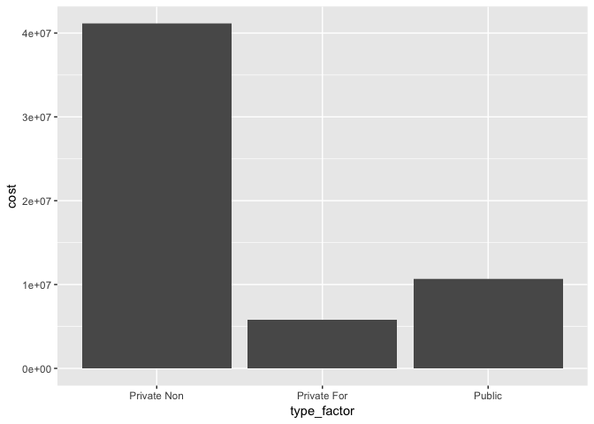
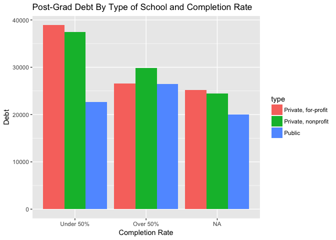

EDA Participation Assignment
================
Dana Westley
04/12/2017

``` r
library(rcfss)
data("scorecard")

summary(scorecard)
```

    ##      unitid           name              state               type          
    ##  Min.   :100654   Length:1849        Length:1849        Length:1849       
    ##  1st Qu.:155335   Class :character   Class :character   Class :character  
    ##  Median :194161   Mode  :character   Mode  :character   Mode  :character  
    ##  Mean   :211662                                                           
    ##  3rd Qu.:224545                                                           
    ##  Max.   :483124                                                           
    ##                                                                           
    ##       cost          admrate           satavg       avgfacsal     
    ##  Min.   : 7248   Min.   :  0.00   Min.   : 666   Min.   :  4914  
    ##  1st Qu.:21120   1st Qu.: 54.86   1st Qu.: 976   1st Qu.: 51736  
    ##  Median :28467   Median : 68.45   Median :1043   Median : 62100  
    ##  Mean   :31478   Mean   : 66.77   Mean   :1060   Mean   : 64400  
    ##  3rd Qu.:40628   3rd Qu.: 80.95   3rd Qu.:1122   3rd Qu.: 75285  
    ##  Max.   :62636   Max.   :100.00   Max.   :1534   Max.   :185850  
    ##  NA's   :21                       NA's   :471    NA's   :22      
    ##     pctpell          comprate         firstgen            debt      
    ##  Min.   :0.0000   Min.   :0.0000   Min.   :0.08418   Min.   : 2000  
    ##  1st Qu.:0.2790   1st Qu.:0.3889   1st Qu.:0.26627   1st Qu.:12721  
    ##  Median :0.3882   Median :0.5134   Median :0.35430   Median :15250  
    ##  Mean   :0.4137   Mean   :0.5194   Mean   :0.34728   Mean   :15793  
    ##  3rd Qu.:0.5142   3rd Qu.:0.6488   3rd Qu.:0.43018   3rd Qu.:19500  
    ##  Max.   :0.9962   Max.   :1.0000   Max.   :0.84211   Max.   :38885  
    ##  NA's   :1        NA's   :69       NA's   :124       NA's   :74

``` r
?scorecard

library(ggplot2)

sat_comprate <- ggplot(scorecard, aes(satavg, comprate)) + 
  geom_point() + 
  geom_smooth()
sat_comprate
```

    ## `geom_smooth()` using method = 'gam'

    ## Warning: Removed 479 rows containing non-finite values (stat_smooth).

    ## Warning: Removed 479 rows containing missing values (geom_point).


``` r
#histogram type of school

type <- ggplot(scorecard, aes(type)) +
  geom_bar()


price <- ggplot(scorecard, aes(cost, debt)) +
  geom_point()

price
```

    ## Warning: Removed 87 rows containing missing values (geom_point).


``` r
#factor type of school
scorecard$type_factor [scorecard$type == "Private, nonprofit"] = 1
```

    ## Warning: Unknown column 'type_factor'

``` r
scorecard$type_factor [scorecard$type == "Private, for-profit"] = 2
scorecard$type_factor [scorecard$type == "Public"] = 3
scorecard$type_factor = factor(scorecard$type_factor, levels = c(1,2,3), labels = c("Private Non", "Private For", "Public"))

cost_type <- ggplot(scorecard, aes(type_factor, cost)) +
  geom_bar(stat = "identity")
cost_type
```

    ## Warning: Removed 21 rows containing missing values (position_stack).



``` r
sat_comprate <- ggplot(scorecard, aes(satavg, comprate)) + 
  geom_point() + 
  geom_smooth()
sat_comprate
```

    ## `geom_smooth()` using method = 'gam'

    ## Warning: Removed 479 rows containing non-finite values (stat_smooth).

    ## Warning: Removed 479 rows containing missing values (geom_point).


``` r
scorecard$comp_split [scorecard$comprate <= .5] = 1
```

    ## Warning: Unknown column 'comp_split'

``` r
scorecard$comp_split [scorecard$comprate > .5] = 2
scorecard$comp_split = factor(scorecard$comp_split, levels = c(1,2), labels = c("Under 50%", "Over 50%"))

#debt by completion and type of school

plot1 <- ggplot(scorecard, aes(comp_split, debt, fill = type)) + 
  geom_bar(stat = 'identity', position = 'dodge') + 
  labs(title = "Post-Grad Debt By Type of School and Completion Rate", y = "Debt", x = "Completion Rate")

plot1
```

    ## Warning: Removed 74 rows containing missing values (geom_bar).


