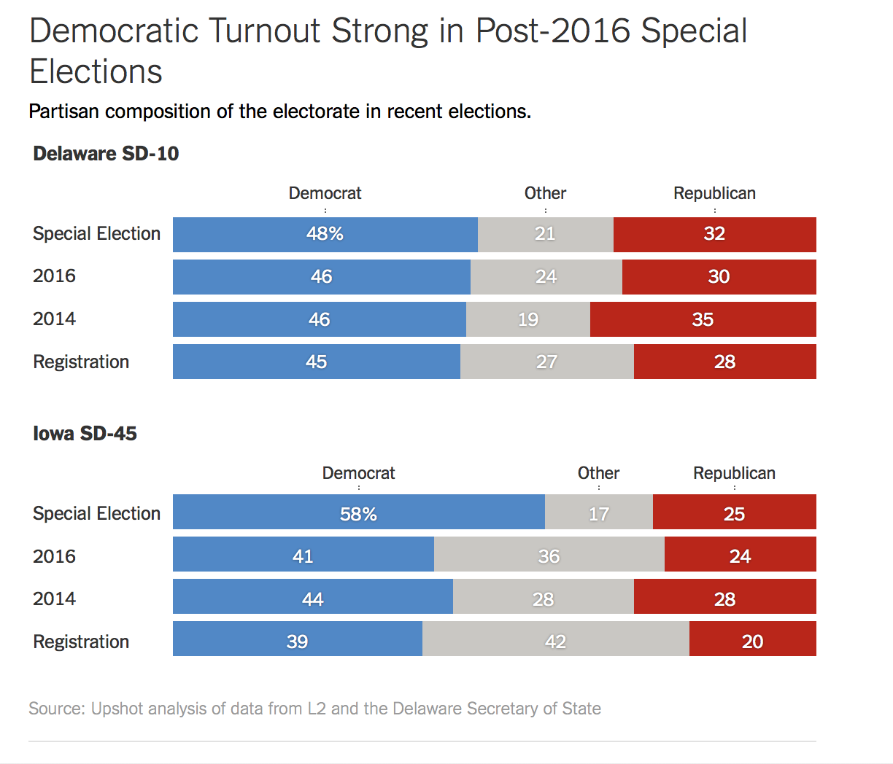

```{r, echo = FALSE}
library(tidyverse)
```


## Part 1: Visualization critique (5 points)



I selected this plot for several reasons. First, it seems similar to the visualization I created for the second part of this assignment. Secondly, I thought the topic of the visualization seems interesting. The plot tells the story about the democratic turnout after 2016 by the political party in two states Delaware and Iowa and compares the result to the total registration and the 2014 and 2016 turn out. In general, the partisan composition of the electorate was similar to the composition in 2016, and Democrats won the race. In Iowa, Democratic turnout was far higher than Republican turnout, improving the Democratic share of the electorate by 14 points since the last midterm election.

After reviewing the data sources, the Delaware Secretary of State, and the plot's x-axis and y-axis, I consider that the plot has a truthful representation of the data. Similarly, the representation of the different categories in the x-axis and y-axis and the use of channels, such as position, size, and color to encode the change in the proportion of political turn-out by party, facilitates the comparison of the effect of political party on political participation. So, I conclude that the plot is functional.

Regarding the principle of beauty, I do not consider the graph be particularly strong, in the sense of aesthetic. While the plot is simple, the colors are too intense.  To correct this, I would reduce the intensity of the colors. However, the reason for the intensity of the colors is to represent the different political parties. 

I consider the plot is insight full but not enlightening. While the functionality of the plot allows comparisons and the inference of differences across different turnouts and political parties, the information provided by the plot does not allow the discovering of pattern that go beyond an interesting fact.   


## Part 2: ggplot2 and the grammar of graphics (10 points)

  My visualization for this assignment is composed of two plots: _Feelings about Joe Biden by gender, political party, and age_ and _Feelings about Joe Biden by gender, years of education, and age_. I tried to use the command “grid.arrange” to incorporate both plots into one visualization, unfortunately, many of the commands, including “grid.arrange,” are not available yet for my R Language version (v. 3.3.3). 
  
Together, these visualizations tell the history about the distributions of feelings about Joe Biden, as it is measured by the variable _biden_, across several relevant variables such as gender, age, education levels and political party affiliation.
The first plot, _Feelings about Joe Biden by gender, political party, and age_ shows the distribution of feelings about Joe Biden distributed across gender, political party affiliation, and age. The plot demonstrates that, in general, a male of all ages tend to feel more warm toward Biden than female. A counterintuitive finding is the fact that Republicans seems to be warmer toward Biden than Democrats. This can be for two reasons. An interesting fact that needs to be explored furthers, or a recoding problem with the variable _party_. I tried to find the original code book for the original data set to determine how the variable _partyid3_ was originally coded. However, I was not able to find it, so I inferred the categories for the transformations provided: I assumed Democrats were 1, republicans 3, and any other affiliation 2. It is possible that this coding scheme is misrepresenting party affiliation.

The second plot, _Feelings about Joe Biden by gender, years of education, and age_, maps the distributions of feelings about Joe Biden distributed across gender, years of schooling, and age. In this graphs, the most interesting finding it is that across females and males of the third age, as the levels of education decrease warms feelings about Joe Biden drop. 

I decided this graphical form for several reasons. First, it was the more intuitive way that I think of for representing more than three variables in one plot. The fact that it was the only way that I can think of is most likely because the lack of experience in visualizing data. It seems to me that visualization as an art form requires practices to develop an intuitive predisposition to designing plots in the more efficient way. Secondly, since the main variable _biden_ represented a scale, I though that a bar plot could allow me to plot the distributions of feelings in a simple way to see. I tried other forms such as _geom-errorbar_, but I did not deem the results as visually efficient, and it is hard to represent other variables on that form.

  
Beyond, the transformation initially provided in the assignment, I performed several changes and added some functionality to the data that I considered necessary. Similarly, since I have decided to use a bar plot, I transformed the _biden_ measurement into an interval since bar plots do not represent well continuos variable. I also transformed other variables such as _gender_, _age_, _party_,_ years of education_ into categorical variables to facilitate plotting and labeling. I also created a theme function to make overall changes to the plots’ features such as colors, fonts, sizes, etc. 
  
As I mention before, I just starting in this field of visualization; thus my decisions regarding visualization might be biased by the lack of experience designing visualizations. However, I believe the decisions I made regarding this visualization facilitate communication for several reasons. The selection of a bar plot allowed me to code several variables (up to four) in the same plot, allowing for easy comparisons across variables. Similarly, the implementation of channels such as color, position, and size also enhances visualization of the data and comparison. 
  
Moreover, the transformation that I performed to the data allowed me to communicate all the data in a succinct fashion. For example, creating a bar plot with seventeen years of education was not going to render visually appealing plot. Similarly, plotting the ages as the were initially was going to create a plot with a long axis, axis difficult to interpret. 
  
In conclusion, I consider this to be a good visualization that honors the principles of visualization and render most of the variables in an easy to understand way. On the other hand, there is allot of improvement to be made to this chart; thus I am looking forward to seeing in class how this data is best communicated in a graph and what other ways of representing the data class peers used.


