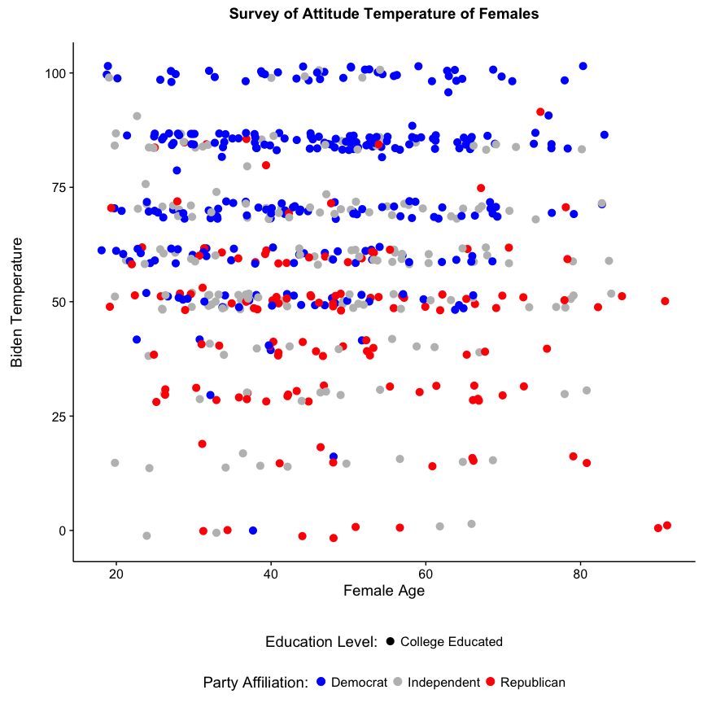
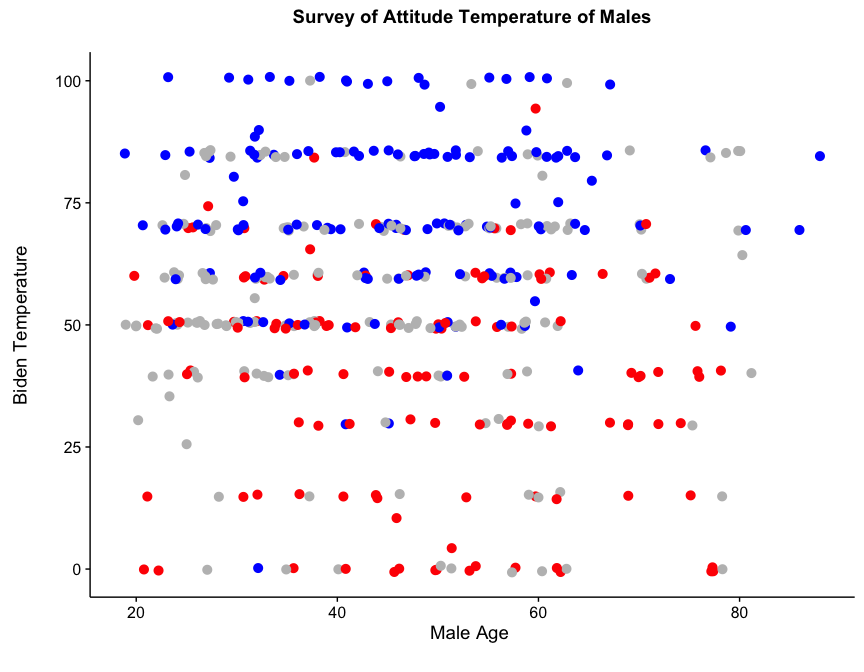

Curran\_Thomas\_HW\#1
================
April 10, 2017

Part 1: Critique of Data Visualization
======================================

The subject of my critique is the data visualization recently published in The Economists’ Daily Chart. The visualization, sourced from an academic article by Yasuyuki Aono (Osaka Prefecture University), entitled [Japan’s cherry blossoms are emerging increasingly early](http://www.economist.com/blogs/graphicdetail/2017/04/daily-chart-4), aims to capture the notion that Japan’s cherry blossom peak bloom is arriving earlier and earlier each year in Japan, and as the article’s byline states, the reason, according to experts, is because of global warming. To critique the visualization, we will use Enrico Bertini’s framework for data visualizations, as outline in Alberto Cairo’s book, The Truthful Art.

##### Is it truthful?

The visualization aims to summarize the findings of the academic paper which the data originates. The visualization is truthful in its representation of change in time from 800 CE 2016 as it shows consistent, logical intervals. In doing so, it is clear to someone observing this graph that the change in date of cherry blossom peak is becoming earlier and earlier each year. If x-axis displayed a limited window as opposed to the whole span of time (800 CE – 2016 CE) than the author would may be intentionally misleading readers into thinking the change in bloom peak is more dramatic. Furthermore, the logical of a truthful representation can be extended to the Y axis. In most cases, a small window like the one displayed on this graph’s y-axis may be problematic as it limits the scope of understanding. In the case of cherry-blossoms it mays sense to divide the window into a finite window. However, while the window of time presented on the y-axis suits the conditions of the cherry blossoms, the major grid lines are problematic. The major grid lines of the graph only display the end of the previous month, the 1st, 10th, 20th of April, and the 1st and 5th of May. The uneven spreading of major gridlines can take away from the functionality for further use. The choice of gridlines makes studying specific windows of time difficult. This is not to say that the lack of gridlines take away from the spirit of the accompanying article. As always, it is critical to investigate the source of the data in the graphic. In this case, the author of the Economist article sourced his data from a peer-reviewed scientific article. As such, we can assume that the data in this article is truthful. However, there is an implicit level of trust between the reader, journal author and The Economist journalist because as the article explains, the shown infographic is based off the charts in the actual paper, not found in the paper itself.

##### Is it functional?

The graph delivers a 1 dimensional message, and lacks any sort of functionality that encourages further exploration of the data. As previously stated, the overall impression of the graph fits the spirit of the article and headline, but would be better if it were interactive. Adding exploratory features for users such as picking a date range, or tooltip could enhance this graph greatly. Adding interactivity would greatly improve its functionality for non-academic or non-scientific use because it would allow for the end user to explore the data. However, given that the data set originates from an academic journal, the interactivity might not be necessary. As a static image, it will clearly enhance the message of the original academic article because it supports the argument being made. Furthermore, the audience of the academic journal already has (assumed) prior knowledge and that exploratory interactivity would detract from the academic article’s original intent.

##### Is it beautiful?

The visualization as laid out in The Economist certainly is beautiful. It is clear that the author intended the visualization to be eye catching to the audience. Furthermore, the aesthetic options of the visualization draw the reader in and draws the reader to the body of the article where the reader’s questions can be (hopefully) answered inside of the context of the article. Aesthetically speaking, the author of the visualization has clearly gone out of their way to match the color palette of the graph with the natural colors of the in-bloom cherry blossoms. The matching color palettes are able to convey the same sense of beauty that the trees themselves hold in real life. Additionally, the creative use of cherry blossoms as points on the graph further the beauty of this graph by explicitly linking it to the object it is conveying the importance of.

##### Is it insightful?

The Cherry-Blossom Chart is very insightful. As Cairo explains in his section on Insightfulness, data visualizations can have both “spontaneous insight” or, what Cairo calls, knowledge building insight. As the chapter further explains, scientific graphs have both. In the case of the Cherry-Blossom chart, I believe that both types of insights are satisfied. As a non-scientific consumer of the information, it is clear that the “spontaneous” insight is that the cherry blossoms are blooming earlier each year, as well as building my knowledge about cherry blossom blooming habits and patters. Furthermore, the graph provides further insight because it uses trend line to summarize the overall trend year over year, as well as show the individual occurrences.

##### Is it enlightening?

The issue of “enlightenment” when it comes to the Cherry Blossom graphic is again (like the critique of its functionality) dependent on the audience of the visualization. In the case of a non-scientific reader of the economist, I believe that graph is enlightening but could have done more to emphasize the author’s point that the cherry-blossoms are related to global warming. If the author had included a layer of global temperature changes or something else representing global warming effects, I believe that the graphic could be much more enlightening. As it stands now, the visualization only summarizes the headline of the article and fails to expand or make any real conclusions based on the scientific paper and evidence that the graphic is based on.

Part 2: Biden Survey Temperature
================================

#### Explination of Visualization:

In your written explanation, be sure to rigorously defend your design choices. This includes (but is not limited to):

-   What is the story?
-   Why did you select this graphical form?
-   Why did you use these specific channels to encode the data (e.g. spatial position, size, color, scale)?
-   Why did you make any other data transformations?
-   How do these decisions facilitate effective communication?

The visualization serves two purposes. The first purpose is to act as a foundation which encourages further and deeper analysis. Second, the visualizations seek to explore the relationships between the age and gender of the respondent as an indicator of the attitude (i.e. temperature) towards former Vice President Joe Biden. The story that this visualization is telling is that females respondents generally tend to have a higher temperature towards Biden that is agnostic of age. In other words, of the females in the survey sample, an increase in age does not appear to influence or be correlated with an increase or decrease in attitude towards Biden. Similarly, for male respondents, age does not appear to influence the respondent’s attitude towards the Vice-President. Furthermore, the party affiliation of the respondent seems to play more of a role in the attitude towards the Vice-President than age. As both graphs show, those respondents, both female and male, appear to vote along party lines, with males it appears to be stronger and females tend to have more Democrats, Independents and Republicans around the 50-point mark.

One might expect age to negatively influence the opinion of Vice-President Biden. In the visualization that would be decreasing points (blue, gray and red) as you move right on the x-axis. However, in both male and female cases, that is not the issue. Instead, we see that despite the age, people of the same education group tend to favor the vice president if they are democrats, and have a low temperature (i.e. low favorability) if they are republican. With female independent voters, more appear to favor Biden than male independent college educated voters.

I chose the scatter plot in order to emphasize the visualizations insightfulness and ability to enlighten. Scatter plots allow for a deeper level of detail than other plots in that it provides opportunities for the viewer to both infer their own ideas and ask even more probing questions. In this case, I chose to focus on the college educated respondents in both the female and male groups. This was an intentional choice because due to the number of respondents, including all levels of education (College Educated, High School Educated and below High School education) created significant amount of noise that prevent any real and impactful insights to be drawn. As such, the noise violated the spirit of exploration for which the graph was intended.

In this visualization, the channels become very important. As displayed in the visualization, The Democratic respondents are blue, the Republican respondents red and the gray respondents are gray. These colors were chosen intentionally as each of the segment’s respective colors are popularly associated with the party. This allows for quick insights into respondent’s patterns, especially when it comes to identifying patterns when it comes to age as function of a person’s attitude towards the Vice President. The shape of the dots is also important. Because the visualization is intended for exploration I have built the chart such that it can reproduced and model different factors such as levels of education. So, for example, if someone wanted to explore college educated versus high school educated respondents, the option is built into the code.

The only transformation that I made to the data was using the jitter function instead of the scatter geom. This choice was made because it represents the unique values of each respondent’s attitude towards the Vice-President and helps distinguish each point so that they are not stacked on top of each other. Furthermore, the jittered transformation does add bias to the graph, but may reduce precision but not enough to take away from any overall trends in the survey data.

These decisions effectively communicate the story in that it provides opportunities for the reader to make their own conclusions and identify their own patterns. Furthermore, these decisions allow for a great level of utility in that it is insightful and enlightening because it can help campaign officials fine tune messaging based on voter groups. By identifying age, party and education as influencers or not, there can be a more effective and efficient strategy for the vice president, directly influencing the campaign.
