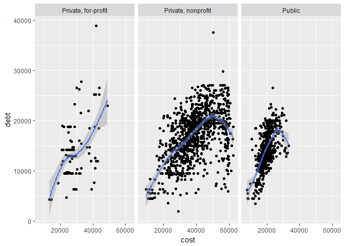
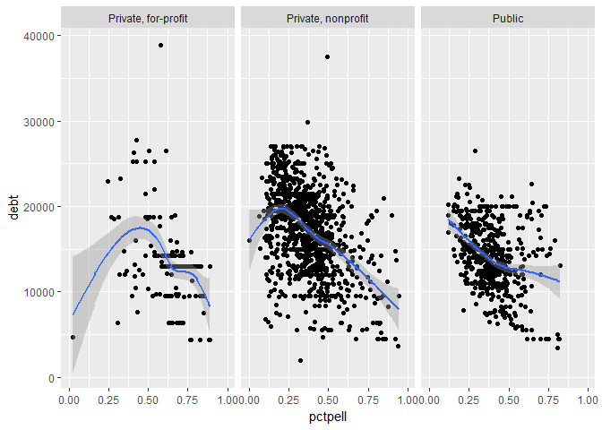
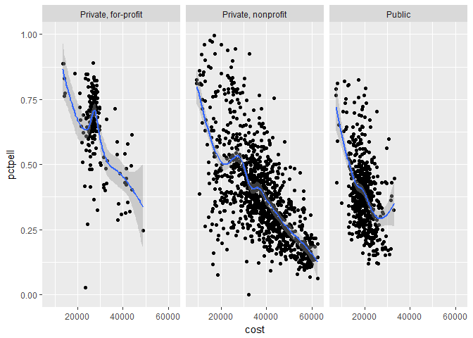
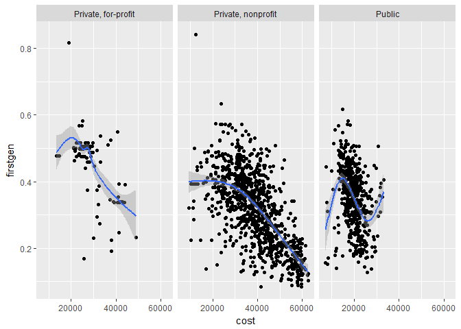
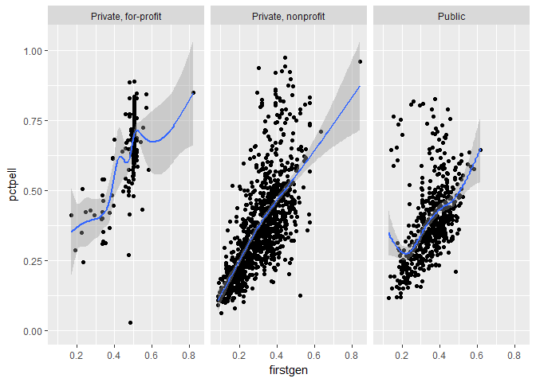
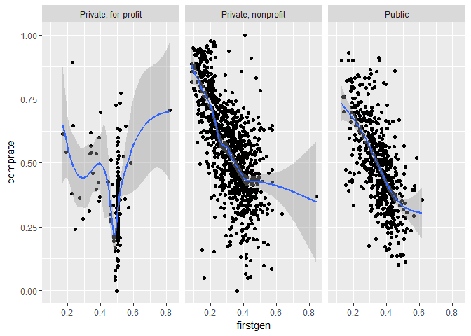
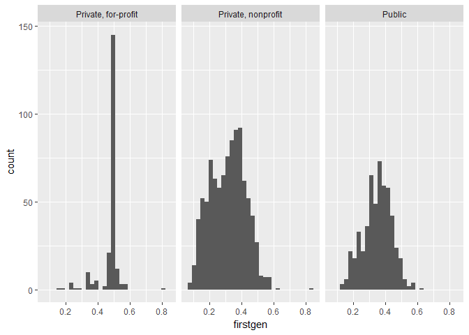
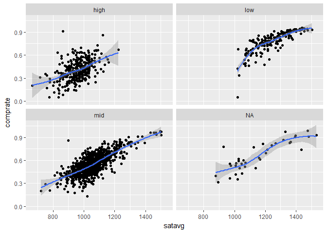

College Scorecard EDA
================
Soo Wan Kim
April 12, 2017

R Markdown
----------

This is an R Markdown document. Markdown is a simple formatting syntax for authoring HTML, PDF, and MS Word documents. For more details on using R Markdown see <http://rmarkdown.rstudio.com>.

When you click the **Knit** button a document will be generated that includes both content as well as the output of any embedded R code chunks within the document. You can embed an R code chunk like this:

``` r
#Cost vs. Debt by school type
ggplot(sc, aes(cost, debt)) + 
  geom_point() + 
  geom_smooth() + 
  facet_wrap(~type)
```

    ## `geom_smooth()` using method = 'gam'

    ## Warning: Removed 87 rows containing non-finite values (stat_smooth).

    ## Warning: Removed 87 rows containing missing values (geom_point).



It appears there is not necessarily a linear positive relationship between cost and debt after leaving school, though the relationship is fairly linear for for-profit schools. Maybe the parabolic shape for non-profit schools can be explained by grants.

``` r
#Percentage of undergraduates who receive a Pell grant vs. debt by school type
ggplot(sc, aes(pctpell, debt)) + 
  geom_point() + 
  geom_smooth() + 
  facet_wrap(~type)
```

    ## `geom_smooth()` using method = 'gam'

    ## Warning: Removed 75 rows containing non-finite values (stat_smooth).

    ## Warning: Removed 75 rows containing missing values (geom_point).



``` r
#Cost vs. percentage of undergraduates who receive a Pell grant by school type
ggplot(sc, aes(cost, pctpell)) + 
  geom_point() + 
  geom_smooth() + 
  facet_wrap(~type)
```

    ## `geom_smooth()` using method = 'gam'

    ## Warning: Removed 21 rows containing non-finite values (stat_smooth).

    ## Warning: Removed 21 rows containing missing values (geom_point).



Indeed, debt tends to go down as the percentage of students getting a Pell grant increases. Also, cost is negatively associated with percentage of Pell grantees, suggesting that students at more expensive schools tend to come from wealthier backgrounds and have lower debts even without subsidies.

Lets look at the relationship between school expenses and the share of first-generation students. I expect that first-generation students will tend to come from less wealthy backgrounds and attend less expensive schools.

``` r
#Cost vs. share of first-generation students by school type
ggplot(sc, aes(cost, firstgen)) + 
  geom_point() + 
  geom_smooth() + 
  facet_wrap(~type)
```

    ## `geom_smooth()` using method = 'gam'

    ## Warning: Removed 136 rows containing non-finite values (stat_smooth).

    ## Warning: Removed 136 rows containing missing values (geom_point).



The share of first-generation students tends to go down as cost increases, appearing to confirm my hypothesis.

``` r
#Share of first-generation students vs. percentage of undergraduates who receive a Pell grant by school type
ggplot(sc, aes(firstgen, pctpell)) + 
  geom_point() + 
  geom_smooth() + 
  facet_wrap(~type)
```

    ## `geom_smooth()` using method = 'gam'

    ## Warning: Removed 125 rows containing non-finite values (stat_smooth).

    ## Warning: Removed 125 rows containing missing values (geom_point).



The share of Pell grantees goes up as the share of first-generation students increases, suggesting that first generation students get a large share of the grants.

``` r
#Share of first-generation students vs. completion rate by school type
ggplot(sc, aes(firstgen, comprate)) + 
  geom_point() + 
  geom_smooth() + 
  facet_wrap(~type)
```

    ## `geom_smooth()` using method = 'gam'

    ## Warning: Removed 185 rows containing non-finite values (stat_smooth).

    ## Warning: Removed 185 rows containing missing values (geom_point).



Unfortunately the completion rate tends to go down as the share of first-generation students increases, suggesting possibly that first-generation students struggle more in college more than non-first-generation peers.

``` r
ggplot(sc, aes(firstgen)) + 
  geom_histogram() + 
  facet_wrap(~type)
```

    ## `stat_bin()` using `bins = 30`. Pick better value with `binwidth`.

    ## Warning: Removed 124 rows containing non-finite values (stat_bin).



Creating new categorical variable for share of first-generation students...

``` r
sc <- sc %>%
  mutate(fgen = NA) %>%
  transform(fgen = ifelse(firstgen <=0.2, "low", ifelse(firstgen <= 0.4, "mid", "high")))
```

``` r
ggplot(sc, aes(satavg, comprate)) + 
  geom_point() + 
  geom_smooth() + 
  facet_wrap(~fgen)
```

    ## `geom_smooth()` using method = 'loess'

    ## Warning: Removed 479 rows containing non-finite values (stat_smooth).

    ## Warning: Removed 479 rows containing missing values (geom_point).


