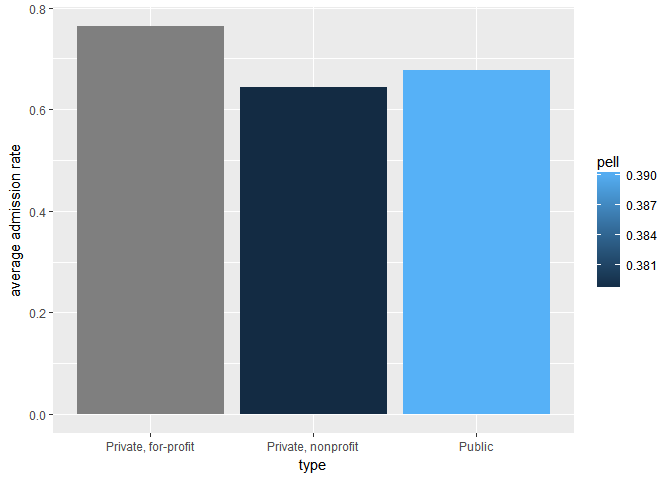
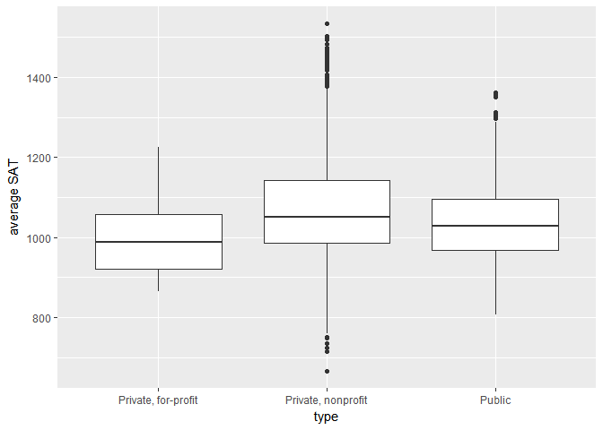
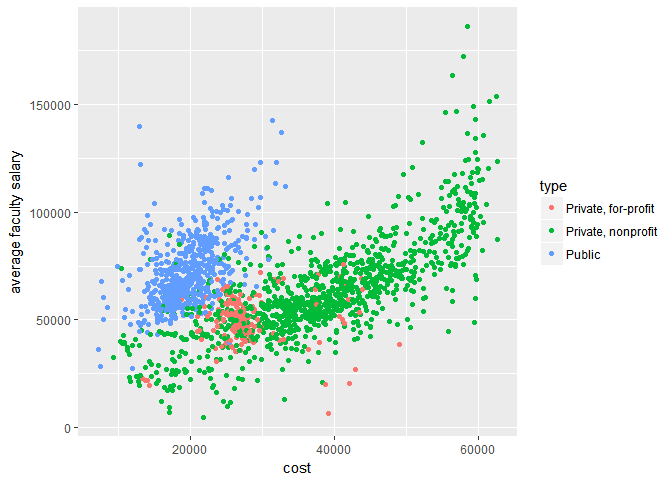

EDA Practice
================
Longxuan Wang
April 12, 2017

Get Data
--------

``` r
data(scorecard)
```

admission rate by school type
-----------------------------



SAT by school type
------------------

    ## Warning: Removed 471 rows containing non-finite values (stat_boxplot).



Cost and faculty salary
-----------------------

    ## Warning: Removed 42 rows containing missing values (geom_point).



Cost and debt
-------------

    ## Warning: Removed 87 rows containing missing values (geom_point).


