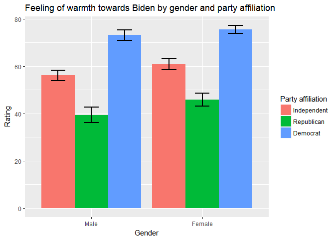

Biden
================
Longxuan Wang
April 9, 2017

Visualization
-------------

``` r
biden <- read_csv("C:/Users/Longxuan/Downloads/Git HW/dataviz/assignments/data/biden.csv")
```

    ## Parsed with column specification:
    ## cols(
    ##   biden = col_integer(),
    ##   female = col_integer(),
    ##   age = col_integer(),
    ##   educ = col_integer(),
    ##   dem = col_integer(),
    ##   rep = col_integer()
    ## )

``` r
biden%>%
  mutate(party=dem*2+rep)%>%
  ggplot(aes(x=as.factor(female), y=biden, fill=as.factor(party)))+
  geom_bar(stat = "summary", fun.y = "mean", position = position_dodge())+
  scale_x_discrete(breaks=c(0,1), labels=c("Male", "Female"))+
  scale_fill_discrete("Party affiliation",breaks=c(0,1,2), labels=c("Independent", "Republican", "Democrat"))+
  xlab("Gender")+
  ylab("Rating")+
  ggtitle("Feeling of warmth towards Biden by gender and party affiliation")
```



Explanation
-----------
