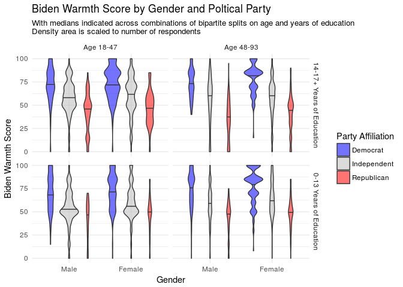

Data Visualization Assignment 1
================
Julian McClellan
Due 4/10/17

Part 1: Visualization critique (5 points)
=========================================

I will be critiquing the visualization below from the subreddit /r/changemyview:

This visualization originally appeared in the submission titled: [\[OC\] Heatmap of the most pixels changes happend on r/place](https://www.reddit.com/r/dataisbeautiful/comments/63kuy6/oc_heatmap_of_the_most_pixels_changes_happend_on/?utm_content=title&utm_medium=hot&utm_source=reddit&utm_name=dataisbeautiful).

For those who aren"t familiar, /r/place displayed a 1000x1000 pixel canvas where individual Reddit accounts (made before 3/31/17) could change the color of one pixel to one of 16 colors every 10 minutes. Changes were allowed for 72 hours and then halted. More information is available [here](http://knowyourmeme.com/memes/events/rplace).

Truthful
--------

The truthfullness of this visualization is somewhat difficult to verify independently or quickly From the OP:

> I"ve used python with pandas to create heatmap via matplotlib, using crawled data from r/PlaceDevs"

The OP doesn"t provide the raw data, and while presumably one can also scrape the information from r/PlaceDevs with some scrapers people in the community have made, one can hack together a rough verification by viewing [a timelapse of /r/place](https://youtu.be/jWzjyL4yAe4). Looking at this video, there doesn"t seem to be any aggregious area where high or low pixel change activity has been hidden in the original heatmap.

Functional
----------

As one can glean from the title of the post, the visuzalization is simply trying to show where the most pixel changes occurred over the 72 hour creation period. On an intuitive level at least, it accomplishes this, as one can quickly identify areas of "high chage" (white, orange) and "low(er) change" (dark red, black).

However, in other respects, this visualization is less functional. While color serves to differentiate pixel change, a legend mapping color to the exact level of change is never revealed.

In my opinion, failing to communicate the quantity of change in the heatmap is the visualization"s biggest flaw. One might argue that the choice of time period for the change metric is arbitrary, and thus uncessary in the first place. However, given the collaborative nature of /r/place, and that a single Redditor could only change one pixel every 10 minutes, a measure of pixel change: "average changes every 10 minutes" can communicate the average level of change during the downtime of any lone Redditor.

Further functionality could also be added to a legend by marking the specific color that defines the canvas wide level of change, giving the viewer notions of above and below average levels of pixel change.

Beautiful
---------

If I were back in my Art 101 class, I would argue that this data visualization is beautiful. The very fact that high levels of pixel change are uniquely clustered introduces a nice contrast of negative (black) and positive (red to white) space. This visaulization has a more aesthetically pleasing level of contrast (and color pallete) than the one [this Redditor made.](https://i.imgur.com/4awiJnV.png)

Additionally, the visualization"s lack of legend and labelling in general seems to be in line with a sort of minimalism trend that is present on many original submissions in /r/changemyview.

According to one Redditor, the visualization also hits upon a "Matrix" vibe, prompting the creation of:

 So then, the visualization seems to compare to other similar visualizations and inspires alteration. For my purposes, it is beautiful.

Insightful
----------

The visualization does not seem to be drawing attention to any particular area, so it seems to be devoid of any "a-ha" insights.

Even so, a measured inspection of the visualization shows us a number of areas in the canvas have identifiable designs and high numbers of pixel change, indicating that these designs had to contend with a degree of vandalism. (If the designs each other one would expect individual deisngs to be less identifiable/obfuscated with other designs.)

In particular, a viwer might notice that the American Flag (center) and the hammer and sickle (center-left) were both subject to high levels of pixel change from this heatmap.

So then, the visualization does offer some insight into "controversial" designs of sorts, but there are many more areas of the canvas in which it is difficult or impossible to identify the design. One could watch the [timelapse](https://youtu.be/jWzjyL4yAe4) that was mentioned earlier, but the visualization could also be overlayed with the final (cleaned) /r/place canvas to offer more insight to a reader.

With this addition, the visualization still offers the controversial designs insight, but one can now see that in many cases, designs that featured faces of some sort, had high levels of pixel change around the eyes and mouth. Other country flags besides the U.S. also seem to be areas subject to high levels of pixel change activity.

Enlightening
------------

The visualization does some *good* with the data. It doesn"t necessarily do any offer viewers any social insight, but it offers an enlightening look into the process of collaborative art.

/r/place did not invent collaborative art or digital collaborative art, but unlike most collaborative art /r/place features both collaboration *and* competition where Redditors can both create and/or destroy. I would think that most viewers can internalize the notion of collobaration in a work of art, but a simultaneously competitive and collaborative process might be more alien.

By mapping levels of pixel change to color the visualization offers a one image summary of the opposed creative and destructive processes that took place during the creation of the canvas. It offers obvious patterns and cryptic ones that entice viewers to investigate the final canvas, and the process by which it was created.

Part 2: `ggplot2` and the grammar of graphics (10 points)
=========================================================

Design
------

The file `biden.csv` contains 6 variables concerning political party affiliation, gender, age, years of education, and of course, attitude towards Joe Biden. Any story contained in the data pertains to:

-   Who are the distinct groups of people in the data?
-   How many people are in these groups?
-   How do these groups of people feel toward Joe Biden?

### Distinct groups of comparison

The ideal starting point for grouping is the categorical variables, as individual respondents can fall into the finite number of combinations of these variables.

Intuitively speaking, `biden.csv` contains two categorical variables: gender, and party affiliation, but mechanically, they are coded across three separate binary variables: `female`, `dem`, and `rep`. With the latter two binary variables I construct a single variable `party` that took either `"dem"`, `"rep"`, or `"ind"` as values.

The visualization sacrifices the ability to make "pure" comparisons across the values of a single categorical variable with all of the data split on it. Instead opting for the ability to compare across the 6 unique combinations of gender and party affiliation. The visualization indicates the 3 party affiliations with colors. Any reader with some level of familiariaty with American politics will find them quite familiar. These 3 differently colored shapes of comparison are grouped horizontally, once for males, and again (to the right) for females.

However `biden.csv` still has `age` and `educ`, the age of the respondendent and their years of education. While only containing discrete values, both have enough unique values that they are effectively continuous. However, they must not monopolize the x and y dimensions. The x dimension already serves to help distinguish gender, and given the effectively continuous nature of `biden`, one of our variables of comparison, it would be prudent for it to utilize the x or y axis as well. Thus, I transform `age` and `educ` into two partitions split on their respective means in the overall data. There are four different facets in 2x2 fashion, with the left (right) facets corresponding to age ranges below (above) the mean, and the bottom (top) facets corresponding to years of education below (above) the mean.

### The variables of comparison

As stated previously, the story of the data concerns how different groups feel towards Joe Biden, and how many respondents comprise these different groups. The shape used to communicate these two variables of comparison is a violin plot, with the area of the violin plot scaled to the number of respondents it accounts for.

Utilizing a violin plot allows us to provide a smooth distribution of `biden` scores for comparison. A look at the actual data shows us that a lot of these values are multiples of ten and/or 5. (Most people do not have discerning 0-100 ratings of their feelings towards Joe Biden.) Sure, the violin plot has smoothing parameters that can be tuned, and in the same vein, smoothing is not the "purest" representation of the raw data, but smoothed distributions are more aesthetically pleasing shapes to compare, and I have chosen a smoothing window that I believe makes the best tradeoff between apperance and faithful representation.

The violin plots are oriented vertically, with the y-axis of each facet corresponding only to the `biden` variable. Thus, within each of the 4 combinations of old/young and less/more education, one can make a side-by-side comparison of `biden` distributions between parties within that gender and between that gender.

The age facets can also be easily compared, as their violin plots line up horizontally. The median of each violin plot is marked in black and accentuated for easy viewing by a lowered alpha value on party affiliation colors. The medians provide an expedited means of comparison horizontally, but also faciliate comparisons across different education facets. By leaving in the tick lines for `biden`, differing education facets can still be compared by using the ticks as a reference, though the comparing vertically is arguably more involved than horizontally. Of course, the faceting could have limited to a 1x4 shape, but such a form would take away the intuitive tie this visualization has between each facet dimensions and the `age` and `educ` variables. Indeed, there's hardly any intuition across 2 faceted variables with only one dimension of faceting.

### Making comparisons

I previously asserted that the ability to make "pure" comparisons was sacrificed, and while this is true, that ability is not *completely* erradicated. Attempting to compare the different party affiliations for the whole dataset is possible, but the design of the visualization forces the viewer to utilize the interaction between party affiliation across gender, age, and education first. One might be able to conclude that there are fewer Republicans than any other party affiliation, and that all Republicans give Biden a lower median score. But this would require confirming that fact by generalizing comparisons between the 8 red violin plots against 16 other violin plots in the visualization, this is certainly much more difficult than if one wanted to compare Biden scores among Republican females ages 18-47 (just look at two plots).

Thus, the visualization's design encourages more specific comparisons of `biden` score and number of respondents between specific groups. Indeed, every variable included within `biden.csv` is explicitly represented in the visualization, though some depth of information has been compromised to include the variables in the first place. There is also specific group size, which is not explicitly coded, but its inclusion helps give convey to the viewer that this survey does not represent groups, or even values of all the categorical variables, equally.
