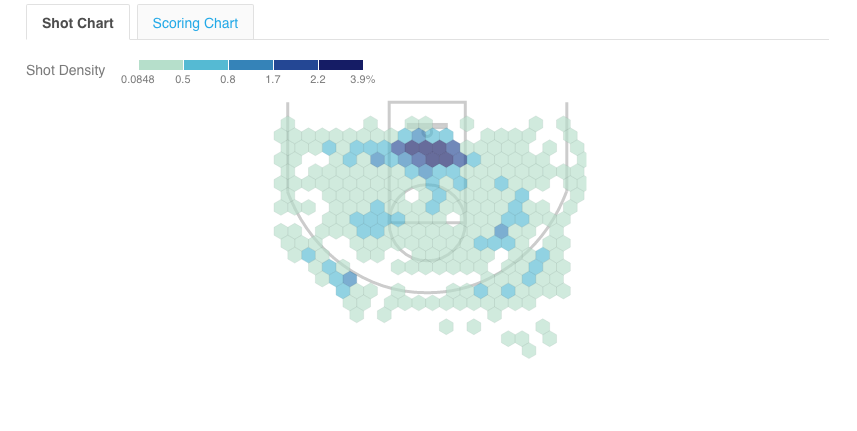

```{r setup, include=FALSE}
knitr::opts_chunk$set(echo = TRUE)
```

## Visualization Critique



Plotted above is the a spatial representation of Jimmy Butler's 2016-2017 shot density (as of Apr 8, 2017).  The visualizaiton is actually [an interactive one](http://basketball-players.pointafter.com/l/379/Jimmy-Butler#Shot%20Chart&s=33AFDV) from PointAfter by Graphiq, a software company that combines aesthetics and engineering to create beautiful, minimalistic graphics.   Graphiq uses their data not only to power their own [research sites](https://www.graphiq.com/researcher-solutions), but also to design visualizations for third-parties, such as [Time, The Huffington Post, AOL., Market Watch, and Sports Illustrated](https://www.graphiq.com/enterprise-solutions), which they boast has led to ["40% increase in time on page"](https://www.graphiq.com/enterprise-solutions) with their content.  (While their data on this doesn't appear to be open source, admittedly, I came to know of the company because one of their graphics was incorporated in an CNN article online that I was reading.  As the article was on Federal Reserve rates and hikes, incorporation of visualizations is not surprising - but I've found that graphs dealing with economic data tend to render data in ways that are less appealing, comprehensible, and consummable to the layman than simple text interpretations.  However, the beauty and the clarity of Graphiq's plot was attractive and immediately drew my attention to the information they were presenting.)  

### Is it truthful?

> "The more adequately a model fits whatever it stands for without being needlessly complex, and the easier it is for its intended audience to interpret it correctly, the better it will be." *TA, Cairo*

I love this interactive chart (and most of Graphiq's work) because it accomplishes Cairo's first requisite - eradicating needless complexity - flawlessly.  There is one variable - court coordinates for each shot (used to create density) - for one player (in this case, Jimmmy Butler).  Because the intended audience is probably those with some sports background and knowledge, the chart also meets the second objective in being truthful - that is, that Butler's highest shot density this year is in close proximity to the net.  

### Is it functional?

Shading/saturation is high on "enabling general estimates" in Cleveland and McGill's *Scale of elementary perceptual tasks*, which is highly appropriate for the story PointAfter is conveying with this graphic.  The viewer is able to make judgments about a player's tendency to take and/or make shots in certain locations on the court - very few individuals are  interested in the player's exact shot or scoring density at exact locations on the court because basketball is a highly fluid game and highly dependent on the distribution of player's *in that exact play*.  Thus, a statistician, coach, or fan is more interested in Jimmy Butler's scoring or shot density outside the paint vs. in the paint, in the left field vs. right field, etc.  
  
Furthermore, the interactive component allows users to explore the data themselves and discover relationships between a variety of different spatial positions and Butler's likelihood to take a shot, as well as certain spatial positions and Butler's likelihood to make a shot this season.  

### Is it beautiful?

> "Beauty is, thus, not a thing, or a property of objects, but a measure of the emotional experience of awe, wonder, pleasure, or mere surprise that those objects may unleash." *TA, Cairo*

The combination of awe, wonder, pleasure, and surprise I felt at the first sight of Graphiq's work can't be verbalized (though I'll attempt).  The minimalism of the design of this graph in particular is breathtaking; its color scheme is pertinent and useful; the design and interaction, sleek.  The plot was synthesized equally from data and aesthetics; aesthetics weren't taken into account after the fact, but, rather, incorporated in the construction process.  

### Is it insightful?

Highly.  The viewer can quickly glean where Butler tends to take most of his shots this season, *and* where he tends to score.  A criticism is that in reducing the amount of data the viewer has to take in, the chart also reduces the accuracy of its predictions.  Adding the type of shots that Butler takes and makes to the text appearing in the interactive component would not be difficult (see this LA Times [interactive graph on Kobe Bryant's shots](http://graphics.latimes.com/kobe-every-shot-ever/), which allows the viewer to filter according to type of shot), and would impart further insights on his shooting strengths and weaknesses.  

### Is it enlightening?

While I love the simplicity of the graph, which enhances its beauty and functionality (or clarity), I think it's less enlightening than other shot charts (which could, fortunately, be easily amended).   For example, consider [Steph Curry's shot chart by Schneider.](http://toddwschneider.com/posts/ballr-interactive-nba-shot-charts-with-r-and-shiny/)  
   
The chart is highly enlightening to any viewer, regardless of their prior knowledge concerning basketball.  It conveys the impressiveness of Steph Curry's three-pointer pattern - when compared to the league for that season, he's making up to *10% above average for most of the positions outside the paint*.   

Or, take, [Ray Allen's shot chart by Goldsberry](https://www.wired.com/2014/10/faster-higher-stronger/).  
  
"Potency" is an intra-player comparison.  Thus, it, in essence, measures the likelihood for Ray Allen to make a shot from that position on the court, given the position and result of all his previous shots.  (Ray Allen is a likely Hall of Famer.)  One can see that Ray Allen's three-pointers on the left and right fields, one of the weakest positions from which to shoot, even for "three-pointer" players, are highly potent - that is, he is highly likely to make these shots when he takes them.  This information is not only enlightening for fans, but useful for players on opposing teams - using this info, the defense could attempt to move high-ranking players out of their most potent positions and (hopefully) reduce their likelihood of scoring.
