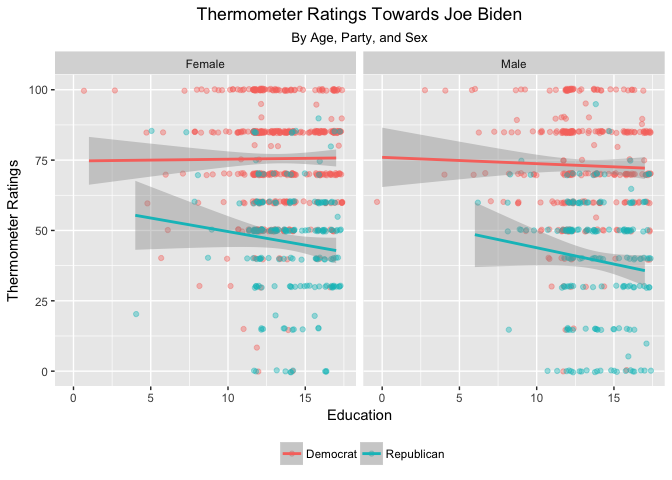

Part 2
================
Nicole Sullivan
4/10/2017

``` r
library(tidyverse)
biden <- read_csv("biden.csv")
```

`ggplot2` and the grammar of graphics
-------------------------------------

``` r
#Tidy data
biden_tidy <- biden %>%
  gather(dem, rep, key = "Party", value = "Value") %>%
  filter(Value != 0) %>%
  select(-Value) %>%
  mutate(female = as.factor(female)) %>%
  mutate(female = ifelse(female == 0, "Male", "Female")) %>%
  rename(Sex = female) %>%
  mutate(Party = ifelse(Party == "dem", "Democrat", "Republican"))

#Plot data
ggplot(biden_tidy, aes(educ, biden, color = Party)) +
  geom_point(position = "jitter", alpha = 0.4) +
  geom_smooth(method = lm) +
  facet_wrap(~Sex) +
labs(title = "Thermometer Ratings Towards Joe Biden",
       subtitle = "By Age, Party, and Sex",
       x = "Education",
       y = "Thermometer Ratings",
       color = "") +
  theme(plot.title = element_text(hjust = 0.5),
        plot.subtitle = element_text(hjust = 0.5),
        legend.position = "bottom")
```



*What does the graph say?*

The plot above shows that party mainly drives thermometer ratings of Joe Biden. Despite differences in education and sex, those who identify as the same party association as Joe Biden tend to feel more warmly towards him than do those with a Republican association. It is intuitive that most individuals who identify strongly with a certain party are likely to regard those with a different association as "opponents" and thus with less warmth than that politician's own constituents might regard him/her. More intriguingly, however, the linear models fitted to the data show that, while, Democrats tend to rate Biden the same regardless of education or sex, Republicans' attitudes toward Biden *become colder with an increase in education*. While the bipartisanship in the U.S. is quite pervasive and highly divisive, especially for those who most strongly identify with one party or another, this does not explain a *downward trend* in Republican regard for a Democratic politician with increasing education. However, if one examines the graph closely, it is a possible to see a slight dip in regard for Biden from Democratic males as education increases. While probably non-significant because party predominantly drives regard, not education, it is interesting that the trend is being mirrored, albeit very slightly, in Biden’s own party’s male’s ratings. Could this be a result of general opinion that [Biden is an uncomplicated man](https://www.google.com/search?q=biden+memes&safe=active&espv=2&source=lnms&tbm=isch&sa=X&ved=0ahUKEwiV1fmbmZrTAhXq7IMKHdz3B_UQ_AUIBigB&biw=1135&bih=578#imgrc=_)?

The implications for the system are also intriguing (if one will tolerate a little conjecture). If an increase in education in Republicans is associated with a lower regard for the Democratic Party, this likewise probably leads to lesser willingness to cooperate with Democrats. Lawmakers tend to have more education than the average citizen - *but* lawmakers are also supposed to work to compromise with one another, in order for the party in power to represent the interests of *all*, and not merely some, of the population. However, as regard degenerates and the divide in regard widens with education, what is the likelihood of parties compromising? What happens if the party in power holds the opposite party, those without power, in such low regard that they no longer compromise at all, but instead push through legislation that benefits only their own interests? (I know, I'm using such subtlety.)

*Why this graph?*

I eventually chose this story – differences in ratings of Biden based on education, party, and sex - because it seemed the most enlightening of all stories that could be told using this data. I originally began with a boxplot showing the differences in means based on party and sex, but this was not enlightening or insightful at all. The story it told was one that every American already knew – Republicans don’t feel as warmly towards a Democratic politician as Democrats do. The mean of female ratings also tended to be higher than the mean of male ratings. This is also intuitive – females tend to feel more warmly towards males. I won’t go through all my explorations of the data, but in the end, I settled on this because the downward trend of Republicans regard with increasing education was something that one might not guess simply from experiential intuition.

In order to show the trend, I used trend lines, as this is provides a clear summary of what happens to Biden’s ratings as education increases, depending on sex and party. While the confidence intervals are somewhat ugly, I wanted to show that the confidence of our estimates for those with more than 10 years of education is pretty high. I also wanted to visualize the underlying distribution of the data, so I encoded these as points, and I jittered them because I was more interested in conveying an overall sense of where points would lay for an individual of a certain party/sex/education (hence the “distribution” of points) rather than the actual raw data (i.e. I was less interested in accuracy of each point than I was interested in accuracy of the overall distribution). Because I didn’t want the points to obscure the trend line, or clumps to aesthetically detract or distract from the experience, I increases their transparency. I used color to encode parties because, as there are only two parties, color makes it easy to discriminate one party from the other on a single graph and thus enables the viewer to compare their distributions. I left the default colors because I thought it was nice that the color scheme was red, white, and blue (cheesy, I know). Additionally, ggplot2 automatically chooses colors based on their distance from each other on the color wheel, and the number of colors being used, so the default colors are often the easiest to distinguish from one another and most aesthetically pleasing.
