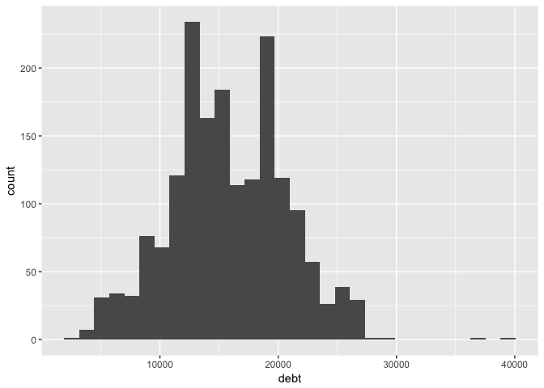
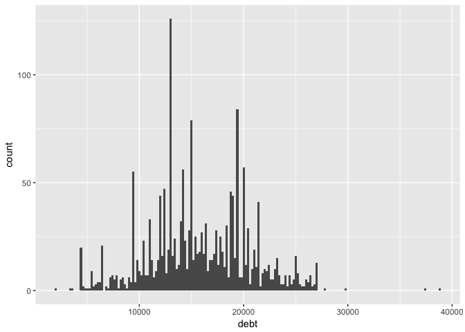
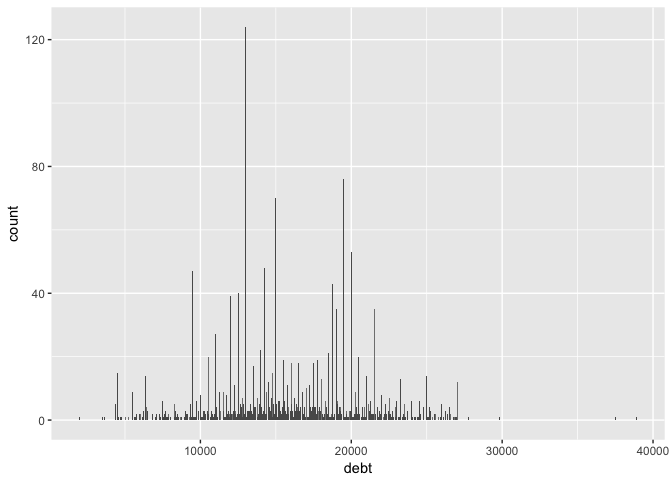
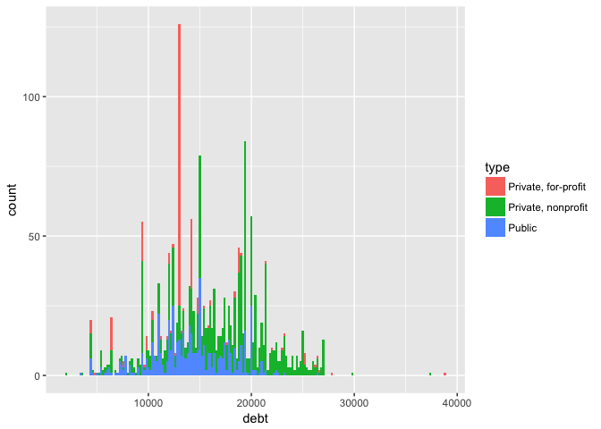
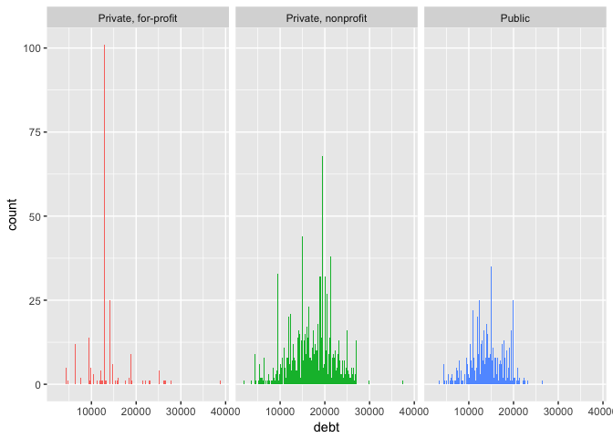
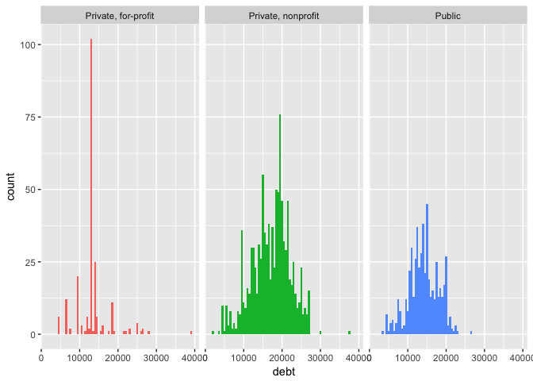
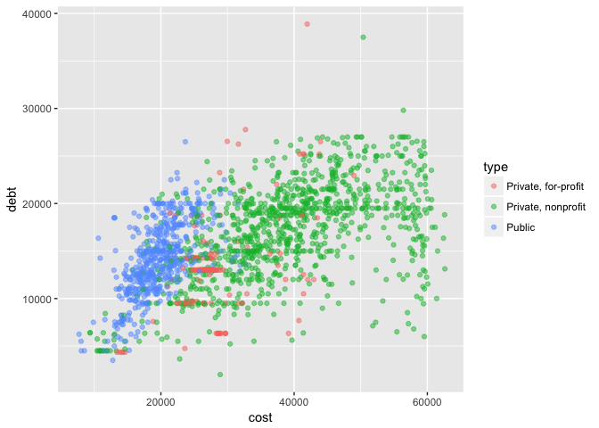
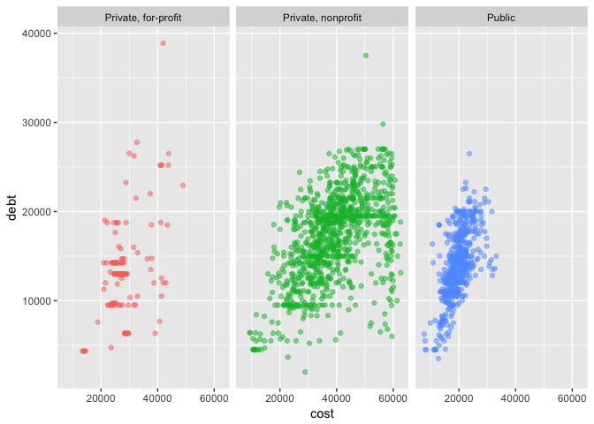
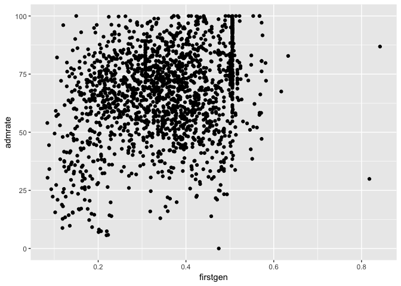
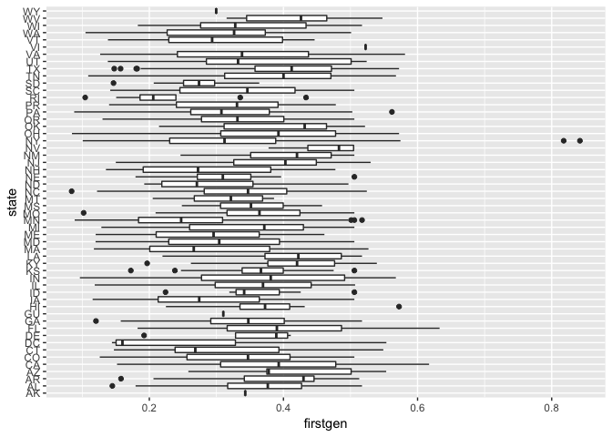

EDA
================
Nicole Sullivan
4/12/2017

``` r
library(rcfss)
library(tidyverse)

View(scorecard)

#Default distribution
ggplot(scorecard, aes(debt)) +
  geom_histogram()
```



Looks normal!

``` r
ggplot(scorecard, aes(debt)) +
  geom_histogram(binwidth = 200)
```



Using $200 as binwidth (about the average monthly payment), distribution is much flatter.

``` r
ggplot(scorecard, aes(debt)) +
  geom_histogram(binwidth = 50)
```



Plotting every 50 dollars gives about the same distribution as 100 dollars, but the lines are more difficult to distinguish now. So the distribution for every 200 tells about the same story.

``` r
ggplot(scorecard, aes(debt, fill = type)) +
  geom_histogram(binwidth = 200)
```



Using color to encode type of schools makes it difficult to see if distribution is affect by type. Increase binwidth or facet?

``` r
ggplot(scorecard, aes(debt, fill = type)) +
  geom_histogram(binwidth = 200) +
  facet_wrap(~type) +
  theme(legend.position = "none")
```



Ok, maybe change the binwidth as well.

``` r
ggplot(scorecard, aes(debt, fill = type)) +
  geom_histogram(binwidth = 500) +
  facet_wrap(~type) +
  theme(legend.position = "none")
```

 There we go. Distributions are pretty normal for all three. Interestingly, distribution of "Private, for-profit" schools seems clustered below the medians of "Private, non-profit schools".

What if we look at how much debt students leave these type of schools with, vs. the cost of the school (minus scholarships/grants)?

``` r
ggplot(scorecard, aes(cost, debt, color = type)) +
  geom_point(alpha = 0.5)
```



There are too many points. Let's facet.

``` r
ggplot(scorecard, aes(cost, debt, color = type)) +
  geom_point(alpha = 0.5) +
  facet_wrap(~type) +
  theme(legend.position = "none")
```



Trend appears much steeper for Public schools than Private, non-profit. This means that the debt:cost ratio for students leaving public schools is way larger than for those leaving Private, non-profit schools. Interesting. There's not a lot of data for private for-profit so I won't focus on that too much. Subset analyses?

``` r
private_nonprof <- scorecard %>%
  filter(type == "Private, nonprofit")
  
pub <- scorecard %>%
  filter(type == "Public")

private_nonprofit <- lm(debt~cost, data = private_nonprof)
public <- lm(debt~cost, data = pub)

summary(private_nonprofit)
```

    ## 
    ## Call:
    ## lm(formula = debt ~ cost, data = private_nonprof)
    ## 
    ## Residuals:
    ##      Min       1Q   Median       3Q      Max 
    ## -15941.1  -2617.1    289.6   2871.5  17701.6 
    ## 
    ## Coefficients:
    ##              Estimate Std. Error t value Pr(>|t|)    
    ## (Intercept) 8.009e+03  4.802e+02   16.68   <2e-16 ***
    ## cost        2.340e-01  1.176e-02   19.89   <2e-16 ***
    ## ---
    ## Signif. codes:  0 '***' 0.001 '**' 0.01 '*' 0.05 '.' 0.1 ' ' 1
    ## 
    ## Residual standard error: 4207 on 1015 degrees of freedom
    ##   (75 observations deleted due to missingness)
    ## Multiple R-squared:  0.2806, Adjusted R-squared:  0.2799 
    ## F-statistic: 395.8 on 1 and 1015 DF,  p-value: < 2.2e-16

``` r
summary(public)
```

    ## 
    ## Call:
    ## lm(formula = debt ~ cost, data = pub)
    ## 
    ## Residuals:
    ##     Min      1Q  Median      3Q     Max 
    ## -8474.2 -2005.0  -184.7  1894.3 10014.2 
    ## 
    ## Coefficients:
    ##              Estimate Std. Error t value Pr(>|t|)    
    ## (Intercept) 2.427e+03  6.401e+02   3.792 0.000166 ***
    ## cost        5.937e-01  3.174e-02  18.706  < 2e-16 ***
    ## ---
    ## Signif. codes:  0 '***' 0.001 '**' 0.01 '*' 0.05 '.' 0.1 ' ' 1
    ## 
    ## Residual standard error: 2983 on 535 degrees of freedom
    ##   (4 observations deleted due to missingness)
    ## Multiple R-squared:  0.3954, Adjusted R-squared:  0.3943 
    ## F-statistic: 349.9 on 1 and 535 DF,  p-value: < 2.2e-16

While *β*<sub>1</sub> differs somewhat in the two different models, the *R*<sub>**<sup>2</sup></sub> is unimpressively low. Strikeout.

``` r
ggplot(scorecard, aes(firstgen, admrate)) +
  geom_point()
```



Hmm. Too much to disentangle here. What about state's firstgen proportion?

``` r
ggplot(scorecard, aes(state, firstgen)) +
  geom_boxplot() +
  coord_flip()
```



Would love to split by region/do a strip plot like Cairo. I think it'd be really interesting to delve further into this. No time!
